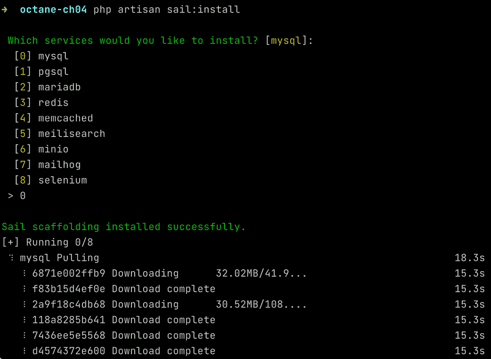
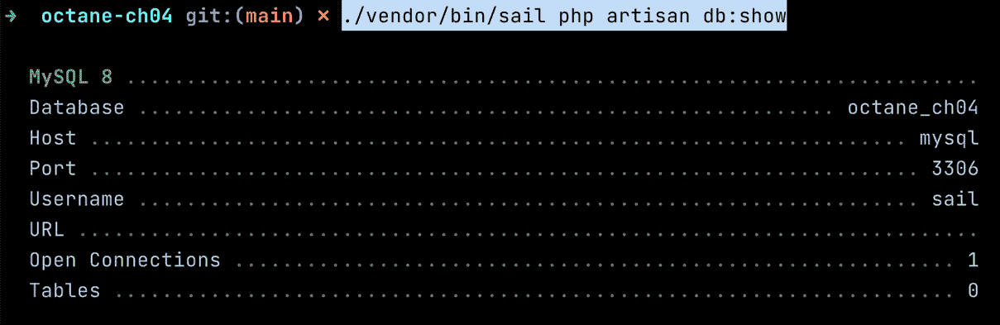
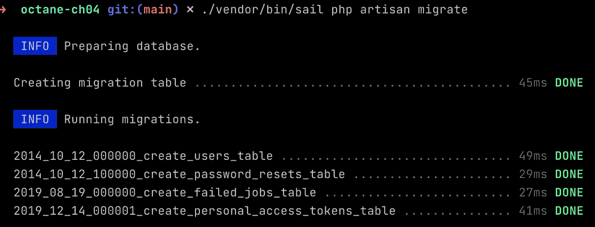
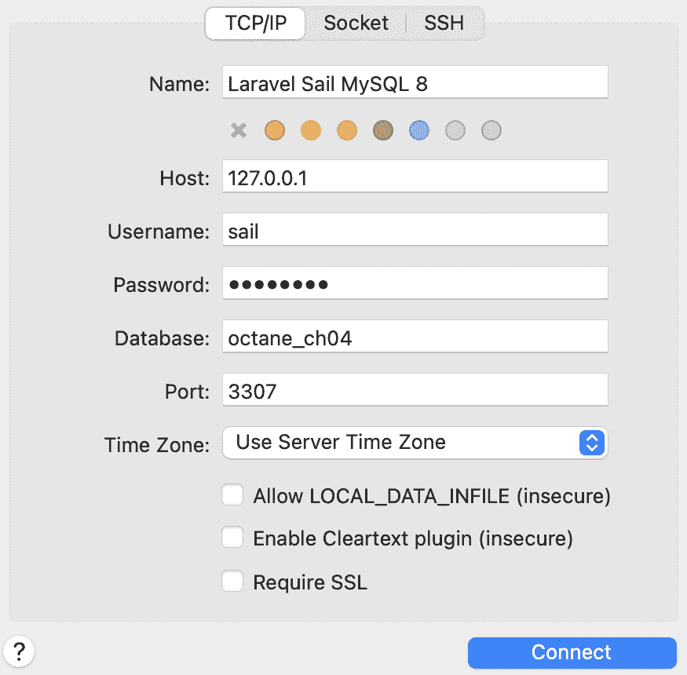
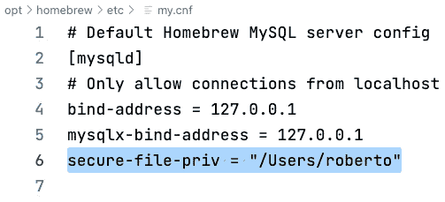
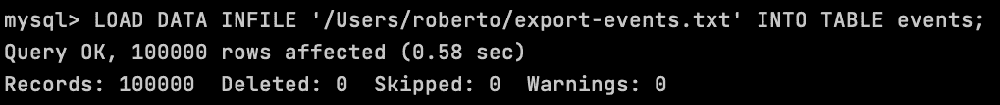
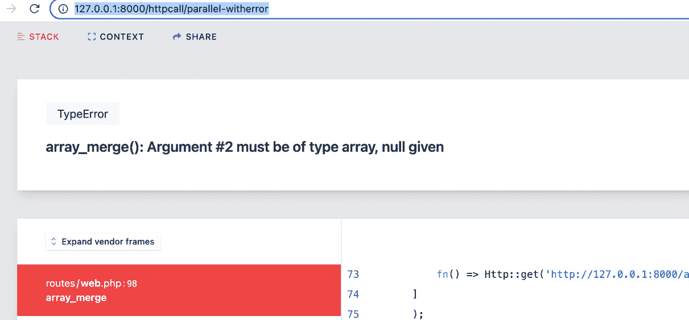

# 4

# 构建 Laravel Octane 应用程序

在前几章中，我们专注于安装、配置和使用 Laravel Octane 提供的一些功能。我们探讨了 Swoole 和 RoadRunner 这两种由 Laravel Octane 支持的应用程序服务器之间的区别。

在本章中，我们将重点关注 Laravel Octane 的每个功能，以发现其潜力并了解如何单独使用它。

本章的目标是在现实环境中分析 Laravel Octane 的功能。

为了做到这一点，我们将构建一个示例仪表板应用程序，涵盖多个方面，例如配置应用程序、创建数据库表架构以及生成初始数据。

然后，我们将继续实现仪表板交付的特定路由，并在控制器中实现数据检索逻辑以及在模型中的查询。

然后，我们将在示例仪表板应用程序中创建一个页面，我们将从多个查询中收集信息。当我们必须实现用于检索数据的查询时，通常我们关注逻辑和过滤、排序和选择数据的方法。然而，在本章中，我们将保持逻辑尽可能简单，以便您能够关注其他方面，例如通过执行并行任务来高效地加载数据，并且我们将应用一些策略以尽可能减少响应时间（并行运行任务减少了整体响应执行时间）。

在设计应用程序架构时，我们还需要考虑可能出错的事情。

在前一章的示例中，我们通过考虑所谓的**快乐路径**来分析每个功能。快乐路径是用户为了实现预期结果而采取的默认场景，不会遇到任何错误。

在设计真实应用程序时，我们还必须考虑那些不包括在快乐路径中的所有情况。例如，在并发执行重查询的情况下，我们需要考虑执行可能返回意外结果的情况，例如空结果集，或者当查询执行引发异常时。我们需要考虑这个单个异常也可能对其他并发执行产生影响。这看起来更像是一个更真实的生活场景（由于某些异常而可能出错），在本章中，我们还将尝试管理错误。

因此，我们将尝试模拟一个典型的数据消耗型应用程序，其中用户的请求响应控制器必须尽可能快地执行操作，即使在面对高请求负载的情况下。

本章的主要目标是指导您通过使用多个查询、在渲染仪表板页面时的并发执行以及尝试在应用程序中应用 Octane 功能来大幅减少应用程序的响应时间。我们将逐步介绍路由、控制器、模型、查询、迁移、填充和视图模板。我们将涉及 Octane 提供的一些机制，例如 Octane 路由、分块数据加载、并行任务（用于查询和 HTTP 请求）、错误和异常管理以及 Octane 缓存。

在本章中，我们将涵盖以下内容：

+   安装和设置应用程序

+   导入初始数据（以及如何高效地完成它的建议）

+   并行从数据库查询多份数据

+   优化路由

+   更多集成第三方 API 的示例

+   使用 Octane Cache 提高速度

# 技术要求

我们将假设您拥有 PHP 8.0 或更高版本（8.1 或 8.2）以及 Composer 工具。如果您想使用 Laravel Sail ([`laravel.com/docs/9.x/sail`](https://laravel.com/docs/9.x/sail))，则需要 Docker Desktop 应用程序 ([`www.docker.com/products/docker-desktop`](https://www.docker.com/products/docker-desktop))。

我们还将快速回顾 Octane 的设置，以便于我们的实际示例。因此，我们将安装所有需要的工具。

当前章节中描述的示例的源代码和配置文件在此处可用：[`github.com/PacktPublishing/High-Performance-with-Laravel-Octane/tree/main/octane-ch04`](https://github.com/PacktPublishing/High-Performance-with-Laravel-Octane/tree/main/octane-ch04)

# 安装和设置仪表板应用程序

为了展示 Laravel Octane 的强大功能，我们将构建一个仪表板页面来以不同的方式显示过滤的事件数据。我们将尽可能保持简单，以避免关注业务功能，并且我们将继续关注如何在保持应用程序可靠和错误免费的同时应用提高性能的技术。

## 安装您的 Laravel 应用程序

如*第一章*中所示，*理解 Laravel Web 应用程序架构*，您可以通过以下 Laravel 命令从头开始安装 Laravel 应用程序：

```php
composer global requires laravel/installer
```

一旦安装了 Laravel 命令，您可以使用以下命令创建应用程序：

```php
laravel new octane-ch04
```

`laravel new`命令创建包含您的应用程序的目录，因此下一步是进入新目录以开始自定义应用程序：

```php
cd octane-ch04
```

## 添加数据库

现在我们已经创建了应用程序，我们必须安装和设置数据库，因为我们的示例应用程序需要数据库来存储和检索示例数据。因此，为了安装和设置数据库，我们将执行以下操作：

1.  安装 MySQL 数据库服务器

1.  在 Laravel 中执行迁移（将模式定义应用到数据库表中）

1.  安装一个应用程序来管理和检查数据库的表和数据

### 安装数据库服务

安装数据库服务器有三种方式：通过官方安装程序、通过您的本地包管理器或通过 Docker/Laravel Sail。

第一种方法是使用 MySQL 提供的官方安装程序。您可以从官方网站下载并执行适用于您特定操作系统的安装程序：[`dev.mysql.com/downloads/installer/`](https://dev.mysql.com/downloads/installer/)。

下载安装程序后，您可以执行它。

另一种方法是使用您的系统包管理器。如果您有 macOS，我的建议是使用 Homebrew（见 *第一章*，*理解 Laravel 网络应用程序架构*）并执行以下命令：

```php
brew install mysql
```

如果您使用 GNU/Linux，您可以使用您的 GNU/Linux 发行版提供的包管理器。例如，对于 Ubuntu，您可以执行以下操作：

```php
sudo apt install mysql-server
```

如果您不想在本地操作系统上安装或添加 MySQL 服务器，您可以使用在 Docker 容器中运行的 Docker 镜像。为此，我们可以使用 **Laravel Sail** 工具。如果您熟悉 Docker 镜像，使用 Docker 镜像可以简化第三方软件（如数据库）的安装。Laravel Sail 简化了管理 Docker 镜像的过程。

确保将 Laravel Sail 添加到您的应用程序中。在项目目录中，将 Laravel Sail 包添加到您的项目中：

```php
composer require laravel/sail --dev
```

然后，执行 Laravel Sail 提供的新命令以添加 Docker 的 Sail 配置：

```php
php artisan sail:install
```

执行前面的命令将需要您通过 Laravel Sail 选择要激活的服务。目前的目标是激活 MySQL 服务，因此选择第一个选项。选择 MySQL 服务后，MySQL Docker 镜像将自动下载：



图 4.1：安装 Laravel Sail

安装 Laravel Sail 以及下载 MySQL Docker 镜像，将 `docker-compose.yml` 文件添加到您的项目目录中，并将 PHPUnit 配置更改为使用新的数据库实例。因此，安装 Laravel Sail 帮助您进行 Docker 配置（根据 `sail:install` 命令提出的问题的答案创建具有预设配置的 `docker-compose.yml` 文件），以及 PHPUnit 的配置（创建正确的 PHPUnit 配置以使用新的数据库实例）。

`docker-compose.yml` 文件将包含以下内容：

+   为您的网络应用程序提供主要服务

+   为 MySQL 服务器提供附加服务

+   为服务提供正确的配置，以便使用 `.env` 文件中的相同环境变量

如果您已经在本地操作系统中运行了一些服务，并且想要避免一些冲突（使用相同端口的多个服务），您可以通过`docker-compose.yml`控制 Docker 容器使用的某些参数，在`.env`文件中设置以下变量：

+   `VITE_PORT`：这是 Vite 用于服务前端部分（JavaScript 和 CSS）的端口。默认值为`5173`；如果您已经在本地运行了 Vite，则可以使用端口`5174`以避免冲突。

+   `APP_PORT`：这是 web 服务器使用的端口。默认情况下，本地 web 服务器使用的端口是端口 `80`，但如果您已经有一个本地 web 服务器正在运行，您可以在`.env`文件中使用`8080`设置（`APP_PORT=8080`）。

+   `FORWARD_DB_PORT`：这是 Laravel Sail 用于公开 MySQL 服务的端口。默认情况下，MySQL 使用的端口是`3306`，但如果它已被占用，您可以通过`FORWARD_DB_PORT=3307`设置端口。

一旦`.env`配置对您来说良好，您就可以通过 Laravel Sail 启动 Docker 容器。

要启动 Laravel Sail 并启动 Docker 容器，请使用以下命令：

```php
./vendor/bin/sail up -d
```

`-d`选项允许您在后台执行 Laravel Sail，这在您想要重复使用 shell 来启动其他命令时非常有用。

要检查您的数据库是否正常运行，您可以通过`sail`执行`php artisan db:show`命令：

```php
./vendor/bin/sail php artisan db:show
```

第一次执行`db:show`命令时，会安装一个额外的包——Doctrine `artisan`命令。一旦您运行了`db:show`命令，您将看到以下内容：



图 4.2：通过 Sail 执行 db:show 命令

现在，您的数据库正在运行，因此您可以创建表。我们将执行迁移以创建数据库表。数据库表将包含您的数据——例如，事件。

迁移文件是一个您可以定义数据库表结构的文件。在迁移文件中，您可以列出表的列并定义列的类型（字符串、整数、日期、时间等）。

### 执行迁移

Laravel 框架提供了针对标准功能（如用户和凭证管理）的内置迁移。这就是为什么在将框架安装到`database/migrations`目录后，您可以在框架中找到已提供的迁移文件：创建`users`表、`password resets`表、`failed jobs`表和`personal access``tokens`表的迁移。

迁移文件存储在`database/migrations`目录中。

要在 Docker 容器中执行迁移，您可以通过命令行执行`migrate`命令：

```php
./vendor/bin/sail php artisan migrate
```

这就是您会看到的：



图 4.3：执行迁移

如果你没有使用 Laravel Sail，并且你使用的是本地操作系统上安装的 MySQL 服务器（使用 Homebrew 或你的操作系统打包器或 MySQL 服务器官方安装程序），你可以使用 `php artisan migrate` 命令而不需要 `sail` 命令：

```php
php artisan migrate
```

数据库模式和表是通过迁移创建的。现在我们可以安装 MySQL 客户端来访问数据库。

### 安装 MySQL 客户端

要访问数据库的结构和数据，建议安装 MySQL 客户端。MySQL 客户端允许你访问结构、模式和数据，并允许你执行 SQL 查询以提取数据。

你可以选择可用的工具之一；有些是开源工具，有些是付费工具。以下是一些用于管理 MySQL 结构和数据的工具：

+   **Sequel Ace** 是开源的，适用于 macOS：[`github.com/Sequel-Ace/Sequel-Ace`](https://github.com/Sequel-Ace/Sequel-Ace)

+   **MySQL Workbench** 是官方的，适用于所有平台：[`www.mysql.com/products/workbench/`](https://www.mysql.com/products/workbench/)

+   **TablePlus** 可用于 Windows 和 macOS，并支持许多数据库：[`tableplus.com/`](https://tableplus.com/)

如果你选择 Sequel Ace 或其他工具，你必须根据 `.env` 文件设置正确的参数进行初始连接。

例如，Sequel Ace 的初始屏幕会要求你提供主机名、凭证、数据库名和端口号：



图 4.4：Sequel Ace 登录界面

如 *图 4**.4* 所示，以下是这些值：

+   `127.0.0.1`

+   `.env` 文件中的 `DB_USERNAME` 参数

+   `.env` 文件中的 `DB_PASSWORD` 参数

+   `.env` 文件中的 `DB_DATABASE` 参数

+   如果你使用 Laravel Sail，则使用 `FORWARD_DB_PORT` 参数，如果不使用本地 Docker 容器，则使用 `DB_PORT` 参数

安装 MySQL 客户端后，我们将继续讨论 Sail 与本地工具的比较。

## Sail 与本地工具的比较

我们探讨了两种使用 PHP、服务和工具的方法：使用 Docker 容器（Laravel Sail）和使用本地安装。

一旦设置好 Sail，如果你想通过 Sail 启动命令，你必须将你的命令前缀为 `./vendor/bin/sail`。例如，如果你想列出已安装的 PHP 模块，以下命令将列出本地操作系统中安装的所有 PHP 模块：

```php
php -m
```

如果你使用 `php -m` 命令与 `sail` 工具一起，如下所示，将显示 Docker 容器中安装的 PHP 模块：

```php
./vendor/bin/sail php -m
```

Laravel Sail 镜像已经为你安装并配置了 Swoole 扩展，因此现在你可以将 Octane 添加到你的应用程序中。

## 将 Octane 添加到你的应用程序中

要将 Laravel Octane 添加到你的应用程序中，你必须执行以下操作：

1.  添加 Octane 包

1.  创建 Octane 配置文件

信息

我们已经在 *第三章* 中介绍了使用 Laravel Sail 和 Swoole 的 Octane 设置，即 *使用 Swoole 应用服务器*。现在让我们快速回顾一下当前章节提供的示例所需的 Octane 配置步骤。

因此，首先，在项目目录中，我们将使用 `composer require` 命令添加 Laravel Octane 包：

```php
./vendor/bin/sail composer require laravel/octane
```

然后，我们将使用 `octane:install` 命令创建 Octane 配置文件：

```php
./vendor/bin/sail php artisan octane:install
```

现在我们已经安装了 Laravel Octane，我们必须配置 Laravel 以启动 Swoole 应用服务器。

## 将 Swoole 作为应用服务器激活

如果你正在使用 Laravel Sail，你必须激活 Swoole 来运行你的 Laravel 应用程序。默认的 Laravel Sail 配置启动了经典的 `php artisan serve` 工具。因此，目标是编辑定义 `artisan serve` 命令的配置文件，并将其替换为 `octane:start` 命令。为此，你需要将配置文件从 `vendor` 目录复制到一个你可以编辑它的目录。Laravel Sail 提供了一个发布命令，通过 `sail:publish` 命令来复制并生成配置文件：

```php
./vendor/bin/sail artisan sail:publish
```

`publish` 命令生成 Docker 目录和 `supervisord.conf` 文件。`supervisord.conf` 文件负责启动网络服务以接受 HTTP 请求并生成 HTTP 响应。在 Laravel Sail 中，运行网络服务的命令放置在 `supervisord.conf` 文件中。然后，在项目目录中的 `docker/8.1/supervisord.conf` 文件（放置在项目目录中），为了启动 Laravel Octane 而不是经典的网络服务器，将 `artisan serve` 命令替换为带有所有正确参数的 `artisan octane:start`：

```php
# command=/usr/bin/php -d variables_order=EGPCS /var/www/html/artisan serve --host=0.0.0.0 --port=80
command=/usr/bin/php -d variables_order=EGPCS /var/www/html/artisan octane:start --server=swoole --host=0.0.0.0 --port=80
```

使用 Laravel Sail，当你更改任何 Docker 配置文件时，你必须重新构建镜像：

```php
./vendor/bin/sail build --no-cache
```

然后，重新启动 Laravel Sail：

```php
./vendor/bin/sail stop
./vendor/bin/sail up -d
```

如果你打开浏览器到 `http://127.0.0.1:8080/`，你会看到由 Swoole 运行的 Laravel 应用程序。

## 验证你的配置

一旦设置好工具和服务，我的建议是要注意工具使用的配置。使用 PHP 命令，你可以有一些选项来检查已安装的模块（例如，检查模块是否正确加载，例如检查 Swoole 模块是否加载），以及查看 PHP 当前配置的选项。

要检查模块是否已安装，你可以使用带有 `-m` 选项的 PHP 命令：

```php
./vendor/bin/sail php -m
```

要检查 Swoole 是否正确加载，你可以过滤出以 Swoole 为名称的行（不区分大小写）。要过滤行，你可以使用 `grep` 命令。`grep` 命令只显示符合特定标准的行：

```php
./vendor/bin/sail php -m | grep -i swoole
```

如果你想要列出所有 PHP 配置，你可以使用带有 `-i` 选项的 PHP 命令：

```php
./vendor/bin/sail php -i
```

如果你想要更改配置中的某些内容，你可能想查看配置（`.ini`）文件的位置。要查看 `.ini` 文件的位置，只需过滤 `ini` 字符串：

```php
./vendor/bin/sail php -i | grep ini
```

你将看到类似以下内容：

```php
Configuration File (php.ini) Path => /etc/php/8.1/cli
Loaded Configuration File => /etc/php/8.1/cli/php.ini
Scan this dir for additional .ini files => /etc/php/8.1/cli/conf.d
Additional .ini files parsed => /etc/php/8.1/cli/conf.d/10-mysqlnd.ini,
```

使用 `php -i` 命令，你可以获取有关 `php.ini` 文件位置的详细信息。如果你使用 Laravel Sail，你可以执行以下命令：

```php
./vendor/bin/sail php -i | grep ini
```

你将看到有一个特定的 `.ini` 文件用于 Swoole：

```php
/etc/php/8.1/cli/conf.d/25-swoole.ini
```

如果你想要访问该文件以检查或编辑它，你可以通过 `shell` 命令跳转到运行中的容器：

```php
./vendor/bin/sail shell
```

使用此命令，它将显示运行容器的 shell 提示符，你可以在那里查看文件内容：

```php
less /etc/php/8.1/cli/conf.d/25-swoole.ini
```

命令将显示 `25-swoole.ini` 配置文件的内容。文件内容如下：

```php
extension=swoole.so
```

如果你想要禁用 Swoole，你可以在 `extension` 指令的开头添加 `;` 字符，如下所示：

```php
; extension=swoole.so
```

在开头使用 `;` 字符，则扩展不会加载。

## 总结安装和设置

在继续实施之前，让我总结一下之前的步骤：

1.  我们安装了我们的 Laravel 应用程序。

1.  我们添加了一个数据库服务。

1.  我们配置了一个 MySQL 客户端以访问 MySQL 服务器。

1.  我们添加了 Octane 包和配置。

1.  我们添加了 Swoole 作为应用程序服务器。

1.  我们检查了配置。

因此，现在我们可以开始使用一些 Octane 功能，例如以并行和异步的方式执行重任务。

# 创建仪表板应用程序

在一个应用程序中，你可以在多个表中存储多种类型的数据。

通常，在产品列表页面上，你必须执行一个查询来检索产品列表。

或者，在一个仪表板中，也许你可以显示多个图表或表格来显示数据库中的某些数据。如果你想在同一页面上显示更多图表，你必须对多个表执行多个查询。

你可能一次执行一个查询；这意味着检索用于组成仪表板的所有有用信息的总时间是所有涉及查询的执行时间的总和。

同时运行多个查询将减少检索所有信息的总时间。

为了演示这一点，我们将创建一个 `events` 表，我们将存储一些带有用户时间戳的事件。

## 创建一个事件表

当你在 Laravel 中创建一个表时，你必须使用迁移文件。迁移文件包含创建表和所有字段的逻辑。它包含定义你表结构的所有指令。为了管理使用存储在表中的数据的逻辑，你可能还需要其他一些东西，例如 `model` 和 `seeder` 类。

`model` 类允许开发者访问数据，并提供了一些保存、删除、加载和查询数据的方法。

`seeder` 类用于用初始值或示例值填充表。

要创建`model`类、`seeder`类和迁移文件，您可以使用带有`m`（创建迁移文件）和`s`（创建`seeder`类）参数的`make:model`命令：

```php
php artisan make:model Event -ms
```

使用`make:model`命令和`m`以及`s`参数，将创建三个文件：

+   迁移文件创建在`database/migration/`目录下，文件名以时间戳为前缀，以`create_events_table`为后缀，例如，`2022_08_22_210043_create_events_table.php`

+   `app/Models/Event.php`中的`model`类

+   `app/database/seeders/EventSeeder.php`中的`seeder`类文件

### 自定义迁移文件

`make:model`命令创建了一个用于创建表的模板文件，其中包含基本的字段，如`id`和`timestamps`。开发人员必须添加特定于应用程序的字段。在仪表板应用程序中，我们将添加以下字段：

+   `user_id`: 对于与`users`表的外部引用，一个用户可以关联到多个事件

+   `type`: 事件类型可以是`INFO`、`WARNING`或`ALERT`

+   `description`: 事件描述文本

+   `value`: 从`1`到`10`的整数

+   `date`: 事件日期和时间

创建表的迁移文件示例如下：

```php
<?php
use App\Models\User;
use Illuminate\Database\Migrations\Migration;
use Illuminate\Database\Schema\Blueprint;
use Illuminate\Support\Facades\Schema;
return new class extends Migration
{
    /**
     * Run the migrations.
     *
     * @return void
     */
    public function up()
    {
        Schema::create('events',
                       function (Blueprint $table) {
            $table->id();
            $table->foreignIdFor(User::class)->index();
            $table->string('type', 30);
            $table->string('description', 250);
            $table->integer('value');
            $table->dateTime('date');
            $table->timestamps();
        });
    }
    /**
     * Reverse the migrations.
     *
     * @return void
     */
    public function down()
    {
        Schema::dropIfExists('events');
    }
};
```

您可以在`up()`方法中列出您想要添加到表中的字段。在代码中，我们正在添加用户表的 foreign ID、类型、描述、值和日期。`down()`方法通常用于删除表。`up()`方法在开发人员想要执行迁移时调用，而`down()`方法在开发人员想要回滚迁移时调用。

## 播种数据

使用`seeder`文件，您可以创建初始数据以填充表。出于测试目的，您可以用假数据填充表。Laravel 为您提供了创建假数据的出色辅助工具，`fake()`。

fake()辅助工具

对于生成假数据，`fake()`辅助工具使用**Faker**库。该库的首页在[`fakerphp.github.io/`](https://fakerphp.github.io/)。

现在，我们将为用户和事件创建假数据。

要创建假用户，您可以创建`app/database/seeders/UserSeeder.php`文件。

在示例中，我们将执行以下操作：

+   通过`fake()->firstName()`生成随机姓名

+   通过`fake()->email()`生成随机电子邮件

+   使用`Hash::make(fake()->password())`生成随机散列密码

我们将生成 1,000 个用户，因此我们将使用`for`循环。

您必须在`UserSeeder`类的`run()`方法中生成数据并调用`User::insert()`来生成数据：

```php
<?php
namespace Database\Seeders;
use App\Models\User;
use Illuminate\Database\Seeder;
use Illuminate\Support\Facades\Hash;
class UserSeeder extends Seeder
{
    /**
     * Run the database seeds.
     *
     * @return void
     */
    public function run()
    {
        $data = [];
        $passwordEnc = Hash::make(fake()->password());
        for ($i = 0; $i < 1000; $i++) {
            $data[] =
            [
                'name' => fake()->firstName(),
                'email' => fake()->unique()->email(),
                'password' => $passwordEnc,
            ];
        }
        foreach (array_chunk($data, 100) as $chunk) {
            User::insert($chunk);
        }
    }
}
```

使用`UserSeeder`类，我们将创建 1,000 个用户。然后，一旦我们在`user`表中有了用户，我们将创建 100,000 个事件：

```php
<?php
namespace Database\Seeders;
use App\Models\Event;
use Illuminate\Database\Seeder;
use Illuminate\Support\Arr;
class EventSeeder extends Seeder
{
    /**
     * Run the database seeds.
     *
     * @return void
     */
    public function run()
    {
        $data = [];
        for ($i = 0; $i < 100_000; $i++) {
            $data[] = [
                'user_id' => random_int(1, 1000),
                'type' => Arr::random(
                    [
                        'ALERT', 'WARNING', 'INFO',
                    ]
                ),
                'description' => fake()->realText(),
                'value' => random_int(1, 10),
                'date' => fake()->dateTimeThisYear(),
            ];
        }
        foreach (array_chunk($data, 100) as $chunk) {
            Event::insert($chunk);
        }
    }
}
```

要创建假事件，我们需要使用`fake()`辅助工具填写事件字段。为`events`表填写的字段如下：

+   `user_id`: 我们将从`1`到`1000`生成一个随机数

+   `type`：我们将使用 Laravel 的`Arr:random()`辅助函数从以下值中选择一个：`'ALERT'`、`'WARNING'`或`'INFO'`

+   `description`：来自`fake()`辅助函数的随机文本

+   `value`：从`1`到`10`的随机整数

+   `date`：由`fake()`辅助函数提供的日期函数，用于从当前年份生成一天，`dateTimeThisYear()`

就像我们对`users`表所做的那样，我们正在使用分块方法来尝试提高数据生成器的执行速度。对于大型数组，分块方法允许代码更高效，因为它涉及将数组分成块并处理这些块，而不是逐条记录。这减少了数据库中的插入次数。

## 提高种子操作的速度

生成大量数据需要考虑操作的成本，即*花费的时间*。

在创建初始用户数据时，用于数据种子（通过`UserSeeder`类）的两个最昂贵的操作如下：

+   `Hash::make()`只需要很短的时间，因为它非常占用 CPU。如果你多次重复这个操作，最终它需要几秒钟才能执行。

+   `array_chunk`可以帮助你减少对`insert()`方法的调用次数。考虑一下，`insert()`方法可以接受一个项目数组（插入多行）。使用数组作为参数调用`insert()`比逐行调用`insert()`要快得多。在底层（数据库级别）的每次`insert()`执行都需要为插入准备事务操作，将行插入表中，调整表的所有索引和所有元数据，并关闭事务。换句话说，每次`insert()`操作都有一些开销时间，当你想要多次调用它时必须考虑。这意味着每次`insert()`操作都有额外的开销成本来确保操作的一致性。减少这种操作的次数可以减少额外操作的总时间。

因此，为了提高数据创建（种子）的性能，我们可以做一些假设并实现以下方法：

+   要创建多个用户，所有用户使用相同的密码是可以接受的。我们不需要实现一个登录过程，只需要一个用户列表。

+   我们可以创建一个用户数组，然后使用分块方法来插入数据块（对于 1,000 个用户，我们插入 10 个包含 100 个用户的块）。

因此，在创建用户的前一个代码片段中，我们使用了这两种优化方法：减少哈希调用次数和使用`array_chunk`。

在某些场景中，你必须将大量数据插入和加载到数据库中。在这种情况下，我的建议是使用数据库提供的某些特定功能来加载数据，而不是尝试优化你的代码。

例如，如果你有大量数据要加载或从另一个数据库传输，在 MySQL 的情况下，有两种工具。

第一个选项是使用 `INTO` `OUTFILE` 选项：

```php
select * from events INTO OUTFILE '/var/lib/mysql-files/export-events.txt';
```

在做之前，你必须确保 MySQL 允许你执行此操作。

因为我们将在一个目录中导出大量数据，我们必须在 MySQL 配置中将此目录列为允许的。

在 `my.cnf` 文件（MySQL 的配置文件）中，务必确保存在 `secure-file-priv` 指令。此指令的值将是一个你可以导出和导入文件的目录。

如果你使用 Laravel Sail，`secure-file-priv` 已经设置为一个目录：

```php
secure-file-priv=/var/lib/mysql-files
```

在 Homebrew 的情况下，配置文件位于以下位置：`/opt/homebrew/etc/my.cnf`。

例如，`my.cnf` 文件可能有以下结构：

```php
[mysqld]
bind-address = 127.0.0.1
mysqlx-bind-address = 127.0.0.1
secure-file-priv = "/Users/roberto"
```

在这种情况下，导出数据和文件的目录是 `"/Users/roberto"`：



图 4.5：MySQL 的 secure-file-priv 指令

这个指令存在是出于安全原因，所以在进行此编辑之前，请进行评估。在生产环境中，我禁用该指令（将其设置为空字符串）。在本地开发环境中，此配置可能是可接受的，或者至少只在需要时激活此选项。

在此配置更改后，你必须重新加载 MySQL 服务器。在 Homebrew 的情况下，使用以下命令：

```php
brew services restart mysql
```

现在，你可以执行一个 `artisan` 命令（`php artisan db`）来访问数据库。你不需要指定数据库名称、用户名或密码，因为该命令使用 Laravel 配置（`.env` 中的 `DB_` 参数）：

```php
php artisan db
```

在启动 `artisan db` 命令后显示的 MySQL 提示符中，你可以使用 `SELECT` 语法导出数据，例如：

```php
select * from events INTO OUTFILE '/Users/roberto/export-events.txt';
```

你会看到导出成千上万条记录只需几毫秒。

如果你使用 Laravel Sail，像往常一样，你必须通过 `sail` 命令启动 `php artisan`：

```php
./vendor/bin/sail php artisan db
```

在 MySQL Docker 提示符中使用以下命令：

```php
select * from events INTO OUTFILE '/var/lib/mysql-files/export-events.txt';
```

如果你想要加载之前导出的 `SELECT` 语句的文件，你可以使用 `LOAD DATA`：

```php
LOAD DATA INFILE '/Users/roberto/export-events.txt' INTO TABLE events;
```

再次，你会看到这个命令将花费几毫秒来导入成千上万条记录：



图 4.6：使用 LOAD DATA 可以加速加载数据的过程

因此，最终你有多种方法可以提升加载数据的过程。我建议当你使用 MySQL 时使用 `LOAD DATA`，并且你可以通过 `SELECT` 获取导出的数据。另一种情况是，作为开发者，你从其他人那里收到一个巨大的数据文件，并且你可以同意文件格式。或者，如果你已经知道你将需要多次加载大量数据以进行测试，你可以评估一次性创建一个巨大的文件（例如，使用 `fake()` 辅助函数），然后每次你想对 MySQL 数据库进行初始化时都使用该文件。

## 执行迁移

现在，在实现检索数据的查询之前，我们必须运行迁移和种子。

因此，在前面的章节中，我们介绍了如何创建种子文件和迁移文件。

要控制哪些种子需要被加载和执行，你必须在 `database/seeders/DatabaseSeeder.php` 文件中的 `run()` 方法中列出种子。你必须这样列出种子：

```php
        $this->call([
            UserSeeder::class,
            EventSeeder::class,
        ]);
```

要使用一条命令创建表和加载数据，请使用以下命令：

```php
php artisan migrate --seed
```

如果你已经执行了迁移，并且想要从头开始重新创建它们，可以使用 `migrate:refresh`：

```php
php artisan migrate:refresh --seed
```

或者，你可以使用 `migrate:fresh` 命令，它删除表而不是执行回滚：

```php
php artisan migrate:fresh --seed
```

注意

`migrate:refresh` 命令将执行你的迁移中的所有 `down()` 函数。通常，在 `down()` 方法中，会调用 `dropIfExists()` 方法（用于删除表），因此你的表将在从头开始创建之前被清理，你的数据也将丢失。

现在你已经创建了表和数据，我们将通过控制器中的查询来加载数据。让我们看看如何操作。

## 路由机制

作为一项实际练习，我们想要构建一个仪表板。仪表板从我们的 `events` 表中收集一些信息。我们必须运行多个查询来收集一些数据以渲染仪表板视图。

在示例中，我们将执行以下操作：

+   定义两个路由，用于 `/dashboard` 和 `/dashboard-concurrent`。第一个用于顺序查询，第二个用于并发查询。

+   定义一个名为 `DashboardController` 的控制器，包含两个方法 - `index()`（用于顺序查询）和 `indexConcurrent()`（用于并发查询）。

+   定义四个查询：一个用于计算 `events` 表中的行数，以及三个查询用于检索描述字段中包含特定术语（在示例中我们寻找包含术语 `something` 的字符串）的最后五个事件，对于每种事件类型（`'INFO'`、`'WARNING'` 和 `'ALERT'`）。

+   定义一个视图来显示查询的结果。

### 使用 Octane 路由

Octane 提供了路由机制的实现。

Octane 提供的路由机制（`Octane::route()`）比经典 Laravel 路由机制（`Route::get()`）更轻量。Octane 路由机制更快，因为它跳过了 Laravel 路由提供的所有完整功能，如中间件。中间件是在路由被调用时添加功能的一种方式，但它需要时间来调用和管理这个软件层。

要调用 Octane 路由，你可以使用 `Octane::route()` 方法。`route()` 方法有三个参数。第一个参数是 HTTP 方法（例如 `'GET'`, `'POST'`, 等），第二个参数是路径（例如 ‘`/dashboard`’），第三个参数是一个返回 `Response` 对象的函数。

现在我们已经了解了 `Route::get()` 和 `Octane::route()` 之间的语法差异，我们可以通过将 `Route::get()` 替换为 `Octane::route()` 来修改最后的代码片段：

```php
use Laravel\Octane\Facades\Octane;
use Illuminate\Http\Response;
use App\Http\Controllers\DashboardController;
Octane::route('GET', '/dashboard', function() {
    return new Response(
      (new DashboardController)->index());
});
Octane::route('GET', '/dashboard-concurrent', function() {
    return new Response(
      (new DashboardController)->indexConcurrent());
});
```

如果你想测试 Octane 路由机制比 Laravel 路由机制快多少，创建两个路由：第一个由 Octane 服务，第二个由 Laravel 路由服务。你会看到响应非常快，因为应用程序继承了来自所有 Octane 框架加载机制的所有好处，`Octane::route` 也优化了路由部分。代码创建了两个路由，`/a` 和 `/b`。`/a` 路由由 Octane 路由机制管理，`/b` 路由由经典路由机制管理：

```php
Octane::route('GET', '/a', function () {
    return new Response(view('welcome'));
});
Route::get('/b', function () {
    return new Response(view('welcome'));
});
```

如果你通过浏览器调用并检查响应时间来比较这两个请求，你会看到 `/a` 路由比 `/b` 路由快（在我的本地机器上，快 50%），这是因为 `Octane::route()`。

现在路由已经设置好了，我们可以专注于控制器。

## 创建控制器

现在我们将创建一个控制器，名为 `DashboardController`，包含两个方法：`index()` 和 `indexConcurrent()`。

在 `app/Http/Controllers/` 目录下，创建一个 `DashboardController.php` 文件，内容如下：

```php
<?php
namespace App\Http\Controllers;
class DashboardController extends Controller
{
    public function index()
    {
        return view('welcome');
    }
    public function indexConcurrent()
    {
        return view('welcome');
    }
}
```

我们刚刚创建了控制器的这些方法，所以它们只是加载视图。现在我们将在方法中添加一些逻辑，在模型文件中创建一个查询，并从控制器中调用它。

## 创建查询

为了允许控制器加载数据，我们将实现 `events` 表。为此，我们将使用 Laravel 提供的查询作用域机制。查询作用域允许你在模型中定义逻辑并在你的应用程序中重用它。

我们将要实现的查询作用域将被放置在 `Event` 模型类中的 `scopeOfType()` 方法中。`scopeOfType()` 方法允许你扩展 `Event` 模型的功能并添加一个新的方法，`ofType()`：

```php
<?php
namespace App\Models;
use Illuminate\Database\Eloquent\Factories\HasFactory;
use Illuminate\Database\Eloquent\Model;
class Event extends Model
{
    use HasFactory;
    /**
     * This is a simulation of a
     * complex query that is time-consuming
     *
     * @param  mixed  $query
     * @param  string  $type
     * @return mixed
     */
    public function scopeOfType($query, $type)
    {
        sleep(1);
        return $query->where('type', $type)
        ->where('description', 'LIKE', '%something%')
        ->orderBy('date')->limit(5);
    }
}
```

`Event` 模型文件位于 `app/Models` 目录下。文件名为 `Event.php`。

查询返回定义为参数的事件类型（`$type`），并选择描述中包含单词 `something` 的行（通过 `'``LIKE'` 操作符）。

最后，我们将按日期排序数据（`orderBy`）并限制为五条记录（`limit`）。

为了突出我们即将实施的优化的好处，我将添加一个 1 秒的 `sleep` 函数来模拟耗时操作。

## `DashboardController` 文件

现在，我们可以再次打开 `DashboardController` 文件并实现调用四个查询的逻辑——第一个用于计算事件数量：

```php
Event::count();
```

第二个是使用 `ofType` 函数通过定义的查询检索具有 `'``INFO'` 类型的事件：

```php
Event::ofType('INFO')->get();
```

第三个是用于检索 `'``WARNING'` 事件：

```php
Event::ofType('WARNING')->get();
```

最后一个是用于检索 `'``ALERT'` 事件：

```php
Event::ofType('ALERT')->get();
```

让我们在控制器 `index()` 方法中将所有这些放在一起，以顺序调用查询：

```php
use App\Models\Event;
// …
public function index()
{
    $time = hrtime(true);
    $count = Event::count();
    $eventsInfo = Event::ofType('INFO')->get();
    $eventsWarning = Event::ofType('WARNING')->get();
    $eventsAlert = Event::ofType('ALERT')->get();
    $time = (hrtime(true) - $time) / 1_000_000;
    return view('dashboard.index',
        compact('count', 'eventsInfo', 'eventsWarning',
                'eventsAlert', 'time')
    );
}
```

`hrtime()` 方法用于测量所有四个查询的执行时间。

然后，在所有查询执行完毕后，调用 `dashboard.index` 视图。

现在，以同样的方式，我们将创建 `indexConcurrent()` 方法，其中查询通过 `Octane::concurrently()` 方法并行执行。

`Octane::concurrently()` 方法有两个参数。第一个是任务数组。一个任务是一个匿名函数。匿名函数可以返回一个值。`concurrently()` 方法返回一个值数组（任务数组的返回值）。第二个参数是 `concurrently()` 等待任务完成的毫秒数。如果一个任务花费的时间超过第二个参数（毫秒），`concurrently()` 函数将抛出 `TaskTimeoutException` 异常。

`indexConcurrent()` 方法的实现位于 `DashboardController` 类中：

```php
    public function indexConcurrent()
    {
        $time = hrtime(true);
        try {
            [$count,$eventsInfo,$eventsWarning,$eventsAlert] =
            Octane::concurrently([
                fn () => Event::count(),
                fn () => Event::ofType('INFO')->get(),
                fn () => Event::ofType('WARNING')->get(),
                fn () => Event::ofType('ALERT')->get(),
            ]);
        } catch (TaskTimeoutException $e) {
            return "Error: " . $e->getMessage();
        }
        $time = (hrtime(true) - $time) / 1_000_000;
        return view('dashboard.index',
            compact('count', 'eventsInfo', 'eventsWarning',
                    'eventsAlert', 'time')
        );
    }
```

要正确使用 `TaskTimeoutException`，你必须导入该类：

```php
use Laravel\Octane\Exceptions\TaskTimeoutException;
```

最后，你需要实现以渲染页面的是视图。

## 渲染视图

在控制器中，每个方法的最后一条指令是返回视图：

```php
return view('dashboard.index',
            compact('count', 'eventsInfo', 'eventsWarning',
                    'eventsAlert', 'time')
        );
```

`view()` 函数加载 `resources/views/dashboard/index.blade.php` 文件（`dashboard.index`）。为了从控制器向视图共享数据，我们将向 `view()` 函数发送一些参数，例如 `$count`、`$eventsInfo`、`$eventsWarning`、`$eventsAlert` 和 `$time`。

视图是一个使用 Blade 语法显示变量（如 `$count`、`$eventsInfo`、`$eventsWarning`、`$eventsAlert` 和 `$time`）的 HTML 模板：

```php
<x-layout>
    <div>
        Count : {{ $count }}
    </div>
    <div>
        Time : {{ $time }} milliseconds
    </div>
    @foreach ($eventsInfo as $e)
    <div>
        {{ $e->type }} ({{ $e->date }}): {{ $e->description }}
    </div>
    @endforeach
    @foreach ($eventsWarning as $e)
    <div>
        {{ $e->type }} ({{ $e->date }}): {{ $e->description }}
    </div>
    @endforeach
    @foreach ($eventsAlert as $e)
    <div>
        {{ $e->type }} ({{ $e->date }}): {{ $e->description }}
    </div>
    @endforeach
</x-layout>
```

视图继承布局（通过 `x-layout` 指令），因此你可以创建 `resources/views/components/layout.blade.php` 文件：

```php
<html>
    <head>
        <title>{{ $title ?? 'Laravel Octane Example' }}
        </title>
        <meta charset="UTF-8">
        <meta name="viewport" content="width=device-width,
          initial-scale=1.0">
    </head>
    <body>
        <h1>Laravel Octane Example</h1>
        <hr/>
        {{ $slot }}
    </body>
</html>
```

现在你已经拥有了数据库中的数据，`model` 类中的查询，以及通过模型加载数据并发送数据到视图的控制器，以及视图模板文件。

我们还有两个路由：第一个是 `/dashboard`，使用顺序查询，第二个是 `/dashboard-concurrent`，使用并行查询。

仅以此为例，查询被强制设置为 1 秒（在模型方法中）。

如果你打开浏览器访问 `http://127.0.0.1:8000/dashboard`，你会看到每个请求需要超过 3 秒钟（每个查询需要 1 秒）。这是每个查询执行时间的总和。

如果你打开浏览器访问 `http://127.0.0.1:8000/dashboard-concurrent`，你会看到每个请求需要 1 秒钟来执行。这是最昂贵的查询的最大执行时间。

这意味着你必须在控制器中调用多个查询来检索数据。为了渲染页面，你可以使用 `Octane::concurrently()` 方法。

`Octane::concurrently()` 方法在其他场景中也很有用（不仅仅是加载数据库中的数据），例如执行并发 HTTP 请求。因此，在下一节中，我们将使用 `Octane::concurrently()` 方法从 HTTP 调用中检索数据（而不是从数据库中检索数据）。让我们看看如何操作。

# 并行执行 HTTP 请求

想象一下这样的场景：在你的应用程序中需要添加一个新的网页，为了渲染这个网页，你必须调用多个 API，因为同一个页面需要从多个来源获取多个数据片段（产品列表、新闻列表、链接列表等）。在需要从多个 API 调用获取数据的单个网页场景中，你可以同时执行 HTTP 请求以减少页面的响应时间。

在这个例子中，为了简化说明，我们将避免使用控制器和视图。我们将从 API 收集 JSON 响应，然后我们将合并这些响应为一个 JSON 响应。我们需要关注的重要方面是调用第三方 HTTP 服务的 HTTP 请求机制，因为我们的目标是了解如何并发地执行 HTTPS 调用。

为了模拟 HTTP 服务，我们将创建两个新的路由：

+   `api/sentence`：一个 API 端点，回复包含随机句子的 JSON

+   `api/name`：一个 API 端点，回复包含随机名字的 JSON

两个端点 API 都实现了一个 1 秒的 `sleep()` 函数，以便客户端（调用端点的人）等待答案。这是一种模拟慢速 API 并查看我们可以从并行 HTTP 请求中获得的好处的方法。

在 `routes/web.php` 文件中，你可以添加实现 API 的两个路由：

```php
Octane::route('GET', '/api/sentence', function () {
    sleep(1);
    return response()->json([
        'text' => fake()->sentence()
    ]);
});
Octane::route('GET', '/api/name', function () {
    sleep(1);
    return response()->json([
        'name' => fake()->name()
    ]);
});
```

现在，使用 `Http::get()` 方法执行 HTTP 请求，你可以实现从两个 API 顺序检索数据的逻辑：

```php
Octane::route('GET', '/httpcall/sequence', function () {
    $time = hrtime(true);
    $sentenceJson =
      Http::get('http://127.0.0.1:8000/api/sentence')->
      json();
    $nameJson =
      Http::get('http://127.0.0.1:8000/api/name')->json();
    $time = hrtime(true) - $time;
    return response()->json(
        array_merge(
            $sentenceJson,
            $nameJson,
            ["time_ms" => $time / 1_000_000]
        )
        );
});
```

使用 `Octane::concurrently()`，你现在可以调用两个 `Http::get()` 方法，使用 HTTP 请求作为 `Closure`（匿名函数），就像我们为数据库查询所做的那样：

```php
Octane::route('GET', '/httpcall/parallel', function () {
    $time = hrtime(true);
    [$sentenceJson, $nameJson] = Octane::concurrently([
        fn() =>
          Http::get('http://127.0.0.1:8000/api/sentence')->
          json(),
        fn() =>
          Http::get('http://127.0.0.1:8000/api/sequence')->
          json()
    ]
    );
    $time = hrtime(true) - $time;
    return response()->json(
        array_merge(
            $sentenceJson,
            $nameJson,
            ["time_ms" => $time / 1_000_000]
        )
        );
});
```

如果你打开浏览器访问 `http://127.0.0.1:8000/httpcall/sequence`，你会看到响应时间超过 2,000 毫秒（两个 sleep 函数的执行时间之和，以及一些用于执行 HTTP 连接的毫秒）。

如果你打开你的浏览器到`http://127.0.0.1:8000/httpcall/parallel`，你会看到响应时间超过 1,000 毫秒（两个 HTTP 请求是并行执行的）。

使用`Octane::concurrently()`可以帮助你在进行这些示例（如数据库查询或获取外部资源）时节省一些总响应时间。

## 管理 HTTP 错误

在并行执行 HTTP 调用时，你必须预期有时外部服务可能会以错误（例如，HTTP 状态码`500`）回答。为了在源代码中更好地管理错误，我们还必须正确处理从 API 获取空响应的情况，这通常会导致包含错误的响应（例如，API 返回状态码`500`）。

在这里，我们演示我们将实现一个返回`500`作为 HTTP 状态码（内部服务器错误消息）的 API：

```php
Octane::route('GET', '/api/error', function () {
    return response(
        status: 500
    );
});
```

然后，我们可以在我们的并发 HTTP 调用中的一个调用 API 错误路由。如果我们没有管理错误，我们将收到如下错误：



图 4.7：浏览器中的未管理错误

因此，我们可以通过管理以下内容来改进我们的代码：

+   来自并发 HTTP 调用执行的异常

+   使用`Null`合并运算符的空响应值

+   将数组初始化为空数组

在`routes/web.php`文件中，我们可以改进 API 调用并使其更可靠：

```php
Route::get('/httpcall/parallel-witherror', function () {
    $time = hrtime(true);
    $sentenceJson = [];
    $nameJson = [];
    try {
        [$sentenceJson, $nameJson] = Octane::concurrently([
            fn () => Http::get(
              'http://127.0.0.1:8000/api/sentence')->json()
              ?? [],
            fn () => Http::get(
              'http://127.0.0.1:8000/api/error')->json() ??
              [],
        ]
        );
    } catch (Exception $e) {
        // The error: $e->getMessage();
    }
    $time = hrtime(true) - $time;
    return response()->json(
        array_merge(
            $sentenceJson,
            $nameJson,
            ['time_ms' => $time / 1_000_000]
        )
    );
});
```

这样，如果抛出异常或我们收到 HTTP 错误作为响应，我们的软件将管理这些场景。

建议，即使你专注于性能方面，你也不必忽视应用程序的行为和管理不愉快的路径。

现在我们已经了解了如何并行执行任务，我们可以专注于缓存响应以避免在每次请求时调用外部资源（数据库或 Web 服务）。

# 理解缓存机制

Laravel 为开发者提供了一个强大的缓存机制。

缓存机制可以与数据库、Memcached、Redis 或 DynamoDB 等提供者一起使用。

Laravel 的缓存机制允许数据被快速高效地存储以供以后检索。

在从数据库或 Web 服务检索数据可能是一个耗时操作的情况下，这非常有用。在信息检索后，将检索到的信息存储在缓存机制中，可以使未来的信息检索更容易和更快。

因此，基本上，缓存机制暴露了两个基本功能：信息的缓存和从缓存中检索信息。

为了在每次使用缓存项时正确检索信息，使用存储键是合适的。这样，就可以通过特定的键缓存大量信息。

Laravel 的缓存机制通过特殊的 `remember()` 函数允许检索与特定键相关联的信息。如果由于存储时间超时或键未缓存，该信息已过时，那么 `remember()` 方法允许调用一个匿名函数，该函数的任务是从外部资源获取数据，这可能是一个数据库或网络服务。一旦检索到原始数据，`remember()` 函数将自动返回数据，同时也会负责使用用户定义的键将其缓存。

下面是使用 `remember()` 函数的一个示例：

```php
use Illuminate\Support\Facades\Cache;
$secondsTimeToLive = 5;
$cacheKey= 'cache-key';
$value = Cache::remember($cacheKey, $secondsTimeToLive, function () {
    return Http::get('http://127.0.0.1:8000/api/sentence')
      ->json() ?? [];
});
```

在前一个示例中应用于每个 HTTP 请求的 `remember()` 功能可以通过匿名函数实现：

```php
$getHttpCached = function ($url) {
        $data = Cache::store('octane')->remember(
                'key-'.$url, 20, function () use ($url) {
            return Http::get(
              'http://127.0.0.1:8000/api/'.$url)->json() ??
              [];
        });
        return $data;
    };
```

然后，匿名函数可以被 `Octane::concurrently()` 函数为每个并发任务调用：

```php
[$sentenceJson, $nameJson] = Octane::concurrently([
            fn () => $getHttpCached('sentence'),
            fn () => $getHttpCached('name'),
        ]
        );
```

因此，`routes/web.php` 文件中路由的最终代码如下：

```php
Octane::route('GET','/httpcall/parallel-caching', function () {
    $getHttpCached = function ($url) {
        $data = Cache::store('octane')->remember(
                'key-'.$url, 20, function () use ($url) {
            return Http::get(
              'http://127.0.0.1:8000/api/'.$url)->json() ??
              [];
        });
        return $data;
    };
    $time = hrtime(true);
    $sentenceJson = [];
    $nameJson = [];
    try {
        [$sentenceJson, $nameJson] = Octane::concurrently([
            fn () => $getHttpCached('sentence'),
            fn () => $getHttpCached('name'),
        ]
        );
    } catch (Exception $e) {
        // The error: $e->getMessage();
    }
    $time = hrtime(true) - $time;
    return response()->json(
        array_merge(
            $sentenceJson,
            $nameJson,
            ['time_ms' => $time / 1_000_000]
        )
    );
});
```

以下是一些关于代码的考虑：

+   我们使用了比 Laravel 路由更快的 Octane 路由。

+   匿名函数的 `$url` 参数用于创建缓存键，并通过 `Http::get()` 调用正确的 API。

+   我们使用 Octane 作为驱动程序使用缓存，`Cache::store('octane')`。

+   我们使用了 `remember()` 函数进行缓存。

+   我们将缓存项的生存时间设置为 20 秒。这意味着在 20 秒后，缓存项将被生成，匿名函数提供的代码将被调用。

这段代码通过缓存显著提高了响应时间。

然而，代码可以更加优化。

我们缓存了每个 HTTP 请求的结果。但是，我们也可以缓存由 `Octane::concurrently` 提供的结果。所以，我们不必缓存每个 HTTP 请求，而是可以缓存来自 `Octane::concurrently()` 的结果。这使我们能够通过避免执行已缓存的 `Octane::concurrently()` 来节省更多时间。

在这种情况下，我们可以将 `Octane::concurrently()` 移到由 `remember()` 调用的匿名函数体中：

```php
Octane::route('GET', '/httpcall/caching', function () {
    $time = hrtime(true);
    $sentenceJson = [];
    $nameJson = [];
    try {
        [$sentenceJson, $nameJson] =
        Cache::store('octane')->remember('key-checking',
                                          20, function () {
            return Octane::concurrently([
                fn () => Http::get(
                  'http://127.0.0.1:8000/api/sentence')->
                  json(),
                fn () => Http::get(
                 'http://127.0.0.1:8000/api/name')->json(),
            ]);
        });
    } catch (Exception $e) {
        // The error: $e->getMessage();
    }
    $time = hrtime(true) - $time;
    return response()->json(
        array_merge(
            $sentenceJson,
            $nameJson,
            ['time_ms' => $time / 1_000_000]
        )
    );
});
```

在这种情况下，从请求日志中，你可以看到 API 只在第一次调用，然后从缓存中检索数据，执行时间减少：

```php
  200    GET /api/sentence ........ 18.57 mb 17.36 ms
  200    GET /api/name ............ 18.57 mb 17.36 ms
  200    GET /httpcall/caching .... 17.43 mb 59.82 ms
  200    GET /httpcall/caching ..... 17.64 mb 3.38 ms
  200    GET /httpcall/caching ..... 17.64 mb 2.36 ms
  200    GET /httpcall/caching ..... 17.64 mb 3.80 ms
  200    GET /httpcall/caching ..... 17.64 mb 3.30 ms
```

第一次调用缓存路由大约需要 60 毫秒；后续请求要快得多（大约 3 毫秒）

如果你尝试通过按顺序调用 HTTP 请求而不使用缓存来进行相同的测试，你将看到更高的响应时间值。你还会看到 API 每次都会被调用，这使得应用程序的速度和可靠性依赖于第三方系统，因为可靠性和速度取决于第三方系统（提供 API 的系统）创建响应的方式。

例如，通过按顺序调用 HTTP 请求，不使用缓存——即使 API 由 Octane 提供（因此速度更快）——你将获得以下结果：

```php
  200    GET /api/sentence ........ 18.57 mb 15.22 ms
  200    GET /api/name ............. 18.68 mb 0.64 ms
  200    GET /httpcall/sequence ... 18.79 mb 60.81 ms
  200    GET /api/sentence ......... 18.69 mb 3.26 ms
  200    GET /api/name ............. 18.69 mb 1.68 ms
  200    GET /httpcall/sequence ... 18.94 mb 15.55 ms
  200    GET /api/sentence ......... 18.70 mb 1.30 ms
  200    GET /api/name ............. 18.70 mb 1.09 ms
  200    GET /httpcall/sequence .... 18.97 mb 9.52 ms
  200    GET /api/sentence ......... 18.71 mb 1.32 ms
  200    GET /api/name ............. 18.71 mb 1.05 ms
  200    GET /httpcall/sequence .... 19.00 mb 9.28 ms
```

虽然你可能认为这并不是一个很大的改进，或者这些值是机器相关的，但对于单个请求的微小改进（我们的响应时间从 10-15 毫秒降低到 2-3 毫秒）可能产生重大影响，尤其是在生产环境中，如果你有大量的并发请求。单个请求的每次微小改进的好处，在具有许多并发用户的生产环境中，会通过请求的数量而倍增。

现在我们对缓存有了更多了解，我们可以通过添加事件检索的缓存来重构仪表板。

# 重构仪表板

我们将创建一个新的路由，`/dashboard-concurrent-cached`，与 Octane 路由一起使用，并且我们将调用一个新的 `DashboardController` 方法，`indexConcurrentCached()`：

```php
// Importing Octane class
use Laravel\Octane\Facades\Octane;
// Importing Response class
use Illuminate\Http\Response;
// Importing the DashboardController class
use App\Http\Controllers\DashboardController;
Octane::route('GET', '/dashboard-concurrent-cached', function () {
    return new Response((new DashboardController)->
     indexConcurrentCached());
});
```

在控制器 `app/Http/Controllers/DashboardController.php` 文件中，你可以添加新的方法：

```php
public function indexConcurrentCached()
{
    $time = hrtime(true);
    try {
        [$count,$eventsInfo,$eventsWarning,$eventsAlert] =
        Cache::store('octane')->remember(
            key: 'key-event-cache',
            ttl: 20,
            callback: function () {
                return Octane::concurrently([
                    fn () => Event::count(),
                    fn () => Event::ofType('INFO')->get(),
                    fn () => Event::ofType('WARNING')->
                             get(),
                    fn () => Event::ofType('ALERT')->get(),
                ]);
            }
        );
    } catch (Exception $e) {
        return 'Error: '.$e->getMessage();
    }
    $time = (hrtime(true) - $time) / 1_000_000;
    return view('dashboard.index',
        compact('count', 'eventsInfo', 'eventsWarning',
                'eventsAlert', 'time')
    );
}
```

在新方法中，我们执行以下操作：

+   调用 `remember()` 方法将值存储在缓存中

+   执行 `Octane:concurrently` 来并行化查询

+   使用 `'key-event-cache'` 作为缓存项的键名

+   使用 20 秒作为缓存生存时间（20 秒后，查询将被执行并从数据库检索新值）

+   使用与 `/dashboard` 路由相同的查询和相同的 blade 视图（为了进行良好的比较）

现在，如果你没有使用自动加载器（如*第二章*，*配置 RoadRunner 应用程序服务器*）中解释的那样），你可以使用 `php artisan octane:reload` 重新启动你的 Octane 工作进程，然后访问以下内容：

+   `http://127.0.0.1:8000/dashboard` 用于加载使用顺序查询且没有缓存机制的页面

+   `http://127.0.0.1:8000/dashboard-concurrent-cached` 用于加载使用并行查询和缓存机制的页面

现在我们已经实现了逻辑并打开了页面，我们将分析结果。

## 结果

你可以看到的结果是令人印象深刻的，因为从响应时间超过 200 毫秒，你现在将有一个响应时间仅为 3 或 4 毫秒。

较长的响应来自 `/dashboard`，其中实现了没有缓存的顺序查询。最快的响应来自 `/dashboard-concurrent-cached`，它使用 `Octane::concurrently()` 来执行查询，并将结果缓存 20 秒：

```php
  200    GET /dashboard ...... 19.15 mb 261.34 ms
  200    GET /dashboard ...... 19.36 mb 218.45 ms
  200    GET /dashboard ...... 19.36 mb 223.23 ms
  200    GET /dashboard ...... 19.36 mb 222.72 ms
  200    GET /dashboard-concurrent-cached .............................. 19.80 mb 112.64 ms
  200    GET /dashboard-concurrent-cached ................................ 19.81 mb 3.93 ms
  200    GET /dashboard-concurrent-cached ................................ 19.81 mb 3.69 ms
  200    GET /dashboard-concurrent-cached ................................ 19.81 mb 4.28 ms
  200    GET /dashboard-concurrent-cached ................................ 19.81 mb 4.62 ms
```

当你在 Octane Cache 中缓存数据时，你也应该注意缓存配置。错误的配置可能会在你的应用程序中引发一些错误。

# 缓存配置

当你在实际场景中开始使用 Octane Cache 时可能会遇到的典型异常是这样的：

```php
Value [a:4:{i:0;i:100000;i:...] is too large for [value] column
```

解决上述错误信息的方法是更改缓存配置，通过增加用于存储缓存值的字节数。在 `config/octane.php` 文件中，您可以配置缓存用于行数和分配给缓存的字节数。

默认情况下，配置如下：

```php
    'cache' => [
        'rows' => 1000,
        'bytes' => 10000,
    ],
```

如果你在浏览器中遇到 `Value is too large` 异常，你可能需要增加 `config/octane.php` 文件中的字节数：

```php
    'cache' => [
        'rows' => 1000,
        'bytes' => 100000,
    ],
```

现在，使用 Octane 功能，您可以提高应用程序的响应时间以及一些方面。

# 摘要

在本章中，我们构建了一个非常简单的应用程序，使我们能够涵盖构建 Laravel 应用程序的多方面内容，例如导入初始数据、优化路由机制、通过 HTTP 请求集成第三方数据，以及通过 Octane Cache 使用缓存机制。我们还使用了 Laravel Octane 的一些功能，以减少页面加载响应时间，这得益于以下原因：

+   `Octane::route` 用于优化路由解析过程

+   `Octane::concurrently` 用于优化和启动并行任务

+   Octane Cache 用于向我们的应用程序添加基于 Swoole 的缓存

我们学习了如何并发执行查询和 API 调用，并使用缓存机制在请求间重用内容。

在下一章中，我们将探讨一些其他方面，这些方面并非严格由 Octane 提供，但可能会影响你的 Octane 优化过程。

我们还将应用不同的缓存策略，使用 Octane 提供的计划任务和其他优化。
