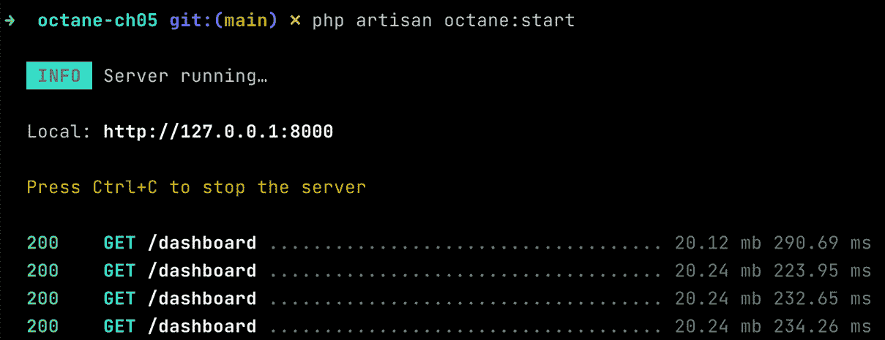
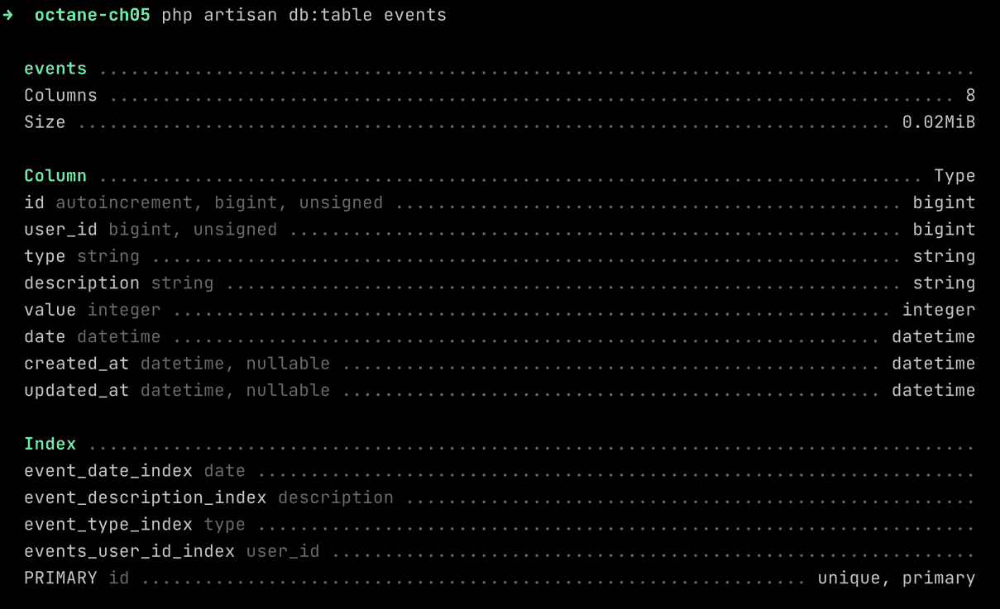
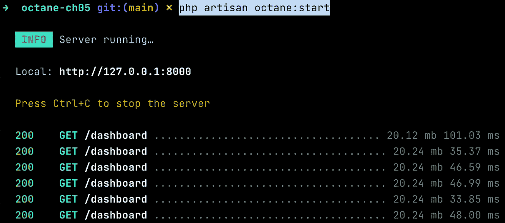

# 第五章：使用异步方法减少延迟和管理数据

在上一章中，我们创建了一个新的 Laravel Octane 应用程序，并应用了 Laravel Octane 提供的某些功能来提高性能和减少应用程序的响应时间。

本章，我们将尝试优化更多的事情，例如数据库访问、更改和改进缓存策略。为了提高查询速度，我们将解释来自索引列的好处。对于缓存，我们还将查看仅缓存的方法。

例如，在上一章中，我们并行执行了查询。现在，我们将优化查询，因为并行化快速的事情比并行化慢的事情更好。查询优化允许代码更快地从数据库中检索数据，减少从任何来源（文件、数据库或网络）读取数据时通常发生的延迟。

然后，我们将展示如何使用缓存机制来加快查询过程。我们将采用一种**仅缓存**的方法，这意味着代码将始终从缓存中检索数据。有一个任务执行查询并将结果存储在缓存中。因此，预缓存机制完全独立于需要数据的代码。因此，我们将这种方法称为异步的，因为需要数据的运行代码无需等待检索数据并填充缓存的过程。

本章的目标是减少 HTTP 请求响应时间。为了减少响应问题，我们将看到如何通过查询优化和将缓存检索时间与缓存填充时间分离的缓存机制来实现信息检索。

本章我们将涵盖以下主题：

+   使用索引优化查询

+   使缓存机制异步

# 技术要求

我们假设你已经从上一章设置了应用程序。

你需要设置 Laravel Octane 应用程序，包括本章所需的事件迁移和事件生成器。当前章节的要求是安装 PHP 8，或者如果你想使用容器方法，你必须安装 Docker Desktop（[`www.docker.com/products/docker-desktop/`](https://www.docker.com/products/docker-desktop/））或类似工具来运行 Docker 镜像。

源代码

你可以在本书的官方 GitHub 仓库中找到本章使用的示例源代码：[https://github.com/PacktPublishing/High-Performance-with-Laravel-Octane/tree/main/octane-ch05](https://github.com/PacktPublishing/High-Performance-with-Laravel-Octane/tree/main/octane-ch05)。

# 使用索引优化查询

在上一章中，我们并行进行了查询。

如果并行查询变慢了怎么办？大多数时候，实现优化意味着从多个方面进行操作。在前一章中，我们看到了如何并行化查询。正如我们所看到的，这种方法带来了巨大的好处，但我们还可以做更多的事情。我们想要实现的是进一步减少检索数据时每个并行任务的延迟。

为了做到这一点，我们现在要优化前一章中并行化的每个查询，并探索每个查询背后的推理。

我们将分析查询的特征以及涉及行选择阶段和排序阶段的字段。

让我们从以下示例查询开始：

```php
return $query->where('type', $type)
    ->where('description', 'LIKE', '%something%')
    ->orderBy('date')->limit(5);
```

我们可以看到，在查询中，我们在一些列上执行了一些操作（按类型过滤、按描述过滤等）。

为了使查询更快，我们将在涉及查询的列上创建索引。数据库中的索引是数据库引擎在执行查询时使用的一种数据结构。

为了用类比来解释索引，就像你想要在字典中查找一个单词。从第一页开始，逐页向下滚动，直到找到你想要的术语。找到术语所需的时间取决于单词的数量和单词的位置。想想在成千上万的单词中找到一个以字母*z*开头的单词是什么感觉。

数据库中的索引就像字典中的索引一样，每个字母都有一个页码。使用索引，对某个术语的访问会更加直接。如今，各种数据库都有一个非常复杂且性能优异的索引系统，所以与实际情况相比，上述类比是直接的。然而，它仍然使我们能够理解，在用于搜索或排序的字段上存在索引对于性能是多么关键。

在 Laravel 中，如果你想创建索引，你可以在迁移文件中这样做。迁移文件是一个文件，你可以定义你的数据库表结构。在迁移文件中，你可以列出你的表列并定义列的类型（字符串、整数、日期、时间等）。

在*第四章*“构建 Laravel Octane 应用程序”中，我们已经创建了`events`表的结构（用于我们示例的表）。现在的目标是分析哪些列可以从创建索引中受益，我们将看到如何在迁移文件中创建索引。

在前一章创建的迁移文件（在`database/migrations/`目录中），我们创建了一个具有一些字段的表：

```php
Schema::create('events', function (Blueprint $table) {
    $table->id();
    $table->foreignIdFor(User::class)->index();
    $table->string('type', 30);
    $table->string('description', 250);
    $table->integer('value');
    $table->dateTime('date');
    $table->timestamps();
});
```

其中一些字段被用于过滤行。

例如，在`app/Models`中的模型文件中，我们实现了以下查询：

```php
return $query->where('type', $type)
    ->where('description', 'LIKE', '%something%')
    ->orderBy('date')->limit(5);
```

这意味着用于过滤的字段是`'type'`和`'description'`。用于排序的字段是`'date'`字段。

因此，我们将在一个迁移中创建三个索引（一个用于 `'type'` 列，一个用于 `'description'` 列，一个用于 `'date'` 列）。

在创建索引之前，让我们先看看仪表板控制器的响应时间，以便有一个基线值，这样我们就可以稍后检查在节省时间方面的改进。仪表板控制器是查询通过 `ofType()` 方法调用的地方：

```php
$count = Event::count();
$eventsInfo = Event::ofType('INFO')->get();
$eventsWarning = Event::ofType('WARNING')->get();
$eventsAlert = Event::ofType('ALERT')->get();
```

要显示包含所有这些查询的仪表板控制器的响应时间，你可以通过以下命令启动 Laravel Octane：

```php
php artisan octane:start
```

然后，你可以通过你的网络浏览器在 `http://127.0.0.1:8000/dashboard` 访问它，并在控制台查看响应时间。



图 5.1：未使用索引的仪表板控制器的响应时间

如你所见，响应时间超过 200 毫秒。

现在，我们将创建索引，我们将看到新的响应时间。

## 创建索引

我们可以使用 `make:migration` 命令创建一个新的迁移：

```php
php artisan make:migration create_event_indexes
```

然后，在 `database/migrations/` 目录中创建的 `yyyy_mm_dd_hhMMss_create_event_indexes.php` 文件中，使用 `up()` 方法，我们将使用 `index()` 方法为每个列创建索引：

```php
Schema::table('events', function (Blueprint $table) {
    $table->index('type', 'event_type_index');
    $table->index('description',
                  'event_description_index');
    $table->index('date', 'event_date_index');
});
```

`index()` 方法的第一个参数是列名；第二个参数是索引名。索引名在例如你想在 `down()` 方法中删除列时很有用。`down()` 方法用于回滚情况：

```php
Schema::table('events', function (Blueprint $table) {
    $table->dropIndex('event_type_index');
    $table->dropIndex('event_description_index');
    $table->dropIndex('event_date_index');
});
```

要应用新创建的索引，你必须通过 `migrate` 命令运行迁移：

```php
php artisan migrate
```

如果你想检查一切是否正常，你可以使用 `db:table` 命令并查看是否列出了新的索引：

```php
php artisan db:table events
```

如果索引已创建，你将在 **索引** 部分看到它们列出来：



图 5.2：执行 db:table 可以显示新的索引

现在索引已创建，我们将分析已经实现的查询，该查询使用以下字段进行过滤和排序：`type`、`description` 和 `date`。我们将使用的查询是在 `Event` 模型（在 `app/Models/Event.php` 文件中）的 `scopeOfType()` 方法中实现的查询：

```php
public function scopeOfType($query, $type)
{
    return $query->where('type', $type)
    ->where('description', 'LIKE', 'something%')
    ->orderBy('date')->limit(5);
}
```

在创建索引后，再次使用你的网络浏览器，通过 `http://127.0.0.1:8000/dashboard` 访问仪表板控制器，并在控制台查看结果：



图 5.3：带有数据库索引的仪表板控制器的响应时间

如果您想从索引使用的优势中获得更多分析指标，您可以使用数据库直接提供的某些工具。例如，在 MySQL 的情况下，您可以通过 MySQL 命令提示符（使用 `php artisan db`，如下一几行所述）执行查询，并检索 `Last_query_cost` 值。您将获得一个表示查询执行成本的值，基于查询执行的操作数量。

为了比较最后查询的成本，我们将首先执行带索引的查询，然后不带索引。在示例中，我们将提取 `Last_query_cost` 指标。

这就是这样做的：

1.  确保您正在使用您迁移的最新版本：

    ```php
    php artisan migrate
    ```

1.  然后，使用 `db` 命令打开 MySQL 命令行：

    ```php
    php artisan db
    ```

`db` 命令根据 Laravel 配置（数据库名称、用户名、密码和表名）执行 MySQL 客户端。

1.  在 MySQL 命令提示符中，您可以在 `events` 表上执行查询：

    ```php
    SELECT * FROM events WHERE description LIKE 'something%';
    ```

1.  一旦完成查询，结果将显示出来。

1.  然后，执行以下命令：

    ```php
    SHOW STATUS LIKE 'Last_query_cost';
    ```

1.  您现在将看到表示查询成本（依赖于查询在数据上执行的操作数量）的指标：

    ```php
    mysql> SHOW STATUS LIKE 'Last_query_cost';
    ```

    ```php
    +-----------------+----------+
    ```

    ```php
    | Variable_name   | Value    |
    ```

    ```php
    +-----------------+----------+
    ```

    ```php
    | Last_query_cost | 5.209000 |
    ```

    ```php
    +-----------------+----------+
    ```

    ```php
    1 row in set (0.00 sec)
    ```

1.  如果您现在尝试删除索引，迁移将发生回滚（因为我们的迁移最新步骤是通过回滚命令创建索引）：

    ```php
    php artisan migrate:rollback --step=1
    ```

1.  然后，在 MySQL 命令提示符中，再次执行以下命令：

    ```php
    SELECT * FROM events WHERE description LIKE 'something%';
    ```

1.  然后，执行以下命令：

    ```php
    SHOW STATUS LIKE 'Last_query_cost';
    ```

您将看到以下内容：

```php
mysql> SHOW STATUS LIKE 'Last_query_cost';
+-----------------+-------------+
| Variable_name   | Value       |
+-----------------+-------------+
| Last_query_cost | 1018.949000 |
+-----------------+-------------+
1 row in set (0.01 sec)
```

如您所见，没有索引，查询成本更高。

如果您执行更复杂的查询，如您的 `Event` 模型中的查询，例如使用类型和描述字段进行过滤并按日期排序，则没有索引，情况会更糟。

让我们尝试执行以下查询：

```php
SELECT * FROM events WHERE type='ALERT' AND description LIKE 'something%' ORDER BY date;
```

然后，在执行查询后，您要求 MySQL 显示不带索引的 `Last_query_cost` 指标：

```php
mysql> SHOW STATUS LIKE 'Last_query_cost';
+-----------------+--------------+
| Variable_name   | Value        |
+-----------------+--------------+
| Last_query_cost | 10645.949000 |
+-----------------+--------------+
```

然后，您要求 MySQL 显示带有索引的 `Last_query_cost` 指标：

```php
mysql> SHOW STATUS LIKE 'Last_query_cost';
+-----------------+-----------+
| Variable_name   | Value     |
+-----------------+-----------+
| Last_query_cost | 16.209000 |
+-----------------+-----------+
```

如您所见，差异是巨大的。

我们现在已经比较了带索引和不带索引的查询。通过获得的知识，我们可以通过微调我们使用的索引类型来提高查询的响应时间。

在查询中，我们正在过滤以 `description` 列开头的行。在查询中，我们正在过滤所有以单词 `something` 开头的描述。但如果我们想过滤所有包含单词 `something` 的 `description` 列的行呢？在我们的前一章中，为了选择包含特定单词的所有描述，我们使用了 `LIKE` 操作符和通配符：

```php
description LIKE '%something%'
```

然而，如果我们想优化查询以减少其响应时间，特别是对于文本，我们还有另一个强大的数据库功能用于过滤和搜索文本——**全文索引**。

## 创建全文索引

我们将要做的就是将`description`列的标准索引更改为全文索引，然后我们将看到它的性能表现。这是我们的做法：

1.  创建一个新的迁移：

    ```php
    php artisan make:migration create_event_fulltext_index
    ```

在`yyyy_mm_dd_hhMMss_create_event_fulltext_index.php`文件中，在`database/migrations/`目录下的`up()`方法中，我们将删除先前的索引并创建一个新的全文索引。

1.  在`up()`方法中，我们必须删除`description`列上的先前索引，然后通过`fullText()`方法创建全文索引：

```php
Schema::table('events', function (Blueprint $table) {
    $table->dropIndex('event_description_index');
    $table->fullText('description', 'event_description_fulltext_index');
});
```

关于哪种方法更快，用于过滤以特定术语（`'something%'`）开头的描述列的`LIKE`运算符比全文搜索更快，但它仅覆盖了以特定单词开头的列的过滤。全文搜索的执行速度比使用通配符进行搜索的`LIKE`方法更快，而且功能更强大，尤其是当你想要搜索一个或多个术语时。让我们尝试在查询中使用`whereFullText()`方法：

```php
public function scopeOfType($query, $type)
{
    return $query->where('type', $type)
        //->where('description', 'LIKE', '%something%')
        ->whereFullText('description', 'something other')
        ->orderBy('date')->limit(5);
}
```

`whereFullText()`方法使用两个参数；第一个参数是`description`参数，它是要过滤的列名，第二个参数是要搜索的字符串。

现在我们已经实现了全文搜索，我们可以添加另一个改进——缓存查询的结果。

## 优化查询和缓存

到目前为止，我们已经看到了如何通过并行执行、使用缓存以及在搜索字段上应用索引来优化查询。

然而，如果我们通过缓存结果来优化查询，那么第一个查询，或者缓存结果已过时或被删除的查询，将不得不处理从数据库加载数据以更新和刷新缓存的成本。

在我们即将讨论的缓存策略中，我们将尝试防止缓存刷新时间影响我们应用程序的响应时间。

通过将缓存策略更改为仅使用来自缓存的值（仅缓存的方法）来请求查询，并创建一个负责检索结果及其缓存的进程，可以优化这种场景。此进程异步运行，并且与请求生成的查询解耦。

这种方法可以提高性能，因为它倾向于消除慢查询，并且应该会处理数据检索，因为缓存的定期刷新是通过外部命令完成的。我们可以添加每*n*秒执行一次并检索新数据的外部命令，然后填充缓存。所有请求都从缓存中获取数据。要执行间隔命令，我们可以使用另一个 Octane 功能，即`tick()`方法。让我们看看如何。

# 使缓存机制异步

在*第三章*，*配置 Swoole 应用程序服务器*中，我们探讨了`Octane::tick()`方法。

`tick()`方法允许你每*n*秒执行一次函数。

缓存策略可以通过将数据加载委托给特定函数来审查。这个特定函数负责从数据库（而不是从缓存）中检索数据，一旦数据被检索，该函数将结果存储在缓存中。该函数通过 `Octane::tick()` 方法调用并执行——例如，可能每 60 秒，从数据库检索新鲜数据并填充缓存。所有请求都从缓存中检索数据。

使用异步缓存策略，所有请求都从缓存中检索数据。

缓存通过通过 `tick()` 调用的任务刷新。

为了实现异步缓存策略，我们正在进行以下操作：

1.  在应用程序服务提供者中实现 `tick()` 函数

1.  将结果存储在 Octane 缓存中

1.  实现读取缓存的控制器

1.  实现路由

## 在应用程序服务提供者中实现 tick() 函数

为了在框架引导时启动缓存任务，我们可以在 App Service Provider 中设置 `tick()` 方法。App Service Provider 是在框架实例化时创建的文件。因此，在 `app/Providers/AppServiceProvider.php` 文件中的 `boot()` 方法中，您必须实现 `Octane::tick()` 函数：

```php
// including these classes
use Illuminate\Support\Facades\Log;
use Laravel\Octane\Facades\Octane;
use App\Models\Event;
use Illuminate\Support\Facades\Cache;
// in the boot() method
Octane::tick('caching-query', function () {
    Log::info('caching-query.', ['timestamp' => now()]);
    $time = hrtime(true);
    $count = Event::count();
    $eventsInfo = Event::ofType('INFO')->get();
    $eventsWarning = Event::ofType('WARNING')->get();
    $eventsAlert = Event::ofType('ALERT')->get();
    $time = (hrtime(true) - $time) / 1_000_000;
    $result = ['count' => $count,
        'eventsInfo'=> $eventsInfo,
        'eventsWarning' => $eventsWarning,
        'eventsAlert'=> $eventsAlert,
    ];
    Cache::store('octane')->put('cached-result-tick', $result);
})
->seconds(60)
->immediate();
```

在 `tick()` 函数中，我们将执行所有查询，然后将结果存储在 Octane 缓存中（指定 `octane` 存储）：`Cache::store('octane')->put()`。

两个基本方法是 `seconds()`，其中我们可以定义节奏，即秒间隔，和 `immediate()`，它设置 `tick()` 函数的立即执行。

每 60 秒，查询会自动执行，并将结果存储在缓存中。

## 实现读取缓存的控制器

现在我们已经实现了填充缓存的 `tick()` 事件，我们可以专注于控制器，在那里我们可以从缓存中加载数据。

从缓存中检索数据的方法是 `Cache::store('octane')->get()`。使用 `Cache::store('octane')` 方法，您将检索 Octane 提供的 `Cache` 实例。使用 `get()` 方法，您将检索缓存中存储的值。以下是从 `app/Http/Controllers/DashboardController.php` 文件中检索缓存值的代码：

```php
use Illuminate\Support\Facades\Cache;
use Exception;
public function indexTickCached()
{
    $time = hrtime(true);
    try {
        $result = Cache::store('octane')->get(
          'cached-result-tick');
    } catch (Exception $e) {
        return 'Error: '.$e->getMessage();
    }
    $time = (hrtime(true) - $time) / 1_000_000;
    $result['time'] = $time;
    return view('dashboard.index', $result);
}
```

在控制器中，正如你所见，存在一种异步方法，因为没有更多依赖于数据库的挂起操作，我们将从数据库的加载委托给外部函数。控制器中的唯一依赖是缓存。

## 实现路由

在 `routes/web.php` 文件中，您可以添加一个新的路由：

```php
use Laravel\Octane\Facades\Octane;
use App\Http\Controllers\DashboardController;
use Illuminate\Http\Response;
Octane::route('GET', '/dashboard-tick-cached', function () {
    return new Response((new DashboardController)->
                        indexTickCached());
});
```

如前几章所示，我们可以通过使用 `Octane::route()` 来优化路由加载，这有助于减少响应时间。正如你所见，我们出于性能原因使用 `Octane::route()`，然后将路径设置为 `/dashboard-tick-cached` 并调用 `indexTickCached()` 方法。

## 展示结果

如果我们打开浏览器到初始仪表板路由，那里的查询没有被优化也没有被缓存，然后打开浏览器到新的路由，那里的查询被缓存，我们可以看到在响应时间方面有巨大的差异：

```php
  200    GET /dashboard ............ 19.71 mb 66.60 ms
  200    GET /dashboard ............ 19.83 mb 42.31 ms
  200    GET /dashboard ............ 19.83 mb 37.31 ms
  200    GET /dashboard ............ 19.83 mb 30.07 ms
  200    GET /dashboard ............ 19.83 mb 42.25 ms
  200    GET /dashboard-tick-cached . 19.89 mb 7.51 ms
  200    GET /dashboard-tick-cached . 19.89 mb 4.32 ms
  200    GET /dashboard-tick-cached . 19.89 mb 4.96 ms
```

正如你所见，仪表板路径的响应时间为 30-40 毫秒。`dashboard-tick-cached`路由大约为 5 毫秒。

这是一项重大的改进，再次强调，当你考虑性能时，你必须从这种改进对数千个请求的影响来思考。

这就带我们结束了本章的内容。

# 摘要

在本章中，我们看到了如何通过结合缓存机制、路由优化、异步方法和查询优化来提高信息检索的效率。缓存机制与异步方法的结合帮助我们减少每个请求（即使缓存已过时）的数据检索响应时间。查询优化减少了检索新鲜数据以填充缓存所花费的时间。路由优化有助于在框架解析路由时节省更多毫秒，从而减少响应时间。

在下一章中，我们将尝试解决需要执行耗时任务的情况——即那些需要一些时间才能完成但无法使用缓存机制的作业。

缓存机制在检索信息时可能是有益的。另一方面，如果我们需要执行诸如写入、发送或转换数据之类的任务，我们很可能需要使用其他工具。在下一章中，我们将看到如何操作。

# 第四部分：加速

这部分展示了如何配置工具以支持 Laravel Octane 在高效架构中。例如队列以及如何为生产环境设置系统，这些将通过实际示例进行解释。本部分包括以下章节：

+   *第六章*，*在应用程序中使用队列实现异步方法*

+   *第七章*，*配置 Laravel Octane 应用程序以适应生产环境*
