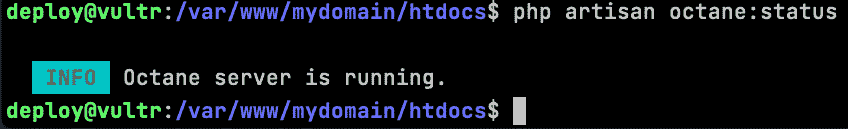

# 为生产环境配置 Laravel Octane 应用程序

在前面的章节和本书中，我们看到了如何使用 Laravel Octane 并实现一些优化来提高我们应用程序的性能和响应速度。我们主要在本地开发环境中操作。此外，我们在应用层面进行了工作。

本章将讨论生产环境中的系统配置、设置和微调。了解生产环境的特定配置非常有用，尤其是在本地环境的配置通常与生产环境的配置不同，因为可用的设置和服务不同的情况下。

在实践中，我们将涵盖以下内容：

+   典型的生产架构

+   如何优化参考架构

+   哪些具体的 Laravel 操作可以从性能角度带来好处

+   通过**Makefile**进行部署策略

# 技术要求

我们假设读者有一个可用的生产环境。通常，这种环境可以位于虚拟机上，例如一个（或多个）Amazon EC2 实例，或者由云 PaaS 解决方案提供的环境，如*Platfrom.sh*，或者由云服务器/服务提供商提供的环境，如*Digital Ocean*或*Vultr*。

我们不会讨论这些环境的特定安装；然而，我们将给出一个典型架构的指示，该架构结合了在（一个或多个）GNU/Linux 类型的虚拟机上使用 web 服务器（如 nginx）的使用。

当前章节中描述的示例的源代码和配置文件在此处可用：[`github.com/PacktPublishing/High-Performance-with-Laravel-Octane/tree/main/octane-ch07`](https://github.com/PacktPublishing/High-Performance-with-Laravel-Octane/tree/main/octane-ch07)。

# 介绍生产架构

在本地环境开发场景（如前几章所述），使用`php artisan octane:start`命令启动 Laravel Octane 是可以的。然而，在要求与本地环境不同的生产环境中，配置不同的架构可能是有帮助的。

通常，在本地开发环境中，你需要自动化和配置，这些配置对于开发新功能很有用，例如自动服务重新加载。相比之下，在生产环境中，配置必须允许达到最佳的性能和可靠性水平。因此，在这个生产场景中，选择不同的、专门针对生产的架构是常见的。

我们将要讨论的生产环境架构设计涉及使用 Web 服务器来最初排序 HTTP 请求。Web 服务器的任务将是区分不需要 PHP 引擎参与的静态资产请求和需要服务器端处理的请求。通常，需要服务器端处理的页面请求可能会随后跟随着对 CSS 文件、JavaScript 文件和图像文件等静态资产的请求。对于这些类型的文件，不需要 PHP 的参与，因此 Web 服务器的任务将是尽可能快地立即提供这些类型的资产。另一方面，对于需要 PHP 执行的请求，Web 服务器将请求转发到 Laravel Octane 提供的服务。


图 7.1：典型的生产架构

要配置生产环境，必须执行几个步骤：

1.  将静态资产放置在特定的目录中（我们可以将资产类型组织到多个子文件夹中）。

1.  配置 nginx（`nginx.conf`文件）以充当代理。

1.  配置 nginx 将页面请求转发到 Laravel Octane。

1.  将 nginx 设置为监听 HTTPS 协议。

1.  将 nginx 与 Laravel Octane 之间的通信设置为标准 HTTP。

1.  Laravel 生成的所有 URL 都必须设置为 HTTPS 服务（用于绝对 URL 生成）。

让我们从管理公共资产开始。

## 管理公共静态资产

如果你查看 Laravel 应用程序的目录结构，你会注意到有一个名为 public 的目录，其目的是包含静态文件。

公共目录还包含由`npm run build`命令生成的 CSS 和 JS 文件。如果你的应用程序需要 CSS 样式，你可能会在`resources/css/app.css`文件中设置它（或对于 JavaScript 文件在`resources/js`目录中）。一旦运行`npm run build`，CSS 和 JS 文件就会被构建，输出文件存储在`public/build`目录中。

为了在 HTTP 响应中提供静态文件，没有必要涉及 PHP 引擎。避免涉及 PHP 引擎来提供静态文件可以最小化 CPU 和内存等资源的使用，从而也减少了响应时间。

静态文件通常是具有特定扩展名（如`jpg`、`jpeg`、`gif`、`css`、`png`、`js`、`ico`或`html`）的文件。对于静态文件，我们可能需要特定的配置——例如，关闭日志、定义过期日期或添加头信息。如果你需要为资产设置特定的设置，建议在`nginx.conf`文件（或你的域名对应的文件）中的服务器部分为 nginx 设置特定的配置：

```php
location ~* \.(jpg|jpeg|gif|css|png|js|ico|html)$ {
  access_log off;
  expires max;
  log_not_found off;
  add_header X-Debug-Config STATICASSET;
}
```

对于带有资产扩展名的文件，我添加了一个名为 `X-Debug-Config` 的头（HTTP 响应中的头），用于调试目的。配置设置为检查 HTTP 响应头中是否存在 `STATICASSET` 值。

## 设置 nginx 为代理

在生产环境中，我们将使用 nginx 来响应 HTTP 请求。我们将配置 nginx 作为代理，因为对于 PHP 文件，nginx 将将请求转发到 Laravel Octane 服务。

PHP 文件的 nginx 配置如下所示：

```php
location ~ \.php$ {
  include snippets/fastcgi-php.conf;
  add_header X-Debug-Config2 FASTCGI;
  fastcgi_pass unix:/run/php/php8.1-fpm.sock;
}
```

这个典型的 nginx 配置用于使用 PHP，通过 FastCGI 使用 FPM 模块。如 *第一章* 中所述，理解 Laravel Web 应用程序架构，nginx 无法运行 PHP 脚本。为了做到这一点，nginx 可以配置为将请求转发到 FPM 模块。FPM 模块将运行 PHP 脚本，并将响应发送回 nginx。所有对 PHP 文件的请求都转发到 FPM 套接字通信通道（`fastcgi_pass`）。

如果你使用 Laravel Octane，你不需要使用 FastCGI 选项来执行 PHP 脚本，因为 PHP 脚本将通过应用程序服务器（Swoole 或 RoadRunner）由 Laravel Octane 服务执行。

如果你拥有 Laravel Octane，你可以通过 `php artisan octane:start` 命令启动 Octane 服务，然后指示 nginx 作为代理，将所有 PHP 请求转发到 Laravel Octane 服务。

要将 nginx 设置为代理，你可以在你的 nginx 配置文件中设置此配置：

```php
location /index.php {
    try_files /not_exists @octane;
}
location / {
    try_files $uri $uri/ @octane;
}
location @octane {
        add_header X-Debug-Config2 POWEREDBYOCTANE;
        set $suffix "";
        if ($uri = /index.php) {
            set $suffix ?$query_string;
        }
        proxy_http_version 1.1;
        proxy_set_header Host $http_host;
        proxy_set_header Scheme $scheme;
        proxy_set_header SERVER_PORT $server_port;
        proxy_set_header REMOTE_ADDR $remote_addr;
        proxy_set_header X-Forwarded-For
                         $proxy_add_x_forwarded_for;
        proxy_set_header Upgrade $http_upgrade;
        proxy_pass http://127.0.0.1:8000$suffix;
}
```

`try_files` 行对于分割 nginx 在如何管理静态资源（现有文件）和动态资源（不存在文件）方面的行为非常重要。

如果请求是针对 `/test.png` 并且文件存在于公共目录中（由于根指令），文件将由 nginx 加载并服务。

如果请求是针对 `/test`，它将落入 `try_files` 标记为 `@octane` 的最新场景。

然后，有一个专门的部分来管理所有标记为 `@octane` 的请求。所有这些请求都通过 `proxy_pass` 指令发送到 Laravel Octane。

如你所见，所有 FastCGI 指令都被注释掉了，或者被移除了。现在，我们正在使用 `proxy_pass` 指令。`proxy_pass` 指令指向 Laravel Octane 服务运行的 IP 地址和端口。

要使代理配置生效，你必须设置一些额外的参数，例如 `proxy_http_version 1.1;` 以设置协议版本和其他用于控制头部的选项。

一旦你编辑了你的 nginx 配置文件，你必须重新启动 nginx 进程以应用你的更改。在重新启动 nginx 之前，我建议检查更改后的配置文件的语法。

使用 `nginx -t` 命令可以显示你的新配置是否存在任何问题：

```php
# nginx -t
nginx: the configuration file /etc/nginx/nginx.conf syntax is ok
nginx: configuration file /etc/nginx/nginx.conf test is successful
```

一旦收到成功消息，您可以安全地重新启动 nginx。如何重新启动服务取决于您的发行版。在 Ubuntu 的情况下，您可以使用`service`命令：

```php
service nginx restart
```

通常，如果您的 Linux 发行版不提供`service`命令，您可以使用`systemctl`命令：

```php
sudo systemctl restart nginx
```

使用`sudo`命令是因为您需要具有 root 权限。

重新加载 nginx 后，你必须启动`artisan`命令来启动 Laravel Octane。

## 启动 Octane

您可以手动执行`octane:start`命令进行快速配置测试。然后，我们将看到如何在系统启动时自动启动 Octane。

要启动 Octane，您应该使用`octane:start`命令：

```php
php artisan octane:start --server=swoole
```

此命令启动 Octane 并在本地主机上接受连接。

假设您需要在不同的机器上执行 Octane（一台机器用于运行 nginx，另一台机器用于运行 Laravel Octane）：您应该允许 Octane 通过`--host`参数接受所有传入请求：

```php
php artisan octane:start –host=0.0.0.0 –server=swoole
```

`0.0.0.0`地址意味着 Octane 将接受来自所有 IP 地址的传入请求（而不仅仅是本地地址）。

## 通过 Supervisor 启动 Octane

如果您需要在系统启动时启动和监控进程，我建议使用 Supervisor 软件。

有一个名为 Supervisor 的优秀的开源软件，您可以通过以下命令通过 GNU/Linux 包管理器进行安装：

```php
apt-get install supervisor
```

一旦安装了 Supervisor，您可以为 Laravel Octane 设置启动脚本文件。

Supervisor

如果您对 Supervisor 对其他项目/命令（不仅仅是 Laravel Octane）感兴趣，您可以在官方网站上获取更多信息：[`supervisord.org/`](http://supervisord.org/)。

由 supervisor 管理的启动脚本存储在`conf.d`目录中，该目录位于`/etc/supervisor/`目录内。

创建一个新文件，`/etc/supervisor/conf.d/laravel-octane.conf`，并使用以下配置：

```php
[program:laravel-octane]
process_name=%(program_name)s_%(process_num)02d
command=php /var/www/mydomain/htdocs/artisan octane:sta– --server=swoo– --max-requests=10– --workers– --task-workers=– --port=8000
autostart=true
autorestart=true
user=deploy
redirect_stderr=true
stdout_logfile=/var/www/mydomain/htdocs/storage/logs/laravel-octane-worker.log
```

在这里，您需要设置一些指令：

+   `process_name`：这是用于标记进程的名称

+   `command`：这是使用`octane:start`启动 Octane 服务的命令行

+   `autostart`和`autorestart`：这是设置如何以及何时启动进程（自动启动）

用于启动进程的用户（我使用的是特定的一个，例如`deploy`）通常是`www-data`，按照惯例，这是运行 Web 服务器进程（nginx 或 Apache）所使用的用户。

+   `redirect_stderr`：如果错误消息需要重定向到日志，则使用此选项。

+   `stdout_logfile`：这是用于日志的文件名。请确保默认情况下为 Octane 管理的每个请求创建一行。

如果您对更复杂的配置感兴趣，Supervisor 支持许多参数。所有参数都在此处有文档说明：[`supervisord.org/configuration.html`](http://supervisord.org/configuration.html)。

一旦你设置了配置文件，你可以更新 Supervisor 配置，添加 Laravel Octane 配置：

```php
supervisorctl update
```

然后，你重新启动 Supervisor：

```php
supervisorctl restart all
```

或者，你可以专门重新启动 Octane 服务：

```php
supervisorctl restart laravel-octane:laravel-octane_00
```

这样，Laravel Octane 将根据命令行上定义的参数（Supervisor 配置中的命令指令）启动，并且在重启或崩溃的情况下重新启动 Laravel Octane。

现在，Laravel Octane 已经自动启动。如果你更改应用程序的源代码或部署 Laravel 应用程序的新版本，你必须重新加载工作进程，以便将所有更改应用到所有工作进程中。

重新加载工作进程

每次你对应用程序逻辑进行一些更改时，你必须使用以下命令重新启动应用程序：

```php
php artisan octane:reload
```

`octane:reload` 命令重新启动由 Octane 实例化的工作进程，并通过这种方式重新加载代码。


图 7.2：使用 php artisan octane:reload 重新加载工作进程

如果你想了解 Laravel Octane 服务的状态（运行或不运行），你可以使用 `octane:status` 命令：

```php
php artisan octane:status
```

如果一切正常，`octane:status` 会显示 **Octane 服务器正在运行** 的消息。否则，它会显示 **Octane 服务器** **未运行**：



图 7.3：检查 Laravel Octane 的状态

## 监听事件

Laravel Octane 内部定义了一些事件，用于通知和管理发生某些情况时的情况，例如工作进程启动、收到请求等。在一个框架中，如果你可以产生一些事件，作为开发者，你需要一个机制来监听事件发生时的情况。Laravel 框架为开发者提供了一个定义和创建事件以及监听（监听器）的机制。Laravel 中的监听器可以执行开发者定义的函数。

因此，在这种情况下，使用 Laravel 提供的事件监听机制，你可以监听一些特定的 Laravel Octane 事件。

查看 Laravel Octane 配置文件 (`config/octane.php`) 中的 `listener` 部分，你会看到定义的事件如下：`WorkerStarting`、`RequestReceived`、`RequestHandled`、`RequestTerminated`、`TaskReceived`、`TaskTerminated`、`TickReceived`、`TickTerminated`、`OperationTerminated`、`WorkerErrorOccurred` 和 `WorkerStopping`。

例如，如果你想实现 `RequestReceived` 事件的监听器，你可以使用 `make:listener` 命令创建监听器类：

```php
php artisan make:listener RequestReceivedNotification --event=RequestReceived
```

`make:listener` 命令基于 `RequestReceived` 事件创建 `RequestReceivedNotification` 类文件。

该文件在 `app/Listeners/RequestReceivedNotification.php` 中创建，包含构造函数和 `handle()` 方法，因此你可以在 `handle()` 方法中添加你的逻辑来跟踪一些活动；例如，我将记录请求来源的 IP 地址：

```php
<?php
namespace App\Listeners;
use Illuminate\Support\Facades\Log;
use Laravel\Octane\Events\RequestReceived;
class RequestReceivedNotification
{
    /**
     * Create the event listener.
     *
     * @return void
     */
    public function __construct()
    {
        //
    }
    /**
     * Handle the event.
     *
     * @param  \Laravel\Octane\Events\RequestReceived;
        $event
     * @return void
     */
    public function handle(RequestReceived $event)
    {
        Log::info('Request Received by
                  '.$event->request->ip());
    }
}
```

要启用监听器，你必须将类添加到 `config/octane.php` 文件中：

```php
        RequestReceived::class => [
            ...Octane::prepareApplicationForNextOperation(),
            ...Octane::prepareApplicationForNextRequest(),
// Add the RequestReceivedNotification class
            RequestReceivedNotification::class
            //
        ],
```

以同样的方式，你也可以添加你想要跟踪的其他事件。

现在我们已经为生产环境配置了 Web 服务器，我们可以浏览 Laravel 的生产环境配置。

# 为 Laravel 应用程序准备生产环境

现在，我们将专注于 Laravel 的特定生产环境配置。我们将了解如何安装生产 PHP/Laravel 软件包，避免安装开发和调试软件包。我们将了解如何优化缓存配置、路由设置和视图优化。最后，我们将了解如何禁止调试选项。调试选项在开发中非常有用，但可能会减慢 Laravel 应用程序在生产环境中的执行速度。

## 安装生产环境所需的软件包

在 `composer.json` 文件中，列出了两种类型的软件包：`require` 定义了在生产环境中运行应用程序所需的软件包，而 `require-dev` 定义了在开发环境中运行应用程序所需的软件包。

默认情况下，`composer` 会安装两个列表中的所有软件包。

如果你只想安装 `require` 列表中的软件包（生产环境），在安装生产环境软件包时可以使用 `–-no-dev` 选项：

```php
composer install --optimize-autoloader --no-dev
```

除了 `--no-dev` 选项外，我们还使用 `optimize-autoloader`。该选项生成一个数据结构（索引），用于映射类名和要加载的文件名。

`optimize-autoloader` 选项减少了引导时间。

## 缓存配置、路由和视图

为了快速加载一些关键组件，如配置文件、路由配置和视图 blade 模板，你可以使用缓存命令：

```php
php artisan config:cache
php artisan route:cache
php artisan view:cache
```

每次你在生产环境中更改 Laravel 应用程序中的某些文件时，都必须执行这些命令。


图 7.4：缓存配置、路由和视图

## 禁用调试模式

在开发 Laravel 应用程序时，配置通常设置为调试模式。控制调试模式的参数存储在 `.env` 文件中，参数如下：

```php
APP_DEBUG=true
```

要检查应用程序的状态，你可以使用以下命令：

```php
php artisan about
```

`about` 命令显示有关 **调试模式** 的信息：


图 7.5：显示调试模式状态的 `about` 命令

要更改设置，你可以将 `APP_DEBUG` 参数的值更改为 `false`：

```php
APP_DEBUG=false
```

将`APP_DEBUG`配置设置为`false`允许您跳过代码中所有用于调试目的的配置（收集和显示详细信息）。

由于您更改了配置并且配置被缓存，建议清除配置以查看应用程序中的更改：

```php
php artisan config:clear
```

您还应该减少日志消息的数量。日志消息对于调试目的非常有用，但跟踪日志可能是一项昂贵的操作，可能会减慢应用程序的运行速度。

例如，在`.env`配置文件中，通常可以找到以下内容：

```php
LOG_LEVEL=debug
```

调试的级别，从最详细的（带有更多日志）到仅跟踪错误，如下所示：`debug`、`info`、`notice`、`warning`、`error`、`critical`、`alert`和`emergency`。我的建议是在生产环境中将日志级别（`LOG_LEVEL`）更改为`error`，以便仅跟踪关键信息，因为减少日志消息的数量可以使应用程序运行更快，并可以减少所需的存储量。

一般建议为生产环境设置特定的配置，因此建议创建一个文件，`.env.prod`，在其中可以存储您的生产配置。然后，在每个部署时将`.env.prod`文件复制到生产环境中的`.env`文件。

# 部署方法

您可以从众多存在的部署策略中选择一个。

当选择部署策略时，我推荐的规则是避免在生产环境中安装用于构建阶段的宝贵工具。因为目标是限制生产环境的责任，仅限于交付准备就绪的部署资产，执行构建过程的责任不应由生产环境承担。这就是为什么可以在生产环境中避免安装构建工具。

例如，我建议避免在生产环境中执行 JavaScript 和 CSS 的构建、运行测试或“linting”过程，或执行静态代码分析。

换句话说，有必要直接将优化后的代码和现成的配置转移到生产服务器。

这意味着如果应该有旨在为生产准备文件和配置的构建操作，这些操作应在专用环境或 CI/CD 运行器中执行。

生产环境中的构建机制和文件传输命令可能很复杂。因此，建议在脚本工具中正式化此命令列表。

我使用`Makefile`是因为这允许我定义要执行的各个步骤，但更重要的是，确定步骤之间的依赖关系。

通常，我会定义一个编译资源的步骤，一个测试步骤，一个运行`phpcs`（代码检查）的步骤，一个执行静态代码分析的步骤，以及一个将文件传输到生产环境的步骤。如果需要，还有直接在生产服务器上执行命令的特定步骤。这些细粒度的步骤数量使我能够保持每个步骤的简单性。

有几种复制和将文件传输到生产环境的方法；建议找到最适合你的方法；通常，我使用**安全外壳（SSH）协议和工具**。

然而，再次强调，最重要的是理解，无论你使用什么方式传输文件或使用什么工具，你应该传输准备由生产环境服务的文件和配置。

Makefile

`Makefile`是`make`工具用来执行命令的文件。其格式相当简单；每个命令组被分组到步骤中。当你通过`make`命令启动文件时，你可以指定要执行的步骤。

在`Makefile`中，所有命令都被列出，要执行的命令需要一个参数，例如`SSH_USER`或`WEB_DIR`。我的建议是在外部`Makefile`中定义这些参数。然后，你可以忽略（在 Git 仓库中）用于参数的`Makefile`，并提交包含步骤的`Makefile`。

在你的 Laravel 项目根目录中，创建一个名为`Makefile.param`的文件：

```php
SSH_ALIAS=some.vm
SSH_USER=deploy
WEB_DIR=/var/www/mydomain/htdocs
WEB_USER=www-data
WEB_GROUP=www-data
# DRY_RUN=--dry-run
DRY_RUN=
```

参数的含义相当直观；你可以定义 SSH 别名和 SSH 用户，通过 SSH 访问远程机器，然后你可以指定存储你的 Laravel 应用程序的远程目录（在服务器上，`WEB_DIR`）。然后，你可以设置服务器上用于运行进程的用户（`WEB_USER`和`WEB_GROUP`）。然后，通过`DRY_RUN`，你可以查看（并复制）要复制到服务器上的文件。

对于在服务器上复制文件，我们将使用`rsync`。`rsync`是一个仅复制已更改文件的优秀工具。

要创建一个`Makefile`，创建一个名为`Makefile.deploy`的文件，并填充以下内容：

```php
.PHONY: help all remotedu rsynca copyenvprod fixgroupuser newdeploy migratestatus migrate migrateseed migraterefresh buildfrontend optimize composerinstallnodev restartworkers octanestatus installdevdeps deploy
include Makefile.param.prod
all: help
help:
    @grep -E '^[a-zA-Z_-]+:.*?## .*$$' $(MAKEFILE_LIST) |
    sort | awk 'BEGIN {FS = ":.*?## "};
    {printf "\033[36m%-30s\033[0m %s\n", $$1, $$2}'
remotedu: ## Execute DU command in htdocs dir, just for diagnostic purpose
    ssh ${SSH_ALIAS} "cd ${WEB_DIR}; du -h"
rsynca: ## execute Rsync from current dir and remote htdocs ${WEB_DIR}
    rsync ${DRY_RUN} -rlcgoDvzi -e "ssh" --delete .
      ${SSH_ALIAS}:${WEB_DIR}  --exclude-from
      'exclude-list.txt'
copyenvprod:
    scp .env.prod ${SSH_ALIAS}:${WEB_DIR}/.env
fixgroupuser: ## Add the right group(www) to the deploy user (ssh user)
    ssh -t ${SSH_ALIAS} "sudo usermod -a -G ${WEB_GROUP}
    ${SSH_USER}"
fixownership: ## fix the ownership for user ${WEB_USER} into ${WEB_DIR}/storage
    ssh -t ${SSH_ALIAS} "sudo chown -R
    ${WEB_USER}:${WEB_GROUP} ${WEB_DIR}/storage; ls -lao
    ${WEB_DIR}/storage"
newdeploy: buildfrontend rsynca copyenvprod fixgroupuser fixownership migrate ##first deploy
migratestatus: ## list the migration status
    ssh ${SSH_ALIAS} "cd ${WEB_DIR}; php artisan
    migrate:status --env=prod"
migrate: ## Execute migrate command for DB schema
    ssh ${SSH_ALIAS} "cd ${WEB_DIR}; php artisan migrate
    --env=prod"
migrateseed: ## Execute migrate command for DB schema
    ssh ${SSH_ALIAS} "cd ${WEB_DIR}; php artisan
    migrate:refresh --seed --env=prod"
migraterefresh: ## Execute migrate command for DB schema
    ssh ${SSH_ALIAS} "cd ${WEB_DIR}; php artisan
    migrate:refresh"
buildfrontend: ## execute npm task to compile frontend assets (js and css...)
    npm run build
optimize: ## Optimize application in production
    ssh ${SSH_ALIAS} "cd ${WEB_DIR}; php artisan
    config:cache; php artisan route:cache; php artisan
    view:cache"
composerinstallnodev:
    composer install --optimize-autoloader  --no-dev
restartworkers:
    ssh ${SSH_ALIAS} "cd ${WEB_DIR}; php artisan octane:reload"
octanestatus:
    ssh ${SSH_ALIAS} "cd ${WEB_DIR}; php artisan octane:status"
installdevdeps:
    composer install
    npm run dev
    php artisan config:clear
deploy: buildfrontend composerinstallnodev rsynca copyenvprod migrate restartworkers installdevdeps
```

最后一行是`deploy`步骤。`deploy`步骤不包含要执行的命令，而是一系列需要依次调用的步骤。

执行的第一步将是`buildfrontend`。这一步包括`npm run build`命令。该命令将构建前端资源。

`deploy`步骤中包含的下一步是`composerinstallnodev`。`composerinstallnodev`执行的命令将为生产环境安装包（跳过开发包）：

```php
composer install --optimize-autoloader  --no-dev
```

然后，是复制服务器上文件的步骤：`rsynca`。这一步包括一个命令：

```php
rsync ${DRY_RUN} -rlcgovzi -e "ssh" --delete . ${SSH_ALIAS}:${WEB_DIR}  --exclude-from 'exclude-list.txt'
```

在命令中，使用了一些变量（用从`Makefile.param.prod`文件加载的值替换），这些变量。

由于包含以下指令，`Makefile.param.prod`文件在`Makefile`的开始处被加载：

```php
include Makefile.param.prod
```

`rsync` 命令使用一系列选项：

+   `-r`：递归到目录中。

+   `-l`：将符号链接作为符号链接复制。

+   `-c`：仅复制已更改的文件。通过比较源文件和目标文件的校验和来检测更改，使用 `-c` 选项。

+   `-g`：在复制过程中保留组（所有者）。

+   `-o`：在复制过程中保留用户（所有者）。

+   `-v`：详细输出。

+   `-z`：在网络传输期间压缩文件。

+   `-i`：显示摘要。

`--exclude-from 'exclude-list.txt'` 选项将 `exclude-list.txt` 文件中列出的所有文件从复制中排除。

`exclude` 文件包含以下内容：

```php
.git
.sass-cache/
Makefile*
exclude-list.txt
nohup.out
composer.phar
node_modules
.env*
.idea
.editorconfig
.babelrc
.gitattributes
logs
*.log
npm-debug.log*
node_modules
storage/framework/cache/*
storage/framework/sessions/*
storage/framework/views/*
storage/logs/*
storage/app/*
storage/testing/*
exports/*
app/config/prod/*
app/config/stage/*
resources/assets
public/files
public/chunks
public/storage
bootstrap/cache/config.php
.phpunit.result.cache
```

`exclude-list.txt` 文件列出了在生产环境中无用的所有文件和目录。通常，排除的文件/目录是包目录、存储目录、缓存文件等。

随意添加您想要排除并不要添加到生产环境中的应用程序文件。

`copyenvprod` 步骤将本地的 `.env.prod`（您可以在其中存储生产环境的特定配置）复制到远程的 `.env`：

```php
scp .env.prod ${SSH_ALIAS}:${WEB_DIR}/.env
```

`scp` 命令允许您通过 SSH 协议复制文件。

记得将 `.env.prod` 文件包含在 `.gitignore` 文件中（以排除它从 `git` 提交中）。

`migrate` 步骤在远程服务器上执行迁移（归功于 SSH 命令）：

```php
ssh ${SSH_ALIAS} "cd ${WEB_DIR}; php artisan migrate --env=prod"
```

然后，执行 `optimize` 步骤。`optimize` 步骤将在目标机器上启动用于路由、视图和配置的缓存 Laravel 命令：

```php
ssh ${SSH_ALIAS} "cd ${WEB_DIR}; php artisan config:cache; php artisan route:cache; php artisan view:cache"
```

然后，如果你记得的话，每次你在生产环境中更改文件时，都应该重新启动工作进程以将更改应用到正在运行中的 Laravel Octane 应用程序，因此 `restartworkers` 步骤将会启动：

```php
ssh ${SSH_ALIAS} "cd ${WEB_DIR}; php artisan octane:reload"
```

从本地开发环境执行 `Makefile` 不建议。通常，您可以从 CI/CD 管道启动 `Makefile`。我们从一个专门的环境（CI/CD）执行 `Makefile` 以实现关注点的分离；本地环境用于开发，CI/CD 环境用于程序化构建和执行代码质量工具，生产环境用于交付资源和应用程序。

无论如何，如果您没有使用 CI/CD 管道，并且是从本地源代码副本启动 `Makefile`，您必须恢复开发包（对于生产，部署 `composerinstallnodev` 步骤，这将仅安装生产包）。为了恢复开发包，存在 `installdevdeps` 步骤，它将执行标准的 `composer install` 命令然后清除配置：

```php
composer install
php artisan config:clear
```

如您所见，`Makefile` 的配置很简单。因为 `Makefile` 对缩进有严格的规定（缩进用于理解一个步骤的开始和结束位置），唯一的建议是使用制表符进行行缩进。一旦 `Makefile` 准备好，就可以执行它。

要运行名为`Makefile.deploy`的`Makefile`，您可以运行以下命令：

```php
make -f Makefile.deploy deploy
```

`make`命令接受要执行的步骤名称作为输入。可选地，您也可以通过`-f`参数指定要解析的`Makefile`。

使用`make deploy`命令，应用程序已完全部署到服务器上。`Makefile`还包括一些用于环境微调的命令，例如修复某些目录的权限、清除缓存等。

# 摘要

通过这本书，我们探索了一些创建可靠且快速 Laravel 应用程序的方法。我们使用了 Laravel Octane 提供的功能，并与 Swoole 和 RoadRunner 集成。

我们涉及了一些 Swoole 的特殊功能，特别是针对缓存、并发任务执行和计划任务执行。

我们探索了一些实际示例，并采取了不同的方法来设计应用程序，将任务委托给外部执行器（通过队列）。

我们通过应用多种技术逐步提高了应用程序的性能。

在本章中，我们解释了架构、生产中使用的工具（nginx）的配置，以及将 Laravel Octane 应用程序部署到生产环境的脚本实现。

希望您喜欢阅读这本书。
