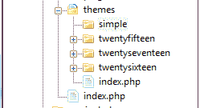
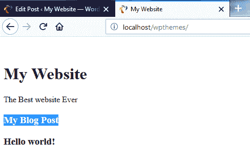

# 使用 WordPress 创建简单主题

欢迎来到 WordPress 主题项目书！在这本书中，我们将从头开始构建 10 个 WordPress 主题。我们将查看构建优秀主题所需的所有基本知识。

在本章中，我们将创建一个非常简单的项目。我们不会真正专注于创建一个令人惊叹的设计；本章更多的是解释我们需要为我们的主题创建的文件，语法，动态片段以及相关主题。

# 安装和设置 WordPress

这个项目将与其他项目略有不同，因为它将是一个入门级项目。我们将学习如何安装和设置 WordPress，以便您可以使用一个全新的安装进行工作。我们将创建一个主题，但我们将更多地关注代码以及整体的外观和风格。我们将创建文件和文件夹，添加 PHP 代码以及相关内容。首先，我想让您熟悉 PHP 代码，然后我们可以添加一些简单的样式。

关于环境，有非常多不同的方式可以运行 WordPress。您可能已经设置了您自己的服务器；如果没有，您可以使用类似 AMPPS 的产品，这就是我将要使用的产品。它为您提供了本地机器上的 Apache 服务器、PHP 和 MySQL。您也可以使用 XAMPP，它与 AMPPS 非常相似，或者 WAMP；还有适用于 Mac 的 MAMP。有非常多不同的选择，但如果您想使用 AMPPS，您可以去 [`ampps.com/`](https://ampps.com/) 下载它。它适用于 Windows、Mac 和 Linux，并且设置起来相当简单。

现在，让我们看看如何安装 WordPress。你们大多数人可能已经知道如何做这件事：

1.  前往链接 [`wordpress.org/download/`](https://wordpress.org/download/) 并点击下载 WordPress 按钮：


1.  下载软件包并前往您的服务器根目录，如下所示：


如果您使用 AMPPS，软件包应该在您的 `C:\` 驱动器或您的路径驱动器中。在 `Ampps` 文件夹中，您会找到一个 `www` 文件夹；这是托管根目录，如前图所示。在大多数情况下，默认文件夹将是 `C:\` 驱动器中的 `Program Files`。

1.  创建一个名为 `wpthemes` 的文件夹；这就是我们将安装 WordPress 的位置。

1.  前往 `Downloads` 文件夹并打开 WordPress 软件包。接下来，将所有文件提取到项目文件夹 `wpthemes` 中。在我们继续之前，我们需要一个数据库，一个 MySQL 数据库。如果您安装了 AMPPS 或者您正在使用 XAMPP 或类似的产品，那么您很可能已经有了 phpMyAdmin，如下所示；这就是我们将要使用的工具。

1.  现在，前往 `http://localhost/phpmyadmin`：


1.  接下来，转到数据库标签页创建一个名为 `wpthemes` 的新数据库并点击创建。我们将看到一个空数据库。

1.  我们将回到我们创建的或从 WordPress 包中带来的文件。你会看到 wp-config-sample.php 文件。我们将将其重命名为 `wp-config`，并去掉 `-sample`。

1.  使用 Sublime Text 作为编辑器打开 `wp-config` 文件。你可以使用你感到舒适的任何编辑器。

1.  现在，在这个编辑器中，我们将更改或添加一些信息：

```php
      /** The name of the database for WordPress */
      define('DB_NAME', 'wpthemes');

      /** MySQL database username */
      define('DB_USER', 'root');

      /** MySQL database password */
      define('DB_PASSWORD', '123456');
```

我们将添加 `DB_NAME`，如图所示，在这个例子中是 `wpthemes`，然后是 `DB_USER`，在这个例子中是 `root`，然后是 `DB_PASSWORD`——你需要输入你数据库的密码。其余的可以保持不变。

1.  我们将保存输入的信息，然后我们应该能够访问 `localhost/wpthemes`：


1.  我们现在可以继续进行安装。如图所示，我们将输入网站标题为 `WordpressDEV` 和用户名为 `admin`。接下来，你需要输入密码；我在这里使用了一个非常弱的密码。输入电子邮件地址后，点击安装 WordPress：


你可以看到 WordPress 已经安装了。


1.  现在，点击登录，这将带我们到管理员登录页面。输入你的用户名和密码，然后它会带你到你的后端：


1.  现在，我们可以点击“访问网站”，如图所示。在新标签页中打开，你会看到一个全新的 WordPress 网站：


这就是我们将会工作的内容。

我相信你们中的很多人都有 WordPress 的经验。

在 `localhost/wpthemes/wp-admin/` WordPress 页面上，我们有我们的帖子区域，我们可以在这里创建和管理帖子：


我们可以有分类，如图所示：


我们还可以看到页面：


网站页面如“关于我们”或“服务”将放在页面中。如果我们转到外观，并点击主题，它将显示已安装的主题，如图所示：


默认情况下，我们有 Twenty Seventeen、Twenty Fifteen 和 Twenty Sixteen，但我们将在本节中创建一个新的主题。

# 创建和启用主题

在本节中，我们将看到如何创建我们的主题文件并启用一个主题。我们将使用 Sublime Text 并添加项目文件夹，这样我们就可以轻松访问文件：

1.  前往 `C:\Ampps\www\wpthemes`。

1.  你想要创建主题的文件夹将是 `themes`，它位于 `wp-content` 文件夹内：


你可以看到这里我们已经有 WordPress 已经安装的三个主题，分别是 `twentyfifteen`、`twentyseventeen` 和 `twentysixteen`。

1.  我们将创建一个新的文件夹，命名为`simple`。这将是我们的主题名称：



你绝对需要两个文件来启用你的主题：一个将是`style.css`，另一个将是`index.php`。现在，我们需要`style.css`的原因是所有我们的声明，比如主题名称和描述，都放在那里。

1.  我们将打开一个注释块并输入字段，如下所示：

你可以参考[`codex.wordpress.org/Theme_Development`](https://codex.wordpress.org/Theme_Development)上的文档，它显示了你可以使用的所有不同字段。我们不会使用它们的所有，因为它们不是必需的。"主题名称"是必需的，但最好还有一些其他信息。


1.  我们将输入`主题名称`为`Simple`。我们还需要有一个`作者`；如果你愿意，可以把自己的名字填在那里。我们还将有`作者 URI`。如果你是为客户创建主题，你可能想在那里放你公司的网站。我们可以有一个`描述`。我们将输入`非常简单的 Wordpress 主题`，然后输入`版本：1.0`。让我们保存这个。现在，仅仅有这些信息就允许 WordPress 看到你的主题。

1.  现在，让我们回到我们的`localhost/wpthemes/wp-admin/themes.php`后端，然后转到外观和主题；你可以看到 Simple 主题，我们实际上可以激活它：


1.  现在，为了让截图在 Simple 主题中显示，我们需要在主题文件夹的根目录中放一个名为`screenshot.png`的图片：


1.  让我们使用 Photoshop 创建一个示例截图，上面写着 SimpleTheme，并将其放置在我们的`theme`文件夹中，如前面的截图所示。转到服务器根目录，`www\wpthemes\wp-content\themes`，然后`simple`。我们只需将截图粘贴在那里。现在如果我们回到后端并重新加载，你可以看到我们有一个截图，如下所示：


嗯，这其实不是一个截图，但它是一张图片。

1.  现在，如果我们继续激活这个主题，并转到我们的前端并重新加载——我们什么都没有，因为我们还没有添加任何代码：


我们的主题什么都没有，它是完全空白的。

1.  现在，让我们打开`index.php`文件并输入`TEST`，然后保存并重新加载；我们可以在前端看到`TEST`：


基本上，它默认读取我们的`index.php`文件。

# 创建 HTML 结构

1.  现在，让我们创建我们的 HTML 结构。我们将放入一些核心 HTML 标签，如下所示：

```php
      <!DOCTYPE html>
      <html <?php language_attributes(); ?>>
      <head>
         <title><?php bloginfo('name'); ?></title>
```

如您所见，我们有`DOCTYPE`、`html`、`head`、`body`和`title`标签。现在，如果您从顶部开始考虑，我们有我们的`<html>`标签；有时，您想在这里包含一个语言，WordPress 有一个函数，我们可以将其包含在这个文件中使其动态。我们可以添加`php language_attributes`，这是一个将确定主题要显示的语言的函数。您可能希望使标题动态，或者想添加您的站点名称；为此，我们可以使用`php`并使用一个名为`bloginfo`的函数，如前一个代码块所示。这非常有用，因为它包含了许多您可以获取的东西，例如站点名称、描述、字符集、URLs 等等。您实际上可以查看文档以了解它具体包含什么。然而，我们将使用`name`。

1.  保存后，您可以返回并重新加载页面。您可以看到标题显示为 WordpressDEV，如这里所示：


如果您还记得，这是我们给站点取的名字。

1.  让我们回到我们的`head`标签并继续。我们需要一个字符集，所以我们将输入`meta charset`。然后，我们也可以在这里使用`bloginfo`，只需传递`charset`：

```php
      <!DOCTYPE html>
      <html <?php language_attributes(); ?>>
      <head>
         <meta charset="<?php bloginfo('charset'); ?>">
         <title><?php bloginfo('name'); ?></title>
```

1.  让我们保存并查看我们的源代码。使用*Ctrl* + *U*，您可以查看语言属性；它说我们使用的是英语美国和字符集是 UTF-8，如这里所示：


这些东西现在可以从 WordPress 内部控制。

# 与样式表一起工作

下一步我们将要做的是包含我们的样式表：

1.  打开`style.css`文件并输入以下代码：

```php
      body{
          background:#000;
      }
```

1.  保存并重新加载；由于样式表没有被读取，我们将不会得到黑色背景：


1.  为了让这个样式表被看到，我们将输入以下代码：

```php
      <!DOCTYPE html>
      <html <? php language_attributes(); ?>>
      <head>
         <meta charset="<?php bloginfo('charset'); ?>">
         <title><?php bloginfo('name'); ?></title>
         <link rel="stylesheet" 
 href="<?php bloginfo('stylesheet_url'); ?>">
```

上述代码将从正确的位置获取样式表。

1.  保存此代码并重新加载。现在我们可以看到黑色背景：


所以我们在样式表中放入的任何内容现在都将被注册。

# 在`head`标签中添加一个函数

我们接下来将看到如何在`<head>`标签中输入一个名为`wp_head()`的函数。这会将所需的所有附加信息放入`head`标签中。例如，当您安装一个插件并且，比如说，它需要包含一个样式表，或者需要在`head`中做些事情，为了这样做，我们需要输入以下代码。所以当您创建插件时，您可以让内容直接在`head`中弹出：

```php
<!DOCTYPE html>
<html <? php language_attributes(); ?>>
<head>
   <meta charset="<?php bloginfo('charset'); ?>">
   <title><?php bloginfo('name'); ?></title>
   <link rel="stylesheet" href="<?php bloginfo('stylesheet_url'); ?>">
   <?php wp_head(); ?>
```

在下面的源代码中，我们现在有一堆其他的东西，这些都是从那个`wp_head()`函数来的：


如果我继续移除`wp_head()`函数，然后返回并重新加载，它只会给我们`index.php`文件中的内容。所以我们需要`wp_head()`函数：


在下一节中，我们将开始构建主体。我们将看到如何获取文章、创建菜单等。

# 构建 HTML 主体

我们现在将看到如何在主体中添加基本的 HTML 标签：

1.  我们将创建一个 `<header>` 标签，这是一个 HTML5 标签。我们将输入一个 `<h1>` 标签，在这个标签中我们将添加网站名称：

```php
      <header>
         <h1><?php bloginfo('name'); ?></h1>
      </header>
```

1.  我们实际上可以从之前看到的 `<title>` 标签中获取动态代码，并将其放入 `<h1>` 中。现在如果我们保存并查看我们的前端，我们得到“WordpressDEV”：


1.  现在，如果我们想更改前端输出，我们可以转到设置，并将网站标题更改为“我的网站”：


1.  保存设置。现在，我们可以看到变化。

1.  除了名称外，我们还可以包括一个标语。为此，我们将输入 `<small>` 标签，但我们将使用 `description` 而不是 `name`，如下面的代码块所示：

```php
      <header>
         <h1><?php bloginfo('name'); ?></h1>
         <small><?php bloginfo('description'); ?></small>
      </header>
```

1.  当你重新加载时，你可以看到我们得到“这只是另一个 WordPress 网站”：


1.  我们可以在设置中进行更改。我们在标语文本框中输入“史上最佳网站”：


1.  保存更改，并在 `span` 标签中放入 `description`，如下面的代码块所示：

```php
      <h1><?php bloginfo('name'); ?></h1>
      <span><?php bloginfo('description'); ?></span>
```

1.  当我们重新加载时，我们得到这个：


1.  现在，让我们添加更多的 HTML 标签，如下面的代码块所示：

```php
         <header>
            <h1><?php bloginfo('name'); ?></h1>
            <span><?php bloginfo('description'); ?></span>
         </header>

         <div class="main">
 <?php if(have_posts()) : ?>
 post found
 <?php else : ?>
 <?php echo wpautop('Sorry, No posts were found'); ?>
 <?php endif; ?>
 </div>
      </body>
      </html>
```

在这里，我们进入 `<header>` 标签并输入 `div` 类作为 `main`。我们将获取我们的博客文章；WordPress 使用一种称为循环或主循环的东西，它会获取你所有的博客文章，无论类别或任何其他内容。不指定任何限制，它将获取每一篇文章。所以，我们首先要做的是检查是否有文章。我们将使用一个 `if` 语句来做这件事，然后使用简写。我们将使用帮助我们快速进入和退出 `php` 的语法。然后，我们将使用 `if(have_posts)` 来查看 WordPress 中是否有文章。我们还会在这里放一个 `else` 语句，这样如果没有任何文章，我们只想让用户知道这一点。现在，我们不再只是输出文本，我们将使用一个函数。我们将说 echo `wpautop`；这个函数的作用是将双行换行符自动转换为段落。当你只想输出文本时，这是一个很好的函数。我们将说，“抱歉，没有找到文章”。然后，在 `if(have_posts)` 内部，我们将使用 `post found`。让我们去重新加载，你可以看到我们得到“文章找到”：


1.  让我们回到我们的后端，转到帖子；你可以看到我们有“Hello world”。我们将将其移动到回收站，如果我们现在返回并重新加载，我们将得到“抱歉，没有找到文章”，如下面的截图所示：


1.  现在让我们转到回收站并恢复它。我们会看到帖子可以再次被看到。我们现在将看到如何显示这些帖子。我们将在 `if` 语句中的 `post found` 下删除，我们将使用一个带有 `php` 标签的 while 循环来完成这个操作。我们将使用 `while(have_posts)`。现在，在 WordPress 中，我们必须使用一个叫做 `the_post()` 的东西，所以我们将使用 `the_post()`，这在语法上有点奇怪。我从未在其他任何地方真正看到过这个，除了 WordPress，但只需知道你也需要这个。然后，我们将使用 `endwhile`；这又是一个简写语法，所以你也可以只使用花括号。但在这里，当它找到一个帖子时，我们想要获取标题。所以，在一个 `<h3>` 标签中，我们将使用 `<?php the_title(); ?>`，这是一个函数：

```php
      <div class="main">
      <?php if(have_posts()) : ?>
         <?php while(have_posts()): the_post(); ?>
 <h3><?php the_title(); ?></h3>
 <?php endwhile; ?>
      <?php else : ?>
         <?php echo wpautop('Sorry, No posts were found.'); ?>
      <?php endif; ?>
```

1.  让我们去重新加载，现在你可以看到它正在获取“Hello world!”标题：


1.  现在，让我们继续创建一个帖子作为例子。我们将命名为“我的博客帖子”，让我们先获取一些示例文本。我从 [www.lipsum.com](http://www.lipsum.com) 网站上取了一些文本：


我们将添加几个段落并发布它。

1.  现在让我们重新加载；你可以看到它给出了“我的博客帖子”：



1.  现在，为了获取实际内容，我们将直接跳到 `<h3>` 标签并输入 `<?php the_content(); ?>`。正如你所见，WordPress 在函数名称方面确实非常简单：

```php
      <div class="main">
      <?php if(have_posts()) : ?>
         <?php while(have_posts()): the_post(); ?>
            <h3><?php the_title(); ?></h3>
            <?php the_content(); ?>
        <?php endwhile; ?>
      <?php else : ?>
         <?php echo wpautop('Sorry, No posts were found'); ?>
      <?php endif; ?>
      </div>
```

因此，现在，这会从每个博客帖子中获取内容并显示出来：


1.  我们可以用不同的方式显示帖子：日期、作者、分类等等。让我们直接在标题下方添加以下代码块：

```php
         <h3><?php the_title(); ?></h3>
         <div class="meta">
 Created By <?php the_author(); ?>
 </div>
         <?php the_content(); ?>
      <?php endwhile; ?>
```

在这里，我们添加了“由”以及作者的名字。

1.  当我们重新加载时，我们可以看到以下输出：


在这个情况下，admin 是创建帖子的用户的用户名。

1.  现在，如果你想得到日期，你可以添加以下代码：

```php
      Created By <?php the_author(); ?> on <?php the_date(); ?>
```

1.  当我们重新加载时，我们得到“由 admin 创建于 2017 年 12 月 12 日”；基本上，它给我们日期：


1.  我们现在将看到如何格式化日期。你可以用很多不同的方式来格式化日期；如果你知道 PHP 并且使用过日期函数，你知道有很多不同的格式化选项。

    我们将查看 `php.net/manual/en/function.date.php` 中的一个这样的例子：

```php
      Created By <?php the_author(); ?> on <?php the_date('l jS \of F
          Y h:i:s A'); ?>
```

1.  让我们看看这会给我们带来什么。你可以看到以下截图中的格式，包括日期、时间以及上午或下午：


我喜欢做的一件事是使用时间而不是日期：

```php
Created By <?php the_author(); ?> on <?php the_time(); ?>
```

这只会给你时间；它不会给你日期，但你实际上可以格式化它以显示日期：

```php
Created By <?php the_author(); ?> on <?php the_time('F j, Y g:i a'); ?>
```

如果我们看一下，它会给我们日期和时间：


所以这完全取决于你，一切都取决于你的喜好。

现在，让我们做一些样式调整。我们将看到如何添加底部的`<footer>`标签，并添加一个段落使其动态。我们可以放一个版权符号，然后对于年份，我们不仅可以直接输入年份，还可以使用`the_date()`，然后只需传入参数`Y`，如下所示：

```php
<footer>
   <p>&copy; <?php the_date('Y'); ?></p>
</footer>
```

所以我们得到© 2017：


然后，如果我们想获取网站名称，我们只需说`bloginfo`并传入`name`：

```php
<footer>
   <p>&copy; <?php the_date('Y'); ?> - <?php bloginfo('name'); ?></p>
</footer>
```

所以现在我们有一个动态的页脚。

# 基础样式

现在，让我们添加一些基础样式。为此，我们将与样式表一起工作。现在，这个项目的整体想法实际上并不是创建一个看起来很棒的主题，我只是想让你熟悉 PHP 代码以及主题是如何设置的。

1.  让我们输入以下代码：

```php
      body{
          font-family: Arial;
          font-size:15px;
          color:#333;
          background:#f4f4f4;
          margin:0;
          padding:0;
          line-height: 1.7em;
      }

      header{
          background: #393939;
          color:#fff;
          padding:20px 10px;
      }

      header h1{
          color:#fff;
          margin:0;
      }
```

1.  保存代码并重新加载。你会得到以下结果：


你可以看到顶部的空白区域；这是因为我们以管理员身份登录，所以即使在前端它也知道这一点，并且试图显示管理员栏。现在，它没有显示管理员栏，因为我们没有显示它的特殊功能。

1.  让我们转到`index.php`，在结束`body`之前，我们将添加`<?php wp_footer(); ?>`：

```php
        <footer>
           <p>&copy; <?php the_date('Y'); ?> - <?php bloginfo('name'); ?>
           </p>
        </footer>

        <?php wp_footer(); ?>
     </body>
     </html>
```

1.  保存此代码并重新加载。你可以看到我们有了管理员栏：


1.  我们将在底部的`h1`上添加一点填充：

```php
      header h1{
          color:#fff;
          margin:0;
          padding:0;
          padding-bottom: 10px;
      }
```

1.  我们还将向代码中添加一个`container` div，如图所示：

```php
      .container{
          width:1020px;
          margin:0 auto;
          overflow: auto;
      }
```

我们已将`width`设置为`1020 px`，`margin`设置为`0 auto`，以及`overflow`设置为`auto`。

1.  我们现在将转到`index.php`，到`<header>`标签，并输入此代码：

```php
      <header>
         <div class ="container">
         <h1><?php bloginfo('name'); ?></h1>
         <span><?php bloginfo('description'); ?></span>
         </div>
      </header>
```

1.  我们将在`main`上添加相同的代码：

```php
      <div class="main">
         <div class="container">
      <?php if(have_posts()) : ?>
```

1.  对于`footer`，也会一样：

```php
      <footer>
         <div class="container">
            <p>&copy; <?php the_date('Y'); ?> - <?php bloginfo('name'); ?>
            </p>
         </div>
      </footer>
```

1.  当你重新加载时，你可以看到所有内容都移动到了中间。

1.  让我们在`footer`上添加一些样式。只需复制我们在头部中有的样式。我们还将文本对齐到中心：

```php
      footer{
          background: #393939;
          color:#fff;
          padding:10px 10px;
          text-align: center;
      }
```

1.  接下来，我们将向`main` div 添加`margin`：

```php
      .main{
          margin:15px 0;
      }
```

1.  让我们重新加载，这就是我们得到的结果：


你可以看到我们有我们的头部和主要内容区域，我们在这里遍历帖子并显示它们，以及我们的页脚区域。

现在，WordPress 中的常见做法是将头部和页脚拆分成各自的文件，然后在索引中包含它们。

1.  要做到这一点，我们现在将创建一个新文件，命名为`header.php`，然后创建一个名为`footer.php`的新文件。

1.  让我们转到`index.php`文件，并剪切以下代码块中的部分，如下所示：

```php
      <!DOCTYPE html>
      <html <?php language_attributes(); ?>>
      <head>
         <meta charset="<?php bloginfo('charset'); ?>">
         <title><?php bloginfo('name'); ?></title>
         <link rel="stylesheet" 
          href="<?php bloginfo('stylesheet_url'); ?>">
         <?php wp_head(); ?>
      </head>
      <body>
         <header>
            <div class="container">
               <h1><?php bloginfo('name'); ?></h1>
               <span><?php bloginfo('description'); ?></span>
            </div>
         </header>
```

1.  我们将用`php get_header`替换高亮显示的部分：

```php
      <?php get_header(); ?>
```

1.  进入`header.php`，粘贴之前剪切的代码，并保存。

1.  我们现在将对`footer`做同样的事情：

```php
        <footer>
           <div class="container">
              <p>&copy; <?php the_date('Y'); ?> - <?php bloginfo('name'); 
                 ?>
              </p>
           </div>
        </footer>

        <?php wp_footer(); ?>
      </body>
      </html>
```

1.  我们将剪切前面代码块中显示的代码，并用`php get_footer()`替换它，如下所示：

```php
      <?php get_footer(); ?>
```

1.  将在第 18 步中剪切的`footer`代码粘贴到`footer`文件中。输出将看起来完全一样。

接下来，我们将看到点击这些帖子是如何带我们到实际的单独帖子页面的。

# 单个帖子和小缩略图

现在，我们将查看单篇帖子页面。目前，我们有来自我们网站的帖子滚动条，但仅此而已；我们无法点击它并进入单个帖子，在那里我们会看到评论等。所以让我们继续工作：

1.  让我们转到`index.php`文件并使标题可点击。我们将给标题添加一个链接。为此，让我们转到以下代码中的`<h3>`标签；添加一个`<a>`标签，并将其包裹在`<title>`标签周围：

```php
      <?php get_header(); ?>
         <div class="main">
            <div class="container">
               <?php if(have_posts()) : ?>
                  <?php while(have_posts()): the_post; ?>
                     <h3>
                     <a href="<?php the_permalink(); ?>">
                        <?php the_title(); ?>
                     </a>
                     </h3>
                     <div class="meta">
                     Created By <?php the_author(); ?> on <?php the_time('F 
                         j, Y g:i a'); ?>
                     </div>
                     <?php the_content(); ?>
                  <?php endwhile; ?>
               <?php else : ?>
                  <?php echo wpautop('Sorry, No posts were found.'); ?>
               <?php endif; ?>
            </div>
         </div>
         <?php get_footer(); ?>
```

1.  让我们保存并重新加载：


现在你将看到标题上有一个链接。例如，当我们点击我的博客帖子时，它会带我们到帖子。

1.  让我们给链接添加一点样式。我不喜欢链接的颜色；我还想使描述加粗，以便突出显示。将每个帖子包裹在其自己的`div`中是个好主意。在我们有`while`的地方，我们将它放在`<article>`中，如下面的代码所示：

```php
      <?php get_header(); ?>
         <div class="main">
            <div class="container">
               <?php if(have_posts()) : ?>
                  <?php while(have_posts()): the_post(); ?>
                     <article class="post">
                        <h3>
                        <a href="<?php the_permalink(); ?>">
                           <?php the_title(); ?>
                        </a>
                        </h3>
                        <div class="meta">
                        Created By <?php the_author(); ?> on 
                        <?php the_time('F j, Y g:i a'); ?>
                        </div>
                        <?php the_content(); ?>
                     </article>
                  <?php endwhile; ?>
               <?php else : ?>
                  <?php echo wpautop('Sorry, No posts were found'); ?>
               <?php endif; ?>
            </div>
         </div>
```

1.  然后，在我们的样式表中，让我们添加颜色：

```php
      a{
          color:#333;
      }
```

颜色将和文本一样。

1.  现在，我们将使用以下代码在底部添加一个边框：

```php
      article.post{
          border-bottom:1px #ccc solid;
      }
```

1.  当你重新加载时，你可以看到底部的边框：


1.  现在我们有了标题。标题有一个链接，但通常我们还会看到一个“阅读更多”按钮，所以让我们继续添加它。我们只需要添加以下代码块中的代码。我们将说“阅读更多”并给它一个按钮的类：

```php
      Created By <?php the_author(); ?> on <?php the_time(
        'F j, Y g:i a'); ?>
      </div>
      <?php the_content(); ?>
      </article>
      <br>
      <a class="button" href="<?php the_permalink(); ?>">
 Read More
 </a>
```

1.  现在，我们应该有一个指向`Read More`的链接。为了做到这一点，我们将添加以下代码块：

```php
      article.post{
          border-bottom:1px #ccc solid;
          overflow:hidden;
      }

      article.post a.button{
          display:inline-block;
          background:#333;
          color:#fff;
          padding:10px 5px;
          margin-bottom: 10px;
          text-decoration: none;
      }
```

1.  我们现在可以进入单页，如下面的截图所示：


1.  现在，在单页中，我们不希望我的博客帖子是一个链接；这有点愚蠢，所以我们要改变它。还有其他一些我们想要的东西。我们还想有一个评论表单，所以我们需要为单个帖子有一个特殊的页面。

1.  因此，我们将在我们的主题中创建一个新文件，我们将其称为`single.php`，让我们先叫它`TEST`。

1.  如果我们回到单页并重新加载，我们会得到 TEST。如果我们回到我们的主网站，也就是我们的主要滚动条，它和之前一样，但如果我们进入一个单页，我们只会得到 TEST，因为它是自动查看`single.php`文件的。所以我们可以做的是从`index.php`复制代码，并且我们可以将这段代码作为一个起点。如果我们把它粘贴到`single.php`并保存，它就会显示相同的结果。现在我们可以在`single.php`文件中更改我们想要的任何内容，并且它只会对单页生效。

1.  我们可以在代码中移除链接和`Read More`；显然，我们不会想要这些。所以现在我们有一个单页：


1.  让我们在单页上添加一点样式。为此，我们将使`meta`，就像这里展示的那样：

```php
      .meta{
          background:#333;
          color:#fff;
          padding:5px;
      }
```

如你所见，我在帖子的底部也添加了一些填充。

我并不是想要在样式上大做文章，因为正如我所说的，我只是想让你学会编写代码，而不是学习如何创建一个出色的设计；我们会在稍后深入这个话题。

# 在帖子中添加图片

现在，如果我们转到这里显示的表单来添加一篇帖子，你会在右侧看到没有特色图片框，你可能在其他 WordPress 主题或网站上见过。原因是我们没有包含这个功能：


1.  让我们进入我们的`themes`文件夹，我们将创建一个文件并保存为`functions.php`。现在，这就是我们可以放置自定义函数的地方；这是我们可以钩入代码的某些部分、注册小工具和做所有这些的地方——基本上，任何事情都是动态的。

1.  这里，我们将创建一个设置函数。为此，我们将添加以下代码块：

```php
      <?php
      function simple_theme_setup(){
          // Featured Image Support
          add_theme_support('post-thumbnails');
      }
      add_action('after_setup_theme', 'simple_theme_setup');
```

这里，我们添加了一个注释，`Featured Image Support`，然后是一个名为`add_theme_support`的函数。现在，如果我们就这样留下它，这个函数是不会运行的。因此，我们使用了`add_action`和某些钩子，我们可以将其钩入并运行这个函数。我们想要的钩子是`after_setup_theme`。然后，第二个参数将是函数的名称。我们将保存它并运行它。

1.  让我们返回并重新加载这个页面：


现在你可以看到底部有一个特色图片框。如果我们点击它，就可以上传文件，就像这里展示的那样：


1.  现在，我会选择一个图片并保存它，这样你就可以看到它已经插入，然后我们可以点击更新：


现在，如果我们去前端并重新加载，我们可能还看不到它，因为我们没有将它添加到我们的`index.php`文件中。

1.  让我们去`index.php`文件。你不必在索引中显示图片。如果你想的话，你可以在单页中显示它，但通常你希望它在两个页面上都显示。所以，在`index.php`中，我们只需在`meta`下面添加图片，就像这里展示的那样：

```php
      <div class="meta">
      Created By <?php the_author(); ?> on <?php the_time(
        'F j, Y g:i a'); ?>
      </div>
      <?php if(has_post_thumbnail()) : ?>
 <div class="post-thumbnail">
 <?php the_post_thumbnail(); ?>
 </div>
 <?php endif; ?>
```

起初，它可能看起来不太理想，但我们稍后会修复它。在先前的代码中，我们首先使用`if`语句检查是否有图片。如果有缩略图，我们将创建一个`<div>`标签。我们将给它一个`post-thumbnail`的类，然后添加`php the_post_thumbnail`，就像先前的代码块中展示的那样。

1.  让我们保存它，返回并重新加载。你会得到以下结果：


现在，它看起来有点不协调，因为它没有覆盖整个页面，但我们实际上会在添加小工具时放一个侧边栏，这样看起来会好很多。然而，我打算在 CSS 中添加一个宽度为`100%`的样式，在这里我们有这个帖子，`class="post-thumbnail"`。

1.  让我们进入我们的样式表并添加以下代码块：

```php
      .post-thumbnail img{
          width:100%;
          height:auto;
      }
```

对于图片，我们希望宽度为 100%，并且可以保持`height:auto`。

1.  当我们重新加载时，我们可以看到它覆盖了整个页面：


我知道这真的很宽，但就像我说的，我们会在里面放一个侧边栏，这样就会缩小一点。

1.  现在我们还希望在单篇文章页面上显示图片。所以我们将从`index.php`复制代码并粘贴到`single.php`文件中，紧挨着`meta`标签下方：

```php
      <div class="meta">
      Created By <?php the_author(); ?> on <?php the_time(
        'F j, Y g:i a'); ?>
      </div>
      <?php if(has_post_thumbnail()) : ?>
         <div class="post-thumbnail">
            <?php the_post_thumbnail(); ?>
         </div>
      <?php endif; ?>
```

现在，我们也会在单篇文章页面上显示相同的图片。

如你所见，在索引页面上的文章中，它显示了全部内容，但我们只想显示一部分内容。

1.  要做到这一点，让我们去`index.php`文件，而不是说`the_content`，我们实际上可以说`the_excerpt`，如下面的代码所示：

```php
      <?php the_excerpt(); ?>
```

这将做到的是，它会将内容截断到大约 55 个单词。你实际上可以自定义这个长度，让它更长或更短，而且这实际上非常简单。

1.  前往`functions.php`文件并创建一个自定义函数，如下所示：

```php
      <?php
      function simple_theme_setup()>{
          // Featured Image Support
          add_theme_support('post-thumbnails');
      }

      add_action('after_setup_theme', 'simple_theme_setup');

      // Excerpt Length
      function set_excerpt_length(){
          return 25;
      }

      add_filter('excerpt_length', 'set_excerpt_length');
```

我们只需说`set_excerpt_length`，我们在这里需要做的只是返回一个数字，比如说我们希望它是`25`。然后，我们可以做的是，而不是`add_action`，我们说`add_filter`，因为`add_action`通常用于添加或创建某些内容；`add_filter`通常用于更改某些内容。我们想要钩入的过滤器称为`excerpt_length`。然后，我们只需输入我们函数的名称，即`set_excerpt_length`。

1.  如果我们返回并重新加载，我们可以看到它只有 25 个单词长。如果你想让它更长，比如说返回 60 个单词。我只是想让你知道这是可能的。

因此，我们已经设置了索引页面，并且设置了单篇文章页面（除了稍后我们将处理的评论）。然而，在下一节中，我们将看到如何创建菜单，并开始处理页面以及文章。

# 页面和菜单

在本节中，我们将开始查看页面和菜单。除了在 WordPress 中创建文章外，我们还可以创建页面：

1.  如果我们进入后台点击“页面”，你会看到我们有一个示例页面：


1.  让我们创建一个新的页面，我们将其命名为“关于页面”。然后我们只需抓取一些内容，比如两段文字。让我们点击“发布”：


1.  因此，我们有一个“关于”页面，还有一个“示例页面”。让我们再创建一个，命名为“服务”。现在我们需要某种导航。让我们继续做。

1.  为了使用菜单系统，我们需要编辑`functions.php`文件，因为现在如果我们转到外观，没有菜单选项。所以让我们打开`functions.php`并输入以下代码：

```php
      <?php
      function simple_theme_setup(){
          //Featured Image Support
          add_theme_support('post-thumbnails');

          //Menus
 register_nav_menus(array(
 'primary' => __('Primary Menu')
 ));
      }

      add_action('after_setup_theme', 'simple_theme_setup');
```

在我们创建的`simple_theme_setup`函数中，我们将添加`register_nav_menus`。然后我们将传递一个数组，为此，我们将设置主版本和可读版本。我们将使用双下划线函数；虽然这里不需要引号。这是一个本地化函数，它与在主题中使用多种语言有关。所以我们将输入`Primary Menu`然后保存。

1.  现在，如果我们去后台，重新加载，并转到外观，你会看到我们有这个菜单选项：


1.  如果我们点击创建菜单，现在你可以看到默认情况下它包含了网站上所有的页面，如果你想的话可以移除一些：


如果你想要添加页面，你可以轻松做到；点击添加到菜单。我们在这里保留我们已有的内容，然后我们需要确保选择主菜单，在它说主题位置的地方。我们将保存这个。

1.  现在，如果我们去前端并重新加载，我们什么也看不到，因为我们还没有在我们的头部文件中包含它；这就是我们想要添加菜单的地方，因为我们想要它在每个页面上。

1.  让我们在`<header>`标签的正下方创建一个`<nav>`标签，如下所示：

```php
      <!DOCTYPE html>
      <html <?php language_attributes(); ?>>
      <head>
         <meta charset="<?php bloginfo('charset'); ?>">
         <title><?php bloginfo('name'); ?></title>
         <link rel="stylesheet" 
          href="<?php bloginfo('stylesheet_url'); ?>">
         <?php wp_head(); ?>
      </head>
      <body>
         <header>
            <div class="container">
               <h1><?php bloginfo('name'); ?></h1>
               <span><?php bloginfo('description'); ?></span>
            </div>
         </header>
         <nav class="main-nav">
 <div class="container">
 <?php 
 $args = array(
 'theme_location' => 'primary'
 ); 
 ?>
 <?php wp_nav_menu($args); ?>
 </div>
 </nav>
```

我们将添加一个`main-nav`类，然后将其包裹在一个容器中。然后，我们只需要打开一些`php`标签并创建一个名为`args`的变量。这仅仅是一个将要持有参数数组的变量；我们现在只需要一个，那就是`theme_location`。我们基本上指定了我们想要放在这里的菜单，那将是`primary`，这是我们唯一拥有的一个。然后，我们可以调用一个名为`wp_nav_menu`的函数，并传入那个`args`变量。让我们保存这个。

1.  前往前端，重新加载，那里是我们的菜单：


菜单包含我们创建的所有页面。

1.  如果我们想删除一个，请转到菜单，选择我们想要删除的`Sample Page`，保存，重新加载，现在它就消失了：


1.  为了稍微样式化一下，让我们去`style.css`并添加以下代码：

```php
     .main-nav{
         background:#000;
         color:#fff;
         padding:5px;
     }

     .main-nav ul{
         margin:0;
         padding:0;
     }

     .main-nav li{
         list-style:none;
         float:left;
         padding-right:15px;
     }

     .main-nav a{
         color:#fff;
         text-decoration:none;
     }
```

我们将添加`main-nav`并为其设置背景；我们将添加黑色背景和白色文本。为了样式化列表项，我们将添加`main-nav li`；首先我们想要移除项目符号，所以我们会说`list-style: none`，然后我们想要将这些菜单浮动到左边。我们还将添加`padding-right:15px`，然后添加链接；确保它们是白色的，并移除文本装饰。接下来我们将添加`ul`，我们将移除默认的外边距和填充。然后我们在`main-nav`上添加一些填充，比如`5px`。

1.  当我们重新加载时，我们有一个小的导航菜单：


1.  如果我们点击“关于”，它将带我们到“关于”页面，服务也是一样。现在您会注意到，当我们去“关于”时，它已经按照 `index.php` 页面的方式格式化，就像它是一个帖子一样——但它不是，它是一个页面：


我们将不需要元数据或“阅读更多”链接。所以我们需要做的是在我们的主题中添加另一个页面。

1.  让我们创建一个新文件，并将其保存为 `page.php`。

1.  现在我如果返回并重新加载，它会变成空白，因为它正在查看空文件。所以我们可以做的是复制 `index.php` 中的代码，并在 `page.php` 中使用它。

1.  我们将在代码中做以下几处更改：

```php
      <?php get_header(); ?>
         <div class="main">
            <div class="container">
               <?php if(have_posts()) : ?>
                  <?php while(have_posts()): the_post(); ?>
                     <article class="post">
                        <h3>
                           <?php the_title(); ?>
                        </h3>
                        <?php if(has_post_thumbnail()) : ?>
                           <div class="post-thumbnail">
                              <?php the_post_thumbnail(); ?>
                           </div>
                        <?php endif; ?>
                        <?php the_content(); ?>
                        <br>
                     </article>
                  <?php endwhile; ?>
               <?php else : ?>
                  <?php echo wpautop('Sorry, No posts were found.'); ?>
               <?php endif; ?>
            </div>
         </div>

      <?php get_footer(); ?>
```

我们首先要做的是从标题中移除链接，因为我们不想去其他地方。此外，我们可以完全删除 `Read More`。它还有一个摘要，我们不需要；我们想要整个内容，所以我们将它改为 `the_content()`。然后，在 `meta` 中，我们可以删除整个 div 并保存它；让我们看看：


现在它看起来更像是一个常规的网页。我们将对服务做同样的事情。这就是您如何创建页面以及如何为目标页面标记的方法。您还可以创建自定义页面和自定义模板；您可以为不同的页面设置不同的布局，但我们将在下一个项目中详细介绍。构建主题还有很多其他内容。还有很多您可以在本项目中做的事情，但我们不会在本项目中涉及，我只是想在本项目中介绍基础知识。我们现在有了页面和菜单。在下一节中，我们将讨论小部件位置，因为我们现在想要能够有一个带有小部件的侧边栏。

# 小部件位置和评论

现在我将向您展示如何在主题中创建小部件位置。我们将有一个小部件位置，它将在侧边栏中。让我们开始吧！

# 与小部件一起工作

1.  让我们看看 `index.php`，在那里我们有一个具有 `main` 类的 `<div>` 标签。我们想要做的是在 `main` 和结束的 `</div>` 标签之间直接进入。我们将创建一个具有 `sidebar` 类的 `<div>` 标签，如下面的代码所示：

```php
      <div class="sidebar">
      TEST
      </div>
```

我们还在下一行添加了 `TEST`，它显示如下：


现在我们想要浮动主 `<div>` 并设置宽度，然后让侧边栏向右浮动。

1.  让我们去样式表，在那里我们有 `main` 并带有 `margin:15px`，在顶部和底部都有。让我们将其浮动到左边，并设置宽度为 `68%`，如下面的代码块所示：

```php
      .main{
          margin:15px 0;
          float:left;
          width:68%;
      }

      footer{
          background:#393939;
          color:#fff;
          padding:10px 10px;
          text-align:center;
      }
```

让我们看看这会给我们带来什么：


这个看起来真的很奇怪的原因是因为我们没有清除浮动。

1.  所以我们将进入 `sidebar` div 并输入 `<div class="clr">`：

```php
      <div class="sidebar">
      TEST
      </div>

      <div class="clr"></div>
```

1.  现在，我们将进入我们的 CSS，添加一个名为 `clr` 的类，我们只需说 `clear:both;`：

```php
      .clr{
          clear:both;
      }
```

1.  然后让我们添加`sidebar`类；这将向右浮动，我们将设置宽度为`28%`，如下面的代码所示：

```php
      .sidebar{
          float:right;
          width:28%;
      }
```

1.  现在，我们想要在两个文件周围放一个容器——`index.php`和`style.css`，因为现在`main`内部有一个容器，但我们想要移除它，并将其放在`main`之上，如下面的代码所示：

```php
      <?php get_header(); ?>

      <div class="container">
         <div class="main">
```

我们将在这里结束：

```php
         <div class="sidebar">
         TEST
         </div>

         <div class="clr"></div>
      </div>
      <?php get_footer(); ?>
```

现在，让我们运行这个：


1.  因此，现在我们有了主区域和一个侧边栏。

1.  接下来，我们将看到如何添加小部件，为此，我们将进入`functions.php`。在这里，我们实际上可以使用小部件并定义我们希望小部件允许的位置。我们将文件拉到最底部并创建一个函数，如下面的代码块所示。我们将称之为`init_widgets`，它将接受`id`，我们将称之为`register_sidebar`。现在我们将创建一个侧边栏小部件，但要知道无论你把它放在哪里，`register_sidebar`都是我们将使用的函数，即使它不是一个侧边栏——如果它在下面，或者在页眉中，或者任何其他地方，这是实际注册小部件位置所使用的。现在，这将接受一个数组，它将接受一个`name`；让我们将其设置为`Sidebar`，然后是 ID，通常是相同的，只是小写且没有空格。如果有多个单词，可以使用连字符。然后，我们还可以使用`before_widget`。我们还可以使用`<div class="side-widget">`，然后我们可以添加`after_widget`；这将是一个结束的`</div>`标签。然后，我们还可以为小部件添加`before_title`和`after_title`，如下面的代码块所示。我们想在标题之前有一个`<h3>`标签。现在，这段代码还没有运行。我们需要执行`add_action`，我们想要的钩子叫做`widgets_init`；我们想要输入我们的函数名，即`init_widgets`：

```php
      //Excerpt Length
      function set_excerpt_length(){
          return 60;
      }

      add_filter('excerpt_length', 'set_excerpt_length');

      //Widget Locations
 function init_widgets($id){
 register_sidebar(array(
 'name' => 'Sidebar',
 'id' => 'sidebar',
 'before_widget' => '<div class="side-widget">',
 'after_widget' => '</div>',
 'before_title' => '<h3>',
 'after_title' => '</h3>'
 ));
 }

 add_action('widgets_init', 'init_widgets');
```

1.  现在我们将保存代码。如果我们返回并重新加载，我们会得到以下内容：


我们在侧面有一个小部件项和一个侧边栏位置。

1.  让我们把分类小部件拖动并带到侧边栏。我们还将把最近的文章也拖过来：


保存并转到前端；如果我们现在重新加载，我们什么也看不到，因为我们需要将其添加到我们的模板中。

1.  让我们下滑到`index.php`文件中侧边栏的位置，我们首先会使用以下代码检查小部件：

```php
      <div class="sidebar">
         <?php if(is_active_sidebar('sidebar')) : ?>
 <?php dynamic_sidebar('sidebar'); ?>
 <?php endif; ?>
      </div>
```

我们将检查它是否是一个名为`is_active_sidebar()`的函数，就像我之前说的，即使它不是一个侧边栏，这仍然会起作用。我们还将添加我们的位置，它恰好是侧边栏。我们还将添加一个`dynamic_sidebar()`函数，然后小部件的 ID 再次是侧边栏。

1.  保存它，重新加载，然后看看它：


我们得到了两个小部件：分类和最近的文章。

1.  现在，记得我们在 `function.php` 文件中添加了 `side-widget` 类，这样我们就可以使用 `style.css` 文件来样式化小工具，如下面的代码块所示：

```php
      .side-widget{
          border:1px #ccc solid;
          padding:10px 10px;
          margin-bottom:20px;
          margin-top:20px;
      }
```

我们添加了带有 `10px 10px` 边框和填充的 `side-widget`。我们添加了 `margin-bottom`。现在如果我们重新加载，你可以看到它们有边框。因此，我们也会添加 `margin-top`。我们说 `margin-top:20px`。

1.  为了使这个看起来更好，我们将使用以下代码：

```php
      .Side-widget li{
          list-style: none;
          line-height:2.2em;
          border-bottom:dotted 1px #ccc;
      }

      .Side-widget a{
          text-decoration: none;
      }
```

这里，我们已经移除了 `text-decoration`。

1.  保存并重新加载后，你会得到这个：


所以这个看起来不错。

1.  我们可以看到现在页面会变得混乱：


这是因为在 `page.php` 中，我们仍然在 `main` 中有 `container` 类。

1.  我们要做的就是复制 `index.php` 中所做的操作：

```php
         <div class="sidebar">
            <?php if(is_active_sidebar('sidebar')) : ?>
               <?php dynamic_sidebar('sidebar'); ?>
            <?php endif; ?>
         </div>

         <div class="clr"></div>
         </div>
      <?php get_footer(); ?>
```

我们需要在 `main` 结束后添加侧边栏，然后我们实际上想要将容器移出并放在 `main` 之上。我们需要确保将结束的 `</div>` 标签放在外面。

1.  让我们继续检查一下：


所以这个看起来不错。

1.  我们将对 `Single.php` 重复同样的操作，并将得到以下结果：


所以所有不同的格式和所有不同的页面都已经设置好了；它们实现了侧边栏。当然，如果你不希望在其中一个页面上有侧边栏，你不必有它。如果我们想稍微减少一点代码，我们可以在 `footer.php` 中放入以下代码：

```php
      <div class="sidebar">
      <?php if(is_active_sidebar('sidebar')) : ?>
         <?php dynamic_sidebar('sidebar'); ?>
      <?php endif; ?>
      </div>

      <div class="clr"></div>
      </div>
```

1.  我们可以剪切并保存，然后将该代码添加到 `footer.php` 的顶部，如下所示：

```php
 <div class="sidebar">
 <?php if(is_active_sidebar('sidebar')) : ?>
 <?php dynamic_sidebar('sidebar'); ?>
 <?php endif; ?>
 </div>
      <div class="clr"></div>
      </div>

      <footer>
         <div class="container">
           <p>&copy; <?php the_date('Y'); ?> - <?php bloginfo('name'); ?>
           </p>
         </div>
      </footer>

      <?php wp_footer(); ?>
      </body>
      </html>
```

1.  保存后，从 `page.php` 和 `index.php` 中删除以下代码，因为它现在已经在 `footer.php` 中了：

```php
      <div class="sidebar">
      <?php if(is_active_sidebar('sidebar')) : ?>
         <?php dynamic_sidebar('sidebar'); ?>
      <?php endif; ?>
      </div>

      <div class="clr"></div>
      </div>
```

我们的前端应该看起来完全一样。所以这是好的，这是小工具。

# 添加评论功能

1.  现在，剩下的一件事就是评论功能——我们想要添加评论功能。这实际上非常简单；我们只需要去我们的 `single.php` 文件，看看我们想在哪个位置添加评论，它就在结束的 `</div>` 标签下面，如下面的代码块所示：

```php
         <?php endif; ?>

         <?php comments_template(); ?>
      </div>
```

1.  我们可以保存代码并重新加载。以下是输出结果：


1.  现在，我们可以看到评论功能。让我们添加 `Great Post!` 然后点击发表评论。

这里是我们得到的结果：


1.  我们可以看到它有一个头像、用户名、日期，还有一个回复链接。现在你会意识到这看起来并不是你见过的最好的评论区，但这只是因为它使用了默认设计。

1.  如果我们查看标记，我们可以看到它们将每件事都分开，这样你就可以进行样式化：


这里，我们有`ol commentlist`；每个`<li>`都有一个`comments`类，我们还有作者、`vcard`和回复周围的类。你可以按你喜欢的方式设置样式。

现在，你实际上可以通过创建一个`comments.php`文件来替换整个模板；我们稍后会讨论这个问题。我不想在这个章节中做这件事，因为这个只是一个非常基础的入门主题。

由于评论功能已经正常工作，我们不会继续创建自定义评论模板或类似的东西。我认为这就足够了。就像我说的，我们还能做更多；我们可以为存档帖子创建一个单独的模板。

实际上，我想要快速做的，是将作者的名字变成一个链接，这样你可以点击它，查看作者的所有帖子。

1.  让我们转到`index.php`，找到作者的位置，并输入以下高亮代码：

```php
      Created By
      <a href="<?php get_author_posts_url(
 get_the_author_meta('ID')); ?>">
 <?php the_author(); ?>
 </a>
      on <?php the_time('F j, Y g:i a'); ?>
      </div>
      <?php if(has_post_thumbnail()) : ?>
```

如此所示，我们只需在那个地方添加一个链接。

1.  让我们重新加载，现在管理员已经是一个链接了；我需要改变它的样式，因为我们看不到它。打开`style.css`。进入`meta`并添加以下代码：

```php
      .meta{
          background:#333;
          color:#fff;
          padding:5px;
      }

      .meta a{
          color:#fff;
      }
```

1.  现在我们可以看到作者的名字是白色的：


1.  如果我现在点击管理员，它会显示管理员的所有帖子，但如果有多位用户——多位作者——这将允许我们查看该特定作者的所有帖子。

1.  我们在这里结束。你可能意识到这并不是你见过的最好的设计，但这个项目的目的是让你熟悉代码，以及主题的结构和包含的文件。正如我们所看到的，我们需要某些文件名，比如`page`和`single.php`。

# 摘要

希望你喜欢这一章。

在这一章中，我们首先安装并设置了 WordPress。然后我们继续创建并启用主题。我们还创建了一个 HTML 结构和主体，并对其应用了一些基本样式。我们处理了单篇文章、缩略图、页面和菜单。后来，我们看到了如何将图片和链接添加到文章中。最后，我们看到了如何在主题中创建小工具位置以及如何将评论功能添加到小工具中。

我们将在这个项目中使用你所学的知识，并将其应用于未来的项目中。随着我们的进行，你还将学到更多。

在下一章中，我们将看到如何构建 WordPress 主题。
