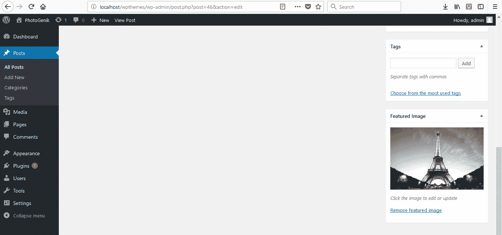

# 为照片图库构建 WordPress 主题

在这一章中，我们将构建一个用于照片图库的 WordPress 主题。我们将仅使用核心 WordPress 帖子系统，我们不需要任何第三方照片图库。以下图片是它将看起来像的样子；它被称为 *PhotoGenik*。这是我们将要工作的主题：


如前一张截图所示，你可以在主页上看到一些图片。如果我们悬停在它们上面，我们会得到一个很好的效果，如果我们点击其中一个，它会带我们到一个单张图片页面，那里有一个进入的小动画。它还提供了标题、描述，然后我们有一些元信息，如以下截图所示：


在上一张截图的左侧顶部，我们看到了核心分类模块。当我们点击它时，你可以看到它只显示该类别的图片，并且它们有一个漂亮的淡入效果。在顶部右侧，我们还有一个搜索栏。在搜索框中，我们只需输入，比如说图片的一个标题，然后搜索；那个特定的图片就会出现。

对于这个项目，我们将使用 W3.CSS 框架([`www.w3schools.com/w3css/default.asp`](https://www.w3schools.com/w3css/default.asp))，它与 Bootstrap 非常相似。它非常容易使用，并且提供了许多漂亮的元素，你可以在 W3.CSS 页面上看到。我们有的动画实际上来自这个框架，还有一些我们将要涉及的 JavaScript 小部件。

在后台（参考以下截图），如果我们查看我们的帖子，你可以看到每张照片都有自己的帖子：


如果我们点击帖子，我们会发现我们使用的是特色图片：



因此，我们只需要上传一个特色图片，给它一个标题、描述，并选择图库格式，它就会出现：


在我们的情况下，我们将有一个自定义的图库帖子格式，你也可以使用标准格式来发布常规帖子。

那就是我们将会做的事情。让我们开始吧。

# 使用 HTML 和 CSS 创建主页布局

在我们开始构建 WordPress 的照片图库主题之前，我们将使用 HTML 创建布局。正如介绍中解释的，我们将使用 W3.CSS 框架来创建这个布局。为此，首先我们将创建一个新的文件夹，并将其命名为 `photogenik_html`：


接下来，在文件夹内，我们将创建一些文件和文件夹。我们将创建 `index.html`、`style.css` 和 `single.html` 文件，还有一个名为 `images` 的文件夹：


`single.html` 文件将代表单个图片。一旦我们在图库中点击一张图片，它就会带我们进入这个文件夹。

# 创建 HTML 布局

现在，让我们用 Sublime Text 打开 `index.html` 文件，或者当然，使用你喜欢的任何编辑器，我们将在编辑器中获得一个基本的 HTML 结构：

```php
<!DOCTYPE html>
<html>
<head>
  <title></title>
</head>
<body>
</body>
</html>
```

现在，在这个 HTML 布局中首先，我们在标题中添加 `PhotoGenik`：

```php
<!DOCTYPE html>
<html>
<head>
  <title>PhotoGenik</title>
</head>
<body>
</body>
</html>
```

由于我们使用的是 W3.CSS 框架，我们必须包含样式表。所以我们在这里将使用 CDN。为此，我们将在 HTML 布局中标题旁边添加以下样式表链接：

```php
<link rel="stylesheet" href="http://www.w3schools.com/lib/w3.css">
```

我们还希望包含我们自己的 CSS 文件，如下所示：

```php
<link rel="stylesheet" href="style.css">
```

所以这就是 `style.css`。现在，这就是我们在 head 中需要的所有内容。

# 创建标题

下一步，我们要做的是创建标题。为了创建这个标题，请按照以下步骤操作：

1.  首先，我们将使用 HTML5 `<header>` 标签，如下所示：

```php
      <!DOCTYPE html>
      <html>
      <head>
        <title>PhotoGenik</title>
        <link rel="stylesheet" 
              href="http://www.w3schools.com/lib/w3.css">
        <link rel="stylesheet" href="style.css">
      </head>
      <body>
        <header>

        </header>
      </body>
      </html>
```

在我们实际构建 WordPress 主题时，一些 HTML 布局可能会发生变化，以适应 WordPress 的约定。

1.  接下来，我们将给这个标题添加一个类。如果我们查看框架的文档页面（[`www.w3schools.com/w3css/default.asp`](https://www.w3schools.com/w3css/default.asp)）并进入 W3.CSS 容器部分，它应该有标题类，如下所示：


1.  现在为了使标题成为一个类，从容器文档页面（[`www.w3schools.com/w3css/w3css_containers.asp`](https://www.w3schools.com/w3css/w3css_containers.asp)）复制标题类语法，并将其粘贴到我们的 HTML 标题中，如下所示：

```php
      <body>
        <header class="w3-container w3-teal">
          <h1>Heading</h1>
        </header>
      </body>
```

1.  让我们确保到目前为止一切都在正常工作。为此，我们将使用 Chrome 打开 `index.html` 文件，如下面的截图所示，我们会找到我们的 `标题`：


所以我们有了我们的标题。在下一个子节中，我们将使用网格系统。

# 添加标题和搜索框

如果你使用过 Bootstrap、Foundation 或其他任何 CSS HTML 框架，那么你就知道网格系统是什么。基本上，**网格系统**给我们提供了 12 列，我们可以设置某些 div 或某些元素跨越一定数量的列。

如果我们访问我们的文档页面，然后进入 W3.CSS 网格布局页面（[`www.w3schools.com/w3css/w3css_grid.asp`](https://www.w3schools.com/w3css/w3css_grid.asp)），你会看到我们需要的语法，如下面的截图所示：


复制前面截图中的示例行，并将其粘贴到标题中，如下所示：

```php
<body>
  <header class="w3-container w3-teal">
    <div class="w3-row">
      <div class="w3-col m4 l3">
        <p>12 columns on a small screen, 4  on a medium screen, 
        and 3 on a large screen.</p>
      </div>
      <div class="w3-col m8 l9">
        <p>12 columns on a small screen, 8  on a medium screen, 
        and 9 on a large screen.</p>
      </div>
    </div>
  </header>
</body>
```

首先，对于第一个 `w3-col` 类，我们将 `l3` 改为 `l9`（这是指**大 9**）。我们使用 `l9` 用于大屏幕，`m4` 用于中屏幕。然而，在这里我们将两者都保持相同——9 列。第二个 `w3-col` 类将具有 `m3` 和 `l3`，如下面的代码所示：

```php
<body>
  <header class="w3-container w3-teal">
    <div class="w3-row">
      <div class="w3-col m9 l9">
        <p>12 columns on a small screen, 4  on a medium screen, 
        and 3 on a large screen.</p>
      </div>
 <div class="w3-col m3 l3">
        <p>12 columns on a small screen, 8  on a medium screen, 
        and 9 on a large screen.</p>
      </div>
    </div>
  </header>
</body>
```

接下来，我们可以移除 `w3-col` 类内部的段落，如下所示：

```php
<header class="w3-container w3-teal">
  <div class="w3-row">
    <div class="w3-col m9 l9">

    </div>
    <div class="w3-col m3 l3">

    </div>
  </div>
</header>
```

在第一个 `w3-col` 类内部，我们将添加标题，这将是一个 `<h1>` 并说 `PhotoGenik`，我们将用 `<span>` 标签包裹 `Photo` 这个词，因为我们将会使它有不同的颜色：

```php
<div class="w3-col m9 l9">
  <h1><span>Photo</span>Genik</h1>
</div>
```

然后在第二个 `w3-col` 类内部，我们将有我们的输入，并且它将有自己的 `w3-input` 类。我们将给它一个 `type` 为 `text`，然后给它一个占位符——`Search...`：

```php
<div class="w3-col m3 l3">
  <input class="w3-input" type="text" 
  placeholder="Search...">
</div>
```

让我们通过重新加载页面来查看这个效果：


# 移动搜索框

现在，我想将搜索框向下移动。为此，我们将进入我们的 `style.css` 文件。在 `style.css` 文件中，我们将添加 `header input` 并将其 `margin-top` 设置为 `15px`：

```php
header input{
  margin-top:15px;
}
```

现在，重新加载我们的 WordPress 页面，你可以看到我们的标题，如这里所示：


# 添加侧边栏和主要区域

接下来，我们想要侧边栏和主要区域，因此我们也会使用网格来实现这一点。首先，我们将查看侧边栏，然后进入主要区域。

# 添加侧边栏

在 `index.html` 文件中，复制 `w3-col` 类，并将其放在标题下方，如这里所示：

```php
  </header>
    <div class="w3-row">
      <div class="w3-col m9 l9">
        <h1><span>Photo</span>Genik</h1>
      </div>
      <div class="w3-col m3 l3">
        <input class="w3-input" type="text" 
        placeholder="Search...">
      </div>
    </div>
  </header>
</body>
</html>
```

因为我们想要侧边栏在左侧，我们将交换列，然后我们可以像这里所示的那样移除内部的内容：

```php
</header>
  <div class="w3-row">
    <div class="w3-col m3 l3">

    </div>
    <div class="w3-col m9 l9">

    </div>
  </div>
</body>
</html>
```

对于三个列（前述代码中的第一个 `w3-col` 类），我们将添加一个分类列表。所以让我们添加 `<ul>` 并给它一个 `w3-ul` 类：

```php
<div class="w3-col m3 l3">
  <ul class="w3-ul">
  </ul>
</div>
```

然后在 `<ul>` 标签内部，我们将有带有链接的 `<li>` 标签。第一个将显示为 `Nature`，这些只是分类。同样，我们还会添加 `Animals`、`Objects`、`People` 和 `Abstract`，如这里所示：

```php
<ul class="w3-ul">
  <li><a href="#">Nature</a></li>
  <li><a href="#">Animals</a></li>
  <li><a href="#">Objects</a></li>
  <li><a href="#">People</a></li>
  <li><a href="#">Abstract</a></li>
</ul>
```

让我们保存这个文件，查看页面，我们可以看到我们的分类：


# 更改侧边栏的背景和文本颜色

现在，我们想要背景为黑色，文本为白色，所以让我们进入我们的样式表并添加一些核心样式。首先，我们将添加 `body`，并给它一个黑色背景和一个白色文本：

```php
body{
  background: #000;
  color: #fff;
}
```

然后，对于链接，我想去掉下划线，所以我们将添加 `text-decoration: none`。对于列表项（`li`），我们不想有任何项目符号，所以我们将添加 `list-style: none`。对于输入，我们希望文本为深色，所以让我们添加 `color: #333`，如这里所示：

```php
a{
  text-decoration: none;
}
li{
  list-style: none;
}
input{
  color: #333;
}
```

让我们保存这个，然后我们可以看到以下变化：


# 添加主要区域

对于主要区域，我们将在现有的网格内部添加另一个网格。我们将在一行中添加三张图片。在 `index.html` 文件中，我们将复制带有列的 `w3-row` 类，并将其粘贴在标题中的第二个 `w3-col` 类内部：

```php
<div class="w3-col m9 l9">  
  <div class="w3-row">
    <div class="w3-col m9 l9">
      <h1><span>Photo</span>Genik</h1>
    </div>
    <div class="w3-col m3 l3">
      <input class="w3-input" type="text" 
      placeholder="Search...">
    </div>
  </div>
</div>
```

接下来，我们将移除 `<h1>` 和 `<input>` 内容。然后我们将两个列都改为 `m4` 和 `l4`，如这里所示：

```php
<div class="w3-col m9 l9">  
  <div class="w3-row">
 <div class="w3-col m4 l4">

    </div>
 <div class="w3-col m4 l4">

    </div>
  </div>
</div>
```

我们还需要一个额外的列，所以我将复制一个 `w3-col` 类并将其粘贴在这里，如这里所示：

```php
<div class="w3-col m9 l9">  
  <div class="w3-row">
 <div class="w3-col m4 l4">

    </div>
    <div class="w3-col m4 l4">

    </div>
    <div class="w3-col m4 l4">

 </div>
  </div>
</div>
```

# 添加到列中的图片

现在，我们有三个列，因此我们需要在内部添加一个图像，并在图像下方添加文本。至于图像，你应该在项目文件中有这些图像。所以，我添加了一些黑白图像，它们命名为`1.jpg`到`6.jpg`，如下所示：


让我们回到我们的代码编辑器，并添加`<image>`标签。我们将指向每一个，所以添加`src`，然后它将指向`images/1.jpg`。我们还将添加一个段落，其中包含一些示例文本，如下所示：

```php
<div class="w3-row">
<div class="w3-col m4 l4">
    
    <p>Lorem ipsum dolor sit amet, 
    consectetur adipiscing elit.</p>   
  </div>
```

我们需要为所有列都做同样的事情，如下所示：

```php
<div class="w3-row">
<div class="w3-col m4 l4">
    
    <p>Lorem ipsum dolor sit amet, 
    consectetur adipiscing elit.</p>   
  </div>
  <div class="w3-col m4 l4">
    
    <p>Lorem ipsum dolor sit amet, 
    consectetur adipiscing elit.</p>   
  </div>
  <div class="w3-col m4 l4">
    
    <p>Lorem ipsum dolor sit amet, 
    consectetur adipiscing elit.</p>   
  </div>
</div>
```

我们将保存它，重新加载我们的页面，并可以看到如下所示的图像：


现在，我们需要将这些图像的宽度设置为容器宽度的 100%，因为如前一个屏幕截图所示，它们正从容器中溢出。所以，在`style.css`样式表中，我们将添加图像并将`width`设置为`100%`：

```php
img{
  width:100%;
}
```

如果我们去重新加载我们的页面，我们将看到以下内容：


这些都整齐地排列在一起。为了让我们获得更多图像，我们必须添加更多行。在`index.html`文件中，复制我们定义的三个`div`，并将其直接放在之前添加的``标签下方。然后我们将更改图像源文件名为`4.jpg`、`5.jpg`和`6.jpg`。我们还想将图像下方的文本居中。所以，在每个`<div>`标签中，我们也将添加一个`pic`类，这样每个图片`div`都有自己的类，如下所示：

```php
<div class="w3-col m4 l4 pic">
  
  <p>Lorem ipsum dolor sit amet, 
  consectetur adipiscing elit.</p>   
</div>
<div class="w3-col m4 l4 pic">
  
  <p>Lorem ipsum dolor sit amet, 
  consectetur adipiscing elit.</p>   
</div>
<div class="w3-col m4 l4 pic">
  
  <p>Lorem ipsum dolor sit amet, 
  consectetur adipiscing elit.</p>   
</div>
```

现在，在`style.css`中，我们将添加`.pic`和`text-align: center`，如下面的代码所示，这样图像下方的文本看起来就对齐了：

```php
.pic{
  text-align: center;
}
```

如果我们现在去重新加载我们的页面，我们可以在以下屏幕截图中看到我们有了六张图像，我们的文本是对齐的：


# 在主区域添加页脚

现在在页面的底部，我们想要一个简单的页脚。为了添加这个页脚，在`index.html`文件中，我们将紧接在最后一个`div`之后添加`<footer>`，然后添加一个段落。我们将添加`PhotoGenik`和版权符号 2017，如下所示：

```php
  <footer>
    <p>PhotoGenik &copy; 2017</p>
  </footer>
</body>
```

让我们保存这个文件。在样式表中，添加`footer`，并将`text-align`、`margin-top`和`border-top`属性设置为适当的值，如下面的代码所示：

```php
footer{
  text-align: center;
  margin-top: 40px;
  border-top: #333 solid 1px;
}
```

保存并重新加载页面，现在我们有了如下所示的页脚：


在下一节中，我们将实现动画并创建我们的`single.html`页面。

# 实现动画和 single.html 页面

在本节中，我们想要实现动画，这将非常简单。我们使用的是具有内置动画的 W3.CSS 框架。

让我们看一下 W3.CSS 动画页面（[`www.w3schools.com/w3css/w3css_animate.asp`](https://www.w3schools.com/w3css/w3css_animate.asp)），如下面的屏幕截图所示。我们可以看到不同类型的动画：

+   顶部

+   底部

+   左侧

+   Right

+   渐显

+   Zoom

+   Spin


# 实现渐显动画

现在我们要使用不同类型的动画，来改变我们 WordPress 主页的主题。首先，我们希望主页上的照片能够渐显。为此，我们需要使用以下截图所示的渐显类：


让我们复制`class="w3-animate-opacity"`，并转到`index.html`页面，然后在每个`<image>`标签上粘贴此内容，如下所示：

```php
<div class="w3-col m9 l9">
  <div class="w3-row">
    <div class="w3-col m4 l4 pic">
      
      <p>Lorem ipsum dolor sit amet, consectetur adipiscing elit.</p>
    </div>  
```

让我们刷新主页，你会看到图片正在渐显。

# 在单页上创建动画

现在，我们将在`single.html`页面上使用动画。使用 Sublime Text 编辑器打开`single.html`文件。

接下来，我们将主页上的每张图片链接到`single.html`页面。这里我们只链接第一张。在`index.html`页面中，放置一个指向`single.html`的`<a>`标签，如下所示代码：

```php
<div class="w3-col m9 l9">
  <div class="w3-row">
    <div class="w3-col m4 l4 pic">
      <a href="single.html">
        
      </a>
    </div>  
```

如果你想为其余的图片放置这个标签，那也行，但这并不重要。这只是 HTML；这不是实际的主题。

刷新主页并点击第一张图片。这将带我们到`single.html`页面。现在，我们将复制`index.html`中的代码，并将其放入`single.html`页面。

接下来，我们将清空 9 列`div`，其他一切保持不变。在移除 9 列`div`后，我们的代码在`single.html`页面中将看起来如下：

```php
    <div class="w3-col m3 l3">
      <ul class="w3-ul">
        <li><a href="#">Nature</a></li>
        <li><a href="#">Animals</a></li>
        <li><a href="#">Objects</a></li>
        <li><a href="#">People</a></li>
        <li><a href="#">Abstract</a></li>
      </ul>
    </div>
    <div class="w3-col m9 l9">

    </div>
  </div>

  <footer>
    <p>PhotoGenik &copy; 2017</p>
  </footer>
</body>
</html>
```

# 为单个图片添加动画

现在，在`single.html`页面的 9 列`div`中，我们将放置我们的单张图片。为此，首先我们将放置一个`<article>`标签，并给它一个`post`类。然后添加一个带有`meta`类的段落，如下所示：

```php
<div class="w3-col m9 l9">
  <article class="post">
    <p class="meta">
    </p>
  </article>
</div>
```

接下来，在`meta`类中添加`Posted at 2:00pm on 03-29-2017 by Brad`：

```php
<p class="meta">
Posted at 2:00pm on 03-29-2017 by Brad
</p>
```

然后，放置`<hr />`，然后添加实际的图片，添加`src="img/1.jpg"`。因为我们希望这张图片有动画效果，所以我们将给它一个`w3-animate-right`类，如下所示：

```php
<div class="w3-col m9 l9">
  <article class="post">
    <p class="meta">
      Posted at 2:00pm on 03-29-2017 by Brad
    </p>
    <hr/>

 
  </article>
</div>
```

然后，在这张图片下面，我们将添加另一行，`w3-row`，和一个`w3-col`列，宽度为`l2`；这个列是我们放置`Back`按钮的地方。然后我们添加一个宽度为`l10`的列，如下所示：

```php
<div class="w3-row">
  <div class="w3-col l2">

  </div>
  <div class="w3-col l10">

  </div>
</div>
```

现在，在`l2`列中，让我们放置一个换行符`<br />`，然后添加一个链接，该链接将返回到`index.html`页面。我们将给这个链接添加`w3-btn`和`w3-red`类，以将其格式化为按钮，如下所示：

```php
<div class="w3-row">
  <div class="w3-col l2">
    <br />
    <a href="index.html" class="w3-btn w3-red">Back</a>https://epic.packtpub.com/index.php?module=KReports&offset=1&stamp=1490607763044301800&return_module=KReports&action=DetailView&record=1d5f883c-a9a3-ee7f-1d3c-5887f8190664
  </div>
```

然后，在`l10`列中，我们将添加`Photo Title`和描述。在描述中，只需粘贴如下所示的示例文本：

```php
<div class="w3-col l10">
  <h1>Photo Title</h1>
  <p>Lorem ipsum dolor sit amet, consectetur adipiscing elit.</p>
</div>
```

让我们保存这段代码，并回到浏览器中的`single.html`。我们可以看到图片是从右侧进入的：


现在，如前一个截图所示，我们可以发现列太靠近了。你可以看到它们挨在一起。因此，我们将为我们在`<article>`元素中指定的`post`类添加一些填充。为此，在`style.css`文件中添加`padding:20px`：

```php
.post{
  padding:20px;
}
```

此外，我们还将添加`pic`类到主图像，如图所示：

```php

```

现在你可以看到照片实际上适合那里，我们并没有紧挨着侧边栏：


因此，我们在主图像上有了标题、描述和返回按钮。在下一节中，我们准备开始创建我们的 WordPress 主题。

# 添加主题头部和尾部

在上一节中，我们继续完成了 HTML 模板。现在我们准备将这个模板转换为 WordPress 主题。这里有一个全新的 WordPress 安装：


我们将以此作为起点。在编辑器中，打开如图所示的`wpthemes`文件夹：


# 在`wpthemes`文件夹内创建主题

我们将从在`wp-content`文件夹内的`themes`文件夹中创建一个名为`photogenik`的主题开始：


# 添加主题

在`photogenik`文件夹中，我们将首先创建一个`style.css`文件。这就是我们将放置所有主题数据的地方。在`style.css`文件中，我们将放置一个注释并按如下格式进行格式化：


在这个注释中添加一些详细信息。这些是：

+   `主题名称`：这将设置为`PhotoGenik`

+   `作者`：你可以在这里填写你的名字

+   `作者 URI`：你可以在这里填写任何你想要的内容。这里我们将填写`http://eduonix.com`

+   `描述`：对于描述，我们将添加`照片画廊主题`

+   `版本`：这将设置为`1.0.0`

```php
/*
    Theme Name: PhotoGenik
    Author: Brad Traversy
    Author URI: http://eduonix.com
    Description: Photo gallery theme
    Version: 1.0.0
*/
```

此后创建一个`index.php`文件。保存此文件，我们就可以在管理区域中看到它了。现在让我们重新加载并转到外观 | 主题，如图所示。你可以看到我们有了主题 PhotoGenik：


接下来，我们将上传主题的截图。为此，前往`xampp`文件夹或你的 WordPress 安装所在之处。

在这里，我们将进入`wpthemes\wp-content\themes\photogenik`并粘贴。当你想要使用截图时，它应该命名为`screenshot.png`。重新加载主题页面，你将看到如图所示的小截图：


# 激活主题

现在，让我们通过点击主题中的激活按钮来激活这个主题。如果我们去前端页面并重新加载，显然我们不会在那里得到任何东西。

在这种情况下，首先要做的是添加样式，即 CSS。我们将从我们的 HTML 模板中打开样式表（`style.css`），复制其代码，然后将其直接放在我们之前添加的注释下面：

```php
/*
    Theme Name: PhotoGenik
    Author: Brad Traversy
    Author URI: http://eduonix.com
    Description: Photo gallery theme
    Version: 1.0.0
*/

body{
  background: #000;
  color: #fff;
}
a{
  text-decoration: none;
}
li{
  list-style: none;
}
input{
  color: #333;
}
img{
  width:100%;
}
.post{
  padding:20px;
}
.pic{
  text-align: center;
}
header input{
  margin-top:15px;
}
footer{
  text-align: center;
  margin-top: 40px;
  border-top: #333 solid 1px;
}
```

如果我们去前端页面并重新加载，它仍然不会在我们的前端页面上产生任何变化，因为我们`index.php`文件中没有任何内容。

打开 `index.php` 文件，粘贴我们在 `index.html` 文件中的所有内容，并保存。在此之后，如果我们去重新加载前端页面，它将显示静态 HTML：


现在，这些静态 HTML 都不是来自 WordPress。我们将逐步将其从静态标记转换为 WordPress。

# 将静态标记转换为 WordPress

让我们来到 `index.php` 页面的顶部，首先要做的事情就是在代码中包含正确的样式表：

```php
<!DOCTYPE html>
<html>
<head>
  <title>PhotoGenik</title>
  <link rel="stylesheet" 
        href="http://www.w3schools.com/lib/w3.css">
  <link rel="stylesheet" href="style.css">
</head>
<body>
```

我们将从前面代码中的 `href` 链接中移除 `style.css` 并用 `php bloginfo();` 替换它。在括号中，我们将添加 `stylesheet_url`，如下所示：

```php
<head>
  <title>PhotoGenik</title>
  <link rel="stylesheet" href="http://www.w3schools.com/lib/w3.css">
  <link rel="stylesheet" href="<?php bloginfo('stylesheet_url'); ?>">
</head>
```

保存这个，转到前端页面，并重新加载。你现在将看到样式表被包含，如下面的截图所示：


你可能看不到图片，因为路径错误。我们将在后面的部分探讨这个问题。

# 添加 wp_head 函数

现在我们还想要在头部添加 `wp_head` 函数。在这里，我们可以添加我们需要的任何头部内容，例如为 WordPress 插件添加额外的样式表。所以我们将添加 `<?php wp_head(); ?>`，如下所示：

```php
  <link rel="stylesheet" href="<?php bloginfo('stylesheet_url'); ?>">
  <?php wp_head(); ?>
</head>
```

我们还想要字符集。在头部，我们将添加 `<meta charset="<?php bloginfo(); ?>">`。然后在括号中，我们将添加 `charset`，如下所示：

```php
<title>PhotoGenik</title>
<meta charset="<?php bloginfo('charset'); ?>">
```

现在，我们将使页眉中的 `<h1>` 标签动态化。我们将添加 `<?php bloginfo(''); ?>` 并传入 `name`，如下所示：

```php
<body>
  <header class="w3-container w3-teal">
    <div class="w3-row">
      <div class="w3-col m9 l9">
      <h1><?php bloginfo('name'); ?></h1>
      </div>
```

让我们保存它，通过重新加载前端页面来看看它给我们带来了什么：


如前一个截图所示，我们的代码将给出网站名称；在我们的例子中，它是 WordPress Themes，我们可以在管理区域中更改它。

# 添加 body_class 函数

对于主体，我们将包含 `body_class` 函数：

```php
<body <?php body_class(); ?>>
```

现在，我们将主要内容保持原样。

# 添加页脚

我们将在页脚中添加 `<?php bloginfo('name'); ?>`，就像我们在 `<h1>` 中做的那样。这将给出博客的名称；在我们的例子中，它是 `WordPress Themes`：

```php
<footer>
  <p><?php bloginfo('name'); ?> &copy; 2017</p>
</footer>
```

# 分割页眉和页脚

现在，我们将 `index.php` 文件分割成页眉和页脚文件。在 `photogenik` 文件夹内，我们将创建两个新的文件，分别命名为 `header.php` 和 `footer.php`。

让我们弄清楚我们需要在 `header.php` 文件中放入什么。我们将从 `index.php` 文件中添加以下代码到 `header.php` 文件中：

```php
<!DOCTYPE html>
<html>
<head>
  <title>PhotoGenik</title>
  <meta charset="<?php bloginfor('charset'); ?>">
  <link rel="stylesheet" 
  href="http://www.w3schools.com/lib/w3.css">
  <link rel="stylesheet" href="<?php bloginfo('stylesheet_url'); ?>">
  <?php wp_head(); ?>
</head>
<body <?php body_class(); ?>>
  <header class="w3-container w3-teal">
    <div class="w3-row">
      <div class="w3-col m9 l9">
        <h1><?php bloginfo('name'); ?></h1>
      </div>
      <div class="w3-col m3 l3">
        <input class="w3-input" type="text" placeholder="Search...">
      </div>  
    </div>
  </header>
  <div class="w3-row">
    <div class="w3-col m3 l3">
      <ul class="w3-ul">
        <li><a href="#">Nature</a></li>
        <li><a href="#">Animals</a></li>
        <li><a href="#">Objects</a></li>
        <li><a href="#">People</a></li>
        <li><a href="#">Abstract</a></li>
      </ul>
    </div>
    <div class="w3-col m9 l9">
      <div class="w3-row">
```

对于页脚，我们将从 `index.php` 中剪切以下代码，将其放入 `footer.php` 中，并保存：

```php
      </div>
    </div>
  </div>
  <footer>
    <p><?php bloginfo('name'); ?> &copy; 2017</p>
  </footer>
<body>
</html
```

在将页眉和页脚代码分割后，`index.php` 文件内的剩余代码将看起来像这样：

```php
<div class="w3-col m4 l4 pic">
  <a href="single.html"> 
    
  </a>
  <p>Lorem ipsum dolor sit amet, 
  consectetur adipiscing elit.</p> 
</div>
<div class="w3-col m4 l4 pic">
  
  <p>Lorem ipsum dolor sit amet, 
  consectetur adipiscing elit.</p> 
</div>
<div class="w3-col m4 l4 pic">
  
  <p>Lorem ipsum dolor sit amet, 
  consectetur adipiscing elit.</p> 
</div>
<div class="w3-col m4 l4 pic">
 
 <p>Lorem ipsum dolor sit amet, 
 consectetur adipiscing elit.</p> 
</div>
<div class="w3-col m4 l4 pic">
 
 <p>Lorem ipsum dolor sit amet, 
 consectetur adipiscing elit.</p> 
</div>
<div class="w3-col m4 l4 pic">
 
 <p>Lorem ipsum dolor sit amet, 
 consectetur adipiscing elit.</p> 
</div>
```

如果我们现在重新加载，你可以看到如下面的截图所示，我们得到的就是 `index.php` 文件：


我们需要在`index.php`文件中包含头部和尾部，所以让我们接下来做这件事。对于头部，我们需要在代码顶部添加`<?php get_header(); ?>`，如下所示：

```php
<?php get_header(); ?>

<div class="w3-col m4 l4 pic">
  <a href="single.html"> 
    
  </a>
  <p>Lorem ipsum dolor sit amet, 
  consectetur adipiscing elit.</p> 
</div>
```

然后，我们将对尾部做同样的处理。我们将在代码末尾添加`<?php get_footer(); ?>`，如下所示：

```php
  <div class="w3-col m4 l4 pic">
   
    <p>Lorem ipsum dolor sit amet, consectetur adipiscing elit.</p> 
  </div>

<?php get_footer(); ?>
```

如果我们返回并重新加载我们的前端页面，你可以看到它已经恢复正常：


# 更改站点名称

要更改站点的名称，在后台页面，我们将进入设置部分并选择常规：


在这里，我们将站点标题从`Wordpress Themes`更改为`PhotoGenik`并保存更改。当我们重新加载前端页面时，更改应该如下反映：


在下一节中，我们将查看帖子中的内容，因为这是我们希望在索引中显示的内容。好的，那么我们将在下一节中处理这个问题。

# 帖子循环

在上一节中，我们创建了头部和尾部文件并将它们包含在`index.php`文件中。在本节中，我们将处理主要帖子区域。到目前为止，我们有一堆静态 HTML 需要更改。我们将有两种类型的帖子：

+   **常规帖子**：这将是一个带有标题和段落的标准博客帖子

+   **画廊帖子**：这将包含带有下方描述的图片

我们将添加对内容或帖子格式的支持。因此，我们需要做的是在我们`photogenik`主题内部创建一个`functions.php`文件。

# 添加主题支持函数

我们将创建一个函数来设置我们主题的特定支持。例如，为了能够使用特色图片或缩略图。在`function.php`中，我们将添加一个注释`主题支持`并声明`theme_setup`函数，如下所示：

```php
<?php
// Theme Support
function theme_setup(){
}
```

现在，当我们访问一个帖子，如下面的屏幕截图所示，我们在标签部分下方没有特色图片框。这就是我们将在函数内部添加的内容：


要设置特色图片支持，我们将在`theme_setup`函数内部添加`add_theme_support`。然后，在括号内，我们将添加`post-thumbnails`，如下所示：

```php
<?php
// Theme Support
function theme_setup(){
  // Featured Image Support
  add_theme_support('post-thumbnails');
}
```

对于缩略图大小，我们将放置最大图像大小，因为我们将使用 CSS 来缩小图像。接下来，在`theme_setup`函数中，我们将添加`set_post_thumbnail_size`，大小为 900 x 600，如下所示：

```php
<?php
// Theme Support
function theme_setup(){
  // Featured Image Support
  add_theme_support('post-thumbnails');
  set_post_thumbnail_size(900, 600);
}
```

接下来，我们将添加我们的画廊帖子格式支持。我们将使用之前使用的相同的`add_theme_support`函数，除了我们将用`post-formats`替换`post-thumbnails`。然后对于第二个参数，我们将放入我们想要包含的格式的数组。我们除了标准格式外，只想包含`gallery`格式，所以我们将输入`gallery`，如下所示：

```php
<?php
// Theme Support
function theme_setup(){
  // Featured Image Support
  add_theme_support('post-thumbnails');
  set_post_thumbnail_size(900, 600);
  // Post Format Support
 add_theme_support('post-formats', array('gallery'));
}
```

# 将函数传递到动作

现在我们有了`theme_setup`函数，我们需要将这个函数传递到一个动作中。所以让我们添加`add_action`，动作将是`after_setup_theme`。第二个参数将是我们要运行的函数，即`theme_setup`，如下所示：

```php
function theme_setup(){
  // Featured Image Support
  add_theme_support('post-thumbnails');

  set_post_thumbnail_size(900, 600);

  // Post Format Support
  add_theme_support('post-formats', array('gallery'));
}

add_action('after_setup_theme', 'theme_setup');
```

现在，让我们保存这段代码并重新加载后端页面。如以下截图所示，你现在将看到在标签部分下有特色图片部分，并且我们也支持相册格式：


现在我们有了标准和相册格式，我们需要为内容创建两个不同的文件。在`photogenik`文件夹中创建一个内容文件，命名为`content.php`，另一个为相册，命名为`content-gallery.php`。

在我们实际处理这些文件之前，我们将简化我们的`index.php`文件。

# 在内容帖子中处理 index.php

为了简化`index.php`文件，在编辑器中打开文件，并移除其中除`<?php get_header(); ?>`和`<?php get_footer(); ?>`行之外的所有代码。这就是我们的`index.php`将看起来像这样：

```php
<?php get_header(); ?>

<?php get_footer(); ?>
```

然后，我们将检查帖子，如果有帖子，将遍历它们并输出正确的内容文件。现在，我们将添加`<?php if(have_posts()) : ?>`，然后我们将使用如下的简写语法：

```php
<?php get_header(); ?>
<?php if(have_posts()) : ?>
<?php endif; ?>
```

# 添加帖子循环

如果有帖子，我们希望遍历它们。我们可以使用`while`循环来实现这一点。因此，在`if`语句内部，我们将添加`<?php while(have_posts()) : the_post(); ?>`。然后通过添加`<?php endwhile; ?>`来结束`while`循环，如下所示：

```php
<?php if(have_posts()) : ?>
  <?php while(have_posts()) : the_post(); ?>

  <?php endwhile; ?>
<?php endif; ?>
```

当有帖子时，我们希望输出内容文件，无论是`content.php`还是`content-gallery.php`，这取决于我们在帖子中选择的格式。因此，我们将在`while`循环内部添加`<?php get_template_part(); ?>`。接下来，传入`content`作为第一个参数，并将`get_post_format()`作为第二个参数。这将确定帖子是相册还是标准帖子。以下是我们的代码将如何看起来：

```php
<?php if(have_posts()) : ?>
  <?php while(have_posts()) : the_post(); ?>
    <?php get_template_part('content', get_post_format()); ?>
  <?php endwhile; ?>
<?php endif; ?>
```

# 添加 else 语句

接下来，我们将向已定义的`if`语句中添加一个`else`语句，如果没有帖子，它将出现。如果没有帖子，我们将输出一条消息说“抱歉，没有帖子”：

```php
<?php if(have_posts()) : ?>
  <?php while(have_posts()) : the_post(); ?>
    <?php get_template_part('content', get_post_format()); ?>
  <?php endwhile; ?>
<?php else : ?>
 <?php echo wpautop('Sorry, there are no posts'); ?>
<?php endif; ?>
```

现在让我们保存`index.php`文件。对于内容文件，我们将在`content.php`文件中添加`STANDARD CONTENT`，如下所示：


在`content-gallery.php`文件中添加`PHOTO`，如下所示：


如果我们访问前端页面并重新加载它，我们会得到 STANDARD CONTENT，因为我们看看我们的帖子，我们只有一个帖子，`Hello world!`：


现在添加另一个名为`Test`的帖子，为这个帖子选择相册格式，并发布它：


重新加载前端页面，现在你可以看到我们得到了 PHOTO STANDARD CONTENT：


因此，这是我们两个帖子。它们在同一行上，但实际上是两个不同的帖子。我们现在知道我们的代码正在工作。在下一节中，我们将处理照片和标准内容文件，以便我们可以正确输出帖子。

# 显示帖子内容

在本节中，我们将处理内容页面，包括常规帖子内容和画廊。

# 添加常规帖子内容

对于添加常规帖子，我们将在编辑器中的`content.php`文件开始。我们将添加标题、元数据、缩略图，最后是帖子的主要内容。首先，我们将创建一个`article`标签，并给它一个`post`类：

```php
<article class="post">
</article>
```

# 添加标题到常规帖子内容

接下来，我们需要标题。我们将标题放在`<h2></h2>`标签内。我们可以通过添加`<?php echo the_title(); ?>`来获取标题：

```php
<article class="post">
<h2><?php echo the_title(); ?></h2>
</article>
```

只需刷新主页面，你就可以看到，对于常规内容帖子，我们实际上得到了标题：


# 添加元数据

接下来，我们将添加元数据。让我们将其放在一个带有`meta`类的段落中，如下所示：

```php
<p class="meta">

</p>
```

在`meta`类中，我们将添加`发布于`，然后获取日期和时间。为了获取日期和时间，我们将添加`<?php the_time(); ?>`和`<?php the_date(); ?>`分别：

```php
<p class="meta">
Posted at <?php the_time(); ?> on
<?php the_date(); ?> by
</p>
```

接下来，我们想要添加用户的名称，我们将将其放在一个链接中。为此，我们将添加`<a href=""> </a>`，添加`php`标签，并输出`get_author_posts_url()`，如下所示：

```php
<p class="meta">
Posted at <?php the_time(); ?> on
<?php the_date(); ?> by
<a href="<?php echo get_author_posts_url(); ?>"></a>
</p>
```

现在，我们需要放置作者的 ID，我们可以通过`get_the_author_meta()`添加，并传入`ID`。这将给我们作者的 ID。然后对于实际文本，我们将添加`<?php the_author(); ?>`，如下所示：

```php
<a href="<?php echo get_author_posts_url(get_the_author_meta('ID')) ?>"><?php the_author(); ?></a>
```

如果我们检查一下，我们将看到页面如下截图所示：


这表明发布于 2017 年 12 月 22 日凌晨 1:55，由管理员发布。

# 检查内容帖子中的缩略图

接下来，我们将检查是否有缩略图或特色图片。为此，我们将添加一个`if`语句：

```php
<?php if() : ?>
</article>
```

在`if`语句中，添加`has_post_thumbnail()`，并让我们以如下方式结束`if`语句：

```php
<?php if(has_post_thumbnail()) : ?>
<?php endif; ?>
</article>
```

如果有缩略图，我们将创建一个`<div>`并给它一个`post-thumbnail`类。在`<div>`中，我们将添加`<?php the_post_thumbnail(); ?>`，如下所示：

```php
<?php if(has_post_thumbnail()) : ?>
  <div class="post-thumbnail">
    <?php the_post_thumbnail(); ?>
  </div>
<?php endif; ?>
```

现在，在`if`块下添加一个`<br />`标签，然后我们需要主要内容，这很简单；我们只需添加`<?php the_content(); ?>`即可，如下所示：

```php
<br/>

<?php the_content(); ?>
</article>
```

让我们保存并刷新主页，你可以看到，我们有了该帖子的标题、元数据和内容，如下截图所示：


# 添加画廊帖子

对于画廊帖子，代码将略有不同。我们将从`content-gallery.php`页面开始。

让我们看看我们在前面部分创建的`index.html`页面。类似于`index.html`页面，我们将在`content-gallery.php`页面中添加一个 4 列`<div>`。我们将给`<div>`一个`w3-col m4 l4 pic`类，如下所示：

```php
<div class="w3-col m4 l4 pic">

</div>
```

# 检查画廊帖子中的缩略图

由于我们想要检查缩略图，就像我们在前面的部分做的那样，我们将在`content-gallery.php`页面中使用相同的代码：

```php
<div class="w3-col m4 l4 pic">
  <?php if(has_post_thumbnail()) : ?>
    <div class="post-thumbnail">
      <?php the_post_thumbnail(); ?>
    </div>
  <?php endif; ?>
</div>
```

这将不同于常规的内容帖子。我们将删除`<?php the_post_thumbnail(); ?>`行。删除后，代码应如下所示：

```php
<div class="w3-col m4 l4 pic">
  <?php if(has_post_thumbnail()) : ?>
    <div class="post-thumbnail">

    </div>
  <?php endif; ?>
</div>
```

缩略图或特色图片意味着相同的事情。

# 创建属性数组

我们想在`content-gallery.php`文件中做一些额外的工作。我们将给图片添加一个类，以便我们可以进行动画等操作。为此，我们将创建一个属性数组。在`div`中，让我们添加以下代码：

```php
<div class="post-thumbnail">
  <?php 
    $attr = array(

    ); 
  ?>
</div>
```

接下来，在数组中，我们将放入`class`，并希望它是`w3-animate-opacity`类。然后，我们还想添加一个悬停效果，我们可以使用`w3-hover-opacity`：

```php
<div class="post-thumbnail">
  <?php 
    $attr = array(
      'class' => 'w3-animate-opacity w3-hover-opacity'
     ); 
   ?>
</div>
```

现在，每张图片都将有一个链接围绕它。因此，在属性数组之后，我们将添加`<a href="php echo the_permalink()"></a>`：

```php
  <a href="<?php echo the_permalink(); ?>">
  </a>
</div>
```

此链接将带我们到单个帖子。然后，为了显示缩略图，我们将在锚标签中添加`<?php echo get_the_post_thumbnail(); ?>`，如下所示：

```php
<a href="<?php echo the_permalink(); ?>">
  <?php echo get_the_post_thumbnail(); ?>
</a>
```

在`get_the_post_thumbnail()`函数中，我们将传入 ID、大小（将是`large`），然后是此处显示的属性：

```php
<a href="<?php echo the_permalink(); ?>">
  <?php echo get_the_post_thumbnail($id, 'large', $attr); ?>
</a>
```

接下来，在`endif`语句下面，我们将放置内容：

```php
  <?php endif; ?>
  <?php the_content(); ?>
</div>
```

现在保存代码并重新加载主页。我们不会看到任何东西，因为我们实际上没有添加任何内容到那个照片帖子：


# 添加新帖子

在添加新帖子之前，删除我们在前面部分创建的帖子。如图所示，在我们的 WordPress 页面中转到“帖子”部分，选择两个帖子，并将它们移动到回收站：


现在，我们将创建一个新的帖子。为此，我们想要确保添加几个部分。这些包括：

+   **标题部分**：首先，我们将添加一个标题。让我们称它为“照片一”。

+   **描述部分**：添加一小段文字或一些示例内容，这将作为描述：


+   **格式**：确保选择画廊作为我们的帖子格式：


+   **分类**：我们将创建一些分类。我们将添加“自然”、“物体”、“人物”、“地点”和“抽象”分类。创建分类后，选择“自然”：


+   **特色图片**：要添加特色图片，请按照以下步骤操作：

1.  当我们点击“设置特色图片”时，它将带我们到以下页面：


1.  要上传文件，我们将点击“选择文件”按钮。

1.  我们将进入`photogenik_html`文件夹，然后是`images`文件夹，并选择第一张图片：


1.  我们可以给图片一个标题`Photo One`，并添加一个标题和描述，如下面的截图所示：


1.  然后我们点击设置特色图片按钮。

1.  现在，点击发布按钮并查看前端。它应该看起来像这样：


所以这是我们的图片，它淡入，但比例不正确。

# 添加适当的图片比例

为了调整图片的比例，我们将进入`style.css`页面，并找到 pic 部分。在我们的例子中，我们想要实际的图片，所以我们将添加`.pic img`，并将`width`设置为`100%`，并使其重要。然后我们将`height`设置为`100%`，如下所示：

```php
.pic{
  text-align: center;
}
.pic img{
  width:100% !important;
  height:100% !important;
}
```

重新加载主页，这次我们应该看到如下内容：


现在，看起来不错！同样，我们将上传`photogenik_html\images`文件夹中剩余的图片：


我们可以看到，在我们的后端帖子区域有六张图片，如下面的截图所示：


现在我们已经实现了这个功能。在下一节中，我们将处理分类，并希望它成为一个 WordPress 小部件。

# 添加分类小部件和搜索选项

在本节中，我们将处理以下截图左侧显示的分类小部件。目前，我们只有一个静态的 HTML 无序列表：


# 添加一个函数以使用分类小部件

为了使用小部件，我们首先必须在`functions.php`文件中包含初始化代码：

```php
<?php 
// Theme Support
function theme_setup(){
  // Featured Image Support
  add_theme_support('post-thumbnails');
  set_post_thumbnail_size(900, 600);

  // Post Format Support
  add_theme_support('post-formats', array('gallery'));
}

add_action('after_setup_theme', 'theme_setup');
```

# 指定小部件位置

在`function.php`文件中，在`add_action`函数下方，我们将指定位置。为此，我们将添加一个名为`init_widgets`的函数，传入`&id`，然后添加`register_sidebar`，如下所示：

```php
// Widget Locations
function init_widgets($id){
  register_sidebar();
}
```

`register_sidebar`函数用于创建任何类型的小部件位置。尽管它说侧边栏，但它不必在侧边栏中；在我们的例子中，它是在侧边栏中，但不必一定在侧边栏中。

接下来，我们将向`register_sidebar`函数传递一个数组。添加一个名称`Sidebar`和一个 ID`sidebar`，如下所示：

```php
  register_sidebar(array(
    'name' => 'Sidebar', 
    'id' => 'sidebar'
  ));
}
```

然后我们将使用`add_action`声明动作。我们将使用的钩子是`widgets_init`，并放入我们刚刚创建的函数`init_widgets`，如下所示：

```php
add_action('widgets_init', 'init_widgets');
```

接下来，我们将注册小部件。

# 注册小部件

让我们现在注册小部件。在这个特定的模板中，我们只有侧边栏。添加一个函数`custom_register_widgets`，并调用`register_widget`，如下所示：

```php
// Register Widgets
function custom_register_widgets(){
  register_widget('');
}
```

在这里，我们将使用分类小部件，但我们将创建一个自定义版本并将其放入`themes`文件夹中的模板中。因此，在`register_widget`括号中，我们将添加`WP_Widget_Categories_Custom`，如下所示：

```php
// Register Widgets 
function custom_register_widgets(){
  register_widget('WP_Widget_Categories_Custom')};
}
```

然后，我们将使用`add_action`添加动作，传入`widgets_init`，因为我们希望它运行，然后添加`custom_register_widgets`函数，如下所示：

```php
add_action('widgets_init', 'custom_register_widgets');
```

接下来，我们将对小部件进行样式化。

# 样式化我们的分类小部件

在本节中，我们将对小部件进行样式化。在我们的`photogenik`主题文件夹中，我们将创建一个名为`widgets`的新文件夹。在`widgets`文件夹内，我们将创建一个名为`class-wp-widget-categories.php`的新文件。

现在，我们将进入核心`widgets`文件夹，它位于`wp-includes`文件夹中。打开名为`class-wp-widget-categories.php`的分类小部件文件，将其代码复制粘贴到我们创建的文件中：


现在，在前面截图所示的代码中，我们将更改类名。记住，在我们的`functions.php`文件中，我们称这个类为`WP_Widget_Categories_Custom`，所以在这里的`class-wp-widget-categories.php`文件中也是这样：

```php
class WP_Widget_Categories_Custom extends WP_Widget {
```

现在为了使用这个功能，我们必须在`functions.php`文件中包含`class-wp-widget-categories.php`文件。我们包含这个文件是为了按照以下截图所示的风格化小部件：


在`functions.php`中，我们将添加`require_once`，然后添加`widgets/class-wp-widget-categories.php`，如下所示：

```php
<?php 

require_once('widgets/class-wp-widget-categories.php'); 

//Theme Support
function theme_setup(){
  // Featured Image Support
  add_theme_support('post-thumbnails');

  set_post_thumbnail_size(900, 600);

  // Post Format Support
  add_theme_support('post-formats', array('gallery'));
}

add_action('after_setup_theme', 'theme_setup');
```

让我们保存这个文件，然后进入我们的管理区域。现在你将能够进入外观部分，然后你会看到一个名为小部件的项目，如下所示：


好的，你可以看到我们有了侧边栏。我们将拖放分类到侧边栏，然后点击保存：


# 将小部件添加到代码中

现在，进入`header.php`文件，其中包含无序列表：

```php
<div class="w3-row">
  <div class="w3-col m3 l3">
  <ul class="w3-ul">
    <li><a href="#">Nature</a></li>
    <li><a href="#">Animals</a></li>
    <li><a href="#">Objects</a></li>
    <li><a href="#">People</a></li>
    <li><a href="#">Abstract</a></li>
  </ul>
</div>
<div class="w3-col m9 l9">
  <div class="w3-row">
```

我们将只去掉这个列表，并用以下高亮代码替换它：

```php
<div class="w3-row">
  <div class="w3-col m3 l3">
    <?php if(is_active_sidebar('sidebar')) : ?>
 <?php dynamic_sidebar('sidebar'); ?>
 <?php endif; ?>
  </div>
  <div class="w3-col m9 l9">
   <div class="w3-row">
```

这就是我们将小部件添加到代码中的方法。我们首先使用`is_active_sidebar`布尔函数检查`sidebar`是否激活。如果是激活的，那么我们将调用`dynamic_sidebar`并传入`sidebar`位置。这可以是任何你想要的位置，但在我们的案例中我们命名为`sidebar`。让我们重新加载主页，然后，看那里，就有了分类小部件：


如果我们点击其中一个分类，它将显示该特定分类中的图片。

你可以在前面的截图看到小部件的外观确实发生了变化。这就是为什么我们需要将其放入自己的文件中编辑，因为你永远不想编辑任何其他核心小部件文件。

# 移除标题

确保它实际上是从当前文件中读取的。让我们做一些更改。我们将移除标题。为此，我们将注释掉这里显示的高亮代码：

```php
$title = apply_filters('widget_title', empty($
    instance['title']) ? _('Categories') : $
    instance['title'], $instance, $this->id_base);

$c = ! empty( $instance['count'] ) ? '1' : '0';
$h = ! empty( $instance['hierarchical'] ) ? '1':'0';
$d = ! empty( $instance['dropdown'] ) ? '1' : '0';

echo $args['before_widget'];
if($title) {
 // echo $args['before_title'] . $title . $args['after_title'];
}
```

现在重新加载前端，你会看到分类标题已经消失了：


# 添加类

接下来，我们将添加我们的类。所以我们需要找到 `ul` 开始的地方：

```php
 <ul>
<?php 
  $cat_args['title_li'] = '';

  /**
   * Filter the arguments for the Categories widget.
   *
   * @since 2.8.0
   *
   * @param array $cat_args An array of Categories widget options.
   */
  wp_list_categories( apply_filters( 
    ' widget_categories_args', $cat_args));
```

在这一行，我们将添加 `class="w3-ul"`：

```php
<ul class="w3-ul">
```

现在，重新加载前端页面，现在它看起来和下面的截图一样：


# 在小工具顶部添加链接

接下来，我们将在我们的 WordPress 页面顶部的小工具中添加一个链接。这个链接命名为 `All Photos`，这样我们就可以回到只显示所有照片的状态。

我们将直接在 `<ul>` 下面放置一个 `<li>` 标签。然后添加 `href` 链接并指定文件夹的名称（无论你的文件夹叫什么名字）；在我们的例子中，这是 `wpthemes`。然后我们将链接命名为 `All Photos`，如下所示：

```php
<ul class="w3-ul">
<li><a href="/wpthemes">All Photos</a></li>
```

重新加载页面，现在我们在小工具的顶部有一个 `All Photos` 链接，如下面的截图所示：


# 改变页面的顶部边距

我们还想注意的另一件事是标题上方的顶部边距，如下面的截图所示。它之所以是这样的，是因为它为管理栏留出了空间，而目前管理栏没有显示：


为了使管理栏显示，我们必须在 `footer.php` 文件中调用 `wp_footer`。所以让我们去那里并添加 `<?php wp_footer(); ?>`：

```php
</div> 
   </div>
  </div>
  <footer>
    <p><?php bloginfo('name'); ?> &copy; 2017</p>
  </footer>
 <?php wp_footer(); ?>
</body>
</html>
```

重新加载前端页面，现在你可以看到我们有了管理栏，当然，这只会显示登录为管理员的两个人：


# 使搜索栏功能化

最后，我们将使搜索栏功能化。现在如果我们在这里的 `Search...` 框中输入一些内容并按下 *Enter*，它不会做任何事情。我们知道搜索栏应该在 `header.php` 文件中，所以让我们打开它：

```php
  <?php wp_head(); ?>
</head>
<body <?php body_class(); ?>>
  <header class="w3-container w3-teal">
    <div class="w3-row">
      <div class="w3-col m9 l9">
        <h1><?php bloginfo('name'); ?></h1>
      </div>
      <div class="w3-col m3 l3">
        <input class="w3-input" type="text" 
 placeholder="Search...">
      </div>
    </div>
  </header>
```

在前面的代码中，我们现在有一个简单的 `<input>` 标签。我们将把这个输入转换为表单，所以把它放在 `<form>` 标签周围：

```php
<form>
  <input class="w3-input" type="text" placeholder="Search...">
</form>
```

接下来，我们在 `<form>` 标签中放入一个 `get` 方法。然后通过添加 `action="<?php echo esc_url(); ?>">` 指定一个动作。在 `esc_url` 括号内，我们将添加 `home_url` 函数并传入参数 `/`。我们还应该给这个输入一个名为 `s` 的名称，用于搜索，如下面的代码所示：

```php
<form method="get" action="<?php echo esc_url(home_url('/')); ?>">
  <input name="s" class="w3-input" type="text" 
  placeholder="Search...">
</form>
```

重新加载前端页面并搜索 `photo two`：


如果我们按下 *Enter*，我们可以看到它显示为 `2.jpg`，如下所示：


同样，我们可以搜索剩余的照片。在下一节中，我们将处理单个页面。

# 在处理单个帖子主题

接下来，我们想要做的是单页，这是我们这个主题剩下的部分。当我们点击一张图片时，它会带我们到正确的位置，如下所示，但它看起来不太好：


我们希望这张图片看起来像我们创建的单个 HTML 页面。为此，我们需要遵循以下小节中讨论的步骤。

# 创建单个 HTML 页面

首先，在我们的`photogenik`主题文件夹中，我们将创建一个名为`single.php`的新文件：


接下来，我们将进入`index.php`文件，复制并粘贴其代码到`single.php`文件中，如下所示：

```php
<?php get_header(); ?>

<?php if(have_posts()) : ?>
  <?php while(have_posts()) : the_post(); ?>
    <?php get_template_part('content', get_post_format()); ?>
  <?php endwhile; ?>

<?php else : ?>
  <?php echo wpautop('Sorry, there are no posts'); ?>
<?php endif; ?>

<?php get_footer(); ?>
```

现在，我们将从这段代码中移除`get_template_part`：

```php
<?php get_header(); ?>

<?php if(have_posts()) : ?>
  <?php while(have_posts()) : the_post(); ?>

  <?php endwhile; ?>

<?php else : ?>
  <?php echo wpautop('Sorry, there are no posts'); ?>
<?php endif; ?>

<?php get_footer(); ?>
```

并且在`while`循环的位置，我们将放置我们在`single.html`文件中创建的文章。打开`single.html`文件，复制整个`<article>`部分。现在将此代码粘贴到`single.php`文件中的`while`循环中，如下所示：

```php
<?php get_header(); ?>

<?php if(have_posts()) : ?>
  <?php while(have_posts()) : the_post(); ?>
    <article class="post">
      <p class="meta">
      Posted at 2:00pm on 03-29-2017 by Brad
      </p>

      <hr/>

      
      <div class="w3-row">
        <div class="w3-col l2">
          <br />
          <a href="index.html" class="w3-btn w3-red">Back</a>
        </div>
        <div class="w3-col l10">
        <h1>Photo Title</h1>
        <p>Lorem ipsum dolor sit amet, consectetur adipiscing elit.</p>
        </div>
      </div>
    </article>  
```

# 使元数据动态化

现在，我们需要使前面代码中的字段动态化。我们将从顶部的`meta`类开始。让我们将`2:00pm`替换为`<?php the_time(); ?>`，将`03-29-2017`替换为`<?php the_date(); ?>`，如下所示：

```php
Posted at <?php the_time(); ?> on <?php the_date(); ?> by Brad
```

WordPress 最好的事情之一是包括动态内容非常容易。

现在要替换作者名字（在我们的例子中是`Brad`），我们需要从`content.php`文件中获取以下代码，并将其添加到`Brad`的位置：

```php
<a href="<?php echo get_author_posts_url(get_the_author_meta('ID')); ?>"><?php the_author(); ?></a>
```

因此，这使得元数据动态化。

# 更改静态图片

现在，在`single.php`文件中，我们只有一个静态图片：

```php

```

要更改静态图片，让我们复制`content-gallery.php`文件中的`if`语句，并将其粘贴到``标签的位置，如下所示：

```php
  </p>

  <hr/>
  <?php if(has_post_thumbnail()) : ?>
    <div class="post-thumbnail">
      <?php 
        $attr = array(
          'class' => 'w3-animate-opacity w3-hover-opacity'
        ); 
     ?>
      <a href="<?php echo the_permalink(); ?>">
        <?php echo get_the_post_thumbnail($id, 
        'large', $attr);   ?>
       </a>
    </div>
  <?php endif; ?>
  <?php the content(); ?>
</div>
```

在这段代码中，我们将把`w3-animate-opacity`改为`w3-animate-right`，并移除`w3-hover-opacity`，如下所示：

```php
 <?php if(has_post_thumbnail()) : ?>
    <div class="post-thumbnail">
      <?php 
        $attr = array(
          'class' => 'w3-animate-right'
        ); 
     ?>
```

现在，我们不需要有链接，所以我们将移除`permalink`语句：

```php
<a href="<?php echo the_permalink(); ?>">
  <?php echo get_the_post_thumbnail($id,'large', $attr);  ?>
</a>
```

移除链接后，代码将看起来如下所示：

```php
<?php if(has_post_thumbnail()) : ?>
  <div class="post-thumbnail">
    <?php 
      $attr = array(
        'class' => 'w3-animate-right'
      ); 
    ?>
    <?php echo get_the_post_thumbnail($id, 'large', $attr); ?>
  </div>
<?php endif; ?>
```

看起来不错！

# 更改返回按钮、标题和内容

现在对于`Back`按钮，我们将`index.html`改为`<?php echo site_url(); ?>`，如下所示：

```php
<div class="w3-row">
  <div class="w3-col l2">
    <br />
    <a href="<?php echo site_url(); ?>"
    class="w3-btn w3-red">Back</a>
  </div>
```

这将带我们返回，对于动态标题，我们可以简单地将`Photo Title`替换为`<?php the_title(); ?>`，如下所示：

```php
</div>
<div class="w3-col l10>">
<h1><?php the_title(); ?></h1>
<p>Lorem ipsum dolor sit amet, consectetur adiposcing elit.</p>
</div>
```

然后对于动态内容，我们可以将段落替换为`<?php the_content(); ?>`：

```php
</div>
<div class="w3-col l10>">
<h1><?php the_title(); ?></h1>
<p><?php the_content(); ?></p>
</div>
```

在代码中实现了所有更改后，让我们看看 WordPress 中的图片：


如前一张截图所示，这看起来不错。返回按钮也应该可以正常工作。如果你点击任何一张图片，你可以看到它直接滑入。

我认为这就是我们的主题了。它很简单，但我认为它相当优雅，当然，如果你想在小边栏中添加小工具，你也可以做到；如果你想创建常规帖子，你同样可以做到，不一定要是照片。

# 摘要

在本章中，我们致力于创建一个用于照片画廊的 WordPress 主题的项目。我们为我们的主页创建了 HTML 和 CSS。接下来，我们使用了内置的 W3.CSS-animation 实现了动画效果。

在此之后，我们将 HTML 模板化为 WordPress 主题，分别创建了头部和尾部文件，并将它们包含在 `index.php` 文件中。接下来，我们处理了主要帖子区域，并为不同的帖子格式添加了 `if` 和 `while` 循环。然后，我们处理了内容页面，包括常规和画廊帖子内容。一旦完成这些，我们就着手制作分类小工具。最后，我们处理了单页的主题。

在下一章中，我们将构建一个 Twitter Bootstrap WordPress 主题。
