# 第五章：基础电子商务主题

在本章中，我们将构建一个电子商务主题或在线商店主题。我们不会有购买产品的完整功能，只是主题，我们将看看如何格式化它，使帖子看起来更像产品页面。

以下截图是我们将要创建的首页。我们有一个页眉（MyShop），一个自定义图片的位置（这将通过主题自定义器提供，因此您可以上传它），页面的右上角是我们的菜单，一个展示小部件（这是位于页眉下方的大矩形空间，MyShop 带有标题——折扣服装，一些文本和阅读更多），我们还可以看到我们实际上可以编辑哪些内容。如果我们滚动页面（在展示小部件矩形下方），我们有主要帖子循环，但我们将其格式化为看起来更像电子商务网站。

最后，我们在页面的右侧有一些侧边小部件：

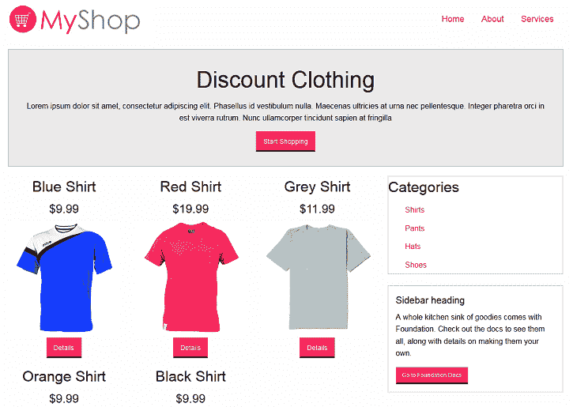

现在，如果我们点击某个产品的详细信息，例如黑色衬衫，它将带我们到产品页面（如以下截图所示）。它有图片、标题、文本、价格，然后是一个立即购买按钮。此外，我们在立即购买按钮下方有标签，如以下截图所示：

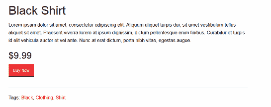

此外，如果我们转到蓝色与白色衬衫，我们可以看到我们有一些图片，因此我们可以包括一个图片库，我们将看到如何做到这一点：

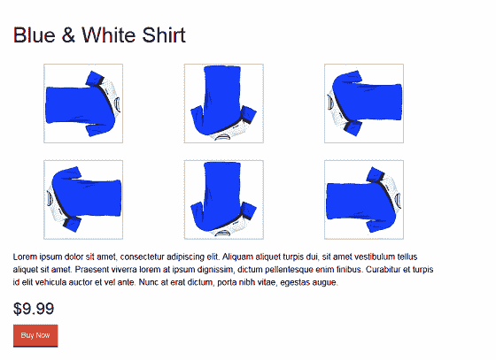

页面本身非常简单。我们只有一个关于页面，包含标题和标题，样本页面也是如此。如果我们进入页面的后端并进入帖子，我们可以看到我们拥有的不同产品。点击粉色衬衫产品；我们包含了文本、价格和按钮。如果我们向下滚动，在右下角我们可以看到我们正在使用特色图片。

对于展示，如果我们前往外观 | 小部件，我们可以在展示中看到展示小部件，这实际上是一个我们创建并将在主题中使用的自定义小部件。我们还有页面的右侧边栏，包含分类和文本小部件。现在对于画廊，如果我们转到蓝色衬衫产品并点击添加媒体，我们可以转到创建画廊并选择一些图片，继续上传该画廊。如果我们点击视觉，您可以看到它，并且我们可以通过点击以下截图中的编辑图标来整体编辑它：

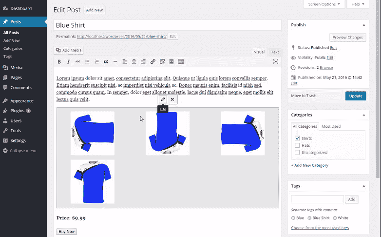

这非常简单。这并不是你见过的最好的在线商店，但它确实有一些非常重要的功能。对于标志，我们可以通过前往外观 | 自定义 | 网站身份来切换它，然后您将看到标志选项，我们可以从那里删除它。我们还可以更改它并更新我们的标题和标语。

# 电子商务 HTML 模板 – 第一部分

我们首先构建一个直接的 HTML 模板，然后继续集成它，并使其成为一个 WordPress 主题。让我们继续创建一个用于此模板的文件夹，我们将称之为`myshop_html`。现在让我们从[foundation.zurb.com](https://foundation.zurb.com/)下载 Foundation。点击“下载 Foundation 6”按钮，这将带您到下载页面。现在，点击“完整”下的“下载一切”：

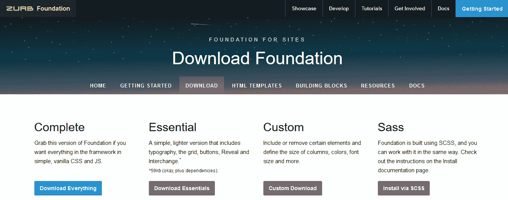

现在，我们将打开下载的 ZIP 文件，将所有内容全部取出，移动到我们的`myshop_html`文件夹中：

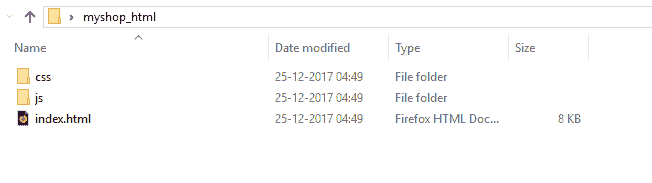

现在如果我们用我们想要的网络浏览器打开`index.html`，我们将看到我们基本上有一个模板：

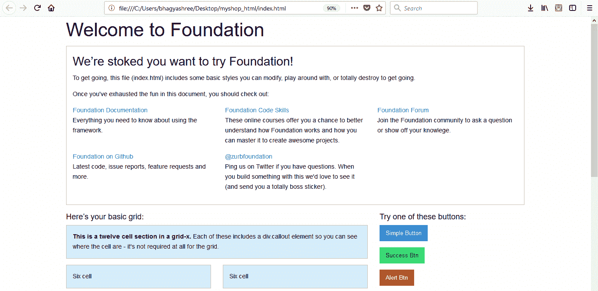

CSS 已经实现，JavaScript 也应该实现，所以让我们打开我们的编辑器中的`index.html`。我们将通过这个`index.html`的代码，并替换我们需要的内容。让我们打开我们创建的`myshop_html`文件夹中的`CSS`文件夹内的 CSS 文件`app.css`。我们的 CSS 文件中没有内容；唯一的样式是核心基础样式。

我们还有一些需要上传的图片（你将随代码包一起获得这些图片），因此我们将创建一个名为`img`的新文件夹，并将这些图片粘贴到`img`文件夹中。如果我们看一下这些图片，我们有`logo.jpg`和一些衣服。

我们有一堆衬衫和一顶帽子。蓝色衬衫有多个图片，因为我们将实现一个迷你相册，所以这些都是我们需要的所有图片：

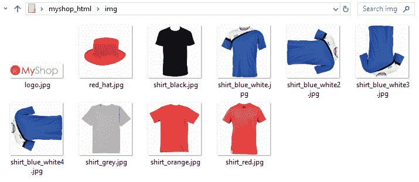

让我们回到`index.html`文件。头部可以保持原样；我们正在链接我们的 CSS 文件，我们的视口已经设置。在`<body>`标签中，你会看到我们正在使用 XY 网格系统。第一个`<div>`标签有一个`grid-container`类。网格将默认为可用空间的全部宽度。为了包含它，我们使用`grid-container`类。在这下面，我们有一个带有两个类——`grid-x`和`grid-padding-x`的`<div>`标签：

```php
<body>
  <div class="grid-container">
    <div class="grid-x grid-padding-x">
      <div class="large-12 cell">
        <h1>Welcome to Foundation</h1>
      </div>
    </div>
```

我们将把这个`<div>`改为`<header>`，并将`large-12`的`div`改为`large-6`的`div`，如下面的代码片段所示：

```php
<body>
  <div class="grid-container">
    <header class="grid-x grid-padding-x">
 <div class="large-6 cell">
        
      </div>
    </header>
```

重新加载`index.html`页面，你将看到我们的标志：

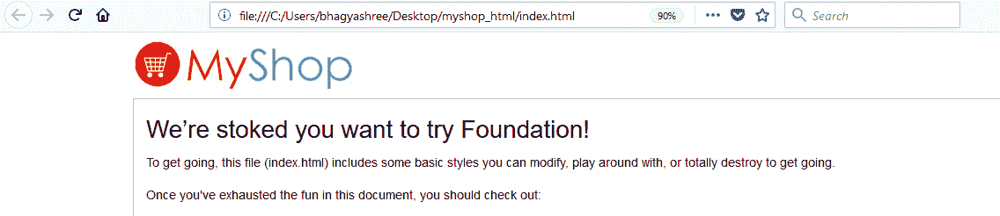

接下来，添加第二个`<div>`标签。这将包含我们的导航菜单：

```php
<header class="grid-x grid-padding-x">
  <div class="large-6 cell">
    
  </div>
  <div class="large-6 cell">
 <ul class="menu simple main-nav">
 <li><a href="index.html">Home</a></li>
 <li><a href="about.html">About</a></li>
 <li><a href="index.html">Services</a></li>
 </ul>
 </div>
</header>
```

让我们保存它并重新加载网页：

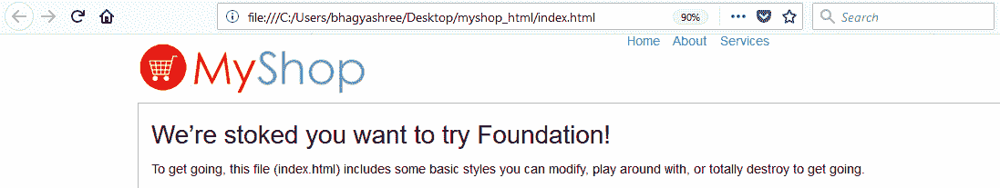

菜单的样式来自核心基础文件。我们将添加一些其他样式；例如，我们将它向下推，将它推过去，但我们将在 HTML 之后进入 CSS。

接下来，我们将对展示区域进行相当大的改动。我们将向带有`grid-x`和`grid-padding-x`类的`<div>`标签添加`showcase`类。我们将保持 12 个单元格和`callout` div 不变，但我们将添加一个名为`secondary`的类，这将使其变为灰色。移除其中的所有内容。在`secondary`类 div 内部，我们将有一个`h1`，上面写着`Discount Clothing`，然后我们将粘贴一个段落和一个`button`，如下面的代码所示：

```php
</header>
  <div class="grid-x grid-padding-x showcase">
    <div class="large-12 cell">
      <div class="callout secondary">
        <h1>Discount Clothing</h1>
 <p>Lorem ipsum dolor sit amet, consectetur adipiscing elit. 
           Phasellus id vestibulum nulla. Maecenas ultricies 
           at urna nec pellentesque. 
           Integer pharetra orci in est viverra rutrum. 
           Nunc ullamcorper tincidunt sapien at fringilla</p>
 <button class="button">Start Shopping</button>
 </div>
    </div>
  </div>
```

现在，你将看到展示区域，它出现在网页中 MyShop 标志下方：

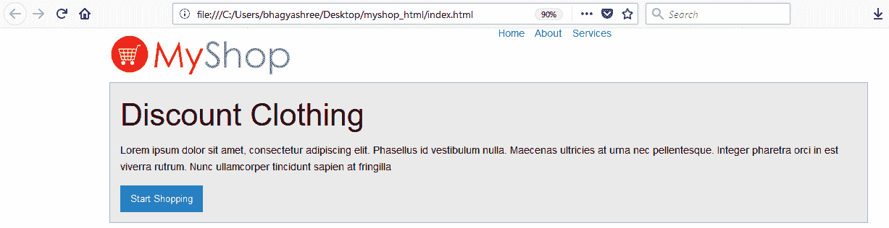

我们将在段落之后添加一些更多样式，所以不用担心。如果我们滚动到我们的编辑器中，我们还有一个带有`grid-x grid-padding-x`类的 div，这个 div 有一个 8 个单元格的`div`，这是主要区域：

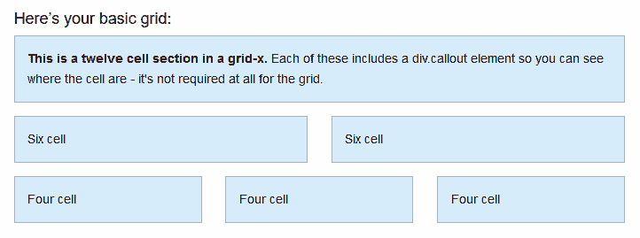

然后，在底部下方有一个 4 个单元格的`div`，这是侧边栏：


我们将完全清除这些 div。现在我们有一个清除的 8 个单元格 div 和一个 4 个单元格的侧边栏 div。接下来，对于产品，我们将在 8 个单元格 div 内部添加一个`<div>`标签，并给它一个名为`products`的类。

在这个 div 内部，我们将添加 4 个单元格的 div，并给它们一个名为`large-4 medium-4 small-12 columns product end`的类。我们将添加标题、价格和图片，然后放入一个按钮。这就是我们第一个产品 div 的外观：

```php
<div class="grid-x grid-padding-x">
  <div class="large-8 medium-8 cell">
    <div class="grid-x grid-padding-x">
      <div class="products">
        <div class="large-4 medium-4 small-12 cell product end">
          <h3>Blue Shirt</h3>
          <h4>$9.99</h4>
          
          <button class="button">Details</button>
        </div>
      </div>
    </div>
  </div>
```

当我们处理 WordPress 主题时，与 HTML 主题相比，可能会有一些不同，因为我们在放置内容的地方有一些限制。所以请记住，可能会有一些细微的差异。

现在，让我们复制 4 个单元格的 div，多次粘贴它。我们只需稍微改变内容，以添加所有衬衫：

```php
<div class="grid-x grid-padding-x">
  <div class="large-8 medium-8 cell">
    <div class="grid-x grid-padding-x">
      <div class="products">
        <div class="large-4 medium-4 small-12 cell product">
          <h3>Blue Shirt</h3>
          <h4>$9.99</h4>
          
          <button class="button">Details</button>
        </div>
        <div class="large-4 medium-4 small-12 cell product">
          <h3>Red Shirt</h3>
          <h4>$19.99</h4>
          
          <button class="button">Details</button>
        </div>
        <div class="large-4 medium-4 small-12 cell product end">
          <h3>Grey Shirt</h3>
          <h4>$11.99</h4>
          
          <button class="button">Details</button>
        </div>
        <div class="large-4 medium-4 small-12 cell product end">
          <h3>Orange Shirt</h3>
          <h4>$9.99</h4>
          
          <button class="button">Details</button>
        </div>
        <div class="large-4 medium-4 small-12 cell product end">
          <h3>Black Shirt</h3>
          <h4>$9.99</h4>
          
          <button class="button">Details</button>
        </div>
      </div>
    </div>
  </div>
</div>
```

现在，重新加载`index.html`页面：

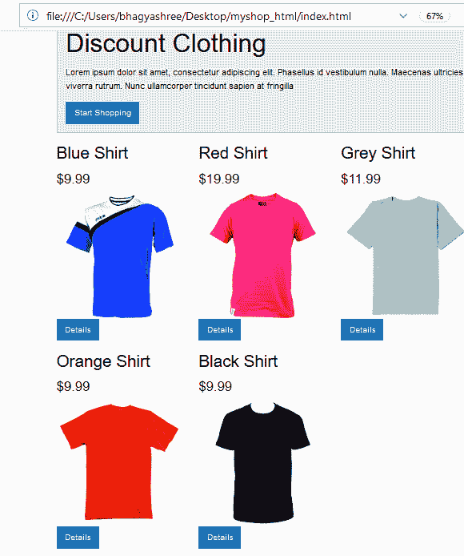

对于侧边栏，我们将向下移动到 4 个单元格的 div，并添加以下代码：

```php
<div class="large-4 medium-4 cell">
  <div class="callout">
    <h3>Categories</h3>
    <ul class="menu vertical">
      <li><a href="#">Shirts</a></li>
      <li><a href="#">Pants</a></li>
      <li><a href="#">Hats</a></li>
      <li><a href="#">Shoes</a></li>
    </ul>
  </div>
  <br>
  <div class="callout">
    <h5>Sidebar heading</h5>
    <p>A whole kitchen sink of goodies comes with Foundation. 
       Check out the docs to see them all, along with details on 
       making them your own.</p>
    <a href="http://foundation.zurb.com/sites/docs/" class="small button">
    Go to Foundation Docs</a>
  </div>
</div>
```

我们给这个 div 添加了一个名为`callout`的类，它提供了边框和一些填充。我们还添加了`Categories`标题和带有`menu`和`vertical`类的`<ul>`标签。我们将在它下方再添加一个侧边栏小部件，带有标题和一些文本。这就是我们的侧边栏将看起来像的样子：

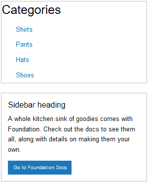

现在，我们将向下移动到非常底部，紧挨着脚本标签上方，创建我们的页脚。我们的页脚将只是一个段落，我们将放置版权信息。页脚的代码如下：

```php
<footer>
  <p>&copy; 2017, MyShop</p>
</footer>
```

这就是`index.html`页面的全部内容！现在我们将继续到详情页面，显然我们将在第二部分修复 index 和详情页的其余部分，在那里我们将进行 CSS 设计。

让我们回到我们的`myshop_html`文件夹，创建一个名为`details.html`的新文件。复制`index.html`的代码并将其粘贴到`details.html`文件中。现在转到主区域，8 单元格 div。我们将把`products`类改为`single-product`，删除所有产品，并将 4 单元格 div 改为 12 单元格 div：

```php
<div class="large-8 medium-8 cell">
  <div class="grid-x grid-padding-x">
    <div class="single-product">
      <div class="large-12 medium-12 small-12 cell product end">

      </div>
    </div>
  </div>
</div>
```

现在在刚刚更新的 12 单元格 div 内部，我们将再添加两个列。以下是 12 列 div 经过一些更改后的新代码：

```php
<div class="large-8 medium-8 cell">
  <div class="grid-x grid-padding-x">
    <div class="single-product">
      <div class="large-12 medium-12 small-12 cell product end">
        <div class="large-5 medium-5 small-5 cell product end">
 </div>
 <div class="large-7 medium-7 small-7 cell product end">
 </div>
      </div>
    </div>
  </div>
</div>
```

如前述代码所示，我们有一个 5 单元格的 div，我们将在此添加图片，以及一个 7 单元格的 div，它将包含内容。以下是我们的最终代码将看起来像这样：

```php
<div class="large-8 medium-8 cell">
  <div class="grid-x grid-padding-x">
    <div class="single-product">
      <div class="large-12 medium-12 small-12 cell product end">
        <div class="grid-x grid-padding-x">
          <div class="large-5 medium-5 small-5 cell product end">
            <a href="index.html">Go Back</a>
            
          </div>
          <div class="large-7 medium-7 small-7 cell product end">
            <h2>Blue & Shirt</h2>
            <h4>Price: $9.99</h4>
            <p>Lorem ipsum dolor sit amet, consectetur adipiscing elit. 
               Phasellus id vestibulum nulla. Maecenas ultricies at 
               urna nec pellentesque. Integer pharetra orci in est viverra 
               rutrum. Nunc ullamcorper tincidunt sapien at fringilla</p>
            <button class="button">Buy Now</button>
            <hr>
            <div class="tags"><strong>Tags:</strong>Shirt, Blue Shirt, 
               White Shirt</div>
          </div> 
        </div>
      </div>
    </div>
  </div>
```

由于我们希望 5 单元格和 7 单元格的 div 在单行中，我们在 12 单元格的 div 中添加了一个具有`grid-x`和`grid-padding-x`类的 div。

现在，让我们重新加载`details.html`页面：

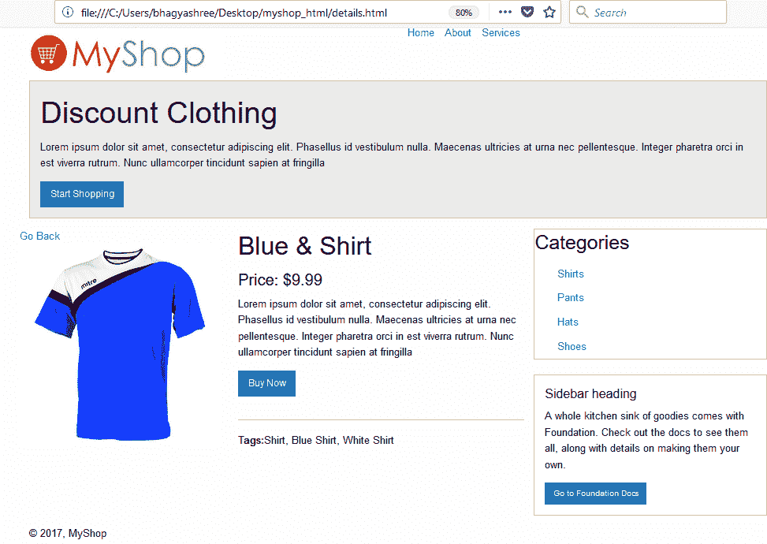

到目前为止，我们的网页看起来还不错。

现在，我们还将创建一个关于页面，只是为了表示一个不是产品页的正常页面。让我们再次回到我们的`myshop_html`文件夹，并创建一个新文件，我们将命名为`about.html`。在编辑器中打开它，现在我们将复制`details.html`文件中的所有内容。然后我们转到主区域，而不是有一个 5 单元格和一个 7 单元格，我们将只有一个 12 单元格的 div。关于部分的代码如下：

```php
<div class="large-12 medium-12 small-12 cell product end">
  <h2>About Us</h2>
  <p>Lorem ipsum dolor sit amet, consectetur adipiscing elit, 
     sed do eiusmod tempor incididunt ut labore et dolore magna aliqua. 
     Ut enim ad minim veniam, quis nostrud exercitation ullamco laboris 
     nisi ut aliquip ex ea commodo consequat. Duis aute irure dolor in 
     reprehenderit in voluptate velit esse cillum dolore eu 
     fugiat nulla pariatur. Excepteur sint occaecat cupidatat non 
     proident, sunt in culpa qui officia deserunt mollit anim id est 
     laborum.</p>

  <p>Ex soleat habemus usu, te nec eligendi deserunt vituperata. 
     Natum consulatu vel ea, duo cetero repudiare efficiendi cu. Has at 
     quas nonumy facilisis, enim percipitur mei ad. 
     Mazim possim adipisci sea ei, omnium aeterno platonem mei no. 
     Consectetur adipiscing elit, sed do eiusmod tempor incididunt 
     ut labore et dolore magna aliqua. Ut enim ad minim veniam, 
     quis nostrud exercitation ullamco laboris nisi ut aliquip ex 
     ea commodo consequat.</p>  
</div>
```

让我们去网页的关于部分，我们就可以看到，只有一些文本和标题：


# 电子商务 HTML 模板 – 第二部分

我们已经完成了 HTML 部分，但还需要处理 CSS 部分。让我们打开`app.css`文件，如果我们查看模板，我们需要从核心样式开始。

现在我们将注意到，按钮和链接默认是蓝色的。我们实际上想将其改为红色。我们将`a`标签，写`color`，这将是一个值为`ec2c2f`的值，这将给它红色。现在我们还想让按钮有一个红色的背景色。比如说，我们还想给按钮底部加一点边框。所以，我们将使用`border-bottom: 3px #333solid;`。

现在当我们将鼠标悬停在按钮上时，你会看到它变成了蓝色，链接也是如此：

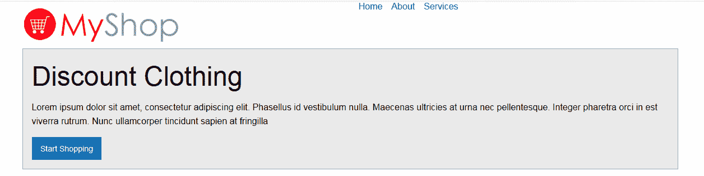

为了解决这个问题，让我们使用以下代码：

```php
a{
    color: #ec2c2f;
}

a:hover{
    color: #333;
}

.button{
    background:#ec2c2f;
    border-bottom: 3px #333 solid;
}

.button:hover{
    background:#333;
}
```

让我们保存文件并重新加载页面。现在你会看到按钮和链接即使在悬停时也是红色的：

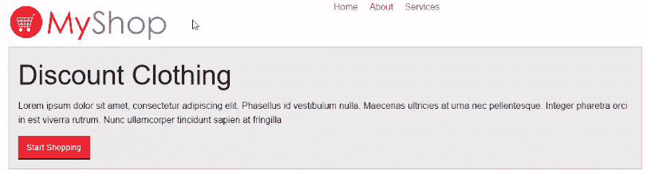

让我们现在处理主页、关于和服务的链接位置。我们希望它们在页面的右上角。以下是实现此目的并修改一些字体大小的代码：

```php
header .main-nav{
    float:right;
    margin-top: 30px;
    font-size: 18px;
}

header .main-nav li{
    padding-right:20px;
}
```

让我们重新加载页面并查看更改：

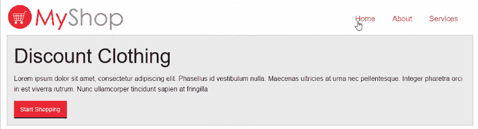

让我们也给底部的页眉留一点边距：

```php
header{
    margin-bottom: 20px;
}
```

重新加载页面，你应该会看到这样的内容：

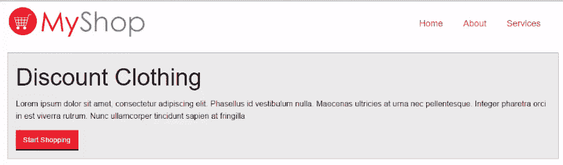

接下来，让我们做展示区域。为此，使用以下代码：

```php
.showcase .callout{
    text-align: center;
    padding: 30px;
    margin-bottom: 20px;
}
```

现在你将看到以下内容：

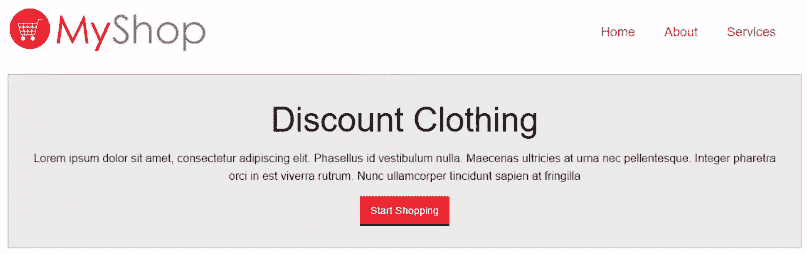

现在对于产品区域，我们将编写`products .columns`，我们只是要添加一个`margin-bottom`，让我们为单数形式的`product`添加一个`text-align`到`center`。让我们看看，对于按钮，我们想在顶部添加一点边距，所以让我们写`product .button margin-top`并使用`10px`：

```php
.products .columns{
    margin-bottom: 40px;
}

.product{
    text-align: center;
}

.product .button{
    margin-top: 10px;
}
```

让我们保存并重新加载页面：

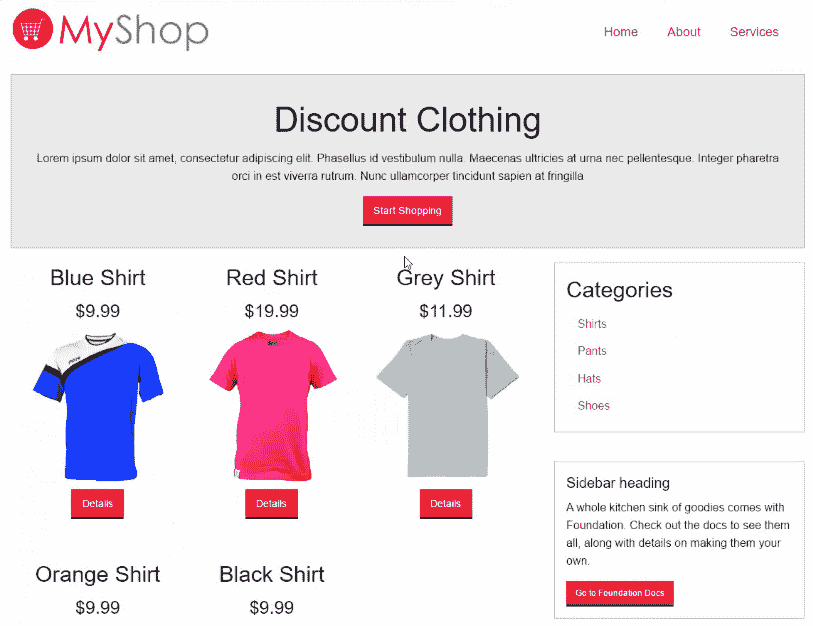

现在对于网页右侧的菜单（分类），我们将为每个列表项下面添加一个边框。然而，我们不想为最后一个列表项添加边框。输入以下代码以执行此操作：

```php
.vertical li{
    border-bottom: 1px #ccc solid;
}

.vertical li:last-child{
    border-bottom: none;
}
```

保存并重新加载页面：

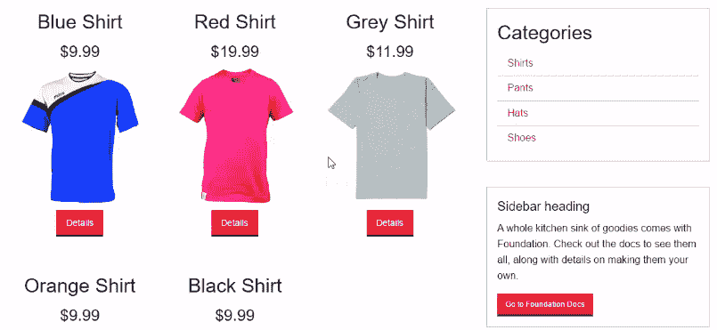

最后，让我们添加页脚。我们将设置一些属性，并使用以下代码在页面上显示页脚：

```php
footer{
    background: #333;
    color: #fff;
    text-align: center;
    margin-top: 30px;
    padding-top: 20px;
    height: 70px;
}
```

保存并重新加载页面：

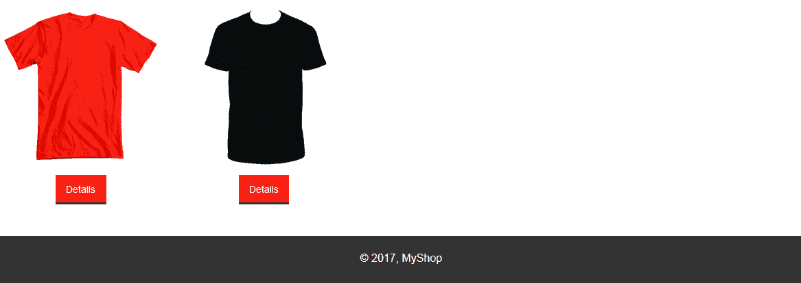

让我们看看网页上的详细信息页面和关于页面。你会看到详细信息页面看起来不错；然而，关于页面内容是居中对齐的。为了修复这个问题，转到`about.html`文件并从 12 列的 div 中移除`product end`。重新加载页面，关于页面应该看起来非常完美。

在下一节中，我们将进入 WordPress，并开始根据这个设计创建 WordPress 主题。

# 主题设置、标志和导航

现在 HTML 模板已经完成，我们现在可以开始将其转换为 WordPress 主题。

我们有一个默认安装的 WordPress。让我们创建一个新的主题文件夹。我们将进入`wp-content` | `themes`并创建一个新的文件夹，`MyShop`。在`MyShop`内部，我们将创建一个`index.php`文件和一个`style.css`文件。让我们继续在我们的`style.css`文件中放入我们的声明，如下面的代码片段所示：

```php
/* 
    Theme name: MyShop
    Author: Brad Traversy
    Author URI: http://eduonix.com
    Description: Simple ecommerce theme
    Version: 1.0.0
*/
```

让我们保存。现在如果我们去网页的后端，进入外观 | 主题，我们将看到如下截图所示的 MyShop：

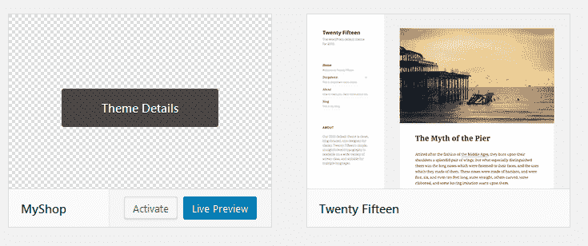

我们有一个截图，可以将其放置在我们项目文件中的 MyShop 预览图片上方。将此内容粘贴到`MyShop`文件夹中。现在我们有了 MyShop，让我们继续激活它。显然，如果我们现在去重新加载前端，它将只是空白。

我们将打开`MyShop`和`myshop_html`文件夹，这是我们所创建的 HTML 模板，并将`css`和`js`文件夹移动到`MyShop`文件夹中。现在我们 WordPress 网站上有一个`style.css`文件。我们将从模板中的`app.css`文件中取出所有内容，将其剪切出来，放入`style.css`中，并保存。然后我们可以完全删除`app.css`。

现在，我们将把`index.html`文件夹中的所有内容放入`index.php`。让我们保存它，如果我们去我们的网站并重新加载页面，我们可以看到所有的 HTML 都在那里。CSS 还没有连接，所以我们看不到它，但你可以看到 HTML：

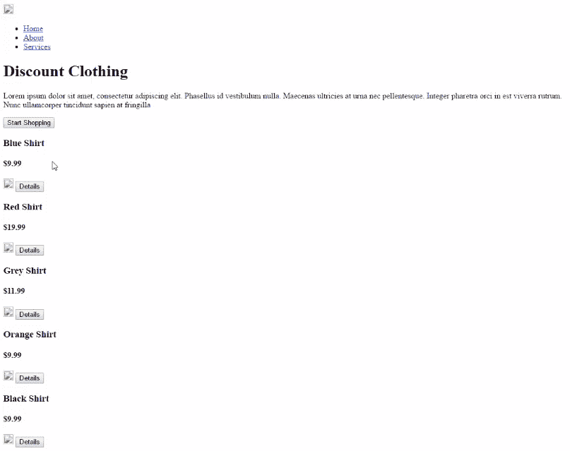

让我们去文件的顶部。我们将添加我们的标题并修复样式表声明：

```php
   <title><?php bloginfo('name'); ?></title>
   <link rel="stylesheet" href="<?php echo bloginfo('template_url'); ?>/css/foundation.css">
   <link rel="stylesheet" href="<?php echo bloginfo('stylesheet_url'); ?>">
   <?php wp_head(); ?>
</head>
```

让我们保存它，重新加载我们的网页，现在我们可以看到我们的 CSS 正在生效：

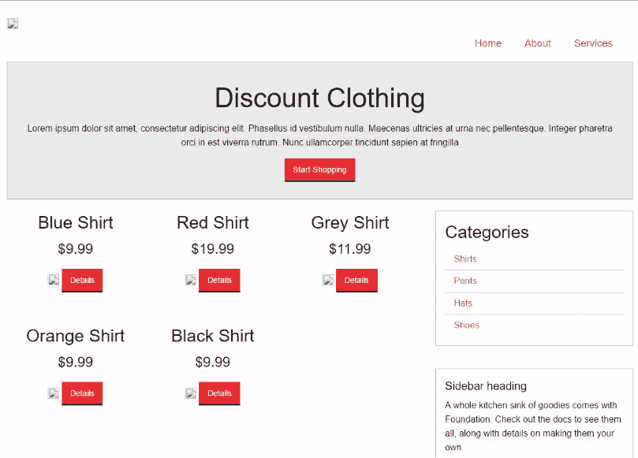

我们将从顶部开始工作。所以接下来是 body！我们还想添加我们的 body 类。所以在我们`body`标签旁边，让我们添加`<?php echo body_class() ?>`。

现在对于标志，我们将做一些我们还没有做的事情；我们将实现一个图像，一个从主题定制器上传的标志。为了做到这一点，我们需要创建一个`functions.php`文件。所以在我们“主题”文件夹中，让我们创建一个名为`functions.php`的文件，并创建一个名为“主题支持”的函数。以下是`functions.php`文件内代码的示例：

```php
<?php 
    // Theme Support
    function ms_theme_setup(){
        add_theme_support('custom-logo');
    }

    add_action('after_setup_theme', 'ms_theme_setup');
```

保存它，现在让我们转到`index.php`文件。让我们删除``并将其替换为以下代码片段：

```php
<header class="grid-x grid-padding-x">
   <div class="large-6 cell">
      <?php 
        if(function_exists('the_custom_logo')){
          the_custom_logo();
        }
      ?>
   </div> 
```

我们现在转到我们的后端。在“主题”中，我们将点击“定制”，转到“网站标识”，现在你应该可以看到如下截图所示的标志区域：

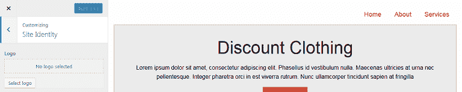

我们将点击“选择标志”，然后从`myshop_html`文件夹上传`logo.jpg`文件，根据你的偏好裁剪图片，然后点击“保存”并发布。现在让我们去我们的前端并重新加载，现在我们有一个标志了：

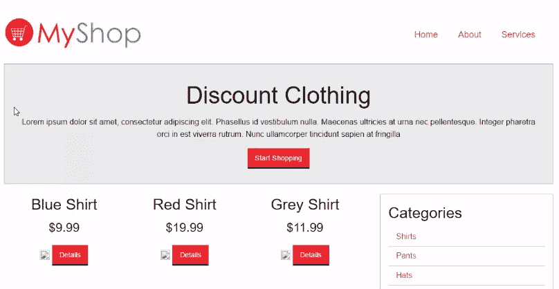

现在让我们来做菜单。我们将转到`functions.php`文件，并添加以下代码用于“导航菜单”：

```php
register_nav_menus(array(
    'primary' => __('Primary Menu')
));
```

接下来，我们将转到`index.php`，我们有了菜单。我们将完全删除它并添加以下代码：

```php
<div class="large-6 cell">
   <?php wp_nav_menu(array(
     'theme_location' => 'primary',
     'container_class' => 'menu simple main-nav'
   ));
   ?>
</div>
```

现在让我们转到我们的后端。首先，我们将重新加载，点击“菜单”选项，我们将保持“样本页面”。确保我们勾选了“主菜单”选项：

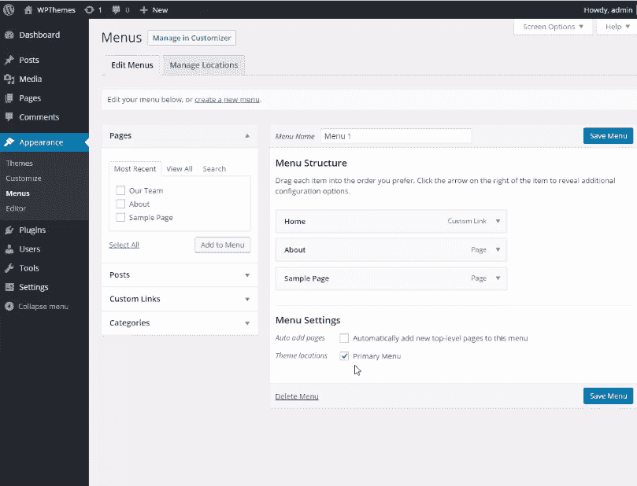

我们将点击“保存菜单”并重新加载我们的页面。我们可以看到，现在我们有了菜单，如果我们点击它，我们可以看到链接已经改变。你不会在网页的主要区域看到它，因为我们还没有设置这个主题区域；现在它只是静态内容，但菜单是正常工作的，标志也在那里：

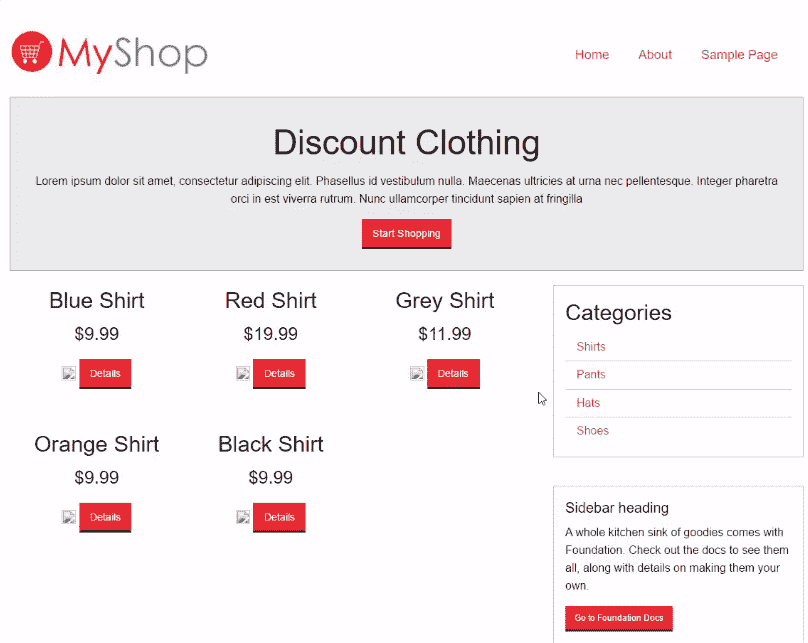

在本节中我们想要做的最后一件事是转到`index.php`文件，并在`footer`标签下面直接放置`wp_footer`，如下面的代码片段所示：

```php
<footer>
<p>&copy; 2017, MyShop</p>
</footer>
<?php wp_footer(); ?>
```

这应该给我们网页顶部的管理员菜单：

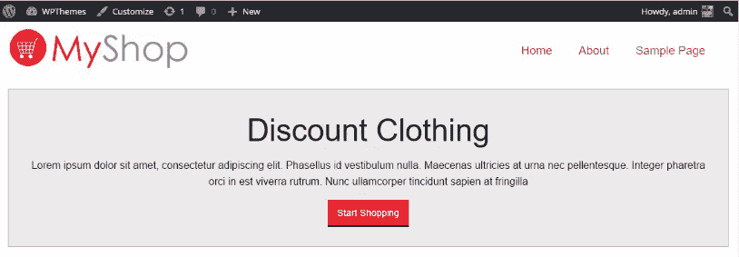

在下一节中，我们将处理小工具。我们将看到如何为展示区域创建一个自定义小工具。

# 自定义展示小工具插件

在本节中，我们将为我们的主题创建一个自定义小部件。我们在网页上有展示区域，我们将创建一个可以接受标题和一些文本的小部件，并将其直接输出到小部件位置。

如果我们查看[`codex.wordpress.org/Widgets_API`](https://codex.wordpress.org/Widgets_API)的 Widgets API 文档页面，我们基本上需要创建一个扩展`WP_Widget`的类，并且它将有几个不同的方法。它将有一个构造函数来调用父类的构造函数并设置标题和描述，一个`widget`方法将输出小部件的内容，一个`form`方法将输出管理表单，以及一个`update`方法将负责更新任何字段。

我们将进入`wp-content` | `plugins`文件夹，并在那里创建一个新的文件夹，`showcase-widget`（尽管它是一个插件，但它也是一个小部件）。让我们继续在这个文件夹中创建一个新的文件，`showcase-widget.php`，然后还有一个文件，它将是类文件，`class.showcase-widget.php`。`showcase-widget.php`文件将是主文件，但类文件将是我们将进行大部分功能的地方。

现在，我们将添加一些代码到`showcase-widget.php`文件中：

```php
<?php
   /*
    * Plugin Name: Showcase Widget
    * Description: Simple showcase area
    * Version: 1.0
    * Author: Brad Traversy
    */

    // Include class
    include('class.showcase-widget.php');

    // Register Widget
    function register_showcase_widget(){
        register_widget('Showcase_Widget');
    }

    add_action('widgets_init', 'register_showcase_widget');
```

在`register_widget('Showcase_Widget');`中的`Showcase_Widget`是我们类的名称。这通常需要是你的类名，无论你选择什么。

现在让我们进入`class.showcase-widget.php`文件。我们将从文档页面（[`codex.wordpress.org/Widgets_API`](https://codex.wordpress.org/Widgets_API)）中获取默认用法代码，并将其粘贴到我们的编辑器中，使用`php`标签。首先，我们必须将类的名称从`My_Widget`更改为`Showcase_Widget`，然后让我们看看构造函数并替换那里的代码：

```php
public function __construct() {
    parent::__construct(
        'showcase_widget',
        __('Showcase Widget', 'text_domain'),
        array('description' => __('A widget to display showcase content', 
              'text_domain'),)
        );
    }
```

小部件方法将显示小部件的前端，所以我们基本上需要以下三个东西：

+   我们需要小部件的标题

+   我们需要标题

+   我们需要一个用于文本的字段

我们将粘贴以下代码：

```php
public function widget( $args, $instance ) {
    $title = apply_filters('widget_title', $instance['title']);
    $heading = $instance['heading'];
    $text = $instance['text'];
 }
```

我们将保持在同一个方法中，并粘贴一些其他内容：

```php
public function widget( $args, $instance ) {
    $title = apply_filters('widget_title', $instance['title']);
    $heading = $instance['heading'];
    $text = $instance['text'];

    echo $args['before_title'];
    if(!empty($title))
      echo $args['before_title'] . $title . $args['after_title'];

    //Display Content
    echo $this->getContent($heading, $text);
    echo $args['after_widget'];
}
```

在我们继续之前，让我们创建`getContent`，它接受标题和文本。让我们使用以下代码片段：

```php
public function getContent($heading, $text){
  $output = '<h1>'.$heading.'</h1><p>'
            .$text.'</p><button class="button">
            Start Shopping</button>';

   return $output;
 }
```

现在，我们有一个名为`output`的变量，我们将它发送到一个带有`h1`和文本的模板中。然后我们有一个按钮，我们返回输出。所以这个`getContent`实际上将显示内容的`echo $this->getContent($headng, $text);`，我们在那里调用它。

接下来，让我们滚动到`function form`。这代表后端表单，我们可以实际上放置标题和文本等。我们将在此函数中粘贴以下代码：

```php
public function form( $instance ) {
    if(isset($instance['title'])){
       $title = $instance['title'];
    }
    else{
       $title = __('Showcase Widget', 'text_domain');
    }
 }
```

我们检查是否有标题，如果有，我们将将其设置为实例中的变量。如果没有，我们就将其设置为 `Showcase_Widget`。然后我们还需要获取标题和文本，这些也是从实例中获取的：

```php
public function form( $instance ) {
    if(isset($instance['title'])){
       $title = $instance['title'];
    }
    else{
       $title = __('Showcase Widget', 'text_domain');
    }
    $heading = $instance['heading'];
    $text = $instance['text'];
}
```

现在实际的后端表单有很多 HTML。我们将在 `$text = $instance` 后结束 `php` 标签，并在下一行开始 `php` 标签。然后我们将所有 HTML 代码放在这些开闭 `php` 标签之间。让我们粘贴以下 HTML 代码：

```php
<p>
<label for="<?php echo $this->get_field_id('title'); ?>">
   <?php _e('Title:'); ?>
</label>
<input class="widefat" id="<?php echo $this->
  get_field_id('title'); ?>" name="<?php echo $this->
  get_field_name('title'); ?>" type="text" 
  value="<?php echo esc_attr($title); ?>">
 </p>

<p>
<label for="<?php echo $this->get_field_id('heading'); ?>">
   <?php _e('Heading:'); ?>
</label>
<input class="widefat" id="<?php echo $this->
   get_field_id('heading'); ?>" name="<?php echo $this->
   get_field_name('heading'); ?>" type="text" 
   value="<?php echo esc_attr($heading); ?>">
</p>

<p>
<label for="<?php echo $this->get_field_id('text'); ?>">
   <?php _e('Text:'); ?>
</label>
<input class="widefat" id="<?php echo $this->
   get_field_id('text'); ?>" name="<?php echo $this->
   get_field_name('text'); ?>" type="text" 
   value="<?php echo esc_attr($text); ?>">
</p>
```

基本上，我们有一些段落，每个字段都有一个标签和相应的输入。我们可以看到对于标签，我们可以输出 `$this->get_field_id`，然后我们想要的是标题。对于输入，我们有 `id`、`get_field_id` 和字段的名称，即标题。对于名称，我们有 `get_field_name( 'title' )`，对于值，我们将使用标题变量。我们将使用 `escape_attr` 属性来转义它。我们将对标题和文本做同样的事情。尽管看起来代码很多，但实际上非常简单。

接下来，我们想要进入 `update` 方法，当我们在后端添加标题和文本并点击保存时，`update` 方法就是用来保存它的。让我们抓取一些代码：

```php
public function update( $new_instance, $old_instance ) {
    $instance = array();
    $instance['title'] = (!empty($new_instance['title'])) ? 
        strip_tags($new_instance['title']) : '';
    $instance['heading'] = (!empty($new_instance['heading'])) ? 
        strip_tags($new_instance['heading']) : '';
    $instance['text'] = (!empty($new_instance[$text])) ? 
        strip_tags($new_instance['text']) : '';

    return $instance;
 }
```

我们有一个实例，它等于一个空数组。我们将说 `instance['title']` 等于新实例中保存的标题内容。标题也是一样，我们将它设置为新的实例标题，文本也是如此，然后我们将返回这个实例。这将更新我们在后端小部件表单中输入的字段。

我们确保两个文件都已保存，然后进入后端并重新加载网页。转到插件，在下面的屏幕截图中我们可以看到 Showcase 小部件选项；它有描述、版本和名称，我们将点击激活。

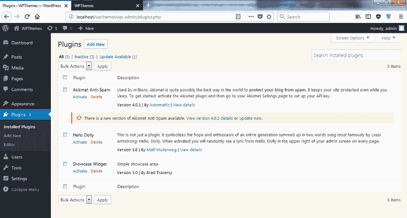

让我们通过进入 `themes` 文件夹中的 `functions.php` 来设置小部件位置。我们将设置我们的小部件位置。所以我们将滚动到文件底部并粘贴以下代码：

```php
// Widget Locations
function ms_init_widgets($id){
    register_sidebar(array(
    'name' => 'Sidebar',
    'id' => 'sidebar',
    'before_widget' => '<div class="callout">',
    'after_widget' => '</div>',
    'before_title' => '<h3>',
    'after_title' => '</h3>'
));

register_sidebar(array(
    'name' => 'Showcase',
    'id' => 'showcase',
    'before_widget' => '',
    'after_widget' => '',
    'before_title' => '',
    'after_title' =>''
));
}

add_action('widgets_init', 'ms_init_widgets');
```

因此，我们有一个名为 `ms_init_widgets` 的函数，我们想在两个地方放置小部件：一个是在侧边栏，另一个是在我们刚刚创建的小部件的展示区域。在我们的侧边栏中，我们想要 `div class="callout"` 包裹整个小部件，我们想要标题是 h3。最后，我们将在 `widgets_init` 上调用我们的动作并输入我们函数的名称，`ms_init_widgets`。

让我们保存它，回到后端，并重新加载。现在在“外观”下，我们可以看到小部件。如果我们点击它，我们可以看到我们有侧边栏和展示区域可用，并且如果我们滚动到同一页面的底部，我们可以看到我们的 Showcase 小部件，这是我们刚刚创建的插件：

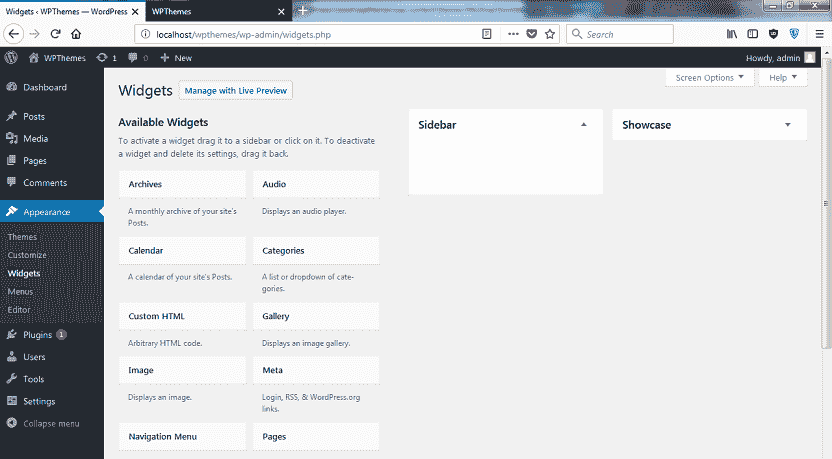

所以让我们继续将展示小工具添加到展示区域。这里，我们有我们的标题，我们将把它去掉。对于标题，我们将输入`Discount Clothing`，对于文本，我们将放入一些随机文本。保存，返回。实际上，前端不会改变，因为我们没有在模板中实现它，但我们可以看到内容已经保存。

现在我们需要做的是进入我们的`index.php`文件，并向下滚动到我们展示区域的位置。在我们实际展示之前，我们想要检查确保它已经启用。所以我们将修改并放置以下代码：

```php
<?php if(is_active_sidebar('showcase')) : ?> 
   <div class="grid-x grid-padding-x showcase">
      <div class="large-12 cell">
         <div class="callout secondary">
            <?php dynamic_sidebar('showcase'); ?>
         </div>
      </div>
   </div>
<?php endif; ?>
```

保存后，让我们去检查前端，我们看到网页上有“Discount Clothing”，这是我们的标题。为了确保它实际上在读取我们的小工具，让我们去更改标题为`Discount Clothings`并保存。转到前端，重新加载，我们得到`Discount Clothings`。所以你知道这是来自我们的自定义插件。

我们创建了一个插件，我们不仅可以在本主题中使用它，还可以在任何地方使用它。好吧，所以接下来我们将处理侧边栏小工具。我们希望分类部分实际上来自 WordPress 分类。

# 侧边栏小工具设置

在最后一节中，我们为展示区域制作了一个自定义小工具插件。我们现在将实现侧边栏。

我们已经完成了一半的工作。如果我们查看`functions.php`文件，我们已经注册了我们的侧边栏区域。

所以我们现在需要做的是去`index.php`文件，并向下滚动到我们的侧边栏位置。在我去掉它之前，让我们确保我们创建了我们的小工具。

因此，我们已经有了一个分类；我们不必太担心这一点。但让我们创建一个侧边栏标题：

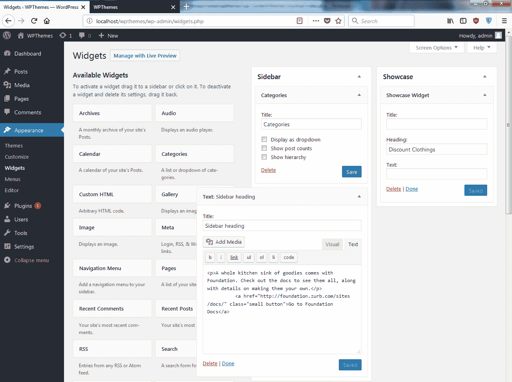

好吧，如果我们去后台，我们有分类，我们可以将其拖到右侧的侧边栏，输入标题为“分类”并保存。然后我们还想在窗口的左下角显示自定义文本；我们将它放在“分类”下面。粘贴我们的标题，“侧边栏标题”，然后是我们的文本和代码中的按钮。我们将保存，现在我们可以继续替换这些内容。我们移除两个`callout` div。

然后，我们将检查侧边栏是否激活，所以我们将放置`if(is_active_sidebar)`，位置也称为侧边栏：

```php
<div class="large-4 medium-4 cell">
   <?php if(is_active_sidebar('sidebar')) : ?>
      <?php dynamic_sidebar('sidebar'); ?>
   <?php endif; ?>
</div>
```

在前面的代码中，我们将输入`php dynamic_sidebar`并保存。让我们转到前端并重新加载。所以这些是我们的小工具，它们来自后端：

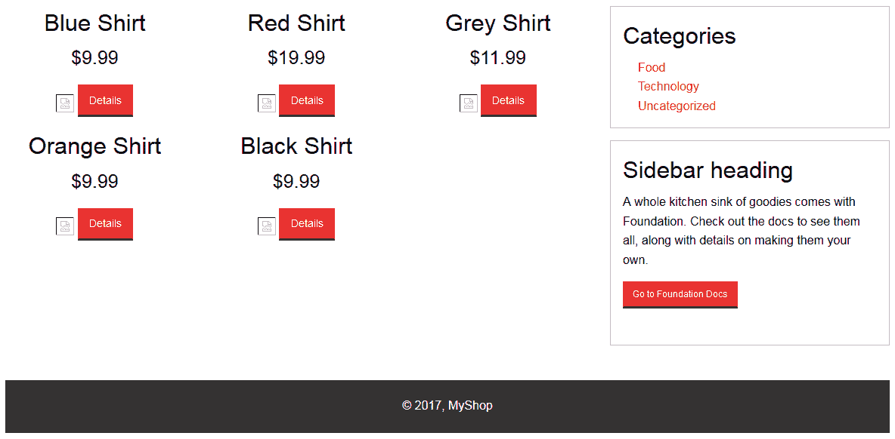

现在对于分类，让我们创建一些。默认情况下，它只会显示包含帖子的分类：

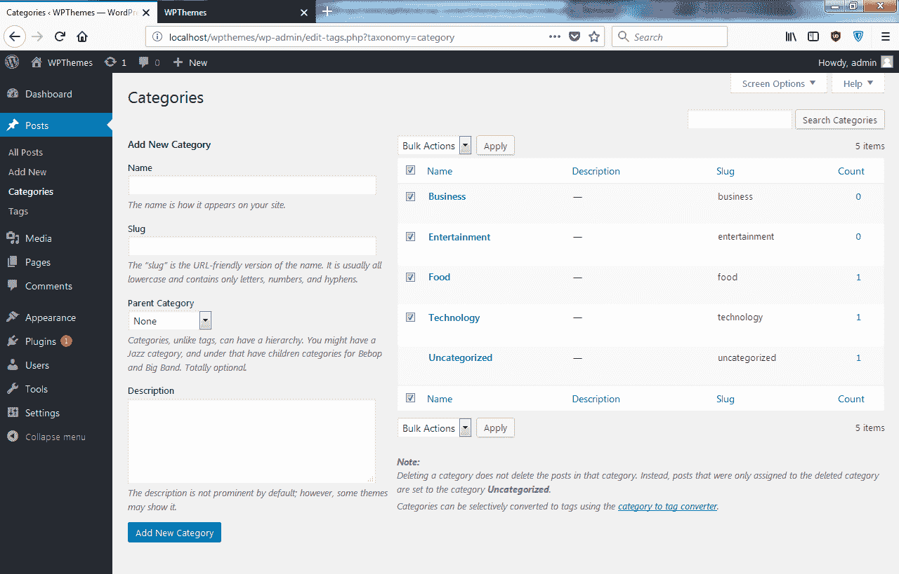

现在这些小工具根本不是我们想要的。所以我们将去掉这些，然后添加衬衫、帽子和鞋子：

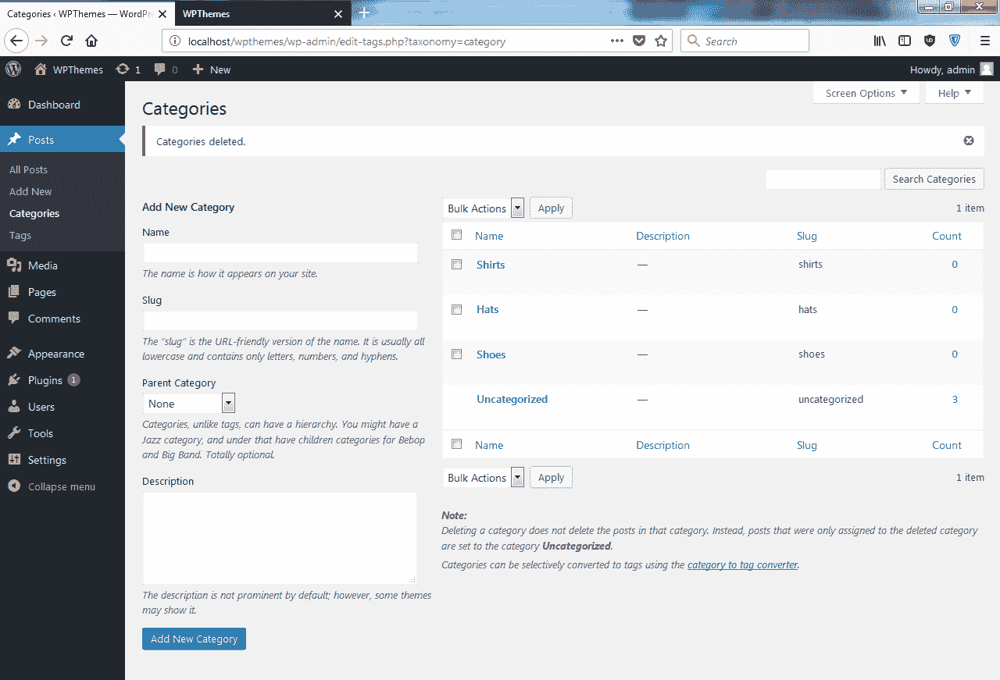

如果我们去重新加载，你仍然看不到它们，因为我们没有在它们里面放任何东西。

现在只是为了确保分类会显示出来，我们将这个`Hello world`添加到所有分类中，并重新加载它们：

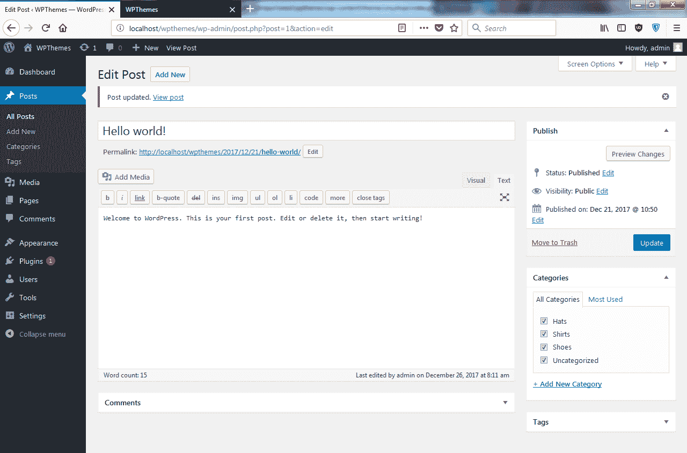

现在你可以看到它们正在显示。这看起来不太好，所以我们希望它使用一些自定义类，即 Foundation 类。我们将在`themes`文件夹中创建一个`widgets`文件夹，然后让我们获取`widgets`文件夹。我们将进入`wp-includes` | `widgets`，并获取`class-wp-widget-categories.php`文件，所以我们将复制它，然后将其带到`themes`文件夹中的`widgets`文件夹。

然后，我们可以在 Sublime Text 中打开它。我们将把`Custom`添加到类名末尾，并搜索`ul`标签。我们将添加一些类。好的，所以`class="menu vertical"`并保存它。然后我们必须在`functions.php`文件中包含该文件。我们将去到顶部，输入`require_once`，然后传递`widgets/class-wp-widget-categories.php`。

```php
require_once('widgets/class-wp-widget-categories.php');
```

现在我们将包含该文件。现在我们必须注册它。所以，让我们向下到底部创建一个名为`ms_register_widgets`的函数。我们将传递类名，`WP_Widget_Categories_Custom`。然后我们将添加一个动作：

```php
//Register Widgets
function ms_register_widgets(){
    register_widget('WP_Widget_Categories_Custom');
}

add_action('widgets_init', 'ms_register_widgets');
```

保存它，现在让我们去看看前端。你可以看到分类已经改变，看起来好一些：

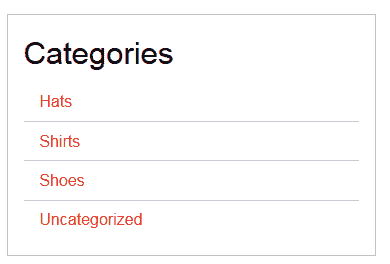

现在我们接下来要做的最重要的事情是主要内容区域。我们将在下一节中做这件事，但在我们前往那里之前，我们只想将`index.php`文件拆分成我们的头部和尾部文件。所以我们将从文件的顶部到`header`标签的末尾。我们将剪切代码，并在其位置输入`<?php get_header(); ?>`。然后我们将创建一个名为`header.php`的文件，并将它粘贴进去。我们应该看不到任何变化。

所以我们将对页脚做同样的事情。所以在`index.php`中，我们将从底部向上到，看看，直到`footer`标签，剪切出来，然后我们将在其中放入`get_footer`。然后我们将创建一个名为`footer`的文件，并将它粘贴进去，回到前端，重新加载，一切正常。

# 主要产品帖子页面

在本节中，我们将处理这个主要内容区域，即帖子显示的区域。现在它只是一堆静态 HTML，所以我们将继续修复它。

所以让我们进入主题文件夹中`MyShop`文件夹的`index.php`文件。让我们去到`div class="products"`，这里有 4 列的 div 来表示每个产品。我们将在这个`products`div 上添加一个`row`类，然后去掉除了一个之外的所有 4 列 div。我们将保留带有黑色衬衫详情的`div`标签，去掉所有`div`标签，然后在 4 列 div 中，在其上方创建我们的`while`循环。

在我们做`while`循环之前，让我们确保有一些帖子。所以我们将说`if(have_posts)`然后结束它。另外，如果有帖子，我们想要我们的`while`循环：

```php
<div class="grid-x grid-padding-x products">
   <?php if(have_posts()) : ?>
      <?php while(have_posts()) : the_post(); ?>
         <div class="large-4 medium-4 cell product end">
            <h3><?php the_title(); ?></h3>
            <?php if(has_post_thumbnail()) : ?>
               <?php the_post_thumbnail(); ?>
            <?php endif; ?>

            <a class="button" href="<?php echo 
               the_permalink(); ?>">Details</a>
         </div>
      <?php endwhile; ?>
   <?php endif; ?>
</div>
```

因此，我们将输入 `php while`，然后输入 `while(have_posts)`，然后我们必须添加 `_post`。然后，我们将在这个 div 的底部做 `endwhile`。所以我们将输入 `php endwhile`。现在在 `div` 标签内，我们将有一个 `h3`，这将作为标题。所以我们可以输入 `php the_title`。我们还将有缩略图，所以让我们先检查缩略图。我们将输入 `if(has_post_thumbnail)`。如果有缩略图，那么我们将输入 `php the_post_thumbnail`。然后，我们将直接在 `endif` 下方，我们需要我们的按钮，所以它实际上将是一个格式化为按钮的链接。我们将给它一个 `button` 类，然后这将转到 `php echo the_permalink`。文本将只说 `Details`。所以让我们保存并查看一下：

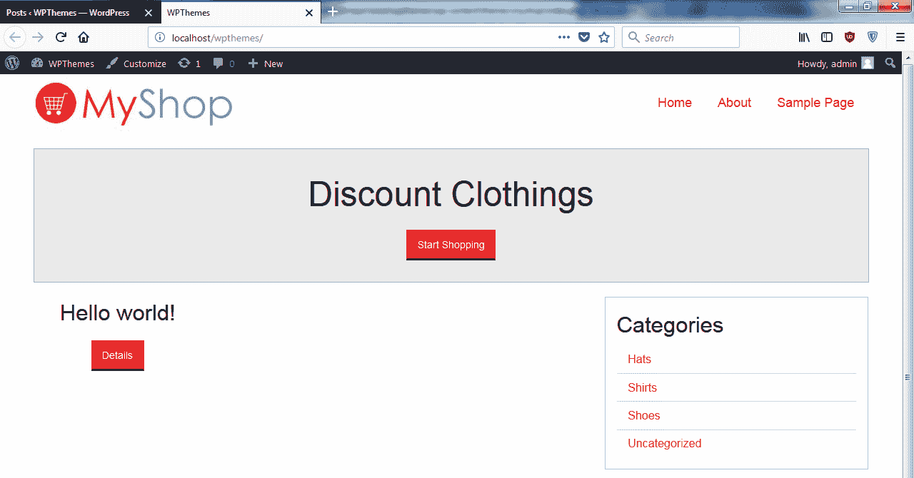

我们在这里看不到除了“Hello world”之外的内容，因为这是我们唯一的一篇帖子。所以我们将进去创建一些帖子。让我们快速重新登录。我们将转到所有帖子，你可以看到我们只有“Hello world”。所以让我们点击添加新帖子：

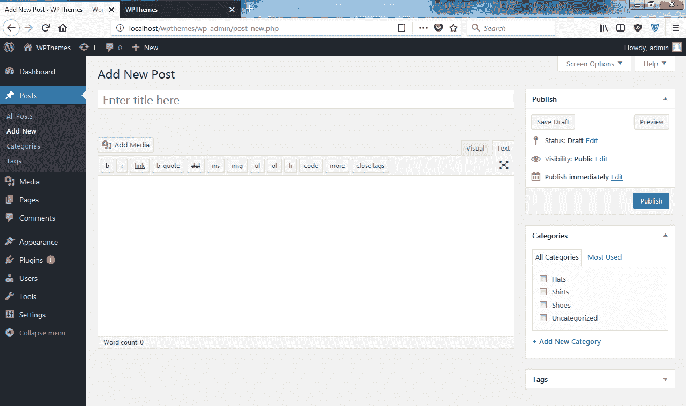

现在请注意，这里没有特色图片的区域，所以我们必须在 `functions.php` 文件中做出更改：

```php
function ms_theme_setup(){
    add_theme_support('custom-logo');

    // Featured Image Support
    add_theme_support('post-thumbnails');

    // Nav Menus
    register_nav_menus(array(
        'primary' => __('Primary Menu')
    ));
}
```

此外，让我们转到 `functions.php` 文件并进入 `ms_theme_setup` 函数。我们将输入 `add_theme_support`，并希望有 `post-thumbnails`。现在让我们检查输出。

你现在可以看到底右角的特色图片框。所以让我们点击特色图片框并上传一个文件。

我们有所有这些衬衫。我们将选择蓝色和白色的那一个，并将其设置为特色图片。让我们称这个为“蓝白衬衫”。对于描述，我们将快速获取一些示例文本：

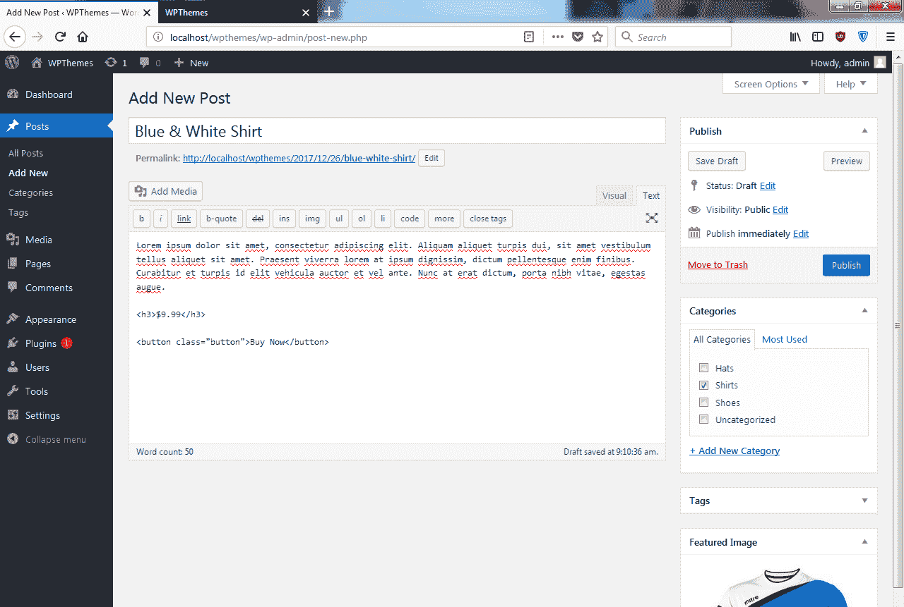

我们将复制一些随机的句子作为描述并粘贴进去。我们还需要价格。所以我们将它放在一个 `h3` 中，并说 `$9.99`。我们还想有按钮，所以我们将给它一个 `button` 类，并简单地说“立即购买”。它不会具有实际的电子商务功能。所以这基本上就是我们的所有产品描述的样子。让我们复制这个，然后选择衬衫分类。我们可以添加一些标签；我们将输入 `blue shirt`、`white shirt` 和 `clothes`。我们添加了这些，看起来不错，所以让我们发布它。

我们将回到主页，那里是我们的衬衫。我们将通过将“Hello world”帖子移动到回收站来禁用它。对于黑色衬衫，我们将上传图片。我们将获取 `shirt_black.jpg` 图片文件，输入`Black Shirt`，然后粘贴我们之前的内容：

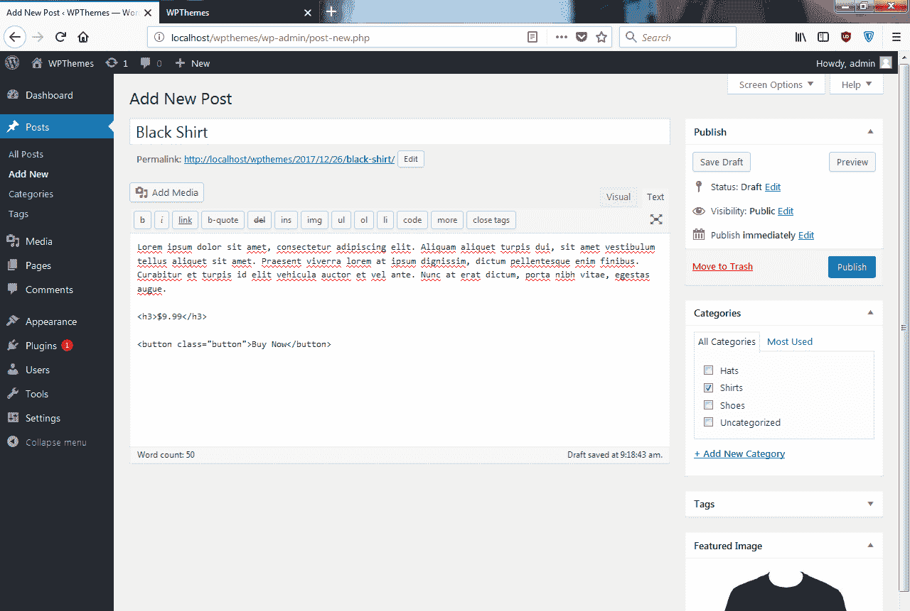

我们将发布它并继续添加其余的。我们添加了其余的产品。让我们转到前端并重新加载，看那里！它开始看起来像真正的购物车：

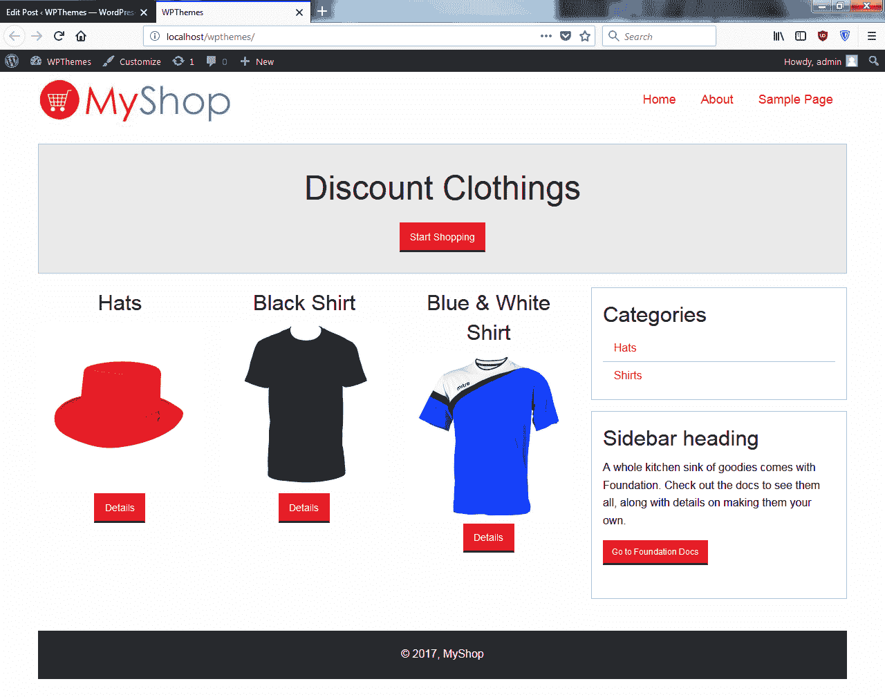

现在如果我们点击一个“详情”按钮，它将带我们到正确的位置，到正确的产品，但这不是我们想要的设置。我们想要描述看起来像真正的购物车页面。

如果我们访问一个普通页面而不是帖子，比如说是关于页面，那么它将以与主要帖子页面相同的方式格式化。所以我们也不想要这样。所以在下一个小节中，我们将处理这个问题，并确保这些页面看起来正确。

# 单个产品和单页

到目前为止，我们做得相当不错。我们已经完成了主要帖子页面或主页，但如果我点击其中一个，我们进入单个产品页面，它看起来不太好。我们还缺少很多信息。

因此，我们现在将在`MyShop`主题文件夹内创建一个新文件，并将其保存为`single.php`。在创建此文件后，如果我们返回到单页视图并重新加载，它将是空的，因为它正在查看单个文件。所以我们将复制`index`页面上的所有内容。

因此，我们将抓取所有内容，将其粘贴进去，并删除`showcase`部分，因为我们不想要它。我们只想在主页上显示`showcase`。我们将在其中添加一个`hr`标签。

我们将像上一节那样检查帖子并遍历帖子，即使它只有一个帖子。但我们将删除`while`循环中的所有内容：

```php
<?php while(have_posts()) : the_post(); ?>
   <div class="row single-product">
      <div class="large-5 columns">
         <a href="#">Go Back</a>
         <br>
         <?php if(has_post_thumbnail()) : ?>
            <?php the_post_thumbnail(); ?>
         <?php endif; ?>
      </div>
</div>
<?php endwhile; ?>
```

我们将只删除这些内容，然后创建一个新的带有类的`div`。让我们创建一个带有`row`和`single-product`类的`div`。在这个`div`内部，我们将有一个`Go Back`链接，并添加一个换行符。然后我们将检查特色图片或缩略图。所以我们将从`index.php`文件中复制内容。我们只想检查它是否存在，如果存在，则显示它。然后 5 列`div`的内容应该就结束了。所以这只是一个图片。

之后，我们将有一个 7 列的`div`。这将包含标题，我们将将其放入一个`h2`中。所以我们将说`php the_title`，在其下方，我们将放置`the_content`。然后我们将放置一个`hr`标签。我们想要标签和随后的代码片段。我们只是在检查标签，看看函数是否存在，然后将其输出：

```php
<div class="large-7 columns">
   <h2><?php the_title(); ?></h2>
   <?php the_content(); ?>
   <hr>
   <?php if(the_tags()): ?>
      <?php if(function_exist('the_tags')) { ?>
         <strong>Tags: </strong>
         <?php the_content_tags('', ',',''); ?><br/><?php } ?>
      <?php endif; ?>
</div>
```

让我们保存这个。我们将返回到我们的页面并重新加载，现在我们有一个产品页面：

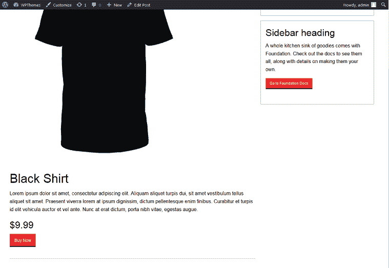

对于“返回”来说，现在它不会做任何事情。让我们让它回到主页。我们将说`php`，我们应该能够说`echo site_url`：

```php
<div class="row single-product">
   <div class="large-5 columns">
   <a href="<?php echo site_url(); ?>">Go Back</a>
   <br>
```

点击“返回”，它将带我们回到主页。所以看起来不错。

# 添加多个图片

现在我们还希望在这里能够有多个图片。让我们进入后端的“文章”部分，然后点击“蓝色与白色衬衫”。点击“添加媒体”然后创建相册。我们将上传更多文件。文件夹中如以下截图所示有文件。我们将使用这些文件并创建一个新的相册：

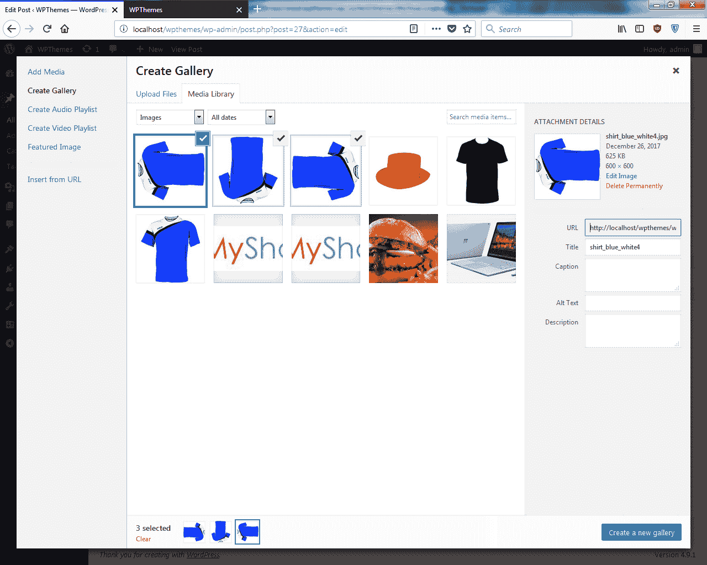

对于链接，我们只需说“媒体文件”并插入相册。让我们更新，回到前端，重新加载，现在我们为该产品添加了一些图片。这看起来几乎就像一个标准的购物车详情页面！

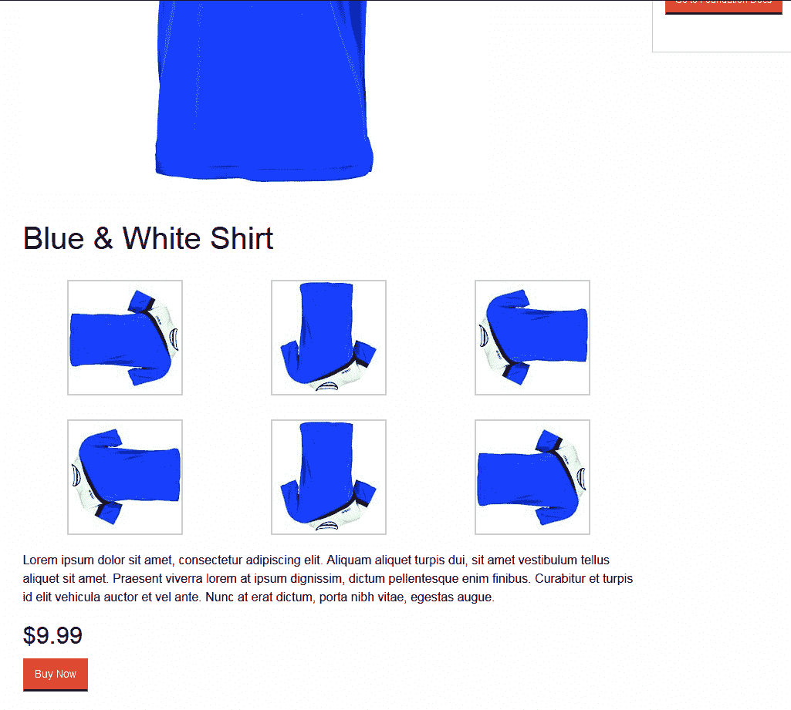

我们正在接近目标！现在对于常规页面，比如“关于”页面，我们显然不希望出现这种情况。我们将进入我们的文件夹并创建一个新的文件，`page.php`。然后如果我们返回并重新加载，它将是一片空白。让我们抓取我们在`index`页面上的内容，直接粘贴进去，然后我们想要找到`post`循环的位置。

让我们只从`while`循环内部移除所有内容，创建一个`div`，这将是一个 12 列的`div`，`large-12 columns`。然后我们添加一个`h3`，它将包含`the_title`。在`the_title`下添加整个缩略图部分。我们将从`single.php`中获取它。如果有图片，它将显示出来，然后我们只需要`the_content`：

```php
<?php while(have_posts()) : the_post(); ?>
   <div class="large-12 columns"></h3>
      <h3><?php the_title(); ?></h3>
      <?php if(has_post_thumbnail()): ?>
         <?php the_post_thumbnail(); ?>
      <?php endif; ?>

      <?php the_content(); ?>
   </div>
<?php endwhile; ?>
```

让我们保存它，回到“关于”页面，现在我们有一个带有标题和正文的普通页面。对于“示例页面”也是如此。目前看起来相当不错：

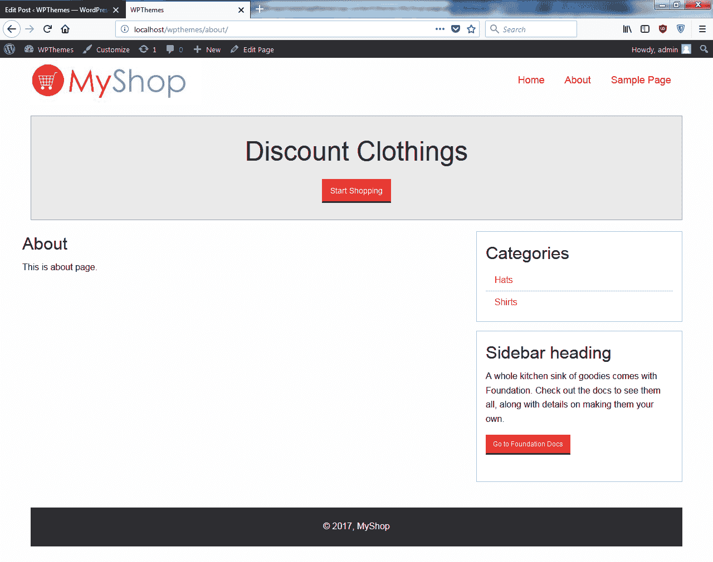

现在如果你想在你产品或文章页面上添加评论，你可以这样做。我们可以进入`single.php`，在`div`标签之后添加，然后输入`php comments_template`并保存。返回，重新加载，现在我们有了评论：

```php
<?php comments_template(); ?>
```

假设这是测试评论`This is a test comment`。它将留下以下评论：

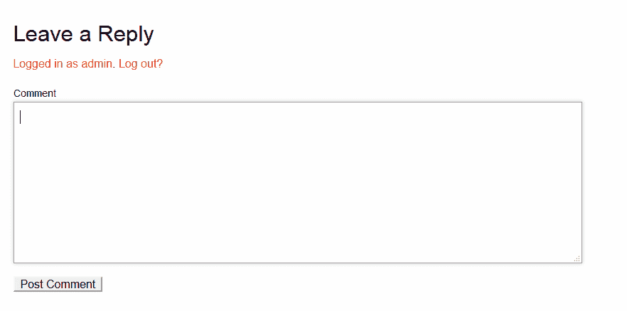

你可以像我们之前做的那样，让你的评论模板看起来更好。

你甚至可以将其重新命名为“评论”（产品评论）。

# 摘要

在这个项目中，我们介绍了 WordPress 主题开发的一些新方面，比如创建自己的插件小工具，实现图片、标志和自定义器等。

# 结论

这本书就到这里结束了，我们创建了五个令人惊叹的基于 WordPress 的主题。我们希望你喜欢这本书带你走过的旅程，去创建它们。我们祝愿你一切顺利，并希望你能继续改进你的 WordPress 主题。
