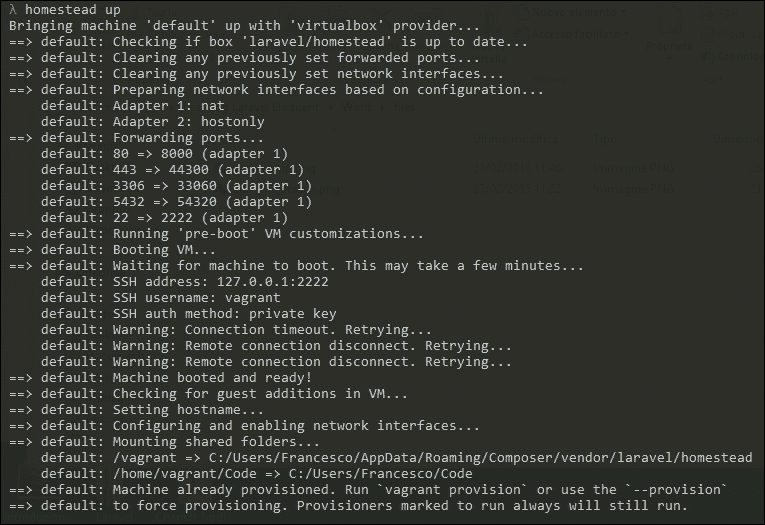
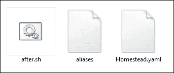
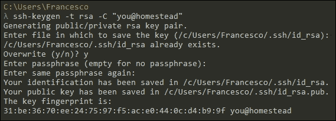
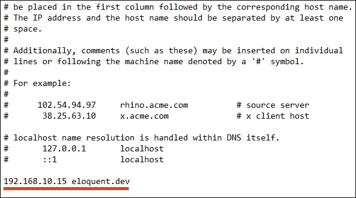
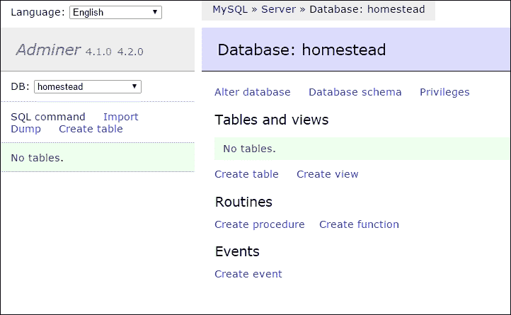

# 第一章. 设置我们的第一个项目

> *"Chi ben comincia è a metà dell'opera."* 
> 
> *(意大利语，意为“良好的开端是成功的一半。”)*

每次旅行都有一个起点，只有装备齐全的英雄才能取得胜利。当然，21 世纪的英雄——开发者也不例外！

为了避免问题和与不良（以及故障）代码怪物作斗争，优秀的代码工匠会在开始之前准备一切必要的东西。

开发者必须熟悉他们将要使用的工具，一个好的开发环境可以极大地提高开发过程。所以，在我们动手之前，在本章中，我们将了解如何处理 Composer 和 Homestead。

Composer 是一个出色的依赖管理工具，被世界各地的许多 PHP 项目使用。Homestead 是官方的 Laravel Vagrant 箱子，它允许你在几分钟内创建一个完全功能化的开发环境。最后，我们将介绍我们的第一个 Laravel 项目的安装过程。

我知道你在想什么：你只想写代码，代码，更多的代码。

有耐心一点：如果你知道我们将在本章末尾分析的工具，你将感受到巨大的差异。

相信我。

+   你的瑞士军刀：Composer

+   你的安全之地：Homestead

+   新的藏身之处：改进后的 Homestead

+   一个额外的工具：Adminer

+   你的最佳伙伴：Laravel

+   你的第一个项目：EloquentJourney

+   摘要

# 你的瑞士军刀 – Composer

你首先需要与 Laravel（以及 Eloquent）一起工作的工具是 Composer。Composer 是一个 PHP 的依赖管理工具。使用这个工具，你可以轻松地将项目中需要的每个依赖项包含进来。这只需几秒钟，使用一个名为 `composer.json` 的 JSON 配置文件即可完成。

通常，PHP 项目的依赖项管理使用 PEAR 或其他方法。Composer 有不同的策略：所有操作都是基于项目的。这意味着你可以在同一服务器上拥有两个项目，它们使用相同依赖项包的不同版本。

## 安装 Composer

安装程序非常简单。你所要做的，就是访问 Composer 网站的 **下载** 页面，并找到适合你操作系统的正确方法。

+   如果你使用 Linux 或 Mac，只需这样做：

    ```php
    curl -sS https://getcomposer.org/installer | php

    ```

    或者，如果你没有 cURL，那么使用这个：

    ```php
    php -r "readfile('https://getcomposer.org/installer');" | php

    ```

    此外，`composer.phar` 文件将下载到你的当前目录。

+   在 Windows 上，你可以简单地下载专门的安装程序。

一旦 Composer 安装完成，我建议将其路径添加到系统的 `PATH` 变量中，以便在任何地方使用它。这有很多方法，取决于你的操作系统。让我们看看每种方法。

+   在 Linux 上，你可以使用以下命令将 Composer 移动到正确的目录：

    ```php
    mv composer.phar /usr/local/bin/composer
    ```

+   对于 OS X，情况也相同，但有时 `usr` 目录不存在。你必须手动创建 `usr/local/bin`。

+   最后，在 Windows 上，你必须打开控制面板，输入`环境变量`或类似的内容。搜索实用程序会为你完成剩下的工作。一旦进入正确的窗口，你将看到一个所有环境变量的列表。找到`PATH`并将 Composer 安装路径添加到其中。

## composer.json 和 autoload 文件

在我们深入我们的项目之前，让我们看看 Composer 是如何工作的。

在`composer.json`文件中，开发者指定了其项目的每个单个依赖项。你还可以创建自己的包，但在这本书中我们不会探讨如何创建它们。

假设你想创建一个使用 Monolog 进行日志记录的项目。

1.  为项目创建一个文件夹，然后创建一个空白的文本文件，并将其命名为`composer.json`。

1.  打开它，你只需按照以下所示包含你的依赖项：

    ```php
      {
          "require": {
              "monolog/monolog": "1.12.0"
          }
      }
    ```

1.  之后，保存文件，并在你的项目目录中输入以下内容：

    ```php
    composer update

    ```

等待一下，下载所有内容，然后你就完成了！

什么？好吧，这是它的工作方式：Composer 下载你可能需要的每个包，并自动为所有包创建一个加载器。所以，为了在你的项目中使用依赖项，你只需包含`vendor/autoload.php`，然后你就可以开始了。

假设你有一个`index.php`文件作为你应用程序的起始文件。你将不得不执行以下操作：

```php
  <?php // index.php file

    require('vendor/autoload.php');

    // your code here...
```

没有更多了！

为什么我要向你展示这个？好吧，Laravel 和 Eloquent 是 Composer 包。所以，为了使用它并创建一个 Laravel 应用程序，你必须了解这个机制是如何工作的！

## 最常用的命令

Composer 是一个命令行工具。每个好的 CLI 工具都有一些重要的命令，在这个小节中，我将向你展示我们将要使用最多的命令。

+   首先，我们有以下内容：

    ```php
    composer create-project

    ```

    使用此命令，你可以使用特定的包作为基础创建一个新的项目。你将使用此命令创建一个新的 Laravel 项目，使用以下语法：

    ```php
    composer create-project laravel/laravel my_project_folder

    ```

+   然后，你可以找到：

    ```php
    composer install
    composer update

    ```

    这两个命令很相似；它们很相似，但并不相同。当你指定`composer.json`文件中的依赖项时，你可以使用`install`来安装它们。如果你已经安装了它们，但想将依赖项更新到新版本，请使用`update`。

    ### 注意

    为了知道必须更新什么和不应该更新什么，Composer 使用`composer.lock`文件，你可以在项目的根目录中看到它。实际上，你永远不需要与它打交道，但重要的是要知道 Composer 将其用作*日志*。

+   有时，你也会看到这个：

    ```php
    composer require

    ```

    你可以使用`require`在运行时将依赖项包含到你的项目中。以下是一个使用`require`包含 Monolog 的示例：

    ```php
    composer.phar require monolog/monolog:1.12.0

    ```

+   另一个常用的命令是：

    ```php
    composer dump-autoload

    ```

    此命令重新生成`autoload.php`文件。如果你在项目中添加了一些没有使用命名空间或 PSR 约定和规则的类，这可能很有用。

+   有时，你必须在警告之后使用（）：

    ```php
    composer self-update

    ```

    此命令更新 Composer 本身。只需几秒钟，你就可以再次运行了！

+   最后，你可以使用以下特殊命令：

    ```php
    composer global COMMAND_HERE

    ```

    使用它来在 Composer 主目录中执行特定命令。如我之前提到的，Composer 是基于每个项目工作的，但有时你需要全局安装一些工具。使用全局命令，你可以轻松完成。

现在你需要知道的关于 Composer 的就这么多，是的，还有很多其他命令，但现在我们不需要它们。

让我们更进一步：现在是时候了解 Homestead 了！

# 你的安全之地 – Homestead

当我们开始一个新的项目时，我们可能会遇到许多兼容性和环境问题。首先需要考虑的是 PHP 版本。也许你正在使用 XAMPP 或你本地机器上的一些预配置的栈。对于你的新项目，你希望使用 PHP 5.6，但安装的版本是 5.3（因为你用它处理了一些旧项目）。好吧，没问题；你只需安装 5.6，然后就可以继续了。

是的，但两天后，电话响了。是你的*老*客户；终于，是时候做一些改进并添加新功能了！所以，你启动你的栈服务，浏览你的旧项目索引，然后 BOOM！兼容性问题，到处都是兼容性问题！这绝对不是开始新的一天的好方法。

这不是一个代码问题，而是一个环境问题。

实际上，最好的解决方案是开始使用 Vagrant。Vagrant 是一个出色的工具，它允许你创建一个带有无头操作系统的虚拟机，以便根据每个项目配置虚拟机。此外，你还可以将本地机器上的某些文件夹与该机器共享，这样你就可以在一个隔离的环境中工作，同时使用你喜欢的 IDE 和操作系统。

### 注意

注意，基于每个项目的基础是整个问题的关键部分。如果你为单个项目配置一个单独的机器，你可以调整你想要的一切以达到完美的环境。此外，使用 Vagrant，你将能够以与生产机器相同的方式设置你的本地环境。所以，再也没有 *本地到生产* 的错误和问题！

最后但同样重要的是，Vagrant 的有趣（且有用）之处在于，你可以将特定的盒子置于版本控制之下。因此，对于每个新团队成员，你所要做的就是克隆仓库并启动机器。

这看起来很复杂，但实际上并不复杂。使用 Vagrant，你可以轻松下载一个盒子（一个包含所有所需工具和应用程序的现成虚拟机），然后从 shell 中使用简单命令启动它，如下所示：

```php
$ vagrant up

```

Laravel 社区对 Vagrant 了解一些，并制作了一个 Vagrant Box 来帮助你完成工作。



Homestead 是 Laravel 的官方 Vagrant Box，已经包含了你开始所需的一切。你将默认找到它（已安装并运行）：

| Ubuntu 14.04 | Node（带有 Bower、Grunt 和 Gulp） |
| --- | --- |
| PHP 5.6 | Redis |
| HHVM | Memcached |
| nginx | Beanstalkd |
| MySQL | Laravel Envoy |
| PostgreSQL | Fabric + Hipchat Extension |

对于一个可以在几分钟内准备好的工具箱来说，这已经相当不错了！

现在让我们停止讨论，开始安装 Homestead。

## 安装 Homestead

首先，确保你已经安装了 VirtualBox（[`www.virtualbox.org/`](https://www.virtualbox.org/））和 Vagrant（[https://www.vagrantup.com/](https://www.vagrantup.com/））。你可以在任何操作系统上安装它们，所以请随意选择你想要的。

### 提示

如果你想在 Windows 上使用一个好的 shell，我建议你使用 Cmder（[http://bliker.github.io/cmder/](http://bliker.github.io/cmder/））。在撰写这本书时，我参考了相同的链接。

接下来，我们可以将 Homestead 添加到我们的本地虚拟机中。这意味着 Vagrant 将会下载 Homestead 虚拟机以便本地使用。

你可以用一个简单的命令来完成：

```php
vagrant box add laravel/homestead

```

你可能需要等待几分钟来下载虚拟机。所以，如果你想喝杯咖啡，这是一个完美的时刻。

### 注意

在这里，你不必担心 Vagrant 将虚拟机放在哪里，因为它将会在 Vagrant 文件夹中本地保存。将来，每次你需要一个特定的虚拟机时，Vagrant 都会克隆并使用它。

好的，你的虚拟机现在已经在你的本地机器上了，并且已经准备好启动。然而，根据你的本地机器设置，你可以以两种不同的方式安装 Homestead。这两种方法都在官方 Laravel 文档中有介绍，所以它们都是**官方的**。

### Composer 和 PHP 工具方法

让我们从第一个开始：如果你已经在本地机器上安装了 Composer 和 PHP，这是一个完美的选择。请注意，你只会在第一次执行这些步骤。

使用此命令安装 Homestead CLI 工具。

```php
composer global require "laravel/homestead=~2.0"

```

然后，确保将`~/.composer/vendor/bin`目录放入`PATH`环境变量中，以便在任何地方使用该工具。

之后，你可以使用`init`命令初始化你的机器。

```php
homestead init

```

这将会创建一个包含`Homestead.yaml`文件的`~/.homestead`文件夹。这个文件将在虚拟机启动时被 Vagrant 使用。



### Git 方法

如果你没有在本地机器上安装 PHP 和 Composer（或者你可能只是不想使用它们），没有问题。你可以简单地使用 Git。

选择一个你想要保存虚拟机文件夹的位置。然后，使用以下命令克隆仓库：

```php
git clone https://github.com/laravel/homestead.git HomesteadFolder

```

在这里，`HomesteadFolder`是你为 VM 文件选择的位置。在克隆过程之后，使用`cd`进入文件夹，并使用以下命令启动`init`脚本：

```php
bash init.sh

```

这个脚本将在`~/.homestead`目录中创建一个`Homestead.yaml`文件，这就完成了！

你刚才看到的两种安装方法的后续步骤是相同的。

## 配置 Homestead

在我们继续之前，让我们看看默认的`Homestead.yaml`文件。

```php
  ---
  ip: "192.168.10.10"
  memory: 2048
  cpus: 1

  authorize: ~/.ssh/id_rsa.pub

  keys:
      - ~/.ssh/id_rsa

  folders:
      - map: ~/Code
        to: /home/vagrant/Code

  sites:
      - map: homestead.app
        to: /home/vagrant/Code/Laravel/public

  databases:
      - homestead

  variables:
      - key: APP_ENV
        value: local
```

如果你对这个语法不熟悉，没问题；这是一个简单的 YAML（YAML **并非**一种标记语言）标记文件。这是一种非常易于阅读的方式来指定设置，Homestead 就使用它。在这里，你可以为你的虚拟机选择 IP 地址和其他设置。根据你的需求相应地调整配置文件。

1.  你在 `Homestead.yaml` 文件中看到了 `authorize` 属性吗？好吧，我们将设置我们的 SSH 密钥并将其路径放在那里。如果你感到害怕，不要担心；它只是一个命令。

    ```php
    ssh-keygen -t rsa -C "you@homestead"

    ```

    如果你使用 Windows，Laravel 文档推荐使用 Git Bash。就我个人而言，如我之前提到的，我更喜欢使用 Cmder。然而，你也可以使用 PuTTY 或你想要的任何东西。使用 `ssh-keygen –t rsa –C "you@homestead"` 生成你的 SSH 密钥。如下所示：

    

1.  将生成的 SSH 密钥路径放在 `Homestead.yaml` 文件的 `authorize` 属性中，如下所示：

    ```php
    authorize: ~/.ssh/id_rsa.pub

    ```

    完成了吗？很好。现在，你可以看到一个 `folders` 属性了。

    ### 注意

    如我之前提到的，Vagrant 允许开发者在本地和虚拟机之间共享一些文件夹。

    这样做的目的是什么？好吧，这非常重要，因为有了这个系统，我们可以在一个单独的机器上工作我们的项目，同时能够从我们的本地机器使用任何 IDE 或工具。例如，即使 VM 上有 Ubuntu，我也可以轻松地使用 Windows 8.1 和 PHPStorm。两者之最佳！

1.  默认情况下，Homestead 建议以下结构：

    ```php
    folders:
          - map: ~/Code
            to: /home/vagrant/Code
    ```

    此外，这也意味着你将不得不在你的用户文件夹中创建一个 `Code` 文件夹。这个本地文件夹将被映射到 VM 上的 `/home/vagrant/Code` 文件夹；你在那里所做的任何更改都将反映在虚拟机上，反之亦然。

    ### 注意

    你可以根据你的需求自定义这个映射。

1.  接下来，让我们看看 `sites` 属性。在默认设置中你可以看到以下内容：

    ```php
      sites:
          - map: homestead.app
            to: /home/vagrant/Code/Laravel/public
    ```

    你可以为每个项目定义一个自定义域名，这是一个非常舒适的工作方式，因为你将不再需要用 IP 地址（如 192.168.10.10）测试你的项目，只需一个简单的本地域名，例如 `myproject.dev`。

1.  这是一个为我们的项目定义单独站点的良好时机。所以，请随意将以下行添加到你的文件中：

    ```php
      - map: eloquent.dev
          to: /home/vagrant/Code/EloquentJourney/public
    ```

1.  接下来，转到你的主机文件（在主机机器上）并添加以下记录：

    ```php
      192.168.10.10 eloquent.dev
    ```

    你可以在下面的屏幕截图中看到你需要如何添加它：

    

    ### 注意

    当然，你必须插入你在 `Homestead.yaml` 文件中指定的相同 IP。

1.  我们接下来要看到的是 `database` 属性。对于你添加的每个名称，Homestead 都会自动创建一个数据库来工作。所以，将属性编辑成如下所示：

    ```php
      databases:
          - homestead
          - eloquent_journey
    ```

这是因为我们将为我们的测试应用程序使用一个单独的 `eloquent_journey` MySQL 数据库。

### 注意

MySQL 服务器的默认用户名是 `homestead`，默认密码是 `secret`。

我们在这里没有更多的事情要做；我们的设置已经完成，现在我们准备好启动我们的虚拟机并使用它了。

# 新的藏身之处：Homestead 改进版

即使 Homestead 是一个出色的盒子，许多人抱怨其一些结构上的*选择*。正如我之前提到的，Vagrant 用于基于项目的虚拟机创建。这意味着，在理想情况下，每个项目都必须有自己的 VM。现在，有了 Homestead，你可以创建一个单独的 VM 并管理你所有的项目。有些人喜欢这个主意，而且这与传统的 XAMPP 方法非常相似。非常熟悉！

然而，其他人更喜欢对 Vagrant 的更*纯粹*的方法。在研究这个概念的过程中，我偶然发现了由*Swader*在 GitHub 上创建的*Homestead 改进版* ([`github.com/Swader/homestead_improved`](https://github.com/Swader/homestead_improved))。

这是 Homestead 的改进版本，你可以安装并运行，而无需在用户文件夹中保存文件。这是一个非常好的方法！而且，你也不必配置任何 SSH 密钥或执行`apt-get update`和`composer auto-update`。一切都将自动完成。

如果你想使用 Homestead 改进版，只需打开你的终端并输入以下命令：

```php
git clone https://github.com/Swader/homestead_improved.git MyHomesteadImprovedVM

```

在这里，`MyHomesteadImprovedVM`将是所有虚拟机文件的包含文件夹。

在克隆过程之后，只需输入以下内容：

```php
vagrant up

```

所以，你已经完成了！比以前更容易，不是吗？

# 一个额外的工具 – Adminer

在我们深入旅程之前，还有一个非常有用的工具我想向你展示。我正在谈论 Adminer，这是一个完全包含在单个`.php`文件中的数据库管理工具。你可以在[`www.adminer.org/`](http://www.adminer.org/)下载它。

也许你会发现 Adminer 界面与 phpMyAdmin 界面非常相似。这是真的，但 Adminer 有更多功能。仅举一个简单的例子，phpMyAdmin 只支持 MySQL。相反，Adminer 支持 MySQL、PostgreSQL、SQLite、Oracle 和 MS SQL。



显然，你可以使用任何你想要的东西来处理你的数据库。然而，我想向你展示 Adminer，因为它是我偶尔用来展示一些查询结果或各种示例的工具。所以，如果你能更熟悉这个工具就更好了。

# 你最好的朋友：Laravel

我们即将结束。你有了武器（Composer）和一个安全的地方来做你想要的一切，无需担心问题（Homestead）。那么，盟友呢？Laravel 可能是一个不错的选择，你不这么认为吗？此外，Laravel 是 Eloquent 容器：我们将用它来创建一个新的项目，以充分利用其功能。

## 安装 Laravel

在继续之前，请记住 Laravel 有一些先决条件。你需要以下内容：

+   PHP 5.4（或更高版本）

+   PHP Mcrypt 扩展

+   PHP OpenSSL 扩展

+   PHP Mbstring 扩展

### 注意

如果你使用的是 PHP 5.5，你可能需要安装 JSON PHP 扩展。如果是这种情况，只需输入以下内容：

```php
apt-get install php5-json

```

所以，你可以开始了。

显然，如果你已经安装了 Homestead，所有东西都已经在其正确的位置。

1.  你需要做的就是使用以下命令启动虚拟机：

    ```php
    homestead up

    ```

1.  当引导过程完成后，使用以下命令通过 SSH 进入机器：

    ```php
    homestead ssh

    ```

话虽如此，正如你可能从 Homestead 经验中了解到的，Laravel 也提供了两种不同的方式来安装它并创建一个新项目。

+   第一个是通过一个特定的工具完成的，即 Laravel 安装器工具。这是一个 CLI 工具，你可以将其作为全局 Composer 包进行安装。

+   第二种是一个简单的 `composer create-project` 命令。当然，我们现在将看到两种方法。

### 使用 Laravel 安装器工具

Laravel 安装器工具是一个很好的实用工具，它允许你使用非常简单的语法创建一个新的 Laravel 项目。想象一下，你想要在一个名为 `my_project` 的文件夹中创建一个新的项目。如果你已经安装了该工具，你只需要输入以下内容，无需更多操作：

```php
laravel new my_project

```

安装工具很简单。只需打开终端，输入以下内容：

```php
composer global require "laravel/installer=~1.1"

```

如你所见，我们正在使用 `global` 关键字执行 `require` 命令。这意味着安装器工具包将被保存在 Composer 的 `global` 文件夹中，并且工具将在任何地方可用。

### 注意

如果你运行工具时遇到任何问题，请确保将 `~/.composer/vendor/bin` 添加到 `PATH` 环境变量中。否则，它将无法工作！

### 使用 Composer create-project 命令

如果你不想安装 Laravel 安装器工具，你可以简单地使用 Composer 的 `create-project` 命令。

在这种情况下，你只需要使用以下命令：

```php
composer create-project laravel/laravel ProjectName

```

在这里，`ProjectName` 代表你想要用作新 Laravel 项目根目录的文件夹名称。

这里没有更多的事情要做！你的 Laravel 项目现在已经完全安装在你指定的文件夹中。

### 注意

请确保为你的文件夹配置正确的权限，并确保仔细查看 URL 重写规则。如果你查看 Laravel 专门的文档页面 ([`laravel.com/docs/5.0/installation#pretty-urls`](http://laravel.com/docs/5.0/installation#pretty-urls))，你可以学习如何在 Apache 或 nginx 上进行操作。

# 第一个项目 – EloquentJourney

一个新的项目将是我们新、精彩的旅程的完美隐喻！在学习优雅（Eloquent）的过程中，我们将构建一个简单的项目。更具体地说，我们将分析一个假设的图书馆管理系统数据相关部分及其组件。

你还在等什么？让我们开始吧！首先，创建一个新的项目（使用你喜欢的任何方法）。我们将我们的新项目命名为 `EloquentJourney`。在你的服务器文件夹中输入以下内容：

```php
laravel new EloquentJourney

```

如果你更喜欢，请输入以下内容：

```php
composer create-project laravel/laravel EloquentJourney

```

等待几秒钟来构建项目，安装过程完成后，你就完成了！你可以使用 `cd` 命令进入你的新文件夹，看看里面有什么。

太棒了！好吧，但我们接下来要做什么？这里和其他子文件夹中有成千上万的文件！别担心。深呼吸，跟我来。首先，我们需要对 Laravel 配置系统进行一些练习，以便设置合适的数据库连接。

没有它，我们就无法使用 Eloquent！

## 配置系统

你需要的所有配置信息都存储在 `config` 目录中。这里的每个文件都有一个相当描述性的名称：`app.php`、`database.php`、`filesystems.php`、`cache.php` 等等。实际上，我们将使用其中的两个文件：`app.php` 用于一些基本设置，以及 `database.php`，原因很明显。

首先，让我们打开 `app.php` 文件，看看里面有什么。

```php
<?php

return [

  'debug' => true,

  'url' => 'http://localhost',

  'timezone' => 'Europe/Rome',

  'locale' => 'en',

  'fallback_locale' => 'en',

  'key' => env('APP_KEY', 'SomeRandomString'),

  'cipher' => MCRYPT_RIJNDAEL_128,

  'log' => 'daily',

  // other items here...

];
```

一个 Laravel 配置文件包含一个返回指令。返回的值是一个关联数组。正如你可以想象的那样，键值系统代表配置项的名称及其值。例如，让我们检查第一个项：

```php
  'debug' => true,
```

这意味着 `app.debug` 配置项被设置为布尔值 true。

Laravel 在整个框架代码中使用了这些值，你也可以通过 `\Config` 类来使用它们。

具体来说，如果你想检索特定项的值，你必须调用 `get()` 方法，如下所示：

```php
  $myItem = \Config::get('item.name');
  var_dump($myItem);

  // true
```

你也可以在运行时设置特定的 `Config` 值，这次使用 `set()` 方法，如下所示：

```php
  \Config::set('item.name', 'my value!');

  $myItem = \Config::get('item.name');
  var_dump($myItem);

  // "my value!"
```

## 设置数据库连接

是的，我们终于到达了这一章的结尾。在这里我们需要做的最后一件事，就是设置数据库连接。

让我们打开 `config` 下的 `database.php` 文件。你应该会看到如下内容：

```php
<?php

return [

  'fetch' => PDO::FETCH_CLASS,

  'default' => 'mysql',

  'connections' => [

    'sqlite' => [
      'driver'   => 'sqlite',
      'database' => storage_path().'/database.sqlite',
      'prefix'   => '',
    ],

    'mysql' => [
      'driver'    => 'mysql',
      'host'      => 'localhost',
      'database'  => 'homestead',
      'username'  => 'homestead',
      'password'  => 'secret',
      'charset'   => 'utf8',
      'collation' => 'utf8_unicode_ci',
      'prefix'    => '',
      'strict'    => false,
    ],

    'pgsql' => [
      'driver'   => 'pgsql',
      'host'     => env('DB_HOST', 'localhost'),
      'database' => env('DB_DATABASE', 'forge'),
      'username' => env('DB_USERNAME', 'forge'),
      'password' => env('DB_PASSWORD', ''),
      'charset'  => 'utf8',
      'prefix'   => '',
      'schema'   => 'public',
    ],

    'sqlsrv' => [
      'driver'   => 'sqlsrv',
      'host'     => env('DB_HOST', 'localhost'),
      'database' => env('DB_DATABASE', 'forge'),
      'username' => env('DB_USERNAME', 'forge'),
      'password' => env('DB_PASSWORD', ''),
      'prefix'   => '',
    ],

  ],

  'migrations' => 'migrations',

  'redis' => [

    'cluster' => false,

    'default' => [
      'host'     => '127.0.0.1',
      'port'     => 6379,
      'database' => 0,
    ],

  ],

];
```

最重要的两项是 `default` 和 `connections`。在这个第二项 `connections` 中，我们存储了连接到我们的数据库所需的所有信息。默认情况下，你会找到许多示例。事实上，在这里你可以看到 `sqlite`、`mysql` 以及 `sqlsrv` 连接。

每个连接都有一个驱动。`driver` 元素表示该连接使用的数据库。如果你需要，你可以指定多个连接。`default` 元素代表所选连接。

让我们删除所有内容，并用以下内容替换 `default` 和 `connections` 元素：

```php
  'default' => 'eloquentJourney',

  'connections' => [

    'eloquentJourney' => [
      'driver'    => 'mysql',
      'host'      => 'localhost',
      'database'  => 'eloquent_journey',
      'username'  => 'homestead',
      'password'  => 'secret',
      'charset'   => 'utf8',
      'collation' => 'utf8_unicode_ci',
      'prefix'    => '',
      'strict'    => false,
    ],
  ],
```

我们刚才做了什么？

非常简单！我们已经定义了一个 `eloquentJourney` 连接。这个连接将使用 `mysql` 驱动。因此，我们将连接 Laravel 到一个 MySQL 服务器。我不会解释其他属性，因为它们的意义很容易理解。

之后，我们指定了连接名称作为默认选项。这意味着，对于未来的每一个数据库相关操作的调用，Laravel 都将连接到 `eloquentJourney` 连接指定的服务器，并使用给定的凭证。

# 摘要

我们做到了！

我们为使用 Laravel 和 Eloquent 准备了一切所需。我们搭建了本地开发服务器，学习了 Composer 的基础知识以正确管理我们的依赖，安装了几款更有用的工具，最后成功配置了数据库连接。对于第一章来说，这已经很不错了，不是吗？

然而，我们才刚刚开始，我们在 Eloquent 中的旅程才刚刚起步。我们准备好离开我们的安全屋，深入 Eloquent ORM 的最黑暗角落去探索它，并了解它的所有秘密。

这将是一次美妙的旅程。现在，让我们探索我们路上的第一个主题：模式构建器和迁移系统，以构建完美的数据库！
