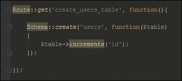
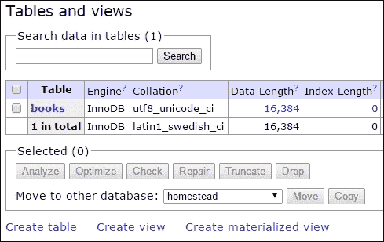
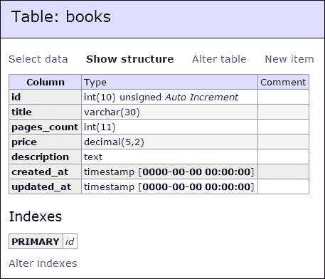
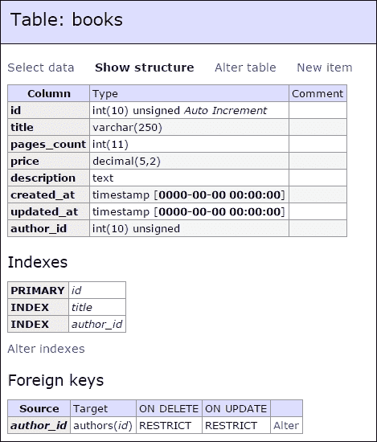
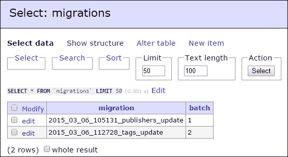

# 第二章. 使用 Schema Builder 类构建数据库

嘿，英雄！

我们的开发环境现在已经准备好了。不再有担忧，一个全新的世界在等待：英雄离开了他的家。一步一步，他朝着目标前进。英雄知道什么才是真正重要的：保持脚踏实地。有一个良好的基础是有帮助的。对于应用程序来说，没有太大的区别：为你的项目设计一个良好的数据库始终是最好的开始。

从这个重要的假设开始，问题自然而然地产生：在使用 Laravel 之前，是否有处理数据库设计的方法，也许是一种聪明的方法，你可以轻松管理？答案是，正如你所想象的那样，是的。

在这一章中，我们将探讨 Schema Builder 类。一个非常重要的类，它让你能够不写一行 SQL 就设计整个数据库！如果你考虑一下，这确实很令人印象深刻，考虑到你完全可能在没有使用 SQL 的情况下构建整个基于 SQL 的数据库！我们将分析你可以使用这个类做的一切：创建、删除和更新表；添加、删除和重命名列。我们还将从许多方面探讨索引：不仅包括简单的索引，还包括唯一索引和外键。此外，我们还将探讨 Schema 类提供的一些方法，以便对一切拥有真正的和完全的控制。有时，你需要确保你的数据库中存在什么！

在所有这些之后，事情还没有结束。事实上，我们将探索**迁移**的世界，这是 Laravel 用于对数据库进行版本控制的方法。结合 Schema 类和**迁移系统**的力量，将赋予你对数据设计极大的控制权。此外，将你的应用程序与团队的新成员共享将变得非常容易！你知道版本控制始终是最好的选择。

在继续之前的一个重要注意事项：即使 Schema Builder 类和迁移系统与 Eloquent 并没有紧密相关，它们也能轻松地创建一个结构完美适合 Eloquent 标准和约定的数据库。此外，Schema Builder 和迁移系统是 `illuminate/database` ([`github.com/illuminate/database`](https://github.com/illuminate/database)) 包的一部分；是的，就是 Eloquent 的同一个包！让我们开始吧。

+   Schema Builder 类

+   使用迁移系统进行数据库版本控制

# Schema Builder 类

Schema Builder 类是一个工具，它为你提供了一个*数据库无关*的方式来处理你的数据库设计。术语*数据库无关*意味着你永远不必担心你使用的是哪种数据库：唯一重要的是使用正确的驱动程序，就像我们在第一章的配置部分所看到的那样。所以，如果你考虑将你的数据库系统从 SQLite 切换到 MySQL 或 SQL Server，不用担心：你总是有你的结构准备好使用。

在本章的第一部分，我们将使用一些简单的路由。你所要做的就是将它们添加到 `app/routes.php` 文件中。

## 处理表

让我们从最基本的物理现象开始。以下是你可以在数据库中创建新表的 `Schema::create()` 方法：



`create()` 方法接受两个参数：第一个参数是你想要创建的表名，第二个参数是一个闭包，我们将在这里指定所有表字段。更准确地说，闭包参数是一个 Blueprint 对象。

### 提示

当可能时，我喜欢使用类型提示来提高代码的可读性。

因此，你可能读到如下内容：

```php
Schema::create('users', function(Blueprint $table)
{
$table->increments('id');
});
```

别担心，它是一样的。

你还将能够重命名一个表：在这种情况下，只需使用 `rename()` 方法。

```php
Schema::rename($previousName, $newName);
```

最后，关于删除表怎么办？`drop()` 方法就是为你准备的。

```php
  Schema::drop($tableName);
```

还有一个类似的方法，`dropIfExists()`，语法相同。

```php
  Schema::dropIfExists($tableName);
```

正如令人惊叹的表达性名称所暗示的，该方法仅在表存在于数据库中时才会删除表。

### 提示

我经常使用这个方法而不是简单的 `drop()` 方法。

记住，如果你想检查一个表是否存在，你可以使用 `hasTable()` 方法，如下所示：

```php
  if (Schema::hasTable('books')) 
  { 
    // the table "books" exists...
  }
```

现在，让我们看看如何处理表列。

## 处理列

处理列相当简单。首先，让我们看看在向数据库添加新表时如何创建新列。

正如我之前告诉你的，我们将使用 `Schema::create()` 的 `$table` 参数。

```php
  Schema::create('books', function(Blueprint $table)
  {
      $table->increments('id');

      $table->string('title');

      $table->integer('pages_count');
      $table->decimal('price', 5, 2);

      $table->text('description');

      $table->timestamps();
  });
```

`Blueprint $table` 对象有许多方法，这些方法与创建单个新列有关。你可以很容易地看到所有方法的名字代表了一种特定的列类型。例如，`string` 是 MySQL 中的 `VARCHAR` 的等价物，而 `integer` 是 `INT` 的等价物。

此外，还有一些实用方法：如果你查看闭包的第一个代码行，你会看到一个 `increments()` 方法。然而，这并不复杂，它只是创建了一个带有 `autoincrement` 的 `id` 整数字段（并将其设置为主键）。

最后，你可以在最后一行看到 `timestamps()` 方法。Schema Builder 类还有一些与 Eloquent 功能相关的方法。在这种情况下，`timestamps()` 方法自动创建了两个 `DATETIME` 等效字段，分别命名为 `created_at` 和 `updated_at`。如果你想要跟踪插入和最后更新操作的时间，它们可能非常有用。

现在，在我们继续前进之前，为什么不进行一些测试呢？

这只需要几秒钟：只需在 `app/routes.php` 文件中创建一个新的 `GET` 路由，并添加我们看到的 `Schema::create()` 方法，如下所示：

```php
  // remember this "use" directive!
  use Illuminate\Database\Schema\Blueprint;

  Route::get('create_books_table', function(){

    Schema::create('books', function(Blueprint $table)
    {
        $table->increments('id');

        $table->string('title', 30);

        $table->integer('pages_count');
        $table->decimal('price', 5, 2);

        $table->text('description');

        $table->timestamps();
    });

  });
```

我们将在数据库中创建一个名为 `books` 的表。这个表将包含七个列：

+   唯一的主键 `id` 是一个整数

+   `title` 列作为一个字符串（最多 30 个字符）

+   `pages_count` 整数列

+   `price` 小数列

+   `description` 文本列

+   由 `timestamps()` 方法创建的 `created_at` 和 `updated_at` 字段

让我们导航到 `/create_books_table` URL，然后打开你的 Adminer（或你喜欢的任何数据库处理工具）来验证是否一切顺利。

这就是结果！



干得好！让我们看看结构。



完美。正是我们想要的——没有一行 SQL 代码！

注意，就像我们之前为表所做的那样，我们也可以使用 `hasColumn()` 方法来检查是否存在特定的列：

```php
  if (Schema::hasColumn('books', 'title')) 
  { 
    // the column "title" in the "books" table exists...
  }
```

## 列的方法参考

这里是所有可以在 Blueprint `$table` 实例上使用的所有方法的快速参考：

| 方法 | 描述 |
| --- | --- |
| `$table->bigIncrements('id');` | 使用 *大整数* 等价项进行 ID 增量 |
| `$table->bigInteger('votes');` | `BIGINT` 等价于表中的字段 |
| `$table->binary('data');` | `BLOB` 等价于表中的字段 |
| `$table->boolean('confirmed');` | `BOOLEAN` 等价于表中的字段 |
| `$table->char('name', 4);` | `CHAR` 等价，长度为 |
| `$table->date('created_at');` | `DATE` 等价于表中的字段 |
| `$table->dateTime('created_at');` | `DATETIME` 等价于表中的字段 |
| `$table->decimal('amount', 5, 2);` | `DECIMAL` 等价，具有精度和小数位数 |
| `$table->double('column', 15, 8);` | `DOUBLE` 等价，精度为总精度 15 位，小数点后 8 位 |
| `$table->enum('choices', ['foo', 'bar']);` | `ENUM` 等价于表中的字段 |
| `$table->float('amount');` | `FLOAT` 等价于表中的字段 |
| `$table->increments('id');` | 将 `ID` 增量到表中（主键） |
| `$table->integer('votes');` | `INTEGER` 等价于表中的字段 |
| `$table->json('options');` | `JSON` 等价于表中的字段 |
| `$table->longText('description');` | `LONGTEXT` 等价于表中的字段 |
| `$table->mediumInteger('numbers');` | `MEDIUMINT` 等价于表中的字段 |
| `$table->mediumText('description');` | `MEDIUMTEXT` 等价于表中的字段 |
| `$table->nullableTimestamps();` | 与 `timestamps()` 相同，但允许 NULL |
| `$table->smallInteger('votes');` | `SMALLINT` 等价于表中的字段 |
| `$table->tinyInteger('numbers');` | `TINYINT` 等价于表中的字段 |
| `$table->string('email');` | `VARCHAR` 等价列 |
| `$table->string('name', 100);` | `VARCHAR` 等价，字符串长度为 |
| `$table->text('description');` | `TEXT` 等价于表中的字段 |

### 注意

你也可以在 Laravel 官方文档的 [`laravel.com/docs/5.0/schema#adding-columns`](http://laravel.com/docs/5.0/schema#adding-columns) 页面找到完整的参考。

## 其他 $table 对象方法

如果你查看 Laravel 文档中的方法参考，你可能会看到一些你刚才看到的列表中没有的内容。

第一个方法参考是：

```php
  $table->timestamps();
```

我已经在示例中使用了这个方法。它创建了一个包含 `created_at` 和 `updated_at` 列的表，如果你想要跟踪特定记录的创建或更新时间，这些列非常有用。

Eloquent 还会自动管理时间戳列，所以你不需要在你的代码中担心它们。

另一个重要（并且非常相似）的方法如下：

```php
  $table->softDeletes();
```

它用于向目标表添加一个 `deleted_at` 列。

有时候，在你的应用程序中，保留一些信息即使你不想向最终用户展示也是非常有用的。想想电子商务订单的历史记录：客户可以选择清理他的历史记录，但你不能允许他/她物理删除记录！

软删除系统通过向表中添加一个 `deleted_at` 列来跟踪记录的删除日期，从而解决了这个问题。

Eloquent 会自动处理这个系统，所以你将能够向客户展示一个干净的历史记录，并向商店管理员展示完整的订单列表。

接下来，你可以看到这个：

```php
  $table->rememberToken();
```

此方法添加一个 `remember_token` 列。

Laravel 认证系统使用这个令牌（一个简单的 `VARCHAR 100`）来跟踪用户状态。当你在应用程序的登录页面点击 **记住我** 复选框时，它会用到这个令牌。

在某些表格列定义之后，还有一些你可以链式调用的方法。

如果你想要使一个数值列无符号，可以使用以下方法：

```php
  $table->integer('my_column')->unsigned();
```

当然，你可以将它与每个数值字段（浮点数、十进制数等）一起使用。

你也可以使用 `nullable()` 来指定一个列是否可以为空：

```php
  $table->string('my_column')->nullable();
```

如果你想要指定一个默认值，可以使用以下方法：

```php
  $table->string('my_column')->default('my_default_value');
```

### 小贴士

有时候，你可能需要为你的主键使用 `BIGINT` 或等效类型。如果是这种情况，请使用 `bigIncrements()` 而不是 `increments()`（它使用 `INT` 或等效类型）。

## 更新表格和列

什么？是的，我知道你在想什么——如果我必须添加一个名为《了不起的弗朗切斯科·马拉泰斯塔的超级精彩生活》的书名怎么办？这是一个 60 个字符长的名字！

事情会变化，所以我们的数据库也必须随之改变。简单来说，你会使用 `table` 方法来更新现有的表格。

这里你可以看到一个示例：

```php
  Schema::table('table_name', function(Blueprint $table)
  {
    // update operations here...
  });
```

那么，让我们进行一点更新。在我们的路由文件中创建一个新的路由，并将其命名为 `update_books_table`：

```php
  Route::get('update_books_table', function(){

      Schema::table('books', function(Blueprint $table)
      {
          $table->string('title', 250)->change();
      });

  });
```

注意，我们在 `string()` 方法之后立即使用了 `change()` 方法。你将在更改列时使用 `change()`。如果你只是想向现有表中添加一个新列，只需像平常一样使用它：

```php
  $table->string('title', 250);
```

### 注意

你需要 `doctrine/dbal` 包来更改列。要获取它，只需将 `doctrine/dbal` 添加到你的 `composer.json` 文件中的 2.5.0 依赖项。

然后，在你的终端中输入 `composer update`，然后你就可以开始了。

浏览到新的 URL 并更新表格。现在你将能够在未来将我的精彩传记添加到你的图书馆中。为此感到自豪吧。

## 索引和外键

让我们再向前迈一步。让我们想象一下，我们正在升级我们的应用程序，并希望添加存储书籍作者和相关数据的功能。此外，我们还将给用户提供通过书名搜索书籍的可能性。

我们可能需要做以下几件事情：

+   创建`authors`表以存储作者数据

+   更新`books`表，插入一个外部外键和一个索引到`title`列

你已经知道如何更新现有的表，但关于索引列和创建外键呢？

使用 Schema Builder 添加索引相当简单。有一些表达性的方法你可以使用。

首先，你可以使用`primary()`方法创建一个主键。参数是你想要索引的字段。

```php
  $table->primary('id');
```

如果你需要，你可以指定一个列的数组作为单个索引。

```php
  $table->primary(['first_name', 'last_name', 'document_number']);
```

使用`unique()`方法来创建一个唯一键：

```php
  $table->unique('email');
```

最后，如果你想添加一个简单的索引，你可以使用`index()`方法！

```php
  $table->index('title');
```

如果需要，你也可以添加外键。在下面的例子中，我们正在将假设的书籍表中的`author_id`列（可能）引用到`authors`表中的`id`列。

```php
  $table->foreign('author_id')->references('id')->on('authors');
```

指定`onDelete`和`onUpdate`约束操作不是问题。

```php
  $table->foreign('author_id')
      ->references('id')
      ->on('authors')
      ->onDelete('cascade');
```

如果你不再需要你的索引，你可以轻松地删除它们：

```php
  $table->dropPrimary('authors_id_primary');
  $table->dropUnique('authors_email_unique');
  $table->dropIndex('books_title_index');
  $table->dropForeign('books_author_id_foreign');
```

### 注意

创建索引名称的约定是`table-name_column-name_index-type`。

好吧，现在你对 Schema Builder 类中的索引有了很好的了解，让我们给我们的示例添加新的功能。

创建一个新的`GET`路由。这次它被命名为`update_books_table_2`。

```php
  Route::get('update_books_table_2', function(){

      // creating the authors table...
      Schema::create('authors', function(Blueprint $table)
      {
          $table->increments('id');

          $table->string('first_name');
          $table->string('last_name');

          $table->timestamps();
      });

      Schema::table('books', function(Blueprint $table)
      {
          // creating the index on the title column...
          $table->index('title');

          // creating the foreign key...
          $table->integer('author_id')->unsigned();
          $table->foreign('author_id')->references('id')->on('authors');
      });

  });
```

就这样！让我们用 Adminer 验证所有内容，就像我们之前做的那样：



哟！它成功了。

# 使用迁移系统进行数据库版本控制

到目前为止，我们使用 Schema 类和一些简单的路由进行工作。相当简单，但这并不是一个好的实践。你知道：单一责任原则不仅仅是一个睡前故事。

此外，这不仅仅关乎代码：数据库也应该有一个功能齐全的版本控制系统，以便跟踪所有更新并帮助新成员加入你的团队。

好吧，迁移系统就在这里帮助你。你可以把它看作是你数据库的版本控制系统，它由许多文件组成。这些文件中的每一个都是一个类，包含两个方法：`up()`和`down()`。在`up()`方法中，你会放置所有数据库构建逻辑。而在`down()`方法中，你将放置与在`up()`方法中执行的操作相关的任何回滚操作。

## 创建迁移

让我们制作第一个基本示例。我们已经有`books`和`authors`表。想象一下，我们想要收集关于我们书籍出版者的数据。

我们将不得不：

+   创建一个名为`publishers`的新表，至少包含出版者的名称

+   在`books`表中创建一个新的外键`publisher_id`

让我们通过迁移文件来实现！打开你的终端并输入以下命令：

```php
  php artisan make:migration publishers_update
```

等待几秒钟，然后转到`database/migrations`文件夹。你将找到一个类似这样的文件：

```php
  2015_03_06_105131_publishers_update.php
```

打开它。这个类已经有了空的`up()`和`down()`方法：

```php
  <?php

    use Illuminate\Database\Schema\Blueprint;
    use Illuminate\Database\Migrations\Migration;

    class PublishersUpdate extends Migration {

      public function up()
      {
      //
    }

      public function down()
      {
        //
      }

    }
```

现在，用一些 Schema Builder 指令填充它们，就像这样。

```php
  <?php

    use Illuminate\Database\Schema\Blueprint;
    use Illuminate\Database\Migrations\Migration;

    class PublishersUpdate extends Migration {

      public function up()
      {
        Schema::create('publishers', function(Blueprint $table)
        {
          $table->increments('id');

          $table->string('name');

          $table->timestamps();
        });

        Schema::table('books', function(Blueprint $table)
        {
          $table->integer('publisher_id')->unsigned();
          $table->foreign('publisher_id')->references('id')->on('publishers');
        });
      }

      public function down()
      {
        Schema::table('books', function(Blueprint $table)
        {
          $table->dropForeign('books_publisher_id_foreign');
          $table->dropColumn('publisher_id');
        });

        Schema::drop('publishers');
      }

    }

```

非常线性：我们在`up()`中做的，我们在`down()`中撤销。当然，顺序相反。记住，这是一个*镜像*操作！

现在，是时候运行你的迁移了。你所要做的就是运行`php artisan migrate`；它加载所有迁移类并执行它们的`up()`方法。这样，你可以根据你的文件构建你的数据库。执行顺序由文件名决定。我们刚刚创建的文件名为`2015_03_06_105131_publishers_update.php`。

这意味着这个文件是在 2015 年 3 月 6 日 10:51:31 创建的。正如你可以轻易想象的，所有的迁移都将按时间顺序执行。为了使事情更清晰，删除两个`2014_10_12_000000_create_users_table.php`和`2014_10_12_100000_create_password_resets_table.php`。我们不需要它们。

回到你的终端并输入：

```php
  php artisan migrate
```

等待几秒钟，你将得到一个与以下输出非常相似的结果：

```php
  Migration table created successfully.
  Migrated: 2015_03_06_105131_publishers_update
```

现在，回到你的数据库。更新已经成功完成，但我们还有一个新的表：`migrations`表。Laravel 使用这个表来跟踪数据库的每一次更新。所以，如果你对你的应用程序（通过另一个新的迁移）进行另一次更新，并且再次运行`php artisan migrate`命令，你将只执行新的迁移，而不是旧的迁移。没错，就像我之前提到的，这是版本控制。

## 回滚迁移

让我们现在尝试这个`rollback`操作。在你的终端中输入

```php
  php artisan migrate:rollback
```

然后，回到你的数据库：没有更多的`publishers`表和没有更多的相关外键！太酷了！

明白了？好。现在，再次输入这个：

```php
  php artisan migrate
```

让我们继续前进。

### 小贴士

在执行`php artisan migrate`命令时，你可能会遇到`class not found`错误。

别担心，只需在终端中输入`composer dump-autoload`并再次尝试！即使是最好的，有时也会犯错误。

## 更多示例，更多迁移

现在，关于另一个示例呢？

让我们再想象另一个功能。好吧，我有一个想法：想象一下，你想为你的应用程序中存储的每一本书指定一些标签。这次你将有两件事情要做：

+   创建一个新的`tags`表来存储标签。

+   创建一个新的`book_tag`表，因为我们将要表示多对多关系。在这个表中，你会找到`book_id`和`tag_id`。

首先，创建一个新的迁移。打开你的终端并输入：

```php
  php artisan make:migration tags_update
```

此外，更新文件如下：

```php
  <?php

    use Illuminate\Database\Schema\Blueprint;
    use Illuminate\Database\Migrations\Migration;

    class TagsUpdate extends Migration {

      /**
       * Run the migrations.
       *
       * @return void
       */
      public function up()
      {
        Schema::create('tags', function(Blueprint $table)
        {
          $table->increments('id');

          $table->string('name');

          $table->timestamps();
        });

        Schema::create('book_tag', function(Blueprint $table)
        {
          $table->increments('id');

          $table->integer('book_id')->unsigned();
          $table->integer('tag_id')->unsigned();

          $table->foreign('book_id')->references('id')->on('books');
          $table->foreign('tag_id')->references('id')->on('tags');
        });
      }

      /**
       * Reverse the migrations.
       *
       * @return void
       */
      public function down()
      {
        Schema::drop('book_tag');
        Schema::drop('tags');
      }

    }
```

### 注意

我喜欢同时编写`up()`和`down()`方法。在你刚才看到的例子中，我把`tags`的`create`方法放入了`up()`中。然后，我传递到`down()`方法并添加了`drop('tags')`方法调用。然后，我回到`up()`并添加了`book_tag`表，最后我又回到`down()`来删除`book_tag`表。

以这种方式工作有助于我减少分心错误。

现在，打开终端并输入：

```php
  php artisan migrate
```

前往你的数据库。打开`migrations`表来查看发生了什么：



这里有两个不同的批次。第一个批次（*1*）与发布者更新相关。第二个批次（*2*）与标签系统更新相关。

我为什么要告诉你这些？谁在乎呢？

嗯，当你你在终端中输入`php artisan migrate:rollback`时，迁移系统会寻找最后一个批次并将其回滚。不是每个批次，而是最后一个批次。这意味着第一个`rollback`命令将撤销与标签系统相关的一切。如果你再次输入，迁移系统也将撤销与发布者更新相关的一切。

通过批次号，你可以知道你在数据库上进行了多少次迭代。然而，还有另一件重要的事情你需要知道：关于我们的例子，如果你回滚两次然后再次迁移，这两个迁移文件都将被归入批次 1。

同样，你也可以使用以下命令回滚所有内容：

```php
  php artisan migrate:reset
```

你可以使用以下命令回滚并再次迁移所有内容：

```php
  php artisan migrate:refresh
```

最后，你可以使用以下命令获取所有已迁移/回滚的迁移列表：

```php
  php artisan migrate:status
```

那就结束了！使用这个最后的命令，我们也完成了迁移。

# 摘要

最后，英雄离开了他的家。经过培训和获得正确的基石后，他真的准备好了。

记住，Schema Builder 类和迁移系统不仅仅是关于构建你的数据库。在本章中，你学习了如何以更智能的方式改进你的数据库设计方法，而不需要写一行 SQL 语句。此外，通过使用迁移，你将不再需要下载数据库备份，或者在某些*极端*情况下，安装任何额外的工具来处理它。

所有操作都是通过`artisan migrate`命令完成的。然而，正如我已经告诉你的，这只是一个*示例*。真正的事情即将到来。

在下一章中，我们将深入探讨最重要的、*原子*的 Eloquent 组件：模型。

你准备好了吗，英雄？
