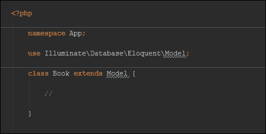

# 第三章。最重要的元素——模型！

最后，我可以说：从现在开始，事情变得真的、真的严肃了。在前面的章节中，你学习了开始所需的一切。也许有点烦人，但你都知道你需要它。现在，别再谈论过去；它已经过去了。在这一章中，许多令人惊奇的事情等着你。

如标题所示，这部分将关于最重要的、原子的 Eloquent 元素：**模型**。我们将分析**MVC**中的*M*。考虑到你正在阅读一本关于创建基于数据的应用程序的书，这非常重要！然而，我不想再让你感到无聊了。让我们谈谈下一节我们将看到的内容。

通常，查看 Eloquent 文档有一种*标准*的方式。它和你在 Laravel 网站上看到的是一样的。在我最初的 Laravel 日子里，我使用过那些页面，但我感觉有点*不完整*。所以，我稍微改变了一下，但以一种更简化的方式。如果你一生中曾经开发过网络应用程序，我相当确信你曾经制作过一个基于数据的带有表格和记录的应用程序。对吧？嗯...

如果你这么想，你可以在它们上执行四个基本操作。无论你开发什么应用程序，你都有很高的可能性将实现一些*创建*、*读取*、*更新*和*删除*逻辑。这正是我们将在本章中看到的内容。

首先，我们将介绍一个简单的、基本的模型。它将是一行代码！然后，我们将讨论使用 Eloquent 的 CRUD（**创建、读取、更新和删除**）操作。从那时起，你将拥有所有*基础*和机制的概述。我们还将处理`where()`方法和所有相关内容，解开有关条件和选择的一切。

之后，我们将深入探讨**模型**类，研究批量赋值作为存储和更新我们数据的一种方式。然后，我们将讨论**时间戳**和**软删除**，了解 Laravel 和 Eloquent 如何处理日期。之后，你将了解查询范围以及如何使用它们来提高你的开发过程。

此外，我们还将查看许多酷炫的方法来转换我们的数据，以便正确显示（或存储）：属性转换、修改器、日期修改器和访问器。如果还不够，我们将探索所有与模型相关的你可以用来在不破坏代码的情况下引入新行为的事件。当事件不够时，我们还将分析模型观察者。

在本章的最后部分，我们将探索一些有用的方法和模型类的功能，直接深入基本模型类的代码！不错吧？让我们开始！以下是主题：

+   创建模型

+   创建、读取、更新和删除操作基础

+   哪里，聚合和其他实用工具

+   批量赋值——面向大众

+   查询范围

+   属性转换、访问器和修改器

+   模型事件和观察者

+   代码深入

# 创建模型

首先，让我们看看如何创建一个模型以及其基本结构是如何构成的。

创建模型最快的方式是使用以下命令，你可以使用参数来指定模型名称：

```php
php artisan make:model

```

所以，让我们想象一下，你想要创建一个 `Book` 模型。步骤如下：

1.  你需要做的只是使用以下命令：

    ```php
    php artisan make:model Book

    ```

    当然，你也可以手动创建它；通常，Laravel 将模型放在 `app` 文件夹中。

1.  一旦你完成了这些，让我们打开 `app` 目录下的 `Book.php` 文件，看看里面有什么。

等等。什么？一个空类？真的吗？

是的。

Laravel 设计得非常快速地创建一个优秀的网络应用程序。Eloquent（及其模型）也不例外。你在这里看到的类已经准备好在你的应用程序中使用；使用它，你将能够完成与你的书籍相关的所有操作。

谈到 SQL 数据库，你可以想到每个模型和表之间的连接。如果你遵守某种*约定*，Laravel 会自动根据模型名称猜测表名。所以，如果我有一个名为 `Book` 的模型，Laravel 将会在数据库中搜索一个名为 `books` 的表，无需明确指定。

如果你需要将某个模型与另一个表绑定，你可以指定名称，将其作为 `$table` 属性添加，如下所示：

```php
  <?php 

namespace App;

use Illuminate\Database\Eloquent\Model;

class Book extends Model {

    protected $table = 'my_books';

}
```

好吧，这里没有更多要说的了。现在，让我们来玩我们的新模型。

# 创建、读取、更新和删除操作的基本知识

我读过的每一篇关于 Eloquent 的文章通常都以一些读取操作开始。我不喜欢这样。我将教你如何创建和插入新记录，然后我们将使用一些读取操作来检索它们。

没有使用外部管理工具的枯燥测试插入。

## 创建操作

让我们创建我们的第一本书！作为记录*结构*的参考，我们将使用我们在上一章中创建的 `books` 表。该表结构非常简单：标题、页数（`pages_count`）、价格和描述。

这个过程就像创建一个对象一样简单。

嗯，实际上完全一样。在 `app/Http/` 目录下的 `routes.php` 文件中创建一个新的 `GET` 路由，命名为 `book_create` 并输入以下内容：

```php
  Route::get('book_create', function(){

    $book = new \App\Book;

    $book->title = 'My First Book!';
    $book->pages_count = 230;
    $book->price = 10.5;
    $book->description = 'A very original lorem ipsum dolor sit amet...';

  });
```

如果你仔细想想，这里有一些奇怪的地方！在检查模型文件后，你可以看到没有声明 `title` 或 `pages_count` 属性。在其他方面，Eloquent 大量使用魔法方法。当最终查询构建时，Laravel 将使用属性名称作为表列来填充。这很重要！

现在，如果你运行这段代码然后检查你的表，你将找不到任何记录。你必须添加一个单一的最终指令：调用 `save()` 方法。

```php
  Route::get('book_create', function() {

      $book = new \App\Book;

      $book->title = 'My First Book!';
      $book->pages_count = 230;
      $book->price = 10.5;
      $book->description = 'A very original lorem ipsum dolor sit amet...';

      $book->save();

  });
```

执行它。现在，你的书已经保存在数据库中了。

如果你愿意，你甚至可以在保存后访问特定记录的字段。让我们再举一个例子。

```php
  Route::get('book_create', function() {

      $book = new \App\Book;

      $book->title = 'My First Book!';
      $book->pages_count = 230;
      $book->price = 10.5;
      $book->description = 'A very original lorem ipsum dolor sit amet...';

      $book->save();

      echo 'Book: ' . $book->id;

  });
```

### 注意

关于 Eloquent 约定还有另一件小事；那就是，每个表都有一个 ID，自动递增为主键。

## 读取操作

现在我们已经创建了一些示例记录，为什么不尝试读取它们呢？一个例子胜过千言万语。

```php
  Route::get('book_get_all', function(){

    return \App\Book::all();

  });
```

在这里，我们用一条指令返回所有表记录。输出将非常类似于以下内容：

```php
  [
    {
      id: 1,
      title: "My First Book!",
      pages_count: 230,
      price: "10.50",
      description: "A very original lorem ipsum dolor sit amet...",
      created_at: "2015-03-24 16:45:59",
      updated_at: "2015-03-24 16:45:59"
    }
  ]
```

### 注意

如果您对此感到奇怪，请不要担心。如果您在一个路由（或控制器方法）中返回 Eloquent 模型查询的结果，结果将自动转换为 JSON。如果您正在考虑构建 RESTful API，这是一个非常有用的快捷方式。

让我们再创建一本书，给我们的测试增加更多元素。

```php
    $book = new \App\Book;

    $book->title = 'My Second Book!';
    $book->pages_count = 122;
    $book->price = 9.5;
    $book->description = 'Another very original lorem ipsum dolor sit amet...';

    $book->save();
```

在这里，再次在`book_get_all`路由中执行您的代码。结果将如下所示：

```php
  [
    {
      id: 1,
      title: "My First Book!",
      pages_count: 230,
      price: "10.50",
      description: "A very original lorem ipsum dolor sit amet...",
      created_at: "2015-03-24 16:45:59",
      updated_at: "2015-03-24 16:45:59"
    },
    {
      id: 2,
      title: "My Second Book!",
      pages_count: 122,
      price: "9.50",
      description: "Another very original lorem ipsum dolor sit amet...",
      created_at: "2015-03-24 16:57:15",
      updated_at: "2015-03-24 16:57:15"
    }
  ]
```

然而，我们可以做得更多。实际上，另一个很好的方法是`find()`方法。您可以使用它这样：

```php
  Route::get('book_get_2', function(){

      return \App\Book::find(2);

  });
```

此方法以主 ID 作为参数，并返回单个记录作为模型的实例。

看看它的输出：

```php
  {
    id: 2,
    title: "My Second Book!",
    pages_count: 122,
    price: "9.50",
    description: "Another very original lorem ipsum dolor sit amet...",
    created_at: "2015-03-24 16:57:15",
    updated_at: "2015-03-24 16:57:15"
  }
```

注意，这次您有一个单个对象而不是数组。当然，这些*静态*方法并不是 Eloquent 所能提供的一切。有趣的部分从这里开始。

看看这个：

```php
  Route::get('book_get_where', function(){

      $result = \App\Book::where('pages_count', '<', 1000)->get();
      return $result;

  });
```

您可以使用`where()`方法来过滤您的结果。然后，在指定您的标准后，`get()`方法从数据库中检索结果。为了更好地理解，想象一下`where()`方法正在构建一个查询。`get()`方法执行它。最后一个方法是*触发*方法。

如果您只想检索第一个结果而不是所有结果，您可以使用`first()`方法而不是`get()`。

```php
  Route::get('book_get_where', function(){

      $result = \App\Book::where('pages_count', '<', 1000)->first();
      return $result;

  });
```

### 提示

在我们继续之前，这里有一个可以节省您很多时间的提醒。实际上，当您使用*触发*方法，如`get()`或`first()`时，您可以得到两种不同类型的结果。

当您使用`first()`时，您正在选择一个单一实例。因此，您将作为结果（如果存在）收到某个模型的单个实例。否则，如果您使用`all()`或`get()`，您将获得实例的集合。

回到我们的`where()`，您可以按需链式调用多个调用。

```php
  Route::get('book_get_where_chained', function(){

      $result = \App\Book::where('pages_count', '<', 1000)
              ->where('title', '=', 'My First Book!')
              ->get();

      return $result;

  });
```

您可以通过非常简单的方式遍历结果：简单的 for each 就足够了。

```php
  Route::get('book_get_where_iterate', function(){

      $results = \App\Book::where('pages_count', '<', 1000)->get();

      if(count($results) > 0)
      {
        foreach($results as $book){

            echo 'Book: ' . $book->title . ' - Pages: ' . $book->pages_count . ' <br/>';

        }
      }
      else
        echo 'No Results!';

      return '';
  });
```

`$results`对象是可计数的，因此您也可以检查是否有结果。

看看这一行：

```php
  echo 'Book: ' . $book->title . ' - Pages: ' . $book->pages_count . ' <br/>';
```

您可能已经注意到，您可以用与设置它们相同的方式访问单个记录字段：魔法方法。

### 注意

如果您喜欢，您可以通过数组的方式访问记录字段。

尝试将`$book->title`切换到`$book['title']`并看看会发生什么。

## 更新操作

更新记录与创建它一样简单。说实话，这完全一样，只是在第一条指令中有一个小小的变化。

```php
  Route::get('book_update', function() {

      $book = \App\Book::find(1);

      $book->title = 'My Updated First Book!';
      $book->pages_count = 150;

      $book->save();

  });
```

我们不是在创建它，而是在数据库中检索我们想要的模型实例。之后，使用魔法方法，我们修改并保存了它。就像插入过程一样，你做的更改在`save()`调用后变得持久。

## 删除操作

删除记录是最简单的事情。

```php
  Route::get('book_delete_1', function() {

      \App\Book::find(1)->delete();

  });
```

是时候让`Book`消亡了！

### 注意

这是一个关键概念。当你使用`update()`和`delete()`方法时，你正在对一个模型实例进行操作，就像你之前在创建它时做的那样。

所以，如果你运行`\App\Book::find(1)`指令，你将得到一个`Book`类实例作为结果。对于一些人来说，这很明显，但许多新来者经常会遇到这个问题。

# 聚合、where 和其他实用工具

毫无疑问，`where()`方法将在你使用 Eloquent 构建查询和选择记录时成为你的最佳拍档。你不认为详细了解一下它很有价值吗？

让我们回顾一下我们已经知道的内容。

你可以使用`where()`方法来过滤结果。你必须使用的正确语法是：

```php
  where('field_name', 'operator', 'term')
```

例如，你可以使用以下方式过滤所有页数少于 100 页的书籍：

```php
  where('pages_count', '<', 100)
```

你还可以链式调用更多的`where`方法，一个接一个，来构建更复杂的查询。让我们选择所有那些页数少于 100 页，标题以*M*开头的书籍。

```php
  where('pages_count', '<', 100)->where('title', 'LIKE', 'M%')
```

### 注意

两个链式条件等同于`condition1 AND condition2`。

太棒了！

## where 和 orWhere

然而，你知道这还不够。通常，在现实世界的应用中，你可能需要更复杂的条件。首先，你可能需要得到满足一个条件或另一个条件的查询结果。`AND`条件不是标准的；所以，这里有一个解决方案：`orWhere()`。

```php
  Route::get('book_get_where_complex', function(){

      $results = \App\Book::where('title', 'LIKE', '%Second%')
              ->orWhere('pages_count', '>', 140)
              ->get();

      return $results;

  });
```

在这段代码中，我们告诉 Eloquent 获取所有标题中包含单词*Second*的书籍或所有页数超过 140 页的书籍。

是的，这比之前好多了。

现在让我们尝试想象一个更复杂的条件：我们想要找到所有页数超过 120 页且标题中包含单词*Book*的书籍，或者所有页数少于 200 页且描述为空的书籍。

```php
  Route::get('book_get_where_more_complex', function(){

      $results = \App\Book::where(function($query){

          $query
              ->where('pages_count', '>', 120)
              ->where('title', 'LIKE', '%Book%');

      })->orWhere(function($query){

          $query
              ->where('pages_count', '<', 200)
              ->orWhere('description', '=', '');

      })->get();

      return $results;

  });
```

你不需要为`where()`和`orWhere()`方法指定三个参数，你可以使用一个接受`$query`参数的单个闭包参数。从那个`$query`对象开始，你将能够以你喜欢的任何方式执行选择和过滤。

当然，你可以嵌套很多这样的工具：

```php
  Route::get('...', function(){

      $results = \App\Book::where(function($query){

          $query
              ->where(function($query){

                // other conditions here...

                $query->where(function($query){

                  // deeper and deeper in the seas of conditions...

                });

              })
              ->orWhere('field', 'operator', 'condition');

      })->orWhere(function($query){

          $query
              ->where('field', 'operator', 'condition')
              ->orWhere(function($query){

          // other conditions here...

              });

      })->get();

      return $results;

  });
```

好吧，停下来。我认为这个概念现在已经很清晰了。让我们看看`where`的其他形式。

首先，这里有`whereBetween`，你可以用它来使用范围而不是单个值来过滤某些字段。

```php
  $results = \App\Book::whereBetween('pages_count', [100, 200])->get();
```

就这样，我们得到了所有页数在 100 到 200 之间的书籍。

你也可以使用`whereIn`来检查一个特定字段是否在其它值的数组中。

```php
  $results = \App\Book::whereIn('title', ['My First Book!', 'My Second Book!'])->get();
```

最后，如果你想获取所有某个列等于 null 的记录，可以使用`whereNull`。

```php
  $booksThatDontExist = \App\Book::whereNull('title')->get();
```

### 魔法 where

另一个很棒且酷炫的特性是 *魔法* `where`。你知道 Laravel 中到处都有一些魔法。显然，Eloquent 也不例外。

实际上，你可以为你的 `where` 子句使用一种替代语法，这是一种魔法语法，允许你将感兴趣的字段定义为方法名。

你已经知道了这种语法：

```php
Route::get('book_get_where', function(){

      $result = \App\Book::where('pages_count', '=', 1000)->first();
      return $result;

  });
```

现在，你可以用这段代码得到相同的结果：

```php
Route::get('book_get_where', function(){

      $result = \App\Book::wherePagesCount(1000)->first();
      return $result;

  });
```

显然，`wherePagesCount` 方法不存在，但 Laravel 会自动使用 PHP 魔术方法创建一个快速的 `where` 子句。正如你从示例中看到的那样（以及语法所暗示的），你并不能每次都使用这种技术，因为它只适用于等号。

然而，了解一个类似的快捷方式是很好的，对吧？

## 聚合

有时候，你需要使用聚合函数。没问题！这是你如何使用 Eloquent 来做到这一点的示例。

```php
  \App\Book::count();
```

这是一个其实际应用的例子：

```php
  Route::get('book_get_books_count', function(){

      $booksCount = \App\Book::count();
      return $booksCount;

  });
```

正如你之前在 `get()` 和 `first()` 方法中看到的，你可以使用聚合方法与 `where` 方法一起使用。在这里，我们正在计算页数超过 140 页的书籍数量。

```php
  Route::get('book_get_books_count', function(){

      $booksCount = \App\Book::where('pages_count', '>', 140)->count();
      return $booksCount;

  });
```

显然，`count()` 不是唯一的聚合。让我们通过一些其他的 `where()` 示例来看看它们，以便进行更多的练习。这次，我们正在寻找页数最少的书籍（但至少是超过 120 页的）。

```php
  Route::get('book_get_books_min_pages_count', function(){

      $minPagesCount = \App\Book::where('pages_count', '>', 120)->min('pages_count');
      return $minPagesCount;

  });
```

你也可以用 `max()` 做同样的事情：

```php
  Route::get('book_get_books_max_pages_count', function(){

      $maxPagesCount = \App\Book::where('pages_count', '>', 180)->max('pages_count');
      return $maxPagesCount;

  });
```

现在，让我们找到所有书名中包含 *Book* 单词的书籍的平均价格：

```php
  Route::get('book_get_books_avg_price', function(){

    $avgPrice = \App\Book::where('title', 'LIKE', '%Book%')->avg('price');
      return $avgPrice;

  });
```

最后，让我们得到所有页数超过 100 页的书籍的总页数。

```php
  Route::get('book_get_books_avg_price', function(){

    $countTotal = \App\Book::where('pages_count', '>', 100)->avg('price');
      return $countTotal;

  });
```

## 实用方法

如你所想象的那样，Eloquent 有很多实用工具和方法可以提升你的开发者生活。试图涵盖每一个单独的方法可能会很困难，但除了最常见的方法之外，还有一些其他的方法值得在这里提及。

首先是 `skip()` 和 `take()` 方法，这些方法用于在你的查询中实现分页。

```php
  $books = \App\Book::skip(10)->take(10)->get();
```

我们正在告诉 Eloquent 取前 10 条记录并跳过前 10 条。所以，如果 `skip(0)->take(10)` 会取第 1 到第 10 条记录，`skip(10)->take(10)` 会取第 11 到第 20 条，以此类推。

当然，你也不能错过 `orderBy`、`groupBy` 和 `having` 方法。如果你对 SQL 数据库有些了解（而且如果你在这里，我想你确实了解），你不会对理解这段代码有任何问题：

```php
  // orderBy
  \App\Book::orderBy('title', 'asc')->get();

  // groupBy
  \App\Book::groupBy('price')->get();

  // having
  \App\Book::having('count', '<', 20)->get();
```

# 大量赋值...针对大众

你已经掌握了基础。太棒了！

现在，你必须了解另一种将记录插入 Eloquent 的方法。

第一个就是模型构造函数。你可以将关联数组作为构造函数调用的参数传递，就像这样：

```php
  $book = new \App\Book([
    'title' => $title,
    'pages_count' => $pagesCount,
    'price' => $price
  ]);
```

另一个是 `create()` 方法，你可以从模型本身静态地调用它。

```php
  $book = \App\Book::create([
    'title' => 'My First Book!',
    'price' => 10.50,
    'pages_count' => 150,
    'description' => 'My lorem ipsum dolor description here...'
  ]);
```

与构造函数类似，这个 `create()` 方法也接受一个关联数组作为参数，这个数组中的每个键都对应于表中的一个列（以及模型上的一个 `magic` 属性）。返回的值（存储在 `$book` 中的那个）是 `Book` 类的一个实例。

这被称为**批量赋值**，直到目前为止，一切都很正常，除了一个严重的安全问题。事实上，有时你可以将整个请求输入数组作为参数传递。相信我：迟早你会这么做。

### 注意

在以下示例中，你将要看到的`$request`对象是一个请求实例，你可以用它来处理当前请求的数据。我将使用它从表单（使用`all()`方法）中检索一些假设的`POST`数据，我们将使用这些数据创建一本新书。

类似这样的内容可以被使用：

```php
  $book = new \App\Book($request->all());

  // or...

  $book = \App\Book:create($request->all());
```

技术上，你不知道`$request->all()`中确切是什么，所以这不是最佳实践，对吧？然而，你可以通过向模型添加一个单一属性——`fillable`或`guarded`——来轻松解决这个问题。

让我们用一个例子来更好地理解这个概念。想象一下，由于某种原因，你在用于新书插入的表单中指定了其他字段，比如当前用户 ID 用于登录目的。

然而，你只需要插入四个单字段：`title`、`pages_count`、`price`和`description`。其他什么也不要！

关键属性是`fillable`：

```php
  <?php 

  namespace App;

  use Illuminate\Database\Eloquent\Model;

  class Book extends Model {

      protected $fillable = [
          'title',
          'price',
          'pages_count',
          'description'
      ];

  }
```

你可以像这样执行代码：

```php
  $book = \App\Book:create($request->all());
```

从你执行代码的那一刻起，模型将搜索`title`、`pages_count`、`price`和`description`项。没有更多！如果你在请求数据数组中也有`user_id`字段，它将被模型忽略。

当然，要小心，并仔细检查你放入模型`$fillable`数组中的内容。有时，开发者很容易忘记正确的字段，并在空数据库记录上花费数小时。

所以，如果你实际上遇到了空数据库记录的问题，请记住：检查你的`fillable`。

`guarded`属性有类似的行为，但做的是相反的事情：如果`fillable`是白名单，那么`guarded`就是黑名单。如果存储了一些重要且敏感的信息，你不想以任何方式让用户更新，那么黑名单机制可以非常有用。

此外，有时你需要保护模型中的每一个属性。没问题，使用`guarded`如下所示：

```php
  <?php 

  namespace App;

  use Illuminate\Database\Eloquent\Model;

  class Book extends Model {

      protected $guarded = ['*'];

  }
```

### 注意

如果你将一个字段同时放入`fillable`和`guarded`数组中，模型的行为将优先考虑`fillable`，该字段将被填充。

此外，明智地使用`fillable`和`guarded`。记住，如果你正在使用`guarded`数组，并且将经典的全请求数据数组传递给模型，你可能会更新一些不希望更新的字段，并得到一些非常不希望出现的错误。

无聊的错误！避免它们。

# 时间戳和软删除

现在来介绍模型类的两个酷炫特性：时间戳和软删除。你有多少次不得不手动处理记录的创建日期和最后更新时间？模型时间戳就是为了帮助解决这个问题。

此外，你有多少次在维护数据的一些信息的同时创建删除功能，如果不是全部的话？是的，软删除功能也是为了帮助解决这个问题。

## 时间戳

你还记得我们在 `books` 表迁移中调用的最后一个方法吗？不记得了吗？

别担心，下面就是：

```php
  Schema::create('books', function(Blueprint $table)
  {
    // other fields...

      $table->timestamps();
  });
```

正确，它是 `timestamps()` 方法。这个特殊的 Schema Builder 方法用于创建两个独立的字段：`created_at` 和 `updated_at`，两者都是 MySQL 的 `DATETIME` 或等效类型。Eloquent 在你创建或更新记录时会自动处理这两个字段。

它可以非常实用：你有多少次不得不处理特定表上的某些*最后编辑*数据？想象一下，有了这两个字段处理一些计划发布的文章会容易多少。

然而，有时它们并不那么有用：你只需将模型中的 `timestamps` 属性设置为 `false` 就可以禁用它们。

```php
  <?php

  namespace App;

  class Book extends Model {

      public $timestamps = false;

  }
```

### 注意

显然，如果你打算禁用时间戳，你可以在迁移中删除相应的 `timestamps()` Schema Builder 调用。你将不再需要它。

如果需要，你可以最终*指定时间戳的格式*。这里有一个例子：

```php
  <?php

  namespace App;

  class Book extends Model {

      protected $table = 'books'';

      protected function getDateFormat()
      {
          // returining a different timestamp format!
          return 'd/m/Y';
      }

  }
```

你所需要做的就是实现模型中的 `getDateFormat` 方法，并让它返回一个描述所需格式的字符串。

### 注意

在返回的字符串中，你可以插入任何 `date()` PHP 函数的有效格式（你可以在 [`php.net/manual/en/function.date.php`](http://php.net/manual/en/function.date.php) 找到完整的参考）。

## 软删除

软删除功能是一个非常有趣的功能，在许多场合都可能很有用。

如果你决定激活软删除，你实际上永远不会删除一条记录：相反，`deleted_at` 列将被更新为操作日期，但仅此而已。Eloquent 将像以前一样工作，但你永远不会丢失任何东西。

它非常适合处理订单的电子商务数据库。客户可以决定*清除*他的订单历史。然而，为了保持账户完美，店主会持续需要每个订单的详细信息。

如你很容易想象的，从上一章中，为了激活软删除功能，你必须调用 `softDeletes()` Schema Builder 方法。

```php
  Schema::create('books', function(Blueprint $table)
  {
    // other fields...

      $table->softDeletes();
  });
```

在此之后，你必须将 `SoftDeletes` 特性包含在模型中。

```php
  <?php

  namespace App;

  use Illuminate\Database\Eloquent\SoftDeletes;

  class Book extends Model {

      use SoftDeletes;

      protected $dates = ['deleted_at'];

  }
```

没有更多了！

此外，处理软删除数据真的非常简单。让我们基于之前描述的情况（客户订单的详情和店主的需求）来实现一个简单的例子。

首先，这里有一个示例模型：

```php
  <?php // Order.php

  namespace App;

  use Illuminate\Database\Eloquent\SoftDeletes;

  class Order extends Model {

      use SoftDeletes;

      protected $dates = ['deleted_at'];

  }
```

在他的/她的订单历史中，客户应该只能看到他/她的*存在*订单，而不是*已删除*订单。我之所以使用引号，是因为我们谈论的是始终存在的记录。

```php
  // getting all the orders

$orders = \App\Order::orderBy('created_at', 'desc')->get();
```

没有什么特别之处！

那店主怎么办呢？神奇的字眼是 `withTrashed`：

```php
  // getting all the orders, including the "deleted" ones...

$orders = \App\Order::withTrashed()->orderBy('created_at', 'desc')->get();
```

`withTrashed` 方法自动包含表中实际存在的每个结果，无论 `deleted_at` 字段值如何。

此外，如果你只想看到软删除的字段，将 `withTrashed` 改为 `onlyTrashed`。

```php
  $trashedOrders = \App\Order::onlyTrashed()->orderBy('created_at', 'desc')->get();
```

最后，你可以使用`restore`方法恢复已被删除的记录。

```php
  $trashedOrder = \App\Order::find($trashedOrderId);
  $trashedOrder->restore();

  // $trashedOrder is not so trashed anymore...
```

如果你愿意，你可以使用查询作为`filter`来执行恢复操作。

```php
  \App\Order::where('customer_id', '=', $customerId)->restore();
```

好吧，我知道你在想什么：这个功能很酷，但如果我想真正删除一个字段怎么办？

没问题；只需使用`forceDelete`。

```php
  order = \App\Order::find($orderId);

  // bye bye... forever :'(
  $order->forceDelete();
```

# 查询范围

查询范围非常有趣且强大。我真的很喜欢它们，因为像许多程序员一样，我绝对且非常懒惰。我也有一个很好的理由来证明我的懒惰：**不要重复自己**（**DRY**）原则。

简而言之，它们允许你在查询中重用一些逻辑。如果你在应用程序中有类似的查询并且不想每次都重复编写它们，这很有用。

让我们举一个例子。

```php
  <?php // Book.php

  namespace App;

  class Book extends Model {

      public function scopeCheapButBig($query)
      {
          return $query->where('price', '<', 10)->where('pages_count', '>', 300);
      }

  }
```

发生了什么？我声明了一个`scopeCheaperButBig`方法。`scope`前缀用于指定这将用作范围。

那么，我该如何使用范围？

下面是示例：

```php
  <?php

  $bigAndCheaperBooks = \App\Book::cheapButBig()->get();
```

这是一个很酷的功能。如果你也认为你可以以更智能的方式拆分你的逻辑，你可以这样做：

```php
  <?php // Book.php

  namespace App;

  class Book extends Model {

      public function scopeCheap($query)
      {
          return $query->where('price', '<', 10);
      }

      public function scopeExpensive($query)
      {
      return $query->where('price', '>', 100);
      }

      public function scopeLong($query)
      {
        return $query->where('pages_count', '>', 700);
      }

      public function scopeShort($query)
      {
      return $query->where('pages_count', '<', 100);
      }

  }
```

根据需要使用，减少重复代码。

```php
  <?php

    // getting cheaper and longer books;
    $cheapAndLongBooks = \App\Book::cheap()->long()->get();

    // getting most expensive and longer books;
    $expensiveAndLongBooks = \App\Book::expensive()->long()->get();

    // getting cheaper and shorter books;
    $cheapAndShortBooks = \App\Book::cheap()->short()->get();

    // getting expensive and shorter books;
    $expensiveAndShortBooks = \App\Book::expensive()->short()->get();
```

如果需要，你还可以定义动态范围，以便向范围传递参数。如果你喜欢，在另一个范围内调用范围不是问题。

```php
  <?php // Book.php

  namespace App;

  class Book extends Model {

    public function scopeLong($query)
      {
        return $query->where('pages_count', '>', 700);
      }

      public function scopeLongAndCheaperThan($query, $amount)
      {
          return $query->long()->where('price', '<', $amount);
      }

  }
```

# 属性转换、访问器和修改器

Eloquent 有多种方法将模型数据转换为更易读或易用的形式（反之亦然）。在本章中，我们将分析其中的三种：属性转换、访问器和修改器。

## 属性转换

在访问模型属性的同时转换它们的最简单方法是属性转换。简而言之，它允许你定义你想要转换的属性以及它将变成的*目标*类型。

假设你在`books`表中还有一个整数字段：`is_rare`。如果这本书是罕见的，这将等于`1`，否则为`0`。然而，当你处理它时，从逻辑上讲最好的做法是如下所示：

```php
  if($book->is_rare)
  {
    // do wow things here...
  }
  else
  {
    // do common things here...
  }
```

它不会是这样的：

```php
  if($book->is_rare === 1)
  {
    // ...
  }
```

对吗？很好。

因此，要解决这个问题，你只需在模型中指定`casts`数组：

```php
  <?php // Book.php

  namespace App;

  class Book extends Model {

    protected $casts = [
        'is_rare' => 'boolean',
    ];

  }
```

从此刻起，每次你调用`is_rare`属性时，它将自动转换为相应的布尔值并返回。

支持的转换类型有：整数、实数、浮点数、双精度浮点数、字符串、布尔值、对象和数组。

### 注意

正如文档所述，当你在特定表列中存储了 JSON 数组并且想要快速处理它时，*数组*类型转换非常有用。

## 访问器和修改器

属性转换非常有用，但有一些限制。有时，从数据库中存储的简单值开始，你可能需要对它进行更复杂的工作。访问器和修改器就在这里帮助你。

更具体地说，访问器是一种在用户读取特定属性时执行的方法。访问器作用于存储在数据库中的属性，并返回它。相反，修改器以相反的方式工作：当你存储一个值时，修改器工作，完成其任务，然后将它保存在表中。让我们说它们是获取器和设置器的一种。

定义一个访问器（或修改器）并不难：你所要做的就是遵循一个命名规范。

让我们从简单的东西开始。想象一下，每次你访问你书的定价时，你都想在字符串的开头加上美元符号*$*。

```php
  <?php // Book.php

    namespace App;

    class Book extends Model {

      public function getPriceAttribute()
        {
            return '$ ' . $value;
        }

    }
```

访问器的命名规范很简单，如下所示：

+   方法名称以`get`开头

+   名称的中间部分是属性名称，它是驼峰式命名的

+   方法名称以`Attribute`结尾

没有更多。

现在，看看这个：

```php
  $book = \App\Book::find(1);

  echo $book->price;
  // output: $ 10.50
```

每次你有前面的代码，修改器都非常相似。这次，我们想要存储标题的小写版本。

```php
  <?php // Book.php

    namespace App;

    class Book extends Model {

      public function setTitleAttribute($value)
        {
            $this->attributes['title'] = strtolower($value);
        }

    }
```

习惯用法并没有改变太多：唯一的区别是，现在方法名称以`set`开头，而不是`get`。这完全是关于获取器和设置器，我的朋友。

修改器的一个实际常见用途是在应用程序存储用户的密码时。可以使用修改器来散列选定的密码，然后将结果存储起来。

```php
  <?php // User.php

    namespace App;

    class User extends Model {

      public function setPasswordAttribute($value)
        {
            $this->attributes['password'] = \Hash::make($value);
        }

    }
```

# 在代码中向下深入

在前面的文本中，我们分析了 Eloquent 模型许多方面。如果你想想你的路径，在几页之内，你学到了你需要做许多数据操作的所有东西。此外，你还看到了许多添加行为（从访问器和修改器到模型观察器）的有趣方式，以提高你的代码的可用性、可读性和可维护性。

在本节中，我将深入分析模型类，比通常更深入一些。没有什么太高级的，所以不用担心：我将只使用类代码来展示你可以用你的模型做什么。

把它当作一个*有用的提示和技巧列表*。

## 一个大文件

当我写这一章的时候，`Illuminate\Database\Eloquent`下的`Model`类有 3361 行代码，这是一个具有许多方法和功能的大家伙。然而，考虑到我们可以以许多不同的方式做同样的事情（想想`save()`方法，`::create()`方法，以及在模型构造函数中指定关联数组的可能性：三种插入新记录的方式），这个长度是可以接受的。

在类的第一部分，你可以看到我们之前看到的所有属性，都设置为它们的默认值。

```php
  ...

  protected $fillable = array();

  ...

  protected $guarded = array('*');

  ...

  protected $casts = array();

  ...
```

是的，默认情况下，每个属性都是受保护的。这是一个*完全黑名单*，以实现最大安全性！

## 快速转换为数组或 JSON

你还记得这一章开头我告诉你的关于模型属性自动转换为 JSON 的事情吗？如果你查看模型中的代码，你会看到两个方法：`toArray`和`toJson`。这两个方法就是让魔法发生的地方。

```php
  // from the Illuminate\Database\Eloquent\Model class

  ...

  /**
   * Convert the model instance to an array.
   *
   * @return array
   */
  public function toArray()
  {
    $attributes = $this->attributesToArray();

    return array_merge($attributes, $this->relationsToArray());
  }

  ...

  /**
   * Convert the model instance to JSON.
   *
   * @param  int  $options
   * @return string
   */
  public function toJson($options = 0)
  {
    return json_encode($this->toArray(), $options);
  }
```

### 注意

你还可以看到第二个方法使用了第一个。如果你不怕大文件，我建议你深入了解一下这个类中的所有方法。你将看到一些代码重用和函数编写的精彩示例。在本章中，我们只是触及了表面。

你可以将单个模型和模型集合都转换为数组或 JSON：

```php
  return \App\Book::all()->toJson();

  // or ...

  return \App\Book::where('title', 'LIKE', 'My%')->get()->toArray();

  // or

  return \App\Book::find(1)->toJson();
```

显然，出于安全原因，你可以选择将一些特定字段标记为 `hidden`。当记录转换为数组或 JSON 时，它们将不会显示。

```php
  <?php

  namespace App;

  use Illuminate\Database\Eloquent\Model;

  class User extends Model {

      protected $hidden = ['password', 'credit_card_number'];

  }
```

在这种情况下，我们通过 `hidden` 指定了一个黑名单。你还可以使用 `visible` 属性定义一个白名单。

```php
  <?php

  namespace App;

  use Illuminate\Database\Eloquent\Model;

  class User extends Model {

      protected $visible = ['first_name', 'last_name'];

  }
```

## 虚拟属性

使用访问器和模型的特定属性 `appends`，即使这些属性不是作为表列存在，你也能创建一些属性。

为了举例说明，让我们假设我们想要创建一个 `complete_name` 属性，由 `first_name` 和 `last_name` 这两个属性组成。

首先，让我们在模型中创建适当的访问器：

```php
  <?php

  namespace App;

  use Illuminate\Database\Eloquent\Model;

  class User extends Model {

      public function getCompleteNameAttribute()
    {
        return $this->attributes['first_name']. ' ' . $this->attributes['last_name'];
    }

  }
```

然后作为最后一步，我们可以将其包含在 `appends` 数组属性中。

```php
  <?php

  namespace App;

  use Illuminate\Database\Eloquent\Model;

  class User extends Model {

    protected $appends = ['complete_name'];

      public function getCompleteNameAttribute()
    {
        return $this->attributes['first_name']. ' ' . $this->attributes['last_name'];
    }

  }
```

没有其他了！

现在，我们可以像这样使用我们的属性：

```php
  echo $user->complete_name;
  // outputs: Francesco Malatesta
```

### 注意

你使用 `appends` 数组创建的每个属性都尊重你在 `visible` 和 `hidden` 数组中最终指定的规则。

## 路由模型绑定

另一个很酷的快捷方式是 **模型绑定**。简单来说，它允许你将某个路由参数链接到定义的模型的一个实例。

让我们来测试一下：首先，前往 `app/Providers` 文件夹中的 `RouteServiceProvider`。现在按照以下步骤操作：

1.  将此行添加到 `boot` 方法中：

    ```php
      public function boot(Router $router)
      {
          parent::boot($router);

          $router->model('book', 'App\Book');
      }
    ```

1.  然后前往你的路由文件，创建一个新的路由，使用这个参数：

    ```php
      Route::get('books/{book}', function(App\Book $book)
      {
          return $book->title;
      });
    ```

1.  因此，调用 `books/1` URL 将输出类似的内容：

    ```php
      My First Book!
    ```

发生了什么？Laravel 解析并自动在 `$book` 变量中实例化了所需的对象，使用给定的参数（`1`）作为基于主键的搜索词。然后，使用该实例输出了标题。

这是一个小技巧，但有时可能很有用。

你还可以自定义解析逻辑：这里有一个使用电子邮件地址的另一个示例。

```php
  Route::bind('user', function($value)
  {
      return User::where('email', '=', $value)->first();
  });
```

如果指定的主键记录不存在，应用程序将返回 `404 not found` 错误。显然，你可以通过为 `model()` 绑定指定第三个参数来改变这种行为。

```php
  Route::model('user', 'User', function()
  {
      throw new MyCustomNotFoundHttpException;
  });
```

## 记录分块以优化内存

有时候，你可能需要处理成千上万的记录。你知道这些操作对你的内存来说非常沉重，但 Eloquent 有一个有用的方法可以将查询结果分块在 *块* 中，以优化你的加载。

```php
  \App\Book::chunk(200, function($books)
  {
      foreach ($books as $book)
      {
          // heavy operations on the book here...
      }
  });
```

第一个参数定义了你想要使用的块的大小。在这种情况下，我们将加载 200 个结果，处理它们，卸载它们，然后对下一个 200 个重复同样的操作。

第二个参数是一个闭包，它定义了如何处理这个块：`books` 闭包参数是返回的记录集合。

# 摘要

嘿，我们又做到了！Eloquent 的这个第一部分概述已经完成，现在你能够自己进行第一次实验了！实际上，你能够进行许多实验，而不仅仅是基础操作。我们学习了所有关于 CRUD、批量赋值以及许多其他有趣的内容。

如果你觉得所有这些信息让你感到不知所措，别担心。花时间进行多次测试，熟悉所有机制，包括你在旅途中发现的约定。我们才刚刚进行到第三章！

在下一章中，我们将深入探讨 Eloquent 最令人惊叹的方面之一：关系。你将体验到 Eloquent 的力量以及它是如何处理模型之间各种关系的，从一对一关系到多对多关系，展现其全部的美丽。

加油，加油，英雄！
