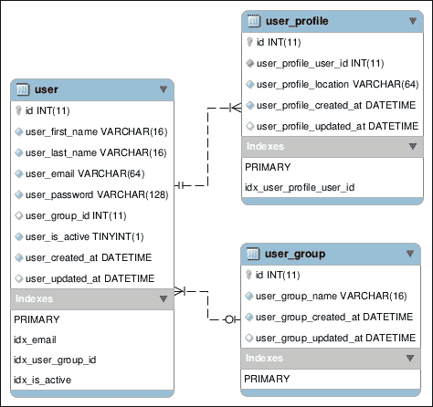
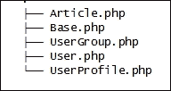
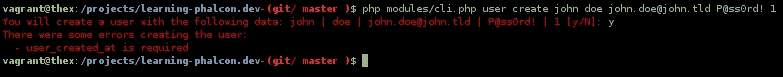
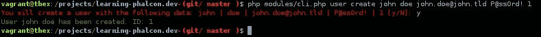
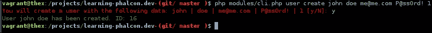
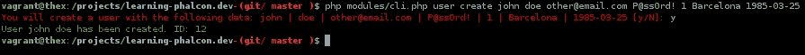
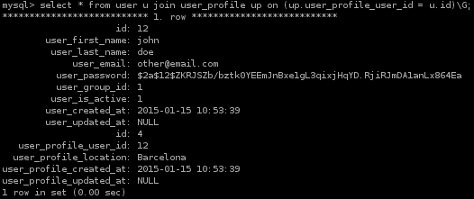
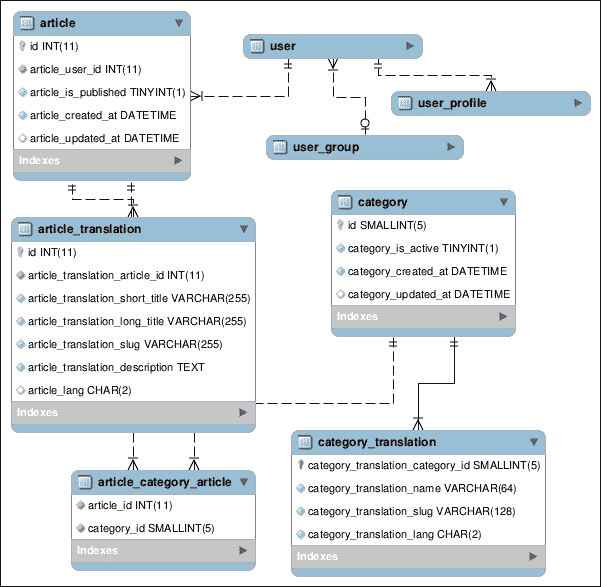
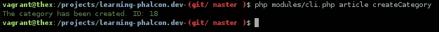
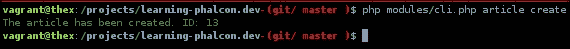

# 第四章 数据库架构、模型和 CLI 应用程序

现在我们已经了解了 Phalcon 的 ORM 和 ODM 的基础知识，我们可以创建数据库架构和项目所需的大部分模型。我们还将创建一些 CLI 任务，以帮助我们提高工作效率。由于代码量很大，当引用第一章中的一些部分时，我将使用缩写**CSC**（**检查源代码**）。

本章将涵盖以下主题：

+   数据库架构

+   模型

+   CLI 应用程序

# 数据库架构

本书的主要目标是通过示例学习，我们通过开发一个在线新闻/杂志网站来实现这一点。我们将假设以下表为必填项：

+   `用户`

+   `UserGroup`

+   `UserProfile`

+   `Article`

+   `ArticleCategory`

+   `ArticleTranslation`

+   `ArticleCategoryArticle`

+   `Hashtag`

+   `ArticleHashtagArticle`

这些是基本表，我们将在后面的章节中添加更多。我喜欢在命名约定中使用单数术语，但这只是一个选择。为了提高效率，我建议使用如 PhpMyAdmin 或 MySQL Workbench 等工具。让我们从第一个表开始。

## 用户表

`User`表将包含有关用户的基本信息：

```php
CREATE TABLE IF NOT EXISTS `user` (
 `id` int(11) NOT NULL AUTO_INCREMENT,
 `user_first_name` varchar(16) COLLATE utf8_unicode_ci NOT NULL,
 `user_last_name` varchar(16) COLLATE utf8_unicode_ci NOT NULL,
 `user_email` varchar(32) COLLATE utf8_unicode_ci NOT NULL,
 `user_password` varchar(128) COLLATE utf8_unicode_ci NOT NULL,
 `user_group_id` int(11) DEFAULT NULL,
 `user_is_active` tinyint(1) NOT NULL DEFAULT '0',
 `user_created_at` datetime NOT NULL,
 `user_updated_at` datetime DEFAULT NULL,
 PRIMARY KEY (`id`),
 UNIQUE KEY `idx_email` (`user_email`),
 KEY `idx_user_group_id` (`user_group_id`),
 KEY `idx_is_active` (`user_is_active`)
) ENGINE=InnoDB DEFAULT CHARSET=utf8 COLLATE=utf8_unicode_ci AUTO_INCREMENT=1 ;

```

`group_id`和`profile_id`字段将与`UserGroup`和`UserProfile`表相关联。在我们创建了这些表之后，我们也将创建这些关系。

## 用户组表

`UserGroup`表将包含有关用户组的信息，每个用户都将属于可用的组之一。我们不会使用用户和组之间的一对多关系，但如果您需要，请随意实现：

```php
CREATE TABLE IF NOT EXISTS `user_group` (
 `id` int(11) NOT NULL AUTO_INCREMENT,
 `user_group_name` varchar(16) COLLATE utf8_unicode_ci NOT NULL,
 `user_group_created_at` datetime NOT NULL,
 `user_group_updated_at` datetime DEFAULT NULL,
 PRIMARY KEY (`id`)
) ENGINE=InnoDB DEFAULT CHARSET=utf8 COLLATE=utf8_unicode_ci AUTO_INCREMENT=1 ;

```

## UserProfile 表

如果您想为用户创建一个个人资料，`UserProfile`很有用。我们将保存有关用户位置和出生日期的信息：

```php
CREATE TABLE IF NOT EXISTS `user_profile` (
 `id` int(11) NOT NULL AUTO_INCREMENT,
 `user_profile_user_id` int(11) NOT NULL,
 `user_profile_location` varchar(64) COLLATE utf8_unicode_ci NOT NULL,
 `user_profile_birthday` date NOT NULL,
 `user_profile_created_at` datetime NOT NULL,
 `user_profile_updated_at` datetime DEFAULT NULL,
 PRIMARY KEY (`id`),
 UNIQUE KEY `idx_user_profile_user_id` (`user_profile_user_id`)
) ENGINE=InnoDB DEFAULT CHARSET=utf8 COLLATE=utf8_unicode_ci AUTO_INCREMENT=1 ;

```

为了简单起见，用户位置字段将是自由文本，而不是基于坐标的位置。现在我们已经有了所有用户表，让我们创建它们之间的关系/约束：

```php
ALTER TABLE `user_profile`
 ADD CONSTRAINT `user_profile_ibfk_1` FOREIGN KEY (`user_profile_user_id`) REFERENCES `user` (`id`) ON DELETE CASCADE ON UPDATE NO ACTION;

ALTER TABLE `user`
 ADD CONSTRAINT `user_ibfk_2` FOREIGN KEY (`user_profile_id`) REFERENCES `user_profile` (`id`) ON UPDATE NO ACTION,
 ADD CONSTRAINT `user_ibfk_1` FOREIGN KEY (`user_group_id`) REFERENCES `user_group` (`id`) ON UPDATE NO ACTION;

```

最后，您的数据库结构应该看起来像以下截图所示：



# 模型

现在我们有了用户架构，在继续数据库的其他部分之前，让我们创建模型和一个简单的 CLI 任务来注册新用户。

如果您已经安装了 Phalcon 开发者工具，您可以使用它们来生成模型，或者您可以手动创建它们。您也可以在本章的源代码中找到它们。

### 小贴士

使用模型生成器不会在表之间创建关系。您必须手动创建它们。

我们所有的模型都将扩展上一章中创建的`Base`模型。接下来，我将向您展示包含模型重要部分的几行代码，不包括获取器、设置器和受保护变量。

## 用户模型

`User`模型将位于`apps\Core\Models`命名空间下的`apps/Core/Models/`目录中：

```php
<?php
namespace App\Core\Models;

class User extends Base {
  public static function find($parameters = array()) {
    return parent::find($parameters);
  }

  public static function findFirst($parameters = array()) {
    return parent::findFirst($parameters);
  }

  public function initialize() {
    $this->hasOne('id', 'App\Core\Models\UserProfile', 'user_profile_user_id', array(
        'alias' => 'profile',
        'reusable' => true
    ));

    $this->hasOne('user_group_id', 'App\Core\Models\UserGroups', 'id', array(
      'alias' => 'group',
      'reusable' => true
    ));
  }
}
```

`initialize()`方法类似于构造函数，因此我们将在这里放置在模型加载时需要执行的代码的大部分。

在前面的示例中，我们在`initialize()`方法中创建了模型之间的关系。我们已经讨论了关系，但你总是可以在官方网站上阅读更多内容：[`docs.phalconphp.com/en/latest/reference/models.html#relationships-between-models`](http://docs.phalconphp.com/en/latest/reference/models.html#relationships-between-models)。

该模型包含两个其他方法用于快速访问（`find` 和 `findFirst`）。请记住，Phalcon 的 ORM 支持使用魔术方法进行调用，例如，如果你想通过 ID 查找用户，你可以使用`findFirstById()`；如果你想通过电子邮件查找第一个用户，你可以使用`findFirstByEmail()`；等等。

如果你使用 Phalcon 开发者工具生成模型，`find()`和`findFirst()`方法将自动创建。

## 用户组模型

`UserGroup`将位于`apps\Core\Models`命名空间下的`apps/Core/Models/`目录中：

```php
<?php
namespace App\Core\Models;

class UserGroup extends Base{
  public static function find($parameters = array()){
    return parent::find($parameters);
  }
  public static function findFirst($parameters = array()){
    return parent::findFirst($parameters);
  }
  public function initialize(){
    $this->hasMany('id', 'App\Core\Models\User', 'group_id',array(
        'alias' => 'users'
    ));
  }
}
```

该模型与用户之间存在 1-n 的关系，这意味着当你调用`$group->users`时，命令将返回分配给`users`组的所有用户的名称。

## 用户资料模型

`UserProfile`模型将位于`apps\Core\Models`命名空间下的`apps/Core/Models/`目录中：

```php
<?php
namespace App\Core\Models;

class UserProfile extends Base
{
    public static function find($parameters = array())
    {
        return parent::find($parameters);
    }

    public static function findFirst($parameters = array())
    {
        return parent::findFirst($parameters);
    }

    public function initialize()
    {
        $this->hasOne('user_profile_user_id', 'App\Core\Models\User', 'id', array(
            'alias' => 'user',
            'reusable' => true
        ));
    }
}
```

`UserProfile`模型与用户之间存在 1-1 的关系，这意味着资料与单个用户紧密耦合。

我们已经准备好了。让我们看看我们的`modules\Core\Models`目录结构。它应该看起来像这样：



`Article.php`在列表中，因为我们是在上一章中创建的。现在我们可以继续创建一个 CLI 任务来注册新用户。

通常，你开发 CLI 应用程序用于在 cron 作业中使用，创建实用程序等。本书将针对不同情况开发一些任务。其中之一是通过命令行注册新用户。

## 注册新用户

在`modules\`文件夹中创建一个名为`Task`的新目录：

```php
$ cd modules
$ mkdir Task

```

前往`Task`目录，创建一个名为`BaseTask.php`的新文件，并将以下内容附加到其中：

```php
<?php

class BaseTask extends \Phalcon\CLI\Task
{
    public function consoleLog($s_message, $color = 'green', $endline = true)
    {
        $start      = "\033[";
        $end        = "\033[0m\n";
        $bash_color = '0;32';
        $colors = array(
            'green'  => '0;32',
            'red'    => '0;31',
            'yellow' => '0;33',
            'blue'   => '0;34',
            'grey'   => '0;30',
        );
        if (isset($colors[$color])) {
            $bash_color = $colors[$color];
        }
        echo $start, $bash_color, 'm', $s_message;
        if ($endline) echo $end;
    }

    public function countdown($time)
    {
        for ($i=1;$i<=$time;$i++) {
            sleep(1);
            $this->consoleLog(($time-$i).' seconds left ...', 'red');
        }
    }

    public function quit($s_message)
    {
        $this->consoleLog($s_message, 'red');
        exit;
    }

    public function log($s_message, $log_file='/tmp/app.log')
    {
        error_log(PHP_EOL.$s_message.PHP_EOL, 3, $log_file);
    }

    protected function confirm($message='Are you sure you want to process it')
    {
        echo "\033[0;31m".$message.' [y/N]: '."\033[0m";

        $confirmation = trim( fgets( STDIN ) );
        if ($confirmation !== 'y') {
            exit (0);
        }
    }
}
```

### 注意

我几年前写了这个文件的内容，为了“美化”我的命令行脚本。如果你对此不满意，请随意删除或更改它。

接下来，我们需要为我们的 CLI 应用程序创建一个引导程序，但在我们这样做之前，我们需要安装一些依赖项。假设你已经安装了 Composer ([`getcomposer.org`](http://getcomposer.org))，编辑`composer.json`并添加以下内容：

```php
{
    "require": {
        "phalcon/incubator": "dev-master",
        "crada/php-apidoc": "@dev"
    }
}
```

使用以下命令更新 Composer：

```php
$ php composer.phar update

```

返回到`modules\`文件夹，创建一个名为`cli.php`的新文件。

我们将尝试拆分并解释以下代码的内容：

```php
#!/usr/bin/env php
<?php
umask(0022);
set_time_limit(1200);
require_once __DIR__.'/../vendor/autoload.php';

use Phalcon\DI\FactoryDefault\CLI as CliDI;
use Phalcon\CLI\Console as ConsoleApp;
use Crada\Apidoc\Extractor;
```

在这些第一行中，我们包含了由 Composer 生成的自动加载器，并使用了 Phalcon 的 DI 和 CLI 以及`Extractor`辅助工具，这些工具将用于解析方法的注释：

```php
class Cli
{
    private $arguments;
    private $params;
    private $console;

    public function __construct($argv)
    {
        $di = new CliDI();

        include __DIR__ .'/../config/loader.php';
        $config  = include __DIR__ . '/../config/config.php';

        $di->set('config', $config);

        include __DIR__ . '/../config/services.php';

        $console = new ConsoleApp();
        $console->setDI($di);

        foreach ($argv as $k => $arg) {
            if ($k == 1) {
                $this->arguments['task'] = $arg;
            } elseif ($k == 2) {
                $this->arguments['action'] = $arg;
            } elseif ($k >= 3) {
                $this->params[] = $arg;
            }
        }

        if (count($this->params) > 0) {
            $this->arguments['params'] = $this->params;
        }

        $this->console = $console;
    }
```

前面的类构造函数将为我们设置 DI 并加载运行任务所需的配置文件。它还将读取分配给任务的任何参数：

```php
public function readTasks() {
  if ($handle = opendir(__DIR__.'/Task/')) {

    require_once __DIR__.'/Task/BaseTask.php';
    $util = new BaseTask();
    $util->consoleLog('Learning Phalcon CLI','grey');
    $util->consoleLog(str_repeat('-', 80),'grey');

    while (false !== ($entry = readdir($handle))) {
      if ($entry != '.' && $entry != '..' && $entry != 'BaseTask.php' && preg_match("/\.php$/",$entry)) {
      $entries[] = $entry;
                }
            }

            asort($entries);

            $charCountActionName = 0;

            foreach ($entries as $entry) {
                $task = str_replace('Task.php', '', $entry);

                require_once __DIR__.'/Task/'.$entry;
                $tmp_className = str_replace('.php','',$entry);
                $tmp = new $tmp_className();

                $taskName = PHP_EOL.strtolower(preg_replace('/\B([A-Z])/', '_$1', $task));
                $taskDescription = '';

$util->consoleLog(str_pad($taskName, 
  25).$taskDescription, 'yellow');
$st_classMethods = get_class_methods($tmp);
asort($st_classMethods);
foreach ($st_classMethods as $value) {
  if (preg_match('/Action/', $value)) {
    $theActionName = str_pad(str_replace('Action', 
      '', $value), 6);
    if (strlen($theActionName) > 
      $charCountActionName) {

        $charCountActionName = strlen(
          $theActionName);
      }
    }
  }
  foreach ($st_classMethods as $value) {
    if (preg_match('/Action/', $value)) {
      $theActionName = str_replace('Action', '', 
        $value);
      $theActionDescription = '';
      $annotations = Extractor::getMethodAnnotations(
        $tmp_className, $value);
      if (count($annotations) > 0) {
        foreach ($annotations as $key => 
          $st_values) {

          if ($key == 'Description') {
            $theActionDescription .= implode(', ', $st_values);
          }
        }
      }
      $util->consoleLog(str_pad($theActionName, 
      $charCountActionName + 5)."\033
        0;28m".$theActionDescription, 'green');
         }
        }
      }
    closedir($handle);
  }
}
```

我们使用`readTask`方法来读取每个任务的注释，并列出我们应用程序中可用的任务。通过在终端中执行`$` `php` `modules/cli.php`，你会更好地理解这个方法的目的：

```php
    public function getArguments()
    {
        return $this->arguments;
    }

    public function getConsole()
    {
        return $this->console;
    }
}
```

最后，我们需要初始化我们新创建的类。我们通过以下几行代码来完成：

```php
try {
    $cli       = new Cli($argv);
    $arguments = $cli->getArguments();

    if (0 === count($arguments)) {
        $cli->readTasks();
    } else {
        $console = $cli->getConsole();
        $console->handle($arguments);
    }
} catch (\Phalcon\Exception $e) {
    echo $e->getMessage();
}
```

…

我们需要注册新的任务文件夹。打开`config/loader.php`文件，并添加以下内容：

```php
$loader->registerDirs(array(
    __DIR__ . '/../modules/Task/'
));
```

我们现在准备好创建我们的第一个任务。让我们创建一个测试任务，以确保我们的代码正在正常工作。转到`modules/Task/`文件夹，创建一个名为`UserTask.php`的新文件，并包含以下内容：

```php
<?php
class UserTask extends BaseTask
{
    /**
     * @Description("Test action")
     */
    public function testAction()
    {
        $this->consoleLog('OK');
    }
}
```

从你的项目根目录执行任务：

```php
$ php modules/cli.php user test

```

你应该会看到以下截图类似的内容：

![注册新用户

到目前为止，我们有了`user*`表的数据库结构和模型。我们还有一个工作的 CLI 应用程序和一个虚拟测试任务。我们可以继续进行用户任务。

接下来，我们将开发一个可以从 CLI 访问的用户注册过程。我们首先需要做的是在我们的管理器中实现一个注册方法。这个管理器目前还不存在，但我们将创建它，在`modules/Core/Managers/`中（从上一章中的`ArticleManager.php`）。

前往`modules/Core/Managers/`，并创建一个名为`UserManager.php`的新文件，并包含以下内容：

```php
<?php
namespace App\Core\Managers;

use \App\Core\Models\User;
use \App\Core\Models\UserGroup;
use \App\Core\Models\UserProfile;

class UserManager extends BaseManager
{
    public function find($parameters = null)
    {
        return User::find($parameters);
    }

    /**
     * Create a new user
     *
     * @param  array                           $data
     * @return string|\App\Core\Models\User
     */
    public function create($data)
    {
        $security = $this->getDI()->get('security');

        $user = new User();
        $user->setUserFirstName($data['user_first_name']);
        $user->setUserLastName($data['user_last_name']);
        $user->setUserEmail($data['user_email']);
        $user->setUserPassword($security->hash($data[
       'user_password']));
        $user->setUserIsActive($data['user_is_active']);

        if (false === $user->create()) {
            foreach ($user->getMessages() as $message) {
                $error[] = (string) $message;
            }

            throw new \Exception(json_encode($error));

        }

        return $user;
    }
}
```

### 小贴士

注意，我们正在使用安全服务来散列用户的密码。`hash`方法使用 bcrypt 算法。

然后，我们需要注册新创建的管理器。为此，打开位于`config/service.php`的配置文件，并添加以下内容：

```php
$di['core_user_manager'] = function () {
    return new \App\Core\Managers\UserManager();
};
```

现在，我们可以实现用户创建任务。打开`modules/Task/UserTask.php`，并附加以下内容：

```php
/**
 * @Description("Create a new user")
 * @Example("php modules/cli.php user create F_NAME L_NAME EMAIL@DOMAIN.TLD PASSWORD IS_ACTIVE")
*/
public function createAction($params = null) {
  if (!is_array($params) || count($params) < 5) {
    $this->quit('Usage: php modules/cli.php user create F_NAME L_NAME EMAIL@DOMAIN.TLD PASSWORD IS_ACTIVE');
  }

  $this->confirm('You will create a user with the following data: '.implode(' | ', $params));

  $manager = $this->getDI()->get('core_user_manager');

  try {
    $user = $manager->create(array(
      'user_first_name' => $params[0],
      'user_last_name' => $params[1],
      'user_email' => $params[2],
      'user_password' => $params[3],
      'user_is_active' => $params[4],
    ));

    $this->consoleLog(sprintf(
      "User %s %s has been created. ID: %d",
      $user->getUserFirstName(),
      $user->getUserLastName(),
      $user->getId()
    ));

    } catch (\Exception $e) {
      $this->consoleLog("There were some errors creating the user: ","red");
      $errors = json_decode($e->getMessage(), true);
      foreach ($errors as $error) {
        $this->consoleLog("  - $error", "red");
    }
  }
}
```

在`createAction()`方法的头两行中，我们只是对参数进行简单的验证，并要求开发者确认输入。你现在可以执行任务：

```php
$ php modules/cli.php user create john doe john.doe@john.tld P@ss0rd!1

```

但你将得到一个类似于以下截图的错误：



抛出了`user_created_at` `is` `required`异常，因为在我们从用户管理器的`create()`方法中，我们没有添加这个字段——我们也不会添加它。相反，我们将使用 Phalcon 的"可时间戳"行为。

打开`User`模型（`modules/Core/Models/User.php`），并将以下代码添加到`initialize()`方法中：

```php
$this->addBehavior(new Timestampable(array(
  'beforeValidationOnCreate' => array(
    'field' => 'user_created_at',
    'format' => 'Y-m-d H:i:s'
  ),
  'beforeValidationOnUpdate' => array(
    'field' => 'user_updated_at',
    'format' => 'Y-m-d H:i:s'
  ),
)));
```

### 注意

将此行为添加到所有使用 `*_created_at` 和 `*_updated_at` 的模型中。同时，别忘了使用 `use` `\Phalcon\Mvc\Model\Behavior\Timestampable;`。

现在，你可以再次执行用户创建任务。如果一切顺利，你应该会看到类似于以下截图的内容：



现在我们有一个用于用户和用户管理器的功能化的 CLI 应用程序，但用户没有个人资料也没有组。我们将修改用户管理器的 `create()` 方法，以便能够分配组和创建个人资料。由于 `user_group` 表为空，我们需要插入一些数据：

```php
INSERT INTO `user_group` (`id`, `user_group_name`, `user_group_created_at`, `user_group_updated_at`) VALUES
(1, 'User', '2015-01-13 00:00:00', NULL);
```

在这里，我们创建了一个名为 `User` 的新组。这将作为默认组。接下来，我们将修改用户管理器的 `create()` 方法，以便能够将现有组分配给用户。新的 `create()` 方法将如下所示：

```php
public function create($data, $user_group_name = 'User') {
  $security = $this->getDI()->get('security');

  $user = new User();
  $user->setUserFirstName($data['user_first_name']);
  $user->setUserLastName($data['user_last_name']);
  $user->setUserEmail($data['user_email']);
  $user->setUserPassword($security->hash($data['user_password']));
  $user->setUserIsActive($data['user_is_active']);

 $user_group_id = $this->findFirstGroupByName($user_group_name)->getId();
 $user->setUserGroupId($user_group_id);

  if (false === $user->create()) {
    foreach ($user->getMessages() as $message) {
      $error[] = (string) $message;
    }

    throw new \Exception(json_encode($error));

  }
  return $user;
}
```

我们还需要创建 `findFirstGroupByName()` 方法。将以下内容追加到 `UserManager.php` 文件中：

```php
public function findFirstGroupByName($user_group_name) {
  return UserGroup::findFirstByUserGroupName($user_group_name);
}
```

在我们再次运行 `user create` 任务之前，我们需要确保数据完整性，避免重复的电子邮件。由于数据库结构，我们不允许插入重复记录（`email` 列是唯一的），并且 `create()` 方法将抛出一个类似于 `SQLSTATE[23000]: Integrity constraint violation: 1062 Duplicate entry 'john.doe@john.tld' for key 'idx_email'` 的 SQL 异常。

为了避免这种情况，我们将使用内置的验证器。在这种情况下，我们将实现其中两个：一个唯一性验证器和电子邮件验证器，都是针对 `user_email` 列的。我们通过在 `modules/Core/Models/User.php` 文件中的用户模型中添加以下代码来实现这一点：

```php
public function validation() {
  $this->validate(new \Phalcon\Mvc\Model\Validator\Email(array(
    "field" => "user_email",
    "message" => "Invalid email address"
  )));

  $this->validate(new \Phalcon\Mvc\Model\Validator\Uniqueness(array(
    "field" => "user_email",
    "message" => "The email is already registered"
  )));

  return $this->validationHasFailed() != true;
}
```

现在我们有了验证器，我们可以确信电子邮件格式正确，并且确实存在于我们的数据库中。让我们执行相同的任务来看看会发生什么：

```php
$ php modules/cli.php user create john doe john.doe@john.tld P@ss0rd!1

```

如果你一切操作正确，你应该会看到类似于以下截图的响应：


现在，通过更改电子邮件地址并检查组 ID 是否已分配给新用户来再次执行任务。让我们称它为 `me@me.com`：

```php
$ php modules/cli.php user create john doe me@me.com P@ss0rd! 1

```

如果你得到类似于以下截图的响应，这意味着你做得非常出色！



### 小贴士

你可以在 [`docs.phalconphp.com/en/latest/reference/models.html#validating-data-integrity`](http://docs.phalconphp.com/en/latest/reference/models.html#validating-data-integrity) 了解更多关于验证数据完整性的信息。

## 创建用户个人资料

我们接下来需要做的几乎是重复相同的步骤来创建用户个人资料。`UserManager.php` 中的最终 `create()` 方法应该如下所示：

```php
public function create($data, $user_group_name = 'User') {
  $security = $this->getDI()->get('security');

  $user = new User();
  $user->setUserFirstName($data['user_first_name']);
  $user->setUserLastName($data['user_last_name']);
  $user->setUserEmail($data['user_email']);
  $user->setUserPassword($security->hash($data['user_password']));
  $user->setUserIsActive($data['user_is_active']);

  $user_group_id = $this->findFirstGroupByName($user_group_name)->getId();
  $user->setUserGroupId($user_group_id);

 $profile = new UserProfile();
 $profile->setUserProfileLocation($data['user_profile_location']);
 $profile->setUserProfileBirthday($data['user_profile_birthday']);

 $user->profile = $profile;

  return $this->save($user);
}
```

为了避免代码重复，我们将在 `BaseManager` 文件中创建一个 `save()` 方法。打开 `modules/Core/Managers/BaseManager.php` 并追加以下代码：

```php
public function save($object, $type = 'save') {
  switch($type) {
    case 'save':
      $result = $object->save();
      break;
    case 'create':
      $result = $object->create();
      break;
    case 'update':
      $result = $object->update();
      break;
  }

  if (false === $result) {
    foreach ($object->getMessages() as $message) {
      $error[] = (string) $message;
    }

    throw new \Exception(json_encode($error));
  }

  return $object;
}
```

我们需要做的最后一个更改是在`UserTask.php`文件中。打开它，并通过替换`$user` `=` `$manager->create` `…`代码块来更新`createAction()`方法：

```php
$user = $manager->create(array(
  'user_first_name' => $params[0],
  'user_last_name' => $params[1],
  'user_email' => $params[2],
  'user_password' => $params[3],
  'user_is_active' => $params[4],
  'user_profile_location' => $params[5],
  'user_profile_birthday' => $params[6],
));
```

我们可以尝试再次执行任务并测试新用户是否已创建，并且是否也创建了一个个人资料：

```php
$ php modules/cli.php user create john doe other@email.com P@ss0rd! 1 Barcelona 1985-03-25

```

您应该看到类似以下内容：



如果您查看数据库中的记录，您应该得到一个与用户关联的个人资料，如下所示：



记住，当您使用 ORM 创建或更新记录时，不强制使用 setter。Phalcon 有一个名为`assign()`的方法，它接受`key` `=>` `value`数组，其中键是表中定义的列名，例如，我们的`create()`方法也可以这样：

```php
public function create($data, $user_group_name = 'User') {
  $security = $this->getDI()->get('security');

  $user = new User();
  $user->assign(array(
    'user_first_name' => $data['user_first_name'],
    'user_last_name'  => $data['user_last_name'],
    'user_email'      => $data['user_email'],
    'user_password'   => $security->hash($data['user_password']),
    'user_is_active'  => $data['user_is_active']
  ));

  $user_group_id = $this->findFirstGroupByName($user_group_name)->getId();
  $user->setUserGroupId($user_group_id);

  $profile = new UserProfile();
  $profile->assign(array(
    'user_profile_location' => $data['user_profile_location'],
    'user_profile_birthday' => $data['user_profile_birthday'],
  ));

  $user->profile = $profile;

  return $this->save($user);
}
```

我们准备通过创建剩余的数据库结构来进一步推进这个项目。让我们从`Article`表开始。首先，从您的数据库中删除现有的表，然后创建一个新的：

```php
DROP TABLE IF EXISTS `article`;
CREATE TABLE IF NOT EXISTS `article` (
  `id` int(11) NOT NULL AUTO_INCREMENT,
  `article_user_id` int(11) NOT NULL,
  `article_is_published` tinyint(1) NOT NULL DEFAULT '0',
  `article_created_at` datetime NOT NULL,
  `article_updated_at` datetime DEFAULT NULL,
  PRIMARY KEY (`id`),
  KEY `id` (`id`),
  KEY `article_user_id` (`article_user_id`)
) ENGINE=InnoDB  DEFAULT CHARSET=utf8 COLLATE=utf8_unicode_ci AUTO_INCREMENT=1 ;

ALTER TABLE `article`
  ADD CONSTRAINT `fk_user_id` FOREIGN KEY (`article_user_id`) REFERENCES `user` (`id`) ON DELETE CASCADE ON UPDATE NO ACTION;
```

为了简单起见，将通过`article_user_id`列将文章分配给用户。

### 注意

如果您想实现更复杂的功能，例如“可归责”行为，您可以在这里阅读一篇有趣的文章 [`blog.phalconphp.com/post/47652831003/tutorial-creating-a-blameable-behavior-with`](http://blog.phalconphp.com/post/47652831003/tutorial-creating-a-blameable-behavior-with)。

正如您所看到的，我们从`article`表中删除了所有文本字段。这是因为我们将创建另一个名为`article_translation`的表。这样，我们将能够创建多语言的文章/网站内容。`article_translation`表如下：

```php
CREATE TABLE IF NOT EXISTS `article_translation` (
  `id` int(11) NOT NULL AUTO_INCREMENT,
  `article_translation_article_id` int(11) NOT NULL,
  `article_translation_short_title` varchar(255) COLLATE utf8_unicode_ci NOT NULL,
  `article_translation_long_title` varchar(255) COLLATE utf8_unicode_ci NOT NULL,
  `article_translation_slug` varchar(255) COLLATE utf8_unicode_ci NOT NULL,
  `article_translation_description` text COLLATE utf8_unicode_ci NOT NULL,
  `article_translation_lang` char(2) COLLATE utf8_unicode_ci DEFAULT 'en',
  PRIMARY KEY (`id`),
  KEY `id` (`id`),
  KEY `article_translation_article_id` (`article_translation_article_id`)
) ENGINE=InnoDB DEFAULT CHARSET=utf8 COLLATE=utf8_unicode_ci AUTO_INCREMENT=1 ;

ALTER TABLE `article_translation`
  ADD CONSTRAINT `fk_article_id` FOREIGN KEY (`article_translation_article_id`) REFERENCES `article` (`id`) ON DELETE CASCADE ON UPDATE NO ACTION;
```

`article_lang`列将接受语言的两位字母 ISO 代码（ISO 639-1）。任何新闻、博客或杂志有两个主要因素：**类别**和**标签/关键词**。我们将创建文章和类别之间以及文章和标签之间的多对多关系。首先，让我们创建表：

```php
CREATE TABLE IF NOT EXISTS `category` (
  `id` smallint(5) NOT NULL AUTO_INCREMENT,
  `category_is_active` tinyint(1) NOT NULL DEFAULT '1',
  `category_created_at` datetime NOT NULL,
  `category_updated_at` datetime DEFAULT NULL,
  PRIMARY KEY (`id`),
  KEY `category_is_active` (`category_is_active`),
  KEY `category_created_at` (`category_created_at`),
  KEY `category_updated_at` (`category_updated_at`)
) ENGINE=InnoDB  DEFAULT CHARSET=utf8 COLLATE=utf8_unicode_ci AUTO_INCREMENT=1 ;

CREATE TABLE IF NOT EXISTS `category_translation` (
  `category_translation_category_id` smallint(5) NOT NULL,
  `category_translation_name` varchar(64) COLLATE utf8_unicode_ci NOT NULL,
  `category_translation_slug` varchar(128) COLLATE utf8_unicode_ci NOT NULL,
  `category_translation_lang` char(2) COLLATE utf8_unicode_ci NOT NULL,
  PRIMARY KEY (`category_translation_category_id`),
  UNIQUE KEY `category_translation_slug` (`category_translation_slug`),
  KEY `category_translation_lang` (`category_translation_lang`)
) ENGINE=InnoDB DEFAULT CHARSET=utf8 COLLATE=utf8_unicode_ci;
```

```php
ALTER TABLE `category_translation`
  ADD CONSTRAINT `category_translation_ibfk_1` FOREIGN KEY (`category_translation_category_id`) REFERENCES `category` (`id`) ON DELETE CASCADE ON UPDATE NO ACTION;
```

### 提示

如果您查看 incubator 的代码（[`github.com/phalcon/incubator/tree/master/Library/Phalcon/Mvc/Model/Behavior`](https://github.com/phalcon/incubator/tree/master/Library/Phalcon/Mvc/Model/Behavior)），您会看到如果需要实现嵌套集，有一个很好的解决方案。

由于我们将使用多对多关系，我们需要在文章和类别之间创建一个中间表：

```php
CREATE TABLE IF NOT EXISTS `article_category_article` (
  `article_id` int(11) NOT NULL,
  `category_id` smallint(5) NOT NULL,
  KEY `idx_article_id` (`article_id`),
  KEY `idx_category_id` (`category_id`)
) ENGINE=InnoDB DEFAULT CHARSET=utf8 COLLATE=utf8_unicode_ci;

ALTER TABLE `article_category_article`
  ADD CONSTRAINT `article_category_article_ibfk_2` FOREIGN KEY (`category_id`) REFERENCES `category` (`id`) ON DELETE CASCADE ON UPDATE NO ACTION,
  ADD CONSTRAINT `article_category_article_ibfk_1` FOREIGN KEY (`article_id`) REFERENCES `article` (`id`) ON DELETE CASCADE ON UPDATE NO ACTION;
```

创建了这些表之后，让我们创建模型和管理器。Article 模型已经存在；删除它并创建一个新的，带有新的 getter 和 setter。接下来的代码示例将不会包含 getter 和 setter，所以您必须手动创建它们或查看本章的源代码。

## 类别模型

可以在 `modules/Core/Models/Category.php` 文件中看到 `Category` 模型。以下代码包含一个重要的方法——`initialize()`。在这里，我们创建模型之间的关系并为日期和时间字段添加某些行为：

```php
<?php
namespace App\Core\Models;

class Category extends Base
{
    public function initialize()
    {
        /*
         * @param string $fields
         * @param string $intermediateModel
         * @param string $intermediateFields
         * @param string $intermediateReferencedFields
         * @param string $referencedModel
         * @param string $referencedFields
         * @param   array $options
         * @return  \Phalcon\Mvc\Model\Relation
         */
        $this->hasManyToMany(
            "id",
            "App\Core\Models\ArticleCategoryArticle",
            "category_id",
            "article_id",
            "App\Core\Models\Article",
            "id",
            array('alias' => 'articles')
        );

    $this->hasMany('id', 'App\Core\Models\CategoryTranslation','category_translation_category_id', array(

            'alias' => 'translations',
            'foreignKey' => true
        ));

        $this->addBehavior(new Timestampable(array(
            'beforeValidationOnCreate' => array(
                'field' => 'category_created_at',
                'format' => 'Y-m-d H:i:s'
            ),
            'beforeValidationOnUpdate' => array(
                'field' => 'category_updated_at',
                'format' => 'Y-m-d H:i:s'
            ),
        )));
    }
}
```

## 分类翻译模型

分类翻译模型使用 `\Phalcon\Utils\Slug` 生成 slug。它使用 `Uniqueness` 验证器来确保新生成 slug 的唯一性。这种验证是通过查询数据库来完成的：

```php
<?php
namespace App\Core\Models;

use \Phalcon\Mvc\Model\Validator\Uniqueness;
use \Phalcon\Utils\Slug;

class CategoryTranslation extends Base{
  public function initialize() {
    $this->belongsTo('category_translation_category_id', 'App\Core\Models\Category', 'id', array(
      'foreignKey' => true,
      'reusable' => true,
      'alias' => 'category'
        ));
    }

    public function validation()
    {
        $this->validate(new Uniqueness(array(
            "field" => "category_translation_slug",
            "message" => "Category slug should be unique"
        )));

        return $this->validationHasFailed() != true;
    }

    public function beforeValidation()
    {
        if ($this->category_translation_slug == '') {
            $this->category_translation_slug = Slug::generate($this->category_translation_name).'-'.$this->category_translation_category_id;
    }
  }
}
```

我们使用 `\Phalcon\Utils\Slug` 为 `category` 生成 slug。同样的，这也适用于文章翻译模型。

## 文章翻译模型

此模型，就像分类翻译模型一样，正在验证 slug 字段是否唯一，并使用 `\Phalcon\Utils\Slug` 生成 slug。此模型定义如下。我们将从 `modules/Core/Models/ArticleTranslation.php` 文件中引用模型：

```php
<?php
namespace App\Core\Models;

use \Phalcon\Mvc\Model\Validator\Uniqueness;
use \Phalcon\Utils\Slug;

class ArticleTranslation extends Base
{
    public function initialize()
    {
        $this->belongsTo('article_translation_article_id', 'App\Core\Models\Article', 'id', array(
            'foreignKey' => true,
            'reusable' => true,
            'alias' => 'article'
        ));
    }

    public function validation()
    {
        $this->validate(new Uniqueness(array(
            "field" => "article_translation_slug",
            "message" => "Article slug should be unique"
        )));

        return $this->validationHasFailed() != true;
    }

    public function beforeValidation()
    {
        if ($this->article_translation_slug == '') {
            $this->article_translation_slug = Slug::generate($this->article_translation_short_title).'-'.$this->article_translation_article_id;
        }
    }
}
```

## 文章模型

文章模型与分类模型类似，区别在于关系和字段名称。我们将从 `modules/Core/Models/Article.php` 文件中引用模型：

```php
<?php
namespace App\Core\Models;

use \Phalcon\Mvc\Model\Behavior\Timestampable;

class Article extends Base
{
  public function initialize() {
    $this->hasMany('id', 'App\Core\Models\ArticleTranslation', 'article_translation_article_id', array(
        'alias' => 'translations',
        'foreignKey' => true
    ));

    $this->hasOne('article_user_id', 'App\Core\Models\User', 'id', array(
        'alias' => 'user',
        'reusable' => true
    ));

    $this->hasManyToMany(
      "id",
      "App\Core\Models\ArticleCategoryArticle",
      "article_id",
      "category_id",
      "App\Core\Models\Category",
      "id",
      array(
        'alias' => 'categories'
    ));

    $this->addBehavior(new Timestampable(array(
      'beforeValidationOnCreate' => array(
        'field' => 'article_created_at',
        'format' => 'Y-m-d H:i:s'
      ),
      'beforeValidationOnUpdate' => array(
        'field' => 'article_updated_at',
        'format' => 'Y-m-d H:i:s'
      ),
    )));
  }
}
```

## 文章-分类-文章模型

文章-分类-文章模型是一个中间表和模型，用于在文章和分类之间的多对多关系中。我们将从 `modules/Core/Models/Article.php` 文件中引用此模型：

```php
<?php
namespace App\Core\Models;

class ArticleCategoryArticle extends Base
{
    public function initialize()
    {
        $this->belongsTo('category_id', 'App\Core\Models\Category', 
  'id', array('alias' => 'category')
        );

        $this->belongsTo('article_id', 'App\Core\Models\Article', 
  'id', array('alias' => 'article')
        );
    }
}
```

文章和分类之间的最终关系如下所示：



我们已经有了模型。现在，让我们继续创建经理和创建文章的简单任务。文章经理已经存在，但我们将更改 `create()` 方法。在此之前，我们需要编写具有 `create()` 方法的分类经理并启用它。

在 `modules/Core/Managers/` 中创建一个名为 `CategoryManager.php` 的文件，并添加以下内容：

```php
<?php
namespace App\Core\Managers;

use \App\Core\Models\Category;
use \App\Core\Models\CategoryTranslation;

class CategoryManager extends BaseManager
{
    /**
     * Create method
     * @param array $input_data
     * @throws \Exception
     * @return \App\Core\Models\Category
     */
    public function create(array $input_data)
    {
        $default_data = array(
            'translations' => array(
                'en' => array(
                    'category_translation_name' => 'Category name',
                    'category_translation_slug' => '',
                    'category_translation_lang' => 'en',
                )
            ),
            'category_is_active' => 0
        );

        $data = array_merge($default_data, $input_data);

        $category = new Category();
        $category->setCategoryIsActive($data['category_is_active']);

        $categoryTranslations = array();

        foreach ($data['translations'] as $lang => $translation) {
            $tmp = new CategoryTranslation();
            $tmp->assign($translation);
            array_push($categoryTranslations, $tmp);
        }

        $category->translations = $categoryTranslations;

        return $this->save($category, 'create');
    }
}
```

我们还需要注册新的经理。打开 `config/service.php` 并添加以下代码：

```php
$di['core_category_manager'] = function () {
    return new \App\Core\Managers\CategoryManager();
};
```

`$default_data` 数组旨在始终记住我们需要使用的输入结构。现在我们可以通过创建一个任务来测试一切。让我们称它为 `Article` 任务。在 `modules/Tasks/ArticleTask.php` 中创建新文件并添加以下代码：

```php
<?php
class ArticleTask extends BaseTask
{
    /**
     * @Description("Create a new category with the default data as it is defined in the manager->create() method")
     * @Example("php modules/cli.php article createCategory")
     */
    public function createCategoryAction()
    {
        $manager = $this->getDI()->get('core_category_manager');

        try {
            $category = $manager->create(array());
            $this->consoleLog(sprintf(
                "The category has been created. ID: %d",
                $category->getId()
            ));

        } catch (\Exception $e) {
            $this->consoleLog("There were some errors creating the category: ","red");
            $errors = json_decode($e->getMessage(), true);

            if (is_array($errors)) {
                foreach ($errors as $error) {
                    $this->consoleLog("  - $error", "red");
                }
            } else {
                $this->consoleLog("  - $errors", "red");
            }
        }
    }
}
```

此任务将创建一个新的分类并为它生成一个 slug。执行此任务：

```php
$ php modules/cli.php article createCategory
```

你应该看到以下截图类似的内容：



我们几乎拥有了创建新文章所需的一切。让我们回到我们的 `ArticleManager.php` 文件，并用这个方法替换现有的 `create()` 方法：

```php
    public function create($input_data)
{
  $default_data = array(
    'article_user_id' => 1,
    'article_is_published' => 0,
    'translations' => array(
      'en' => array(
        'article_translation_short_title' => 'Short title',
        'article_translation_long_title' => 'Long title',
        'article_translation_description' => 'Description',
        'article_translation_slug' => '',
        'article_translation_lang' => 'en',
      )
    ),
    'categories' => array()
  );
  $data = array_merge($default_data, $input_data);
  $article = new Article();
  $article->setArticleUserId($data['article_user_id']);
  $article->setArticleIsPublished(
    $data['article_is_published']);
  $articleTranslations = array();
  foreach ($data['translations'] as $lang => $translation) {
    $tmp = new ArticleTranslation();
    $tmp->assign($translation);
    array_push($articleTranslations, $tmp);
  }
  $article->translations = $articleTranslations;
  return $this->save($article, 'create');
}

```

来自 `ArticleTask.php` 的 `createAction()` 方法，它将使我们能够创建新文章，如下所示：

```php
    public function createAction()
    {
        $manager = $this->getDI()->get('core_article_manager');

        try {
            $article = $manager->create(array(
                'article_user_id' => 12
            ));
            $this->consoleLog(sprintf(
                "The article has been created. ID: %d",
                $article->getId()
            ));

        } catch (\Exception $e) {
            $this->consoleLog("There were some errors creating the article: ","red");
            $this->consoleLog($e->getMessage(),"yellow");
            $errors = json_decode($e->getMessage(), true);

            if (is_array($errors)) {
                foreach ($errors as $error) {
                    $this->consoleLog("  - $error", "red");
                }
            } else {
                $this->consoleLog("  - $errors", "red");
            }
        }
    }
```

注意以下代码：

```php
$article = $manager->create(array(
    'article_user_id' => 12
));
```

在这种情况下，我已经分配了一个我在数据库中已有的用户 ID。检查你的数据库并添加特定的用户 ID。通常，这将是被认证用户的 ID。

您现在可以运行任务，应该会看到类似于下一张截图的内容：

```php
$ php modules/cli.php article create

```



新创建的文章尚未分配任何类别。

我们将用一个小总结来结束这一章，当我们在开发 API 模块时，您将了解更多关于模型的知识。在此期间，我建议您尝试开发`hashtag`和`article_hashtag_article`表、任务和模型。在这里写关于这一点没有意义，因为这和我们对类别所做的是同一件事（只是名称有所改变）。此外，您可以在本章的源代码中找到它。

### 小贴士

和往常一样，请抽出一些时间阅读官方文档，网址为[`docs.phalconphp.com/en/latest/reference/models.html`](http://docs.phalconphp.com/en/latest/reference/models.html)，在那里您可以了解更多关于如何使用模型的信息。

# 摘要

在本章中，我们为我们的项目创建了数据库结构，您学习了如何创建 CLI 应用程序。我们创建了模型和管理器，并了解了表之间的关系是如何工作的。您还了解了模型行为（“可时间戳化”）、模型验证以及相关记录的存储。

下一章将介绍开发 API 模块，我们将有机会发现更多与模型工作、搜索数据、验证用户等相关的技术。
