# 第五章。API 模块

**应用程序编程接口（API**）是向第三方公开服务最常见的方式，最近，大多数软件都是由 API 驱动的。为什么？因为，如果你的应用程序有一个 API，不仅容易实现一个完整的 HTML + JS 前端，而且如果你开发一个移动应用程序，也可以使用它。在本章中，我们将实现项目所需的大部分功能，涵盖以下主题：

+   使用 API - 推荐做法

+   在本地机器上启用 SSL

+   创建模块结构

+   使用 Phalcon PHP 编写一个完整的 REST 模块

+   保护 API

+   记录 API

# 使用 API - 推荐做法

如果你完全不了解 API，我建议你至少阅读一下关于开发 API 的基础知识。以最简单的方式，一个 API 响应可以用纯 PHP 创建，如下所示：

```php
$data = [
  'name' => 'John Doe',
  'age' => 50
];

echo json_encode($data);
```

接下来，我们将讨论在开发 API 时你应该遵循的一些通用规则，如下所述：

+   使用复数名词而不是动词，使用具体名称，并利用 HTTP 动词（`GET`、`POST`、`PUT` 和 `DELETE`）来操作它们：

    这种格式是错误的：

    ```php
    GET /getAllArticles
    GET /getArticle
    POST /newArticle
    ```

    这种格式是好的：

    ```php
    GET /articles (Retrieve all articles)
    GET /article/12 (Retrieve article with id 12)
    POST /article (Create a new article)
    PUT /article/12 (Update article with id 12)
    DELETE /article/12 (Delete article with id 12)
    ```

+   当响应不涉及资源时使用动词：

    ```php
    GET /search?title=Learning+Phalcon
    ```

    ### 注意

    始终为你的 API 打上版本号。这样，当你对应用程序进行更改时，你可以确保向后兼容性。这里给出了一些示例：

    ```php
    https://learning-phalcon.localhost/api/v1
    https://api.learning-phalcon.localhost/v1/

    ```

+   始终使用安全连接（HTTPS），如前文信息框所示。

+   允许数据过滤和排序：

    ```php
    GET /articles?author=John
    GET /articles?author=John&sort=created_at
    ```

+   使用 `camelCase` 而不是 `snake_case`。我知道使用 snake case 会更容易阅读，我也同意你的观点。但是，由于（我假设）你打算以 JSON 格式表示你的数据，你应该使用 JavaScript 命名约定。无论如何，这是一个建议。多年过去了，我仍然无法适应这些情况下的 camel case。在这本书中，我将使用 snake case。

如果业务决策没有强迫你公开 XML 格式，请选择 JSON。从我的观点来看，XML 有点过时了。

这些只是一些基本的规则。你将在本章后面学习更多。

### 小贴士

如果你不太了解 API，请查看以下资源，例如 [`blog.apigee.com/taglist/restful`](https://blog.apigee.com/taglist/restful)，[`www.vinaysahni.com/best-practices-for-a-pragmatic-restful-api`](http://www.vinaysahni.com/best-practices-for-a-pragmatic-restful-api)，或 *Web API 设计*，布赖恩·穆洛伊（Brian Mulloy）的电子书（38 页）。

# 在本地机器上启用 SSL

我们将考虑 API 的一条规则：始终使用安全连接。假设你正在使用 Nginx，这可以通过以下四个简单步骤完成：

1.  创建一个目录，`/etc/nginx/ssl`：

    ```php
    $ sudo mkdir /etc/nginx/ssl

    ```

1.  使用 Phalcon PHP 生成一个新的证书：

    ```php
    $ sudo openssl req -x509 -nodes -days 365 -newkey rsa:2048 -keyout /etc/nginx/ssl/nginx.key -out /etc/nginx/ssl/nginx.crt

    ```

    在此阶段，你将被要求提供一些关于新证书的信息，如下所示：

    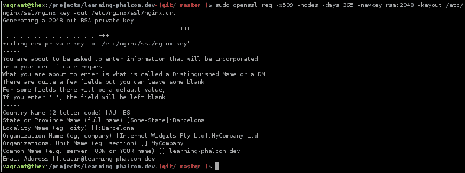

1.  打开 `learning-phalcon.localhost` 配置文件（`/etc/nginx/sites-available/learning-phalcon.localhost`）并启用 SSL：

    ```php
    server {
      listen 80;
      listen 443 ssl;

     ssl_certificate /etc/nginx/ssl/nginx.crt;
     ssl_certificate_key /etc/nginx/ssl/nginx.key;

      #....rest of the code
    }
    ```

1.  然后重新加载 Nginx 配置：

    ```php
    $ sudo service nginx reload

    ```

现在，你可以尝试访问 `https://learning-phalcon.localhost/`。在任何你使用的浏览器中，你将收到一个警告，说明服务器证书不受信任。这是正常的，因为它没有被任何权威机构签名。在 Chrome 中，你应该点击以下截图中的 **高级** 链接，然后点击 **继续访问 learning-phalcon.localhost（不安全**）链接（如下一个截图所示）。其他浏览器将有类似的链接：

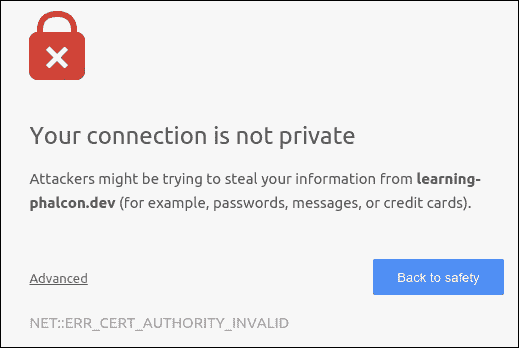

点击 **高级** 后，将打开一个新页面，其外观应该如下截图所示：

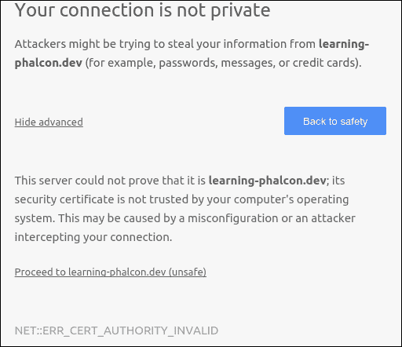

注意，你的连接实际上并没有被加密。这样做的目的是为了我们能够通过 HTTPS 访问我们的项目。

# 创建模块结构

我们已经在之前的章节中创建了基本结构。目录结构应该看起来像这样：

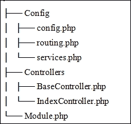

这是可以的。我们需要在这里做的是启用路由并添加一些方法到 `BaseController` 中，以便我们能够继续前进。让我们通过以下步骤开始这个过程：

1.  从 `api` 模块打开 `routing.php` 文件，删除其内容，并放入以下代码：

    ```php
    <?php
    $versions = [
      'v1' => '/api/v1',
      'v2' => '/api/v2'
    ];
    $router->removeExtraSlashes(true);

    // Articles group
    $articles = new \Phalcon\Mvc\Router\Group(array(
      'module' => 'api',
      'controller' => 'articles'
    ));

    $articles->setPrefix($versions['v1'].'/articles');
    $articles->addGet('', array(
      'module' => 'api',
      'controller' => 'articles',
      'action' => 'list'
    ));

    $router->mount($articles);
    ```

1.  接下来，我们添加一个包含我们 API 可用版本的数组，并告诉路由器删除额外的斜杠。因此，对 `/api/v1/articles` 的请求将与对 `/api/v1/articles/` 的请求相同。

1.  之后，我们利用路由器的分组能力创建一个新的文章分组。

1.  最后，我们将 `articles` 分组挂载到路由器上。

关于路由系统，我们需要解决几个问题。它们如下：

1.  我们将在全局路由文件（`config/routing.php`）中添加新内容，如下所示：

    ```php
    <?php

    $di['router'] = function () use ($default_module, $modules, $di, $config) {

      $router = new \Phalcon\Mvc\Router(false);
      $router->clear();

      $moduleRouting = __DIR__.'/../modules/'.ucfirst($default_module).'/Config/routing.php';

      if (file_exists($moduleRouting) && is_file($moduleRouting)) {
        include $moduleRouting;
      } else {
        $router->add('#^/(|/)$#', array(
          'module' => $default_module,
          'controller' => 'index',
          'action' => 'index',
        ));

        $router->add('#^/([a-zA-Z0-9\_]+)[/]{0,1}$#', array(
          'module' => $default_module,
          'controller' => 1,
        ));

        $router->add('#^/{0,1}([a-zA-Z0-9\_]+)/([a-zA-Z0-9\_]+)(/.*)*$#', array(
          'module' => $default_module,
          'controller' => 1,
          'action' => 2,
          'params' => 3,
        ));
      }

      foreach ($modules as $moduleName => $module) {
        if ($default_module == $moduleName) {
          continue;
        }

        $moduleRouting = __DIR__.'/../modules/'.ucfirst($moduleName).'/Config/routing.php';

        if (file_exists($moduleRouting) && is_file($moduleRouting)) {
          include $moduleRouting;
        }
      }

      return $router;
    };
    ```

1.  删除 `modules/App/Core/Config/routing.php` 文件——我们不会为核心模块设置任何路由。这个模块更像是一个库。

1.  最后，将 `modules/Frontend/Config/routing.php` 的内容替换为以下内容：

    ```php
    <?php
    $router->add('/', array(
      'module' => 'frontend',
      'controller' => 'index',
      'action' => 'index'
    ));

    $router->add('#^/articles[/]{0,1}$#', array(
      'module' => 'frontend',
      'controller' => 'article',
      'action' => 'list'
    ));

    $router->add('#^/articles/([a-zA-Z0-9\-]+)[/]{0,1}$#', array(
      'module' => 'frontend',
      'controller' => 'article',
      'action' => 'read',
      'slug' => 1
    ));
    ```

新的路由器组使用了一个名为 `Articles` 的控制器，该控制器不存在。现在，让我们继续进行以下步骤：

1.  让我们创建 `ArticlesController.php` 并包含以下内容：

    ```php
    <?php
    namespace App\Api\Controllers;

    class ArticlesController extends BaseController {
      public function listAction() {
        $this->view->disable();
        echo __METHOD__;
      }
    }
    ```

    以下截图显示了运行 `ArticlesController.php` 文件后的输出：

    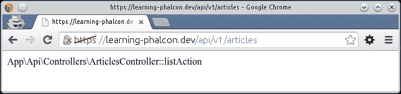

    现在，如果你访问 `https://learning-phalcon.localhost/api/v1/articles`，你应该看到前面截图所示的内容。

1.  接下来，让我们修改我们的基本控制器。打开 `BaseController.php` 并添加以下内容：

    ```php
    <?php
    namespace App\Api\Controllers;

    use \Phalcon\Http\Response;

    class BaseController extends \Phalcon\Mvc\Controller {
      protected $statusCode = 200;

      protected $headers    = [
        'Access-Control-Allow-Origin' => '*',
        'Access-Control-Allow-Headers' => 'X-Requested-With, content-type, access-control-allow-origin, accept, apikey',
        'Access-Control-Allow-Methods' => 'GET, PUT, POST, DELETE, OPTIONS','Access-Control-Allow-Credentials' => 'true'
      ];

      protected $payload = '';

      protected $format = 'json';

      protected function initResponse($status = 200) {
        $this->statusCode = $status;
        $this->headers    = array();
        $this->payload    = '';
      }

      protected function _getContent($payload) {
        return json_encode($payload);
      }

      protected function output() {
        $payload     = $this->getPayload();
        $status      = $this->getStatusCode();
        $description = $this->getHttpCodeDescription($status);
        $headers     = $this->getHeaders();

        $response = (new Response())
          ->setStatusCode($status, $description)
          ->setContentType('application/json', 'UTF-8')
          ->setContent(json_encode($payload, JSON_PRETTY_PRINT))
        ;

        foreach ($headers as $key => $value) {
          $response->setHeader($key, $value);
        }

        $this->view->disable();

        return $response;
      }

      protected function render($st_output, $statusCode = 200){
        $this->initResponse();

        $this->setStatusCode($statusCode);
        $this->setPayload($st_output);

        return $this->output();
      }
    }
    ```

    ### 注意

    注意，我们省略了一些方法。要查看完整的类，请查看本章的源代码。

1.  现在，让我们编辑`ArticlesController.php`中的`listAction()`函数。新的`listAction()`函数将看起来像这样：

    ```php
    public function listAction() {
      try {
        $st_output = [
          'method' => __METHOD__
        ];

        return $this->render($st_output);
      } catch (\Exception $e) {
        return $this->render($e->getMessage(), 500);
      }
    }
    ```

我们现在可以重新打开`https://learning-phalcon.localhost/api/v1/articles`并检查结果。你应该会看到如截图所示的 JSON 编码文本：

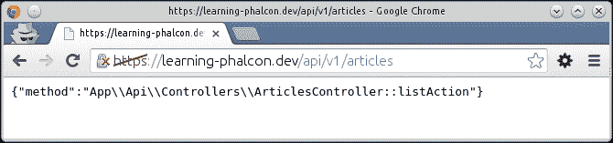

我们已经有了基础知识。让我们继续推进我们的项目并开发其 API。

# 使用 Phalcon PHP 编写一个完全功能的 REST 模块

在开始之前，我建议您使用一个 RESTful 客户端，这将帮助您更快地测试事物。我个人更喜欢 DHC（这是一个 Chrome 扩展），您可以在[`chrome.google.com/webstore/detail/dhc-resthttp-api-client/aejoelaoggembcahagimdiliamlcdmfm?hl=en`](https://chrome.google.com/webstore/detail/dhc-resthttp-api-client/aejoelaoggembcahagimdiliamlcdmfm?hl=en)找到它。

我们将开发`Articles`、`Categories`、`Hashtags`和`Users`的 CRUD 操作。让我们从`Articles`开始。

## 文章

我们已经创建了控制器，因此通过在`https://learning-phalcon.localhost/api/v1/articles`上执行`GET`方法，你应该会得到一个响应。让我们实现文章列表的文章管理器，以便我们可以检索真实数据。

首先，我们将对`Article`模型进行一些更改并重写`toArray()`方法。打开`modules/Core/Models/Article.php`并追加以下代码：

```php
public function getTranslations($arguments = null) {
  return $this->getRelated('translations', $arguments);
}

public function getCategories($arguments = null) {
  return $this->getRelated('categories', $arguments);
}

public function getHashtags($arguments = null) {
  return $this->getRelated('hashtags', $arguments);
}

public function getUser($arguments = null) {
  return $this->getRelated('user', $arguments);
}

public function toArray($columns = null) {
  $output = parent::toArray($columns);

  $output['article_translations'] = $this->getTranslations([
    'columns' => [
      'article_translation_short_title',
      'article_translation_long_title',
      'article_translation_slug',
      'article_translation_description',
      'article_translation_lang'
    ]
  ])->toArray();

  $output['article_categories'] = $this->getCategories()->filter(function($category){
    return $category->toArray(['id','category_translations']);
  });

  $output['article_hashtags'] = $this->getHashtags([
    'columns' => [
      'id',
      'hashtag_name'
    ]
  ])->filter(function($hashtag){
    return $hashtag->toArray();
  });

  $output['article_author'] = $this->getUser([
    'columns' => [
      'user_first_name',
      'user_last_name',
      'user_email'
    ]
  ])->toArray();

  return $output;
}
```

如您所见，我们添加了与文章相关的一切：翻译、作者信息、类别和标签。

由于类别有翻译，我们还将重写类别模型的`toArray()`方法。打开`modules/Core/Models/Category.php`并添加以下代码：

```php
public function getTranslations($arguments = null) {
  return $this->getRelated('translations', $arguments);
}

public function toArray($columns = null) {
  $output = parent::toArray($columns);

  $output['category_translations'] = $this->getTranslations([
    'columns' => [
      'category_translation_name',
      'category_translation_slug',
      'category_translation_lang'
    ]
  ])->toArray();

  return $output;
}
```

现在我们需要做的是在文章管理器中实现一个新的方法。我们从文章控制器调用该方法，我们应该准备好第一次调用。

打开`modules/Core/Managers/ArticleManager.php`并追加以下代码：

```php
public function restGet(array $parameters = null, array $options = null, $page = 1, $limit = 10) {
  $articles = $this->find($parameters);

  $result = $articles->filter(function($article){
    return $article->toArray();
  });

  $paginator = new \Phalcon\Paginator\Adapter\NativeArray([
    'data'  => $result,
    'limit' => $limit,
    'page'  => $page
  ]);

  $data = $paginator->getPaginate();

  if ($data->total_items > 0) {
    return $data;
  }

  if (isset($parameters['bind']['id'])) {
    throw new \Exception('Not Found', 404);
  } else {
    throw new \Exception('No Content', 204);
  }
}
```

你会看到方法名是`restGet`。我喜欢在我的严格用于 API 的方法中添加`rest`前缀。这是一个个人偏好；您可以为您的项目使用任何命名约定。

`restGet()`方法将抛出异常。如果我们请求文章列表并且请求成功但我们数据库中没有文章，我们使用 HTTP 代码 204。简单来说，这意味着，“您的请求是好的，但我没有内容”。如果我们尝试通过 ID 获取文章但该文章在我们的数据库中不存在，我们使用 HTTP `404 (not found)`。

最后一步是从我们的控制器调用此方法。打开`modules/Api/Controllers/ArticlesController.php`并更新`listAction()`方法，如下所示：

```php
public function listAction() {
  try {
    $manager = $this->getDI()->get('core_article_manager');
    $page    = $this->request->getQuery('p', 'int', 0);

    $st_output = $manager->restGet([], [], $page);

    return $this->render($st_output);
  } catch (\Exception $e) {
    return $this->render([
      'code' => $e->getCode(),
      'message' => $e->getMessage()
    ], $e->getCode());
  }
}
```

就这样！从您最喜欢的 API 客户端，向`http://learning-phalcon.localhost/api/v1/articles`发送`GET`请求，或者从命令行使用 CURL 执行：

```php
$ curl -i -X GET \
 'http://learning-phalcon.localhost/api/v1/articles'

```

如果你做得很好，你应该能看到以下截图所示的响应：

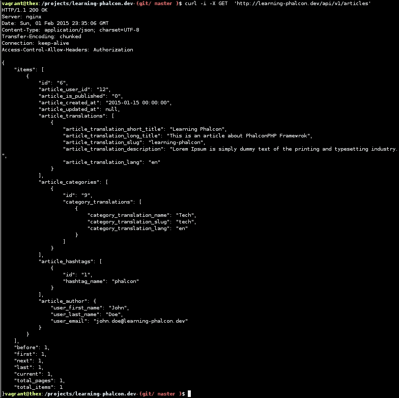

我们现在有了渲染文章最常见数据所需的所有信息。例如，如果你打算用 jQuery 获取这些数据，很容易：

```php
$.get('http://learning-phalcon.localhost/api/v1/articles', function(data){
    // render a list with articles
});
```

你也可以在请求中添加页码，如下所示：`http://learning-phalcon.localhost/api/v1/articles?p=2`。

让我们继续我们的 CRUD 操作如下：

1.  我们现在将创建一个服务来检索单个文章。打开`api`模块中的`routing.php`文件，并将以下路由添加到`$articles`组中：

    ```php
    $articles->addGet('/{id}', array(
      'module' => 'api',
      'controller' => 'articles',
      'action' => 'get'
    ));
    ```

1.  然后，我们在`ArticlesController.php`中添加`get()`方法：

    ```php
    public function getAction($id) {
      try {
        $manager = $this->getDI()->get('core_article_manager');

        $st_output = $manager->restGet([
          'id = :id:',
          'bind' => [
            'id' => $id
          ],
        ]);

        return $this->render($st_output);
      } catch (\Exception $e) {
        return $this->render([
          'code' => $e->getCode(),
          'message' => $e->getMessage()
        ], $e->getCode());
      }
    }
    ```

就这样！你现在可以请求数据库中存在的文章，你应该得到完全相同的结构。此外，`items`键将只包含这篇文章。在我的情况下，它是 ID 等于`6`的文章：

```php
$ curl -i -X GET  'http://learning-phalcon.localhost/api/v1/articles/6'

```

如果你请求一个不存在的文章，你应该得到一个类似于以下截图的响应：

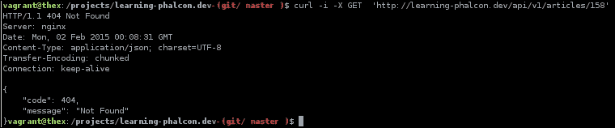

接下来，我们将实现文章的`update`方法如下：

1.  首先，我们需要添加路由信息。打开`modules/Api/Config/routing.php`并添加以下代码：

    ```php
    $articles->addPut('/{id}', array(
        'module' => 'api',
        'controller' => 'articles',
        'action' => 'update'
    ));
    ```

    ### 小贴士

    注意，我们使用`PUT`，这是更新资源的推荐方法。

1.  在`ArticlesController.php`中创建一个名为`updateAction()`的新方法，并添加以下代码：

    ```php
    public function updateAction($id) {
      try {
        $manager = $this->getDI()->get('core_article_manager');

        if ($this->request->getHeader('CONTENT_TYPE') == 'application/json') {
          $data = $this->request->getJsonRawBody(true);
        } else {
          $data = [$this->request->getPut()];
        }

        if (count($data[0]) == 0) {
          throw new \Exception('Please provide data', 400);
        }

        $result = $manager->restUpdate($id, $data);

        return $this->render($result);
      } catch (\Exception $e) {
        return $this->render([
          'code' => $e->getCode(),
          'message' => $e->getMessage()
        ], $e->getCode());
      }
    }
    ```

    在`updateAction()`中，我们检查内容类型头是否为`application/json`类型。如果是，我们从请求对象中调用`getJsonRawBody()`。布尔参数`true`表示我们强制解码为数组。如果数据通过表单接收，我们将使用`getPut()`方法。

1.  将数据作为 JSON 体提交是我认为的最佳方法。使用 jQuery，你可以非常简单地做到这一点，如下所示：

    ```php
    var data = [{ "article_is_published" : 1 }];
    $.ajax({
      type: "PUT",
      url: "/api/v1/articles/6",
      processData: false,
      contentType: 'application/json',
      data: JSON.stringify(data),
      success: function(response) {
        console.log(response);
      }
    });
    ```

现在，让我们看看我们的`restUpdate()`方法看起来如何。打开`ArticleManager.php`并添加以下代码：

```php
public function restUpdate($id, $data) {
  $article = Article::findFirstById((int)$id);

  if (!$article) {
    throw new \Exception('Not found', 404);
  }

  $article->setArticleIsPublished($data[0]['article_is_published']);

  if (false === $article->update()) {
    foreach ($article->getMessages() as $message) {
      throw new \Exception($message->getMessage(), 500);
    }
  }
  return $article->toArray();
}
```

如您所见，目前我们只将更新一个字段：`article_is_published`。如果文章已成功更新，您将得到新的更新文章作为响应（查看以下截图）。现在让我们测试一下：

```php
$ curl -i -X PUT -H "Content-Type:application/json" -d '[{"article_is_pu blished": 0}]' 'http://learning-phalcon.localhost/api/v1/articles/6'

```

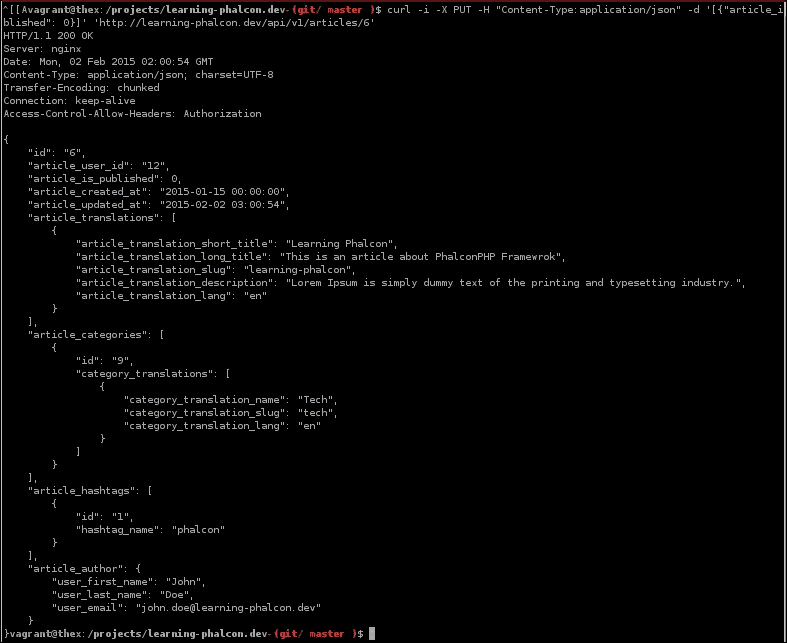

如果我们不提供任何数据，我们将得到一个`400 Bad Request`消息，如下所示：


干得好！到目前为止，我们已经公开了一个具有三种方法的服务：`GET`用于文章列表，`GET`用于单个文章，`PUT`用于更新文章。

我们将继续开发剩余的两个方法：`DELETE`（用于删除）和`POST`（用于创建）。让我们从更容易的一个开始，即`DELETE`。为此，让我们执行以下步骤：

1.  打开 API 路由文件，并添加以下代码：

    ```php
    $articles->addDelete('/{id}', array(
      'module' => 'api',
      'controller' => 'articles',
      'action' => 'delete'
    ));
    ```

1.  接下来，在`ArticlesController.php`中创建一个名为`deleteAction()`的方法：

    ```php
    public function deleteAction($id) {
      try {
        $manager = $this->getDI()->get('core_article_manager');

        $st_output = $manager->restDelete($id);

        return $this->render($st_output);
      } catch (\Exception $e) {
        return $this->render([
          'code' => $e->getCode(),
          'message' => $e->getMessage()
        ], $e->getCode());
      }
    }
    ```

1.  最后，在`ArticlesManager.php`中创建`restDelete()`方法：

    ```php
    public function restDelete($id) {
      $article = Article::findFirstById((int)$id);

      if (!$article) {
        throw new \Exception('Not found', 404);
      }

      if (false === $article->delete()) {
        foreach ($article->getMessages() as $message) {
          throw new \Exception($message->getMessage(), 500);
        }
      }

      return true;
    }
    ```

在测试之前，我们必须对 `Articles.php` 模型进行一个小改动，即在翻译的外键中添加 `\Phalcon\Mvc\Model\Relation::ACTION_CASCADE`，否则我们将收到一个错误消息，说 **“Record is referenced by model App\\Core\\Models\\ArticleTranslation”**。这个改动是因为文章和翻译之间现有的关系。当我们删除文章时，其翻译将被自动删除。

打开 `modules/Core/Models/Article.php` 文件，将翻译的关系替换为以下代码片段：

```php
$this->hasMany('id', 'App\Core\Models\ArticleTranslation', 'article_translation_article_id', array(
  'alias' => 'translations',
  'foreignKey' => array(
    'action' => \Phalcon\Mvc\Model\Relation::ACTION_CASCADE
  )
));
```

我们现在可以测试我们的代码，结果应该类似于以下截图所示。如果没有找到文章，你将收到一个 404 错误而不是 200：

```php
$ curl -i -X DELETE 'http://learning-phalcon.localhost/api/v1/articles/1'

```

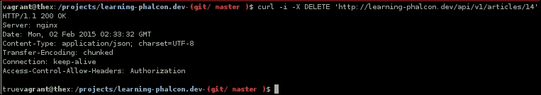

就这些！你可以通过简单地向正确的 URL 发送 `DELETE` 请求来删除文章。

现在，让我们继续实现 `POST` 操作（用于创建文章）。为此，执行以下步骤：

1.  打开 `modules/Api/Config/routing.php` 文件并添加以下代码：

    ```php
    $articles->addPost('', array(
      'module' => 'api',
      'controller' => 'articles',
      'action' => 'create'
    ));
    ```

1.  在 `ArticlesController.php` 中实现 `createAction()` 方法：

    ```php
    public function createAction() {
      try {
        $manager   = $this->getDI()->get('core_article_manager');

        if ($this->request->getHeader('CONTENT_TYPE') == 'application/json') {
          $data = $this->request->getJsonRawBody(true);
        } else {
          $data = $this->request->getPost();
        }

        if (count($data) == 0) {
          throw new \Exception('Please provide data', 400);
        }

        $st_output = $manager->restCreate($data);

        return $this->render($st_output);
      } catch (\Exception $e) {
        return $this->render([
          'code' => $e->getCode(),
          'message' => $e->getMessage()
        ], $e->getCode());
      }
    }
    ```

1.  管理器（`ArticleManager.php`）将包含一个名为 `restCreate()` 的新方法，但我们也会更新 `create()` 方法：

    ```php
    public function restCreate($data) {
      $result = $this->create($data);

      return $result->toArray();
    }

    public function create($input_data) {
      $default_data = array(
        'article_user_id' => 1,
        'article_is_published' => 0,
        'translations' => array(
          'en' => array(
            'article_translation_short_title' => 'Short title',
            'article_translation_long_title' => 'Long title',
            'article_translation_description' => 'Description',
            'article_translation_slug' => '',
            'article_translation_lang' => 'en',
          )
        ),
        'categories' => array(),
        'hashtags' => array(),
      );

      $data = array_merge($default_data, $input_data);

      $article = new Article();
      $article->setArticleIsPublished($data['article_is_published']);

      $articleTranslations = array();

      foreach ($data['translations'] as $lang => $translation){
        $tmp = new ArticleTranslation();
        $tmp->assign($translation);
        array_push($articleTranslations, $tmp);
      }

      if (count($data['categories']) > 0) {
        $article->categories = Category::find([
          "id IN (".implode(',', $data['categories']).")"
        ])->filter(function($category){
          return $category;
        });
      }

      if (count($data['hashtags']) > 0) {
        $article->hashtags = Hashtag::find([
          "id IN (".implode(',', $data['hashtags']).")"
        ])->filter(function($hashtag){
          return $hashtag;
        });
      }

      $user = User::findFirstById((int) $data['article_user_id']);

      if (!$user) {
        throw new \Exception('User not found', 404);
      }

      $article->setArticleUserId($data['article_user_id']);

      $article->translations = $articleTranslations;

      return $this->save($article, 'create');
    }
    ```

让我们测试新的代码。创建一个 JSON 主体内容，并将 `POST` 方法数据发送到 `/api/v1/articles`，如下所示：

```php
$ curl -i -X POST -H "Content-Type:application/json" -d '{"article_user_id":12,"article_is_published":1,"translations":{"en":{"article_translation_short_title":"Test API create","article_translation_long_title":"Test API create","article_translation_description":"Test API create description","article_translation_slug":"test-api-create","article_translation_lang":"en"}},"categories":[9,16],"hashtags":[1]}' 'http://learning-phalcon.localhost/api/v1/articles'

```

不要忘记替换用户 ID 以及你在数据库中的分类和标签的 ID。结果应该是一个新创建的文章，类似于以下截图：

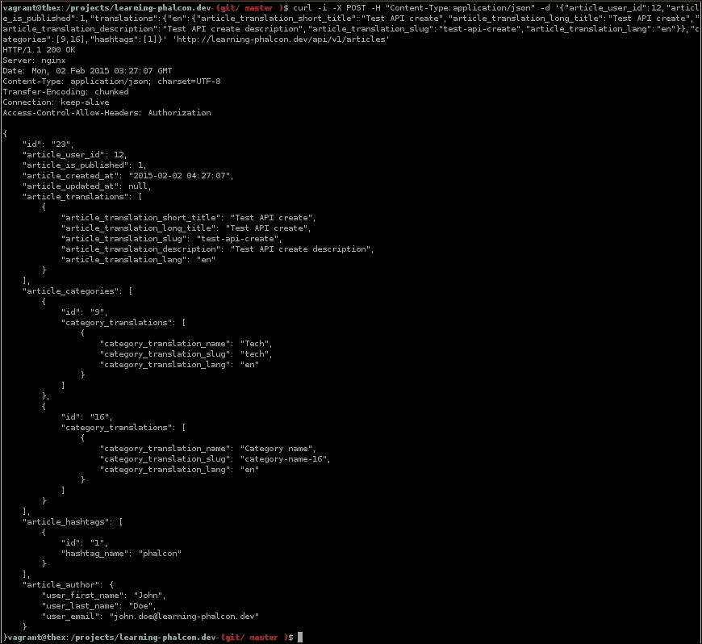

根据 `Articles` 中遵循的相同规则，你应该尝试开发其余的端点（分类、标签和用户）。如果你觉得不舒服，你总是可以查看本章的源代码。

# 保护 API

通常，当你把东西放到网上时，它就不再安全了。几乎任何东西都可以被黑客攻击。在这种情况下，你能做什么呢？好吧，如果你不是可以负担得起大量人力资源和安全软硬件投资的亿万富翁，你所能做的就是尽量让攻击者的生活变得艰难，并始终监控你的东西。

关于安全和保护 API 的书籍有成百上千本。我们将尝试实现一些基本的安全方法，这些方法可以帮助你避免灾难。

那么，这些方法是什么呢？以下是一个列表：

+   总是使用 SSL

+   添加 API 密钥以提供额外保护

+   限制来自同一 IP 的每秒请求数量

+   限制对资源的访问，例如 `DELETE`、`PUT`、`POST`，仅对认证用户开放

## 使用 SSL

没有必要详细说明 SSL。使用安全连接是你应该采取的方式。SSL 证书现在相当便宜。例如，[`www.namecheap.com`](http://www.namecheap.com) 的人以每年 80 欧元的单价出售多域名 SSL 证书。

## 添加 API 密钥以提供额外保护

我们将在全局配置中创建一个 API 密钥白名单。我们将向所有请求追加一个 APIKEY 头，并与配置中的值进行核对。如果 API 密钥不匹配，服务器将响应一个“403 禁止访问”错误。如果你在 JavaScript 环境中使用这个密钥，任何人都能看到它，但至少你可以控制并更改 API 密钥。让我们实现保护措施：

1.  打开全局配置文件`config/config.php`并将以下代码追加到`$config`数组中：

    ```php
    'apiKeys' => array(
      '6y825Oei113X3vbz78Ck7Fh7k3xF68Uc0lki41GKs2Z73032T4z8m1I81648JcrY'
    )
    ```

1.  在`modules/Core/`中创建一个名为`Listeners`的新目录，并创建一个名为`ApiListener.php`的新文件，内容如下：

    ```php
    <?php
    namespace App\Core\Listeners;

    class ApiListener extends \Phalcon\Mvc\User\Plugin{
      public function beforeExecuteRoute($event, $dispatcher) {
        $hasValidKey = $this->checkForValidApiKey();

        if (false === $hasValidKey) {
          return false;
        }
      }

      private function checkForValidApiKey() {
        $apiKey = $this->request->getHeader('APIKEY');

        if (!in_array($apiKey, $this->config->apiKeys->toArray())) {
          $this->response->setStatusCode(403, 'Forbidden');
          $this->response->sendHeaders();
          $this->response->send();
          $this->view->disable();

          return false;
        }

        return true;
      }
    }
    ```

1.  最后，将这个服务注入到`dispatcher`中。打开`modules/Api/service.php`并将`$di['dispatcher']`数组替换为以下内容：

    ```php
    $di['dispatcher'] = function () use ($di) {
      $eventsManager = $di->getShared('eventsManager');

      $apiListener = new \App\Core\Listeners\ApiListener();
      $eventsManager->attach('dispatch', $apiListener);

      $dispatcher = new Phalcon\Mvc\Dispatcher();
      $dispatcher->setEventsManager($eventsManager);
      $dispatcher->setDefaultNamespace("App\Api\Controllers");

      return $dispatcher;
    };
    ```

如果你使用以下命令行发出请求，你会注意到你得到的是“403 禁止访问”错误：

```php
$ curl -i -X GET 'http://learning-phalcon.localhost/api/v1/articles/6'

```

“403 禁止访问”错误如以下截图所示：

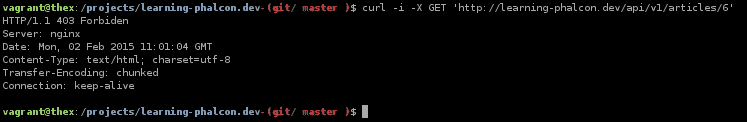

这是因为你没有提供 APIKEY 头。你所需要做的就是提供正确的头和正确的密钥，你将得到这篇文章：

```php
$ curl -i -X GET -H "APIKEY:6y825Oei113X3vbz78Ck7Fh7k3xF68Uc0lki41GKs2Z73032T4z8m1I81648JcrY" 'http://learning-phalcon.localhost/api/v1/articles/6'

```

就这样！当然，这个方法可以改进，但这超出了本书的范围。此外，你可以将 API 密钥与客户端和/或 IP 地址等进行映射。

## 限制来自同一 IP 的每秒请求数量

我们将使用 Redis 的一个简单解决方案来限制来自同一 IP 的每秒请求数量。假设我们希望来自同一 IP 的每秒限制为五个请求：

1.  打开`ApiListener.php`并添加以下方法：

    ```php
    private function checkIpRateLimit() {
      $ip   = $this->request->getClientAddress();
      $time = time();
      $key  = $ip.':'.$time;

      $redis   = $this->getDI()->get('redis');
      $current = $redis->get($key);

      if ($current != null && $current > 5) {

        $this->response->setStatusCode(429, 'Too Many Requests');
        $this->response->sendHeaders();
        $this->response->send();
        $this->view->disable();

        return false;
      } else {
        $redis->multi();
        $redis->incr($key, 1);
        $redis->expire($key, 5);
        $redis->exec();
      }

      return true;
    }
    ```

1.  然后，使用以下代码更新`beforeExecuteRoute()`方法：

    ```php
    public function beforeExecuteRoute($event, $dispatcher) {
      $hasValidKey = $this->checkForValidApiKey();
      $ipRateLimit = $this->checkIpRateLimit();

      if (false === $hasValidKey || false === $ipRateLimit) {
        return false;
      }
    }
    ```

那就结束了！你可以通过将`5`替换为`2`来轻松测试它，并发出一些请求。你会得到一个 429 响应。你可以结合使用 API 密钥和用户来限制特定用户的请求。

## 限制认证用户对 DELETE、PUT 和 POST 等资源的访问

如果你打算公开你的 API，你需要确保只有认证用户可以访问某些资源。这意味着你不应该从公共接口访问这些资源，例如前端。一个快速方便的解决方案是使用另一个头（让我们称它为`TOKEN`），它将在从管理界面进行的 CRUD 操作中使用。让我们执行以下步骤：

1.  在这里，我们首先在`ApiListener.php`中添加一个新的方法`resourceWithToken()`，如下所示，然后更新`beforeExecuteRoute()`方法：

    ```php
    private function resourceWithToken() {
      if (in_array($this->dispatcher->getActionName(), ['update','delete','create'])) {
        if ($this->request->getHeader('TOKEN') != 'mySecretToken') {
          $this->response->setStatusCode(405, 'Method Not Allowed');
          $this->response->sendHeaders();
          $this->response->send();
          $this->view->disable();

          return false;
    }

        return true;
      }
    }
    ```

1.  将以下代码追加到`beforeExecuteRoute()`方法中：

    ```php
    if (false === $this->resourceWithToken()) {
      return false;
    }
    ```

如果你尝试`POST`、`PUT`或`DELETE`，你会得到一个 405 错误。从现在开始，你需要追加名为 TOKEN 的头，并带有`mySecretToken`值，如以下示例所示：

```php
$ curl -i -X PUT    -H "Content-Type:application/json"    -H "APIKEY:6y825Oei113X3vbz8Ck7Fh7k3xF68Uc0lki41GKs2Z73032T4z8m1I81648JcrY"    -H "TOKEN:mySecretToken"    -d '{"article_user_id":12,"article_is_published":1,"translations":{"en":{"article_translation_short_title":"Test API create","article_translation_long_title":"Test API create","article_translation_description":"Test API create description","article_translation_slug":"test-api-create","article_translation_lang":"en"}},"categories":[9,16],"hashtags":[1]}'  'http://learning-phalcon.localhost/api/v1/articles/6'

```

记住，如果你使用 JavaScript 从前端调用它，这不会保护你的 API，因为令牌的值将对每个人可见。

有数百种其他解决方案，你应该仔细研究你需要什么。此外，保护你的 API 并不足以。保护整个应用程序，以及服务器（例如，通过使用防火墙）也同样重要。但仅就本章的目的而言，我们所做的一切应该足以保护我们免受最常见的攻击。

读取更多内容，自我学习，并寻求专家的意见。大多数时候，对某人来说似乎是一个好解决方案，可能对你来说并不是一个好解决方案。

# 记录 API

文档可能是你应该花时间做的最重要的事情之一。当我发现 Phalcon 时，我做的第一件事就是开发一个简单的 API。当我需要为我的 API 创建文档时，我发现自己处于一个奇怪的情况；当时只有少数解决方案，而且大多数都有依赖项。那是在 2013 年夏天左右。

因此，我决定创建自己的 API 文档生成器，没有任何依赖项——只是纯 PHP。我将使用这个工具（它在 GitHub 上公开可用，网址为 [`github.com/calinrada/php-apidoc`](https://github.com/calinrada/php-apidoc)）来创建和生成我们项目的 API 文档。

## 安装

你应该已经有了它，因为我一直在使用它来生成 CLI 任务的注释。如果你错过了它，你可以通过两个简单的步骤来完成：

```php
$ php composer.phar require crada/php-apidoc
$ php composer.phar update

```

## 用法

我们将执行几个步骤来正确理解用法：

1.  让我们创建一个名为 `ApidocTask.php` 的新 CLI 任务，内容如下：

    ```php
    <?php
    use Crada\Apidoc\Builder;
    use Crada\Apidoc\Exception;

    class ApidocTask extends BaseTask {
      /**
      * @Description("Build API Documentation")
      * @Example("php apps/cli.php apidoc generate")
      */
      public function generateAction($params = null) {
        $classes = [
          'App\Api\Controllers\ArticlesController'
        ];

        try {
          $builder = new Builder($classes, __DIR__.'/../../docs/api', 'index.html');
          $builder->generate();
          exec("ln -s ".__DIR__."/../../docs/api ".__DIR__."/../../public/apidoc");
          $this->consoleLog('ok! : '.__DIR__.'/../../docs/api/index.html');

        } catch (Exception $e) {
          $this->consoleLog($e->getMessage(), 'red');
        }
      }
    }
    ```

    我们将使用注解来记录每个方法。

    ### 注意

    关于这方面的更多信息，请参阅 [`github.com/calinrada/php-apidoc#usage`](https://github.com/calinrada/php-apidoc#usage) 和 [`github.com/calinrada/php-apidoc#available-methods`](https://github.com/calinrada/php-apidoc#available-methods)。

1.  打开 `ArticlesController.php` 并将以下内容追加到 `listActi/on()` 方法中：

    ```php
    /**
      * @ApiDescription(section="Articles", description="Retrieve a list of articles")
      * @ApiMethod(type="get")
      * @ApiRoute(name="/articles")
      * @ApiParams(name="p", type="integer", nullable=true, description="Page number")
      * @ApiReturnHeaders(sample="HTTP 200 OK")
      * @ApiReturn(type="object", sample="{
      *  'items': [{
      *    'id':'int',
      *    'article_user_id':'int',
      *    'article_is_published':'int',
      *    'article_created_at':'string',
      *    'article_updated_at':'string',
      *    'article_translations':[{
      *      'article_translation_short_title':'string',
      *      'article_translation_long_title':'string',
      *      'article_translation_slug':'string',
      *      'article_translation_description':'string',
      *      'article_translation_lang':'string'
      *    }],
      *    'article_categories':[{
      *      'id':'int',
      *      'category_translations':[{
      *        'category_translation_name':'string',
      *        'category_translation_slug':'string',
      *        'category_translation_lang':'string'
      *      }]
      *    }],
      *    'article_hashtags':[{
      *      'id':'int',
      *      'hashtag_name':'string'
      *    }],
      *    'article_author':{
      *      'user_first_name':'string',
      *      'user_last_name':'string',
      *      'user_email':'string'
      *    }
      *  }],
      *  'before':'int',
      *  'first':'int',
      *  'next':'int',
      *  'last':'int',
      *  'current':'int',
      *  'total_pages':'int',
      *  'total_items':'int',
      *}")
      */
    public function listAction() {

    }
    ```

现在切换到命令提示符并执行以下命令行：

```php
$ php modules/cli.php apidoc generate

```

任务会在你的公共文件夹中创建一个新的符号链接。现在你可以通过 `http://learning-phalcon.localhost/apidoc/` 访问 API 文档，你应该能够看到以下截图中所展示的完全相同的输出：

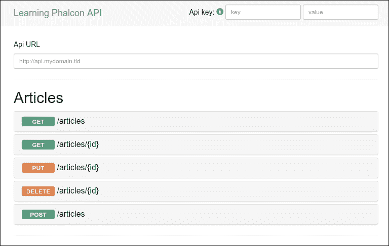

是时候关闭这一章了。请花时间尽可能多地阅读有关开发 API 的内容，特别是安全 API。

# 摘要

在这一章中，我们发现了我们如何轻松快速地开发 API。你了解了推荐的实践和几种常见的保护 API 的方法。我们涵盖了新的主题，如路由分组和过滤结果。

在下一章中，我们将切换布局和 JavaScript 集成，但我们将继续适应或更改 API、数据库和模型中的事物。
