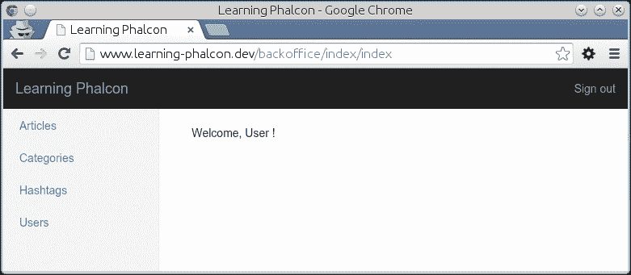
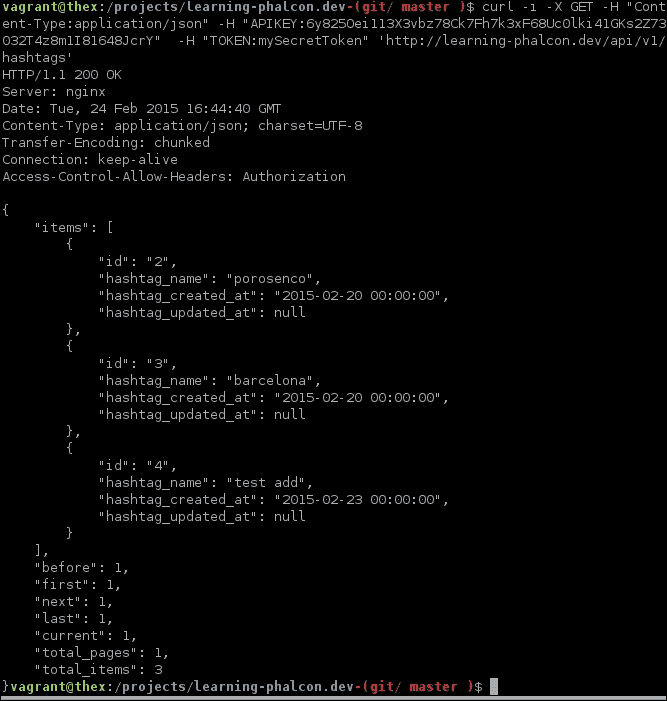
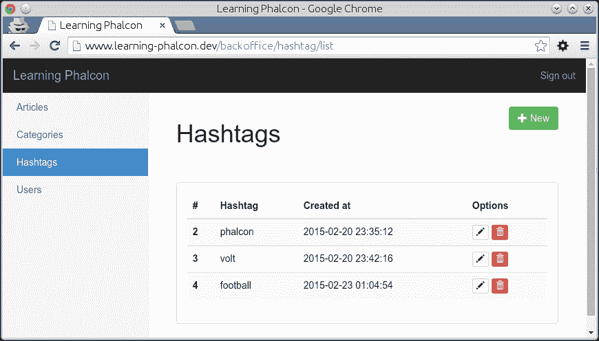
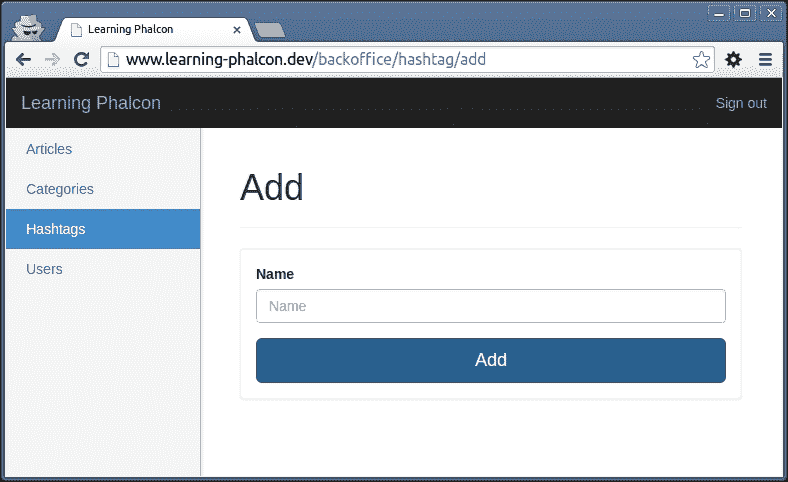
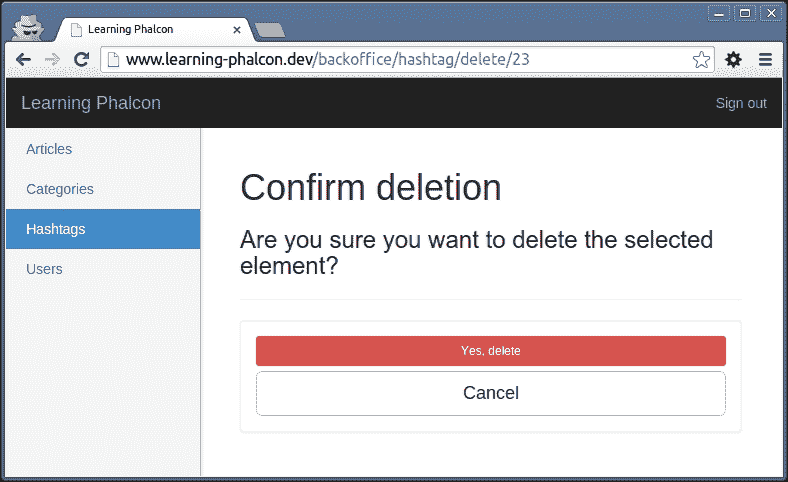
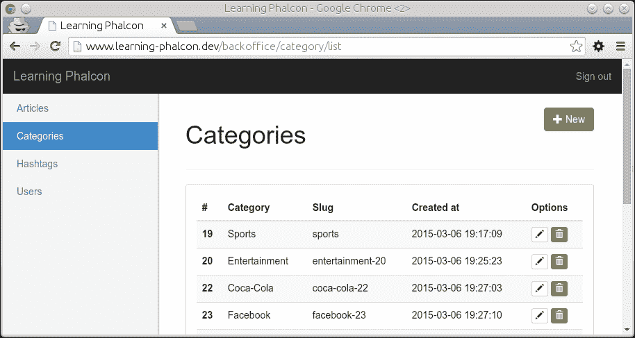
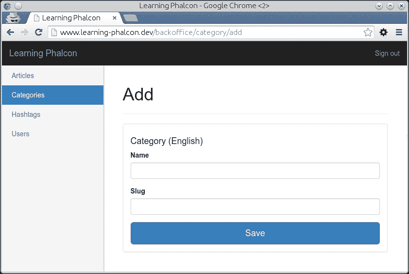

# 第七章。后台模块（第一部分）

除非你正在开发一个静态网站，否则你需要一个部分/模块，管理员可以在此处添加和管理内容，例如文章、分类和用户。这就是“后台”介入的地方。在本章中，我们将开发管理我们网站所需的**CRUD**（**创建**、**读取**、**更新**和**删除**）操作的部分。我们还将使用我们在第五章中开发的 API 的一部分，*API 模块*。我们将更多地使用表单和验证。我们将分两部分介绍本章，即：

+   标签 CRUD

+   分类 CRUD

# 编辑主布局

让我们从对主布局的一些修改开始本章。编辑位于`modules/Backoffice/Views/Default/layout.volt`的主布局，并添加以下代码：

```php
<!DOCTYPE html>
<html lang="en">
<head>
<meta charset="utf-8">
<meta http-equiv="X-UA-Compatible" content="IE=edge">
<meta name="viewport" content="width=device-width, initial-scale=1">
<title>Learning Phalcon</title>

{{ assets.outputCss('headerCss') }}


<!--[if lt IE 9]>
      <script src="img/html5shiv.min.js"></script>
      <script src="img/respond.min.js"></script>
<![endif]-->
</head>
<body>
  
    <div class="container-fluid">
      <div class="row">
        <div class="col-sm-3 col-md-2 sidebar">
        
        </div>
        <div class="col-sm-9 col-sm-offset-3 col-md-10 col-md-offset-2 main">
          
          <h1 class="page-header">Dashboard</h1>
          <h2 class="sub-header">Section title</h2>
          <div class="table-responsive">

          </div>
          
        </div>
      </div>
    </div>

    {{ assets.outputJs('footerJs') }}
   
</body>
</html>
```

你可以看到我们正在使用`include`来包含两个新文件：`topbar.volt`和`sidebar.volt`。在 Volt 中，你可以使用`include`方法或`partial()`方法。`partial`和`include`之间的主要区别是，`partial`方法在运行时被包含，而`include`文件编译内容并将其作为包含视图的一部分返回。我更喜欢`include`，因为它可以提高性能。如果你需要将变量分配给将被包含的文件，你需要避免文件扩展名。以下是一个示例：

```php

```

### 小贴士

你可以在[`docs.phalconphp.com/en/latest/reference/volt.html#include`](http://docs.phalconphp.com/en/latest/reference/volt.html#include)了解更多关于`include`的信息。

两个新文件的代码与之前主布局中的代码相同，但为了侧边栏进行了一些小的修改。让我们创建文件夹和文件。转到`modules/Backoffice/Views/Default/`并创建一个名为`common`的新文件夹。在这个新文件夹中，创建两个新文件，分别命名为`sidebar.volt`和`topbar.volt`，代码如下。

## common/topbar.volt

下面是位于页面顶部的导航栏的代码。它包含一个指向主页的链接和一个用于注销的链接：

```php
<nav class="navbar navbar-inverse navbar-fixed-top" role="navigation">
  <div class="container-fluid">
    <div class="navbar-header">
      <button type="button" class="navbar-toggle collapsed" data-toggle="collapse" data-target="#navbar" aria-expanded="false" aria-controls="navbar">
        <span class="sr-only">Toggle navigation</span>
        <span class="icon-bar"></span>
        <span class="icon-bar"></span>
        <span class="icon-bar"></span>
      </button>
      <a class="navbar-brand" href="{{ url('') }}">Learning Phalcon</a>
    </div>
    <div id="navbar" class="navbar-collapse collapse">
      <ul class="nav navbar-nav navbar-right">
        <li><a href="{{ url('auth/signout') }}">Sign out</a></li>
      </ul>
    </div>
  </div>
</nav>
```

## common/sidebar.volt

以下是为侧边栏（左侧菜单）和包含从我们的应用程序到不同控制器的链接的代码：

```php
 
<ul class="nav nav-sidebar"> 
  <li class="active">
    <a href="{{ url('article/list') }}">Articles</a></li> 
  <li class="active">
    <a href="{{ url('category/list') }}">Categories</a></li> 
  <li class="active">
    <a href="{{ url('hashtag/list') }}">Hashtags</a></li> 
  <li class="active">
    <a href="{{ url('user/list') }}">Users</a></li> 
</ul>
```

关于这两个文件，有一些新的内容。我们正在使用一个名为`url()`的方法，侧边栏已经包含了一些逻辑，我们注意到 DI 中的分发器无需从控制器分配即可使用。

默认情况下，Volt 可以访问许多方法。使用 URL 服务的`url()`方法是其中之一。有关支持的方法列表，你可以查看官方文档[`docs.phalconphp.com/en/latest/reference/volt.html#functions`](http://docs.phalconphp.com/en/latest/reference/volt.html#functions)。有时，你需要一些从 Volt 无法访问的特殊函数。在这种情况下，你需要扩展 Volt 引擎并实现自己的方法。如何扩展 Volt？

在我们的案例中，我们可以在`voltService` DI 中直接这样做，它可以在`config/services.php`中找到，例如，我们想要添加一个名为`randomGen()`的方法，该方法生成一定数量的随机字符串，它位于`modules/Core/Library/Util.php`中。`voltService` DI 将如下所示：

```php
$di['voltService'] = function ($view, $di) use ($config) {
  $volt = new \Phalcon\Mvc\View\Engine\Volt($view, $di);
  // ... code
  $compiler = $volt->getCompiler();
  $compiler->addFunction('randomGen', function($resolvedArgs, $exprArgs) {
    return 'App\Core\Library\Util::randomGen(' . $resolvedArgs . ')';
  });
  //...code

  return $volt;
};
```

我们可以通过以下语法在 Volt 中调用此方法：

```php
{{ randomGen(5) }}
```

上述方法将生成五个随机字符串。

### 备注

你可以在[`docs.phalconphp.com/en/latest/reference/volt.html#extending-volt`](http://docs.phalconphp.com/en/latest/reference/volt.html#extending-volt)了解更多关于扩展 Volt 的信息。

在侧边栏文件（`sidebar.volt`）中，我们使用`IF`语句来检查当前控制器的名称。该名称可以通过分发器获得，并将其分配给名为`c_name`的变量。我们`IF`语句和`set`的等效 PHP 代码如下：

```php
<?php
$c_name = $this->dispatcher->getControllerName();

if (c_name == 'article') {
   // Link is active
}
```

当然，还有其他生成此菜单代码的方法，但尽量多使用 Volt，这样你就能习惯其语法。现在我们已经做了一些修改，让我们访问`http://www.learning-phalcon.localhost/backoffice/`。如果没有错误，你应该会看到以下截图所示的内容：



# 清理内核模块

让我们也清理我们的`Core`模块。我们将使用此文件夹作为库的集合，而不是将其用作模块。首先，移除以下文件：

```php
modules/Core/Config/config.php
modules/Core/Config/services.php
modules/Core/Controllers/IndexController.php
modules/Core/Module.php
```

然后从`modules/Bootstrap.php`中移除以下行：

```php
'core' => array(
    'className' => 'App\Core\Module',
    'path' => __DIR__.'/Core/Module.php',
),
```

现在我们有一个干净的内核，我们的引导程序将不再将其注册为我们模块的一部分。我们将对`modules/Core/Controllers/BaseController.php`和`modules/Backoffice/Controllers/BaseController.php`进行修改，以便这个控制器将扩展`modules/Core/Controllers/BaseController.php`：

+   在`modules/Api/Controllers/BaseController.php`文件中：

    ```php
    <?php
    namespace App\Api\Controllers;

    use Phalcon\Http\Response;

    class BaseController extends \App\Core\Controllers\BaseController
    {
      // code
    }
    ```

+   在`modules/Backoffice/Controllers/BaseController.php`文件中：

    ```php
    <?php
    namespace App\Backoffice\Controllers;

    class BaseController extends \App\Core\Controllers\BaseController
    {
      // code
    }
    ```

这些修改帮助我们可以在所有模块中重用一些代码。

# 标签 CRUD

我们在末尾留下文章的原因是，当我们实现它时，我们需要将其分配给标签、类别和用户。在进一步操作之前，我们将对`layout.volt`和`BaseController`进行轻微修改。我们将从`BaseController.php`中移除以下行：

```php
->addCss($assets_dir.'default/bower_components/bootstrap/dist/css/bootstrap.min.css')
```

此外，我们将在`layout.volt`中添加此行，在`{{` `assets.outputCss('headerCss')` `}}`之前：

```php
{{stylesheetLink('../assets/default/bower_components/bootstrap/dist/css/bootstrap.min.css') }}
```

我们这样做是因为 bootstrap 的 CSS 已经压缩过了，如果我们再次这样做，bootstrap 字体将无法正确渲染。记住也要对`layout_simple.volt`应用相同的修改。

在第五章，*API 模块*，当我们开发 API 模块时，我们的任务之一是创建所需的其余模型和管理器。它们包括 hashtag 管理器和模型。如果你没有这样做，不用担心。你可以在源代码中找到它。在这里，我将向你展示我们为了为 hashtag 开发 CRUD 操作所需的代码部分。你必须做的第一件事是在 API 模块中创建控制器，如果你还没有这样做的话。

## API 模块中的 hashtag 控制器

这个控制器中找到的所有方法都遵循相同的逻辑：

+   我们获取 hashtag 管理器的实例

+   我们从请求对象中获取参数

+   我们调用它的特定 API 方法并发送响应

让我们为这个控制器编写代码。我们将从`listAction()`开始。所有的方法都写在了`try{}-catch(){}`语句之间：

```php
<?php
namespace App\Api\Controllers;

class HashtagsController extends BaseController{
  public function listAction() {
  try {
    $manager = $this->getDI()->get('core_hashtag_manager');
    $page    = $this->request->getQuery('p', 'int', 0);

    $st_output = $manager->restGet([], [], $page);

    return $this->render($st_output);
  } catch (\Exception $e) {
    return $this->render([
      'code' => $e->getCode(),
      'message' => $e->getMessage(),
    ], $e->getCode());
  }
}
```

这个方法调用 hashtag 管理器，并从请求中读取页码。接下来，我们输出`$manager->restGet()`方法的结果，它是一个包含**分页**的记录数组：

```php
public function getAction($id) {
  try {
    $manager = $this->getDI()->get('core_hashtag_manager');

    $st_output = $manager->restGet([
      'id = :id:',
      'bind' => [
        'id' => $id,
      ],
    ]);

    return $this->render($st_output);
  } catch (\Exception $e) {
    return $this->render([
      'code' => $e->getCode(),
      'message' => $e->getMessage(),
    ], $e->getCode());
  }
}
```

这个方法与`listAction()`大部分相似，区别在于它只会返回一条记录。注意，我们将请求对象的 ID 绑定到`$manager->restGet()`方法：

```php
public function updateAction($id) {
  try {
    $manager = $this->getDI()->get('core_hashtag_manager');

    if ($this->request->getHeader('CONTENT_TYPE') == 'application/json') {
      $data = $this->request->getJsonRawBody(true);
    } else {
      $data = [$this->request->getPut()];
    }

    if (count($data[0]) == 0) {
      throw new \Exception('Please provide data', 400);
    }

    $result = $manager->restUpdate($id, $data);

    return $this->render($result);
  } catch (\Exception $e) {
    return $this->render([
      'code' => $e->getCode(),
      'message' => $e->getMessage(),
    ], $e->getCode());
  }
}
```

这个方法调用 hashtag 管理器，并从请求中读取页码和内容。如果我们发送的 body 是 JSON 格式，我们将使用`getJsonRawBody()`读取它。`true`参数用于将数据转换为数组。如果没有数据，我们抛出异常。接下来，我们输出`$manager->restUpdate()`方法的结果：

```php
public function deleteAction($id) {
  try {
    $manager = $this->getDI()->get('core_hashtag_manager');

    $st_output = $manager->restDelete($id);

    return $this->render($st_output);
  } catch (\Exception $e) {
    return $this->render([
      'code' => $e->getCode(),
      'message' => $e->getMessage(),
    ], $e->getCode());
  }
}
```

`deleteAction()`方法简单地调用`$manager->restDelete()`，并将对象的 ID 作为参数。如果对象被找到，它将被删除：

```php
public function createAction() {
  try {
    $manager   = $this->getDI()->get('core_hashtag_manager');

    if ($this->request->getHeader('CONTENT_TYPE') == 'application/json') {
      $data = $this->request->getJsonRawBody(true);
    } else {
      $data = $this->request->getPost();
    }

    if (count($data) == 0) {
      throw new \Exception('Please provide data', 400);
    }

    $st_output = $manager->restCreate($data);

    return $this->render($st_output);
  } catch (\Exception $e) {
    return $this->render([
      'code' => $e->getCode(),
      'message' => $e->getMessage(),
    ], $e->getCode());
    }
  }
}
```

这个方法与`updateAction()`类似，但不是更新一个对象，而是创建它。

路由缺失，所以我们将将其添加到`modules/Api/Config.routing.php`中。我们将为 hashtag 创建一个新的路由组：

```php
$hashtags = new \Phalcon\Mvc\Router\Group([
    'module' => 'api',
    'controller' => 'hashtags',
]);

$hashtags->setPrefix($versions['v1'].'/hashtags');

$hashtags->addGet('',         ['action' => 'list']);
$hashtags->addGet('/{id}',    ['action' => 'get']);
$hashtags->addPut('/{id}',    ['action' => 'update']);
$hashtags->addDelete('/{id}', ['action' => 'delete']);
$hashtags->addPost('',        ['action' => 'create']);

$router->mount($hashtags);
```

如果一切正常，你现在可以插入一些记录到 hashtag 表中，并使用以下命令行调用 API 来获取记录：

```php
$ curl -i -X GET -H "Content-Type:application/json" -H "APIKEY:6y825Oei113X3vbz78Ck7Fh7k3xF68Uc0lki41GKs2Z73032T4z8m1I81648JcrY"  -H "TOKEN:mySecretToken" 'http://learning-phalcon.localhost/api/v1/hashtags'

```

命令行的输出应该类似于以下截图所示：



这个 cURL 命令向`/api/v1/hashtags`发送请求。`-H`选项用于发送头部信息；在我们的例子中，我们发送了 token 和 API 密钥。

## 减少代码重复的一个常用方法

让我们在`modules/Core/Controllers/BaseController.php`中创建一个方法，这个方法将帮助我们从我们的 API 获取数据。这个方法将在扩展它的控制器中使用：

```php
public function apiGet($uri, $params = []) {
  $config   = $this->getDI()->get('config')->toArray();
  $uri      = $config['apiUrl'].$uri;
  $curl     = new \Phalcon\Http\Client\Provider\Curl();
  $response = $curl->get($uri, $params, ["APIKEY:".$config['apiKeys'][0]]);

    if ($response->header->statusCode != 200) {
  throw new \Exception('API error: '.$response->header->status);
    }

    return json_decode($response->body, true);
}
```

## 获取数据

要获取数据，我们只需要提供 URL 和（如果需要）额外参数。借助 Phalcon 内置的 cURL 提供者，我们进行调用。接下来，我们在`Backoffice`模块中创建一个标签控制器。它看起来像这样：

```php
<?php
namespace App\Backoffice\Controllers;

class HashtagController extends BaseController {
  public function indexAction() {
    return $this->dispatcher->forward(['action' => 'list']);
  }

  /**
  * Hashtags list
  */
  public function listAction() {
    $page = $this->request->getQuery('p', 'int', 1);

    try {
      $hashtags = $this->apiGet('hashtags?p='.$page);

      $this->view->hashtags = $hashtags;
    } catch (\Exception $e) {
      $this->flash->error($e->getMessage());
    }
  }
}
```

如你所见，我们在这里做的唯一一件事就是调用 API 的 URL，然后它返回一个分页项的数组。

## 布局结构

为此列表创建布局相当简单。转到`modules/Backoffice/Views/Default`并创建一个名为`hashtag`的新文件夹。在这个新文件夹中，创建一个名为`list.volt`的新文件，其内容如下：

```php


<div class="pull-left">
    <h1>Hashtags</h1>
</div>
<div class="pull-right">
  <a class="btn btn-success" href="{{ url('hashtag/add') }}" aria-label="Left Align">
    <span class="glyphicon glyphicon-plus" aria-hidden="true"></span> New
  </a>
</div>
<div class="clearfix"></div>
<hr>
<div class="panel panel-default">
  <div class="panel-body">
    <table class="table table-striped">
      <thead>
        <tr>
          <th>#</th>
          <th>Hashtag</th>
          <th>Created at</th>
          <th>Options</th>
        </tr>
      </thead>
      <tbody>
        
        <tr>
          <th scope="row">{{ hashtag['id'] }}</th>
            <td>{{ hashtag['hashtag_name'] }}</td>
            <td>{{ hashtag['hashtag_created_at'] }}</td>
            <td>
              <a class="btn btn-default btn-xs" href="#" aria-label="Left Align">
                <span class="glyphicon glyphicon-pencil" aria-hidden="true"></span>
              </a>
              <a class="btn btn-danger btn-xs" href="#" aria-label="Left Align">
                <span class="glyphicon glyphicon-trash" aria-hidden="true"></span>
              </a>
              </td>
            </tr>
            
            <tr>
              <td colspan="4">There are no hashtags in your database</td>
            </tr>
        
      </tbody>
    </table>
  </div>
</div>




```

在结束列表模板的代码块之前，我们包含另一个名为`paginator`的模板。这是将帮助我们导航记录的分页器。在`modules/Backoffce/Views/Default/common/`中创建一个名为`paginator.volt`的文件，并写入以下代码：

```php
<nav>
  <ul class="pager">
    <li class="previous disabled"><a href="{{ page_url ~ '?p=' ~ stack['before'] }}"><span aria-hidden="true">&larr;</span> Previous</a></li>

    <li class="next disabled"><a href="{{ page_url ~ '?p=' ~ stack['next'] }}">Next <span aria-hidden="true">&rarr;</span></a></li>
  </ul>
</nav>
```

### 小贴士

上述代码使用了已经可用的分页变量（见[`docs.phalconphp.com/en/latest/reference/pagination.html`](http://docs.phalconphp.com/en/latest/reference/pagination.html)）。

现在，你可以在`http://www.learning-phalcon.localhost/backoffice/hashtag/list`处进行身份验证并访问标签列表。你应该能看到类似于下一张截图所示的内容：



让我们继续处理剩余的操作（创建、删除和更新）。实现这一点有几种方法，但我们不会使用我们的 API 进行创建和更新，主要是因为需要覆盖所有方面所需的时间，而且按照“老常规方式”来做更快。然而，你可以尝试这个想法，尝试将这些两个操作迁移到 API 驱动。

## 标签表单

对于创建和更新，我喜欢使用表单，因为它更容易维护代码，也更容易验证。我们将从编写创建表单的代码开始，创建操作（相同的表单将用于更新）。切换到`modules/Core/Forms`并创建一个名为`HashtagForm.php`的新文件，其代码如下：

```php
<?php
namespace App\Core\Forms;

use Phalcon\Forms\Form;
use Phalcon\Forms\Element\Text;
use Phalcon\Forms\Element\Submit;
use Phalcon\Forms\Element\Hidden;
use Phalcon\Validation\Validator\PresenceOf;
use Phalcon\Validation\Validator\Identical;

class HashtagForm extends Form {
  public function initialize() {
    $hashtag_name = new Text('hashtag_name', array(
      'placeholder' => 'Name',
    ));

    $hashtag_name->addValidators(array(
      new PresenceOf(array(
        'message' => 'Name is required',
      ))
    ));

    $this->add($hashtag_name);

    //CSRF
    $csrf = new Hidden('csrf');

    $csrf->addValidator(
      new Identical(array(
        'value' => $this->security->getSessionToken(),
        'message' => 'CSRF validation failed',
      ))
    );

    $this->add($csrf);

    $this->add(new Submit('add', array(
      'class' => 'btn btn-lg btn-primary btn-block',
    )));
  }
}
```

我们的新表单相当简单。我们有三个元素：标签的名称、一个`csrf`字段和一个**提交**按钮。我们使用两个验证器`PresenceOf`和`Identical`来验证名称和`csrf`字段。

## 标签控制器

我们继续编写`create`操作和模板的代码。打开`modules/Backoffice/Controllers/HashtagController.php`并添加这两个方法：

```php
public function addAction() {
  $manager = $this->getDI()->get('core_hashtag_manager');
  $this->view->form = $manager->getForm();
}

public function createAction() {
  if (!$this->request->isPost()) {
    return $this->response->redirect('hashtag/list');
  }

  $manager = $this->getDI()->get('core_hashtag_manager');
  $form    = $manager->getForm();

  if ($form->isValid($this->request->getPost())) {
    try {
      $manager = $this->getDI()->get('core_hashtag_manager');
      $manager->create($this->request->getPost());
      $this->flashSession->success('Object was created successfully');

      return $this->response->redirect('hashtag/list');
    } catch (\Exception $e) {
      $this->flash->error($e->getMessage());
      return $this->dispatcher->forward(['action' => 'add']);
    }
  } else {
    foreach ($form->getMessages() as $message) {
      $this->flash->error($message->getMessage());
    }
    return $this->dispatcher->forward(['action' => 'add', 'controller' => 'hashtag']);
  }
}
```

`addAction()`方法简单地渲染我们刚刚创建的表单。创建和验证的过程发生在`createAction()`方法中。正如你可以在前两行看到的那样，这个方法只接受`POST`数据。当你在一个大项目上工作时，你可能想使用自定义路由，就像我们在 API 模块中所做的那样。

## 标签管理器

你可能会注意到标签管理器中有一个名为`getForm()`的新方法。这个方法返回一个`HashtagForm`实例，其外观如下：

```php
use App\Core\Forms\HashtagForm;
class HashtagManager extends BaseManager{
  ...
  public function getForm($entity = null, $options = null) {
    return new HashtagForm($entity, $options);
  }
  ...
}
```

如果您已经创建了标签管理器，您应该有一个类似于以下这样的 `create()` 方法：

```php
public function create(array $st_inputData)
{
    $st_defaultData = [
        'hashtag_name' => new \Phalcon\Db\RawValue('NULL')
    ];

    $st_data = array_merge($st_defaultData, $st_inputData);

    $hashtag = new Hashtag();
    $hashtag->setHashtagName($st_data['hashtag_name']);

    return $this->save($hashtag, 'create');
}
```

## add() 方法的视图模板

我们还需要编写模板的代码。在 `modules/Backoffice/Views/Default/hashtag` 目录下创建一个名为 `add.volt` 的新文件，并添加以下代码：

```php


<h1>Add</h1>
<hr>
<div class="panel panel-default">
  <div class="panel-body">
    <form method="post" action="{{ url('hashtag/create') }}">
      <div class="form-group">
        <label for="hashtag_name">Name</label>
        {{ form.render('hashtag_name', {'class':'form-control'}) }}
      </div>
    {{ form.render('add', {'value':'Add'}) }}
    {{ form.render('csrf', {'value':security.getToken()}) }}
    </form>
  </div>
</div>

```

我们的模板扩展了 `layout.volt` 并渲染了标签表单元素。此时，您应该能够从您的 `Backoffice` 模块中添加一个新的标签。打开 `http://www.learning-phalcon.localhost/backoffice/hashtag/add`，填写标签的名称，然后点击 **添加** 按钮，如下所示：



如果标签保存正确，您将被重定向到标签列表页面，否则将显示错误消息。

## 改进数据库表结构并添加验证

现在我们能够添加标签了，我们将面临一个问题，因为我们能够添加重复的标签。为了解决这个问题，我们将对我们的标签表进行一些小的修改，并在标签模型中实现一个新的验证器。

我们将对这个表进行的更改是为了使 `name` 字段唯一。通过在您的数据库上执行以下 SQL 查询来实现：

```php
ALTER TABLE hashtag ADD UNIQUE (hashtag_name);
```

如果您尝试添加一个新的标签，您将得到一个 **完整性约束违反** 错误。这足以避免数据库中的重复，但您需要通过使用 `Phalcon\Mvc\Model\Validator\Uniqueness` 来实现一个更人性化的错误。打开标签模型，并添加以下代码：

```php
public function validation(){
  $this->validate(new Uniqueness([
    "field" => "hashtag_name",
    "message" => "This hashtag already exists",
  ]));

  return $this->validationHasFailed() != true;
}
```

这就是了！如果您尝试添加相同的标签，您将得到一个错误消息，说 **此标签已存在**。我们现在可以继续为标签的编辑/更新方法。

## 编辑标签

编辑遵循与创建相同的流程，除了我们需要搜索一个现有的对象来编辑。让我们首先在 `modules/Core/Managers/HashtagManager.php` 中创建 `update()` 方法：

```php
public function update(array $st_inputData){
  $st_defaultData = [
    'hashtag_name' => new \Phalcon\Db\RawValue('NULL')
  ];

  $st_data = array_merge($st_defaultData, $st_inputData);

  $hashtag = Hashtag::findFirstById($st_data['id']);

  if (!$hashtag) {
    throw new \Exception('Object not found');
  }

  $hashtag->setHashtagName($st_data['hashtag_name']);

  return $this->save($hashtag, 'update');
}
```

如您所见，`update()` 和 `create()` 方法之间只有两个区别。一个是根据其 ID 搜索了一个标签，第二个是我们将第二个参数从 `$this->save()` 改为了 `update`。模板与 `create()` 方法的模板相同。在 `modules/Backoffice/Views/Default/hashtag` 目录下创建一个名为 `edit.volt` 的新文件，并包含以下代码：

```php


<h1>Edit</h1>
<hr>
<div class="panel panel-default">
  <div class="panel-body">
    <form method="post" action="{{ url('hashtag/update') }}">
      <div class="form-group">
        <label for="hashtag_name">Name</label>
        {{ form.render('hashtag_name', {'class':'form-control'})}}
          </div>
          {{ form.render('save', {'value':'Save'}) }}
          {{ form.render('csrf', {'value':security.getToken()})}}
    </form>
  </div>
</div>

```

我们在这里所做的唯一修改是将 `<h1>` 标题从 `添加` 改为 `编辑`。我们现在可以切换到 `HashtagController` 并创建两个新的方法，`editAction()` 和 `updateAction()`：

```php
public function editAction($id){
  $manager = $this->getDI()->get('core_hashtag_manager');
  $hashtag = $manager->findFirstById($id);

  if (!$hashtag) {
    $this->flashSession->error('Object not found');
    return $this->response->redirect('hashtag/list');
  }

  $this->persistent->set('id', $id);

  $this->view->form = $manager->getForm($hashtag);
}
```

在这个方法中，我们搜索一个对象，如果我们找不到它，就输出一个错误消息。如果找到了，我们将 ID 保存到一个持久包中（当使用持久包时，数据临时保存在会话中，并在第一次获取变量时删除），然后将对象分配给要渲染的表单。`updateAction()` 方法如下所示：

```php
public function updateAction(){
  if (!$this->request->isPost()) {
    return $this->response->redirect('hashtag/list');
  }

  $manager    = $this->getDI()->get('core_hashtag_manager');
  $hashtag_id = $this->persistent->get('id');
  $hashtag    = $manager->findFirstById($hashtag_id);
  $form       = $manager->getForm($hashtag);

  if ($form->isValid($this->request->getPost())) {
    try {
      $manager = $this->getDI()->get('core_hashtag_manager');
      $manager->update([
        'hashtag_name' => $this->request->getPost('hashtag_name',['string','trim']),
        'id' => $hashtag_id
      ]);
      $this->flashSession->success('Object was updated successfully');

      return $this->response->redirect('hashtag/list');
    } catch (\Exception $e) {
      $this->flash->error($e->getMessage());
      return $this->dispatcher->forward(['action' => 'edit']);
    }
  } else {
    foreach ($form->getMessages() as $message) {
      $this->flash->error($message->getMessage());
    }
    return $this->dispatcher->forward(['action' => 'edit', 'controller' => 'hashtag']);
  }
}
```

与`createAction()`方法相比，这种方法的主要区别在于我们从持久化包中获取对象 ID 并搜索它。最后一步是从列表页面创建到编辑页面的链接。更新`list.volt`并替换当前的`edit`链接为以下代码：

```php
<a class="btn btn-default btn-xs" href="{{ url('hashtag/edit/' ~ hashtag['id']) }}" aria-label="Left Align">
    <span class="glyphicon glyphicon-pencil" aria-hidden="true"></span>
</a>
```

就这样！现在你可以访问`http://www.learning-phalcon.localhost/backoffice/hashtag/list`，点击现有记录的**编辑**按钮，并尝试编辑（更改名称）。

## 删除标签

我们可以继续并编写此过程最后一步的代码——删除。删除非常简单且快捷。我们将使用一个中间页面，以便用户在想要删除对象时可以确认。让我们首先编写模板的代码。在`hashtag`文件夹中创建一个名为`delete.volt`的新文件，并编写以下代码：

```php


<h1>Confirm deletion</h1>
<h3>Are you sure you want to delete the selected element?</3>
<hr>
<div class="panel panel-default">
  <div class="panel-body">
    <form method="post" action="{{ url('hashtag/delete/' ~ id) }}" class="form-inline">
    <input type="submit" value="Yes, delete" class="btn btn-sm btn-danger btn-block">
    <a href="{{ url('hashtag/list') }}" class="btn btn-lg btn-default btn-block">Cancel</a>
      </form>
  </div>
</div>

```

此模板有一个简单的表单。当用户点击**是，删除**按钮时，实际删除操作发生。切换到`HashtagController.php`并创建一个名为`deleteAction()`的方法：

```php
public function deleteAction($id){
  if ($this->request->isPost()) {
    try {
      $manager = $this->getDI()->get('core_hashtag_manager');
      $manager->delete($id);
      $this->flashSession->success('Item has been deleted successfully');
    } catch (\Exception $e) {
      $this->flash->error($e->getMessage());
    }

    return $this->response->redirect('hashtag/list');
  }
  $this->view->id = $id;
}
```

默认情况下，`deleteAction($id)`方法仅渲染其模板（`delete.volt`）。当我们确认删除时，我们进行一个 POST 请求并删除记录。如果你还没有为管理器编写`delete()`方法的代码，以下是它应该的样子：

```php
public function delete($id){
  $object = Hashtag::findFirstById($id);

  if (!$object) {
    throw new \Exception('Hashtag not found');
  }

  if (false === $object->delete()) {
    foreach ($object->getMessages() as $message) {
      $error[] = (string) $message;
    }

    throw new \Exception(json_encode($error));
  }

  return true;
}
```

在最后一步，我们需要更新`list.volt`模板以创建到删除页面的链接。打开`hashtag/list.volt`并将`delete`链接替换为以下链接：

```php
<a class="btn btn-danger btn-xs" href="{{ url('hashtag/delete/' ~ hashtag['id']) }}" aria-label="Left Align">
    <span class="glyphicon glyphicon-trash" aria-hidden="true"></span>
</a>
```

关于删除，这就是所有需要知道的内容。你可以通过点击列表中的**删除**链接来测试它。你应该看到与下一张截图完全相同的输出：



如果你点击**取消**，你应该被重定向到列表页面。如果你点击**是，删除**并且没有错误，你将被重定向到列表页面，并显示以下成功消息：**项目已成功删除**。我们现在将继续进行分类的 CRUD 开发。

# 分类 CRUD

当我们为分类表创建架构时，我们添加了一个`category_translation`表。我们将修改这个表并为相同的国家代码和分类 ID 添加一个唯一索引以避免重复。执行以下查询：

```php
ALTER TABLE  `learning_phalcon`.`category_translation` ADD UNIQUE (
`category_translation_category_id` ,
`category_translation_lang`
) COMMENT  '';
```

我们将在`config/config.php`全局配置文件中添加一个新的数组，该数组将包含有关`i18n`的信息：

```php
'i18n' => [
  'locales' => [ //ISO 639-1: two-letter codes, one per language
    'en' => 'English'
  ]
]
```

## 分类表单

我们现在将创建添加/编辑分类的表单。在`modules/Core/Forms/`中创建一个新文件，命名为`CategoryForm.php`，并编写以下代码：

```php
<?php
namespace App\Core\Forms;

use Phalcon\Forms\Form;
use Phalcon\Forms\Element\Text;
use Phalcon\Forms\Element\Select;
use Phalcon\Forms\Element\Submit;
use Phalcon\Forms\Element\Hidden;
use Phalcon\Validation\Validator\Identical;

class CategoryForm extends Form{
  private $edit = false;

  public function initialize($entity = null, $options = null) {
    if (isset($options['edit']) && $options['edit'] === true) {
      $this->edit = true;
    }

    $locales = $this->getDI()->get('config')->i18n->locales->toArray();

    foreach ($locales as $locale => $name) {

      if (true === $this->edit) {
        $translations = $entity->getTranslations(["category_translation_lang = '$locale'"])->toArray();
      }

      $category_name[$locale] = new Text ("translations[$locale][category_translation_name]", [
          'value' => $this->edit === true ? $translations[0]['category_translation_name'] : null
      ]);

      $category_slug[$locale] = new Text ("translations[$locale][category_translation_slug]", [
          'value' => $this->edit === true ? $translations[0]['category_translation_slug'] : null
      ]);

      $category_lang[$locale] = new Hidden ( "translations[$locale][category_translation_lang]", [
          'value' => $locale
      ]);

      $this->add( $category_name[$locale] );
      $this->add( $category_slug[$locale] );
      $this->add( $category_lang[$locale] );
    }

    //CSRF
    $csrf = new Hidden('csrf');

    $csrf->addValidator(
      new Identical(array(
        'value' => $this->security->getSessionToken(),
        'message' => 'CSRF validation failed',
      ))
    );

    $this->add($csrf);

    $this->add(new Submit('save', array(
      'class' => 'btn btn-lg btn-primary btn-block',
    )));
  }
}
```

在此表单中，我们根据可用的区域自动添加所需的字段。如果我们编辑一条记录，我们需要检索翻译并将正确的值分配给每个字段。我们使用数组命名风格以便于处理。这意味着生成的字段名称将看起来像这样：`translations[en][category_translation_name]`。

接下来，我们需要将可用的区域分配给视图。打开`modules/Backoffice/Controllers/`中的`BaseController.php`，并将以下行追加到`afterExecuteRoute()`方法中：

```php
$this->view->locales = $this->getDI()->get('config')->i18n->locales->toArray();
```

## 创建类别模板

让我们看看我们的模板将是什么样子。在`modules/Backoffice/Views/Default`中创建一个新文件夹，命名为`category`。在这个新文件夹中，创建`list.volt`、`add.volt`、`edit.volt`和`delete.volt`模板文件。以下各节包含每个文件的代码。

### list.volt

通常，任何部分的列表都是差不多的。以下是`Category`的`list.volt`模板文件：

```php


<div class="pull-left">
  <h1>Categories</h1>
</div>
<div class="pull-right">
  <a class="btn btn-success" href="{{ url('category/add') }}" aria-label="Left Align">
    <span class="glyphicon glyphicon-plus" aria-hidden="true"></span> New
  </a>
</div>
<div class="clearfix"></div>
<hr>
<div class="panel panel-default">
  <div class="panel-body">
    <table class="table table-striped">
      <thead>
        <tr>
          <th>#</th>
          <th>Category</th>
          <th>Slug</th>
          <th>Created at</th>
          <th>Options</th>
        </tr>
      </thead>
    <tbody>
    
      <tr>
        <th scope="row">{{ record['id'] }}</th>
          <td>{{ record['category_translations'][0]['category_translation_name'] }}</td>
          <td>{{ record['category_translations'][0]['category_translation_slug'] }}</td>
          <td>{{ record['category_created_at'] }}</td>
          <td>
            <a class="btn btn-default btn-xs" href="{{ url('category/edit/' ~ record['id']) }}" aria-label="Left Align">
              <span class="glyphicon glyphicon-pencil" aria-hidden="true"></span>
            </a>
            <a class="btn btn-danger btn-xs" href="{{ url('category/delete/' ~ record['id']) }}" aria-label="Left Align">
              <span class="glyphicon glyphicon-trash" aria-hidden="true"></span>
            </a>
          </td>
        </tr>
          
        <tr>
          <td colspan="4">There are no records in your database</td>
        </tr>
          
      </tbody>
    </table>
  </div>
</div>




```

### add.volt

在这个模板中，唯一需要注意的重要事情是我们如何渲染元素。我们遍历从`BaseController.php`分配的`locales`变量，并为每个区域渲染元素：

```php


<h1>Add</h1>
<hr>
<div class="panel panel-default">
  <div class="panel-body">
    <form method="post" action="{{ url('category/create') }}">
      
        <h4>Category ({{ name }})</h4>
        <div class="form-group">
          <label for="category_name">Name</label>{{ form.render('translations['~locale~'][category_translation_name]', {'class':'form-control'}) }}
        </div>
        <div class="form-group">
          <label for="category_slug">Slug</label>
            {{ form.render('translations['~locale~'][category_translation_slug]', {'class':'form-control'}) }}
        </div>
        {{ form.render('translations['~locale~'][category_translation_lang]') }}
        
        {{ form.render('save', {'value':'Save'}) }}
        {{ form.render('csrf', {'value':security.getToken()}) }}
    </form>
  </div>
</div>

```

### edit.volt

`edit.volt`文件基本上与`add.volt`相同。我们只需要更改表单操作为`{{ url('category/update') }}`。如果你知道你不会开发一个复杂的系统，你可以使用相同的文件进行添加/编辑。我个人更喜欢使用两个单独的文件，因为编辑的复杂性往往比添加要高得多。

### delete.volt

这是一个最简单的模板，但出于与添加/编辑相同的原因，我更喜欢将这些文件分开：

```php


<h1>Confirm deletion</h1>
<h3>Are you sure you want to delete the selected element?</3>
<hr>
<div class="panel panel-default">
  <div class="panel-body">
    <form method="post" action="{{ url('category/delete/' ~ id) }}" class="form-inline">
      <input type="submit" value="Yes, delete" class="btn btn-sm btn-danger btn-block">
      <a href="{{ url('category/list') }}" class="btn btn-lg btn-default btn-block">Cancel</a>
    </form>
  </div>
</div>

```

### 备注

如果你愿意，并且没有复杂的操作，你可以在`common/`文件夹中创建一个`delete.volt`文件，并从那里包含到所有部分。以下是如何做到这一点的示例：

```php




```

## 创建类别控制器

现在我们有了模板的代码，让我们创建控制器。切换到`modules/Backoffice/Controllers/`，创建一个名为`CategoryController.php`的新文件，并包含以下代码：

```php
<?php
namespace App\Backoffice\Controllers;

class CategoryController extends BaseController{
  public function indexAction() {
    return $this->dispatcher->forward(['action' => 'list']);
  }

  public function listAction() {
    $page = $this->request->getQuery('p', 'int', 1);

    try {
      $records = $this->apiGet('categories?p='.$page);

      $this->view->records = $records;
    } catch (\Exception $e) {
      $this->flash->error($e->getMessage());
    }
  }

  public function addAction() {
    $manager = $this->getDI()->get('core_category_manager');
    $this->view->form = $manager->getForm();
  }

  public function editAction($id) {
    $manager = $this->getDI()->get('core_category_manager');
    $object  = $manager->findFirstById($id);

    if (!$object) {
      $this->flashSession->error('Object not found');
      return $this->response->redirect('category/list');
    }

    $this->persistent->set('id', $id);

    $this->view->form = $manager->getForm($object,['edit' => true]);
  }

  public function createAction() {
    if (!$this->request->isPost()) {
      return $this->response->redirect('category/list');
    }

    $manager = $this->getDI()->get('core_category_manager');
    $form    = $manager->getForm();

    if ($form->isValid($this->request->getPost())) {
      try {
        $manager   = $this->getDI()->get('core_category_manager');
        $post_data = $this->request->getPost();
        $data      = array_merge($post_data, ['category_is_active' => 1]);

        $manager->create($data);
        $this->flashSession->success('Object was created successfully');

        return $this->response->redirect('category/list');
      } catch (\Exception $e) {
        $this->flash->error($e->getMessage());
        return $this->dispatcher->forward(['action' => 'add']);
      }
    } else {
      foreach ($form->getMessages() as $message) {
        $this->flash->error($message->getMessage());
      }
      return $this->dispatcher->forward(['action' => 'add', 'controller' => 'category']);
    }
  }

  public function updateAction() {
    if (!$this->request->isPost()) {
      return $this->response->redirect('category/list');
    }

    $manager    = $this->getDI()->get('core_category_manager');
    $object_id  = $this->persistent->get('id');
    $object     = $manager->findFirstById($object_id);
    $form       = $manager->getForm($object);

    if ($form->isValid($this->request->getPost())) {
      try {
        $manager = $this->getDI()->get('core_category_manager');
        $manager->update(array_merge($this->request->getPost(), ['id' => $object_id]));
        $this->flashSession->success('Object was updated successfully');

        return $this->response->redirect('category/list');
      } catch (\Exception $e) {
        $this->flash->error($e->getMessage());
        return $this->dispatcher->forward(['action' => 'edit']);
      }
    } else {
      foreach ($form->getMessages() as $message) {
        $this->flash->error($message->getMessage());
      }
      return $this->dispatcher->forward(['action' => 'edit', 'controller' => 'category']);
    }
  }
  public function deleteAction($id) {
    if ($this->request->isPost()) {
      try {
        $manager = $this->getDI()->get('core_category_manager');
        $manager->delete($id);
        $this->flashSession->success('Object has been deleted successfully');
      } catch (\Exception $e) {
        $this->flashSession->error($e->getMessage());
      }

      return $this->response->redirect('category/list');
    }

    $this->view->id = $id;
  }
}
```

如果你检查`updateAction()`和`createAction()`方法，你会注意到我们直接使用`$post_data`。我们可以这样做，因为表单字段具有数组样式的名称，所以我们以管理器期望的格式发送数据。

`editAction()`方法渲染编辑记录的表单。注意`$manager->getForm()`的第二个参数。它是一个包含`edit`键和`true`值的数组，我们在`CategoryForm.php`中使用它。

## 创建类别管理器

我们缺少管理器。在`modules/Core/Managers/CategoryManager.php`中创建一个名为`CategoryManager.php`的新文件，并包含以下内容：

```php
<?php
namespace App\Core\Managers;

use App\Core\Models\Category;
use App\Core\Models\CategoryTranslation;
use App\Core\Forms\CategoryForm;

class CategoryManager extends BaseManager{
  public function getForm($entity = null, $options = null) {
    return new CategoryForm($entity, $options);
  }

  public function find($parameters = null) {
    return Category::find($parameters);
  }

  public function findFirst($parameters = null) {
    return Category::findFirst($parameters);
  }

  public function findFirstById($id) {
    return Category::findFirstById($id);
  }

  public function create(array $input_data) {
    $default_data = array('translations' => array(
      'en' => array(
        'category_translation_name' => 'Category name',
        'category_translation_slug' => '',
        'category_translation_lang' => 'en',
      ),
    ),
    'category_is_active' => 0,);

    $data = array_merge($default_data, $input_data);

    $category = new Category();
    $category->setCategoryIsActive($data['category_is_active']);

    $categoryTranslations = array();

    foreach ($data['translations'] as $lang => $translation) {
      $tmp = new CategoryTranslation();
      $tmp->assign($translation);
      array_push($categoryTranslations, $tmp);
    }

    $category->translations = $categoryTranslations;

    return $this->save($category, 'create');
  }

  public function update(array $st_inputData) {
    $st_defaultData = array('translations' => array(
      'en' => array(
        'category_translation_name' => 'Category name',
        'category_translation_slug' => '',
        'category_translation_lang' => 'en',
      ),
    ));

    $st_data = array_merge($st_defaultData, $st_inputData);

    $object = Category::findFirstById($st_data['id']);

    if (!$object) {
      throw new \Exception('Object not found');
    }

    foreach ($st_data['translations'] as $locale => $values) {
      $translation = $object->getTranslations(["category_translation_lang = '$locale'"]);
      $translation[0]->setCategoryTranslationName($values['category_translation_name']);
      $translation[0]->setCategoryTranslationSlug($values['category_translation_slug']);
      $translation[0]->setCategoryTranslationLang($values['category_translation_lang']);
      $this->save($translation[0], 'update');
    }

    return $this->save($object, 'update');
  }

  public function delete($id) {
    $object = Category::findFirstById($id);

    if (!$object) {
      throw new \Exception('Object not found');
    }

    if (false === $object->delete()) {
      foreach ($object->getMessages() as $message) {
        $error[] = (string) $message;
      }

      throw new \Exception(json_encode($error));
    }

    return true;
  }
}
```

我们需要启用此管理器。将以下代码添加到`config/managers.php`文件中：

```php
$di['core_category_manager'] = function () {
    return new \App\Core\Managers\CategoryManager();
};
```

那就结束了！现在你可以访问`http://www.learning-phalcon.localhost/backoffice/category/list`，你应该会看到类似以下的内容：



如果你没有任何记录，点击**+ 新建**按钮创建一个新的类别。此操作将渲染`add.volt`模板，你将看到以下截图：



就这样！你可以查看本章的源代码，并使用不同类别来尝试 API。请注意，API 文档始终可在 `docs/api/index.html` 中找到。

# 摘要

在本章中，我们为标签和类别开发了一个功能性的 CRUD。你学习了如何进行 API 调用和动态渲染表单元素。

在下一章中，我们将专注于完成“后台”模块（为文章和用户开发 CRUD）。我们将通过编写用户和文章 CRUD 的代码来继续开发这个模块。
