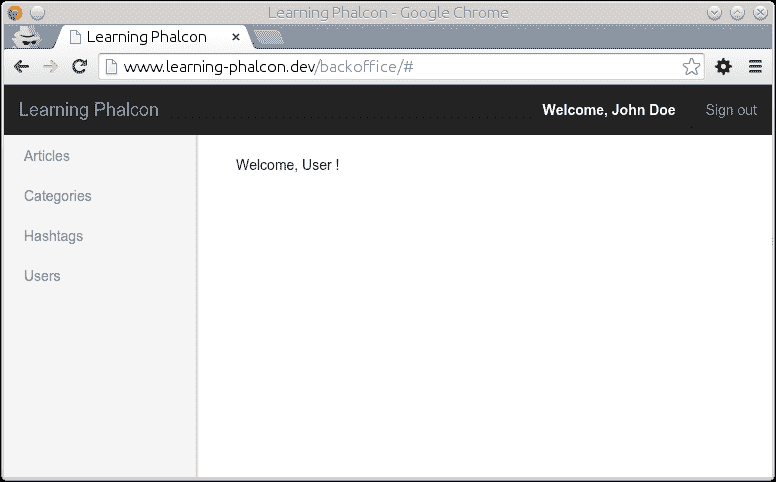
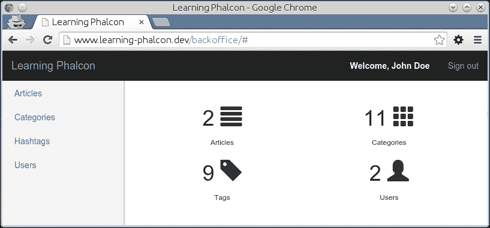

# 第八章。Backoffice 模块（第二部分）

在本章中，我们将开发 Backoffice 模块的剩余部分，以便我们可以获得一个完全功能化的管理区域。本章涵盖了以下主题：

+   用户 CRUD

+   文章 CRUD

# 用户 CRUD

我们已经开发出实现此功能所需的部分代码，但我们将重写其中一部分，因为在同时，我们对数据库进行了更改，这将影响我们应用程序的功能。接下来我们要开发的是类似于之前的 CRUD 部分。让我们从 API 控制器开始。

## 创建控制器（API）

正如我们在第七章中做的那样，*Backoffice 模块（第一部分）*，带有哈希标签和分类，我们需要为用户创建一个控制器。在`modules/Api/Controller/`目录下创建一个新文件，命名为`UsersController.php`。然后，在文件中编写以下代码：

```php
<?php
namespace App\Api\Controllers;

class UsersController extends BaseController{
  public function updateAction($id) {
    try {
      $manager = $this->getDI()->get('core_user_manager');

      if ($this->request->getHeader('CONTENT_TYPE') == 'application/json') {
        $data = $this->request->getJsonRawBody(true);
      } else {
        $data = $this->request->getPut();
      }

      if (count($data) == 0) {
        throw new \Exception('Please provide data', 400);
      }

      $st_data = array_merge($data, ['id' => $id]);
      $result  = $manager->restUpdate($st_data);

      return $this->render($result);
    } catch (\Exception $e) {
      return $this->render([
        'code' => $e->getCode(),
        'message' => $e->getMessage(),
      ], $e->getCode());
    }
  }

  public function createAction() {
    try {
      $manager   = $this->getDI()->get('core_user_manager');

      if ($this->request->getHeader('CONTENT_TYPE') == 'application/json') {
        $data = $this->request->getJsonRawBody(true);
      } else {
        $data = $this->request->getPost();
      }

      if (count($data) == 0) {
        throw new \Exception('Please provide data', 400);
      }

      $st_output = $manager->restCreate($data);

      return $this->render($st_output);
    } catch (\Exception $e) {
      return $this->render([
        'code' => $e->getCode(),
        'message' => $e->getMessage(),
      ], 500);
    }
  }
}
```

如你所见，这个控制器和其他控制器之间没有太多区别，除了参数绑定。我们省略了`list()`、`get()`和`delete()`方法，但你可以在这个章节的源代码中找到它们。

现在我们将进入`Backoffice`中控制器创建的环节。

## Backoffice 模块的用户控制器

在`modules/Backoffice/Controller/`目录下创建一个新文件，命名为`UserController.php`。然后，在文件中编写以下代码：

```php
<?php
namespace App\Backoffice\Controllers;

class UserController extends BaseController{
  public function createAction() {
    if (!$this->request->isPost()) {
      return $this->response->redirect('user/list');
    }

    $manager = $this->getDI()->get('core_user_manager');
    $form    = $manager->getForm();

    if ($form->isValid($this->request->getPost())) {
      try {
        $manager   = $this->getDI()->get('core_user_manager');
        $post_data = $this->request->getPost();

        $manager->create($post_data);
        $this->flashSession->success('Object was created successfully');

        return $this->response->redirect('user/list');
      } catch (\Exception $e) {
        $this->flash->error($e->getMessage());

        return $this->dispatcher->forward(['action' => 'add']);
      }
    } else {
      foreach ($form->getMessages() as $message) {
        $this->flash->error($message->getMessage());
      }

      return $this->dispatcher->forward(['action' => 'add', 'controller' => 'user']);
    }
  }

  public function updateAction() {
    if (!$this->request->isPost()) {
      return $this->response->redirect('user/list');
    }

    $manager    = $this->getDI()->get('core_user_manager');
    $object_id  = $this->persistent->get('id');
    $object     = $manager->findFirstById($object_id);
    $form       = $manager->getForm($object);

    if ($form->isValid($this->request->getPost())) {
      try {
        $manager = $this->getDI()->get('core_user_manager');
        $manager->update(array_merge($this->request->getPost(), ['id' => $object_id]));
        $this->flashSession->success('Object was updated successfully');

        return $this->response->redirect('user/list');
      } catch (\Exception $e) {
        $this->flash->error($e->getMessage());

        return $this->dispatcher->forward(['action' => 'edit']);
      }
    } else {
      foreach ($form->getMessages() as $message) {
        $this->flash->error($message->getMessage());
      }

      return $this->dispatcher->forward(['action' => 'edit', 'controller' => 'user']);
    }
  }
}
```

需要更多注意的方法是`updateAction()`和`createAction()`，在这些方法中，我们验证用户表单并将数据分配给管理器中的正确操作。

### 注意

故意省略了`addAction()`、`deleteAction()`和`listAction()`方法，但你可以在这个章节的源代码中找到它们。

## 用户表单

你已经学到了我们如何以及为什么使用表单。我们将创建一个表单，它将帮助我们渲染和验证用户创建所需的数据。在`modules/Core/Forms/`目录下创建一个新文件，命名为`UserForm.php`。然后，在文件中编写以下代码：

```php
<?php
namespace App\Core\Forms;

use Phalcon\Forms\Form;
use Phalcon\Forms\Element\Text;
use Phalcon\Forms\Element\Password;
use Phalcon\Forms\Element\Submit;
use Phalcon\Forms\Element\Select;
use Phalcon\Forms\Element\Hidden;
use Phalcon\Validation\Validator\PresenceOf;
use Phalcon\Validation\Validator\Email;
use Phalcon\Validation\Validator\StringLength;
use Phalcon\Validation\Validator\Identical;

use App\Core\Models\AclRoles;

class UserForm extends Form {
  private $edit;

  public function initialize($entity = null, $options = null) {
    if (isset($options['edit']) && $options['edit'] === true) {
      $this->edit = true;
    }

    // First name
    $user_first_name = new Text('user_first_name', array(
      'placeholder' => 'First name',
    ));

    $user_first_name->addValidators(array(
      new PresenceOf(array(
        'message' => 'First name is required',
      ))
    ));

    $this->add($user_first_name);

    // Last name
    $user_last_name = new Text('user_last_name', array(
      'placeholder' => 'Last name',
    ));

    $user_last_name->addValidators(array(
      new PresenceOf(array(
        'message' => 'Last name is required',
      ))
    ));

    $this->add($user_last_name);

    // Email
    $user_email = new Text('user_email', array(
      'placeholder' => 'Email',
    ));

    $user_email->addValidators(array(
      new PresenceOf(array(
        'message' => 'The e-mail is required',
      )),
      new Email(array(
        'message' => 'The e-mail is not valid',
      )),
    ));

    $this->add($user_email);

    //Password
    $user_password = new Password('user_password', array(
      'placeholder' => 'Password',
    ));

    $user_password->addValidators(array(
      new PresenceOf(array(
        'message' => 'Password is required'
      )),
      new StringLength(array(
        'min' => 8,
        'messageMinimum' => 'Password is too short. Minimum 8 characters'
      ))
    ));

    $this->add($user_password);

    // User is active
    $this->add(new Select('user_is_active', array(
      1 => 'Yes',
      0 => 'No'
    )));

    // User location
    $user_profile_location = new Text('user_profile_location', array(
      'placeholder' => 'Location',
    ));

    if (true === $this->edit) {
      $user_profile_location->setDefault($entity->profile->getUserProfileLocation());
    }

    $this->add($user_profile_location);

    // User role
    $user_acl_role = new Select('user_acl_role', AclRoles::find(), array(
      'using' => array('name', 'name')
    ));

    $this->add($user_acl_role);

    //CSRF
    $csrf = new Hidden('csrf');

    $csrf->addValidator(
      new Identical(array(
        'value' => $this->security->getSessionToken(),
        'message' => 'CSRF validation failed',
      ))
    );

    $this->add($csrf);

    $this->add(new Submit('save', array(
      'class' => 'btn btn-lg btn-primary btn-block',
    )));
  }
}
```

在这个表单中，你可能注意到一些新事物：

+   我们使用`Phalcon\Validation\Validator\StringLength`来验证密码的长度。

+   我们使用一个新的表单元素`Phalcon\Forms\Element\Select`来生成`select`表单元素。

+   我们使用`Phalcon\Validation\Validator\Email`来验证电子邮件地址字段。

+   我们将`App\Core\Models\AclRoles`的结果作为`select`元素`user_acl_role`的第二个参数。这个字段的第二个参数是一个数组，它指示`Phalcon\Forms\Element\Select`在生成 HTML 代码时使用字段名。通常，我们会使用字段的 ID 和名称，或者类似的东西。但在这个特定的情况下，`acl_roles`表没有 ID。

## 用户管理器

你可能已经有了用户管理器的一部分，或者可能已经完全创建。如果你还没有，现在就创建它。在`modules/Core/Managers/`中创建一个新文件，并将其命名为`UserManager.php`。然后，在它里面写入以下代码：

```php
<?php
namespace App\Core\Managers;

use App\Core\Models\User;
use App\Core\Models\UserRole;
use App\Core\Models\AclRoles;
use App\Core\Models\UserProfile;

use App\Core\Forms\UserForm;

class UserManager extends BaseManager{
  public function getForm($entity = null, $options = null) {
    return new UserForm($entity, $options);
  }

  public function create($data, $user_role = 'Guest') {
    $security = $this->getDI()->get('security');

    if (isset($data['user_acl_role'])) {
      $user_role = $data['user_acl_role'];
    }

    $user = new User();
    $user->setUserFirstName($data['user_first_name']);
    $user->setUserLastName($data['user_last_name']);
    $user->setUserEmail($data['user_email']);
    $user->setUserPassword($security->hash($data['user_password']));
    $user->setUserIsActive($data['user_is_active']);

    $o_acl_role  = AclRoles::findFirstByName($user_role);

    if (!$o_acl_role) {
      throw new \Exception("Role $user_role does not exists");
    };

    $o_user_role[0] = new UserRole();
    $o_user_role[0]->setUserRole($user_role);

    $user->roles = $o_user_role;

    $profile = new UserProfile();
    $profile->setUserProfileLocation($data['user_profile_location']);

    $user->profile = $profile;

    return $this->save($user, 'create');
  }
}
```

`create()`方法需要两个参数。第一个参数`$data`是一个包含创建我们新对象所需值的数组。第二个参数是`$user_role`，具有默认值。进一步来说，我们检查`$data`数组是否有一个名为`user_acl_role`的键。如果键存在，我们覆盖`$user_role`参数的默认值。最后，我们将值分配给每个`$user`对象并保存它们：

```php
public function update(array $data) {
  $object = User::findFirstById($data['id']);

  if (!$object) {
    throw new \Exception('Object not found');
  }

  $security = $this->getDI()->get('security');

  $object->setUserFirstName($data['user_first_name']);
  $object->setUserLastName($data['user_last_name']);
  $object->setUserEmail($data['user_email']);
  $object->setUserPassword($security->hash($data['user_password']));
  $object->setUserIsActive($data['user_is_active']);

  $o_acl_role  = AclRoles::findFirstByName($data['user_acl_role']);

  if (!$o_acl_role) {
    throw new \Exception("Role $user_role does not exists");
  };

  $o_user_role[0] = new UserRole();
  $o_user_role[0]->setUserRole($data['user_acl_role']);

  $object->roles = $o_user_role;

  $object->profile->setUserProfileLocation($data['user_profile_location']);

  return $this->save($object, 'update');
}
```

`update()`方法与`create()`方法类似，但首先检查我们想要更新的对象是否存在。以下所示的`delete()`方法将简单地通过 ID 搜索对象；如果对象存在，则将其删除：

```php
public function delete($id) {
  $object = User::findFirstById($id);

  if (!$object) {
    throw new \Exception('Object not found');
  }

  if (false === $object->delete()) {
    foreach ($object->getMessages() as $message) {
      $error[] = (string) $message;
    }

    throw new \Exception(json_encode($error));
  }
  return true;
}
```

### 注意

再次强调，`find()`、`findFirstById()`和`findFirst()`方法已被故意省略，但你可以在本章的源代码中找到它们。

让我们关注`create()`和`update()`方法以及我们如何存储配置文件和角色的关系。因为用户和角色之间的关系是*1 - N*，为了正确存储值，我们使用数组表示法为`$o_user_role`变量。否则，保存将失败。对于密码，我们利用 Phalcon 内置的安全模块，并使用`$security->hash()`方法进行加密。

# 用户模板

最后一步是创建模板。切换到`modules/Backoffice/Views/Default`并创建一个名为`user`的新目录。在这个新目录中，创建所需的四个文件：`add.volt`、`delete.volt`、`edit.volt`和`list.volt`。关于这些模板没有新的说明，所以我们只需写出它们的代码。

`add.volt`的代码如下：

```php


<h1>Add</h1>
<hr>
<div class="panel panel-default">
  <div class="panel-body">
    <form method="post" action="{{ url('user/create') }}">
      <h4>User details</h4>
      <hr>
        <div class="form-group">
          <label for="user_first_name">First name</label>
            {{ form.render('user_first_name', {'class':'form-control'}) }}
        </div>
        <div class="form-group">
          <label for="user_last_name">Last name</label>
            {{ form.render('user_last_name', {'class':'form-control'}) }}
        </div>
        <div class="form-group">
          <label for="user_email">Email</label>
            {{ form.render('user_email', {'class':'form-control'}) }}
        </div>
        <div class="form-group">
          <label for="user_password">Password</label>
            {{ form.render('user_password', {'class':'form-control'}) }}
        </div>
        <div class="form-group">
          <label for="user_is_active">Is active</label>
            {{ form.render('user_is_active', {'class':'form-control'}) }}
        </div>
        <h4>User profile</h4>
        <hr>
        <div class="form-group">
          <label for="user_profile_location">Location</label>
            {{ form.render('user_profile_location', {'class':'form-control'}) }}
        </div>
        <h4>User role</h4>
        <hr>
        <div class="form-group">
          <label for="user_acl_role">Role</label>
            {{ form.render('user_acl_role', {'class':'form-control'}) }}
          </div>
        {{ form.render('save', {'value':'Save'}) }}
      {{ form.render('csrf', {'value':security.getToken()}) }}
    </form>
  </div>
</div>

```

下面是`delete.volt`的代码：

```php


<h1>Confirm deletion</h1>
<h3>Are you sure you want to delete the selected element?</3>
<hr>
<div class="panel panel-default">
  <div class="panel-body">
    <form method="post" action="{{ url('user/delete/' ~ id) }}" class="form-inline">
      <input type="submit" value="Yes, delete" class="btn btn-sm btn-danger btn-block">
          <a href="{{ url('user/list') }}" class="btn btn-lg btn-default btn-block">Cancel</a>
        </form>
    </div>
</div>

```

`edit.volt`文件几乎与`add.volt`相同。只需替换`form`动作并将其指向`user/update`：

```php
<form method="post" action="{{ url('user/update') }}">
```

`list.volt`的代码如下：

```php


<div class="pull-left">
  <h1>Users</h1>
</div>
<div class="pull-right">
  <a class="btn btn-success" href="{{ url('user/add') }}" aria-label="Left Align">
    <span class="glyphicon glyphicon-plus" aria-hidden="true"></span> New
  </a>
</div>
<div class="clearfix"></div>
<hr>
<div class="panel panel-default">
  <div class="panel-body">
    <table class="table table-striped">
      <thead>
      <tr>
        <th>#</th>
        <th>Name</th>
        <th>Email</th>
        <th>Location</th>
        <th>Created at</th>
        <th>Options</th>
      </tr>
      </thead>
      <tbody>
        
          <tr>
            <th scope="row">{{ record['id'] }}</th>
              <td>{{ record['user_first_name'] }} {{ record['user_last_name'] }}</td>
              <td>{{ record['user_email'] }}</td>
              <td>{{ record['user_profile']['user_profile_location'] }}</td>
              <td>{{ record['user_created_at'] }}</td>
              <td>
                <a class="btn btn-default btn-xs" href="{{ url('user/edit/' ~ record['id']) }}" aria-label="Left Align">
                <span class="glyphicon glyphicon-pencil" aria-hidden="true">
                </span>
              </a>
              <a class="btn btn-danger btn-xs" href="{{ url('user/delete/' ~ record['id']) }}" aria-label="Left Align">
                <span class="glyphicon glyphicon-trash" aria-hidden="true"></span>
              </a>
            </td>
          </tr>
            
          <tr>
              <td colspan="4">There are no records in your database</td>
          </tr>
        
      </tbody>
    </table>
  </div>
</div>




```

我们已经完成了用户 CRUD！你应该能够访问 Backoffice 中的`Users`部分（`http://www.learning-phalcon.localhost/backoffice/user/list`）并查看现有用户列表。现在我们已经为添加文章所需的所有部分启用了 CRUD，我们将继续本章的最后一部分——文章 CRUD。

# 文章 CRUD

我们为这部分部分地编写了一些代码。它可能对你来说已经可以工作，但你将主要更改其中的大部分。API 控制器已经开发完成，因此我们可以直接进入`ArticleManager`进行重构。

## 控制器（API）

这个控制器的代码与其它控制器的代码类似。让我们看看它是什么样子。打开位于`modules/Api/Controllers/ArticlesController.php`的文件，清空其内容，并写入以下代码：

```php
<?php
namespace App\Api\Controllers;

class ArticlesController extends BaseController{
  public function updateAction($id) {
    try {
      $manager = $this->getDI()->get('core_article_manager');

      if ($this->request->getHeader('CONTENT_TYPE') == '       application/json') {
        $data = $this->request->getJsonRawBody(true);
      } else {
        $data = $this->request->getPut();
      }

      if (count($data) == 0) {
        throw new \Exception('Please provide data', 400);
      }

      $st_inputData = array(
        'article_user_id' => $data['article_user_id'],
        'article_is_published' => $data['article_is_published'],
        'translations' => [
          $data['article_translation_lang'] => [
            'article_translation_short_title' =>
                $data['article_translation_short_title'],
            'article_translation_long_title' =>
                $data['article_translation_long_title'],
            'article_translation_description' =>
                $data['article_translation_description'],
            'article_translation_slug' => $data[
                'article_translation_slug'],
            'article_translation_lang' => $data[
                'article_translation_lang'],
          ],
        ],
        'categories' => $data['categories'],
        'hashtags' => $data['hashtags']
      );

      $result = $manager->restUpdate(array_merge(
        $st_inputData, ['id' => $id]));

      return $this->render($result);
    } catch (\Exception $e) {
      return $this->render([
        'code' => $e->getCode(),
        'message' => $e->getMessage(),
      ], $e->getCode());
    }
 }

  public function createAction() {
    try {
      $manager   = $this->getDI()->get('core_article_manager');

      if ($this->request->getHeader('CONTENT_TYPE') ==
        'application/json') {
        $data = $this->request->getJsonRawBody(true);
      } else {
        $data = $this->request->getPost();
      }
      if (count($data) == 0) {
        throw new \Exception('Please provide data', 400);
      }

      $st_inputData = array(
        'article_user_id' => $data['article_user_id'],
        'article_is_published' => $data['article_is_published'],
        'translations' => [
          $data['article_translation_lang'] => [
            'article_translation_short_title' => 
              $data['article_translation_short_title'],
            'article_translation_long_title' =>
              $data['article_translation_long_title'],
            'article_translation_description' =>
              $data['article_translation_description'],
            'article_translation_slug' =>
              $data['article_translation_slug'],
            'article_translation_lang' =>
              $data['article_translation_lang'],
          ],
        ],
        'categories' => $data['categories'],
        'hashtags' => $data['hashtags']
      );

      $st_output = $manager->restCreate($st_inputData);

      return $this->render($st_output);
    } catch (\Exception $e) {
      return $this->render([
        'code' => $e->getCode(),
        'message' => $e->getMessage(),
      ], $e->getCode());
    }
  }
}
```

在此控制器中需要注意的唯一重要事项是我们期望 `createAction()` 和 `updateAction()` 的数据结构。让我们继续下一个控制器。

### 注意

`addAction()`、`deleteAction()` 和 `listAction()` 方法被有意地省略了，但您可以在本章的源代码中找到它们。

## 后台模块的文章控制器

切换到 `modules/Backoffice/Controllers/` 文件夹，创建一个名为 `ArticleController.php` 的新文件，并写入以下代码：

```php
<?php
namespace App\Backoffice\Controllers;

class ArticleController extends BaseController {
  public function createAction() {
    if (!$this - > request - > isPost()) {
      return $this - > response - > redirect('article/list');
    }
    $manager = $this - > getDI() - > get('core_article_manager');
    $form = $manager - > getForm();
    if ($form - > isValid($this - > request - > getPost())) {
      try {
        $manager = $this - > getDI() - > get('core_article_manager');
        $post_data = $this - > request - > getPost();
        $data = array_merge($post_data,
          ['article_user_id ' => $this->auth->getUserId()]);

      $manager - > create($data);
      $this - > flashSession - > success('Object was created 
        successfully ');
        return $this - > response - > redirect('article/list');
      } catch (\Exception $e) {
        $this - > flash - > error($e - > getMessage());
        return $this - > dispatcher - > forward(['action' =>
          'add'
        ]);
      }
    } else {
      foreach($form - > getMessages() as $message) {
        $this - > flash - > error($message - > getMessage());
      }
      return $this - > dispatcher - > forward(['action' => 'add',
        'controller' => 'article'
      ]);
    }
  }
  public function updateAction() {
    if (!$this - > request - > isPost()) {
      return $this - > response - > redirect('article/list');
    }
    $manager = $this - > getDI() - > get('core_article_manager');
    $object_id = $this - > persistent - > get('id');
    $object = $manager - > findFirstById($object_id);
    $form = $manager - > getForm($object);
    if ($form - > isValid($this - > request - > getPost())) {
      try {
        $manager = $this - > getDI() - > get('core_article_manager ');
        $post_data = $this - > request - > getPost();
        $data = array_merge(
          $post_data, ['article_user_id' => $this - > auth - > getUserId(), 'id' => $object_id]);
        $manager - > update($data);
        $this - > flashSession - > success('Object was updated successfully ');

        return $this - > response - > redirect('article/list');
      } catch (\Exception $e) {
        $this - > flash - > error($e - > getMessage());
        return $this - > dispatcher - > forward(['action' =>
          'edit'
        ]);
      }
    } else {
      foreach($form - > getMessages() as $message) {
        $this - > flash - > error($message - > getMessage());
      }
      return $this - > dispatcher - > forward(['action' => 'edit',
        'controller' => 'category'
      ]);
    }
  }
}
```

查看一下 `createAction()` 和 `updateAction()`。在这里，当我们设置 `article_user_id` 字段的值时，我们使用认证用户的 ID。

### 注意

再次，`addAction()`、`deleteAction()` 和 `listAction()` 等方法被有意地省略了，但您可以在本章的源代码中找到它们。

## 文章表单

此表单与分类表单类似。让我们看看它的样子。在 `modules/Core/Forms` 目录中创建一个名为 `ArticleForm.php` 的新文件，并将此代码写入其中：

```php
<?php
namespace App\Core\Forms;

use Phalcon\Forms\Form;
use Phalcon\Forms\Element\Text;
use Phalcon\Forms\Element\TextArea;
use Phalcon\Forms\Element\Select;
use Phalcon\Forms\Element\Submit;
use Phalcon\Forms\Element\Hidden;
use Phalcon\Validation\Validator\Identical;

use App\Core\Models\CategoryTranslation;
use App\Core\Models\Hashtag;

class ArticleForm extends Form {
  private $edit = false;
  public function initialize($entity = null, $options = null) {
    if (isset($options['edit']) && $options['edit'] === true) {
      $this->edit = true;
    }
    $locales = $this->getDI()->get('config')->i18n->locales->
        toArray();
    foreach ($locales as $locale => $name) {
      if (true === $this->edit) {
        $translations = $entity->getTranslations([
            "article_translation_lang = '$locale'"])->toArray();
      }
      $article_translation_short_title[$locale] = new Text 
      ("translations[$locale][article_translation_short_title]", [
        'value' => $this->edit === true ? $translations[0]
        ['article_translation_short_title'] : null
      ]);
      $article_translation_long_title[$locale] = new Text 
      ("translations[$locale][article_translation_long_title]", [
        'value' => $this->edit === true ? $translations[0]
        ['article_translation_long_title'] : null
      ]);
      $article_translation_description[$locale] = new TextArea 
      ("translations[$locale][article_translation_description]", [
        'value' => $this->edit === true ? $translations[0]
        ['article_translation_description'] : null
      ]);
      $article_translation_slug[$locale] = new Text ( 
        "translations[$locale][article_translation_slug]", [
        'value' => $this->edit === true ? $translations[0]
        ['article_translation_slug'] : null
      ]);
      $article_translation_lang[$locale] = new Hidden ( 
        "translations[$locale][article_translation_lang]", [
        'value' => $locale
      ]);
      $this->add( $article_translation_short_title[$locale] );
      $this->add( $article_translation_long_title[$locale] );
      $this->add( $article_translation_description[$locale] );
      $this->add( $article_translation_slug[$locale] );
      $this->add( $article_translation_lang[$locale] );
    }
    // Categories
    $categories = new Select('categories[]',
      CategoryTranslation::find([
          "category_translation_lang = 'en'"]), [
          'using' => [
            'category_translation_category_id',
            'category_translation_name'
          ],
          'multiple' => true
        ]);
        if ($this->edit === true) {
          $categories_defaults = array();
          foreach ($entity->getCategories(["columns" =>
              ["id"]]) as $category) {
            $categories_defaults[] = $category->id;
        }
        $categories->setDefault($categories_defaults);
      }
      $this->add($categories);
      // Hash tags
      $hashtags = new Select('hashtags[]', Hashtag::find(), [
        'using' => ['id', 'hashtag_name'],
        'multiple' => true
      ]);
      if ($this->edit === true) {
        $hashtags_defaults = array();
        foreach ($entity->getHashtags(["columns" =>
            ["id"]]) as $hashtag) {
          $hashtags_defaults[] = $hashtag->id;
        }
        $hashtags->setDefault($hashtags_defaults);
      }
      $this->add($hashtags);
      // Is published
      $this->add(new Select('article_is_published', array(
          1 => 'Yes',
          0 => 'No'
      )));
      //CSRF
      $csrf = new Hidden('csrf');
      $csrf->addValidator(
        new Identical(array(
          'value' => $this->security->getSessionToken(),
          'message' => 'CSRF validation failed',
        ))
      );
      $this->add($csrf);
      $this->add(new Submit('save', array(
      'class' => 'btn btn-lg btn-primary btn-block',
    )));
  }
}
```

我们以与分类相同的方式管理文章翻译。至于文章标签和文章分类，当我们编辑记录时，我们必须以某种方式检索现有的标签和分类，并将它们作为表单的默认值分配。

我们已经创建了控制器、管理器和表单。我们现在需要的是模板。切换到 `modules/Backoffice/Views/Default/article/`，并创建三个缺失的文件：`add.volt`、`delete.volt` 和 `edit.volt`。以下是每个文件的代码。

`add.volt` 的代码如下：

```php


<h1>Add</h1>
<hr>
<div class="panel panel-default">
  <div class="panel-body">
    <form method="post" action="{{ url('article/create') }}">
      
      <h3>Article ({{ name }})</h3>
      <hr>
      <div class="form-group">
        <label for="article_translation_short_title">Title
        </label>
        {{ form.render('translations['~locale~']
        [article_translation_short_title]', {'class':'form-control'}) }}
      </div>
      <div class="form-group">
        <label for="article_translation_long_title">
            Long title</label>
        {{ form.render('translations['~locale~']
          [article_translation_long_title]',
          {'class':'form-control'}) }}
      </div>
      <div class="form-group">
        <label for="article_translation_description">Description
        </label>
        {{ form.render('translations['~locale~']
          [article_translation_description]',
          {'class':'form-control', 'rows': 8}) }}
      </div>
      <div class="form-group">
        <label for="article_translation_slug">Slug
        </label>
        {{ form.render('translations['~locale~']
          [article_translation_slug]',
          {'class':'form-control'}) }}
      </div>
      {{ form.render('translations['~locale~']
        [article_translation_lang]') }}
        
      <div class="form-group">
    <label for="article_is_published">Is published
    </label>
    {{form.render('article_is_published',
    {'class':'formcontrol'}) }}
    </div>
    <h3>Categories</h3>
    <hr>
    <div class="form-group">
    <label for="categories">Select one or more 
    categories</label>
    {{ form.render('categories[]', {'class':'formcontrol'}) }}
    </div>
    <h3>Hash tags</h3>
    <hr>
    <div class="form-group">
    <label for="hashtags">Select one or more hash tags
    </label>
      {{form.render('hashtags[]',
      {'class':'form-control'})}}
    </div>
    {{form.render('save', {'value':'Save'}) }}
    {{form.render('csrf', {'value':security.getToken()}) }}
  </form>
  </div>
</div>

```

创建此文件后，尝试访问 `http://www.learning-phalcon.localhost/backoffice/article/add`。您应该会看到表单。

`edit.volt` 中的代码与 `add.volt` 中的代码相同。复制它，并将其表单动作更改为 `article/update` 而不是 `article/create`。

`delete.volt` 文件与迄今为止我们创建的所有 `delete.volt` 文件内容相同。只需从其中任何一个复制内容，并将 `links` 动作更改为指向 `article/delete`。

我们已经创建了 `list.volt` 文件，但我们需要删除其内容，并在其中写入以下代码：

```php
 
<div class="pull-left">
    <h1>Articles</h1>
</div>
<div class="pull-right">
    <a class="btn btn-success" href="{{ url('article/add') }}" aria-label="Left Align">
        <span class="glyphicon glyphicon-plus" aria-hidden="true"></span> New
    </a>
</div>
<div class="clearfix"></div>
<hr>
<div class="table-responsive">

  <table class="table table-striped">
    <thead>
      <tr>
        <th>#</th>
        <th>Title</th>
        <th>Is published</th>
        <th>Author</th>
        <th>Created at</th>
        <th>Options</th>
      </tr>
    </thead>
    <tbody>
    
      <tr>
        <td>{{record['id'] }}</td>
        <td>{{record['article_translations'][0]
          ['article_translation_short_title'] }}</td>
        <td>{{record['article_is_published'] }}</td>
        <td>{{record['article_author']['user_first_name']}} 
               {{record['article_author']['user_last_name']}}
       </td>
        <td>{{ record['article_created_at'] }}</td>
        <td>
          <a class="btn btn-default btn-xs"
            href="{{url('article/edit/' ~ record['id']) }}"
            aria-label="Left Align">
            <span class="glyphicon glyphicon-pencil"
              ariahidden="true"></span>
          </a>
          <a class="btn btn-danger btn-xs"
            href="{{url('article/delete/' ~ record['id']) }}"
            aria-label="Left Align">
            <span class="glyphicon glyphicon-trash"
              ariahidden="true"></span>
          </a>
        </td>
      </tr>
      
      <tr>
        <td colspan="4">There are no records in your
          database</td>
      </tr>
      
    </tbody>
  </table>
</div>




```

到目前为止，您应该已经拥有了一个完全功能的管理区域。我们将在几分钟内结束本章，但在那之前，我们将稍微美化一下用户界面（UI）。让我们通过将认证用户的名称添加到页面顶部开始这个过程。

打开 `modules/Backoffice/Controller/BaseControllers.php` 文件，并将以下代码追加到 `afterExecuteRoute()` 方法中：

```php
$this->view->identity = $this->getDI()->get('auth')->getIdentity();
```

这样，我们将认证用户的身份分配给视图。接下来，打开 `modules/Backoffice/Views/Default/common/topbar.volt` 模板文件，并在 `"Sign out" <li>` 标签之前追加以下代码：

```php
<li class="disabled"><a href="#">Welcome, {{ identity['name'] }}</a></li>
```

您现在可以刷新页面，应该会看到认证用户的名称，如图所示：



接下来，我们不再有一个默认的空白页面，而是将其转换成一个简单的仪表板。打开 `modules/Backoffice/Controller/IndexController.php` 并修改 `indexAction()` 方法，如下所示：

```php
public function indexAction() {
  $total_articles = $this->getDI()->get('core_article_manager')->find()->count();
  $total_users = $this->getDI()->get('core_user_manager')->find()->count();
  $total_categories = $this->getDI()->get('core_category_manager')->find()->count();
  $total_hashtags = $this->getDI()->get('core_hashtag_manager')->find()->count();
  $this->view->setVar('dashboard', [
    'total_articles' => $total_articles,
    'total_users' => $total_users,
    'total_categories' => $total_categories,
    'total_hashtags' => $total_hashtags,
  ]);
}
```

如您所见，我们只是简单地计算文章、用户、标签和分类的总数。`modules/Backoffice/Views/Default/index/index.volt` 的模板代码可以看起来像这样：

```php


<div class="row">
  <div class="col-md-6 col-xs-6 text-center">
    <h1>{{ dashboard['total_articles'] }}
      <span class="glyphicon glyphicon-align-justify">
      </span>
    </h1>
    <small>Articles</small>
  </div>
  <div class="col-md-6 col-xs-6 text-center">
    <h1>{{ dashboard['total_categories'] }}
      <span class="glyphicon glyphicon-th">
      </span>
    </h1>
    <small>Categories</small>
  </div>
</div>
<div class="row">
  <div class="col-md-6 col-xs-6 text-center">
    <h1>{{ dashboard['total_hashtags'] }}
    <span class="glyphicon glyphicon-tag">
    </span></h1>
    <small>Tags</small>
  </div>
  <div class="col-md-6 col-xs-6 text-center">
  <h1>{{ dashboard['total_users'] }}
    <span class="glyphicon glyphicon-user">
    </span>
  </h1>
  <small>Users</small>
</div>
</div>

```

如果你刷新页面，你应该能够看到这个简单仪表板的结果，如下所示：



## 文章管理器

打开位于 `modules/Core/Manager/ArticleManager.php` 的文件，清空其内容，并写入以下代码：

```php
<?php
namespace App\Core\Managers;

use App\Core\Models\Article;
use App\Core\Models\ArticleTranslation;
use App\Core\Models\ArticleCategoryArticle;
use App\Core\Models\ArticleHashtagArticle;
use App\Core\Models\Category;
use App\Core\Models\Hashtag;
use App\Core\Models\User;
```

在这些第一行中，我们插入所有我们需要用于 CRUD 操作的文件：

```php
class ArticleManager extends BaseManager
{
    private $default_data = array(
        'article_user_id' => 1,
        'article_is_published' => 0,
        'translations' => array(
            'en' => array(
                'article_translation_short_title' => 'Short title',
                'article_translation_long_title' => 'Long title',
                'article_translation_description' => 'Description',
                'article_translation_slug' => '',
                'article_translation_lang' => 'en',
            ),
        ),
        'categories' => array(),
        'hashtags' => array()
    );
```

我们将 `$default_data` 添加为一个私有变量以避免代码重复。我们将为 `create()` 和 `update()` 方法使用它：

```php
    public function getForm($entity = null, $options = null)
    {
        return new ArticleForm($entity, $options);
    }

    public function create($input_data)
    {
        $data = $this->prepareData($input_data);

        $article = new Article();
        $article->setArticleIsPublished($data[
  'article_is_published']);

        $articleTranslations = array();

        foreach ($data['translations'] as $lang => $translation) {
            $tmp = new ArticleTranslation();
            $tmp->assign($translation);
            array_push($articleTranslations, $tmp);
        }

        if (count($data['categories']) > 0) {
            $article->categories = Category::find([
                "id IN (".implode(',', $data['categories']).")",
            ])->filter(function ($category) {
                return $category;
            });
        }

        if (count($data['hashtags']) > 0) {
            $article->hashtags = Hashtag::find([
                "id IN (".implode(',', $data['hashtags']).")",
            ])->filter(function ($hashtag) {
                return $hashtag;
            });
        }

        $user = User::findFirstById((int) $data['article_user_id']);

        if (!$user) {
            throw new \Exception('User not found', 404);
        }

        $article->setArticleUserId($data['article_user_id']);

        $article->translations = $articleTranslations;

        return $this->save($article, 'create');
    }
```

让我们尝试理解 `create()` 方法。首先，我们调用 `prepareData()` 方法。这是一个辅助方法，我们也在 `update()` 中使用它。接下来，我们初始化一个新的文章对象，并设置 `article_is_published` 字段的标志。文章需要翻译和标签，我们必须为它分配一个用户。我们通过为每个翻译和标签初始化一个新的对象来完成这项工作。在用户的情况下，我们需要检查用户是否存在于我们的数据库中：

```php
    public function update($input_data)
    {
        $article = Article::findFirstById($input_data['id']);

        if (!$article) {
            throw new \Exception('Article not found', 404);
        }

        $data = $this->prepareData($input_data);

        $article->setArticleIsPublished($data['article_is_published']);
        $article->setArticleUpdatedAt(new \Phalcon\Db\RawValue('NOW()'));

        foreach ($data['translations'] as $lang => $translation) {
            $article->getTranslations()->filter(function($t) use($lang, $translation){

                if ($t->getArticleTranslationLang() == $lang) {
                    $t->assign($translation);
                    $t->update();
                }
            });
        }

        $results = ArticleCategoryArticle::findByArticleId($input_data['id']);

        if ($results) {
            $results->delete();
        }

        if (count($data['categories']) > 0) {
            $article->categories = Category::find([
              "id IN (".implode(',', $data['categories']).")",])->filter(function ($category) {
                return $category;
            });
        }

        $results = ArticleHashtagArticle::findByArticleId(
  $input_data['id']);

        if ($results) {
            $results->delete();
        }

        if (count($data['hashtags']) > 0) {
            $article->hashtags = Hashtag::find([
                "id IN (".implode(',', $data['hashtags']).")",
            ])->filter(function ($hashtag) {
                return $hashtag;
            });
        }

        $user = User::findFirstById((int) $data['article_user_id']);

        if (!$user) {
            throw new \Exception('User not found', 404);
        }

        $article->setArticleUserId($data['article_user_id']);

        return $this->save($article, 'update');
    }
```

在前面的代码中，`update()` 方法遵循与 `create()` 方法相同的逻辑。但在接下来的代码中，我们首先需要删除现有的标签和分类的关系，并创建新的关系。此方法还会检查文章是否存在于我们的数据库中：

```php
    public function delete($id)
    {
        $article = Article::findFirstById($id);

        if (!$article) {
            throw new \Exception('Article not found', 404);
        }

        if (false === $article->delete()) {
            foreach ($article->getMessages() as $message) {
                $error[] = (string) $message;
            }

            throw new \Exception(json_encode($error));
        }

        return true;
    }

    private function prepareData($input_data)
    {
        $data = array_merge($this->default_data, $input_data);

        if (!is_array($data['categories'])) {
            $data['categories'] = $data['categories'] != '' ?
  array_map('trim', explode(',', $data['categories'])) : null;

        } else {
            $data['categories'] = implode(',', $data['categories']);
        }

        if (!is_array($data['hashtags'])) {
            $data['hashtags'] = $data['hashtags'] != '' ?
  array_map('trim', explode(',', $data['hashtags'])) : null;

        } else {
            $data['hashtags'] = implode(',', $data['hashtags']);
        }

        return $data;
    }
}
```

`prepareData()` 方法是一个辅助方法，它将帮助我们避免在 `update()` 和 `create()` 方法中的代码重复。

看一下 `create()` 和 `update()` 方法。我们期望分类和标签是 ID 的逗号分隔值。如果这些字段包含值，我们使用 `array_map()` 方法并对每个 ID 应用修剪操作。在 `update()` 的情况下，我们总是删除现有的标签和分类，然后再次添加（或添加新的）。我之所以使用这种方法，是因为 Phalcon 的 ORM 不会自动执行此操作。

### 注意

**重要提示**

在官方文档中，它说你可以用这种方式删除相关记录：

```php
$robots->getParts()->delete();
```

当使用多对多关系时，就像我们的情况一样，如果你为分类或标签执行前面的代码，你最终只会删除标签和分类。这不会从中间模型中删除关系。此外，还有一个用于更新相关记录的方法，但由于某些奇怪的功能，它不再被支持，但它仍然可以在官方文档中找到。不要使用它：

```php
$robots->getParts()->update($data, function($part) {
    if ($part->type == Part::TYPE_BASIC) {
        return false;
    }
    return true;
});
```

# 摘要

我们终于完成了这个模块。一般来说，编写代码的方法是无限的。在本章中，我使用了一种我认为容易理解的方法。请随意不同，用你喜欢的方式编码。这本书的目的不是教你编程，而是教你 Phalcon。你可能已经注意到，对于 API，我们没有使用任何验证。你可以稍微练习一下，并将你的表单连接到 API。

在下一章中，我们将切换到`前端`模块，在那里我们将对 API 进行一些小的修改。我们还将尝试基于 Elasticsearch（[`www.elastic.co/products/elasticsearch`](https://www.elastic.co/products/elasticsearch)）实现一个搜索引擎。
