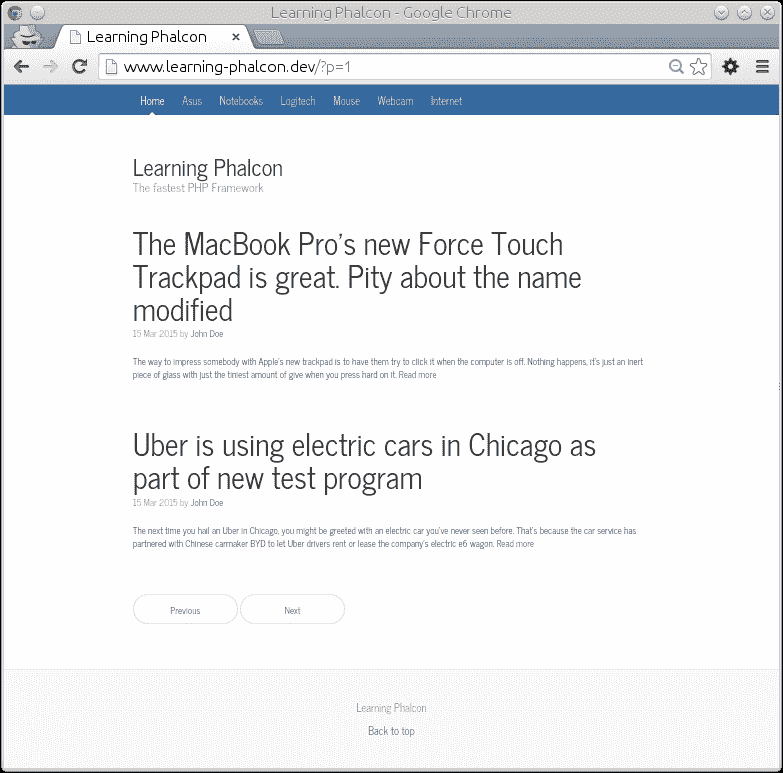
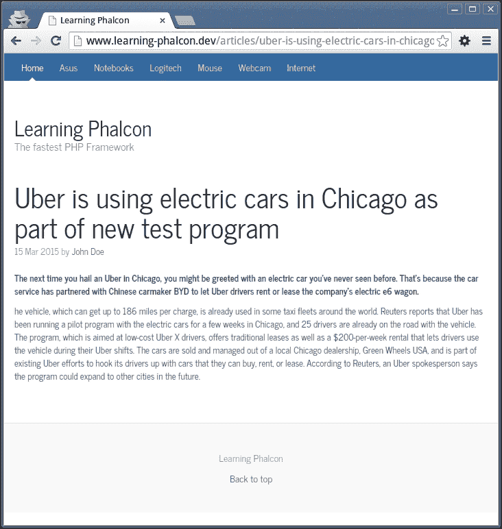
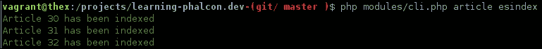

# 第九章. 前端模块

开发前端可能是一项艰巨的工作。您必须考虑各种方面，例如**用户体验**（**UX**）、**搜索引擎优化**（**SEO**）、浏览器兼容性、移动响应性等。我们将专注于创建最小布局并实现 Elasticsearch。我们还将使用 MongoDB 为文章创建一些日志。我们将逐步在本章中涵盖以下主题：

+   前端布局和基本功能

+   实现 Elasticsearch

+   实现 MongoDB

# 前端布局和基本功能

我们将使用一个简单的布局来构建前端模块。切换到`modules/Frontend/Views/Default/common`文件夹，并创建`footer.volt`、`paginator.volt`和`navbar.volt`文件，内容如下。

## footer.volt

`footer.volt`文件没有包含太多信息，但将来您肯定希望添加更多信息，例如链接、合作伙伴、分析脚本等：

```php
<footer class="lp-footer">
    <p>Learning Phalcon</p>
    <p>
        <a href="#">Back to top</a>
    </p>
</footer>
```

## paginator.volt

`paginator.volt`文件包含两个简单的链接：**上一页**和**下一页**。您可以修改这些链接并创建一个更复杂的分页器，如果需要的话：

```php
<nav>
  <ul class="pager">
    <li><a href="?p={{ records['before'] }}">Previous</a></li>
    <li><a href="?p={{ records['next'] }}">Next</a></li>
  </ul>
</nav>
```

## navbar.volt

`navbar.volt`文件包含指向我们主页和所有可用类别的链接。我们将在本章的后面将类别分配给视图。

代码如下：

```php
<div class="lp-masthead">
  <div class="container">
    <nav class="lp-nav">
      <a class="lp-nav-item active" href="{{ url('') }}">Home</a>
      
      <a class="lp-nav-item" href="{{ url('categories/' ~ category['category_translations'][0]['category_translation_slug']) }}">{{ category['category_translations'][0]['category_translation_name']}}</a>
      
    </nav>
  </div>
</div>
```

## layout.volt

让我们继续到`layout.volt`。在`modules/Frontend/Views/Default/`文件夹中已经有一个文件。我们在第二章中创建了它，*设置项目 MVC 结构和环境*。清空其内容并添加以下内容：

```php
<!DOCTYPE html>
<html lang="en">
<head>
<meta charset="utf-8">
<meta http-equiv="X-UA-Compatible" content="IE=edge">
<meta name="viewport" content="width=device-width, initial-scale=1">
<title>Learning Phalcon</title>

{{ stylesheetLink('../assets/default/bower_components/bootstrap/dist/css/bootstrap.min.css') }}
{{ stylesheetLink('../assets/default/css/lp.css') }}

<!--[if lt IE 9]>
  <script src="img/html5shiv.min.js">
</script>
  <script src="img/respond.min.js">
</script>
<![endif]-->
</head>
<body>
  
    
  

  <div class="container">
    <div class="lp-header">
      <h1 class="lp-title">Learning Phalcon</h1>
      <p class="lead lp-description">The fastest PHP Framework</p>
    </div>

    <div class="row">
      <div class="col-sm-12 lp-main">
        

        
      </div>
    </div>
  </div>

  
    
  

  {{ javascriptInclude("../assets/default/bower_components/jquery/dist/jquery.min.js") }}
  {{ javascriptInclude("../assets/default/bower_components/bootstrap/dist/js/bootstrap.min.js") }}
  {{ javascriptInclude("../assets/default/js/lp.js") }}
   
</body>
</html>
```

注意，在这里我们使用了`javascriptInclude()`和`stylesheetLink()`方法，这些方法在 Volt 中默认可用。如果您愿意，可以使用我们为 Backoffice 模块所用的资产管理器。我们还需要一个简单的 CSS 文件。您应该在`public/assets/default/css/`文件夹中已经有一个名为`lp.css`的文件。清空其内容并添加以下内容：

```php
@import url(http://fonts.googleapis.com/css?family=News+Cycle:400,700);

body { font-family: "News Cycle"; color: #555; }

h1, .h1, h2, .h2, h3, .h3, h4, .h4, h5, .h5, h6, .h6 {
    margin-top: 0; font-family: "News Cycle"; font-weight: normal; color: #333;
}

.container {
    width: 720px;
}

.lp-masthead { background-color: #356aa0; -webkit-box-shadow: inset 0 -2px 5px rgba(0, 0, 0, .1); box-shadow: inset 0 -2px 5px rgba(0, 0, 0, .1); }
.lp-nav-item { position: relative; display: inline-block; padding: 10px; font-weight: 500; color: #cdddeb; }

.lp-nav-item:hover,
.lp-nav-item:focus {
    color: #fff; text-decoration: none;
}

.lp-nav .active       { color: #fff; }
.lp-nav .active:after { position: absolute; bottom: 0; left: 50%; width: 0; height: 0; margin-left: -5px; vertical-align: middle; content: " "; border-right: 5px solid transparent; border-bottom: 5px solid; border-left: 5px solid transparent; }
.lp-header            { padding-top: 20px; padding-bottom: 20px; }

.lp-title       { margin-top: 30px; margin-bottom: 0; font-size: 30px; font-weight: normal; }
.lp-description { font-size: 16px; color: #999; }

.lp-main            { font-size: 13px; line-height: 1.5; }

.pager           { margin-bottom: 60px; text-align: left; }
.pager>li>a      { width: 140px; padding: 10px 20px; text-align: center; border-radius: 30px; }

.lp-post       { margin-bottom: 60px; }
.lp-post-title { margin-bottom: 5px; font-size: 40px; }
.lp-post-meta  { margin-bottom: 20px; color: #999; }

.lp-footer              { padding: 40px 0; color: #999; text-align: center; background-color: #f9f9f9; border-top: 1px solid #e5e5e5; }
.lp-footer p:last-child { margin-bottom: 0; }
```

# 修改 BaseController.php

现在，我们应该修改`Frontend`模块中的`BaseController.php`，以便扩展核心模块，并在每次请求时将类别全局分配给我们的视图。打开`modules/Frontend/Controllers/BaseController.php`，清空其内容，并附加以下代码：

```php
<?php
namespace App\Frontend\Controllers;

class BaseController extends \App\Core\Controllers\BaseController
{
    public function afterExecuteRoute()
    {
        $this->view->categories = $this->apiGet('categories');
    }
}
```

我们实际上没有主页（但我们可以在任何时候添加一个），所以我们将请求转发到`ArticlesController`。打开`modules/Frontend/Controllers/IndexController.php`，删除`indexAction()`，并附加以下代码：

```php
  public function indexAction()
  {
      return $this->dispatcher->forward([
    'controller' => 'article',
    'action' => 'list'
      ]);
  }
```

最后一步是创建文章的`listAction()`方法和视图。首先，在`modules/Frontend/Views/Default/article/common/`文件夹中创建一个名为`list.item.volt`的新文件，并添加以下内容：

```php


<div class="lp-post">
  <h2 class="lp-post-title">{{ record['article_translations'][0]
  ['article_translation_short_title'] }}</h2>
  <p class="lp-post-meta">
  {{ record['article_created_at']|date("d M Y") }} by
    <a href="#">
  {{ record['article_author']['user_first_name']}}
  {{ record['article_author']['user_last_name']}}
    </a></p>
  <p>
  {{ record['article_translations'][0]
  ['article_translation_long_title'] }}
  <a href="{{ url('article/' ~ record['article_translations'][0]
    ['article_translation_slug']) }}">Read more</a>
  </p>
</div>


```

我们还需要修改布局 `modules/Frontend/Views/Default/article/list.volt`。打开此文件，清除其内容，并追加以下代码：

```php


    
    
    
    

```

你可以看到，只有当我们有超过两条记录时，我们才会显示 `paginator`（你可以随时更改此设置）。这与 `ArticleController` 的 `listAction()` 方法的 `$limit` 参数相关。打开 `modules/Frontend/Controllers/ArticleController.php`，并向其中追加以下代码：

```php
<?php
namespace App\Frontend\Controllers;

class ArticleController extends BaseController{
  public function listAction() {
    $page = $this->request->getQuery('p', 'int', 1);

    try {
      $records = $this->apiGet('articles',['p' => $page, 'limit' => 2]);
      $this->view->records = $records;
    } catch (\Exception $e) {
      $this->flash->error($e->getMessage());
    }
  }
}
```

基本上，这部分工作已经完成。你现在可以打开 `http://www.learning-phalcon.localhost/`，你应该会看到类似于以下截图的内容：



接下来，我们将对文章控制器进行一些修改，以便通过别名获取文章。我个人喜欢尽可能地将事物分开，以防将来需要实现复杂的逻辑。我们将在 API (`ArticlesController`) 中创建一个名为 `getBySlugAction()` 的新方法。别名是一个用于 SEO（**搜索引擎优化**）目的的友好 URL。打开 `modules/Api/Controllers/ArticlesController.php` 并追加以下代码：

```php
public function getBySlugAction($slug) {
  try {
    $manager = $this->getDI()->get('core_article_manager');

    $st_output = $manager->restGet([
      'article_translation_slug = :article_translation_slug:',
      'bind' => [
        'article_translation_slug' => $slug,
      ],
    ]);

    return $this->render($st_output);
  } catch (\Exception $e) {
    return $this->render([
      'code' => $e->getCode(),
      'message' => $e->getMessage(),
    ], $e->getCode());
  }
}
```

此方法与 `getAction()` 类似。我们正在通过别名进行搜索，因此我们需要修改 `ArticleManager.php` 中的 `find()` 方法。我们新的 `find()` 方法将如下所示：

```php
public function find($parameters = null) {
  if (isset($parameters['bind']['article_translation_slug'])) {
    $translation = ArticleTranslation::findFirst($parameters);
    if ($translation->count() !== 1) {
      return [$translation->getArticle()->toArray()];
    } else {
      throw new \Exception('Article not found', 404);
    }
  } elseif (isset($parameters['bind']['category_translation_slug'])) {
      $category_translation = CategoryTranslation::findFirst($parameters);
      if ($category_translation->count() !== 1) {
        return $category_translation->getCategory()->getArticles();
      } else {
        throw new \Exception('Article not found', 404);
      }
  } else {
    return Article::find($parameters);
  }
}
```

我们检查 `article_translation_slug` 参数是否已设置。如果已设置，则不是调用 `Article::find()` 方法，而是调用 `ArticleTranslation::findFirst()`。如果得到结果，我们将对象作为数组返回。当我们需要从某个类别检索文章时，我们应用相同的逻辑。除非我们也修改 `BaseManager.php` 中的 `restGet()` 方法，否则此代码将无法工作。我们当前的 `restGet()` 方法包含以下行：

```php
$result = $objects->filter(function ($object) {
  return $object->toArray();
});
```

将此行替换为以下代码：

```php
if (is_array($objects)) {
  $result = $objects;
} else {
  $result = $objects->filter(function ($object) {
    return $object->toArray();
  });
}
```

此修改后的代码检查 `$this->find()` 的结果是否为数组。如果是，我们不需要过滤任何内容。现在，我们切换到 `modules/Frontend/Controllers/ArticleController.php` 并添加一个新方法。它将通过其别名获取文章：

```php
public function readAction($slug) {
  try {
    $records = $this->apiGet("articles/slug/$slug");

    $this->view->records = $records;
  } catch (\Exception $e) {
    $this->flash->error($e->getMessage());
  }
}
```

我们缺少路由信息。我们需要为 `Api` 和 `Frontend` 模块添加路由。在 `modules/Api/Config/routing.php`（文章组）中添加以下行：

```php
$articles->addGet('/slug/{slug}', ['action' => 'getBySlug']);
```

然后在 `modules/Frontend/Config/routing.php` 文件中，将最后一行路由代码替换为以下代码：

```php
$router->add('#^/articles/([a-zA-Z0-9\-]+)[/]{0,1}$#', array(
  'module' => 'frontend',
  'controller' => 'article',
  'action' => 'read',
  'slug' => 1,
));
```

## 文章项目模板

我们还需要一个用于阅读文章的模板。切换到 `modules/Frontend/Views/Default/article/common/`，创建一个新文件，命名为 `item.volt`，并添加以下代码：

```php


<div class="lp-post">
  <h2 class="lp-post-title">{{ record['article_translations'][0]
  ['article_translation_short_title'] }}</h2>
  <p class="lp-post-meta">{{ record['article_created_at']|date(
    "d M Y") }} by <a href="#">
    {{ record['article_author']['user_first_name']}}
    {{ record['article_author']['user_last_name'] }}</a></p>
  <p>
  <strong>{{ record['article_translations'][0]
  ['article_translation_long_title'] }}</strong>
  </p>
  <p>
    {{ record['article_translations'][0]
    ['article_translation_description'] }}
  </p>
</div>


```

`readAction()` 的模板（`modules/Frontend/Views/Default/article/read.volt`）应该包含以下代码：

```php




```

就这样！你现在可以访问 `http://www.learning-phalcon.localhost/`。点击 **阅读更多** 链接，你应该会看到类似于以下的结果：



## 从类别检索文章

我们缺少从类别（顶部导航栏）检索文章的实现。我们需要按照以下步骤进行：

1.  将`Api`模块的路由信息添加到`modules/Api/Config/routing.php`中：

    ```php
    $articles->addGet('/category/{slug}', ['action' => 'getByCategorySlug']);
    ```

1.  在`modules/Api/Controllers/ArticlesController.php`中创建一个名为`getByCategorySlugAction()`的新方法：

    ```php
    public function getByCategorySlugAction($slug) {
      try {
        $manager = $this->getDI()->get('core_article_manager');

        $st_output = $manager->restGet([
          'category_translation_slug = :category_translation_slug:',
            'bind' => [
              'category_translation_slug' => $slug,
            ],
        ]);

        return $this->render($st_output);
      } catch (\Exception $e) {
        return $this->render([
          'code' => $e->getCode(),
          'message' => $e->getMessage(),
        ], $e->getCode());
      }
    }
    ```

1.  将前端模块的路由信息添加到`modules/Frontend/Config/routing.php`中：

    ```php
    $router->add('#^/categories/([a-zA-Z0-9\-]+)[/]{0,1}$#', array(
        'module' => 'frontend',
        'controller' => 'article',
        'action' => 'categories',
        'slug' => 1,
    ));
    ```

1.  在`modules/Frontend/Controllers/ArticleController.php`中创建一个名为`categoriesAction()`的新方法：

    ```php
    public function categoriesAction($slug) {
      $this->view->pick('article/list');

      try {
        $records = $this->apiGet("articles/category/$slug");

                $this->view->records = $records;
            } catch (\Exception $e) {
                $this->flash->error($e->getMessage());
            }
        }
    ```

### 小贴士

注意，我们在`categoriesAction()`中选择了文章和列表视图，因为没有必要重复代码；它与列出文章的代码相同。

现在我们有一个最小化、功能性的前端。我们可以浏览文章，从类别中获取文章，并阅读文章。我们不会进一步深入，因为事情可能会变得过于复杂。在本章中，我们只会添加一个功能，并通过在 Elasticsearch 中索引文章来提高速度。

如果您想练习更多，您可以实现一个简单的搜索表单来通过标题搜索文章，或者实现一个作者的个人页面。

# 实现 ElasticSearch

**Elasticsearch**（**ES**）是什么？简短的回答是：它是一个搜索服务器。根据维基百科，这是完整的定义：

> *Elasticsearch 是基于 Lucene 的搜索服务器。它提供了一个具有 RESTful Web 接口和无需模式 JSON 文档的分布式、多租户全文搜索引擎。Elasticsearch 是用 Java 开发的，并作为开源软件在 Apache 许可证下发布。Elasticsearch 是企业搜索引擎中第二受欢迎的搜索引擎。*

如果您需要全文搜索、结构化数据的实时分析，或者两者的组合，Elasticsearch 是一个非常强大的工具，非常适合您。所有的大公司都在使用它。我们将使用 ES 在 MySQL 之前存储和搜索文章。这样我们将减少对 MySQL 的流量，并避免频繁查询它。我们不会详细讨论 ES，所以请花几分钟时间阅读有关其基本操作的[`www.elastic.co/guide/`](http://www.elastic.co/guide/)。

## 安装 ElasticSearch

有一个可下载的 APT 仓库。我们将执行以下步骤：

1.  打开终端并输入以下命令：

    ```php
    $ wget -qO - https://packages.elasticsearch.org/GPG-KEY-elasticsearch | sudo apt-key add -
    $ sudo add-apt-repository "deb http://packages.elasticsearch.org/elasticsearch/1.4/debian stable main"
    $ sudo apt-get update && sudo apt-get install elasticsearch

    ```

1.  安装完成后，您可以通过执行以下命令来配置仓库以在启动时启动：

    ```php
    $ sudo update-rc.d elasticsearch defaults 95 10

    ```

    启动服务的命令如下：

    ```php
    $ sudo service elasticsearch start

    ```

    测试其是否正在运行的命令如下：

    ```php
    $ curl -X GET http://localhost:9200/

    ```

    您应该得到一个类似于以下的 JSON 响应：

    ```php
    {
      "status" : 200,
      "name" : "Lord Pumpkin",
      "cluster_name" : "elasticsearch",
      "version" : {
        "number" : "1.4.4",
        "build_hash" : "c88f77ffc81301dfa9dfd81ca2232f09588bd512",
        "build_timestamp" : "2015-02-19T13:05:36Z",
        "build_snapshot" : false,
        "lucene_version" : "4.10.3"
      },
      "tagline" : "You Know, for Search"
    }
    ```

1.  我们将需要一个客户端库来与之交互。幸运的是，有一个可用的。在终端中，我们切换到我们项目的根目录，并输入以下命令：

    ```php
    $ php composer.phar require "elasticsearch/elasticsearch":"1.3.3"

    ```

这将安装 PHP 客户端以及许多依赖项。这可能需要一些时间，所以请不要担心。接下来，我们将在项目中设置这个客户端。如果你没有 ES 的经验，请花 10 分钟阅读 PHP 客户端的文档，网址为[`www.elastic.co/guide/en/elasticsearch/client/php-api/current/index.html`](http://www.elastic.co/guide/en/elasticsearch/client/php-api/current/index.html)。

## 在 DI 中启用客户端

在使用 ES 客户端之前，我们需要在 DI 中启用它。打开`config/services.php`并添加以下代码：

```php
$di['elastic'] = function() {
    return new \Elasticsearch\Client();
};
```

## 索引（存储）文档

如果我们要索引文档，我们需要向我们的管理器添加一些方法。同时，我们还需要对数据类型进行一些修改。首先，我们将创建一个通用的方法来分页数组结果。打开`modules/Core/Managers/ArticleManager.php`并追加以下代码：

```php
protected function paginate($data, $limit, $page)
{
    $paginator = new \Phalcon\Paginator\Adapter\NativeArray(
      array(
          "data" => $data,
          "limit"=> $show,
          "page" => $page
      )
    );

    $items = $paginator->getPaginate();

    if ($items->total_items > 0) {
      return $items;
    }

    return false;
}
```

我们创建一个方法，在将数据发送到 ES 索引之前应该规范化数据：

```php
protected function esNormalize($article) {
  $body = json_decode(json_encode($article->toArray(),
    JSON_NUMERIC_CHECK), true);
  $body['article_created_at'] = str_replace(' ', 'T', 
  $body['article_created_at']);
  if ($body['article_updated_at'] != '') {
    $body['article_updated_at'] = str_replace(' ', 'T', 
    $body['article_updated_at']);
  } else {
    $body['article_updated_at'] = $body['article_created_at'];
  }
  return $body;
}
```

`json_encode`和`json_decode`方法用于强制将只包含数字的字符串值转换为数值/整数值。我们还用`T`替换了 MySQL 中的日期和时间之间的空格。这种 ISO 格式被 ES 自动识别为日期，然后它会相应地设置字段类型。我们还强制`article_updated_at`字段获取有效的日期值。如果我们不这样做，我们将无法在特定时间间隔内搜索文章。接下来，我们将在同一管理器中创建一个方法，该方法将文章索引到 ES 中。在管理器中追加此代码：

```php
public function esIndex($article) {
  $elastic_manager = $this->getDI()->get('elastic');

  $params          = array();
  $params['index'] = 'learningphalcon';
  $params['type']  = 'article';
  $params['id']    = 'article-' . $article->getId();
  $params['body']  = $this->esNormalize($article);

  $elastic_manager->index($params);

  return true;
}
```

每次我们索引数据时，ES 都期望一个特定的格式。这个格式在`esIndex()`方法中表示。要比较参数与 MySQL 结构，你可以考虑以下内容：

+   `index`：数据库名

+   `type`：表名

+   `id`：ID（主键）

+   `body`：一个名为 body 的表字段，其中包含一个 JSON 编码的数据库

`esIndex()`方法始终返回 true，但我们必须小心，并且始终使用`try {},catch() {}`，因为`esindex()`可能会抛出异常。如果文章已经在 ES 索引中存在，它将被更新。让我们创建一个简单的任务，从 MySQL 检索所有文章并将它们索引到 ES 中。打开`modules/Task/ArticlesTask.php`并追加此代码：

```php
public function esindexAction() {
  $article_manager = $this->getDI()->get('core_article_manager');

  foreach ($article_manager->find() as $article) {
    try {
      $article_manager->esindex($article);
      $this->consoleLog("Article {$article->getId()} has been indexed");
    } catch (\Exception $e) {
      $this->consoleLog("Article {$article->getId()} has not been indexed. Reason: {$e->getMessage()}", "red");
    }
  }
}
```

确保数据库中有些文章。如果没有，请导航到后台办公室并添加一些。然后打开终端，切换到项目的根目录，并执行以下命令：

```php
$ php modules/cli.php article esindex

```

你应该看到类似以下输出：



到目前为止，我们在 ES 中已索引了文章。每次我们从 MySQL 更新、添加或删除文章时，我们都必须在 ES 中反映这一动作。当我们添加文章时，我们已经在做这件事了。让我们为更新和删除实现它。

我们不需要为 ES 中的文章更新创建特殊的方法。只需提交相同文章的索引即可。ES 会通过 ID 找到它并自动更新。我们所需做的只是像为`createAction()`实现的功能一样实现这个功能。

让我们按照以下步骤进行：

1.  打开`modules/Backoffice/Controllers/ArticleController.php`。

1.  前往`updateAction()`方法：

    ```php
    $this->persistent->set('es_add_to_index_id', $object_id);

    ```

1.  在以下行之后添加前面的代码：

    ```php
    $this->flashSession->success('Object was updated successfully');

    ```

1.  我们需要修改`editAction()`方法。移除当前的方法，并用这个方法替换它：

    ```php
    public function editAction($id) {
      $manager = $this->getDI()->
        get('core_article_manager');
      $object = $manager->findFirstById($id);
      if (!$object) {
        $this->flashSession->error('Object not found');
        return $this->response->redirect('article/list');
      }
      if ($es_add_to_index_id = $this->persistent->
        get('es_add_to_index_id')) {
        $article = $manager->findFirstByid(
          $es_add_to_index_id);
          try {
            $manager->esindex($article);
          } catch (\Exception $e) {
            $this->flash->error("Article was not added to ES 
              index");
          }
        }

        $this->persistent->set('id', $id);
        $this->view->form = $manager->getForm(
          $object,['edit' => true]);
    }
    ```

更新文章时，我们只需做这些。从现在起，无论你做出什么更改，这些更改都会在 ES 中反映出来。当我们从 MySQL 中删除文章时，我们也必须从 ES 中删除它。让我们在`ArticleManager.php`中创建一个简单的删除方法：

```php
    public function esdelete($article_id)
    {
        $elastic_manager = $this->getDI()->get('elastic');

        $params['index'] = 'learningphalcon';
        $params['type']  = 'article';
        $params['id']  = 'article-'.(int)$article_id;

        try {
            $elastic_manager->delete($params);
        } catch (\Exception $e) {

        }
    }
```

正如你所见，我们只需要提供三个键：`index`、`type`和`id`。然后我们调用`delete()`方法，如果找到了，文章就会被移除。最后一步是在删除文章时调用`esdelete()`。再次打开`modules/Backoffice/Controllers/ArticleController.php`，进入`deleteAction()`，在`$manager->delete($id);`之后添加`$manager->esdelete($id);`这一行。现在，当我们从 MySQL 中删除文章时，它们也会从 ES 中删除。

我们不会进一步深入 ES。你应该花些时间实现一个搜索表单来从 ES 检索文章。作为一个提示，这里有一个简单的通过分类 slug 搜索 ES 文章的方法：

```php
    public function elasticSearchByCategorySlug($categorySlug, $show, $page, $limit)
    {
        $elastic_manager = $this->getDI()->get('elastic');
        $params['index'] = 'learningphalcon';
        $params['type']  = 'article';

        $params['body']['from'] = 0;
        $params['body']['size'] = $limit;

        $params['body']['query']['bool']['must'] = array(
            array('match' => array('category_translation_slug' => $categorySlug))
        );

        $params['body']['sort'] = [
            'post_id' => ['order' => 'desc']
        ];

        $queryResponse = $elastic_manager->search($params);

        foreach ($queryResponse['hits']['hits'] as $hit) {
            $tmp['items'][] = $hit['_source'];
        }

        return $this->paginate($tmp['items'], $show, $page);
    }
```

# 实现 MongoDB

在本节中，我们将实现一个简单的文章日志。当然，你可以让你的整个网站运行在 Mongo 上。它非常快，但就我个人而言，我不喜欢在大项目中使用它，因为 Mongo 可能会非常占用空间。为了获得一个整体的概念，过去我不得不为近 5000 个房产（公寓、别墅和房屋）的价格索引了 4 年，所需的大小大约是 50GB。在我目前的工作场所，我们已经将短信日志迁移到 Mongo，我们有近 300 万条短信日志，大约占用 20GB 的空间。对于一个相对较小的网站，MongoDB 是完美的，或者如果你知道空间不会成为问题，那就去试试吧。

我们在本节中不会介绍 Mongo，但会有一个示例展示如何使用 Phalcon 实现它。如果你对 Mongo 一无所知，请抽出一些时间阅读其基础知识，请参阅[`docs.mongodb.org/manual/`](http://docs.mongodb.org/manual/)。

话虽如此，让我们开始实现日志记录。我们要记录什么？文章 ID、用户 IP 地址、用户代理和时间戳。从这个基础上，你将能够显示文章被阅读的次数，并生成简单的报告。

## Mongo 模型

切换到`modules/Core/Models`并创建一个名为 Mongo 的新文件夹。在这个新文件夹中，创建两个新的文件，代码如下。

### `modules/Core/Models/Mongo/BaseCollection.php`

`modules/Core/Models/Mongo/BaseCollection.php` 文件是一个简单的基类，它扩展了 `\Phalcon\Mvc\Collection`。您可以在未来使用它来添加以下常见逻辑：

```php
<?php
namespace App\Core\Models\Mongo;

class BaseCollection extends \Phalcon\Mvc\Collection
{
}
```

### modules/Core/Models/Mongo/ArticleLog.php

这个类是我们 `article_log` 集合的模型，并且有两个重要的方法：`log()` 和 `countVisits()`。我们将使用它们来记录文章访问次数并计数：

```php
<?php
namespace App\Core\Models\Mongo;

class ArticleLog extends BaseCollection
{
    public $article_id;

    public $client_ip;

    public $user_agent;

    public $timestamp;

    public function getSource()
    {
        return 'article_log';
    }

    public function log($article_id, \Phalcon\Http\Request $request)
    {
        $log = new self();
        $log->article_id = (int) $article_id;
        $log->client_ip  = $request->getClientAddress();
        $log->user_agent = $request->getUserAgent();
        $log->timestamp  = time();

        $log->save();
    }

    public function countVisits($article_id, $unique = false)
    {
        if (false === $unique) {
            return $this->count(array(
                array(
                    "article_id" => $article_id
                )
            ));
        } else {
            $result = $this->getConnection()->command(
                array(
                    'distinct' => 'article_log',
                    'key' => 'client_ip',
                    'query' => ['article_id' => $article_id],
                )
            );

            return count($result['values']);
        }
    }

    public function columnMap()
    {
        return [
            'article_id' => 'article_id',
            'client_ip'  => 'client_ip',
            'user_agent' => 'user_agent',
            'timestamp'  => 'timestamp',
        ];
    }
}
```

`log()` 方法相当直接。我们给变量赋值，并将信息保存到 `article_log` 集合中。`countVisits()` 方法期望两个参数：`$article_id` 和 `$unique`。如果我们不想显示唯一访问次数，则此参数必须设置为 `false`（默认值），然后我们可以简单地使用内置的 `count()` 方法查询集合。如果我们需要只显示唯一访问次数（按 IP 地址唯一），则执行 MongoClient 中的 `command()` 动作，Phalcon 没有实现此方法。

让我们从核心模块的 `ArticleManager.php` 切换，并添加这两个方法，以便我们可以从 DI 中调用它们：

```php
    public function mongoLog($article_id, \Phalcon\Http\Request $request)
    {
        $log = new ArticleLog();
        $log->log($article_id, $request);
    }

    public function countVisits($article_id, $unique = false)
    {
        $alog = new ArticleLog();
        return $alog->countVisits($article_id, $unique);
    }
```

现在，我们将修改 `ArticleController.php` 中的 `readAction()` 方法（前端模块）。删除当前的方法，并添加以下代码：

```php
public function readAction($slug){
  try {
    $records = $this->apiGet("articles/slug/$slug");
    $manager = $this->getDI()->get(
      'core_article_manager');
    $total_views = $manager->countVisits(
      $records['items'][0]['id']);
    $manager->mongoLog($records['items'][0]['id'],
      $this->request);
    $this->view->records = $records;
    $this->view->total_views = $total_views;
  } catch (\Exception $e) {
    $this->flash->error($e->getMessage());
  }
}
```

注意包含 `$total_views = $manager->countVisits($records['items'][0]['id']);` 的行——我们没有提供 `$unique` 参数。这意味着默认情况下，我们不会显示唯一访问量。如果您想显示它们，请像这样添加 `true`：

```php
$total_views = $manager->countVisits($records['items'][0]['id'], true);

```

最后一步是对我们的模板进行一些小的修改。打开 `modules/Frontend/Views/Default/article/read.volt` 并将 `total_views` 参数添加到 `include`：

```php


    

```

然后，打开 `modules/Frontend/Views/Default/article/common/item.volt`，清空其内容，并添加以下代码：

```php


<div class="lp-post">
  <h2 class="lp-post-title">
    {{ record['article_translations'][0]
      ['article_translation_short_title'] }}</h2>
  <p class="lp-post-meta">
    {{ record['article_created_at']|date("d M Y") }}
    by <a href="#">
    {{record['article_author']['user_first_name'] }}
    {{ record['article_author']['user_last_name'] }}</a>
    
    <span class="pull-right glyphicon glyphicon-eye-open">
    {{ total_views }}
    </span>
    
  </p>
  <p>
    <strong>{{ record['article_translations'][0]
    ['article_translation_long_title'] }}</strong>
  </p>
  <p>
    {{ record['article_translations'][0]
      ['article_translation_description'] }}
  </p>
</div>


```

旧 `item.volt` 文件和新文件之间的区别在于 `` 下的代码。我们只在 `readAction()` 中显示访问次数。

关于 MongoDB 和 Phalcon 的内容就这么多。Phalcon 的 ODM 功能与 ORM 功能类似，但并不那么高级。您可能会发现自己处于必须使用 MongoClient 从 PHP 中强制使用的情况。您可以在 [`docs.phalconphp.com/en/latest/reference/odm.html`](http://docs.phalconphp.com/en/latest/reference/odm.html) 上了解更多关于 ODM 的信息。

# 摘要

在本章中，您学习了关于 ElasticSearch 和 MongoDB 的一些新知识。我们创建了一个简单的前端模块，现在我们有一个简单、功能齐全的网站。

在下一章和最后一章中，我们将讨论之前章节中没有涉及的内容，例如上传图片和注释路由器。
