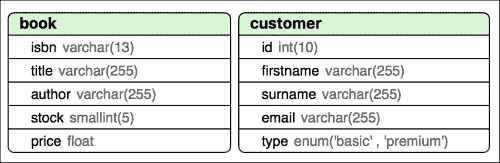
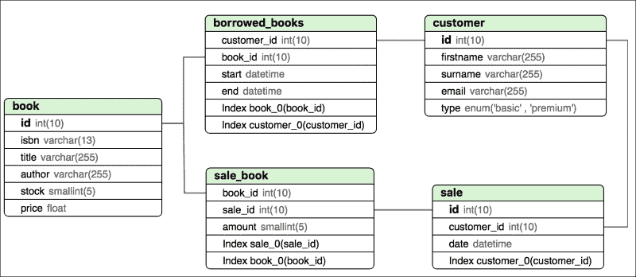

# 第五章 使用数据库

数据可能是大多数 Web 应用程序的基石。当然，你的应用程序必须很漂亮、快速、无错误，等等，但如果某些东西对用户来说是基本的，那就是你可以为他们管理的数据。从这一点我们可以得出，管理数据是你在设计应用程序时必须考虑的最重要的事情之一。

管理数据不仅意味着存储只读文件并在需要时读取它们，就像我们迄今为止所做的那样，还包括添加、检索、更新和删除单个信息片段。为此，我们需要一个工具来分类我们的数据，并使这些任务对我们来说更容易，这就是数据库发挥作用的时候。

在本章中，你将了解：

+   模式和表

+   操作和查询数据

+   使用 PDO 将您的数据库与 PHP 连接

+   索引你的数据

+   在连接的表中构建复杂查询

# 介绍数据库

数据库是管理数据的工具。数据库的基本功能是插入、搜索、更新和删除数据，尽管大多数数据库系统做的不仅仅是这些。根据它们存储数据的方式，数据库分为两个不同的类别：关系型数据库和非关系型数据库。

关系型数据库以非常详细的方式组织数据，迫使用户使用定义的格式，并允许创建不同信息片段之间的连接——即关系。非关系型数据库是存储数据方式更为宽松的系统，就像没有明显的结构一样。尽管这些非常模糊的定义可能会让你认为每个人都想使用关系型数据库，但这两个系统都非常有用；这完全取决于你如何使用它们。

在这本书中，我们将专注于关系型数据库，因为它们在小型 Web 应用程序中广泛使用，在这些应用程序中，数据量不是很大。原因是通常应用程序包含相互关联的数据；例如，我们的应用程序可以存储销售数据，这些销售数据由客户和书籍组成。

## MySQL

MySQL 长期以来一直是 PHP 开发者的首选选择。它是一个使用 SQL 作为与系统通信语言的数据库系统。SQL 在许多其他系统中也被使用，这使得在需要切换数据库或只是需要理解一个使用不同于你习惯的数据库的应用程序时，事情变得更容易。本章的其余部分将专注于 MySQL，但即使你选择不同的 SQL 系统，它也会对你有所帮助。

为了使用 MySQL，你需要安装两个应用程序：服务器和客户端。你可能还记得从第二章，*使用 PHP 的 Web 应用程序*中提到的服务器-客户端应用程序。MySQL 服务器是一个程序，它监听来自客户端的指令或查询，执行它们，并返回结果。你需要启动服务器才能访问数据库；请参阅第一章，*设置环境*，了解如何进行此操作。客户端是一个应用程序，允许你构建指令并将它们发送到服务器，你将使用它。

### 注意

**GUI 与命令行**

**图形用户界面**（**GUI**）在数据库使用中非常常见。它可以帮助你构建指令，甚至仅使用可视表格就可以管理数据。另一方面，命令行客户端强迫你手动编写所有命令，但它们比 GUI 轻便，启动速度快，并迫使你记住如何编写 SQL，这在用 PHP 编写应用程序时是必需的。此外，一般来说，几乎任何带有数据库的机器都会有一个 MySQL 客户端，但可能没有图形应用程序。

你可以选择你更舒适的一个，因为你通常会在自己的机器上工作。然而，请记住，基本的命令行知识会在许多场合救你于水火之中。

为了将客户端与服务器连接起来，你需要提供一些关于连接位置和用户凭证的信息。如果你没有自定义你的 MySQL 安装，至少你应该有一个没有密码的 root 用户，这是我们将会使用的。你可能认为这似乎是一个可怕的安全漏洞，可能确实如此，但如果你不是从服务器所在的同一台机器连接，你不应该能够使用此用户连接。在启动客户端时，你可以使用的最常见参数是：

+   `-u <用户名>`：这指定了用户——在我们的情况下，`root`。

+   `-p<密码>`：没有空格，这指定了密码。由于我们没有为我们的用户设置密码，因此我们不需要提供此信息。

+   `-h <主机>`：这指定了连接的位置。默认情况下，客户端连接到同一台机器。由于我们的情况是这样，因此不需要指定任何内容。如果你需要，你可以指定一个 IP 地址或主机名。

+   `<模式名称>`：这指定了要使用的模式名称。我们将在稍后解释这意味着什么。

根据这些规则，你应该能够使用`mysql -u root`命令连接到你的数据库。你应该得到一个非常类似于以下输出的结果：

```php
$ mysql -u root
Welcome to the MySQL monitor.  Commands end with ; or \g.
Your MySQL connection id is 2
Server version: 5.1.73 Source distribution

Copyright (c) 2000, 2013, Oracle and/or its affiliates. All rights reserved.

Oracle is a registered trademark of Oracle Corporation and/or its
affiliates. Other names may be trademarks of their respective
owners.

Type 'help;' or '\h' for help. Type '\c' to clear the current input statement.

mysql>

```

终端将显示服务器的版本以及有关如何使用客户端的一些有用信息。从现在开始，命令行将以 `mysql>` 开头，而不是您的正常提示符，这表明您正在使用 MySQL 客户端。要执行查询，只需输入查询，以分号结束，然后按 *Enter*。客户端会将查询发送到服务器，并显示其结果。要退出客户端，您可以输入 `\q` 并按 *Enter*，或者按 *Ctrl* + *D*，尽管最后一个选项将取决于您的操作系统。

# 模式和表

关系型数据库系统通常具有相同的结构。它们在不同的数据库或 **模式** 中存储数据，这些模式将不同应用程序的数据分开。这些模式只是 **表** 的集合。表是特定数据结构的定义，由 **字段** 组成。字段是基本数据类型，它定义了信息的最小组成部分，就像它们是数据的基本粒子一样。因此，模式是由字段组成的表的集合。让我们看看这些元素中的每一个。

## 理解模式

如前所述，模式或数据库——在 MySQL 中，它们是同义词——是具有共同上下文的表的集合，通常属于同一应用程序。实际上，在这方面没有限制，如果需要，您可以为同一应用程序拥有多个模式。然而，对于小型网络应用程序，正如我们的情况一样，我们只有一个模式。

您的服务器可能已经有一些模式。它们通常包含 MySQL 运作所需的元数据，我们强烈建议您不要修改它们。相反，让我们只创建我们自己的模式。模式是非常简单的元素，它们只有一个必需的名称和一个可选的字符集。名称标识模式，字符集定义字符串应遵循的类型编码或“字母表”。由于默认字符集是 `latin1`，如果您不需要更改它，则不需要指定它。

使用 `CREATE SCHEMA` 后跟模式名称，以便创建我们将用于书店的模式。名称必须具有代表性，所以让我们称它为 `bookstore`。请记住，在行尾加上分号。看看下面的例子：

```php
mysql> CREATE SCHEMA bookstore;
Query OK, 1 row affected (0.00 sec)

```

如果您需要记住模式是如何创建的，可以使用 `SHOW CREATE SCHEMA` 来查看其描述，如下所示：

```php
mysql> SHOW CREATE SCHEMA bookstore \G
*************************** 1\. row ***************************
 Database: bookstore
Create Database: CREATE DATABASE `bookstore` /*!40100 DEFAULT CHARACTER SET latin1 */
1 row in set (0.00 sec)

```

如您所见，我们以 `\G` 结束查询而不是分号。这告诉客户端以与分号不同的方式格式化响应。当使用 `SHOW CREATE` 类型的命令时，我们建议您以 `\G` 结束，以获得更好的理解。

### 小贴士

**您应该使用大写还是小写？**

当编写查询时，你可能注意到我们使用了大写字母作为关键字，小写字母作为标识符，例如模式的名称。这只是广泛使用的一种约定，以便清楚地表明什么是 SQL 的一部分，什么是你的数据。然而，MySQL 的关键字是不区分大小写的，所以你可以无差别地使用任何大小写。

所有数据都必须属于一个模式。数据不能在所有模式之外漂浮。这样，除非你指定你想要使用的模式，否则你不能做任何事情。为了做到这一点，在你的客户端启动后，使用`USE`关键字后跟模式名称。可选地，你可以在连接时告诉客户端使用哪个模式，如下所示：

```php
mysql> USE bookstore;
Database changed

```

如果你忘记了你的模式名称或者想要检查你的服务器中还有哪些其他模式，你可以运行`SHOW SCHEMAS;`命令来获取它们的列表，如下所示：

```php
mysql> SHOW SCHEMAS;
+--------------------+
| Database           |
+--------------------+
| information_schema |
| bookstore          |
| mysql              |
| test               |
+--------------------+
4 rows in set (0.00 sec)

```

## 数据库数据类型

与 PHP 一样，MySQL 也有数据类型。它们用于定义一个字段可以包含哪种类型的数据。与 PHP 一样，MySQL 在数据类型方面相当灵活，如果需要，可以将它们从一种类型转换为另一种类型。它们有很多种，但我们将解释最重要的几种。我们强烈建议如果你想要使用更复杂的数据结构来构建应用程序，请访问有关数据类型的官方文档[`dev.mysql.com/doc/refman/5.7/en/data-types.html`](http://dev.mysql.com/doc/refman/5.7/en/data-types.html)。

### 数值数据类型

数值数据可以分为整数或小数。对于整数，MySQL 使用`INT`数据类型，尽管有版本可以存储更小的数字，例如`TINYINT`、`SMALLINT`或`MEDIUMINT`，或者更大的数字，例如`BIGINT`。下表显示了不同数值类型的大小，这样你可以根据你的情况选择使用哪一个：

| 类型 | 大小/精度 |
| --- | --- |
| `TINYINT` | -128 到 127 |
| `SMALLINT` | -32,768 到 32,767 |
| `MEDIUMINT` | -8,388,608 到 8,388,607 |
| `INT` | -2,147,483,648 到 2,147,483,647 |
| `BIGINT` | -9,223,372,036,854,775,808 到 9,223,372,036,854,775,807 |

数值类型可以被定义为默认有符号或无符号；也就是说，你可以允许或不允许它们包含负值。如果一个数值类型被定义为`UNSIGNED`，那么它可以接受的数字范围会加倍，因为它不需要为负数预留空间。

对于小数，我们有两种类型：近似值，处理速度快但有时并不精确，以及精确值，可以给出小数值的精确精度。对于近似值或浮点类型，我们有`FLOAT`和`DOUBLE`。对于精确值或定点类型，我们有`DECIMAL`。

MySQL 允许你指定数字可以包含的位数和小数位数。例如，为了指定一个可以包含五个数字且最多有两个小数的数字，我们将使用 `FLOAT(5,2)` 语法。当我们在创建价格表时，你会注意到这作为一个约束是有用的。

### 字符串数据类型

尽管有几种数据类型允许你存储从单个字符到大量文本或二进制代码，但这超出了本章的范围。在本节中，我们将向你介绍三种类型：`CHAR`、`VARCHAR` 和 `TEXT`。

`CHAR` 是一种数据类型，允许你存储一个确切数量的字符。一旦你定义了字段，你需要指定字符串的长度，从这一点开始，这个字段的所有值都必须是这个长度。在我们的应用中，一个可能的用途是当存储书籍的 ISBN 时，因为我们知道它总是 13 个字符长。

`VARCHAR` 或可变字符是一种数据类型，允许你存储长达 65,535 个字符的字符串。你不需要指定它们的长度，并且可以插入不同长度的字符串而不会出现问题。当然，这种类型的动态性使得它的处理速度比前一种类型慢，但经过几次之后，你就会知道字符串的长度总是多少。你可以告诉 MySQL，即使你想插入不同长度的字符串，最大长度也将是一个确定的数字。这将有助于其性能。例如，名字的长度不同，但你可以安全地假设没有名字的长度会超过 64 个字符，因此你的字段可以定义为 `VARCHAR(64)`。

最后，`TEXT` 是一种用于存储非常长字符串的数据类型。如果你想存储用户的长期评论、文章等，可以使用它。与 `INT` 类似，这个数据类型有不同的版本：`TINYTEXT`、`TEXT`、`MEDIUMTEXT` 和 `LONGTEXT`。尽管它们在几乎任何具有用户交互的 Web 应用程序中都非常重要，但我们将不会在我们的应用中使用它们。

### 值列表

在 MySQL 中，你可以强制一个字段只能包含一组有效的值。它们有两种类型：`ENUM`，它允许正好包含一个预定义的可能值，和`SET`，它允许包含任意数量的预定义值。

例如，在我们的应用中，我们有两种类型的客户：基本和高级。如果我们想在数据库中存储我们的客户，那么有一个字段将是客户类型。由于客户必须是基本或高级之一，一个很好的解决方案是将该字段定义为枚举类型 `ENUM("basic", "premium")`。这样，我们将确保所有存储在我们数据库中的客户都将具有正确的类型。

尽管枚举（enum）的使用相当普遍，但集合（set）的使用则不太广泛。通常，使用一个额外的表来定义列表的值是一个更好的主意，正如我们在本章讨论外键时将会注意到的。

### 日期和时间数据类型

日期和时间类型是 MySQL 中最复杂的数据类型。尽管这个想法很简单，但围绕这些类型有多个函数和边缘情况。我们无法一一介绍，所以我们只解释最常见的用法，这是我们应用程序所需要的。 

`DATE`存储日期——即日、月和年的组合。`TIME`存储时间——即小时、分钟和秒的组合。`DATETIME`是日期和时间的数据类型。对于这些数据类型中的任何一种，你都可以提供一个字符串来指定值，但你需要注意所使用的格式。尽管你可以始终指定输入数据的格式，但你也可以使用默认格式输入日期或时间——例如，日期为 2014-12-31，时间为 14:34:50，日期和时间为 2014-12-31 14:34:50。

第四种类型是`TIMESTAMP`。这种类型存储一个整数，表示从 1970 年 1 月 1 日以来的秒数，也称为 Unix 时间戳。在 PHP 中，使用`now()`函数获取当前的 Unix 时间戳非常容易，并且这种数据类型的格式始终相同，因此与它一起工作更安全。缺点是它所能表示的日期范围与其他类型相比有限。

有一些函数可以帮助你管理这些类型。这些函数提取整个值的特定部分，以不同的格式返回值，添加或减去日期，等等。让我们看看它们的简要列表：

| 函数名 | 描述 |
| --- | --- |
| `DAY()`, `MONTH()`, 和 `YEAR()` | 从提供的`DATE`或`DATETIME`值中提取日、月或年的特定值。 |
| `HOUR()`, `MINUTE()`, 和 `SECOND()` | 从提供的`TIME`或`DATETIME`值中提取小时、分钟或秒的特定值。 |
| `CURRENT_DATE()` 和 `CURRENT_TIME()` | 返回当前的日期或当前的时间。 |
| `NOW()` | 返回当前的日期和时间。 |
| `DATE_FORMAT()` | 返回具有指定格式的`DATE`、`TIME`或`DATETIME`值。 |
| `DATE_ADD()` | 将指定的间隔时间添加到给定的日期或时间类型。 |

如果你对如何使用这些函数感到困惑，请不要担心；我们将在本书的其余部分作为我们应用程序的一部分来使用它们。此外，所有类型的详细列表可以在[`dev.mysql.com/doc/refman/5.7/en/date-and-time-functions.html`](http://dev.mysql.com/doc/refman/5.7/en/date-and-time-functions.html)找到。

## 管理表

现在你已经了解了字段可以采取的不同数据类型，是时候介绍表了。如*模式与表*部分所定义，表是一组字段，它定义了一种信息类型。你可以将其与面向对象编程（OOP）进行比较，将表视为类，字段是它们的属性。类的每个实例都会成为表中的一行。

在定义一个表时，你必须声明该表包含的字段列表。对于每个字段，你需要指定其名称、其类型以及根据字段类型的一些额外信息。最常见的包括：

+   `NOT NULL`：如果字段不能为 null——也就是说，如果它需要为每一行提供一个具体的有效值，则使用此选项。默认情况下，字段可以是 null。

+   `UNSIGNED`：如前所述，这用于禁止在此字段中使用负数。默认情况下，数值字段接受负数。

+   `DEFAULT <value>`：这定义了一个默认值，以防用户没有提供任何值。通常，如果没有指定此子句，默认值是 null。

表定义也需要一个名称，就像模式一样，以及一些可选属性。你可以定义表的字符集或其引擎。引擎可以是一个相当大的主题，但就本章的范围而言，让我们只注意，如果我们需要在表之间建立强大的关系，我们应该使用 InnoDB 引擎。对于更高级的读者，你可以在[`dev.mysql.com/doc/refman/5.0/en/storage-engines.html`](https://dev.mysql.com/doc/refman/5.0/en/storage-engines.html)上了解更多关于 MySQL 引擎的信息。

了解这一点后，让我们尝试创建一个将保存我们的书籍的表。表的名称应该是`book`，因为每一行将定义一本书。字段可以具有与`Book`类相同的属性。让我们看看构建表的查询将是什么样子：

```php
mysql> CREATE TABLE book(
 -> isbn CHAR(13) NOT NULL,
 -> title VARCHAR(255) NOT NULL,
 -> author VARCHAR(255) NOT NULL,
 -> stock SMALLINT UNSIGNED NOT NULL DEFAULT 0,
 -> price FLOAT UNSIGNED
 -> ) ENGINE=InnoDb;
Query OK, 0 rows affected (0.01 sec)

```

正如你所注意到的，我们可以添加更多的新行，直到我们用分号结束查询。这样，我们可以以更易读的方式格式化查询。MySQL 会让我们知道我们仍在编写同一个查询，显示`->`提示符。由于这个表包含五个字段，我们很可能需要不时地刷新我们的记忆，因为我们可能会忘记它们。为了显示表的结构，你可以使用`DESC`命令，如下所示：

```php
mysql> DESC book;
+--------+----------------------+------+-----+---------+-------+
| Field  | Type                 | Null | Key | Default | Extra |
+--------+----------------------+------+-----+---------+-------+
| isbn   | char(13)             | NO   |     | NULL    |       |
| title  | varchar(255)         | NO   |     | NULL    |       |
| author | varchar(255)         | NO   |     | NULL    |       |
| stock  | smallint(5) unsigned | NO   |     | 0       |       |
| price  | float unsigned       | YES  |     | NULL    |       |
+--------+----------------------+------+-----+---------+-------+
5 rows in set (0.00 sec)

```

我们为`stock`字段使用了`SMALLINT`，因为它非常不可能有超过几千本相同的书的副本。正如我们所知，ISBN 是 13 个字符长，我们在定义字段时强制执行了这一点。最后，`stock`和`price`都是无符号的，因为负值没有意义。现在，让我们通过以下脚本创建我们的`customer`表：

```php
mysql> CREATE TABLE customer(
 -> id INT UNSIGNED NOT NULL,
 -> firstname VARCHAR(255) NOT NULL,
 -> surname VARCHAR(255) NOT NULL,
 -> email VARCHAR(255) NOT NULL,
 -> type ENUM('basic', 'premium')
 -> ) ENGINE=InnoDb;
Query OK, 0 rows affected (0.00 sec)

```

我们已经预见到使用枚举作为字段类型，因为在设计类时，我们可以绘制一个图来标识我们的数据库内容。在这张图上，我们可以显示表及其字段。让我们看看到目前为止表格图会是什么样子：



注意，即使我们创建了与我们的类相似的表格，我们也不会为`Person`创建一个表格。原因是数据库存储数据，而这个类没有可以存储的数据，因为`customer`表已经包含了我们所需的所有信息。此外，有时我们可能会创建在代码中没有作为类的表格，因此类与表之间的关系是非常灵活的。

# 键和约束

现在我们已经定义了主表，让我们尝试思考表内的数据看起来会是什么样子。表内的每一行将描述一个对象，这个对象可能是一本书或一个客户。如果我们的应用程序有一个错误，允许我们创建具有相同数据的书籍或客户会发生什么？数据库将如何区分它们？在理论上，我们将为客户分配 ID 以避免这些场景，但我们如何强制 ID 不重复？

MySQL 有一个机制可以让你对你的数据强制执行某些限制。除了你已经看到的`NOT NULL`或`UNSIGNED`等属性之外，你可以告诉 MySQL 某些字段比其他字段更特殊，并指示它为它们添加一些行为。这些机制被称为**键**，有四种类型：主键、唯一键、外键和索引。让我们更详细地看看它们。

## 主键

主键是标识表中唯一行的字段。同一表中不能有两个相同的值，它们也不能为空。将主键添加到定义*对象*的表中几乎是必须的，因为它将确保你将始终能够通过此字段区分两行。

使主键如此吸引人的另一个部分是它们可以将主键设置为自增的数值；也就是说，你不需要为 ID 分配值，MySQL 会自动获取最新插入的 ID 并将其增加 1，就像我们使用`Unique`特性时做的那样。当然，为了实现这一点，你的字段必须是整数数据类型。实际上，我们强烈建议你始终将主键定义为整数，即使现实生活中的对象根本不具有这个 ID。原因是你应该通过这个唯一的数值 ID 来搜索行，MySQL 将为设置字段为键提供一些性能改进。

然后，让我们给我们的`book`表添加一个 ID。为了添加一个新字段，我们需要修改我们的表。有一个命令可以让你做到这一点：`ALTER TABLE`。使用这个命令，你可以修改任何现有字段的定义，添加新的字段，或者删除现有的字段。由于我们将添加的字段将成为我们的主键并且是自增的，我们可以将这些修饰符添加到字段定义中。执行以下代码：

```php
mysql> ALTER TABLE book
 -> ADD id INT UNSIGNED NOT NULL AUTO_INCREMENT 
 -> PRIMARY KEY FIRST;
Query OK, 0 rows affected (0.02 sec)
Records: 0  Duplicates: 0  Warnings: 0

```

注意命令末尾的`FIRST`。当添加新字段时，如果你想它们出现在表末尾之外的位置，你需要指定位置。可以是`FIRST`或`AFTER <other field>`。为了方便起见，表的主键是其字段中的第一个。

由于客户表已经有一个 ID 字段，我们不需要再次添加它，而是修改它。为了做到这一点，我们将使用带有`MODIFY`选项的`ALTER TABLE`命令，指定已存在字段的新的定义，如下所示：

```php
mysql> ALTER TABLE customer
 -> MODIFY id INT UNSIGNED NOT NULL
 -> AUTO_INCREMENT PRIMARY KEY;
Query OK, 0 rows affected (0.00 sec)
Records: 0  Duplicates: 0  Warnings: 0

```

## 外键

让我们想象一下，我们需要跟踪借阅的书籍。该表应包含借阅的书籍、谁借阅了它以及何时借阅。那么，您会用什么数据来识别书籍或客户？您会使用标题还是名字？嗯，我们应该使用一些可以唯一标识这些表中某一行的东西，而这个“东西”就是主键。通过这个操作，我们将消除使用可能同时指向两个或更多行的引用的风险。

然后，我们可以创建一个包含`book_id`和`customer_id`作为数值字段的表，包含引用这两个表的 ID。作为第一种方法，这是有意义的，但我们也可以找到一些弱点。例如，如果我们插入错误的 ID，并且它们在`book`或`customer`中不存在会发生什么？我们可以在我们的 PHP 端编写一些代码，确保在从`borrowed_books`获取信息时，我们只显示正确的信息。我们甚至可以有一个定期检查错误行并删除它们的例行程序，解决错误数据占用磁盘空间的问题。然而，就像在 MySQL 中使用`Unique`特性与添加主键一样，通常最好让数据库系统来管理这些事情，因为性能通常会更好，而且您不需要编写额外的代码。

MySQL 允许您创建强制引用其他表的关键字。这些被称为**外键**，这是我们被迫使用 InnoDB 表引擎而不是其他引擎的主要原因。外键定义并强制执行了该字段与另一个表中不同行的引用。如果为具有外键的字段提供的 ID 在引用表中不存在，查询将失败。此外，如果您有一个有效的指向现有书籍的`borrowed_books`行，然后您从书籍表中删除条目，MySQL 将对此提出抗议——尽管您很快就能自定义这种行为——因为这个操作会在系统中留下错误数据。正如您所注意到的，这比编写代码来管理这些情况要有用得多。

让我们创建一个包含书籍、客户引用和日期的`borrowed_books`表。请注意，我们必须在定义字段之后而不是在定义主键时定义外键，如下所示：

```php
mysql> CREATE TABLE borrowed_books(
 -> book_id INT UNSIGNED NOT NULL,
 -> customer_id INT UNSIGNED NOT NULL,
 -> start DATETIME NOT NULL,
 -> end DATETIME DEFAULT NULL,
 -> FOREIGN KEY (book_id) REFERENCES book(id),
 -> FOREIGN KEY (customer_id) REFERENCES customer(id)
 -> ) ENGINE=InnoDb;
Query OK, 0 rows affected (0.00 sec)

```

与`SHOW CREATE SCHEMA`一样，您还可以检查表的外观。此命令还会显示有关键的信息，而不是`DESC`命令。让我们看看它是如何工作的：

```php
mysql> SHOW CREATE TABLE borrowed_books \G
*************************** 1\. row ***************************
 Table: borrowed_books
Create Table: CREATE TABLE `borrowed_books` (
 `book_id` int(10) unsigned NOT NULL,
 `customer_id` int(10) unsigned NOT NULL,
 `start` datetime NOT NULL,
 `end` datetime DEFAULT NULL,
 KEY `book_id` (`book_id`),
 KEY `customer_id` (`customer_id`),
 CONSTRAINT `borrowed_books_ibfk_1` FOREIGN KEY (`book_id`) REFERENCES `book` (`id`),
 CONSTRAINT `borrowed_books_ibfk_2` FOREIGN KEY (`customer_id`) REFERENCES `customer` (`id`)
) ENGINE=InnoDB DEFAULT CHARSET=latin1
1 row in set (0.00 sec)

```

在这里要注意两个重要的事情。一方面，我们有两个额外的键我们没有定义。原因是当我们定义外键时，MySQL 也会将字段定义为将用于提高表性能的键；我们稍后会探讨这一点。另一个需要注意的元素是 MySQL 会自己为键定义名称。这是必要的，因为如果我们想更改或删除这个键，我们需要能够引用它们。你可以让 MySQL 为你命名键，或者在你创建它们时指定你喜欢的名称。

我们经营一家书店，即使我们允许顾客借阅书籍，我们也希望能够出售它们。销售是一个非常重要的元素，我们需要追踪它，因为顾客可能想要回顾它们，或者你可能只需要提供这些信息以供税务目的。与借阅不同，知道书籍、客户和日期就足够了，在这里，我们需要为销售设置 ID，以便向顾客识别它们。

然而，这个表的设计比其他表更困难，不仅仅是因为 ID。想想看：客户是一本书一本书地买书吗？还是他们更愿意一次性买任意数量的书？因此，我们需要允许表中包含未定义数量的书籍。在 PHP 中，这很简单，因为我们只需使用一个数组，但我们没有 MySQL 中的数组。这个问题有两个解决方案。

一种可能的解决方案是将销售的 ID 设置为普通整数字段，而不是主键。这样，我们就能向`sales`表中插入多行，每行对应一本借阅的书籍。然而，这个解决方案并不理想，因为我们错过了定义一个非常好的主键的机会，因为这个主键有`sales` ID。此外，我们重复了关于客户和日期的数据，因为它们总是相同的。

第二个解决方案，我们将要实施的解决方案，是创建一个作为“列表”的独立表。我们仍然会有我们的`sales`表，它将包含作为主键的销售 ID，作为外键的客户 ID 和日期。然而，我们将创建一个名为`sale_book`的第二张表，并在其中定义销售 ID、书籍 ID 和顾客购买的同一副本的书籍数量。这样，我们就可以同时拥有关于客户和日期的信息，并且我们可以在我们的`sale_book`列表表中插入所需的所有行，而不重复任何数据。让我们看看我们将如何创建这些表：

```php
mysql> CREATE TABLE sale(
 -> id INT UNSIGNED NOT NULL AUTO_INCREMENT PRIMARY KEY,
 -> customer_id INT UNSIGNED NOT NULL,
 -> date DATETIME NOT NULL,
 -> FOREIGN KEY (customer_id) REFERENCES customer(id)
 -> ) ENGINE=InnoDb;
Query OK, 0 rows affected (0.00 sec)

mysql> CREATE TABLE sale_book(
 -> sale_id INT UNSIGNED NOT NULL,
 -> book_id INT UNSIGNED NOT NULL,
 -> amount SMALLINT UNSIGNED NOT NULL DEFAULT 1,
 -> FOREIGN KEY (sale_id) REFERENCES sale(id),
 -> FOREIGN KEY (book_id) REFERENCES book(id)
 -> ) ENGINE=InnoDb;
Query OK, 0 rows affected (0.00 sec)

```

请记住，你应该始终首先创建`sales`表，因为如果你首先创建带有外键的`sale_book`表，引用一个尚未存在的表，MySQL 会抱怨。

在本节中，我们创建了三个新的表，它们是相互关联的。现在是更新表图的好时机。注意，当定义外键时，我们将字段与表相链接。看看：



## 唯一键

如你所知，主键非常实用，因为它们提供了几个功能。其中之一是字段必须是唯一的。然而，每个表只能定义一个主键，即使你可能有几个唯一的字段。为了克服这种限制，MySQL 引入了**唯一键**。它们的作用是确保字段在多行中不会重复，但它们不包含主键的其他功能，例如自动递增。此外，唯一键可以是空的。

我们的`书籍`和`客户`表包含适合作为唯一键的候选字段。书籍可能具有相同的标题，而且肯定会有不止一本书是由同一作者所著。然而，它们还有一个独一无二的 ISBN；两本不同的书不应该有相同的 ISBN。同样，即使两个客户有相同的名字，他们的电子邮件地址也总是不同的。让我们使用`ALTER TABLE`命令添加这两个键，尽管你也可以在创建表时添加它们，就像我们处理外键时那样，如下所示：

```php
mysql> ALTER TABLE book ADD UNIQUE KEY (isbn);
Query OK, 0 rows affected (0.01 sec)
Records: 0  Duplicates: 0  Warnings: 0

mysql> ALTER TABLE customer ADD UNIQUE KEY (email);
Query OK, 0 rows affected (0.01 sec)
Records: 0  Duplicates: 0  Warnings: 0

```
