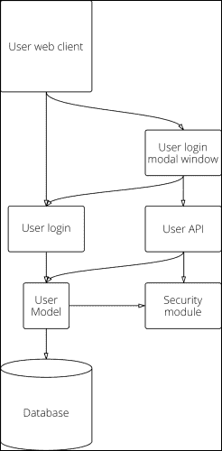
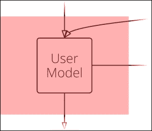
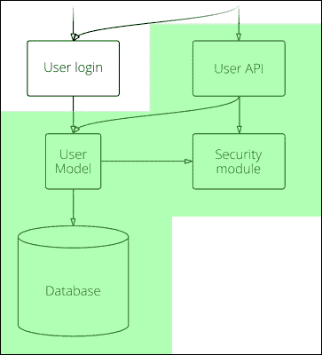
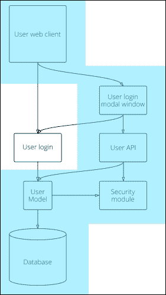
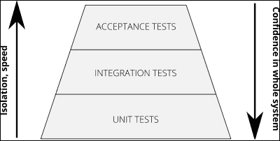

# 第二章 为测试做准备

在本章中，我们将概述 Yii 2，自上一版本以来有哪些变化，以及你可能已经熟悉的新目录结构和组织方式，以及其新特性和优点。

我们不能不介绍 **Composer**，这是在 PHP 中组织和扩展项目的新方法。

一旦我们查看完所有我们将要使用的基本工具，让我们回顾我们的计划，并考虑在这本书的其余部分我们将要做什么：用户身份验证 REST 接口和从模态窗口进行用户登录。

为了开始我们的功能开发，我们需要暂时退一步，从项目管理和质量保证的角度回顾我们的计划，也就是说，引入主测试计划。换句话说，我们需要考虑在开始实际实施工作之前，我们将要测试什么以及测试多少。

我们将按照以下步骤进行操作：

+   下载和安装 Yii 2

+   在 Yii 2 中找到你的位置

+   定义我们的工作策略

+   为我们的目的引入测试

# 下载和安装 Yii 2

如果你以前使用过 Yii，请做好准备。Yii 2 的新版本可以被视为一个全新的框架，现代且稳健。

Yii 2 在正确的方向上迈出了期待已久的一大步。这是多年来共同努力的结果，主要在互联网上协作完成，主要在 GitHub ([`github.com/yiisoft/yii2`](https://github.com/yiisoft/yii2)) 上，由来自世界各地的开发者完成。

作为 Yii 的用户，你也可以通过简单地提交错误报告、功能请求在 [`github.com/yiisoft/yii2/issues`](https://github.com/yiisoft/yii2/issues)，完善文档和翻译，以及创建新的扩展和功能以供审查和包含到项目中来进行协作。还有许多其他非官方支持的项目可以从你的支持中受益：一些已经为你准备好了使用，还有一些可能是你自己编写的。

# 环境和工作流程

作为一名开发者，你将拥有自己的环境，你需要对其有足够的信心，并且实际上它可以帮助你在编写代码时无需过多担忧。如果你确实觉得在编写代码和看到实际结果之间存在差距，那么你需要修复某些问题。

对于本书的目的来说，概述我将贯穿整个后续章节和代码示例中的最佳环境非常重要。

当然，我会注意环境可能产生的影响，但请注意，如果你的环境不同，你可能需要检查开发者的文档或联系可能知道答案的任何人，以防某些事情不起作用。

我的个人开发环境由以下组成：

+   一个强大的 **集成开发环境** （**IDE**），例如 IntelliJ PHPStorm，而不是一个简单的代码编辑器（例如，VIM）：您可以从它那里获得一些额外的优势，例如，集成的调试器、语法检查器、代码提示系统等等。

+   一个现代的版本控制系统（例如，GIT）：经常提交。这是您理解项目历史和以合理方式控制项目变更的唯一方法。如果您需要更多信息，请访问 [`git-scm.com/doc`](http://git-scm.com/doc)，并在 [`pcottle.github.io/learnGitBranching/`](http://pcottle.github.io/learnGitBranching/) 通过视觉实验来学习它。

+   **Linux Apache MariaDB PHP** （**LAMP**）虚拟机：我已经经历过将我的机器作为 LAMP 机器的阶段，但这已经证明由于许多原因而过于不可靠。主要原因是过一段时间后，您可能会混淆那些本不应该用于某些项目的实验性插件和工具，这可能会弄乱您的工作。

开发或测试环境通常设置起来很简单，因为它不会像在关键或生产环境中那样需要广泛的配置。

有这样一个环境设置的理由之一，特别是针对 LAMP 机器，就是您可以根据正在工作的项目来配置它，特别是能够尽可能接近地复现实时/生产环境。这在以下方面具有明显的优势：

+   在一个拥有多个开发者的团队中工作

+   在任何环境中（例如，测试、预发布或生产）复现出现的错误

如果您想轻松开始，Vagrant 可能是您需要的工具（见 [`www.vagrantup.com/`](http://www.vagrantup.com/)），如果您被说服了，那么尝试一下由 Michael Peacock 编写、Packt Publishing 出版的书籍《Creating Development Environments with Vagrant》可能是个不错的选择（[`www.packtpub.com/creating-development-environments-with-vagrant/book`](http://www.packtpub.com/creating-development-environments-with-vagrant/book)）。

PHP 不需要做重大调整，我相信默认的 PHP 安装就足够您开始使用，因为这是运行 Yii 2 的唯一约束。请确保您有一个等于或高于 5.4 的版本，并在命令行上有一个可用的 CLI PHP，通过以下命令执行：

```php
$ php –v
PHP 5.5.22-1+deb.sury.org~precise+1 (cli) (built: Feb 20 2015 11:25:06) 
Copyright (c) 1997-2015 The PHP Group
Zend Engine v2.5.0, Copyright (c) 1998-2015 Zend Technologies
 with Zend OPcache v7.0.4-dev, Copyright (c) 1999-2015, by Zend Technologies
 with Xdebug v2.2.5, Copyright (c) 2002-2014, by Derick Rethans

```

上述输出来自一个运行着 Ubuntu 12.04 且已安装 PHP 5.5 的 Vagrant 机器。

美元符号 (`$`) 表示该命令可以被用户运行，您不需要管理员权限来运行它。

如果您遇到“找不到命令”的错误，请务必参考您的发行版/操作系统供应商以获取有关如何安装它的支持。大多数发行版默认提供它，而其他则需要额外的配置参数或软件包。

# 介绍 Composer

如你所知，Yii 1 最初是以独立库的形式发布的，需要在目标环境中安装，然后你可以使用它的 CLI 界面来创建你的 Web 应用。之后，库将位于你的文件系统中，以便 Web 应用在加载时直接调用。

当 Yii 开始时，这是一种常见的做法；当时没有一种方法可以保持代码自包含，而且每次你需要将代码发送到共享主机环境时（我指的是 Plesk/OpenBaseDir 限制），你很容易遇到几个问题。

其次，系统范围内的包和依赖通常限制了开发者采用新特性并解决现有问题，甚至不考虑这些（过于）经常被忽视。如果你用 PHP 做 Web 开发有一段时间了，我相当肯定你体验过落后于其他大型框架在开发场景的感觉（不仅仅是在 PHP 领域）。

Composer ([`getcomposer.org`](http://getcomposer.org))从许多方面解决了问题，多亏了 Nils Adermann、Jordi Boggiano 以及许多社区贡献者的努力，它于 2012 年首次发布。

Composer 从 Node.js 的**npm**和 Ruby 的**bundler**中汲取灵感。它提供了一种定义和安装依赖项（即库）的方法，并按项目安装从 Packagist ([`packagist.org/`](https://packagist.org/))提供的 Web 应用。

## 安装和使用它

让我们从遵循 Composer 网站上提出的安装指南开始（[`getcomposer.org/doc/00-intro.md#installation-nix`](https://getcomposer.org/doc/00-intro.md#installation-nix)）。考虑以下命令：

```php
$ curl -s https://getcomposer.org/installer | php

```

在前面的命令中，我们使用`curl`下载安装程序，使用`php`解析它并输出一个名为`composer.phar`的可执行 PHP 文件。请注意，在不同的操作系统下安装可能会有所不同（如果你没有 Linux 环境可以玩），例如，在 OS X 下，Composer 是`homebrew-php`项目的一部分，可以在[`github.com/Homebrew/homebrew-php`](https://github.com/Homebrew/homebrew-php)找到。

在这一点上，你可以直接使用相对或绝对路径调用 Composer，如下所示：

```php
$ php composer.phar

```

或者将其移动到更合适的位置以便更容易调用，正如你接下来将要看到的。

如果你可以运行 sudo 或以 root 身份登录，将其移动到系统范围的`bin`文件夹，如下所示：

```php
$ sudo mv composer.phar /usr/local/bin/composer

```

如果前面的选项不适用，你可以在用户空间中安装它，例如，`~/bin/`，然后按照以下示例将路径添加到你的`PATH`环境变量中：

```php
$ mv composer.phar ~/bin/composer
$ PATH=$PATH:~/bin/; export PATH

```

最后一个命令是将路径添加到你的终端环境，这样你就可以在任何文件系统位置调用它。每次你打开终端时，都需要发出这个特定的命令。

否则，你可以永久添加它，如下所示：

```php
$ echo "export PATH=$PATH:~/bin/;" >> ~/.bashrc

```

通过将`export`语句添加到你的`.bashrc`文件中（`>> ~/.bashrc`将`echo`的输出追加到`.bashrc`文件的末尾），你只是在每次登录时自动使目录可搜索，前提是你使用的是 BASH 作为 shell 解释器。

如果你不确定你使用的是哪个 shell，你可以使用以下命令来检查：

```php
$ echo $0

```

然而，尽管这在大多数 shell 上都能正常工作，而且很容易记住，但如果你的 shell 是 CSH，则不会工作，在这种情况下，使用更复杂但更便携的`ps`调用，如下所示：命令

```php
$ ps -p $$ -o cmd=''

```

一旦你安装了 Composer，你可以简单地使用以下命令来调用它：

```php
$ composer

```

### composer.json 和 composer.lock 文件

Composer 通过读取位于项目根目录下的`composer.json`文件来工作，该文件将包含所有需求和依赖项：

```php
composer.json

{
  "require": {
    "twig/twig": "1.16.*"
  }
}
```

上述片段非常清晰：它定义了我们的项目对 Twig 的依赖（[`twig.sensiolabs.org/`](http://twig.sensiolabs.org/)）。这是一个具有清晰和紧凑语法的模板引擎。它还定义了对从 1.16 版本开始的任何版本的 Twig 的特定依赖。

手动修改`composer.json`文件可能会出现人为错误，有时，正如我们稍后将看到的，可能需要通过命令行使用以下命令将软件包添加到你的`require`或`require-dev`部分：

```php
$ composer require "twig/twig:1.16.*"

```

这样，如果`composer.json`文件不存在，它将自动创建，并且将为你安装带有其依赖项的软件包。或者，如果你自己创建了该文件，或者作为项目的一部分接收了该文件，你可以按照以下方式调用`install`命令：

```php
$ composer install
Loading composer repositories with package information
Installing dependencies (including require-dev)
 - Installing twig/twig (1.6.5)
 Downloading: 100% 

Writing lock file
Generating autoload files

```

上述命令的正常行为是从稳定源获取所需的软件包作为存档（在 Composer 术语中称为 dist），或者如果 dist 不可用或软件包处于某些非稳定阶段（例如 beta 或 dev），则通过仓库获取。

你可以通过使用`--prefer-dist`选项强制搜索 dist，即使对于开发软件包也是如此，或者使用`--prefer-source`强制从仓库而不是 dist 检查稳定软件包来更改此行为。

如你通过列出目录内容所看到的，Composer 会将所有库安装到你的项目文件夹中的`/vendor`目录下，并在根目录下创建一个`composer.lock`文件，该文件将保存安装的当前状态快照，将安装的库锁定到锁文件中定义的特定版本，如下所示：

```php
$ tree -L 2
.
├── composer.json
├── composer.lock
└── vendor
 ├── autoload.php
 ├── composer
 └── twig

```

当你分享代码时，你需要提交`composer.lock`文件，这样你团队中的每个人以及你将要部署的任何其他环境都将运行你拥有的依赖的确切版本，从而降低仅影响某些环境的 bug 风险。Composer 会首先查找锁文件，然后再决定使用 JSON 文件下载基于定义的更新版本。

另一方面，不建议将`/vendor`目录提交到你的版本控制系统中，因为它可能会引起几个问题，如下所示：

+   处理修订和更新的困难

+   仓库规模增加但没有带来任何好处

+   在 Git 中，如果你正在添加通过 Git 签出的包，可能会引起问题，因为它将它们显示为子模块，而实际上它们不是。

这在很大程度上取决于你的部署策略，但一般来说，让你的环境和团队成员各自运行`composer install`命令会更好。

如果你需要更新依赖项，你可以简单地发出以下命令：

```php
$ composer update

```

或者要更新特定的包，命令将是以下：

```php
$ composer update twig/twig [...]

```

`[...]` 表示你可以使用单个命令添加多个要更新的包。

### 包和 Packagist

通过创建`composer.json`文件，你也在定义你的项目作为一个包。这是一个依赖于其他包的包。唯一的区别是，你的项目还没有名字。

Composer 可以帮助你以更一致和清晰的方式定义你的项目/包。考虑以下命令：

```php
$ composer init

```

这将首先询问你一些关于你的项目的基本信息，包括你希望为你的项目设置的要求，然后创建（或覆盖）`composer.json`文件，如下所示：

```php
Package name (<vendor>/<name>) [peach/yii2composer]:
Description []: Installing Yii 2 from scratch with composer
Author [Matteo 'Peach' Pescarin <my@email.com>]:
Minimum Stability []: dev
License []: GPL-3.0

```

在这些中，值得注意的一个是`Minimum Stability`选项：它提供了一种控制包稳定性的方法。通过省略它，它默认为稳定。此选项与`"prefer-stable": true`（或如果你想有依赖项的开发版本，则为`false`）结合使用，将为你提供足够的权力来决定依赖项的稳定性策略，其中没有明确定义。

然后将进入设置依赖项的交互式过程，如下所示：

```php
Define your dependencies.

Would you like to define your dependencies (require) interactively [yes]?
Search for a package []: twig

Found 15 packages matching twig

 [0] twig/twig
 ...

Enter package # to add, or the complete package name if it is not listed []: 0
Enter the version constraint to require []: @dev

```

搜索可以是任何内容，它的工作方式与你通过网站搜索相同（[`packagist.org`](https://packagist.org)）。如果你想对你将要安装的内容有一个更清晰的认识，你可能想看看网站：你需要了解依赖关系并浏览代码以检查它是否如它所说的那样工作。

知道如何使用版本约束在只有少量依赖的项目中可能非常重要。根据[`getcomposer.org/doc/01-basic-usage.md#package-versions`](https://getcomposer.org/doc/01-basic-usage.md#package-versions)，以下是你需要了解的可能的关键词：

+   **精确版本**：例如，`1.0.23`

+   **范围**：例如，`>=1.2` 或 `>=1.0,<2.0` 或使用管道作为逻辑或，如`>=1.0,<2.0 | >=3.0`

+   **通配符**：例如，`1.2.*`

+   **波浪号运算符**：在这里，`~1.2` 等同于 `>=1.2,<2.0`；`~1.2.3` 等同于 `>=1.2.3,<1.3`（语义上：`[[[[...]c.]b.]a.]x`，其中 `x` 是唯一的变量）

Composer 在选择特定包时提供了更细粒度的控制，特别是你可以通过添加 `@dev`（或 `alpha`、`beta`、`RC` 或 `stable`）来按稳定性进行筛选。

有时候，你被迫使用一个不稳定版本，要么是因为没有稳定版本，要么是因为稳定版本中包含了一个在 master（dev）分支中已修复的 bug！

与定义直接依赖的基本包列表的 `require` 相反，`require-dev` 定义了用于开发的次要包，例如用于运行测试、执行调试等的库。然而，这些对于应用程序的正常运行不是基本的，如下所示：

```php
Would you like to define your dev dependencies (require-dev) interactively [yes]?

```

你也可以跳过为 `require` 添加包，然后使用以下命令稍后添加它们：

```php
$ composer require

```

对于 `require-dev`，至少在我撰写这本书的时候安装的版本，你需要手动添加它们，如开头所示。

在这个过程的这个阶段，你将能够审查在确认之前将要写入的 JSON，如下所示：

```php
{
 "name": "peach/composer",
 "description": "A Composer project",
 "require": {
 "twig/twig": "@dev"
 },
 "license": "GPL-3.0",
 "authors": [
 {
 "name": "Matteo 'Peach' Pescarin",
 "email": "my@email.com"
 }
 ],
 "minimum-stability": "dev"
}

Do you confirm generation [yes]?
Would you like the vendor directory added to your .gitignore [yes]?
$

```

一旦你创建了 `composer.json` 文件，你就可以编辑它并根据自己的喜好进行调整。还有许多其他可以指定的选项。请参阅 [`getcomposer.org/doc/04-schema.md`](https://getcomposer.org/doc/04-schema.md)。

通过编译你的 `composer.json` 文件，你实际上是在创建一个可以与其他开发者共享在 Packagist 上的包。

该过程本身并不特别困难，你只需添加一些额外的选项，如 JSON 模式文档中定义的那样（[`getcomposer.org/doc/04-schema.md#the-composer-json-schema`](https://getcomposer.org/doc/04-schema.md#the-composer-json-schema)），然后使用 Git、subversion 或 mercurial 仓库发布你的代码。你也可以选择只发布一个 dist 包。如果你想在这个方向上迈出一步，请参阅 [`getcomposer.org/doc/`](https://getcomposer.org/doc/) 中的文档以获取更多信息。

一旦你创建了 `composer.json` 文件，你就可以开始按照以下方式安装所有依赖项：

```php
$ composer install --prefer-dist

```

Composer 允许你决定如何获取所有需求，在这个特定的情况下，我们优先选择了可用的 dist 文件。结果是以下内容：

```php
Loading composer repositories with package information
Installing dependencies (including require-dev)
 - Installing twig/twig (dev-master 72aa82b)
 Downloading: 100% 

Writing lock file
Generating autoload files
$

```

## 创建你的第一个 Web 应用

在这个阶段，你应该已经对 Composer 有足够的信心，可以开始进行下一步。但在这样做之前，忘记你所学的吧！

创建一个 `composer.json` 文件并添加一系列包，任何人都可以做到。使用 Composer，你可以从一个给定的包创建一个项目。这意味着该包将被提取到指定的目录中（不再是 `/vendor`）。这个新项目将检查并保存其所有依赖项在其作用域内，即在其自己的目录中。

我们将要使用的命令的语法来安装 Yii 2 并开始使用它是以下内容：

```php
composer create-project vendor/project target-directory

```

在这里，`vendor/project` 是项目的 Packagist 名称，在我们的例子中，名称将是 `yiisoft/yii2-app-basic`，正如我们稍后将会看到的，而 `target-directory` 是你想要安装它的位置。这个命令不会创建 `composer.json` 文件，所以你可以在你的环境中的任何地方运行它，只需确保指定正确的目标路径。

Yii 2 开发者分享了两个包含你可以开始工作的初始应用的包：一个 *基本* 的和一个 *高级* 的。

两个之间的区别在于依赖的类型以及已经实现的内容。

这两个项目都附带了一个 Markdown 格式的 `README.md` 文件，你可以阅读它来了解详细信息。为了简洁起见：

+   **基本**：正如其名，这是一个基本的实现，非常接近通过安装 Yii 1 得到的结果，可以与默认的 Apache 或 Nginx 安装一起使用。

+   **高级**：如果你需要构建多层应用，这是一个非常基本的配置。你将得到的高级应用程序包括一个前端、一个后端和一个控制台应用，所有这些都是作为单独的 Yii 应用程序，并带有一些共同组件。它需要一个特定的初始化，所以请参考 `README.md` 文件以获取详细信息。

### 注意

高级应用程序包含一个名为 `init` 的附加脚本，它包装 Composer 并启用或禁用 `require-dist` 的安装。

对于更详细的指南，请查看[`www.yiiframework.com/doc-2.0/guide-tutorial-advanced-app.html`](http://www.yiiframework.com/doc-2.0/guide-tutorial-advanced-app.html)上的文档。

考虑以下命令：

```php
$ composer create-project --prefer-dist --stability=dev yiisoft/yii2-app-basic basic

```

我们现在正在将 `yiisoft/yii2-app-basic` 包安装到 `/basic`。有其他方法可以让你开始，但这绝对是我能想到的最干净的方法，因为你不会受到仓库或其他任何事物的限制。

在此命令之后不需要交互，因为它将继续安装所需的包，包括 `require-dev`。

可能在这个时候，Composer 会失败安装一些依赖项，或者你可能会在稍后遇到一些运行时错误，所以最好检查你的需求是否满足，方法是打开浏览器中的需求脚本，这将检查一切是否正常。该文件位于项目的根目录中，名为 `requirements.php`。

在 Ubuntu 上，你可能需要安装一些包，这些包是必需的，例如 `php5-mcrypt`、`php5-xsl` 和 `php5-xdebug`。每个 Linux 发行版以不同的方式提供这些 PHP 扩展，它们的命名可能也不同；如果你在如何查找、安装或配置它们方面遇到问题，请咨询你的 Linux 发行版文档。

在安装过程结束时，你会注意到一些额外的工作正在进行，如下所示：

```php
Generating autoload files
Setting writable: runtime ...done
Setting writable: web/assets ...done
Setting executable: yii ...done
$

```

如果你记得 Yii 的上一个版本，这可能是许多人都在寻找的东西。

### 注意

请注意，如果你在刚刚检出应用时运行 Composer，这些步骤需要手动复制，或者如果你已经安装了高级应用，你需要运行`init`工具。

## CLI 命令行

在 Yii 2 中，Composer 既被用作安装你的 Web 应用基本骨架的方式，这在 Yii 1 中你会使用 CLI 界面来完成，如下所示的一系列命令，也被用作管理项目依赖的方式：

```php
$ cd protected/
$ ./yiic webapp ~/public_html/myproject

```

如你所想，命令行的范围和功能现在已经相当不同，并且已经得到了扩展。

首先，CLI 现在位于项目根目录，被称为`yii`，如下所示：

```php
$ ./yii

```

只需运行前面的命令，你将得到一个可能的命令列表，如下所示：

```php
- asset     Allows you to combine and compress your JavaScript and CSS files.
- cache     Allows you to flush cache.
- fixture   Manages loading and unloading fixtures.
- hello     This command echoes the first argument that you have entered.
- help      Provides help information about console commands.
- message   Extracts messages to be translated from source files.
- migrate   Manages application migrations.

To see the help of each command, enter:

 yii help <command-name>
$

```

你会从 Yii 1 中认出的有`migrate`和`message`，它们完成了你习惯的操作，尽管一些已经得到了改进。唯一的真正区别是你将如何调用其特定操作（例如，`migrate/create`）。

现在 shell 和 Web 应用命令已被一个名为`cache`的缓存管理工具、一个名为`fixture`的固定数据创建工具（我们稍后会看到）和一个名为`hello`的演示命令所取代，你可以用它作为编写自己代码的灵感（例如，创建 cron 作业任务）。

# 在 Yii 2 中寻找方向

现在你应该已经在你盒子上安装了所有你需要的东西，所以让我们开始四处看看，了解 Yii 2 是如何组织的，这样我们就会知道在需要的时候把手放在哪里。

记住，总有一个可以咨询的`README.md`文件：在高级应用中，它将向您展示各种目录的结构和使用方法。

只需列出项目根目录的内容，你将立即发现一个很大的不同：

```php
$ tree -L 1 -d
.
├── assets
├── commands
├── config
├── controllers
├── mail
├── models
├── runtime
├── tests
├── vendor
├── views
└── web

11 directories

```

我已经自愿从`tree`命令的输出中排除了文件，只显示了目录。

看起来，曾经位于`/protected`中的所有内容现在都已移出文档根目录之外。

项目结构现在与 Django 或 Ruby on Rails 应用非常相似；项目根目录包含所有代码，其组织方式与`protected`文件夹中的方式相同（例如，控制器、模块、配置等），一些额外的目录，例如用于小部件的目录，以及你的 Web 服务器的文档根目录。

你需要配置 Apache 使用的目录被称为`web`，Yii 使用它来仅发送静态文件、资产和入口脚本，如下所示：

```php
$ tree -L 2  web
web
├── assets
├── css
│   └── site.css
├── favicon.ico
├── index.php
├── index-test.php
└── robots.txt

2 directories, 5 files

```

我倾向于喜欢这种组织方式，因为它通过降低目录的嵌套级别，立即使用户对代码的组织有了直观的了解。

如果你热衷于使用 Nginx，那不是问题，你将在官方文档中找到所需的答案，该文档可在[`www.yiiframework.com/doc-2.0/guide-start-installation.html#configuring-web-servers`](http://www.yiiframework.com/doc-2.0/guide-start-installation.html#configuring-web-servers)找到。

需要解释的两个目录是 `mail`，它用于存储电子邮件的 HTML 模板（请参阅[`www.yiiframework.com/doc-2.0/guide-tutorial-mailing.html`](http://www.yiiframework.com/doc-2.0/guide-tutorial-mailing.html)中的文档），以及可能还有 `tests` 目录，你很快就会学习到。

# 默认 Web 应用程序的结构

基本应用程序由一个`SiteController`和一些模块以及一个登录系统组成。

配置文件应该相当直观易懂，可以在`/config`目录中找到。我们将不时地涉及到它们，以便配置我们将要使用的某些方面和扩展。

无论你是使用手动安装的基本应用程序还是前面解释的 Composer 驱动方法，你都需要在你的环境中设置数据库并配置应用程序。

在配置文件`web.php`中，请确保已设置`cookieValidationKey`，而在`db.php`中，根据[`www.yiiframework.com/doc-2.0/guide-start-databases.html#configuring-a-db-connection`](http://www.yiiframework.com/doc-2.0/guide-start-databases.html#configuring-a-db-connection)中的文档设置你的数据库 DSN。

你还会在`web.php`文件的末尾注意到以下内容：

```php
// config/web.php

if (YII_ENV_DEV) {
    // configuration adjustments for 'dev' environment
    $config['bootstrap'][] = 'debug';
    $config['modules']['debug'] = 'yii\debug\Module';

    $config['bootstrap'][] = 'gii';
    $config['modules']['gii'] = 'yii\gii\Module';
}
```

默认情况下，Yii 2 会为你提供一个`YII_DEBUG`全局常量定义，以及一个环境`YII_ENV_<ENVIRONMENT>`定义，这在某些情况下可能很有用。请注意，其使用应限制在无法找到替代方案的具体情况下，无论是通过重新审视实现还是初始要求。在生产环境中，`YII_DEBUG`应设置为`false`，`YII_ENV`设置为`prod`。

## 文档和示例代码

使用这个版本，Yii 现在在代码编写和分发的方式上遵循更严格的标准。

代码的文档和可读性至关重要，主要由 PHP-FIG（[`www.php-fig.org`](http://www.php-fig.org)）发布的 PSR-1 和 PSR-2 编码风格指南决定（注意 PSR-2 明确依赖于 PSR-1）。

在 PHPStorm 中，设置代码风格相当容易。或者，你可以使用 PHP_Codesniffer ([`github.com/squizlabs/PHP_CodeSniffer`](https://github.com/squizlabs/PHP_CodeSniffer))来完成相同的任务并验证你的代码：

随意浏览代码并检查其功能。除了使用 PHP 5.4 语法糖之外，它与 Yii 1 示例应用程序并没有太大不同。

# 定义我们的工作策略

现在我们已经知道了我们将要使用的多数工具，但我们仍然不知道我们将如何使用它们。

让我们看看我们想要实现到 Yii Playground 中的功能，并分析最终应用程序的端到端结构以及我们如何满足我们的质量保证要求。

## 需要实现的关键功能

根据前几节所看到的，Yii 提供的基座 Web 应用仅包含一个基本的基础设施，你可以从中开始尝试。为了本书的目的，我们将添加一些在现实世界中通常会被客户或项目利益相关者通过简报、讨论和分析后，由内部团队安排开发的功能。

我们将遵循这些步骤，概述为满足预期质量保证水平所需进行的必要工作。

如前所述，测试的目标首先是确保我们产生的代码符合预期的需求。通常情况下，我们不会测试代码之外的内容，但这里存在例外，这实际上归结为第三方代码的行为、整体质量和可靠性。

我们的目标是修改基本应用，以便能够从模式窗口登录。

一旦确定了业务需求，如果需要，我们会将这个功能分解为子功能。

实际上，我们将采取的路径，关于如何实现模式窗口及其底层基础设施，相当重要。

从客户端视角控制窗口的代码需要与后端通信以验证和认证用户。在非常基本的层面上，这可以通过调整已经存在的处理登录过程的控制器来实现。

但我们可以做得更好。我们可以决定在不改变现有系统的情况下推出新的登录系统，从而避免引入可能影响用户的破坏性变更。如果由于某种原因，一个错误滑过了我们的控制，我们只需禁用新功能，同时仍然允许用户登录系统。

这个特定功能还引发了一系列隐含的要求，例如我们代码的安全性、可移植性以及与现有和即将到来的功能的集成。我们希望客户端的用户登录应用尽可能自包含和可重用。后端认证系统也是如此。

提出的方法如下，包括我们需要满足的高级保证标准，这将更详细地概述实施工作时的工作范围，另一方面，将帮助我们创建所需的测试：

1.  用户 REST 接口用于认证用户。

1.  模式登录窗口。

### 用户认证 REST 接口

REST 接口将定义一些易于使用的应用程序入口点。然后 URL 将具有`/resource/id/operation`的语法。

GET 操作检索信息，POST 操作将存储信息。例如，通过 POST user/login 进行登录，通过 POST user/logout 进行注销，如果用户已登录，通过 POST user/update 更新一些字段，以及通过 GET user/details 显示用户信息。

所需的通信将使用 JSON 进行。

### 从模态窗口进行用户登录

现在让我们将我们用 REST 接口所做的工作拼凑起来，并编写打开模态窗口、验证表单、将登录凭据传达给后端以及保持用户登录直到浏览器窗口关闭的 JavaScript 代码。

如前所述，代码需要是自包含和可移植的，出于安全原因，它将在任何时刻都不会处理任何敏感信息，如实际的认证。

# 为我们的目的引入测试

现在我们已经定义了要做什么，我们需要讨论需要什么样的测试以及我们想要测试多少，这基于我们在第一章中概述的方法，即《测试心态》。

我们将涵盖以下测试领域：

+   **单元测试**：这是为了实现隔离组件测试

+   **集成测试**：这是为了确保各个组件能良好地协同工作

+   **验收测试**：这些是从用户角度最相关的测试类型，因为它们试图满足最初定义的正确要求。

显然，如果我们不知道应用程序的结构，就很难理解我们将要承受什么样的工作。

因此，在定义实际测试之前，我们需要开始将应用程序分解成几个模块，并从架构的角度来审视其结构。

进行架构分解有许多方法，有些可能更严格和详细，使用文本列表，而有些可能最终只是一个使用图表的粗略草图。这很大程度上取决于应用程序的大小和复杂性，在我们的情况下，一个图表似乎更适合我们的目的。

我们需要记住，我们始终希望平衡在这些初始阶段投入的努力和时间与任何给定时刻所需的详细程度。例如，我们可能不知道模态窗口登录将如何与应用程序的其余部分交互，我们是否需要开发一个比我们开始时更复杂的用户模型，或者将其拆分成不同的组件以提供前端的不同功能，或者这超出了我们想要做的工作范围，我们可以以自包含的方式完成它。

此外，图表可能会遗漏一些小细节，我们可能会忘记测试或在评估我们的测试计划时考虑。例如，我们应用程序的 JavaScript 部分可能包括几个小型实用函数集，这些函数集应被视为独立的模块，以便于管理和重用。



我们应用程序结构的部分视图

作为解决这些问题的方法，在接近特定功能的开发时，重新审视软件模块的结构及其自身的分解总是明智的。这一点我们将在下一章中详细看到。

在前面的图表中，我们可以看到我们的应用程序主要由三个主要区域组成，从底部开始：数据存储系统（数据库）、表示数据的模型和功能部分（应用程序的视图/控制器部分）。在所有这些之上是我们的主要交互部分，即用户浏览器。这并不代表整个应用程序，而只是我们将要工作的特定区域。

正如我们之前看到的，**单元测试**的目标是测试应用程序的原子部分，例如一个类或一组相关的函数：它们的目的是要**小**和**隔离**，这意味着它们应该没有外部依赖。请记住，在 Web 开发中实现完全隔离的测试是困难的，实际上我们不允许触及我们基础设施的某些部分，例如数据库交互。这些测试在谷歌的内部术语中实际上被称为**小型测试**，这立即表明了它们的范围和运行所需的时间。

### 注意

谷歌是目前公开知名的公司之一，它们将测试视为其核心价值观之一。他们的方法不断使用形容词来区分测试的类型。

想要了解更多关于谷歌测试方式的信息，你可能对《如何谷歌测试软件》这本书感兴趣，作者为*Addison Wesley*，作者是*James Whittaker*、*Jason Arbon*和*Jeff Carollo*。

在我们的应用程序中，单元测试可以表示如下：



单元测试覆盖率的图形表示

一个实际的例子是我们将要创建的用户模型，正如之前所述，我们可能还有其他单元测试想要编写，例如在前端 JavaScript 层中，如果我们处理的是一个客户端应用程序，其中部分业务逻辑位于用户浏览器中。

只需记住，覆盖用户模型的测试不应使用任何外部依赖（例如，外部助手，如安全模块），其次，它们可以避免触及我们没有控制的框架的部分，特别是那些可能已经被其他测试覆盖的部分。

当更多地关注全局图景时，我们现在可以看到事物是如何堆叠和相互作用的。在**集成测试**中，我们可能需要使用模拟和伪造，但这并不强烈推荐，因为它们通常用于单元测试。在谷歌的术语中，这些测试被称为**中等测试**，因为它们在执行时需要更多的时间，并且在某些情况下也容易开发。



集成测试覆盖率的图形表示。

最后的拼图碎片是验收测试，如下所示：



验收测试的图形概述。

**验收测试**类似于系统测试（或端到端测试），但它们针对的是用户，而不是从工程角度整体系统的一致性。验收测试接近于可能的真实世界使用：这些测试需要确保所有组件都能良好地协同工作，并满足最初定义的验收标准，即具体行动，概述用户与应用程序的交互。

验收标准是我们之前在概述我们的功能时定义的：用户应该能够使用模态窗口登录。

我故意避免使用业务领域语言，因为我们希望在这个初始部分尽可能保持广泛，相反，我们将在稍后深入探讨。

在谷歌，验收（和端到端）测试也被称为**大型**或**巨大测试**，因为它们需要更多的时间和资源来实现和执行。它们还需要一个能够模拟真实世界场景的基础设施，这可能并不容易设置。正因为如此，创建边缘情况可能相当困难，因为这意味着我们将只测试定义的场景和我们认为对我们正在测试的区域有意义的任何特定案例。

在我们的情况下，这可能是“当用户使用错误的凭据时，将收到错误信息。”

再次强调，我们将在本书的后面部分具体探讨这些细节。

## 自上而下方法与自下而上方法的比较

重要的是要重申，行为驱动开发（BDD）是为了改进测试驱动开发（TDD）而创建的，而且是一个相当重要的改进。它提供了一个更好、更灵活的语言来定义验收标准，这也有助于定义所需的测试范围。

我们有两种方式来定义我们的测试策略和测试计划：使用自下而上（或*外部-内部*）或自上而下（或*内部-外部*）的方法，如下面的图所示：



不同尺寸测试及其益处的比较。

对于机构和初创公司来说，在试图建立和改进他们的质量保证（QA）时，从底部开始，实现单元测试并试图获得良好的覆盖率，这并不新鲜。

鼓励使用 TDD（测试驱动开发），实际上它是进入*测试心态*的第一步，通过先编写测试，然后经历*红色、绿色和重构*阶段。但它的唯一焦点在于代码，而确保它们覆盖正确数量的代码的责任则落在开发者身上。

单元测试将帮助你专注于应用程序的小而原子化的部分，而测试由于执行速度较快，将帮助你频繁地发现错误并提高开发代码的质量。你的架构和设计技能也将显著提高。

在某个时候，你会发现还有一些东西没有被测试到。随着项目的增长，手动和探索性测试的数量也会随之增长。

集成测试可以帮助你减轻这个问题，但请避免产生大量的集成测试：这些测试可能会迅速变得脆弱且难以维护，尤其是在外部依赖可能变得不同步的情况下。

接受测试将保持一切井然有序，并消除在手动测试时可以执行的重复性任务的需求。再次强调，接受测试不是探索性测试的替代品，而应专注于定义的接受标准。

如你所想，自上而下的方法给你以下优势：

1.  一个完整的解决方案，具有足够的覆盖率

1.  对测试基础设施的清晰全景图

1.  努力与开发、测试之间的良好平衡

1.  最重要的是，对系统稳固性的**信心**，如果不是坚如磐石的话。

## 要测试什么，不要测试什么

测试覆盖率的分布可能会是 100%、20%、10%，分别对应单元测试、集成测试和接受测试。在面向用户的项目中，集成和接受测试的百分比可能会相当高。

在这个背景下，理解**代码覆盖率**的含义尤为重要。

如果你还没有，你可能会遇到一些软件工程师，他们会说服你 100%的覆盖率是必不可少的，没有达到它是一种你必须在整个项目中承担的耻辱，低头看着地面因为你不是一个值得尊敬的开发者。

实现全面覆盖是一个崇高的目标，这正是我们试图达到的目标，但我们也需要现实主义者，正如之前所强调的，理解在许多情况下这是不可能的。

“要测试什么”的问题，或者说测试的范围，由我们将要开发的每个功能的接受标准来定义。

使用自上而下的方法，我们还将能够突出哪些部分需要集成测试，同时试图实现单元测试的 100%。

## 主测试计划

在这项初步规划工作的最后，你将拥有定义主测试计划所需的一切。

主测试计划是记录需要测试的范围和细节的统一方式。

您不需要过于正式，也没有特定的要求或程序需要遵循，除非您在一家大公司工作，在那里，它被认为是项目开始时由利益相关者签署的可交付成果。

在我们的情况下，它将大致由以下内容定义：

+   用户 API 实现：

    +   尽可能地进行单元测试（目标为 100%，但在某些情况下，60%到 70%被认为是可接受的）

    +   功能测试以覆盖应用程序的所有入口点

    +   明确定义的边缘情况——不良参数和/或请求（例如，GET 而不是 POST）作为客户端错误，以及服务器端错误处理（50*错误和类似）

+   从模态窗口进行用户登录：

    +   功能测试以确保我们得到正确的标记

    +   明确定义的边缘情况——例如，未指定电子邮件，没有 Gravatar 设置的电子邮件

    +   接受测试——用户点击登录按钮，模态窗口显示，用户登录，用户看到自己已登录；用户登录后，点击注销按钮，用户看到自己已注销

如您所想象，测试计划应该是一份与项目共存并活的文档，在引入新功能或更改其他功能时，根据需要扩展和修改。这一要求决定了如果想要保持一个足够简单以便在短时间内（最多 10 分钟）更新的规范文档，并且一眼就能知道每个组件和功能所隐含的风险和重要性，应遵守的一些约束。

如果您想了解更多关于这个主题的内容，我强烈建议您从**属性-组件-能力**（**ACC**）开始阅读，请参阅[`code.google.com/p/test-analytics/wiki/AccExplained`](https://code.google.com/p/test-analytics/wiki/AccExplained)。

ACC 与风险评估和缓解相结合。通过将您的组件、它们的相关能力（或功能）以及它们应提供的属性（如“安全”、“稳定”、“优雅”等）放在一个网格中，您可以立即了解您应该将测试注意力集中在哪里。对于每一行，您可以给出一个风险值，相对于其他功能。我们希望保持这个值的相对性，以避免使其过于难以计算，同时也因为在这个上下文中它是有意义的。

# 摘要

在本章中，您看到了许多重要的事情，这些是我们将在下一章中工作的基础，也是从更广泛的角度进行测试的基础：您学习了我们工作流程和环境设置的重要性，您看到了如何使用 Composer 以及如何用它来安装 Yii，最后，我们已经详细介绍了第一章中提到的概念，“测试心态”，并将它们具体化，应用到我们的特定应用程序和将要实现的功能上。

现在，在我们深入实际应用实现之前，我们首先需要了解测试套件**Codeception**，它所使用的术语，以及它将提供的各种功能，这些功能我们将在接下来的章节中使用。
