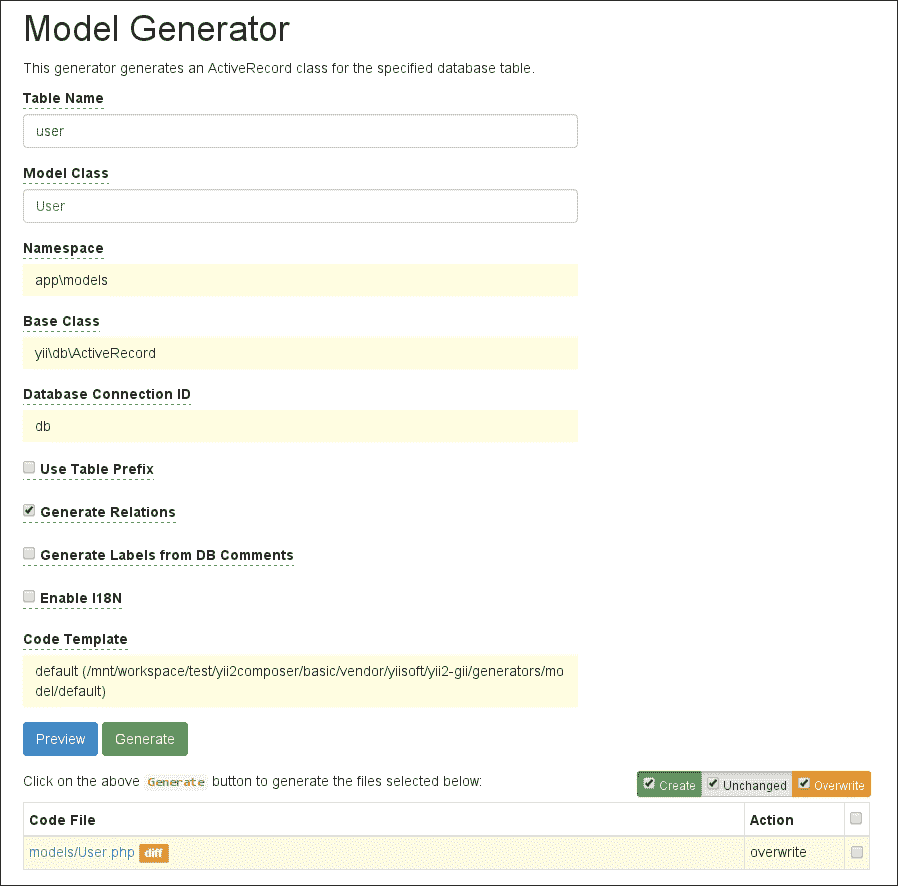

# 第四章：使用 PHPUnit 进行隔离组件测试

在本章中，我们将更深入地探讨 **PHPUnit** 以及它是如何被 Codeception 处理的。

我们将简要介绍在开始实际测试之前需要进行的更改，然后从那里开始，通过红色、绿色和重构阶段来实现测试和我们的代码，并在需要时进行重构。

我们将介绍基本主题，如隔离测试、组件的集成测试，以及更高级的主题，如 **数据提供者**。

本章涵盖了以下主题：

+   理解需要完成的工作

+   使用 `User` 模型

+   实现第一个单元测试

+   模型的组件测试

+   实现 `ActiveRecord` 类及其方法

+   看到测试通过

# 理解需要完成的工作

在我们的工作范围内，我们将首先讨论 `User` 模型，如何在 Yii 中实现认证方法，以及它将如何在我们特定的案例中使用。

然后，我们将绘制测试草图以涵盖 `User` 类的所有可能用途，重构模型，然后努力通过测试。

我们安装的框架当前状态不足以实现我们想要的功能。

如前几章所述，我们将遵循 TDD 方法进行这一部分。

# 使用 `User` 模型

让我们先看看 `User` 模型在 Yii 中的使用方式。

你可以打开位于 `/models/User.php` 的文件。

首先要注意的是，`User` 类继承自通用的 Yii `Object` 类并实现了 `IdentityInterface`：

```php
// User.php

namespace app\models;

use yii\base\Object;
use yii\web\IdentityInterface;

class User extends Object implements IdentityInterface
{
    // ...
```

`yii\base\Object` 类是所有类的父类，它实现了虚拟属性的概念，通过动态调用的 getter 和 setter 来实现，而 `yii\web\IdentityInterface` 提供了我们需要在我们的类中实现的方法签名，以提供认证机制。

你也会注意到通过私有属性 `$users`，该模型并没有连接到数据库；相反，它将所有认证数据都存储在类本身中。这是 Yii 开发者有意为之，以便无需额外努力就能使一切正常工作。这不仅减轻了如果你在应用程序中未使用任何认证时的大规模重构问题，而且如果你需要学习认证的工作原理，这也是一个好的起点。

Yii 中的认证并不特别直接，认证用户的大部分机制对我们来说是隐藏的；所以，除非你需要在你应用程序中实现某种程度的健壮性，否则你通常不必过于担心。

相反，重要的是要注意，认证信息被保存在一个对象中，与`User`模型分开。这种机制提供了一个独立且干净的安保层。从这里，认证状态被保存在一个动态加载的`\yii\web\User`类型的类中，整个应用程序的生命周期内都可以通过`Yii::$app->user`访问。例如，要检查用户是否已登录，我们可以执行以下操作：

```php
use Yii;

// check the user is logged in
if (!Yii::$app->user->isGuest) {
    // do something
}
```

这实际上在几个视图中都有使用，并且显然与 Yii 1 中的情况相似。

类似于`User`类中的`$users`变量，既有静态又有私有属性，可能会使测试我们的类变得非常困难，有时甚至不可能。

这是我们需要完全修改其定义方式的原因之一，因此`User`类从`ActiveRecord`类扩展，并直接与数据库交互。这样，我们可以利用我们可以控制的固定值，而无需在我们的测试中硬编码配置设置或参数，这可能导致测试难以维护，甚至毫无意义。

# 实现第一个单元测试

Yii 为我们提供了一个空的`UserTest`类，因此我们将从这里开始工作。前往`tests/codeception/unit/models/`并打开`UserTest.php`文件。

因此，我们现在的问题是：我们在这个阶段要实现什么？好吧，一旦我们理解了单元测试的目标，答案将会非常简单。

单元测试，以及功能测试和验收测试，是一个黑盒测试系统：测试将简单地使用对象提供的接口，并确保输出符合预期。由于实现细节的微小变化或根本性的变化并不影响接口，因此只要接口保持不变，测试仍然应该通过。

白盒测试，通过代码覆盖率提供，将确保我们覆盖了代码的所有可能分支。我们将在第八章*分析测试信息*中进一步讨论这一点。

### 小贴士

单元测试还提供了对用例的支持，这可以有效地记录你的接口的使用，无论是团队内部还是外部的人。

因此，无论我们是从头开始，添加新的测试，还是重构一些现有的测试，我们有一些规则可以帮助我们尽可能多地覆盖测试。

+   修复现有的损坏测试（如果不涉及我们的代码或工作最终超出了范围，则提出相关票据）。

+   为新的最小代码单元实现测试。

+   使测试相互独立。

+   正确命名测试。我开始使用长名称来准确理解可能出错的地方，例如，`testMyMethodThrowsAnExceptionWhenInvokedWithNoParameters()`；你可以清楚地使用任何其他命名标准，例如，使用`_`作为单词分隔符而不是驼峰式；目的是保持可读性和可维护性。

我们还希望有一些基本规则，可以保证 360 度的使用概述，这样我们就可以看到如何使用我们的组件，并立即发现其使用是否被禁止、无用或其他情况。这些规则如下：

+   覆盖类/方法/什么的正常使用（正面测试）。

+   覆盖你正在测试的任何异常功能，例如，当它返回异常时（换句话说，当它应该失败时）（负面测试）。

这可能有点令人却步，而且这个第一步可能是我所见证的最困难的一步，无论是对我自己还是对我的同事。无数次的我看到负面测试缺失，造成潜在漏洞和脆弱性的巨大差距。

不要让自己失望；正如我们在第一章《测试心态》中看到的，奖励是无价的。

一旦开始，就把自己当作测试人员，这是确保你发布的代码质量的第一步和最重要的一步，你可以通过提高你对代码的信心来看到你所取得的成就。

## 对他人代码的关心程度

你将要测试的所有代码并不都是你努力的结果。

当与 Yii 一起工作时，我们将开始测试来自 Yii 本身的代码或集成，或者更有可能的是，在现实世界的项目中，来自团队内部或外部的人。

有时候，可以说你不需要测试超出你范围的东西，有很多原因。但是，了解不测试这些功能所隐含的风险也很重要。

例如，考虑一下`User`模型的密码验证，我们将在几页后讨论：无法验证保存的密码的可能性是我们需要避免的，因为其风险可能会损害我们应用程序的整体功能，并导致用户无法登录我们的应用程序。

### 注意

如在第一章《测试心态》和第二章《为测试做准备》中所述，**属性-组件-能力**（**ACC**）可能是如果你需要了解你构建的功能相关的风险，你应该开始了解的东西。

在我们具体的情况下，我们的测试将集中在父类和接口提供的功能片段上，例如以下内容：

+   验证 `User` 模型（这显然是必要的，因为它是立即由 `save()` 方法触发的功能）。

+   将 `User` 模型保存到数据库中。

+   覆盖我们将从接口实现的基本函数用法。

以下内容就足够说明，在某些情况下，这可能会超出范围。如果我们从 BDD 视角的更高层次抽象考虑，我们感兴趣的测试将是与 `User` 类的交互，例如从数据库中读取以及它将被其他组件如何使用。

# 模型的组件测试

测试模型的验证以及任何进一步的数据操作，直到它到达数据库并返回，是 Yii 确保模型实现了清晰和明确验证规则的基本步骤。这在防止客户端在与系统交互时传递额外或错误的数据时非常有用。

如果你关心安全性，这可能需要你进一步调查，如果你还没有这样做的话。

### 小贴士

我想强调我们在前面的声明中采取的立场：我们采取的是消费者/客户端视角。在这个特定时刻，我们不知道事情将如何实现，所以最好专注于模型的使用。

因此，让我们回到 `/tests/codeception/unit/models/UserTest.php`：该文件应该已经存在，它大致是你运行以下命令得到的内容：

```php
$ ../vendor/bin/codecept generate:phpunit unit models/UserTest
Test was created in /var/www/vhosts//htdocs/tests/unit/UserTest.php

```

目前，如果你运行这个命令，你将得到一个需要稍作修改的测试，以便我们能够使用 Yii 基础设施。特别是，你需要将你的测试扩展的类更改为以下内容：

```php
// tests/codeception/unit/UserTest.php
namespace tests\codeception\unit\models;

use yii\codeception\TestCase;

class UserTest extends TestCase
{
}
```

换句话说，我们需要使用提供的 `\yii\codeception\TestCase` 类，而不是 PHPUnit 默认的 `\PHPUnit_Framework_TestCase` 类。

因此，让我们首先在我们的 `tests\codeception\unit\models\UserTest` 类中草拟一些测试：

```php
// tests/codeception/unit/models/UserTest.php

public function testValidateReturnsFalseIfParametersAreNotSet() {
    $user = new User;
    $this->assertFalse($user->validate(), "New User should not validate");
}

public function testValidateReturnsTrueIfParametersAreSet() {
    $configurationParams = [
        'username' => 'a valid username',
        'password' => 'a valid password',
        'authkey' => 'a valid authkey'
    ];
    $user = new User($configurationParams);
    $this->assertTrue($user->validate(), "User with set parameters should validate");
}
```

如你所见，知道要测试什么需要对 Yii 的工作方式有所了解。所以，如果你不知道事情应该如何工作，实际上第一个测试草图完全错误可能是完全正常的。

在前面的代码片段中，我们定义了两个测试；第一个是我们称之为 *负面* 的，第二个是 *正面* 的。

### 小贴士

请注意，向各种断言命令传递第二个参数将有助于你在测试失败时进行调试。编写一个描述性和有意义的消息可以节省时间。

### 注意

在本书的代码片段中，各种断言方法的第二个参数将不会传递，以使代码片段更加紧凑。

## PHPUnit 的测试内容

在我们继续进行其他测试之前，让我们回顾一下到目前为止我们所拥有的内容：测试文件是一个以 `<Component>Test` 格式命名的类，它收集了我们想要测试的组件的所有测试；类的每个方法是对特定功能的测试，无论是正面还是负面。

类中的每个方法/测试至少应包含一个断言，PHPUnit 提供了一系列断言语句，你可以触发它们来断言实际值与预期值匹配，以及用于期望特定异常的方法。

这些方法由父类 `TestCase` 提供。你可以在 [`phpunit.de/manual/current/en/appendixes.assertions.html`](https://phpunit.de/manual/current/en/appendixes.assertions.html) 获取完整的列表。

一些基本的断言如下：

+   `assertTrue(actualValue)` 和其对立面 `assertFalse(...)`

+   `assertEquals(expectedValue, actualValue)` 和其对立面 `assertNotEquals(...)`

+   `assertNull(actualValue)`

你的测试结果基于这些方法的输出。你也应尽量避免将一些断言包裹在一个或多个条件中。仔细思考你试图实现的目标以及你实际上在测试的内容。

对于异常，你需要使用一些文档注释：

### 注意

PHPUnit 广泛使用文档注释来覆盖通常无法通过测试断言实现的功能。

除了我们将要看到的内容之外，还有很多其他功能，例如使用 `@depends`、`@before` 和 `@after` 测试依赖项或使用 `@group` 进行分组。

你可以使用 [`phpunit.de/manual/current/en/appendixes.annotations.html`](https://phpunit.de/manual/current/en/appendixes.annotations.html) 查看你可以使用的完整注释列表。

考虑以下示例：

```php
/**
 * @expectedException yii\base\InvalidParamException
 */
public function 
testValidatePasswordThrowsInvalidParamExceptionIfPasswordIsIncorrect() {
    $user = new User;
    $user->password = 'some password';

    $user->validatePassword('some other password');
}
```

除了 `@expectedException` 之外，你还可以使用 `@expectedExceptionCode` 和 `@expectedExceptionMessage`，以防你需要确保异常的内容是你期望的。

另一种实现方式是使用 `setExpectedException()` 方法，当需要处理更复杂的异常情况时，这可能会提供更高层次的可灵活性。

### 小贴士

虽然非常通用，但在将不同类型传递给具有类型形式参数的方法或尝试使用 `@expectedException PHPUnit_Framework_Error` 包含一个不存在的文件时，我们也可以期望出现特定于语言的错误。

一旦掌握了你的类、模型和方法的使用方式，PHPUnit 中的断言测试就相当直接。

此外，PHPUnit 还提供了一些巧妙的功能来帮助我们加快测试速度并解决一些复杂性。数据提供者、固定值、存根和模拟将在后续章节和 第五章 中介绍，*召唤测试替身*。

## 测试继承自 IdentityInterface 的方法

现在我们知道了启动所需的一切，我们通常会决定实现规则，使 `testValidateReturnsTrueIfParametersAreSet()` 和 `testValidateReturnsTrueIfParametersAreNotSet()` 测试通过，尽管在这个场合，似乎继续草拟我们稍后需要实现的其他方法要容易得多，例如 `getId()`、`getAuthKey()`、`validateAuthKey()`、`findIdentity()` 和 `findIdentityByAccessToken()`，以及两个已经实现并使用的方法，即 `validatePassword()` 和 `findByUsername()`，这两个方法都由 `LoginForm` 模型使用。

我们可以立即决定去除最简单的方法来覆盖。我们不会使用访问令牌，并且通常，如果我们不是被迫通过接口实现该方法，我们就可以避免这部分。在这种情况下，相反，我们需要整理并最好通过从方法中抛出 `NotSupportedException` 并期望这种异常来记录缺失的功能：

```php
/**
 * @expectedException yii\base\NotSupportedException
 */
public function testFindIdentityByAccessTokenReturnsTheExpectedObject()
{
    User::findIdentityByAccessToken('anyAccessToken');
}
```

按照这种方法，我们测试 `getId()`：

```php
public function testGetIdReturnsTheExpectedId() {
    $user = new User();
    $user->id = 2;

    $this->assertEquals($expectedId, $user->getId());
}
```

我们可以使用完全相同的逻辑来测试 `$user->getAuthkey()`。

对于 `findIdentity()`，我们可以做以下操作：

```php
public function testFindIdentityReturnsTheExpectedObject() {
    $expectedAttrs = [
        'username' => 'someone',
        'password' => 'else',
        'authkey' => 'random string'
    ];
    $user = new User($expectedAttrs);

    $this->assertTrue($user->save());

    $expectedAttrs['id'] = $user->id;
    $user = User::findIdentity($expectedAttrs['id']);

    $this->assertNotNull($user);
    $this->assertInstanceOf('yii\web\IdentityInterface', $user);
    $this->assertEquals($expectedAttrs['username'], $user->username);
    $this->assertEquals($expectedAttrs['password'], $user->password);
    $this->assertEquals($expectedAttrs['authkey'], $user->authkey);
}
```

使用 `findIdentity()`，我们想确保返回的对象是我们期望的，因此我们的断言确保：

1.  已检索到一条记录

1.  它属于正确的类别（`IdentityInterface` 是在认证时与用户交互的大多数方法期望它成为的类型）

1.  它包含我们在创建时传递的内容

## 使用数据提供者以获得更多灵活性

`findIdentity()` 的负面测试相当直接：

```php
public function testFindIdentityReturnsNullIfUserIsNotFound() {
    $this->assertNull(User::findIdentity(-1));
}
```

实现这样的测试可能会引起一些疑问，因为我们硬编码了一个值 `-1`，这可能不代表任何实际的真实世界案例。

最好的方法就是使用 **数据提供者**，它可以为我们提供一系列值，这些值应该能让测试通过。这非常方便，因为我们可以在进行回归测试现有功能时定制边缘情况：

```php
/**
 * @dataProvider nonExistingIdsDataProvider
 */
public function testFindIdentityReturnsNullIfUserIsNotFound(
    $invalidId
) {
    $this->assertNull(User::findIdentity($invalidId));
}

public function nonExistingIdsDataProvider() {
    return [[-1], [null], [30]];
}
```

在数据提供者中，每个二级数组是对请求函数的调用，这些数组的内容是方法的实际参数的有序列表。

因此，在我们的前一个例子中，测试将连续调用时接收到 `-1`、`null` 和 `30`。

如果我们要为我们的初始测试 `testFindIdentityReturnsTheExpectedObject()` 使用数据提供者，我们可以测试用户名是否包含 UTF-8 或无效字符，例如。

因此，使用数据提供者是一件好事！它赋予我们使用单个测试来检查更复杂情况的能力，这些情况需要一定程度的灵活性。

但问题来了：在所有测试中使用的数据库（使用 `$user->save()`）将继续增长，因为没有指令告诉它这样做。

因此，我们可以在 `setUp()` 函数中添加以下内容：

```php
// tests/codeception/unit/models/UserTest.php

protected function setUp()
{
    parent::setUp();
    // cleanup the User db
    User::deleteAll();
}
```

记得清理自己的工作：您可能会影响其他人的测试。目前，由于 `deleteAll()` 调用的存在，我们一切正常。

`setUp()` 函数在每个测试开始之前被调用。PHPUnit 提供了多层方法来在单个或多个测试之前设置一些东西，并在测试之后撤销它们。调用顺序可以用以下内容总结：

```php
tests\codeception\unit\models\UserTest::setUpBeforeClass();
   tests\codeception\unit\models\UserTest::_before();
      tests\codeception\unit\models\UserTest::setUp();
         tests\codeception\unit\models\UserTest::testSomething();
      tests\codeception\unit\models\UserTest::tearDown();
   tests\codeception\unit\models\UserTest::_after();
tests\codeception\unit\models\UserTest::tearDownAfterClass();
```

在这里，`setUpBeforeClass()` 是在类实例化之前可能的最外层调用。请注意，`_before` 和 `_after` 是 Codeception `TestCase` 方法，而其余的是标准的 PHPUnit 方法。

既然我们在这里，我们也可以添加一个测试范围的 `User` 类，它将在每个测试之前实例化；它可以被我们的任何测试使用。为了实现这一点，我们需要添加一个私有变量，并在需要的地方添加相关语句：

```php
// tests/codeception/unit/models/UserTest
/** @var User */
private $_user = null;

protected function setUp()
{
    parent::setUp();
    // setup global User
    $this->_user = new User;
    // cleanup the User db
    User::deleteAll();
}
```

现在，我们只需要修改相关的测试，在需要时使用 `$this->_user`。

### 小贴士

尽量使私有变量和方法清晰可见；这也有助于您避免命名冲突，正如我们在介绍固定配置时将看到的。

## 使用固定配置准备数据库

正如我们所看到的，数据提供者解决方案可以帮助您每次运行相同的测试时使用不同的数据集，这最终变得极其有用。另一个可能互补的解决方案是使用固定配置，让您预加载一些定义良好的数据，并使测试更加简单。这意味着您可以在不依赖于 `$user->save()`（这不是测试本身的一部分）的情况下测试 `User::findIdentity()` 方法。

固定配置用于将数据库设置在固定/已知的状态，以便您的测试可以在受控环境中运行。在这个过程中，我们也将消除在 `setUp` 函数中删除所有用户或依赖于可能受先前运行测试影响的静态值的需求。

固定配置只是一个在 `setUp()` 方法中动态加载的类，您只需创建固定配置类和数据库的实际内容即可。

让我们从创建固定配置类开始：

```php
// tests/codeception/unit/fixtures/UserFixture.php
namespace app\codeception\tests\unit\fixtures;

use yii\test\ActiveFixture;
class UserFixture extends ActiveFixture
{
    public $modelClass = 'app\models\User';
}
```

在这种情况下，我们扩展了 `ActiveFixture`，因为它将提供一些可能有用的附加功能，所以我们唯一需要做的是定义它将模拟的模型。对于登录表单或其他自定义模型，另一种选择是扩展 `yii\test\Fixture`，在那里您必须使用公共属性 `$tableName` 定义表名。使用 `ActiveFixture`，只需定义 `$className`，固定配置就会自己确定表名。

下一步是定义实际要填充到数据库中的内容所对应的固定配置。默认情况下，Yii 将尝试在 `fixtures/data/` 文件夹中查找名为 `<table_name>.php` 的文件。固定配置只是一个返回数组的语句，例如以下内容：

```php
// tests/codeception/unit/fixtures/data/user.php

return [
    'admin' => [
        'id' => 1,
        'username' => 'admin',
        'password' => Yii::$app->getSecurity()->generatePasswordHash('admin'),
        'authkey' => 'valid authkey'
    ]
];
```

固定装置的每个条目都可以被键索引，以便在测试中快速引用。你通常也不需要指定主键，因为它们将自动创建，就像在`ActiveRecord`的情况下。

作为最后一步，我们需要实现`fixtures()`方法来定义我们想要在测试中使用的固定装置。为此，我们可以使用以下代码：

```php
// tests/codeception/unit/models/UserTest.php

public function fixtures() {
    return [
        'user' => UserFixture::className(),
    ];
}
```

通过这样做，我们的`setUp()`方法将使用我们刚刚定义的固定装置的内容初始化数据库。如果我们需要为同一个固定装置类使用多个固定装置，那么我们可以在当前测试中指定要加载哪个固定装置，同时返回一个`dataFile`键，指定固定装置的路径，如下例所示：

```php
public function fixtures()
{
    return [
        'user' => [
            'class' => UserFixture::className(),
            'dataFile' => '@app/tests/codeception/unit/fixtures/data/userModels.php'
        ]
    ];
}
```

现在我们已经定义了固定装置并准备好使用，我们可以通过`$this->user`变量（现在你可以看到为什么最好将私有和公共变量定义得很好并分开）来访问其内容。你可以通常将其用作数组并访问所需的索引或键，或者让它返回一个`ActiveRecord`对象，就像`$this->user('admin')`。

现在，我们可以通过重构我们之前实现的测试来看到它的实际效果：

```php
public function testFindIdentityReturnsTheExpectedObject() {
    $expectedAttrs = $this->user['admin'];

    /** @var User $user */
    $user = User::findIdentity($expectedAttrs['id']);

    $this->assertNotNull($user);
    $this->assertInstanceOf('yii\web\IdentityInterface', $user);
    $this->assertEquals($expectedAttrs['id'], $user->id);
    $this->assertEquals($expectedAttrs['username'], $user->username);
    $this->assertEquals($expectedAttrs['password'], $user->password);
    $this->assertEquals($expectedAttrs['authkey'], $user->authkey);
}
```

这样，我们就可以继续我们的测试，而不用担心每次需要确保记录在数据库中时都要调用`save()`。

这也意味着我们不需要清理数据库，因为固定装置会为我们完成这项工作：

```php
protected function setUp()
{
    parent::setUp();
    $this->_user = new User;
}
```

根据我们刚才说的，实现`findByUsername()`的测试应该相当简单，就像我们为`findIdentity()`做的那样。所以，我将把它留给你作为练习。

## 添加剩余的测试

到目前为止，我们应该已经创建了几乎所有测试，除了覆盖`validateAuthKey()`的测试，你应该能够没有特别的问题实现它，以及`validatePassword()`，我们将在第五章中更详细地探讨，*召唤测试替身*。

# 实现 ActiveRecord 类及其方法

现在，我们可以在通过类的实现之前尝试测试，并看到它们没有通过。所以，只需运行以下命令，就像我们在上一章中学到的那样：

```php
$ cd tests
$ ../vendor/bin/codecept run unit

```

很可能，前面的命令会失败，并出现以下错误：

```php
PHP Fatal error:  Call to undefined method app\models\User::tableName()

```

这是因为我们的类尚未被重新生成为`ActiveRecord`。

在下一节中，我们将开始使测试通过的工作，从迁移开始，将一些信息移动到数据库中，并从这里继续前进。

## 处理迁移

因此，最好的下一步是定义一个用户表，填充我们所需的数据，然后在上面实现用户模型，并使用接口中所需的方法。

### 注意

关于迁移还有很多要说的，关于它的文档正在不断改进和扩展。请确保前往并亲自阅读[`www.yiiframework.com/doc-2.0/guide-db-migrations.html`](http://www.yiiframework.com/doc-2.0/guide-db-migrations.html)。

让我们从创建迁移开始：

```php
$ ./yii migrate/create table_create_user
Yii Migration Tool (based on Yii v2.0.0-dev)

Create new migration '/var/www/vhosts/htdocs/migrations/m140906_172836_table_create_user.php'? (yes|no) [no]:yes
New migration created successfully.
$

```

现在我们有了迁移，让我们根据需要实现`up()`和`down()`方法：

```php
// migrations/m140906_172836_table_create_user.php

class m140906_172836_table_create_user extends Migration
{
    public function up()
    {
        $this->createTable('user', [
            'id' => 'pk',
            'username' => 'varchar(24) NOT NULL',
            'password' => 'varchar(128) NOT NULL',
            'authkey' => 'varchar(255) NOT NULL',
            'accessToken' => 'varchar(255)'
        ]);

        $this->insert('user', [
            'username' => 'admin',
            'password' => Yii::$app->getSecurity()->generatePasswordHash('admin'),
            'authkey' => uniqid()
        ]);
    }

    public function down()
    {
        $this->dropTable('user');
    }
}
```

我们使用 Yii 提供的 Security 组件来创建密码。还有很多其他相当方便的功能，可以避免重新发明轮子。

请注意，正确实现`down()`方法并在推送更改之前进行测试非常重要，因为如果你需要回滚到应用程序的先前状态，即所谓的**回滚**，它将是基础。

### 小贴士

除了`up()`和`down()`之外，你还可以使用`safeUp()`和`safeDown()`，这将允许你使用事务来运行迁移上下文，这意味着在出现错误的情况下，所有先前的操作将自动回滚。

迁移的实现和使用方式与 Yii 1 的情况相同，如果你以前从未使用过它们，它们是伟大的工具，因为它们让你能够定义在部署应用程序时容易错过的特定步骤。所使用的语法也应该相当直观易懂，方法也是自我解释的：`createTable()`、`renameColumn()`、`addForeignKey()`等等。

现在我们已经设置了迁移，是时候通过运行以下命令来应用它：

```php
$ ./yii migrate/up
Yii Migration Tool (based on Yii v2.0.0-dev)

Creating migration history table "migration"...done.
Total 1 new migration to be applied:
 m140906_172836_table_create_user
Apply the above migration? (yes|no) [no]:yes
*** applying m140906_172836_table_create_user
 > create table user ... done (time: 0.022s)
 > insert into user ... done (time: 0.008s)
*** applied m140906_172836_table_create_user (time: 0.585s)
Migrated up successfully.

```

现在我们已经在数据库中有了结构和数据，我们可以开始根据需要重构模型。

## Gii 代码生成工具

Yii 持续提供并改进其代码生成工具系统，特别是**Gii**。Gii 是一个代码生成器，它可以帮助你创建模型、控制器、CRUD、模块等的基本代码结构，这样你就不必过多考虑需要做什么，而是尽可能快地进入实现部分。

我们所使用的基本应用程序包含 Gii（并且它被定义为`require-dev`包）。由于在我们的情况下我们在（虚拟）托管环境中运行测试，我们需要稍微调整一下配置；我们需要允许我们的客户端 IP 访问该工具：

```php
// config/web.php

if (YII_ENV_DEV) {
    // ...
    $config['bootstrap'][] = 'gii';
    $config['modules']['gii'] = [
        'class' => 'yii\gii\Module',
        'allowedIPs' => ['127.0.0.1', '::1', '192.168.56.*'],
    ];
}
```

如果你使用 VirtualBox，则`192.168.56.*`应该是默认情况。

现在我们已经做出了这个改变，我们可以将浏览器导航到`http://basic.yii2.sandbox/gii`。从那里，我们可以点击**模型生成器**部分，在那里我们可以创建新的模型，如下面的截图所示：



模型生成器接口

当点击 **预览** 按钮时，Gii 会首先检查要生成的文件是否已经存在，并给我们机会在真正点击 **生成** 按钮之前查看差异并决定是否要覆盖文件。

由于我们的 `User` 模型目前非常简单，我们不会在覆盖它并重新实现所需的方法时遇到任何问题。只需记住勾选 **覆盖** 复选框并点击 **生成**。否则，你可以根据以下段落中给出的提示相应地调整它。

点击 **生成** 后，你应该能够在页面底部看到 **代码已成功生成** 的提示。

现在，让我们回到我们的 `User.php` 类，看看有什么变化，并完善实现。

首先，我们会注意到该类现在继承自 `ActiveRecord` 类；这是面向数据库的模型的默认类。已经实现了一系列默认方法，我们不需要修改。我们真正需要的是使该类实现 `IdentityInterface`，如下所示：

```php
// models/User.php

use Yii;
use yii\db\ActiveRecord;
use yii\web\IdentityInterface;

class User extends ActiveRecord implements IdentityInterface
{
```

现在，在类的末尾实现 `IdentityInterface` 的五个必需方法：

```php
// models/User.php

/**
 * @inheritdoc
 */
public static function findIdentity($id) {
    return self::findOne($id);
}
```

如我们所见，在数据库中查找记录的方式非常直接，因为 `ActiveRecord` 提供了一些非常巧妙且易于理解的方法来与数据库交互。我们将在接下来的几页中看到许多这样的用例。

值得注意的是，`findIdentity()` 返回一个 `IdentityInterface` 对象。我们之前覆盖的实现调用了 `new static()`，这反过来触发了来自 `yii\base\Object` 类的魔法方法 `__construct()`。

### 注意

`new static()` 方法自 PHP 5.3 起就可用，提供了一种从父类静态实例化子类的方法，这在之前是不可能的。这种方法被称为 **后期静态绑定**。

更多信息可以在 PHP 手册中找到，链接为 [`php.net/manual/en/language.oop5.late-static-bindings.php`](http://php.net/manual/en/language.oop5.late-static-bindings.php)。

如前所述，`findIdentityByAccessToken` 不需要，因为 `accessToken` 在我们的代码中不会用到，所以让我们来实现它：

```php
public static function findIdentityByAccessToken($token, $type = null) {
    throw new NotSupportedException('Login by access token not supported.');
}
```

接口中的剩余三个方法应该很容易实现和理解，为此，我们可以使用以下代码：

```php
public function getId() {
    return $this->id;
}

public function getAuthKey() {
    return $this->authkey;
}

public function validateAuthKey($authKey) {
    return $this->authkey === $authKey;
}
```

接口中没有包含的明显方法中，有几个在 `LoginForm.php` 中使用；其中一个是 `findByUsername`，具体如下：

```php
/**
 * Finds user by username
 *
 * @param  string      $username
 * @return static|null
 */
public static function findByUsername($username)
{
    return self::findOne(['username' => $username]);
}
```

另一个方法是 `validatePassword`，具体如下：

```php
/**
 * Validates password
 *
 * @param  string  $password password to validate
 * @return boolean if password provided is valid for current user
 */
public function validatePassword($password)
{
    return Yii::$app->getSecurity()->validatePassword($password, $this->password);
}
```

在这里，我们再次使用来自安全组件的 `validatePassword()` 方法，这使得使用加密和任何我们想要添加的额外安全级别对用户来说变得透明。

# 看到测试通过

如你所猜，又是时候运行 Codeception 对我们的 `UserTest` 类进行测试了：

```php
$ ../vendor/bin/codecept run unit models/UserTest.php
Codeception PHP Testing Framework v2.0.6
Powered by PHPUnit 4.4-dev by Sebastian Bergmann.

Unit Tests (14) -----------------------------
Trying to test validate returns false if parameters are not set (tests\codeception\unit\models\UserTest::testValidateReturnsFalseIfParametersAreNotSet)                              Ok
[snip]

Time: 3.61 seconds, Memory: 28.75Mb

OK (27 tests, 53 assertions)

```

你应该能够通过所有测试而没有任何问题，并且你应该也能够在出现错误时修复它们。

如果我们决定运行所有测试，包括那些已经存在的测试，我们可能会看到一些测试不再通过。不用担心，这是很正常的，因为我们已经改变了 `User` 模型的工作方式和内部行为。特别是，我得到的错误是关于 `LoginFormTest` 的，但 Codeception/PHPUnit 在告诉我们出了什么问题方面非常迅速：

```php
There was 1 error:

---------
1) tests\unit\models\LoginFormTest::testLoginCorrect | user should be able to login with correct credentials
yii\base\InvalidParamException: Hash is invalid.

FAILURES! 
Tests: 31, Assertions: 64, Errors: 1.

```

正如我之前强调的，修复任何表现不佳的测试非常重要。这将使我们了解是否触及了不应该破坏或在我们提交更改时可能破坏的内容。

## 使用全局固定文件

在这种情况下，很明显我们的测试已经影响了数据库的状态：解决方案将能够创建一个新的固定文件，其中包含管理员用户的预期数据，这复制了迁移所做的工作，并更新 `LoginFormTest` 和 `UserTest`。

我们现在将使用默认的固定文件 `user.php` 作为具有管理员用户的全局固定文件，如下所示：

```php
// tests/codeception/unit/fixtures/data/user.php

return [
    'admin' => [
        'id' => 1,
        'username' => 'admin',
        'password' => Yii::$app->getSecurity()->generatePasswordHash('admin'),
        'authkey' => 'valid authkey'
    ]
];
```

之前的固定文件将被重命名为 `userModels.php`；它包含我们可能最终添加到应用程序中的额外用户。执行此操作的代码如下：

```php
return [
    'user_basic' => [
        'username' => '-=[ valid username ]=-',
        'password' => 'This is a valid password!!!',
        'authkey' => '00%am|%lk;@P .'
    ],
    'user_accessToken' => [
        'username' => '-=[ valid username ]=-',
        'password' => 'This is another valid password!!! :) <script></script>',
        'authkey' => uniqid()
    ],
    'user_id' => [
        'id' => 4,
        'username' => '-=[ valid username ]=-',
        'password' => 'This is another valid password!!! :)',
        'authkey' => uniqid()
    ],
];
```

我们本可以陷入仅仅修改初始固定文件以包含管理员用户的陷阱，这会解决问题但会使多个测试依赖于为特定测试设计的固定文件。所以，让我们尽量保持事物尽可能分离和独立。

现在，我们可以在 `LoginFormTest` 中将之前提到的固定文件作为全局固定文件加载，如下所示：

```php
// tests/codeception/unit/models/LoginFormTest.php

public function globalFixtures()
{
    return [
        'user' => UserFixture::className(),
    ];
}
```

此外，我们可以修改之前实现的方法，在 `UserTest` 中加载固定文件，如下所示：

```php
// tests/codeception/unit/models/UserTest.php

public function globalFixtures()
{
    return [
        'user' => UserFixture::className(),
    ];
}

public function fixtures()
{
    return [
        'user' => [
            'class' => UserFixture::className(),
            'dataFile' => '@app/tests/codeception/unit/fixtures/data/userModels.php'
        ]
    ];
}
```

我们新的 `fixtures()` 实现需要扩展传递的参数并定义 `class` 和 `dataFile`；否则，它将无法正确加载。

`globalFixtures()` 方法在 `fixtures()` 方法之前运行，这意味着 `$this->user` 变量将只包含最新的固定文件，而不是管理员。

# 摘要

我们讨论了许多关于 PHPUnit 的事情，例如断言、数据提供者和固定文件。我们看到了如何使测试通过以及如何预防性地捕获可能导致更大问题的错误。

你可以在 Codeception 单元测试和 PHPUnit 中发现更多东西，但到目前为止我们所看到的应该足以给你开始创建清晰测试所需的信心。

在下一章中，我们将看到如何测试依赖于外部代码和类的组件，以便使用存根和模拟来获得最佳控制环境。
