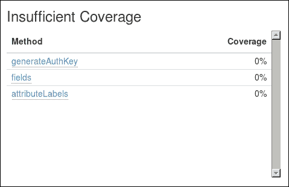
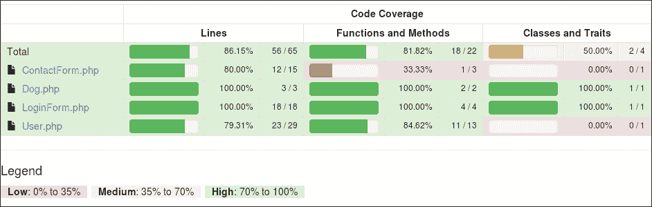
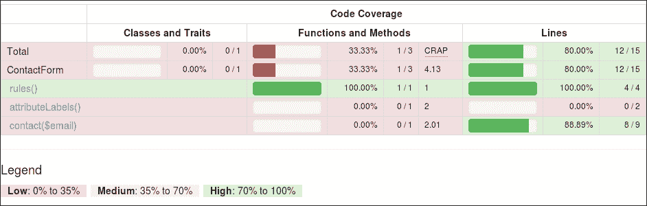
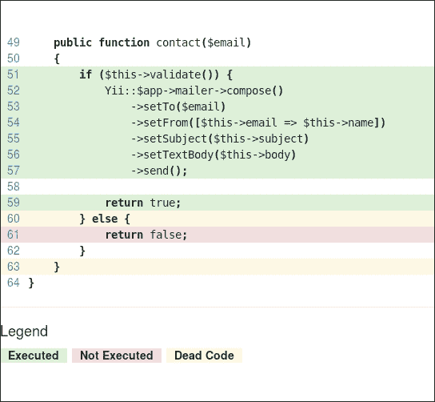
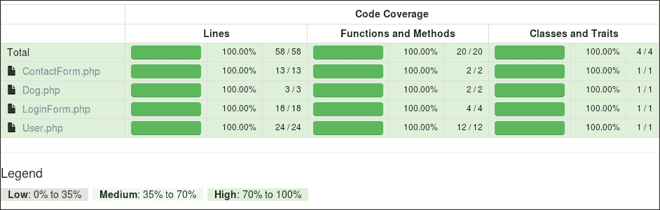
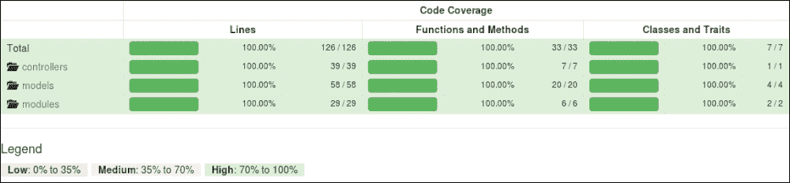

# 第八章 分析测试信息

在最后三章中，我们讨论了在不同级别编写测试的主题：单元、功能和验收。到目前为止，我们已经测试了我们创建的新接口，并学会了应用所有新方法。这是一个相对简单的工作，但我们不知道我们在测试中做得如何。有一些特定的指标我们可以分析，以生成关于测试质量的直接和即时报告。这些报告将帮助我们做出有关代码架构的明智决策。

Codeception 捆绑了大多数这些报告生成工具，而且到目前为止它相当简单。

在本章中，我们将主要介绍代码覆盖率指标，并简要介绍一些其他指标，这些指标可以通过各种软件获得。

+   提高你测试的质量

+   使用额外的工具来改进我们的代码

# 提高你测试的质量

从编程开始，特别是测试开始以来，许多程序员开始质疑自己编写良好测试的含义，或者换句话说，我如何知道我编写的测试是好的？这个指标是什么？

这绝对不是一个个人偏好或技能的问题。

分析测试质量最早创建的方法之一被称为代码覆盖率。从更广泛的角度来看，代码覆盖率衡量测试覆盖了多少代码。软件缺陷与测试代码覆盖率之间存在相关性，具有更多代码覆盖率的软件具有更少的缺陷，尽管测试不会消除引入缺陷的可能性，例如，作为模块之间复杂交互或意外输入和边缘情况的表现。这就是为什么在规划和设计测试时需要谨慎，并且需要考虑这一点不会完全消除回归和探索性测试的需求。

通常用于代码覆盖率程序的代码覆盖率标准有几个。

+   **行覆盖率**：这是基于执行了多少可执行行的数量。

+   **函数和方法覆盖率**：这计算执行了多少个函数或方法。

+   **类和特性覆盖率**：这衡量在所有方法都执行时覆盖了多少个类和特性。

+   **指令覆盖率**：这与行覆盖率类似，尽管单行可能生成多个指令。行覆盖率认为一旦其指令之一被执行，该行就被覆盖了。

+   **分支覆盖率**：这衡量在测试运行时是否评估了控制结构中每个可能的布尔表达式的组合。

+   **路径覆盖**：这同样被称为**决策到决策**（**DD**）路径，它考虑了从每个方法或函数的开始到结束的所有可能的执行路径，从其独特的分支执行顺序来考虑。

+   **变更风险反模式**（**C.R.A.P.**）**索引**：这个索引基于代码单元的循环复杂度和代码覆盖率。可以通过重构代码或增加测试数量来降低这个索引。无论如何，它主要用于单元测试。

由于 Codeception 使用 PHP_CodeCoverage，它不支持指令覆盖、分支覆盖和路径覆盖。

考虑到这一点，如果我们回到我们的单元测试，我们将更好地理解测试的结构以及它们目前的工作方式。

让我们先在我们的单元测试中启用代码覆盖率，然后查看它们的结果。

之后，我们将查看功能性和验收覆盖率报告，然后探索一些其他有趣的信息，我们可以从我们的代码中提取这些信息。

## 在 Codeception 中启用代码覆盖率

Codeception 提供了全局和特定配置的代码覆盖率。根据您应用程序的结构和您根据测试计划将要实施的测试类型，您可以在`/tests/codeception.yml`中有一个通用配置，或者为每个套件配置文件（如`/tests/codeception/unit.suite.yml`）有一个特定配置。您也可以同时拥有这两种配置。然而，在这种情况下，单个套件配置将覆盖全局配置的设置。

我们将使用全局配置文件。因此，在文件末尾添加以下行：

```php
# tests/codeception.yml

coverage:
    enabled: true
    white_list:
        include:
            - ../models/*
            - ../modules/v1/controllers/*
            - ../controllers/*
            - ../commands/*
            - ../mail/*
    blacklist:
        include:
            - ../assets/*
            - ../build/*
            - ../config/*
            - ../runtime/*
            - ../vendor/*
            - ../views/*
            - ../web/*
            - ../tests/*
```

这应该足够开始。第一个选项启用了代码覆盖率，而其余的选项告诉 Codeception 和代码覆盖率程序在编写报告时包含哪些文件，以生成白名单和黑名单。这将确保结果汇总了与我们相关的信息，换句话说，就是我们编写的代码，而不是框架本身。

我们不需要运行 Codeception 的`build`命令，因为没有新的模块需要导入到我们的测试人员中。

如果我们查看 Codeception 的`run`操作的`help`选项，我们会注意到它有两个主要选项用于生成我们感兴趣的报告。

+   `--coverage`：这会生成实际的覆盖率报告，并伴随一系列其他选项来控制报告的格式和详细程度

+   `--report`：这会生成运行测试的整体报告

与这两个选项结合使用，我们能够根据需要生成 HTML 和 XML 测试和覆盖率报告。特别是，当到达第九章 *借助自动化消除压力*时，XML 报告将非常方便。

### 注意

重要的是要记住，目前验收测试的覆盖率报告并没有与功能测试和单元测试生成的报告合并。这是由于代码覆盖率计算和拦截的方式造成的。稍后，我们将看到生成验收测试覆盖率报告需要什么。

## 提取单元测试的代码覆盖率信息

在 Codeception 文档中，这通常被称为**本地覆盖率**报告，它适用于单元测试和功能测试。当我们谈到验收测试的覆盖率时，我们将涉及到远程覆盖率。

我们可以通过在命令中添加`--coverage`标志来轻松生成覆盖率：

```php
$ ../vendor/bin/codecept run unit --coverage

```

这将结束于以下类似的输出：

```php
...
Time: 44.93 seconds, Memory: 39.75Mb

OK (32 tests, 68 assertions)
Code Coverage Report: 
 2015-01-05 21:43:13 

 Summary: 
 Classes: 25.00% (2/8) 
 Methods: 45.00% (18/40)
 Lines:   26.42% (56/212)

\app\models::ContactForm
 Methods:  33.33% ( 1/ 3)   Lines:  80.00% ( 12/ 15)
\app\models::Dog
 Methods: 100.00% ( 2/ 2)   Lines: 100.00% (  3/  3)
\app\models::LoginForm
 Methods: 100.00% ( 4/ 4)   Lines: 100.00% ( 18/ 18)
\app\models::User
 Methods:  84.62% (11/13)   Lines:  79.31% ( 23/ 29)

```

### 注意

这里显示的执行时间是基于一个装有 i7-m620 处理器的机器，该机器运行 Linux 内核。覆盖率会增加执行时间呈指数增长。在同一台机器上运行单元测试不到 10 秒。

有方法可以缩短执行时间。这可以通过使用 Robo（一个任务运行器）及其特定的 Codeception 插件 robo-paracept 来实现。更多详细信息可以在官方 Codeception 文档中找到，网址为[`codeception.com/docs/12-ParallelExecution`](http://codeception.com/docs/12-ParallelExecution)。

这份报告为我们提供了代码覆盖率的一个简洁且直接的输出。

从摘要中可以看到类、方法和行的覆盖率（以及百分比的计算方式），以及每个类的略微详细分解。

我们可以看到，我们成功覆盖了 100%的`Dog`和`LoginForm`类，并且我们仍然达到了`User`类方法的良好覆盖率，为 84.62%，但令人失望的是，我们只覆盖了`ContactForm`类方法的 33.33%。

但是，我们错过了什么？

好吧，只有一个方法可以找到答案，那就是生成 HTML 覆盖率报告。

## 生成单元测试的详细覆盖率报告

通过使用`--coverage-html`选项，我们可以生成详细的代码覆盖率报告。然后，我们可以检查它，以了解哪些被覆盖了，哪些被遗漏了：

```php
$ ../vendor/bin/codecept run unit --coverage-html

```

这将结束于以下输出行：

```php
HTML report generated in coverage

```

报告将被保存在`_output/coverage/`目录中，在那里你可以找到两个文件：`dashboard.html`和`index.html`。第一个文件提供了一些漂亮的图表，这些图表比控制台上打印的覆盖率报告摘要更有趣，但它主要用于炫耀，并不适用于理解测试中的问题。实际上，有一个公开的请求要求在控制台上抑制这种输出（[`github.com/Codeception/Codeception/issues/1592`](https://github.com/Codeception/Codeception/issues/1592)）。



仪表板中**不足覆盖率**面板的详细信息

如您从前面的截图中所见，在这个细节级别，您可能感兴趣的部分是位于页面左下角的**覆盖率不足**面板（目前）。

我们将在稍后讨论其他面板。

你会对`index.html`文件真正感兴趣。从那里，你可以看到一些详细的统计数据，并且可以深入查看每个已分析的文件，以查看测试覆盖了哪些行，从而从那里改进你的测试。



所有分析文件的覆盖率总结

覆盖率总结显示了覆盖了什么，相当详细。这帮助我们立即发现我们的测试中出了什么问题，在我们的案例中，Yii 为`ContactForm`提供的测试覆盖不足。在前面的截图中，我们可以看到它显示了 80%的行覆盖率，33.33%的方法覆盖率，但它没有显示关于类的任何内容。这是因为，除非你覆盖了所有的方法，否则类不会被标记为已覆盖。

这可能不会证明是一个问题。有一些方法不是我们实现的一部分，这些方法只能通过使用集成测试来测试，还有一些可以通过稍微注意一下来覆盖。如果我们点击**ContactForm.php**链接，那么我们会看到以下内容：



选中文件的代码覆盖率总结

在两个未被覆盖的方法中，我们实际上并不需要覆盖第一个方法`attributeLabels()`。技术上，这是由于两个原因：第一个原因是它是 Yii 框架的一部分，我们假设它会工作；第二个原因是它是一个简单的函数，它总是返回一个内部变量，无法以任何方式控制。

另一种方法是`contact()`方法，它已经被部分覆盖。所以，我们将修复这个问题。完全有可能这个特定的测试将在框架的未来的版本中得到修正。这可能是一些你需要留意的事情。

通过点击**contact($email)**链接，或者直接滚动到页面底部，我们会找到我们的方法，这将显示所有路径都没有被覆盖。



在颜色编码线条的帮助下发现需要覆盖的内容

我们的案例相当简单，所以我们将尝试通过添加`@codeCoverageIgnore`指令到我们想要排除的方法的文档中，或者通过调整或添加一个新的测试来尽可能接近 100%。记住，这是我们将会追求的目标，但这并不一定是我们的目标。

```php
// /tests/codeception/unit/models/ContactFormTest.php

/**
 * @return array customized attribute labels
 * @codeCoverageIgnore
 */
public function attributeLabels()
{
    return [
        'verifyCode' => 'Verification Code',
    ];
}
```

解决`if`语句剩余分支覆盖率的方法是添加一个类似于以下测试：

```php
// /tests/codeception/unit/models/ContactFormTest.php

public function testContactReturnsFalseIfModelDoesNotValidate()
{
    $model = $this->getMock(
          'app\models\ContactForm', ['validate']
    );
    $model->expects($this->any())
          ->method('validate')
          ->will($this->returnValue(false));

    $this->specify('contact should not send', function () use (&$model) {
        expect($model->contact(null), false);
        expect($model->contact('admin@example.com'), false);
    });

}
```

现在，让我们再次运行我们的测试，我们将看到这里显示的截图：



我们已经达到了 100%的覆盖率！太好了！

我将留给你去修复剩余的错误。某些情况可能很难覆盖，你可能需要额外的提示和建议来重新结构你的测试。

## 将功能测试汇总到单元测试

现在我们已经看到了我们的单元测试中发生了什么，以及如何直观地理解我们是否已经尽可能多地覆盖了，我们可以转向我们之前编写的功能测试。

如我们之前所见，我们只需将功能套件添加到命令行中，以生成汇总报告。

```php
$ ../vendor/bin/codecept run unit,functional --coverage

```

我们还会看到，如果我们省略了套件，最终结果将相同，但我们不知道 Codeception 开发者何时将所有三个套件合并为一个覆盖率报告，所以请记住这一点，并查阅文档。

我们的单元测试已经完全覆盖了模型。我们的功能测试应该专注于控制器。你应该能够发现登录页面和 REST 模块控制器并未完全被覆盖。所以，让我们逐一讨论这些问题。

登录页面将显示登录和注销操作的缺失覆盖率。

在第一种情况下，覆盖它似乎相当简单。我们必须确保在登录后达到该操作。因此，让我们在测试文件末尾成功登录后立即添加以下断言：

```php
// tests/codeception/functional/LoginCept.php

$I->amGoingTo('ensure I cannot load the login page if I am logged in');
$I->amOnPage('/index-test.php/login');
$I->seeCurrentUrlEquals('/index-test.php');
```

如我们所见，我们正在使用一些特定的路径来测试网站。当与 Codeception REST 模块交互时，这并不是问题，但在这里我们必须详细说明。

我们必须覆盖的另一部分要复杂一些。一旦我们登录，请注意注销按钮上附加了一个 JS 点击事件，这将向`/logout`发送 POST 请求。

由于 PHPBrowser 无法读取 JS，也没有能力进行特定的 POST 调用，因此我们无法覆盖这段代码。甚至不要考虑使用`sendPost()`，因为这是一个特定方法，来自 Codeception 的 REST 模块。

解决这个问题的唯一方法是将这部分覆盖率留给验收测试或 WebDriver。

由于验收测试和功能测试尚未合并，我们可以使用`@codeCoverageIgnore`排除此方法，从而排除覆盖率报告中的方法覆盖率。但是，请确保这不再是问题，并在排除所有测试的方法覆盖率之前与你的同事讨论。

我们需要覆盖的最后部分是 REST 接口的控制器。在这里，我们有一个混合的情况。我们有未覆盖的函数，这些函数主要是我们框架的一部分，例如执行身份验证的匿名函数和`checkAccess()`，我们在`actionUpdate()`中有少量内容，它禁止除了 PUT 以外的任何操作，并且在`actionSearch()`中还有一个控制语句，它控制谁可以搜索什么。

在前两种情况下，我们很高兴避免它们被覆盖，因为我们已经明确排除了这些文件所属的框架文件。

对于`actionUpdate()`，我们会发现我们甚至不需要特定的检查，因为 Yii 已经定义了针对默认 REST 接口允许的 HTTP 调用类型。

我们可以添加一个测试来确保我们无法在接口上执行 POST 操作，并且它可以添加到任何现有的测试中。这可能是以下代码块的内容：

```php
// tests/codeception/functional/UserAPIEndpointsCept.php

// I must be authenticated at this point.
$I->amGoingTo('I cannot update using POST');
$I->sendPOST('users/' . $userId);
$I->seeResponseCodeIs(405);
```

最后，我们希望确保用户只能搜索自己的用户名以获取 ID，正如我们在第六章中概述的那样，“测试 API - PHPBrowser 来拯救”。为了做到这一点，我们可以简单地添加类似于这里显示的代码块的内容：

```php
// tests/codeception/functional/UserAPICept.php

// I must be authenticated at this point.
$I->amGoingTo('ensure I cannot search someone else');
$I->sendGET('users/search/someoneelse');
$I->seeResponseCodeIs(403);
```

如果我们运行带有覆盖率的测试，那么我们将得到所有我们想要查看覆盖率的文件的 100%。



单元和功能测试的最终覆盖率概述

## 生成验收测试覆盖率报告

现在我们已经了解了如何处理我们的覆盖率报告，我们将快速查看将帮助我们获取验收测试覆盖率报告的配置。

这些覆盖率报告可能不是最重要的，但如果构建正确，它们应该可以证明我们的场景编写得很好。通常，验收测试的焦点在于确保浏览器跨兼容性和向后兼容性。

正如我们在第七章中看到的，“享受浏览器测试的乐趣”，Codeception 与 Selenium 独立服务器通信，该服务器反过来启动浏览器并通过浏览器驱动程序执行所需的测试。正因为这种架构，c3 项目被创建，它基本上监听浏览器调用并理解我们的代码的哪一部分正在远程执行。

因此，首先，让我们获取 c3。我们可以从 Composer 或从官方网站（[`github.com/Codeception/c3`](https://github.com/Codeception/c3)）通过在项目根目录运行以下命令来下载它：

```php
$ wget https://raw.github.com/Codeception/c3/2.0/c3.php

```

如果你通过 Composer 下载，那么你必须在`composer.json`文件中添加一些额外的说明。你应该以官方文档为主要参考点。

一旦你有了它，就将其包含在`index-test.php`文件中：

```php
// web/index-test.php
//...
include_once __DIR__ . '/c3.php';
$config = require(__DIR__ . '/../tests/codeception/config/acceptance.php');
(new yii\web\Application($config))->run();
```

通过这种方式，我们已经将 c3 连接到 Yii。现在，我们只需要让 Codeception 知道这一点。所以打开`codeception.yml`文件，并将以下选项添加到文件的`coverage`部分：

```php
# tests/codeception.yml
# ...
coverage:
    enabled: true
    remote: true
    remote_config: ../tests/codeception.yml
    # whitelist:
    # blacklist:
    c3_url: 'https://basic-dev.yii2.sandbox/index-test.php/'

```

我们需要启用远程覆盖率，通过使用`remote_config`设置文件配置，然后指定 c3 应该监听的 URL。

### 注意

关于远程代码覆盖率及其配置的详细说明，可以从 Codeception 的官方文档中阅读，该文档可在[`codeception.com/docs/11-Codecoverage`](http://codeception.com/docs/11-Codecoverage)找到，也可以从`README.md`文件中找到，该文件位于你的项目的`tests/`目录中，或者可在[`github.com/yiisoft/yii2-app-basic/tree/master/tests#remote-code-coverage`](https://github.com/yiisoft/yii2-app-basic/tree/master/tests#remote-code-coverage)找到。

现在，所有我们的远程调用都将通过`index-test.php`文件进行，并且它们将使用 c3 生成覆盖率数据。

此外，我们可能还想为特定的验收测试获取一个精简的报告，在我们的情况下，我们可以决定只关注被击中的控制器，然后选择移除对模型的任何报告。

为了做到这一点，考虑我们在主配置文件中已经有的内容。我们只需要将以下内容添加到我们的`acceptance.suite.yml`文件中：

```php
# tests/codeception/acceptance.suite.yml
coverage:
    blacklist:
        include:
            - ../models/*
```

在这个阶段，你可以通过使用这里显示的代码块单独生成报告：

```php
$ ../vendor/bin/codecept run acceptance --coverage-html

```

你也可以通过简单地运行整个套件的测试来完成这项工作，如下所示：

```php
$ ../vendor/bin/codecept run --coverage-html

```

如我们之前所见，这两种方法将为验收测试生成单独的报告。未来这可能会不再有效，所以请务必查看官方文档并确认。

一旦我们生成了报告，我们会注意到两件事：带有覆盖率报告的测试可能需要很长时间，所以我们不希望在每次更改接口时都运行这个测试。其次，我们必须覆盖之前突出显示的缺失登出测试。

因此，让我们转到我们的`LoginCept.php`文件，并添加缺少的内容。

```php
$I->amGoingTo('ensure I cannot load the login page if I am logged in');
$I->amOnPage('/index-test.php/login');
$I->seeCurrentUrlEquals('/index-test.php');

$I->amGoingTo('try to logout');
$I->click('Logout (admin)');
if (method_exists($I, 'wait')) {
    $I->wait(3); // only for selenium
}
$I->seeCurrentUrlEquals('/index-test.php');
```

请注意，在使用 URL 时，我们需要非常具体，就像我们在功能测试中所做的那样。

一旦完成，我们应该发现自己拥有所有套件的完整覆盖率。

在下一节中，我们将看到我们还能生成什么，然后我们将在下一章中借助自动化将其提升到更高水平。

# 在额外工具的帮助下改进我们的代码

除了代码覆盖率和测试报告之外，我们还有一系列额外的工具，我们可以使用这些工具来提高我们代码的质量。

我们将要讨论的两个工具是检查样式和通过 C.R.A.P.指数的循环复杂度。

我们将在第九章“借助自动化消除压力”中添加更多示例和工具，因为每个命令都需要开发者过多的知识，而且这是可以通过开关自动触发的事情。

**PHP Checkstyle**（**PHPCS**）是一个非常好的工具，尽管一开始它相当复杂。这将帮助我们保持所有开发者代码风格的统一。你可能对此过于关心，我也见过因为选择哪种风格而引发的激烈争论。然而，这种做法的好处是显而易见的，因为它迫使开发者控制他们的编码风格。当与循环复杂度一起使用时，它可以标准化代码并避免任何涉及复杂和困难代码的情况。

已经有一些现成的代码标准可供使用，并且这些标准已经根据你的需求进行了配置。PHPCS 只需要一个配置文件或要遵循的标准名称的引用。

我们将安装并使用 Yii 2 自己的代码标准，你可以将其作为指定更适合你需求的规则的基准。

你可以使用 Composer 安装 Yii 2 代码标准，这将包括我们需要的实际二进制文件作为依赖项：

```php
// composer.json
    "require-dev": {
       ...
        "yiisoft/yii2-coding-standards": "*"

```

一旦我们安装了这两个工具，我们就可以通过以下命令在控制台中调用它们：

```php
$ vendor/bin/phpcs \--standard=vendor/yiisoft/yii2-coding-standards/Yii2/ruleset.xml \ --extensions=php \--ignore=autoload.php \models controllers modules

```

最后三个参数是我们希望 PHPCS 扫描的文件夹。

如果你想要改进你的代码，那么你应该利用 C.R.A.P.指数，这是 Codeception 生成的覆盖率报告中包含的。在下一章中，我们将看到如何使用循环复杂度指数来基于修改代码的决定。

C.R.A.P.指数是为了分析和预测维护现有代码库所需的工作量、痛苦和时间而设计的。

它在这里以数学方式定义：

*C.R.A.P.(m) = comp(m)² * (1 – cov(m)/100)³ + comp(m)*

其中*comp(m)*是循环复杂度，*cov(m)*是自动化测试提供的测试代码覆盖率。循环复杂度是方法中唯一决策数加 1。

低 C.R.A.P.指数表明相对较低的变化和维护风险，因为它要么不是太复杂，或者被测试充分覆盖。为了保持其实用性，如果你的方法是直接的调用序列，那么它很可能有一个接近 1 的 C.R.A.P.指数。它包含的`if`、`for`和`while`子句越多，它就越复杂，因此它的 C.R.A.P.指数就越高。

这就是测试如何让潜在的问题显现出来，并指引你走向保持代码可维护和模块化的正确方向。

# 摘要

在本章中，我们讨论了配置和生成项目代码覆盖率所需的基本步骤。我们看到了如何使用生成的报告来发现代码中的潜在问题。我们还介绍了一些额外的工具来提高我们的代码质量。

在第九章中，*借助自动化消除压力*，我们将完成这段旅程。我们将讨论额外工具的主题，如何将它们集成到持续集成系统中，并展示结果以方便访问和浏览。
