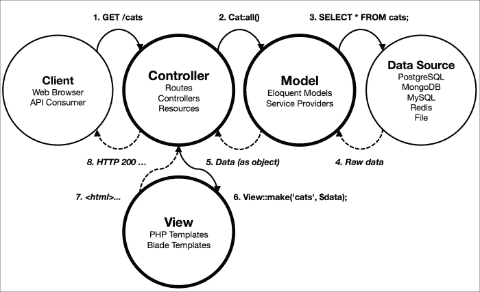

# 第一章。Laravel 简介

PHP 框架并不新鲜，但最新的是 Laravel。自第 3 版以来，Laravel 在短时间内迅速崛起，成为最受欢迎和最广泛使用的 PHP 框架之一。在撰写本文时，GitHub 上的 Laravel 存储库的星标数量超过了其更成熟的同行，如 Symfony、CakePHP、CodeIgniter 和 Yii。那么，是什么让 Laravel 如此受欢迎呢？

在本章中，我们将涵盖以下主题：

+   如何通过使用框架来提高生产力

+   Laravel 的基本概念和关键特性

+   新建 Laravel 应用程序的一般结构和约定

+   介绍基于 Laravel 的模型-视图-控制器（MVC）设计模式

+   为 Laravel 旧版本用户提供的迁移技巧

我们将探讨其关键特性和它们是如何使 Laravel 成为许多 Web 开发人员不可或缺的工具。我们将比较使用和不使用框架编写 PHP 应用程序，并看看使用框架如何有助于编写更健壮和结构更好的 PHP 应用程序。然后，我们将更深入地研究 Laravel 应用程序的结构和它所利用的第三方包。阅读完本章后，您将拥有开始构建您的第一个 Laravel 应用程序所需的知识。

# 对框架的需求

在所有服务器端编程语言中，PHP 无疑具有最低的入门门槛。它几乎总是默认安装在即使是最低成本的 Web 托管服务上，而且它也非常容易在任何个人计算机上设置。对于有 HTML 和 CSS 网页编写经验的初学者来说，变量、内联条件和`include`语句的概念很容易理解。PHP 还提供了许多在开发动态网站时可能需要的常用函数。所有这些都为一些人所说的 PHP 的**即时性**做出了贡献。然而，这种即时的满足感是有代价的。它给初学者一种虚假的生产力感，他们几乎不可避免地会在添加更多功能和功能到他们的网站时，最终得到一团糟的意大利面代码。这主要是因为 PHP 本身并没有做很多来鼓励关注点的分离。

## 自制工具的限制

如果你已经有一些 PHP 项目经验，但之前没有使用过 Web 应用程序框架，那么你可能会积累了一些常用的函数和类，可以在新项目中使用。这些自制的实用工具可以帮助你完成常见任务，如清理数据、验证用户和动态包含页面。你可能还有一个预定义的目录结构，其中包含这些类以及你应用程序的其余代码。然而，所有这些都将完全独立存在；你将完全负责维护、添加新功能和编写文档。对于一个单独的开发者或人员不断变化的代理机构来说，这可能是一项繁琐且耗时的任务，更不用说如果你要与项目中的其他开发者合作，他们首先必须熟悉你构建应用程序的方式。

## Laravel 来救命

这正是像 Laravel 这样的 Web 应用程序框架可以救命的地方。Laravel 重用和组装现有组件，为你提供一个统一的层，你可以在这个层上以更结构化和实用化的方式构建 Web 应用程序。Laravel 从不仅限于 PHP，还包括其他编程语言的流行框架中汲取灵感，提供了一套强大的工具和应用程序架构，它结合了许多像 CodeIgniter、Yii、ASP.NET MVC、Ruby on Rails、Sinatra 等其他框架的最佳特性。

大多数这些框架都使用**模型-视图-控制器**（**MVC**）范式或设计模式。如果你使用过上述工具或 MVC 模式，那么你会发现开始使用 Laravel 5 相当容易。

# 开发 PHP 应用程序的新方法

如前所述，PHP 由于许多编写不良的网站和 Web 应用程序以及与其他更成熟语言相比的不足，在多年中获得了坏名声。PHP 在命名不一致和关于其语法的有疑问的设计决策方面也臭名昭著。因此，许多人转向了用**Ruby**和**Python**编写的更可信的框架。由于这些语言在 Web 方面的功能远不如 PHP 丰富，例如 Ruby on Rails 和 Django 的创造者，不得不重新创建一些基本构建块，如类，以表示 HTTP 请求和响应，因此能够避免 PHP 在他们之前犯下的某些错误，因为从一张白纸开始有更多的自由。这些框架还迫使开发者遵守预定义的应用程序架构。

然而，现在是一个很好的时机去发现（或者重新爱上）PHP，因为在这过去的几年里，这门语言迅速发展，包括了新的特性，如闭包和 traits，以及事实上的包管理器 Composer。与其他语言相比，PHP 过去的抱怨现在正是如此，是过去的，PHP 正在缓慢但肯定地改变它长期遭受的坏名声。

## 一个更健壮的 HTTP 基础

经过多年人们开发自己独特的处理常见任务的方法，例如处理请求和响应，特别是针对他们自己的项目，一个框架采取了不同的方法，而不是开始创建可以在任何代码库中使用的组件，无论其基础是自建的还是基于框架的。**Symfony** 项目采用了这些原则，为 PHP 应用程序重新创建了一个更坚固、更灵活、更可测试的 HTTP 基础。与 Drupal 和 phpBB 的最新版本一样，Laravel 是众多使用此基础以及形成 Symfony 框架的几个其他组件的开源项目之一。

Laravel 是这样一个项目，它依赖于由 Symfony 创建的 HTTP 基础设施。它还依赖于由 Symfony 创建的其他组件，以及各种其他流行的库，例如 **SwiftMailer** 用于更直接的电子邮件发送，**Carbon** 用于更丰富的日期和时间处理，**Doctrine** 提供其屈折词和数据库抽象工具，以及一些其他工具来处理日志记录、类加载和错误报告。Laravel 决定不重新发明轮子，而是站在巨人的肩膀上，拥抱这些现有的成熟组件。

## 拥抱 PHP

Laravel 与其同行不同的一个方面是，它公开拥抱 PHP 的新特性，并相应地要求一个相当新的版本（至少 5.4）。以前，其他框架会构建对旧版本 PHP 的支持，以尽可能长时间地保持向后兼容性。然而，这种方法意味着那些相同的框架无法利用 PHP 新版本中的新特性，从而阻碍了 PHP 的发展。使用 Laravel 5，你将能够掌握 PHP 的一些新特性。如果你是 PHP 新手，或者一段时间后重返这门语言，那么你可以期待以下内容：

+   **命名空间**：比 PHP 更成熟的语言，如 Java 和 C#，都有命名空间。命名空间帮助开发者避免可能发生的命名冲突，比如两个不同的库有相同的函数或类名。在 PHP 中，命名空间由反斜杠分隔，这通常与目录结构相匹配，唯一的区别是在 Unix 系统中，根据 PSR-4 规范，使用斜杠。一个命名空间，如 `<?php namespace Illuminate\Database\Eloquent`，在文件顶部声明。要使用另一个命名空间中的代码，需要导入，这可以通过 `use` 关键字完成，然后指定命名空间，即 `use Illuminate\Database\Eloquent\Model`。命名空间的另一个优点是可以为导入的类创建别名，以避免与另一个命名空间或全局命名空间中具有相同名称的类发生冲突。为此，你在 `use` 语句之后使用 `as` 关键字，例如 `use Foo\Logger as FooLogger;`

+   **接口**：接口指定了当实现该接口时类应该提供的方法。接口本身不包含任何实现细节，只包含方法（以及这些方法应该接受的参数）。例如，如果一个类实现了 Laravel 的 `JsonableInterface` 接口，那么这个类也需要有一个 `toJson()` 方法。在 Laravel 中，接口通常被称为 **契约**。

+   **匿名函数**：这些也被称为 `closures`，PHP 5.3 中引入。它们与 JavaScript 有点相似，可以帮助你编写更短的代码。在构建 Laravel 应用程序时，你将广泛使用它们来定义路由、事件、过滤器等。这是一个附加到路由上的匿名函数示例：`Route::get('/', function() { return 'Hello, world.'; });`。在 Laravel 中，当请求网站的根路径时，这段代码创建了一个新的 **路由**。当请求发生时，闭包中的代码被执行并返回作为响应。

+   **方法重载**：也称为“动态”方法，它们允许你调用在类中未显式定义的方法，例如 `whereUsernameOrEmail($name, $email)`。这些调用由类中的 `__call()` 方法处理，该方法随后尝试解析名称以执行一个或多个已知方法。例如，`->where('username', $username)->orWhere('email', $email)`。

+   **简化的数组语法**：PHP 5.4 引入了简化的数组语法。现在，你可以只用方括号来表示数组，即 `['primes'=>['1','3','5','7']]`，而不再需要像 `array('primes' =>array(1,3,5,7))` 这样写。如果你在 JavaScript 中使用过数组，你可能已经熟悉这种语法。

# Laravel 的主要特性和灵感来源

那么，Laravel 5 默认提供了哪些功能？让我们来看看以下功能如何帮助提高你的生产力：

+   **模块化**：Laravel 建立在 20 多个不同的库之上，并且自身被分割成单独的模块。与**Composer**依赖管理器紧密集成，这些组件可以轻松更新。

+   **可测试性**：Laravel 从构建之初就是为了简化测试而设计的，它自带了几个辅助工具，允许您从测试中访问路由，抓取生成的 HTML，确保在特定的类上调用方法，甚至可以模拟认证用户以确保在正确的时间运行正确的代码。

+   **路由**：当您定义应用程序的路由时，Laravel 提供了很多灵活性。例如，您可以将一个简单的匿名函数手动绑定到一个带有 HTTP 动词的路由上，如`GET`、`POST`、`PUT`或`DELETE`。这个功能受到了像**Sinatra**（Ruby）和**Silex**（PHP）这样的微框架的启发。

+   **配置管理**：通常情况下，您的应用程序将在不同的环境中运行，这意味着当您的应用程序在本地开发服务器上运行时，数据库或电子邮件服务器凭证的设置或错误信息的显示将与在生产服务器上运行时不同。Laravel 采用了一种一致的方法来处理配置设置，并且可以通过使用包含特定环境设置的`.env`文件，在不同的环境中应用不同的设置。

+   **查询构建器和 ORM**：Laravel 自带了一个流畅的查询构建器，允许您使用 PHP 语法发出数据库查询，您只需链式调用方法而不是编写 SQL 语句。除此之外，它还为您提供了**对象关系映射器（ORM**）和**ActiveRecord**实现，称为**Eloquent**，这与您在 Ruby on Rails 中找到的类似，以帮助您定义相互关联的模型。查询构建器和 ORM 与不同的数据库兼容，例如 PostgreSQL、SQLite、MySQL 和 SQL Server。

+   **模式构建器、迁移和填充**：这些功能也受到了 Rails 的启发，允许您在 PHP 代码中定义数据库模式，并借助数据库迁移跟踪任何更改。迁移是一种简单的方式来描述模式更改及其回滚方式。填充允许您在运行迁移后填充数据库中选定的表，例如。

+   **模板引擎**：部分受到 ASP.NET MVC 中的**Razor**模板语言的启发，Laravel 自带了**Blade**，这是一种轻量级的模板语言，您可以使用它创建具有预定义块的分层布局，其中动态内容被注入。

+   **电子邮件**：通过其`Mail`类，该类封装了流行的`SwiftMailer`库，Laravel 使得发送电子邮件变得非常简单，甚至可以发送包含丰富内容和附件的电子邮件。Laravel 还提供了对流行的电子邮件发送服务如 SendGrid、Mailgun 和 Mandrill 的驱动程序。

+   **认证**：由于用户认证是 Web 应用程序中如此常见的功能，因此 Laravel 默认提供了一种实现，用于注册、认证用户，甚至发送密码提醒。

+   **Redis**：这是一个以极快速度著称的内存键值存储。如果您为 Laravel 提供了一个它可以连接的`Redis`实例，它可以用作会话和通用缓存，并为您提供直接与之交互的可能性。

+   **队列**：Laravel 集成了多个队列服务，如 Amazon SQS、Beanstalkd 和 IronMQ，允许您延迟执行资源密集型任务，例如向大量用户发送电子邮件，并在后台运行，而不是让用户等待任务完成。

+   **事件和命令总线**：尽管在版本 5 中并非新特性，但 Laravel 将命令总线提到了前台，这使得在应用程序的生命周期中的不同点轻松分发事件（表示应用程序中发生的事情的类），处理命令（表示应在应用程序中发生的事情的另一个类），并对这些事件采取行动。

## 表现力和简洁性

Laravel 的核心是其代码应简单且富有表现力的哲学。考虑以下代码示例：

```php
<?php

Route::get('area/{area}', function($area) {
  if (51 == $area && ! Auth::check()) {
    return Redirect::guest('login');
  } else {
    return 'Welcome to Area '.$area;
  }
})->where('area, '[0-9]+');
```

### 小贴士

**下载示例代码**

您可以从[`www.packtpub.com`](http://www.packtpub.com)的账户下载您购买的所有 Packt Publishing 书籍的示例代码文件。如果您在其他地方购买了这本书，您可以访问[`www.packtpub.com/support`](http://www.packtpub.com/support)并注册，以便将文件直接通过电子邮件发送给您。

尽管我们还没有接触 Laravel 或介绍其路由函数，但您可能已经对这段代码的用途有一个大致的了解。具有表现力的代码对项目的新手来说更容易阅读，而且可能也更容易学习和记忆。

### 美化 PHP

除了美化 PHP 以及确保 Laravel 中的代码以有效传达其动作的纯英文命名外，Laravel 的作者们还将这些原则应用于现有的 PHP 语言函数。一个主要的例子是`Storage`类，它是为了简化文件操作而创建的：

+   **更具表现力**：要找出文件最后修改的时间，请使用`Storage::lastModified($path)`而不是`filemtime(realpath($path))`。要删除文件，请使用`Storage::delete($path)`而不是`unlink($path)`，后者是普通的 PHP 等效方法。

+   **更一致**：PHP 的一些原始文件操作函数以`file_`为前缀，而其他则仅以`file`开头；一些被缩写，而其他则没有。使用 Laravel 的包装器，您不再需要猜测或参考 PHP 的文档。

+   **更易于测试**：许多原始函数由于它们抛出的异常以及它们更难以模拟，因此在测试中使用时可能会很棘手。

+   **更完整的功能**：这是通过添加之前不存在的功能来实现的，例如`File::copyDirectory($directory, $destination)`。

非常罕见的情况下，会牺牲表达性以换取简洁性。这适用于常用的快捷函数，例如用于转义 HTML 实体的`e()`函数，或者可以用来停止脚本执行并转储一个或多个变量内容的`dd()`函数。

## 职责、命名和约定

在本章的开头，我们指出，标准 PHP 应用的主要问题之一是缺乏清晰的关注点分离；业务逻辑与表示层和数据层纠缠在一起。像许多其他更倾向于约定而非配置的框架一样，Laravel 为你提供了带有预定义代码放置位置的脚手架。为了帮助你消除琐碎的决定，它期望你以某种方式命名你的变量、方法或数据库表，尽管这些可以通过配置进行编辑。然而，它比 Ruby on Rails 这样的框架要少一些偏见，在路由等区域，通常有不止一种解决问题的方法。

你可能还记得我们提到过，Laravel 是一个基于 MVC 范式的框架。如果你之前没有使用过这种架构模式，请不要担心；简而言之，这是你需要了解的 MVC 知识，以便能够构建你的第一个 Laravel 应用：

+   **模型**：模型代表应用中的**资源**。大多数情况下，它们对应于数据存储中的记录，最常见的是数据库表。在这方面，你可以将模型视为代表应用中的**实体**，无论是用户、新闻文章还是事件等。在 Laravel 中，模型是通常扩展 Eloquent 基本`Model`类的类，并以**驼峰式**命名（即`NewsArticle`）。这将对应于具有相同名称的数据库表，但以**蛇形小写**和复数形式（即`news_articles`）。默认情况下，Eloquent 还期望有一个名为`id`的主键，并且会查找并自动更新`created_at`和`updated_at`列。模型还可以描述它们与其他模型之间的关系。例如，一个`NewsArticle`模型可能与一个`User`模型相关联，因为一个`User`模型可能能够创建一个`NewsArticle`模型。然而，模型也可以引用来自其他数据源的数据，例如`XML`文件或来自网络服务或 API 的响应。

+   **控制器或路由**：控制器在最简单的形式下，接收一个请求，执行一些操作，然后发送一个适当的响应。控制器是实际数据处理的地方，无论是从数据库中检索数据，还是处理表单提交，并将数据保存回数据库。尽管在 Laravel 中创建控制器类时你不必遵守任何规则，但它确实提供了两种合理的做法：RESTful 控制器和资源控制器。RESTful 控制器允许你定义自己的操作以及它们应该响应的 HTTP 方法。资源控制器围绕一个实体构建，允许你根据使用的 HTTP 方法在该实体上执行常见操作。另一种选择是完全不使用控制器类，而是通过匿名函数在你的路由中编写逻辑。

+   **视图或模板**：视图负责以合适的格式显示控制器返回的响应，通常是 HTML 网页。它们可以通过使用 Blade 模板语言或简单地使用标准 PHP 方便地构建。视图的文件扩展名，无论是`.blade.php`还是简单的`.php`，决定了 Laravel 是否将你的视图视为`Blade`模板。

以下图表展示了在典型 Web 应用中所有应用组件之间的交互：



当然，你可以违背 MVC 范式和框架的约定，按照自己的意愿编写代码，但这通常需要开发者付出更多努力，却得不到任何回报。

## 帮助你成为更好的开发者

Laravel 通过各种设计决策和哲学，如它倡导开发者编写框架无关的代码，并依赖于契约（接口）而不是实现，已经成为一种新的 PHP 应用开发方式的标准。它还建立了一个如此强大的社区，这无疑是其最强大的资产之一，也是其成功的主要贡献因素；你可以在几分钟内通过论坛、IRC 和像 Twitter 这样的社交网站等途径从其他用户那里获得答案。

然而，如果时间教会了我们什么，那就是框架的兴衰无常，很难预测 Laravel 何时会失去势头，被更好的或更受欢迎的框架所取代。尽管如此，Laravel 不仅会在短期内让你更高效，而且从长远来看，它还有潜力让你成为一名更好的开发者。通过用它来构建 Web 应用，你将间接地更熟悉以下概念，所有这些概念都高度可迁移到任何其他编程语言或框架。这包括 MVC 范式和**面向对象编程**（**OOP**）设计模式，依赖管理器的使用，测试和依赖注入，以及 ORMs 和数据库迁移的强大功能和局限性。

它还会激发你编写更具表达力的代码，使用描述性的**DocBlock**注释，这些注释有助于生成文档，以及无论是由你还是其他开发者进行的未来维护。

# Laravel 应用的架构

在接下来的两章中，我们将安装 Laravel 并创建我们的第一个应用。像大多数框架一样，Laravel 一开始就为你提供了一个完整的目录树，你可以用它来组织你的代码，还包括一些占位符文件，你可以用作起点。以下是一个新的 Laravel 5 应用的目录结构：

```php
./app/                       # Your Laravel application
  ./app/Commands/            # Commands classes  ./app/Console/
    ./app/Console/Commands/  # Command-line scripts
  ./app/Events/              # Events that your application can raise
  ./app/Exceptions/
  ./app/Handlers/            # Exception handlers
    ./app/Handlers/Commands  # Handlers for command classes
    ./app/Handlers/Events    # Handlers for event classes
  ./app/Http/
    ./app/Http/Controllers/  # Your application's controllers
    ./app/Http/Middleware/   # Filters applied to requests
    ./app/Http/Requests/     # Classes that can modify requests
    ./app/Http/routes.php    # URLs and their corresponding handlers
  ./app/Providers            # Service provider classes
  ./app/Services             # Services used in your application

./bootstrap/                 # Application bootstrapping scripts

./config/                    # Configuration files

  ./database/
  ./database/migrations/     # Database migration classes
  ./database/seeds/          # Database seeder classes

./public/                  # Your application's document root
./public/.htaccess         # Sends incoming requests to index.php
./public/index.php         # Starts Laravel application

./resources/
  ./resources/assets/        # Hold raw assets like LESS & Sass files
  ./resources/lang/          # Localization and language files
  ./resources/views/         # Templates that are rendered as HTML

./storage/
  ./storage/app/             # App storage, like file uploads etc
  ./storage/framework/       # Framework storage (cache)
  ./storage/logs/            # Contains application-generated logs

./tests/                     # Test cases

./vendor/                    # Third-party code installed by Composer
./.env.example               # Example environment variable file

./artisan                    # Artisan command-line utility

./composer.json              # Project dependencies manifest

./phpunit.xml                # Configures PHPUnit for running tests

./server.php                 # A lightweight local development server
```

与 Laravel 的源代码一样，目录的命名也是表达性的，很容易猜测每个目录的作用。`app`目录是大多数应用的服务端代码所在的地方，它有子目录来处理应用如何被访问（`Console`和`Http`），以及用于组织可以在两种场景下使用的代码的子目录（例如`Events`和`Services`）。我们将在下一章中进一步探讨每个目录的职责。

## 服务容器和请求生命周期

无论你是 PHP 的初学者还是一个不同语言的资深开发者，可能并不总是明显地知道一个 HTTP 请求是如何到达 Laravel 应用的。确实，请求的生命周期与直接通过 URI 访问的纯 PHP 脚本（例如，`GET http://example.com/about-us.php`）在本质上是有区别的。

`public/` 目录旨在充当文档根目录；换句话说，这是你的 web 服务器在处理每个传入请求时开始查找的目录。一旦 URL 重写设置正确，所有不匹配现有文件或目录的请求都会命中 `/public/index.php` 文件。此文件包含 Composer 自动加载文件，它加载依赖项（包括 Laravel 框架组件），并且也是查找你的应用程序代码的位置。然后你的应用程序启动，根据环境加载配置变量。完成此操作后，它实例化一个新的服务容器实例，该实例随后处理传入的请求，使用访问应用程序时使用的 HTTP 方法（例如 `POST` /`comments`），并将请求传递给正确的控制器操作或路由进行处理。

## 探索 Laravel

在本章中，我们只介绍 Laravel 的工作的一般机制，而不涉及详细的实现示例。对于大多数只想完成任务的开发者来说，这已经足够了。此外，一旦你已经构建了一些应用程序，深入研究 Laravel 的源代码会容易得多。尽管如此，这里有一些可能出现的异常抛出或源代码导航时可能需要回答的问题。这样做时，你可能会遇到官方指南中未记录的一些方法，甚至可能会激发你编写更好的代码的灵感。

浏览 API ([`laravel.com/api`](http://laravel.com/api)) 在一开始可能会有些令人畏惧。但通常这是了解特定方法底层工作原理的最好方式。以下是一些建议：

+   `Illuminate` 命名空间并不指代第三方库。这是 Laravel 作者为构成 Laravel 的不同模块所选择的命名空间。它们中的每一个都旨在可重用，并且可以独立于框架使用。

+   当在源代码或 API 中搜索类定义，例如 `Auth`，时，你可能会遇到 `Facade`，它几乎不包含任何有用的方法，仅作为真实类的代理。这是因为 Laravel 中几乎每个依赖项在实例化时都会注入到服务容器中。

+   包含在 `vendor/` 目录中的大多数库都包含一个 `README` 文件，该文件详细说明了库中存在的功能（例如，`vendor/nesbot/carbon/readme.md`）。

## 版本 5 从版本 4 的变化

Laravel 5 最初是以 Laravel 4.3 的形式出现的，但当人们意识到这个新版本将彻底不同于框架的 4.0 版本时，它被提升到了自己的主要版本。Laravel 5 以 Laravel 4 为基础，但内置了诸如应用程序命名空间等功能，使得构建大型应用程序变得容易。要将 Laravel 4 应用程序迁移到 Laravel 5，需要进行相当多的工作。Laravel 5 中新增或更新的功能包括：

+   **方法注入**：在 Laravel 4 中，你可以通过类型提示（在构造函数中指定）来指定一个类所需的依赖项，Laravel 会自动从其容器中解析这些依赖项。现在，Laravel 5 将这一步更进一步，还将解析类方法和类构造函数中指定的依赖项。

+   **表单请求**：Laravel 5 引入了表单请求类。这些类可以被注入到你的控制器操作中。它们接受当前请求，并且你可以对它进行数据验证和清理，甚至用户授权（即检查当前登录的用户是否可以执行请求的操作）。这简化了验证过程，意味着你几乎不需要在你的控制器操作中进行数据验证。

+   **Socialite**：Laravel 5 新增了一个可选的包，名为 Socialite，你可以将其声明为 Composer 依赖项。它使得与第三方服务进行身份验证变得轻而易举，这意味着你可以通过几行代码轻松实现如 Facebook 登录等功能。

+   **Elixir**：Laravel 5 还致力于使前端开发更加容易。如今，许多开发者都在使用 LESS 和 Sass 等语言来创建他们的样式表，并将 JavaScript 文件合并成一个压缩的 JavaScript 文件，以减少 HTTP 请求并加快加载时间。Elixir 是一个围绕 **Gulp** 的包装器，Gulp 是一个基于 **Node.js** 的构建系统，它简化了上述任务。这大大减少了启动新应用程序所需的时间，因为你不需要从其他项目中安装 Node.js 模块或 Gulp 文件。你可以从一开始就免费获得它。

# 摘要

在本章中，我们向您介绍了 Laravel 5 以及它如何帮助你编写更好、更有结构的应用程序，同时减少样板代码的数量。我们还解释了 Laravel 使用的概念和 PHP 功能，你现在应该已经准备好开始编写你的第一个应用程序了！

在下一章中，你将学习如何设置一个环境，在这个环境中你可以开发 Laravel 应用程序，同时你还将被介绍到 Composer，用于管理依赖。
