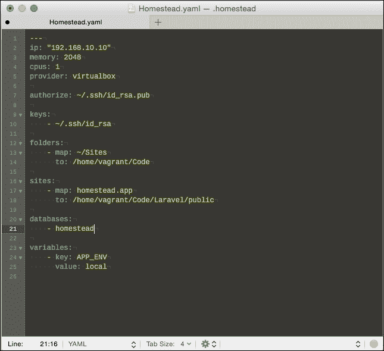
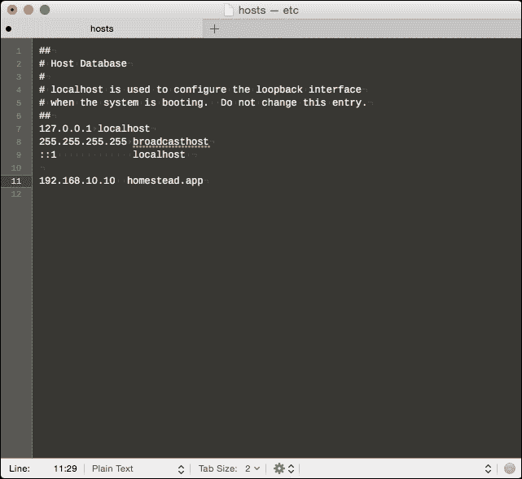

# 第二章. 设置开发环境

Laravel 不仅仅是一个框架：围绕它已经开发了一个完整的生态系统和工具集，以使构建 PHP 应用程序更快、更愉快。这些工具完全是可选的，并且了解它们并不是在 Laravel 中使用和构建项目所必需的，但它们与框架紧密相关，因此值得介绍。

在本章中，我们将涵盖以下主题：

+   认识 Composer，一个依赖管理器

+   Homestead 简介，以及如何使用它来管理 Laravel 项目

# 认识 Composer

在上一章中，你发现 Laravel 建立在几个第三方包之上。Laravel 不是将其外部依赖包含在其自己的源代码中，而是使用名为**Composer**的依赖管理器来下载它们并保持它们更新。由于 Laravel 由多个包组成，因此每次你创建一个新的 Laravel 项目时，它们也会被下载和安装。

强烈受到其他语言中流行的依赖管理器的启发，如 Ruby 的 Bundler 或 Node.js 的**Node 包管理器**（**npm**），Composer 将这些功能带到了 PHP，并迅速成为 PHP 事实上的依赖管理器。

几年前，你可能使用过**PHP 扩展和应用仓库**（**PEAR**）来下载库。PEAR 与 Composer 不同，因为 PEAR 会在系统级别上安装包，而依赖管理器，如 Composer，则是在项目级别上安装它们。使用 PEAR，你只能在系统上安装一个版本的包。Composer 允许你在不同的应用程序中使用同一包的不同版本，即使它们位于同一系统上。

# 使用命令行

如果你刚开始接触 Web 开发，你可能并不完全熟悉**命令行界面**（**CLI**）。在使用 Composer、虚拟机、Homestead 以及之后的 Artisan、Laravel 的 CLI 工具时，将需要与之进行一些交互。

下面是如何开始使用 CLI 的步骤：

1.  在 Windows 上，寻找**命令提示符**程序。如果你找不到它，只需导航到**开始** | **运行**，并输入`cmd.exe`。

1.  在 Mac OS X 上，CLI 被称为**终端**，它可以在`/Applications/Utilities`中找到。

1.  在 Linux 上，根据你的 Linux 发行版，它可能被称为**终端**或**Konsole**，但如果你正在运行 Linux，你很可能已经熟悉它了。

你不需要任何高级命令行技能就能通过这本书并使用 Laravel 构建应用程序。然而，你将需要能够在运行命令之前在文件系统中导航到正确的目录。为此，只需输入`cd`命令，然后跟随你的代码目录路径。

### 注意

在大多数系统上，你还可以直接输入`cd`，然后跟一个空格，并将目录拖放到终端中，如图所示：

```php
$ cd /path/to/your/code/directory

```

否则，你可以在 Windows 上运行以下命令行：

`> cd C:\path\to\your\code\directory`

如果路径包含空格，请确保将其包含在双引号中，以确保空格被转义：

`> cd "C:\path\to\your\Laravel Projects"`

在本书的其余部分，除非示例专门针对 Windows，否则我们将始终使用`$`字符表示 shell 命令，并使用斜杠作为目录分隔符。如果你正在运行 Windows，请确保相应地调整命令。

# 认识 Homestead

如果你想在你的个人电脑上开发 PHP 应用程序，你需要安装并运行一个本地网络服务器。PHP 被安装来解释你的脚本，以及你的网站可能需要的其他工具，例如与数据库交互。你的网站或网络应用甚至可能需要其他服务，如**Memcached**或**Redis**，这些是流行的缓存系统。这导致了像**WampServer**和**MAMP**这样的工具的兴起，它们可以创建开发动态网站的环境，而不需要连接到互联网，但这些工具需要配置。

在这些已安装的环境中构建，开发动态网站和应用程序的推荐做法是使用**虚拟机（VMs**）。这允许你在本地机器上模拟你的生产网络服务器的设置。你也可以为不同的项目使用不同配置的虚拟机——使用类似 WAMP 或 MAMP 的设置，每个项目都必须使用相同版本的 PHP、MySQL 以及其他你安装的任何东西。

Laravel 的创建者创建了一个名为**Homestead**的官方 Vagrant 箱。**Vagrant**是一种软件，它允许你在个人电脑上创建虚拟开发环境。你可以安装 Homestead 并立即开始创建 Laravel 项目。而且，如果你不再需要它，你只需从你的机器上移除它，而不会影响其他任何东西。最好的是，如果你目前正在使用全局安装的开发环境，如 WAMP 或 MAMP，Homestead 不会与之冲突。

## 安装 Homestead

Homestead 是一个基于 Vagrant 的虚拟机。因此，在使用它之前，你需要安装两个工具：

+   **VirtualBox** ([`www.virtualbox.org/wiki/Downloads`](https://www.virtualbox.org/wiki/Downloads))

+   **Vagrant** ([`www.vagrantup.com/downloads.html`](http://www.vagrantup.com/downloads.html))

它们都有 Windows、Mac OS X 和 Linux 的安装程序，将引导你完成安装过程。要安装 Homestead，请按照以下步骤操作：

1.  Homestead 最好的事情之一是它托管在 Packagist 上。这意味着你可以通过使用以下命令通过 Composer 安装它：

    ```php
    > $ composer global require "laravel/homestead=~2.0"

    ```

1.  下载完成后，你需要使用以下命令初始化虚拟机（如果你正在使用 Windows，可能需要首先将 Homestead 添加到你的路径中）：

    ```php
    > $ homestead init

    ```

1.  这将创建一个配置文件，你可以编辑它来指向你的项目，以及创建你可能需要的任何数据库。要编辑此文件，你可以运行以下命令：

    ```php
    > $ homestead edit

    ```

1.  文件将在您的默认文本编辑器中打开。当它打开时，您会看到文件组织成几个部分。为了启动运行，最重要的两个部分是 `folders` 部分和 `sites` 部分：

    +   `folders`：这指定了您希望在虚拟机上共享的目录。

    +   `sites`：这允许您将域名映射到 Homestead VM 上的文件夹，类似于 Apache 虚拟主机。

    

1.  一旦您已配置共享文件夹和网站，您可以使用以下命令启动虚拟机：

    ```php
    > $ homestead up

    ```

1.  最后，您需要将虚拟机的 IP 地址添加到您计算机的 hosts 文件中。此文件的位置取决于您使用的平台。

    +   在 Windows 上，它位于 `C:\Windows\System32\Drivers\etc\hosts`。

    +   在 *nix 系统（如 Mac OS X 和 Linux）中，它位于 `/etc/hosts`。

1.  通常，您需要是管理员才能编辑此文件。在 Mac OS X 和 Linux 上，您可以使用以下命令以提升权限打开文件：

    ```php
    > $ sudo open /etc/hosts

    ```

1.  您可能会被提示输入管理员密码。在您的 hosts 文件中，将以下行添加到末尾：

    ```php
    192.168.10.10  homesteap.app
    ```

    

1.  现在，如果在网页浏览器中尝试访问 `http://homestead.app`，浏览器将尝试在指定 IP 地址的机器上找到网站，而不是尝试找到具有该域名的网站。在这种情况下，IP 地址将属于您的 Homestead VM，并为您配置文件中为该域名配置的网站提供服务。

### 注意

关于 Homestead 和高级配置的更多信息，您可以在 [`laravel.com/docs/master/homestead`](http://laravel.com/docs/master/homestead) 查看官方文档。

## Homestead 的日常使用

您可以使用各种命令与您的 Homestead 虚拟机交互。例如，如果虚拟机正在运行，您如何停止它？有两种方法。

第一种方法是使用 `$ homestead suspend` 命令。这将保存您虚拟机的当前状态，并允许您在稍后的时间点使用 `$ homestead resume` 命令恢复。或者，您也可以使用 `$ homestead halt` 命令，这将关闭虚拟机并丢弃内存中的所有内容。您可以将这些差异视为将虚拟机置于休眠状态或完全关闭。要恢复已停止的虚拟机，您可以再次运行 `$ homestead up` 命令。

您还可以通过命令行与虚拟机交互并运行命令。您可以通过 SSH 连接到 Homestead，就像连接外部服务器一样。不过，您不需要记住虚拟机的主机名和凭证，因为有一个方便的 `$ homestead ssh` 命令可以连接到机器，并将您置于一个准备就绪的命令提示符中。如果您使用 Windows，有各种工具可以执行 SSH 命令，例如 **PuTTY**。

### 添加额外的网站

Homestead 的一个好处是您可以在其上托管多个应用程序。这意味着您可以在其上运行任意数量的 Laravel 应用程序（受限于磁盘空间等约束）。为每个站点设置的过程是在主机机器和虚拟机之间映射目录，并配置 nginx 在请求特定域名时查看此目录。手动完成此操作意味着需要编辑各种配置文件，如果我们需要定期这样做，这会变得很繁琐。幸运的是，Homestead 提供了一个方便的脚本，可以轻松添加新站点。

您首先需要启动一个新的 SSH 会话，如之前所述。然后，运行以下脚本：

```php
serve example.app /home/vagrant/Code/example.app/public
```

将 `example.app` 替换为您想要使用的域名。然后，在您的 hosts 文件中添加一行新内容，您就可以开始了！

### 连接到您的数据库

Homestead 运行一个 MySQL 实例，其中包含您配置的所有应用程序的数据。Laravel 通过端口转发公开 MySQL 服务器的端口，这意味着您可以使用数据库管理工具（如 **Navicat**、**Sequel Pro** 或 **MySQL Workbench**）从您的主机机器连接到它。要连接，您只需指定以下参数：

+   **主机**：127.0.0.1

+   **端口**：33060

+   **用户名**：homestead

+   **密码**：secret

连接后，您就可以浏览 Homestead 虚拟机上的所有数据库、表和数据，就像 MySQL 服务器安装在本机上一样。

Homestead 还附带了一个 **PostgreSQL** 数据库服务器。连接方式与 MySQL 数据库服务器相同，但您需要使用端口 `54320`。

# 创建一个新的 Laravel 应用程序

在设置好 Homestead 之后，您现在拥有了一个开发环境，可以构建 Laravel 应用程序，稍后可以轻松移除，而不会干扰您的机器。您一定迫不及待地想要开始使用 Laravel，那么，我们开始吧！

在下一章中，我们将从头到尾构建一个简单的 Laravel 应用程序。因此，现在，我们将在 Homestead 中准备这个项目：

1.  首先，使用以下命令检查 Homestead 是否正在运行：

    ```php
    > $ homestead status

    ```

1.  如果状态不是正在运行，请使用 `homestead reload` 命令将其启动。我们现在需要添加我们的站点。它将是一个可浏览的猫的资料数据库，让我们称它为 "Furbook"，并给它一个虚构的域名 `furbook.com`。

1.  我们可以通过编辑配置文件并添加以下映射来在 Homestead 中设置此环境：

    ```php
    sites:
        - map: dev.furbook.com
          to: /home/vagrant/Code/furbook.com/public
    databases:
        - furbook
    ```

1.  运行 `$ homestead reload`，这将重新配置站点并创建一个新的、空的数据库。

1.  现在我们已经准备好了工作空间，我们需要实际创建一个新的 Laravel 项目。为此，我们需要 SSH 进入我们的运行中的 VM。Homestead 使这一过程变得非常简单：

    ```php
    > $ homestead ssh

    ```

1.  这将创建一个新的 SSH 会话，并将我们登录到正在运行的 Homestead VM 实例。现在，我们可以运行一个 Composer 命令来创建一个新的 Laravel 项目，如下所示：

    ```php
    $ cd /home/vagrant/Code/furbook.com
    $ composer create-project laravel/laravel . --prefer-dist

    ```

这将创建一个新的 Laravel 骨架项目，并下载构成 Laravel 框架的所有库。

# 摘要

在本章中，我们开始使用命令行。我们安装了 Composer，并了解了依赖管理器如 Composer 如何通过在我们的项目中使用预构建的包来帮助开发（其中 Laravel 框架就是一个例子）。我们探讨了用于开发的虚拟机概念，并查看并安装了官方的 Laravel VM：Homestead。

下一章将开始有趣的部分！现在我们已经设置了一个完整的发展环境和创建了一个新的 Laravel 应用程序，我们将逐步了解创建一个完整的 Laravel 应用程序所涉及的不同步骤。
