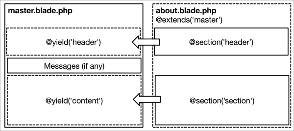

# 第三章。您的第一个应用程序

在了解了 Laravel 的约定、使用 Composer 处理依赖关系以及使用 Homestead 设置开发环境之后，您现在可以准备构建您的第一个应用程序了！

在本章中，您将以实际的方式使用前两章中介绍的概念，并学习如何执行以下操作：

+   规划您应用程序的 URL 和实体

+   在开始时解决常见问题

+   定义路由及其操作，以及模型及其关系

+   准备您的数据库并学习如何使用 Eloquent 与其交互

+   使用 Blade 模板语言创建分层布局

创建网络应用程序的第一步是确定和定义其需求。然后，一旦确定了主要功能，我们就推导出主要实体以及应用程序的 URL 结构。有一套明确的需求和 URL 对于其他任务（如测试）也是必不可少的；这将在本书的后续章节中介绍。

本章介绍了许多新概念。如果您对某些内容有疑问或不确定某个代码片段应该放在哪里，您可以下载应用程序的注释源代码，从 [`packtpub.com/support`](http://packtpub.com/support)，这将帮助您跟上进度。

# 规划我们的应用程序

我们将构建一个可浏览的猫档案数据库。访客将能够为他们的猫创建页面并填写基本信息，如每只猫的名字、出生日期和品种。此应用程序将实现默认的**创建-检索-更新-删除**（**CRUD**）操作。我们还将创建一个概述页面，用户可以选择按品种过滤猫。所有安全、身份验证和权限功能都故意省略，因为它们将在后续章节中介绍。

## 实体、关系和属性

首先，我们需要定义我们应用程序的*实体*。从广义上讲，实体是应用程序应该存储数据的东西（人、地点或对象）。根据需求，我们可以提取以下实体和属性：

+   **猫**：它们有一个数字标识符、一个名字、一个出生日期和一个品种

+   **品种**：它们只有一个标识符和一个名字

这些信息将帮助我们定义存储实体、关系、属性以及模型的数据库模式，这些模型是代表我们数据库中对象的 PHP 类。

## 我们应用程序的地图

我们现在需要考虑我们应用程序的 URL 结构。拥有干净且具有表达力的 URL 有很多好处。在可用性方面，应用程序将更容易导航，对用户来说看起来也不会那么令人生畏（描述性的 URL 比冗长的查询字符串更具吸引力）。对于频繁的用户来说，单独的页面更容易记住或收藏，如果它们包含相关关键词，它们通常在搜索引擎结果中排名更高。

为了满足初始的一组需求，我们需要在我们的应用程序中添加以下路由。路由是一个 URL 和 HTTP 方法，应用程序将对其做出响应。

| 方法 | 路由 | 描述 |
| --- | --- | --- |
| `GET` | `/` | 索引 |
| `GET` | `/cats` | 概览页面 |
| `GET` | `/cats/breeds/:name` | 特定品种的概览页面 |
| `GET` | `/cats/:id` | 单个猫页面 |
| `GET` | `/cats/create` | 创建新猫页面的表单 |
| `POST` | `/cats` | 处理创建新猫页面 |
| `GET` | `/cats/:id/edit` | 编辑现有猫页面的表单 |
| `PUT` | `/cats/:id` | 处理猫页面的更新 |
| `GET` | `/cats/:id/delete` | 确认删除页面的表单 |
| `DELETE` | `/cats/:id` | 处理猫页面的删除 |

你很快就会了解到 Laravel 如何帮助我们把这个路由草图变成实际的代码。如果你在没有框架的情况下编写过 PHP 应用程序，你可以简要地反思一下你将如何实现这样的路由结构。为了增加一些视角，这是第二个到最后一个 URL 可能看起来像的传统 PHP 脚本（没有 URL 重写）：`/index.php?p=cats&id=1&_action=delete&confirm=true`。

上述表格可以使用笔和纸、电子表格编辑器，甚至在你最喜欢的代码编辑器中使用 ASCII 字符来准备。在初始开发阶段，这个路由表是一个重要的原型工具，它让你首先考虑 URL，并帮助你迭代地定义和细化应用程序的结构。

如果你与 REST API 合作过，这种路由结构对你来说将很熟悉。在 RESTful 术语中，我们有一个`cats`资源，它响应不同的 HTTP 动词，并提供了一组额外的路由来显示必要的表单。

另一方面，如果你没有与 RESTful 站点合作过，`PUT`和`DELETE` HTTP 方法可能对你来说是新的。尽管网络浏览器不支持这些方法进行标准 HTTP 请求，但 Laravel 使用了一种其他框架（如 Rails）使用的技巧，通过在表单中添加一个`_method`输入字段来模拟这些方法。这样，它们可以通过标准的`POST`请求发送，然后被委派到应用程序中的正确路由或控制器方法。

注意，表单提交的端点都不是用 `GET` 方法处理的。这主要是因为它们有副作用；当用户在使用浏览器历史记录时，可能会意外地触发相同的操作多次。因此，当这些路由被调用时，它们永远不会向用户显示任何内容。相反，它们在完成操作后会将用户重定向（例如，`DELETE /cats/:id` 将将用户重定向到 `GET /cats`）。

# 启动应用程序

现在我们有了应用程序的蓝图，让我们卷起袖子开始编写一些代码。

首先打开一个新的终端窗口并启动 Homestead：

```php
$ homestead ssh

```

导航到您映射到 Homestead 的目录（默认情况下为 `~/Code`）：

```php
$ cd ~/Code

```

然后使用 Composer 创建一个新的 Laravel 项目，如下所示：

```php
$ composer create-project laravel/laravel furbook.com --prefer-dist
$ cd furbook.com

```

一旦 Composer 完成下载 Laravel 并解决其依赖关系，您将拥有与第一章中展示的相同的目录结构。

## 设置应用程序命名空间

Laravel 中的应用程序是命名空间的。默认情况下，这只是 `App`——Laravel 很棒，但它仍然无法猜测您应用程序的名称！为了将其设置为更合适的内容，我们可以使用 Artisan 命令：

```php
$ php artisan app:name Furbook

```

这将更新我们应用程序的命名空间为 `Furbook`。

# 编写第一个路由

让我们从编写应用程序在 `app/Http/routes.php` 中的前两个路由开始。此文件已经包含了一些注释以及一些示例路由。在添加以下路由之前，请删除现有路由（但保留开头的 `<?php` 声明）：

```php
Route::get('/', function() {
  return 'All cats';
});

Route::get('cats/{id}', function($id) {
  return sprintf('Cat #%s', $id);
});
```

`get` 方法的第一个参数是 URI 模式。当模式匹配时，第二个参数中的闭包函数会执行，并带有从模式中提取的任何参数。请注意，模式中的斜线前缀是可选的；然而，您不应该有任何尾随斜线。您可以通过打开您的网络浏览器并访问 `http://dev.furbook.com/cats/123` 来确保您的路由可以正常工作。

## 限制路由参数

在第二个路由的模式中，`{id}` 当前匹配任何字符串或数字。为了限制它只匹配数字，我们可以在路由上链式调用一个 `where` 方法，如下所示：

```php
Route::get('cats/{id}', function($id) {
  sprintf('Cat #%d', $id);
})->where('id', '[0-9]+');
```

`where` 方法接受两个参数：第一个是参数的名称，第二个是需要匹配的正则表达式模式。

如果您现在尝试访问一个无效的 URL，nginx（服务应用程序的服务器软件）将显示一个 **404 未找到** 错误页面。

## 处理 HTTP 异常

当您的应用程序发生错误时，Laravel 会抛出异常。这对于 HTTP 错误也是如此，因为 Laravel 会抛出适当的 HTTP 异常。通常，当发生 HTTP 错误时，您可能希望显示一个响应，告知用户出了什么问题。在 Laravel 5 中，这很容易，您只需要在 `resources/views/errors` 目录中创建一个以您希望显示的 HTTP 状态码命名的视图。

例如，如果你想显示**404 未找到**错误的视图，那么你只需要在`resources/views/errors/404.blade.php`创建一个视图。

你可以使用这种方法处理其他 HTTP 错误，例如**403 禁止访问**错误；只需在`resources/views/errors/403.blade.php`创建一个视图即可。

我们将在本章后面介绍视图。在此期间，你可以在[`en.wikipedia.org/wiki/List_of_HTTP_status_codes`](http://en.wikipedia.org/wiki/List_of_HTTP_status_codes)找到 HTTP 状态码列表。

## 执行重定向

你也可以使用路由中的`redirect()`辅助函数重定向访客。例如，如果我们想当访客第一次访问应用程序时被重定向到`/cats`，我们会编写以下代码行：

```php
Route::get('/', function() {
  return redirect('cats');
});
```

现在，我们可以为我们要重定向到的 URL 创建路由：

```php
Route::get('cats', function() {
  return 'All cats';
});
```

## 返回视图

你从路由返回的最常见的对象是`View`对象。视图从路由（或控制器操作）接收数据并将其注入到模板中，因此帮助你将应用程序中的业务逻辑和展示逻辑分离。

要添加第一个视图，只需在`resources/views`中创建一个名为`about.php`的文件，并将其内容添加到其中：

```php
<h2>About this site</h2>
There are over <?php echo $number_of_cats; ?> cats on this site!
```

然后，使用带有变量`$number_of_cats`的`view()`辅助函数返回视图：

```php
Route::get('about', function() {
  return view('about')->with('number_of_cats', 9000);
});
```

最后，在浏览器中访问`/about`以查看渲染的视图。这个视图是用纯 PHP 编写的；然而，Laravel 附带了一个强大的模板语言，称为 Blade，将在本章后面介绍。

# 准备数据库

在我们能够扩展路由的功能之前，我们需要定义应用程序的模型，准备必要的数据库模式，并在数据库中填充一些初始数据。

Homestead 内置了 MySQL 服务器，因此我们可以使用 MySQL 作为我们的数据库；然而，在我们可以使用应用程序中的 MySQL 数据库之前，需要先进行一些配置。

第一步是打开我们应用程序的配置文件，该文件应该在用 Composer 创建应用程序时创建，文件名为`.env`。找到写着`DB_DATABASE=homestead`的那一行，并将其更改为`DB_DATABASE=furbook`。

我们还可以将数据库名添加到我们的 Homestead 配置文件中，这样数据库就会自动为我们创建。从命令行打开文件，使用以下命令：

```php
$ homestead edit

```

在`databases`部分下，添加一行新内容：

```php
databases:
    - homestead
    - furbook

```

保存文件，然后运行`homestead provision`命令创建数据库。

## 创建 Eloquent 模型

第一步也是最简单的一步是定义我们的应用程序将要交互的模型。在本章的开始，我们确定了两个主要实体：*猫*和*品种*。Laravel 附带 Eloquent，这是一个强大的 ORM，允许你定义这些实体，将它们映射到相应的数据库表中，并使用 PHP 方法而不是原始 SQL 与之交互。按照惯例，它们以单数形式编写；名为`Cat`的模型将映射到数据库中的`cats`表，一个假设的`Mouse`模型将映射到`mice`表。你也可以使用名为`$table`的属性手动定义数据库表名，以防你的表名不符合 Laravel 期望的约定：

```php
protected $table = 'custom_table_name';
```

存储在`app/Cat.php`的`Cat`模型将与`Breed`模型有一个`belongsTo`关系，这在以下代码片段中定义：

```php
<?php namespace Furbook;

use Illuminate\Database\Eloquent\Model;

class Cat extends Model {
  protected $fillable = ['name','date_of_birth','breed_id'];
  public function breed() {
    return $this->belongsTo('Furbook\Breed');
  }
}
```

`$fillable` 数组定义了 Laravel 可以通过**批量赋值**填充的字段列表，这是一种方便地将属性分配给模型的方法。按照惯例，Laravel 将用于查找相关模型的列必须被命名为`breed_id`在数据库中。`Breed`模型，`app/Breed.php`，通过以下方式定义了反向的`hasMany`关系：

```php
<?php namespace Furbook;

use Illuminate\Database\Eloquent\Model;

class Breed extends Model {
  public $timestamps = false;
  public function cats(){
    return $this->hasMany('Furbook\Cat');
  }
}
```

默认情况下，Laravel 期望数据库表中有一个`created_at`和`updated_at`的时间戳字段。由于我们对于存储品种的时间戳不感兴趣，我们在模型中将`$timestamps`属性设置为`false`来禁用它们：

```php
protected $timestamps = false;
```

这是我们目前模型中所需的所有代码。随着我们在本书中的进展，我们将发现 Eloquent 的许多其他特性；然而，在本章中，我们将主要使用两种方法：`all()` 和 `find()`。为了说明它们的目的，以下是它们生成的 SQL 查询：

```php
Furbook\Breed::all()     => SELECT * FROM breeds;
Furbook\Cat::find(1)     => SELECT * FROM cats WHERE id = 1;
```

Eloquent 模型的属性可以通过`->`运算符检索：`$cat->name`。同样，相关模型的属性也可以通过以下方式访问：`$cat->breed->name`。在幕后，Eloquent 将执行必要的 SQL 连接。

## 构建数据库模式

现在我们已经定义了我们的模型，我们需要创建相应的数据库模式。得益于 Laravel 对迁移和强大的模式构建器的支持，你将不必编写任何 SQL 代码，你还可以在版本控制系统中跟踪任何模式更改。要创建你的第一个迁移，打开一个新的终端窗口并输入以下命令：

```php
$ php artisan make:migration create_breeds_table --create=breeds

```

这将在`database/migrations/`创建一个新的迁移。如果你打开新创建的文件，你会找到 Laravel 为你生成的某些代码。迁移总是有一个`up()`和`down()`方法，该方法定义了向上迁移或向下迁移时的模式更改。向上迁移是修改数据库模式（即，在以后日期添加一个表），而向下迁移则是撤销该模式更改的过程。按照惯例，表和字段名称以 snake_case 形式编写。此外，表名以复数形式书写。

我们的`breeds`表迁移将看起来像这样：

```php
  public function up() {
    Schema::create('breeds', function($table) {
      $table->increments('id');
      $table->string('name');
    });
  }
  public function down() {
    Schema::drop('breeds');
  }
```

我们可以通过重复此过程来创建我们的`cats`表模式：

```php
public function up() {
  Schema::create('cats', function($table) {
    $table->increments('id');
    $table->string('name');
    $table->date('date_of_birth');
    $table->integer('breed_id')->unsigned()->nullable();
    $table->foreign('breed_id')->references('id')->on('breeds');
  });
}
public function down() {
  Schema::drop('cats');
}
```

`date()`和`string()`方法在数据库中创建对应类型的字段（在这种情况下，为`DATE`和`VARCHAR`），`increments()`创建一个自动增长的`INTEGER`主键，而`timestamps()`则添加 Eloquent 默认期望的`created_at`和`updated_at DATETIME`字段。`nullable()`方法指定该列可以具有`NULL`值。

Laravel 提供了以下方法来定义迁移：

| 命令 | 描述 |
| --- | --- |

|

```php
$table->bigIncrements('name');

```

| 它创建了一个自动增长的整数列 |
| --- |

|

```php
$table->bigInteger('name');

```

| 它创建了一个`BIGINT`列 |
| --- |

|

```php
$table->binary('name');

```

| 它创建了一个`BLOB`列 |
| --- |

|

```php
$table->boolean('active');

```

| 它创建了一个`BOOLEAN`列 |
| --- |

|

```php
$table->char('name', 8);

```

| 它创建了一个指定长度的`CHAR`列 |
| --- |

|

```php
$table->date('birthdate');

```

| 它创建了一个`DATE`列 |
| --- |

|

```php
$table->dateTime('created_at');

```

| 它创建了一个`DATETIME`列 |
| --- |

|

```php
$table->decimal('amount', 5, 2);

```

| 它创建了一个具有指定精度和小数的`DECIMAL`列 |
| --- |

|

```php
$table->double('column', 10, 5);

```

| 它创建了一个带有 10 位总数和 5 位小数点的`DOUBLE`列 |
| --- |

|

```php
$table->enum('gender', ['Female', 'Male']);

```

| 它创建了一个`ENUM`列 |
| --- |

|

```php
$table->float('amount');

```

| 它创建了一个`FLOAT`列 |
| --- |

|

```php
$table->increments('id');

```

| 它创建了一个自动增长的整数列 |
| --- |

|

```php
$table->integer('rating');

```

| 它创建了一个`INTEGER`列 |
| --- |

|

```php
$table->json('options');

```

| 它创建了一个`JSON`列 |
| --- |

|

```php
$table->longText('description');

```

| 它创建了一个`LONGTEXT`列 |
| --- |

|

```php
$table->mediumInteger('name');

```

| 它创建了一个`MEDIUMINT`列 |
| --- |

|

```php
$table->mediumText('name');

```

| 它创建了一个`MEDIUMTEXT`列 |
| --- |

|

```php
$table->morphs('taggable');

```

| 它创建了两个列：`INTEGER taggable_id`和`STRING taggable_type` |
| --- |

|

```php
$table->nullableTimestamps();

```

| 这与时间戳（下一节）类似，但允许`NULL`值 |
| --- |

|

```php
$table->rememberToken();

```

| 它添加了一个`remember_token VARCHAR`列 |
| --- |

|

```php
$table->tinyInteger('name');

```

| 它创建了一个`TINYINT`列 |
| --- |

|

```php
$table->softDeletes();

```

| 它添加了一个用于软删除的`deleted_at`列 |
| --- |

|

```php
$table->string('name');

```

| 它创建了一个`VARCHAR`列 |
| --- |

|

```php
$table->string('name', 255);

```

| 它创建了一个指定长度的`VARCHAR`列 |
| --- |

|

```php
$table->text('name');

```

| 它创建了一个`TEXT`列 |
| --- |

|

```php
$table->time('name');

```

| 它创建了一个`TIME`列 |
| --- |

|

```php
$table->timestamp('name');

```

| 它创建了一个`TIMESTAMP`列 |
| --- |

|

```php
$table->timestamps();

```

| 它创建了`created_at`和`deleted_at`列 |
| --- |

我们还在`cats`迁移中创建了一个外键。这会将`breed_id`列的值链接到`breeds`表中的一个 ID。这样我们就不必反复指定品种名称。我们只需引用`breeds`表中的一条记录。如果该记录被更新，那么所有链接到它的`cats`也会被更新。

要运行这两个迁移，请输入以下命令：

```php
$ php artisan migrate

```

当它第一次运行时，此命令还将创建一个`migrations`表，Laravel 将使用它来跟踪已运行的所有迁移。然后它将运行任何未完成的迁移。在随后的运行中，命令将使用`migrations`表来确定是否有需要运行的迁移文件，如果有，则运行它们。

我们在`cats`表迁移之前创建了我们的`breeds`表迁移，因为我们`cats`表中有一个**外键**。如果我们尝试首先创建`cats`表，它将失败，因为它引用的列尚不存在。

## 初始化数据库

而不是手动填充我们的数据库，我们可以使用 Laravel 提供的初始化助手。这次，没有 Artisan 命令来生成文件，我们只需要在`database/seeds/`中创建一个名为`BreedsTableSeeder.php`的新类。这个类扩展了 Laravel 的`Seeder`类，并定义了以下`run()`方法：

```php
class BreedsTableSeeder extends Seeder {
  public function run() {
    DB::table('breeds')->insert([
      ['id' => 1, 'name' => "Domestic"],
      ['id' => 2, 'name' => "Persian"],
      ['id' => 3, 'name' => "Siamese"],
      ['id' => 4, 'name' => "Abyssinian"],
    ]);
  }
}
```

你可以在`run()`方法中批量插入一个数组，也可以插入任意代码来从 CSV 或 JSON 文件加载数据。还有第三方库可以帮助你生成大量测试数据来填充你的数据库，例如出色的 Faker。

为了控制初始化器的执行顺序，Laravel 允许你在`database/seeds/DatabaseSeeder.php`中单独调用它们。在我们的情况下，因为我们只有一个初始化器，我们只需要写以下这一行：

```php
$this->call('BreedsTableSeeder');
```

然后，我们可以通过调用它来初始化数据库，使用以下命令：

```php
$ php artisan db:seed
```

初始化对于最初填充数据库很有用。如果我们重新运行种子命令，实际上会得到一个错误，因为我们正在为我们的记录定义主键；如果我们尝试重新初始化，数据库将触发重复主键错误。我们可以首先截断表，但这在生产环境中部署时将是危险的，因为它将删除任何用户贡献的记录，以及你的种子数据定义！

# 掌握 Blade

现在我们已经在数据库中有了一些信息，我们需要定义将要显示这些信息的模板。Blade 是 Laravel 的轻量级模板语言，其语法非常容易学习。以下是一些 Blade 如何减少按键次数并提高模板可读性的示例：

| 标准 PHP 语法 | Blade 语法 |
| --- | --- |

|

```php
<?php echo $var; ?>
```

|

```php
{!! $var !!}
```

|

|

```php
<?php echo htmlentities($var); ?>
```

|

```php
{{ $var }}
```

|

|

```php
<?php if ($cond): ?>…<?php endif; ?>
```

|

```php
@if ($cond) … @endif
```

|

如果你使用默认的双大括号表示法，那么变量会被转义。这是为了防止 XSS 漏洞（在第七章中详细解释，*认证和安全*）。如果你确实需要未转义的变量原始值，那么你可以使用单大括号，并在每侧内部使用两个感叹号。你应该只在信任变量包含的值时这样做。

Blade 还支持 PHP 的所有主要结构来创建循环和条件：`@for`、`@foreach`、`@while`、`@if` 和 `@elseif`，允许您在模板的任何地方避免打开和关闭 `<?php` 标签。

## 创建主视图

Blade 允许您通过允许模板嵌套和扩展来构建分层布局。以下代码片段是我们将要用于我们应用程序的 **master** 模板。我们将将其保存为 `resources/views/layouts/master.blade.php`。

```php
<!DOCTYPE html>
<html lang="en">
  <head>
    <meta charset="utf-8" />
    <title>Furbook</title>
 <link rel="stylesheet" href="{{ asset('css/bootstrap.min.css') }}">
  </head>
  <body>
    <div class="container">
      <div class="page-header">
 @yield('header')
      </div>
 @if (Session::has('success'))
        <div class="alert alert-success">
 {{ Session::get('success') }}
        </div>
 @endif
 @yield('content')
    </div>
  </body>
</html>
```

Bootstrap CSS 框架被包含进来以加快应用程序界面的原型设计。您可以从 [`getbootstrap.com`](http://getbootstrap.com) 下载它，并将压缩后的 CSS 文件放置在 `public/css/` 目录下。为了确保其路径前缀设置正确，即使 Laravel 从子目录运行，我们使用 `asset()` 辅助函数。您可以通过访问 [`laravel.com/docs/helpers`](http://laravel.com/docs/helpers) 来查看您可用的完整的 Blade 模板辅助函数列表。

为了通知用户某些操作的结果，我们在页眉和页面内容之间准备了一个通知区域。这个 **flash data**（换句话说，仅对下一个请求可用的会话数据）是通过 `Session` 对象传递和检索的。

`@yield` 指令充当子视图可以填充和覆盖的不同部分的占位符。为了了解子模板如何重用它们，我们将通过将其扩展名更改为 `.blade.php` 并扩展我们的 `master` 布局模板来重新创建 `about` 视图：

```php
@extends('layouts.master')
@section('header')
  <h2>About this site</h2>
@stop
@section('content')
  <p>There are over {{ $number_of_cats }} cats on this site!</p>
@stop
```

`@section ... @stop` 指令定义了将要注入到主模板中的内容块。您可以在以下图表中看到这是如何完成的：



如果您现在在您的网络浏览器中重新打开 `/about` 路由，而不更改您之前的路由定义，您将看到新的视图。Laravel 的视图查找器将简单地使用新文件，并且由于它的名称以 `.blade.php` 结尾，所以将其视为 Blade 模板。

# 返回到路由

现在我们有一个可以扩展和重用的主布局模板，我们就可以开始在 `app/Http/routes.php` 中创建我们应用程序的各个路由，以及将显示应用程序数据的不同视图。

## 概览页面

这是将要显示所有猫的 *index* 页面，我们将使用 `cats.index` 视图来重用这个视图，因为这两个路由几乎相同。请注意，Laravel 预期您使用点表示法（`cats.index` 而不是 `cats/index`）来引用位于子目录中的视图：

```php
Route::get('cats', function() {
  $cats = Furbook\Cat::all();
  return view('cats.index')->with('cats', $cats);
});

Route::get('cats/breeds/{name}', function($name) {
 $breed = Furbook\Breed::with('cats')
 ->whereName($name)
 ->first();
  return view('cats.index')
    ->with('breed', $breed)
    ->with('cats', $breed->cats);
});
```

这些路由的唯一新特性是稍微更高级的 Eloquent 查询。虽然我们已经知道第一个路由中的 `all()` 方法从 `cats` 表中加载所有条目，但第二个路由使用了一个更复杂的查询。`with('cats')` 方法将加载任何相关的 `cat` 模型。`whereName` 是一个动态方法，它创建一个 `WHERE` SQL 子句，这将转换为 `WHERE name = $name`。这个长表达式将是 `where('name', '=', $name)`。最后，我们使用 `first()` 方法获取第一个品种记录（和相关猫模型）。

保存于 `cats/index.blade.php` 的模板将看起来像这样：

```php
@extends('layouts.master')

@section('header')
  @if (isset($breed))
    <a href="{{ url('/') }}">Back to the overview</a>
  @endif
<h2>
  All @if (isset($breed)){{ $breed->name }}@endif Cats

  <a href="{{ url('cats/create') }}" class="btn btn-primary pull-right">
    Add a new cat
  </a>
</h2>
@stop
@section('content')
  @foreach ($cats as $cat)
    <div class="cat">
      <a href="{{ url('cats/'.$cat->id) }}">
        <strong>{{ $cat->name }}</strong> - {{ $cat->breed->name }}
      </a>
    </div>
  @endforeach
@stop
```

通过使用 `foreach` 循环，视图遍历从路由接收到的猫列表。由于我们将使用此视图来显示索引页面（`/cats`）以及品种概述页面（`/cats/breeds/{breed}`），我们在两个地方使用了 `@if` 指令来条件性地显示更多信息。

## 显示猫的页面

下一个路由用于显示单个猫。要按其 ID 查找猫，我们使用 Eloquent 的 `find()` 方法：

```php
Route::get('cats/{id}', function($id) {
  $cat = Furbook\Cat::find($id);
  return view('cats.show) ->with('cat', $cat);
});
```

### 路由模型绑定

路由模型绑定是将路由参数自动转换为模型实例的方法，因此我们不必手动检索模型。由于这是一个非常常见的模式，Laravel 为你提供了一个自动将模型绑定到路由的方法，因此可以使你的代码更短、更易于表达。要将 `$cat` 变量绑定到 `Cat` 模型，打开 `app/Providers/RouteServiceProvider.php`。修改 `boot()` 方法，使其看起来像这样：

```php
public function boot(Router $router) {
  parent::boot($router);
  $router->model('cat', 'Furbook\Cat');
}
```

这允许你缩短路由，并将一个 `Cat` 对象传递给它：

```php
Route::get('cats/{cat}', function(Furbook\Cat $cat) {
  return view('cats.show')->with('cat', $cat);
});
```

视图 `cats/show.blade.php` 不包含任何新的指令。它只是显示猫的名字，并提供编辑或删除的链接。在 `content` 部分，如果设置了品种，我们返回其年龄和品种；这将在以下代码片段中显示：

```php
@extends('layouts.master')

@section('header')
  <a href="{{ url('/') }}">Back to overview</a>
  <h2>
      {{ $cat->name }}
  </h2>
  <a href="{{ url('cats/'.$cat->id.'/edit') }}">
    <span class="glyphicon glyphicon-edit"></span>
	Edit
  </a>
  <a href="{{ url('cats/'.$cat->id.'/delete') }}">
    <span class="glyphicon glyphicon-trash"></span>
	Delete
  </a>
  <p>Last edited: {{ $cat->updated_at->diffForHumans() }}</p>
@stop

@section('content')
  <p>Date of Birth: {{ $cat->date_of_birth }}</p>
  <p>
    @if ($cat->breed)
      Breed:
      {{ link_to('cats/breeds/'.$cat->breed->name, $cat->breed->name) }}
    @endif
  </p>
@stop
```

## 添加、编辑和删除猫

下一个系列的路由和视图将用于创建、编辑和删除一个猫页面。

直到版本 5，Laravel 附带了一个用于创建常见 HTML 和表单元素的包。在 Laravel 5 应用程序中，我们需要将此包重新投入使用。我们通过 Composer 来完成此操作。

在 `composer.json` 的 `require` 部分添加以下代码：

```php
"laravelcollective/html": "5.0.*"
```

然后运行 `$ composer update`。这将安装该包。接下来，我们需要注册服务提供者和外观。打开 `config/app.php` 并将以下内容添加到 `$providers` 数组中：

```php
'Collective\Html\HtmlServiceProvider',
```

然后将以下两行添加到 `$facades` 数组中：

```php
'Form' => 'Collective\Html\FormFacade',
'HTML' => 'Collective\Html\HtmlFacade',

```

这现在为我们提供了许多有用的方法，我们可以用这些方法在我们的模板中构建表单。

尽管 Blade 模板是分层的，但在视图中仍然可以包含其他模板，就像你可能习惯于使用 PHP 中的 `include()` 或 `require()` 函数一样。我们将使用此功能来共享创建和编辑模板所需的形式字段。

在 `resources/views/partials/forms/cat.blade.php` 中添加以下内容：

```php
<div class="form-group">
  {!! Form::label('name', 'Name') !!}
  <div class="form-controls">
    {!! Form::text('name', null, ['class' => 'form-control']) !!}
  </div>
</div>
<div class="form-group">
  {!! Form::label('date_of_birth', 'Date of Birth') !!}
  <div class="form-controls">
    {!! Form::date('date_of_birth', null, ['class' => 'form-control']) !!}
  </div>
</div>
<div class="form-group">
  {!! Form::label('breed_id', 'Breed') !!}
  <div class="form-controls">
    {!! Form::select('breed_id', $breeds, null, ['class' => 'form-control']) !!}
  </div>
</div>
{!! Form::submit('Save Cat', ['class' => 'btn btn-primary']) !!}
```

`Form::select()`辅助函数构建一个包含不同选择的`<select>`下拉菜单。它期望将选择列表传递到一个多维数组中。我们不需要将此数组绑定到每个路由，可以使用 Laravel 的另一个特性——视图组合器，它允许你每次将一个变量绑定到特定的视图。

我们可以通过将其添加到应用程序的服务提供者中来初始化一个视图组合器。打开`app/Providers/AppServiceProvider.php`并修改`boot()`方法，使其看起来像这样：

```php
public function boot(ViewFactory $view) {
  $view->composer('partials.forms.cat', 'App\Http\Views\Composers\CatFormComposer');
}
```

我们还需要解析`ViewFactory`。在文件顶部，在命名空间声明之下，添加以下行：

```php
use Illuminate\Contracts\View\Factory as ViewFactory;
```

现在我们需要创建实际的视图组合器类。我们已经指定了路径，所以让我们创建文件并添加以下代码到其中：

```php
<?php namespace Furbook\Http\Views\Composers;
use Furbook\Breed;
use Illuminate\Contracts\View\View;

class CatFormComposer {
  protected $breeds;
  public function __construct(Breed $breeds) {
    $this->breeds = $breeds;
  }
  public function compose(View $view) {
    $view->with('breeds', $this->breeds->lists('name', 'id');
  }
}
```

现在当调用`partials.forms.cat`模板部分时，视图组合器开始工作。当 Laravel 实例化它时，它会读取构造函数并自动注入指定类型的实例。在我们的视图组合器构造函数中，我们指定需要一个`Breed`模型实例，然后将该实例存储为类属性。

一旦视图组合器初始化完成，就会调用`compose()`方法。这是数据绑定到视图的实际发生之处。由于我们的模型是 Eloquent 模型，我们可以使用`lists()`方法来获取所有记录的关联数组，这正是我们为我们的`select`列表所需要的。第一个参数是用户将看到的值（在这个例子中是品种名称）和第二个参数是将在`<option>`标签中用作`value`属性的值（品种 ID）。

现在我们有一个部分表单，当请求时自动注入品种选项，我们可以继续构建创建、编辑和删除视图。

创建视图很简单：我们扩展主布局，打开表单，然后包含我们刚刚创建的部分。在`resources/views/cats/create.blade.php`中添加以下代码：

```php
@extends('layouts.master')
@section('header')
  <h2>Add a new cat</h2>
@stop
@section('content')
  {!! Form::open(['url' => '/cats']) !!}
    @include('partials.forms.cat')
  {!! Form::close() !!}
@stop
```

编辑模板（`resources/views/cats/edit.blade.php`）看起来类似，除了几个小的改动：

```php
@extends('layouts.master')
@section('header')
  <h2>Edit a cat</h2>
@stop
@section('content')
  {!! Form::model($cat, ['url' => '/cats/'.$cat->id],
    'method' => 'put') !!}
    @include('partials.forms.cat')
  {!! Form::close() !!}
@stop

```

在部分视图中，我们没有包含开始和结束的表单标签，因为我们需要根据操作改变动作 URL 和方法。此外，在编辑模板中，我们使用表单模型绑定将传递给模板的`Cat`实例绑定到表单上。这会自动将表单字段的值填充为我们的`Cat`模型实例中的属性值。

现在我们有了视图，我们可以创建相应的路由：

```php
Route::get('cats/create', function() {
  return view('cats.create');
});

Route::post('cats', function() {
 $cat = Furbook\Cat::create(Input::all());
  return redirect('cats/'.$cat->id)
    ->withSuccess('Cat has been created.');
});

Route::get('cats/{cat}/edit', function(Furbook\Cat $cat) {
  return view('cats.edit')->with('cat', $cat);
});

Route::put('cats/{cat}', function(Furbook\Cat $cat) {
 $cat->update(Input::all());
  return redirect('cats/'.$cat->id)
    ->withSuccess('Cat has been updated.');
});

Route::delete('cats/{cat}', function(Furbook\Cat $cat) {
 $cat->delete();
  return redirect('cats')
    ->withSuccess('Cat has been deleted.');
});
```

您可能已经注意到，在先前的路由中，正在使用一个新的方法`withSuccess()`与我们的重定向一起使用。这不是一个明确定义的方法；相反，它是 Laravel 中**重载**的一个例子。在重定向的上下文中，Laravel 查看以`with`开头的调用方法；它将后一部分分配给会话闪存数据。这包括将在下一个请求中可用的会话变量，以及下一个请求仅有的变量。这使得它非常适合像成功消息这样的单次使用数据，正如我们之前所看到的。

如果您回顾我们的主布局模板，您可以看到我们提供了检查具有键`success`的任何会话变量的方法；如果存在，我们只需在 Bootstrap 成功警报中显示它。

应用程序接收到的任何输入数据，您通常通过`$_GET`或`$_POST`变量访问，现在可以通过使用`Input::get()`方法检索。您还可以使用`Input::all()`检索所有输入数据的数组。在`POST /cats`和`PUT /cats/{cat}`路由中，我们分别使用 Eloquent 的`create()`和`update()`方法，并将`Input::all()`作为它们的参数。这仅因为我们之前在`Cat`模型中指定了可填充的字段。

现在我们有一个可以工作的应用程序，用户可以添加、编辑和删除猫。

# 从简单路由到强大的控制器

到目前为止，我们一直在创建**基于闭包的路由**。这对于快速原型设计应用程序来说很棒，在像**Silex**和**Slim**这样的微框架中很常见；然而，随着应用程序的增长，这种方法可能会变得繁琐和限制。定义当请求路由时要执行的逻辑的替代（且推荐）方法是使用控制器，即 MVC 中的 C。

控制器通常是一个类，包含一个或多个方法，也称为**动作**。您通常有一个路由映射到控制器动作。

考虑以下示例：

```php
Route::get('user/{id}', ['middleware' => ['auth'], function($id) {
  // Perform some operations
  return 'Something';
}]);
```

要使用控制器实现相同的功能并从路由中删除业务逻辑，请在新文件`app/Http/Controllers/UserController.php`中创建：

```php
<?php namespace Furbook\Http\Controllers;

class UserController extends Controller {
  public function __construct()
  {
    $this->middleware('auth');
  }
  public function show($id)
  {
    $this->doSomething();
    return 'Something';
  }
  protected function doSomething()
  {
    // Perform some operations
  }
}
```

这种方法可以大大提高代码的可重用性和可测试性，特别是如果您的理论`doSomething()`方法在多个控制器动作中使用。您可以在隔离的情况下测试它一次，然后依赖它。当您进入更高级的主题，如依赖注入时，您甚至可以在实例化控制器时替换整个类，但这里我们不会涉及这一点。

最后，为了告诉 Laravel 使用哪个控制器动作，只需将路由声明重写如下：

```php
Route::get('user/{id}', ['uses' => 'UserController@show']);
```

根控制器命名空间（`App\Http\Controllers`）自动添加到控制器类名之前，以避免为每个路由指定它的任务。

## 资源控制器

Laravel 通过资源控制器极大地简化了 REST API 的创建。由于它们遵循约定，因此从控制器中可以执行的操作集合是有限的。实际上，我们之前创建的所有路由都可以重写如下：

```php
Route::resource('cat', 'CatController');
```

这将注册以下路由：

| 动词 | 路径 | 操作 | 路由名称 |
| --- | --- | --- | --- |
| `GET` | `/cat` | 列表 | `cat.index` |
| `GET` | `/cat/create` | 创建 | `cat.create` |
| `POST` | `/cat` | 存储 | `cat.store` |
| `GET` | `/cat/{id}` | 显示 | `cat.show` |
| `GET` | `/cat/{id}/edit` | 编辑 | `cat.edit` |
| `PUT/PATCH` | `/cat/{id}` | 更新 | `cat.update` |
| `DELETE` | `/cat/{id}` | 删除 | `cat.destroy` |

然后，在你的`CatController`类中，你将拥有所有不同的操作：`index`、`create`、`show`、`edit`等等。这些操作将被连接到正确的路由和 HTTP 动词。

你可以使用以下 Artisan 命令创建一个资源控制器存根：

```php
$ php artisan make:controller CatController

```

为什么不尝试将基于闭包的路由操作重写为你的新`CatController`类呢？

# 摘要

我们在本章中涵盖了大量的内容。你学习了如何定义路由、准备应用程序的模型以及与之交互。此外，我们还对 Eloquent、Blade 以及其他 Laravel 中方便的辅助功能进行了简要了解，这些功能可以帮助创建表单和输入字段——所有这些都在 200 行代码以下完成！

在下一章中，你将了解更多关于 Laravel 强大 ORM，Eloquent 的信息，它允许你无需编写一行 SQL 语句即可执行强大的数据库查询。
