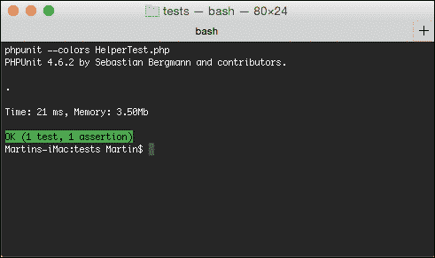

# 第五章 测试 – 比您想象的要简单

测试是 PHP 开发中经常被忽视的部分。与 Java 和 Ruby 等语言相比，在这些语言中测试被深深植根于开发者的工作流程中，PHP 在这方面落后了。这主要是因为简单的 PHP 应用程序往往耦合紧密，因此难以测试。然而，得益于标准化和模块化努力以及鼓励关注点分离的框架，PHP 测试变得更加容易接近，并且对其的态度正在慢慢改变。

Laravel 5 是一个从头开始构建以促进测试的框架。它包含所有必要的文件以开始，以及不同的辅助工具来测试您的应用程序，从而帮助初学者克服一些最大的障碍。

在本章中，我们将展示 Laravel 如何使您轻松开始测试，而无需强迫您采取测试优先的方法，或使您追求完整的测试覆盖率。在这个轻松的测试介绍中，我们将探讨以下主题：

+   为您的应用程序编写测试的优势

+   如何准备您的测试

+   Laravel 培养的软件设计模式

+   如何使用 Mockery 单独测试对象

+   方便测试的内置功能和辅助工具

# 测试的好处

如果您之前没有为您的 Web 应用程序编写过测试，测试的优势可能并不总是对您显而易见。毕竟，准备和编写测试需要大量的时间投入，对于短期原型或黑客马拉松项目来说，它们甚至可能看起来是完全浪费时间。然而，在几乎所有其他情况下，当您的项目可能变得复杂，或者当您与其他开发者合作时，测试有可能为您和其他人节省大量时间和头疼。

测试也会对您的流程带来一些变化。在开发阶段，您将不再需要在代码编辑器和 Web 浏览器之间来回切换。相反，如果您使用的是支持测试运行器的文本编辑器或 IDE，您可以将测试运行器绑定到一个键盘快捷键上。

一旦您证明某个功能部分工作正常，您将有一种快速确保它在以后日期代码更改后仍然按预期工作的方式。此外，它迫使您明确且无歧义地定义应用程序的预期行为，因此可以补充或替代大量文档。这特别有助于新开发者开始参与项目合作，如果您有一段时间没有接触过项目，这也对您自己特别有帮助。

# 测试的结构

你的应用程序测试将位于`tests/`目录中。在这个目录中，你将找到一个`TestCase.php`中的基本测试用例，它负责在测试环境中启动应用程序。这个类扩展了 Laravel 的主要`TestCase`类，该类反过来又扩展了`PHPUnit_Framework_TestCase`类，以及我们将在本章后面讨论的许多有用的测试方法。你所有的测试都将扩展这个第一个`TestCase`类，并定义一个或多个旨在测试应用程序一个或多个功能的函数。

在每个测试中，我们通常执行以下三个不同的任务：

1.  我们*安排*或初始化一些数据。

1.  我们执行一个函数来对这份数据进行*操作*。

1.  我们*断言*或验证输出是否与预期相符。

假设我们有一个以下辅助类：

```php
class Helper {public static function sum($arr) { return array_sum($arr); }}
```

一个示例测试用例，`HelperTest.php`，它展示了前面的三个步骤，看起来是这样的：

```php
class HelperTest extends PHPUnit_Framework_TestCase {
  public function testSum() {
 $data = [1,2,3];                   // 1) Arrange
 $result = Helper::sum($data);      // 2) Act
 $this->assertEquals(6, $result);   // 3) Assert
  }
  public function testSomethingElse() {
    // ...
  }
}
```

当执行前面的代码片段时，PHPUnit 将运行测试用例中的每个方法，并跟踪测试失败或通过的数量。如果你的系统上安装了 PHPUnit，你可以使用以下命令运行此测试：

```php
$ phpunit --colors HelperTest.php

```

这将产生以下输出：



### 提示

大多数代码编辑器还提供了通过按快捷键直接在编辑器中运行测试的方法。此类编辑器的例子包括**PhpStorm**。甚至可以在每次提交之前或在你将代码部署到远程服务器之前自动运行它们。

# 使用 PHPUnit 进行单元测试

测试的一个积极影响是它迫使你将代码拆分成可管理的依赖项，这样你就可以单独测试它们。对这些单个类和方法的测试被称为**单元测试**。由于它依赖于 PHPUnit 测试框架，该框架已经提供了大量设置测试套件的工具，因此 Laravel 不需要为此类型测试提供任何额外的辅助函数。

了解任何框架的绝佳方式，同时了解它如何被测试的不同方式，是查看其作者如何为其编写测试。因此，我们的下一个示例将直接来自 Laravel 的测试套件，该套件位于`vendor/laravel/framework/tests/`。

## 使用断言定义你期望的内容

断言是单元测试的基本组成部分。简单来说，它们用于比较函数的*预期输出*与其*实际输出*。

要了解断言是如何工作的，我们将检查`Str::is()`辅助函数的测试，该函数用于检查给定的字符串是否与给定的模式匹配。

以下测试可以在`Support/SupportStrTest.php`文件的底部找到：

```php
use Illuminate\Support\Str;
class SupportStrTest extends PHPUnit_Framework_TestCase {
  // ...
  public function testIs()
  {
    $this->assertTrue(Str::is('/', '/'));
    $this->assertFalse(Str::is('/', ' /'));
    $this->assertFalse(Str::is('/', '/a'));
    $this->assertTrue(Str::is('foo/*', 'foo/bar/baz'));
    $this->assertTrue(Str::is('*/foo', 'blah/baz/foo'));
  }
}
```

前面的测试执行了五个断言，以测试当使用不同的参数调用方法时，它是否确实返回了预期的值。

PHPUnit 提供了许多其他断言方法，例如，你可以使用 `assertGreaterThan()` 测试数值，使用 `assertEquals()` 测试相等性，使用 `assertInstanceOf()` 测试类型，或者使用 `assertArrayHasKey()` 测试存在性。虽然还有更多可能的断言，但这些都是你可能会最频繁使用的。总而言之，PHPUnit 提供了大约 40 种不同的断言方法，所有这些方法都在官方文档中有详细描述，请参阅 [`phpunit.de/manual/`](http://phpunit.de/manual/)。

## 准备场景和清理对象

如果你需要在每个测试方法之前运行一个函数来设置一些测试数据或减少代码重复，你可以使用 `setUp()` 方法。另一方面，如果你需要在每个测试之后运行一些代码来清除测试中创建的任何对象，你可以在 `tearDown()` 方法中定义它。一个很好的例子是在 `setUp()` 方法中插入到数据库中的任何记录。

## 预期异常

你也可以通过在函数上装饰 `@expectedException` DocBlock 来测试异常，就像 Laravel 在 `Database/ DatabaseEloquentModelTest.php` 中所做的那样：

```php
/**
 * @expectedException Illuminate\Database\Eloquent\MassAssignmentException
 */
public function testGlobalGuarded()
{
  $model = new EloquentModelStub;
  $model->guard(['*']);
  $model->fill(['name' => 'foo', 'age' => 'bar', 'votes' => 'baz']);
}
```

在这个测试函数中，没有断言，但预期当它执行时将抛出异常。同时请注意 `EloquentModelStub` 对象的使用。存根创建了一个对象的实例，该对象提供了或模拟了我们类需要的某些方法——在这种情况下，是一个我们可以调用 `guard()` 和 `fill()` 方法的 Eloquent 模型。如果你查看测试中更下面的存根定义，你会看到它实际上并没有与数据库交互，而是提供了预定义的响应。

## 隔离测试相互依赖的类

除了我们在上一节中查看的存根之外，还有另一种方法可以用来隔离测试一个或多个相互依赖的类。这是通过使用 **模拟** 来实现的。在 Laravel 中，使用 Mockery 库创建模拟，它们有助于定义测试期间应该调用哪些方法，它们应该接收哪些参数，以及它们的返回值。Laravel 在其自己的测试中大量依赖模拟。一个例子可以在 `AuthEloquentUserProviderTest` 类中找到，其中 `Hasher` 类被模拟：

```php
use Mockery as M;

class AuthEloquentUserProviderTest extends PHPUnit_Framework_TestCase {

  public function tearDown(){
    M::close();
  }
  // ...

  public function getProviderMock() {
    $hasher = m::mock('Illuminate\Contracts\Hashing\Hasher');
    return $this->getMock('Illuminate\Auth\EloquentUserProvider', array('createModel'), array($hasher, 'foo'));
  }
}
```

与存根不同，模拟允许我们定义需要调用哪些方法，它们应该被调用多少次，它们应该接收哪些参数，以及它们应该返回哪些参数。如果任何这些前提条件没有得到满足，测试将失败。

为了确保我们没有持久化的模拟对象实例，它可能会干扰未来的测试，Mockery 提供了一个 `close()` 方法，需要在每次测试后执行。多亏了这个模拟，我们可以在完全隔离的情况下测试这个类。

# 端到端测试

当我们确信所有相互依赖的类都按预期工作后，我们就可以进行另一种类型的测试。这包括模拟用户通过网页浏览器进行的交互。例如，这个用户会访问特定的 URL，执行某些操作，并期望从应用程序看到某种形式的反馈。

这可能是最直接的测试类型，因为它模仿了每次代码更改后刷新浏览器时手动执行的测试类型。当你开始时，只执行这种类型的测试是完全正常的。然而，你必须记住，如果发生任何错误，你仍然需要深入到代码中找到导致错误的精确组件。

## 测试 - 包含电池

当你使用 Laravel 开始一个新项目时，你将在项目的根目录中提供一个配置文件`phpunit.xml`，其中包含 PHPUnit 的合理默认设置，以及一个名为`tests/`的目录，你可以在其中保存你的测试。此目录甚至包含一个示例测试，你可以将其用作起点。

在这些设置到位后，从我们项目的根目录，我们只需要 SSH 到我们的 Homestead 虚拟机并运行以下命令：

```php
$ phpunit

```

此命令将读取 XML 配置文件并运行我们的测试。如果在这一阶段，你收到一个错误消息告诉你 PHPUnit 找不到，你可能需要将`phpunit`命令添加到你的`PATH`变量中，或者使用 Composer 安装它。

Laravel 应用程序在`composer.json`文件的`autoload-dev`块中已经声明了 PHPUnit。在运行`composer update`之后，你将能够使用以下命令调用 PHPUnit：

```php
$ vendor/bin/phpunit

```

## 框架断言

现在我们已经了解了两种主要的测试类型并且已经安装了 PHPUnit，我们将为我们在第三章中开发的程序编写一些测试，*你的第一个应用程序*。

这个第一次测试将验证访问者在首次访问我们的网站时是否被重定向到正确的页面：

```php
  public function testHomePageRedirection() {
    $this->call('GET', '/');
    $this->assertRedirectedTo('cats');
  }
```

在这里，我们使用了`call()`方法来模拟对应用程序的请求，该请求通过 Laravel 的 HTTP 内核执行请求。然后，我们使用了 Laravel 提供的断言方法之一来确保响应是重定向到新位置。如果你现在运行`phpunit`命令，你应该看到以下输出：

`OK (1 test, 2 assertions)`

接下来，我们可以尝试编写一个测试来确保创建表单对未登录的用户不可用；这在上面的代码片段中显示：

```php
  public function testGuestIsRedirected() {
    $this->call('GET', '/cats/create');
    $this->assertRedirectedTo('login');
  }'
```

## 模拟用户

有时候，你可能希望以注册用户身份运行测试。这可以通过使用`be()`方法和传递一个`User`实例或你使用的任何 Eloquent 模型到其中，以及 Laravel 的认证类来实现：

```php
  public function testLoggedInUserCanCreateCat() {
    $user = new App\User([
      'name' => 'John Doe',
      'is_admin' => false,
    ]);
    $this->be($user);
    $this->call('GET', '/cats/create');
    $this->assertResponseOk();
  }

```

## 带数据库的测试

虽然一些开发者会建议不要编写针对数据库的测试，但通常这是一种简单而有效的方法，以确保所有组件按预期协同工作。然而，这应该在每个单独的单元测试之后才进行。我们也不应忘记 Laravel 支持迁移和数据填充；换句话说，它拥有从头开始重新创建相同数据结构所需的所有工具，在每次测试之前。

要编写依赖于数据库的测试，我们需要在我们的测试中覆盖`setUp()`方法，每次运行测试时都要迁移和填充数据库。运行父`setUp()`方法也很重要，否则测试用例将无法正确启动：

```php
  public function setUp(){
    parent::setUp();
    Artisan::call('migrate');
    $this->seed();
  }
```

然后，我们需要在`config/database.php`中配置测试数据库连接；如果应用程序不包含任何特定于数据库的查询，我们可以通过设置`:memory:`而不是数据库文件的路径来使用 SQLite 的内存功能。以下配置也有可能加快我们的测试速度：

```php
'sqlite' => [
  'driver'   => 'sqlite',
  'database' => ':memory:',
],
```

最后，由于我们将要测试编辑和删除功能，我们至少需要在数据库的`cats`表中有一行，因此我们准备了一个填充器，将插入一个强制`id`值为`1`的猫：

```php
class CatsTableSeeder extends Seeder {
  public function run(){
    Cat::create(['id' => 1, 'name' => '''Tom', 'user_id' => 1]);
  }
}
```

一旦完成，我们就可以按照以下方式测试删除功能：

```php
public function testOwnerCanDeleteCat() {
  $user = new App\User(['id' => 1, 'name' => 'User #1',
    'is_admin' => false]);
  $this->be($user);
  $this->call('DELETE', '/cats/1');
  $this->assertRedirectedTo('/cats');
  $this->assertSessionHas('message');
}

```

注意，这次我们不需要启用过滤器，因为权限是由`User`模型中的方法检查的。由于数据库在每次测试后都会被清除并重新填充，所以我们不需要担心之前的测试删除了那个特定的猫。我们还可以编写一个测试来确保非管理员用户无法编辑其他人的猫资料：

```php
public function testNonAdminCannotEditCat() {
  $user = new App\User(['id' => 2, 'name' => 'User #2',
    'is_admin' => false]);
  $this->be($user);
  $this->call('DELETE', '/cats/1');
  $this->assertRedirectedTo('/cats/1');
  $this->assertSessionHas('error');
}

```

## 检查渲染的视图

由于 Laravel 自带了 Symfony 的`DomCrawler`和`CssSelector`组件，因此可以检查渲染视图的内容。通过通过测试客户端实例发出请求`$this->client->request()`，可以使用 CSS 查询过滤其内容，如下所示：

```php
public function testAdminCanEditCat() {
  $user = new App\User(['id' => 3, 'name' => 'Admin',
    'is_admin' => true));
  $this->be($user);
  $newName = 'Berlioz';
  $this->call('PUT', '/cats/1', ['name' => $newName]);
 $crawler = $this->client->request('GET', '/cats/1');
 $this->assertCount(1, $crawler->filter('h2:contains("'.$newName.'")'));
}
```

`DomCrawler`组件的完整文档可以在[`symfony.com/doc/current/components/dom_crawler.html`](http://symfony.com/doc/current/components/dom_crawler.html)找到。如果你已经熟悉 jQuery，其语法将对你来说很熟悉。

# 摘要

虽然测试背后的主要思想很容易理解，但它们的实现往往可能成为障碍，尤其是在使用新框架时。然而，在阅读本章之后，你应该对如何测试你的 Laravel 应用程序有一个很好的概述。本章中介绍的技术将使你能够编写更健壮和面向未来的应用程序。

在下一章中，我们将探讨 Artisan 提供的可能性，它是 Laravel 的命令行实用工具。
