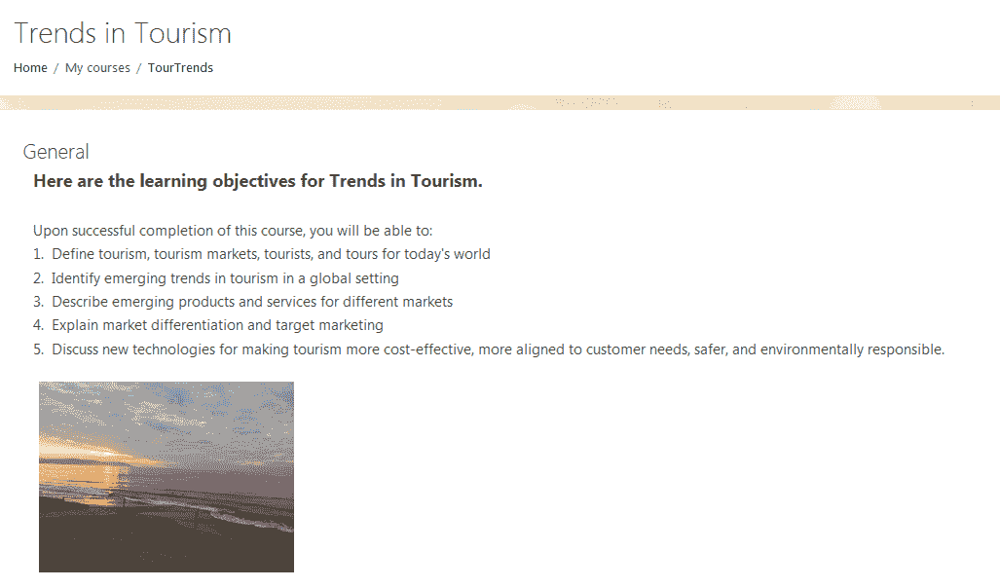
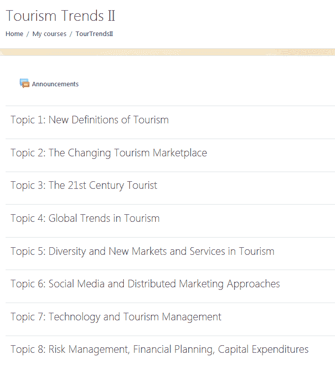
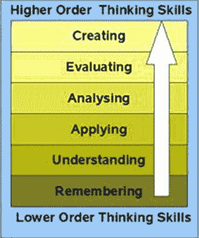
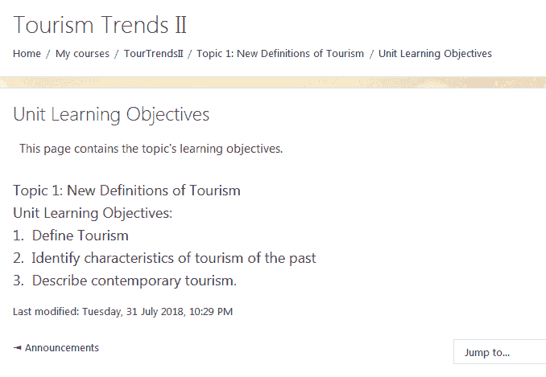
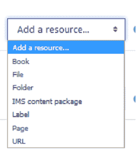
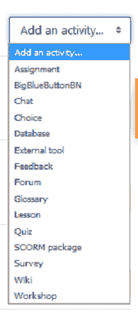

# 第二章：规划你的课程

在上一章中，我们回顾了 Moodle 的基础知识，并学习了如何开始使用网站级别的设置和配置。现在，我们将退一步，回顾一下教学法和教学设计的基础知识。它们在你设置教育项目和构建 Moodle 课程时非常重要。如果你在早期过程中没有考虑教学法和技术设计，你可能会面临需要后来重建课程的风险，这可能会非常繁琐、耗时且昂贵（从劳动力的角度来看）。因此，将这一章节添加到书签并经常回顾是一个好主意，每次你开始开发新的项目、课程模板、演示课程或个人课程时，都要回到这里。

让我们从一个问题开始：在你完成课程后，你希望你的学生能够做什么？

这听起来像是一个简单的问题，但它对于设置有效的 Moodle 课程结构以及选择最佳资源、活动和评估至关重要。*你将把所有的资源、活动和评估映射到学习目标上，因此学习目标（即学生应能够做什么的具体陈述，以展示他们的知识或技能）是你应该在每一个可能的时刻牢记在心的。*

因此，在你规划课程时，牢记你希望学生学到什么，然后，你希望他们如何展示他们的技能和知识，这一点尤为重要。通过这样做，你可以规划你的课程，使其具有清晰、逻辑的结构，并且各个要素能够紧密相连并相互加强。

我们将学习如何将课程级别的学习成果作为你课程的基础。使用课程级别的学习成果，我们将从“大局观”开始。然后，我们将更仔细地查看你课程中的每个部分，并学习如何创建更具体的学习成果，这些成果将作为框架，将大局目标与课程资源、活动和评估联系起来。有了这样一个坚实的基础和框架，你在构建课程的过程中永远不会感到迷茫或沮丧。相反，当你选择课程资源、活动和评估时，你会感到自信。

在本章中，我们将讨论以下主题：

+   编写和使用贯穿课程的学习成果

+   概述学习成果的重要性

+   理想课程结构

+   **通用学习设计**（**UDL**）

+   选择资源和活动

+   有效的评估策略

# 学习成果

开始规划你的课程的一个最好的方式是思考你希望学生在成功完成课程后能够做什么。同时，设想他们应该如何展示他们新的知识或技能也是好的。学生通过参加课程所能做到的事情就是课程的学习成果。这两个术语都指的是课程的概念，即它们不仅关注要覆盖的内容，还关注课程完成后产生的技能、能力、信念和态度。

将你的学习目标放在课程首页上是很重要的，这样它们就能始终在学生的脑海中。以下是从课程“旅游趋势”中的一个例子。注意学习目标是如何出现在首页上的，并且它们旁边有一张照片来帮助引起注意，而不会分散注意力：

学习成果包括学生在完成课程后应获得的知识、技能和能力。学习成果也有其他名称，通常被称为课程成果、课程目标、学习目标和学生学习成果。在所有情况下，它们都很重要，因为它们塑造了课程的各个方面，从选择内容到活动，再到创建评估，以确定课程或学习计划是否有效。

你可以在伦斯勒理工学院教务处的“*撰写学习成果的快速提示*”部分了解更多关于学习成果的信息。请访问此部分：[`provost.rpi.edu/learning-assessment/learning-outcomes/quick-tips-writing-learning-outcomes`](http://provost.rpi.edu/learning-assessment/learning-outcomes/quick-tips-writing-learning-outcomes)。

当你考虑你希望你的学生做什么时，你正在采用一种以学生为中心的方法，这种方法更强调他们应该如何做某事，而不是他们应该做什么，这导致了一种更积极的方法。与其考虑你希望教什么，不如考虑如何促进学习过程。

# 将认知心理学应用于学习

对于那些对表面之下发生的事情感兴趣的人，让我们花一点时间回顾一下学习过程中涉及到的认知过程。在设计课程时，我们应该考虑心灵如何形成意义，知识如何产生，以及创造最佳学习环境的理想条件是什么。

认知心理学是社会科学的一个类别，它涵盖了学习过程，并且完美地包含了我们设计优秀课程必须理解的过程。

为了保持清晰的焦点，我们将从学习目标（也称为*成果*）开始和结束。学习目标包括学习中的认知心理学过程和领域。那么，我们如何编写好的学习目标呢？因为你在关注学生的表现，考虑到你希望你的学生做什么以及他们应该如何展示他们新的知识、技能和能力，所以你的成果需要带有行动计划来编写。

因此，我们可以在开发 Moodle 课程的过程中从一开始就应用这些想法。我们有学习成果。现在 Moodle 为我们提供了结构化课程的机会，以便每个单元都与一个主题相关联。每个主题可以直接链接到一个学习目标或课程成果。

这里有一个来自旅游趋势课程的例子。第一页有整体的学习目标，然后，当我们为课程创建结构时，每个主题对应一个学习目标。注意截图中的八个主题。如果这是一个八周的课程，每个主题可以对应一周。如果是一个 16 周的课程，每个主题可以对应两周。

因此，在确定你的课程学习目标的过程中，将这些目标记下来。你可能会有一个很长的列表，但后来，确保你选择那些最能反映你希望学生达到的目标。我们希望遵循最佳的教学设计实践，因此我们建议你的最终列表中不应超过六个或七个目标。

你可以在 Walter Dick 和 Lou Cary 于 1978 年出版的经典作品《系统化教学设计》中了解更多关于开发学习和绩效最佳实践的信息。他们的工作影响深远，因此被称为*Dick and Carey 系统方法模型*，并被教学设计师和培训开发者广泛采用。关于*Dick and Carey 系统方法模型*的概述，你可以访问[`www.nwlink.com/~donclark/history_isd/carey.html`](http://www.nwlink.com/~donclark/history_isd/carey.html)上的 Big Dog & Little Dog 的绩效对比页面。

为了将你非正式的期望结果列表转换为正式的学习成果陈述，你可以从使用**SMART**方法中受益，该方法最初由 George T Doran 在 1981 年 11 月的《管理评论》杂志上发表。自首次出版以来，它已成为许多需要衡量目标和成果的应用中非常受欢迎的方法。这些标准对于确保你的陈述完整非常方便。此外，它们对于目标设定和激励也非常好。以下是 SMART 指南，其中你的成果应如下所示：

+   **具体**：确保期望的结果不要过于宽泛

+   **可衡量**：包括数量或衡量进展的方式

+   **可实现**：你的期望结果需要是可实现的

+   **相关**：确保期望的结果与你的课程相关

+   **时间限制**：明确说明目标应实现的时间

当你撰写 SMART 目标时，务必避免使用诸如*理解*、*欣赏*、*了解*、*熟悉*和*提高意识*等动词或短语。相反，使用表示可衡量结果的主动动词和短语，例如*识别*、*描述*、*分析*、*评估*和*创造*。回顾一下撰写学习成果的指南，你会发现你的一些原始成果可能不可衡量，也可能存在其他缺陷。一旦你意识到这一点，务必尽快更改它们。这将使你能够创建一个将学习成果与你的资源、活动和评估相联系的计划。

# 布鲁姆分类法

当你开始塑造你的学习成果时，许多教师和课程设计者发现使用**布鲁姆分类法**作为指南非常有用。本杰明·布鲁姆是一位教育心理学家，他帮助开发了一个反映如何在不同的技能、知识领域和能力中展示掌握的分类方案。

结果——布鲁姆分类法——是一系列六个不同类别的认知技能，从最基本类型到最复杂类型依次上升。

你可以在爱荷华州立大学卓越教学中心页面上的“学习目标模型”部分了解更多关于布鲁姆分类法的信息。你可能喜欢鼠标悬停的交互式图形，它显示了与关键动作/结果动词相对应的样本学习成果。更多信息，请访问 [`www.celt.iastate.edu/teaching/effective-teaching-practices/revised-blooms-taxonomy`](http://www.celt.iastate.edu/teaching/effective-teaching-practices/revised-blooms-taxonomy).

2001 年修订的布鲁姆分类法有六个层次，从最低到最高的认知技能依次如下：

+   知识/记忆

+   理解/理解

+   应用/应用

+   分析/分析

+   评估/评估

+   综合创造

你可以使用布鲁姆分类法，通过描述学生学习的动词来创建你的学习成果。布鲁姆分类法可以帮助你采用积木式的方法进行教学和学习，从最简单的认知技能类别（知识/记忆）开始，然后逐步上升至更高层次，这样到课程结束时，你的学生能够综合和创造信息。务必将你的学习目标保持在六个或七个。学习成果过多会复杂化你的映射过程，并导致重复。以下图表显示了技能如何随复杂性上升：

技能随复杂性上升

在您为您的课程创建了六个或七个学习成果之后，请记住您正在追求不同水平的学习成果。然后，您需要按复杂性的升序排列它们。这样做将帮助您组织您呈现材料的方式，选择您的资源和活动。它还将创建一个脚手架，让学生使用他们刚刚学到的材料上升到下一个水平。

因此，让我们将布卢姆分类法应用于我们的旅游趋势课程。我们已经建立了课程学习目标。我们已经将课程划分为与不同目标相对应的单元。现在让我们看看我们如何进入每个主题或单元，并编写与布卢姆分类法相对应的单元学习目标。

如您所忆，我们的第一个主题是旅游的新定义。那么，让我们进入并添加一个资源。在这种情况下，让我们添加一个**页面**。我们可以给这个页面起个名字：单元学习目标。然后，让我们编写直接与旅游定义相联系的学习目标。让我们从较低级别的布卢姆分类法级别（“记忆”）开始，然后上升到“理解”。这个截图显示了页面将如何显示：

现在您可能已经看到了我们的方向。作为单元学习目标页面的补充，我们可以添加一个提供每个学习目标说明性教学材料的资源。我们可以添加一个活动，要求学习者应用知识或概念。然后，最后，我们可以添加一个活动，它也将作为总结性评估，以确定学习者是否展示了掌握。

# 学习的通用设计

在我们开始扩展课程之前，我们建议您花点时间来规划您的课程，以确保它符合为满足学生多样化的需求和能力的标准和建议。为此，我们将遵循所谓的 UDL，这是一套确保为残疾人提供无障碍服务的指南。

在本节中，我们将探讨法律要求，但请记住，UDL 的根源在于道德、人的尊严以及所有个人都应有权获得教育的信念。

然而，在回到确保可能存在残疾问题的个人获得无障碍服务的法律框架时，让我们记住我们必须遵守已经制定的法律和法规，以确保他们获得平等的机会。在美国，**《美国残疾人法案**》（**ADA**）（1990 年）保护与残疾生活在一起的人的公民权利，并要求学术机构向残疾学生提供教育项目。不要忘记检查您所在地区的类似法律和法规，因为它们因国家而异。

我们知道每个学生都有自己独特的能力和优势，我们也意识到所有学生都有自己的学习风格。因此，我们需要确保我们设计的课程符合以下方式，并遵循 2008 年《高等教育机会法》中提出的指导方针；它们遵循以下三个主要原则：

+   多种表示方式

+   多种获取和表达方式

+   多种参与方式

在在线课程和学习管理系统（如 Moodle）中，你有灵活性来遵守前三个原则。要获取关于 2008 年《高等教育机会法》的完整指南，你可以访问美国教育部网站[`www2.ed.gov/policy/highered/leg/hea08/index.html`](http://www2.ed.gov/policy/highered/leg/hea08/index.html)。

根据他们居住的地方，有残疾或特殊需求的学生可能有资格获得政府资助的项目，这些项目为他们提供财务支持或低成本辅助技术。

在这一点上，你可能对遵守复杂的规则和法规感到非常紧张和不知所措。不用担心；辅助技术在过去几年取得了巨大进步，许多这样的技术成本很低且易于实施。例如，有许多文本到语音屏幕阅读器和语音识别程序可以将口语转换为文本。大峡谷大学已经整理了一份优秀的列表，你可以在[`www.gcu.edu/Disability-Office/Assistive-Technology.php`](http://www.gcu.edu/Disability-Office/Assistive-Technology.php)找到。

此外，许多基于云的应用程序现在都集成了辅助和转换技术。例如，如果你将视频或音频文件上传到 YouTube，在工作室模式下，你可以使用语音转文本功能为你音频生成字幕。你还可以使用 Speechnotes 或 Google 语音转文本等应用程序与你的智能手机一起记录想法或讲座，这些应用程序会自动生成字幕/文本版本。同样，文本到语音在云应用程序中通常很简单（并且可以免费获得）。

不要忘记，合理的便利可以通过许多不同的方式实现，从辅助技术到像找到一个人为视力受损的学习者读书这样简单的事情。

当你计划你的课程时，最重要的考虑因素是准备。为具有不同能力和需求的学生做好准备，并设计一个融入《2008 年高等教育机会法》中“多种方式”概念的课程。记住，重新设计和改造你的课程比从一开始就设计得很好要困难得多。

# 多种表示方式

在你规划课程并选择课程材料时，请记住，你应该提供让学生能够实现学习成果的材料选择。在实用层面上，这意味着如果你提供文本，你需要确保以屏幕阅读器可以阅读的形式提供。如果你提供视频，你需要包括供听力受损读者使用的脚本。实现这一原则的简单方法是通过内置冗余。

# 多种访问和表达方式

在你构建课程时，确保提供不同的方式让学生行动和互动。例如，除了简单地提供阅读材料和测验外，你可能希望包括一个讨论论坛，让学生讨论有助于他们学习材料的问题，并分享他们论文的草稿。

你还可能想要构建允许学生通过创建包含图形和文本的文档来表达自己的活动。在另一种情况下，如果你有一个打字困难的学生，你可能允许他们提交音频录音。

# 多种参与方式

*学生参与*意味着学生在课程中互动。他们可能与自动测验互动，或与同伴进行讨论。他们也可能被要求上网进行研究。

Moodle 内置了许多活动，鼓励学生以不同的方式参与课程材料。除了论坛和一系列活动外，Moodle 还集成了网络会议软件程序和服务，例如 BigBlueButton，并提供与 Skype 的集成。

# 选择资源和活动

让我们回到我们的课程。现在你已经能够写出有效的学习成果，并使用它们构建围绕主题的课程框架，让我们回到添加资源和活动，并看看如何将学习活动与资源和活动相匹配。

让我们回到第 1 个主题：旅游的新定义。假设我们想先添加帮助定义旅游的内容。这可能包括什么？这里是我们从下拉菜单“添加资源”中提供的选项。请注意，旁边还有一个下拉菜单，称为“添加活动”。记住，我们正在使用 Boost 主题，并且与其他主题可能会有细微差别：

添加资源

因此，我们可以选择添加一个包含旅游示例文章的文件。或者我们可以创建一个文件夹，并填充不同的文章和地图。另一个有用的项目是页面，我们可以在其中编写定义，并包括链接到外部视频、音频文件、地图、图片和文本。

现在，假设我们希望学习者与其他学习者协作，或者进行一些互动活动，以便他们应用他们的知识。这就是“添加活动”功能发挥作用的地方。Moodle 提供了一系列预先包装的活动，从促进协作的讨论论坛、研讨会和网络研讨会，到吸引人的“检查你的知识”活动，如选择和测验：

添加活动

当你添加每个元素时，确保它直接与你的学习成果相联系，并解释这些联系是如何建立的。此外，这也是提醒自己 UDL（无障碍设计）以及如何最好地满足具有广泛技能和能力的学生需求的好时机。

# 评估类型

Moodle 提供了广泛的选择，帮助你确定最佳方式，让学生展示他们已经实现了学习成果所定义的知识、技能和能力。

如果你一直在考虑关键问题，“我想让学生做什么？”和“他们将如何展示他们的技能、知识、态度和能力？”，你会发现这将更容易开发适当的评估策略。以下是一些指导方针：

+   确保每个主题的评估直接与该特定主题的学习成果相联系。你的评估应该足够复杂，以便你的学生能够证明他们已经实现了学习成果。

+   你的每个资源和活动都需要与学习成果以及评估相联系。

+   尽可能地融入更多的协作和互动，以加强初始活动中融入的学习策略。

+   你应该给学生提供练习评估的机会，当他们犯错或需要指导时，他们应该能够获得反馈。

+   如果你有课程结束的最终评估，确保它涵盖了课程中涵盖的所有学习成果。

在你开发出评估策略之后，你可以开始将它们添加到每个主题中。确保你的评估清晰直接，并且有助于学生建立自信，这反过来又会鼓励他们保持参与并完成课程。

你可以帮助学生培养自我效能感和“我能做到！”态度的一些方法，这些方法也与整体评估策略相关，如下所示：

+   包含活动（测验、“测试你的知识”多项选择题和练习测试）

+   包含包含同行评审的协作活动

+   包含交互式图形

+   在 Moodle 中使用徽章和证书来鼓励实现小里程碑

选择准备学生在其评估中表现良好的活动是一种强大的方式，可以达成学习成果并确保课程完成。

# 摘要

在本章中，我们学习了为您的课程编写最佳学习成果的方法，并使用它们来塑造课程结构、选择资源、活动和评估。我们解释了为什么遵循 UDL（无障碍设计）能够使残疾学生能够参加并成功完成课程，同时遵守法律规定的法规。我们还回顾了那些学习成果（以及目标）如何影响您课程中资源的选择和活动的安排。此外，我们还描述了您在整个课程中使用的评估类型将如何帮助展示学生在课程中的掌握/成就。

在下一章中，我们将指导您组织课程。我们将仔细研究如何将课程的组织与课程的整体目的以及您可能教授的学生类型最佳匹配。
