# 组织你的课程

现在你已经确定了你希望学生在完成你的课程后能够做到什么，并且你已经完成了初步规划阶段，你现在可以开始构建你课程的大纲了。

选择初始的课程设置和格式可以帮助你组织你的课程。在本章中，我们将学习如何构建一个能够容纳你的课程内容、活动、资源、信息和评估的结构。在第二章《规划你的课程》中，你学习了如何以学习成果为导向来规划你的课程。现在，当我们开始添加内容时，思考学生如何展示他们的知识、技能和态度将帮助我们有效地组织课程。我们将从构建一个框架开始。

当我们开始开发框架时，我们将包括 Moodle 课程中最常用的元素。然而，请注意，我们并没有包括所有内容。相反，我们旨在以逐步的方式构建一个基本框架，这样到本章结束时，你将能够以清晰、连贯的方式添加你课程中的内容和活动，同时始终牢记整体的学习成果。

在本章中，我们将讨论以下关于组织你的课程的话题：

+   课程目标

+   课程设置

+   课程格式

+   定制你课程的外观

思考你希望学生在课程结束时能够做到什么，以及你需要包含哪些课程材料以便他们展示他们已经实现了学习成果，这是思考你课程最佳结构的一个好方法。记住，最好保持你的清单简单并专注于基本项目，而不是所有可能的补充或可选材料，这些材料可能会丰富你的清单但不是至关重要的。

在这个阶段，当你审视你的清单并思考，“我该如何处理所有这些材料？”时，你可能感到有些不知所措。

Moodle 使你的决策变得有趣且直观，因为它提供了一系列选项，这些选项可以帮助你同时组织和设计你的课程。

我们的目的是创建一个课程框架，我们可以将其作为模板来创建在大学学位课程、证书课程、企业培训等中使用功能一致的课程。我们在这章中所做的工作是实现这一目标的重要一步。因此，如果我们保持大局观，并考虑利益相关者的需求和最终目标，从学习组织管理员到课程开发者、教学设计师、教授/教师和学生，我们将更有能力在 Moodle 中选择设置和选项时做出明智的决定。这将帮助我们确保课程设计合理、功能完善，从而带来积极的 学习体验。

# 查看您的课程目标和整体情况

让我们从保持大局观开始，不仅是在学习成果和课程内容方面，还要考虑到您的学生和教师。毕竟，在构建课程的同时，您可能还在开发一个演示课程或模板，这个模板可以用于整个课程体系，并与广泛的用户一起使用。

由于教师和学生都有非常多样化的技能、能力和态度，在我们开始组织课程并遵循 UDL 原则时，考虑他们的需求是很重要的。

然后，当您开始创建结构时，考虑学生和教师登录时课程主页将看起来是什么样子。请记住，许多学生将使用多个设备来访问您的课程，屏幕的大小和显示内容会有所不同。

以下是一些确保您的课程结构在今天的环境（笔记本电脑、平板电脑、智能手机和台式电脑，所有这些都有不同的显示尺寸）中运行良好的技巧：

+   确保最重要的链接和信息都出现在课程主页上，并且在任何设备的屏幕上都是可见的。

+   测试您的课程网站在学生和教师将使用的设备上的外观。

+   确保您课程中的导航简单一致，并使用简洁、描述性的文本作为链接，而不仅仅是“点击这里”或“点击此链接”。

拥有一个清晰、整洁的课程主页将帮助学生建立信心，在课程中导航。他们将知道在哪里找到所需的材料，以及何时以及如何获取它们。此外，确保课程主页上的链接能直接带他们到所需的材料。这样，您的学生就不必在多个钻取中多次点击，他们也不会感到迷茫和困惑。

您可以通过学习由**国家综合课程评估中心**开发的教程来了解更多关于 UDL（通用设计学习）的信息，该教程可在[`sde.ok.gov/sde/sites/ok.gov.sde/files/LowIncidence.pdf`](http://sde.ok.gov/sde/sites/ok.gov.sde/files/LowIncidence.pdf)找到。

当你考虑你的课程组织如何帮助学生表现和完成他们需要做的事情时，你还可以开始想象他们将如何与学习材料和评估互动。

# 将你的课程与你的学习目标对齐

最好的课程是围绕课程学习目标设计的，这些目标被称为学习目标。在你选择教学材料、活动和评估时，确保它们与你的学习目标相联系，并且按照一种顺序排列，以便你的学习者能够建立他们所获得的知识和技能。

在你规划内容时，请务必记住也要考虑到文化。文化是某种从特定群体的实践、价值观、信仰和传统中汲取的东西，尽管我们喜欢将文化视为一种在大规模上发生的事情，但它也发生在小群体中。

我们将在课程本身中创造一种文化，并且将信仰、价值观和习俗与学习目标相一致也很重要，以便鼓励一种归属感。包容性的文化在 Moodle 建构主义哲学中尤为重要，其核心是互动，人们相互学习。

# 课程设置

我们在第一章“准备构建典范的 Moodle 课程”中创建了一个新课程，现在我们将开始构建课程。大部分初始课程设置将通过课程设置屏幕完成，您可以通过课程管理菜单访问该屏幕。记住，当你更改课程管理菜单中的设置时，你的更改只会影响你正在开发的课程。在我们的例子中，可能是一个演示课程或模板。记住，网站管理菜单或菜单中的更改是全局性的，并适用于所有课程。

当你开始配置设置时，记住在选择名称、创建链接和开发内容时要清晰简洁是一个好主意。

点击编辑课程设置后，将出现以下课程设置：

+   通用

+   描述

+   课程格式

+   外观

+   文件和上传

+   完成跟踪

+   访客访问

+   小组

+   角色重命名

+   标签

如下截图所示：

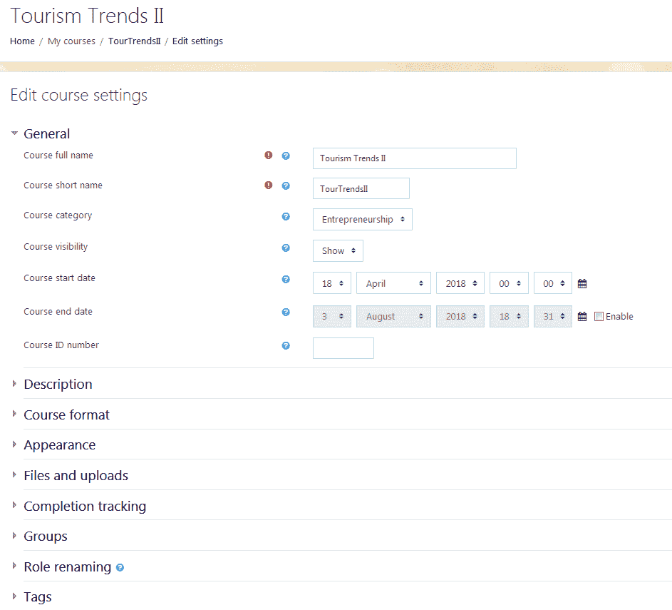

我们将逐步处理课程设置中的基本菜单项，这些菜单项允许你设置课程结构和组织课程。有关更多信息，请记住，你总是可以访问 Moodle 文档在[`docs.moodle.org/35/en/Main_page`](https://docs.moodle.org/35/en/Main_page)。

# 通用

第一可展开菜单，通用，为你提供了一个提供有关课程基本信息的机遇。请记住，在任何时候，你都可以返回课程设置并编辑信息。

如果你迷路了，只需在菜单中点击你课程的名称，然后转到右上角并点击齿轮。点击“编辑设置”：

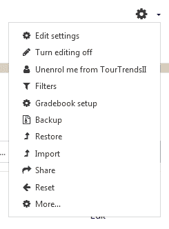

虽然你可以轻松地在以后编辑你的设置，但最好还是做好计划，以确保你的课程描述和列表不会产生歧义。以下步骤将帮助你配置“常规设置”：

1.  在“课程管理”菜单中，点击“我的课程 | 编辑设置”。将出现“编辑课程设置”屏幕。

1.  如果“常规设置”部分是折叠的，请点击标题为“常规”的菜单以展开它。

1.  在以下字段中输入数据：课程全名、课程简称、课程类别、课程可见性、课程开始日期、课程结束日期和课程 ID 号码。

1.  点击“保存并显示”按钮。

如果你的学校或组织有大量课程，请确保你的课程名称（包括课程的简称）、课程 ID 和描述与你的官方课程目录保持一致。如果你一开始就确保一切保持一致，而不是试图事后修改或纠正，这将为你节省大量时间和挫败感。目标是用清晰、简洁的语言和术语，这些术语在你的组织和课程目录中是一致的。

# 描述

虽然你的课程目录中可能有冗长的课程描述，以及描述课程成果的附加文本，但你可能不想在描述中包含所有这些内容。

相反，在“课程摘要”框中，输入一个简短的描述，以捕捉你课程的精髓。请注意，该框包含一些网页编辑工具，允许你自定义描述的外观。这种能力在我们查看课程页面的整体外观时将非常有帮助。

你还可以使用“课程摘要文件”框，它为你提供了使用“添加”选项或通过拖放上传文件的机会。使用“课程摘要文件”为你提供了根据 UDL 原则结合多种模态的机会，以便你的课程信息以文本、音频和/或视频格式呈现。通过使你的课程信息以音频和视频格式可用，你将使你的材料对广泛的学习者可访问。

例如，你可以插入音频文件（MP3 最佳）或你上传到 YouTube 的视频的链接，或者插入嵌入播放器的链接。你也可以包括一个链接到包含更多详细信息的扩展文本文件。

# 课程格式

在描述部分下方，你会看到“课程格式”。当你展开它时，你会看到几个选项，它们都有可展开的菜单。

# 使用格式来构建你的教学材料

一种格式允许您开发您的教学材料的结构。这是一个关键的决定，您必须谨慎做出。如果可能的话，您的格式应该在整个课程中保持一致，以便所有课程都具有相似的外观、感觉和组织：

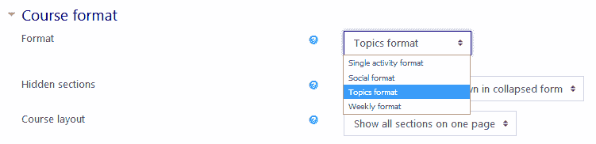

注意，有许多选项可以自动生成一组预格式化的字段，这使得您轻松输入数据。可用的各种格式如下：

+   主题格式

+   周格式

+   社交格式

+   单一活动格式

大多数学校、学院、大学和组织将使用主题或周格式。例如，如果您的学院遵循 16 周的学期格式，遵循周格式通常很有用。

然而，许多学院和大学在不同的时间段内提供相同的课程，可能会提供 4 周、8 周、12 周或 16 周的学期。在这种情况下，选择主题格式并通过链接到包含课程学期截止日期的日历来指定时间表通常很有帮助。

# 课程中的部分数量

课程中的部分数量对应于学生将在课程中完成的教学材料和活动的**功能块**。每个组织都有自己的课程交付方法，术语可能不同。

如果您的组织提供 4 周、8 周和 16 周的选择，将内容和工作活动分为可以扩展或压缩的部分是一个好主意。例如，您可以选择八个主题，如果您所在学校提供 4 周、8 周和 16 周的课程学期，您可以轻松地将内容加倍并以两倍的速度加速通过课程内容，或者简单地在一周内而不是两周内展开内容。

另一方面，如果您的组织希望在一周内提供所有内容，或者课程非常简短，旨在在几小时内完成，您可能希望将内容分成与任务所需时间相对应的部分。

请记住以下要点：

+   确保您的部分在包含的内容量方面保持一致

+   努力保持完成每个任务所需的时间量保持一致

# 隐藏部分

隐藏部分允许您避免在屏幕上显示过多信息来分散学生的注意力。可能有一些情况，您可能希望使所有部分都可见。这些情况可能发生在非常简短的课程中，要求学生在完成课程时拥有所有信息。

# 课程布局

您可以选择在单页上显示所有部分，或者选择每页显示一个部分。如果您的课程只有两个部分，您可能希望将它们显示在单页上。

然而，为了清晰起见，通常每页显示一个部分是一个好主意。再次提醒，要提前考虑，思考您希望学生在浏览课程时做什么，以及他们到课程结束时应该能够做什么。确保您课程的结构能引导他们沿着一条清晰的路径前进。请记住，课程介绍主题将在每一页上可见，即使您每页只有一个主题也是如此。

# 外观

出现菜单，如以下截图所示，允许您为整个课程创建统一的视觉和感觉：

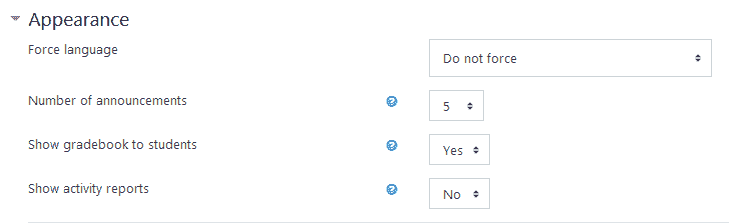

这些选项是自我解释的，但在组织课程时，以下是一些关键点需要记住：

+   强制语言：此选项允许您在您选择的语言中保持 Moodle 界面，即使学生在其个人资料中指定了不同的语言也是如此。这是 3.5 版本中的新功能。

+   公告数量：此选项让您有机会控制最新公告块中显示的来自公告论坛的最新公告数量。避免包含太多项目，因为它们可能会分散注意力，并且也会占用课程页面上的宝贵数字空间。

+   向学生显示成绩册：此选项帮助您允许学生查看他们的成绩，这可以极大地激励他们，并且是成功的关键。

+   显示活动报告：此选项允许学生查看他们自己的活动报告，这可能非常有帮助。

# 工具和应用程序清单 - 媒体播放器

哪些应用程序对您最有用？您有多个选择，从防病毒插件到网络研讨会（BigBlueButton）、聊天和书籍，我们将在稍后进行回顾。当我们开始构建内容和资源时，快速查看可用的资源和活动会揭示一个不可或缺的工具是媒体播放器。媒体播放器插件位于“插件概览”下的插件列表中，如下所示：

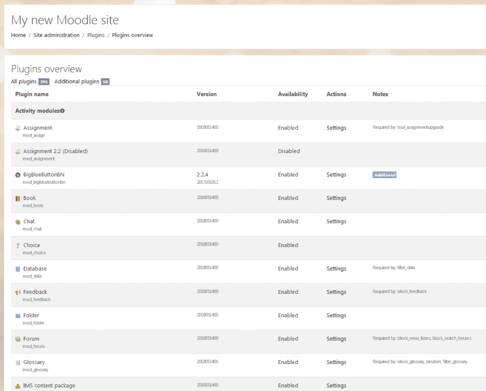

在插件列表下的媒体播放器插件

你可以用它来帮助学生播放视频，而无需离开 Moodle。尽量在添加资源时保持一致性，并确保它们与课程目标紧密相连。例如，对于关于职场欺凌的课程，你可能希望使用 TED 演讲的资源，这些资源可以在[`www.ted.com`](http://www.ted.com)找到。TED 演讲以及其他启发思考的视频库，出于许多原因都是理想的。首先，它们鼓励参与，因为它们要求学习者去聆听并表达观点。其次，TED 演讲允许学生讨论观点，不仅是在讨论板上，还可以通过创建回应视频。最后，TED 演讲（以及其他教育资源）是根据访问和通用设计原则构建的。它们提供带字幕的视频，并补充了相关、同行评审的高质量阅读材料。TED 演讲和其他视频可以通过链接访问，你可以通过复制和粘贴 HTML 代码来嵌入 YouTube 播放器。为了确保它们能正常工作，你需要启用截图中所描述的 YouTube 播放器。请注意，你可能需要滚动页面很长一段距离。插件列表很长：

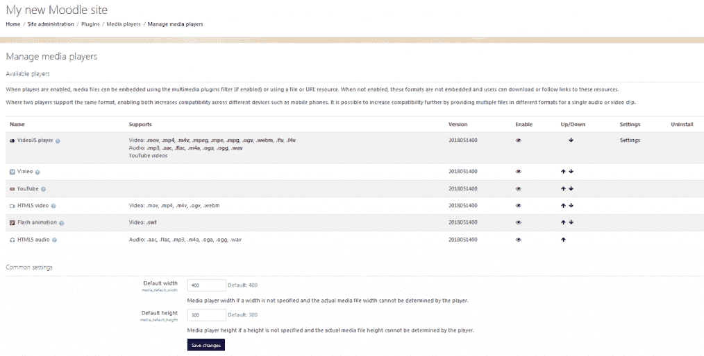

启用 YouTube 播放器

让所有其他玩家也能最大化灵活性是个好主意。

# 将内容与工具与学生的成功策略相匹配

当你整理课程时，很容易让学生被过多的信息压倒。此外，他们可能会因为组织不清而感到困惑。Moodle 的整体结构通过按时间或主题分组内容来构建顺序，但即便如此，通过给学生提供清晰的工作组织方式和设置截止日期的方法，保持学生的积极性也很重要。

# 时间管理策略

你可以通过为任务提供预估时间来帮助学生组织时间。同时，确保为任何写作作业提供明确的限制。例如，如果你分配了一篇短论文，请确保提供最小和最大字数。这将帮助学生制定大纲和草稿，并帮助他们投入适当的时间：

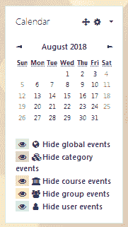

我们将在本章稍后更详细地介绍 Moodle 中的块。现在，让我们专注于日历。你可以在块部分为你的课程设置日历。一旦你设置了日历，你就可以包括草稿以及最终产品的截止日期。除了帮助他们安排时间，你还将帮助学生设定目标：

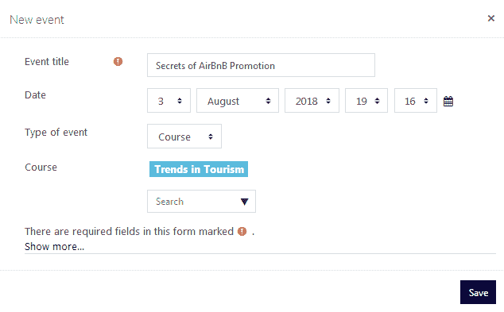

另一种帮助学生学习时间管理的良好方法是结构化讨论帖子，以便他们不会拖延，最后一刻才做所有事情。这应该要求学生在某个日期之前完成初始帖子，然后要求他们在 2 或 3 天后完成回复帖子。通过这样做，您可以分散讨论帖子，避免在截止日期前的最后几个小时每个人都发帖的挫败感。

# 为学生成功映射工作流程

如果您与软件或项目管理工作，您可能对映射工作流程的想法很熟悉。基本上，这是指所有活动都有一个理想的顺序，并且一个活动通常依赖于另一个活动的成功完成。

在组织您的课程时，请非常注意您的作业是如何相互关联的，以及学习目标是如何相互构建的。在开始填充您的 Moodle 界面并创建单元之前，列出他们为了实现成果所需的观念和技能清单。哪个是最基础的？哪个是最复杂的？

这里有一个例子，Bloom 的分类法将帮助您。如果您首先列出较低级别的活动，您成功的可能性非常高。例如，首先包括定义和主要概念。然后，接着列出他们需要完成这些概念或技能。然后，要求他们应用和综合信息。

在“旅游趋势”课程的例子中，请注意学习目标以递增顺序出现。在构建课程单元时，您可以确保每个概念、技能或活动都有足够的支撑，以便能够成功地完成下一个：

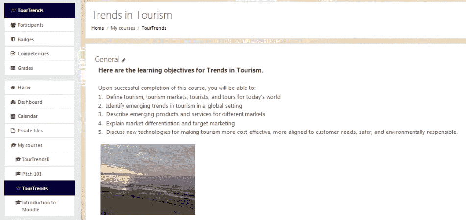

“旅游趋势”课程中的学习目标

# 文件和上传

您可以为文件和上传设置一个上限。这个上限可以由 Moodle 管理员根据网站使用者的需求来设定。我们的建议是将上限设置为 10 MB，并使用最佳网页设计实践，如文件压缩，以将文件大小保持在最小。对于较大的文件，我们建议使用与 Moodle 集成的存储库，例如 YouTube、Dropbox 和 Google Drive（取决于管理员）。例如，与其上传大文件，如视频，不如使用一个兼容 HTML5 的视频播放器，您可以将它嵌入。如果您的学生需要创建作为课程作业的大文件，您可以鼓励他们将文件上传到 SoundCloud（如果是音频文件）、YouTube（如果是视频文件）和 SlideShare（如果是 PowerPoint 演示文稿，尤其是如果它们包含大量图形）。

为了最大限度地提高可访问性并符合通用设计原则，请记住，HTML 与将文本转换为语音的辅助技术配合得非常好，这对于视力受损的个人非常有用。如果可能的话，将您的演示文稿和文档转换为辅助技术可以使用的格式。

对于听力受损和/或认知障碍的个人，提供书面脚本以配合音频文件可以帮助您实现使用多种模态优化学生访问课程内容的目标。

对于学生论文或项目，通常 2 MB 的最大上传大小就足够了，尤其是如果他们使用 ZIP 文件的话。

# 完成跟踪

除了“向学生显示成绩册”选项外，“完成跟踪”选项可以帮助学生保持他们的动力水平，并培养一种积极的“我能做到！”的态度，这转化为自我效能感和自我决定。

通过能够跟踪他们完成单元和/或活动的时间，学生可以保持动力，并继续设定和实现他们的个人目标。

# 访客访问

您可能希望允许您的教学设计团队、教学技术人员或其他观察者访问您的课程。如果是这种情况，请确保您将“允许访客访问”设置为“是”。

# 组

Moodle 允许您在开发课程框架的同时设置学生组。即使您有协作活动，或者您想给个人一个在非正式团队中工作和分享的机会，设置组通常也是一个好主意。组对于论文或项目的同行评审也非常有效。

然而，如果您的课程不包含协作/团队活动或同行评审，设置组可能会给您的课程增加不必要的复杂性。

# 角色重命名

Moodle 在课程内角色的默认名称非常直接和直观，尤其是 Manager（经理）、Teacher（教师）和 Student（学生）这些角色。

然而，您可能希望将角色重命名为与您组织使用的角色名称相对应。例如，一家公司可能更喜欢使用“促进者”而不是“教师”，而学生可能被称为团队成员或学习者。

这里有一个注意事项。如果您的组织有许多课程，确保角色名称一致，并且不要在每个课程中重命名角色是一个好主意。保持一致性将帮助您避免混淆和挫败感。

在完成所有“编辑课程设置”中的任务后，点击“保存更改”按钮。

# 自定义您的课程页面

让我们回到您课程的首页，这不同于您的首页或门户。相反，我们专注于开发课程本身。

在编辑课程页面时，我们是否需要包括一些我们没有定制的项目？本节讨论了一些您可能希望包括的项目。

# 日历块

包含一个标明课程事件的日历可以帮助学生保持进度。要添加日历，你首先需要按照以下步骤添加一个日历块：

1.  点击开启编辑按钮。

1.  在添加块菜单中，点击添加...选项。

1.  在下拉菜单中点击日历。日历块将出现在课程页面上。

1.  在日历块中点击操作图标，然后选择配置日历块以配置你希望显示的选项：

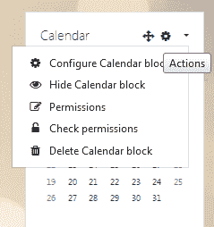

1.  点击保存更改按钮。

要添加事件，只需在日历块中点击事件所在的月份，然后点击新建事件。新事件可以应用于课程、用户或网站：

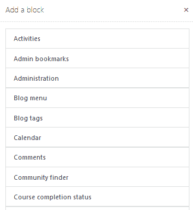

如果你使用日历，你可能希望包括以下项目：课程开始日期、课程结束日期、关键截止日期，以及任何可能有价值的行政问题。你可以在每个课程的单独课程日历中添加这些项目。

# 教师或机构链接

而不是包含一个展示你的机构及其使命和愿景声明的大型图形，你可能希望使用 HTML 块来包含一个快速链接到机构的网页；这对你的目的最有用。

如果你是一个教师主导的课程，你可能还希望包括一个链接到教师联系信息的页面。

# 学生成功链接

为了保持你的网站非常整洁，通常很有用将所有学生支持网站集中在一个地方。因此，你可能希望创建一个资源页面，或者如果列表很短，另一个包含资源（如帮助台、在线图书馆、写作中心和其他支持区域链接）的 HTML 块。

# 用于自定义课程外观的附加元素

我们已经讨论了你的课程的一般外观，但还有一些额外的项目可以让你自定义课程的外观。当你进行更改时，你可能希望考虑可访问性并使用 UDL 指南。

# 字体

Moodle 为你提供了许多设计选项，你可能注意到几乎每次你添加内容时都会弹出网页编辑框。虽然使用各种颜色、字体和符号非常诱人，但请确保保持简单。以下是一些关键点：

+   仔细选择字体并保持一致使用。

+   使用无衬线字体，如 Arial 或 Helvetica。它们对视力受损的人更容易阅读。它们将在大多数浏览器中统一显示。

+   如果你使用带文本的图形，请注意放大软件通常会导致高度像素化的文本，难以阅读。

+   如果你用 HTML 编码，请使用相对大小而不是绝对大小来设置字体。如果你使用绝对大小，你实际上是将大小“锁定”，然后放大软件无法将其放大。

+   避免使用过多的颜色。

# 图片

图片可以是非常强大的方式，为您的课程增添个性和个人品牌。然而，也很容易添加过多的图片，或者用大而可能无关的图片使学生感到不知所措。因此，请务必记住以下要点：

+   使用有意义的图形

+   仅使用 JPG 或 GIF 图像格式

+   将它们放置在它们能增加和加强意义的地方（而不是分散或混淆学生的注意力）

+   优化图片大小，以便它们快速加载

+   如果您需要使用大型图形，创建一个可点击的缩略图，它将展开成一个大图形（例如，地图）

# 主题考虑事项

让我们暂时回到“网站管理菜单”中的“外观”。改变课程外观和感觉的一种方法就是使用主题。Moodle 提供了一系列内置主题，可以用来为您的课程提供定制的外观和感觉。使用由 Moodle 开发者开发的主题通常是有价值的。许多是免费的，其他可以授权。如果您正在使用多个设备，并且希望课程能够自动为平板电脑、笔记本电脑、智能手机、台式机和其他手持设备显示良好的内容，主题尤其有用。

例如，如果您需要一个适用于多设备且在笔记本电脑、平板电脑和智能手机上表现同样出色的主题，您可能希望选择 Boost 主题。它对视力受损的个人来说很灵活，用户可以调整字体大小和列高。

如果您希望课程有一个干净、清晰的外观，并能够轻松地自定义以获得一个可识别的独特品牌，您可能希望选择流体宽度、三列的**Clean**主题。Clean（或 MoodleCloud）是一个基于 bootstrap 的响应式主题。它是三个标准 Moodle 主题之一。

第三个标准 Moodle 主题是**More**。它可以从主题内部进行自定义。不幸的是，它在 MoodleCloud 中不是标准的，但在 Moodle 3.5 中可用。

# 摘要

在本章中，我们探讨了如何从结构、格式和外观方面组织您的课程。我们学习了使用 Moodle 内置课程设置和元素的最佳方式，以创建一个对所有课程都一致且灵活的框架。例如，您可以开发一个演示课程，并将其用作未来课程的模板或指南。我们讨论了在开发框架时做出某些决定的原因，以及如何考虑最佳方式使您的课程对所有学生都易于访问。

在下一章中，我们将指导您开发课程内容和活动。我们将仔细研究如何将课程材料与课程的整体目的最佳匹配，以及如何以激励和吸引学生的方式去做，同时鼓励学生的成功。
