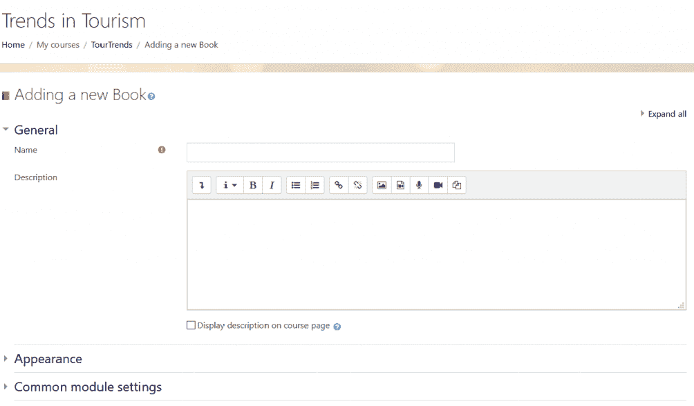
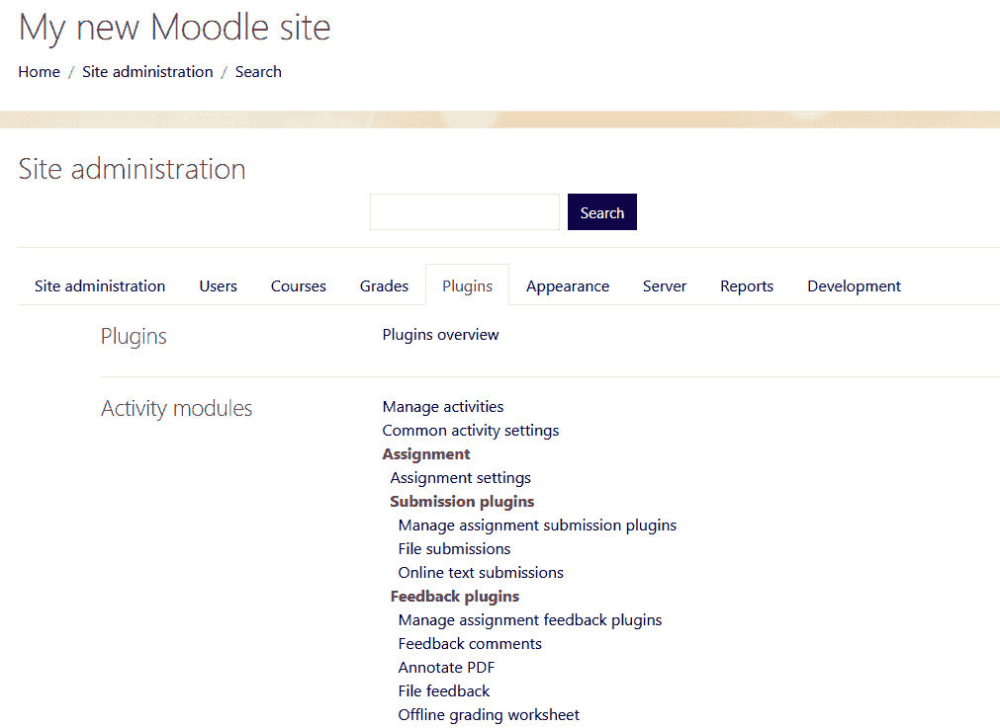
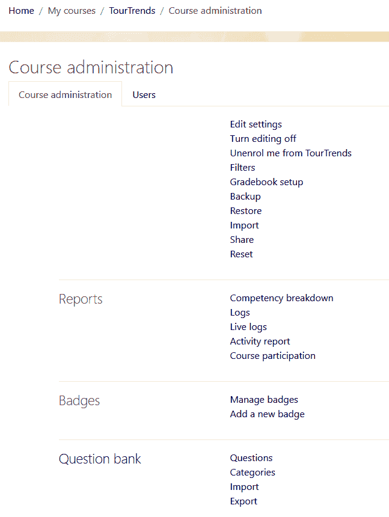
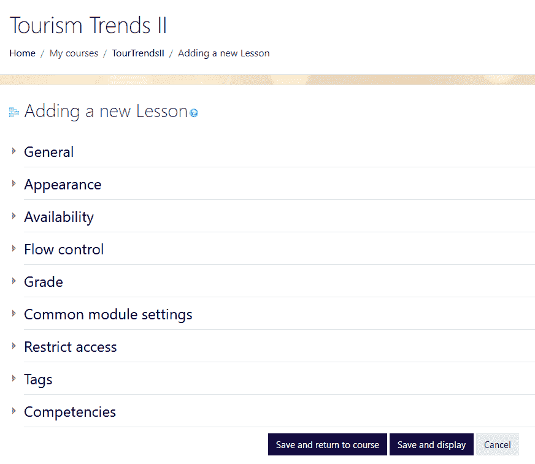
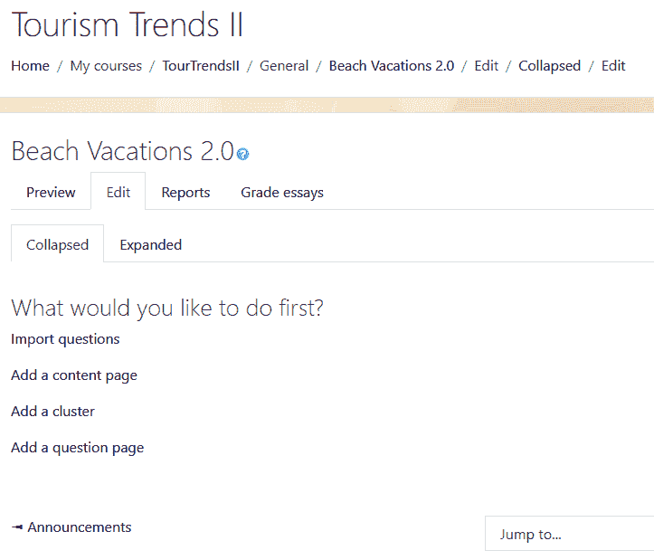
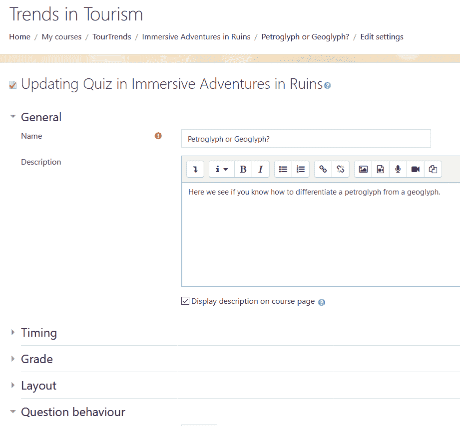
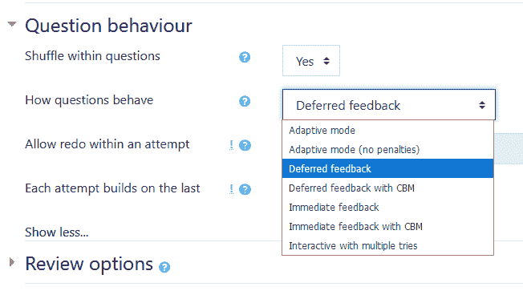
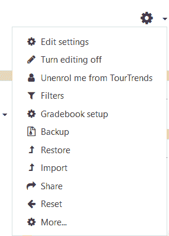
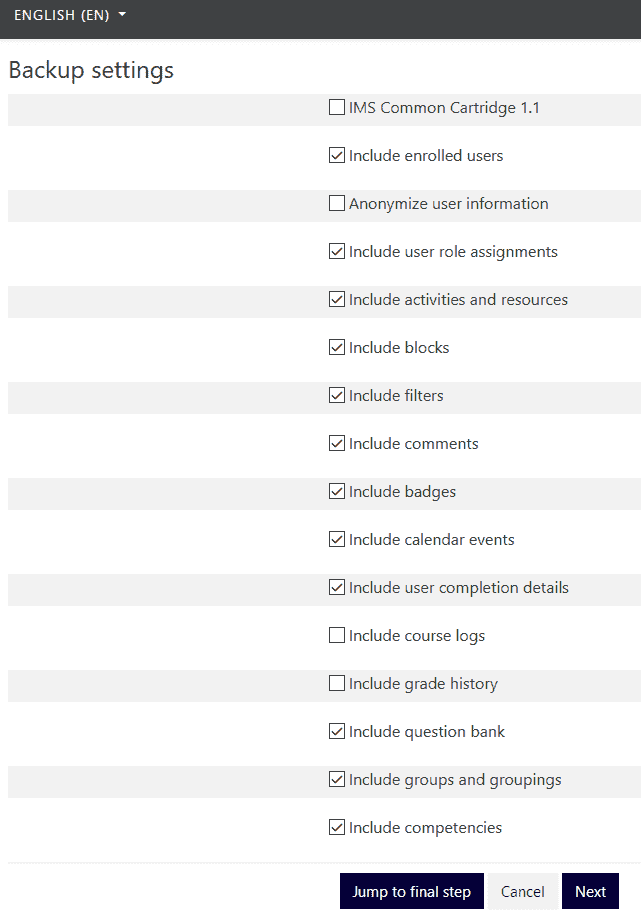

# 内容交付的最佳实践

在第三章组织你的课程中，我们学习了如何为你的课程开发不同类型的结构以及如何定制它们，以便满足你所在机构、学生和教师的需求。

现在，我们准备查看课程内容，这包括课程材料以及活动和评估。我们将探讨提供内容的最佳方式，这涉及到审查内容、格式和工具类型。

如果你查看你的 Moodle 安装，你可能会因为所拥有的选择数量而感到不知所措。

我们将通过查看三种不同类别的内容：资源、活动和评估来简化方法。考虑到这种方法，我们将更容易覆盖我们需要涵盖的所有内容，以便创建一个有助于我们实现预期学习成果并适应各种学习者的课程。

在本章中，我们将向您展示在 Moodle 课程中提供内容的最佳方式，包括以下内容：

+   管理内容类型

+   添加资源

+   添加关键活动

+   将评估融入资源

+   使用工具构建更复杂的内容

# 管理内容类型和活动

你的 Moodle 课程可能相当简单，有基本的教材、评估和互动工具。即使在其最基本的形式中，你也必须注意以下几个关键点：

+   为了适应不同的学习风格和设备，最好以不同的格式提供你的内容，这包括演示文稿、文本、音频、图形、视频以及论坛/消息的组合。

+   为了吸引学生并给他们一个展示知识和技能的机会，包括各种活动，如作业和讨论论坛。

+   为了评估学生学到了什么，提供多种评估方式，如测验。

+   为了减少本地服务器文件系统的负载，你可能希望使用基于云的网站，如 YouTube、SlideShare 等，而不是将大文件上传到 Moodle 服务器。

在我们开始之前，让我们记住，为了方便起见，我们试图从一个简单直接的方法开始。我们总是可以在前进的过程中增加复杂性。

# 将资源添加到我们的课程中

资源使得所有学生都能访问到相同的课程材料。你也可以按照与你的课程目标相符合的方式组织内容，这样就可以与活动和评估相连接。

有许多资源可供选择；然而，我们将专注于你在课程中最可能使用的那些。要添加资源，请遵循每个资源中找到的步骤。

# 通过书籍添加课程材料

图书资源允许您在一个位置组装多个页面，并使用自动生成的目录来组织它们。图书资源对移动设备友好，易于打印。它与流主题配合得非常好。如果您用它来制作课程大纲或电子书文本，它非常方便。

缺点是您正在为 Moodle 课程中的单个位置自定义内容，如果您计划在多个课程中使用相同的文本，这会使事情变得复杂。在这种情况下，最好将内容存储在 Moodle 之外的单个位置，然后在 Moodle 中链接它。

以下是将图书资源添加的步骤：

1.  在课程管理菜单中，点击“开启编辑”。

1.  前往您想添加内容的主题，然后点击“添加活动或资源”。

1.  查看资源菜单。

1.  点击您想要添加的资源，例如图书。

1.  在“添加新图书”屏幕上填写字段，然后点击“保存并显示”。

1.  在您的书本屏幕上填写字段，然后点击“保存更改”。

您可以在以下屏幕截图中查看“添加新图书”页面：

# 添加文件

确保学生能够获得相同内容的最简单方法之一是通过单独的文件上传课程材料。将文件聚集在一起将使学生能够轻松找到课程材料。典型的文件包括文本文件以及图形、音频文件、视频和演示文稿。请记住，并非每个人都会拥有相同的软件。我们建议将您的内容转换为 PDF 格式，这样您就可以上传 PDF 文件而不是 PowerPoint 文件或文本文件。这将确保格式和字体保持不变，以便您的知识产权更容易得到保存，因为从 PDF 文件中复制图形比从 PowerPoint 文件中复制要困难得多。如果您将文件转换为 PDF，如果学生安装了免费的 Adobe Acrobat Reader，他们就可以打开这些文件。优点是格式和字体不会改变（因为学生的演示文稿和文字处理软件版本可能不同）。

请记住，您在文件大小方面有限制，因此通常将文件链接到基于云的主机是一个好主意。如果您的组织使用如 Dropbox、OneDrive 或 Google Drive 等共享内容，您可以轻松上传，当学生通过您组织的单点登录登录时，他们将能够访问这些内容。

# 添加文件夹

如果您有许多属于单个类别或主题的文件，您可能希望将它们组合到一个文件夹中。文件夹资源允许您通过课程页面上的一个链接在一个地方展示多个文件。

文件夹的主要优点是它允许您避免页面杂乱无章，或者需要过多滚动。

使用文件夹的缺点是您可能需要点击太多次数；内容可能看不见或被深深埋藏，因此学生很容易忽略或错过。

使用子文件夹来组织您想要提供的文件，但不要过度使用，因为它们可能会被深深埋藏，没有人会注意到它们。

# 添加页面

使用页面资源，您可以使用内置的网页编辑器创建一个可以包含链接、图形和嵌入式 HTML 代码的简单网站。您可以使用嵌入式 HTML 代码，让学生们非常容易地访问基于云的资源，例如[YouTube.com](https://www.youtube.com/)上的视频、[SoundCloud.com](https://soundcloud.com/)上的音频、[`www.slideshare.net/`](https://www.slideshare.net/)上的演示文稿、[Flickr.com](https://www.flickr.com/)上的照片和图形等等。使用这些资源的优点是它们托管在云端，不会占用 Moodle 的空间。此外，它们是开放资源，不需要登录。

由于嵌入式 HTML 代码通常包含播放器，因此可以流式传输媒体，而不是等待文件下载。这种做法的优点包括易于访问和节省时间。缺点是您必须连接到互联网才能流式传输视频文件。您可能更喜欢将文件下载到您的设备上，以便在没有连接到互联网时播放。

# 嵌入式演示

您也可以为演示文稿使用嵌入式 HTML 代码。这有两个重要原因。首先，您可能希望避免由于在云端托管而导致的带宽和下载缓慢引起的问题。因此，在这种情况下，使用[`www.slideshare.net/`](https://www.slideshare.net/)等服务可以救命。其次，您可能希望通过不让敏感（且受欢迎）的图形、图表、地图等容易复制来保护知识产权。在这种情况下，您可以通过将演示文稿以 PDF 格式而不是 PowerPoint 或其他容易复制和分解的格式提供来保护自己。这并不能阻止您的想法被盗，但至少可以减缓那些有恶意的人，并使他们复制粘贴项目变得更加困难。

为了增加另一层安全性，您可以在[BigBlueButton.org](https://bigbluebutton.org/)（一个开源的在线会议程序，Moodle 3.0 之后的 Moodle 安装可以免费下载）上录制您的演示，或者，您也可以使用 Camtasia 或[`screencast-o-matic.com/`](https://screencast-o-matic.com/)等屏幕录制程序制作电影。然后，您可以将您的演示文稿上传到[YouTube.com](https://www.youtube.com/)或[Flickr.com](https://www.flickr.com/)，在那里复制您独特的智力图形将非常困难。

# 添加活动

Moodle 资源与 Moodle 活动的区别在于，资源通常是静态的，而活动涉及学生的表现。活动用于沟通、协作、练习、表现和评估。再次强调，以下说明是针对 Boost 主题的，这是 Moodle 3.5 及以后版本的默认主题。MoodleCloud（也称为 Clean）和其他主题有所不同。

添加活动的以下步骤：

1.  在课程管理菜单中，点击右上角的齿轮图标后，点击“开启编辑”

1.  前往您想要添加内容的主题，然后点击添加活动或资源

1.  查看活动

1.  点击您想要添加的活动

您可以在[`docs.moodle.org/26/en/Activities`](http://docs.moodle.org/26/en/Activities)了解更多关于活动和活动设置的信息。

# 作业模块

作业模块创建了一个结构，使得学生和教师都能方便地分配和提交作业，然后评分并提供反馈。

您可以为作业模块设置学生执行任务，然后上传文件，您将对其进行评分。作业模块是一种活动，也可以被视为一种评估，因为您能够设置评分和标准，并指定您将接受的提交类型。您还可以通过点击评分链接并指定分数、评分等级和评分方法、评分类别以及标记分配来设置评分标准。分数、评分等级（这些都是同一件事）和评分类别可以通过成绩册或通过作业设置进行设置；评分方法（简单或高级）可以通过评分方法下拉菜单进行设置。

要添加作业，请转到站点管理菜单，进入插件，然后添加作业。然后您可以通过许多不同的方式自定义作业：

# 选择

选择活动是一种多选题调查，可以在课程的任何时间点吸引学生。它可以作为一个吸引点，例如，在“你知道吗？”或“测试你的知识”类型的单选题调查中使用。它也可以用来快速复习事实。

在 MoodleCloud 中，测验活动取代了选择。您可以通过添加活动的步骤添加测验：

1.  在站点管理菜单中，点击“开启编辑”

1.  前往您想要添加内容的主题，然后点击插件概览

1.  查看活动菜单

1.  点击作业

1.  点击测验

您可能想知道如何添加问题。为此，您将进入您的课程，然后选择课程管理。然后您将选择编辑设置，然后点击问题库。您将能够从多种问题类型中进行选择：

# 论坛

论坛是一个强大的沟通和协作工具。它也是一个很好的内容交付地点，因为您可以在论坛活动的不同线程中上传文件或提供链接。通过论坛交付内容的优点是，它很容易要求学生针对内容提出具体问题，并保持学生的专注。缺点是，使用论坛活动分发内容相当费时，尤其是如果您需要在多个不同的课程中使用相同的内容。在这种情况下，将其添加到页面资源中会更容易。

对于协作和联系，论坛活动可能是最强大的，并且它可以与能力相关联。您能够允许论坛成员对彼此的帖子进行评分。论坛可以有一种社交媒体的感觉，而不存在引入外部社交媒体源的风险。

# 课程

课程提供内容和互动。您可以包括文件、链接和自定义页面。课程的基本结构是一系列 HTML 页面。您可以包括多项选择题、简答题、是非题、匹配题和论文题——当学生选择一个答案时，他们将被引导到另一个页面。通过规划，您可以创建适应性课程，根据学生的选择为他们定制路径。课程的缺点是，它需要相当多的时间来设置，并且可能相当复杂。

以下截图是课程“旅游趋势 II”的设置屏幕：

这里有一个简化的方法，它仅仅关注一个课程，要求学生提交一篇论文。因此，而不是多项选择题，它仅仅允许学生访问材料，提交论文，然后从讲师那里获得反馈：

1.  前往您的课程，点击“开启编辑”。从“添加活动或资源”链接中选择“课程”。

1.  在下拉菜单中填写您想要添加内容的字段。

1.  前往您的课程，添加内容，然后点击“保存并显示”。您将看到以下选项列出来；然而，实际上，添加内容页面，然后添加问题页面会更简单。如果您这样做，您将有一个非常直接的课程，包含问题和学生需要提交的评分论文。

    +   导入问题

    +   添加一个内容页面

    +   添加一个集群

    +   添加一个问题页面

1.  您可以通过点击“添加内容页面”，在问题页面之前或之后包含指导说明，来编辑说明并提供指导。

使用课程的一个优点是，它允许您将说明、课程阅读材料和资料、问题、评分和成绩报告集中在一个位置。这对学生和讲师来说非常方便。以下截图显示了您的课程预览：

截图显示了课程活动页面上的编辑标签。正如你所看到的，在任何时候，你都可以以多种不同的方式修改内容，使你的课程非常稳健，同时简单易懂，因为组件都包含在同一个地方。因此，学生可以前往一个单一的位置参加测验或调查，或添加阅读材料、视频、图形等。

# 问答

问答活动模块包括许多选项，包括自评分问题，以及包括每个答案的反馈和正确答案，以便学生有机会复习材料。问答模块允许你从一系列选项中选择问题类型，例如：

+   计算题

+   计算多选题

+   计算简单

+   内嵌答案（完形填空）

+   论文

+   匹配

+   多选题

+   数值题

+   简答题

+   正误

+   描述

在你选择了问题类型之后，你将开始开发一个数据库。你将填写问题表格并为正确答案分配分数。

创建问题后，你将添加答案和反馈。每次添加问题，你也会将其添加到你的题库中。务必包括问题和答案/反馈。

问答活动模块是一个非常方便且灵活的方式，可以帮助学生评估他们的知识。它也是一个很好的方式，以吸引学生的方式传递内容（反馈和回顾）。

劣势在于问答活动可能需要相当多的时间来设置。通常，创建心理测量学上可靠的题目和答案并不容易。因此，许多用户会选择从他们使用的教科书中导入题库。

# 维基

维基活动给你机会同时传递内容和构建内容。在 Moodle 中，当认为课程成员需要为单个项目做出贡献时，通常会使用维基，这个项目可能是一组关于某个主题或一系列主题的网页。维基活动可以是一个主题或例子的信息集合，或者它可能是一篇关于单个主题的报告，该主题足够复杂，允许个别学生贡献、审查和编辑条目的一部分。

维基的优势在于它具有协作性和易用性。劣势在于它可能会变得混乱和模糊，一两个个体可能会主导它。

# 使用评估来传递内容

评估不是严格意义上的课程内容，但可以在测验或作业中传递课程内容。然而，某些评估可能是传递内容的好地方，尤其是如果课程需要地图、部分或程序等内容。

例如，基于匹配内容的测验可能涉及将插图与标签或概念匹配。在这种情况下，正在交付的内容将是图表或图形材料。在这种情况下，你可以管理问题类型（你可以选择匹配）以及问题行为。这种灵活性允许你创建直接针对学生知识差距和学习需求的适应性评估。

下面的图形展示了插件菜单如何展开，并为你提供关于问题的选项：

你有很多选项，可以以多种方式修改问题行为。如果你对掌握学习感兴趣，自适应模式可以非常有效，因为它允许学生遵循一条路径，不重复他们已经掌握的领域，但会重复他们表现出差距的问题和内容区域：

# 整合协作学习

Moodle 还允许你以其他方式开发具有协作学习的课程。例如，你可以自定义论坛，要求学生发布、下载，并以某种方式对上传的文件做出回应。

例如，学生可能需要发布一个信息链接，例如包含美国各州商业高粱农场统计数据的文章链接。然后，另一名学生可以使用像 [Piktochart.com](https://piktochart.com/) 这样的程序将这些统计数据转换为信息图表。这两名学生可以合作，并制作一个三页幻灯片演示。

# 整合生产力和协作应用程序

如果你的合作包括团队项目，整合像 Trello ([`www.trello.com`](http://www.trello.com)) 和 Slack ([`www.slack.com`](http://www.slack.com)) 这样的应用程序可以非常有帮助，因为这样可以在 Moodle 框架内分配角色、里程碑、图表，并附加草稿。

另一个有用的生产力工具是 Evernote，你可以将其与所有设备同步，使其始终在你身边；它适用于记录想法、任务和笔记。其他生产力工具包括 Google Voice，它允许你使用语音转文字并创建即时转录。

# 备份和内容重用

一旦你构建了内容和交付系统，重用课程或课程的部分是一个好主意。你可以以多种方式重用活动。Moodle 通过使用备份和恢复功能，允许你在同一 Moodle 系统或另一个 Moodle 系统中重用你的课程或课程的部分：

重用活动和活动部分以下步骤：

1.  点击网站管理器齿轮下拉菜单。

1.  从选项中选择备份。

1.  检查要备份的项目类型旁边的复选框。

1.  在屏幕上点击“下一步”，如果需要，可以重命名文件。

1.  下载文件并将其保存到您可以在稍后轻松检索的位置：

要从您的课程中备份单个活动，请遵循相同的程序。如果您想在同一 Moodle 网站上重用内容，您可以直接恢复它。如果您想在不同的 Moodle 网站上使用它，请下载并本地保存。

# 摘要

在本章中，我们回顾了传递内容的方法，无论是通过添加资源还是活动。我们查看最常见的资源和活动，并讨论了何时以及为什么使用它们。我们还探讨了有效的协作方式和使用生产力工具的方法。我们回顾了它们的优缺点，并解释了何时在我们的课程中有效地使用它们。

最后，我们探讨了内容传递和评估之间的联系，并简要介绍了课程管理以及如何通过备份活动来节省时间，以便以后重用。

在下一章中，我们将探讨特定类型的课程，并学习构建它们的最佳方法。
