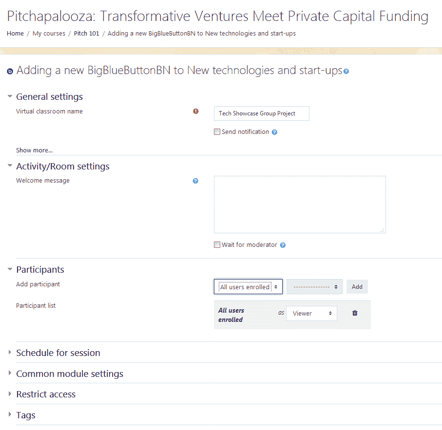
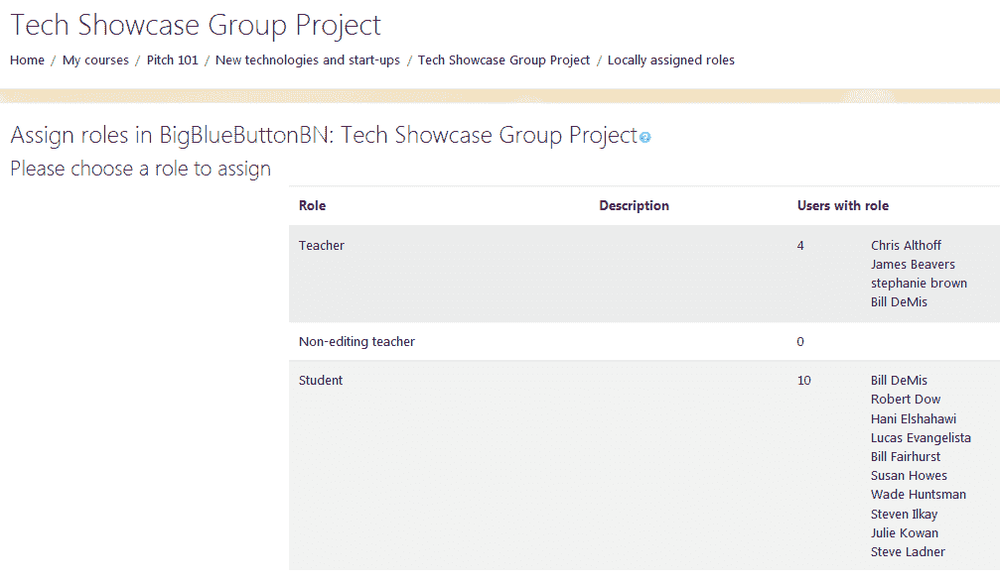
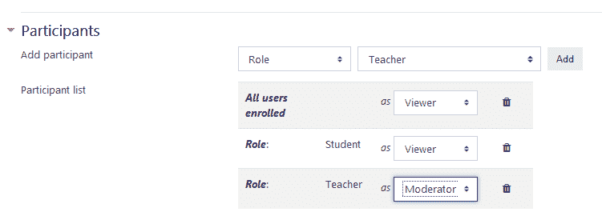
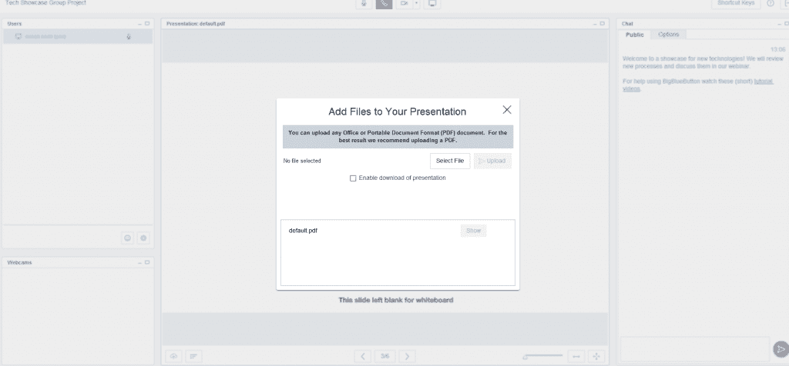
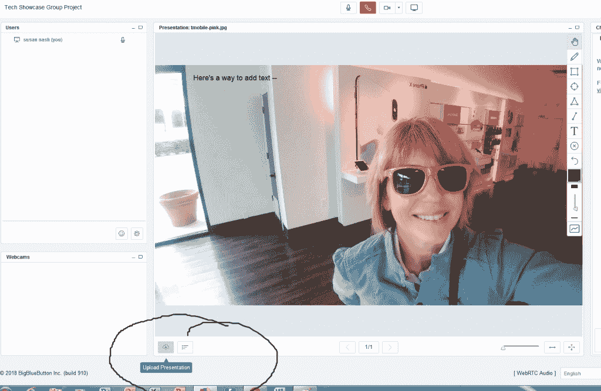

# 第六章：开发具有师生互动的基于班级的课程

在上一章中，你学习了在 Moodle 中开发用于自我导向和自我指导学生的最佳课程的方法。在这种情况下，重点主要是创建一个非常清晰、自我解释和易于遵循的课程。

现在，当我们转向其他类型的课程时，你会发现你在为独立学习课程制定指南时遵循的大部分准则也适用于由讲师主导的课程，这些课程包括一起工作的学生群体。这个群体，或称为班级，是共同进步的，而有个体讲师的优势在于他/她可以为学生提供指导和个性化的反馈。

在本章中，你将学习如何最佳地设置一个允许师生互动的基于班级的课程。我们将回顾最佳的结构和最佳的插件、资源和活动的组合，以确保你的课程非常灵活，满足学生和教师的需求，并提供幕后支持，包括 Moodle 管理员和课程设计师。

我们将首先探讨由讲师主导、基于班级的课程的主要特点，并记住课程围绕讲师的沟通和指导以及协调的学生表现展开。

然后，我们将探讨学生和讲师焦虑的主要来源。在由讲师指导的在线课程中的学生通常最担心的是讲师的期望。此外，他们想确保在寻找课程材料和考试时不会迷失方向，并且能够及时地表现出色。讲师则希望能够有效地与学生沟通，并对评估提供及时有效的反馈。

在本章中，我们将讨论以下主题：

+   为由讲师主导、基于班级的课程配置全局设置

+   全局修改外观，包括主题

+   选择理想的插件、活动、资源和评估

+   开发讲师与学生互动的不同方式

+   组织课程材料和活动

+   选择有效的评估

# 由讲师主导、基于班级的课程的特点

传统的面对面大学课程是一个基于班级的课程，有固定数量的学生共同进步以完成课程，他们由一个讲师引导，提供反馈和评估。

在线课程非常相似。唯一的区别是，学生在在线环境中工作，有更多方式相互沟通，因为他们可能为一个或一系列课程一起工作。

由讲师主导、基于班级的课程的主要特点包括以下：

+   共同的起始和结束日期

+   一个固定的时间表，使所有学生共同工作

+   与提供指导和反馈的讲师进行沟通

+   学生之间的互动和协作，重点是沟通

+   在讲师指导和反馈下的评估

这是一个有趣的事实：美国高等教育中的大多数在线课程都是基于班级的，并且它们在表现、课程完成率和满意度方面会定期与面对面课程进行比较。

你可以在斯隆联盟 2013 年第 11 次年度报告中了解更多关于美国高等教育中的在线学习信息，即*《成绩变化：追踪美国在线教育》*，可在斯隆-C 网站上找到[`sloanconsortium.org/publications/survey/grade-change-2013`](http://sloanconsortium.org/publications/survey/grade-change-2013)。

就像自定步调的独立学习课程一样，基于班级的、由讲师指导的课程在长度、范围、复杂性和目标上可能会有很大的差异。在大学里，有些课程可能只需要四周就能完成。然而，有些课程则专注于 8 周或 16 周的学期课程。一些组织可能在四周内完成材料，分为四个独立的每周里程碑（主题或单元）。在线讲师指导的、基于班级的课程可以由学院、大学、企业、非营利组织、零售商和其他需要提供教育课程和培训的组织提供。

# Moodle 中基于班级课程的益处和局限性

许多大学和学院提供的在线课程都是为了模仿传统课程的面对面安排，并且或多或少遵循相同的理念。重点是随着学期的进展，以有序的方式访问和讨论课程成员所接触到的内容。由讲师提供指导，解释材料，提供反馈，并展示学生最佳的学习和表现方式，以便他们能够实现课程目标和成果。

以下是基于班级课程的益处：

+   它们提高了与同伴的沟通

+   学生可以有序地通过资源和活动

+   它让讲师能够提供关于如何表现良好和实现期望的课程成果的正确指导

+   它们基于一个可以复制到多个部分的模板

+   它们提供了一种社区和联系的感觉

虽然基于班级的课程可能很受欢迎并为学生提供支持，但也有一些局限性。基于班级课程的缺点包括：

+   学生可能在学习课程中进展缓慢

+   在作业和课程进度方面存在一些灵活性不足

+   如果学生处于不同的时区且没有持续的网络访问，那么与同伴沟通会有困难

对于许多机构来说，基于群组的课程的好处远远超过了其局限性，而且一旦构建了课程外壳或模板，就可以复制、存档和部署，这使得同时运行多个小组变得方便。尽管独立学习的课程也可以复制和部署，但用户体验与基于群组的课程不同。在一个运行良好且成功的基于群组的课程中，学生会有一种社区和支持的感觉。

# 设置您的讲师主导课程 – 全局设置

正如我们在介绍中提到的，在讲师主导的、基于群组的课程中，可能最重要的两个考虑因素如下：

+   **关于学生表现预期的清晰度**：我做什么？什么时候做？我从哪里获取材料？我如何以及何时被评估？

+   **与讲师的沟通**：我如何联系我的学生？我如何提供他们能及时看到的反馈？我的学生期望我如何与他们沟通？

通过选择一个能够让我们自定义课程外观的框架，我们可以确保实现清晰和沟通的目标。

开始的地方是在主页上的站点管理菜单。如果您展开菜单，您将看到两个关键的项目子菜单：插件和外观。我们将从外观开始，因为我们想选择一个主题，这样我们就可以轻松地创建清晰度并沟通。

# 主题选择

当我们考虑我们课程的外观——我们想要使用的主题时，我们需要考虑我们的学生可能在线环境中互动的方式。与学生的快速沟通以及互动和提问的能力将有助于确保您的学生感到舒适和自信。

Boost 是 Moodle 3.5 的默认主题，并且由于它集成了新功能，因此对于 Moodle 群组来说特别有用。然而，你可能更喜欢 Moodlecloud，它也是 MoodleCloud 上的一个选项。Moodlecloud 基于 Clean 主题，易于使用，并且由于导航栏位于左侧，因此看起来非常开放。

# 群组的协作和引导式网络研讨会

与早期版本一样，Moodle 3.5 拥有 BigBlueButton 网络会议软件，可用于向群组成员进行演示，也可用于协作网络会议。演示是同步的（实时）但也可以用于异步目的（并且可以稍后存档）：

1.  添加您选择的主题活动。

1.  选择 BigBlueButtonBN。

1.  在“常规设置”和“活动/房间设置”中输入设置：

1.  请记住，你需要在 BigBlueButtonBN 中分配角色。BigBlueButtonBN 的角色必须单独分配。它们（除非你想它们对应）不对应于你在一般课程中分配的角色：

1.  在你添加用户后，你可以选择谁可以是版主或用户。角色不是永久的。你总是可以进去并更改它们。

以下截图将帮助你了解参与者在 BigBlueButton 中的角色分配情况：

一旦配置了网络研讨会，你可以在任何时候加入会议。请注意，你需要运行 Adobe Flash。

当你启动你的网络研讨会时，你可以切换角色，以便多个人可以演示。如果个人在讲话并想录制自己，可以使用摄像头。然而，你可能只想上传图形或演示文稿，然后你可以在中央白板空间中对其进行注释。

你可以允许你的参与者在旁边悄悄聊天。如果你有大量的观众成员，只有一个演示者，那么禁用除演示者之外的所有用户是一个好主意：

将文件添加到你的演示文稿中

在你完成网络研讨会后，你可以保存它，以便其他人可以审阅。如果你对它不满意或需要包括额外的演示者和其他材料，你也可以重新安排网络研讨会：

上传演示文稿

如果你想上传另一个演示文稿或图形，你可以。点击“上传演示文稿”图标，以便选择和上传文件。如果你想发起投票，只需点击“上传演示文稿”图标旁边的图标。我在截图中都圈出来了。

# 配置插件

当我们配置课程并设置全局设置时，让我们回顾一下插件。

让我们确保我们已经配置了插件，以便它们适合讲师主导的基于群体的课程，并且有助于我们实现为学生提供清晰性和为讲师提供良好沟通的目标。

# 论坛

当我们在站点管理菜单中时，我们可以轻松查看我们论坛的全局设置，以便所有课程都具有适合基于群体的课程的理想外观、感觉和功能。我们处于一个决策点，因为我们需要确定如何确保人们知道哪些学生正在回复线程，以及人们是如何回应的。

由于对讲师发布的线程的讨论以及学生查看同伴回复的愿望，最好选择线程回复。

现在，让我们通过以下步骤查看设置：

1.  在站点管理菜单中，点击“插件”。

1.  点击“活动模块”。

1.  点击“论坛”。

1.  在论坛屏幕上，将选项显示模式设置为“以线程形式显示回复”。

现在，你将配置回复中电子邮件地址的选项。指定帖子长度和每页讨论数量，并指出每篇帖子允许的最大附件数量。

你所做的决定很重要，因为你将在所有基于团队的课程中使用论坛模块来完成以下项目：

+   新闻和公告

+   向讲师提问

+   学生休息室

+   针对特定主题的评分讨论

+   针对特定主题的阅读和活动讨论链接

规划论坛并全局配置它将帮助你确保课程的一致性，学生和讲师可以使用它作为一个非常强大的工具来保持课程进度。

# 日历

日历可以是基于团队的课程的核心和灵魂。这是一个你可以轻松地将主题与特定阅读、活动和评估的启动和截止日期连接起来的地方。你可以输入一个非常详细的事件列表，或者只包括关键事件。最好的方法是一定要包括关键事件，但避免过多的杂乱或可能分散注意力的信息。

让我们按照以下步骤设置一个为期一个学期或 16 周的课程日历：

1.  前往网站管理菜单。

1.  点击外观。

1.  点击日历。

1.  在日历页面上，将查看天数修改为 120，并更改事件前瞻的默认设置。

1.  点击保存更改。

当我们开始设计你的课程时，我们将重新审视许多全局设置。请记住，网站级别的设置是全球默认设置，它们不包含特定于单个课程的信息。

# 课程级别配置

现在你已经配置了网站级别的课程，你将需要配置课程级别的元素，并确保它们适合讲师主导、基于团队的课程。因此，前往 ADMINISTRATION 块中的课程管理菜单。

# 课程设置

让我们来看看课程设置。以下是最理想的设置：

1.  在 ADMINISTRATION 块中，前往课程管理。

1.  点击编辑设置。

1.  在课程格式部分，从格式字段中的下拉菜单中选择主题格式菜单，然后，将至少两个额外的主题添加到节的数量（除了将成为你课程单元的那些之外）。在独立研究课程的情况下，你将使用其中一个主题作为整个课程中使用的教学材料。另一个主题将包括练习测试/考试/测验。

1.  在外观部分，对于向学生显示成绩册，从下拉菜单中选择是。

1.  在完成跟踪部分，对于启用完成跟踪，从下拉菜单中选择是。

1.  在分组部分，确保包含分组。因此，从分组模式中的下拉菜单中选择可见分组。之后，点击保存更改。

# 资源

将你的资源围绕主题组织。对于学生在整个课程中都会使用的资源，创建一个主题并将其命名为`课程材料`。其他资源可以添加到每个主题中。

# 文件夹

你已经配置了你的课程，包含一个特定的主题，你将在其中包含整个课程的文本。例如，你可能包括一个链接到电子书，该电子书将用作你的课程教科书。然而，让我们按照以下步骤收集每个主题中使用的文件到单独的文件夹中：

1.  在你的课程页面上，点击“添加活动或资源”。

1.  选择“文件夹”。

1.  在“添加新文件夹”屏幕上，添加名称和描述。

1.  在“描述”屏幕上，描述内容和课程主题。

1.  拖放文件以将它们添加到文件夹中。

1.  在“完成跟踪”部分，选择“学生可以手动标记活动为完成”，这样学生就可以跟踪他们的进度。

1.  点击“保存更改”。

# 学生创建的文件

在上一章中，我们讨论了学生下载文件的理想格式。

然而，你的学生将如何创建文件以及他们如何协作呢？有许多开源的文档处理、电子表格和演示工具，这些工具也允许集成文件共享。

# 文档处理、电子表格和演示工具

有许多基于云的、与 Microsoft Office 兼容的程序，可以让学生创建和格式化文档、上传、共享和协作。以下是一些例子：

+   **Google Docs**：访问[`docs.google.com`](http://docs.google.com)获取更多信息。学生可以将文档上传并保存到 Google Drive。然后他们可以使用 Google 内置的基于云的编辑程序进行编辑，这包括电子表格编辑。如果你的学生希望创建一个网站或 HTML 文档，可能最好使用 Google Sites ([`sites.google.com/`](https://sites.google.com/))而不是 Google Docs。

+   **WPS Office Free**：访问[`www.wps.com/office-free?__c=1`](https://www.wps.com/office-free?__c=1)获取更多信息。WPS Office 2016 Free 包含文档处理（Writer）、演示和电子表格程序。它还包括云备份。WPS Office Free 提供英语、法语、德语、西班牙语、葡萄牙语、波兰语和俄语版本。

# 活动和评估

在构建你的课程时，你需要配置设置，以便学生可以上传作业，你可以提供反馈并在成绩册中更新成绩。

# 作业

有一个名为“作业”的活动。作业可以轻松配置，以便学生可以上传文件或复制粘贴你可以评分并返回的文本。要使用作业活动，请执行以下步骤：

1.  在“添加新作业”页面，点击“常规”部分。

1.  填写以下字段：作业名称和描述。

1.  打开“可用性”部分并填写所需字段。

1.  然后，在提交类型中，务必选择文件提交和在线文本。选择在线文本将允许学生复制和粘贴文本，如果他们没有兼容的文件格式。如果您希望学生记录协作，也可以包含指向 BigBlueButton 的链接。

1.  在反馈类型中，务必选择反馈评论和反馈文件。

1.  还有其他字段提供了选项。成绩设置尤其重要，因为它们为您提供了将作业与成绩册关联起来的机会，设置标准分数或显示单元，并选择您将如何评分活动。

# 成绩

您的成绩册可以在站点管理中进行配置，它控制着您课程的全局外观、感觉和功能。

现在，让我们通过以下步骤查看我们如何通过执行以下步骤来配置课程内的成绩报告：

1.  在“管理”块中，导航到课程管理 | 成绩。

1.  现在，再次在“管理”块中，点击成绩管理。

1.  点击课程成绩设置并查看其页面上的设置。

1.  在成绩管理菜单中查看“审阅信件”以设置成绩范围和其他设置。

请记住，无论项目是否显示在成绩册中，每个项目的评分标准都是在您添加评分活动（包括测验、研讨会、论坛和作业等活动）时确定的。

# 基于班级的课程备份

为未来备份或存档课程的一个简单方法是，在课程教授后将其移动到 Moodle 中的另一个位置。

例如，您可以将课程从当前学期或学期移动到 Moodle 安装中的新位置，从首页链接，然后更改设置，使它们对除管理员外任何人不可见。

当适当的时候，课程可以备份并清除任何学生或教师信息，作为模板或可克隆的壳体用于未来的课程。

# 摘要

在本章中，我们学习了如何为教师主导的班级开发并配置您的课程，这些班级是大学和学院中最常见的在线课程。我们选择基于班级的课程，因为当学生们一起合作研究需要时间来培养技能和知识的话题时，它们非常受欢迎。基于班级的课程在企业和培训机构中通常非常有用，因为它们涉及可能在工作团队或整个组织中一起工作的人员。

我们已经学会了如何配置全局设置，以便您的课程在学生必须学习和达到的目标方面保持清晰。我们还探讨了如何配置设置，以便您的讲师能够以多种不同的方式沟通，考虑到学生可能有不同的社交网络偏好和习惯。然后，我们回顾了最佳主题以及如何设置课程以实现最大功能。我们还回顾了学生将如何工作，以及如何帮助他们利用开源软件提交个人和协作作业。

最后，我们探讨了设置资源和活动的最佳方式，以便学生感到舒适，以及如何设置论坛以鼓励学生互动和讲师反馈。

在下一章中，我们将引导您开发以学生为中心的课程，并包括协作活动。我们将仔细探讨如何配置您的课程，以及确定哪些资源、活动和评估最适合您的以合作为重点的课程。
