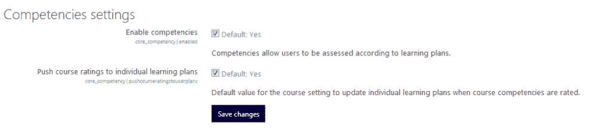

# 创建以学生为中心的项目式课程

在第六章《开发基于教师-学生互动的班级课程》中，我们确认，在开发基于班级且包含教师-学生互动的课程时，保持课程组织上的清晰性以及建立良好的沟通是非常重要的。

同样，在以学生为中心的项目式课程中，保持清晰和良好的沟通也很重要。在活动方面，尽可能保持简单直接也很重要。毕竟，如果你有太多地方可以去，同时有太多事情要做，在线环境可能会变得复杂和令人困惑。

在本章中，你将学习如何最佳地设置以学生为中心的项目式课程。我们将重点介绍一些你可以用于成功课程的几个关键组成部分，并回顾学生协作创建文档、音频文件、演示文稿和视频时可以使用的开源应用程序。我们的目标是帮助你，作为一名教师、管理员、教学设计师或 Moodle 支持人员，快速轻松地设计和启动课程。

在本章中，我们将讨论以下主题：

+   配置以学生为中心的项目式课程的全球设置

+   包含基于能力的教育

+   选择最佳的活动和资源

+   确保活动与评估相联系

+   为学生选择在创建协作项目时使用的开源应用程序

+   配置课程以允许有效的教师和同伴反馈

# 以学生为中心的项目式课程的特点

传统的面对面大学课程是一个班级课程，有固定数量的学生一起进步完成课程，他们由一位教师引导，同时提供反馈并评估学生项目。

在线课程可能非常相似。唯一的区别可能在于，由于你是在一个在线环境中工作，因此有更多方式与他人进行沟通，学生们可能是一起上一门课或者一起上一系列课程。

为了让学生为今天全球分布的工作场所中的协作工作做好准备，让我们以虚构的世纪大学为例。世纪大学在其所有在线课程中都内置了协作项目。例如，在领导力和战略思维课程中，学生必须协作分析商业情况，并创建演示文稿以及文档、音频和视频。虽然可以从常规教师主导的班级课程中修改课程外壳，但这是一个复杂的过程。因此，为了优化用户体验并提高课程功能，为所有课程创建了一个新的外壳，以便它们非常适合协作项目。

在考虑如何配置课程时，百年大学在线团队会与教师、课程设计师、教学技术专家和 Moodle 管理团队会面。在他们创建框架之前，他们需要审查主要属性。

以学生为中心的项目式在线课程的主要特征包括以下内容：

+   共同的开始和结束日期

+   清晰的时间表，包括里程碑

+   涉及学生在小组中共同工作的协作活动

+   来自同伴和教师的可获取反馈

+   一个供学生分享文件和编辑彼此文件的空间

+   需要学生学习新技能并达到更高质量标准的项目（如音频编辑、图像编辑、整合地理信息等）

学生项目可以采取多种形式，或包括作品集。关键特征是随着时间的推移，会不断构建出许多不同版本，并且持续的审查和修订允许人们建立在前知识的基础上，并发展自我意识。

你可以在《学习作品集：反思实践，提升学生学习》一书中了解更多关于学习作品集的信息，该书可在[`www.uwstout.edu/soe/profdev/resources/upload/learningportfolio_000.pdf`](http://www.uwstout.edu/soe/profdev/resources/upload/learningportfolio_000.pdf)找到。

以学生为中心的项目式课程成功的关键是学生与教师之间的表现和互动。在退出考试要求的情况下，可能还需要融入基于能力的教育。从 Moodle 3.2 版本开始，Moodle 的主题如**Boost**包含了整合能力框架的能力。

# 设置你的项目式课程 – 全局设置

让我们继续探讨假设的百年大学的案例。当团队成员讨论如何最好地创建一个模板，以便用于所有包含学生项目的课程时，一些必备元素浮现出来。以学生为中心的项目式课程最重要的两个考虑因素如下：

+   **简单结构**：主要焦点需要是连接到清晰时间表和里程碑的协作空间。避免过多的干扰，如测验和游戏。

+   **清晰的沟通**：学生在独立工作或与其他协作小组的成员一起工作时，应该始终有途径提问和回答问题。

通过选择一个能够让我们自定义课程外观的框架，我们可以确保实现清晰和沟通的目标。

# 日历

我们在之前的章节中讨论了如何设置日历。项目式课程的流程是相同的；然而，你需要确保你投入更多的里程碑和提醒，以便保持进度。记住，日历可以是设定目标的有力工具。

# 基于能力的教育

许多学院和大学都在响应公众和纳税人日益增长的需求，即学习者证明他们已经学到了一些东西，从而引入了基于能力的教育。对于那些熟悉美国 K-12 教育的人来说，基于能力的教育并不新鲜，它是 2001 年《不让一个孩子掉队法案》的基础。

从 Moodle 3.2 版本开始，现在可以整合与标准相对应的能力框架。能力框架是能力的分层列表。这些能力通常由标准机构或中央机构定义。在某些情况下，它们由政府机构开发。在其他情况下，它们由专业协会或协会开发。Moodle 能力的一个优点是您可以个性化它们，以便将课程能力与个人学习计划联系起来：

1.  前往“网站管理”菜单。

1.  点击“能力”：

点击“能力设置”。您将有机会启用能力（包括核心能力）。您还将有机会将您的课程评分或结果推送到个人学习计划。这样做可以让您完成个人学习计划，这可能是您整体作品集中的一个关键元素。

如果您的个人学习计划是作品集的一部分，本质上它就是一个项目：

个人学习计划

要使用能力框架，您需要通过 Moodle 获取它们。因此，您需要导入一个能力框架，或者从您在一门课程中已有的能力框架中导出。开始时，请执行以下操作：

1.  点击“导入能力框架”：

1.  如果您没有 CSV 文件格式的框架，您需要从您已保存的一个存储库中导入一个：

能力框架

1.  您可以搜索已经以 CSV 格式存在的能力框架。一个方便的搜索地点是 MoodleNet：[`moodle.net/mod/data/view.php?d=12&mode=asearch`](https://moodle.net/mod/data/view.php?d=12&mode=asearch)。

1.  您可以使用 MoodleNet 的搜索框搜索框架。简单的搜索“数学”就产生了许多选项。

1.  您现在可以导入 CSV 格式的标准。在某些情况下，您可能需要在 GitHub 上设置一个账户，GitHub 是开发者使用的代码存储库。

1.  在您导入能力框架后，您可以将其纳入学习计划模板：

# 主题选择

**Boost**是一个非常受欢迎的主题，它被重新编写以适应 Moodle 3.2，现在已成为默认主题。它是一个核心主题，也是标准的。然而，你可能希望使用不同的主题。正如我们在前面的章节中提到的，你可能希望使用 MoodleCloud 和**Moodlecloud 主题**，它是基于**Clean 主题**构建的。如果你是长期使用 Moodle 的用户，你可能更喜欢 MoodleCloud。

# 配置 Workshop 设置

让我们从“站点管理”中的“插件”菜单选择“活动模块”，然后导航到“管理活动”|“Workshop”。或者，我们也可以从“添加活动”菜单中选择“Workshop”。

现在，让我们看看 Workshop 的设置。默认设置可能对你来说效果很好，但你可能需要注意以下几点：

+   **最大提交附件大小**：此选项的默认值取决于站点设置和服务器设置，对于包含音频、视频或大量图片的附件来说可能太小。你可能希望使用 Google Drive，它提供高达 15 GB 的空间，或者使用其他云存储服务。

+   **评审数量**：此选项的默认值通常是 5。你可能希望更多。

# 日历

我们在前面章节中讨论了如何设置日历。基于项目的课程的流程是相同的；然而，你需要确保你投入更多的里程碑和提醒，以保持进度。记住，日历可以是一个强大的目标设定工具。

在这里，我们正在配置全局设置，我们在这里这样做是为了确保所有课程的一致性。我们将在课程本身内设置事件，例如截止日期。

当你配置单个课程（或你的演示课程）时，将设置课程级别的截止日期和里程碑。

# 目标设定和激励

这是个讨论如何使用日历来设定目标和激励团队成员的好时机。使用日历设定里程碑和指定个别团队成员的任务将帮助你确保每个人都专注于任务。当有人落后并错过截止日期时，这对于跟踪进度和寻求帮助非常有用。

一定要认可并奖励及时完成任务的人。你可以设置日历以反映关键时间线日期，并内置一个插入表情符号或其他鼓励图标的空间。

徽章也可以用来激励学生。例如，可以开发一个徽章，在完成关键里程碑时颁发。为此，请转到“站点管理”。选择“徽章”，然后从菜单中选择“管理徽章”，如下所示：

当你点击“添加新徽章”时，你可以描述徽章所涉及的工作。你还可以为你的徽章添加图片。请注意，我在这里和下一张截图中使用的是 Moodlecloud 主题：

在你继续配置徽章时，你需要确定何时颁发徽章以及谁可以确定徽章已被获得。最简单的方法是指定教师作为徽章颁发者，但如果它是自定步调的课程，你将想要设置它，以便在完成指定活动后获得：

注意，我们可以通过角色选择手动发布。这允许你选择个人来发布徽章，这在主观标准很高的情况下可能是个好主意。

因此，一旦你指定教师为可以发布徽章的个人，你现在可以启用访问。注意，一旦这样做，你为徽章选择的图片就会出现在徽章标题块的左侧。你可能希望选择比我做的更简单、更清晰的图形。

# 课程级别配置

现在你已经配置了网站级别的课程，让我们设置一个基于项目的课程。

# 课程设置

首先，我们将添加一个课程。记住，我们在第一章*准备构建典范 Moodle 课程*中学习了如何做，在网站管理菜单中，你可以在你创建的其中一个分类内创建课程。

在网站管理菜单中，执行以下步骤：

1.  点击管理课程和分类。课程和分类管理页面出现，显示课程分类列表，如下面的截图所示：

1.  现在，点击一个分类，然后选择创建新课程。

1.  在编辑课程设置页面，输入课程全名和课程简称字段中的必填信息，然后点击保存更改。

现在，我们已经准备好设置课程，以便它能够很好地支持学生进行项目协作。让我们保持简单以避免混淆。以下是最理想的设置：

1.  在“管理”块中，转到课程管理。

1.  点击编辑设置。

1.  在编辑课程设置页面，选择课程格式“主题格式”，然后添加至少两个额外的主题：一个用于课程中使用的教学材料，另一个用于示例项目和开源应用的链接。

1.  在外观部分，将“向学生显示成绩册”设置为是。

1.  将“启用完成跟踪”设置为是。

1.  确保通过在“分组”下的“分组模式”中选择“可见分组”来包含分组。

1.  点击保存更改按钮。

# 为课程提供资源

在前面的章节中，我们讨论了如何设置文件夹和链接以为学生提供资源。对于学生在整个课程中都会使用的资源，创建一个主题并将其命名为`课程材料`。

要包括其他阅读材料和特定主题的材料，将它们添加到每个主题中。

# 项目应用链接

如果你的学生正在创建协作演示文稿，他们需要能够编辑和添加音频、视频和文本文件。他们还需要整合地理数据。

在前面的章节中，我们讨论了创建指向文字处理、电子表格和演示工具的链接。现在，让我们看看音频和视频的开源和免费工具。

# 音频、视频和地理信息工具

以下是一些免费且通常是开源的工具：

+   **Audacity**: Audacity 是一个用于创建和编辑音频文件的优秀程序。你可以在自己的计算机上下载并安装它，并且它适用于 Windows、Mac 和 Linux。如需更多信息并下载，请访问 [`audacity.sourceforge.net/`](http://audacity.sourceforge.net/)。

+   **LAME**: 要将 Audacity 项目转换为 MP3 文件，你需要使用 MPEG 音频层 III (MP3) 编码器。LAME 非常有效。如需更多信息并下载，请访问 [`lame.sourceforge.net/`](http://lame.sourceforge.net/)。

+   **LibriVox Checker**: LibriVox 提供了一个检查音轨的程序。它非常实用且易于使用。它还会检查文件格式，尽管这可能不是你需要使用的功能。如需更多信息，请访问 [`wiki.librivox.org/index.php/Checker`](http://wiki.librivox.org/index.php/Checker)。

+   **Google Earth**: Google Earth 可能是最简单且最广为人知的开源地理信息系统，对于提供协作项目的地图和位置非常有帮助。要查看条款和条件并下载，请访问 [`www.google.com/earth/download/ge/agree.html`](http://www.google.com/earth/download/ge/agree.html)。

+   **YouTube Video Editor**: YouTube 视频编辑器非常易于使用，且免费。它不像其他免费视频编辑器那样复杂，也没有像 Camtasia 那样的控制功能，但它非常适合协作，因为它简单易用，并允许你添加字幕以符合有关确保残疾人士能够获取所提供信息的法规。你可以上传文本或依赖 YouTube 内置的语音识别软件，如果没有太多背景噪音，这可以非常有效。YouTube 视频编辑器可在 [`www.youtube.com/editor`](http://www.youtube.com/editor) 获取。

# 选择活动

在我们配置课程和全局设置时，让我们回顾一下活动，这些活动是 Moodle 的插件。

我们将使用的主要活动是论坛、研讨会和维基。由于我们已经知道如何设置讨论论坛，因此我们不会回顾如何将论坛添加到主题中。相反，我们将专注于研讨会和维基。

# 活动和评估

让我们回到旅游课程的案例。团队现在正在寻找学生协作的最佳方式，这意味着他们将一起创建和编辑文件，对它们进行评论和评估。在审查了通过 Moodle 提供的活动后，确定了两个非常适合需要项目协作的以旅游为重点的在线课程。

团队成员决定的活动是工作坊和维基。工作坊允许学生提交工作并对自己以及同伴的工作进行评分的能力非常适合大学的需求。

维基被选中，因为它允许学生快速轻松地协作，最终结果可以包含协作编辑的文本以及来自团队成员的视频、音频和图片贡献。

# 工作坊

幸运的是，世纪大学团队发现，在 Moodle 课程中构建工作坊活动很容易，并且它为学生提供了创建文档的机会，然后提交和评估。评估结果直接反映在成绩册中，当设置提交时自动出现。以下步骤显示了如何开始：

1.  前往与您想要放置协作项目的主题最接近的主题。

1.  前往“添加活动或资源”菜单并选择“工作坊”。

1.  在“添加新工作坊”页面，展开“常规”。

1.  填写以下字段：工作坊名称和描述。

1.  打开提交设置并填写提交说明和最大提交附件数量等字段。

1.  然后，在评估设置中，务必填写标题为评估说明的字段。

1.  在示例提交中，选择复选框以允许进行示例提交以进行评估练习。

1.  请记住，大多数字段将已经设置为默认值（这是在配置全局设置时建立的）。

工作坊活动的美在于它允许学生相互学习和从他们的错误中学习。当他们评估自己的工作或同伴的工作时，他们会根据说明进行评论，这些评论可以发布在评估说明中。您可以从评估设置的可展开链接“添加工作坊”中输入说明，如下面的截图所示：

当学生阅读评论后，他们可以将建议和见解应用到我们为评估学生而创建的文档的修订中。修订也可以提交，这允许对个人工作的更多反馈和反思，并且可以通过反馈可展开链接进行增强，该链接允许您选择反馈附件的数量和大小，并撰写一个出现在成绩册中的结论，如下面的截图所示：

Moodle 允许您审查您的设置，并继续添加详细信息或修改您已包含的内容。

# 配置维基

百年大学商学院已决定在其课程中实施维基活动，以帮助学生以允许他们与同学互动和促进对课程内容参与的方式学习关键术语。例如，在旅游趋势课程中，学生在一个 Airbnb 社交媒体营销策略维基中合作。所有学生都必须发布社交媒体的例子，然后贡献例子。

Moodle 的维基活动非常适合这个目的。维基通过包括与同学的社会互动来促进学生的参与。维基作业应使学生能够满足他们的好奇心，并研究对他们内在有趣的课题。在创建他们的维基时，学生可以协作创建 HTML 文档，并审查彼此的添加和更改。

维基百科非常适合通过动手合作的方式鼓励学生深入理解一个概念。要开始，请转到与您想要放置维基百科的主题最接近的主题，并执行以下步骤：

1.  在“添加新维基页面”上，展开“常规”。

1.  填写以下字段：维基名称和描述。

1.  点击维基模式下拉菜单，选择“协作维基”。

1.  然后，在通用模块设置中，将“可见”设置为“显示”。

1.  点击“保存并返回课程”按钮。

一旦您已编辑了您的维基百科设置，您就可以将其对学生开放。学生可以点击“编辑”，然后添加、删除或对条目进行评论。为了查看谁添加或删除了内容，他们可以点击“历史记录”，查看谁做出了贡献以及何时做出的贡献：

一旦学生完成对维基的贡献，教师可以对活动进行评分，并根据学生贡献的质量和数量确定成绩。教师可以在整个过程中点击“评论”以提供指导。如果做得好，维基可以创造一种美好的自豪感和团队精神，并且非常有激励性和信息性。

# 摘要

在本章中，我们学习了开发和管理以学生为中心、以项目为基础的课程的最佳方式。我们关注的是学生将需要一个非常清晰的结构来管理他们的项目，并且您将需要提供支持，包括链接到他们可能需要以执行他们的协作活动。

我们特别注意了 Moodle 在 3.2 版本之后如何融入基于能力的教育和能力框架。基于能力的教育可以是组合课程或以项目为重点的课程的一部分，特别是如果有一个标准化的结业考试，为这些考试做准备是很重要的。

我们探讨了拥有易于修改、灵活、响应式的主题的重要性，这样课程在所有设备上都能有良好的外观和感觉。

在下一章中，我们将指导您如何使用 Moodle 创建在线社区，这将利用 Moodle 的灵活性来开发新的培训和知识传递方式。
