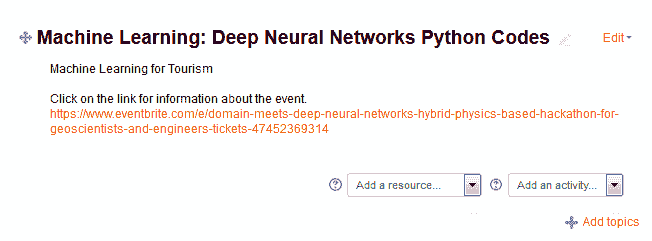
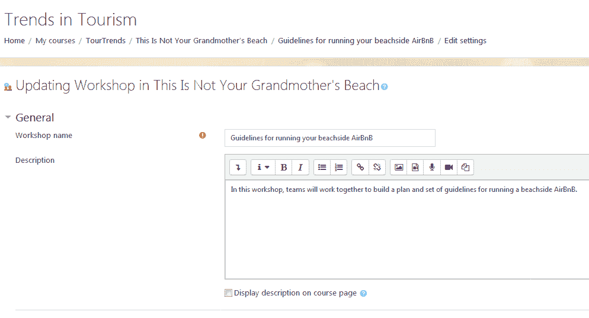
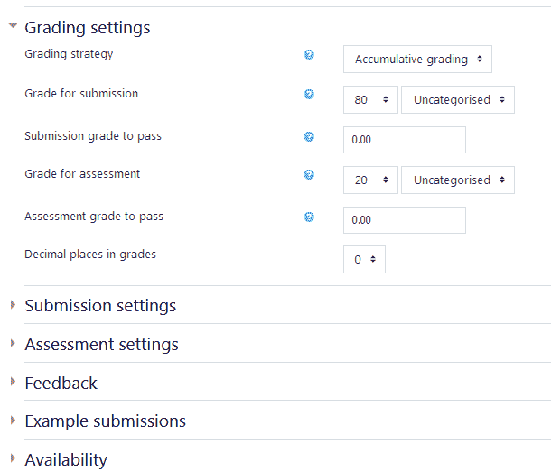
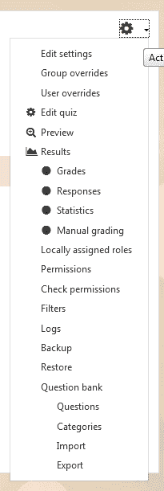
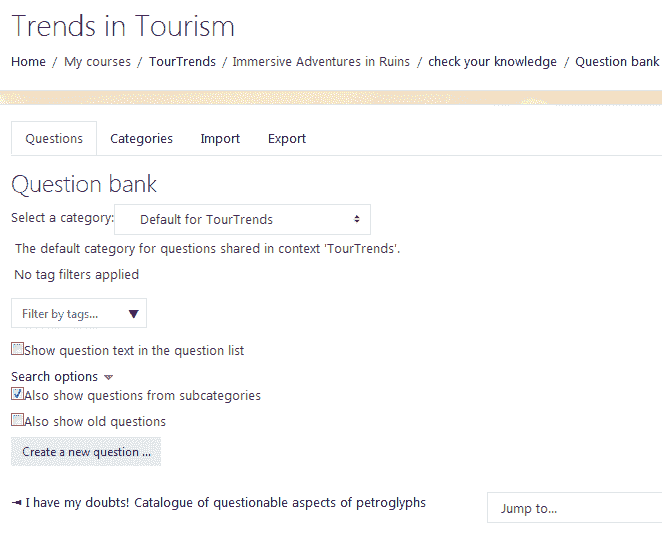
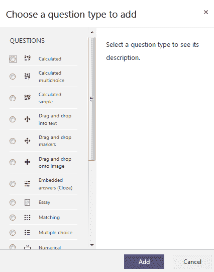
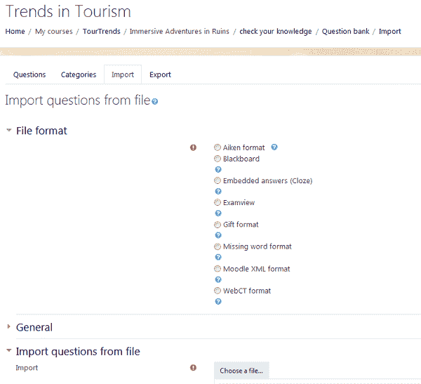
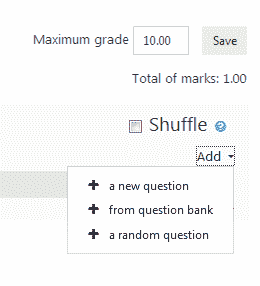

# Moodle 在在线社区中的应用

现在您已经熟悉了使用 Moodle 为不同类型的课程提供服务的方法，是时候看看一群人如何作为一个在线社区聚集起来，并使用 Moodle 实现他们的目标了。

例如，那些有相同兴趣并希望讨论和分享信息以传递知识的人可以在为该目的设置的 Moodle 课程中非常容易地做到这一点。

Moodle 在在线社区中有许多实际用途。例如，协会的成员或公司的员工可以聚集在一起实现目标并完成任务。在这种情况下，Moodle 提供了一个完美的互动、协作和创建最终项目或完成任务的地方。

在线社区也可以专注于学习和成就，Moodle 可以成为鼓励在线社区相互支持学习、进行评估和展示他们的证书和徽章的完美工具。Moodle 同样也是一个优秀的**大规模开放在线课程**（**MOOC**）平台。

在本章中，我们将应用我们在前面章节中学到的知识，创建灵活的 Moodle 课程，这些课程非常适合在线社区，并且可以轻松修改以创造机会，利用不同地点的个人力量教授和学习新的知识和技能。

在本章中，我们将向您展示 Moodle 的好处以及如何使用 Moodle 为以下在线社区和目的提供服务：

+   以知识传递为重点的社区

+   以任务为重点的社区

+   专注于学习和成就的社区

# Moodle 和在线社区

人们常常容易将 Moodle 视为一个主要用于组织为学生或员工提供的学习管理系统。社区通常定义得很好，因为它通常由追求共同目标的学生、公司的员工或协会或社会的成员组成。

然而，有许多非正式的群体和社区聚集在一起，因为他们有共同的兴趣、获取知识和技能的愿望、共同完成任务的需求，以及让人们知道他们已经达到里程碑并获得了可销售能力的愿望。

例如，一个在线社区可能围绕气候变化这一主题形成。这个可能使用社交媒体相互沟通的群体，希望分享信息和接触志同道合的人。在这种情况下，他们创建了一个兴趣社区。虽然他们可以通过 Facebook、Twitter 和其他社交媒体平台进行连接，但他们可能缺少一个提供“一站式购物”解决方案的平台。Moodle 使得分享文档、视频、地图、图形、音频文件和演示文稿变得容易。它还允许用户通过讨论论坛相互交流。由于我们只能使用但不能控制社交网络，因此关注安全问题很重要。因此，Moodle 管理员可能希望考虑在 Moodle 安装中备份或复制关键帖子或洞察的方法，以便可以保存和存储。

对于愿意整合社交媒体的管理员来说，将 Moodle 作为一个汇集 Twitter、Pinterest、Facebook、LinkedIn 和其他平台的地方，可以使其在共享和广播您希望与世界分享的信息方面变得极其高效。

在另一个例子中，个人可能聚集在一起完成一个特定的任务。例如，一群志愿者可能聚集起来组织一场 5 公里长跑筹款活动，以提高对癫痫病的认识。对于这种情况，Moodle 提供了一系列活动和资源，可以使其在活动的规划和宣传中以及活动总结报告和新闻稿的创建中进行协作。您甚至可以整合在线预订平台，如 Eventbrite（[`www.eventbrite.com/`](https://www.eventbrite.com/)），它为免费活动提供免费版本，非常适合宣传免费聚会和聚会。对于筹款活动，如果仍然使用免费版本，Eventbrite 将收取费用：

最后，让我们考虑一个可能希望确保潜在雇主了解他们所具备技能的人。他们可以通过展示完成在线课程所获得的证书以及徽章、数字证书、高成就者名单上的提及和其他成就的电子游戏化证据来做到这一点。还有 MOOCs，它们汇集了教学材料、引导式小组讨论和自动评估。凭借其功能和灵活性，Moodle 是 MOOCs 的完美平台。

# 构建基于知识的在线社区

对于我们的基于知识的在线社区，让我们考虑一个希望了解更多关于气候变化及其影响的人组成的群体。为了构建基于知识的在线社区，我们需要执行以下步骤：

1.  选择一个移动友好型主题

1.  定制您站点的外观

1.  选择资源和活动

Moodle 使得来自所有地区和机构的个人能够聚集在一起，分享信息以实现共同目标。我们将在以下章节中了解如何做到这一点。

# 为您的基于知识的 Moodle 在线社区选择最佳主题

由于社区中的许多用户使用智能手机、平板电脑、笔记本电脑和台式电脑访问 Moodle，选择一个响应式主题是个好主意，这意味着它将自动格式化，以便在所有设备上正确显示。

如果您使用 MoodleCloud，主题已经响应式。您可以自定义外观，但选项有限。

您可以在[`moodle.org/plugins/browse.php?list=category&id=3`](https://moodle.org/plugins/browse.php?list=category&id=3)了解更多关于 Moodle 主题的信息，查看它们，了解开发者，阅读评论，然后下载它们。

有许多优秀的响应式主题，例如默认的 Boost 主题和 Clean (Moodlecloud) 主题，它们还允许您自定义它们。这些是*核心*和*贡献*主题，也就是说，它们是由开发者创建的，可以是 Moodle 安装的一部分或免费下载。

如果您已安装 Moodle 3.5 或更高版本或使用 MoodleCloud，您的 Moodle 安装包括许多 Boost 和 Clean (Moodlecloud) 主题。但您可能想要一些变化：

1.  在站点管理菜单中，点击外观菜单

1.  点击主题

1.  点击主题选择器

1.  点击更改主题按钮

1.  查看所有主题

1.  点击您想要选择的主题旁边的“使用主题”按钮，然后点击继续

# 使用基于知识的 Moodle 在线社区的最佳设置

您可以执行多项操作来自定义站点的外观，使其非常适合基于知识转移的 Moodle 在线社区。以下是一个简要的项目清单：

+   在课程默认设置窗口的课程格式部分下选择主题格式。通过选择主题，您将能够围绕主题组织内容。

+   使用通用部分，这是所有课程中包含的第一个主题。它包含新闻论坛链接。您可以使用它进行公告，突出社区共享的资源。

+   在新闻论坛中包含主要联系人的姓名、照片和简要的传记概要。这将营造出有一个真正的“求助”人物正在帮助指导这项工作的感觉。

+   将社交媒体融入其中，以鼓励分享和传播新信息。简短更新非常有效，因此您可以考虑通过添加您的 Twitter 账户作为您的社交媒体网站之一来包含 Twitter 信息流。

即使你的讨论主题可能包含数百个有趣的子主题，但在创建你的 Moodle 课程时，最好将子主题的数量限制在四个或五个。如果你有太多的选择，你的用户可能会过于分散，没有机会相互交流。将你的 Moodle 网站视为一个聚会点。你希望有太多的分组会议和房间，还是希望有一个主要的网络站点？考虑一下你希望如何鼓励用户互动和交流。

# 为基于知识的 Moodle 在线社区选择资源和活动

如果你想要配置 Moodle，使其成为聚集在一起学习特定主题或问题的个人理想的平台，以下是需要包含的项目：

+   资源：务必包括多种类型的文件，如文档、视频、音频文件和演示文稿

+   活动：包括测验和其他允许个人测试其知识的活动

+   以沟通为重点的活动：设置一个论坛，以便社区成员可以发布他们的想法并相互回应

创建有效的基于知识转移的 Moodle 课程的关键是给个人成员一个机会发布关键和有用的信息，无论格式或大小如何，并适应社交网络。

# 构建基于任务型的在线社区

让我们考虑一群人聚集在一起计划筹款活动的情况。他们需要计划活动、开发材料并准备最终报告。Moodle 可以使人们共同计划活动、协作开发材料以及分享最终报告的信息变得相对容易。

# 为基于任务型的 Moodle 在线社区选择最佳活动

如果你正在使用志愿者或只是使用 Moodle 完成任务或完成任务的人，你可能会有一大批 Moodle“新手”。由于人们可能不熟悉在 Moodle 中导航和找到他们需要去的地方，你需要一个清晰、引人注目且包含易于遵循的指示的主题。

有一些主题非常适合协作和多个功能组。强烈建议你实施一个研讨会。在这种情况下，我们将组建一个研讨会，旨在制定在海滩 AirBnB 运营指南，目的是让社区成员——他们都在海滩拥有度假租赁——从这个研讨会中受益：

1.  前往你想要添加研讨会的主题

1.  选择**添加活动**

1.  从下拉菜单中选择**Workshop**

1.  输入**研讨会名称**、**描述**、**评分设置**、**以及更多**：

1.  在完成基本信息后，务必前往每个下拉菜单并输入详细信息：

现在度假租赁业主社区将能够参加研讨会。你甚至可以设置协作小组或团队。

# 使用基于任务的 Moodle 在线社区的最佳设置

由于你的用户将在小组中共同工作并在研讨会中协作完成课程项目，有一些设置可以帮助完成任务。以下是一个简要的清单：

+   在课程默认设置窗口的课程格式部分下选择“主题”格式。通过选择它们，你将能够围绕特定主题组织你的内容。如果你希望围绕特定任务组织你的课程，可以使用“周”格式菜单。

+   包括日历块，并确保添加主要任务截止日期和里程碑日期。

+   在课程默认设置屏幕上启用“可见组”，以便设置用于完成任务的小组。

+   将社交媒体融入其中以鼓励分享和传播新信息。简短的更新非常有效，因此你可以考虑包括一个 Twitter 流。

确保将任务聚类在名为“主要任务”的文件或主题中，而不是为每个任务单独创建一个主题。考虑最清晰和最简单的方式帮助用户找到他们需要参与的任务（和子任务）。

# 为基于任务的 Moodle 在线社区选择资源和活动

以下是可以包含在基于任务的 Moodle 网站中的项目：

+   **外观**：包括日历块，并确保包括每个任务的关键事件和时间表。

+   **资源**：包括手册、活动地点地图、演示文稿以及提供关于任务、地点和其他关键信息的网址链接。

+   **活动**：为每个任务设置一个论坛，以便社区成员可以发布他们的想法并相互回应；包括研讨会或 Wiki 活动，或是一个基于档案的程序，如 Mahara，用于协作文档。还要包括已完成文档的示例。注意，我们在本章前面已经讨论了设置研讨会。

+   **同步通信**：例如，如果需要，通过 Skype 或 BigBlueButton 进行网络会议。

+   **社交媒体**：包括使用 Twitter、Facebook 和 YouTube 更新和提醒群组成员的方式。

创建有效的基于任务的 Moodle 课程的关键是保持小组成员以高效和及时的方式协作。

# 基于学习和成就建立在线社区

我们生活在一个越来越需要能够在个人和职业网络中展示你的知识和分享你的成就的世界里。能够让人们了解你所拥有的技能和能力对你来说是有生产力和有用的。此外，在游戏化的环境中，获得更多能力是激励性的。

# 创建一个证书课程

使培训和职业发展对一群志同道合的用户或社区可用，将允许个人在需求高的主题中获得证书。他们还可以参加那些以高质量、相关内容、可靠的评估而闻名的课程。

以下是在您的证书课程中需要包含的配置、设置和项目清单：

1.  选择 Klasstheme，因为它允许您直接在“主题设置”屏幕上提供的位置输入社交网络 URL。请注意，Klass 主题是一个贡献主题，如果尚未安装，您的 Moodle 管理员将需要下载并安装它。您可以从这里下载 Klass：[`moodle.org/plugins/download.php/16815/theme_klass_moodle35_2018051900.zip`](https://moodle.org/plugins/download.php/16815/theme_klass_moodle35_2018051900.zip)。Klass 100%响应式，这使得它适用于所有设备。它包括在页脚中可配置的社交媒体链接。Klass 是一个免费主题。

1.  在 MoodleCloud 中，您需要在“Boost”或“Moodlecloud”中添加自定义菜单项。

1.  为课程内容创建资源，如书籍，清晰的演示/视频和培训材料。

1.  以自评分测验活动的方式创建您的评估。

1.  在“课程默认设置”屏幕上，启用完成跟踪。确保此选项已在“站点管理”菜单的“高级功能”子菜单中启用。

1.  点击“添加活动或资源”链接，并添加一个证书。配置证书的活动完成部分，以便在满足条件（某些成绩或条件）时显示活动已完成。完成课程将触发证书的生成。

1.  设计独特、吸引人、描述性强且有助于建立品牌的证书。包括您的标志和自定义水印。

1.  显示可用的完整证书系列，以激励用户获得所有证书。

# 创建生成徽章的课程

在完成一个级别或课程后获得徽章，并在基于云的位置以及 Facebook 或其他社交媒体网站上展示，这只是“游戏化”培训的一个流行例子。*游戏化*培训有助于激励学习者，因为，就像在视频游戏中一样，一个人可以在上升至不同*级别*时展示他们的能力。遵循上一节中涵盖的相同步骤来创建生成证书的课程。然后继续以下步骤：

1.  在“站点管理”菜单中，点击“徽章”。

1.  点击“管理徽章”，然后点击“添加新徽章”按钮。

1.  在创建徽章后，配置徽章的“标准”选项卡，以便在完成课程时生成徽章。

1.  设计独特、吸引人、描述性强且有助于建立品牌的徽章。

1.  展示所有可用的徽章系列，以激励用户获得所有徽章。一个很好的地方是在新闻论坛中，你可以上传一个图标或包含徽章信息和每个图标的网站的链接。

1.  为了给你的徽章做宣传和分享，你可能希望将你提供的徽章在[`openbadges.org/`](http://openbadges.org/)的 OpenBadges 项目中注册。

你可以在[`openbadges.org/`](http://openbadges.org/)了解更多关于 Mozilla OpenBadges 项目和 Mozilla OpenBadges 背包的信息。

在你开发社交媒体宣传策略时，你可能希望突出完成课程的个人的推荐信，并在他们的徽章旁边展示他们的面孔。你需要获得使用他们的引言和图片的许可，但这并不痛苦，而且完全值得努力。为此，请遵循给定的程序：

1.  前往网站管理菜单。

1.  点击**插件和身份验证**。

1.  要设置权限和访问级别，请通过导航到网站管理 | 安全填写网站策略字段。请记住，你通过社交网络网站共享的任何信息都可能被共享或公开。 

# 创建一个 MOOC

MOOCs 是向可能的大型群体提供课程和内容以及发展一个有助于宣传你和你课程/项目的社交网络的好方法。

你可以通过简单地创建一个证书或定制课程并添加小组来轻松创建一个 MOOC，以便你可以促进讨论。以通常的方式创建课程，并简单地添加一个关键主题的论坛。你仍然可以将基于自评测验的评估作为基础，当成功完成时，将触发证书或徽章的生成。

# 为测验创建题库

在创建课程的过程中，开发题库可以非常有帮助。你可以在课程的任何单元或模块中使用这些问题，并将它们纳入测验中。这些问题可以评分，并与成绩册关联。

1.  首先前往 Boost 主题中的齿轮菜单。然后选择题库：

注意，你有很多灵活性。

1.  如果你选择**问题**，你可以创建新问题并将它们分配到类别：

1.  你有多种题型可供选择，从自评的如多项选择题，到教师评阅的如论文：

1.  如果你选择**类别**，你将找到你在课程中创建的不同主题的类别。你还可以添加类别并重新排序它们。

1.  你还可以导入和导出通常与教科书一起提供的题库。请注意，包括 Examview 和 Blackboard 在内的流行格式都包括在内：

# 构建你的测验

一旦你建立了你的题库，你就可以在创建测验时使用这些题目。只需将题目添加到测验中，并分配你希望包含的值。你还有创建新题目和添加随机题目的选项：

# 摘要

在本章中，我们学习了如何使用 Moodle 来满足在线用户不断变化的需求。具体来说，我们探讨了如何利用 Moodle 的功能来帮助在线社区实现他们希望通过知识技能的传授、完成协作任务以及通过社交媒体展示成就的目标。在这个过程中，我们深入研究了 Moodle 的灵活性和其广泛的内置和贡献主题、活动、资源和插件。

在这本书中，我们指导你使用 Moodle 的最佳方式，并提供了关于在众多机构以及用户/学习者中使用 Moodle 的信息。我们描述了设置课程的最佳方式以及如何选择适用于多种用途的资源、活动和评估。然后，我们讨论了针对不同目的构建课程的最佳方式，从大型班级课程到学生个人学习的自学课程。最后，我们探讨了扩展 Moodle 的使用范围，以适应和接纳新技术以及知识传递和技能构建的新方法。
