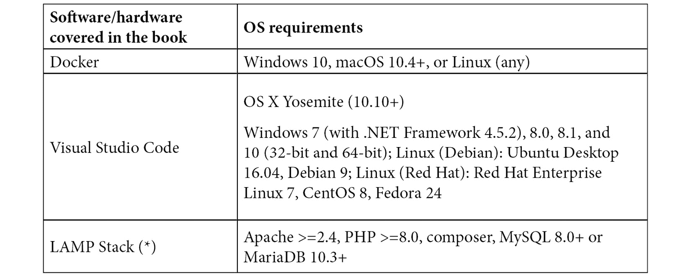

# 前言

现在，数字创新对任何中等或大型组织来说都是一个挑战。这段旅程，也被称为*数字化转型*，不仅与技术相关，而且受文化和动机支柱的引导。许多经理或沟通大师会告诉你，技术并不重要，它只是公司（营销、销售等）的一种商品或一系列工具。我们相信，只有当你选择的技术真正能够支持你的业务倡议时，这种做法才是可能的。在开始忘记技术问题，只关注业务的情况下，我们必须找到一个在所有条件下都能完美工作、可以扩展并支持业务增长的技术解决方案。经过一段长时间的调研，我们发现这个解决方案被称为 Pimcore。

简而言之，Pimcore 是一种技术促进者，它消除了公司思维与双手之间的大部分操作摩擦。Pimcore 可以作为**PIM（产品信息管理**）系统，在整个公司范围内分发产品信息，或者集中管理公司的重要数据（主数据管理），允许所有其他方安全地消费它。

此外，Pimcore 是一个强大的 CMS 引擎，可以管理比简单的网页多得多的内容。它是一个非常灵活的解决方案，涵盖了你在日常生活中遇到的几乎所有问题。在这本书中，我们将学习如何充分利用 Pimcore。

在阅读这本书之后，你将能够做到以下事情：

1.  你将了解 Pimcore 是什么以及它是如何工作的。实际上，我们相信这不仅仅是一个工具选择的问题，而是如何将其完美地融入大局。

1.  你将能够使用 Pimcore 作为数字体验平台来创建网站和门户。这包括使用 CMS 引擎，但还包括创建自定义的 Web MVC 页面和可重用组件。

1.  你将能够使用 Pimcore 的企业功能（PIM、DAM、MDM）。你将学习如何收集数据，将其纳入统一数据库，并与所有潜在消费者（应用程序、网站、遗留应用程序等）共享。

1.  你将能够安装、维护和部署 Pimcore 网站。

简而言之，这本书将引导你通过理论和实践课程，成为 Pimcore 开发者！

# 这本书面向谁

这本书旨在鼓励你以直接的方式学习 Pimcore。我们将涵盖所有重要主题，以便你能够开始并完成一个真实世界的项目。为了达到这个目标，我们开发了一本不仅是一套信息，而且是理论与实践相结合的书籍。这种实用方法将教会你 Pimcore 是如何工作的，以及如何将你的知识付诸实践，而不会感到烦恼或几乎无法通过询问为什么需要这样做来跟随教程。实际上，前几章将向你介绍 Pimcore 的高级视角，让你了解所有其优点，然后我们将开始一段旅程，逐步逐步地揭示 Pimcore 的所有细节，而不会引入任何过度的复杂性。

这本书是为任何希望提供基于 Pimcore 的解决方案的开发者、CTO 或任何其他类型的技术人员而设计的，或者愿意构建数字平台以支持他们的客户或业务在数字化转型之旅上。

这本书逐步介绍了最重要的概念，因此你不需要任何特殊背景。为了理解这本书，你所需要知道的就是 PHP 语言的基础知识以及一些涉及 HTML 和 CSS 的实践。

# 本书涵盖的内容

*第一章*, *介绍 Pimcore*，解释了 Pimcore 是什么。它介绍了主要特性并描述了它是如何工作的。本章向读者介绍了这个工具，并从广泛的角度揭示了所有功能。

*第二章*, *设置您的 Pimcore 开发环境*，涵盖了 Pimcore 的安装，并深入探讨了如何设置一个与源代码仓库兼容的本地环境。

*第三章*, *开始使用 Pimcore 管理界面*，解释了管理 UI 是如何工作的以及如何找到基本命令的 UI。这对于导航 Pimcore 菜单和功能非常有用。

*第四章*, *在 Pimcore 中创建文档*，解释了如何创建 Pimcore 的文档以及如何处理基本设置。当涉及到编辑文档和创建网页时，这是一个非常有用的资源。

*第五章*, *探索* *对象和类*，解释了如何创建和管理 Pimcore 对象和类。这一步骤构成了大多数 Pimcore 任务的基础，例如创建复杂的网站。

*第六章*, *使用数字资产管理*，解释了如何在 Pimcore 中使用 DAM 功能来管理资产。这对于上传资产以及在网页内传播或集成它们非常重要。

*第七章*，*管理 Pimcore 站点*，涵盖了管理和维护路由。它解释了如何安装 Pimcore 站点以及如何管理第三方插件。这是保持 Pimcore 正常运行所必需的。

*第八章*，*创建自定义 CMS 页面*，解释了如何实现主题并为自定义 CMS 页面准备模板。在掌握自定义网页构建的基本知识时，这样做非常重要。

*第九章*，*配置实体和渲染数据*，解释了如何在实现网页的术语中向用户展示数据。这是一个现实世界的用例，有助于将你所学到的知识付诸实践。

*第十章*，*创建 Pimcore 砖块*，解释了如何创建用户可配置的可重用组件。这是节省大量工作并简化维护的方法。

*第十一章*，*完成网站建设*，包含节省时间和在多个项目中重用组件的技巧和窍门。

*第十二章*，*实施产品信息管理*，展示了 Pimcore 的 PIM 配置。它解释了如何调整它以作为 PIM 系统进行管理。通过本章，你可以开始使用 Pimcore 作为 PIM 系统。

*第十三章*，*实施主数据管理*，解释了如何使用 GraphQL API 公开数据。有了这个，你可以激活此功能并开始数据集成。

*第十四章*，*数据集成*，涵盖了 Pimcore 的数据集成功能。这有助于以标准方式与其他系统集成，而无需任何开发工作。

# 为了充分利用本书

Pimcore 是一个优秀的平台，得到了许多供应商和社区的支撑。这意味着你的应用程序将始终托管在更新的平台上，该平台将定期发布新功能。本书基于 Pimcore X，这是出版时的最新版本，因此通过阅读本书，你将学习到当时可用的最新版本！

Pimcore X 附带了许多新功能和更新的技术堆栈（Symfony 5、PHP 8 和 ExtJS 7），这提供了许多性能改进。尽管 Pimcore X 与之前的版本之间有巨大的变化，但你在阅读本书时学到的许多概念也适用于所有之前的版本。

本书旨在提供无缝的学习体验，并且除了基本的 PHP 和 HTML 知识外，不需要任何其他相关专业知识。无论如何，任何在其他平台上有一定经验的开发者都将能够遵循说明并理解代码。此外，我们没有介绍任何付费或与操作系统相关的工具，这使得本书对所有读者都无任何限制：



所有标记有(*)的项目仅在您不选择使用 Docker 时才需要。实际上，我们提供了一个基于 Docker 的设置选项，它不需要除了 Docker 之外的其他任何东西。所有依赖项都将自动管理，因此您不必担心这一点。无论如何，如果您打算手动安装，您还需要在本地 PC 上安装所有标记有(*)的工具。

**如果您正在使用本书的数字版，我们建议您亲自输入代码或通过 GitHub 仓库（下一节中提供链接）访问代码。这样做将帮助您避免与代码复制粘贴相关的任何潜在错误。**

# 下载示例代码文件

您可以从 GitHub 下载本书的示例代码文件：[`github.com/PacktPublishing/Modernizing-Enterprise-CMS-using-Pimcore`](https://github.com/PacktPublishing/Modernizing-Enterprise-CMS-using-Pimcore)。如果代码有更新，它将在现有的 GitHub 仓库中更新。

我们还提供其他代码包，这些代码包来自我们丰富的图书和视频目录，可在[`github.com/PacktPublishing/`](https://github.com/PacktPublishing/)找到。查看它们吧！

# 下载彩色图像

我们还提供包含本书中使用的截图/图表的彩色图像的 PDF 文件。您可以从这里下载：[`static.packt-cdn.com/downloads/9781801075404_ColorImages.pdf`](https://static.packt-cdn.com/downloads/9781801075404_ColorImages.pdf)。

# 使用的约定

本书使用了多种文本约定。

`文本中的代码`：表示文本中的代码单词、数据库表名、文件夹名、文件名、文件扩展名、路径名、虚拟 URL、用户输入和 Twitter 昵称。以下是一个示例：“在`/bundles/BlogBundle/Resources/views/Areas`中添加一个名为`view.html.twig`的模板。”

代码块按照以下方式设置：

```php
<?php
use Pimcore\Bundle\BundleGeneratorBundle\PimcoreBundleGeneratorBundle;
return [
    PimcoreBundleGeneratorBundle::class => ['all' => true],
];
```

当我们希望您注意代码块中的特定部分时，相关的行或项目将以粗体显示：

```php
"autoload": {
    "psr-4": {
      "App\\": "src/",
      "BlogBundle\\": "bundles/BlogBundle/",
      "Pimcore\\Model\\DataObject\\": "var/classes/DataObject",
      "Pimcore\\Model\\Object\\": "var/classes/Object",
      "Website\\": "legacy/website/lib"
    }
  },
```

任何命令行输入或输出都按照以下方式编写：

```php
docker-compose exec php bash
```

**粗体**：表示新术语、重要单词或屏幕上看到的单词。例如，菜单或对话框中的单词在文本中显示如下。以下是一个示例：“填写带有数据的表单（这是一个联系表单，因此字段含义应该是显而易见的）然后点击**发送**。”

小贴士或重要注意事项

看起来像这样。

# 联系我们

欢迎读者反馈。

`customercare@packtpub.com`。

**勘误**：尽管我们已经尽最大努力确保内容的准确性，但错误仍然可能发生。如果您在这本书中发现了错误，我们将不胜感激，如果您能向我们报告这个问题。请访问[www.packtpub.com/support/errata](http://www.packtpub.com/support/errata)，选择您的书籍，点击勘误提交表单链接，并输入详细信息。

`copyright@packt.com`，并附上相关材料的链接。

**如果您有兴趣成为作者**：如果您在某个领域有专业知识，并且您有兴趣撰写或为书籍做出贡献，请访问[authors.packtpub.com](http://authors.packtpub.com)。

# 评论

请留下评论。一旦您阅读并使用了这本书，为何不在您购买它的网站上留下评论呢？潜在读者可以查看并使用您的客观意见来做出购买决定，Packt 公司可以了解您对我们产品的看法，我们的作者也可以看到他们对书籍的反馈。谢谢！

如需了解 Packt 的更多信息，请访问[packt.com](http://packt.com)。
