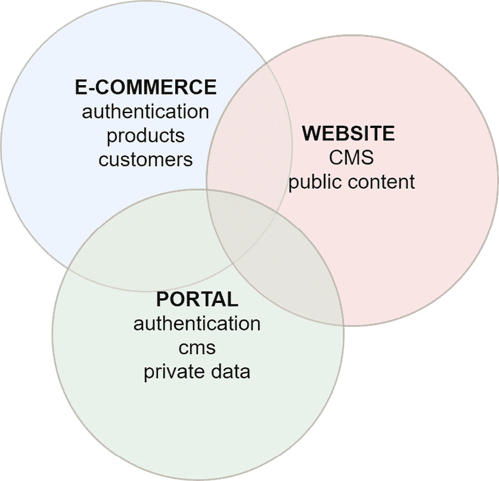

# *第一章*：介绍 Pimcore

如果你购买了这本书，你可能已经对 Pimcore 有一个大致的了解。**Pimcore**是一个开源的企业级**数字体验平台**（**DXP**）解决方案，旨在成为其市场领域的领导者。但这个定义究竟意味着什么呢？在 IT 世界中，术语经常被用作描述某物的填充词，因此听起来非常模糊。这就是为什么我们必须正确地解释 Pimcore 是什么，而不仅仅是告诉你它能做什么，而是深入到它解决的问题。

理解我们将要研究的工具将应用到的场景总是一个很好的开始，尤其是当你想学习 Pimcore，一个将彻底改变你的开发体验的平台时。

在本章中，我们将探索 Pimcore 平台，了解它提供的益处和机会，以及它与其它解决方案的不同之处。

本章的结构如下：

+   为什么你需要一个比简单的 CMS 更强大的系统？

+   什么是 Pimcore？

+   发现 Pimcore 的功能

+   了解 Pimcore 的益处

+   了解使用开源软件的益处

# 为什么你需要一个比简单的 CMS 更强大的系统？

在本节中，我们将了解内容管理系统（**CMS**）在近年来是如何演变的，以及这些变化带来了哪些新的需求。理解市场趋势和需求对于成功采用能够支持我们或我们的客户业务多年的 CMS 平台是至关重要的。在不完全了解它如何有用的情况下学习像 Pimcore 这样的工具可能会浪费时间，你可能会错失许多可能解决你或你的客户问题的技术机会。

那么，让我们介绍 Pimcore 解决的问题。然后，就会很容易理解为什么 Pimcore 以这种方式创建了这个产品，以及为什么我们应该采用它。

## 理解需求的变化

首先需要接受的是，市场已经发生了演变。我们不再满足于仅仅建立一个网站的工具。这在 10 年前是可以的，但现在，大多数公司对数字通信有更全面的方法，并希望得到更多。你不必因为这种变化而感到害怕；自从互联网诞生以来，我们已经看到了许多演变，事物变得越来越好。我们只需要跟随趋势，或者更好的是，预测趋势。

想想过去 20 年发生了什么。我们开始时，互联网只是产生静态文本内容。这实际上意味着手动编写每一页，如果你幸运的话，使用**文件传输协议**（**FTP**）链接上传。我们仍然记得当时我们与脚本语言作斗争，混合 HTML、数据和 Flash 内容，只是为了渲染一个简单网站的两三页。

CMS 是一次非常大的飞跃。从浏览器管理动态内容解锁了让最终用户管理他们数据的机会，减少了所需的开发工作量。这是一场革命，许多 CMS 解决方案在互联网上传播开来。WordPress、Drupal 和其他产品成为创建网站不可或缺的选择。它们（可能现在仍然是）在大多数场景下都是好的解决方案，但我们在这里是为了增强我们的工具范围，并为市场明天提出的要求做好准备。

现在是时候将用户体验提升到下一个层次，我们需要一个优秀的工具来支持这一数字进化。

## 什么是 DXP？

要了解市场在数字创新方面的当前需求，主要需要了解的是**DXP**。这个缩写词由 Gartner 提出，它描述了一种可以支持公司数字体验的技术解决方案。如今，公司应该将客户放在一切的中心，并利用技术将正确的内容传递给正确的人。大多数想要在线扩展业务的公司几年前就开始了他们的数字化转型。他们创建了电子商务网站来在线销售，并使用合适的产品触及所有客户。他们从互联网开始就有网站（一些公司甚至拥有多个）。企业可以拥有一个全球性的单一网站，一个品牌一个网站，或者根据目标市场拥有不同的网站。他们还有一个门户，以供代理商或第三方供应商访问**商业对商业**（**B2B**）信息。

所有这些细分都是一场噩梦：我们拥有太多的平台，我们必须保持它们之间的通信，我们必须在不同的 GUI 中管理内容，我们需要多个登录来完成所有这些。这个解决方案不是最优的，因此需要改变。

但这个变化还有一个更重要的原因——我们忘记了所有这一切中最重要的一点：我们忽略了客户。在应对技术和它们的演变时，我们失去了对最关键事物的关注。这就是为什么我们需要一个独特的软件解决方案来有效地管理我们刚才描述的所有问题：这个解决方案就是数字体验平台（DXP）。

在下面的图中，我们可以看到 DXP 如何包括电子商务、网站和门户以创造独特的体验：

图 1.1：DXP 图解

如前图所示，电子商务和门户解决方案有一些共同之处；例如，它们共享相同的认证系统。我们还可以看到网站和门户使用相同的 CMS 创建网络内容。根据您的经验，您可能已经理解到这三个解决方案需要共享一些功能。在单独的平台中复制它们是多余的，但将所有元素集中在一个平台上可以帮助我们减少复杂性并避免数据的重复。

简而言之，我们谈论的是拥有一个集成的软件框架，可以解决所有数字公司的需求。这将导致通过所有数字接触点吸引广泛的用户。

Pimcore 是这样一个框架。Pimcore 的使命是让技术成为数字转型的推动者，而不是障碍。Pimcore 的愿景非常明确：仅使用一个工具，我们就应该能够整合公司中的所有其他工具，并加速所有流程。

大多数公司都难以找到数据，或者他们在系统中重复了数据。这通常是因为，从历史上看，这些公司采用了许多垂直解决方案，而后来他们才开始考虑如何整合它们。这些孤立的数据集被称为 **数据孤岛**。打破数据孤岛的一个快速方法是创建一个包含所有所需信息的中央数据库，并通过简单透明的 API 协议促进对消费者的交付。这种解决方案被称为 **主数据管理**（**MDM**），它是 Pimcore 提供的功能之一（我们将在 *第六章*，*使用数字资产管理* 中看到这一点）。

我们始终需要拥有中央信息，但当我们必须处理产品数据时，这种需求往往成为痛点。我们可能在多个渠道销售产品，我们可能需要在实体目录上打印信息，我们不能在不同地方关于同一事物有不同的信息。产品管理的集中化被称为 **产品信息管理**（**PIM**），这是 Pimcore 的另一个功能。我们将在稍后了解更多关于这个功能的内容，但现在请记住，成长中的公司有这样的需求。

最后，我们可能希望集中管理数字资产，如视频、图像和其他文件。一个收集和提供数字资产的系统被称为 **数字资产管理**（**DAM**）系统，你可能已经猜到了，Pimcore 也涵盖了这一点。我们将在下一节中了解更多关于这个主题的内容。

Pimcore 平台是任何面临数字体验转型的公司的正确工具。此外，数字体验转型并不是这样的公司唯一会面临的问题。这就是为什么 Pimcore 不仅仅是 PIM、CMS、MDM 和 DAM 的简单组合。Pimcore 是一个帮助我们实现客户数字体验重大变革的解决方案。

在本节中，你了解了最重要的公司所面临的挑战。作为技术人员或顾问，我们的职责是帮助公司审视他们的简单网站，提出他们数字通信的更全面愿景，并使用合适的技术解决方案来满足他们的需求。在下一节中，我们将了解 Pimcore 是什么以及为什么它是解决这个问题的正确方案。

# 那么，Pimcore 是什么？

在定义 Pimcore 是什么的时候，首先要考虑的是它的名字本身。名字暗示 PIM 是主要部分，但你不要被外表所迷惑。Pimcore 远不止是一个 PIM 产品。

我们可以将 Pimcore 描述为一个框架，因为它为我们提供了实现项目所需的所有工具。这个定义并不比第一个定义更直观，但它给我们一个重要的提示。Pimcore 是一套工具，但我们不能将其视为一个库或是一些代码片段。Pimcore 是一套协作工具；每个工具都能解决它自己的问题。它不是一个产品，而是一系列产品的集合。所有这些工具的结合有助于设计一个完整的数字解决方案。从这个意义上说，Pimcore 是一个真正的 DXP：一个使开发者能够实现数字项目的平台。这个定义有点模糊，但它告诉我们 Pimcore 为我们提供了非常广泛的机会。我们不能仅仅说“Pimcore 能做这个或那个”，因为 Pimcore 可以做任何事情。

Pimcore 是一把瑞士军刀，允许开发者创建任何软件解决方案。我们在这里讨论的是网站，但 Pimcore 还有其他应用，例如向公司提供数字资产或成为公司所有信息的中心数据库。Pimcore 提供了一个包含 DAM、PIM、MDM 和**Datahub**等许多功能的单包解决方案。我们已经在前面简要介绍了 DAM、PIM 和 MDM 是什么，但在接下来的章节中，我们将更深入地探讨这些主题，包括 Datahub。所以，如果这些定义仍然看起来很高级，请不要担心。

现在需要知道的重要事情是，Pimcore 允许你管理大多数与数据相关的应用，而无需编写一行代码，同时提供一个现成的稳固的电子商务框架。

这是我们应该问自己是否真的需要所有这些功能的时候。你真的需要管理像 Pimcore 这样的复杂平台的开销来构建你的简单网站吗？市场上有很多更容易的解决方案来实现网站。你可以找到一个超级便宜的 CMS 托管提供商，或者使用网站构建器。这些解决方案可能适合小型公司，但不适合中型或大型组织。企业需要做更多的事情，在本章中，你将了解到使用简单的 CMS 解决方案来实现网站你会错过的机会。

如果你正在阅读这本书，你正在寻找一个能够管理所有场景的 CMS 解决方案，从最简单的到最复杂的。你不想为了满足营销部门的所有需求而实施 10 个不同的工具。此外，你不想为随着业务增长而不断重新平台化的成本付费。构建应用程序的技术解决方案必须是一个提升，它给你带来的好处比从头开始做事更多，但同时也不会限制不断的改变。你需要有自定义网站每个部分的选项，而不需要做出诸如添加数千个插件并逐渐失去对解决方案控制这样的妥协。

你可能仍然认为 Pimcore 是一个具有许多你实际上并不需要的特性的平台——这是可以理解的。仅仅为了实现一个简单的网站而拥有一个功能强大的平台可能看起来有些过度。有时这可能会让人感到害怕。无论如何，如果你再次阅读本章的第一节，你会同意，迟早你需要比简单的 CMS 更多的东西，在那个时刻，你将希望能够在不改变平台的情况下进行扩展。

在接下来的章节中，我们将了解 Pimcore 最相关的特性。这将帮助您理解为什么 Pimcore 可以在所有场景下支持您的开发，从简单的网站到复杂的企业门户。这些特性包括以下内容：

+   将数据从 UI 中解耦

+   正确渲染内容

+   准备好迎接云计算

让我们来看看这些。

## 将数据从 UI 中解耦

现代 CMS 的第一个特性是将展示层从数据结构中分离出来。简单来说，你必须在一边添加数据，然后在另一边提取它，这两层之间没有任何依赖关系。

使用 Pimcore，我们有两种选择：

+   实施完全解耦的解决方案（**解耦 CMS**）。

+   实施一个**无头 CMS**解决方案。

在分离模型中，通过从渲染过程中分离生成的数据，可以实现业务逻辑和展示层之间的分离。在 Pimcore 中，我们有一个**模型视图控制器**（**MVC**）模型，其中**Twig**模板引擎不能处理业务逻辑。对于不是 MVC 和 Twig 专家的人来说，MVC 是一种将业务逻辑（控制器）从展示（视图）和数据（模型）中分离出来的模式，而 Twig 是一个 PHP 模板引擎。

另一个选择是采用完全无头解决方案。在这种情况下，我们通过 API 公开数据，然后使用现代**单页应用**（**SPA**），例如使用 Gatsby 静态化的 React 网站来渲染它。这种无头解决方案在各个方面（如数据定义和数据展示）之间提供了强大的分离，并且公开给应用的数据也可以被其他应用使用。

市场提供了许多无头 CMS 解决方案，但 Pimcore 自带了这两种解决方案，即无头和分离。因此，你可以使用标准的分离方法来管理简单的网站，这让你可以像往常一样创建模板，但无需任何展示和业务逻辑之间的相互依赖。这保持了设计的简单性，你将受益于解耦的优势，因此只需重新实现模板，就可以轻松地刷新你的网站。

无论如何，如果你想创建一个边缘解决方案，你可以使用 Pimcore 来实现。实际上，它自带了一个开箱即用的解决方案，用于以 GraphQL 格式公开数据，这足以将其转换为一个无头内容提供者。对于那些不熟悉它的人来说，GraphQL 是一种用于 API 的查询语言，它描述了数据并减少了数据生产者和消费者之间的摩擦。

## 统一用户体验

在 CMS 时代的初期，交互式网站（也称为**门户网站**）和机构网站之间存在分歧。这导致了 CMS 网站和门户解决方案之间的分歧。由于这些 CMS 网站和门户网站有不同的需求，我们习惯了采用不同的工具，也许每个都需要不同的供应商团队。

例如，在过去，创建一个公共网站相当简单，所以有一个简单的 CMS 解决方案是可以接受的。另一方面，创建一个门户网站更为复杂，因此我们需要一个高度可定制的解决方案。但随着数字技术的普及，越来越多的公司开始在线销售，增加了这一新需求。那么，解决方案是什么呢？公司只是从市场上取了一个工具，安装了它，就开始销售。这是一种快速解决在线销售问题的方法，但它引发了一个问题：它向 CMS 和门户中添加了第三个平台（电子商务）。这通常意味着一个新的供应商、一个新的图形界面和不同的用户体验。换句话说，这意味着在数据和用户体验方面，三个系统处于不同的领域。经过几年的数据流、集成和在这些环境中复制业务逻辑的斗争后，有一天，像 Gartner 这样的顾问提出了一个解决方案。他们告诉我们，我们在组织中有隔阂，隔阂是坏事，我们应该消除它们。此外，同样的顾问告诉我们，商业、门户网站和内容管理不是不同的需求，而是同一数字体验的一部分。问题是：如果所有这些组件都是用户想要的，谁可以为我们提供一个工具来提供它们？

Pimcore 与竞争对手的做法不同。它的 CMS 引擎管理公共和私有网站，因此你可以创建预留区域和门户，以及简单的单页公司网站。此外，这个解决方案还与企业保持联系，添加了一些有助于与其他支柱集成的关键组件。这种特殊配置使 Pimcore 成为一个通过在一个平台上包含所有你需要来吸引用户的特性，统一用户体验的理想平台。

因此，你可以扩展网站的功能，直到涵盖整个公司，包括电子商务。换句话说，你可以采用一个工具来满足你大部分的数字需求。

## 为您的公司做好云准备

我们购买物理服务器的古老时代已经过去了。我们现在处于云时代，我们想要利用这个新世界提供的一切机会。然而，我们生活在一个复杂的世界里，由于许多原因，云并不总是可行的选择。我们可能必须处理需要保存在私有数据中心中的敏感数据，或者我们的预算可能只允许使用廉价的托管提供商。每个公司都有不同的需求，但它们都需要有一个网站。无论是在云端还是本地拥有数据，都不应该是采用数字平台的原因。它必须原生支持两者。

作为一名开发者，你不想使用不同的工具来服务不同的客户端目标。这样会让你不得不学习许多不同的工具，并且同时使用它们；如果你想在某一技术领域保持深入的专业化，这总是很困难的。

要使用不同的产品来服务市场的不同细分市场，你可能需要不同的技术，并且成为双重专家。对于每天工作时间有限的开发者来说，使用过多的技术意味着专业化的减少。你使用的科技越多，你用来学好它的时间就越少。我们可以找到一些例外，但一般来说，情况就是这样。

Pimcore 与众不同。它能够从最简单的网站到最复杂的公司网站提供一切服务，这得益于它的灵活性和开源代码，它提供了一套免费的完整解决方案。这种敏捷性也体现在其托管方面。Pimcore 可以通过上传文件到廉价的托管服务或常规虚拟机，仅通过 FTP 上传文件即可作为简单的 PHP 应用程序部署，并且它原生支持容器化。

换句话说，作为一个容器，Pimcore 可以部署在大多数**平台即服务**（**PaaS**）、Docker 或 Kubernetes 解决方案上，无论是在云端还是本地。因此，云是一个机会，但不是必需的。你可以将 Pimcore 部署到云端，实施一个无需人工监控和维护即可扩展和站立起来的解决方案。如果你对不同的解决方案有信心，或者你根本不需要扩展，使用 Pimcore 仍然是一个可行的选择。

了解 Pimcore 是什么对于理解其功能和跟随接下来的章节至关重要。事实上，在下一节中，我们将开始深入研究 Pimcore 的功能，如果没有发现 Pimcore 是什么，这将是不可能的。 

# 发现 Pimcore 的功能

正如我们在本章前面所说，Pimcore 自带一些巨大的功能，使其成为实施简单和复杂项目的理想平台。

在本节中，我们将介绍主要功能：

+   数据管理

+   CMS 和 DXP

+   PIM

+   MDM

+   DAM

+   电子商务

+   客户数据平台（CDP）

让我们逐一看看。

## 数据管理

数据管理是 Pimcore 所有功能的根源。数据管理功能聚合任何类型的数据，并将其分发到多个渠道。与其他解决方案相比，Pimcore 拥有最佳的数据管理系统。它允许你通过 UI 定义数据，这非常好，因为你不需要编写任何一行代码。你可以停止与数据库表、字段长度和数据查询的麻烦；你所需要做的就是简单地打开你的浏览器，创建你的实体，并选择你想要的字段。这个特性与低代码平台或无头 CMS 上可以找到的特性非常相似，但更加强大。

大多数数据管理工具的独特目标，是数据模型定义。这样的解决方案使我们能够快速定义数据模型和 API，但产生的 UI 对普通用户来说很难使用。基本上，你非常受限，只能使用标准的数据录入界面，所以在大多数情况下，你必须从头开始编写用户 UI。这正是纯无头原则所追求的：将所有渲染方面委托给系统之外。当为最终用户（如客户或门户用户）设计应用程序时，这是一个好原则，但如果我们需要允许管理员或编辑在我们平台上输入内容怎么办？对于这样的内部用户，Pimcore 提供了一个可以在定义数据模型时定制的管理界面。

换句话说，当你向项目集合添加一个字段，例如为产品实体添加 SKU 字段时，你不仅定义了数据的存储方式（唯一性、字段长度、日期类型等），还定义了该字段将如何展示给用户。例如，你可以将字段分组在标签页或面板中，或者简单地重新排序，为后台用户创造良好的用户体验，而不需要修改任何一行代码。此外，Pimcore 支持多语言，因此你可以通过建模字段来选择哪些字段需要翻译。这个特性使 Pimcore 成为完美的无头 CMS，因为它结合了现成的管理后端灵活性和构建自定义应用程序的数据 API 的强大功能。

当后台用户第一次看到管理界面时，许多人可能会感到有些迷茫，因为 Pimcore 管理界面提供了数千个功能。仅仅几分钟的 Pimcore 操作后，你就可以清楚地了解这个工具能让你达到何种自由度。多标签环境使得你可以在同一个窗口中打开多个数据标签页，轻松地从一处剪切粘贴数据到另一处，并在几秒钟内导入/导出数据。

如果这还不能让你感到震惊，那么接下来我们要告诉你的将会让你震惊。所有这些数据都是通过 REST API 提供的；这是一个不需要任何开发工作的原生功能。这意味着，你使用 Pimcore 界面建模的每个实体都可以通过 REST API 轻松访问，无需额外努力（自从 PimcoreX 以来，这个功能将仅作为企业订阅功能提供）。你可以通过 HTTP 调用将一行数据放入数据库或查询实体列表，而无需编写任何代码。

如果你仍然不感到震惊，我们可以再次提及 DataHub 模块——你可以通过 GraphQL 标准为 API 建模来开启并暴露你的数据给外部系统。

很容易看出，当你管理好数据层时，接下来的一切都会变得更容易。

## CMS 和 DXP

Pimcore 在其网站上被定义为“最适应的 DXP 平台”。询问任何使用 Pimcore 的开发者，他们都会确认你几乎可以用它做任何事情。使用这个 CMS，你不仅可以实现酷炫的网页，还可以在每一个接触点为每位客户提供个性化的数字体验。多亏了其 CMS 引擎，Pimcore 使公司能够有效地实施其数字战略，并将更多的时间和金钱投入到真正重要的事情上。

从开发者的角度来看，Pimcore 的 DXP 是一个用于实现任何类型数字解决方案的集成框架，无论是网站还是门户。此外，它结合了实现电子商务的所有工具，你可以将你的网站或门户转变为完整的 DXP 解决方案。这是一个以 API 驱动的方法，使平台可集成到每个系统中，并有助于打破孤岛。

从用户的角度来看，Pimcore 是他们创造力的自然延伸。丰富的**所见即所得**（**WYSIWYG**）界面显示了内容在发布时的样子。因此，你可以输入数据并构建页面，而无需对最终结果有任何疑问。此外，你可以创建页面模板，引导用户通过辅助页面组成。这个过程要求编辑只写相关的内容，而无需浪费时间更改样式或文本位置。

组件模型让您可以使用大量的小部件，所有这些小部件都准备好放置在页面上，并且可以完全配置。这些小部件被称为砖块，正如其名所示，它们构建了网页。借助强大的模板引擎，您可以渲染实体，例如文章或产品，或者您可以定义一个自定义模板来从头开始构建非标准页面。

还有什么可说的呢？使用集成工具，您可以在编辑时预览网站，并且通过发布工作流程，您可以放心保存，不用担心会破坏任何东西。

## PIM

多亏了其强大的数据引擎，Pimcore 可以管理任何类型和任何数量的数据。如果您模型了一个名为“产品”的项目集合，并在数据模型中添加了一个价格，那会怎样呢？嗯，这使得 Pimcore 成为一个 PIM。这不是玩笑。这就是与 Pimcore 一起工作的简单性。您可以在几分钟内使用浏览器将 PIM 添加到您的公司。完成这个 5 分钟的任务后，您就有了一个独特的数据库，用于您公司所有的产品。多亏了 Pimcore 的数据集成能力，您可以从任何 CSV 文件中摄取数据，而无需编写任何代码，或者在任何情况下，只需付出非常少的努力。任务完成。

公司中的任何其他系统都可以与您集成，并且营销团队将管理所有产品在独特的中央管理中。在这里，他们将定义哪些产品进入哪个渠道，为哪个市场启用哪些语言，等等。因此，即使在这种情况下，Pimcore 也为我们提供了简单性和完整的解决方案。

如果我们还没有说服您，我们可以告诉您关于工作流程的事情。当您需要在产品管理中添加审批流程或某些业务逻辑时，您可以使用 Pimcore 工作流程来建模。在下一张图中，我们有一个解释 PIM 在行动中的架构图：

![图 1.2：PIM 架构]

![图 B17073_01_02.jpg]

图 1.2：PIM 架构

前面的图显示了 Pimcore 作为 PIM，是产品的单一事实来源，为许多消费者提供服务，例如 B2B 电子商务、B2C 电子商务、亚马逊或 eBay 市场或简单的印刷目录。正如您在图中可以看到的，多亏了数据集成层，Pimcore 解决方案可以链接到现有的平台，例如 **企业资源规划**（ERP）。

PIM 是现代公司不能错过的功能，它对于在不重复信息的情况下与多个用户接触点进行扩展是必需的。它让您能够控制产品数据并加快您的软件集成。此外，在这种情况下，Pimcore 使您能够轻松地完成这项工作，因为这是一个即插即用的功能，可以随时激活。

## MDM

我们关于 PIM 所告诉你的所有内容都很酷，但它有一个很大的局限性：它仅与产品相关。实际上，从你公司的需求来看，你会发现许多其他类型的数据需要在公司内部共享并集中管理。订单、客户以及可能还有大量其他数据被公司从各种应用程序中使用，每次项目开始时，你都必须知道数据在哪里。但问题并不仅限于这些少数实体。

使用 Pimcore，我们可以使信息对所有黄金记录（对公司至关重要的信息）独特且集中。这种能力是现成的、免费的，并且只需付出有限的努力。如何做到？只需定义数据模型并将其与数据主控系统集成，例如 CRM、ERP 或任何拥有你想要移动的实体的系统。然后，你可以定义数据访问策略，实现你想要的全部逻辑。这不仅仅很酷...它超级酷！只需一个工具和几分钟，你就可以准备好将重要数据暴露给所有需要的公司应用程序。这样的解决方案使你能够掌控你的数据（这项任务通常被称为数据治理）。

整个配置就是我们在这章的第一节中提到的 MDM（主数据管理）。Pimcore 的 MDM 的主要好处是它可以管理结构，还可以管理元素的验证、版本控制和丰富化。实际上，大多数实体根据其目的地具有不同的属性。为了解释 MDM 的好处，我们可以使用任何实体，但我们将再次谈论产品。这仅仅是因为它是最常见的场景，我们可以最好地理解它。在阅读下一段时，你可以将“产品”这个词替换为任何其他类型的数据，而不会改变意义（订单、客户、发票等等）。

想想一个产品。它从哪里开始？这是一个难题，因为我们通常有一个研发团队在原型上工作，然后有人批准它进入市场，然后我们开始销售。可能在这个流程中，我们可以谈论具体产品的第一个阶段是当记录进入 ERP 系统，创建产品代码时。产品由管理产品代码和价格的 ERP 系统拥有。在这个阶段，你实际上不需要更多的数据。你已经有了一切你需要来制作报价或发票的数据。此外，大多数技术解决方案都不是为了管理带有多个图像和长描述的酷产品信息而构建的。ERP 是一个垂直解决方案，它只在其范围内的事物上做得很好。试图让它做不同的事情是没有意义的。

好吧，这里你需要的是一个数据丰富化过程。在没有 PIM 或 MDM 的情况下，通常每个用户都会根据他们的需求增强数据。因此，你可以有电子商务增加更大的图片和长的 HTML 描述，但这个电子商务只为在**商业对消费者**（**B2C**）渠道销售的产品提供信息。所以，你必须在 B2B 门户中为其他产品做同样的事情。这就是为什么在这个例子中，产品不是集中管理的。使用 Pimcore，产品和其他任何实体可以在交付给消费者之前进行翻译和丰富，包括图片、视频和附件。这是唯一能够掌握数据并能够将大部分精力投入到公司真正关心的事情上的方法，比如实施良好的应用程序而不是与数据斗争。

在下面的图中，我们可以看到 Pimcore 作为 MDM 平台的架构图：

![图 1.3：MDM 架构

![图片/B17073_01_03.jpg]

图 1.3：MDM 架构

在前面的图中，你可以看到 Pimcore 如何与许多数据所有者（**ERP**、**电子商务**、**CRM**）集成。这一步通过数据集成层收集数据，并将其提供给公司的所有应用程序（**市场**、**目录**、**B2B**和**B2C**应用程序，或**第三方**应用程序）。使用一个 API 网关，这是一个安全地暴露 API 的工具，我们还可以与供应商或第三方应用程序共享 API。

MDM 是数字创新的一个支柱。没有它，在组织内传播数据将是一件混乱的事情。使用 Pimcore，你可以集中管理数据，节省实施定制解决方案所需的时间或节省在昂贵工具上花费的钱。

## DAM

在讨论了产品和数据之后，很明显，每个公司都必须将数据保存在一个地方，使用唯一的数据模型定义，并且他们需要确保每个消费者只接收和阅读他们需要的信息。当我们在这里谈论产品和数据时，我们是在谈论无形数据——不是文件、图像、视频或可以下载或作为附件发送的数据，而是纯粹的信息。

有形数据，如文件、视频和图像，仍然是公司的重要资源。在一个通信变得越来越数字化的世界中，数字资产至关重要，特别是当你需要通过多个渠道传达相同的信息时。

你可能已经猜到了这个解决方案：我们可以在 Pimcore 内部收集所有这些信息，然后在整个系统中分发。当你已经将其启动并运行时，这是一个非常简单的解决方案，但它为你的公司提供了巨大的飞跃。

这个解决方案是由 Pimcore 实施的。Pimcore 的 DAM 软件不仅仅是一个数字资产管理应用程序：它是一个真正的数字化转型推动者。它是一个集成的数字媒体库，提供了一个可重复使用的数字资产坚实数据库，并优化了数据分发和内容搜索过程。

在下一个图表中，我们看到 Pimcore 作为 DAM 的作用：

![图 1.4：DAM 架构

![图片 B17073_01_04.jpg]

图 1.4：DAM 架构

在前面的图中，Pimcore 是所有数字资产存储的中心点。它向任何需要它们的消费者应用程序提供内容。

与 MDM 和 PIM 一样，DAM 是现代企业必备的服务之一。它使公司内部媒体资产的分发成为可能。在这里，Pimcore 也是一个强大的低成本解决方案。

## 数字商务

好吧，我们知道 Pimcore 是一个非常强大的平台，用于管理和处理一般的数据和数字内容，并且它包括出色的 CMS 支持。现在我们需要讨论电子商务模块。

实际上，一个 DXP 需要这一点来拥抱 DXP 的全部含义：门户、网站和电子商务的融合。如今，电子商务是一个巨大的市场，你可能想知道为什么这个功能被添加到 Pimcore 中。

只需想想一个电子商务解决方案包含哪些内容。首先需要讨论的是预算。并非所有电子商务系统都像亚马逊或 eBay 那样，因此我们需要根据我们的需求以及我们能支付多少来找到合适的解决方案。当电子商务市场开始时活跃的开发者来自一个本地化、高度可定制的时代，那时一个垂直开源解决方案，如 Magento 电子商务系统，是标准。这个解决方案很好，因为它允许你自定义流程的每一部分，但你必须自己托管，承担所有相关风险，并且定制元素需要持续维护。因此，**总拥有成本**（**TCO**）非常高，许多公司转向**软件即服务**（**SaaS**）解决方案，这些解决方案提供的定制选项较少，但无需维护和托管责任。这种摩擦的减少使电子商务更加民主化，但在许多情况下减少了电子商务个性化的机会。对于许多公司来说，其服务的独特性和公司流程的自动化对于电子商务解决方案至关重要。我们主要谈论的是大玩家，但也有很多初创公司通过跳出思维定式而取得成功。唯一的区别是，大玩家可以采用巨大型供应商解决方案，成本呈指数增长，但可以得到相应的结果。那么，对于预算有限的普通公司呢？

在这种情况下，Pimcore 填补了完全托管 SaaS 解决方案和大型供应商之间的差距。事实上，Pimcore 附带了一个旨在加快电子商务开发的电子商务框架，但不会引入约束或限制。此外，使用稳定的基于云的解决方案，你可以达到低维护成本的目标，在黑色星期五期间（可用性至关重要的时期）可以安心入睡。

使用 Pimcore 作为电子商务平台的另一个优势是，得益于其多站点功能，它可以处理 B2B 和 B2C，显然不需要任何数据集成，因为其内部有 PIM。

如果你还没有被说服，只需阅读这份必看的企业电子商务解决方案特性清单，Pimcore 恰好提供了这些特性：

+   复杂的价格和产品结构

+   复杂的可用性计算

+   需求不断变化的敏捷项目

+   个性化设计和结账

+   多个目录、货币、价格表和产品视图

+   多个前端应用和灵活的促销

在本章的前三节中，我们已经了解了 Pimcore 是什么，并探讨了其特性。这已经是对产品的全面概述，但我们还需要更详细地了解为什么我们应该使用它。在下一节中，我们将了解采用 Pimcore 带来的好处。

# 了解 Pimcore 的好处

Pimcore 给我们带来巨大机会的事实并不意味着它一定是适合你的工具。你可以断言市场上有很多其他解决方案，你可以混合使用多个解决方案来实现相同的结果。还有许多其他大型供应商在销售集成解决方案。所以，问题是，Pimcore 有什么好处？换句话说，它能为我们的哪些方面提供比其他解决方案更好的东西？

为了避免片面性，我们决定避免直接比较。然而，我们希望给你所有需要的工具，以便确定 Pimcore 是否是你正确的解决方案。在本节中，你将发现选择 Pimcore 作为 DXP 解决方案、PIM 或 CMS 的好处。有了这些信息，你将能够自己做出结论。

在本节中，你将发现最重要的 Pimcore 好处：

+   快速创新

+   无与伦比的灵活性

+   稳固的平台

+   被大众使用

+   简单的网页开发

让我们来看看。

## 快速创新

经常不是成本问题，而是时间问题。市场变化迅速，每个公司都需要跟上时代的步伐。唯一的选择是准备好应对变化。这导致我们快速创新。在许多情况下，拥有垂直工具、选择软件然后激活一个项目的过程太慢了。也许从理论上讲，这是最好的过程，但它需要大量的时间，并且往往不符合市场的趋势和速度。你应该领先市场一步，在你需要之前规划投资，但这并不总是可行的。没有人有水晶球。提前规划和支出是一种风险，因为你不知道未来会怎样。

在这种情况下，Pimcore 是正确的工具。这个框架已经包含了实现数字创新的最重要组件，并且可以在任何时间点激活，无需任何成本。这对于将时间作为优先事项的初创公司或成长中的公司来说，这是最好的方法。Pimcore 帮助公司从小项目开始，逐步构建目标解决方案，降低风险和返工。你可以根据需求简单地扩展，或者更好的是，你可以更快地开始你的下一个想法，并且风险更小。

## 无与伦比的灵活性

正如我们之前所说，数据管理给我们带来了无与伦比的灵活性。它有助于无头场景、常规 CMS 或企业应用。多亏了可扩展的 API 系统，用户的需求没有限制。实现解决方案只是时间问题，而不是可行性问题。此外，由于所有内容都通过 Web UI 管理，因此实施数据管理的资源和时间成本也降低了。

## 一个稳固的平台

Pimcore 是一个由优秀的框架**Symfony**支持的优秀工具。这个 PHP 框架带来了许多使开发更简单的优势：

+   强大的代码模块化（分为包）

+   应用程序和框架之间的分离

+   依赖注入

+   海量的组件和文档

+   Composer 管理包的强大功能

采用 Symfony 有助于创建标准的代码结构并加快 Web 应用程序的创建。此外，通过实现原生的字节码缓存，Symfony 有助于提高应用程序的性能。Pimcore 完全基于 Symfony 编写，在底层使用它，并且具有相同的流畅的开发者体验。

## 受大众使用

Pimcore 平台在 56 个国家的超过 10 万家公司中使用。其开源社区拥有数千名追随者。国际资金的支援确保了产品开发的连续性，每年都有新功能推出。Pimcore 获得了许多奖项，包括来自市场最重要的顾问公司 Gartner 和 Forrester 的奖项，这让我们在对其下注时更加有信心。

## Web 开发变得简单

当您离开 Web CMS 的舒适区，例如在添加网页或博客文章时，您经常会陷入需要编码的情况。这意味着，在大多数情况下，定义数据结构，使用**对象关系映射**（**ORM**）工具进行映射，并通过实现读取/保存例程与数据交互。如果您想将此功能作为 Web API 发布，可能需要采取额外的步骤。

开发过程由少数几个带来价值的活动组成，例如建模您的业务逻辑和执行大量其他重复性任务，包括数据建模或公开 API。这些无聊的任务必须执行，否则您的项目将无法运行。理想情况下，我们希望只将精力投入到真正有价值的工作中。自动化可自动化的事物将节省时间并防止人为错误。

Pimcore 在这种情况下可以帮助您完成所有重复性的工作。您只需要登录浏览器，配置您所需的内容，然后您就可以开始数据管理。您节省的所有时间都可以投入到更有价值的事情上，比如为用户提供更好的体验。

现在应该很清楚 Pimcore 可以为任何公司带来哪些好处，以及为什么我们应该使用它来推动数字化转型。Pimcore 是我们从构建简单网站到创建复杂应用的一切盟友。在下一节中，我们将重点关注 Pimcore 的许可以及它如何帮助我们减少采用时的摩擦。

# 了解使用开源软件的好处

大多数人认为使用开源软件的最佳理由是免费获得软件解决方案。免费获得产品的机会很有吸引力，但这不应成为选择开源产品的主要动机。

在本节中，您将了解采用开源软件如 Pimcore 以及 Pimcore 解决方案所有优势的最重要论点：

+   速度和敏捷性

+   共享维护成本

+   透明度和安全性

+   成本效益

+   社区

+   Pimcore 许可

让我们逐一看看。

## 速度和敏捷性

开源产品可以立即使用。您可以下载并安装它，然后就可以开始使用。您还可以在无需担心项目增长过程中的试用或成本激增的情况下对其进行测试。开源软件附带大量插件，允许您快速激活功能而无需开发成本。此外，您还有源代码，所以如果某些东西不符合您的需求，您可以对其进行修改。

## 共享维护成本

开源项目的核心由社区维护。这比从头开始构建整个定制软件并自行维护的方法具有很大优势。在开源项目中，你只需负责维护你的定制部分，这通常是在平台之上的一小层。如果你从头开始创建软件，你则需要负责 100%的代码维护。此外，如果你开发了一个可能对社区有用的模块，你可以将其开源，社区可以从它中受益。

## 透明度和安全性

源代码是公开的。这意味着你不仅可以看到它是如何工作的，全世界的人都可以看到。作为用户，你可以信任开源软件，因为这样的软件不会包含任何诡计；否则，社区会发现它们并拒绝这个项目。此外，谈到安全性，这种透明度意味着任何问题都会迅速出现并迅速得到解决。

## 成本效益

从无费用开始，你可以无任何义务地采用开源解决方案，然后进行扩展。许多开源产品都有一个“专业版”，具有更多功能。在这种情况下，你只有在开始使用产品后才开始付费，而且对于这样一个有用的工具，成本是可持续的。

## 社区

另一个重要点是社区。它有助于提供文档、测试产品并回答你的问题。由数千名成员组成的社区是无法与之竞争的。世界上没有哪家公司能够独自做到这一点。

## Pimcore 许可

Pimcore 的公共版本被称为**社区版**，并使用 GNU 通用公共许可证（GPL-3）进行许可。对于需要更广泛支持和额外功能的企业的版本，Pimcore 提供了一种企业许可，称为**Pimcore 商业许可**（**PCL**）。

这个解决方案使 Pimcore 成为大型供应商提供的商业企业解决方案的完美替代品。你不仅限于购买软件，也不会面临任何供应商锁定。此外，如果你不想使用 GPL 许可证，你可以简单地避免使用它，保持对你代码的完全所有权。如果你打算基于 Pimcore 创建产品并希望保护你的**知识产权**（**IP**），这将非常有用。在许多情况下，你可以使用社区或第三方供应商的模块来定制产品。

最后，开源的特性意味着你可以选择是否在本地部署或在云端部署。由多个 SaaS 服务支持的云解决方案有助于降低成本，并构建具有典型本地开源解决方案所有优势（如定制和所有权）以及云优势（例如，低 TCO 和高性能）的解决方案。

对于想要充分利用 Pimcore 并移除 GPLv3 许可证法律约束的软件公司，有**Pimcore 企业订阅**选项。此订阅解锁所有商业服务和产品，例如 Pimcore 企业扩展（**Pimcore** **体验门户**、**产品数据同步**等）。企业订阅提供对**长期支持**（**LTS**）和**服务级别协议**（**SLAs**）的访问。简单来说，它增加了在中大型商业场景中可能节省大量时间（和金钱）的特殊功能，以及高质量支持下的额外保修。

用一句话总结开源的所有好处，开源解决方案是可以无限制定制的解决方案，代码透明且安全，免费提供，并且仍然保留了云的好处。

# 摘要

在本章中，我们了解了 Pimcore 是什么，不仅停留在定义上，而且深入探讨了 Pimcore 的功能。Pimcore 是一个非常灵活的平台，可以提供许多解决方案，而无需重新发明轮子。通过使用它，您将体验到始终拥有满足您需求的正确解决方案的舒适感。

Pimcore 自带许多有趣的功能（PIM、CMS、DAM 和 MDM），并且采用低摩擦的许可模式，随时可用。一旦您采用它来满足单一需求，例如 CMS，您就可以使用所有其他功能，并且可以根据您的需求变化激活它们。

现在既然本章已经结束，您就可以开始实践部分了。第一步将是学习如何在您的 PC 上安装和配置 Pimcore。这门课程对于开始使用 Pimcore 和为后续课程做好准备非常重要。
