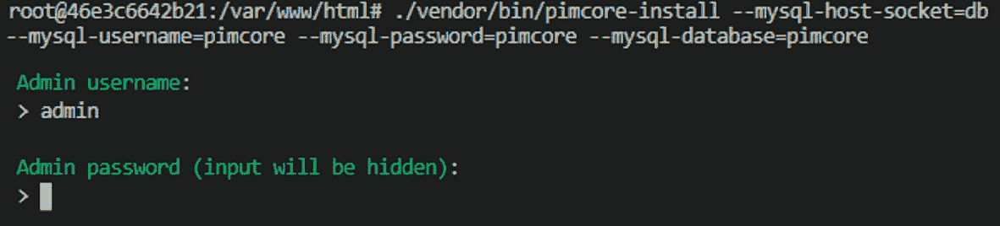
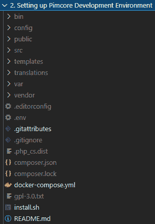

# *第二章*：设置您的 Pimcore 开发环境

在第一章中，我们对 Pimcore 进行了广泛的概述。现在是时候开始动手编写一些代码了！

在本章中，我们将学习如何设置开发环境并开始使用 Pimcore 进行开发。这一章对于拥有一个可工作的本地环境并尝试使用 Pimcore 是必需的。

本章的组织结构如下：

+   使用 Composer 从 Composer 安装 Pimcore（不使用 Docker）

+   使用 Docker 安装 Pimcore

+   探索文件夹约定

让我们开始设置 Pimcore！

# 技术要求

在 Pimcore 中编写代码非常简单，且不需要任何付费工具。尽管大多数付费工具都增加了附加值，但我们决定只使用免费工具，以便您不受任何限制地获取本书的内容。

您将需要以下内容：

+   Visual Studio Code 作为 **集成开发环境**（**IDE**）

+   一个不错的网页浏览器（例如 Chrome、Firefox 或 Edge）

+   Docker（可选，但强烈推荐）

# 为什么使用 Docker？

如果您使用 Docker，所有额外的需求（Apache、必要的库、PHP 等）都将自动管理。此外，使用 Docker 消除了开发和生产环境之间的任何摩擦，提供了一个在所有阶段都相同的虚拟环境。这就是为什么，如今，使用 Docker 是开发应用程序的首选方法，这也是我们在本书中采用的方法。因此，本书的示例基于这项技术。对于那些不熟悉 Docker 的读者，它是一个可以下载（拉取）一个现成的环境（容器）并在您的本地 PC 上运行的系统。我们将提供的所有示例都包含在一个 `docker-compose` 文件中（一个为您列出和配置容器的文件），所以您需要做的只是激活环境，Docker 将下载所有所需的资产并透明地启动它。因此，即使您对 Docker 不太熟悉，为了本书的目的，您只需要了解以下内容：

+   包含 `docker-compose.yml` 文件，运行 `docker-compose up`。

+   **停止您的环境**：在启动 Docker Compose 的终端上按 *Ctrl+C*；这将停止一切。

+   `docker-compose exec php <command>` 用于在名为 `php` 的容器内运行命令（在我们的设置中，这是 Pimcore 的容器），或者只需使用 bash 进入容器，并通过 `docker-compose exec php bash` 启动您想要的任何内容。

对于安装 Docker，它可在 Windows、Mac 和 Linux 上使用，只需导航到官方文档：[`docs.docker.com/get-docker/`](https://docs.docker.com/get-docker/)。

## 对于手动安装

如果您想手动安装 Pimcore，您将不得不手动配置您的本地机器（或服务器）及其所有依赖项。这仅适用于您不使用 Docker 的情况，所以如果您想使用 Docker，您可以跳过这一部分。

本书唯一使用这种手动方法的章节是以下部分，*使用 Composer 安装 Pimcore（不使用 Docker）*，我们将解释如何从头开始执行 Pimcore 的安装。

对于手动安装，您需要手动安装所有依赖项，包括 Composer、Apache、MySQL、PHP 以及 PHP 库。这些先决条件可能会随着新 Pimcore 版本和技术更新的到来而改变。因此，我们不是添加 Pimcore 的官方系统要求副本，而是提供了指向包含确切规格的官方页面的链接：[`pimcore.com/docs/pimcore/current/Development_Documentation/Installation_and_Upgrade/System_Requirements.html`](https://pimcore.com/docs/pimcore/current/Development_Documentation/Installation_and_Upgrade/System_Requirements.html)。

注意

Pimcore 支持 MySQL 和 MariaDB 数据库引擎，实际上 MariaDB 是 MySQL 的一个分支。在本章中，我们使用 MySQL 作为参考，因为它是最常见的选项。我们基于 MariaDB 使用了官方的`docker-compose`文件。为了避免混淆，请在本章中将 MySQL 和 MariaDB 视为同一事物。

本书的所有源代码都包含在官方 GitHub 仓库中，您可以通过此 URL 找到：[`github.com/PacktPublishing/Modernizing-Enterprise-CMS-using-Pimcore`](https://github.com/PacktPublishing/Modernizing-Enterprise-CMS-using-Pimcore)。在这个仓库中，您将找到每个章节的文件夹。在每个文件夹内，将有一个包含运行代码所有说明的`Readme`文件。

对于使用 Docker 作为环境的人来说，关于操作系统没有限制。有关 Docker 兼容性和系统要求，您可以查看官方 Docker 网站上的**下载**部分。

# 从 Composer 安装 Pimcore（不使用 Docker）

尽管我们鼓励使用 Docker，本书也是基于 Docker 容器编写的，但我们不应忽视解释如何进行纯安装。正如您在完成所有步骤后将会了解到的，以纯方式安装 Pimcore 的过程基本上与 Docker 容器内部执行的操作相同。最重要的区别是，使用 Docker，您无需与服务器、依赖项等打交道。这是因为 Pimcore 是通过**Composer**（PHP 包管理器）发布的。这使得安装在各种可能的情况下都是相同的。如果您在 Docker 容器内、虚拟机或您的 PC 上，Composer 都是一样的。

因此，您要在本地环境中安装 Pimcore，只需在安装了*技术要求*部分中提到的所有必需依赖项之后，在终端中运行几个命令即可：

注意

本书使用一个现成的 Docker 容器来完成此过程。我们包括这一部分是为了解释 Pimcore 的低级安装是如何工作的，但如果您想快速启动 Pimcore，您可以跳过这一部分，直接转到 *使用 Docker 安装 Pimcore*。此外，与 Docker 不同，在您的本地环境中使用 Composer 有很多依赖项（MySQL、Composer 等）并且需要复杂的 PHP 调整。这已经在 Pimcore 文档中得到了很好的说明，您可以遵循官方指南。在本节中，我们将介绍 Pimcore 的安装，假设您已经设置了环境，只需要安装 Pimcore。

1.  在您的文件系统中创建一个文件夹。我们假设这个文件夹命名为 `my-project`。Pimcore 对您创建该文件夹的位置没有限制。这取决于您的本地设置（也就是说，它必须能够被您的 web 服务器访问）。例如，当使用 Apache 时，一个常见的值是 `/var/www/html`。

1.  运行以下命令：

    ```php
    Pimcore/skeleton package in the my-project folder. This will also create a new folder in your filesystem, and the final path will be /your/project/my-project. Pimcore is available in two different releases: skeleton and demo. When starting a new project, it is recommended that you use the skeleton template, but if you want to see Pimcore's features, you can install the demo package to get a website with data that is ready to test. The process will take a moment, and you will see some console output that will display its progress.
    ```

1.  如果您还没有，您需要创建一个数据库。为此，请在您的终端中输入以下命令：

    ```php
    utf8mb4, to fully support Unicode encoding.
    ```

1.  编辑您的 Apache 虚拟主机。它需要指向 `my-project` 内的 web 文件夹，因此您的 Apache 文件应该将文档根目录设置为以下内容：

    ```php
    DocumentRoot /my/project/my-project/public
    ```

    注意，Pimcore 需要安装在文档根目录之外。因此，如果您在 `my-project` 内安装了它，您不能使用这个文件夹作为文档根目录。这不仅会导致功能问题，还会使您面临安全风险，允许访问受保护的内容。Apache 的完整配置可以在以下位置找到：[`pimcore.com/docs/pimcore/current/Development_Documentation/Installation_and_Upgrade/System_Setup_and_Hosting/Apache_Configuration.html`](https://pimcore.com/docs/pimcore/current/Development_Documentation/Installation_and_Upgrade/System_Setup_and_Hosting/Apache_Configuration.html)。

1.  设置文件系统权限。Apache 用户（或您使用的 web 服务器上的 Nginx 用户）需要访问 Pimcore 目录中的所有文件，并且对于 `/var` 和 `/public/var` 文件夹需要额外的写权限。在大多数情况下，这是通过输入以下代码来完成的：

    ```php
    chown makes www-data (usually the group where the user that runs the web server belongs) the group owner of the Pimcore folder, and then chmod adds write permission to the required folders.
    ```

1.  导航到 Pimcore 目录并输入以下命令：

    ```php
    /your/project/my-project directory.
    ```

1.  通过输入以下命令启动 Pimcore 安装：

    ```php
    MySQL-host-socket is the hostname of the MySQL database, MySQL-username and MySQL-password are the database credentials, and MySQL-database is the database name. This command will set up the Pimcore connection settings and will install Pimcore in the database. You will be prompted to choose the admin user for the Pimcore back office; we will choose admin\pimcore as a credential, but you can use whatever you want (although the use of simple passwords in your production environment is discouraged).In the following screenshot, we can see the console output that we receive after launching the installation command:Figure 2.1 – Pimcore installation and admin password prompt
    ```

1.  您将被提示输入 Pimcore 管理用户的用户名和密码，然后您将需要确认安装。

1.  最后一步是设置维护任务。像许多平台一样，Pimcore 需要执行定期的维护任务，例如日志轮换和清理临时或旧数据。Pimcore 的指南要求我们每 5 分钟执行此任务，以确保环境始终高效。为此，我们需要添加一个 `cron` 任务。输入以下内容：

    ```php
    crontab -e
    ```

1.  然后，将以下内容输入到 `crontab`：

    ```php
    */5 * * * * /your/project/bin/console maintenance
    ```

配置通过运行带有 `maintenance` 参数的 `console` 可执行文件来激活维护任务，这调用了标准的 Pimcore 维护任务。

在本节中，我们介绍了 Pimcore 的安装过程。这些说明非常容易遵循，但你需要已经安装了托管环境。安装 Apache、MySQL 以及配置网络部分对于大多数开发者来说是标准的，但需要一些系统工程知识，并非所有开发者都具备（也许他们也不想学习）。此外，使用这种设置，你可能每次设置新项目时都需要复制你大部分的工作。

在下一节中，我们将学习如何使用 Docker 使事情变得如此简单，看看你如何只需两个命令就能完成我们在这里所实现的事情（也许还有更多）。

# 使用 Docker 安装 Pimcore

Docker 是开发容器化应用程序的领先解决方案，允许开发者在其 PC 上配置一个虚拟环境，该环境可以轻松地转移到服务器上并由用户使用。实际上，使用 Docker 是开发 Web 应用程序的现代方式。它加速了设置过程，减少了环境之间的摩擦，并确保了一个易于使用、可复制的系统。

Pimcore 拥抱 Docker 开发，并已发布可用于使用的 Docker 镜像。此外，它还发布了一个 `docker-compose` 文件，该文件协调运行 Pimcore 所需的所有容器。

使用 Docker，你将能够在几分钟内设置和启动 Pimcore。使用本书 GitHub 仓库中提供的脚本，大多数过程都很简单。

第一步是克隆 Pimcore 仓库并导航到 `2. 设置 Pimcore 开发环境` 文件夹。你可以从那里复制文件并将它们粘贴到你的目标文件夹中。文件如下：

+   `docker-compose.yml`：这包含容器的定义；它与默认的 Pimcore 文件非常相似。

+   `install.sh`：这包含安装脚本，它是官方指南中安装步骤的自动化版本。

让我们看看这两个文件以及我们如何使用它们。

## docker-compose 文件

`docker-compose` 文件包含许多容器定义，用于启用所有必需的组件。第一个是 `database` 组件：

```php
db:
    image: mariadb:10.4
working_dir: /application
    command: [MySQLd, --character-set-server=utf8mb4, --collation-server=utf8mb4_unicode_ci, --innodb-file-format=Barracuda, --innodb-large-prefix=1, --innodb-file-per-table=1]
    environment:
      - MYSQL_ROOT_PASSWORD=ROOT
      - MYSQL_DATABASE=pimcore
      - MYSQL_USER=pimcore
      - MYSQL_PASSWORD=pimcore
```

在前面的片段中，我们有一个针对 Pimcore 使用的 MariaDB 实例。使用环境变量，我们设置了数据库最重要的参数：

+   根用户凭据：`MYSQL_ROOT_PASSWORD`

+   数据库名称：`MYSQL_DATABASE`

+   服务用户凭据：`MYSQL_USER` 和 `MYSQL_PASSWORD`

使用此配置，我们需要使用 Pimcore/Pimcore 凭据连接到主机数据库。

需要考虑的第二个容器是 Pimcore 容器。请参考以下来自 `docker-compose` 文件的代码片段：

```php
  php:
    image: Pimcore/Pimcore:PHP7.4-apache
    volumes:
     - .:/var/www/html:cached
    ports:
     - 80:80
     - 443:443
depends_on:
     - db
```

这个容器的名字是`php`，因为 Pimcore 依赖于 PHP 镜像。使用卷映射，我们在容器内的 Pimcore 目录上挂载了`docker-compose`文件所在的文件夹。

## 安装文件

安装文件只是一组您应该单独运行的命令，但被压缩成单个脚本。这可以防止任何手动错误，并减少设置新环境所需的努力。

脚本涵盖了以下步骤：

1.  第一步是 Pimcore 下载。为此，我们需要将以下命令添加到脚本中：

    ```php
    COMPOSER_MEMORY_LIMIT=-1 composer create-project Pimcore/skeleton tmp
    ```

    这里的问题是容器镜像设置。它是为监听`/var/www/html/public`文件夹而创建的，因此 Pimcore 的安装必须在`/var/www/html/`级别进行。问题是 Composer 命令需要一个文件夹来下载文件。这将创建一个子文件夹，并需要更改默认的容器设置。所以，最常见的方法是在临时文件夹中下载 Pimcore，然后将临时文件夹的内容移动到标准的 Apache 文件夹中。这个技巧使用以下命令执行：

    ```php
    mv tmp/.[!.]* .
    mv tmp/* .
    rmdir tmp
    ```

1.  接下来，我们需要修复 PHP 的内存使用。Pimcore 在安装过程中需要 512 MB，而在大多数情况下，PHP 的默认值是不够的。在我们的脚本中，我们将通过更改以下命令中的配置文件来增加内存限制：

    ```php
    echo 'memory_limit = 512M' >>/usr/local/etc/php/conf.d/docker-php-memlimit.ini;
    service apache2 reload
    ```

1.  现在我们已经准备好开始 Pimcore 的安装。我们将使用硬编码在`docker-compose`文件中的设置来安装 Pimcore。为此，我们需要将以下命令添加到我们的脚本中：

    ```php
    ./vendor/bin/Pimcore-install --MySQL-host-socket=db --MySQL-username=Pimcore --MySQL-password=Pimcore --MySQL-database=Pimcore
    ```

1.  最后，我们必须记住，我们迄今为止启动的所有命令都是以 root 用户的身份执行的。因此，所有创建的文件和文件夹都属于 root 用户和组。运行 Web 服务器的用户将不同，并将属于`www-data`组。这意味着 Web 服务器无法根据`chmod`设置写入或读取文件。这就是为什么我们需要在过程结束时重置权限。以下代码行执行此操作：

    ```php
    chown command adds the www-data group to the files and folders permission; this is enough to enable Pimcore to read and write files.
    ```

脚本的最终版本如下：

```php
#!/bin/bash
#Pimcore download
COMPOSER_MEMORY_LIMIT=-1 composer create-project Pimcore/skeleton tmp
#trick for moving the files
mv tmp/.[!.]* .
mv tmp/* .
rmdirtmp
#increase the memory_limit to >= 512MB as required by Pimcore-install
echo 'memory_limit = 512M' >>/usr/local/etc/php/conf.d/Docker-php-memlimit.ini;
service apache2 reload
#run installer
./vendor/bin/Pimcore-install --MySQL-host-socket=db --MySQL-username=Pimcore --MySQL-password=Pimcore --MySQL-database=Pimcore
# fix permission
chown -R www-data .
```

上述脚本包含在源代码中，被称为`install.sh`。您只需将其复制粘贴到源代码目录中，并遵循下一节的说明。

## 使用 Docker 启动 Pimcore

现在我们已经了解了 Pimcore 如何使用 Docker 工作，我们可以使用我们的脚本启动 Pimcore：

1.  第一步是导航到包含 Pimcore 设置文件的文件夹；在我们的案例中，文件夹被称为`/my/project`。

1.  在这里打开终端并运行以下命令：

    ```php
    -d parameter (run as daemon), if you close the console, the Docker environment will shut down. This console is helpful because it shows all the logs from the containers, including the Pimcore container.
    ```

1.  然后，打开另一个终端并运行以下命令：

    ```php
    install.sh script inside the container named PHP. The script will run all the instructions needed to install Pimcore. This command is only required the first time you run the container. Its purpose is just for installation.
    ```

1.  最后，打开一个网页浏览器并输入 URL [`localhost/`](http://localhost/)。您将看到标准的 Pimcore 页面，如下面的截图所示：

    图 2.2 – Pimcore 欢迎页面

1.  现在，我们可以通过访问地址栏中的`http://localhost/`admin 来测试设置期间使用的凭证。您将被重定向到登录页面，并能够输入凭证并登录到 Pimcore 的管理部分。以下截图显示了登录页面：


图 2.3 – Pimcore 登录页面

从现在开始，执行*步骤 2*就足以运行 Pimcore！

在本节中我们学到的是如何在几分钟内使用 Docker 安装 Pimcore。如您在*使用 Docker 启动 Pimcore*部分所看到的，我们只运行了两个命令，所有进程都已设置。这减少了从小时（安装和配置 Apache、Redis、MySQL 等）到分钟的时间和精力。现在很清楚为什么我们决定在这本书中使用 Docker。

在下一节中，我们将进入 Pimcore 文件夹结构，并了解每个文件夹中有什么内容。

# 探索文件夹约定

在上一节中，我们在我们的 PC 上下载并安装了 Pimcore。在开始 Pimcore 开发之前，了解文件系统内部的文件结构非常重要。

让我们从探索我们的文件系统开始。在以下截图中，我们将看到 Pimcore 文件夹已展开：



图 2.4 – Pimcore 文件夹

Pimcore 的文件夹结构非常类似于 Symphony 标准。让我们看看第一级内容：

+   `bin`：这个文件夹包含可执行文件。

+   `config`：这个文件夹包含 YAML 配置文件。

+   `src`：这个文件夹包含与您的项目相关的源代码。

+   `var`：这个文件夹包含从 Pimcore 保存的数据，如日志或缓存数据。

+   `vendor`：这是 Composer 用于存储应用程序要求的标准文件夹。

+   `public`：这是您的文档根目录。

+   `templates`：这是包含所有模板文件的文件夹。

+   `translations`：这是翻译文件的文件夹。

让我们逐一详细查看这些内容。

## 配置文件夹

这包含所有 YAML 配置文件和设置。例如，在`/config/local/database.yml`中，您将找到访问数据库的连接设置。作为额外的例子，如果您想管理路由、覆盖服务或调整安全设置，您可以在这里玩配置文件（`config.yml`文件是主要配置文件，通常分为子模块，如`routing.yml`、`services.yml`和`security.yml`）。

## 模板文件夹

这个文件夹包含模板。你可以为每个包创建一个子目录。将文件添加到包文件夹将覆盖包附带默认模板文件。这种覆盖机制是标准的 Symfony 功能，要覆盖模板文件，你只需要在`templates`内部创建一个以包命名的文件夹，并在包内部复制文件夹结构。 

## bin 文件夹

这个文件夹包含二进制文件。默认情况下，它只包含控制台可执行文件，但你可以在这里添加自己的脚本。控制台可执行文件构成了我们用来运行维护任务的程序。向 Pimcore 添加更多任务不需要你创建多个可执行文件；你只需要运行一个如`./bin console <myjobname>`的命令。这就是为什么在大多数情况下，这个文件夹除了控制台文件之外不包含任何其他内容。

## src 文件夹

在`src`文件夹内部，你还会找到`Kernel.php`文件，它代表你的应用程序内核。`Kernel`类是 Symfony 应用程序配置的主要入口点，因此存储在`src/`目录中。

## var 文件夹

`var`文件夹被设计用来包含所有私有的 Pimcore 文件，并且被划分为多个子文件夹，每个子文件夹存储不同类型的文件。这个文件夹必须可以从网络服务器进行写入。

这个文件夹由以下子文件夹组成：

+   `application-logger`：在这里，Pimcore 保存应用程序日志器生成的文件。应用程序日志器是追踪与应用程序相关事件的系统。这些日志存储在这里，并且可以从 Pimcore 管理界面中读取。

+   `cache`：这是 Symfony 缓存文件夹。在这里，你可以找到所有生成的文件。

+   `classes`：这个文件夹包含与类相关的文件。实际上，每个类的定义都存储在这个文件夹内的多个文件中。

+   `config`：这个文件夹包含从`app/config`结构覆盖和扩展的基本设置文件。

+   `email`：这里存储了发送的交易性电子邮件的历史记录。

+   `installer`：这与安装器内核相关。它包含缓存数据和与安装器相关的其他信息。

+   `logs`：这个文件夹包含 Apache 和 PHP 的日志。它与 Docker 安装相关。

+   `recyclebin`：这个文件夹包含从用户那里删除的数据。

+   `tmp`：用于临时文件存储，例如创建动态压缩的 JavaScript 文件。

## vendor 文件夹

这个文件夹是标准的 Composer 文件夹，因此没有必要花费更多时间来讨论它。Pimcore 核心包就像任何其他包一样存储在这里。

## 公共文件夹

这是你的应用程序的文档根目录，并且它暴露给网络。这个文件夹由`.htaccess`文件保护，并实现了某些重写规则。

这个文件夹由以下子文件夹组成：

+   `bundles`：您将为每个包找到一个文件夹；这些子文件夹中的每个都指向包内部的文件夹的符号链接（因此，`/src/bundlename` 将在 `/public/bundlename` 中可见）。这是因为您可以在包内部更改文件，而无需复制或编译即可看到更改。

+   `var`：此文件夹包含上传的文件：图像、视频文件或简单的附件。

此文件夹还包含 `index.php` 文件，其中包含所有请求的路由的 PHP 应用程序。

在本节中，我们学习了 Pimcore 的文件夹和文件如何在源代码内部组织。这一点非常重要，以便您能够无任何困难地使用源代码示例。现在，当我们需要这个功能来启动一个正在运行的 Pimcore 实例并查看本书中展示的示例时，您不会在*第四章*“在 Pimcore 中创建文档”中迷失方向。

# 摘要

在本章中，我们学习了如何从头开始安装和启动 Pimcore 环境。通过使用 Docker 镜像，我们简化了首次安装的复杂性，使我们的环境独立于不同的操作系统，并成功缩短了设置时间。只需在终端中输入几个命令，所有复杂的流程都会自动完成。这不仅适用于开发环境，也适用于生产环境。此外，如果您想迁移到云端，使用容器将使事情变得简单。Pimcore 还可以通过负责所有依赖配置来在常规环境中安装。

在接下来的章节中，我们将利用这些知识来运行本书中提供的示例。此外，提供的安装脚本可以作为快速入门指南使用，如果您想自己开始一个新项目并在现实世界中与 Pimcore 玩耍。在下一章中，我们将发现 Pimcore 的管理界面，并学习如何在菜单项之间切换。完成这一步后，您将能够导航 Pimcore 的功能，这对于遵循本书的教程是基本要求。
