# 第四章：*第四章*：在 Pimcore 中创建文档

在前三个章节中，我们提供了 Pimcore 的介绍，并解释了如何浏览管理界面。这些步骤是必要的，因为我们现在有了开始学习如何使用 Pimcore 创建精美网站和解决我们在第一章中介绍的所有数字创新问题的基础知识。

现在是时候开始面对 Pimcore 的实际元素了。在接下来的章节中，我们将介绍许多主题，难度逐渐增加，以掌握整个 Pimcore 平台。在本章中，我们将逐步学习如何使用 Pimcore 创建网页。

在本章中，我们将涵盖以下主题：

+   什么是文档？

+   创建文档

+   创建模板

+   编辑文档

+   继承文档

了解 Pimcore 文档将有助于您在构建简单网站时定义页面格式和设计。

# 技术要求

如果您遵循了 *第二章**，设置您的 Pimcore 开发环境* 中的说明，您应该在您的本地机器上有一份与本书相关的源代码副本。

因此，您要运行与本章相关的演示，只需克隆源代码，导航到 `4\. 在 Pimcore 中创建文档` 文件夹，并启动 Docker 环境。

您可以在此处找到本章的所有代码文件：[`github.com/PacktPublishing/Modernizing-Enterprise-CMS-using-Pimcore/tree/main/4.%20Creating%20documentes%20in%20Pimcore`](https://github.com/PacktPublishing/Modernizing-Enterprise-CMS-using-Pimcore/tree/main/4.%20Creating%20documentes%20in%20Pimcore)。

要在您的 PC 上开始编写代码，只需导航到文件夹 `4.` `在 Pimcore 中创建` `文档`，并按照以下说明操作：

1.  使用以下命令运行 Docker：

    ```php
    docker-compose up
    ```

1.  然后，为了从您的本地恢复所有设置，请输入以下内容：

    ```php
    docker-compose exec php bash restore.sh
    ```

1.  导航到 [`localhost/admin`](http://localhost/admin) 并使用您的管理员/pimcore 凭据登录。

现在，您已经准备好玩与本章相关的演示了！

# 什么是文档？

一般而言，每个人每天都在使用文档。我们处理文档规范以供我们的老板或客户使用，我们编写文档以跟踪我们软件中的变化……但在 Pimcore 中，什么是文档？在信息科学领域，我们不是指纸张，而是指包含非结构化信息的数字资产；在我们的案例中，网页就是一个**文档**。文档被组织成一个**文档树**，在元素之间创建了一个层次结构。这种文档结构将代表网站的架构。这看起来可能很复杂，但实际操作起来非常简单。

在以下示例中，我们有一个由一个树状网页组成的简单网站：

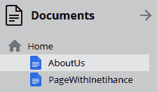

图 4.1：文档列表

本章我们将创建这些页面，并将展示所有文档功能。

我们告诉您，文档可以是任何类型的非结构化数据容器。这些容器可以根据其中找到的信息类型非常不同。为了以适当的信息量表示每个文档，我们需要使用文档类型对文档进行分类。

Pimcore 提供了许多不同的文档类型，让您可以轻松管理您将面临的大多数用例：

+   **页面**：这是典型的网页。文档树中的路径定义了最终的 URL。

+   **片段**：正如其名所示，片段是文档的片段，可以嵌入到页面中进行内容重用。我们还可以将片段添加到片段中。

+   **链接**：这是一个可以在导航树内部使用的原始网页链接。

+   **电子邮件**：这是一个生成 HTML 内容的文档，如页面，但也支持发送交易性电子邮件，允许您定义发件人和收件人。

+   **新闻通讯**：与电子邮件内容非常相似，但有一些额外功能以支持作为新闻通讯的使用（例如，群发）。

+   **硬链接**：允许您创建内部链接并更改文档的常规结构。

+   **文件夹**：类似于您 PC 文件系统中的文件夹，Pimcore 文件夹包含多个文档。

+   **打印页面**：为了打印目的，具有一些额外功能，例如**生成 PDF**按钮。

+   **打印容器**：一个将页面组织成组以创建一个多页文档并准备打印的容器。

Pimcore 不仅自带文档类型，您还可以创建自己的。

在本章的第一节中，我们学习了 Pimcore 中的文档是什么。这有助于我们理解接下来将要做什么，因为我们将学习如何创建一个新的文档并实现一个简单的网页。

# 创建文档

在本节中，我们将了解如何使用 Pimcore CMS 创建文档。为此，请按照以下步骤操作：

1.  导航到文档树并右键单击以激活上下文菜单。

1.  选择**添加页面**然后**空白**（以创建一个空页面）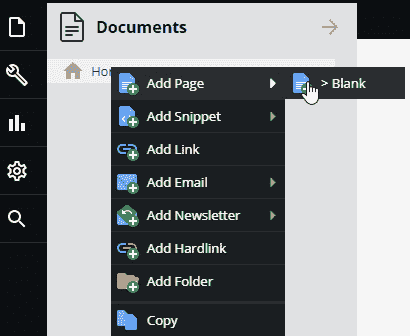

    图 4.2：在 Pimcore 中添加页面

1.  将出现一个名为**添加页面**的模态弹出窗口，有三个参数供您填写。**标题**参数是页面的标题，**导航**参数是在导航菜单中使用的名称，**键**是您为文档选择的唯一键：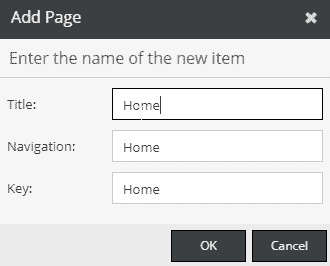

    图 4.3：输入我们正在创建的页面的数据

1.  点击**确定**，您将看到您的**主页**已添加到菜单树中：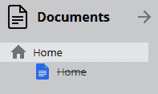

    图 4.4：树菜单中添加的页面

1.  点击你新创建的页面，**首页**，页面元素将在新标签页中打开。下一张图显示了页面编辑器：

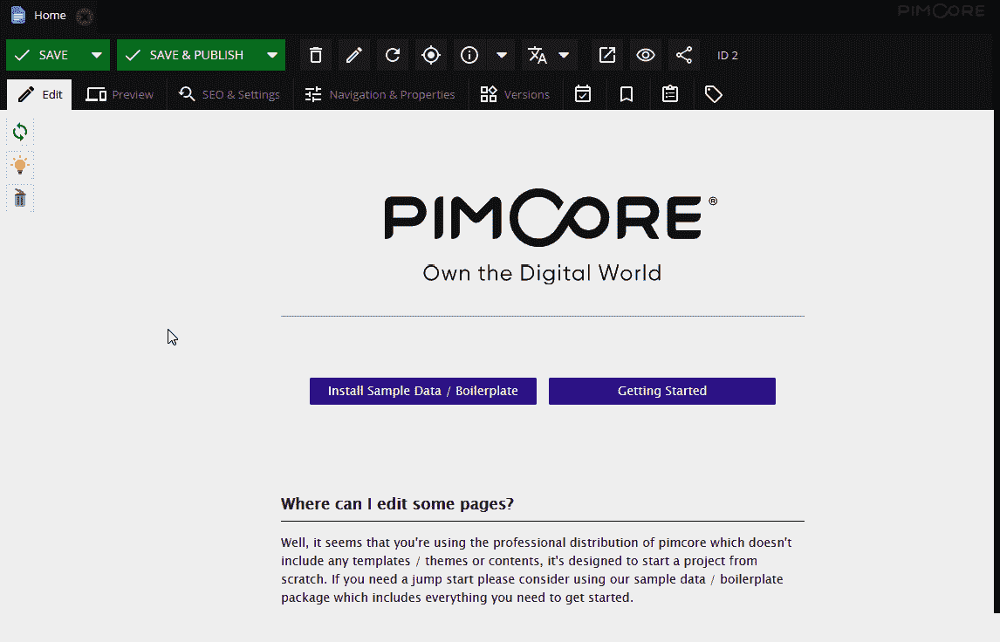

图 4.5：网页

这个页面告诉我们我们已经创建了一个网页，但网站是空的，因为我们还没有模板。这个信息可能有点令人沮丧，因为经过所有这些步骤，你仍然不能创建 HTML 模板而不输入内容。如果你习惯了像 WordPress 这样的现成解决方案，这可能会显得相当奇怪，在那里任何人都可以添加内容而无需编写一行代码。这是因为 Pimcore 的哲学，其中你与工具之间没有超结构。

在下一节中，我们将学习如何创建一个简单的模板。目前，我们可以满意的是我们已经学会了如何使用文档创建网页。

# 创建模板

本章的目的是为你提供正确渲染文档的基础知识。这仅仅是 Pimcore 渲染能力的一小部分，我们将在*第十章**，*创建 Pimcore 砖块*中深入探讨这个主题，以发现渲染自定义数据的所有秘密。目前，我们将只关注我们创建简单网站所需的信息。

## Pimcore 页面设计过程

首先要介绍的概念是模板和布局。**布局**是一个通用的页面原型，你可以在其中留下一些占位符，这些占位符将由**模板**填充。例如，你可以有一个有两列和两个占位符的布局页面，每列一个。在每一页上，你都将能够填写每个占位符内的内容。这样的占位符在 Twig 语法中被称为**块**，你可以定义你想要的块的数量。

在下面的图中，你可以看到网页设计过程是如何工作的：

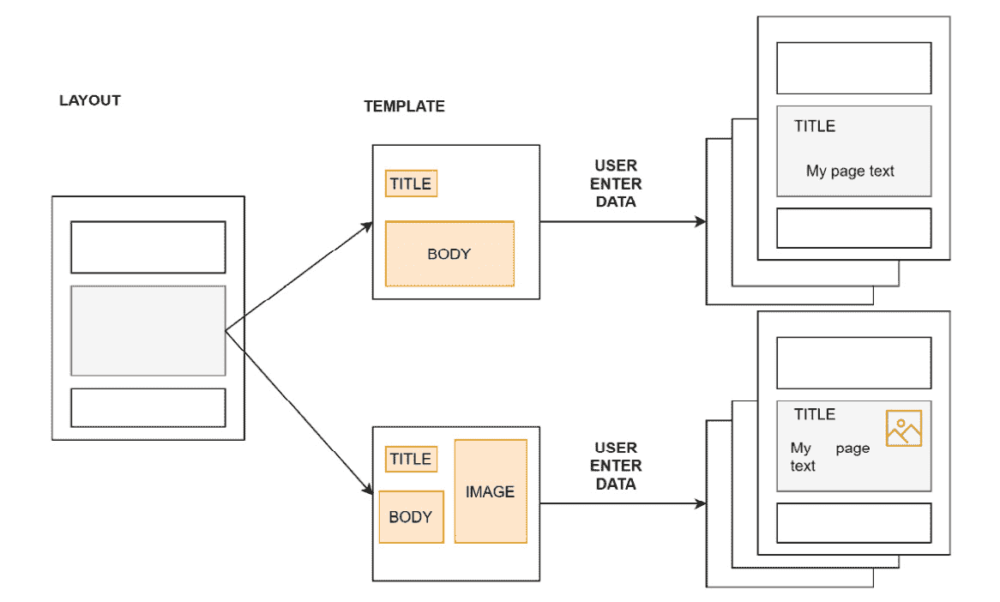

图 4.6：模板引擎在行动

让我们看看每个阶段：

+   第一步是定义一个**布局**。这一步必须由开发者或精通 HTML、CSS 和 Twig 模板语言的人来完成。这并不复杂，但需要你访问源代码并写下文件，通常最终用户无法完成。在这个阶段，我们将定义页面的结构；在示例中，定义了行数/常见页面部分。

+   在布局内部，为**模板**留出一个用于页面实现的空白空间。在模板内部，设计师或开发者可以添加用户填写的内容。通过这种方式，你可以创建产品页面原型，然后内容管理员可以创建许多产品页面。

+   作为最后一步，用户将能够将数据输入到模板占位符中。在这个例子中，用户可以输入标题，填写正文内容，并添加图片。

    注意

    Pimcore 支持 Twig 或 PHP 模板。如官方文档所述，PHP 模板已被弃用，并将随着 Pimcore X 的发布而退役。这就是为什么，尽管官方 Pimcore 文档中只展示了 PHP 示例，但我们决定以 Twig 模板为基础编写这本书。我们意识到，大多数 PHP 开发者可能更习惯于纯 PHP 模板，但基于已弃用的功能编写一本书是困难的。

在本节中，我们对 Pimcore 的模板进行了概述；现在是时候学习如何从头开始创建一个模板了。

## 实现简单布局

在本节中，我们将实现一个简单的布局，可用于创建网页和构建网站。正如您将看到的，这个过程很简单，只需几个步骤就可以得到一个可工作的模板：

1.  首先，我们需要告诉系统使用 Twig 文件而不是 PHP 模板。导航到`/src/Controller`并打开`DefaultController.php`。您只需在控制器中的`defaultAction`方法上添加一个`@Template()`注解：

    ```php
    <?php
    namespace App\Controller;
    use Pimcore\Controller\FrontendController;
    use Symfony\Component\HttpFoundation\Request;
    use Sensio\Bundle\FrameworkExtraBundle\Configuration\Template;
    class DefaultController extends FrontendController
    {
        /** 
         * @Template() 
         */    
        public function defaultAction(Request $request)
        {
        }
    }
    ```

    在接下来的步骤中，我们将学习布局引擎的工作原理以及如何为您的 Pimcore 网站创建模板。这非常简单，因为我们只需要一些 HTML、CSS 和 PHP 的知识来创建结构化的网站。

1.  到目前为止，我们已经准备好开始创建模板。导航到`/templates`并创建一个名为`layout.html.twig`的文件。Pimcore 背后的模板引擎是 Symfony，因此对于通用 Symphony 项目有效的多数事物对于 Pimcore 也是适用的。在下面的示例中，我们有一个实现 Pimcore 布局的代码片段。您可以将此代码片段复制到`layout.html.twig`文件中，或者检查我们提供的演示文件：

    ```php
    <!DOCTYPE html>
    <html lang="en">
    <head>
    <!-- head omitted -->
    </head>
    <body>
     <!--Navigation bar omitted   --> 
    
    
      <hr>
    <!--footer bar omitted --> 
    </body>
    </html>
    ```

    如您在前面的代码中所见，Pimcore 布局只是一个 HTML 文件（或 Twig 模板），在其中您添加以下代码片段以创建用户放置内容的位置：

    ```php
    
    
    ```

    在模板内部，您想要添加您网站的所有常见部分，例如菜单、页脚和页面结构。当然，您可以在不同页面中使用多个布局，甚至是同一网站（例如，树形列与两列布局）。

1.  布局不能被最终用户使用，因为它只包含页面结构定义。因此，我们必须定义一个模板。模板是另一个 Twig 文件，在其中您实现布局中留下的空白块。导航到`/templates`并创建一个名为`Default`的文件夹，其中包含一个名为`default.html.twig`的文件。在这里，您必须扩展我们在上一步中创建的布局。为此，添加一个包含标题、副标题和页面主体的简单模板：

    ```php
    layout.html.twig file.The next statement indicates the beginning of the block of code that will fill the placeholder called `content` into the main layout file:

    ```

    

    ```php

    ```

1.  然后，混合使用 HTML，我们有一些特殊的指令，允许用户在模板中放置内容。我们的目标是消除编辑过程中对开发者的任何依赖（换句话说，用户必须能够自行输入数据）。在这种情况下，可以通过使用 Pimcore 的`headline`指令轻松实现。然后我们可以有许多参数；在这种情况下，我们在编辑过程中使用固定宽度。

    要添加 HTML 文本，我们做的是相同的，但使用**所见即所得**（**WYSIWYG**）界面。这与前一个案例非常相似，如下一代码片段所示：

    ```php
    {{ pimcore_wysiwyg('body') }}
    ```

现在我们能够编辑文档了！在下一节中，我们将学习如何将数据放入模板以及如何迭代此过程以实现真正的网站。

# 编辑文档

在本节中，我们将学习如何创建和编辑文档。正如我们告诉您的，文档可以是您的 CMS 网页中的任何一种，所以仅仅从这个简单的课程中，您就能创建任何类型的网站。编辑文档的过程非常简单，我们将通过完成一些简单的步骤来探讨它：

1.  打开管理面板并找到**主页**，这是我们之前在*什么是文档？*部分创建的页面。通过选择它，您将在管理的主框架中打开网页。如下一图所示，我们将直接编辑网页，并使用一种称为 WYSIWYG 的模式，这非常有用，因为它使编辑器在编辑过程中意识到他们正在做什么：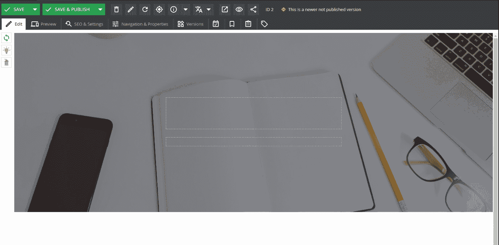

    图 4.7：网页编辑器

    如前图所示，我们有一些虚线区域，这些是我们添加到 Twig 模板中的占位符。这些占位符就像常规输入框一样工作，所以您只需点击它们并开始输入文本。在 Pimcore 中，这样的项目被称为可编辑项（如前所述）。

1.  点击较大的占位符并输入单词**主页**；您将在输入字符的同时看到编辑器被填充。在下一张图中，您可以看到填写**标题**字段的最终结果：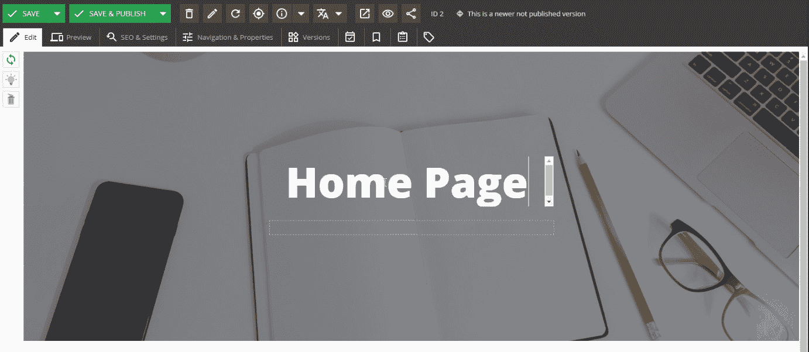

    图 4.8：编写标题

1.  点击第二个占位符（位于标题下方的一个）。与上一个案例一样，点击编辑器将解锁您写入任何文本的能力。不同之处在于**标题**字段是一个单行可编辑框，而此字段是一个 HTML 编辑器；您可以选择文本，然后像在任何文字处理程序中一样应用样式。在下一张图中，您可以看到这一功能的使用情况：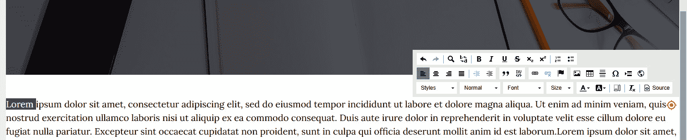

    图 4.9：HTML 编辑器使用情况

    前一张图显示了 HTML 文本和允许设置文本样式的上下文菜单。

1.  一旦我们填写了文档的可编辑部分，网页就完成了。我们可以使用工具栏中的**保存并发布**按钮来发布它。

1.  然后，要查看页面的预览，只需点击**预览**按钮。在下一张图中，我们可以看到预览工具的实际应用。如图所示，我们可以选择用于渲染页面的设备（在这个例子中，我们正在模拟一部手机）：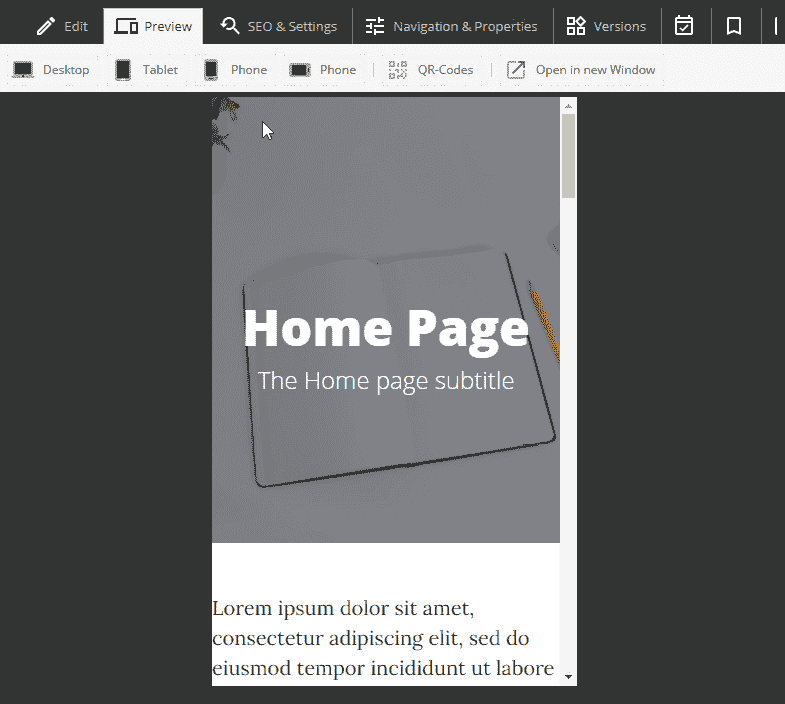

    图 4.10：文档预览

1.  最后，我们必须注意搜索引擎设置。点击**SEO & 设置**标签以进入我们可以编辑这些设置的面板。在这里，我们可以添加标题、描述以及我们想要的任何元标签：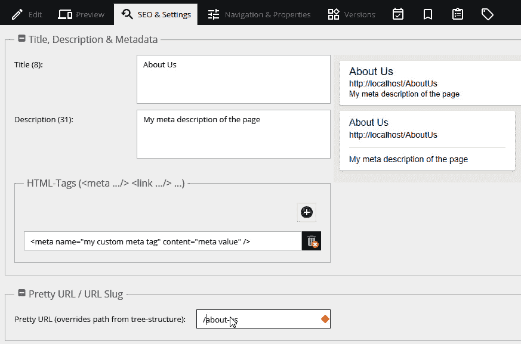

    图 4.11：SEO & 设置面板

    在同一页面上，你可以看到你网页的 Google 预览，这样你就可以知道用户搜索你的网页时会看到什么。在最后一个可编辑组件中，你可以为页面定义一个自定义 URL。此设置覆盖了正常页面结构，因此它是一个绝对 URL。

1.  最后，点击**版本**标签。你将看到文档的历史记录，如下所示。在**版本**面板中，你可以访问网页的历史记录，并在出错的情况下恢复旧版本：

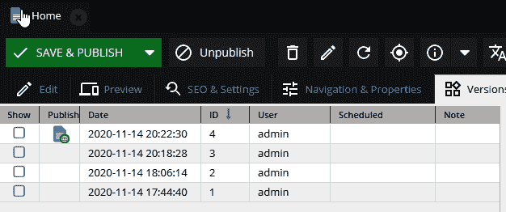

图 4.12：版本面板

编辑文档使我们能够创建简单的网站。这很简单，只需定义一个模板，然后将信息放入其中。我们已经了解到，我们可以通过创建不同的模板来创建文档实例，并且用户可以使用网络界面自主管理它们。复制我们迄今为止所做的一切就足以构建简单的网站。

然而，事情可能会变得稍微复杂一些。例如，假设你想创建一个包含一系列要出售的产品目录的网站。使用我们迄今为止所学到的知识，你可以通过为产品页面添加文档模板来创建目录；然后，你可以创建一个产品页面并填写数据。现在，想象一下每个产品都有各种变体；这些（子）变体与原始（父）产品共享大量信息。使用我们刚才介绍的过程为这些变体创建多个页面将会很耗时。此外，如果你复制粘贴了所有产品变体中相似的数据，然后其中一条信息发生了变化，你就必须逐个更新每个页面。这个例子告诉我们，通过复制粘贴信息来复制数据会导致难以维护的网站。

在下一节中，我们将学习如何通过文档继承来重用文档内容，以避免数据复制。

# 继承文档

文档继承是一个功能，允许你创建一个预先填充的文档，你可以只覆盖你需要覆盖的部分。将此功能想象为“模板中的模板”。此功能通过在文档设置中设置**内容主文档**属性来激活。此功能适用于所有文档类型，对于重复性内容（如通讯或技术文档）非常有用。

在以下步骤中，我们将了解如何利用继承来重复使用内容并更好地组织网站内容。我们将创建一个简单的产品目录，其中包含一个产品（在这里是 T 恤）和多个变体（每个颜色一个变体），每个变体都将有自己的网页。

按照以下步骤进行操作：

1.  首先，我们必须为产品页面创建一个模板。因此，让我们在`/templates/Default`中创建一个名为`product.html.twig`的文件。这个过程与*编辑文档*部分中遵循的过程非常相似，但这次我们将有一个更复杂的布局。实际上，我们必须显示产品数据，因此我们必须添加更多的输入。下一个布局片段显示了布局文件的相应部分：

    ```php
    <div class="breadcrumb-item">Category:{{ category, title, discounted price, price, producer, and origin). We are now able of going into the Pimcore administrative interface and create a document item.
    ```

1.  在树菜单中创建一个页面。在我们的例子中，我们将为一些变体（T 恤）创建一个页面，因此页面标题将是**TShirt**。在我们的情况下，我们在这个**产品**菜单项中创建了此页面，它是我们目录的根。然后，你必须迭代这个过程，为每个颜色变体（**TShirt-Red**、**TShirt-Green**和**TShirt-Yellow**）创建一个子页面。最终结果如图所示：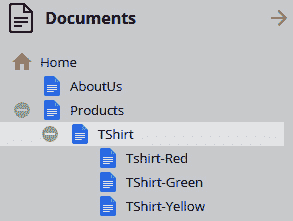

    图 4.13：产品菜单

1.  现在双击父页面**TShirt**并打开文档。

1.  现在点击**SEO & 设置**。点击**模板**下拉菜单并选择**默认/default.html.twig**：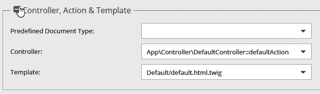

    图 4.14：选择产品模板

1.  为所有子页面重复前面的步骤。

1.  为我们在模板中添加的每个字段输入数据。结果应该类似于以下图所示：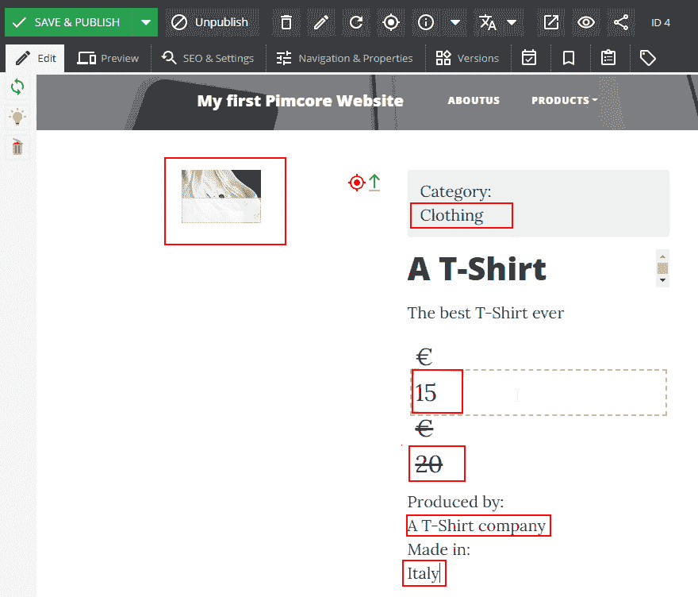

    图 4.15：编辑 T 恤产品

    在编辑我们使用这些文档创建的产品变体之前，我们将假设为该产品输入的大部分信息将适用于所有子项。事实上，所有产品只是相同的 T 恤，只是颜色不同。让我们在接下来的步骤中看看如何避免数据重复。

1.  打开**TShirt**页面并点击**SEO & 设置**。然后，将**TShirt**页面从文档树拖放到**内容-主文档**字段：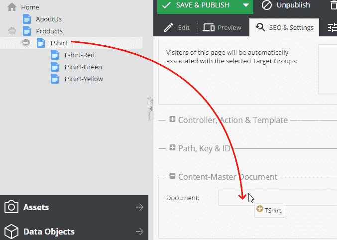

    图 4.16：拖放父文档

1.  点击**应用**后，你会收到提示信息：**您确定吗？所有内容都将丢失**。当你确认操作时，你页面上现有的所有内容将被继承的内容覆盖。由于操作已完成，你现在拥有所有可编辑组件已禁用。在下一张图中，我们可以看到页面看起来如何。正如你所见，占位符已自动填充来自父页面的值。你可以看到，可编辑组件现在已禁用，当你将鼠标移至可编辑区域时，会出现**右键单击以覆盖**的消息：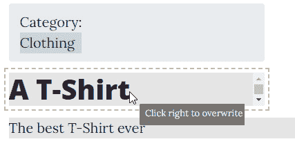

    图 4.17：覆盖继承属性

1.  右键单击禁用的可编辑区域；在这种情况下，右键单击**一件 T 恤**。这一步将解锁字段，并允许你更改此页面实例的默认值。在这种情况下，我们输入了**一件红色 T 恤**：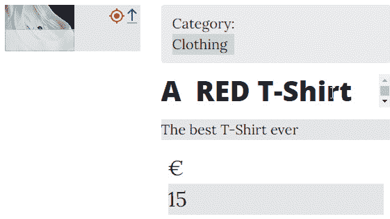

    图 4.18：覆盖后，文本可编辑

    在上一张图中，你可以看到产品名称已被替换。所有非继承的字段将反映来自父文档的更改；因此，如果你更改价格，此字段将在所有子页面上更新。这样，所有常用字段只需输入一次，你只在真正需要时复制信息。

1.  现在，为**T 恤**页面树中的所有子页面复制*步骤 6-8*。

在本节中，我们学习了如何通过从父文档继承一些数据来创建文档。这个 Pimcore 功能让我们能够在整个网站上重用信息。使用这个继承功能，我们避免了在产品层次结构中复制常用字段。这个功能是管理非结构化数据的一种更方便的选项，并避免数据重复。

# 摘要

在本章中，我们学习了如何创建文档以及这个功能如何使我们能够创建和管理非常简单的网站。我们首先发现，与其他 CMS 解决方案相比，我们没有现成可用的东西。仅仅为了创建第一个网页，我们需要定义一些模板。这看起来可能像是一种浪费时间的行为，但实际上正好相反。模板迫使你在整个过程中以结构化的方式工作。它们迫使你创建可编辑的网页，最终用户将能够编辑数据而不会破坏布局。这允许非开发者掌握他们的内容。这就是我们在第一章中提到的分离方法。

如果你有一些网络开发经验，你可能想知道你可以用可编辑的内容走多远。它们的灵活性可以帮助你实现大量的网页，理论上你可以继续使用它们来管理复杂的网站。这种方法的唯一限制是我们正在处理的是纯文档。你还记得我们给出的文档定义吗？我们说它们是无结构化信息的容器。这就是限制。我们可以结构化信息在页面上的分布方式，但这并不允许我们查询或重用数据。我们可以轻松地创建成千上万的博客或产品页面，但这还不够。事实上，我们需要更加动态，比如在分类页面上列出产品或按标签分组博客文章。你可能想使用文档来实现这些功能，但尽管 Pimcore 功能强大，在大多数情况下，这将需要大量的努力，而且结果可能不尽如人意。事实上，文档适合渲染网页，但并不完全适合结构化数据或交互式内容。

所以，如果你在思考如何处理结构化数据，请不要担心。在下一章中，我们将描述数据对象是什么以及如何以结构化的方式表示信息。这将是我们开始正确管理数据并避免内容或源代码重复的基础。
