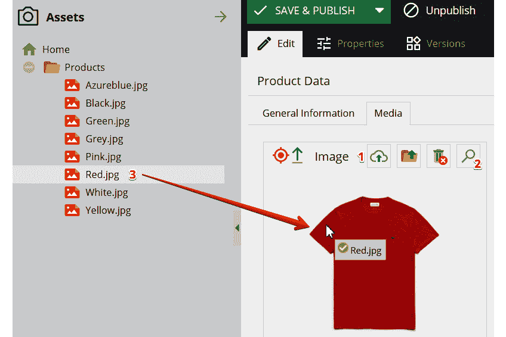

# *第六章*：使用数字资产管理

在上一章中，你学习了什么是 Pimcore 类以及如何为定义的类创建对象实例。

在本章中，我们将重点关注**数字资产管理**（**DAM**），这是 Pimcore 的主要功能之一。这个功能不仅仅是让你像存储平台一样上传图像，它还帮助你分类、详细说明和版本控制图像以及一般类型的文件，并将它们分发到不同的渠道。本章的组织结构如下：

+   什么是 DAM？

+   上传和关联资产

+   编辑图像

+   如何创建缩略图

在解释了什么是 DAM 之后，我们将介绍 Pimcore 的 DAM 功能。然后，我们将探讨如何在 Pimcore 上上传数字资产以及如何将它们与对象关联起来。接下来，我们将特别关注图像，以便让你看到如何在 Pimcore 内部编辑或增强图像，然后我们将探索创建不同缩略图有多容易。

# 技术要求

正如你在*第五章**，探索对象和类*中所做的那样，要运行与本章相关的演示，你只需要导航到官方书库中的`6. 使用数字资产管理`文件夹并启动 Docker 环境。

要这样做，只需遵循以下说明：

1.  使用以下命令运行 Docker：

    ```php
    docker-compose up
    ```

1.  然后，为了恢复你本地机器上的所有设置，只需打开一个新的 shell 并输入以下命令：

    ```php
    docker-compose exec php bash install.sh
    ```

1.  导航到[`localhost/admin`](http://localhost/admin)并使用你的管理员/pimcore 凭据登录。

你可以使用以下链接访问官方书库以获取源代码：

[`github.com/PacktPublishing/Modernizing-Enterprise-CMS-using-Pimcore/tree/main/6.%20Using%20Digital%20Asset%20Management`](https://github.com/PacktPublishing/Modernizing-Enterprise-CMS-using-Pimcore/tree/main/6.%20Using%20Digital%20Asset%20Management)

现在，你已经准备好导航到演示，以发现与本章相关的所有方面。

# 什么是 DAM？

在本节中，你将了解数字资产管理的概念。DAM 软件是一个集成的系统，旨在对媒体内容进行集中式战略管理。它是允许你在不同的渠道（如网站和应用程序）上创建、组织和分发内容，并提高沟通有效性的软件。

现在我们知道了学术定义，让我们看看 DAM 软件有什么用途以及其主要功能是什么。正如其名所示，DAM 围绕*数字资产*；这个概念并不局限于图像或视频，而是涉及所有类型的数字文件，如文档和音频记录。

因此，考虑到数字资产，我们现在将转向定义中的*管理*部分。数字资产管理不仅仅是将资产组织在几个文件夹中，就像在您的 PC 桌面一样；当然，在 DAM 系统中，以及在 Pimcore 中，我们总会找到文件夹的概念，但这只是结构化组织的起点。当涉及到管理时，DAM 是关于能够通过索引搜索资产，在用户之间共享资产，并跟踪版本控制的能力，同时能够定义支持资产生命周期的流程。

在本节中，我们将首先探讨所有 DAM 系统的共同特征，然后我们将介绍 Pimcore DAM 系统的具体功能。

## DAM 系统的特征

让我们看看每个 DAM 系统必须具备哪些特征。

### 组织

正如我们之前提到的，组织是资产管理的关键方面之一。我们必须考虑的第一件事是在分层结构中创建文件夹和子文件夹。文件夹范式已成为许多不同类型软件中的普遍概念，对于组织内容至关重要。

然而，这本身并不足够，因此需要具备改进内容组织的功能，例如通过标签或其他属性进行分类，以及用于过滤和搜索内容的先进研究方法。

### 内容丰富化

毕竟，每个数字资产都是一个数字文件。每个文件都有必须显示或下载的内容，但可能需要提供一些信息来描述资产或其内容；我们可以将这些信息视为资产元数据。

在非常常见的场景中，元数据被用来提供对数字资产的另一种视图，而不显示其内容。以图片为例，在网站上使用替代标签并用简短的文字描述视觉内容是一种良好的做法，以防出现连接问题或提高视觉障碍者的可访问性。

除了用于提高可访问性之外，元数据的正确设计对提高搜索引擎优化（SEO）也很有用，因为它增加了网站在搜索引擎中的索引。

### 共享和访问控制

使用 DAM 系统对于集中资产信息并在所有需要图像副本的用户之间共享资产非常重要。通过不同类型的分发渠道，如电子邮件或共享托管服务发送和接收资产是一项繁重且危险的操作，因为我们可能会在数百封其他收到的电子邮件中丢失文件，或者如果我们上传一个修改过的文件到共享文件夹，可能会覆盖他人的更改。

在数字资产管理（DAM）系统中，每个用户都有自己的账户，可以定义适当的规则来共享文件或限制某些用户或具有特定角色的所有用户查看或修改资产。这些规则可以防止例如意外删除文件。

### 版本控制

与前面的特性相关，维护数字资产的版本控制非常重要。任何具有写入模式访问资产的用户都可能将其更新为新版本。版本控制允许你记录资产随时间的变化历史，记录做出更改的用户。这个概念对于实现工作流程和通过不同的审批阶段来调节资产创建过程非常有用。

### 资产分发

在现代场景中，相同的资产可能在不同需要不同规格的上下文中使用。以图像为例，它可能需要在网站上显示，也可能需要在相应的应用中显示，还可能需要放置在纸质目录中。显然，对于不同的目标，可能需要不同的图像尺寸。

为了满足这一需求，通常需要从同一原始图像手动创建不同的裁剪版本。这种做法会导致混乱，因为必须维护同一图像的许多不同版本；如果原始图像发生变化，所有裁剪都必须重新创建。现代 DAM 系统通过允许你上传高质量版本的图像，并在需要时定义规则来创建运行时裁剪，从而绕过这个问题。

总结来说，在本节中，你学习了 DAM 系统的常见特性。所有这些特性都在 Pimcore DAM 系统中实现，在下一节中，我们将介绍 Pimcore DAM 系统，展示其主要特性。

## 介绍 Pimcore DAM 功能

之前，我们介绍了 DAM 的定义，介绍了 DAM 系统应具备的主要特性。在本节中，我们将介绍 Pimcore DAM 组件，并简要介绍其主要特性，以发现 Pimcore 的 DAM 潜力。

### 资产组织

对于对象管理，Pimcore 的用户友好界面帮助用户进行资产组织。使用文件夹结构存储资产，以及通过网格组件进行搜索和过滤的能力，结合多标签页导航，使得资产管理变得简单快捷。你可以使用简单的搜索选项在资产的树结构中工作，或者利用网格视图通过标签、元数据和其它有助于组织资产的属性进行过滤。

Pimcore 提供了一种高度灵活和可配置的元数据管理系统。可以为每个特定资产定义元数据，如果需要，也可以定义将自动附加到所有资产的通用元数据属性。

Pimcore 的 DAM 软件支持 Office 文档格式，包括 Word、Excel、PowerPoint 和 PDF。除了开源功能外，企业功能允许您在不离开应用程序的情况下将 Pimcore 连接到 Adobe Creative Cloud 应用程序和 Microsoft Office 软件。

### 图像和视频转换

如我们之前提到的，DAM 的关键方面之一是能够在不同渠道之间分发内容。这些渠道在目标大小或媒体格式方面可能不同，这需要您为同一图像或视频制作不同版本。

与上传同一资产的多个不同版本相比，Pimcore 提供了上传仅高清版本的能力，并通过集成的转换管道为每个目标动态生成优化版本。您将在本章的最后部分了解更多关于创建图像缩略图的内容。

原始图像和转换后的图像可以作为公开链接提供，或者最终通过内容分发网络或 Pimcore 集成 API 提供。Pimcore 的 DAM 软件还提供了适合离线和印刷渠道的图像转换，以正确的质量和格式。

### 用户权限和权限

DAM 的关键方面之一是能够在不同用户之间共享资产，因此定义共享规则很重要。在 Pimcore 中，您有能力创建不同的用户和角色。在以下图中，您将看到如何配置用户和角色的权限：


图 6.1：用户权限和权限

如前图所示，对于每个资产文件夹，用户可以查看资产列表并打开每个资产。同样，用户可以拥有创建、编辑或删除资产以及更改其设置或属性的权限。同样的原则可以应用于文档和对象文件夹。在*第七章**，管理 Pimcore 站点*中，您将了解更多关于用户和角色管理的内容。

总结来说，在本节中，您了解了 DAM 系统的主要特点，并介绍了 Pimcore 的 DAM 功能。在接下来的章节中，您将看到一些这些功能的应用，并了解如何使用它们。在下一节中，我们将了解如何创建资产以及如何将它们与创建的对象关联起来。

# 上传和关联资产

在上一节中，我们介绍了 DAM 系统的特点，并介绍了一些 Pimcore 的特定功能。在本节中，我们将了解如何在 Pimcore 中上传资产，然后我们将了解资产是如何组织的，以及如何将资产与现有对象关联起来，介绍对象类别的各种媒体组件。

## 上传资产

在本节中，我们将开始探索如何在 Pimcore 中上传资产。要上传文件，您只需在资产文件夹上右键单击，并将鼠标悬停在**添加资产(s)**选项上以展开菜单。如图所示，资产可以从不同的来源上传：


图 6.2：上传资产

让我们描述图中所显示的不同方法：

+   **上传文件**：这是一个标准的文件上传表单，允许上传 200 多种文件格式。可以同时上传多个文件，它们不需要是同一类型。图像是最常见的资产类型，但 PDF 和其他 Office 文档也被使用。Pimcore 可以为大多数文件类型生成预览图像。

+   **上传文件（兼容模式）**：对于较旧的浏览器，之前的功能可能无法正常工作。如果出现这种情况，您必须使用此方法上传单个文件。

+   **上传 ZIP 存档**：此方法允许您上传包含资产的 ZIP 文件。导入过程中，ZIP 文件将自动解包。

+   **从服务器导入**：使用之前的方法，文件必须通过您的本地文件系统上传。此功能允许您选择存储在 Pimcore 托管服务器文件系统中的文件。如果文件通过例如 SFTP 文件夹共享，这可能特别有用。

+   **从 URL 导入**：不是上传物理文件，您可以通过粘贴外部 URL 来上传资产。在这里，资产名称由 URL 本身提取。

对于每个上传的资产，都可以在任何时候上传新版本。请确保只能使用标准上传方法上传新版本。现在让我们来看看如何组织上传的资产。

## 组织资产

在本节中，我们将看到资产如何在文件夹中组织，以及如何列出和筛选它们。与对象文件夹的情况不同，对于资产文件夹，我们有两个不同的标签页：**预览**标签页正如其名所示，显示各种资产的预览图像，按字母顺序排列。**列表**标签页则显示，依次是小型预览图像和资产属性列表。在下面的图中，您将看到此标签页的外观：


图 6.3：资产列表

观察图例，您会注意到，与在*第三章**“使用 Pimcore Admin UI 入门”部分的*“使用网格组件”*中展示的对象网格不同，有一些额外的功能。在网格上方，我们可以看到**仅未引用**复选框；如果选中，则仅显示与对象或文档无关的资产。附近，您可以看到一个按钮，允许您将选定的项目下载为 ZIP 文件。最后但同样重要的是，在网格左侧我们可以找到一个可折叠的部分，允许通过分配给资产的标签筛选资产。重要的是要指出，只有与所有选定的标签相关联的资产才会显示在网格中。

现在我们来看看如何关联资产，介绍各种媒体组件类型。

## 将资产关联到数据对象

在本节中，我们将了解如何将资产与对象实际关联。首先，我们将介绍可以附加到类上的不同类型的媒体组件，并解释每个组件的独特之处。然后，我们将展示如何直接在对象上上传、搜索或拖动资产。在下面的图中，您可以查看各种媒体组件：


图 6.4：数据对象类编辑器中的媒体组件

让我们描述图中显示的每个字段：

+   **图像**：允许您将图像附加到对象上。如图中所示，可以设置组件的宽度和高度，并为通过组件直接上传的资产定义上传路径。定义的文件夹和子文件夹路径将在第一次上传时创建（如果它们之前未在资产文件夹树中创建）。

+   **外部图像**：允许您通过提供图像 URL 来链接外部图像，而不是链接物理资产。在组件设置中，您可以设置图像预览的宽度和高度。

+   **高级图像**：这是简单**图像**组件的扩展；这允许您定义和渲染上传图像的热点、标记和裁剪。对于每个热点或标记，我们可以设置一个名称，并最终添加一个或多个元数据，这些元数据可以是文本信息或与其他资产、对象或文档的关系。

+   **图像库**：正如其名所示，此组件允许您添加无限数量的图像以创建图像库，该库可以随时排序。对库中已存在的图像没有控制权，因此您可能将相同的图像多次添加到库中。对于库中的每一张图像，我们都可以添加热点和标记，就像之前的组件一样。

+   **视频**：这允许您将视频附加到对象上。此视频可以是之前在 Pimcore 上上传的物理资产，或外部视频。对于外部视频，您只需附加视频 ID；允许的平台是 YouTube、Vimeo 和 Dailymotion。对于内部视频资产，我们可以通过拖动现有的图像资产来附加海报图像，并提供标题和描述。

现在我们已经介绍了各种媒体组件，让我们看看如何将图像与对象关联起来。以下图所示的不同方式展示了进行此操作的不同方法：



图 6.5：图像关系

如图中所示，有三种方式将组件中的图像关联起来：

+   **直接上传**：点击上传图标后，将打开标准上传表单，让您从文件系统中上传文件。

+   **搜索**：点击搜索图标后，将打开搜索模态，让您从之前上传的图像中选择一个。

+   **拖放**：只需将图像从资产树拖放到组件中即可将其附加。

一旦图像被附加，你就可以直接从组件中打开资产。

总结来说，在本节中，你学习了如何在 Pimcore 上传资产，特别关注了不同的上传方法。然后，你看到了如何将资产组织到文件夹中，以及如何过滤它们以执行搜索。在本节的最后部分，你发现了不同类型的媒体组件以及如何将这些组件与图像关联起来。

在下一节中，我们将查看 Pimcore 内部图像编辑器，并了解如何通过添加元数据来丰富图像。

# 图像编辑和丰富

在前一节中，你学习了如何在 Pimcore 上传资产以及如何将它们与对象关联起来。在本节中，我们将介绍 Pimcore 集成的图像编辑器以及如何通过为图像创建元数据来执行产品丰富化。之后，我们将看到如何为图像设置焦点。

## 探索图像编辑器

Pimcore 集成了基于网络的图像编辑组件。基于*miniPaint*，图像编辑器对于简单的操作任务，如颜色校正和裁剪，是必不可少的。在下面的图中，你可以看到这个编辑器的样子：


图 6.6：图像编辑器

如图中所示，在左侧菜单中我们可以找到所有常见的图像编辑工具，例如铅笔、橡皮擦、文本等。然后，在顶部工具栏中，我们可以访问其他功能：

+   **保存**：这允许你保存对图像的更改。

+   **文件**：这允许你上传新图像以替换当前图像。

+   **编辑**：在这里你可以找到复制和粘贴选定区域或撤销更改的方法。

+   **图像**：在这里你可以找到放大和调整图像大小的方法，以及翻转和旋转图像的功能。此外，还有调整颜色亮度、对比度的校正功能，以及获取图像调色板和直方图的工具。

+   **图层**：在这里你可以找到创建和管理图像不同图层的方法。

+   **效果**：在这里你可以为图像添加效果/过滤器，例如**黑白**过滤器。

+   **工具**：在这个菜单中，你可以找到一些用于颜色替换、创建边框和在图像上计算关键点的先进功能。

现在我们已经探索了图像编辑器，我们将看到如何定义资产元数据。

## 定义资产元数据

在本节中，我们将了解如何为资产定义元数据。通常，元数据用于增强资产信息，以描述内容而不显示它；这在内容因网络连接差或出于可访问性原因无法显示的情况下可能很有用。例如，对于图像，在网站上使用替代标签以简短文本描述视觉内容是一种良好的做法。

在 Pimcore 中，可以创建预定义的元数据，这些元数据可以应用于每个资产。您可以通过**设置 | 预定义资产元数据**打开元数据定义面板。以下图显示了元数据属性和可以创建的不同类型的元数据：


图 6.7：预定义元数据定义

让我们看看图中可以看到的各种属性：

+   **名称**：元数据属性的名称（此字段没有唯一约束）。

+   **描述**：元数据的可选描述。

+   **类型**：我们可以定义简单的元数据类型，如**输入**、**文本区域**、**日期**、**复选框**和**选择**。作为一个更复杂的选项，还有将**对象**、**文档**或另一个资产作为元数据链接的能力。

+   **值**：对于每个元数据，可以定义一个默认值。此值的类型反映了之前定义的类型。

+   **配置**：对于选择型元数据，在此属性中，我们必须指定可以用于元数据的选项。这些选项必须以逗号分隔。

+   **语言**：这指定了元数据的语言。

+   **目标类型**：我们可以指定某些元数据是否仅限于特定类型的资产。如果没有选择，元数据可以应用于所有类型的资产。

要定义新的元数据，只需点击**添加**按钮；所有更改都会自动保存，无需点击按钮。

预定义的元数据可以附加到资产上。您可以通过点击资产窗口中的**自定义元数据**选项卡来完成此操作，如图所示：


图 6.8：资产元数据

如图中所示，对于每个资产，可以创建自定义元数据。对于每条元数据，我们可以定义值并指定语言。之前创建的元数据可以通过点击**添加预定义定义**按钮附加到资产上。

现在你已经学会了如何创建资产元数据，让我们看看如何在 Pimcore 图像中设置焦点。

## 设置焦点

在本节中，你将学习如何为图像设置焦点。此属性可以通过点击以下图中的**设置焦点**按钮在图像编辑器中进行配置：


图 6.9：设置焦点

如前图所示，点击之前提到的按钮将在图像上添加一个标记。默认情况下，焦点位于图像中间，但您可以将其拖动到所需的位置。

正如你将在下一节中学习的那样，焦点可以被用来动态创建图像缩略图，以确保图像的焦点在焦点上。

总结来说，在本节中，你学习了如何通过集成编辑器编辑图像。然后，你学习了如何创建预定义的元数据，以及如何将元数据附加到资产上以丰富它们，以及如何在图像上设置焦点。在下一节中，你将学习如何创建图像和视频缩略图以及它们如何用于在不同媒体上分发资产。

# 定义和使用缩略图

在上一节中，你发现了如何使用内部编辑器编辑图像以及如何为资产创建元数据。在本节中，你将学习如何定义图像和视频的缩略图，以便在不同平台上分发。

在许多场景中，相同的图像必须在网站和移动应用上显示，并且由于不同的空间内容组织以及各种设备屏幕的不同形状和大小，这需要不同的调整大小。将不同版本的图像作为不同的资产上传并不是最佳解决方案，因为如果我们想对原始图像进行更改，我们必须再次调整所有图像的大小。

为了避免这个问题，Pimcore 提供了定义转换规则的能力，以动态地为图像和视频创建不同的缩略图。因此，我们可以上传资产的高清版本，并定义规则来创建较小的调整大小。

在本节中，我们将首先了解如何定义缩略图创建的规则。然后，我们将发现如何在模板中实际要求它们，以及如何动态生成公共 URL。当第一次请求某个缩略图时，Pimcore 会自动创建物理缩略图文件。

## 定义缩略图

要为图像定义缩略图生成规则，请转到**设置 | 缩略图 | 图像缩略图**。在打开的选项卡中，点击**添加**按钮，填写缩略图名称，然后点击**确定**以创建一个新的缩略图定义。

在以下图中，你可以看到缩略图定义面板的显示方式：


图 6.10：图像缩略图

如前图所示，缩略图定义名称是在创建时定义的名称；这个名称在缩略图定义中作为唯一标识符，并且无法重命名缩略图定义。因此，我们可以为缩略图添加描述，并将多个缩略图分组到一个文件夹中。

第一个相关的属性是输出格式。我们可以选择保留原始图像格式，生成一个针对网页优化的图像，或者强制输出格式为 PNG、JPG、GIF 或 TIFF。在**高级**设置中，我们可以设置额外的属性来定义 JPEG 和打印格式的图像质量和分辨率。

在屏幕底部，你可以看到**转换**定义管道。对于每个缩略图，我们可以定义一个或多个转换，这些转换将按照从上到下的定义顺序执行。你可以从大量转换中选择执行裁剪、调整大小、旋转或颜色过滤。例如，在前面的图像中，我们定义了一个通过宽度缩放图像的转换，给出最大像素宽度和保持图像比例。如果我们启用**强制调整大小**复选框，我们将强制生成具有所需宽度的缩略图；这也适用于原始图像小于此宽度的情况。此外，还可以为不同的媒体查询应用不同的转换，以根据屏幕大小动态调整图像宽高比。

一旦定义了转换管道，只需点击**保存**即可持久化缩略图定义。

对于图像缩略图所说的也适用于视频缩略图。在下图中，你可以看到视频缩略图定义的外观：


图 6.11：视频缩略图

如图中所示，与图像相比，视频的可设置选项有限。基本上，对于视频缩略图，我们可以定义比特率和缩放操作。

现在你已经学会了如何创建缩略图定义，让我们来看看如何定义一个使用图像焦点点的缩略图。

### 缩略图上的焦点

在**图像编辑和增强**部分的**设置焦点点**子节中，你学习了如何为图像设置焦点点。

如该子节所述，焦点点可以用来定义特定类型的缩略图转换。在下图中，你可以看到如何设置这种转换：


图 6.12：缩略图封面转换

如前图所示，你可以添加一个**封面**转换，它支持焦点点的使用。这种转换将创建一个以焦点为中心的裁剪图像。这个缩略图的大小是通过**宽度**和**高度**参数定义的。

如果没有为图像设置焦点点，**默认定位**参数将允许你创建一个放置在定义位置的裁剪图像。

在下一节中，我们将看到如何在模板上调用缩略图以及如何动态生成公共缩略图 URL。

## 使用缩略图

在上一节中，你学习了如何为图像和视频定义缩略图。在本节中，我们将看到这些缩略图如何在模板和后端开发中使用。然后，我们将向你展示如何在外部应用程序中动态生成公共 URL 来检索缩略图。

### 使用示例

让我们通过一些代码技巧来展示如何使用缩略图。首先，你需要获取一个资源实例；这让你可以调用`getThumbnail`方法，就像我们在这里展示的那样：

```php
<?php
    use Pimcore\Model\Asset\Image;
   $image = Image::getByPath("/Path/To/The/Image.jpg");
   $myThumbnail= $image->getThumbnail("my-thumbnail");
?>
```

在前面的代码片段中，我们可以看到如何根据先前创建的缩略图定义的名称检索图像缩略图。此方法还允许在运行时创建自定义缩略图定义，通过传递缩略图配置作为输入，如下面的代码片段所示：

```php
<?php
    use Pimcore\Model\Asset\Image;
   $image = Image::getByPath("/Path/To/The/Image.jpg");
   $customThumbnail = $image->getThumbnail(["width" => 500,      "format" => "png"]);
?>
```

如我们所见，我们可以通过设置基本的配置选项，如`width`和`format`，来创建一个自定义缩略图。

获取的缩略图可以放置在 HTML 模板中。正如我们在下面的代码片段中所见，一个选项是为图像标签设置源属性：

```php

```

`getPath`方法检索文件系统路径，并可用于设置图像标签的源；如果省略此方法，它将自动调用，因为它是由隐式的`__toString`函数调用的。

作为替代，我们还有一个选项让缩略图自己生成 HTML 标签：

```php
{{ image.thumbnail('my-thumbnail').html({'class' => 'my-css-class', 'alt' => 'The image alt text'}) }}
```

`getHtml`方法返回图像 HTML 标签；作为此方法的输入，我们可以传递一个属性数组，这些属性将应用于标签。这可能有助于动态添加 CSS 类或数据属性，如替代文本。

如果你正在你的缩略图配置中使用媒体查询，`getHtml`方法将返回一个图片 HTML 标签。如果你想为特定格式要求图像标签，你可以使用`getMedia`函数，如下面的代码片段所示：

```php
{{ image.thumbnail('my-thumbnail').getMedia("(min-width: 576px)").html}}
```

定义好的图像缩略图定义也可以用来在需要将视频资源插入模板时显示视频的预览图像。在下面的代码片段中，我们可以看到如何获取这些快照：

```php
<?php
    use Pimcore\Model\Asset\Video;
$asset = Video::getById(123);
    echo $asset->getImageThumbnail("my-thumbnail");
    echo $asset->getImageThumbnail(["width" => 250], 20);
?>
```

如我们在代码中所见，`getImageThumbnail`方法接受一个缩略图定义名称或一个内联配置作为输入。作为第二个参数，我们可以指定我们想要从视频中截取的哪一秒。

所有这些示例都展示了如何内部使用资源，但 Pimcore 中的每个资源都有一个公开的 URL，缩略图也是如此。让我们看看如何根据资源信息动态生成缩略图 URL。

### 下载缩略图

Pimcore 缩略图在第一次请求下载或需要在页面上显示时动态生成。要使缩略图可以从资产详情面板下载，你必须检查缩略图定义中的**下载部分列表选项**标志在图像详情视图中。正如我们在下面的图中所见，所有启用了此选项的缩略图都列在资产的**下载缩略图**下拉菜单中：


图 6.13：下载缩略图

要下载缩略图，你只需从图中可以看到的下拉菜单中选择所需的缩略图定义，然后点击**下载**按钮。

缩略图也可以通过它们的公共 URL 通过网络浏览器访问和下载。这些 URL 具有固定的规则来定义它们。让我们看看以下示例 URL：

https://your-pimcore-url.com/Path/To/The/image-thumb__123__my-thumbnail/Image.jpg

让我们解释构成前面 URL 的所有部分：

+   **https://your-pimcore-url.com**：这是您 Pimcore 安装的基准 URL。

+   **Path/To/The**：这是包含图片的文件夹和子文件夹的路径。

+   **image-thumb**：这是 URL 中的一个固定部分，用于指定您需要缩略图。

+   **123**：资产的 ID。它由两个下划线前后包围。

+   **my-thumbnail**：缩略图定义的名称。

+   **Image.jpg**：图片的名称。

使用这种模式，您可以从图片路径和 ID 开始动态生成所有缩略图定义的公共 URL。

总结来说，在本节中，您学习了如何通过定义转换规则管道来定义图像和视频的不同缩略图。然后，您看到了一些代码示例，展示了如何在开发期间实际使用缩略图。在最后一部分，您发现了如何动态生成缩略图的公共 URL 以使其可下载。

# 摘要

在本章中，我们介绍了 Pimcore 的 **数字资产管理** (**DAM**) 功能。在定义了所有 DAM 系统的共同特征之后，我们展示了这些特征如何在 Pimcore 中实现。

我们随后学习了如何在 Pimcore 中上传资产，从不同类型的来源选择各种格式的文件，这些来源可以是离线或在线的。然后，我们学习了如何使用文件夹和标签来组织资产，以及如何将资产与对象关联起来。特别是，我们介绍了可以用来将资产附加到对象的不同数据组件。

之后，我们看到了如何通过集成编辑器编辑图片，以及如何通过为它们定义元数据来增强图片内容。特别是，我们学习了如何创建预定义的元数据定义以及如何为每个资产定义自定义元数据。

我们随后专注于资产分发，学习了如何为图片和视频创建缩略图定义。我们展示了如何在开发中实际使用缩略图，展示了代码片段，以及如何动态生成缩略图的公共 URL。

在下一章中，我们将介绍 Pimcore 网站的行政管理，解释如何安装第三方插件以及如何管理用户和角色。
