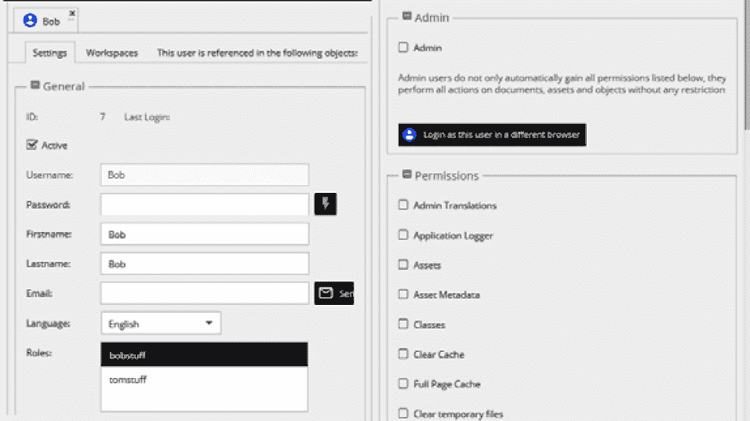

# 第七章：*第七章*：管理 Pimcore 网站

在上一章中，我们学习了如何使用 DAM 功能在 Pimcore 中管理图像、缩略图和资产。在本章中，我们将首先了解如何通过使用捆绑包来增强 Pimcore 的功能，这些捆绑包是由 Pimcore 团队或第三方开发者创建的，并且可以轻松安装。

另一个不容忽视的基本功能是用户及其权限的组织。为了限制网站在管理和内容管理部分的功能，我们将学习如何创建角色，如何为角色创建权限，以及如何将它们分配给用户。

我们还将了解如何导入和导出我们的 Pimcore 安装的设置到其他环境。最后，我们将对 Pimcore 控制台有一个初步的了解，这是一个强大且有用的工具，可以执行命令，而无需访问网络管理面板。

本章我们将涵盖以下主题：

+   安装捆绑包

+   探索用户和角色

+   管理视角

+   导入和导出 Pimcore 设置

+   使用 Pimcore 控制台

到本章结束时，我们将学习如何通过安装组件来为我们的网站添加功能，配置不同角色和权限的用户访问，导入和导出设置和类，以及通过命令行使用 Pimcore 控制台。

# 技术要求

要跟随本章，唯一的要求是拥有一个运行中的 Pimcore 安装，并且能够通过命令行访问它。

如果你使用 Docker 安装了 Pimcore，只需运行以下简单指令：

1.  使用以下命令运行 Docker：

    ```php
    docker-compose up
    ```

1.  有可能，但不是必须的，通过运行以下命令来恢复本地安装设置：

    ```php
    docker-compose exec php bash restore.sh
    ```

导航到[`localhost/admin`](http://localhost/admin)并使用你的管理员/pimcore 凭据登录。

现在你可以将本章涉及的所有方面付诸实践了。

# 安装捆绑包

在本节中，我们将了解如何使用捆绑包向 Pimcore 添加功能。然后我们将了解捆绑包是什么，以及如何通过几个简单步骤来安装它。

Pimcore 已经预装了许多功能，并准备好使用，但尽管这些可能满足我们的需求，但可能还需要一些 Pimcore 中不可用的额外功能。没问题，因为这个框架提供了一个快速简单的方式来安装新功能。向框架添加功能是通过安装包来完成的，在 Pimcore 的世界里，它们被称为**组件**或**捆绑包**，就像在其他系统中，它们可以被识别为插件、模块或附加组件一样。换句话说，捆绑包是一个包含额外组件或功能的包，这将增加 Pimcore 的功能性。

安装捆绑包是一个相对简单的操作；让我们一步步进行。

首先，我们需要根据我们的需求确定要安装的包。在官方 Pimcore 网站上有一个专门的页面，你可以在这里找到大量包，其中许多是由 Pimcore 开发团队创建的，其他则是由第三方开发者创建的。这是该页面的链接，被称为 Pimcore 市场页面：https://Pimcore.com/en/developers/marketplace。

我们可以在以下屏幕截图中看到市场的外观：

![图 7.1：Pimcore 市场页面]

![图片 7.01_B17073.jpg]

图 7.1：Pimcore 市场页面

如前一个屏幕截图所示，我们可以进行搜索并过滤搜索结果。

现在，我们只需查找我们需要的。对于本章，我们可以假设我们需要一个允许我们生成连续数字的包。即使我们将要安装的包不会给我们的 Pimcore 安装添加很多功能，但该过程对于我们将要安装的每个包都是有效的，无论其功能如何。

经过简单的搜索，我们找到了一个适合我们的包。这个包叫做 **数字序列生成器**，由 Pimcore 团队开发。在下一个屏幕截图中，我们看到搜索执行和结果的样子：

![图 7.2：执行搜索的 Pimcore 市场页面]

![图片 7.02_B17073.jpg]

图 7.2：执行搜索的 Pimcore 市场页面

如前一个屏幕截图所示，我们得到了搜索结果列表。搜索结果以卡片形式表示，我们可以阅读我们将通过安装包介绍的功能的简要描述。还有其他有用的信息，例如版本号、类别、开发者的名字、是否经过审查，以及最后一次审查的时间。

现在，只需点击包并转到详情页面。在页面上找到的所有附加信息中，点击 **立即获取** 按钮。这是一个链接，将带我们到包的源代码页面。

因此，让我们进一步深入，开始安装过程。这并不复杂，但与其他插件安装系统，如 WordPress 或其他类似系统相比，它需要一些额外的步骤。所以，准备好让你的手稍微脏一点，并遵循以下步骤：

1.  在源文件仓库中定位并打开 `composer.json` 文件。在我们的例子中，文件看起来是这样的：

    ```php
    {
         "name": "Pimcore/number-sequence-generator",
         "license": "GPL-3.0+",
         "type": "Pimcore-bundle",
         "config": {
              "sort-packages": true
         },
         …
    }
    ```

    虽然熟悉 `composer.json` 文件确实很有用，但在这种情况下，我们唯一感兴趣的是检索要安装的包名。我们可以通过向上滚动文件到 `"name"` 属性来找到它。

    现在我们知道了要安装的包的名称，我们需要执行一个简单的命令，`compose` 会为我们做所有的事情。为此，我们需要访问我们的命令行安装。如果您不使用 Docker，只需在 Pimcore 安装的机器上打开一个 shell。否则，您首先需要访问 Pimcore 运行的容器。

1.  要做到这一点，输入以下命令：

    ```php
    NAME, related to the Pimcore image. 
    ```

1.  一旦您恢复了 Pimcore 运行的镜像的容器 ID，输入以下命令：

    ```php
    xxxxxxxxxxxx is the container ID retrieved from the previous command. 
    ```

1.  一旦进入，运行以下命令：

    ```php
    composer downloads and installs the packages needed to add the new bundle. The output of the command can be longer or shorter, depending on the number of packages that need to be installed or whether they are already installed and need to be updated. At the end of the process, the last few lines in the console should look like this:

    ```

    …（之前的控制台日志行）

    尝试将资产作为相对符号链接安装。

    --- --------------------------------- ------------------

    包                            方法 / 错误

    --- --------------------------------- ------------------

    FOSJsRoutingBundle                relative symlink

    …（一些其他包）

    --- --------------------------------- ------------------

    [OK] 所有资产已成功安装。

    ```php

    ```

如果安装成功，我们将在 Pimcore 中安装一个新的包。我们只需去配置它。

通过遵循**工具 | 包**菜单，您可以访问包配置页面。在下一张截图中，我们看到这个页面的样子：


图 7.3：Pimcore 包管理页面

如前一个截图所示，我们已安装了两个包；第二行显示的是我们刚刚安装的包。

在完成包的安装之前，让我们停下来分析一下我们在*图 7.3*中看到的表格中的列。

我们可以看到有两种类型的列：

+   **信息列**，包括**ID**、**名称**、**版本**和**描述**。

+   **操作列**，其中包含操作按钮。特别是，我们感兴趣的列是**启用/禁用**和**安装/卸载**列，以及它们的行为按钮。

首先，我们需要启用这个包。为此，点击**启用/禁用**列中的**+**图标，然后启用包。此操作将花费几秒钟，完成后，屏幕上会出现一个模态窗口，指示启用操作成功。

现在我们准备安装这个包。在继续此步骤之前，我们需要清除缓存。您可以通过点击右上角的按钮轻松完成此操作：**清除缓存并重新加载**。缓存清理操作是必要的，因为 Pimcore 广泛使用缓存来存储不同类型的数据，包括包文件及其配置。不推荐在不先清除缓存并重新加载页面的情况下完成此操作。

清除缓存并 Pimcore 重新加载后，我们可以返回包管理页面以验证包的正确状态。

现在我们已经启用了这个包，**+** 图标出现在**安装/卸载**列中，如下截图所示：


图 7.4：启用 Pimcore 包后的情况

如前一个截图所示，现在可以点击新包的“安装/卸载”列中的**+**图标以启动安装过程。

关于启用操作，系统通过包含有关刚刚完成操作的一些信息的模态窗口通知我们操作的结果。

再次提醒，Pimcore 要求我们清除缓存并重新加载 Pimcore。让我们最后一次这样做，包安装完成。

现在我们已成功安装了新的包，我们可以利用其功能。我们为这一章选择的包允许我们生成连续的数字，例如，用于订单号或客户号。我们不会详细说明此功能的工作原理，因为本节的目的在于学习如何安装和管理包。

在下一节中，我们将看到如何创建用户和角色，以及如何配置用户以限制对内容的访问。

# 探索用户和角色

在本节中，我们将了解如何管理用户及其权限，以限制网站在管理和内容管理部分的功能。我们将了解角色和权限是如何创建的，以及它们是如何分配给用户的。

在创建网站的过程中，我们经常需要管理不同重要性不同的部分。此外，我们还可以区分我们在组织中的工作。网站的管理部分很重要，涉及内容的创建或编辑。

通常，与站点的维护和管理相关部分是管理员的职责。因此，如管理语言、配置路由规则或创建用户和安装包等任务由具有所需技能和知识以及执行此类操作权限的专家用户完成，而这些权限取决于管理员。另一方面，内容通常是其他人的责任，例如**用户**，通常定义为编辑者或发布者。一旦我们意识到站点的管理和维护需要通过多个用户，因此我们可以再迈出一步，定义一些关于“谁做什么”的基本概念。

正如我们已经提到的，有不同类型的用户：在我们的例子中，我们谈到了管理员，他们管理网站的配置部分，以及编辑者或发布者，他们输入内容。这种区分虽然有效，但却是有限的，因为就像在现实公司中，有很多人有很多不同的任务和责任一样，在网站上，也可以有很多人有很多不同的角色和责任。

那么，我们如何区分访问网站的用户，更重要的是，我们如何允许这些用户能够看到和修改我们希望他们工作的某些信息？这个问题的答案是简单的：通过角色。

但角色是什么？**角色**本质上是一组权限。如果我们想为出版商创建一个角色，参照前面的例子，我们必须在这个角色中放入创建和修改内容（如网页、商店的产品或博客的文章）的权限。一旦角色创建完成，就可以将这个角色分配给网站的一个或多个用户，从而有效地允许这些用户执行角色允许的操作。

## 设置用户和角色

在 Pimcore 中，以及几乎所有允许多人访问的系统，都可以创建用户和角色，并将这两个实体关联起来。为此，Pimcore 的**设置**菜单中有专门的章节：**用户**和**角色**。

按照以下**设置 | 用户**菜单，Pimcore 打开一个包含注册用户列表的页面。在这个页面上，我们可以删除、修改或创建新用户。要打开角色管理页面，只需点击**设置 | 角色**菜单中的链接。在这里，我们将找到系统中创建的角色列表，以及修改、删除或创建新角色的可能性。

点击一个用户，将打开**配置**标签页，在这里您可以添加或更改诸如**名**和**姓**、**电子邮件**和**语言**等信息，如图下所示：

![图 7.5 – 用户管理页面

![img/Figure_7.05_B17073.jpg]

图 7.5 – 用户管理页面

在前面的截图中，我们可以看到用户管理页面；通过右键单击左侧菜单，将出现一个弹出上下文菜单，您可以在其中创建或删除用户。角色管理页面与用户管理页面具有相同的布局和功能。

在 Pimcore 中，存在两个级别的用户权限：

+   系统组件的权限

+   数据元素（资产、对象和文档）的权限

权限可以授予角色或单个用户。使用角色不是强制性的；可以直接将权限授予用户。然而，如果需要管理较大的用户组，建议使用角色。在**用户/角色**设置标签页中，在**权限**部分，可以决定授予该用户或角色的哪些权限。与角色相比，单个用户有一些更多的通用设置。

那么，让我们看看如何为用户分配权限。看看用户配置页面是如何定义的。如您在*图 7.5*中看到的，页面分为四个标签页。详细描述它们将花费很长时间，并且超出了本章的范围。为了我们的目的，我们将重点关注**设置**和**工作空间**标签页。

特别是，**设置**标签页被分为几个部分：

+   **常规**：配置账户用户

+   **管理员**：授予用户管理员角色

+   **权限**：设置授予用户的系统角色

+   **允许创建的类型**：选择允许创建的类

+   **编辑器设置**：选择用户的语言

+   **共享翻译设置**：管理共享翻译

因此，让我们从用户设置的配置开始。通过点击**+**图标，您可以发现每个部分的多种配置，如下面的截图所示：



图 7.6：用户管理页面：设置选项卡内的部分

如前一个截图所示，**常规**部分包含所有用户信息，如用户名和密码、图像和角色。另一方面，**管理员**部分只包含一个复选框，如果选中，将为用户授予管理员权限；也就是说，他们将拥有对 Pimcore 的完全控制权。第三个部分**权限**是一个长长的复选框列表，每个复选框都标识了在 Pimcore 上执行特定操作的权利。

让我们检查一些这些条目及其含义：

+   **资产**：使资产树可见。

+   **类**：使对象类编辑器可见（用户可以创建和修改对象类）。

+   **清除缓存**：定义用户是否可以清除 Pimcore 缓存。

+   **清除临时文件**：定义用户是否可以删除临时系统文件。

+   **文档**：使文档树可见。

+   **文档类型**：允许用户创建和修改预定义的文档类型。

+   **电子邮件**：用户可以看到电子邮件历史记录。

+   **扩展**：指定用户是否允许下载、安装和管理扩展。

+   **对象**：使对象的树可见。

+   **回收站**：用户可以访问回收站。

+   **重定向**：用户可以创建和修改重定向。

+   **系统设置**：用户可以访问系统设置。

+   **翻译**：定义用户是否可以查看和编辑网站翻译。

+   **用户**：定义用户是否可以管理其他用户的设置和系统权限。

+   **网站设置**：用户可以创建和修改网站设置。

因此，通过选择这些复选框中的一些，可以根据需要配置用户的权限（或对于角色，配置部分是相同的）。这些权限是 Pimcore 系统权限。

此外，还可以从**工作空间**选项卡配置其他权限，其外观如下：


图 7.7：管理数据元素（资产、对象和文档）的用户权限

如前一个屏幕截图所示，用户的访问权限可以基于元素进行限制。这可以通过为用户或角色定义工作空间来实现。既然用户通常可以访问文档，就可以指定用户/角色可以对每个文档或工作空间执行的操作。对于对象和资产也是如此。

基于元素的基于用户的权限通过一列标识，如图 *图 7.7* 所示。我们可以总结其中的一些：

+   **列表**：元素可以在树中列出。

+   **查看**：元素可以被打开。

+   **保存**：元素可以被保存（可见保存按钮）。

+   **发布**：元素可以被发布（可见发布按钮）。

+   **创建**：可以创建新的子元素（对于资产不存在）。

+   **删除**：元素可以被删除。

+   **版本**：使 **版本** 选项卡可用。

现在我们已经看到了配置和使用用户和角色所需的所有组件，让我们继续一个简单的实际例子。

## 使用用户和角色的实际例子

现在我们已经清楚地了解了如何配置用户和角色，让我们用一个简单的实际例子来说明。

对于这个例子，我们创建了两个用户，**Tom** 和 **Bob**，以及两个角色，**tomstuff** 和 **bobstuff**。让我们将 **Tom** 分配为 **tomstuff** 角色，将 **Bob** 分配为 **bobstuff** 角色。这可以通过进入 **用户配置** 菜单的 **常规** 部分 (*图 7.6*) 并在 **角色** 框中选择适当的角色来实现。

我们现在需要为每个角色选择权限。这可以通过在 **设置** 选项卡内的 **权限** 组内完成（见图 *图 7.6*）：

+   对于 **tomstuff**，我们选择了 **笔记与事件** | **系统设置** | **用户** | **管理员翻译** | **对象**。

+   对于 **bobstuff**，我们选择了 **回收站** | **静态路由** | **清除缓存** | **对象**。

这些是与 Pimcore 配置和设置相关的权限。现在让我们设置内容的权限。我们创建了两个类：`Book` 和 `Film`。类创建在 *第五章*，*探索对象和类* 中有详细描述。我们将 **tomstuff** 角色的权限分配给管理书籍，而将 **bobstuff** 分配给管理电影。这可以通过 **工作空间** 选项卡来完成，如图 *图 7.7* 所示。

现在配置完成后，让我们用这两个用户登录；在下一个屏幕截图中，我们可以看到以 Tom 登录时管理界面看起来是什么样子：


图 7.8 – Tom 的管理页面

如前一个屏幕截图所示，Tom 在用户角色的权限下只能访问一些菜单项。我们还可以看到，Tom 只能管理我们在 **tomstuff** 角色的工作空间中指定的书籍对象。相反，在下一个屏幕截图中，我们可以看到 Bob 的管理界面：

![Figure 7.9: Bob 的管理页面]

![img/Figure_7.09_B17073.jpg]

![Figure 7.9: Bob 的管理页面]

再次，在这个屏幕截图中，我们可以看到鲍勃的菜单是如何受限的，以及如何仅管理电影对象。

从前面的屏幕截图中我们可以看到，Pimcore 管理界面中的上下文菜单根据用户及其角色而有所不同。特别是，我们可以验证只有与分配的权限相关的操作是可见的；其他一切都不可以访问。即使是内容，两个用户也仅能访问通过其角色可访问的类；特别是，汤姆可以管理书籍，而鲍勃可以管理电影。

在本节中，我们刚刚看到的是解决基于角色限制某些用户访问问题的一个可能解决方案，而且可以通过配置用户、角色和权限，无需编写代码，仅通过 Pimcore 管理页面即可实现这一点。

然而，Pimcore 提供了一个更完整的系统来创建特殊视图，这个系统比我们刚刚看到的要完整得多，可配置性也更强。这个 Pimcore 功能被称为**视角**，即专门为特定用户创建和配置的视图。那么，让我们看看如何创建一个视角，如何配置它，以及最终在 Pimcore 中的结果会是什么。

# 管理视角

如前一小节所述，可以通过配置用户和角色来限制对 Pimcore 功能的访问。我们也在前一小节的结尾提到，Pimcore 中有一个功能可以让你获得相同的结果，即视角。虽然前面的说法完全正确，但有一个重要的区别需要记住：使用用户和角色的权限来限制数据访问，而视角并不是用来限制数据访问的。因此，尽管最终结果可能看起来相似，但在安全性方面，它们是两件非常不同的事情。我们的建议是两者都使用，以便从管理后端以及安全性方面都得到完美的结果。

那么，让我们看看我们如何创建一个视角。最简单的方法是使用 Pimcore 开发团队开发的包。这个包提供了一个 Pimcore 编辑器，允许我们执行以下操作：

+   添加/删除/编辑自定义视图

+   添加/删除/编辑视角

它还允许我们直接在用户界面中配置大多数可能的配置选项。

可以通过以下地址访问包页面：https://github.com/pimcore/perspective-editor。

如本章“安装包”部分所述，要安装包，只需遵循几个简单的步骤即可。我们不会再次解释如何安装包，但正如我们已经看到的，我们需要让 composer 将包添加到解决方案中，使用以下命令：

```php
composer require pimcore/perspective-editor
```

在 Pimcore 上安装并激活捆绑包后，我们就可以使用这个新功能了，从**设置** | **视角/视图**下找到的新菜单项开始，如以下截图所示：


图 7.10：视角/视图菜单项和视角编辑页面

如前一个截图所示，有一个默认的视角，可以随意更改。但为了不修改默认视角，让我们去创建一个新的视角。通过点击`MyFirstPerspective`。

正如您在*图 7.10*中也可以看到，在视角中我们有五个字段，如下所示：

+   **图标**：可以为视角选择一个图标。

+   **元素树左侧**：在这个元素中，可以添加以下一个或多个元素：**文档**、**资产**、**对象**或**自定义视图**。添加的项目将在 Pimcore 管理界面的左侧列中显示。

+   **元素树右侧**：这与前面描述的相同项目，但项目将在右侧列中显示。

+   **仪表板**：通过选择此元素，可以决定哪些元素可以在仪表板上允许或禁止。还可以创建新的仪表板，并且对于每个仪表板，可以决定它由哪些元素组成。

+   **工具栏**：通过一组按菜单分组的复选框，可以选择是否显示菜单，还可以决定哪些菜单项应该可见或不可见。换句话说，通过这个元素，可以启用或隐藏 Pimcore 管理中的菜单项，甚至可以隐藏整个菜单。

正如我们所见，在两个项目**元素树右侧**和**元素树左侧**中，可以添加一个或多个文档、资产或对象元素。在下一个截图中，我们看到如何添加文档元素：


图 7.11：视角菜单项：添加文档元素树左侧

如前一个截图所示，对于我们的视图，我们决定在左侧列中添加文档和资产元素，在右侧列中添加一个对象。一旦决定将哪些元素放在哪里，通过选择这些元素中的每一个，就可以通过复选框列表决定每个元素的上下文菜单中哪些元素应该可见。以下是一个例子，如以下截图所示：


图 7.12：文档元素的上下文菜单定义

从前面的截图我们可以看到，可以选择显示哪些上下文菜单项。

就列元素而言，刚刚看到，通过**工具栏**元素，我们可以决定显示或隐藏哪些菜单，或者我们可以决定要隐藏的菜单或子菜单中的哪些项目。所有菜单都分组，在每个组中都有一个作用于菜单项的复选框列表，显示或隐藏它。为了更好地理解，让我们看一下以下截图，与设置菜单相关：


图 7.13：设置菜单中要显示的项目选择

如前截图所示，每个菜单项都是一个组，可以展开，显示识别各种菜单项的复选框列表。每个复选框列表组的第一个条目是**隐藏** **xxx 菜单**，其中**xxx**是菜单的名称。如果我们选择此项目，菜单将被隐藏，后续的勾选将不被考虑。

一旦定义了视角的所有部分，视角项将出现在文件菜单中，并且在其中可以选择我们的新视角，如下图所示：


图 7.14：包含视角列表的文件菜单

如前图所示，在名为**Perspectives**的新菜单项中，文件菜单内有两个项目：默认视角和我们的新视角**MyFirstPerspective**。

一旦我们的视角配置如我们所愿，我们就可以将其关联到用户或角色。这可以直接在用户或角色设置中完成，如以下图所示：


图 7.15：用户和角色的视角配置

如前截图所示，用户和角色的视角选择非常简单：只需从列表中选择所需的视角并保存设置。因此，我们已经看到了如何在 Pimcore 中管理用户和角色，以及如何创建和配置与每个用户或角色关联的视角。在下一节中，我们将看到一个关于 Pimcore 维护的非常有用的功能：Pimcore 设置的导入/导出。

# 导入和导出 Pimcore 设置

在本节中，我们将看到如何导出 Pimcore 安装的设置并将它们导入到其他环境中，这是在必须在不同环境中工作时的基本功能，例如开发、测试或生产。

正如我们在*第五章*中看到的，*探索对象和类*，当我们谈论类和对象时，我们学习了如何创建新实体并用于我们的目的。我们所做的一切工作都在某种程度上被困在 Pimcore 中，就像在一个盒子中一样。这是完全正常的，当开发一个新网站时，我们习惯于参考各种环境，开发、测试、预发布等，我们在那里进行了更改。因此，疑问随之而来：如果我工作在开发环境中，例如，我如何将其他环境中完成的工作转移过来？

好吧，拥有一个允许我们将 Pimcore 安装中完成的工作导出，以便能够将其导入另一个安装的工具，这成为了一个必要，如果不是必不可少的益处。

为了澄清，让我们以我们最初创建的两个类`Book`和`Film`为例。如果我们想要导出这两个类中的一个，或者两个，以便能够将它们导入另一个环境中的另一个 Pimcore 安装，我们可以进入类编辑页面，点击底部按钮栏中的**导出**按钮，如下截图所示：


图 7.16 类编辑页面，带有导入/导出按钮

如我们所见，**导出**按钮正是我们所需要的。只需点击**导出**，Pimcore 将生成一个包含所有必要信息的 JSON 文件，以便能够在另一个 Pimcore 环境中稍后导入。一旦导出，我们只需访问我们想要导入类的 Pimcore 安装，创建它，然后使用**导入**按钮导入之前提取的文件，如图*7.16*所示。

但这仅仅是解决方案的一部分。让我们设想我们有成百上千个类；逐个导出和导入它们可能是一项漫长的工作，我们可能会在途中忘记一些类。为了解决这个问题，导航到**设置** | **数据对象**，我们会找到两个项目：**批量导出**和**批量导入**。点击**批量导出**后，会出现如下模式：


图 7.17：批量导出

如我们所见，我们可以从类列表中选择我们想要导出的类。

此外，如果您创建了或编辑了`Book`和`Film`。

一旦我们通过点击**导出**选择了我们想要提取的内容，Pimcore 将生成一个包含导入另一个环境中所有元素所需信息的 JSON 文件。最后，您可以使用**批量导入**命令重新加载包含所有导出实体的导出文件。

导入分为两个步骤，如下所示：

1.  选择导出过程中生成的 JSON 文件。使用以下模式，加载在导出阶段生成的 JSON 文件，您现在想要导入：![Figure 7.18: 选择本地文件

    ![img/Figure_7.18_B17073.jpg]

    图 7.18：选择本地文件

1.  决定从该文件中导入什么。在我们的例子中，我们从以下模式中选择了我们想要导入的两个类——**Book**和**Film**：

![img/Figure_7.19_B17073.jpg]

![img/Figure_7.19_B17073.jpg]

![img/Figure_7.19_B17073.jpg]

如前一个屏幕截图所示，Pimcore 向我们显示了所有可以导入的对象列表，与已上传的文件相关。所以，让我们选择我们想要导入的内容。一旦我们决定，只需点击**应用**，Pimcore 就会完成剩余的工作。

在本章的这一部分，我们已经了解了如何安装一个包，如何管理用户和角色，以及如何在各种 Pimcore 安装之间转移我们的工作。我们都是从 Pimcore 为我们提供的网络管理界面中完成这些活动的。但还有一种方法可以修改 Pimcore，而无需通过管理页面：使用 Pimcore 控制台工具。

# 使用 Pimcore 控制台

在本节中，我们将对 Pimcore 控制台有一个初步的了解，这是一个强大且有用的工具，可以执行命令而无需访问网络管理面板。

**Pimcore 控制台**可以被描述为一个命令行界面，它允许你仅使用终端安装、配置和维护你的 Pimcore。主要目标是提供一个工具，用于执行通常可以通过管理区域执行的操作。

由于 Pimcore 的管理界面如此美丽且易于使用，一个自然的问题就是：为什么你应该使用命令行界面？主要有两个原因：

+   **键盘比鼠标快**：对于高级用户来说，输入一个命令可能比在网页浏览器中按按钮快一个数量级。

+   **脚本化**：你可以将多个命令放入一个文本文件中，并自动运行它。

使用控制台而不是使用网络界面要快得多，因为它消除了加载页面及其所有组件的所有死时间。控制台直接作用于 Pimcore 核心，使得命令执行更快。

因此，使用控制台的第一步是登录到 Pimcore 运行的机器，或者进入 Docker 容器（有关 Docker 的更多信息，请参阅本章的“安装一个包”部分以获取访问容器的命令），然后运行以下命令以获取可用命令列表：

```php
./bin/console list
```

由于可以从控制台执行许多命令，因此该命令的输出非常长。让我们看看命令列表的部分输出：

![img/Figure_7.20_B17073.jpg]

![img/Figure_7.20_B17073.jpg]

图 7.20：Pimcore 控制台的部分输出

如前一个屏幕截图所示，输出的第一部分包含有关 Pimcore 控制台选项的有用信息，下面是可用命令的列表（为了方便，我们在*图 7.20*中将其截断）。即使列表非常长，执行命令的逻辑始终相同：我们只需要理解命令的结构以及如何执行它。

在命令前面的`-vvv`中。另一方面，如果我们不想将任何信息输出到控制台，只需在命令前添加`-q`参数。

所有命令都被划分到`cache`命名空间，Pimcore 核心命令将以`pimcore`命名空间开头，等等。

要查看每个命名空间的所有命令列表，你可以运行`list`命令后跟命名空间。例如，要获取所有与缓存相关的命令，我们运行`list`命令后跟`cache`命名空间：

```php
./bin/console list cache
```

输出将是可以在 Pimcore 缓存上执行的所有可用命令列表。

一些命名空间由几个元素组成，通过冒号连接，因此如果我们想识别 Pimcore 捆绑包可用的命令列表，我们必须执行以下命令：

```php
./bin/console list pimcore:bundle
```

现在我们已经熟悉了控制台命令，让我们尝试运行几个命令作为练习。在章节的开始，我们安装了一个捆绑包，然后我们从网页界面激活了它。现在让我们尝试使用控制台运行相同的命令。

首先，我们需要通过运行以下命令来识别我们 Pimcore 安装中可用的捆绑包：

```php
./bin/console pimcore:bundle:list
```

此命令的输出显示在下述屏幕截图中：


图 7.21：获取我们 Pimcore 安装中可用的捆绑包的命令输出

如此屏幕截图所示，我们在章节开始时安装的捆绑包是启用的。现在让我们尝试通过运行以下命令来禁用它：

```php
./bin/console pimcore:bundle:disable NumberSequenceGeneratorBundle
```

如我们所见，我们在命令底部添加了作为参数的捆绑包名称，即我们想要操作的`NumberSequenceGeneratorBundle`。

我们现在再次执行命令：

```php
./bin/console pimcore:bundle:list
```

输出现在看起来是这样的：


图 7.22：获取我们 Pimcore 安装中可用的捆绑包的命令输出

如我们所见，捆绑包现在已经被完全卸载。

因此，我们看到了如何简单地在 Pimcore 控制台中执行命令。控制台非常有用的另一个原因是执行计划脚本，其中可以按顺序执行多个命令。例如，你可以编写一个清理缓存和邮件日志的脚本，并通过调度程序，例如**Unix 系统**上的**crontab**，每天早上运行此脚本。

我们留给您尝试其他命令的自由，熟悉 Pimcore 控制台，并理解其潜力。

# 摘要

在本章中，我们学习了如何通过使用包来增强 Pimcore 的功能，以及它们如何容易被安装和管理。

我们学习了如何组织网站的用户及其权限，限制网站在管理和内容管理部分的功能，以及如何创建和配置视角，并将它们与用户或角色关联起来。

我们还学会了如何将我们的 Pimcore 安装的设置导入和导出到其他环境。

最后，我们学习了如何使用 Pimcore 控制台，这是一个强大且有用的工具，可以执行命令，而无需访问网络管理面板。

在阅读本章的过程中，我们获得的所有新技能将使我们能够以最佳方式配置我们的网站，实现创建一个满足我们所有需求，甚至一点点满足我们乐趣的网站的目标。

现在我们已经熟悉了 Pimcore 提供的所有工具，是时候动手实践了。在本章之后，我们将开始将之前章节中看到的一切付诸实践，目标是创建一个包含博客、静态页面和产品目录的网站。为此，在下一章中，我们将首先创建自定义 CMS 页面。
