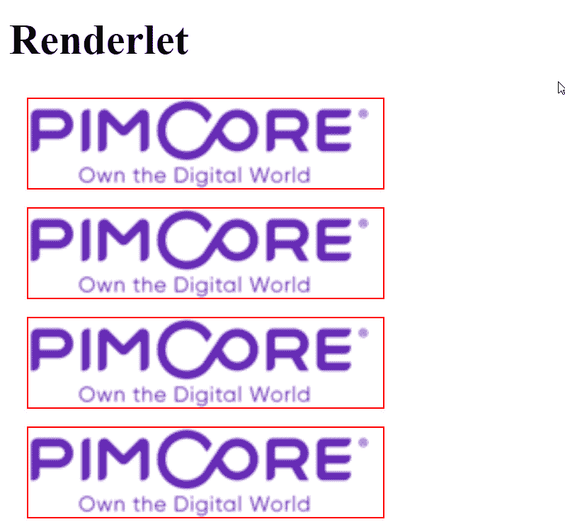

# 第八章：*第八章*：创建自定义 CMS 页面

在前面的章节中，我们学习了如何使用这些功能创建文档和对象，并实现非常简单的网站。

在本章中，我们将深入探讨自定义 CMS 页面的创建。实际上，如果你正在模板化文档或创建独立页面，你有许多工具可以使 Pimcore 的开发体验对你来说非常出色。本章将涵盖许多对于全面了解 Pimcore 的 CMS 功能至关重要的方面；这些功能是创建自定义网页的基本工具，我们将它们结合起来讨论用户输入和模板以创建内容。

本章的结构如下：

+   使用 MVC 模型

+   使用可编辑内容

+   使用块

让我们看看 Pimcore 的实际应用！

# 技术要求

与前几章一样，你可以在我们的 GitHub 仓库中找到一个演示，你可以在这里找到：[`github.com/PacktPublishing/Modernizing-Enterprise-CMS-using-Pimcore`](https://github.com/PacktPublishing/Modernizing-Enterprise-CMS-using-Pimcore)。

要运行与本章相关的演示，你需要克隆它，导航到`8. 创建自定义 CMS 页面`文件夹，并启动 Docker 环境。

要这样做，请遵循以下说明：

1.  使用以下命令运行 Docker：

    ```php
    docker-compose up
    ```

1.  然后，要恢复本地机器上的所有设置，请输入以下命令：

    ```php
    docker-compose exec php bash restore.sh
    ```

1.  导航到[`localhost/admin`](http://localhost/admin)并使用你的管理员/pimcore 凭据登录。

使用此设置，你将获得以下内容：

+   一个名为`MyObject`的类定义

+   该类的两个实例，`My Item 1`和`My Item 2`

+   **可编辑内容**页面，一个展示可编辑内容的示例页面（参见*使用可编辑内容*）

+   **模板**页面，一个展示模板辅助工具的示例页面（参见*使用 MVC 模型*）

+   一个名为`MyThumbnails`的缩略图预设

现在，你已经准备好玩本章相关的演示了！

# 使用 MVC 模型

在本节中，我们将学习 MVC（**模型-视图-控制器**）模型的工作原理以及如何使用它创建一个独立于文档范围的网页。这对于覆盖你在使用 Pimcore 作为内容管理系统过程中可能遇到的所有可能需求非常重要。

MVC 原则非常简单。当一个 URL 与一组规则匹配（**路由**）时，会激活一个控制器类，并使用某些业务逻辑（**控制器**）计算数据（**模型**）。然后，数据被发送到**视图**，该视图实现展示逻辑并向用户展示内容。

在本节中，我们将介绍使用 MVC 模式构建嵌入式网页的最重要概念：

+   控制器

+   视图（模板辅助工具）

+   路由

让我们详细看看它们。

## 控制器

Pimcore **控制器**实现了 MVC 模式中的 "C" 部分。控制器负责业务逻辑，或者说，它是你的源代码中读取、操作和准备数据以传递给表示层（视图）的部分。将所有可重用逻辑保留在服务类中是一种良好的实践，但连接表示层与业务层的实际点是控制器元素。

Pimcore 提供了一个抽象类（`FrontendController`），可以用作控制器实现的基类。这意味着你的所有控制器通常都会继承自前端控制器。你的文件命名约定将遵循通用的 Symfony 规则。在简单的场景中，如果你使用 Symfony 的标准来构建网站，你将遵循以下规则：

+   `/src/Controller/[Controller].php`

+   `/templates/[Controller]/[action].html.twig`

在控制器内部，你可以创建任何你想要的操作。每个操作负责单一的功能，并与一个 URL 相关联。我们通常为每个主题或同质组或功能（即 `CustomerController`，它管理所有客户功能）创建一个控制器。如果你省略了操作名称来调用控制器，将使用 `default`。

正如我们在 *第四章* 中解释的，*在 Pimcore 中创建文档*，我们可以为每个文档选择一个控制器，Pimcore 提供了一个现成的控制器，称为 `DefaultController`。我们可以创建与文档无关的控制器，并简单地实现自定义网页。

在控制器内部，你可以访问一些特殊的变量，这些变量可以帮助你定义如何构建所需的输出：

+   `$this->document`: 如果你正在处理文档，这就是你正在操作的文档。

+   `$this->editmode`: 表示你是否处于编辑模式，并且可以根据情况用于多样化输出。这适用于你处理文档时。

在接下来的章节中，你将找到一些控制器操作的示例，这些示例涵盖了所有最常见的情况。

### 将数据传递给视图

以下示例是一个将变量添加到视图中的操作，其中的值只是文本，但想象一下，你可以使用 `$request` 的输入来计算数据，并添加一个更复杂的数据对象：

```php
    public function dataAction(Request $request)
    {
        $input=$request->get('data');
      return array(
                'content' =>$input
            );     
    }
```

### 设置 HTTP 头部

我们可能还有另一个要求，即设置一些 HTTP 头部。如果这些值是固定的，你可以使用注解添加它们，或者你可以使用 `addResponseHeader` 辅助函数访问和程序化地修改响应对象：

```php
    /**
     * @ResponseHeader("X-Foo", values={"123456", "98765"})
     */
    public function headerAction(Request $request)
    {   
        $response = new Response();
        // using code: 
        $response->headers->set('X-Foo', 'bar'); 
        return $response;
    }
```

之前的代码为相同的头部添加了三个值：前两个来自注解，另一个来自方法内部的代码片段。

### 指定模板路径

如果你担心模板的固定约定，我们将通过下一个示例来安慰你。在以下代码片段中，我们将通过手动设置来覆盖正常的模板路径：

```php
    public function differentPathAction()
    {
        return $this->render("Default/default.html.twig", ["foo" => "bar"]); 
    }
```

或者，你可以手动指定`@Template()`注解的模板路径，然后只返回数据，如下面的代码片段所示：

```php
/**
* @Template(Default/default.html.twig)
*/
public function differentPathAction()
{
   return return ["foo" => "bar"]; 
}
```

### 生成 JSON 输出

尽管 Pimcore 自带了一个强大的 API 引擎和`json`函数。在下一个示例中，你将看到如何从原始数据创建一个`json`响应：

```php
    public function jsonAction(Request $request)
    {
        return $this->json(array('key' => 'value'));
    } 
```

这将输出数据的`json`序列化为响应的主体，并将内容类型设置为`application/json`。

### 对于所有其他情况

作为最后的备选方案，如果你对 Pimcore 提供的所有标准解决方案都不满意，你可以选择手动创建一个 Symfony 响应对象，并将其返回给 MVC 引擎。使用此选项，你可以自由设置所有响应参数，包括`mime`类型到原始内容，没有任何限制。在下一个示例中，我们将返回固定的文本：

```php
    public function customAction(Request $request)
    {
        return new Response("Just some text");
    }
}
```

之前的代码块返回了一个包含文本内容的响应作为示例。给定`Request`对象，你可以实现所有想要的代码，然后生成一个自定义的`Response`。

所有的上述操作都旨在包含在一个`controller`类中，如下所示：

```php
<?php
namespace App\Controller;
use Pimcore\Controller\FrontendController;
use Symfony\Component\HttpFoundation\Request;
use Symfony\Component\HttpFoundation\Response;
use Pimcore\Controller\Configuration\ResponseHeader;
class MyController extends FrontendController
{
   // Add your actions here
} 
```

这组示例并不全面，但包含了最重要的功能，是一个很好的起点。你可以在官方文档中找到更多详细信息：[`pimcore.com/docs/pimcore/current/Development_Documentation/MVC/index.html`](https://pimcore.com/docs/pimcore/current/Development_Documentation/MVC/index.html)。

## 视图

本节涵盖了 MVC 模式中的“V”组件。**视图**是接收数据并通过实现表示逻辑来渲染数据的组件。视图文件可以使用 Twig 或 PHP 模板编写，但正如我们在*第四章*中提到的，*在 Pimcore 中创建文档*，我们将只关注 Twig 解决方案，它允许更严格地分离业务和表示逻辑，使 Pimcore 成为一个真正的独立 CMS。这种解决方案的缺点是，你可以在 Twig 文件中实现的逻辑有限，因为它强迫你在控制器中实现所有业务逻辑。这种严格的分离在开始时可能看起来有限制，但当你对模式有信心时，你会同意它更干净、可重用且易于维护。除了所有平台特定的功能，称为**助手**之外，Pimcore 的 Twig 文件支持所有标准的 Twig 功能。

这里是 Pimcore 最重要的助手列表。

### pimcore_object

在以下代码中，我们通过其`id`（在我们的案例中，`2`）加载了一个对象，并显示了`Title`属性：

```php

{{ myObject.getTitle() }}
```

我们的对象有一个`Title`属性，可以通过标准的`getTitle` `方法`访问，因此值将被打印。

### pimcore_document

在下一个代码片段中，我们加载了一个文档并打印了标题：

```php

title: {{ myDoc.getTitle}} </br>
url: {{ myDoc}}
```

`myDoc`元素是 Pimcore 的文档，您可以访问其所有属性。

### pimcore_asset

此辅助程序加载一个可用于模板的资产。在下一个例子中，我们加载了一个资产，并显示了`filename`和`url`：

```php

url: {{ myDoc}} <br>
filename: {{ myDoc.getFilename}}
```

或者，您可以使用以下快捷方式通过路径找到资产：

```php

```

如同往常，分配的变量可以在模板文件中用于实现任何展示逻辑。

### 渲染控制器输出

此函数调用一个任意动作并打印结果。在下一个例子中，我们使用了`/custom/json`示例，并渲染了输出，传递`items=11`作为参数：

```php
{{ render(controller('App\\Controller\\CustomController::jsonAction', { items: 11 })) 
}}
```

参数顺序是动作、控制器、包和参数。

### pimcore_cache

Pimcore 的缓存简单地实现了模板内的缓存功能。您可以直接在模板中缓存 HTML 页面的某些部分，而不依赖于其他全局可定义的缓存功能。这对于需要大量计算或需要大量对象（如导航等）的模板非常有用。在下一块代码中，我们将看到缓存的实际应用：

```php


    <h1>If you refresh the page this date will remain the     same</h1>
    {{ 'now'|date('y-m-d') }} v{{ 'now'|date('U') }}
    
 
```

参数顺序是键名、秒数超时以及可选的强制在管理员模式下缓存标志。

### pimcore_device

`pimcore_device`函数在实现自适应设计时很有帮助。下一段代码显示了在模板片段中此辅助程序的使用：

```php

    I'm a phone

    I'm a table

    I'm a desktop device

```

如果您在您的 PC 上运行此脚本，输出将是**我是一个桌面设备**。

### 请求

从默认的 Symfony 对象中，您可以访问请求数据。这可以通过包含所有所需信息的`app.request`项来完成。在下一个例子中，我们使用了这种方法来获取页面预览中通常存在的`"_dc"` URL 参数：

```php
{{ app.request.get("_dc") }}
```

这只是一个示例，您可以访问所有请求参数。您可以查看官方文档以获取更多信息，请参阅：[`symfony.com/doc/current/templates.html#the-app-global-variable`](https://symfony.com/doc/current/templates.html#the-app-global-variable)。

### 术语表

此辅助程序将术语替换为链接。术语表模块是一个强大的工具，使得内部和外部链接变得简单且智能，并且 Pimcore 提供的是即用型。例如，您可以将“Pimcore”这个词与官方网站连接起来，这样每次在 HTML 中使用它时，都会被替换为指向网站的链接。此`pimcore_glossary`辅助程序将由该辅助程序用于渲染链接。要测试此功能，请按照以下步骤操作：

1.  前往**工具** | **术语表**。

1.  点击**添加**。

1.  在**文本**列中输入术语`PIMcore`，然后在**链接**列中输入页面链接。在这个例子中，我们添加了 PIMcore 和 CMS 词及其相关链接。在下一张截图，您将找到结果：

    图 8.1：术语表项

1.  现在，术语表已设置，我们可以在任何网页上使用 `pimcoreglossary` 助手使用它。我们可以通过在网页模板中放置以下代码片段来实现这一点：

    ```php
    
    My content PIMCore loves CMS
    
    ```

    在前面的代码片段中，我们用 `glossary` 函数包围了文本。因为我们定义了术语表中的单词 **PIMcore** 和 **CMS**，它们将在网页上转换为链接。这是最终结果：


图 8.2：术语表助手在行动中

这是一个简单的示例，用于解释概念，但它展示了此功能是多么强大。

### pimcore_placeholder

此助手将自定义占位符添加到模板中。下一个代码片段定义了一个名为 `myplaceholder` 的占位符，该占位符配置用于构建围绕 `"My content"` 值的 H3 标签：

```php

{# Print placeholder #}
{{ pimcore_placeholder('myplaceholder') }}
```

此输出的结果是 `<h3>My content</h3>`。

### pimcore_head_link

此助手收集头部链接列表（样式表或任何其他 `head link` 标签）并在网页的头部区域打印它们。根据展示逻辑，链接被收集（您可能包括或不包括文件，基于某些特殊条件）然后一次性打印。

在以下示例中，代码片段将 favicon（收藏夹图标——您在浏览网站时在浏览器标签中看到的标志）添加到链接列表中：

```php

{# Print head links#}
{{ pimcore_head_link()}}
```

在示例中，我们将 favicon 添加到列表中。使用正确的 `pimcore_head_link` 配置，我们还可以使用相对包含（例如，在文件 y 之后添加文件 x）来定义顺序。

### pimcore_head_meta

此助手打印 HTTP 元标签。它可以收集一组将在头部区域打印一次的项目。在下一个代码块中，类似于 `HeadLink` 助手，数据通过最终调用收集并打印到函数中：

```php
 
{# adding addictional properties #}

{# Print tags #}
{{ pimcore_head_meta() }}
```

### pimcore_head_script

这与 `HeadLink` 和 `Style` 相同，但用于 JavaScript 文件。下一个代码块将脚本添加到列表中，然后将其打印到页面上：

```php

{# Print tags #}
{{ pimcore_head_script()}}
```

### pimcore_head_style

此助手管理内联样式。它类似于 `HeadLink`，但带有内联脚本。在下一段代码中，我们添加了一个名为 `ie.css` 的文件，该文件具有条件包装，在这种情况下，将 CSS 操作限制在版本 11 之前的 Internet Explorer 中：

```php

{# Print tags #}
{{ pimcore_head_style() }}
```

### pimcore_head_title

创建并保存 HTML 文档的 `<title>` 以供以后检索和输出。以下脚本将特殊的 `title` 标签添加到页面中：

```php

{# Print tags #}
{{ pimcore_head_title() }} 
```

### pimcore_inc

此助手在页面中包含 Pimcore 文档。在下一个代码片段中，我们看到 `MySnippet` 文档是如何渲染并添加到页面中的：

```php
{{ pimcore_inc('/MySnippet') }}
```

### pimcore_inline_script

此助手向页面添加内联脚本。用法与 `HeadScript` 非常相似，但旨在内联使用。下一个代码块将 `myscript.js` 添加到列表中，然后将其打印到页面上：

```php

{# Print tags #}
{{ pimcore_inline_script() | raw }}
```

### 导航

此助手负责生成并添加导航菜单。在下一个代码块中，您将找到一个示例，该示例根据文档层次结构打印菜单：

```php


{# Print tags #}
{{ pimcore_render_nav(navigation) }}
```

在片段中，它渲染了一个从`mainNavStartNode`（根文档）开始的菜单，并使用当前文档作为活动文档。

您可以参考官方文档以获取有关`导航`的更多信息：[`pimcore.com/docs/pimcore/current/Development_Documentation/Documents/Navigation.html.`](https://pimcore.com/docs/pimcore/current/Development_Documentation/Documents/Navigation.html)

### include

此助手直接在页面中包含一个模板。看看以下脚本：

```php
{{ include("Default/include.html.twig", {'par':'value'}) }}
```

此脚本包括`Default/include.html.twig`模板，您可以在其中使用作为输入传递的参数集。

### 翻译

这是在 Pimcore 引擎中集成的 Symfony 功能。使用管道过滤器，您可以使用翻译数据库转换文本，并用翻译版本替换原始文本。为此，请执行以下操作：

1.  创建一个文档并将其分配给一个模板。

1.  将以下片段添加到模板中：

    ```php
     
    {{ message|trans }}
    ```

    此脚本设置一个具有字符串值（`my-test-key`）的变量，然后使用`trans`过滤器打印它。

1.  在第一次使用标签后，将在您的后端创建一个条目，并且您可以为每种语言设置一个值。转到**工具** | **共享翻译**。通过在表中输入数据为每种语言设置标签的值：![Figure 8.3: 共享翻译面板

    ![img/Figure_8.03_B17073.jpg]

    Figure 8.3: 共享翻译面板

1.  打开网页并查看翻译后的文本。

翻译功能非常有用且易于管理，因为它具有直观的界面。

### 网站配置

Pimcore 有一组易于通过网页界面编辑的配置关键字。您可以从**设置** | **网站设置**中添加它们，然后可以将值插入模板或控制器中。为此，请执行以下操作：

1.  创建一个文档并分配一个模板。

1.  从**设置** | **网站设置**打开网站设置管理。

1.  在顶部编辑栏中输入设置的关键字并选择**文本**选项。

1.  点击**+**按钮，值将在表中显示。您只需在网格中输入文本即可编辑它。在下一张屏幕截图中，您将看到最终结果。在这个例子中，我们添加了一个名为**mykey**的键，其值为**My Value**：![Figure 8.4: 网站设置面板

    ![img/Figure_8.04_B17073.jpg]

    Figure 8.4: 网站设置面板

1.  现在将以下片段添加到模板中：

    ```php
    {{ pimcore_website_config('mykey') }}
    ```

    使用前面的代码，您将得到助手的结果`MyValue`。

可视化编辑设置非常有用，因为它允许我们创建可配置的模板和网站，这些模板和网站可以轻松集中管理。

### instanceof

`instanceof`构造非常有用，可以检查一个对象是否为特定类型。在下一段代码中，我们将检查资产实例是否为`Image`类型：

```php

    {# print the image #}

    {# print the video #}
 
```

这个功能很重要，因为它可以改变代码流程，使其根据对象类型完成或未完成任务。在之前的例子中，我们获取了一个可能是视频或图像的对象，并且我们可以根据类型正确地显示它。

### 缩略图

当您处理图像时，以正确的大小打印它们是基本的。Pimcore 的缩略图功能在模板制作中非常有帮助。我们可以从管理界面定义资产缩略图；您应该已经在*第五章**，探索对象和类*中发现了这个主题。让我们通过几个简单的步骤来查看这个功能：

1.  创建一个网页并将其分配一个模板。

1.  前往**设置 | 缩略图 | 图像缩略图**。

1.  添加一个具有以下截图所示设置的缩略图配置：

    图 8.5：缩略图设置

    我们使用了**PNG**格式，并将**按高度缩放**设置为**200**。现在我们将上传的图像将会有一个合适的缩略图。

1.  在**DAM**部分上传一个图像。在菜单的**资产**部分右键单击并选择**上传文件**选项：

    图 8.6：上传图像

1.  演示示例已经包含了一个 ID 为 2 的 Pimcore 标志图像。要获取缩略图，您只需通过路径或 ID 获取资产，然后渲染它。下面的代码片段就是这样做。将代码片段复制到模板中：

    ```php
    
    {{ asset.getThumbnail('MyThubnails').getHtml() | raw }}
    ```

    脚本获取图像的缩略图（第一次使用时生成的文件）并将图像标签打印到文档中。

1.  下一个示例获取了一个没有配置定义的即时缩略图。将此代码复制到模板中并查看结果：

    ```php
    {{ asset.getThumbnail({
        width: 50,
        format: 'png'
    }).getHtml() | raw }}
    ```

    这个例子与上一个例子非常相似，但使用了不是由缩略图配置预定义的设置。

整个函数列表涵盖了 Pimcore 为我们提供的开箱即用的功能集。此外，您还将拥有所有默认的 Symfony 函数，您可以通过官方文档来发现它们：https://symfony.com/doc/current/reference/twig_reference.html。

但如果你既没有使用 Pimcore 也没有使用 Symfony 实现你所需要的功能，你应该怎么办？如果我们谈论的是业务逻辑，那么一个更简单的解决方案是在控制器内部操作数据，并为视图生成干净的输出。在某些情况下，我们可能需要实现一些复杂的展示逻辑，这些逻辑很难用 Twig 语法来管理。此外，我们不想将这种逻辑移动到控制器中（那里很容易实现），因为这将在模板和控制器之间创建耦合，而这不是我们想要的（你还记得我们在*第一章**，介绍 Pimcore*）时讨论的分离解决方案的好处吗？在下一节中，我们将提供在模板中实现复杂展示逻辑的解决方案，我们将看到如何向模板引擎添加方法并为我们的项目实现可重用的助手。

### 实现你自己的模板助手

在上一节中，我们学习了如何使用模板助手来生成动态内容。现在，是时候学习如何扩展模板助手系统并在集合中添加自己的函数了。在下一个示例中，我们将创建一个模板助手，它将以指定的格式显示当前日期和时间。你可能会有异议，因为 Twig 模板已经提供了类似的功能，但请记住，这是一个解释模板助手扩展的示例，所以最好将我们的案例研究保持尽可能简单。现在，按照以下步骤操作：

1.  在 `/src/Templating/Helper/Timestamp.php` 中创建一个文件。

1.  然后在 `Timestamp.php` 文件中复制以下代码段：

    ```php
    <?php
      …
    class Timestamp  extends AbstractExtension
    {    
        public function getFunctions()
        {
            return [
                new TwigFunction('timestamp', [$this,             'timestamp']), 
            ]; 
        }    
        public function timestamp(String $format)
        {     
           echo date($format);
        }
    }
    ```

    `getFunctions` 是一个特殊函数，它列出了从这个扩展公开的所有助手扩展。在我们的例子中，我们有一个名为 `timestamp` 的函数。这个函数根据用户接收到的格式计算文本日期表示。这个函数映射到名为 `timestamp` 的命令，并可以在模板引擎中使用。为了简单起见，我使用了计算结果的函数作为助手名称，但你也可以选择自己的名称。

1.  使用 YAML 配置注册代码片段。打开 `/` `config/services.yml` 文件并添加以下内容：

    ```php
    Services: 
         …
        App\Templating\Helper\Timestamp:
            public: true
            tags:
                - { name: templating.helper, alias:             timestamp}
    ```

1.  现在时间戳助手已注册在模板引擎中，因此我们可以在我们的 Twig 文件中调用它。复制以下代码段：

    ```php
    {{ timestamp("Y-m-d") }}
    ```

    你将得到类似 `2020-11-03` 的结果。

在本节中，我们学习了如何向模板引擎添加功能。这对于代码重用和克服 Twig 语法限制是有益的。在下一节中，我们将学习如何掌握路由规则，将 URL 与控制器连接起来。

## 掌握路由和 URL

掌握自定义页面的最后一步是路由。我们在*第四章*，*在 Pimcore 中创建文档*中了解到，每个文档都有一个路径，可以通过文档编辑界面进行更改。如果我们不是在处理文档，而是在处理自定义页面呢？在本节中，我们将了解 Pimcore 提供的选项，如下所示：

+   **固定路由**，按照 Symfony 标准。

+   **静态路由**，可由管理界面更改的可配置路由。

+   **重定向**，可以使用友好的管理界面设置 HTTP 重定向。对于那些不熟悉重定向的人来说，想象一下它是一种将浏览器从一个 URL 重定向到另一个 URL 的方式。这在页面更改 URL 或我们需要将网站从一个域名迁移到另一个域名时非常常见。

让我们详细看看它们。

### 固定路由

要添加路由，没有比将其添加到配置更复杂的了。这些设置包含在`routing.yml`文件中，这些规则遵循你可以在这里找到的 Symfony 标准：https://symfony.com/doc/current/routing.html。

在接下来的代码片段中，我们可以看到一个规则的示例：

```php
custom_rule:
    path:      /custom/actionname/{parameter}
    controller: App\Controller\CustomController:myaction
    defaults:
     parameter: "my default value"
```

对于我们的目的来说，最相关的设置如下：

+   `name`：规则有一个必须唯一的名称；在我们的例子中，它是`custom_rule`。

+   `path`：这是规则正在监听的路径；它可以包含正则表达式和获取参数（在我们的例子中，`parameter`）。

`controller`：这是控制器，包括动作名称；它支持 Symfony 语法。如果你写下`App\Controller\CustomController:myaction`，你将在应用程序的`CustomController`控制器中激活`myaction`。

+   对于每个参数，如果参数是可选的，你可以为其提供一个默认值。

注意，即使我们使用了可理解的命名约定，你也可以定义任何规则。URL 内部（或查询路径）的参数将被解析并传递给动作。

如果你愿意，第二个选项是将路由作为控制器动作的注解。前一个规则的等效如下：

```php
   /**
     * @Route("/custom/actionname/{parameter}", name="custom_     rule")
     */
    public function myaction(string $parameter)
    {
        // ...
    }
```

路由规则是双向的，因此它可以从参数值生成 URL，也可以从 URL 中获取参数值。例如，假设你有一个用于产品 URL 的`/product/{id}`规则。如果用户在浏览器中输入`/product/5`，路由引擎能够告诉你 ID 参数是 5。另一方面，你可以要求引擎为 ID 为 5 的产品生成 URL，你将得到`/product/5`。简单来说，你可以从规则名称和参数自动构建 URL。这可以通过路径助手轻松完成：

```php
{{% pimcore_path('custom_rule', {'parameter': 67}); }}
```

这将生成完整的 URL，`/custom/actionname/67`。

### 可配置路由

在上一节中使用的前置规则是一个很好的解决方案，但它是静态的，您需要访问源代码来理解或更改它们。Pimcore 提供的另一种解决方案是使用管理 UI 可视地定义它们。在**设置** | **静态路由**下，您可以找到一个表格，您可以输入路由规则的所有值（包括名称、模式、参数名称和构建规则）。这使得规则管理变得非常容易，您可以在不访问源代码的情况下监控您有多少规则以及它们的配置。

您可以按照以下步骤查看此方法的效果：

1.  创建一个控制器调用者，`CustomController`。

1.  在控制器中添加一个名为`data`的操作，类似于以下内容：

    ```php
    /**
         * @Template() 
         */    
        public function dataAction(Request $request)
        {
          $input=$request->get('data');
          $content = "data to show $input";       
          return array(
               'content' => $content,
          );    
        }
    ```

    此代码将从 URL 中获取`data`参数，并通过`content`变量将其传递给视图。

1.  在控制器文件夹中创建一个名为`data.html`的视图。添加以下代码：

    ```php
    {{ content }}
    ```

    此脚本将打印`content`变量。

1.  打开`custom`。

1.  `/\/custom_data\/(.*)\//`。请注意，`\/`用于在正则表达式中转义`/`字符，因此像`/custom_data/anything/`这样的 URL 将被匹配。由选择器`(.*)`匹配的参数是`anything`部分。

1.  `CustomController`。

1.  `data`。

1.  `/custom_data/%data/`。使用此值，路由引擎将能够生成 URL，`/custom_data/value/`，如果您使用可编辑的`{{% pimcore_path('custom', {'data': 'value'}); }}`。

1.  `data`。这意味着`(.*)`的值将被命名为`data`。

1.  `empty`。在这种情况下，如果省略了参数，参数数据将具有文本`empty`作为其值。

1.  打开您的浏览器并导航到[`localhost/custom_data/myvalue`](http://localhost/custom_data/myvalue)。您将在页面上看到打印的`myvalue`参数。

与前面的示例类似，我们可以使用规则名称和参数通过模板助手生成 URL。

您通过管理 UI 编辑的设置保存在一个 PHP 配置文件中（`var/config/staticroutes.php`），因此也可以直接编辑代码或将它们提交到 Git 存储库。下一部分代码显示了通过添加前面的规则所获得的内容：

```php
<?php 
return [
    1 => [
        "id" => 1,
        "name" => "custom",
        "pattern" => "/\\/custom_data\\/(.*)?\\//",
        "reverse" => "/custom_data/%data/",
        "module" => NULL,
        "controller" => "@App\\Controller\\        CustomController:dataAction",
        "variables" => "data,",
        "defaults" => "empty",
    ]
];
```

当您希望保持 URL 路由灵活，允许用户在运行时选择路径时，可配置的路由非常有用。这对于匹配客户关于 URL 的规格变更（可能是由于 SEO 需求的变化）至关重要，而无需修改任何一行代码。

### 重定向

重定向是 Pimcore 的一个有用功能，可以将用户引导到正确的页面——无论是用于营销 URL，还是用于网站重新发布后的重定向，或者是移动文档的重定向。

创建重定向的过程非常简单。只需遵循以下步骤：

1.  导航到**系统 | 重定向**。此菜单将打开一个类似于这个的表格：

    图 8.8：重定向表格

1.  点击**添加**按钮。您将看到一个以下弹出窗口：

    图 8.9：添加重定向

    **类型**下拉菜单允许您选择重定向的类型，而**源**和**目标**允许您选择将源重定向到目标 URL 的映射规则。

1.  在**目标**框中输入 `/\/redirect\/(.*)/` 到 `/custom_data/$1`，就像在 *图 8.9* 中所示。

1.  打开浏览器并导航到 [`localhost/redirect/xxx/`](http://localhost/redirect/xxx/)。您将被重定向到 http://localhost/custom_data/xxx/。

在本节中，我们学习了如何使用 MVC 模型创建自定义网页。特别是，我们涵盖了所有最重要的主题：

+   **控制器**：我们了解了控制器如何与请求参数交互并将数据传递给视图。在控制器内部，我们可以实现我们的业务逻辑而没有任何限制。

+   **视图**：我们学习了模板引擎的工作原理以及我们如何使用助手来实现表示逻辑。

+   **路由和 URL**：我们学习了如何正确管理页面的 URL。我们没有将自己限制在 Symfony 的标准路由上，还涵盖了静态路由和重定向选项。有了所有这些选项，我们可以根据我们的用例选择正确的解决方案。最重要的是要知道，这个广泛的选项集赋予我们解决我们可能遇到的任何 URL 问题的能力。

在下一节中，我们将深入探讨 Pimcore 可编辑，并学习如何将它们组合起来以获得结果，而无需编写大量的代码。

# 使用可编辑

正如我们在 *第四章* *在 Pimcore 中创建文档* 中所介绍的，Pimcore 的可编辑是一组可视化组件，可用于在 CMS 页面上输入信息，并且能够渲染输出以准备网页。您应该记住 `pimcore_input` 和 `pimcore_wysiwyg` 组件；好消息是 Pimcore 有很多这样的组件，并覆盖了您的大部分用户需求。在本节中，我们将查看这些组件。

重要提示

在**可编辑**列表中，我们应该有**区域**和**区域块**组件，但在此章节中我们不会讨论这些。这些元素与**砖块**结合，是 Pimcore 中代码重用的支柱，将在 *第十章* *创建 Pimcore 砖块* 中介绍。动机是，如果不了解砖块是什么，区域、区域块和块组件将难以理解。

在下一节中，我们将发现可用的可编辑列表。对于每一个，我们将添加一段代码片段来向您展示如何将其添加到您的代码中，对于更复杂的项，我们还有一些截图来解释交互。

在您的实时 Pimcore 环境中测试可编辑的过程如下：

1.  将文档添加到你的 CMS 中，并将其链接到模板。这个过程在*第四章**，在 Pimcore 中创建文档*中有详细描述。

1.  复制以下子节中的代码片段。

1.  进入页面编辑器，看看组件的外观。

1.  打开页面预览，查看保存在可编辑区域内的数据。记住，通过使用 `{{ pimcore_xxx('name') }}`，你可以打印数据，但你也可以将其设置为变量，使用 ``，然后实现自己的展示逻辑。

所有这些示例都包含在 `editable.htm.twig` 模板中，该模板用于**可编辑页面**，你可以在与本章相关的演示中找到。

## 复选框

以下可编辑内容添加了一个可以被页面编辑器勾选的复选框：

```php
{{ pimcore_checkbox('myCheckbox') }} 
```

该值可用于实现一些渲染逻辑（即根据 `myCheckbox` 值显示或隐藏某些内容）。

## 日期

此代码片段向网页添加了一个 `DateTime` 选择器：

```php
{{ pimcore_date('myDate', {
    'format': 'd.m.Y',
    'outputFormat': '%d.%m.%Y'
    })
}}
```

当编辑页面时，你将看到如这里所示的可编辑 `DateTime` 选择器：


图 8.10：日期选择器操作界面

在页面渲染过程中，当你不在编辑模式时，该函数输出用户在编辑器中选择的值。此值可以显示或用于实现展示逻辑。

## 关系（多对一）

此可编辑内容提供了将 `relation` 添加到对象的机会。你可以选择你想添加哪些类型的元素（例如，`asset` 或 `object`）以及哪些子类型。在以下示例中，我们只允许 `MyObject` 类型的类：

```php
{{ pimcore_relation("myRelation",{
    "types": ["asset","object"],
    "subtypes": {
        "asset": ["video", "image"],
        "object": ["object"],
    },
    "classes": ["MyObject"]
}) }}
```

此组件一旦添加到页面，就会显示为一个简单的编辑框，你可以拖动你想要显示的项目，如下面的截图所示：


图 8.11：关系配置

然后，名为 `myRelation` 的关系将包含你的选择值，你可以在模板中使用它来渲染数据。

在以下示例中，我们将添加一个**链接**按钮，用于导航到所选项目：

```php
<a href="{{ pimcore_relation("myRelation").getFullPath() }}">{{ "Go to" }}</a>
```

之前的代码片段将在文本中显示一个链接。

## 关系（多对多关系）

这个可编辑内容类似于多对一关系，但允许你选择对多个其他元素的引用（例如文档、资产和对象）。以下代码片段与上一个用例相同，但由于这个可编辑内容有多个引用，我们使用了 `for` 循环来列出所有选定的选项：

```php

    {{ pimcore_relations("objectPaths") }}

<ul>
    
        <li><a href="{{ element.getFullPath }}">{{  element.getTitle  }}</a></li>
    
</ul>

```

现在我们可以拖放多个项目：


图 8.12：关系配置

选择的结果如下表所示：


图 8.13：编辑模式下的关系

在我们的沙盒数据中，我们将得到如下内容：


图 8.14：关系的输出

## 图片

此可编辑器为您提供了一个可以上传图片的小部件。如果您从资产文件夹中拖动一个文件并将其放在组件上，图片将被显示。与`关系`组件相比的优势在于图片更容易使用且与缩略图系统集成。

下一行代码允许您上传图片：

```php
{{ pimcore_image("myImage", {
    "title": "Drag your image here",
    "thumbnail": "myThumbnails"
}) }}
```

您可以上传图片或将它们拖放到小部件中，如下面的屏幕截图所示：


图 8.15：图片配置

## 输入

`输入`允许用户输入一行文本，我们可以使用输入来渲染 HTML：

```php
{{ pimcore_input("myHeadline") }}
```

我们在*第四章**，在 Pimcore 中创建文档中使用过它；关于此可编辑器没有更多要添加的内容。

## 链接

这是一个用于渲染链接的组件：

```php
{{ pimcore_link('blogLink') }}
```

以下屏幕截图显示了编辑模式中的链接：


图 8.16 – 编辑模式中的链接组件

组件包含两个按钮：打开所选链接的文件夹和打开设置表单的编辑按钮（铅笔图标）。下一个屏幕截图显示了弹出窗口和链接可用的参数：


图 8.17：链接配置

完成后，结果是一个包含文本和目的地的 HTML 链接。

## 选择

此代码片段添加了一个`选择`组件，允许用户从一组项目中选择。以下代码片段显示了它是如何工作的：

```php

    {{ pimcore_select("myItem", {
            "store": [
                ["option1", "Option One"],
                ["option2", "Option 2"],
                ["option3", "Option 3"]
            ],
            "defaultValue" : "option1"
        }) }}
    
    Your choice:{{ pimcore_select("myItem").getData() }}    

```

`store`参数包含一个数组列表。每个项目由两个元素的数组组成：第一个是键，第二个是值。`defaultValue`设置配置了所选列表项的默认值。

这是在编辑模式中显示的内容：


图 8.18：选择配置

## 多选

`多选`组件与`选择`组件非常相似，但它允许多项选择：

```php
{} 
```

这是在编辑模式中显示的内容：


图 8.19：多选配置

## 数字

此可编辑器类似于`输入`，但专门用于数字：

```php
{{ pimcore_numeric('myNumber') }}
```

这是在编辑模式中显示的内容：


图 8.20：数字编辑器

在编辑模式下，它返回所选的数字。

## Renderlet

`Renderlet`是一个特殊的容器，能够渲染一个对象。它使用控制器和操作来处理所选项目，并将生成的 HTML 提供给用户：

```php
{{
     pimcore_renderlet('myGallery', {
          "controller" : "App\\Controller\\          CustomController::galleryAction",
          "title" : "Drag an asset folder here to get a           gallery",
          "height" : 400
     })
}}
```

在这种情况下，我们需要额外的步骤来测试它。按照以下步骤操作：

1.  在`/app/Resources/views/Default`文件夹内添加一个名为`gallery.php`的模板文件，并添加以下代码以渲染您的数据：

    ```php
    
              
                   
                    <div style="border: 1px solid red; 
                    width:200px; padding 10px; 
                    margin:10px;">
                        {{ asset.getThumbnail(
                          'MiniIcons').getHTML()|raw}}
                    </div>
                   
              
    
    ```

1.  使用以下代码向默认控制器添加一个操作：

    ```php
       /**
         * @Template() 
         */    
        public function galleryAction(Request $request)
        {
            $result=array();
            if ('asset' === $request->get('type')) {
                $asset = Asset::getById($request->get('id'));
                if ('folder' === $asset->getType()) {
                    $result["assets"] = $asset-                >getChildren();
                }
            }
            return $result;
        }
    ```

1.  然后在页面中添加一个具有以下配置的`Renderlet`可编辑：

    ```php
    {{
         pimcore_renderlet('myGallery', {
              "controller" : "App\\Controller\\          CustomController::galleryAction",
              "title" : "Drag an asset folder here to get a           gallery",
              "height" : 400
         })
    }}
    ```

    这个配置告诉 Pimcore 使用`Default`控制器中的`galleryAction`操作来渲染数据。

1.  将一个文件夹拖放到`Renderlet`中；这就是编辑模式中显示的内容：


图 8.21：将文件夹拖放到 Renderlet 中

以普通用户查看页面，并查看你的模板的结果：



图 8.22：使用示例模板的输出

## 片段

这个组件用于在文档中包含一个文档或片段（一种特殊的文档类型）；这对于在页面上重用脚本或网站的部分非常有用：

```php
{{ pimcore_snippet("mySnippet", {"width": 250, "height": 100}) }} 
```

一旦你输入了代码，这就是如何在网页中添加一个片段的方法：


图 8.23：片段控制的配置

作为网站用户，你会看到以下内容：


图 8.24：片段控制输出

在上一个截图中，文本**我是默认模板**来自片段。

## 表格

这个可编辑创建一个表格，并允许编辑器定义其中的数据。你可以指定默认的列数（`cols`）或行数（`rows`）。你还可以在`data`参数中添加数据矩阵（数组数组）。用户将能够自行添加行和列。以下是一个可编辑的示例：

```php
{{ pimcore_table("productProperties", {
    "width": 700,
    "height": 400,
    "defaults": {
        "cols": 3,
        "rows": 3,
        }
    })
}}
```

这就是生成的编辑器界面：


图 8.25：表格控制的配置

这就是默认的渲染结果：


图 8.26：表格输出

前一个图看起来不太美观，因为组件输出的是一个没有样式的简单 HTML 表格。当然，基于你的 CSS 主题，你可以应用所有你想要的样式，使其与你的网站设计保持一致。

## 文本区域

这与`输入`可编辑非常相似，但使用的是`Textarea`组件：

```php
{{ pimcore_textarea("myTextarea",
   {"placeholder": "My Description" }) 
}} 
```

## 视频

这个可编辑功能允许你将电影资产插入到你的页面内容中。它与图像组件非常相似，但用于视频。你需要添加以下代码片段来激活它：

```php
  {{ pimcore_video('campaignVideo', {
        width: 700,
        height: 400
    }) }}
```

然后，你将能够定义源（本地资产或外部链接）并微调一些选项：


图 8.27：视频控制

在网页上，你将看到它在一个视频播放器中，如下截图所示：


图 8.28：视频控制输出

视频可编辑是一个非常强大的解决方案，允许用户在不上传和管理视频时无需寻求开发者的帮助。

## WYSIWYG

这个所见即所得编辑器用于输入 HTML 内容。在下一段代码中，有一个可编辑使用的示例：

```php
{{  pimcore_wysiwyg("specialContent")     }}
```

我们在*第四章**，在 Pimcore 中创建文档*中使用过它；没有更多要添加的内容。

在本节中，我们看到了最重要的可编辑内容的概述。使用它们作为我们创建的网页的基础组件，使我们能够完全自定义 HTML 的任何方面。此外，有了这个庞大的选项集，您需要比为用户添加输入并模板化收集到的数据更多的场合非常少。一般来说，您不需要编写代码来满足客户的需求，只需模板化页面即可。

关于可编辑的更多信息，您可以在以下 URL 的官方文档中进行咨询：[`pimcore.com/docs/pimcore/current/Development_Documentation/Documents/Editables/`](https://pimcore.com/docs/pimcore/current/Development_Documentation/Documents/Editables/)。

在下一节中，我们将了解块的使用方法，这些是简单的工具，有助于创建动态页面。

# 使用块

Pimcore 块是一个非常聪明的系统，用于迭代页面的一部分。例如，如果您有一个由水平带或标题段落组成的标准页面，您可以定义一段 HTML 代码，说明每个项目应该如何看起来，并允许用户添加他们想要的任意数量的项目。作为另一个例子，您可以定义一个由 H2 标题和文本组成的块，这将为您网页创建许多标题段落。或者，您可以使用带有图像的块来创建一个画廊，迭代这些块。此外，您还可以通过安排发布来管理块的可视性。

## 正规块

`pimcore_iterate_block`可以返回块列表。在`for`循环内包装的所有代码都可以根据用户的意愿复制任意多次。

块迭代与常规`for`循环的区别在于，在块的情况下，用户定义他们想要多少项，并且所有在可编辑区域内的数据输入都将被持久化。

定义块的语法非常简单，我们可以在下一个片段中看到之前提到的函数的使用：

```php

    My content

```

在下一个示例中，我们将看到在动作中的块，它遍历一个带有标题和文本的小型模板，构建一个带有标题段落的网页：

1.  创建一个页面，并将页面与模板链接，就像我们之前多次做的那样。如果您有任何疑问，请参阅*第四章**，在 Pimcore 中创建文档*。

1.  将以下片段复制到模板中：

    ```php
    
        <h2>{{ pimcore_input('title') }}</h2>
        <p>{ pimcore_wysiwyg('content') }}</p>
    
    ```

1.  模板部分由一个`title`组成，被`H2`标签和`paragraph`包围。在下一张屏幕截图中，您将看到在添加块之前我们的代码在编辑模式下的结果：

    图 8.29：向列表添加块

1.  前往页面编辑器，点击绿色**+**图标以将一个块添加到块列表中。现在块在编辑器中可见，您将能够输入数据。您可以添加任意多个块；您将能够在后端逐个编辑它们。

1.  现在将数据输入到可编辑内容中。在这个例子中，我将**我的第一个条目**作为标题，**值**放在长文本中。输出将类似于以下屏幕截图：

    图 8.30：在块列表中编辑元素

1.  可以迭代任意多个块。

    最终结果在网页上看起来将如下所示：


图 8.31：添加更多元素后的结果

## 计划块

计划块组件与块非常相似，但它有定义内容过期日期的选项。语法与下一片段中所示相同：

```php

    <h2>{{ pimcore_input('blockinput') }}</h2>
    <p>{{ pimcore_image('myimage') }}</p>

```

测试此代码片段的过程与上一节中我们看到的标准块完全相同。

在下一张屏幕截图中，我们将看到计划块的编辑模式，其中靠近绿色**+**图标有一个`DateTime`选择器，允许用户定义内容何时过期：


图 8.32 – 编辑计划块

块引擎是一个非常强大的系统，它允许用户轻松地将动态页面制作成易于编辑。当我们将在*第十章*“创建 Pimcore 砖块”中使用块与砖块结合来创建完全动态的模板时，我们将更加欣赏这个功能。无论如何，到目前为止我们所学的都是非常有趣的：我们可以通过一种结构化的方法给用户机会来管理重复的模板。

# 摘要

在本章中，我们学习了创建自定义 CMS 页面所需的所有信息。我们了解了 MVC 模型，并深入研究了 Pimcore 的模板引擎，发现了所有助手以及如何创建自己的助手。我们还学习了如何在控制器中编写后端代码，并通过定义路由规则使其工作。我们了解到在 Pimcore 中有许多管理 URL 的方法（硬编码、静态路由和重定向），并且它们涵盖了网站的所有用例。然后我们对可编辑内容进行了全面概述，这使得我们能够仅通过模板化来掌握任何自定义网页。最后，我们发现了允许通过给用户机会管理网页中的重复模式来迭代模板片段的块系统。

这是一个内容丰富的章节，为我们提供了关于自定义 CMS 页面的全面知识。在这里学到的内容将在下一章，*第九章*，配置实体和*渲染数据*中非常有用，我们将利用这些知识来渲染网页，以实现一个简单的博客引擎。
