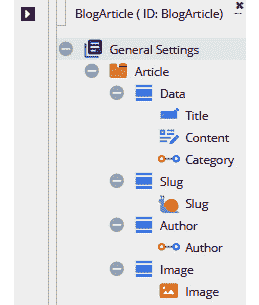
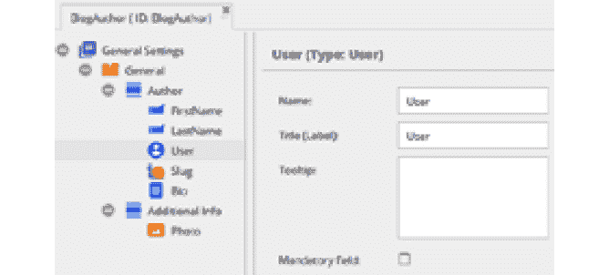
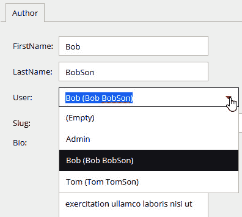
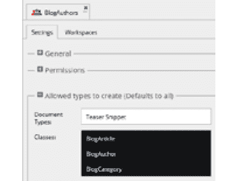
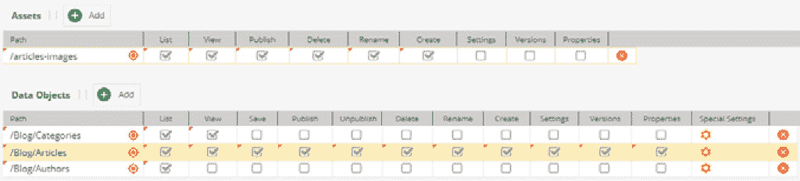
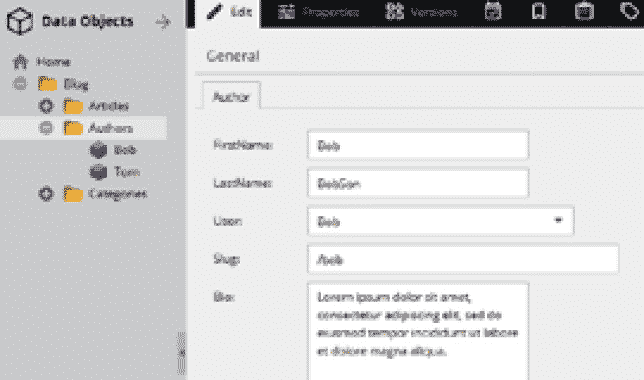
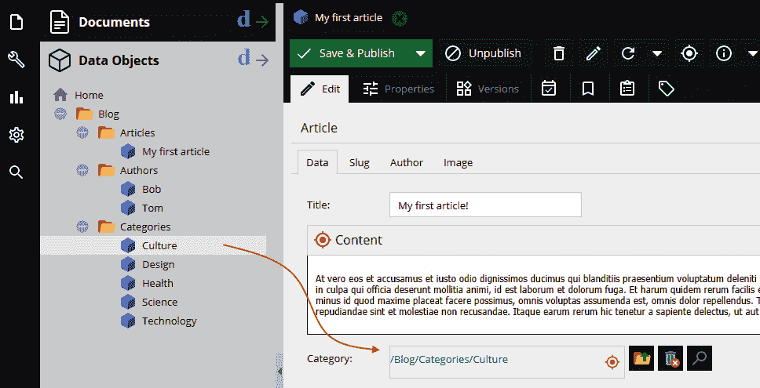
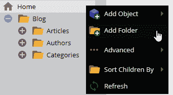
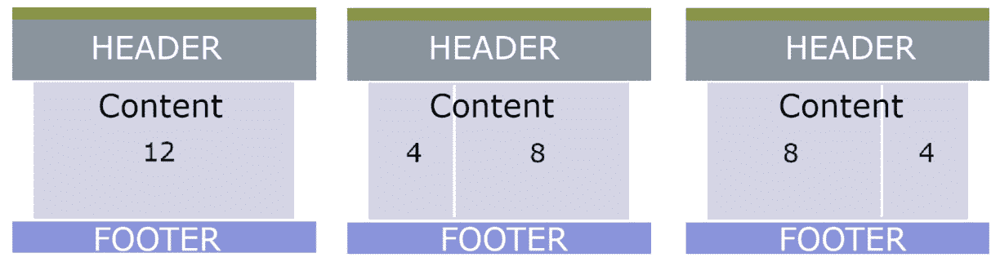
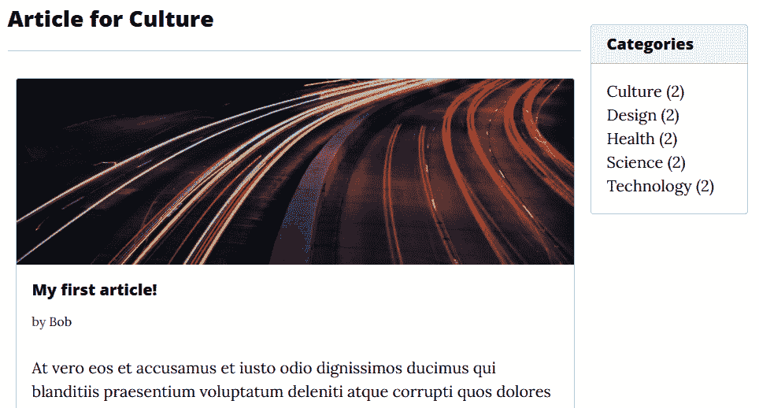

# 第九章：*第九章*：配置实体和渲染数据

在上一章中，我们学习了**模型-视图-控制器**（**MVC**）开发模式的工作原理，然后学习了视图和模型控制器是什么。我们还看到了 Pimcore 路由系统的工作原理以及如何创建元素之间的关系。最后，我们看到了如何修改我们实体的内容，添加图片、文本和日期字段。

在本章中，我们将创建一个博客，我们将涵盖以下主题：

+   定义博客类

+   创建博客用户和角色

+   路由

+   编辑我们博客的控制器

+   渲染博客视图

+   Pimcore 与 WordPress 之间的区别

到本章结束时，我们将使用 Pimcore 构建我们的第一个博客，文章按类别和作者分组。我们还将学习如何为每个页面创建合适的模板，并插入必要的代码以显示创建的内容。

# 技术要求

与前几章一样，有一个可以在我们的 GitHub 仓库中找到的演示，你可以在这里访问：

[`github.com/PacktPublishing/Modernizing-Enterprise-CMS-using-Pimcore/`](https://github.com/PacktPublishing/Modernizing-Enterprise-CMS-using-Pimcore/)

要运行与本章相关的演示，你只需要导航到`Full Demo`文件夹并启动 Docker 环境。

要阅读本章，唯一的要求是拥有一个运行中的 Pimcore 安装，并且能够通过命令行访问它。

如果你使用 Docker 安装了 Pimcore，只需运行以下简单指令：

1.  使用以下命令运行 Docker：

    ```php
    docker-compose up
    ```

1.  通过运行此命令恢复本地安装设置：

    ```php
    docker-compose exec php bash restore.sh
    ```

1.  导航到`http://localhost/admin`并使用你的管理员/pimcore 凭据登录。

现在，你已经准备好将本章相关的所有方面付诸实践。

# 定义博客类

正如我们所说，一个博客由文章和类别组成，因此我们首先需要做的步骤是创建两个与这些相关的类。除了这两个类之外，我们还需要创建第三个类：`BlogAuthor`。

我们将在我们的类中使用的所有字段类型已经在*第五章*，“探索对象和类”中看到并详细描述，因此在本章中我们感兴趣的是用它们的名称和类型来定义它们。

我们唯一使用的新元素是`slug`字段，因此我们将简要描述它。

`/slug`。

使用短横线（slug）因此允许我们通过一个可读性和可识别性更强的文本来识别一个页面，例如，与它的数字**标识符**（**ID**）相比。此外，这也有助于提高搜索引擎对页面的索引，因为搜索引擎更喜欢基于文本的 URL 而不是数字 URL。

让我们看看我们现在计划创建的每个类。

## 定义 BlogArticle 类

`BlogArticle` 类是我们为博客生成文章的地方。这个类的创建已经在*第四章*中讨论过，即*在 Pimcore 中创建文档*；以下列表中的字段是任何文章的标准字段，但您可以根据需要添加更多：

+   `Title`：输入字段

+   `Content`：所见即所得（**WYSIWYG**）组件

+   `Category`：`BlogCategory`类的多对一关系

+   `Slug`：别名字段

+   `Author`：与`BlogAuthor`类的多对一关系

+   `Image`：图像组件

让我们直接跳到我们创建的类将是什么样子。为了方便，我们将字段分组到标签页中，以便使数据输入更加线性。在下一个截图中，这里展示了新创建的类的样子：



图 9.1：BlogArticle 类

如您从前面的截图中所见，所有字段都组织得很好，并且由于各自的图标，很容易识别。

## 定义 BlogCategory 类

类别类相对简单——正如我们所说的，它是一个文章的容器。它用于按主题分组文章，因此只需要几个简单的字段，如下所示：

+   `Title`：输入字段

+   `Slug`：别名字段

+   `Description`：文本区域字段

+   `Image`：图像组件

我们将在*整合一切*部分中看到如何将文章与类别链接起来。

## 定义 BlogAuthor 类

正如我们所说的，文章是由人——或者说是计算机术语中的用户——撰写的，因此，每篇文章都将有一个作者；也就是说，它必须与撰写它的用户相关联。实际上，在`Article`类中，我们创建了一个`Author`关系字段就是为了这个目的。

在 Pimcore 中，另一方面，用户管理是最基本的，不允许我们直接扩展用户。相反，它允许我们创建用户与一个或多个 Pimcore 对象之间的关系。这可以用来向用户添加信息，或者将一个或多个对象直接与系统用户关联。

为了做到这一点，我们随后创建了一个额外的类，`BlogAuthor`，这样我们就可以通过其他属性扩展 Pimcore 用户，例如`FirstName`和`LastName`、照片和传记。

`BlogAuthor`类由以下字段组成，字段名称已经具有自描述性：

+   `FirstName`：文本字段

+   `LastName`：文本字段

+   `User`：用户字段

+   `Slug`：别名字段

+   `Bio`：文本区域字段

+   `Photo`：图像组件

+   `User`：用户字段

对于`User`字段，应该进行一个小澄清。此字段使用 Pimcore 的一个组件——`User`类型。因此，在下一个截图中，我们可以看到`User`字段的外观：



图 9.2：用户类型字段

如您从前面的截图中所见，配置并不特别复杂，实际上，我们唯一需要填写的是字段本身的名称和标题。

当创建成员类的对象实例时，您可以看到用户属性的输入小部件。这是一个组合框，用户可以从所有可用的 Pimcore 用户中选择。让我们看看如何将作者与 Pimcore 用户关联起来。以下截图说明了这个过程：



图 9.3：将作者链接到 Pimcore 系统使用

在这个示例中，选择了用户`Bob`。

现在我们已经为我们的博客创建了所有必要的类，我们仍然需要配置 Pimcore，使用必要的用户和角色来确保文章可以与相应的作者关联。

# 创建博客用户和角色

用户和角色的创建已经在*第七章*，*管理 Pimcore 站点*中解释过了，所以我们只需要回顾一下那章中学到的概念来创建必要的用户和角色。

对于这个示例，我们可以创建两个用户，我们亲爱的`Bob`和`Tom`（我们的作者），以及一个要分配给我们的用户的作者角色。

## 创建作者角色

首先，我们将为作者创建一个角色。角色配置在下一张截图中显示：



图 9.4：博客作者角色配置

如您从前一张截图中所见，我们已经为博客的三个类：`BlogArticle`、`BlogCategory`和`BlogAuthor`分配了创建权限。这是因为我们需要允许属于此角色的用户管理这些对象。在**权限**部分（在*图 9.4*中由于空间原因被压缩），我们选择了以下项目：**资产**、**类**、**对象**和**用户**。这将允许用户上传文章的图片，并查看创建的分类和文章。

如您在下一张截图中所见，角色的最终配置是在**工作空间**选项卡中的权限：



图 9.5：博客作者角色工作空间配置

如您在前一张截图中所见，它代表了每个类的角色配置，将需要设置用户的权限——特别是创建文章、上传或选择图片或能够查看作者和分类列表的权限。

## 创建用户

现在配置完成后，我们可以继续创建实际的实体，基于我们创建的类。

首先，我们需要创建用户`Bob`和`Tom`，并将作者角色分配给他们。我们已经学会了如何在*第七章*，*管理 Pimcore 站点*中创建用户和角色，所以我们只需要重复之前已经完成的相同操作。

完成这些后，让我们创建作者。作者的创建，以及文章或类别的创建，都是在 Pimcore 界面的**数据对象**部分完成的。

为了方便起见，我们已经将创建的对象分组到文件夹和子文件夹中，如下一个屏幕截图所示：



图 9.6：数据对象列表和作者 Bob 配置

如您在前一个屏幕截图中所见，我们已经创建了三个文件夹，必须包含我们将要创建的对象。特别是，`Blog`/`Authors`文件夹将包含我们将创建的所有作者，`Blog`/`Categories`文件夹将包含所有博客类别，而`Blog`/`Articles`文件夹将包含作者所写的所有文章。

在*图 9.6*中，我们还可以看到`User`字段是一个选择框，其中可以关联一个用户，在我们的案例中，我们选择了系统用户`Bob`。然后我们完成了`FirstName`、`LastName`、`Slug`和`Photo`字段的填写，并在`Bio`字段中完成了一段简短的传记。这些字段将在作者页面上显示。

## 整合所有内容

一旦我们为博客、用户和作者创建了类，我们就需要创建数据对象来在页面上表示：类别和文章。对象的创建已经在*第四章**，*在 Pimcore 中创建文档*和*第五章**，*探索对象和类*中详细说明，因此在此场合不需要详细说明如何进行此操作。然而，对于我们的博客，我们已经创建了作者类别，并且还上传了类别和文章所需的图片。在下面的示例屏幕截图中，我们可以看到创建第一篇文章的过程，包括必要的信息和关系：



图 9.7：创建我们的第一篇文章

如您在前一个屏幕截图中所见，所有元素都已创建，因此可以创建一篇文章并为其分配作者、类别和之前已加载到资产的图片。*图 9.7*中绘制的箭头标识了文章“类别”字段中的类别拖放操作。相同的拖放方法也可以用来将作者和图片链接到文章的相应字段。

您还可以看到我们如何将对象和资产分组到不同的文件夹中。组织目录结构不是强制性的，但它确实有助于按类型将创建的对象分组。如下一个屏幕截图所示，可以通过在**主页**或任何其他已创建的文件夹上右键单击来创建文件夹以组织我们的项目：



图 9.8：创建我们的第一篇文章

在前面的屏幕截图中，您可以看到我们是如何从 `Blog` 文件夹开始组织文件夹的，并在其中创建文章、作者和分类的文件夹。

我们必须做的下一步是定义博客中导航的规则——换句话说，就是路由。

# 路由

路由是我们设置博客的关键部分，在上一章中已经详细讨论过，*第八章*，*创建自定义 CMS 页面*。因此，我们将继续创建硬编码的路由，直接修改 `routing.yml` 文件。

让我们创建一组必要的规则，以便识别文章、分类和作者页面。此外，我们希望页面可以通过使用我们的 ID 或 slug 来访问。

例如，我们报告了与文章相关的两个路由规则，在下面的代码片段中：

```php
blog_article_by_id:
    path:      /blog/article/{page}
    controller: BlogBundle\Controller\BlogController:articleAction
    requirements:
      path: '.*?'
      page: '\d+'
blog_article_by_slug:
    path:      /blog/article/{page}
    controller: BlogBundle\Controller\BlogController:articleAction
    requirements:
      path: '.*?'
      page: '[\w-]+'
```

正如您在前面的代码片段中所看到的，我们已经定义了一个显示文章的路径，我们还设置了控制器和识别文章所需的参数，无论是通过 ID (`blog_article_by_id`) 还是通过 slug (`blog_article_by_slug`)。

通过分析这两个规则，我们可以看到它们只在 `path` 参数上有所不同。在通过 ID 识别文章的规则中，在路径中我们必须搜索一个整数，即文章的 ID。这是通过使用 `\d+` 实现的。在通过 slug 识别页面的规则中，我们必须识别一个字符串，为此我们使用定义为 `[\w-]+` 的正则表达式。这个最后的正则表达式过滤了所有由单词组成并由连字符分隔的字符串。

重要提示

正则表达式，也称为 regex，是一种在文本中匹配模式的方法——例如，正则表达式可以描述电子邮件地址、URL、电话号码、员工识别号、社会保险号或信用卡号的模式，当然还有网站上的页面路由。在许多系统和脚本语言中，正则表达式的使用是标准做法。正则表达式可以是简单的，也可以非常复杂。关于这个主题有成百上千的指南，在互联网上很容易找到，只需在任何搜索引擎上搜索 `regex` 即可。

我们已经看到了文章规则的定义方式。`routing.yml` 文件还包含了针对分类和作者的路线规则，这些规则的定义方式完全相同，只是要在 `BlogController` 控制器上调用不同的操作。

现在我们已经完成了路由配置，我们必须在控制器上创建操作，以便我们的页面可以包含和显示我们感兴趣的数据。

让我们现在去看看 `BlogController` 及其操作是如何编写的，这些操作我们之前在路由规则中已经看到了。

# 编辑我们的博客控制器

关于控制器的内容在上一章中已经解释过，*第八章*，*创建自定义 CMS 页面*，因此在本章中，我们只关注我们需要对博客进行哪些更改才能使其正常工作。

我们现在感兴趣的是创建与上一节中刚刚配置的规则相对应的操作。实际上，如果我们查看配置，我们可以看到`Controller`字段包含捆绑名称（`BlogBundle`），后面跟着`Controller`关键字，然后是控制器名称（`BlogController`）。最后一部分是当浏览器 URL 与路由规则匹配时要调用的操作名称（`articleAction`）。

为了阐明这些想法，想象我们在浏览器中写下这个 URL：[`myblog.com/blog/article/my-first-article`](https://myblog.com/blog/article/my-first-article)。我们唯一地标识了一个`blog_article_by_slug`规则。这个规则在配置中编写，表明在`BlogBundle`捆绑的`BlogController`控制器中调用`articleAction`操作。因此，通过我们刚刚写下的 URL，我们已经标识了一个要调用的操作，即`ArticleAction`操作。所以，让我们看看这个操作是如何编写的。

## 文章操作（ArticleAction）

正如我们刚才提到的，当 URL 通过 ID 或别名标识出必须显示文章的路径时，将执行此操作。因此，首先要做的事情就是根据输入参数检索文章，如下面的代码片段所示：

```php
/**
 *  Get detail of article. route: /blog/article/id|slug
 * @Template() 
 */   
public function articleAction(Request $request,$page) {
  if (intval($page)) { // by id
    $article = DataObject\BlogArticle::getById($page);
  }
  else { // by slug
    $slug = UrlSlug::resolveSlug("/$page");
    if ($slug instanceof UrlSlug) {
      $id = $slug->getObjectId();
      if (intval($id) && $id > 0) {
        $article =  DataObject\BlogArticle::getById($id);
      }
    }         
  }
  if ( !( $article instanceof DataObject\BlogArticle ||   $article->isPublished() ) ) {
    // article not found, redirect to blog
    return $this->redirect('/blog');
  }
  return $this->renderTemplate(
    '@Blog/Blog/article.html.twig',array(
        // get all categories for widget
        'categories' => $this->getAllCategories(), 
        'article' => $article
  ));
}
```

如您从前面的代码片段中看到的，`articleAction`函数接受两个参数：`request`和`page`。我们感兴趣的参数是`page`，为了理解 URL 中是否有 ID 或别名。

首先，我们需要检查`$page`变量中的输入参数是否为整数类型，并检索它所代表的值。要从字符串中读取整数，我们可以使用 PHP 语言的`intval`函数，该函数获取变量的整数值。如果`intval`函数返回一个整数值，这意味着我们有一个 ID。要通过 ID 检索对象，可以使用 Pimcore 在所有对象中提供的`getById`函数。如果`$page`变量不是整数，那么在 URL 中输入了自由文本，这可能是文章的别名。然后我们必须通过别名检索对象 ID，一旦检索到，我们就可以通过其 ID 检索对象，就像我们刚才所做的那样。

一旦检索到对象，我们验证它是否是类型为`article`的对象。这是通过以下`if`语句完成的：

```php
if ( !( $article instanceof DataObject\BlogArticle || $article->isPublished() ) ) {
```

第一部分，`instanceof`构造，用于检查一个对象是否为`BlogArticle`类型；`if`语句的第二部分使用一个特定的 Pimcore 函数`isPublished()`，该函数用于检查文档是否已发布。在此阶段，如果一切正常，我们只需调用`RenderTemplate`函数，这是一个接受两个参数的函数：首先，Twing 模板文件的路径，其次，传递给视图的对象数组。在我们的示例中，我们传递了文章页面模板的路径（`@Blog/Blog/article.html.twig`）以及一个包含渲染页面视图所需两个对象的数组：文章和类别列表（我们很快将看到如何在视图中使用这些变量）。有关 MVC 模式如何工作以及数据从路由到控制器再到视图的传递的更多详细信息，请参阅*第八章*，*创建自定义 CMS 页面*。

## 其他动作

我们刚刚看到了如何编写一个与路由规则链接的`ArticleAction`动作，`routing.yml`文件中存在的其他规则，用于识别类别和作者，将会有它们自己的动作，这些动作的编写方式与刚刚看到的`article`动作完全相同。

检查`BlogController`代码，我们可以很容易地看到所有动作具有相同的结构，因为它们执行相同的操作。这些操作的目的在于通过 ID 识别一个对象。唯一改变的是恢复的对象，在一个案例中是文章，在另一个案例中是类别，在另一个案例中是作者。

由于每个动作之间的代码非常相似，因此没有必要详细查看其他动作，我们只需报告控制器中必须存在的动作列表，如下所示：

+   `blogAction`

+   `articleAction`

+   `categoryAction`

+   `authorAction`

用于此演示的所有文件（如`routing.yml`、`BlogController.php`和所有视图的`*.html.twig`文件）都可以从与本书相关的 Git 仓库下载：[`github.com/PacktPublishing/Modernizing-Enterprise-CMS-using-Pimcore/`](https://github.com/PacktPublishing/Modernizing-Enterprise-CMS-using-Pimcore/)。

我们已经看到了如何在控制器中定义路由以及与之相关的动作。现在，让我们查看所需的文件和代码，以便查看本节中恢复的数据。

# 渲染博客视图

一旦我们通过之前看到的路由规则确定了访客请求的页面，并且数据已经被提取并通过控制器传递到视图后，剩下的工作就是正确地在页面上显示。在 Pimcore 中，这可以通过一个名为**Twig**的模板系统来完成，正如我们在*第四章*中提到的，*在 Pimcore 中创建文档*，这是 Pimcore 将业务逻辑与表示逻辑分离的解决方案。

简而言之，Twig 是 PHP 的现代模板引擎，由 Symfony（因此也是由 Pimcore）支持，它允许你通过其自己的语法在视图页面中直接处理代码。项目的官方页面，你可以从这里阅读完整的文档，可以访问：[`twig.symfony.com/`](https://twig.symfony.com/)。

模板是有用且必要的，因为我们可以为不同的内容创建单个视图。换句话说，模板化允许我们创建一个 HTML 页面来查看我们博客的所有文章，无论它们是几篇还是数百万篇。页面的视图对每个人都是相同的——只有内容会改变。这使我们免去了为每篇文章创建页面的麻烦，那将是一项漫长且无用的工作。

因此，我们需要创建四个模板，如下所示：

1.  `博客`: 这是博客的主页，其中将包含一系列分类。

1.  `分类`: 这是分类页面，其中将包含该分类下的所有文章。

1.  `文章`: 这是实际的文章页面，用户可以在这里阅读文章内容。

1.  `作者`: 一个包含作者信息、姓名和照片以及他们文章列表的页面。

我们将很快讨论这四个模板；然而，首先，我们将提到这些页面是如何在 HTML 和**层叠样式表**（**CSS**）中创建的。

## 使用 Bootstrap 对 HTML 页面进行样式化和布局

在讨论博客模板页面之前，我们需要了解页面是如何制作的。页面是用**HTML**编写的，其中包含一些 Twig 代码片段，同时使用 Bootstrap 进行图形样式和布局。**Bootstrap**是一组图形、样式和布局工具的集合，它允许你拥有大量可修改和根据需要调整的功能和样式。你可以在官方项目页面上了解更多关于这个框架的信息：[`getbootstrap.com/`](https://getbootstrap.com/)。

Bootstrap 的主要组件是**网格系统**。该组件允许您创建布局，将空间分割成**行**和**列**。这些布局将是构建我们模板的起点。除了用于创建布局的类之外，Bootstrap 还提供了一套 CSS 类，用于美化 HTML 元素，如标题、段落、表格、按钮等。然后，还有其他 JavaScript 组件——即下拉菜单、标签界面、工具提示、警报、手风琴菜单、滑块和导航横幅等元素。

在对 Bootstrap 进行简短但必要的介绍之后，让我们回到我们的博客。使用 Bootstrap 系统网格，我们创建了一些布局，将页面分割成列。在下一张屏幕截图中，您可以看到我们使用的三种布局类型：



对于第二种布局，我们有以下内容：

]

如您所见，我们为页面设计了三种不同的布局，概述如下：

+   在第一种布局中，内容尚未被分割，因此我们有一个占据空间十二分之一的列。

+   在第二种布局中，内容已被分割成两列——一列占四分之一的空间，另一列占八分之一的空间。

+   图 9.9：模板布局

我们使用了第一种没有分割的布局来制作主要博客页面，第二种布局在左侧有小列的作者页面，第三种用于文章和分类页面。

让我们看看这是如何在 HTML 页面中实现的。为了制作布局，我们使用了 Bootstrap 类来定义列的大小。对于第一种布局，我们有以下内容：

```php
 <!-- Page Blog Content -->
  <div class="container">
    <div class="row">
      <!-- Post Content Column -->
      <div class="col-lg-12">… here the content
      </div>
    </div> <!-- row -->
  </div> <!-- container -->
```

在第三种布局中，与之前的布局一样，内容被分割成不同大小的两列，但与第二种布局的顺序相反。

```php
<!-- Page Content -->
  <div class="container">
    <div class="row">
      <!-- Post Content Column -->
      <div class="col-md-4">… here the content
      </div>
      <!-- Sidebar Widgets Column -->
      <div class="col-lg-8">… here the content
      </div>
    </div> <!-- row -->
  </div> <!-- container -->
```

最后，对于第三种布局，我们有以下内容：

```php
<!-- Page Content -->
  <div class="container">
    <div class="row">
      <!-- Post Content Column -->
      <div class="col-lg-8">… here the content
      </div>
      <!-- Sidebar Widgets Column -->
      <div class="col-md-4">… here the content
      </div>
    </div> <!-- row -->
  </div> <!-- container -->
```

在本节中，我们简要但清晰地了解了我们的模板布局是如何创建的。在下一节中，我们将看到如何编写构成模板的视图文件中的代码。

## 模板化

模板文件是`*.html.twig`文件，通过 Twig，我们能够插入来自控制器中的数据。布局和图形风格部分是通过 Bootstrap 完成的，正如我们在上一节中看到的。我们可以报告我们已定义的四个模板，如下所示，以及它们响应的路由和相应的模板文件：

1.  博客：

    +   路径：`/blog`

    +   Twig 文件路径：`BlogBundle/Resources/views/Blog/blog.html.twig`

1.  分类：

    +   路径：`/blog/category/{page}`

    +   Twig 文件路径：`BlogBundle/Resources/views/Blog/category.html.twig`

1.  文章：

    +   路径：`/blog/article/{page}`

    +   Twig 文件路径：`BlogBundle/Resources/views/Blog/article.html.twig`

1.  作者：

    +   路径：`/blog/author/{page}`

    +   Twig 文件路径：`BlogBundle/Resources/views/Blog/author.html.twig`

因此，让我们看看一个完整的模板是如何制作的。作为一个例子，我们将采用文章模板。

## 检查文章视图

为了理解模板是如何制作的，最好的办法是报告代码并逐部分描述各个部分。因此，让我们从 `article.html.twig` 文件的完整模板代码开始，如下所示：

```php


  
  <!-- Page Content -->
  <div class="container">
    <div class="row">
      <!-- Post Content Column -->
      <div class="col-lg-8">
        <!-- Title -->
        <h1 class="mt-4">{{article.getTitle()}}</h1>
        <!-- Author -->
        <p class="lead">
          by <a href="/blog/author{{article.getAuthor().          getSlug()[0].getSlug()}}">{{article.getAuthor().          getFirstName()}}</a>
        </p>
        <hr>
        <!-- Date/Time -->
        <p>Posted on {{article.getModificationDate() | date("F         jS \\a\\t g:ia") }}</p>
        <hr>
        <!-- Preview Image -->
        
        <hr>
        <!-- Post Content -->
        {{article.getContent() | raw}}  
        <hr>
      </div>
      <!-- Sidebar Widgets Column -->
      <div class="col-md-4">
         
      </div>
    </div>
    <!-- /.row -->
  </div>
  <!-- /.container -->

```

让我们从第一行开始：`extends` 命令指示 Twig，页面扩展了由 `@Blog/Layout/layout.html.twig` 路径标识的页面。扩展一个页面就像说当前页面以某种方式包含在它扩展的页面中。在这种情况下，`layout.html.twig` 文件包含了我们在 `article.html.twig` 文件中分析时找到的 `block` `content` 的定义。我们已经在 *第四章*，*在 Pimcore 中创建文档* 中讨论了块，因此我们可以进一步描述下一行。

在内容块开始后，我们还有另一个 `include` 语句，它用于加载 `@Blog/Layout/header.html.twig` 文件的内容。在这个文件中，我们找到了构建网站头部（即顶部图像和标题）的 HTML 代码。

滚动文件，我们看到主列中与文章相关的数据：这些数据是通过 `getTitle()`、`getAuthor()`、`getModificationDate()`、`getSlug()` 和 `getImage()` 函数检索的。这些元素使用 Twig 命令进行渲染，我们将在本章下一节中更详细地了解这些命令。然而，我们可以看到所有数据都是从 `article` 变量中提取的，正如我们回忆的那样，这个变量是在 `RenderTemplate` 命令中由控制器传递给视图的。

其他模板与刚刚看到的这个模板略有不同，因此我们不会对其进行描述，但所有相关文件都可在本书的仓库中找到，网址为[`github.com/PacktPublishing/Modernizing-Enterprise-CMS-using-Pimcore`](https://github.com/PacktPublishing/Modernizing-Enterprise-CMS-using-Pimcore)。

## 渲染分类小部件

正如我们在 *图 9.9* 中看到的，我们创建了三种类型的布局，其中两种有两个不同大小的列。我们考虑在较窄的列中插入一个组件，称为 **小部件**，它将包含一个分类列表。在下一张屏幕截图中，你可以看到 **分类** 小部件如何在页面右侧显示：



图 9.10：模板布局

如您从前面的屏幕截图中看到的，**分类** 小部件包含所有博客分类的列表，每个分类中的文章数量用括号表示。

`Widget` 文件夹。小部件的包含是通过 Twig 的 `include` 命令完成的。`include` 命令至少需要一个参数，即要包含的文件路径，如下面的代码片段所示：

```php
<!-- Sidebar Widgets Column -->
<div class="col-md-4">
  
</div>
```

获取分类列表的功能是在 `BlogController` 控制器中编写的，如下面的代码片段所示：

```php
/**
 * get a complete list of categories for blog
 */
public  function getAllCategories() {
  $categories = new DataObject\BlogCategory\Listing();
  foreach ($categories as $category) {   
    $articles = new DataObject\BlogArticle\Listing();
    $articles->setCondition('Category__id = ' . $category-    >getId());       
    $category->ArticleCount = $articles->getTotalCount();
    if( !empty( $category->getSlug()[0]->getSlug()) ) {
      $category->link = $category->getSlug()[0]->getSlug();
   }
  }
  return $categories;
}
```

在小部件文件中，我们通过`for`Twig 语句创建了一个所有类别的项目符号列表，如下面的代码片段所示：

```php
<ul class="list-unstyled mb-0">
     
     <li>
          <a href="/blog{{cat.link}}" >
               {{cat.getTitle()}} ({{cat.ArticleCount}})
          </a>
     </li>
     
</ul>
```

为了获取数据，我们使用了`getTitle()`函数，并读取了我们在控制器中创建并传递到视图中的`ArticleCount`属性。我们没有使用**类别描述**字段，但我们将此作为一项练习留给你，以检索此字段并在页面上显示它。

## 理解 Twig 过滤器

过滤器是改变变量值的函数——例如，想想所有那些转换字符串值的 PHP 函数：`strtoupper`、`strtolower`等等。在 Twig 中，它们通过`pipe, |`（管道符）使用，并接受一些参数。以下是一些示例：

```php
{{textWithsomeCharUpperCase | lower}}
{{arrayOfStrings | join (',')}}
```

第一个示例将字符串的值转换为小写，而第二个示例通过逗号分隔元素来打印`arrayOfStrings`数组的所有内容。您可以在官方文档中查看过滤器列表：[`twig.symfony.com/doc/`](https://twig.symfony.com/doc/)。

现在，让我们详细看看我们用来创建模板的过滤器。

### 使用日期过滤器格式化日期

`date`过滤器将日期格式化为指定的格式。以下是使用此过滤器的示例：

```php
<p>Posted on {{article.getModificationDate() | date("F jS \\a\\t g:ia") }}</p>
```

如您从前面的代码片段中看到的，我们使用了`F jS \\a\\t g:` `ia`日期格式。`F jS`部分表示我们希望如何格式化日期，而`g:` `ia`表示时间格式。中间的文本`\\a\\t`只是用来在日期和时间之间写上"*at*"。对于日期和时间的所有可能的格式化类型，您可以在 PHP 在线指南中查看：[`www.php.net/manual/en/datetime.format.php`](https://www.php.net/manual/en/datetime.format.php)。

### 使用切片过滤器省略内容

在某些情况下，我们必须显示的文本太长，例如在文章列表中，我们只想显示文章的图片和内容的前两行或三行。我们希望截断文本，并用三个省略号替换被截断的文本，以便访客理解文章并不完整。为此，我们使用`slice`过滤器。`slice`过滤器从序列、数组或字符串中提取一段。以下是使用此过滤器的示例：

```php

…
<div class="card-body">
  …
  <p class="card-text">{{ content | raw }}</p>
</div>
```

如您从前面的代码片段中看到的，我们设置了一个`content`变量，然后将其用于模板的内容中，其值为文章内容，对长度应用条件过滤。特别是，如果文本超过`100`个字符，我们应用`slice`过滤器并取前`100`个字符，并将三个省略号连接到字符串上。如果内容不超过`100`个字符，我们则完整地取它。我们还使用了`length`过滤器来获取字符串的字符长度。最后一个技巧：我们使用了波浪号字符（`~`）来连接字符串。

### 使用原始过滤器渲染文本

`raw`过滤器将值标记为“安全”，这意味着在自动转义启用的环境中，如果`raw`是应用到最后一个文本过滤器，则此变量不会被转义。正如我们刚才看到的，我们使用了`raw`过滤器来查看文章内容，如下所示：

```php
<p class="card-text">{{ content | raw }}</p>
```

如果您想确切了解`raw`过滤器的工作方式，您可以尝试从文章内容中移除`raw`过滤器，并查看结果。

过滤器是非常有用的工具，因为它们允许我们在展示阶段直接修改数据。在本节中，我们看到了一些可用的过滤器以及如何使用它们。对于所有其他过滤器，您可以通过以下链接访问 Twig 项目的官方页面：[`twig.symfony.com/doc/`](https://twig.symfony.com/doc/).

# Pimcore 与 WordPress 之间的差异

我们已经看到了如何使用 Pimcore 创建一个博客。然而，有些人可能会想知道使用 Pimcore 创建博客是否是正确的选择。已经有许多**内容管理系统**（**CMSes**）可以完成这项工作——WordPress 最为著名。

我们提到 WordPress 是因为，对于那些还不了解它的人来说，这是一个强大的开源软件解决方案，您可以轻松自由地使用它来创建博客。它无疑是最受欢迎的 CMS，因为它的安装和配置简单。几乎所有的网站托管解决方案都提供在您的域名中预先安装 WordPress 的选项。甚至使用它也不需要任何特殊知识——它非常直观，并附带一个简单有效的管理页面。您还可以通过安装插件来扩展其功能，对于前端，您只需点击一下就可以下载和安装数千个图形主题。所有这些功能都使 WordPress 成为目前网络上 40%的网站的优先选择。

那么，为什么使用 Pimcore 来创建博客，而不是 WordPress 呢？如果我们说 WordPress 是参考博客 CMS，那么是什么原因让我们选择使用 Pimcore 呢？让我们尝试分析这个选择的优势和劣势（如果有）。

与 WordPress 不同，Pimcore 基于 MVC 开发模式，这允许业务逻辑与展示逻辑解耦。在视图部分，此外，Pimcore 使用一个渲染引擎（Twig），它简化了数据插入到页面中的过程，无需使用 PHP 代码。例如，这也简化了**用户界面**（**UI**）的更改（开发成本大大降低），因为数据是由控制器传递到视图的，而不是在视图内部提取和处理。

Pimcore 的另一个优点是能够拥有结构化数据，而在 WordPress 中，与实体（文章、分类、用户等）关联的元数据是没有类型的。为了拥有类型化的数据，需要安装许多可用的插件之一。缺点是插件将数据及其类型配置存储在其元数据中，因此——例如——如果我们想更改或删除一个插件，我们也会丢失与之相关的数据。

在我们选择时需要考虑的另一件事是，Pimcore 是一个完整的框架，因此可以在其中创建功能。在 WordPress 上，一切也是可行的，但只能通过使用插件来实现。

有些人可能会正确地想：**“但 WordPress 已经具备了创建博客的所有元素——文章、用户、分类、标签。”** 确实如此。但同样真实的是，在本章中看到的在 Pimcore 中创建相同博客结构的努力是微不足道的。一旦你投入了创建博客所需的时间，回报就会变得丰厚，因为在这个时候，我们将拥有 WordPress 的功能，但能够随意自定义和修改每个方面，使其满足我们的需求。让我们举一个例子：如果我们想向用户添加`工作`字段，我们应该怎么做？嗯，在 Pimcore 上，就像我们创建其他字段一样，我们只需要添加一个，我们就做到了。在 WordPress 上？显然，在 WordPress 上也可以做到这一点，但需要安装一个插件。

我们已经多次讨论过 WordPress 的插件。我们不需要了解它们是如何工作的，但我们感兴趣的是指出，有数千种插件，适用于所有目的。其中许多是付费的，几乎所有的插件都会做比所需更多的事情，总的来说，在 WordPress 上安装插件需要注意插件之间的任何冲突，以及配置、更新和维护。由于是由第三方开发者创建的，插件不一定是最新的；也许它不兼容 WordPress 的最新版本，或者开发者可能决定放弃它。换句话说，直接在平台上进行开发总是更好、更有优势，而不是使用外部第三方工具。

现在，让我们看看 Pimcore 提供的附加功能。首先，可以创建多语言站点。WordPress 仍然不允许这样做，因此为了做到这一点，又需要安装一个插件。

Pimcore 允许你创建多站点——即在同一个 Pimcore 安装中管理多个站点和多个域名。即使在 WordPress 上，也可以创建多站点，但仅限于第三级，因此不是在不同的域名上。例如，在一个多站点 WordPress 安装中，可以管理`mysite.domain.com`和`mysite2.domain.com`，但无法在同一个 WordPress 安装中管理`mysite.com`和`mysite2.com`——这可能对管理拥有许多连接域的站点来说是一个令人烦恼的限制。

Pimcore 允许您轻松创建视角，根据访问它们的用户配置文件或角色限制对管理后端部分访问。在 WordPress 上，这是不可能的，并且通常用户必须通过专门视图来访问管理区域，因此无法重用 WordPress 后端。

无论我们是否将其用作博客，拥有 Pimcore 的优势都将大于使用 WordPress，因为使用 Pimcore，我们将拥有对诸如**产品信息管理**（PIM）等商业功能的支持，我们将在*第十二章*“实施产品信息管理”中看到，或者**数字资产管理**（DAM），在第*第六章*“使用数字资产管理”中看到。

我们这样说并不是说 Pimcore 比 WordPress 更好，我们只是在评估和比较这两个系统以及它们能做什么。这无疑将帮助最终用户选择最适合他们目的的平台。

# 摘要

在本章中，我们了解了如何构建一个博客，需要创建哪些类，如何为页面创建文件，它们应该如何以 HTML 的结构来组织，以及如何通过 Twig 框架渲染数据。我们还学习了如何构建网站的路线，以及如何通过使用`routing.yml`文件和`BlogController`控制器，根据请求选择要显示的内容。最后，我们学习了如何为我们的网站构建 Bootstrap 布局，以及如何使用 Bootstrap 框架创建模板。

在下一章中，我们将学习如何构建可重用的组件，称为**砖块**，这些组件可以放置在 CMS 或**多虚拟存储**（MVS）页面上，并且还可以通过包从项目转移到项目。
