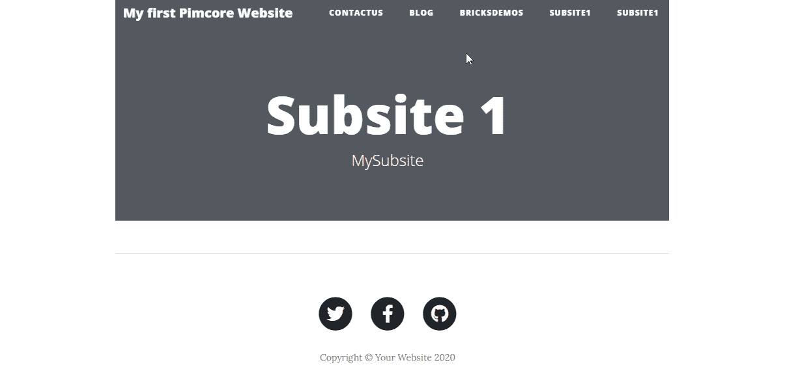
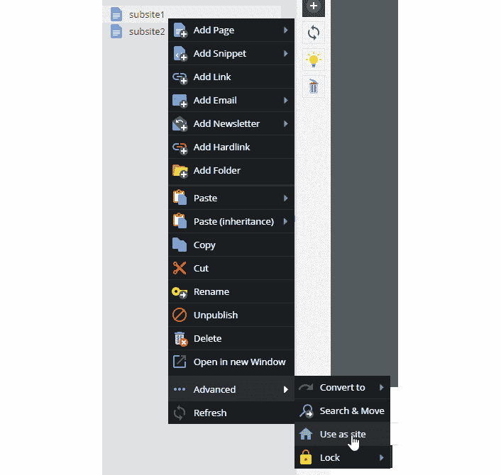
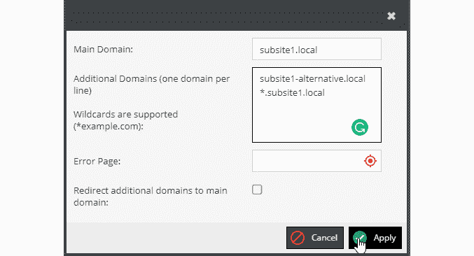
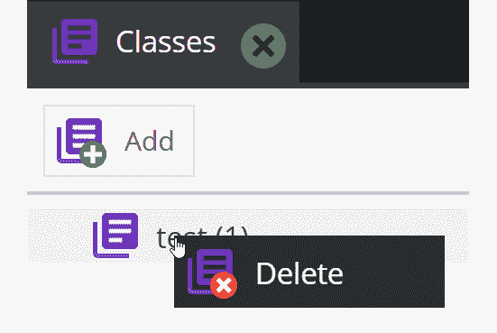
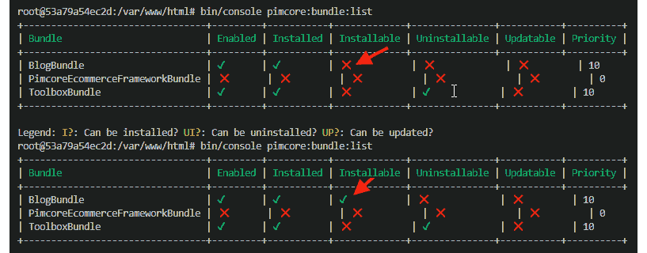
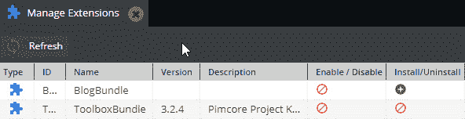
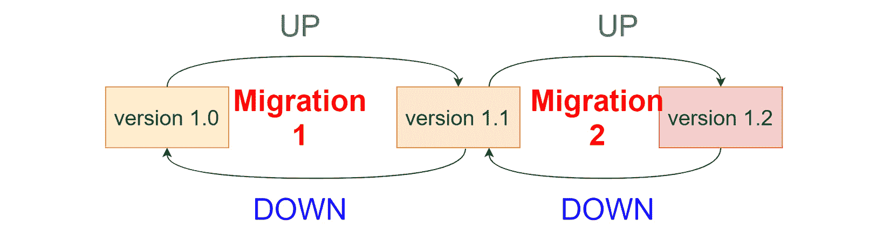

# *第十一章*：完成网站

在上一章中，我们使用 Pimcore 完成了博客的建设。得益于 CMS 和数据管理引擎的能力，我们能够实现创建自定义非结构化内容（网站的页面）和结构化内容（博客文章）等复杂目标。这是一段愉快的旅程，使我们能够自主实现任何类型的网站或门户。此外，我们可能还需要采取许多其他步骤来使我们的工作可重用、可扩展且易于部署。正如标题所述，在本章中，我们将学习如何最终完成我们的网站。

我们将涵盖的要点如下：

+   在 Pimcore 中创建多站

+   使捆绑包可安装

+   使用多环境配置

+   使用环境变量

# 技术要求

就像之前的章节一样，在我们的 GitHub 仓库中有一个演示，您可以在以下链接找到：[`github.com/PacktPublishing/Modernizing-Enterprise-CMS-using-Pimcore`](https://github.com/PacktPublishing/Modernizing-Enterprise-CMS-using-Pimcore)。

要运行与本章相关的演示，您只需克隆它并导航到`完整演示`文件夹以启动 Docker 环境。

要做到这一点，只需遵循以下说明：

1.  使用以下命令运行 Docker：

    ```php
    docker-compose up
    ```

1.  然后，为了在您的本地机器上恢复所有设置，请输入以下命令：

    ```php
    docker-compose exec php bash restore.sh
    ```

1.  导航到[`localhost/admin`](http://localhost/admin)并使用您的管理员/pimcore 凭据登录。

# 在 Pimcore 中创建多站

每次创建网站时，您都需要花费时间来创建环境、安装插件以及配置所有其他 Pimcore 设置。此外，我们还需要一个托管空间，这意味着额外的成本。这是我们每次创建网站时都必须进行的操作，但我们希望减少这种活动对每个网站创建的影响。

例如，考虑一个场景，一个客户有 10 个网站，可能每个品牌都有一个。考虑到如今每个公司都有的数字曝光度，这是一个合理的用例。即使我们可以创建一个可以用于迁移网站之间公共组件的捆绑包，拥有独立的网站仍然涉及额外的开销。从用户的角度来看，管理 10 个不同的网站是非常困难的。

对于这种常见情况，解决方案仍然是 Pimcore 本身。**多站**功能让我们能够在同一个实例中管理多个网站，降低托管成本，并在所有网站中使用相同的资源（主题、砖块、自定义代码）。借助云提供的扩展能力，我们预计不会出现服务器负载问题，并且我们可以无副作用地遵循这种方法。

为了覆盖您可能在与现实世界网站相关的所有可能情况，我们将实施一个测试案例，其中我们将网站树的一个分支转换为独立网站。这将使用户能够像浏览独立网站一样访问网页。这是让您能够在同一个 Pimcore 实例中管理多个网站（例如，`product1.mywebsite.com`和`product2.mywebsite.com`）以及网站别名（例如，`www.mywebsite.com`和`mywebsite.com`）的基本原则。

在下一个示例中，我们将创建一个名为**subsite1**的通用子站点，并使用与默认域名不同的域名使其可用。此外，我们将使用不同类型的域名映射来覆盖所有最常见的情况（地址、别名和通配符）：

1.  将文档添加到页面树中。命名为**subsite1**。页面的名称不会影响网站的行为。在我们的案例中，我们使用了完整的演示设置，并得到了以下截图所示的网页：

    图 11.1：用于测试的页面

1.  在树形菜单中导航，并在**subsite1**项上右键单击。然后点击**使用为站点**：

    图 11.2：用于将网页转换为网站的菜单

    如果您点击**使用为站点**按钮，将弹出一个窗口：

    

    图 11.3：配置网站的表单

1.  填写以下信息的表单：

    +   `subsite1.local`。

    +   `subsite1-alternative.local`和`*.subsite1.local`。这些值必须放在两行不同的地方。此设置适用于我们已选择的项及其所有子项。此配置告诉 Pimcore 使用我们在*步骤 2*中提升为站点的页面下的页面来处理请求。这意味着如果您导航到添加的域名之一，将提供此页面下的页面。因此，如果您导航到`subsite1.local`和`subsite1-alternative.local`，您将看到转换后的页面；如果您在域名内部查找路径（例如`subsite1.local/xxx`），将提供页面站点下具有相同相对路径的页面。对于`subsite1.local`的所有三级域名也是如此，例如`mysubsite.subsite1.local`，因为我们输入了通配符地址。

1.  编辑您的 hosts 文件以访问这些虚拟 URL。打开 hosts 文件并添加以下行：

    ```php
    127.0.0.1 subsite1.local
    127.0.0.1 subsite1-alternative.local
    127.0.0.1 test.subsite1.local
    ```

1.  请访问以下网址：[`subsite1.local`](http://subsite1.local), http://subiste1-alternative.local，以及[`test.subsite1.local`](http://test.subsite1.local)。您将始终得到相同的结果，这证明了多站点的配置良好。

在本节中，我们学习了如何将页面树的一部分转换为独立的网站。这对于托管多个网站和重用同一代码库的主题和组件非常有用。这对可重用代码非常有帮助，它可以与打包和共享源代码一起工作。在下一节中，我们将学习如何在包安装期间创建创建数据和设置的过程。

# 使包可安装

在*第十章**，创建 Pimcore 砖块*中，我们创建了一个包含所有资产的单一包，使其自包含且可移植。通过安装一个包来开始我们的下一个 Pimcore 项目意味着我们不必重新执行某些任务，这使得这是一个有吸引力的选项。无论如何，有一些步骤我们通过用户界面手动执行，现在必须复制。回想一下*第九章**，渲染数据*，它们是手动创建的，但你不想在创建每个新博客时重复这一步骤。即使你只花几分钟创建它们，也总有可能输入错误的字段名或出错；它们将你的 5 分钟任务变成一个小噩梦。

但不必担心！Pimcore 的安装系统允许你添加一个特殊类来管理安装过程。以下是一些常见的用例：

+   创建或更新类定义

+   输入种子数据（例如标准分类）

+   更新数据库模式（添加表、列、索引等）

+   导入翻译

安装器实际上是在安装包时 Pimcore 使用的类。

这个主题有两种不同的方法：

+   **安装器**：一个管理安装过程并赋予你自定义所有阶段（安装和卸载）的权限的类。

+   **迁移**：这一部分是为了管理数据库变更，并支持升级和降级选项。

让我们在下一节中探讨这两个选项。

## 安装器

当安装器处理初始配置时，迁移保持数据库更新。当你安装包时，将运行一个安装过程。然后，在每次包更新时，你可以对数据库应用一些更改以实现数据迁移。

安装器类可以继承自 `AbstractInstaller` 并具有以下结构：

```php
class MyInstaller extends AbstractInstaller
{    
    public function install()    {}
    public function uninstall()  {}
    public function isInstalled(){
        return true;
    }
    public function canBeInstalled(){
        return false;
    }
    public function canBeUninstalled(){
        return false;
    }
    public function needsReloadAfterInstall() {
        return false;
    }
```

`AbstractInstaller` 包含一个 `BufferedOutput` 实例，该实例与控制台工具和 Web UI 集成。这意味着如果你用它来记录日志，日志将会提示给用户。`BufferedOutput` 实例可以通过 `getOutput()` 方法访问。

现在我们将创建一个安装器，它可以自动安装与我们的项目相关的类。这非常简单，我们只需要完成以下步骤：

1.  创建一个包含一个或两个字段的类定义。命名为`test`。为了保持简单，类的复杂性对我们目标来说并不重要。如果你对如何创建类有疑问，只需查看*第五章**，探索类和对象*，其中涵盖了这一主题。

1.  通过点击类定义页面上的**导出**按钮下载类定义：

    图 11.4：类导出菜单栏

1.  现在在`/bundles/BlogBundle/Resources/install/`中创建一个名为`class_sources`的文件夹，最终路径为`/bundles/BlogBundle/Resources/install/class_sources`。

1.  将你导出的 JSON 文件复制到这个文件夹中。

1.  在你的包中创建一个名为`Setup`的文件夹，并在其中添加`BlogInstaller`类。内容应包括以下内容：

    ```php
    <?php
    namespace BlogBundle\Setup;
    ... usages
    class BlogInstaller  extends AbstractInstaller
    {    
    }
    ```

1.  现在我们必须注册安装器类，使其可用于依赖注入。将以下配置添加到`service.yml`文件中：

    ```php
    services:
        BlogBundle\Setup\BlogInstaller:
            public: true
            autowire: true
    ```

    现在依赖注入知道你的安装器，并且可以创建其实例。

1.  打开`BlogBundle.php`包文件，并添加以下方法：

    ```php
    public function getInstaller() {        
         return $this->container->get(
         BlogInstaller::class);      
    }       
    ```

    此函数将告诉 Pimcore 你的包有自己的安装器，并将使用它。当你安装你的包时，会发生什么，你的安装器的事件将被触发，你将能够做所有你需要的事情。在接下来的步骤中，我们将实现初始配置。

1.  下面的代码片段实现了类恢复，因此添加此函数（为了简洁，省略了日志和输出消息）：

    ```php
    public function install(){       
         $files = $this->getClassesToInstall();
         foreach ($files as $file) {
              $data = file_get_contents($file);
              $json= json_decode($data);
              $name= $json->id;
              $class = ClassDefinition::getById($name);
              if($class) continue; // do not overwrite
              $class = new ClassDefinition();
              $class->setName($json->id);
              $class->setId($json->id);
    Service::importClassDefinitionFromJson($class, $data, false, true);
         }
    }
    ```

    安装过程由几个简单的步骤组成。首先，我们读取文件系统，并获取`classes`文件夹中的所有文件（`files = $this->getClassesToInstall();`）。然后，对于每一个，我们检查类是否存在；如果不存在，我们创建并导入类。如果类存在并且我们用不同的定义覆盖它，我们可能会遇到数据丢失，我们不希望这样。

1.  下一个片段包含`getClassesToInstall`过程。将其复制到安装器类中：

    ```php
    protected function getClassesToInstall()
    {        
         $realpath = realpath(__DIR__."/../
         Resources/install/class_sources/");
         $files=glob($realpath.'/*.json');           
         return $files;
    }
    ```

    上述代码读取`class_sources`文件夹中的所有`*.json`文件，并将它们返回给调用者以进行安装。

1.  现在是时候测试包了。为了进行严格的测试，我们应该创建一个新的环境，将包移动到该环境，并对其进行测试。然而，这种方法需要时间和精力，并且对于本说明来说并不相关，因此我们将使用快捷方式。

    由于我们没有数据库迁移或不可逆的操作，我们将使用当前安装。第一个操作是删除你导出的类。这是强制性的，因为否则我们的程序将跳过创建（参见*步骤 7*）。你可以通过右键单击类名然后点击**删除**来完成此操作，如图所示：

    

    图 11.5：如何删除一个类

1.  现在我们必须通过告诉 Pimcore 我们的包是可安装的来欺骗它。为此，在安装类中实现`canBeInstalled`方法，返回`true`（这意味着“是的，它可以安装！”）。复制以下代码片段并将其粘贴到您的文件中：

    ```php
    public function canBeInstalled(){
            return true;
        } 
    ```

    下一个屏幕截图显示了方法实现前后的变化：

    

    图 11.6：比较更改标志前后的包设置

    前一个屏幕截图显示了当我们更改`canBeInstalled`方法时安装状态的变化。第一个标志矩阵是`pimcore:bundle:list`命令的输出，您可以看到该包被标记为不可安装。在安装类中的更改之后，可安装标志变为活动状态，Pimcore 将允许我们再次安装该包。

1.  最后，是时候测试包的安装器了。从命令行进入`bin/console pimcore:bundle:install BlogBundle`：

    图 11.7：扩展面板现在允许您再次安装包

    如您在前一个屏幕截图中所见，UI 中可用的选项反映了从控制台收集的信息。

1.  导航到类列表。您将在菜单中再次找到您删除的`test`类，因为它被安装过程重新创建：


图 11.8：创建的类

在本节中，我们介绍了安装过程的工作原理。在下一节中，我们将使用迁移来处理模式更新和数据播种。

## 迁移

迁移的目的是管理数据迁移和模式更新。如果您正在使用自定义数据库结构，这将非常有用。迁移的基本概念是它从一个现有版本开始，可以通过应用更改的增量来递增。可以通过实现回滚函数来撤销迁移。更具体地说，Pimcore 中的迁移是一个类实现，它有两个方法：up（应用更改）和 down（撤销更改）。

以下图表解释了迁移过程：



图 11.9：迁移过程

如您在前一个图中所见，更新后，版本 1.0 更新到 1.1，但如果进行回滚，down 方法将将其恢复到初始版本。

将管理迁移的能力添加到您的应用程序的第一步是为迁移文件映射一个文件夹到您的命名空间。为此，只需打开`/config/config.yml`文件并添加以下片段：

```php
doctrine_migrations:
      migrations_paths:
          'App\Migrations': 'src/Migrations'
```

上述代码片段将您的命名空间与相关文件夹映射。

创建迁移类时，最佳方法是调用`console`命令：

```php
bin/console doctrine:migrations:generate --namespace=App\\Migrations
```

前一个命令在主应用程序的迁移文件夹内创建了一个文件。每个版本都有一个生成的名称，例如 `/src/Migrations/Version20210227065641.php`，其中文件名的`Version`前缀后面跟着一个时间戳。

创建的文件看起来可能如下所示：

```php
<?php
namespace App\Migrations;
… uses
class Version20210227065641 extends AbstractMigration
{
    public function up(Schema $schema)    {
          //do things here
    }
    public function down(Schema $schema)    {
          //do things here
    }
} 
```

`Schema`对象是一个 doctrine 元素，它允许您操作数据库结构。以下示例显示了最重要的用例，例如创建一个表、添加字段和删除字段：

```php
        $table = $schema->createTable('foo');
        $table->addColumn('title', 'string');
        $table->addColumn('description', 'string');
        $schema->dropTable('foo');
```

重要提示

要全面了解`Schema`对象的功能，请查看 Symfony 文档：[`www.doctrine-project.org/projects/doctrine-dbal/en/latest/reference/schema-representation.html`](https://www.doctrine-project.org/projects/doctrine-dbal/en/latest/reference/schema-representation.html)。

在本节中，我们学习了如何创建一个安装程序来管理包的设置和数据迁移。当您想基于 Pimcore 创建一个可移植的包或产品时，这个主题非常有用。例如，考虑一个包含所有砖块和实用工具的包，您可以用它作为项目的基础。在下一节中，我们将介绍在同一个代码库中工作时的另一个重要主题。

# 使用多环境配置

在任何现代部署工作流程中，我们都有四个环境：`local`、`dev`、`test`和`production`。这些环境可能具有不同的配置和调整。您的生产环境可能需要在集群系统中面对大量的用户和沉重的负载，而您的本地环境只需与 RAM 的数量作斗争。我们看到的是，每个环境都有不同的需求，因此需要不同的配置。我们想要遵循的方法是保持所有数据在一个代码库中，并将所有设置放在同一个地方。如果您认为您将需要管理大量的文件和复杂的逻辑来切换它们，那您就错了。

幸运的是，Pimcore 基于 Symfony，并扩展了其非常强大的配置系统。Pimcore 原生支持`dev`、`test`和`prod`环境（而其他环境可以通过额外的配置添加）。要切换环境，您必须指定`PIMCORE_ENVIRONMENT`环境变量。由于我们的 Pimcore 实例运行在容器中，此设置对我们 PC 没有任何影响，因为配置仅限于容器。

一旦设置了变量，Pimcore 将按以下顺序加载文件：

1.  `config/pimcore/system_{env}.yml`

1.  `var/config/system_{env}.yml`

1.  `config/pimcore/system.yml`

1.  `var/config/system.yml`

配置文件可以包含其他配置文件并继承属性。全新 Pimcore 安装附带默认设置，`config.yml` 文件从 `dev` 到 `prod` 有增量配置（`prod` 包含 `test`，而 `test` 包含 `dev`）。这种机制对于共享设置并在需要时覆盖它们非常有用。

如果你省略了 `PIMCORE_ENVIRONMENT`，基础文件将按照以下升级顺序获取：

1.  `config/pimcore/system.yml`

1.  `var/config/system.yml`

当你在控制台运行 Pimcore 时，你可以将环境作为参数传递，如下例所示：

```php
./bin/console --env=dev ...
```

在 Pimcore 环境中，拥有不同的 Pimcore 配置以匹配我们将要工作的不同环境规格非常重要。顺便说一句，出于安全原因，并非所有配置都可以保存到设置文件中。在下一节中，我们将学习如何使用 Pimcore 安全地管理敏感数据，例如密码和 API 密钥。

# 使用环境变量

使用容器作为现代方法时，会大量使用环境变量将值注入应用程序。这种方法非常方便，因为它使你的应用程序对部署的环境无关。这个过程意味着配置的一部分是从应用程序代码外部拉取的。

将所有配置移出应用程序会使开发者对内部发生的一切一无所知，当出现问题时，这会在开发者和运维团队之间造成误解。你有你的本地代码，你可以看到它运行，但你将无法了解在生产环境中应用其他设置时可能会发生什么。通常，负责运维的人对配置背后的含义知之甚少，因为他们不是应用程序的专家，而且通常不是开发者。开发者知道应用程序是如何工作的，并且了解设置更改的影响，但他们对基础设施了解不多，无法对应用程序可能存在的问题进行测试以修复问题（他们没有访问生产环境的权限）。

在本节中，我们将解释一种解决方案，它可以保持生产设置的安全，在开发者和运维之间共享配置，并且易于使用 Pimcore 实现。一个好的折衷方案是将所有配置保留在源代码中，但在部署期间移除注入的敏感信息。将敏感信息与配置分开，让我们能够与整个团队共享设置，并使每个人都了解选择的配置，但不会使我们面临安全问题。这种方法创建了一个清晰的职责划分，并使我们的存储库更安全。这样，开发者了解每个环境的配置，而运维可以独立管理系统设置。

这个解决方案有积极的一面，即开发者可以在他们的本地 PC 上测试不同的配置（但不会访问生产系统），结果更可预测。但是，如何配置 Pimcore 将配置与敏感数据分开？在下一个示例中，我们将创建一个适用于所有环境但不会将敏感数据添加到源代码文件的配置。

## 使用环境变量管理数据库连接

我们的目标是拥有一个本地、测试和生产环境配置相同的 Pimcore 实例。所有配置都将存储在 `dev`、`test`、`prod` 文件夹中。我们想要以这种方式管理的配置项是配置字符串。我们将移除 Pimcore 的硬编码连接字符串，使其参数化。这些数据通常在 `config/local/database.yml` 文件中设置，并在第一次安装时由 Pimcore 生成；通常不会提交。由于我们使用的是 Docker 化环境，所有下载源代码的开发者都在单独的环境中本地工作，因此不存在共享此信息的问题。

我们现在可以开始在这些设置下工作了：

1.  删除或重命名 `database.yml` 文件（我们不再需要它了）。

1.  将以下代码添加到 `docker-compose.yml` 文件中。此配置将设置作为 `环境变量`：

    ```php
    services:
     …
      php:
       …
       environment: 
        - PIMCORE_ENVIRONMENT=dev
        - PIMCORE_HOST=db
        - PIMCORE_DB=pimcore
        - PIMCORE_USERNAME=pimcore
        - PIMCORE_PASSWORD=pimcore
        - PIMCORE_PORT=3306 
    ```

    下一个图显示了同一文件中 MySQL 设置的裸拷贝：

    ![图 11.10：容器之间的字段映射

    ![img/B17073_11_10.jpg]

    图 11.10：容器之间的字段映射

1.  现在我们必须告诉 Pimcore 使用此变量的配置。依赖链是 `config_prod.yml` 包含 `config_test.yml`，而 `config_dev.yml` 包含 `config.yml`。因此，将适当的配置添加到 `config` 或 `config_dev` 文件中，将使其对所有环境可用。

1.  打开 `config.yml` 文件。首先需要做的更改是禁用数据库配置的导入。只需注释掉以下行：

    ```php
    # - { resource: 'local/' } removed... it users environments now!
    ```

    禁用了 `local` 资源集的导入（否则，您只需删除 `database.yml` 文件）。

1.  然后将以下配置添加到文件中：

    ```php
    doctrine:
        dbal:
            connections:
                default:              
                    host: '%PIMCORE_HOST%'
                    port: '%PIMCORE_PORT%'
                    dbname: '%PIMCORE_DB%'
                    user: '%PIMCORE_USERNAME%' 
                    password: '%PIMCORE_PASSWORD%'
    parameters:
        PIMCORE_ENVIRONMENT: '%env(PIMCORE_ENVIRONMENT)%'
        PIMCORE_HOST:  '%env(PIMCORE_HOST)%'
        PIMCORE_DB:  '%env(PIMCORE_DB)%'
        PIMCORE_USERNAME:  '%env(PIMCORE_USERNAME)%'
        PIMCORE_PASSWORD:  '%env(PIMCORE_PASSWORD)%'
        PIMCORE_PORT: '%env(PIMCORE_PORT)%'
    ```

    配置与 `database.yml` 相同，但具有参数化。我们定义内部参数，从容器中导入环境变量。我们使用 1:1 映射，为参数重用相同的环境变量名称。这使得配置更容易阅读。

    然后我们在文件的 `doctrine\dbal\connection\default` 部分使用该参数。这确保 Pimcore 将激活一个与此配置的连接，使用获取值的参数来形成主机环境（在我们的情况下是 `docker-compose` 文件）。

    在这一步之后，我们将配置与数据完全解耦，因此我们可以分别设置它们。您可以提交任何配置（`dev`、`test`、`prod`），而不用担心有人会窃取敏感数据，在部署期间，正确的值将被注入到环境中（虚拟机或容器）。

1.  打开 Pimcore 并检查您是否可以登录。因为我们的更改是关于数据库的连接，如果我们能够登录，那么我们的新设置就成功了。

在本节中，我们学习了如何在 Pimcore 配置中管理敏感信息，以及如何创建变量而不复制设置。使用容器是一个有用的解决方案，因为容器可以被部署为独立的虚拟机、PC 或云服务，这意味着该解决方案涵盖了大多数用例。此外，将所有配置放在源代码中，使得开发人员可以访问，从而对平台在生产中的工作有更深入的了解。所有配置都可以轻松地在本地进行测试，然后提交。

# 摘要

在本章中，我们学习了 Pimcore 开发人员的一些重要细节，这对于最终完成我们的网站非常重要。

多站点配置允许我们仅使用一个 Pimcore 实例来管理公司的所有网站。这是一个节省时间和金钱的非常有趣的功能，只需使用一个 Pimcore 安装来管理所有公司网站。

安装程序赋予我们执行安装步骤以重新创建我们捆绑包所需配置的能力。我们可以创建数据资产并对它们进行更新。这意味着我们可以将我们的捆绑包安装到另一个 Pimcore 实例上，并添加捆绑包运行所需的所有类和数据。我们还学习了我们可以以低级别管理数据库更改。

多环境功能允许 UX 根据我们使用的环境指定不同的配置。这对于保持所有功能在一个代码库中非常有用。此外，我们还发现了配置强大的继承系统是如何工作的。

环境变量可以帮助使配置与环境无关，并且我们学习了如何从文件中移除敏感数据。

现在我们对 CMS 部分的旅程几乎完成，我们可以转向 Pimcore 开箱即用的企业解决方案。在下一章中，我们将学习如何正确地在 Pimcore 中收集和存储产品信息，并将信息传播到所有其他应用程序。这对于使公司能够将 Pimcore 用作 PIM 解决方案非常重要。
