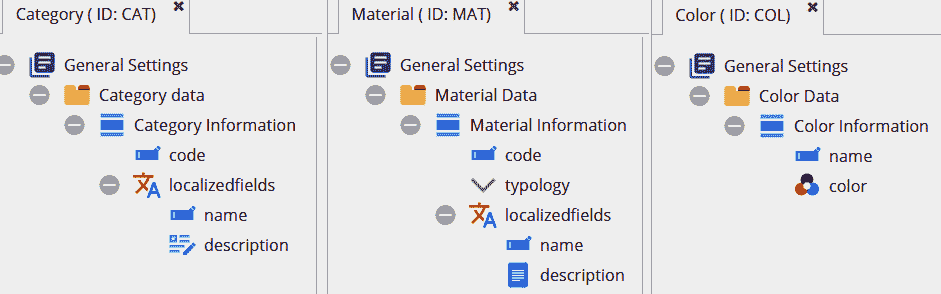

# *第十二章*：实施产品信息管理

在前面的章节中，你学习了在*第一章*，*介绍 Pimcore*中介绍的 Pimcore 环境的一些关键特性。特别是，在*第六章*，*使用数字资产管理*中，你发现了 Pimcore 的**数字资产管理（DAM）**特性和与图像及资产管理相关的所有方面。然后，在*第四章*，*在 Pimcore 中创建文档*和*第八章*，*创建自定义 CMS 页面*中，你学习了**内容管理系统（CMS）**的概念以及如何创建文档和网站页面。

在本章中，我们将深入探讨`产品`实体的概念。本章的组织结构如下：

+   什么是 PIM？

+   定义`产品`实体

+   创建产品变体

+   创建捆绑产品

+   管理不同的产品类型

+   与工作流程一起工作

从解释 PIM 系统是什么开始，我们将实现一个`产品`类的示例。在定义了类属性之后，你将学习如何创建产品变体和捆绑产品，以及如何使用 Objectbricks 管理不同的产品类型。在章节的最后部分，你将学习如何定义一个工作流程来逐步填写产品信息。

# 技术要求

正如你在前面的章节中所做的那样，你所需要做的就是运行与本章相关的演示，通过导航到官方书库的`12.` `实施` `产品` `信息` `管理`文件夹，并启动一个 Docker 环境。

要做到这一点，只需遵循以下说明：

1.  使用以下命令运行 Docker：

    ```php
    docker-compose up
    ```

1.  然后，为了恢复您本地机器上的所有设置，只需打开一个新的 shell，并输入以下命令：

    ```php
    docker-compose exec php bash restore.sh
    ```

1.  导航到[`localhost/admin`](http://localhost/admin)，并使用您的管理员/pimcore 凭据登录。

你可以通过以下链接访问官方书库以获取源代码：

[`github.com/PacktPublishing/Modernizing-Enterprise-CMS-using-Pimcore/tree/main/12.%20Implementing%20Product%20Information%20Management`](https://github.com/PacktPublishing/Modernizing-Enterprise-CMS-using-Pimcore/tree/main/12.%20Implementing%20Product%20Information%20Management)

现在，你已经准备好通过演示来探索与本章相关的所有方面。

# 什么是 PIM？

在*第一章*，*介绍 Pimcore*中，我们简要介绍了**产品信息管理（PIM）**的概念。在本节中，我们将更好地解释这个概念，我们将在本章的后续部分将其付诸实践。

PIM（产品信息管理）的概念涵盖了一系列技术和流程，这些技术和流程允许对产品数据进行集中管理，并在不同的渠道间进行分发。在许多常见的场景中，与产品相关的信息可能来自多个来源，这些信息可能具有不同的数据结构，这既是因为它们在不同渠道的需求不同，也是因为同一公司内部不同区域提供的技术不同。

使用 PIM 可以使您将来自不同来源的信息整合到一个单一平台上，并对其进行连贯的组织，同时有可能以不同的方式重新分配这些信息到电子商务平台、网站、纸质目录等。它还允许对产品数据进行全面和动态的管理，包括定制和过滤与不同类型产品相关的信息，以管理价格和货币、不同的计量单位、多语言翻译、多媒体内容等等。

能够将所有这些信息集中在一个平台上，使您能够完全独立于任何分销渠道管理产品；PIM 将负责向每个渠道发送所需的信息。这种集中化管理使产品信息保持一致性，避免了在不同平台上复制数据的需求，并保持它们的一致性，减少了设计错误。这也为任何目录、价格表和在线平台的管理成本带来了好处。

对于需要在不同平台和媒体上销售或展示其产品的公司来说，使用 PIM 是必不可少的，但同样对于需要在不同部门或开发领域共享与产品相关信息的企业场景也是必要的，始终保持此类信息的生产集中化。随着需要管理的产品数量增加，拥有 PIM 的需求也会增加，因为管理和维护数据成本会大幅降低，限制在单一平台上。

PIM 技术还使得将产品相关的信息与它们的多媒体内容管理相结合成为可能，并将此类内容发送到各种分销渠道。

所有关于 PIM 概念及其用法的这些方面都在以下图中进行了总结：

![Figure 12.1: PIM Architecture]

![Figure 12.01_B17073.jpg]

图 12.1：PIM 架构

如您在前面的图中所见，产品可以通过上传文件或实施特定的流程与其他软件或数据库建立集成，从而导入到 PIM 系统中。产品也可以直接在 PIM 环境中创建和丰富，通过**图形用户界面**（**GUI**）。

产品数据可以随后导出到电子商务或其他软件，或者正确地导出到文件中。在*第十四章*中，*数据集成*，你将学习在 Pimcore 中导入和导出产品的不同方法。

总结来说，在本节中，你学习了 PIM 的概念以及 PIM 系统在产品数据管理和分发方面的好处。在下一节中，我们将逐步构建`Product`实体，定义一个代表产品概念的 Pimcore 类。

# 定义产品实体

在前一节中，你学习了产品信息管理的概念。正如其名所示，在一个 PIM 系统中，创建一个代表产品的类是强制性的，这正是本节将要做的。

Pimcore 在产品概念方面没有设置任何约束，因此我们可以简单地创建一个名为`Product`的类，并定义所有反映我们需求的属性。所以，正如你在*第五章*中学习的，*探索对象和类*，只需通过`Product`即可。

如果你遵循了*技术要求*部分提供的说明，你应该找到一个已经定义好的`Product`类。请注意，这只是一个典型的产品概念示例，你可以根据你的需求添加或删除类属性。你可以在下面的屏幕截图中看到这个类的样子：

![Figure 12.2: 产品类

![img/Figure_12.02_B17073.jpg]

图 12.2：产品类

让我们描述前一个屏幕截图中显示的各种类组件。该类由五个面板组成，这些面板包围着代表产品常见概念的不同的属性，这些将在下面概述：

+   **产品信息**：在这个面板中，你可以找到**库存单位**（**SKU**），它是产品的唯一标识符以及产品价格。然后，我们添加了产品名称和描述作为本地化字段，以便你可以提供翻译。

+   `brand`属性是一个自定义的单选字段，具有常见的品牌作为选项；还有一个预定义的选项列表，可以选择产品制造的国家。最后一个属性是与另一个类的一个多对一关系，用于描述类别。

+   **组成**：在这个面板中，你可以找到一个高级的多对多关系组件，用于将产品与构成产品的材料相关联。在这个关系中，你可以设置各种材料的百分比来定义组成。

+   `color`和`size`。对于`color`属性，我们定义了一个与专用类的关系。

+   **图片**：正如其名所示，这个面板旨在包含产品图片。特别是，我们使用了一个**Fieldcollection**来管理未定义数量的图片。

为了完整性，在下面的屏幕截图中，你将看到其他类定义：



图 12.3：类定义

在前一个屏幕截图中，您可以看到`Category`、`Material`和`Color`类的定义。对于`Category`类，我们定义了一个唯一的`code`属性和几个本地化字段，称为`name`和`description`。`Material`类采用了相同的结构，并增加了一个字段来定义材料类型。对于`Color`类，增加了一个设置**十六进制**（**hex**）值的属性。

如前所述，您应该已经在本章*技术要求*部分的安装过程之后找到了这些类，但您可以在任何时间通过选择您可以在章节存储库的`src/classes`文件夹中找到的文件来导入它们，正如您在*第七章*中看到的，*管理 Pimcore 站点*。

如您在*第五章*中学习的，*探索对象和类*，您可以轻松进行数据录入以创建产品和其它实体。在下面的屏幕截图中，您可以看到创建的产品示例：


图 12.4：产品实体

如您在前一个屏幕截图中看到的，创建的产品的结构反映了类定义。为了更好地组织内容，各种类的对象被分到了相应的子文件夹中。

总结来说，在本节中，我们学习了如何定义`Product`实体。我们展示了一个产品概念的可能的实现，但这个概念在属性方面没有固定的定义，因此您可以选择创建更符合您需求的属性。除此之外，我们还定义了其他次要类来关联产品与其它概念，如类别、材料和颜色。这对于将此类信息与产品关联起来非常有用，无需在所有产品中重复它们。

在下一节中，您将学习如何创建产品变体以创建可配置产品。

# 创建产品变体

在上一节中，您已经了解了如何定义一个`Product`实体以及创建产品对象的示例。在本节中，您将学习如何为`Product`类启用继承以创建产品变体和定义可配置产品。在本节的后面部分，我们将看到一些**PHP：超文本预处理器**（**PHP**）代码示例，这些示例将展示如何在开发过程中实际使用变体。

要为`Product`类启用继承，打开类定义并选择**常规设置**根元素。您可以通过选择以下屏幕截图中看到的复选框来启用类继承并允许创建变体：


图 12.5：启用继承

如您在先前的屏幕截图中所见，可以启用以下三个复选框：

+   **允许继承**：如果勾选此属性，则允许以树状结构在对象之间进行继承。子对象可以是同一类的实例，也可能属于不同的类。

+   **允许变体**：如果勾选，则启用创建对象变体的可能性。变体定义是一种特定的继承。不能选择变体类，但强制类与父对象相同。

+   **在树中显示变体**：如果启用，此属性允许您在对象树中查看变体。

一旦您勾选了这些复选框，就必须单击**保存**按钮以应用更改。在为类启用变体后，可以为产品创建变体。要创建变体，只需在先前创建的产品上右键单击，选择**添加变体**，并输入变体名称。

在以下屏幕截图中，您将看到一个具有定义变体的可配置产品的示例：


图 12.6：产品变体示例

如您在先前的屏幕截图中所见，启用相应的属性可以让产品变体在对象树中显示。您可以通过树结构中的不同特定图标识别产品变体。

变体继承父对象的所有属性值，但在每个变体中都可以覆盖这些属性。在具体示例中，我们使用了`颜色`属性来创建具有不同变体的可配置产品。

现在您已经学会了如何在 Pimcore 界面中创建产品变体，让我们看看如何在代码中实际使用变体，通过查看一些编码示例。

变体方面的一个关键方面是对象**类型**。这是一个为所有类的对象定义的系统属性；此属性不能手动填写，但在创建元素时自动定义。有三种不同的对象类型，如下所述：

+   `文件夹`：当我们创建**数据对象**部分中的文件夹时，分配此类型。

+   `对象`：当我们创建类的对象实例时，分配此类型。

+   `变体`：当我们创建对象变体时，分配此类型。

在 Pimcore 中编码时，重要的是要知道，所有执行对象列表搜索的本地方法始终只考虑`文件夹`和`对象`类型，因此需要明确指定您想要检索变体。通过以下示例，我们将看到如何做到这一点。

## 父 PHP 类

在这个第一个示例中，您将学习如何为`Product`类创建父 PHP 类以及如何创建检索产品变体的方法。创建此类与变体概念没有直接关系，但它是一个值得发现的功能，可能在不同的场景中很有用。

如我们在*第五章*的*创建和编辑类定义*部分简要介绍的，在[*探索对象和类*]中，对于每个类，都有定义自定义父 PHP 类的可能性。这可以是任何直接或间接扩展`Pimcore\Model\DataObject\Concrete`类的 PHP 类。

`Concrete`类是一个 PHP 类，它是所有 Pimcore 类的原始扩展，并包含所有类的公共方法，例如`save`和`getById`操作，仅举两例。

在下面的代码片段中，您将看到一个定义了检索产品变体方法的`product`父类示例：

```php
<?php
namespace App\Model;
use Pimcore\Model\DataObject;
class AbstractProduct extends DataObject\Concrete
{
    /**
     * @return self[]
     */
    public function getVariants(){
        $variantType = self::OBJECT_TYPE_VARIANT; //variant
        $variants = $this->getChildren(array($variantType));
        return $variants;
    }
}
```

如您在前面的代码片段中所见，这个类扩展了之前提到的`Concrete`类。在这个类中，我们创建了一个`getVariants`方法，该方法调用原始的`getChildren`方法，并指定需要检索类型为`variant`的对象。这是必要的，因为我们之前提到，所有列表方法在未直接指定类型时，只考虑对象和文件夹。

一旦创建了 PHP 类，我们必须在`Product`类中正确设置相应的属性，如以下屏幕截图所示：

![Figure 12.7: 配置父 PHP 类

![img/Figure_12.07_B17073.jpg]

图 12.7：配置父 PHP 类

如您在前面的屏幕截图中所见，您可以在**父 PHP 类**输入框中写入完整的类命名空间。一旦填写完毕，您必须点击**保存**按钮以应用更改。

在定义了父 PHP 类之后，您可以为每个产品对象实例调用`getVariants`方法，如以下代码片段所示：

```php
<?php
    use Pimcore\Model\DataObject;
    $product = DataObject\Product::getById(1);
    $variants = $product->getVariants();
?>
```

在前面的代码片段中，您可以看到，由于`Product`类扩展了之前创建的`AbstractProduct`类，每个产品对象都可以使用定义的`getVariants`方法。

在本例中我们看到的`getChildre`n 方法只是对象列表的一个特例。在下面的例子中，我们将看到如何检索常见列表方法中的变体。

## 对象列表

在前面的例子中，我们看到了如何使用检索产品子对象的方法来检索特定产品的变体。在这个例子中，我们将看到如何在通用列表方法中检索变体。

在下面的代码片段中，您可以查看如何在列表查询中检索产品变体：

```php
<?php
    use Pimcore\Model\DataObject\Product;
    use Pimcore\Model\DataObject\AbstractObject;
    $list = new Product\Listing();
    $list->setObjectTypes([AbstractObject::OBJECT_TYPE_    VARIANT]);
    $variants = $list->load();
?>
```

在前面的代码片段中，您可以查看如何初始化产品列表。对于列表对象，有一个特定的方法来设置您想要检索的对象类型。这个方法就是您在前一个例子中看到的`getChildren`方法所使用的内部方法。`load`方法返回一个符合列表条件的对象数组。

在这两个第一个示例中，您已经学习了如何检索现有变体。在下面的示例中，您将看到如何创建一个新的变体。

## 创建新的变体

在前面的示例中，您学习了如何查询现有变体。在这个示例中，您将学习如何创建产品变体。

在下面的代码片段中，您将看到如何为现有产品创建一个变体：

```php
<?php
    use Pimcore\Model\DataObject\Product;
    use Pimcore\Model\DataObject\AbstractObject;
    $tshirt = Product::getByName("Classic T-Shirt", "en", 1);
    $orange = new Product();
    $orange->setKey("Orange");
    $orange->setParent($tshirt);
    $orange->setType(AbstractObject::OBJECT_TYPE_VARIANT);
    $orange->save();
?>
```

如您在前面的代码片段中所见，首先您必须获取产品对象。检索到的产品必须声明为新产品变体的父级。然后，必须显式设置产品类型以声明创建的产品是一个变体。

在示例中，您会注意到`getByName`方法的使用。这种类型的方法在类定义保存时自动为每个类属性生成。第一个参数是要搜索的值，第二个参数是本地化字段（必须搜索值的语言），第三个参数是限制参数。如果限制为 1，则返回单个对象；否则，返回类型是类列表的实例。

总结来说，在本节中，您学习了如何为`Product`类启用变体以及如何创建产品变体。然后，通过一些代码示例，您学习了如何检索现有变体以及如何创建新的变体。

在下一节中，您将学习如何创建捆绑产品以及如何创建一个在执行某些操作后触发事件的监听服务——例如，在产品保存时自动计算一个或多个产品字段值。

# 创建捆绑产品

在前面的章节中，您学习了如何启用和创建产品变体，以及如何在代码示例中实际使用它们。在本节中，您将学习如何定义捆绑产品。

在市场营销中，**产品捆绑**的概念是将一组单独的产品或服务作为一个组合产品或服务包一起提供。通常，捆绑产品旨在作为套件或更普遍地，一组协调一致的产品，如果一起购买而不是单独购买，则具有折扣价格的优势。

通过本章，我们将首先看到如何修改之前创建的`Product`类以定义捆绑产品。然后，我们将发现如何在产品保存后自动执行操作来计算捆绑价格。

## 定义捆绑产品

在本节中，您将学习如何修改`Product`类以能够定义捆绑产品。最简单的解决方案是创建一个与`Product`类自身相关的自引用关系属性。这将让您能够从之前创建的产品中选择将构成捆绑的产品。

要添加此属性，您需要执行以下操作：

1.  打开`Product`类定义。

1.  右键单击**产品信息**面板，然后选择**添加数据组件** | **关系** | **多对多对象关系**。

1.  将属性名称写为`bundle_products`，属性标题为`Bundle Products`。

1.  在`Product`类中。

1.  在`sku`和`name`中。

1.  点击**保存**按钮以应用更改。

在以下屏幕截图中，您可以看到这些操作后`Product`类应该是什么样子：


图 12.8：Bundle_Products 属性

如您在前一个屏幕截图中所见，新属性被添加到面板的底部，并且选定了所需的可见字段。

现在我们已经创建了此属性，我们可以创建一个捆绑产品。为此，只需创建一个新的产品对象，然后使用之前创建的关系属性选择几个将组成捆绑产品的产品。一旦选择了这些产品，它们将出现在关系中，如以下屏幕截图所示：


图 12.9：捆绑产品关系

如您在前一个屏幕截图中所见，只有之前选定的产品字段在关系属性中可见。

现在我们已经定义了组成我们捆绑产品的产品，我们可能希望根据所选产品的价格自动计算捆绑价格。因此，我们需要打开类定义并添加一个新的数值属性来存储捆绑价格，如以下屏幕截图所示：


图 12.10：捆绑价格属性

在前一个屏幕截图中，您可以看到此属性被标记为**不可编辑**，这意味着我们需要一个方法来计算捆绑价格。

总结来说，在本节中，您学习了如何修改`Product`类以定义捆绑产品。在下一节中，您将学习如何创建一个监听器类，该类监听由产品保存操作触发的事件，这将允许您自动计算捆绑价格。

## 创建事件监听器

在前一个章节中，您学习了如何定义捆绑产品。在常见场景中，捆绑产品的价格可能低于其组成的单个产品的总价。自动使用预定义的规则计算捆绑产品的价格可能很有用，而不是手动插入此值。

在本节中，您将学习如何创建一个事件监听器以捕获产品保存后触发的事件。对象的保存只是 Pimcore 中可以监听的事件之一，它包括对对象、资产和文档的所有**创建、读取、更新和删除**（**CRUD**）操作，对用户的操作，搜索或网格列表的打开，以及其他许多操作。

要创建一个事件监听器，你首先需要在`app/config/services.yml`文件中注册一个新的类，如下面的代码片段所示：

```php
services:
App\EventListener\DataObjectListener:
        tags:
            - { name: kernel.event_listener, event: pimcore.            dataobject.postUpdate, method: onObjectPostUpdate }
```

如前一个代码片段所示，可以通过添加类命名空间来定义一个新的服务。在`tags`属性中，我们必须定义我们的服务的一个或多个标签。每个标签由以下三个属性组成：

+   `名称`：标签的名称。我们必须提供`kernel.event_listener`固定值，以便服务能正确识别为事件监听器。

+   `事件`：用于指定我们想要监听的事件。在我们的例子中，我们感兴趣的是监听对象的`postUpdate`事件。正如其名所示，该事件在对象保存后触发。

+   `方法`：在这个属性中，我们必须放入我们的类中将被自动调用的方法名称。

对于事件监听器，每个定义的标签代表一个特定的事件，因此你必须为每个你希望你的服务监听的事件添加一个标签。

现在我们来看如何实现定义的服务来计算我们捆绑产品的价格。在下面的代码片段中，你会看到一个可能的实现：

```php
<?php
namespace App\EventListener;
use Pimcore\Event\Model\DataObjectEvent;
use Pimcore\Model\DataObject\Product;
class DataObjectListener 
{
    public function onObjectPostUpdate (DataObjectEvent $e) 
    {
        $obj = $e->getObject(); 
        if($obj instanceof Product)
        {
            $bundleProducts = $obj->getBundle_products();
            $currentPrice = $obj->getBundlePrice();
            if(count($bundleProducts) >0)
            {
                $bundlePrice = 0;
                foreach($bundleProducts as $product)
                {
                    $price = $product->getPrice()
                        ->getValue();
                    $bundlePrice += $price;
                }
                //substract the 20% of the sum
                $bundlePrice = round($bundlePrice*0.8,2);
                //Add this check to avoid circular saves
                if($bundlePrice != $currentPrice)
                {
                    $obj->setBundlePrice($bundlePrice);
                    $obj->save();
                }
            }
        }
    }
}
```

让我们分析前面的代码片段，以了解关键方面。首先，你可能注意到我们定义了一个名为`onObjectPostUpdate`的方法，这是在`services.yml`文件中定义的名称。

此方法将触发事件作为参数，并从该事件中提取触发事件的本身对象。正如你可能注意到的，只有当对象是产品时，我们才必须检查对象类以执行操作部分。

对于构成捆绑的每个产品，我们将产品价格相加，最后从这个总和减少 20%。请注意，这只是一个示例，你可以定义自己的规则。

为了避免产品保存时的循环，我们只在新的计算价格与之前的价格不同时保存产品。如果我们省略这个检查，对这个服务进行的保存操作将再次触发事件。

总结来说，在本节中，你了解了产品捆绑的概念以及如何通过添加允许你定义捆绑产品的属性来更改`Product`类。后来，你学习了如何创建事件监听器服务来捕获由对象操作（如产品保存）触发的事件。在提供的示例中，你看到了如何自动计算捆绑产品的价格。

在以下部分，你将学习如何扩展`Product`类来管理不同类型的产品，而无需为每个产品创建一个特定的类。

# 管理不同产品类型

在上一节中，你学习了如何定义捆绑产品。在本节中，你将学习如何管理不同类型的产品，而无需为每种产品类型创建一个不同的类。如果你需要管理一个异构的产品集，例如衬衫和鞋子，你可能需要特定的属性来更好地表示这些概念。

当然，我们可以为衬衫和鞋子创建两个不同的类，但我们需要为这两个类定义冗余字段来描述它们之间共享的属性——例如，标题、价格、描述等。

在*第五章*，“探索对象和类”，我们介绍了**Objectbricks**的概念。使用 Objectbricks，我们只需要创建一些属性的小集合来描述特定的字段，并允许我们的类动态地添加这些砖块。正如其名所示，类对象可以由一个或多个添加到公共属性中的砖块组成。

在创建 Objectbrick 定义之前，我们需要在`Product`类中创建一个属性来容纳各种砖块。要创建此属性，只需在类定义内部右键单击面板组件，然后选择**添加数据组件** | **结构化** | **Objectbricks**，填写属性名称，然后单击**保存**按钮以应用更改。在下面的屏幕截图中，你可以看到一个示例：


图 12.11：Objectbricks 属性

如前一个屏幕截图所示，我们已创建了一个**Objectbricks**类型的属性。作为一个可选属性，我们可以设置每个对象可以附加的最大砖块数。

现在我们已经在`Product`类中定义了属性，我们可以定义一个或多个 Objectbricks。要做到这一点，只需通过**设置** | **数据对象 | Objectbricks**。要添加新的 Objectbricks 定义，只需单击**添加**按钮，写下你的砖块名称，然后单击**确定**按钮。在下面的屏幕截图中，你可以看到一个创建的 Objectbrick 的示例：


图 12.12：Objectbrick 定义

如前一个屏幕截图所示，Objectbricks 定义面板与类创建面板相同。此外，对于 Objectbricks，我们可以选择要附加 Objectbrick 的类和特定属性。在这个例子中，我们将 Objectbrick 附加到了`Product`类，并选择了之前创建的属性。

一旦定义了 Objectbricks，我们就可以将它们附加到产品对象上。在下面的屏幕截图中，你可以看到 Objectbrick 在产品对象中的样子：


图 12.13：Objectbrick 实例

如前一个截图所示，在产品对象中，Objectbricks 以一个特定的部分出现。由于已达到定义的限制，您可以给每个对象附加一个或多个 Objectbricks，并且每种类型的 Objectbrick 都可以在同一对象中附加一次。

总结来说，在本节中，您学习了如何使用 Objectbricks 管理不同类型的产品。Objectbricks 可以被视为可以附加到类上以扩展类概念的属性子集。例如，对于 `Product` 类，我们可以考虑为衬衫、鞋子等创建特定的属性。

在下一节中，您将学习如何配置一个工作流，这将让您逐步控制产品信息的完整性。

# 与工作流一起工作

工作流由一系列代表达到共同目标必须完成的工作的过程和任务组成。通常，我们可能会将工作流视为一个图。

Pimcore 工作流管理提供了对资产、文档、数据对象上的多个工作流的配置，以支持数据维护过程、元素生命周期以及各种其他过程。Pimcore 工作流基于 Symfony 工作流组件，并扩展了其特定功能。在开始配置 Pimcore 工作流之前，让我们描述以下 Symfony 工作流组件的基本概念：

1.  **工作流类型 'Workflow'**：这是默认的工作流类型，允许您建模一个作为 Petri 网子类的工作流网。对于此类工作流，一个元素可以在工作流的几个状态中同时存在。

1.  **工作流类型 '状态机'**：状态机是工作流的一个子集，其目的是保持模型的状态。状态机不能同时在多个地方存在。

1.  **位置**：位置是工作流中的一个步骤，描述了元素的特征或状态。根据位置，元素可能出现在特定的视图中——例如，仅关注翻译。在下一节中，我们将探讨如何为 Pimcore 类创建自定义布局。

1.  **标记存储**：标记存储存储每个元素的当前位置（s）。

1.  **过渡**：过渡描述了从一处移动到另一处所执行的操作。过渡可能允许或不允许，这取决于额外的标准，并且可能需要用户输入的额外注释和信息。

1.  **过渡守卫**：定义了一个标准，用于确定是否允许当前进行过渡。

通过阅读以下章节，您将学习如何正确配置 Pimcore 工作流。我们将首先定义 `Product` 类的定制布局，然后我们将看到如何设置一个将指导产品信息完成的工作流。

## 配置自定义布局

如前所述，在工作流程的各个地方，我们可以为元素显示自定义视图。这是通过在相应的类上配置自定义布局来实现的。

要创建自定义布局，只需打开类定义并点击**配置自定义布局**按钮。当点击该按钮时，将打开一个新的对话框，您可以在其中添加一个新的自定义布局或加载之前创建的一个。要创建新布局，只需点击**添加**按钮。在将打开的对话框中，您可以写下新的布局名称和**标识符**（**ID**），如以下屏幕截图所示：


图 12.14：创建自定义布局

如您在前面的屏幕截图中所见，要添加新的自定义布局，只需填写**名称**和**唯一标识符**字段，然后点击**确定**按钮进行确认。

一旦您初始化了自定义布局，您就可以指定您想在布局中显示哪些属性。在以下屏幕截图中，您可以查看如何进行此配置：


图 12.15：自定义布局配置

如您在前面的屏幕截图中所见，配置对话框由两个主要面板组成。在左侧面板中，您将找到之前定义的类结构，而在右侧面板中，您可以从左侧面板拖放您想在自定义布局中显示的属性。

对于每个属性，您可以决定更改一些属性，例如是否可以编辑该属性本身。一旦您配置了自定义布局，您就可以点击**保存**按钮来应用更改。

现在您已经看到了如何配置自定义布局，让我们看看如何在工作流程配置中使用它们。

## 配置 Pimcore 工作流程

在上一节中，您学习了如何为 Pimcore 类配置自定义布局。在本节中，您将学习如何配置 Pimcore 工作流程以及如何使用之前创建的自定义布局。

与许多其他服务一样，Pimcore 工作流程必须在 Pimcore 项目的`config.yaml`文件或特定包的相同文件中定义。在本节中，您将学习如何正确配置工作流程。

在下面的代码片段中，您将看到如何初始化工作流程配置：

```php
pimcore:
    workflows:
        product_workflow:
            label: 'Product Workflow'
            type: 'state_machine'
            supports:
                - 'Pimcore\Model\DataObject\Product'
            marking_store:
                type: single_state
                arguments:
                    - marking
```

如您在前面的代码片段中所见，要初始化工作流程，您必须在`pimcore`关键字下添加`workflows`关键字。然后，您必须为工作流程添加一个唯一的 ID，在我们的例子中是`product_workflow`。

在较低级别，您可以定义一些参数，这些参数在此提供：

1.  `label`：工作流程标题。

1.  `type`：工作流程类型，可以是`workflow`或`state_machine`，如章节介绍中所述。

1.  `supports`：工作流程应用到的一个或多个类。

1.  `marking_store`：对于`state_machine`工作流程，您可以指定必须使用类的哪个属性来存储工作流程状态。如果该属性是选择列表属性，您可以通过定义选项提供者，通过读取工作流程状态来让类动态创建选择列表选项，就像您在下面的屏幕截图中所看到的那样：


图 12.16：工作流程状态选项提供者

正如您在之前的屏幕截图中所看到的那样，您可以填写`places`关键字，就像您在下面的代码片段中所看到的那样：

```php
pimcore:
    workflows:
        product_workflow:
            places:
                base_data:
                    label: 'Base Data'
                    color: '#ffd700'
                    permissions:
                        - objectLayout: basedata
```

正如您在之前的代码片段中所看到的那样，您可以在`places`关键字后面添加一个或多个状态。对于每个状态，您必须指定一个唯一的 ID 并定义一个标签和颜色，该颜色将用于突出显示标签文本。如果您想限制特定状态的可见类属性，您可以在`permissions`关键字后面的`objectLayout`关键字中指定一个先前定义的自定义布局。

工作流程配置的最后一步是定义不同状态之间的过渡。您可以在下面的代码片段中查看如何定义过渡：

```php
pimcore:
    workflows:
        product_workflow:
            transitions:
                product_images:
                    from: [ translations, enrichment ]
                    to: images
                    guard: subject.checkTranslationsCompleted()
                    options:
                        label: 'Edit Images'
                        notes:
                            commentEnabled: true
                            commentRequired: false
                        iconClass: 'pimcore_icon_image'
```

正如您在之前的代码片段中所看到的那样，过渡必须在`transitions`关键字后面定义。对于每个过渡，您必须定义一个唯一的 ID；然后，您必须指定一个或多个起始状态和一个目标状态。在下面的屏幕截图中，您可以查看如何调用过渡：


图 12.17：调用工作流程过渡

正如您在之前的屏幕截图中所看到的那样，一个分组按钮会自动注入到对象编辑器中，以便您选择可用的过渡。

如果需要，您还可以指定一个`guard`函数，当工作流程放置在`from`状态之一时，该函数会自动调用。如果`guard`函数未通过，则无法应用过渡并移动到目标状态。在这个特定示例中，您可以让用户在过渡完成后仅编辑图像。过渡守卫必须是对象的一个函数，因此最好的解决方案是在本章*创建产品变体*部分提到的父 PHP 类中创建此函数。

可选地，您还可以在过渡上指定一些额外选项，例如为过渡设置自定义图标或让用户在调用过渡时写下注释，就像您在下面的屏幕截图中所看到的那样：


图 12.18：过渡说明

正如您在之前的屏幕截图中所看到的那样，当用户点击过渡操作时，会打开一个模态窗口，用户可以写下将被存储在对象内部的**笔记与事件**部分的注释，然后点击**执行操作**按钮来完成过渡。

总结来说，在本节中，你学习了如何配置 Pimcore 工作流。通过定义自定义布局，你可以强制用户逐步填写产品信息，以确保数据完整性。特别是，你学习了如何定义工作流的位置以及如何配置工作流转换。

# 摘要

在本章中，你了解了`Product`实体的概念，并通过实际示例进行了介绍。在章节的第一部分，你学习了 PIM 是什么以及它的主要特性。然后，你学习了如何根据你的需求创建和配置`Product`类。

在定义了`Product`类之后，你学习了如何为该类启用继承以及如何为现有产品定义产品变体。通过实际代码示例，你还学习了如何在列表中检索变体以及如何创建新的产品变体。

在本章的后面部分，你学习了产品捆绑的概念以及如何向`Product`类添加新字段以定义捆绑产品。然后，你学习了如何创建事件监听服务来监听由对象触发的事件——例如，当产品被保存时。特别是，你看到了一个代码示例，展示了如何计算捆绑产品的价格。

之后，你学习了如何使用 Objectbricks 扩展`Product`类，附加一组有助于定义特定概念的属性。如果你想要表示不同种类的产品而不为每种产品创建一个类，以避免常见属性的冗余，这非常有用。

在最后一节中，你学习了如何为 Pimcore 类配置自定义布局以及如何在 Pimcore 工作流配置中使用它们。通过一个具体示例，你学习了如何配置一个工作流以逐步填写产品信息。

在下一章中，你将学习如何通过 Pimcore Datahub 捆绑将产品和其他实体暴露给外部，以及如何将 Pimcore 转变为**主数据管理**（**MDM**）平台。
