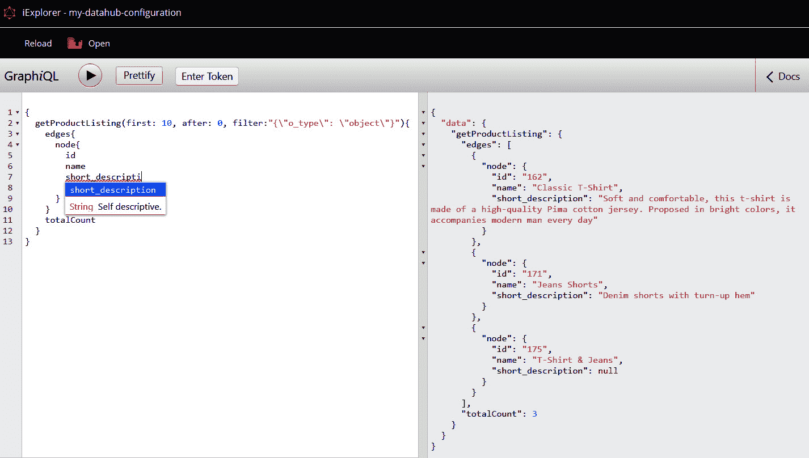

# *第十三章*：实施主数据管理

在上一章中，您学习了 **产品信息管理**（PIM）的概念，以及如何正确创建 Pimcore 类来表示产品。通过一些编码示例，您学习了如何创建产品变体和捆绑产品，以及如何通过扩展定义的类使用 Objectbricks 来定义不同类型的产品。

在本章中，我们将介绍 **主数据管理**（MDM）的概念，以及如何使用 **Datahub** Pimcore 扩展将 Pimcore 对象暴露给第三方应用程序。本章的组织结构如下：

+   将 Pimcore 转换为 MDM

+   激活 Pimcore Datahub 扩展包

+   暴露实体

+   使用突变查询

+   创建自定义突变

+   定义自定义报告

从 **主数据管理**的定义开始，我们将看到如何将 Pimcore 转换为 MDM。然后，我们将介绍 Pimcore Datahub 扩展包并解释如何安装它。之后，我们将看到如何暴露创建的对象，如何使用突变查询创建新对象，以及如何创建自定义突变。最后但同样重要的是，我们将看到如何定义自定义报告。

# 技术要求

如您在之前的章节中所做的那样，要运行与本章相关的演示，您只需导航到官方书籍仓库中的 `13\. 实施主数据管理` 文件夹并启动 Docker 环境。

要这样做，只需遵循以下说明：

1.  使用以下命令运行 Docker：

    ```php
    docker-compose up
    ```

1.  然后，为了恢复您本地机器上的所有设置，只需打开一个新的 shell 并输入以下命令：

    ```php
    docker-compose exec php bash restore.sh
    ```

1.  导航到 http://localhost/admin 并使用您的 admin/pimcore 凭据登录。

您可以通过以下链接访问官方书籍仓库以获取源代码：

[`github.com/PacktPublishing/Modernizing-Enterprise-CMS-using-Pimcore/tree/main/13.%20Implementing%20Master%20Data%20Management`](https://github.com/PacktPublishing/Modernizing-Enterprise-CMS-using-Pimcore/tree/main/13.%20Implementing%20Master%20Data%20Management)

现在，您已经准备好导航演示，以发现与本章相关的所有方面。

# 将 Pimcore 转换为 MDM

在 *第一章*，*介绍 Pimcore* 中，我们简要介绍了主数据管理（MDM）的概念。MDM 是一个基本流程，用于根据公司的销售、营销和运营策略来管理、集中、组织、分类、定位、同步和丰富关键数据。在本节中，我们将更好地解释这个概念，以便您了解如何轻松地将前几章的学习应用到将 Pimcore 转换为 MDM 系统中。

我们已经在 *第十二章*，*实施产品信息管理* 中看到了 Pimcore 在数据管理方面的潜力，但它有一个很大的限制：它与产品的概念紧密相关。

在许多公司场景中，产品并不是唯一需要通过公司用户定义、管理和共享，或在不同渠道分发的数据类型。例如，如果我们从电子商务的角度来考虑，我们可能希望存储订单和客户信息，或者定义我们实体店铺的详细信息，以便在电子商务网站上创建一个店铺定位页面。

为了提供一个完全不同的例子，*第九章*，*配置实体和渲染数据*中创建的类，用于存储文章和分类，在某种意义上可以被视为 MDM 的可能实现。

话虽如此，我们将 Pimcore 转变为 MDM 系统的第一步是创建一个代表每个概念的类，我们可以通过 Pimcore 类定义界面轻松地做到这一点。仅此还不够，但想想通过即插即用的界面创建 Pimcore 类是多么容易，正如你在*第五章*，*探索对象和类*中学习到的，以及这如何在不写一行代码的情况下产生一个强大且易于维护的结构。

由于你已经在上一章中学习了如何创建 Pimcore 类，所以我们不会在本章中重复这个过程。如果你遵循了*技术要求*部分提供的说明，你应该会找到一些已经定义好的类。

一旦定义了结构，我们就可以利用 Pimcore 的潜力来实现数据管理流程，其中我们可以引用以下内容：

+   **数据验证**：对于类属性，我们可以定义一些验证规则——例如，我们可以决定每个属性是否对类是必需的，对于文本属性，我们可以添加一个正则表达式来验证内容。这可能很有用，但它不允许定义复杂的验证场景，例如（例如）跨属性验证。这可以通过实现事件监听器来完成，正如你在上一章中学到的。

+   **数据质量**：数据质量包括一组工具和流程，用于为我们提供数据的质量和数量一致性——例如，我们可能想检查我们的对象翻译是否完整。我们可以通过创建特定类型的属性来实现这一点，这些属性是**计算值**和**动态文本标签**属性（我们将在下一节中看到这些属性的示例）。

+   **版本控制**：PIM、DAM 和 MDM 的主要特征之一是共享对象的可能性。任何具有写权限的用户都可以编辑产品和其它对象，不同的用户可能访问并保存相同的对象。因此，跟踪对象版本以清楚地了解哪个用户进行了更改是很重要的。

现在我们已经定义了 MDM 系统的主要特征，让我们看看一个数据质量实现的例子。

## 实现数据质量

在前节中，我们介绍了主数据管理的定义，并学习了 MDM 系统的主要特征。

在本节中，通过一个示例，我们将看到如何实现**数据质量**。正如我们在前节中提到的，我们可以使用两种不同的属性来完成这项工作，即**计算值**和**动态文本标签**属性。

这些特定的属性需要开发一个**PHP：超文本预处理器**（**PHP**）类，其方法在对象打开时自动调用。一旦这个类开发完成，我们必须在属性配置中写入类命名空间，如下面的截图所示：


图 13.1：计算值配置

如前一个截图所示，我们可以在属性配置中将类命名空间放入**计算器类**输入框中。一旦输入完成，你可以点击**保存**按钮将更改应用到类上。同样的配置也可以应用于**动态文本标签**属性。

现在我们已经看到了如何配置属性，在接下来的代码片段中，我们将看到如何实现`Calculator`类：

```php
<?php
namespace App\CalculatedValue;
use Pimcore\Model\DataObject\ClassDefinition\CalculatorClassInterface;
use Pimcore\Model\DataObject\Concrete;
use Pimcore\Model\DataObject\Data\CalculatedValue;
use Pimcore\Model\DataObject\Product;
use Pimcore\Tool;
class DataQualityCalculator implements CalculatorClassInterface
{
    public function compute(Concrete $object, CalculatedValue     $context): string
    {
        return $this->getCalculatedValueForEditMode($object,         $context);
    }
    public function getCalculatedValueForEditMode(Concrete     $object, CalculatedValue $context): string
    {
        if ($object instanceof Product) {
            $language = $context->getPosition();
            if(empty($object->getName($language)) 
                || empty($object->getShort_                description($language))
                || empty($object->getDescription($language))){
                return "no";
            }
            return "yes";
        }
        return '';
    }
}
```

在前面的代码片段中，你可以看到如何实现一个适合`CalculatorClassInterface`接口的 PHP 类，这涉及到实现以下两个方法：

+   在对象保存时调用`compute`方法，以将计算值存储在数据库中。

+   `getCalculatedValueForEditMode`方法被调用以在对象编辑模态中显示值。

这两个函数通常预期返回相同的值，因此最佳实践是让一个函数返回另一个函数的值，以避免代码重复。

这些函数接受对象实例和包含有用信息的属性上下文作为输入，例如`fieldname`属性。对于本地化字段，当前语言定义在上下文的`position`属性中。

在这个特定示例中，我们首先检查对象是否是产品，这是我们为它设置了**计算值**属性的那个类。然后，我们检查对于每种语言，所有本地化字段是否都为空。

在下面的代码片段中，我们将看到如何实现渲染动态文本标签所需的方法：

```php
<?php
namespace App\CalculatedValue;
use Pimcore\Model\DataObject\ClassDefinition\Layout\DynamicTextLabelInterface;
use Pimcore\Model\DataObject\Concrete;
use Pimcore\Model\DataObject\Data\CalculatedValue;
use Pimcore\Model\DataObject\Product;
use Pimcore\Tool;
class DataQualityCalculator implements DynamicTextLabelInterface
{
    public function renderLayoutText($data, $object, $params)
    {
        if ($object instanceof Product) {
            $htmlTable = '<table style="border: 1px solid             black">';
            $htmlTable .= '<thead><tr>
<td style="border: 1px solid black">Language</td>
<td style="border: 1px solid black">Translation Status</td>
</tr></thead>';
            foreach (Tool::getValidLanguages() as $language) {
                $htmlTable .= '<tr>';
                $htmlTable .= '<td style="border: 1px solid                 black">'.$language.'</td>';
                $htmlTable .= '<td style="border: 1px solid                 black">'.($object-                >getTranslationCompleted($language) == "yes" ?                 "completed" : "not completed").'</td>';
                $htmlTable .= '</tr>';
            }
            $htmlTable .= '</table>';
            return "<h2 style='margin-top: 0'>Translations             Summary</h2>" . $htmlTable;
        }
        return '';
    }
}
```

如前一个代码片段所示，该类与之前创建的类相似。为了渲染动态文本标签，该类必须实现`DynamicTextLabelInterface`接口。该接口提供了`renderLayoutText`方法，我们必须实现它。

在`renderLayoutText`方法中，我们可以返回将在标签中渲染的**超文本标记语言**（**HTML**）文本。在这个特定示例中，我们实现了一个简单的 HTML 表格，显示了每种语言本地化字段是否已完成，使用了之前创建的计算值。

在以下屏幕截图中，您可以查看这些属性的外观：


图 13.2：计算值结果

如您在上一张屏幕截图中所见，动态文本标签显示了每种语言的完整性状态，而计算值显示了所选语言字段是否已完成。

总结来说，在本节中，您了解了**主数据管理**（**MDM**）的概念，以及如何利用 Pimcore 潜力来实现数据管理流程，将 Pimcore 转变为 MDM 系统。稍后，您学习了如何实现计算值以实现数据质量。

在下一节中，您将学习如何激活 Pimcore Datahub Bundle，该 Bundle 可用于将 Pimcore 对象公开给第三方应用程序。

# 激活 Pimcore Datahub Bundle

在上一节中，您学习了如何实现数据管理流程，如数据质量流程。这些流程，名称？不清楚，是 MDM 概念的关键方面。MDM 系统的另一个基本功能是向第三方应用程序和站点公开实体。

在本节中，您将学习如何激活 Pimcore **Datahub** Bundle，以及如何正确配置该 Bundle。在本章的后面部分，您将学习如何使用此 Bundle 公开 Pimcore 对象，并允许外部应用程序创建新对象。

如您在*第七章*的*“安装 Bundle”*部分所学的，*管理 Pimcore 站点*，Pimcore Bundle 可以通过`composer`包管理器下载；要下载 Datahub Bundle，您只需遵循以下说明：

1.  打开一个 shell 并指向书籍源代码的章节文件夹。

1.  运行以下命令以进入 Docker 容器：

    ```php
    docker-compose php bash
    ```

1.  运行以下命令以下载 Datahub Bundle：

    ```php
    composer require pimcore/data-hub
    ```

下载完 Bundle 后，必须启用并安装才能使用。您可以通过**工具** | **Bundle**菜单来完成此操作，如下面的屏幕截图所示：


图 13.3：Datahub Bundle 安装

如您在上一张屏幕截图中所见，必须首先启用 Datahub Bundle，然后才能安装。Bundle 的安装将在数据库结构内部创建额外的表。

这些操作可以通过以下 Bash 命令以不同的方式完成：

```php
php bin/console pimcore:bundle:enablePimcoreDatahubBundle
php bin/console pimcore:bundle:installPimcoreDatahubBundle
```

请注意，运行这些命令只是通过扩展管理器界面进行的操作的一个替代方案；应只使用一种方法。

现在你已经学会了如何安装 Datahub 包，让我们看看如何创建 Datahub 配置模型。

## 创建 Datahub 配置

在前面的章节中，你学习了如何安装和激活 Pimcore Datahub 包。在本节中，你将学习如何为 Datahub 创建配置。这些配置将决定第三方应用程序如何与 Pimcore 交互以检索、创建或更新对象。

要打开 Datahub 配置面板，只需在 Pimcore 菜单中通过 **Settings**（设置）| **Datahub Config**（Datahub 配置）进行。要创建新的配置，只需遵循以下说明：

1.  点击 **Add Configuration**（添加配置）按钮。

1.  在出现的窗口中写下配置名称。

1.  点击 **OK** 按钮以确认创建。

在下面的屏幕截图中，你可以看到前述指令的表示：


图 13.4：创建 Datahub 配置

如前一个屏幕截图所示，一旦配置创建完成，它就会在左侧菜单中可见。如果您点击创建的配置，配置将以编辑模式打开。配置的设置可以通过三个不同的面板进行，正如我们即将看到的。

**General**（通用）面板包含有关配置的一般信息，例如配置名称。我们可以在下面的屏幕截图中看到这个面板的样子：


图 13.5：通用面板

现在我们将描述在前面的屏幕截图中看到的每个属性，如下所述：

+   **Active**: 如果启用，配置是激活的，并且可以被外部应用程序访问。

+   **Type**: 配置类型。在当前版本中，只有 GraphQL 类型存在。

+   **Name**: 配置名称，在配置创建期间定义。这可能无法更改。

+   **Description**: 这允许你为配置编写文本描述。

+   **SQL Condition**: 在这个属性中，你可以添加一个 **Structured Query Language**（结构化查询语言，SQL）条件，该条件将用于对所有查询进行预过滤。

在 **Schema Definition**（模式定义）面板中，我们可以定义哪些类被启用用于查询和突变。我们可以在下面的屏幕截图中看到这个面板的样子：


图 13.6：Schema Definition 面板

现在我们将描述在前面的屏幕截图中看到的每个属性，如下所述：

+   **Query Schema**: 在这个部分，我们可以选择一个或多个类，其中包含可用于查询的对象。对于每个选定的类，可以定义在查询中必须公开哪些属性。我们将在 *Exposing entities*（公开实体）部分看到这个概念。

+   **突变模式**：类似于 **查询模式** 部分，在本节中我们可以选择可能用于突变查询的类。对于每个类，我们可以定义是否可以创建、更新和删除对象。我们将在本章后面的 *使用突变查询* 部分了解更多关于突变查询的内容。

+   **通用类型**：在这里，我们可以定义是否必须公开资产、文档和文件夹以进行查询和突变。例如，如果我们为对象文件夹启用 **读取** 选项，我们就可以检索一个文件夹中包含的所有对象。

在 **安全定义** 面板中，我们可以管理身份验证规则并限制实体对特定文件夹的可见性。我们可以在以下屏幕截图中看到这个面板的外观：

![图 13.7：安全定义面板]

![img/Figure_13.07_B17073.jpg]

图 13.7：安全定义面板

现在让我们描述在前面的屏幕截图中看到的每个属性，如下所示：

+   **方法**：身份验证方法。在当前版本中，只有通过 **应用程序编程接口**（**API**）密钥进行身份验证的方式可用。

+   **Datahub API 密钥**：用于身份验证所需的 API 密钥。可以通过点击右侧的闪电图标来生成。

+   **跳过权限检查**：如果启用，则在执行突变查询时将跳过对必填字段的完整性的检查。

+   **工作空间**：在本节中，我们必须指定特定的 **文档**、**资产** 和 **对象** 文件夹，我们希望公开查询和突变。

完成配置后，点击 **保存** 按钮以应用更改。

在配置保存后，可以通过两种不同的方式测试查询，如下所示：

+   通过集成的 `Iframe`（可以通过点击 Pimcore 界面中的 **在 Iframe 中打开** 按钮在新面板中打开）

+   在新的浏览器标签页中，可以通过点击 **在新标签页中打开** 按钮打开

对于第三方应用程序，可以通过对以下端点执行 **超文本传输协议**（**HTTP**）调用来进行查询：

```php
/pimcore-graphql-webservices/{configurationname}?apikey={yourApiKey}
```

在前面的端点中，你可以看到配置名称和 API 密钥是变量，因此你必须用配置中定义的值替换占位符。

所有的定义配置都存储在 `var/config/Datahub-configurations.php` 文件中。如果你想在不同的环境中共享相同的配置，可以将此文件提交到代码库，并运行以下 Bash 命令来重建 Datahub 配置：

```php
php bin/console Datahub:graphql:rebuild-definitions
```

总结来说，在本节中，你学习了如何下载和激活 Pimcore Datahub 包以及如何为该包创建配置。在下一节中，你将学习如何公开实体以及如何在 Datahub 上执行查询，并通过集成的 Iframe 进行测试。

# 公开实体

在上一节中，您学习了如何激活 Datahub 捆绑包以及如何创建新的配置。在本节中，您将学习如何设置配置以公开实体以及如何在 Datahub 上执行查询。

正如我们在上一节中提到的，在 Datahub 配置的**模式定义**面板中，我们必须选择哪些类应该可用于查询，并在**查询模式**部分添加它们。

对于每个类，我们必须定义哪些字段可以公开用于查询。这可以通过点击每个添加的类的**设置**图标来完成。在下面的屏幕截图中，您可以查看如何选择要公开的字段：


图 13.8：查询模式字段

正如您在上一张屏幕截图中看到的，在左侧您可以找到一个类字段的列表。如果您双击这些字段之一或将在右侧列中的字段拖放到右侧，该字段将被公开并可用于查询。一旦您选择了所有要公开的字段，只需点击**应用**按钮确认您的选择。

现在我们已经学习了如何配置查询模式，在接下来的部分，您将看到如何在 Datahub 上执行 GraphQL 查询。

## 执行 GraphQL 查询

在上一节中，您学习了如何公开类和字段以使它们可查询。在本节中，您将学习如何为您创建的配置执行查询，并查看一些查询示例。

正如我们在*创建 Datahub 配置*部分之前提到的，唯一支持的配置类型是 GraphQL。GraphQL 是构建 API 的查询语言和用于用真实数据提供这些 API 的工具。GraphQL 提供了对 API 数据的完整和可理解的描述，使客户端能够请求他们所需的数据，而不需要其他数据。这允许轻松集成外部软件，并允许您轻松维护和随着时间的推移发展 API。

GraphQL 查询总是返回可预测的结果，因此使用 GraphQL 的应用程序快速且可靠，因为它们控制着所需的数据，而不是服务器。

除了访问资源的数据外，GraphQL 查询还可以跟随其他实体的引用。这最终允许您在单个调用中检索应用程序所需的所有数据，与典型的**表示状态传输**（**REST**）API 不同，后者通常需要多个调用才能获取数据。

因此，GraphQL API 是根据类型而不是端点组织的；所有数据都可以通过单个端点访问，使用类型确保外部应用程序只能请求允许的内容，这允许您提供清晰且有用的错误信息。

现在我们已经介绍了什么是 GraphQL，让我们看看 Pimcore Datahub Iframe 环境。在下面的屏幕截图中，您可以查看这个环境的外观：



图 13.9：Datahub Iframe 环境

如前一个屏幕截图所示，Iframe 被分为两个面板。在左侧面板中，我们可以编写我们想要运行的查询，而在右侧面板中，则显示查询结果。如您所见，在左侧面板中，当我们编写字段名时，会显示建议，提供了自动完成的可能。一旦查询准备就绪，您可以通过点击**播放**按钮来运行它。

现在我们已经看到了如何执行查询，让我们看看一些涵盖各种字段类型的查询示例。

### 获取对象列表

在本例中，您将学习如何执行对象列表操作。在下面的代码片段中，您可以查看如何形成列表查询：

```php
{
    getProductListing(first: 10, after: 0, filter: "{\"o_    type\": \"object\"}") {
        edges {
            node {
                id
                name
                short_description
                    }
                }
        totalCount
    }
}
```

如前一个代码片段所示，查询语句由`get`前缀、类名和`Listing`后缀组成。列表函数具有以下输入属性：

+   `first`：要检索的结果数量。

+   `after`：要跳过的对象数量。与前面的参数结合使用，这可以用于执行分页。

+   `ids`：要检索的对象的**标识符**（**ID**）列表。如果省略，则检索所有符合其他过滤条件的商品。

+   `fullpaths`：类似于前面的属性，我们可以指定要检索的对象的路径。

+   `filter`：一个或多个将应用于过滤要检索对象的组合过滤器。

+   `published`：指定查询是否必须包含未发布对象。

+   `defaultLanguage`：指定本地化字段的默认语言。

+   `sortBy`：用于排序结果的字段。

+   `sortOrder`：指定字段的排序顺序。

查询内容由一个`edges`组件组成，其中您可以指定为每个`node`检索的字段列表，以及一个`totalCount`组件，它总是检索总结果数，而不考虑当前页面的参数。

在以下示例中，我们将看到如何检索单个对象以及如何检索不同类型字段的值。

### 检索单个对象

在本例中，我们将看到如何检索单个对象。您可以在下面的代码片段中查看如何执行此查询：

```php
{
getProduct(id: 162, defaultLanguage: "en"){
    name
    name_it: name(language: "it")
    price{
        value
        unit{
            abbreviation
        }
        toString
    }
  }
}
```

如前一个代码片段所示，查询语句由`get`前缀和类名组成。在查询函数中，我们必须定义对象的`id`或对象的`fullpath`。

然后，我们可以可选地定义本地化字段的默认语言。在查询内容中，您可以看到对于本地化字段，我们可以定义与默认语言不同的语言。

在本例中，您还可以看到如何查询`QuantityValue`字段。如前一个代码片段所示，您可以通过`toString`属性要求字段值、度量单位以及值和单位的组合。

在以下示例中，您将学习如何检索对象关系的详细信息。

### 获取关系详情

在以下代码片段中，您可以查看如何获取标准关系和高级关系的详情：

```php
{
    getProduct(id: 162){
        category{
            ... on object_Category{
                id
                name
      }
    }
    materials{
        element{
            id
            name
      }
      metadata{
          name
          value
      }
    }
  }
}
```

如前一个代码片段所示，对于标准关系，作为第一类，我们必须指定相关类。在 GraphQL 语法中，这可以通过添加三个点，然后是`on object_`关键字和类名来实现。对于相关类，您可以指定要检索的字段。

对于高级关系，在`element`组件中，您可以指定要检索相关对象的字段，而在`metadata`组件中，您可以检索每个关系元数据的名称和值。

在以下示例中，您将学习如何检索 Fieldcollections 的值以及如何要求图像详情。

### 获取图像详情

在本例中，我们将看到相同的语法可以用于**Fieldcollections**，您将学习如何检索图像详情。在以下代码片段中，您可以查看如何执行此类查询：

```php
{
    getProduct(id: 162){
        images{
            ... on fieldcollection_ImageInfo {
                image{
                    id
                    filename
                    fullpath
                    filesize
                    data
               }
           }
       }
    }
}
```

如前一个代码片段所示，语法与之前我们看到的对象关系语法相当相似。对于每个图像，我们可以要求图像详情，如文件名和文件大小，但也可以通过`data`属性获取 Base64 图像内容。

### 获取对象变体

在本例中，您将学习如何获取对象变体。在下面的代码片段中，您可以查看如何获取对象子项：

```php
{
getProduct(id: 162){
    children(objectTypes:["variant"]){
        ... on object_Product{
            id
            color{
                ... on object_Color{
                    name
                }
             }
          }
       }
    }
}
```

如前一个代码片段所示，您可以使用`getChildren`函数检索对象变体。要获取变体，您必须通过使用`objectTypes`属性指定您需要它们。

总结来说，在本节中，您学习了如何公开实体以供 Datahub 配置。在看到集成 Iframe 的外观后，通过一些查询示例，您学习了如何执行查询以检索不同类型属性的列表和详情。

在以下部分，您将学习如何执行突变查询以创建、更新和删除对象。

# 使用突变查询

在上一节中，您学习了如何公开实体以供 Datahub 配置，以及如何执行查询以检索对象数据。在本节中，您将学习如何公开实体以供突变，以及如何执行查询以创建、更新和删除对象。

正如我们在**激活 Pimcore Datahub 捆绑包**部分提到的，在 Datahub 配置的**模式定义**面板中，我们必须选择哪些类应该可用于突变，并将它们添加到**突变模式**部分。

正如我们在**查询模式**部分对类所做的，我们可以通过点击每个添加的类的**设置**图标来定义哪些字段可以公开用于突变查询。此外，对于每个类，我们可以决定我们是否希望使其可用于创建、更新或删除。

在本节中，我们将学习如何执行创建、更新和删除对象的突变查询。

## 创建对象

在本节中，你将学习如何执行突变查询来创建新对象。在以下代码片段中，你将看到突变查询的查询语法，以及创建新对象的特定查询：

```php
mutation{
    createProduct(path:"/Products", key:"Running Shoes",     input:{
        sku: "0003"
        name: "Runner Shoes"
        category: {id: 177}
        }){
        success
        message
        output{
            id
            sku
            name
        }
    }
}
```

如前一个代码片段所示，所有突变查询都必须以`mutation`关键字开头。然后，查询函数由作为前缀的所需操作组成，这可以是`create`、`update`或`delete`之一，后跟类的名称。

在函数参数中，你可以指定以下属性：

+   `key`: 对象的键。这将在对象树中显示。

+   `path`: 对象创建的路径。这可能是一个文件夹或父产品。

+   `parentId`: 这可以用来作为`path`参数的替代，以定义父文件夹或对象。

+   `published`: 如果为`false`，则产品将在未发布状态下创建。

+   `omitMandatoryCheck`: 如果设置为`true`，即使所有必填字段没有填写，也会创建一个对象。

+   `type`: 我们可以指定创建的对象必须是对象还是变体。

+   `input`: 在此属性中，我们可以指定我们想要创建的对象的字段值。

查询内容由三个部分组成，具体如下：

+   `success`: 一个布尔标志，如果查询成功运行则为`true`，否则为`false`。

+   `message`: 如果查询成功运行，将显示成功消息。

+   `output`: 如果对象创建成功，这将显示查询中请求的对象字段。

运行之前定义的查询将返回以下结果：

```php
{
  "data": {
    "createProduct": {
      "success": true,
      "message": "object created: 178",
      "output": {
        "id": "178",
        "sku": "0003",
        "name": "Runner Shoes"
      }
    }
  }
}
```

如前一个代码片段所示，如果对象创建正确，将返回对象`id`。这可以用来执行更新或删除对象的查询。

现在我们已经看到了如何创建一个新对象，让我们看看如何执行一个查询来更新之前创建的对象。

## 更新对象

在上一节中，你学习了如何使用突变查询来创建新对象。在本节中，你将学习如何更新之前创建的对象。

在以下代码片段中，你可以看到更新突变查询的语法：

```php
mutation{
        updateProduct(id:178, input:{
            short_description: "The classic model of low             sneakers is certainly very comfortable and             practical and defines a personal style"
        }){
            success
            message
            output{
                   id
                   sku
                   name
                   short_description
            }
      }
}
```

如前一个代码片段所示，突变查询函数以`update`关键字开头。必须将对象`id`作为函数参数传递，如果提供的`id`不存在，将返回错误消息。

现在我们已经看到了如何更新之前创建的对象，让我们看看如何执行一个查询来删除该对象。

## 删除对象

在上一节中，你学习了如何使用突变查询来更新对象。在本节中，你将学习如何删除一个对象。

在以下代码片段中，你可以看到删除突变查询的语法：

```php
mutation{
    deleteProduct(id:178){
        success
        message
    }
}
```

正如你在之前的代码片段中看到的，突变查询函数以 `delete` 关键字开始。必须将对象 `id` 作为函数参数传递，如果提供的 `id` 对象不存在，将返回错误信息。

总结来说，在本节中，你学习了突变查询的语法。特别是，我们看到了如何通过特定的查询创建、更新和删除对象。在下一节中，你将学习如何创建自定义突变查询函数。

# 创建自定义突变

在上一节中，你学习了如何使用突变查询来创建、更新和删除对象。这类查询在简单场景下效果良好，但在可以更新的属性类型或多个属性之间的相互依赖性方面存在一些限制。例如，在标准突变查询中，无法填写 `QuantityValue` 字段。

在本节中，你将学习如何创建自定义突变函数，以及如何使用它来更新标准突变查询中无法更新的值。

要创建一个新的自定义突变函数，我们需要向 Datahub 配置模式中添加一个函数定义。这可以通过实现 `pimcore.Datahub.graphql.mutation.preBuild` 事件监听器来完成。

在 *第十二章*，*实现产品信息管理* 中，你学习了如何实现 **EventListener**。在下面的代码片段中，你将看到一个示例，展示如何实现一个将影响 Datahub 配置模式的监听器：

```php
<?php
namespace App\EventListener;
class DatahubListener {
    public function onMutationEventsPreBuild (MutationTypeEvent $event) {
        $config = $event->getConfig();
        $opName = "updateProductPrice";
        $inputType = new \GraphQL\Type
        \Definition\InputObjectType([
            'name' => "priceType",
            'fields' => [
                'priceValue' => ['type' =>Type::float()],
                'unit' => ['type' =>Type::string()]
            ]
        ]);
        $operation = [
            'type' =>Type::string(), 
            'args' => [
                'id' => ['type' =>
                 Type::nonNull(Type::int())],
                'input' => ['type' => $inputType],
            ], 'resolve' => function ($source, $args, $context,             ResolveInfo $info) {
                $id = $args['id'];
                $product = Product::getById($id);
                if(empty($product)){
                    throw new \Exception("Product with id '$id'                     does not exists.");
                }
                $value = $args['input']['priceValue'];
                $uom = $args['input']['unit'];
                $unit = Unit::getByAbbreviation($uom);
                if(empty($unit)){
                    throw new \Exception("Unit of measure                     '$uom' does not exists.");
                }
                $price = new QuantityValue();
                $price->setValue($value);
                $price->setUnitId($unit->getId());
                $product->setPrice($price);
                $product->save();
                return "Price updated for product with id                 '$id'";
            }
        ];
        $config['fields'][$opName] = $operation;
        $event->setConfig($config);
    }
}
```

在之前的代码片段中，我们实现了一个简单的函数，用于设置产品价格。正如你在示例中看到的，监听函数有一个类型为 `MutationTypeEvent` 的输入参数。该事件变量有一个 `config` 属性，它包含 Datahub 配置模式。要添加一个新的突变函数，我们必须向这个配置中添加一个新的操作。

第一步是创建一个类型为 `InputObjectType` 的对象。该对象必须包含一个 `fields` 属性，它必须是一个数组，必须定义在突变查询函数的 `input` 参数中必须填充的每个属性的名称和类型。

然后，我们必须创建一个数组来定义一个新的操作。这个数组必须包含操作参数，例如对象 `id` 和之前定义的 `input` 参数，并定义一个 `resolve` 函数，在我们的情况下，将根据价格值和单位设置产品价格。

一旦定义了这个操作，你必须将其添加到配置属性中。结果，创建的函数将在 Iframe 中可选，正如你在下面的屏幕截图中所看到的：

![Figure 13.10: Custom Mutation Query]

![Figure 13.10_B17073.jpg]

![Figure 13.10: Custom Mutation Query]

如您在之前的屏幕截图中所见，在左侧面板中，您可以选择之前定义的函数并填写产品价格的价值和单位。在右侧面板中，您可以查看为突变查询定义的结果消息。

总结来说，在本节中，您学习了如何创建自定义突变查询。这可以用于设置复杂场景的对象属性。例如，您学习了如何实现事件监听器以创建一个自定义突变查询，该查询将设置产品价格。

在下一节中，您将学习如何定义自定义报告以创建具有过滤和导出功能的表格或图表报告。

# 定义自定义报告

**自定义报告**是直接集成到 Pimcore 中的报告引擎。这些报告基于对数据库的直接 SQL 查询，并且可以将它们作为表格和图表呈现。要定义或生成一个新的自定义报告，请按照以下步骤操作：

1.  要创建一个新的报告，请转到**营销**菜单并点击**自定义报告**菜单选项。

1.  然后，点击**添加**按钮并插入报告名称。在创建报告后，您可以开始配置它。在下面的屏幕截图中，您可以查看如何设置报告的一般设置：

    图 13.11：一般设置

    如您在之前的屏幕截图中所见，报告**名称**是之前插入的那个。

1.  然后，添加一个用户友好的标签，并将报告最终分组到文件夹中。

1.  点击**在菜单中创建快捷方式**复选框，报告将直接在**营销**菜单中可用。

1.  在配置了一般设置后，下一步是配置数据源。这可以通过直接定义一个 SQL 查询来完成，如下面的屏幕截图所示：

    图 13.12：源定义

    如您在之前的屏幕截图中所见，您可以将直接 SQL 查询作为源定义添加。这为您提供了设计复杂场景的可能性，但需要具备数据库结构的先进知识。在这个特定示例中，我们想要按类别统计产品数量。

1.  在定义数据源后，定义如何呈现数据。您可以在下面的屏幕截图中查看如何管理列配置：

    图 13.13：管理列配置

    如您在前面的屏幕截图中所见，如果查询格式正确，列将自动检测。对于每一列，我们可以指定该列是否必须在报告中显示，以及该列是否可以导出和排序。然后，我们还可以定义每一列是否可以过滤，以及应用哪种过滤类型，然后指定它们的宽度和标签。如果列包含一个对象`id`，我们还可以指定一个**打开对象**操作。正如我们将在下一步中看到的，这将添加一个按钮，允许您通过报告表打开相应的对象。

    在定义了列配置之后，您可以定义图表类型，从**饼图**、**柱状图**和**折线图**中选择。对于饼图，您必须指定哪个列必须用于定义值列表，以及哪个列包含数据计数。

1.  一旦完成配置，请转到**营销** | **报告**菜单以查看报告的渲染方式。您可以在下面的屏幕截图中看到定义示例的外观：


图 13.14：报告可视化

如您在前面的屏幕截图中所见，报告以我们定义的饼图形式显示，包括类别名称、不同值的列表以及构成饼图的产品的计数。

在底部，您可以看到报告的表格版本。特别是，您可以看到**打开**按钮，它允许您打开链接的分类对象。如果您没有指定图表类型，则只显示表格版本。报告表可以导出为**逗号分隔值**（**CSV**）文件。

总结一下，在本节中，您学习了如何使用**自定义报告**引擎配置和渲染报告。从一般设置开始，您学习了如何配置数据源以及如何在报告中正确渲染数据。

# 摘要

在本章中，您学习了主数据管理（Master Data Management）的概念以及如何使用 Datahub Pimcore 捆绑包将 Pimcore 对象暴露给第三方应用程序。

在定义了该概念之后，您已经看到了如何实现数据质量概念的一个示例，这是 MDM 系统的一个关键特性。

在本章的后面部分，您学习了如何激活 Datahub Pimcore 捆绑包以及如何为该捆绑包创建配置，以及如何设置配置以将对象和其他实体暴露给外部应用程序。

在介绍了 GraphQL 查询语言之后，您学习了如何通过一些查询示例执行查询以检索对象数据，以及如何通过突变查询创建、更新和删除对象。然后，您学习了如何实现自定义突变查询函数，这对于定义复杂场景非常有用。

在最后一节中，您学习了如何配置和渲染自定义报告，这使您能够展示和导出数据。

在下一章中，你将学习如何在 Pimcore 中执行数据集成，特别关注如何导入和导出对象，以及何时应该使用标准功能，以及在其他情况下，当它们存在限制需要实施自定义解决方案时。
