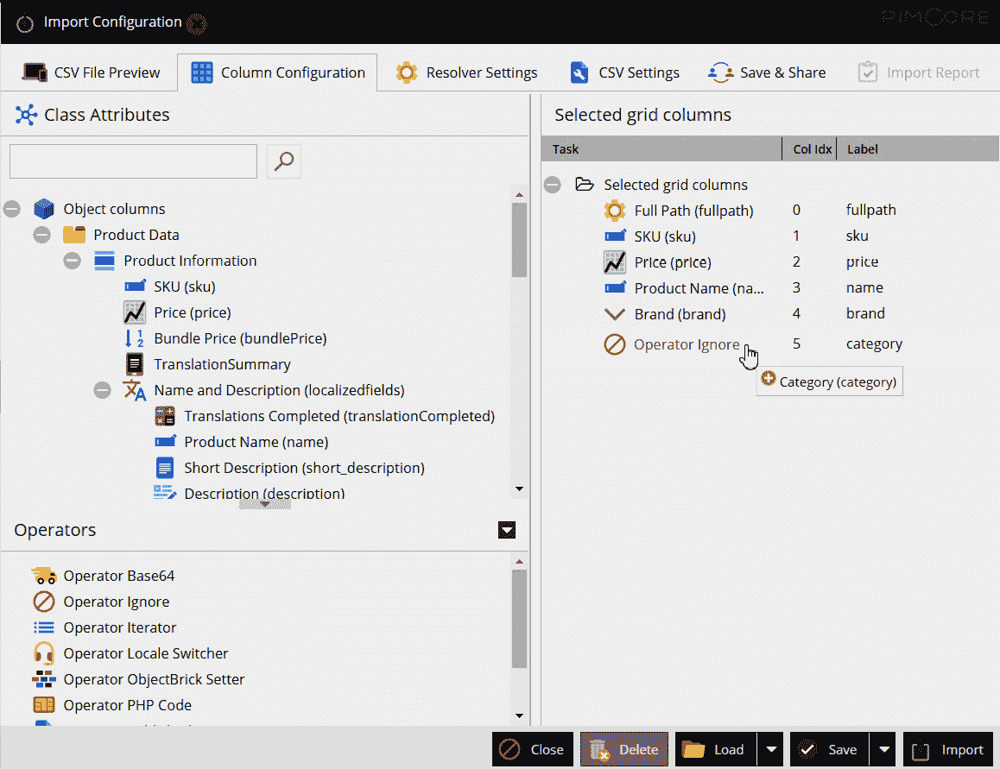
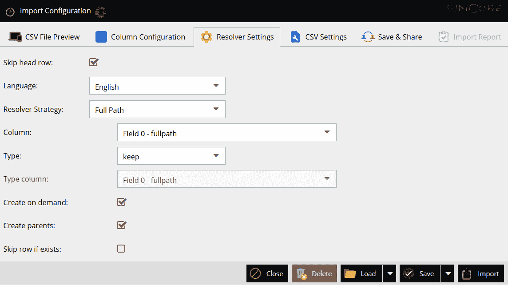
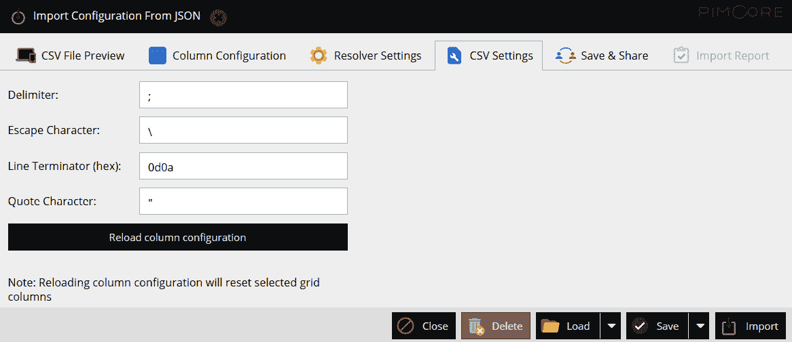
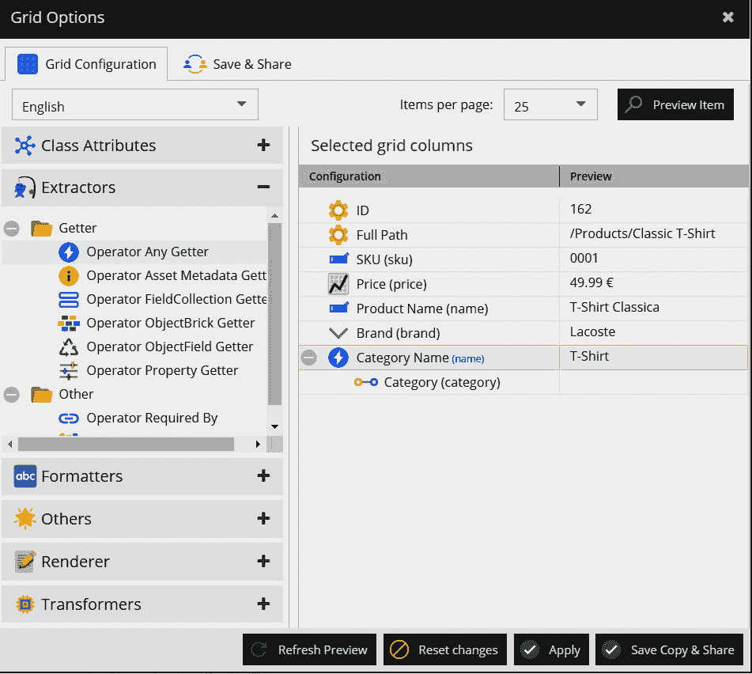
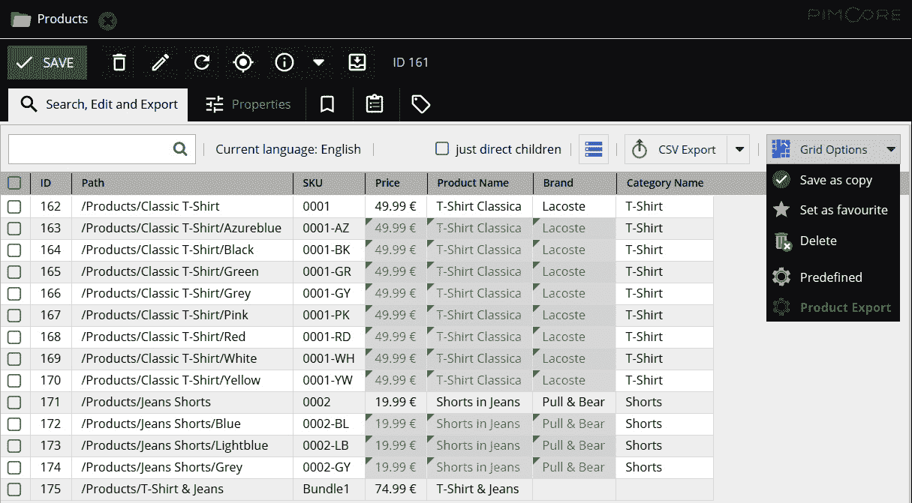
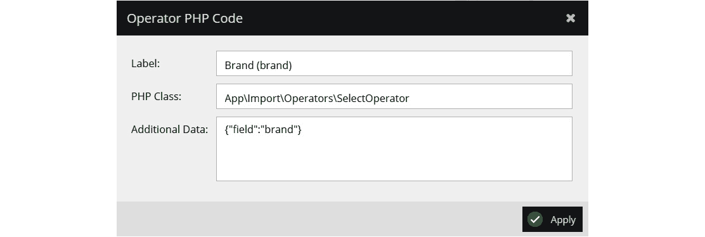
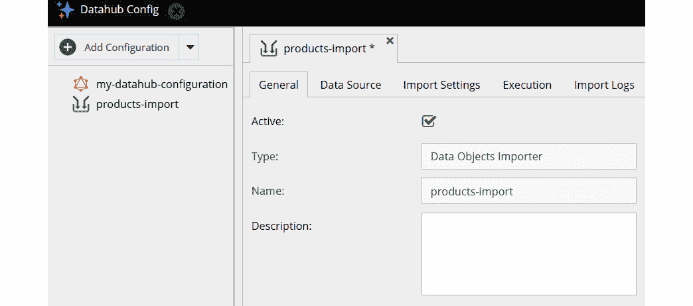
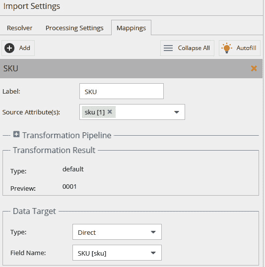
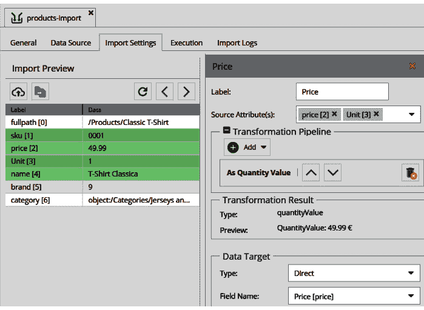
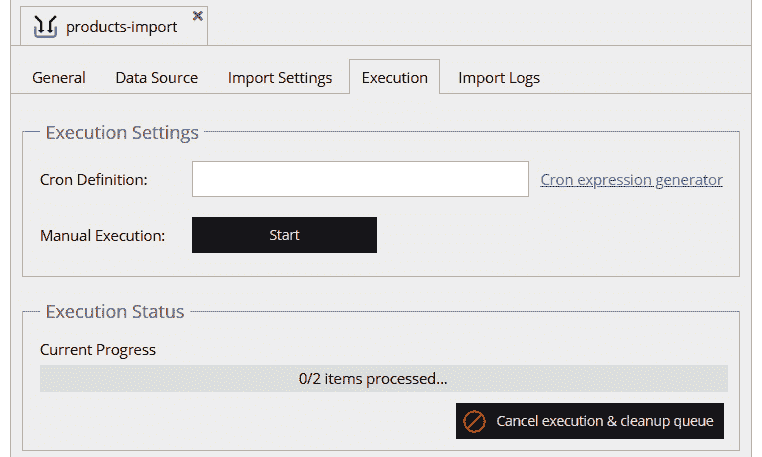

# *第十四章*：数据集成

在上一章中，你学习了关于**主数据管理**（**MDM**）的概念，以及如何使用**Datahub** Pimcore 插件将 Pimcore 对象暴露给第三方应用程序。在定义了如何安装和激活该插件以及如何配置它之后，你学习了如何执行 GraphQL 查询以检索对象数据以及创建、更新或删除对象。

在本章中，你将学习如何在 Pimcore 中通过标准导入和导出功能进行数据集成，当这些标准应该被使用时，以及当需要实现自定义解决方案时。

本章的组织结构如下：

+   导入数据

+   导出数据

+   标准功能的限制

+   实现自定义解决方案

+   配置数据导入器

我们将从展示如何使用标准解决方案进行简单的 CSV 数据导入和导出开始。然后，我们将解释在使用这些标准解决方案进行导入和导出时可能遇到的限制，并解释如何实现一个自定义数据操作符，该操作符可以用于导入配置。在本章的后面部分，我们将展示如何实现导入和导出的自定义解决方案。

# 技术要求

如同你在前面的章节中所做的那样，你所需要做的就是通过导航到官方书库中的`14\. 数据集成`文件夹并启动 Docker 环境来运行与本章相关的演示。

要这样做，只需遵循以下说明：

1.  使用以下命令运行 Docker：

    ```php
    docker-compose up
    ```

1.  然后，为了在本地机器上恢复所有设置，只需打开一个新的 shell 并输入以下命令：

    ```php
    docker-compose exec php bash restore.sh
    ```

1.  导航到[`localhost/admin`](http://localhost/admin)并使用你的 admin/pimcore 凭据登录。

你可以通过以下链接访问官方书库以获取源代码：

[`github.com/PacktPublishing/Modernizing-Enterprise-CMS-using-Pimcore/tree/main/14.%20Data%20Integration`](https://github.com/PacktPublishing/Modernizing-Enterprise-CMS-using-Pimcore/tree/main/14.%20Data%20Integration)

现在，你已经准备好导航到演示，以发现与本章相关的所有方面。

# 导入数据

在本节中，你将学习如何通过标准 Pimcore CSV 导入来导入数据。我们将查看如何配置简单 CSV 文件的导入，查看配置的每个步骤的详细信息，以及如何保存此配置以供将来导入使用。

虽然这个功能在 PimcoreX 中已被弃用，但我们必须考虑到 Pimcore 6 版本仍然被广泛使用，因此这个功能的解释仍然非常重要。因此，在本章的*配置数据导入器*部分，我们将解释如何配置新的 Pimcore 数据导入器。

要开始新的 CSV 导入，只需在您想要导入对象的文件夹上右键单击，选择**CSV 导入**，并选择您想要导入的对象类。此操作将打开一个**上传**对话框，您可以通过该对话框上传 CSV 文件以进行导入。

文件上传后，将打开一个新的模态窗口，您可以从配置导入开始。在接下来的章节中，我们将分析配置的每个步骤。

## CSV 文件预览

在导入配置的第一个面板中，显示了上传的 CSV 文件的预览。在下面的屏幕截图中，您可以看到这个面板的样式：


图 14.1：CSV 文件预览

如您在之前的屏幕截图中所见，CSV 文件行被渲染为表格。如果顶部的复选框被启用，则第一行 CSV 包含标题。

在下一节中，我们将看到如何进行列配置，将每个 CSV 列与相应的类属性关联。

## 列配置

在**列配置**面板中，我们可以将每个 CSV 列关联到相应的类属性，这样对于每次 CSV 导入，我们只能影响类字段的一个子集。您可以在下面的屏幕截图中看到这个面板的样式：



图 14.2：列配置

如您在之前的屏幕截图中所见，在这个面板中有两个不同的区域。在左侧区域，您将找到类属性，并且可以将每个属性拖放到右侧区域对应的 CSV 列中。

在左侧区域，您还可以看到**操作符**部分。这些操作符可以用来改变数据处理的方式。让我们描述每个操作符是如何工作的：

+   **操作符 Base64**：这个操作符对 CSV 数据进行 Base64 编码或解码。

+   **操作符忽略**：这个操作符只是让导入器跳过相应的 CSV 列。

+   **操作符迭代器**：这个操作符允许您通过将属性作为操作符子节点拖放，将相同的 CSV 单元格导入多个类属性。

+   **操作符区域切换器**：这个操作符对于选择每个本地化字段的区域语言非常有用，允许在同一个 CSV 文件中导入不同语言的文本。

+   **操作符 ObjectBrick 设置器**：这个操作符允许您导入**ObjectBrick**的特定属性。

+   **操作符 PHP 代码**：这种操作符类型本身不执行任何操作。它需要您开发一个 PHP 类来管理 CSV 数据，并将类命名空间作为操作符的参数。您将在本章的*创建自定义操作符*部分学习如何创建自定义 PHP 操作符。

+   **操作符发布**：这个操作符只是允许您根据 CSV 列值发布或取消发布导入的对象。

+   **操作符拆分器**：此操作符可以用于根据分隔符字符将 CSV 列的值拆分为多个属性。

现在我们已经定义了如何映射每个对象属性，在下一节中，我们将展示允许我们解析每一行、识别每个对象是否已经存在的标准。

## 解析器设置

在下面的屏幕截图中，您可以查看 **解析器设置** 面板的外观：



图 14.3：解析器设置

正如您在前面的屏幕截图中看到的，有一组属性可以配置，我们将在这里进行描述：

+   **跳过标题行**：定义是否必须跳过第一行。如果 CSV 的第一行包含列标题，则必须勾选此选项。

+   **语言**：导入的语言。将导入指定语言的所有本地化字段值。如果您需要在同一 CSV 导入中导入不同语言的本地化值，您必须使用 **区域设置切换器** 操作符。

+   `Pimcore\DataObject\Import\Resolver\AbstractResolver` 类，并将类命名空间作为属性传递。

+   **列**：此属性允许您选择包含解析器策略必须使用的值的 CSV 列。

+   **类型**：此属性允许您定义导入的行必须是对象还是变体。可以强制此类型，让导入器保持当前类型，或为每一行动态设置类型，指定 **类型列** 属性。

+   **按需创建**：如果选中，将创建不存在的对象。

+   **创建父级**：如果选中，如果对象路径上不存在子文件夹，则将创建它们。

+   **如果存在则跳过行**：如果选中，如果对象已存在，则跳过该行。

现在我们已经看到了如何设置解析器策略，在下一节中，我们将看到如何更改 CSV 设置。

## CSV 设置

在这里，您可以查看 **CSV 设置** 面板的外观：



图 14.4：CSV 设置

正如您在前面的屏幕截图中看到的，在这个面板中，您可以更改 CSV 解析设置，包括 **分隔符**、**引号字符**等。这些设置在文件上传期间自动检测，但您可以手动更改它们。更改这些值后，您必须单击 **重新加载列配置** 按钮以应用更改。

在下一节中，我们将看到如何保存和分享定义的配置。

## 保存 & 分享

在下面的屏幕截图中，您可以查看 **保存 & 分享** 面板的外观：


图 14.5：保存 & 分享

如前一个截图所示，你可以设置配置名称，然后点击**保存**按钮将配置保存在数据库中。所有保存的配置都可以通过点击**加载**按钮并选择所选配置来恢复。导入配置可以全局共享给所有用户，或者共享给一组受限的用户和角色。

一旦完成配置，你可以通过点击**导入**按钮来运行导入。在下面的截图中，你可以看到**导入报告**面板：


图 14.6：导入报告

如前一个截图所示，对于每一行，我们可以看到该行是否成功导入，如果没有，则会显示该行的错误消息。对于每一行导入的对象，都可以打开。

总结来说，在本节中，你学习了如何配置和运行 CSV 导入。在下一节中，你将学习如何在 Pimcore 中导出数据。

# 导出数据

在上一节中，你学习了如何配置和运行 CSV 导入。在本节中，你将学习如何导出数据。与上一节中关于数据导入的内容类似，我们可以设置并保存导出配置。

开始数据导出的第一步是通过点击对象文件夹来打开对象网格。当网格打开时，网格将只包含在类配置中标记为**在网格视图中可见**的类属性，正如你在*第五章*，“探索对象和类”中所学到的。

要添加或删除在网格中显示的字段，你必须点击**网格选项**按钮来打开配置模式。你可以在下面的截图中看到这个配置模式的外观：



图 14.7：网格选项配置

如前一个截图所示，配置模式结构与我们在导入配置的列配置面板中看到的是相当相似的。

在左侧区域，你可以找到类属性列表和一些用于格式化、渲染和转换对象数据以及从对象关系提取值的操作符集合。我们可以将类属性和操作符从右侧区域拖放到网格中，以便这些属性在网格中显示。

在前一个截图中，你可能注意到我们使用了**任何获取器操作符**来从一个关系中提取特定的属性。为此，我们只需要将关系属性作为操作符的子项拖放到操作符中，并指定我们想要从该关系提取的属性。

一旦完成网格配置，你可以点击**应用**按钮来确认更改，你也可以通过点击**保存副本并共享**按钮将配置保存以供将来重用。

在下面的截图中，你可以看到更改后的对象网格看起来如何：



图 14.8：对象网格

如您在前一个屏幕截图中所见，在对象网格中显示了之前定义的列。在屏幕截图中，您还可以看到，如果我们打开**网格选项**子菜单，我们可以切换到不同的配置，保存当前配置的副本，将该配置设置为收藏夹，或者删除当前配置。

对象网格显示了在打开的文件夹内以及最终在现有子文件夹内创建的所有对象和变体。如果您想限制显示的对象仅限于层次结构的第一个级别，您可以通过启用**仅直接子项**复选框来实现，正如您可以在以下屏幕截图中看到的那样：


图 14.9：对象网格

如您在前一个屏幕截图中所见，仅显示直接子项对象。网格中的对象可以导出为 CSV 和 XLSX 文件。对于 CSV 导出，您将被要求选择分隔符字符。

总结来说，在本节中您学习了如何配置对象网格以及如何执行数据导出。在下一节中，您将发现使用标准导入和导出功能可能会遇到哪些局限性，以及如何创建用于导入的自定义运算符。

# 标准功能局限性

在前面的章节中，您学习了如何通过标准功能执行数据导入和导出。如您所知，这些功能易于配置，并且对于简单场景工作良好。

在本节中，您将了解这些标准功能的主要局限性，以及您将学习如何实现一个自定义 PHP 运算符，用于 CSV 导入。让我们首先介绍之前看到的导出功能局限性。

## 数据导出局限性

在**导出数据**部分，您学习了如何配置对象网格以导出对象数据。当使用这些配置时，您可能会遇到以下局限性：

+   `Fieldcollections`属性。`Fieldcollections`可以为每个对象类提供不同的基数，并且很难在像 CSV 或 XLSX 文件这样的平面结构中表示这些类型的属性。

+   **父子关系** **冗余**：文件格式给出的另一个局限性是，由于每个对象变体将放置在不同的行中，因此无法在不避免数据冗余的情况下解释父子关系，在导出的文件中不会有任何关于一行代表对象或变体的信息。

+   **排除变体**：在前一节中，在数据过滤方面，您了解到可以使用**仅直接子项**复选框来过滤对象并排除对象变体。这仅在所有对象都直接在打开的文件夹内创建的情况下有效，因为如果对象是在子文件夹中创建的，则点击复选框时会跳过它们。仅过滤对象的唯一方法是添加直接 SQL 条件，如下一个截图所示：


图 14.10：直接 SQL 查询

如前一个截图所示，点击**直接 SQL 查询**图标将打开一个文本输入框，在其中您可以编写有效的 SQL 条件。这非常有用，但需要了解数据库结构。

+   **服务器超时**：最后但同样重要的是，可能存在与时间相关的問題。导出操作是通过 HTML 调用控制器来完成的，因此对于要导出的成千上万的对象，此操作可能需要很长时间，并且可能会根据服务器设置出现超时。

现在您已经了解了标准数据导出的限制，让我们看看在数据导入过程中您可能会遇到哪些限制。

## 数据导入限制

导入 CSV 文件的主要问题是不同类型属性所需的标准格式。例如，对于以下类型的字段，我们有以下限制：

+   **数量值**：要导入此类字段的值，您必须在 CSV 单元格中放置数值，后跟计量单位。

+   **选择**：CSV 单元格必须包含选择的有效值，而不是选项标签。这在创建的选择具有数字 ID 或通常不是记忆值的情况下可能是一个问题。

+   **多选**：多选字段上的不同值必须仅由逗号字符分隔。

+   `object:/`前缀，后跟相关对象的完整路径。

+   **高级关系**：高级关系的元数据无法导入。

+   **Fieldcollection**：Fieldcollection 的值无法导入。

+   **媒体**：无法通过 CSV 导入将图片和视频附加到对象上。

这些限制使得 CSV 文件的编译相当复杂，因为非专家用户很难创建一个符合所有格式规则的 CSV 文件。这些限制可以通过创建自定义 PHP 运算符来规避，我们将在下一节中看到，但当然，我们将失去无需编写任何代码即可导入数据的优势。

与 CSV 文件相关的另一个限制是格式本身。尽管 CSV 格式是一个广泛的标准，但可能存在过时的外部应用程序无法以 CSV 格式生成导出。话虽如此，要导入任何其他类型的文件，必须开发自定义解决方案。

至于导入过程本身，整个过程不能作为后台进程运行。一旦开始导入，导入模态直到导入过程结束都不能关闭，因为关闭模态会导致导入停止。对于每条导入的行，前端界面都会刷新，对于要导入的数千行，整个过程可能需要数小时。

由于这些时间限制，无法在外部软件和 Pimcore 之间安排自动导入流程，因为如前所述，导入不能作为后台进程运行，需要保持浏览器长时间开启。

现在你已经了解了标准数据导入的限制，让我们看看如何创建一个用于 CSV 导入的自定义 PHP 操作符。使用这些 PHP 操作符可以绕过之前提到的一些限制。

## 创建自定义操作符

在前一个章节中，你学习了在标准数据导入过程中可能会遇到哪些限制。这些限制之一是某些属性类型所需的严格格式。通过创建自定义操作符来管理 CSV 单元格数据，可以绕过这种限制。

在本节中，你将学习如何创建这些自定义操作符，以及如何在 CSV 导入中使用它们。特别是，我们将看到一个示例操作符，该操作符将根据选项标签而不是其值搜索选择字段的选项。在下面的代码片段中，你可以看到如何创建此操作符：

```php
<?php
namespace App\Import\Operators;
use Pimcore\DataObject\Import\ColumnConfig\Operator\AbstractOperator;
use Pimcore\Model\DataObject\ClassDefinition;
class SelectOperator extends AbstractOperator{
protected $additionalData;
    public function __construct(\stdClass $config, $context = null){
parent::__construct($config, $context);
        $this->additionalData = json_decode($config->additionalData, true);
    }
    public function process($element, &$target, array &$rowData, $colIndex, array &$context = array()) {  
        $value = $rowData[$colIndex];
        $field = $this->additionalData["field"];
        $target->set($field, $this->getValueByDisplayName($target->getClass(), $field, $value));
    }
    public function getValueByDisplayName(ClassDefinition $class, $field, $displayName){
        $fieldDefinition = $class->getFieldDefinition($field);
        if(in_array($fieldDefinition->getFieldtype(), array("select", "multiselect"))){
            $options = $fieldDefinition->getOptions();
            $option = array_search(strtolower($displayName), array_map('strtolower', array_column($options, "key")));
            return $option !== false ? $options[$option]["value"] : null;
        }
        return null;
    }
}
```

如前一个代码片段所示，操作符必须扩展 `AbstractOperator` 类。在类构造函数中，我们可以解析在操作符配置中定义的附加数据，并且业务逻辑的实现必须在 `process` 函数中完成，该函数将由导入流程自动调用。

在这个特定的例子中，我们使用对象的类中的 `getFieldDefinition` 方法来检索字段定义。如果字段是一个选择或多项选择属性，我们可以使用 `getOptions` 函数来检索选择选项并搜索与给定标签对应的值。

一旦创建操作符，我们必须在 CSV 导入配置中使用它。为此，只需将 **操作符 PHP 代码** 操作符拖放到你想要应用操作符的 CSV 列中。在操作符配置面板中，你必须放置操作符命名空间，如以下屏幕截图所示：



图 14.11：操作符 PHP 代码

如前一个屏幕截图所示，在操作符配置中，我们必须在 **PHP 类** 输入中放置 PHP 类命名空间。然后，在 **附加数据** 文本区域中，我们可以放置一些要传递给操作符的数据。在我们的例子中，我们以 JSON 格式传递这些附加信息，该信息将由操作符解析。

总结来说，在本节中，您学习了在执行标准导入和导出过程中可能遇到的限制。然后，您学习了如何创建自定义 PHP 操作符，这些操作符可以在 CSV 导入过程中使用。在下一节中，您将学习如何实现导入和导出的自定义解决方案。

# 实现自定义解决方案

在上一节中，您学习了标准导入和导出功能性的限制。然后，您学习了如何创建一个自定义操作符，用于 CSV 导入过程。

在本节中，您将学习如何实现导入和导出的自定义解决方案。特别是，您将学习如何向 Pimcore 后端界面中的对象和文件夹编辑器添加额外的按钮，这些按钮在点击时将调用自定义控制器，以及如何创建可以计划并作为后台进程运行的命令。

## 添加自定义按钮

在本节中，您将学习如何向 Pimcore 后端界面添加自定义按钮，以及如何让这些按钮调用自定义控制器以执行导入和导出。

要添加这些按钮，我们需要在之前创建的 Pimcore 包的 `Resources/js/Pimcore/startup.js` 文件中实现 `postOpenObject` 函数。在下面的代码片段中，您可以看到一个如何创建两个按钮来上传和下载文件的示例：

```php
postOpenObject: function (object, type) {
    if (object.data.general.o_type === 'folder') {
object.toolbar.add({
            text: t('Export'),
iconCls: 'pimcore_icon_download',
            scale: 'medium',
            handler: function (obj) {
pimcore.helpers.download("/admin/export-objects?folderId=" + object.id);
}.bind(this, object)
        });
object.toolbar.add({
            text: t('Import'),
iconCls: 'pimcore_icon_upload',
            scale: 'medium',
            handler: function (obj) {
pimcore.helpers.uploadDialog("/admin/import-objects?folderId=" + object.id, "Filedata", function (response) {
pimcore.layout.refresh();
object.reload();
}.bind(this), function () {
Ext.MessageBox.alert(t("error"), t("error"));
                });
}.bind(this, object)
        });
pimcore.layout.refresh();
    }
}
```

如您在前面的代码片段中所见，我们首先检查打开的对象是否为文件夹，以便在文件夹编辑工具栏中添加两个不同的按钮。对于每个按钮，`handler` 函数是在对象被点击时被调用的函数。

在第一个按钮中，我们使用 `pimcore.helpers.download` 函数让浏览器下载响应中返回的文件。在第二个按钮中，使用 `pimcore.helpers.uploadDialog` 将渲染一个上传模态框；上传的文件将被传递到控制器。

让我们现在看看如何实现将被创建的按钮调用的控制器动作。在下面的代码片段中，您可以看到一个控制器实现的示例：

```php
<?php
namespace App\Controller;
use Pimcore\Bundle\AdminBundle\Controller;
use Symfony\Component\Routing\Annotation\Route;
use Symfony\Component\HttpFoundation\Request;
use Symfony\Component\HttpFoundation\Response;
use Symfony\Component\HttpFoundation\ResponseHeaderBag;
/** @Route("/admin") */
class AdminController extends Controller\AdminController {
    /** @Route("/export-objects") */
    public function exportObjectsAction(Request $request) {
        $folderId = $request->get("folderId");
        //Add business logic here
        $response = new Response();
        $response->setContent($jsonResponse);
        $disposition = $response->headers->makeDisposition(
ResponseHeaderBag::DISPOSITION_ATTACHMENT,
            "export_".date("YmdHis").".json";
        );
        $response->headers->set('Content-Type', 'application/json');
        $response->headers->set('Content-Disposition', $disposition);
        return $response;
    }
    /** @Route("/import-objects", methods={"POST"}) */
    public function importObjectsAction(Request $request) {
        $folderId = $request->get("folderId");
        $tmpName = $_FILES['Filedata']['tmp_name'];
        $fileContent = file_get_contents($tmpName);
        //Add business logic here
        $response = $this->adminJson(['success' => true]);
        $response->headers->set('Content-Type', 'text/html');
        return $response;
    }
} 
```

如您在前面的代码片段中所见，为每个控制器动作创建了一个特定的函数。每个动作都将 HTTP 请求对象作为输入参数传递，并且可以通过 `get` 函数访问请求属性值。

在 `exportObjectsAction` 函数中，我们已通过正确设置响应头来配置响应以接受 JSON 文件的下载。所选的文件格式只是一个示例，可以更改为所需的格式。在 `importObjectsAction` 函数中，我们从 `$_FILES` 全局变量中读取上传文件的文件内容，这样根据业务逻辑，我们可以导入对象。

总结来说，在本节中，你学习了如何向 Pimcore 后端界面添加自定义按钮，以及如何具体实现导入和导出文件的控制器。在下一节中，你将学习如何创建可以通过 Pimcore 控制台调用的命令，并且最终可以将其安排为后台进程执行。

## 创建 Pimcore 命令

在上一节中，你学习了如何通过在 Pimcore 后端界面中添加额外的按钮来创建自定义控制器，以执行任何类型的文件导入和导出。在本节中，你将学习如何创建可以通过 Pimcore 控制台调用的命令。

要创建一个新的命令，你只需创建一个扩展 `Pimcore\Console\AbstractCommand` 类的类，如下面的代码片段所示：

```php
<?php
namespace App\Command;
use Pimcore\Console\AbstractCommand;
use Pimcore\Console\Dumper;
use Symfony\Component\Console\Input\InputInterface;
use Symfony\Component\Console\Input\InputOption;
use Symfony\Component\Console\Output\OutputInterface;
class ImportCommand extends AbstractCommand
{
    const IMPORT_FOLDER = PIMCORE_PROJECT_ROOT."/var/imports";
    protected function configure() {
        $this->setName('import-file')
            ->setDescription('Import a file in background');
        $this->addOption("filename", null, InputOption::VALUE_REQUIRED, "The name of the file to import");
    }
    protected function execute(InputInterface $input, OutputInterface $output) {
        $this->dump("The execution is starting!",  Dumper::NEWLINE_AFTER);
        $filename = $input->getOption("filename");
        $fileContent = file_get_contents(self::IMPORT_FOLDER."/".$filename);
        //Add business logic here
        $this->writeError('Please implement this command with business logic...');
    }
}
```

如你在前面的代码片段中看到，在命令配置中，你可以指定命令的名称和描述，以及命令的列表可选或必需的参数和选项。

命令的业务逻辑必须在 `execute` 函数中实现。我们可以使用命令原生函数，如 `dump` 和 `writeError`，在控制台中打印消息。

一旦开发完成命令，它必须像以下代码片段所示那样声明为服务：

```php
services:
App\Command\ImportCommand:
        tags:
            - { name: 'console.command', command: 'import-file' }
```

你可能会注意到，在前面的代码片段中，`command` 标签报告了创建的命令名称。要调用命令，你只需运行以下指令：

```php
php bin/console import-file --filename=my-import-file.csv
```

当运行命令时，必须指定文件名作为属性。你可以在下面的屏幕截图中看到命令结果：


图 14.12：命令执行

如你在前面的屏幕截图中所见，消息和错误被输出到控制台。

总结来说，在本节的第一个部分，你学习了如何向 Pimcore 后端界面添加自定义按钮，以及如何让这些按钮调用控制器动作来上传和下载文件。然后，你学习了如何通过 Pimcore 控制台创建和运行 Pimcore 命令。

在下一节中，你将学习如何配置新的 Pimcore 数据导入器，这将允许你从不同的来源导入数据并在后台安排导入。

# 配置数据导入器

在上一节中，你学习了如何实现自定义解决方案，特别是如何向对象界面添加自定义按钮以及如何创建可执行命令。

在本节中，你将学习如何安装和配置新的 Pimcore 数据导入器，在 PimcoreX 版本中将取代我们在 *导入数据* 部分描述的标准 CSV 导入。

数据导入器插件是 Datahub 包的扩展，我们在 *第十三章*，*实现主数据管理* 中进行了描述。要安装数据导入器，你只需运行以下脚本：

```php
docker-compose exec php bash
composer require pimcore/data-importer
./bin/console pimcore:bundle:enable PimcoreDataImporterBundle
```

如前一个脚本所示，数据导入器可以通过 Composer 下载，并且可以像其他 Pimcore 捆绑包一样启用，使用 `pimcore:bundle:enable` 命令。

一旦您启用了捆绑包，您可以通过访问 Pimcore 菜单中的 **设置** | **数据集配置** 选项来打开 **Datahub** 配置面板。要创建新的导入配置，您只需单击 **添加配置** 按钮即可，如以下屏幕截图所示：


图 14.13：添加导入配置

如前一个屏幕截图所示，除了 GraphQL 配置外，您还可以选择 **数据对象导入器** 选项并填写配置名称。

要配置和运行导入，您必须遵循以下步骤：

1.  在 **常规** 选项卡中，启用 **激活** 复选框并添加可选的描述，如以下屏幕截图所示：

    图 14.14：常规设置

    如前一个屏幕截图所示，定义的配置名称显示在设置中。

1.  在生成的 URL 的 `POST` 调用中。

    一旦您已定义数据源，您可以选择文件格式，从 CSV、JSON、XLSX 和 XML 中选择，并填写具体的配置。

1.  在 **导入设置** 面板中，为上传文件中的每个字段配置解析器和映射。在以下屏幕截图中，您将看到如何配置解析器：

    图 14.16：导入解析器

    如前一个屏幕截图所示，您可以定义参与导入的类和加载策略，从 **路径**、**ID**、**属性** 或 **不加载** 中选择。最后一个选项将使导入器始终创建新对象，而不会查看这些对象的存在。然后，您可以通过定义现有的文件夹路径来选择创建和更新的对象必须位于的位置，以及如何影响发布状态。

    在 **处理设置** 选项卡中，您可以定义配置的导入是否可以并行运行多次，或者每次导入运行是否必须是顺序的。

1.  在 **映射** 选项卡中，为要导入的每个上传文件的属性定义一个映射。在下面的屏幕截图中，您将看到如何添加新的映射以及如何映射一个简单的文本字段：

    图 14.17：导入映射

    如前一个屏幕截图所示，您可以通过单击 **添加** 按钮添加新的字段映射。要映射一个简单的文本字段，您只需从自动检测的源属性中选择正确的字段，并在 **字段名称** 列表中选择相应的类字段。

    对于不同类型的字段，您可能需要使用**转换管道**添加一个或多个转换。您可以在以下截图中看到一个示例：

    

    图 14.18：导入映射

    如前一个截图所示，对于**数量值**属性，我们可以添加一个特定的转换。这需要选择两个源属性，一个包含值，另一个包含度量单位。

    这些管道可以用于导入日期和数字字段，或者更复杂的字段，例如，例如图像和其他类型的资产，或者与其他对象的关联。

    在左侧面板中，您可以看到已定义的字段被突出显示。

1.  在**执行**面板中，运行您已配置的导入操作。您可以通过点击**开始**按钮手动运行导入，如下截图所示：

    图 14.19：导入执行

    如前一个截图所示，导入状态显示在进度条中，您可以在任何时候停止导入。

    如果您想计划在后台运行导入，只需填写**Cron 定义**规则。

1.  要启用`cron`执行，您只需按照以下脚本计划执行命令：

    ```php
    cron execution, as shown previously, will let Pimcore check which import configurations must be run every minute. These configurations will be run according to the cron definition of every single configuration.
    ```

总结来说，在本节中，您学习了如何安装和启用数据导入器插件。通过逐步配置，您学习了如何创建和执行导入配置。

# 摘要

在本章中，您学习了如何使用标准 Pimcore 功能导入和导出数据，这些功能允许您在定义相应的导入和导出配置后导入和导出 CSV 文件。

在描述了如何正确设置这些配置之后，您学习了在执行这些标准功能时可能遇到的限制，以及如何实现一个用于 CSV 导入过程的自定义操作符。

在本章的后面部分，您学习了如何实现导入和导出的自定义解决方案。特别是，您学习了如何向 Pimcore 后端界面添加自定义按钮，让您可以上传和下载文件，以及如何创建可以通过 Pimcore 控制台调用并最终计划为后台进程的命令。

在最后一节中，您最终学习了如何启用数据导入器插件，从不同类型的源创建导入配置，您可以手动执行或计划在后台执行。

由于这是最后一章，让我们尝试总结整本书的内容。在书的第一个部分，我们讨论了 Pimcore 基础知识，介绍了 Pimcore 及其功能，展示了如何设置开发环境，如何在 Pimcore 菜单和功能中导航，以及如何管理 Pimcore 站点。

在第二部分，你学习了如何逐步使用 Pimcore CMS 引擎实现一个博客，从学习如何创建自定义 CMS 页面以及如何为博客渲染数据开始，然后是如何创建可重用组件以及如何最终完成网站。

在最后一章中，我们描述了如何使用 Pimcore 进行企业解决方案，重点关注 PIM 和 MDM 的 Pimcore 功能以及数据集成过程，提供了如何将 Pimcore 连接到外部系统的具体示例。

现在你已经读完了这本书的结尾，我们希望它对你来说是一次鼓舞人心的阅读，并且这本书将成为你使用 Pimcore 开发项目的有用指南。
