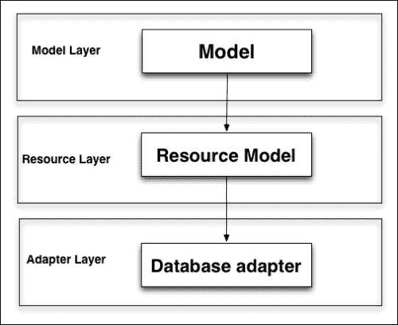
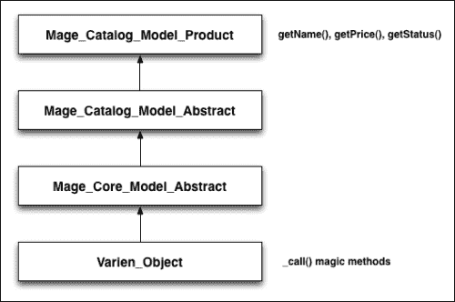
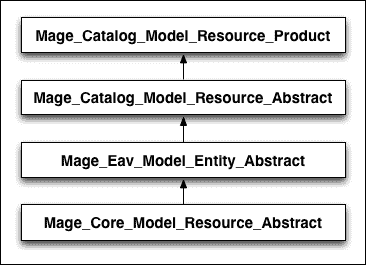
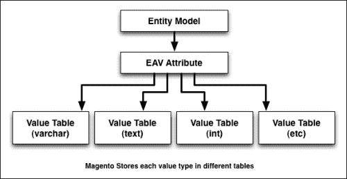
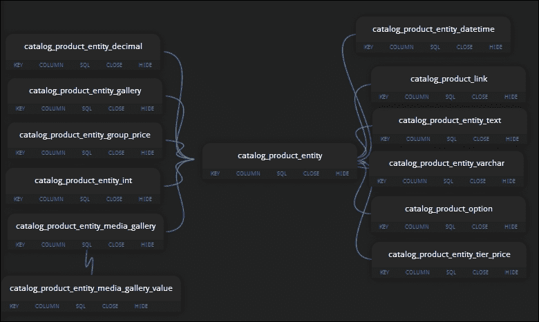
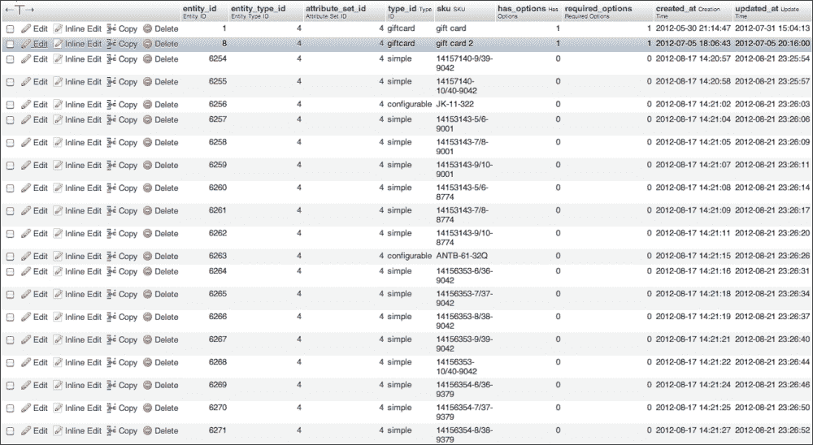
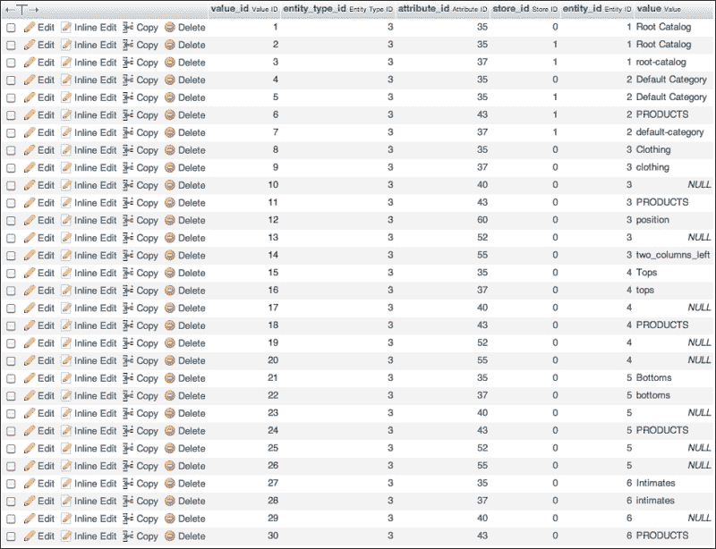
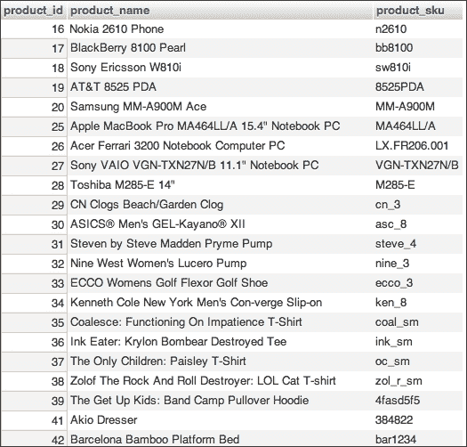
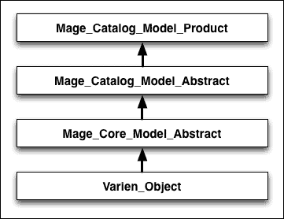

# 第二章：ORM 和数据集合

集合和模型是日常 Magento 开发的基础。在本章中，我们将向读者介绍 Magento ORM 系统，我们将学习如何正确地处理数据集合和 EAV 系统。与大多数现代系统一样，Magento 实现了一个 **对象关系映射**（**ORM**）系统。

> *在计算机软件中，对象关系映射（ORM、O/RM 和 O/R mapping）是一种编程技术，用于在面向对象的编程语言中将数据在不可兼容的类型系统之间进行转换。实际上，它创建了一个“虚拟对象数据库”，可以在编程语言中使用。*

在本章中，我们将涵盖以下主题：

+   Magento 模型

+   Magento 数据模型的解剖结构

+   EAV 和 EAV 模型

+   使用直接 SQL 查询

我们还将使用几个代码片段来提供一个易于实验和玩耍的框架。

### 注意

本章中的交互式示例假设你正在使用 VagrantBox 内的默认 Magento 安装或带有样本数据的 Magento 安装。

为了这个目的，我创建了 Magento IMC（交互式 Magento 控制台），这是一个专门为这本书创建的 shell 脚本，灵感来源于 Ruby 的 IRB（交互式 Ruby 控制台）。要开始，请按照以下步骤操作：

1.  我们首先需要做的是安装 IMC，从 [`github.com/amacgregor/mdg_imc`](https://github.com/amacgregor/mdg_imc) 下载源文件，并在你的 Magento 测试安装下提取它们。IMC 是一个简单的 Magento shell 脚本，它将允许我们在实时测试我们的代码。

1.  一旦提取了脚本，请登录到你的 VirtualBox 的 shell。

1.  接下来，我们需要导航到我们的 Magento 根目录。如果你使用的是默认的 vagrant 盒子和安装，根目录位于 `/srv/www/ce1720/public_html` 之下。我们可以通过运行此命令来导航到它：

    ```php
    $ cd /srv/www/ce1720/public_html

    ```

1.  最后，我们可以通过运行以下命令来启动 IMC：

    ```php
    $ php shell/imc.php

    ```

1.  如果一切安装成功，我们将看到以 `magento >` 开头的新行。

# Magento 模型解剖

正如我们在上一章中学到的，Magento 数据模型用于操作和访问数据。模型层分为两种基本类型，简单模型和 EAV：

+   **简单模型**：这些模型实现是将一个对象映射到一个表，意味着我们的对象属性与每个字段匹配，我们的表结构也是如此。

+   **实体属性值模型**：这类模型，称为 EAV 模型，用于描述具有动态属性数量的实体。

### 注意

需要明确的是，并非所有 Magento 模型都扩展或使用 ORM。观察者是一个清晰的例子，它是简单的模型类，没有映射到特定的数据库表或实体。

此外，每种模型类型由以下层次组成：

+   **模型类**：这是我们大部分业务逻辑所在的地方。模型用于操作数据，但它们不直接访问数据。

+   **资源模型类**：资源模型用于代表我们的模型与数据库进行交互。它们负责实际的 CRUD 操作。

+   **模型集合类**：每个数据模型都有一个集合类。集合是包含多个单独的 Magento 模型实例的对象。

### 注意

CRUD 代表数据库操作的四种基本类型，即创建(create)、读取(read)、更新(update)和删除(delete)。

Magento 模型不包含与数据库通信的逻辑；它们是数据库无关的。相反，这段代码位于资源模型层。

这使得 Magento 能够支持不同类型的数据库和平台。尽管目前只官方支持 MySQL，但完全可以为新的数据库编写一个新的资源类，而不需要触及任何模型逻辑：



让我们现在通过实例化一个产品对象并设置其一些属性来实验：

1.  在您的 Magento 测试安装根目录下启动 Magento 交互式控制台：

    ```php
    php shell/imc.php

    ```

1.  我们的第一步是通过输入以下代码创建一个新的产品对象实例：

    ```php
    magento> $product = Mage::getModel('catalog/product');

    ```

1.  通过运行以下代码，我们可以确认这是一个产品类的空实例：

    ```php
    magento> echo get_class($product);

    ```

1.  我们应该看到以下作为成功的输出：

    ```php
    magento> Magento_Catalog_Model_Product

    ```

1.  如果我们想了解更多关于类方法的信息，我们可以运行以下代码：

    ```php
    magento> print_r(get_class_methods($product));

    ```

这将返回一个包含类中所有可用方法的数组。让我们尝试运行以下代码片段并修改产品的价格和名称：

```php
$product = Mage::getModel('catalog/product')->load(2);
$name   = $product->getName() . '-TEST';
$price   = $product->getPrice();
$product->setPrice($price + 15);
$product->setName($name);
$product->save();
```

在代码的第一行，我们实例化了一个特定的对象，然后继续从对象中检索名称属性。接下来，我们设置价格和名称，最后保存对象。

如果我们打开我们的 Magento 产品类`Mage_Catalog_Model_Product`，我们首先会注意到，虽然`getName()`和`getPrice()`在我们的类中都有定义，但`setPrice()`和`setName()`函数在任何地方都没有定义。

然而，为什么以及更重要的是，如何让 Magento 神奇地定义每个产品对象 setter 和 getter 方法？虽然`getPrice()`和`getName()`确实被定义了，但产品属性如颜色或制造商的 getter 和 setter 方法都没有定义。

## 真的是神奇的——方法

好吧，事实是 Magento 的 ORM 系统确实是神奇的。更准确地说，PHP 更强大的功能之一是实现其 getter 和 setter，即神奇的`__call()`方法。魔法方法在 Magento 中用于设置、取消设置、检查或检索数据。

当我们尝试调用在相应类中实际上不存在的方法时，PHP 会检查每个父类以查找该方法的声明。如果它在任何父类中找不到该函数，它将使用最后的手段并尝试使用`__call()`方法。如果找到，Magento（或 PHP）将调用魔法方法，传递请求的方法名及其参数。

现在，产品模型没有定义`__call()`方法，但它从大多数 Magento 模型继承的`Varien_Object`中获取一个。`Mage_Catalog_Model_Product`类的继承树如下：



### 小贴士

大多数 Magento 模型都继承自`Varien_Object`类。

让我们更仔细地看看`Varien_Object`类：

1.  打开位于`magento_root/lib/Varien/Object.php`的文件。

1.  `Varien_Object`类不仅有一个`**__call()**`方法，还有两个已弃用的方法，`**__set()**`和`**__get()**`。这两个方法都被`**__call()**`方法所取代，并且不再使用。

    ```php
    public function __call($method, $args)
    {   switch (substr($method, 0, 3)) {
          case 'get' ://Varien_Profiler::start('GETTER: '.get_class($this).'::'.$method);
              $key = $this->_underscore(substr($method,3));
              $data = $this->getData($key, isset($args[0]) ? 
              $args[0] : null);

    //Varien_Profiler::stop('GETTER: '.get_class($this).'::'.$method);
              return $data;

              case 'set' :
              //Varien_Profiler::start('SETTER: '.get_class($this).'::'.$method);
              $key = $this->_underscore(substr($method,3));
              $result = $this->setData($key, isset($args[0]) ? $args[0] : null);
              //Varien_Profiler::stop('SETTER: '.get_class($this).'::'.$method);
                return $result;
              case 'uns' :
              //Varien_Profiler::start('UNS: '.get_class($this).'::'.$method);
             $key = $this->_underscore(substr($method,3));
             $result = $this->unsetData($key);
             //Varien_Profiler::stop('UNS: '.get_class($this).'::'.$method);
             return $result;

             case 'has' :
             //Varien_Profiler::start('HAS: '.get_class($this).'::'.$method);
             $key = $this->_underscore(substr($method,3));
             //Varien_Profiler::stop('HAS: '.get_class($this).'::'.$method);
             return isset($this->_data[$key]);
        }
        throw new Varien_Exception("Invalid method" . get_class($this)."::".$method."(".print_r($args,1).")");
    }
    ```

在`__call()`方法内部，我们有一个 switch 语句，它不仅处理 getters 和 setters，还处理`unset`和`has`函数。

如果我们启动调试器并跟踪我们的代码片段对`__call()`方法的调用，我们会看到它接收两个参数，即方法名（例如`setName()`）和原始调用中的参数。

有趣的是，Magento 尝试根据被调用方法的第一个三个字母来匹配相应的方法类型。这是通过调用子字符串函数来完成的：

```php
substr($method, 0, 3)
```

在每个情况中首先被调用的函数是`_underscore()`，它将方法名中的前三个字符之后的内容作为参数。按照我们的例子，传递的参数将是`Name`。

`__underscore()`函数返回一个数据键。然后，每个 case 使用这个键来操作数据。有四种基本的数据操作，每个操作都用于相应的 switch case：

+   `setData` (`$parameters`)

+   `getData` (`$parameters`)

+   `unsetData` (`$parameters`)

+   `isset` (`$parameters`)

这些函数中的每一个都会与`Varien_Object`数据数组交互并相应地操作它。在大多数情况下，将使用魔法 set/get 方法来与我们的对象属性交互。只有在少数需要额外业务逻辑的例外情况下，才会定义 getters 和 setters。在我们的例子中，这将包括`getName()`和`getPrice()`：

```php
public function getPrice()
{
    if ($this->_calculatePrice || !$this->getData('price')) {
      return $this->getPriceModel()->getPrice($this);
    } else {
      return $this->getData('price');
    }
}
```

我们不会深入探讨价格函数实际上在做什么，但它清楚地表明，模型的一些部分可能需要额外的逻辑：

```php
public function getName()
{
    return $this->_getData('name');
}
```

另一方面，`getName()`获取器没有被声明，是因为需要实现特殊逻辑，但也是因为需要优化 Magento 的关键部分。`Mage_Catalog_Model_Product`的`getName()`函数，在页面加载时可能会被调用数百次，是所有 Magento 中最常用的函数之一。毕竟，如果它不以产品为中心，那将是什么样的电子商务平台呢？

前端和后端都会在某个时候调用`getName()`函数。例如，加载包含 24 个产品的类别页面。这是对`getName()`函数的 24 次单独调用。如果每个调用都在每个父类上查找`getName()`方法，然后尝试使用魔法`__call()`方法，将会导致失去宝贵的毫秒。

**资源模型**包含所有数据库特定的逻辑，并为它们对应的数据源实例化特定的读写适配器。让我们回到我们处理产品的例子，看看位于`Mage_Catalog_Model_Resource_Product`的产品资源模型：



资源模型有两种类型，实体和资源。后者是一个相当标准的单表/单模型关联，而前者则更为复杂。

# EAV 模型

EAV 代表实体、属性和值，可能是新 Magento 开发者最难理解的概念。虽然 EAV 概念并非仅限于 Magento，但在现代系统中很少实现。此外，Magento 的实现也不是简单的。



## 什么是 EAV？

为了理解 EAV 是什么以及它在 Magento 中的作用，我们需要分解 EAV 模型的部分：

+   **实体**：这代表 Magento 产品、客户、类别和订单内部的数据项（对象）。每个实体都存储在数据库中，并具有一个唯一的 ID。

+   **属性**：这些是我们的对象属性。在产品表中，我们不是为每个属性设置一个列，而是将属性存储在单独的表集中。

+   **值**：正如其名，它只是与特定属性关联的值。

这种数据模型是 Magento 灵活性和强大的秘密所在，允许实体在不修改代码、模板或数据库模式的情况下添加和删除新的属性。

这个模型可以看作是数据库垂直扩展的方式（新的属性和更多的行），而传统的模型涉及水平扩展模式（新的属性和更多的列），每次添加新属性时都会导致模式重设计。

**EAV**模型不仅允许我们的数据库快速进化，而且更有效，因为它只处理非空属性，避免了在数据库中为空值预留额外空间的需要。

### 小贴士

如果你对探索和学习更多关于 Magento 数据库结构感兴趣，我强烈推荐访问[www.magereverse.com](http://www.magereverse.com)。

添加新的产品属性就像进入 Magento 后端并指定新的属性类型一样简单，无论是颜色、尺寸、品牌还是其他任何东西。反之亦然，我们也可以在我们的产品或客户模型上删除未使用的属性。

### 注意

更多关于管理属性的信息，请访问[`www.magentocommerce.com/knowledge-base/entry/how-do-attributes-work-in-magento`](http://www.magentocommerce.com/knowledge-base/entry/how-do-attributes-work-in-magento)。

Magento 社区版目前有八种不同的 EAV 对象类型：

+   客户

+   客户地址

+   产品

+   产品分类

+   订单

+   发票

+   信用备忘录

+   货运

### 注意

Magento 企业版有一个额外的类型称为**RMA**项目，它是**退货商品授权**（**RMA**）系统的一部分。

所有这些灵活性和强大功能并非免费，需要付出代价。实施 EAV 模型会导致我们的实体数据分布在大量表中。例如，仅产品模型就分布在约 40 个不同的表中。

以下图表仅显示了保存 Magento 产品信息涉及的一些表：



**EAV**的另一个主要缺点是在检索大量**EAV**对象时性能下降，以及数据库查询复杂性的增加。由于数据更加碎片化（存储在更多表中），选择单个记录需要多个连接。

Magento 解决 EAV 这一缺点的一种方法是通过使用索引和平坦表。例如，Magento 可以将所有产品信息保存到`flat_catalog`表中，以便更容易和更快地访问。

让我们继续以 Magento 产品为例，手动构建查询以检索单个产品。

### 小贴士

如果你已经在你的开发环境中安装了**phpmyadmin**或**MySQL** **Workbench**，你可以尝试以下查询。每个查询都可以在**PHPMyAdmin**网站[`www.phpmyadmin.net/`](http://www.phpmyadmin.net/)和**MySQL Workbench**网站[`www.mysql.com/products/workbench/`](http://www.mysql.com/products/workbench/)上下载。

我们需要使用的第一个表是`catalog_product_entity`表。我们可以将其视为我们的主要产品**EAV**表，因为它包含我们产品的主体记录：



让我们通过运行以下 SQL 查询来查询该表：

```php
SELECT * FROM `catalog_product_entity`;
```

该表包含以下字段：

+   `entity_id`：这是我们产品的唯一标识符，由 Magento 内部使用。

+   `entity_type_id`：Magento 有几种不同的 EAV 模型类型。产品、客户和订单只是其中的一些。通过类型识别每个这些模型允许 Magento 从适当的表中检索属性和值。

+   `attribute_set_id`：产品属性可以本地分组到属性集中。属性集允许在产品结构上具有更大的灵活性，因为产品不必使用所有可用的属性。

+   `type_id`：在 Magento 中存在多种不同类型的产品：简单产品、可配置产品、捆绑产品、可下载产品和分组产品；每种都有独特的设置和功能。

+   `sku`：这代表库存单位，是一个用于识别商店中每个独特产品或商品的数字或代码。这是一个用户定义的值。

+   `has_options`：这用于识别产品是否有自定义选项。

+   `required_options`：这用于识别是否需要任何自定义选项。

+   `created_at`：这是行创建日期。

+   `updated_at`：这是行最后一次被修改的时间。

现在我们对产品实体表有了基本的了解。每条记录代表我们 Magento 商店中的一个单独产品，但我们关于该产品的信息并不多，除了 SKU 和产品类型。

那么，属性存储在哪里？Magento 是如何区分产品属性和客户属性的？

对于这个，我们需要通过运行以下 SQL 查询来查看`eav_attribute`表：

```php
SELECT * FROM `eav_attribute`;
```

因此，我们将不仅看到产品属性，还会看到与客户模型、订单模型等对应的属性。幸运的是，我们已经有了一个从该表中筛选属性的关键。让我们运行以下查询：

```php
SELECT * FROM `eav_attribute`
WHERE entity_type_id = 4;
```

这个查询告诉数据库只检索`entity_type_id`列等于产品`entity_type_id(4)`的属性。在移动之前，让我们分析一下`eav_attribute`表中最重要的字段：

+   `attribute_id`：这是每个属性的唯一标识符和表的键。

+   `entity_type_id`：这将每个属性与特定的 eav 模型类型相关联。

+   `attribute_code`：这是我们属性的名称或键，用于生成我们的魔术方法的获取器和设置器。

+   `backend_model`：这些用于管理将数据加载和存储到数据库中。

+   `backend_type`：这指定了后端（数据库）中存储的值的类型。

+   `backend_table`：这用于指定属性是否应该存储在特殊表中而不是默认的 EAV 表中。

+   `frontend_model`：这些处理将属性元素渲染到网页浏览器中。

+   `frontend_input`：与前端模型类似，前端输入指定了网页浏览器应该渲染的输入字段的类型。

+   `frontend_label`：这是浏览器应该渲染的属性标签/名称。

+   `source_model`：这些用于填充属性的可能值。Magento 自带了几个预定义的源模型，用于国家、是或否值、地区等。

## 检索数据

到目前为止，我们已经成功检索到了产品实体及其适用的特定属性。现在是我们开始检索实际值的时候了。为了简化示例（以及查询），我们只会尝试检索我们产品的名称属性。

我们如何知道我们的属性值存储在哪个表中？幸运的是，Magento 遵循一个命名约定来命名表。如果我们检查我们的数据库结构，我们会注意到有几个表使用 `catalog_product_entity` 前缀：

+   `catalog_product_entity`

+   `catalog_product_entity_datetime`

+   `catalog_product_entity_decimal`

+   `catalog_product_entity_int`

+   `catalog_product_entity_text`

+   `catalog_product_entity_varchar`

+   `catalog_product_entity_gallery`

+   `catalog_product_entity_media_gallery`

+   `catalog_product_entity_tier_price`

等等！我们如何知道哪个是查询名称属性值的正确表？如果你注意到了，我已经给你答案了。记住，`eav_attribute` 表有一个名为 `backend_type` 的列？

Magento EAV 根据属性的后端类型将每个属性存储在不同的表中。如果我们想确认我们名称属性的后端类型，我们可以通过运行以下代码来做到：

```php
SELECT * FROM `eav_attribute`
WHERE `entity_type_id` =4 AND `attribute_code` = 'name';

```

因此，我们应该看到后端类型是 varchar，并且此属性的值存储在 `catalog_product_entity_varchar` 表中。让我们检查这个表：



`catalog_product_entity_varchar` 表仅由 6 列组成：

+   `value_id`：这是属性值唯一标识符和主键

+   `entity_type_id`：这是此值所属的实体类型 ID

+   `attribute_id`：这是将值与我们的 `eav_entity` 表相关联的外键

+   `store_id`：这是匹配商店视图的属性值的外键

+   `entity_id`：这是与相应实体表（在这种情况下为 `catalog_product_entity`）相关联的外键

+   `value`：这是我们想要检索的实际值

### 小贴士

根据属性配置，我们可以将其作为全局值，这意味着它适用于所有商店视图，或者每个商店视图一个值。

现在我们终于有了所有需要检索产品信息的表，我们可以构建我们的查询：

```php
SELECT p.entity_id AS product_id, var.value AS product_name, p.sku AS product_sku
FROM catalog_product_entity p, eav_attribute eav, catalog_product_entity_varchar var
WHERE p.entity_type_id = eav.entity_type_id 
   AND var.entity_id = p.entity_id
   AND eav.attribute_code = 'name'
   AND eav.attribute_id = var.attribute_id
```



从我们的查询中，我们应该看到一个包含三个列的结果集，`product_id`、`product_name` 和 `product_sku`。所以让我们退后一步，用原始 SQL 获取带有 SKU 的产品名称。我们不得不写一个五行的 SQL 查询，如果我们想检索一个数值字段，如价格，或者一个类似产品的文本值，我们只从我们的产品中检索了两个值，从一个单一的 EAV 值表中。

如果我们没有设置 **ORM**，维护 Magento 几乎是不可能的。幸运的是，我们确实有一个 ORM，而且你很可能永远不需要处理原始 SQL 来与 Magento 一起工作。

话虽如此，让我们看看如何使用 Magento ORM 获取相同的产品信息：

1.  我们的第一步将是实例化一个产品集合：

    ```php
    $collection = Mage::getModel('catalog/product')->getCollection();
    ```

1.  然后，我们将特别告诉 Magento 选择名称属性：

    ```php
    $collection->addAttributeToSelect('name');
    ```

1.  然后，我们将要求它按名称对集合进行排序：

    ```php
    $collection->setOrder('name', 'asc');
    ```

1.  最后，我们将告诉 Magento 加载集合：

    ```php
    $collection->load();
    ```

1.  最终结果是按名称排序的商店中所有产品的集合。我们可以通过运行以下代码来检查实际的 SQL 查询：

    ```php
    echo $collection->getSelect()->__toString();
    ```

在仅仅三行代码中，我们告诉 Magento 捕获商店中的所有产品，特别选择名称，并最终按名称对产品进行排序。

### 提示

最后一条 `$collection->getSelect()->__toString();` 允许我们看到 Magento 代表我们执行的查询。

Magento 实际生成的查询如下：

```php
SELECT `e`.*. IF( at_name.value_id >0, at_name.value, at_name_default.value ) AS `name`
FROM `catalog_product_entity` AS `e`
LEFT JOIN `catalog_product_entity_varchar` AS `at_name_default` ON (`at_name_default`.`entity_id` = `e`.`entity_id`)
AND (`at_name_default`.`attribute_id` = '65')
AND `at_name_default`.`store_id` =0
LEFT JOIN `catalog_product_entity_varchar` AS `at_name` ON ( `at_name`.`entity_id` = `e`.`entity_id` )
AND (`at_name`.`attribute_id` = '65')
AND (`at_name`.`store_id` =1)
ORDER BY `name` ASC
```

如我们所见，ORM 和 EAV 模型是出色的工具，它们不仅将大量权力和灵活性交到开发者手中，而且是以全面且易于使用的方式做到的。

# 与 Magento 集合一起工作

如果你回顾之前的代码示例，你会注意到我不仅实例化了一个产品模型，而且还调用了 `getCollection()` 方法。`getCollection()` 方法是 `Mage_Core_Model_Abstract` 类的一部分，这意味着 Magento 中的每个模型都可以调用此方法。

### 提示

所有集合都继承自 `Varien_Data_Collection`。

Magento 集合基本上是一个包含其他模型的模型。因此，我们不会使用数组来保存产品集合，而是会使用产品集合。集合不仅提供了一个方便的数据结构来分组模型，还提供了我们可以用来操作和与实体集合一起工作的特殊方法。

一些最有用的集合方法包括：

+   `addAttributeToSelect`：向集合中的实体添加属性；`*` 可以用作通配符以添加所有可用的属性

+   `addFieldToFilter`：向集合添加属性过滤器；此函数用于常规非 EAV 模型或用于过滤主产品表（如 SKU）中的属性

+   `addAttributeToFilter`：此方法用于过滤 EAV 实体的集合

+   `addAttributeToSort`：此方法用于添加排序顺序的属性

+   `addStoreFilter`：此方法用于向当前集合添加商店过滤器。它可能不是所有对象类型都可用

+   `addWebsiteFilter`：此方法用于向集合添加网站过滤器

+   `addCategoryFilter`：此方法用于为产品集合指定类别过滤器

+   `addUrlRewrite`：此方法用于向产品集合添加 URL 重写数据

+   `setOrder`：此方法用于设置集合的排序顺序

这些只是可用的集合方法中的一小部分。每个集合根据它们对应的实体类型实现不同的独特方法。例如，客户集合 `Mage_Customer_Model_Resource_Customer_Collection` 有一个名为 `groupByEmail()` 的独特方法，正如其名称正确暗示的那样，它根据电子邮件将集合内的实体分组。

与之前的示例一样，我们将继续使用商品模型，在这种情况下，是商品集合。



为了更好地说明我们如何使用集合，我们将处理以下常见的商品场景：

1.  仅从特定类别获取商品集合

1.  自从日期 *X* 获取新产品

1.  获取畅销产品

1.  通过可见性过滤商品集合

1.  过滤不带图片的产品

1.  添加多个排序顺序

## 仅从特定类别获取商品集合

大多数开发者开始使用 Magento 时尝试做的第一件事是加载一个只包含特定类别商品的商品集合。虽然我见过许多使用 `addCategoryFilter()` 或 `addAttributeToFilter()` 的方法，但现实是，对于大多数情况，这种方法要简单得多，并且与我们迄今为止学到的有些相反。

做这件事最简单的方法不是先获取一个商品集合，然后按类别过滤，而是实际上实例化我们的目标类别，并从那里获取商品集合，让我们在 IMC 上运行以下代码片段：

```php
$category = Mage::getModel('catalog/category')->load(5);
$productCollection = $category->getProductCollection();
```

我们可以在 `Mage_Catalog_Model_Category` 类中找到 `getProductCollection()` 方法的声明。让我们更仔细地看看这个方法：

```php
public function getProductCollection()
{
    $collection = Mage::getResourceModel('catalog/product_collection')
        ->setStoreId($this->getStoreId())
        ->addCategoryFilter($this);
    return $collection;
}
```

如我们所见，该函数所做的不仅仅是实例化产品集合的资源模型，将商店设置为当前商店 ID，并将当前类别传递给 `addCategoryFilter()`。

这是一种为了优化 Magento 的性能而做出的决定，坦白说，也是为了简化与它一起工作的开发者的生活，因为在大多数情况下，一个类别无论如何都是可用的。

## 自从 X 日期添加的新产品

既然我们已经知道了如何从特定类别获取商品集合，比如说我们能够对结果商品应用过滤器，并且只检索符合我们条件的商品。在这种情况下，我们将请求自 2012 年 12 月之后添加的所有商品。根据我们之前的示例代码，我们可以在 IMC 上通过运行以下代码来通过商品创建日期过滤我们的集合：

```php
// Product collection from our previous example
$productCollection->addFieldToFilter('created_at', array('from' => '2012-12-01));
```

简单到这种程度！我们甚至可以添加任何额外的条件，并获取在两个日期之间添加的产品。比如说我们只想检索在 12 月份创建的产品：

```php
$productCollection->addFieldToFilter('created_at', array('from' => '2012-12-01));
$productCollection->addFieldToFilter('created_at', array('to' => '2012-12-30));
```

Magento 的 `addFieldToFilter` 支持以下条件：

| 属性代码 | SQL 条件 |
| --- | --- |
| `eq` | = |
| `neq` | != |
| `like` | LIKE |
| `nlike` | NOT LIKE |
| `in` | IN () |
| `nin` | NOT IN () |
| `is` | IS |
| `notnull` | NOT NULL |
| `null` | NULL |
| `moreq` | >= |
| `gt` | > |
| `lt` | < |
| `gteq` | >= |
| `lteq` | <= |

我们可以尝试其他类型的过滤器。例如，在添加我们的创建日期过滤器后，让我们在 IMC 上使用以下代码。这样我们就可以检索仅可见的产品。

```php
$productCollection->addAttributeToFilter('visibility', 4);
```

可见性属性是产品用来控制产品显示位置的特殊属性。它有以下值：

+   **不可单独显示**：这个值是 1

+   **目录**：这个值是 2

+   **搜索**：这个值是 3

+   **目录和搜索**：这个值是 4

## 获取热销产品

为了尝试获取特定类别的热销产品，我们需要提高我们的游戏水平，并与 `sales_order` 表进行连接。检索热销产品将在创建特殊类别或自定义报告时非常有用。我们可以在 IMC 上运行以下代码：

```php
$category = Mage::getModel('catalog/category')->load(5);
$productCollection = $category->getProductCollection();
$productCollection->getSelect()
            ->join(array('o'=> 'sales_flat_order_item'), 'main_table.entity_id = o.product_id', array('o.row_total','o.product_id'))->group(array('sku'));
```

让我们分析一下我们的代码片段的第三行发生了什么。`getSelect()` 是直接从 `Varien_Data_Collection_Db` 继承的方法，它返回存储选择语句的变量。此外，集合提供方法来指定连接和分组，而无需实际编写任何 SQL。

这不是向集合添加连接的唯一方法。实际上，还有另一种方法，即使用 `joinField()` 函数，这将导致查询更简单。让我们重写我们之前的代码以使用此函数：

```php
$category = Mage::getModel('catalog/category')->load(5);
$productCollection = $category->getProductCollection();
$productCollection->joinField('o', 'sales_flat_order_item', array('o.row_total','o.product_id'), 'main_table.entity_id = o.product_id')
->group(array('sku'));
```

## 通过可见性过滤产品集合

这在 `addAttributeToFilter` 的帮助下做起来非常简单。Magento 产品有一个名为可见性的系统属性，它有四个可能的数值，范围从一到四。我们只对显示可见性为四的产品感兴趣，这意味着它们可以在搜索结果和目录中看到。让我们在 IMC 上运行以下代码：

```php
$category = Mage::getModel('catalog/category')->load(5);
$productCollection = $category->getProductCollection();
$productCollection->addAttributeToFilter('visibility', 4);
```

如果我们更改可见性代码，我们可以比较不同的集合结果。

## 过滤无图片的产品

当你处理任何第三方导入系统时，过滤无图片的产品非常有用，有时这些系统可能不可靠。与我们迄今为止所做的一切一样，产品图像是产品属性：

```php
$category = Mage::getModel('catalog/category')->load(5);
$productCollection = $category->getProductCollection();
$productCollectio->addAttributeToFilter('small_image',array('notnull'=>'','neq'=>'no_selection'));
```

通过添加那个额外的过滤器，我们要求产品必须指定一个小图像。默认情况下，Magento 有三种产品图像类型，缩略图、`small_image` 和图像。这三种类型在不同的应用程序部分中使用。如果我们想对产品设置更严格的规则，我们可以这样做：

```php
$productCollection->addAttributeToFilter('small_image', array('notnull'=>'','neq'=>'no_selection'));
->addAttributeToFilter('thumbnail, array('notnull'=>'','neq'=>'no_selection'))
->addAttributeToFilter('image', array('notnull'=>'','neq'=>'no_selection'));
```

只有包含三种图像类型的产品将被包含在我们的集合中。通过使用不同的图像类型进行过滤尝试实验。

## 添加多个排序顺序

最后，让我们先按库存状态对集合进行排序，然后按价格从高到低排序。为了检索库存状态信息，我们将使用一个独特的库存状态资源模型方法 `addStockStatusToSelect()`，它将为我们的集合查询生成相应的 SQL：

```php
$category = Mage::getModel('catalog/category')->load(5);
$productCollection = $category->getProductCollection();
$select = $productCollection->getSelect();
Mage::getResourceModel('cataloginventory/stock_status')->addStockStatusToSelect($select, Mage::app()->getWebsite());
$select->order('salable desc');
$select->order('price asc');
```

在这个查询中，Magento 会根据可售状态（是或否）和价格对产品进行排序。最终结果是所有可用的产品按顺序显示，从最贵到最便宜，然后缺货产品将从最贵到最便宜显示。

尝试不同的排序组合，看看 Magento 如何组织和排序产品集合。

# 使用直接 SQL

到目前为止，我们已经学习了如何使用 Magento 数据模型和 ORM 系统提供一种干净、简单的方式来访问、存储和操作我们的数据。在我们直接跳入这一节学习 Magento 数据库适配器和如何运行原始 SQL 查询之前，我认为了解为什么你们应该尽可能避免使用本节将要学习的内容是非常重要的。

Magento 是一个非常**复杂的系统**，正如我们在上一章中学习到的，它部分由事件驱动的框架。仅仅保存一个产品就会触发半打不同的事件，每个事件都执行不同的任务。如果你决定只创建一个查询并直接更新产品，这种情况就不会发生。因此，作为开发者，我们必须非常小心，确保有合理的理由跳出 ORM。

话虽如此，当然也有一些场景，直接与数据库交互会非常方便，实际上比使用 Magento 模型更简单。例如，当全局更新产品属性或更改产品集合状态时，我们可以加载一个产品集合，然后遍历每个单独的产品，更新并保存它们。虽然这在较小的集合上可以正常工作，但当我们开始增长并处理更大的数据集时，我们的性能开始下降，脚本执行需要几秒钟。

另一方面，直接 SQL 查询将根据数据集的大小和执行的查询速度非常快（通常在一秒以内）。

默认情况下，Magento 会通过使用 `Mage_Core_Model_Resource` 模型来处理所有建立数据库连接的繁重工作。Magento 为我们提供了三种类型的连接，分别是 `core_read`、`core_setup` 和 `core_write`。目前，我们将只关注 `core_read` 和 `core_write`。

让我们先实例化一个资源模型和两个连接，一个用于读取，另一个用于写入：

```php
$resource = Mage::getModel('core/resource');
$read = $resource->getConnection('core_read');
$write = $resource->getConnection('core_write');
```

即使我们在处理直接 SQL 查询，也多亏了 Magento，我们不需要担心设置数据库连接，而只需实例化资源模型和适当的连接类型。

## 阅读

让我们通过执行以下代码来测试我们的读取连接：

```php
$resource = Mage::getModel('core/resource');
$read = $resource->getConnection('core_read');
$query = 'SELECT * FROM catalog_product_entity';
$results = $read->fetchAll($query);
```

虽然这个查询是有效的，并且它将返回 `catalog_product_entity` 表中的所有产品，但如果我们尝试在使用表前缀的 Magento 安装上运行相同的代码会发生什么？或者如果 Magento 在下一次升级中突然更改表名，会发生什么？这段代码是不可移植的或难以维护的。幸运的是，资源模型提供了一个名为 `getTableName()` 的便捷方法。

`getTableName()` 方法将接受一个工厂名称作为参数，并根据由 config.xml 建立的配置，它不仅会找到正确的表，还会验证该表是否存在于数据库中。让我们更新我们的代码以使用 `getTableName()`：

```php
$resource = Mage::getModel('core/resource');
$read = $resource->getConnection('core_read');
$query = 'SELECT * FROM ' . $resource->getTableName('catalog/product');
$results = $read->fetchAll($query);
```

我们还使用了 `fetchAll()` 方法，该方法将返回查询返回的所有行作为数组，但这并不是唯一可用的方法。我们还有 `fetchCol()` 和 `fetchOne()` 可用：

+   `fetchAll`：此方法检索原始查询返回的所有行。

+   `fetchOne`：此方法仅返回查询返回的第一数据库行的值。

+   `fetchCol`：此方法返回查询返回的所有列，但仅限于第一行。如果你只想检索具有唯一标识符的单个列，如产品 ID 或 SKU，这很有用。

## 写作

正如我们之前提到的，由于后端触发的观察者和事件数量，在 Magento 中保存模型（无论是产品、类别、客户还是其他任何东西），可能会相对较慢。

然而，如果我们只想更新简单的静态值，如果通过 Magento ORM 进行更新，那么更新大量集合可能会非常缓慢。比如说，如果我们想将网站上所有产品的库存状态设置为无货。而不是通过 Magento 后端或创建一个遍历所有产品集合的定制脚本，我们可以简单地这样做：

```php
$resource = Mage::getModel('core/resource');
$read = $resource->getConnection('core_write);
$tablename = $resource->getTableName('cataloginventory/stock_status');
$query = 'UPDATE {$tablename} SET `is_in_stock` = 0';
$write->query($query);
```

# 摘要

在本章中，我们学习了 Magento 模型、它们的继承和目的，以及 Magento 如何使用资源和集合来实现其自己的 ORM。

我们还了解了 EAV 模型及其结构，以及它们如何为 Magento 提供数据灵活性和可扩展性，让商家和开发者都能从中受益。

最后，我们看到了开发者如何通过编写 DirectSQL 并使用 Magento 资源适配器直接访问数据库。

到目前为止的章节更多地是理论而非实践。这样做是为了引导你通过 Magento 的复杂性，并为你提供本书剩余部分所需的工具和知识。对于本书的剩余章节，我们将采取更实际的方法，并开始构建扩展，逐步应用我们迄今为止学到的所有概念。

我们下一章的标题是 *前端开发*，我们将开始涉足其中，并开发我们的第一个 Magento 扩展。
