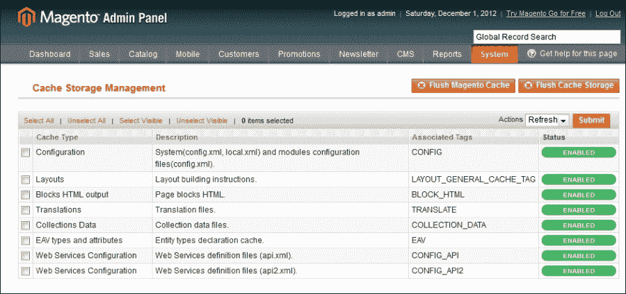
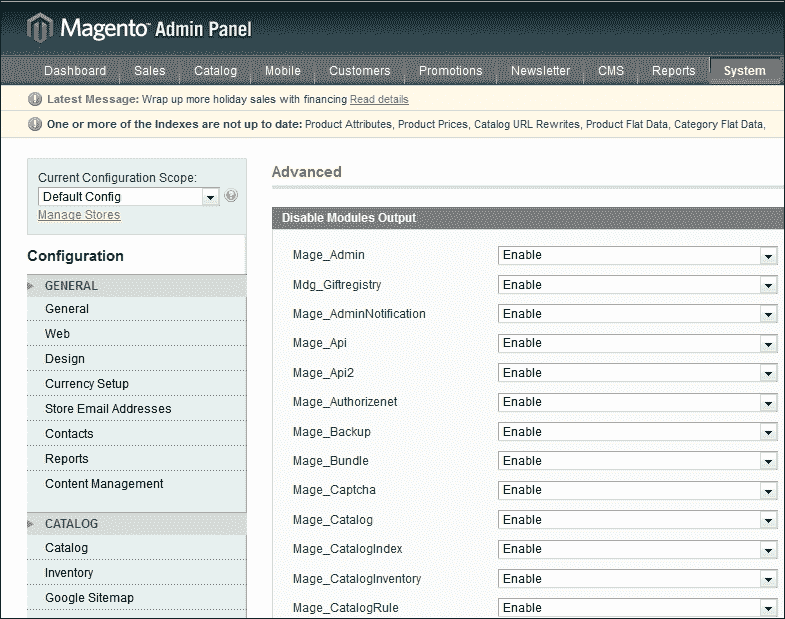
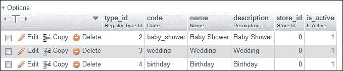

# 第三章 前端开发

到目前为止，我们一直专注于 Magento 的理论、其架构以及熟悉日常 Magento 开发的常见和重要概念。

在本章中，我们将通过逐步构建一个用于我们前端的前端 Magento 扩展来实际应用我们迄今为止获得的技能和知识。我们将构建一个功能齐全的礼品登记册扩展。

# 扩展 Magento

在我们跳过并构建我们的扩展之前，让我们定义一个示例场景和扩展的范围。这样，我们将清楚地了解我们正在构建的内容，更重要的是，我们不是在构建什么。

## 场景

我们的场景很简单。我们希望扩展 Magento，允许客户创建礼品登记册列表并与他们的朋友和家人分享。客户应该能够创建多个礼品登记册并指定这些登记册的收件人。

礼品登记册将包含以下信息：

+   活动类型

+   活动名称

+   活动日期

+   活动地点

+   产品列表

## 功能

看看以下功能：

+   店铺管理员可以定义多种活动类型（生日、婚礼和礼品登记册）

+   创建事件并将多个礼品登记册列表分配给每个事件

+   客户可以从购物车、愿望清单或直接从产品页面将产品添加到他们的登记册中

+   客户可以有多个礼品登记册

+   人们可以通过电子邮件和/或直接链接与朋友和家人分享他们的登记册

+   朋友和家人可以从礼品登记册购买商品

## 进一步改进

以下是一个列表，其中包含由于复杂性或社交媒体（由于它们的 API 和社交媒体平台数量不断变化）而被排除在这个示例扩展之外的可能功能。然而，它们仍然是希望进一步扩展此模块的读者的好挑战。以下功能如下：

+   社交媒体集成

+   跟踪每个登记册商品的请求和完成数量

+   指定多个不同的登记册所有者

+   将商品递送到登记册所有者的地址

# 嗨，Magento！

在前面的章节中，我们学习了 Magento 代码池（核心、社区和本地）。由于我们不打算在 Magento Connect 上分发我们的模块，我们将在本地目录下创建它。

所有 Magento 模块都保存在包或命名空间中。例如，所有核心 Magento 模块都保存在 `Mage` 命名空间下。为了本书的目的，我们将使用 **Magento 开发者指南**（**Mdg**）。

Magento 对模块的命名约定是 `Namespace_Modulename`

我们下一步是创建模块结构和配置文件。我们需要在 `app/code/local/` 下创建一个 "命名空间" 目录。

命名空间可以是任何你喜欢的。接受的约定是使用公司名称或作者名称作为命名空间。因此，我们的第一步是创建`app/code/local/Mdg/`目录。这个目录不仅将包含我们的礼品注册模块，还将包含我们未来开发的任何模块。

在我们的命名空间目录下，我们还需要创建一个以我们的模块命名的新的目录，该目录将包含所有自定义扩展的代码。

因此，让我们继续创建一个`Giftregistry`目录。一旦完成，让我们创建位于`/app/code/local/Mdg/Giftregistry/`的其余目录结构。

```php
Block/
Controller/
controllers/
Helper/
etc/
Model/
sql/
```

### 注意

由于 Magento 使用工厂方法，它对驼峰式命名法的使用比较敏感。一般来说，在我们的模块/控制器/动作名称中避免使用驼峰式命名法是一个好主意。有关 Magento 命名约定的更多信息，请参阅本书附录。

如我们所知，Magento 使用 XML 文件作为其配置的核心部分。为了使一个模块能被 Magento 识别和激活，我们需要在`app/etc/modules/`目录下创建一个遵循`Namespace_Modulename.xml`约定的单个文件。让我们创建位于`app/etc/modules/Mdg_Giftregistry.xml`的文件：

```php
<?xml version="1.0"?>
<config>
  <modules>
    <Mdg_Giftregistry>
      <active>true</active>
      <codePool>local</codePool>
    </Mdg_Giftregistry>
  </modules>
</config>
```

在创建此文件或对我们的模块配置文件进行任何更改后，我们需要刷新 Magento 配置缓存：

1.  导航到 Magento 后端。

1.  前往**系统** | **缓存管理**菜单。

1.  点击**清除 Magento 缓存**。

由于我们正在开发扩展，并且将频繁更改配置和扩展代码，禁用缓存是一个好主意：

1.  导航到 Magento 后端。

1.  前往**系统** | **缓存管理**菜单。

1.  在**缓存类型**下选择所有复选框。

1.  从**操作**下拉菜单中选择**禁用**。

1.  点击**提交**按钮。

一旦我们清除了缓存，我们可以通过进入 Magento 后端的**系统** | **高级**部分并确认我们的新模块显示在列表中来确认我们的扩展已被激活。



Magento 现在知道我们的模块了，但我们还没有告诉 Magento 我们的模块应该做什么。为此，我们需要设置模块配置。

# XML 模块配置

模块配置涉及两个主要文件，`config.xml`和`system.xml`。除了这些，模块配置还存储在以下文件中：

+   `api.xml`

+   `adminhtml.xml`

+   `cache.xml`

+   `widget.xml`

+   `wsdl.xml`

+   `wsi.xml`

+   `convert.xml`

在本章中，我们将只关注`config.xml`。让我们创建我们的基本文件，并分解每个节点：

1.  首先，在我们的模块`etc/`目录下创建`config.xml`文件。

1.  将给定的代码复制到位于`app/code/local/Mdg/Giftregistry/etc/config.xml`的`config.xml`文件中：

    ```php
    <?xml version="1.0">
    <config>
      <modules>
        <Mdg_Giftregistry>
          <version>0.2.0</version>
        </Mdg_Giftregistry>
      </modules>
      <global>
        <models>
          <mdg_giftregistry>
            <class>Mdg_Giftregistry_Model</class>
          </mdg_giftregistry>
        </models>
        <blocks>
          <mdg_giftregistry>
            <class>Mdg_Giftregistry_Block</class>
          </mdg_giftregistry>
        </blocks>
        <helpers>
          <mdg_giftregistry>
            <class>Mdg_Giftregistry_Helper</class>
          </mdg_giftregistry>
        </helpers>
        <resources>
          <mdg_giftregistry_setup>
            <setup>
              <module>Mdg_Giftregistry</module>
            </setup>
          </mdg_giftregistry_setup>
        </resources>
      </global>
    </config>
    ```

所有模块配置都包含在 `<config>` 节点内。在这个节点内，我们有 `<global>` 和 `<modules>` 节点。

`<modules>` 节点仅用于指定当前模块版本，该版本随后用于决定要运行哪些安装和升级脚本。

有三个主要的配置节点，最常用于指定配置范围：

+   `<global>`

+   `<adminhtml>`

+   `<frontend>`

现在，我们将专注于 `<global>` 范围。这将使任何配置对 Magento 前端和后端都可用。在 `<global>` 节点下，我们有以下节点：

+   `<models>`

+   `<blocks>`

+   `<helpers>`

+   `<resources>`

如我们所见，每个节点遵循相同的配置模式：

```php
<context>
  <factory_alias>
    <class>NameSpace_ModuleName_ClassType</class>
  </factory_alias>
</context>
```

每个节点都由 Magento 类 **factories** 用于实例化我们的自定义对象。`<factory_alias>` 节点是我们的扩展配置的关键部分；它被工厂方法如 `Mage::getModel()` 或 `Mage::helper()` 使用。

注意，我们并没有定义每个具体的 **Model**、**Block** 或 **Helper**，只是 Magento 工厂可以找到它们的路径。Magento 的命名约定允许我们在每个这些文件夹下有任意文件夹结构，并且 Magento 足够智能，能够加载适当的类。

### 注意

在 Magento 中，类名和目录结构是相同的。

例如，我们可以在 `app/code/local/Mdg/Giftregistry/Models/Folder1/Folder2/Folder3` 下创建一个新的模型类，并且实例化这个类的工厂名称如下：

```php
Mage::getModel('mdg_giftregistry/folder1_folder2_folder3_classname');
```

让我们创建我们的第一个模型，或者更具体地说，我们的辅助类。辅助类用于包含执行常见任务的实用方法，并且可以在不同的类之间共享。

让我们继续在 `app/code/loca/Mdg/Giftregistry/Helper/Data.php` 创建一个空的辅助类（我们将在本章后面添加辅助逻辑）：

```php
<?php
  class Mdg_Giftregistry_Helper_Data extends Mage_Core_Helper_Abstract {

}
```

我们将我们的辅助类命名为 `Data` 可能看起来有些奇怪，但实际上这是 Magento 标准的一部分。每个模块都有一个默认的辅助类名为 `Data`。关于辅助类还有一个有趣的事情，它们可以直接传递 `<factory_alias>` 而不是特定类的名称给 `helper` 工厂方法，这将默认为 `Data` 辅助类。

因此，如果我们想实例化我们的默认辅助类，我们只需要做以下操作：

```php
Mage::helper('mdg_registry');
```

# 模型和保存数据

在直接创建我们的模型之前，我们需要明确我们要构建什么类型的模型以及需要多少个。因此，让我们回顾我们的示例场景。对于我们的礼品注册，看起来我们需要两个不同的模型，如下所示：

+   **注册模型**：用于存储礼品注册信息，例如礼品注册类型、地址和收件人信息

+   **注册项**：用于存储每个礼品注册项的信息（例如，请求的数量、购买的数量和产品 ID）

虽然这种方法是正确的，但它并不满足我们示例场景的所有要求。由于所有注册信息都存储在单个表中，我们无法在不修改代码的情况下添加更多注册类型。

因此，在这种情况下，我们需要将我们的数据分解成多个表：

+   **注册实体**：此用于存储礼品注册和活动信息

+   **注册类型**：通过将礼品注册类型存储到单独的表中，我们可以添加或删除事件类型

+   **注册项**：此用于存储每个礼品注册项的信息（例如，请求的数量、购买的数量和 product_id）

现在我们已经定义了我们的数据结构，我们可以开始构建相应的模型，这将使我们能够访问和操作我们的数据。

## 创建模型

让我们首先创建`Giftregistry`类型模型，该模型用于管理注册类型（婚礼、生日、婴儿洗礼等）：

1.  导航到我们模块目录中的`Model`文件夹。

1.  创建一个名为`Type.php`的新文件，并将以下内容复制到位于`app/code/local/Mdg/Giftregistry/Model/Type.php`的文件中：

    ```php
    <?php
    class Mdg_Giftregistry_Model_Type extends Mage_Core_Model_Abstract
    {
      public function _construct()
      {
        $this->_init('mdg_giftregistry/type');
        parent::_construct();
      }
    }
    ```

我们还需要创建一个资源类。每个 Magento 数据模型都有自己的资源类。同样重要的是要明确，只有直接处理数据的模型，无论是简单数据模型还是 EAV 模型，才需要具有资源类。

1.  导航到我们模块目录中的`Model`文件夹。

1.  在`Model`下创建一个新的文件夹，命名为`Resource`。

1.  创建一个名为`Type.php`的新文件，并将以下内容复制到位于`app/code/local/Mdg/Giftregistry/Model/Resource/Type.php`的文件中：

    ```php
    <?php
    class Mdg_Giftregistry_Model_Resource_Type extends Mage_Core_Model_Resource_Db_Abstract
    {
      public function _construct()
      {
        $this->_init('mdg_giftregistry/type', 'type_id');
      }
    }
    ```

最后，我们还需要一个`collection`类来检索所有可用的活动类型。执行以下步骤：

1.  导航到我们模块目录中的`Model`/`Resource`文件夹。

1.  创建一个名为`Type`的新文件夹。

1.  在`Type`文件夹中创建一个名为`Collection.php`的新文件，并将以下内容复制到位于`app/code/local/Mdg/Giftregistry/Model/Resource/Type/Collection.php`的文件中：

    ```php
    <?php
    class Mdg_Giftregistry_Model_Resource_Type_Collection extends Mage_Core_Model_Resource_Db_Collection_Abstract{
        public function _construct()
        {
          $this->_init('mdg_giftregistry/type');
          parent::_construct();
        }
    }
    ```

让我们做同样的事情，创建另一个模型来处理礼品注册项。此模型将包含注册项的所有相关产品信息。

1.  导航到我们模块目录中的`Model`文件夹。

1.  创建一个名为`Item.php`的新文件，并将以下内容复制到位于`app/code/local/Mdg/Giftregistry/Model/Item.php`的文件中：

    ```php
    <?php
    class Mdg_Giftregistry_Model_Item extends Mage_Core_Model_Abstract
    {
      public function __construct()
      {
        $this->_init('mdg_giftregistry/item');
        parent::_construct();
      }
    }
    ```

让我们继续创建资源类：

1.  导航到我们模块目录中的`Model`文件夹。

1.  打开`Resource`文件夹。

1.  创建一个名为`Item.php`的新文件，并将以下内容复制到位于`app/code/local/Mdg/Giftregistry/Model/Resource/Item.php`的文件中：

    ```php
    <?php
    class Mdg_Giftregistry_Model_Resource_Item extends Mage_Core_Model_Resource_Db_Abstract
    {
      public function _construct()
      {
        $this->_init('mdg_giftregistry/item', 'item_id');
      }
    }
    ```

最后，让我们创建相应的集合类：

1.  导航到我们模块目录中的`Model`/`Resource`文件夹。

1.  创建一个`Item`文件夹。

1.  创建一个名为`Item`/`Collection.php`的新文件，并将以下内容复制到位于`app/code/local/Mdg/Giftregistry/Model/Resource/Item/Collection.php`的文件中：

    ```php
    <?php
    class Mdg_Giftregistry_Model_Resource_Item_Collection extends Mage_Core_Model_Resource_Db_Collection_Abstract
    {
      public function _construct()
      {
        $this->_init('mdg_giftregistry/item');
        parent::_construct();
      }
    }
    ```

我们接下来的步骤将是创建我们的`registry`实体。这是我们的注册核心，也是将所有内容联系在一起的模式。执行以下步骤：

1.  导航到我们模块目录中的`Model`文件夹。

1.  创建一个名为`Entity.php`的新文件，并将以下内容复制到位于`app/code/local/Mdg/Giftregistry/Model/Entity.php`的文件中：

    ```php
    <?php
    class Mdg_Giftregistry_Model_Entity extends Mage_Core_Model_Abstract
    {
      public function __construct()
      {
        $this->_init('mdg_giftregistry/entity');
        parent::_construct();
      }
    }
    ```

让我们继续创建资源类：

1.  导航到我们模块目录中的`Model`文件夹。

1.  打开`Resource`文件夹。

1.  创建一个名为`Entity.php`的新文件，并将以下内容复制到位于`app/code/local/Mdg/Giftregistry/Model/Resource/Entity.php`的文件中：

    ```php
    <?php
    class Mdg_Giftregistry_Model_Resource_Entity extends Mage_Core_Model_Resource_Db_Abstract{
      public function _construct()
      {
        $this->_init('mdg_giftregistry/entity', 'entity_id');
      }
    }
    ```

最后，让我们创建相应的集合类：

1.  导航到我们模块目录中的`Model`/`Resource`文件夹。

1.  创建一个名为`Entity`的新文件夹。

1.  创建一个名为`Entity`/`Collection.php`的新文件，并将以下内容复制到位于`app/code/local/Mdg/Giftregistry/Model/Resource/Entity/Collection.php`的文件中：

    ```php
    <?php
    class Mdg_Giftregistry_Model_Resource_Entity_Collection extends Mage_Core_Model_Resource_Db_Collection_Abstract
    {
      public function _construct()
      {
        $this->_init('mdg_giftregistry/entity');
        parent::_construct();
      }
    }
    ```

到目前为止，我们只是盲目地通过复制代码和添加类到我们的模块中创建了新的模型。现在，让我们测试我们新创建的模型。

在本书的先前版本中，我们使用**交互式 Magento 控制台**（**IMC**）来即时测试代码。如今，社区已经构建了一个功能更强大的工具，它不仅允许我们交互式地测试代码，还可以直接从 shell 运行常见和有用的命令。这个工具被称为**Netz98/n98-magerun**。

### 注意

这个 Netz98/n98-magerun 工具可以在[`github.com/netz98/n98-magerun`](https://github.com/netz98/n98-magerun)下载。

让我们启动`dev`控制台，并通过在 Magento 安装根目录下运行以下命令来尝试新的模型：

```php
$ n98-magerun.php dev:console

```

以下代码假设你正在运行一个带有示例数据的 Magento 测试安装：

1.  我们将从加载`customer`模型开始：

    ```php
    php > $customer = Mage::getModel('customer/customer')->load(1);

    ```

1.  接下来，我们需要实例化一个新的注册对象：

    ```php
    php > $registry = Mage::getModel('mdg_giftregistry/entity');

    ```

1.  所有 Magento 模型都包含的一个方便的函数是`getData()`函数，它返回一个包含所有对象属性的数组。让我们在`registry`和`customer`对象上运行这个函数，并比较输出：

    ```php
    php > print_r($customer->getData());
    php > print_r($registry->getData());

    ```

1.  你可能会注意到，客户拥有我们 John Doe 示例记录的所有数据集，而`registry`对象返回一个完全空的数组。让我们通过运行以下代码来改变这一点：

    ```php
    php > $registry->setCustomerId($customer->getId());
    php > $registry->setTypeId(1);
    php > $registry->setWebsiteId(1);
    php > $registry->setEventDate('2012-12-12');
    php > $registry->setEventCountry('CA');
    php > $registry->setEventLocation('Toronto');

    ```

1.  现在，让我们再次尝试通过运行以下代码来打印`registry`数据：

    ```php
    php > print_r($registry->getData());

    ```

1.  最后，为了使我们的更改永久生效，我们需要调用模型的`save()`函数：

    ```php
    php > $registry->save();

    ```

哎呀！保存产品时出了点问题。我们在控制台得到了以下错误：

```php
Fatal error: Call to a member function beginTransaction() on a non-object in …/app/code/core/Mage/Core/Model/Abstract.php on line 313

```

发生了什么？正在调用的 `save()` 函数是父类 `Mage_Core_Model_Resource_Abstract` 的一部分，它反过来调用抽象类的 `save()` 函数，但我们遗漏了 `config.xml` 文件的一个关键部分。

为了让 Magento 正确识别要使用哪个资源类，我们需要为每个实体指定资源模型类和匹配的表。让我们继续更新我们的配置文件：

1.  导航到扩展 `etc/` 文件夹。

1.  打开 `config.xml`。

1.  使用以下代码更新位于 `app/code/local/Mdg/Giftregistry/etc/config.xml` 的 `<models>` 节：

    ```php
    …
    <models>
      <mdg_giftregistry>
        <class>Mdg_Giftregistry_Model</class>
        <resourceModel>mdg_giftregistry_mysql4</resourceModel>
      </mdg_giftregistry>
      <mdg_giftregistry_mysql4>
        <class>Mdg_Giftregistry_Model_Mysql4</class>
        <entities>
          <entity>
            <table>mdg_giftregistry_entity</table>
          </entity>
          <item>
            <table>mdg_giftregistry_item</table>
          </item>
          <type>
            <table>mdg_giftregistry_type</table>
          </type>
        </entities>
      </mdg_giftregistry_mysql4>
    </models>
    …
    ```

现在，在我们实际上将产品保存到数据库之前，我们必须首先创建我们的数据库表。接下来，我们将学习如何使用设置资源来创建我们的表结构并设置默认数据。

## 设置资源

现在我们已经创建了我们的模型代码，我们需要创建设置资源以便能够保存它们。设置资源将负责创建相应的数据库表。现在，我们本可以使用直接的 **SQL** 或如 **phpmyadmin** 这样的工具来创建所有表。然而，这不是标准做法，并且按照一般规则，我们绝对不应该直接修改 Magento 数据库。

为了实现这一点，我们将执行以下操作：

+   在配置文件上定义设置资源

+   创建资源类

+   创建安装脚本

+   创建数据脚本

+   创建升级脚本

### 定义设置资源

当我们最初定义配置文件时，我们定义了一个 `<resources>` 节点，它位于 `app/code/local/Mdg/Giftregistry/etc/config.xml`：

```php
<resources>
  <mdg_giftregistry_setup>
    <setup>
      <module>Mdg_Giftregistry</module>
    </setup>
  </mdg_giftregistry_setup>
</resources>
```

首先要注意的是 `<mdg_giftregistry_setup>` 被用作我们设置资源的唯一标识符。标准的命名约定是 `<modulename_setup>`，虽然这不是必需的，但强烈建议遵循此命名约定。创建此设置资源对于基本的设置脚本不是必需的，可以使用 `Mage_Core_Model_Resource_Setup` 代替，但通过创建我们自己的设置类，我们是在为未来的改进做规划，并给自己提供更多的灵活性。

添加此资源节点允许 Magento 跟踪已安装的每个扩展的版本和数据。我们将利用这个功能，并创建一个升级脚本来创建我们需要的表。

### 创建升级脚本

我们下一步要创建一个升级脚本。这个脚本包含了创建我们所需表的所有 SQL 代码。首先，让我们再次快速查看我们的 `config.xml` 文件。如果我们记得，在我们 `<global>` 节之前定义的第一个节点是 `<modules>` 节，它位于 `app/code/local/Mdg/Giftregistry/etc/config.xml`：

```php
<modules>
  <Mdg_Giftregistry>
    <version>0.2.0</version>
  </Mdg_Giftregistry>
</modules>
```

如我们之前提到的，此节点在所有 Magneto 模块中都是必需的，用于标识当前安装的模块版本。这个版本号被 Magento 用于识别要运行哪些安装和升级脚本。

### 备注

**关于命名约定的一词**: 自 Magento 1.6 以来，设置脚本的命名约定已更改。最初使用的是 `mysql4-install-x.x.x.php` 命名约定。它目前已被弃用但仍受支持。

自 Magento 1.6 以来，设置脚本的命名约定已更改，现在，开发者可以使用三种不同的脚本类型：

+   **安装**: 当模块首次安装且在 `core_resource` 表上没有记录时使用

+   **升级**: 如果 `core_resource` 表中的版本低于 `config.xml` 文件中的版本，则使用此选项

+   **数据**: 这将在匹配版本的安装/升级脚本之后运行，并用于向表中填充所需数据

### 注意

数据脚本自 Magento 1.6 以来被引入，并存储在我们的模块根目录下的 data 目录中。它们遵循与安装和升级脚本略有不同的约定，通过添加前缀。

让我们在安装脚本中继续创建我们的注册实体表，该脚本位于 `app/code/local/Mdg/Giftregistry/sql/mdg_giftregistry_setup/upgrade-0.2.0-0.2.1.php`：

```php
<?php

$installer = $this;
$installer->startSetup();
// Create the mdg_giftregistry/registry table
$tableName = $installer->getTable('mdg_giftregistry/entity');
// Check if the table already exists
if ($installer->getConnection()->isTableExists($tableName) != true) {
    $table = $installer->getConnection()
        ->newTable($tableName)
        ->addColumn('entity_id', Varien_Db_Ddl_Table::TYPE_INTEGER, null,
            array(
                'identity' => true,
                'unsigned' => true,
                'nullable' => false,
                'primary' => true,
            ),
            'Entity Id'
        )
        ->addColumn('customer_id', Varien_Db_Ddl_Table::TYPE_INTEGER, null,
            array(
                'unsigned' => true,
                'nullable' => false,
                'default' => '0',
            ),
            'Customer Id'
        )
        ->addColumn('type_id', Varien_Db_Ddl_Table::TYPE_SMALLINT, null,
            array(
                'unsigned' => true,
                'nullable' => false,
                'default' => '0',
            ),
            'Type Id'
        )
        ->addColumn('website_id', Varien_Db_Ddl_Table::TYPE_SMALLINT, null,
            array(
                'unsigned' => true,
                'nullable' => false,
                'default' => '0',
            ),
            'Website Id'
        )
        ->addColumn('event_name', Varien_Db_Ddl_Table::TYPE_TEXT, 255,
            array(),
            'Event Name'
        )
        ->addColumn('event_date', Varien_Db_Ddl_Table::TYPE_DATE, null,
            array(),
            'Event Date'
        )
        ->addColumn('event_country', Varien_Db_Ddl_Table::TYPE_TEXT, 3,
            array(),
            'Event Country'
        )
        ->addColumn('event_location', Varien_Db_Ddl_Table::TYPE_TEXT, 255,
            array(),
            'Event Location'
        )
        ->addColumn('created_at', Varien_Db_Ddl_Table::TYPE_TIMESTAMP, null,
            array(
                'nullable' => false,
            ),
            'Created At')
        ->addIndex($installer- >getIdxName('mdg_giftregistry/entity', array('customer_id')),
            array('customer_id'))
        ->addIndex($installer- >getIdxName('mdg_giftregistry/entity', 
        array('website_id')),
            array('website_id'))
        ->addIndex($installer- >getIdxName('mdg_giftregistry/entity', array('type_id')),
            array('type_id'))
        ->addForeignKey(
            $installer->getFkName(
                'mdg_giftregistry/entity',
                'customer_id',
                'customer/entity',
                'entity_id'
            ),
            'customer_id', $installer- >getTable('customer/entity'), 'entity_id',
            Varien_Db_Ddl_Table::ACTION_CASCADE, Varien_Db_Ddl_Table::ACTION_CASCADE)
        ->addForeignKey(
            $installer->getFkName(
                'mdg_giftregistry/entity',
                'website_id',
                'core/website',
                'website_id'
            ),
            'website_id', $installer->getTable('core/website'), 'website_id',
            Varien_Db_Ddl_Table::ACTION_CASCADE, Varien_Db_Ddl_Table::ACTION_CASCADE)
        ->addForeignKey(
            $installer->getFkName(
                'mdg_giftregistry/entity',
                'type_id',
                'mdg_giftregistry/type',
                'type_id'
            ),
            'type_id', $installer- >getTable('mdg_giftregistry/type'), 'type_id',
            Varien_Db_Ddl_Table::ACTION_CASCADE, Varien_Db_Ddl_Table::ACTION_CASCADE);

    $installer->getConnection()->createTable($table);
}
$installer->endSetup();
```

### 注意

请注意，由于空间限制，我们没有添加完整的安装脚本。您仍然需要为项目表和类型表添加安装器代码。完整的安装文件和代码文件可以直接在 [`github.com/amacgregor/mdg_giftreg`](https://github.com/amacgregor/mdg_giftreg) 下载。

现在可能看起来像很多代码，但它只创建了一个表。为了理解它，让我们分解它并确切地看看代码做了什么。

首先，要注意的是，即使我们在创建和设置数据库表，我们也没有编写任何 SQL。Magento ORM 提供了一个与数据库的适配器。所有的安装、升级和数据脚本都继承自 `Mage_Core_Model_Resource_Setup`。让我们分析一下安装脚本中使用的每个函数。

脚本的前三行通过实例化 `resource_setup` 模型和连接开始。其余的脚本处理设置新的表实例，并在其上调用以下函数：

+   `addColumn`: 这个函数用于定义表中的每个列，并接受以下五个参数：

    +   `name`: 这是列的名称

    +   `type`: 这是数据存储类型（`int`、`varchar`、`text` 等）

    +   `size`: 这是列的长度

    +   `options`: 这是一个用于数据存储的附加选项数组

    +   `comment`: 这是列的描述

+   `addIndex`: 这个函数用于定义特定表的索引，并接受以下三个参数：

    +   `index`: 这是索引的名称

    +   `columns`: 这可以是一个包含单个列名的字符串或一个包含多个列名的数组

    +   `options`: 这是一个用于数据存储的附加选项数组

+   `addForeginKey`: 这个函数用于定义外键关系，并接受以下六个参数：

    +   `fkName`：这是外键的名称

    +   `column`：这是外键列的名称

    +   `refTable`：这是参考表的名称。

    +   `refColumn`：这是参考表列的名称。

    +   `onDelete`：这是删除行的操作

    +   `onUpdate`：这是更新行的操作

创建我们每个表的代码基本上由这三个函数组成。在每个表定义之后，执行以下代码：

```php
$installer->getConnection()->createTable($table);
```

这段代码告诉我们的数据库适配器将我们的代码转换为 SQL 并在数据库上运行它。有一个重要的事情要注意。我们不是提供或硬编码数据库名称，而是调用以下代码：

```php
$installer->getTable('mdg_giftregistry/entity')
```

这是我们在`config.xml`文件中定义的表别名。为了完成我们的安装程序，我们需要为我们的每个实体创建一个`newTable`实例。数据脚本可以用来填充我们的表。在我们的案例中，这将非常有用，用于设置一些基本的事件类型。

我们首先需要在数据文件夹下创建一个数据安装脚本。正如我们之前提到的，结构非常类似于 SQL 文件夹，唯一的区别是我们将数据前缀附加到匹配的安装/升级脚本。执行以下步骤：

1.  通过导航到`app/code/local/Mdg/Giftregistry/data/`进入模块数据文件夹。

1.  根据资源创建一个新的目录。在这种情况下，它将是`mdg_giftregistry_setup`。

1.  在`mdg_giftregistry_setup`下创建一个名为`data-upgrade-0.2.0-0.2.1.php`的文件。

1.  将以下代码复制到位于`app/code/local/Mdg/Giftregistry/data/mdg_giftregistry_setup/data-upgrade-0.2.0-0.2.1.php <?php`的`data-upgrade-0.2.0-0.2.1.php`：

    ```php
    $registryTypes = array(
        array(
            'code' => 'baby_shower',
            'name' => 'Baby Shower',
            'description' => 'Baby Shower',
            'store_id' => Mage_Core_Model_App::ADMIN_STORE_ID,
            'is_active' => 1,
        ),
        array(
            'code' => 'wedding',
            'name' => 'Wedding',
            'description' => 'Wedding',
            'store_id' => Mage_Core_Model_App::ADMIN_STORE_ID,
            'is_active' => 1,
        ),
        array(
            'code' => 'birthday',
            'name' => 'Birthday',
            'description' => 'Birthday',
            'store_id' => Mage_Core_Model_App::ADMIN_STORE_ID,
            'is_active' => 1,
        ),
    );

    foreach ($registryTypes as $data) {
        Mage::getModel('mdg_giftregistry/type')
            ->addData($data)
            ->setStoreId($data['store_id'])
            ->save();
    }
    ```

让我们仔细看看`data-install-0.1.0.php`脚本中的最后一个条件块：

```php
foreach ($registryTypes as $data) {
    Mage::getModel('mdg_giftregistry/type')
        ->addData($data)
        ->setStoreId($data['store_id'])
        ->save();
}
```

现在，如果我们刷新我们的 Magento 安装，错误应该会消失。如果我们仔细查看`mdg_giftregistry_type`表，我们应该看到以下记录：



正如我们之前所学的，安装和数据脚本将在我们的模块第一次安装时运行。然而，在我们的案例中，当 Magento 已经认为我们的模块已经安装时，会发生什么呢？

由于模块已经在`core_resource`表中注册，除非 Magento 检测到扩展的版本变化，否则安装脚本将不会再次运行。这对于处理扩展的多个版本非常好，但不太适合开发目的。

幸运的是，很容易欺骗 Magento 再次运行我们的扩展安装脚本。我们只需要删除`core_resource`表中的相应条目：

1.  打开你的 MySQL 控制台。如果你使用我们的 Vagrant 盒子，你只需通过输入`mysql`来打开它。

1.  一旦我们进入 MySQL shell，我们需要选择我们的工作数据库。

1.  最后，我们需要使用以下查询添加`core_resource`表中的条目：

    ```php
    mysql> DELETE FROM core_resource WHERE code =  'mdg_giftregistry_setup'

    ```

## 我们所学到的东西

到目前为止，我们已经学到了以下内容：

+   为了创建我们的 Magento 模块的基础目录结构

+   配置文件的角色和重要性

+   创建模型和设置资源

+   安装、升级和数据脚本的角色和顺序

# 设置我们的路由

现在我们能够通过使用我们的模型来保存和操作数据，我们需要提供一个让客户与实际的礼物登记册交互的方法。我们的第一步是创建前端的有效路由或 URL。

就像许多在 Magento 中的事情一样，这由配置文件控制。一个路由会将 URL 转换为有效的控制器、动作和方法。

打开我们的`config.xml`文件，并插入以下代码，位于`app/code/local/Mdg/Giftregistry/etc/config.xml`：

```php
<config>

  <frontend>
    <routers>
      <mdg_giftregistry>
        <use>standard</use>
        <args>
          <module>Mdg_Giftregistry</module>
          <frontName>giftregistry</frontName>
        </args>
      </mdg_giftregistry>
    </routers>
  </frontend>

</config>
```

让我们分解我们刚刚添加的配置代码：

+   `<frontend>`: 之前，我们在全局范围内添加了所有配置。由于我们希望我们的路由仅在前端可用，因此我们需要在`frontend`作用域下声明我们的自定义路由。

+   `<routers>`: 这是一个容器标签，包含我们自定义路由的配置。

+   `<mdg_giftregistry>`: 这个标签的命名规范是为了与模块名称匹配，并且是我们路由的唯一标识符。

+   `<frontName>`: 正如我们在第二章中学习的，*ORM 和数据集合*，将 URL 分解为以下部分：`http://localhost.com/frontName/actionControllerName/actionMethod/`。

一旦我们定义了我们的路由配置，我们需要创建一个实际的控制器来处理所有传入的请求。

## IndexController

我们的第一步是在我们的模块控制器目录下创建一个`IndexController`。如果没有指定控制器名称，Magento 将始终尝试加载`IndexController`，它位于`app/code/local/Mdg/Giftregistry/controllers/IndexController.php`：

```php
<?php
class Mdg_Giftregistry_IndexController extends Mage_Core_Controller_Front_Action
{
     public function indexAction()
  {
    echo 'This is our test controller';
     }
}
```

创建我们的文件后，如果我们访问`http://localhost.com/giftregistry/index/index`，我们应该看到一个空白页面，上面只有消息`This is our test controller`。这是因为我们没有加载布局。为了正确加载我们的客户控制器布局，我们需要将我们的动作代码更改为以下内容，该代码位于`app/code/local/Mdg/Giftregistry/controllers/IndexController.php`：

```php
<?php
class Mdg_Giftregistry_IndexController extends Mage_Core_Controller_Front_Action
{
  public function indexAction()
  {
    $this->loadLayout();
    $this->renderLayout();
  }
}
```

在深入探讨控制器动作的细节之前，让我们创建其余的控制器和相应的动作。

我们需要一个控制器来处理客户的基本操作，以便他们能够创建、管理和删除他们的登记册。此外，我们还需要一个`SearchController`，以便家人和朋友可以找到匹配的礼物登记册。最后，我们还需要一个`ViewController`来显示登记册的详细信息。

我们的第一步是将剩余的动作添加到位于`app/code/local/Mdg/Giftregistry/controllers/IndexController.php`的`IndexController`：

```php
<?php
class Mdg_Giftregistry_IndexController extends Mage_Core_Controller_Front_Action
{
    public function indexAction()
    {
        $this->loadLayout();
        $this->renderLayout();
        return $this;
    }

    public function deleteAction()
    {
        $this->loadLayout();
        $this->renderLayout();
        return $this;
    }

    public function newAction()
    {
        $this->loadLayout();
        $this->renderLayout();
        return $this;
    }

    public function editAction()
    {
        $this->loadLayout();
        $this->renderLayout();
        return $this;
    }

    public function newPostAction()
    {
        $this->loadLayout();
        $this->renderLayout();
        return $this;
    }

    public function editPostAction()
    {
        $this->loadLayout();
        $this->renderLayout();
        return $this;
    }
}
```

在我们开始向`IndexController`添加所有逻辑之前，我们需要采取额外的一步来防止未登录的客户访问`giftregistry`功能。Magento 前端控制器已经有一个非常实用的方法来处理这个问题；它被称为`preDispatch()`方法，它在控制器中的任何其他操作之前执行。

打开你的`IndexController.php`文件，并将以下代码添加到位于`app/code/local/Mdg/Giftregistry/controllers/IndexController.php`的类开头：

```php
<?php
class Mdg_Giftregistry_IndexController extends Mage_Core_Controller_Front_Action
{
    public function preDispatch()
    {
        parent::preDispatch();
        if (!Mage::getSingleton('customer/session')- >authenticate($this)) {
            $this->getResponse()- >setRedirect(Mage::helper('customer')->getLoginUrl());
            $this->setFlag('', self::FLAG_NO_DISPATCH, true);
        }
    }
```

现在，如果我们尝试加载`http://localhost.com/giftregistry/index/index`，除非我们在前端登录，否则我们将被重定向到登录页面。

我们的下一步是为每个控制器操作添加所有逻辑，以便控制器可以正确地处理创建、更新和删除。

索引、新建和编辑操作主要用于加载和渲染布局，因此在控制器中涉及到的逻辑并不多。另一方面，`newPostAction()`、`editPostAction()`和`deleteAction()`控制器处理更复杂和更重的逻辑。

让我们从`newPostAction()`控制器开始。这个操作用于处理从`newAction()`表单接收到的数据：

1.  打开`IndexController.php`文件。

1.  我们将要添加到操作中的第一件事是一个`if`语句，用来检查请求是否是一个可以通过以下代码检索的`Post`请求：

    ```php
    $this->getRequest()->isPost()
    ```

1.  此外，我们还想检查请求是否有实际数据。为此，我们可以使用以下代码：

    ```php
    $this->getRequest()->getParams()
    ```

一旦我们验证了请求是一个合适的请求，并且在接收数据时，我们需要实际创建一个礼品注册。为此，我们必须在我们的注册模型中添加一个新函数：

1.  打开注册`Entity`模型。

1.  创建一个名为`updateRegistryData()`的新函数，并确保该函数接受两个参数，`$customer`和`$data`。

1.  在以下位于`app/code/local/Mdg/Giftregistry/Model/Entity.php`的函数中添加以下代码：

    ```php
    public function updateRegistryData(Mage_Customer_Model_Customer $customer, $data)
    {
        try{
            if(!empty($data))
            {
                $this->setCustomerId($customer->getId());
                $this->setWebsiteId($customer->getWebsiteId());
                $this->setTypeId($data['type_id']);
                $this->setEventName($data['event_name']);
                $this->setEventDate($data['event_date']);
                $this->setEventCountry($data['event_country']);
                $this- >setEventLocation($data['event_location']);
            }else{
                throw new Exception("Error Processing Request: Insufficient Data Provided");
            }
        } catch (Exception $e){
            Mage::logException($e);
        }
        return $this;
    }
    ```

这个函数将帮助我们通过将表单数据添加到当前注册对象实例中，这意味着我们需要在我们的控制器中创建一个。让我们把我们的控制器代码放在一起，它位于`app/code/local/Mdg/Giftregistry/controllers/IndexController.php`：

```php
public function newPostAction()
{
    try {
        $data = $this->getRequest()->getParams();
        $registry = Mage::getModel('mdg_giftregistry/entity');
        $customer = Mage::getSingleton('customer/session')- >getCustomer();

        if($this->getRequest()->getPost() && !empty($data)) {
            $registry->updateRegistryData($customer, $data);
            $registry->save();
            $successMessage = Mage::helper('mdg_giftregistry')- >__('Registry Successfully Created');
            Mage::getSingleton('core/session')- >addSuccess($successMessage);
        }else{
            throw new Exception("Insufficient Data provided");
        }
    } catch (Mage_Core_Exception $e) {
        Mage::getSingleton('core/session')->addError($e- >getMessage());
        $this->_redirect('*/*/');
    }
    $this->_redirect('*/*/');
}
```

我们已经创建了一个非常基本的控制器操作，该操作将处理注册创建和大多数可能的异常。

让我们继续创建`editPostAction()`控制器。这个操作与`newPostAction()`控制器非常相似。主要区别在于，在`editPostAction()`控制器的情况下，我们正在处理一个已经存在的注册记录，因此我们将在设置数据之前需要添加一些验证。

让我们更仔细地看看操作代码，它位于`app/code/local/Mdg/Giftregistry/controllers/IndexController.php`：

```php
public function editPostAction()
{
    try {
        $data = $this->getRequest()->getParams();
        $registry = Mage::getModel('mdg_giftregistry/entity');
        $customer = Mage::getSingleton('customer/session')- >getCustomer();

        if($this->getRequest()->getPosts() && !empty($data)) {
            $registry->load($data['registry_id']);
            if($registry) {
                $registry->updateRegistryData($customer, $data);
                $registry->save();
                $successMessage =  Mage::helper('mdg_giftregistry')->__('Registry Successfully Saved');
                Mage::getSingleton('core/session')- >addSuccess($successMessage);
            }else {
                throw new Exception("Invalid Registry Specified");
            }
        }else {
            throw new Exception("Insufficient Data provided");
        }
    } catch (Mage_Core_Exception $e) {
        Mage::getSingleton('core/session')->addError($e- >getMessage());
        $this->_redirect('*/*/');
    }
    $this->_redirect('*/*/');
}
```

如我们所见，这段代码基本上与我们的`newPostAction()`控制器相同，关键的区别在于它尝试在更新数据之前加载现有的登记。

### 注意

**挑战**：由于`editPostAction()`和`newPostAction()`之间的代码非常相似，尝试将两者合并为一个可重用的单个帖子操作。要查看完整的代码和完整的分解，请访问[`www.magedevguide.com/challenge/chapter3/3`](http://www.magedevguide.com/challenge/chapter3/3)。

为了最终确定`IndexController`，我们需要添加一个允许我们删除特定登记记录的操作。为此，我们将使用`deleteAction()`控制器。

多亏了 Magento 的**对象关系映射**（**ORM**）系统，这个过程真的很简单。Magento 模型继承了`delete`函数，正如其名，它将简单地删除那个特定的模型实例。

在你的`IndexController`中添加以下代码，这些代码位于`app/code/local/Mdg/Giftregistry/controllers/IndexController.php`：

```php
public function deleteAction()
{
    try {
        $registryId = $this->getRequest()- >getParam('registry_id');
        if($registryId && $this->getRequest()->getPost()){
            if($registry = Mage::getModel('mdg_giftregistry/entity')- >load($registryId))
            {
                $registry->delete();
                $successMessage =  Mage::helper('mdg_giftregistry')->__('Gift registry has been succesfully deleted.');
                Mage::getSingleton('core/session')- >addSuccess($successMessage);
            }else{
                throw new Exception("There was a problem deleting the registry");
            }
        }
    } catch (Exception $e) {
        Mage::getSingleton('core/session')->addError($e- >getMessage());
        $this->_redirect('*/*/');
    }
}
```

在我们的删除控制器中需要注意的重要操作如下：

1.  我们在我们的操作中检查正确的请求类型。

1.  我们实例化登记对象并验证它是否有效。

1.  最后，我们在登记实例上调用`delete()`函数。

到现在为止，你可能已经注意到，由于我们遗漏了一个关键的部分，我们无法将实际的产品添加到购物车中。

我们现在将跳过那个特定的操作，在我们更好地理解涉及的块和布局以及如何与我们的自定义控制器交互之后，再创建它。

## SearchController

现在我们已经有一个可以处理修改实际登记逻辑的大部分逻辑的`IndexController`，使用以下步骤，我们将创建下一个控制器，`SearchController`：

1.  在`controllers`目录下创建一个新的控制器，命名为`SearchController`。

1.  将以下代码复制到位于`app/code/local/Mdg/Giftregistry/controllers/SearchController.php`的`SearchController.php`文件中：

    ```php
    <?php
    class Mdg_Giftregistry_SearchController extends Mage_Core_Controller_Front_Action
    {
        public function indexAction()
        {
            $this->loadLayout();
            $this->renderLayout();
            return $this;
        }
        public function resultsAction()
        {
            $this->loadLayout();
            $this->renderLayout();
            return $this;
        }
    }
    ```

我们现在将保持`indexAction()`不变，并专注于`resultsAction()`中涉及的逻辑，该操作将接受搜索参数并加载一个登记集合。

让我们看一下完整的操作代码，并对其进行分解，这些代码位于`app/code/local/Mdg/Giftregistry/controllers/SearchController.php`：

```php
public function resultsAction()
{
    $this->loadLayout();
    if ($searchParams = $this->getRequest()- >getParam('search_params')) {
        $results = Mage::getModel('mdg_giftregistry/entity')- >getCollection();
        if($searchParams['type']){
            $results->addFieldToFilter('type_id', $searchParams['type']);
        }
        if($searchParams['date']){
            $results->addFieldToFilter('event_date', $searchParams['date']);
        }
        if($searchParams['location']){
            $results->addFieldToFilter('event_location', $searchParams['location']);
        }
        $this->getLayout()- >getBlock('mdg_giftregistry.search.results')
            ->setResults($results);
    }
    $this->renderLayout();
    return $this;
}
```

与前面的操作一样，我们正在获取请求参数，但在这种特定情况下，我们加载一个礼品登记集合并为每个可用的字段应用字段过滤器。值得注意的是，这是我们第一次直接从 Magento 控制器与布局交互：

```php
$this->getLayout()->getBlock('mdg_giftregistry.search.results')
        ->setResults($results);
```

我们在这里所做的是使加载的登记集合可用于特定的块实例。

## ViewController

最后，我们需要一个控制器，允许显示登记详情，无论客户是否登录：

1.  在控制器目录下创建一个新的控制器，命名为`ViewController`。

1.  打开我们刚刚创建的控制器，并使用以下占位符代码，该代码位于`app/code/local/Mdg/Giftregistry/controllers/ViewController.php`：

    ```php
    <?php
    class Mdg_Giftregistry_ViewController extends Mage_Core_Controller_Front_Action
    {
        public function viewAction()
        {
            $registryId = $this->getRequest()- >getParam('registry_id');
            if($registryId){
                $entity = Mage::getModel('mdg_giftregistry/entity');
                if($entity->load($registryId))
                {
                    Mage::register('loaded_registry', $entity);
                    $this->loadLayout();
                    $this- >_initLayoutMessages('customer/session');
                    $this->renderLayout();
                    return $this;
                } else {
                    $this->_forward('noroute');
                    return $this;
                }
            }
        }
    }
    ```

因此，在这里，我们使用了一个名为`Mage::register()`的新函数，该函数设置一个全局变量，我们可以在应用程序流程中通过任何方法检索它。这个函数是 Magento 注册模式的一部分，包括以下三个函数：

+   `Mage::register()`: 这用于设置全局变量

+   `Mage::unregister()`: 这用于取消设置全局变量

+   `Mage::registry()`: 这用于检索全局变量

我们使用注册函数来在应用程序流程的后续部分提供对注册实体的访问，并在这种特定情况下，到我们将创建的视图块。

# 块和布局

如我们在第二章中学到的，*ORM 和数据集合*，Magento 将其视图层分为块、模板和布局文件。块是处理部分逻辑的对象。模板是混合了 HTML 和 PHP 代码的`.phtml`文件。布局文件是控制块位置的 XML 文件。

每个模块都有自己的布局文件，负责更新该特定模块的布局。我们需要首先为我们自己的模块创建一个布局文件：

1.  导航到`app/design/frontend/base/default/layout/`。

1.  创建一个名为`mdg_giftregistry.xml`的文件。

1.  在`app/design/frontend/base/default/layout/mdg_giftregistry.xml`位置添加以下代码：

    ```php
    <layout version="0.1.0">
      <mdg_giftregistry_index_index>
      </mdg_giftregistry_index_index>

      <mdg_giftregistry_index_new>
      </mdg_giftregistry_index_new>

      <mdg_giftregistry_index_edit>
      </mdg_giftregistry_index_edit>

      <mdg_giftregistry_view_view>
      </mdg_giftregistry_view_view>

      <mdg_giftregistry_search_index>
      </mdg_giftregistry_search_index>

      <mdg_giftregistry_search_results>
      </mdg_giftregistry_search_results>
    </layout>
    ```

### 注意

通过将我们的模板和布局添加到 base/default 主题，我们将使我们的模板和布局对所有商店和主题可用。

如果我们仔细查看我们刚刚粘贴的 XML，我们可以看到我们有一个默认的 XML 标签和几组标签。正如我们之前提到的，Magento 路由由前端名称、控制器和动作组成。

布局文件中的每个 XML 标签代表我们的一个控制器和动作。例如，`<giftregistry_index_index>`将控制`IndexController`的索引动作的布局。Magento 为每个页面分配一个唯一的处理程序。

为了让 Magento 识别我们的布局文件，我们需要在`config.xml`文件内部声明布局文件：

1.  导航到扩展`etc/`文件夹。

1.  打开`config.xml`。

1.  在`app/design/frontend/base/default/layout/mdg_giftregistry.xml`中的`<frontend>`节点内添加以下代码：

    ```php
    <frontend>
       <layout>
           <updates>
               <mdg_giftregistry module="mdg_giftregistry">
                   <file>mdg_giftregistry.xml</file>
               </mdg_giftregistry>
           </updates>
       </layout>

    </frontend>
    ```

## IndexController 块和视图

如我们之前所做的那样，我们将从构建`IndexController`开始。让我们定义每个动作所需的模板和块：

+   `索引`: 这是一个当前客户可用注册表的列表

+   `新建`: 这用于我们需要一个新表单来捕获注册信息

+   `编辑`: 这将加载特定的注册数据并将它们加载到表单中

对于索引操作，我们需要创建一个名为 `listed` 的新块，而 **新建** 和 **编辑** 操作可以共享它们的模板表单：

1.  让我们先创建注册信息的 `List` 块。

1.  导航到 `app/code/local/Mdg/Giftregistry/Block/`。

1.  创建一个名为 `List.php` 的文件。

1.  将以下代码复制到位于 `app/code/local/Mdg/Giftregistry/Block/List.php` 的位置：

    ```php
    <?php
    class Mdg_Giftregistry_Block_List extends Mage_Core_Block_Template
    {
        public function getCustomerRegistries()
        {
            $collection = null;
            $currentCustomer = Mage::getSingleton('customer/session')- >getCustomer();
            if($currentCustomer)
            {
                $collection = Mage::getModel('mdg_giftregistry/entity')- >getCollection()
                    ->addFieldToFilter('customer_id', $currentCustomer->getId());
            }
            return $collection;
        }
    }
    ```

之前的代码声明了将在 `IndexController` 中使用的 `list` 块。该块声明了 `getCustomerRegistries()`，这将检查当前客户并尝试根据该客户检索注册信息集合。

现在我们已经创建了一个新的块，我们需要将其添加到我们的布局 XML 文件中：

1.  打开 `mdg_giftregistry.xml` 布局文件。

1.  在位于 `app/design/frontend/base/default/layout/mdg_giftregistry.xml` 的 `<mdg_gifregistry_index_index>` 文件中添加以下代码：

    ```php
    <reference name="content">
        <block name="giftregistry.list" type="mdg_giftregistry/list" template="mdg/list.phtml" as="giftregistry_list"/>
    </reference>
    ```

在布局中，我们声明我们的块。在该声明内部，我们设置块名称的模板和类型。如果我们现在尝试加载 `IndexController` 页面，因为我们还没有创建模板文件，我们应该会看到一个关于缺失模板的错误。

让我们创建模板文件：

1.  导航到 `design/frontend/base/default/template/`.

1.  创建 `mdg/` 文件夹。

1.  在该文件夹内部，创建一个名为 `list.phtml` 的文件，位于 `app/design/frontend/base/default/template/mdg/list.phtml`：

    ```php
    <?php
    $_collection = $this->getCustomerRegistries();
    ?>
    <div class="customer-list">
        <ul>
            <?php foreach($_collection as $registry): ?>
                <li>
                    <h3><?php echo $registry->getEventName(); ?></h3>
                    <p><strong><?php echo $this->__('Event Date:') ?> <?php echo $registry- >getEventDate(); ?></strong></p>
                    <p><strong><?php echo $this->__('Event Location:') ?> <?php echo $registry- >getEventLocation(); ?></strong></p>
                    <a href="<?php echo $this- >getUrl('giftregistry/view/view', array('_query' => array('registry_id' => $registry->getEntityId()))) ?>">
                        <?php echo $this->__('View Registry') ?>
                    </a>
                </li>
            <?php endforeach; ?>
        </ul>
    </div>
    ```

这是我们第一次生成 `.phtml` 文件。正如我们之前提到的，`.phtml` 文件只是 PHP 和 HTML 代码的组合。

在 `list.phtml` 的情况下，我们首先通过调用 `getCustomerRegistries()` 方法来加载一个集合。需要注意的是，我们实际上调用的是 `$this->getCustomerRegistries()`。每个模板都分配给一个特定的块。

我们缺少一些重要的事情：

+   如果当前客户没有注册信息，我们只会显示一个空的未排序列表

+   没有链接可以删除或编辑特定的注册信息

检查集合是否有注册信息的一个快速方法是调用 `count` 函数，如果集合实际上为空，则在 `app/design/frontend/base/default/template/mdg/list.phtml` 显示一个错误消息：

```php
<?php
    $_collection = $this->getCustomerRegistries();
?>
<div class="customer-list">
    <?php if(!$_collection->count()): ?>
        <h2><?php echo $this->__('You have no registries.') ?></h2>
        <a href="<?php echo $this- >getUrl('giftregistry/index/new') ?>">
            <?php echo $this->__('Click Here to create a new Gift Registry') ?>
        </a>
    <?php else: ?>
        <ul>
            <?php foreach($_collection as $registry): ?>
                <li>
                    <h3><?php echo $registry->getEventName(); ?></h3>
                    <p><strong><?php echo $this->__('Event Date:') ?> <?php echo $registry->getEventDate(); ?></strong></p>
                    <p><strong><?php echo $this->__('Event Location:') ?> <?php echo $registry- 
                    >getEventLocation(); ?></strong></p>
                    <a href="<?php echo $this- >getUrl('giftregistry/view/view', array('_query' => array('registry_id' => $registry->getEntityId()))) ?>">
                        <?php echo $this->__('View Registry') ?>
                    </a>
                    <a href="<?php echo $this- >getUrl('giftregistry/index/edit', array('_query' => array('registry_id' => $registry->getEntityId()))) ?>">
                        <?php echo $this->__('Edit Registry') ?>
                    </a>
                    <a href="<?php echo $this- >getUrl('giftregistry/index/delete', array('_query' => array('registry_id' => $registry->getEntityId()))) ?>">
                        <?php echo $this->__('Delete Registry') ?>
                    </a>
                </li>
            <?php endforeach; ?>
        </ul>
    <?php endif; ?>
</div>
```

我们添加了一个新的 `if` 语句来检查集合计数不为空，并将其链接到 `IndexController` 的编辑操作。最后，如果没有注册信息显示，我们将显示一个错误消息，链接到 `newAction`。

让我们继续添加新操作的块和模板：

1.  打开 `mdg_giftregistry.xml` 布局文件。

1.  在位于 `app/design/frontend/base/default/layout/mdg_giftregistry.xml` 的 `<mdg_gifregistry_index_new>` 节点中添加以下代码：

    ```php
    <reference name="content">
        <block name="giftregistry.new" type="core/template" template="mdg/new.phtml" as="giftregistry_new"/>
    </reference>
    ```

由于我们只是创建一个表单来将注册信息发送到`newPostAction()`，所以我们只创建了一个核心模板块，该块包含表单代码。我们的模板文件位于`app/design/frontend/base/default/template/mdg/new.phtml`，其外观如下：

```php
<?php $helper = Mage::helper('mdg_giftregistry'); ?>
<form action="<?php echo $this- >getUrl('giftregistry/index/newPost/') ?>" method="post" id="form-validate">
    <fieldset>
        <?php echo $this->getBlockHtml('formkey')?>
        <ul class="form-list">
            <li>
                <label for="type_id"><?php echo $this->__('Event type') ?></label>
                <select name="type_id" id="type_id">
                    <?php foreach($helper->getEventTypes() as $type): ?>
                        <option id="<?php echo $type->getTypeId(); ?>" value="<?php echo $type->getCode(); ?>">
                            <?php echo $type->getName(); ?>
                        </option>
                    <?php endforeach; ?>
                </select>
            </li>
            <li class="field">
                <input type="text" name="event_name" id="event_name" value="" title="Event Name"/>
                <label class="giftreg" for="event_name"><?php echo $this->__('Event Name') ?></label>
            </li>
            <li class="field">
                <input type="text" name="event_location" id="event_location" value="" title="Event Location"/>
                <label class="giftreg" for="event_location"><?php echo $this->__('Event Location') ?></label>
            </li>
            <li class="field">
                <input type="text" name="event_country" id="event_country" value="" title="Event Country"/>
                <label class="giftreg" for="event_country"><?php echo $this->__('Event Country') ?></label>
            </li>
        </ul>
        <div class="buttons-set">
            <button type="submit" title="Save" class="button">
                <span>
                    <span><?php echo $this->__('Save') ?></span>
                </span>
            </button>
        </div>
    </fieldset>
</form>
<script type="text/javascript">
    //<![CDATA[
    var dataForm = new VarienForm('form-validate', true);
    //]]>
</script>
```

因此，我们在这里做了一些新的尝试，我们调用了一个助手。助手是一个包含可以从块、模板、控制器等重用方法的类。在我们的情况下，我们创建了一个助手，它将检索所有可用的注册表类型：

1.  导航到`app/code/local/Mdg/Giftregistry/Helper`。

1.  打开`Data.php`类。

1.  向其中添加以下代码，该代码位于`app/code/local/Mdg/Giftregistry/Helper/Data.php`：

    ```php
    <?php
    class Mdg_Giftregistry_Helper_Data extends Mage_Core_Helper_Abstract {

    public function getEventTypes()
        {
            $collection = Mage::getModel('mdg_giftregistry/type')- >getCollection();
            return $collection;
        }
    }
    ```

最后，我们需要设置`edit`模板。编辑模板将与`new`模板完全相同，但有一个主要区别。我们将在`edit`模板中检查已加载的注册表的存续状态，并在其中预填充我们字段的值，该模板位于`app/design/frontend/base/default/template/mdg/edit.phtml`：

```php
<?php
    $helper = Mage::helper('mdg_giftregistry');
    $loadedRegistry = Mage::getSingleton('customer/session')- >getLoadedRegistry();
?>
<?php if($loadedRegistry): ?>
    <form action="<?php echo $this- >getUrl('giftregistry/index/editPost/') ?>" method="post" id="form-validate">
        <fieldset>
            <?php echo $this->getBlockHtml('formkey')?>
            <input type="hidden" id="type_id" value="<?php echo $loadedRegistry->getTypeId(); ?>" />
            <ul class="form-list">
                <li class="field">
                    <label class="giftreg" for="event_name"><?php echo $this->__('Event Name') ?></label>
                    <input type="text" name="event_name" id="event_name" value="<?php echo $loadedRegistry->getEventName(); ?>" title="Event Name"/>
                </li>
                <li class="field">
                    <label class="giftreg" for="event_location"><?php echo $this- >__('Event Location') ?></label>
                    <input type="text" name="event_location" id="event_location" value="<?php echo $loadedRegistry->getEventLocation(); ?>" title="Event Location"/>
                </li>
                <li class="field">
                    <label class="giftreg" for="event_country"><?php echo $this- >__('Event Country') ?></label>
                    <input type="text" name="event_country" id="event_country" value="<?php echo $loadedRegistry->getEventCountry(); ?>" title="Event Country"/>
                </li>
            </ul>
            <div class="buttons-set">
                <button type="submit" title="Save" class="button">
                    <span>
                        <span><?php echo $this->__('Save') ?></span>
                    </span>
                </button>
            </div>
        </fieldset>
    </form>
    <script type="text/javascript">
        //<![CDATA[
        var dataForm = new VarienForm('form-validate', true);
        //]]>
    </script>
<?php else: ?>
    <h2><?php echo $this->__('There was a problem loading the registry') ?></h2>
<?php endif; ?>
```

让我们继续添加编辑操作的块和模板。

1.  打开`mdg_giftregistry.xml`布局文件。

1.  在`app/design/frontend/base/default/layout/mdg_giftregistry.xml`中位于`<mdg_gifregistry_index_edit>`节点内添加以下代码：

    ```php
    <reference name="content">
        <block name="giftregistry.edit" type="core/template" template="mdg/edit.phtml" as="giftregistry_edit"/>
    </reference>
    ```

一旦设置好，我们就可以尝试创建几个测试注册表并修改它们的属性。

### 注意

**挑战**：与控制器一样，编辑和新建表单可以合并成一个可重用的表单。要查看完整的代码和详细分解，请访问[`www.magedevguide.com/challenge/chapter3/4`](http://www.magedevguide.com/challenge/chapter3/4)。

## SearchController 块和视图

对于我们的`SearchController`，我们需要为索引创建一个搜索模板，而对于结果，我们实际上可以通过修改控制器来重用注册列表模板：

1.  导航到`template`文件夹。

1.  创建一个名为`search.phtml`的文件。

1.  在`app/design/frontend/base/default/template/mdg/search.phtml`中添加以下代码：

    ```php
    <?php $helper = Mage::helper('mdg_giftregistry'); ?>
    <form action="<?php echo $this- >getUrl('giftregistry/search/results/') ?>" method="post" id="form-validate">
        <fieldset>
            <?php echo $this->getBlockHtml('formkey')?>
            <ul class="form-list">
                <li>
                    <label for="type">Event type</label>
                    <select name="type" id="type">
                        <?php foreach($helper->getEventTypes() as $type): ?>
                            <option id="<?php echo $type- >getTypeId(); ?>" value="<?php echo $type->getCode(); ?>">
                                <?php echo $type->getName(); ?>
                            </option>
                        <?php endforeach; ?>
                    </select>
                </li>
                <li class="field">
                    <label class="giftreg" for="name"><?php echo $this->__('Event Name') ?></label>
                    <input type="text" name="name" id="name" value="" title="Event Name"/>
                </li>
                <li class="field">
                    <label class="giftreg" for="location"><?php echo $this->__('Event Location') ?></label>
                    <input type="text" name="location" id="location" value="" title="Event Location"/>
                </li>
                <li class="field">
                    <label class="giftreg" for="country"><?php echo $this->__('Event Country') ?></label>
                    <input type="text" name="country" id="country" value="" title="Event Country"/>
                </li>
            </ul>
            <div class="buttons-set">
                <button type="submit" title="Save" class="button">
                        <span>
                            <span><?php echo $this->__('Save') ?></span>
                        </span>
                </button>
            </div>
        </fieldset>
    </form>
    <script type="text/javascript">
        //<![CDATA[
        var dataForm = new VarienForm('form-validate', true);
        //]]>
    </script>
    ```

你会注意到以下几点：

+   我们正在使用助手模型来填充`Event`类型 ID

+   我们直接向搜索/结果发送请求

现在，让我们对我们的布局文件进行适当的修改。

1.  打开`mdg_giftregistry.xml`。

1.  在`app/design/frontend/base/default/layout/mdg_giftregistry.xml`中位于`<mdg_gifregistry_search_index>`节点内添加以下代码：

    ```php
    <reference name="content">
        <block name="giftregistry.search" type="core/template" template="mdg/search.phtml" as="giftregistry_search"/>
    </reference>
    ```

对于搜索结果，我们不需要创建一个新的块类型，因为我们直接将结果集合传递给块。在布局中，我们的更改将是最小的，我们可以重用列表块来显示搜索注册表结果。

然而，我们确实需要在控制器中进行修改。我们需要将`SearchController`中位于`app/code/local/Mdg/Giftregistry/controllers/SearchController.php`的函数从`setResults()`更改为`setCustomerRegistries()`：

```php
public function resultsAction()
{
    $this->loadLayout();
    if ($searchParams = $this->getRequest()- >getParam('search_params')) {
        $results = Mage::getModel('mdg_giftregistry/entity')- >getCollection();
        if($searchParams['type']){
            $results->addFieldToFilter('type_id', $searchParams['type']);
        }
        if($searchParams['date']){
            $results->addFieldToFilter('event_date', $searchParams['date']);
        }
        if($searchParams['location']){
            $results->addFieldToFilter('event_location', $searchParams['location']);
        }
        $this->getLayout()- >getBlock('mdg_giftregistry.search.results')
            ->setCustomerRegistries($results);
    }
    $this->renderLayout();
    return $this;
}
```

最后，让我们更新布局文件：

1.  打开 `mdg_giftregistry.xml` 文件。

1.  在 `app/design/frontend/base/default/layout/mdg_giftregistry.xml` 中位于 `<mdg_gifregistry_search_results>` 的内部添加以下代码：

    ```php
    <reference name="content">
        <block name="giftregistry.results" type="mdg_giftregistry/list" template="mdg/list.phtml"/>
    </reference>
    ```

这将是我们的 `SearchController` 模板结束的地方。然而，有一个问题；我们的搜索结果显示了注册表的删除和编辑链接。我们需要一种方法来限制这些链接只对拥有者可见。

我们可以使用以下位于 `app/code/local/Mdg/Giftregistry/Helper/Data.php` 的辅助函数来完成此操作：

```php
public function isRegistryOwner($registryCustomerId)
{
    $currentCustomer = Mage::getSingleton('customer/session')- >getCustomer();
    if($currentCustomer && $currentCustomer->getId() == $registryCustomerId)
    {
        return true;
    }
    return false;
}
```

让我们更新我们的模板以使用位于 `app/design/frontend/base/default/template/mdg/list.phtml` 的新 `helper` 方法：

```php
<?php
    $_collection = $this->getCustomerRegistries();
    $helper = Mage::helper('mdg_giftregistry')
?>
<div class="customer-list">
    <?php if(!$_collection->count()): ?>
        <h2><?php echo $this->__('You have no registries.') ?></h2>
        <a href="<?php echo $this- >getUrl('giftregistry/index/new') ?>">
            <?php echo $this->__('Click Here to create a new Gift Registry') ?>
        </a>
    <?php else: ?>
        <ul>
            <?php foreach($_collection as $registry): ?>
                <li>
                    <h3><?php echo $registry->getEventName(); ?></h3>
                    <p><strong><?php echo $this->__('Event Date:') ?> <?php echo $registry->getEventDate(); ?></strong></p>
                    <p><strong><?php echo $this->__('Event Location:') ?> <?php echo $registry- >getEventLocation(); ?></strong></p>
                    <a href="<?php echo $this- >getUrl('giftregistry/view/view', array('_query' => array('registry_id' => $registry->getEntityId()))) ?>">
                        <?php echo $this->__('View Registry') ?>
                    </a>
                    <?php if($helper->isRegistryOwner($registry- >getCustomerId())): ?>
                        <a href="<?php echo $this- >getUrl('giftregistry/index/edit', array('_query' => array('registry_id' => $registry->getEntityId()))) ?>">
                            <?php echo $this->__('Edit Registry') ?>
                        </a>
                        <a href="<?php echo $this- >getUrl('giftregistry/index/delete', array('_query' => array('registry_id' => $registry->getEntityId()))) ?>">
                            <?php echo $this->__('Delete Registry') ?>
                        </a>
                    <?php endif; ?>
                </li>
            <?php endforeach; ?>
        </ul>
    <?php endif; ?>
</div>
```

## ViewController 块和视图

对于我们的 `ViewController`，我们只需要创建一个新的模板文件和一个新的 `layout.xml` 文件中的条目：

1.  导航到模板目录。

1.  创建一个名为 `view.phtml` 的模板。

1.  在 `app/design/frontend/base/default/template/mdg/view.phtml` 中添加以下代码：

    ```php
    <?php $registry = Mage::registry('loaded_registry'); ?>
    <h3><?php echo $registry->getEventName(); ?></h3>
    <p><strong><?php $this->__('Event Date:') ?> <?php echo $registry->getEventDate(); ?></strong></p>
    <p><strong><?php $this->__('Event Location:') ?> <?php echo $registry->getEventLocation(); ?></strong></p>
    ```

更新布局 XML 文件 `<mdg_gifregistry_view_view>`：

```php
<reference name="content">
    <block name="giftregistry.view" type="core/template" template="mdg/view.phtml" as="giftregistry_view"/>
</reference>
```

### 注意

**挑战**：改进视图表单，如果未加载实际的注册表，则返回错误。要查看完整的代码和详细分析，请访问 [`www.magedevguide.com/challenge/chapter3/5`](http://www.magedevguide.com/challenge/chapter3/5)。

## 将产品添加到注册表中

我们即将结束本章，但我们还没有介绍如何将产品添加到我们的注册表中。由于本书的空间限制，我决定将这一部分移至网站 [`www.magedevguide.com/chapter3/adding-products-registry`](http://www.magedevguide.com/chapter3/adding-products-registry)。

# 摘要

在本章中，我们覆盖了大量的内容。我们学习了如何扩展 Magento 的前端，以及如何与路由和控制器协同工作。

Magento 布局系统允许我们修改和控制块以及我们商店的显示。我们还开始使用 Magento 数据模型，并学习了如何使用它们来处理和操作我们的数据。

我们只是触及了前端开发和数据模型表面的内容。在下一章中，我们将更深入地探讨配置、模型和数据，并将在 Magento 后端探索和创建一个管理部分。
