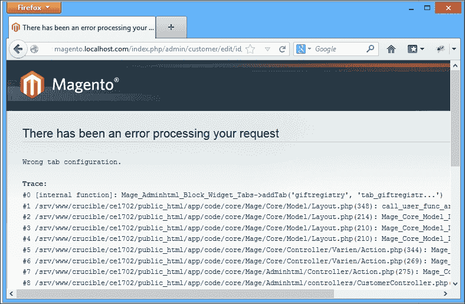
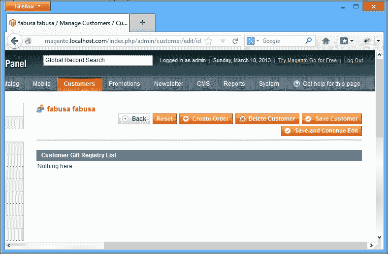
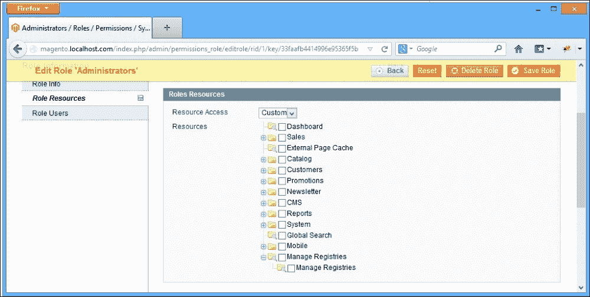
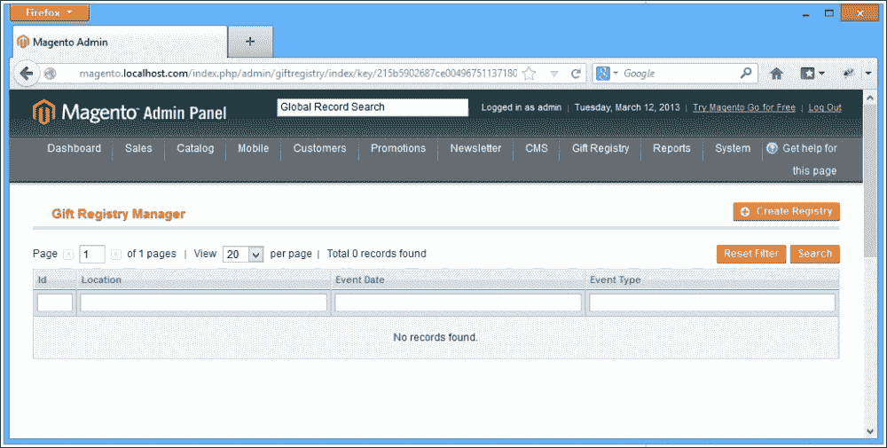
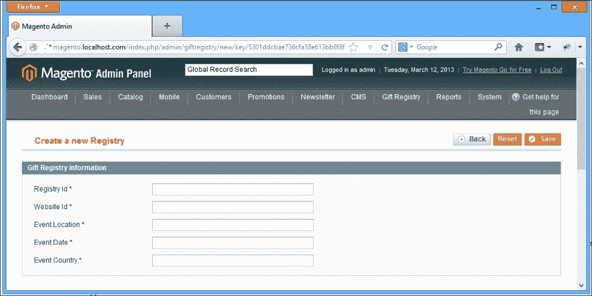
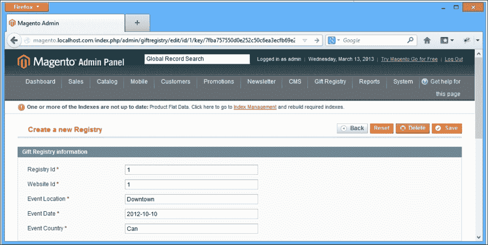

# 第四章：后端开发

在前一章中，我们添加了礼品登记册的所有前端功能。现在，客户能够创建登记册并向客户登记册添加产品，并且通常可以完全控制自己的登记册。

在本章中，我们将构建店主通过 Magento 后端管理和控制登记册所需的所有功能。

在许多方面，可以将 Magento 后端视为与 Magento 前端完全不同的应用程序。它使用完全不同的主题、样式和不同的基本控制器。

对于我们的礼品登记册，我们希望允许店主查看所有客户登记册，修改信息，并添加/删除项目。在本章中，我们将涵盖以下内容：

+   使用配置扩展 Adminhtml

+   使用网格小部件

+   使用表单小部件

+   使用**访问控制列表**（**ACLs**）限制访问和权限

# 扩展 Adminhtml

`Mage_Adminhtml` 是一个提供所有 Magento 后端功能的单一模块，它通过使用配置来实现。正如我们之前所学的，Magento 使用作用域来定义配置。在前一章中，我们使用了前端作用域来设置我们自定义模块的配置。

要修改后端，我们需要在我们的配置文件中创建一个新的作用域，命名为 `admin`。执行以下步骤来完成此操作：

1.  打开 `config.xml` 文件。

1.  将以下代码添加到位于 `app/code/local/Mdg/Giftregistry/etc/config.xml` 的文件中：

    ```php
    <admin>
      <routers>
        <mdg_giftregistry>
          <use>admin</use>
            <args>
              <module>Mdg_Giftregistry_Adminhmtl</module>
              <frontName>giftregistry</frontName>
            </args>
        </mdg_giftregistry>
      </routers>
    </admin>
    ```

这段代码与我们之前用来指定前端路由的代码非常相似。然而，通过这种方式声明路由，我们打破了未成文的 Magento 设计模式。

为了保持后端的一致性，所有新的模块都应该扩展主要的管理员路由。

我们不是使用之前的代码定义路由，而是创建一个全新的管理员路由。

通常情况下，除非你正在创建一个需要管理员访问但不需要 Magento 后端其他部分的新路由，否则你不想为 Magento 后端做这件事。管理员操作的回调 URL 就是这样一个例子。

幸运的是，有一个非常简单的方法可以在 Magento 模块之间共享路由名称。

### 注意

在 Magento 1.3 中引入了共享路由名称的功能，但时至今日，我们仍然看到一些扩展没有正确使用这种模式。

让我们更新我们的代码：

1.  打开 `config.xml` 文件。

1.  使用以下代码更新位于 `app/code/local/Mdg/Giftregistry/etc/config.xml` 的路由配置文件：

    ```php
    <admin>
      <routers>
        <adminhtml>
          <args>
            <modules>
              <mdg_giftregistry before="Mage_Adminhtml"> Mdg_Giftregistry_Adminhtml</mdg_giftregistry>
            </modules>
          </args>
        </adminhtml>
      </routers>
    </admin>
    ```

进行此更改后，我们可以通过 `admin` 命名空间正确访问我们的 `admin` 控制器，例如，`http://magento.localhost.com/giftregistry/index` 现在将是 `http://magento.localhost.com/admin/giftregistry/index`。

我们的下一步是创建一个新的控制器，我们可以使用它来管理客户登记册。让我们称这个控制器为 `GiftregistryController.php`。

1.  导航到您的模块的 `controllers` 文件夹。

1.  创建一个名为 `Adminhtml` 的新文件夹。

1.  创建一个名为 `GiftregistryController.php` 的文件。

1.  将以下代码插入到位于 `app/code/local/Mdg/Giftregistry/controllers/Adminhtml/GiftregistryController.php` 的此文件中：

    ```php
    <?php
    class Mdg_Giftregistry_Adminhtml_GiftregistryController extends Mage_Adminhtml_Controller_Action
    {
      public function indexAction()
      {
        $this->loadLayout();
        $this->renderLayout();
        return $this;
      }

      public function editAction()
      {
        $this->loadLayout();
        $this->renderLayout();
        return $this;
      }

      public function saveAction()
      {
        $this->loadLayout();
        $this->renderLayout();
        return $this;
      }

      public function newAction()
      {
        $this->loadLayout();
        $this->renderLayout();
        return $this;
      }

      public function massDeleteAction()
      {
        $this->loadLayout();
        $this->renderLayout();
        return $this;
      }
    }
    ```

注意一个重要的事情；这个新的控制器扩展了 `Mage_Adminhtml_Controller_Action` 而不是我们迄今为止一直在使用的 `Mage_Core_Controller_Front_Action`。这是因为 `Adminhtml` 控制器有额外的验证来防止非管理员用户访问其操作。

注意我们正在将控制器放置在 `controllers/` 目录下的一个新子文件夹中。通过使用这个子目录，我们保持了前端和后端控制器的组织。这是一个广泛接受的 Magento 标准做法。

目前，让我们先保留这个空白控制器不变，扩展 Magento 后端导航，并在客户编辑页面上添加一些额外的标签页。

## 回到配置

如我们所见，Magento 的许多功能都是由 XML 配置文件控制的，后端布局也不例外。我们需要一个新的 `adminhtml` 布局文件。我们创建它如下：

1.  导航到 `design` 文件夹。

1.  创建一个名为 `adminhtml` 的新文件夹，并在其中创建以下文件夹结构：

    +   `adminhtml/`

    +   `--default/`

    +   `----default/`

    +   `------template/`

    +   `------layout/`

1.  在 `layout` 文件夹内，让我们创建一个名为 `giftregistry.xml` 的新布局文件。

1.  将以下代码复制到位于 `app/design/adminhtml/default/default/layout/giftregistry.xml` 的 `layout` 文件中：

    ```php
    <?xml version="1.0" encoding="UTF-8"?>
    <layout version="0.1.0">
      <adminhtml_customer_edit>
        <reference name="left">
          <reference name="customer_edit_tabs">
            <block type="mdg_giftregistry/ adminhtml_customer_edit_tab_giftregistry" name="tab_giftregistry_main" template= "mdg_giftregistry/giftregistry/ customer/main.phtml" />
            <action method="addTab">
              <name>mdg_giftregistry</name>
              <block>tab_giftregistry_main</block>
            </action>
          </reference>
        </reference>
      </adminhtml_customer_edit>
    </layout>
    ```

我们还需要将新的布局文件添加到 `config.xml` 模块中：

1.  导航到 `etc/` 文件夹。

1.  打开 `config.xml` 文件。

1.  将以下代码复制到位于 `app/code/local/Mdg/Giftregistry/etc/config.xml` 的 `config.xml` 文件中：

    ```php
    …
      <adminhtml>
        <layout>
          <updates>
            <mdg_giftregistry module="mdg_giftregistry">
              <file>giftregistry.xml</file>
            </mdg_giftregistry>
          </updates>
        </layout>
      </adminhtml>
    …
    ```

我们在布局中做的事情是创建一个新的容器块并声明一个包含此块的新的标签页。

让我们快速测试一下到目前为止的更改，通过登录到 Magento 后端，并通过导航到 **客户经理** -> **客户** -> **管理客户** 来打开客户信息。

我们应该在后端得到以下错误：



这是因为我们正在尝试添加一个尚未声明的块。

为了解决这个问题，我们需要创建一个新的块类：

1.  导航到 `Block` 文件夹，并按照目录结构创建一个名为 `Giftregistry.php` 的新块类。

1.  将以下代码添加到位于 `app/code/local/Mdg/Giftregistry/Block/Adminhtml/Customer/Edit/Tab/Giftregistry.php` 的 `Giftregistry.php` 文件中：

    ```php
    <?php
    class Mdg_Giftregistry_Block_Adminhtml_Customer_Edit_Tab_Giftregistry
      extends Mage_Adminhtml_Block_Template
      implements Mage_Adminhtml_Block_Widget_Tab_Interface {

      public function __construct()
      {
        $this- >setTemplate ('mdg/giftregistry/customer/main.phtml');
        parent::__construct();
      }

      public function getCustomerId()
      {
        return Mage::registry('current_customer')->getId();
      }

      public function getTabLabel()
      {
        return $this->__('GiftRegistry List');
      }

      public function getTabTitle()
      {
        return $this->__('Click to view the customer Gift Registries');
      }

      public function canShowTab()
      {
        return true;
      }

      public function isHidden()
      {
        return false;
      }
    }
    ```

这个块类发生了一些有趣的事情。首先，我们扩展了一个不同的块类，`Mage_Adminhtml_Block_Template`，并实现了一个新的接口，`Mage_Adminhtml_Block_Widget_Tab_Interface`。这样做是为了访问 Magento 后端的全部功能和特性。

我们还在类的`construct`函数中设置了块模板。此外，在`getCustomerId`中，我们使用了 Magento 全局变量来获取当前客户。

我们下一步是为此块创建相应的模板文件，否则在块初始化时将会出现错误。

1.  在`adminhtml`模板文件夹下创建一个名为`main.phtml`的模板文件。

1.  将以下代码复制到位于`app/design/adminhtml/default/default/template/mdg/giftregistry/customer/main.phtml`的`main.phtml`文件中：

    ```php
    <div class="entry-edit">
      <div class="entry-edit-head">
        <h4 class="icon-head head-customer-view"><?php echo $this->__('Customer Gift Registry List') ?></h4>
      </div>
      <table cellspacing="2" class="box-left">
        <tr>
          <td>
            Nothing here
          </td>
        </tr>
      </table>
    </div>
    ```

目前，我们只是在模板中添加占位符内容，以便我们实际上能看到我们的标签页在行动。现在，如果我们去后端的客户部分，我们应该能看到一个新标签页可用。点击该标签页将显示我们的占位符内容。

到目前为止，我们通过更改配置和添加一些简单的块和模板文件，已经在后端添加了一个**客户**标签页到客户部分。然而，到目前为止，这并没有特别有用，因此我们需要一种方法来在**礼品登记**标签页下显示所有客户礼品登记。

# 网格小部件

我们不必从头开始编写自己的网格块，可以重用 Magento `Adminhtml`模块已经提供的那些。

我们将要扩展的块称为网格小部件。网格小部件是一种特殊类型的块，旨在以特定的表格网格形式渲染一组 Magento 对象。

网格小部件通常在网格容器内渲染。这两个元素的组合不仅允许我们以网格形式显示我们的数据，还增加了搜索、过滤、排序和批量操作功能。执行以下步骤：

1.  导航到块的`Adminhtml/`文件夹，并创建一个名为`Giftregistry/`的文件夹。

1.  在该文件夹中创建一个名为`List.php`的类。

1.  将以下代码复制到位于`app/code/local/Mdg/Giftregistry/Block/Adminhtml/Customer/Edit/Tab/Giftregistry/List.php`的`List.php`文件中：

    ```php
    <?php
    class Mdg_Giftregistry_Block_Adminhtml_Customer_Edit_Tab_Giftregistry_List extends Mage_Adminhtml_Block_Widget_Grid
    {
      public function __construct()
      {
        parent::__construct();
        $this->setId('registryList');
        $this->setUseAjax(true);
        $this->setDefaultSort('event_date');
        $this->setFilterVisibility(false);
        $this->setPagerVisibility(false);
      }

      protected function _prepareCollection()
      {
        $collection = Mage::getModel('mdg_giftregistry/entity')
          ->getCollection()
          ->addFieldToFilter('main_table.customer_id', $this ->getRequest()->getParam('id'));
        $this->setCollection($collection);
        return parent::_prepareCollection();
      }

      protected function __prepareColumns()
      {
        $this->addColumn('entity_id', array(
          'header'   => Mage::helper('mdg_giftregistry') ->__('Id'),
          'width'    => 50,
          'index'    => 'entity_id',
          'sortable' => false,
        ));

        $this->addColumn('event_location', array(
          'header'   => Mage::helper('mdg_giftregistry') ->__('Location'),
          'index'    => 'event_location',
          'sortable' => false,
        ));

        $this->addColumn('event_date', array(
          'header'   => Mage::helper('mdg_giftregistry') ->__('Event Date'),
          'index'    => 'event_date',
          'sortable' => false,
        ));

        $this->addColumn('type_id', array(
          'header'   => Mage::helper('mdg_giftregistry') ->__('Event Type'),
          'index'    => 'type_id',
          'sortable' => false,
        ));
        return parent::_prepareColumns();
      }
    }
    ```

看看我们刚刚创建的类，其中只涉及三个函数：

+   `__construct()`

+   `_prepareCollection()`

+   `_prepareColumns()`

在`__construct`函数中，我们指定了我们网格类的一些重要选项，我们设置了网格 ID，并将默认排序设置为`event_date`，同时启用了分页和过滤。

`_prepareCollection()`函数加载了一个按当前客户 ID 过滤的登记集合。此函数也可以用于我们集合中的更复杂操作。例如，通过连接一个辅助表来获取更多关于客户或其他相关记录的信息。

最后，通过使用`_prepareColumns()`函数，我们告诉 Magento 我们数据集合中应该显示哪些属性和列以及如何渲染它们。

现在我们已经创建了一个功能性的网格块，让我们对我们的布局 XML 文件做一些更改，以便显示它：

1.  打开位于`adminhtml`布局文件夹下的`giftregistry.xml`文件夹。

1.  在位于`app/design/adminhtml/default/default/layout/giftregistry.xml`的文件夹中做出以下更改：

    ```php
    <?xml version="1.0"?>
    <layout>
      <adminhtml_customer_edit>
        <reference name="left">
          <reference name="customer_edit_tabs">
            <block type="mdg_giftregistry/ adminhtml_customer_edit_tab_giftregistry" name="tab_giftregistry_main" template="mdg/giftregistry/customer/main.phtml">
              <block type="mdg_giftregistry/ adminhtml_customer_edit_tab_giftregistry_list" name="tab_giftregistry_list" as="giftregistry_list" />
            </block>
            <action method="addTab">
              <name>mdg_giftregistry</name>
              <block>mdg_giftregistry/ adminhtml_customer_edit_tab_giftregistry </block>
            </action>
          </reference>
        </reference>
      </adminhtml_customer_edit>
    </layout>
    ```

我们所做的就是在我们的主块中添加网格块，但如果我们转到客户编辑页面并点击**礼品注册**选项卡，我们仍然看到旧的占位符文本，其中网格没有显示：



这是因为我们还没有对我们的`main.phtml`模板文件做出必要的更改。为了显示子块，我们需要特别告诉模板系统加载任何或特定的子块。现在，让我们只加载我们的特定网格块：

1.  打开`main.phtml`模板文件。

1.  将位于`app/design/adminhtml/default/default/template/mdg/giftregistry/customer/main.phtml`的模板代码替换为以下代码：

    ```php
    <div class="entry-edit">
      <div class="entry-edit-head">
        <h4 class="icon-head head-customer-view"><?php echo $this->__('Customer Gift Registry List') ?></h4>
      </div>
      <?php echo $this->getChildHtml('giftregistry_list'); ?>
    </div>
    ```

`getChildHtml()`函数负责渲染所有子块。

`getChildHtml()`函数可以用特定的子块名称调用，也可以不带参数。当不带参数调用时，它将加载所有可用的子块。

在我们的扩展中，我们只对实例化特定的子块感兴趣。因此，我们将传递块名称作为函数参数。现在，如果我们刷新页面，我们应该看到我们的网格块已加载，并显示特定客户可用的所有礼品注册信息。

## 管理注册信息

现在，如果我们想管理特定客户的注册信息，这会很有用，但如果我们要管理商店中所有可用的注册信息，这实际上并没有太大帮助。对于后者，我们需要创建一个网格，加载所有可用的礼品注册信息。

由于我们已经在后端为`giftregistry`控制器创建了一个控制器，我们可以使用索引操作来显示所有可用的注册信息。

我们需要做的第一件事是修改 Magento 后端导航，以显示指向我们新控制器索引操作的链接。同样，我们可以通过使用 XML 来实现这一点。在这种情况下，我们将创建一个名为`adminhtml.xml`的新 XML 文件：

1.  导航到您的模块`etc`文件夹。

1.  创建一个名为`adminhtml.xml`的新文件。

1.  将以下内容放置在位于`app/code/local/Mdg/Giftregistry/etc/adminhtml.xml`的文件中：

    ```php
    <?xml version="1.0"?>
    <config>
      <menu>
        <mdg_giftregistry module="mdg_giftregistry">
          <title>Gift Registry</title>
          <sort_order>71</sort_order>
          <children>
            <items module="mdg_giftregistry">
              <title>Manage Registries</title>
              <sort_order>0</sort_order>
              <action>adminhtml/giftregistry/index</action>
            </items>
          </children>
        </mdg_giftregistry>
      </menu>
    </config>
    ```

### 注意

注意，虽然标准是在`adminhtml.xml`文件内添加此配置，但你可能会遇到不遵循此标准的扩展。此配置可以位于`config.xml`文件中。

此配置代码创建了一个新的主菜单以及其下的一个新子菜单选项。我们还在指定菜单应映射到哪个操作，在这种情况下，是`giftregistry`控制器的索引操作。

如果我们现在刷新后端，我们应该看到一个新的礼品注册菜单被添加到顶级导航中。

## 权限和 ACL

有时我们需要根据管理员规则限制对模块某些功能或整个模块的访问。Magento 允许我们通过使用一个名为访问控制列表（ACL）的强大功能来实现这一点。Magento 后端中的每个角色都可以有不同的权限和不同的 ACL。

启用我们自定义模块的 ACL 的第一步是定义哪些资源应该由 ACL 限制。不出所料，这由配置 XML 文件控制。执行以下步骤：

1.  打开 `adminhtml.xml` 配置文件。

1.  在菜单路径 `app/code/local/Mdg/Giftregistry/etc/adminhtml.xml` 之后添加以下代码：

    ```php
    <config>
      <acl>
        <resources>
          <admin>
            <children>
              <giftregistry translate="title" module="mdg_giftregistry">
                <title>Gift Registry</title>
                <sort_order>300</sort_order>
                <children>
                  <items translate="title" module="mdg_giftregistry">
                    <title>Manage Registries</title>
                    <sort_order>0</sort_order>
                  </items>
                </children>
              </giftregistry>
            </children>
          </admin>
        </resources>
      </acl>
    </config>
    ```

现在，我们通过导航到 **系统** | **权限** | **角色** 来进入 Magento 后端。接下来，我们选择管理员角色并尝试在列表底部设置 **角色资源**。我们将看到我们创建的新 ACL 资源：



通过这样做，我们可以对每个用户可以访问的操作进行细粒度控制。

如果我们点击 **管理注册** 菜单，我们应该得到一个空白页面。因为我们还没有创建相应的网格块、布局和模板，我们应该看到一个完全空白的页面。

因此，让我们首先创建我们需要的用于新网格的块。我们创建 `giftregistry` 网格的方式将与我们为 **客户** 选项卡所做的方式略有不同。

我们需要创建一个网格容器块和一个网格块。网格容器用于容纳网格标题、按钮和网格内容，而网格块只负责渲染带有分页、过滤和批量操作的网格。

执行以下步骤：

1.  前往你的 `Adminhtml` 块文件夹。

1.  创建一个名为 `Registries.php` 的新块。

1.  在 `app/code/local/Mdg/Giftregistry/Block/Adminhtml/Registries.php` 中的块添加以下代码：

    ```php
    <?php
    class Mdg_Giftregistry_Block_Adminhtml_Registries extends Mage_Adminhtml_Block_Widget_Grid_Container
    {
    public function __construct(){
      $this->_controller = 'adminhtml_registries';
      $this->_blockGroup = 'mdg_giftregistry';
      $this->_headerText = Mage::helper('mdg_giftregistry') ->__('Gift Registry Manager');
      parent::__construct();
      }
    }
    ```

在我们的网格容器内部 `construct` 函数中设置的一个重要事情是 `_controller` 和 `_blockGroup` 的受保护值。这两个值都由 Magento 网格容器用来识别相应的网格块。

需要明确的是，`$this->_controller` 并不是实际控制器的名称，而是 `block` 类的名称，而 `$this->_blockGroup` 实际上是模块的名称。

让我们继续创建之前学到的网格块。它有三个主要功能，即 `_construct`、`_prepareCollection()` 和 `_prepareColumns()`。然而，在这种情况下，我们将添加一个名为 `_prepareMassActions()` 的新函数，它允许我们修改选定的记录集，而无需逐个编辑。执行以下步骤：

1.  导航到你的 `Adminhtml` 块文件夹并创建一个名为 `Registries` 的新文件夹。

1.  在 `Model` 文件夹下，创建一个名为 `Grid.php` 的新块。

1.  在 `app/code/local/Mdg/Giftregistry/Block/Adminhtml/Registries/Grid.php` 中的块添加以下代码：

    ```php
    <?php
    class Mdg_Giftregistry_Block_Adminhtml_Registries_Grid extends Mage_Adminhtml_Block_Widget_Grid
    {
      public function __construct(){
        parent::__construct();
        $this->setId('registriesGrid');
        $this->setDefaultSort('event_date');
        $this->setDefaultDir('ASC');
        $this->setSaveParametersInSession(true);
      }

      protected function _prepareCollection(){
        $collection = Mage::getModel('mdg_giftregistry/entity') ->getCollection();
        $this->setCollection($collection);
        return parent::_prepareCollection();
      }

      protected function _prepareColumns()
      {
        $this->addColumn('entity_id', array(
          'header'   => Mage::helper('mdg_giftregistry') ->__('Id'),
          'width'    => 50,
          'index'    => 'entity_id',
          'sortable' => false,
        ));

        $this->addColumn('event_location', array(
          'header'   => Mage::helper('mdg_giftregistry') ->__('Location'),
          'index'    => 'event_location',
          'sortable' => false,
        ));

        $this->addColumn('event_date', array(
          'header'   => Mage::helper('mdg_giftregistry') ->__('Event Date'),
          'index'    => 'event_date',
          'sortable' => false,
        ));

        $this->addColumn('type_id', array(
          'header'   => Mage::helper('mdg_giftregistry') ->__('Event Type'),
          'index'    => 'type_id',
          'sortable' => false,
        ));
        return parent::_prepareColumns();
      }

      protected function _prepareMassaction(){
      }
    }
    ```

这段网格代码与我们之前为**客户**标签创建的代码非常相似，唯一的区别是，这次我们不是特别根据客户记录进行筛选。此外，这次我们还在创建网格容器块而不是实现自定义块。

最后，为了在我们的控制器操作中显示网格，我们需要执行以下步骤：

1.  打开位于`adminhtml`布局文件夹内的`giftregistry.xml`文件。

1.  在位于`app/code/design/adminhtml/default/default/layout/giftregistry.xml`的`giftregistry.xml`文件中添加以下代码：

    ```php
    …
      <adminhtml_giftregistry_index>
        <reference name="content">
          <block type="mdg_giftregistry/adminhtml_registries" name="registries" />
        </reference>
      </adminhtml_giftregistry_index>
    …
    ```

由于我们使用的是网格容器，我们只需要指定网格容器块；Magento 将负责加载匹配的网格容器。

没有必要指定或创建网格或网格容器的模板文件。这两个块都会自动从`adminhtml/default/default`主题加载基本模板。

现在，我们可以通过访问后端来检查我们新添加的礼品注册。要做到这一点，导航到**礼品注册** | **管理注册**，并查看以下截图所示的屏幕：



## 批量更新使用批量操作

在创建我们的基本网格块时，我们定义了一个名为`_prepareMassactions()`的函数。批量操作提供了一种轻松操作网格中多个记录的方法。就目前而言，让我们只实现一个批量删除操作。执行以下步骤来完成此操作：

1.  打开`Giftregistry`网格块。

1.  在位于`app/code/local/Mdg/Giftregistry/Block/Adminhtml/Registries/Grid.php`的此块中替换`_prepareMassaction()`函数为以下代码：

    ```php
    protected function _prepareMassaction(){
      $this->setMassactionIdField('entity_id');
      $this->getMassactionBlock() ->setFormFieldName('registries');

      $this->getMassactionBlock()->addItem('delete', array(
        'label'     => Mage::helper('mdg_giftregistry') ->__('Delete'),
        'url'       => $this->getUrl('*/*/massDelete'),
        'confirm'   => Mage::helper('mdg_giftregistry') ->__('Are you sure?')
      ));
      return $this;
    }
    ```

批量操作的工作方式是将一系列选定的 ID 传递到我们指定的控制器操作（在本例中为`massDelete()`）。在内部，`massDelete()`操作将添加代码来遍历注册集合并删除每个指定的注册。执行以下步骤：

1.  打开`GiftregistryController.php`文件。

1.  在位于`app/code/local/Mdg/Giftregistry/controllers/Adminhtml/GiftregistryController.php`的文件中将空的`massDelete()`操作替换为以下代码：

    ```php
    …
    public function massDeleteAction()
    {
      $registryIds = $this->getRequest() ->getParam('registries');
        if(!is_array($registryIds)) {
          Mage::getSingleton('adminhtml/session') ->addError(Mage::helper('mdg_giftregistry') ->__('Please select one or more registries.'));
        } else {
          try {
            $registry = Mage::getModel('mdg_giftregistry/entity');
            foreach ($registryIds as $registryId) {
              $registry->reset()
                       ->load($registryId)
                       ->delete();
            }
            Mage::getSingleton('adminhtml/session') ->addSuccess(
            Mage::helper('adminhtml')->__('Total of %d record(s) were deleted.', count($registryIds))
            );
            } catch (Exception $e) {
            Mage::getSingleton('adminhtml/session') ->addError($e->getMessage());
            }
          }
        $this->_redirect('*/*/index');
    }
    …
    ```

    ### 注意

    **挑战**：添加两个新的批量操作来更改注册的状态为启用或禁用。要查看完整的代码和完整分解，请访问[`www.magedevguide.com/`](http://www.magedevguide.com/)。

最后，我们还想能够编辑网格中列出的记录。为此，我们需要向我们的注册网格类中添加一个新函数。这个函数叫做`getRowUrl()`，用于指定点击网格行时要执行的操作。在我们的特定情况下，我们希望将该函数映射到`editAction()`函数。执行以下步骤：

1.  打开`Grid.php`文件。

1.  在位于`app/code/local/Mdg/Giftregistry/Block/Adminhtml/Registries/Grid.php`的文件中添加以下函数：

    ```php
    …
    public function getRowUrl($row)
    {
      return $this->getUrl('*/*/edit', array('id' => $row ->getEntityId()));
    }
    …
    ```

# 表单小部件

到目前为止，我们有一个工作的礼品注册网格，但到目前为止，我们无法做更多的事情，而只是获取所有可用注册的列表或批量删除注册。我们需要一种方法来获取特定注册的详细信息。我们可以将此映射到编辑控制器动作。

编辑控制器动作将显示注册特定的详细信息，并允许我们修改注册的详细信息和状态。我们需要为此动作创建几个块和模板。

为了查看和编辑注册信息，我们必须实现一个表单小部件块。表单小部件与网格小部件块的工作方式类似，需要有一个表单块和一个表单容器块，这两个块扩展了`Mage_Adminhtml_Block_Widget_Form_Container`类。

为了创建表单容器，让我们采取以下步骤：

1.  导航到`Registries`文件夹。

1.  创建一个名为`Edit.php`的新类文件。

1.  将以下代码添加到位于`app/code/local/Mdg/Giftregistry/Block/Adminhtml/Registries/Edit.php`的类文件中：

    ```php
    class Mdg_Giftregistry_Block_Adminhtml_Registries_Edit extends Mage_Adminhtml_Block_Widget_Form_Container
    {
      public function __construct(){
        parent::__construct();
        $this->_objectId = 'id';
        $this->_blockGroup = 'registries';
        $this->_controller = 'adminhtml_giftregistry';
        $this->_mode = 'edit';

        $this->_updateButton('save', 'label',
          Mage::helper('mdg_giftregistry')->__('Save Registry'));
        $this->_updateButton('delete', 'label', Mage::helper('mdg_giftregistry')->__('Delete Registry'));
      }

      public function getHeaderText(){
        if(Mage::registry('registries_data') && Mage::registry('registries_data')->getId())
          return Mage::helper('mdg_giftregistry')->__("Edit Registry '%s'", $this ->htmlEscape(Mage::registry('registries_data') ->getTitle()));
          return Mage::helper('mdg_giftregistry')->__('Add Registry');
        }
    }
    ```

与网格小部件一样，表单容器小部件将自动识别并加载匹配的表单块。

在表单容器中声明的另一个受保护的属性是`mode`属性。这个受保护的属性被容器用来指定表单块的位置。

我们可以在`Mage_Adminhtml_Block_Widget_Form_Container`类中找到负责创建表单块的代码：

```php
$this->getLayout()->createBlock($this->_blockGroup . '/' . $this ->_controller . '_' . $this->_mode . '_form')
```

现在我们已经创建了表单容器块，我们可以继续创建匹配的表单块：

1.  导航到`Registries`文件夹。

1.  创建一个名为`Edit`的新文件夹。

1.  在`Edit`文件夹中，创建一个名为`Form.php`的新文件。

1.  将以下代码添加到位于`app/code/local/Mdg/Giftregistry/Block/Adminhtml/Registries/Edit/Form.php`的文件中：

    ```php
    <?php
    class Mdg_Giftregistry_Block_Adminhtml_Registries_Edit_Form extends Mage_Adminhtml_Block_Widget_Form
    {
      protected function _prepareForm()
      {
        $form = new Varien_Data_Form(array(
          'id' => 'edit_form',
          'action' => $this->getUrl('*/*/save', array(
            'id' => $this->getRequest()->getParam('id')
          )),
          'method' => 'post',
          'enctype' => 'multipart/form-data'
        ));
        $form->setUseContainer(true);
        $this->setForm($form);

        if(Mage::getSingleton('adminhtml/session') ->getFormData()) {
          $data = Mage::getSingleton('adminhtml/session') ->getFormData();
          Mage::getSingleton('adminhtml/session') ->setFormData(null);
        } elseif(Mage::registry('registry_data'))
          $data = Mage::registry('registry_data')->getData();

        $fieldset = $form->addFieldset('registry_form', array(
          'legend' => Mage::helper('mdg_giftregistry') ->__('Gift Registry information')
        ));

        $fieldset->addField('type_id', 'text', array(
          'label' => Mage::helper('mdg_giftregistry') ->__('Registry Id'),
          'class' => 'required-entry',
          'required' => true,
          'name' => 'type_id'
        ));

        $fieldset->addField('website_id', 'text', array(
          'label' => Mage::helper('mdg_giftregistry') ->__('Website Id'),
          'class' => 'required-entry',
          'required' => true,
          'name' => 'website_id'
        ));

        $fieldset->addField('event_location', 'text', array(
          'label' => Mage::helper('mdg_giftregistry') ->__('Event Location'),
          'class' => 'required-entry',
          'required' => true,
          'name' => 'event_location'
        ));

        $fieldset->addField('event_date', 'text', array(
          'label' => Mage::helper('mdg_giftregistry') ->__('Event Date'),
          'class' => 'required-entry',
          'required' => true,
          'name' => 'event_date'
        ));

        $fieldset->addField('event_country', 'text', array(
          'label' => Mage::helper('mdg_giftregistry') ->__('Event Country'),
          'class' => 'required-entry',
          'required' => true,
          'name' => 'event_country'
        ));

        $form->setValues($data);
        return parent::_prepareForm();
      }
    }
    ```

我们还需要修改我们的布局文件，并告诉 Magento 加载我们的表单容器：

将以下代码复制到位于`app/code/design/adminhtml/default/default/layout/giftregistry.xml`的`giftregistry.xml`布局文件中：

```php
<?xml version="1.0"?>
<layout version="0.1.0">
  …
  <adminhtml_giftregistry_edit>
    <reference name="content">
      <block type="mdg_giftregistry/adminhtml_registries_edit" name="new_registry_tabs" />
    </reference>
  </adminhtml_giftregistry_edit>
  …
```

我们可以通过进入 Magento 后端并点击我们的示例注册之一来检查我们的进度。我们应该看到以下表单：



然而，似乎存在问题。没有任何数据被加载；我们只有一个空表单。我们必须修改我们的`editAction()`控制器以加载数据。

## 加载数据

让我们从修改位于`app/code/local/Mdg/Giftregistry/controllers/Adminhtml/GiftregistryController.php`的`GiftregistryController.php`文件中的`editAction()`函数开始：

```php
…
public function editAction()
{
  $id = $this->getRequest()->getParam('id', null);
  $registry  = Mage::getModel('mdg_giftregistry/entity');

  if ($id) {
    $registry->load((int) $id);
    if ($registry->getId()) {
      $data = Mage::getSingleton('adminhtml/session') ->getFormData(true);
      if ($data) {
        $registry->setData($data)->setId($id);
      }
    } else {
            Mage::getSingleton('adminhtml/session') ->addError(Mage::helper('awesome')->__('The Gift Registry does not exist'));
            $this->_redirect('*/*/');
        }
    }
    Mage::register('registry_data', $registry);

    $this->loadLayout();
    $this->getLayout()->getBlock('head')->setCanLoadExtJs(true);
    $this->renderLayout();
}
```

在我们的`editAction()`控制器内部，我们所做的是检查是否存在具有相同 ID 的注册表，如果存在，则加载该注册表实体并将其提供给我们的表单。之前，当将表单代码添加到位于`app/code/local/Mdg/Giftregistry/Block/Adminhtml/Registries/Edit/Form.php`的`Form.php`文件中时，我们包含了以下代码：

```php
…
if (Mage::getSingleton('adminhtml/session')->getFormData()){
  $data = Mage::getSingleton('adminhtml/session') ->getFormData();
  Mage::getSingleton('adminhtml/session')->setFormData(null);
}elseif(Mage::registry('registry_data'))
  $data = Mage::registry('registry_data')->getData();
…
```

现在，我们可以通过重新加载表单来测试我们的更改：



## 保存数据

现在我们已经创建了用于编辑注册表的表单，我们需要创建相应的动作来处理和保存表单提交的数据。我们可以使用`saveAction()`函数来处理这个动作。执行以下步骤：

1.  打开`GiftregistryController.php`类。

1.  将空白`saveAction()`函数替换为以下代码，并将其放置在位于`app/code/local/Mdg/Giftregistry/controllers/Adminhtml/GiftregistryController.php`的文件中：

    ```php
    public function saveAction()
    {
      if ($this->getRequest()->getPost())
      {
        try {
          $data = $this->getRequest()->getPost();
          $id = $this->getRequest()->getParam('id');

          if ($data && $id) {
            $registry = Mage::getModel('mdg_giftregistry/entity') ->load($id);
            $registry->setData($data);
            $registry->save();
            $this->_redirect('*/*/edit', array('id' => $this ->getRequest()->getParam('registry_id')));
          }
        } catch (Exception $e) {
          $this->_getSession()->addError(
            Mage::helper('mdg_giftregistry')->__('An error occurred while saving the registry data. Please review the log and try again.')
          );
          Mage::logException($e);
          $this->_redirect('*/*/edit', array('id' => $this ->getRequest()->getParam('registry_id')));
          return $this;
        }
      }
    }
    ```

让我们一步一步地分解这段代码的功能：

1.  它检查请求是否有有效的 POST 数据。

1.  它检查`$data`和`$id`变量是否都已设置。

1.  如果两个变量都设置了，我们加载一个新的`registry`实体并设置数据。

1.  最后，我们尝试保存`registry`实体。

我们首先检查提交的数据不为空，并且我们正在获取作为参数的一部分的注册表 ID。我们还检查注册表 ID 是否是注册表实体的有效实例。

# 摘要

在本章中，我们学习了如何根据我们的具体需求修改和扩展 Magento 后端。

在扩展时，前端扩展了客户和用户可以使用的功能。扩展后端允许我们控制这个自定义功能以及客户如何与之交互。

网格和表单是 Magento 后端的重要组成部分，通过正确使用它们，我们可以添加很多功能，而无需编写大量代码或重新发明轮子。

最后，我们学习了如何使用权限和 Magento ACL 来控制和限制我们自定义扩展和 Magento 的一般权限。

在下一章中，我们将深入探讨 Magento API，并学习如何通过几种方法（如 SOAP、XML-RPC 和 REST）扩展它来操作我们的注册表数据。
