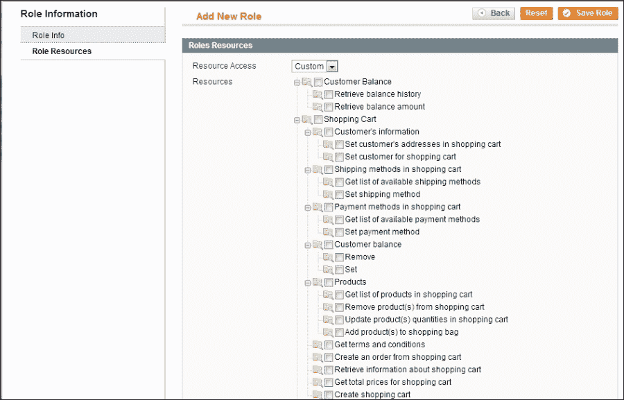
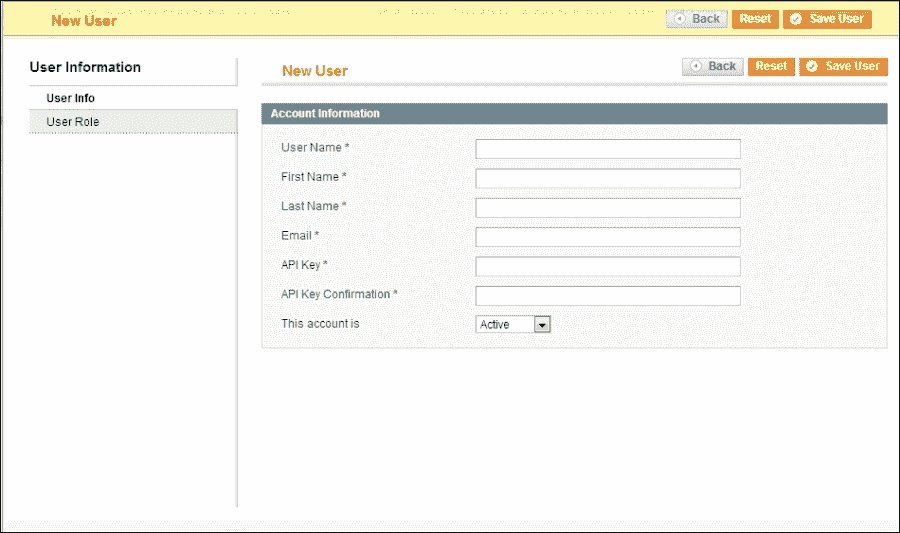
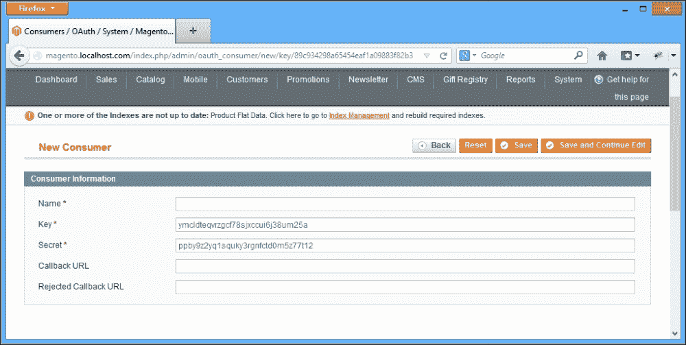

# 第五章：Magento API

在上一章中，我们扩展了 Magento 后端，并学习了如何使用一些后端组件，以便店主可以管理和操作每位客户的礼品登记数据。

在本章中，我们将讨论以下主题：

+   Magento 核心 API

+   可用的多个 API 协议（**REST**、**SOAP** 和 **XML-RPC**）

+   如何使用核心 API

+   如何扩展 API 以实现新功能

+   如何限制 API 的部分功能以特定于网络用户角色

虽然后端提供了日常操作的接口，但有时我们需要访问和从第三方系统中传输数据。Magento 已经为大多数核心功能提供了 API 功能，但为了我们的自定义礼品登记扩展，我们需要扩展 `Mage_Api` 功能。

# 核心 API

经常在谈论 API 时，我听到开发者谈论 Magento SOAP API、Magento XML-RPC API 或 RESTful API，但有一个重要的事实是，这些不是针对这些协议的单独 API。相反，Magento 有一个单一的 Core API。

正如你可能注意到的，Magento 主要建立在抽象和配置（主要是 XML）的基础上，而 Magento API 也不例外。我们有一个单一的 Core API 和针对不同协议类型的适配器。这非常灵活，如果我们愿意，我们可以为其他协议实现我们的适配器。

核心 Magento API 为我们提供了管理产品、分类、属性、订单和发票的能力；这是通过公开三个核心模块来实现的：

+   `Mage_Catalog`

+   `Mage_Sales`

+   `Mage_Customer`

该 API 支持三种不同类型：SOAP、XML-RPC 和 REST。现在，如果你在 Magento 外部以及使用其他 API 进行过 Web 开发，那么这些 API 很可能是 RESTful API。

在我们深入探讨 Magento API 架构的具体细节之前，了解每种支持的 API 类型之间的区别非常重要。

## XML-RPC

XML-RPC 是 Magento 支持的第一种协议之一，也是其中最古老的。这个协议有一个单一的端点，所有函数都通过这个端点被调用和访问。XML-RPC 的定义在维基百科上引用如下：

> *XML-RPC 是一种使用 XML 编码其调用并使用 HTTP 作为传输机制的远程过程调用 (RPC) 协议。*

由于只有一个单一端点，XML-RPC 使用起来简单且易于维护；其目的是成为一个简单有效的协议，用于发送和接收数据；实现使用简单的 XML 对远程过程调用及其参数进行编码和解码。

然而，这也有代价，整个 XML-RPC 协议存在一些问题：

+   缺乏可发现性和文档。

+   匿名参数，XML-RPC 依赖于参数的顺序来区分它们。

+   简单性既是 XML-RPC 的最大优势，也是其最大的问题。虽然大多数任务都可以通过 XML-RPC 轻松完成，但有些任务可能需要你费尽周折才能实现本应简单易行的功能。

Soap 是为了解决 XML-RPC 的局限性并提供一个更健壮的协议而设计的。

### 注意

关于 XML-RPC 的更多信息，您可以参考[`en.wikipedia.org/wiki/XML-RPC`](http://en.wikipedia.org/wiki/XML-RPC)。

## SOAP

SOAP v1 是 Magento 最初支持的协议之一，与 XML-RPC 一起，自从**Magento CE 1.3**发布以来，SOAP v2 也得到了支持。

维基百科上对 SOAP 的定义如下：

> *SOAP，最初是 Simple Object Access Protocol 的缩写，是一种在计算机网络中实现 Web 服务的结构化信息交换的协议规范。*

SOAP 请求是一个包含 SOAP 信封、头和主体的`HTTP POST`请求。

SOAP 的核心是**Web 服务描述语言**（**WSDL**），它是一种 XML 格式。WSDL 用于描述 Web 服务的功能，在本例中，是我们的 API 方法。这是通过以下一系列预定义对象实现的：

+   `types`：`types`元素用于描述 API 传输的数据；`type`元素使用 XML Schema 定义，这是一种为此目的而设计的特殊语言

+   `message`：`message`元素用于指定执行每个操作所需的信息；在 Magento 的情况下，我们的 API 方法将始终使用请求和响应`message`

+   `portType`：`portType`元素用于定义可以执行的操作和相应的消息

+   `port`：`port`元素用于定义连接点；在 Magento 的情况下，使用一个简单的字符串

+   `service`：`service`元素用于指定通过 API 公开哪些功能

+   `binding`：`binding`元素用于定义操作和与 SOAP 协议的接口

### 注意

关于 SOAP 协议的更多信息，您可以参考[`en.wikipedia.org/wiki/SOAP`](http://en.wikipedia.org/wiki/SOAP)。

所有 WSDL 配置都包含在每个模块的`wsdl.xml`文件中；例如，让我们看一下`Catalog Product` API 的摘录，位于`app/code/local/Mdg/Giftregistry/etc/wsdl.xml`：

```php
<?xml version="1.0" encoding="UTF-8"?>
<definitions       name="{{var wsdl.name}}" targetNamespace="urn:{{var wsdl.name}}">
  <types>
    <schema  targetNamespace="urn:Magento">
      ...
      <complexType name="catalogProductEntity">
        <all>
          <element name="product_id" type="xsd:string" />
          <element name="sku" type="xsd:string" />
          <element name="name" type="xsd:string" />
          <element name="set" type="xsd:string" />
          <element name="type" type="xsd:string" />
          <element name="category_ids" type="typens:ArrayOfString" />
          <element name="website_ids" type="typens:ArrayOfString" />
        </all>
      </complexType>
    </schema>
  </types>
  <message name="catalogProductListResponse">
    <part name="storeView" type="typens:catalogProductEntityArray" />
  </message>
  ...
  <portType name="{{var wsdl.handler}}PortType">
    ...
    <operation name="catalogProductList">
      <documentation>Retrieve products list by filters</documentation>
      <input message="typens:catalogProductListRequest" />
      <output message="typens:catalogProductListResponse" />
    </operation>
    ...
  </portType>
  <binding name="{{var wsdl.handler}}Binding" type="typens:{{var wsdl.handler}}PortType">
    <soap:binding style="rpc" transport="http://schemas.xmlsoap.org/soap/http" />
    ...
    <operation name="catalogProductList">
      <soap:operation soapAction="urn:{{var wsdl.handler}}Action" />
      <input>
        <soap:body namespace="urn:{{var wsdl.name}}" use="encoded" encodingStyle= "http://schemas.xmlsoap.org/soap/encoding/" />
      </input>
      <output>
        <soap:body namespace="urn:{{var wsdl.name}}" use="encoded" encodingStyle= "http://schemas.xmlsoap.org/soap/encoding/" />
      </output>
    </operation>
    ...
  </binding>
  <service name="{{var wsdl.name}}Service">
    <port name="{{var wsdl.handler}}Port" binding="typens:{{var wsdl.handler}}Binding">
      <soap:address location="{{var wsdl.url}}" />
    </port>
  </service>
</definitions>
```

使用 WSDL，我们可以记录、列出并支持更复杂的数据类型。

## RESTful API

RESTful API 是 Magento 支持的协议家族中的新成员，并且仅在**Magento CE 1.7**或更高版本中可用。

对于 RESTful Web 服务的定义可以引用如下：

> *RESTful Web 服务（也称为 RESTful Web API）是使用 HTTP 和 REST 原则实现的 Web 服务。*

RESTful API 可以通过以下三个方面来定义：

+   它使用了标准的 HTTP 方法，例如`GET`、`POST`、`DELETE`和`PUT`

+   它暴露了以目录结构格式化的 URI。

+   它使用 JSON 或 XML 来传输信息。

### 备注

REST API 支持两种响应格式，即 XML 和 JSON。

与 SOAP 和 XML-RPC 相比，REST 的一个优点是，所有与 REST API 的交互都是通过 HTTP 协议完成的，这意味着它几乎可以用任何编程语言使用。

Magento REST API 具有以下特点：

+   资源通过向 Magento API 服务发送 HTTP 请求来访问。

+   服务将回复请求的数据、状态指示器，甚至两者都有。

+   所有资源都可以通过使用`https://magento.localhost.com/api/rest/`作为 URL 来访问。

+   资源返回**HTTP 状态码**，例如`HTTP 状态码 200`，以指示响应成功或`HTTP 状态码 400`以指示请求错误。

+   向特定资源发送请求是通过向基本 URL（`https://magento.localhost.com/api/rest/`）添加特定的路径来完成的。

REST 使用**HTTP 动词**来管理资源的状态。在 Magento 实现中，有四个动词可用：`GET`、`POST`、`PUT`和`DELETE`。因此，在大多数情况下，使用 RESTful API 都很简单。

# 使用 API

既然我们已经澄清了每个可用的协议，让我们探索我们可以使用 Magento API 做什么，以及我们如何使用每个可用的协议来使用它。

我们将以产品端点为例，来访问和使用不同的 API 协议。

### 备注

示例提供的是 PHP，并使用了三种不同的协议。要查看其他编程语言的完整示例，请访问[`magedevguide.com`](http://magedevguide.com)。

## 设置 XML-RPC/SOAP 的 API 凭证

在我们开始之前，我们需要创建一组网络服务凭证，以便访问 API 功能。

我们需要设置的第一件事是 API 用户角色。**角色**通过**访问控制列表**（**ACL**）控制 API 的权限。通过实现此设计模式，Magento 能够将其 API 的某些部分限制给特定用户。

在本章的后面部分，我们将学习如何将自定义函数添加到 ACL 中，并确保我们的自定义扩展 API 方法的安全性。现在，我们只需要创建一个具有完全权限的角色：

1.  前往 Magento 后端。

1.  从主导航菜单导航到**系统** | **网络服务** | **角色**。

1.  点击**添加新角色**按钮。

1.  如以下截图所示，您将被要求提供角色名称并指定角色资源：

1.  默认情况下，**资源访问**选项设置为**自定义**，没有选择任何资源。在我们的情况下，我们将通过从下拉菜单中选择**所有**来更改**资源访问**选项。

1.  点击**保存角色**按钮。

现在我们商店中有一个有效的角色，让我们继续创建网络 API 用户：

1.  前往 Magento 后端。

1.  从主导航菜单导航到**系统** | **Web 服务** | **用户**。

1.  点击**添加新用户**按钮。

1.  如以下截图所示，您将被要求提供用户信息：

1.  在**API 密钥**和**API 密钥确认**字段中，输入您希望使用的密码。

1.  点击**用户角色**标签。

1.  选择我们刚刚创建的用户角色。

1.  点击**保存用户**按钮。

我们需要创建用户名和角色来访问 API 的原因是，每个 API 函数都需要一个**会话令牌**作为参数传递。

因此，每次我们需要使用 API 时，我们必须首先调用`login`函数，该函数将返回一个有效的会话令牌 ID。

## 设置 REST API 凭证

新的 RESTful API 在认证方面略有不同；它不是使用传统的 Magento 网络服务用户，而是使用三脚的**OAuth 1.0**协议来提供认证。

OAuth 通过请求用户授权其应用程序来工作。当用户注册应用程序时，他/她需要填写以下字段：

+   **用户**：这指的是拥有 Magento 账户并可以使用 API 服务的客户。

+   **消费者**：这指的是使用 OAuth 访问 Magento API 的第三方应用程序。

+   **消费者密钥**：这指的是一个唯一值，用于识别使用 Magento 的用户。

+   **消费者密钥**：这指的是消费者用来保证消费者密钥所有权的秘密。此值永远不会在请求中传递。

+   **请求令牌**：此值由消费者（应用程序）用于从用户那里获取访问 API 资源的授权。

+   **访问令牌**：这是在交换请求令牌和成功认证后返回的。

让我们通过访问**系统** | **Web 服务** | **REST - OAuth 消费者**并选择**管理员面板中的“添加新”**来注册我们的应用程序。我们将看到以下屏幕：



### 注意

一个需要注意的重要事项是必须定义一个回调 URL，用户在成功授权应用程序后将被重定向到该 URL。

因此，我们的第一步是学习如何在每个可用的 API 协议上获取此会话令牌 ID：

+   要在 XML-RPC 中获取会话令牌 ID，我们需要执行以下代码：

    ```php
    $apiUser = 'username';
    $apiKey = 'password';
    $client = new Zend_XmlRpc_Client('http://ourhost.com/api/xmlrpc/');
    // We authenticate ourselves and get a session token id
    $sessionId = $client->call('login', array($apiUser, $apiKey));
    ```

+   要在 SOAP v2 中获取会话令牌 ID，我们需要执行以下代码：

    ```php
    $apiUser = 'username';
    $apiKey = 'password';
    $client = new SoapClient('http://ourhost.com/api/v2_soap/?wsdl');
    // We authenticate ourselves and get a session token id
    $sessionId = $client->login($apiUser, $apiKey);
    ```

+   要在 REST 中获取会话令牌 ID，我们需要执行以下代码：

    ```php
    $callbackUrl = "http://magento.localhost.com/oauth_admin.php";
    $temporaryCredentialsRequestUrl = "http://magento.localhost.com/oauth/ initiate?oauth_callback=" . urlencode($callbackUrl);
    $adminAuthorizationUrl = 'http://magento.localhost.com/admin/oAuth_authorize';
    $accessTokenRequestUrl = 'http://magento.localhost.com/oauth/token';
    $apiUrl = 'http://magento.localhost.com/api/rest';
    $consumerKey = 'yourconsumerkey';
    $consumerSecret = 'yourconsumersecret';

    session_start();

    $authType = ($_SESSION['state'] == 2) ? OAUTH_AUTH_TYPE_AUTHORIZATION : OAUTH_AUTH_TYPE_URI;
    $oauthClient = new OAuth($consumerKey, $consumerSecret, OAUTH_SIG_METHOD_HMACSHA1, $authType);

    $oauthClient->setToken($_SESSION['token'], $_SESSION['secret']);
    ```

## 加载和读取数据

`Mage_Catalog`模块的产品端点公开以下方法，我们可以使用这些方法来管理产品：

+   `catalog_product.currentStore`：此命令可以用来设置/获取当前商店视图

+   `catalog_product.list`：此命令使用过滤器检索产品列表

+   `catalog_product.info`：此命令检索一个产品

+   `catalog_product.create`：这会创建一个新的产品

+   `catalog_product.update`：这会更新一个产品

+   `catalog_product.setSpecialPrice`：这会为产品设置一个特殊价格

+   `catalog_product.getSpecialPrice`：这会获取产品的特殊价格

+   `catalog_product.delete`：这会删除一个产品

目前，对我们特别感兴趣的函数是`catalog_product.list`和`catalog_product.info`。让我们看看我们如何使用 API 从我们的预发布商店检索产品数据。

要从我们的预发布商店在 XML-RPC 中检索产品数据，执行以下代码：

```php
…
$result = $client->call($sessionId, 'catalog_product.list');
print_r ($result);
…
```

要从我们的预发布商店在 SOAP v2 中检索产品数据，执行以下代码：

```php
…
$result = $client->catalogProductList($sessionId);
print_r($result);
…
```

要从我们的预发布商店在 REST 中检索产品数据，执行以下代码：

```php
…
$resourceUrl = $apiUrl . "/products";
$oauthClient->fetch($resourceUrl, array(), 'GET', array('Content- Type' => 'application/json'));
$productsList = json_decode($oauthClient->getLastResponse());
…
```

无论协议如何，我们都会得到所有产品**SKU**（缩写为**库存单位**）的列表，但如果我们想根据属性过滤该产品列表怎么办？嗯，Magento 列出了允许我们通过传递参数来完成此操作的函数。话虽如此，让我们看看我们如何向我们的产品列表调用添加过滤器。

要在 XML-RPC 中为我们的产品列表调用添加过滤器，执行以下代码：

```php
…
$result = $client->call('catalog_product.list', array($sessionId, $filters);
print_r ($result);
…
```

要在 SOAP v2 中为我们的产品列表调用添加过滤器，执行以下代码：

```php
…
$result = $client->catalogProductList($sessionId,$filters);
print_r($result);
…
```

使用 REST，事情并不那么简单，无法通过属性过滤检索产品集合。然而，我们可以检索属于特定类别的所有产品

要在 REST 中为我们的产品列表调用添加过滤器，执行以下代码：

```php
…
$categoryId = 3;
$resourceUrl = $apiUrl . "/products/category_id=" . categoryId;
$oauthClient->fetch($resourceUrl, array(), 'GET', array('Content- Type' => 'application/json'));
$productsList = json_decode($oauthClient->getLastResponse());
…
```

## 更新数据

现在我们可以从 Magento API 中检索产品信息，我们可以开始更新每个产品的内容。

`catalog_product.update`方法将允许我们修改任何产品属性；函数调用需要以下参数：

要在 XML-RPC 中更新数据，执行以下代码：

```php
…
$productId = 200;
$productData = array( 'sku' => 'changed_sku', 'name' => 'New Name', 'price' => 15.40 );
$result = $client->call($sessionId, 'catalog_product.update', array($productId, $productData));
print_r($result);
…
```

要在 SOAP v2 中更新数据，执行以下代码：

```php
…
$productId = 200;
$productData = array( 'sku' => 'changed_sku', 'name' => 'New Name', 'price' => 15.40 );
$result = $client->catalogProductUpdate($sessionId, array($productId, $productData));
print_r($result);
…
```

要在 REST 中更新数据，执行以下代码：

```php
…
$productData = json_encode(array(
  'type_id'           => 'simple',
  'attribute_set_id'  => 4,
  'sku'               => 'simple' . uniqid(),
  'weight'            => 10,
  'status'            => 1,
  'visibility'        => 4,
  'name'              => 'Test Product',
  'description'       => 'Description',
  'short_description' => 'Short Description',
  'price'             => 29.99,
  'tax_class_id'      => 2,
));
$oauthClient->fetch($resourceUrl, $productData, OAUTH_HTTP_METHOD_POST, array('Content-Type' => 'application/json'));
$updatedProduct = json_decode($oauthClient- >getLastResponseInfo());
…
```

## 删除产品

使用 API 删除产品非常简单，可能是最常见的操作之一。

要在 XML-RPC 中删除产品，执行以下代码：

```php
…
$productId = 200;
$result = $client->call($sessionId, 'catalog_product.delete', $productId);
print_r($result);
…
```

要在 SOAP v2 中删除产品，执行以下代码：

```php
…
$productId = 200;
$result = $client->catalogProductDelete($sessionId, $productId);
print_r($result);
…
```

要在 REST 中删除代码，执行以下代码：

```php
…
$productData = json_encode(array(
  'id'           => 4
));
$oauthClient->fetch($resourceUrl, $productData, OAUTH_HTTP_METHOD_DELETE, array('Content-Type' => 'application/json'));
$updatedProduct = json_decode($oauthClient- >getLastResponseInfo());
…
```

# 扩展 API

现在我们已经对如何使用 Magento 核心 API 有了基本了解，我们可以继续扩展并添加我们的自定义功能。为了添加新的 API 功能，我们必须修改/创建以下文件：

+   `wsdl.xml`

+   `api.xml`

+   `api.php`

为了使我们的注册信息对第三方系统可访问，我们需要创建并公开以下函数

+   `giftregistry_registry.list`：这会检索所有注册 ID 的列表；它接受一个可选的客户 ID 参数

+   `giftregistry_registry.info`：这会检索所有注册信息；它需要一个必需的 registry_id 参数

+   `giftregistry_item.list`：此操作检索与登记册关联的所有登记项 ID 的列表；它需要一个必需的 `registry_id` 参数

+   `giftregistry_item.info`：此操作检索登记项的产品和详细信息；它需要一个必需的 `item_id` 参数

### 注意

这里有一个挑战。到目前为止，我们只添加了读取操作；尝试包括用于更新、删除和创建登记册和登记项的 API 方法。要查看完整的代码和详细分解，请参阅 [`www.magedevguide.com/`](http://www.magedevguide.com/)。

我们的第一步是实现 API 类和所需的函数：

1.  导航到 `Model` 目录。

1.  在 `app/code/local/Mdg/Giftregistry/Model/Api.php` 创建一个名为 `Api.php` 的新类，并在其中放置以下占位符内容：

    ```php
    <?php
    class Mdg_Giftregisty_Model_Api extends Mage_Api_Model_Resource_Abstract
    {
      public function getRegistryList($customerId = null)
      {

      }

      public function getRegistryInfo($registryId)
      {

      }

      public function getRegistryItems($registryId)
      {

      }

      public function getRegistryItemInfo($registryItemId)
      {

      }
    }
    ```

1.  创建一个名为 `Api/` 的新目录。

1.  在 `Api/` 目录下，在 `app/code/local/Mdg/Giftregistry/Model/Api/V2.php` 创建一个名为 `V2.php` 的新类，并在其中放置以下占位符内容：

    ```php
    <?php
    class Mdg_Giftregisty_Model_Api_V2 extends Mdg_Giftregisty_Model_Api
    {

    }
    ```

你可能会首先注意到 `V2.php` 扩展了我们刚刚创建的 API 类。唯一的区别是 `V2` 类用于 `SOAP_v2` 协议，而常规 API 类用于所有其他请求。

让我们使用位于 `app/code/local/Mdg/Giftregistry/Model/Api.php` 的有效代码更新 API 类：

```php
<?php
class Mdg_Giftregisty_Model_Api extends Mage_Api_Model_Resource_Abstract
{
  public function getRegistryList($customerId = null)
  {
    $registryCollection = Mage::getModel('mdg_giftregistry/entity')->getCollection();
    if (!is_null($customerId)) {
      $registryCollection->addFieldToFilter('customer_id', $customerId);
    }
    return $registryCollection;
  }

  public function getRegistryInfo($registryId)
  {
    if (!is_null($registryId)) {
      $registry = Mage::getModel('mdg_giftregistry/entity') ->load($registryId);
      if ($registry) {
        return $registry;
      } else {
        return false;
      }
    } else {
      return false;
    }
  }

  public function getRegistryItems($registryId)
  {
    if (!is_null($registryId)) {
      $registryItems = Mage::getModel('mdg_giftregistry/item') ->getCollection();
      $registryItems->addFieldToFilter('registry_id', $registryId);
      Return $registryItems;
    } else {
      return false;
    }
  }

  public function getRegistryItemInfo($registryItemId)
  {
    if (!is_null($registryItemId)) {
      $registryItem = Mage::getModel('mdg_giftregistry/item') ->load($registryItemId);
      if ($registryItem) {
        return $registryItem;
      } else {
        return false;
      }
    } else {
      return false;
    }
  }
}
```

如前述代码所示，我们并没有做任何新的事情。每个函数负责根据所需的参数加载 Magento 对象的集合或特定对象。

为了将此新功能暴露给 Magento API，我们需要配置我们之前创建的 XML 文件。让我们首先更新 `api.xml`：

1.  打开 `api.xml` 文件。

1.  将以下 XML 代码添加到位于 `app/code/local/Mdg/Giftregistry/etc/api.xml` 的此文件中：

    ```php
    <?xml version="1.0" encoding="UTF-8"?>
    <config>
      <api>
        <resources>
          <giftregistry_registry translate="title" module="mdg_giftregistry">
            <model>mdg_giftregistry/api</model>
            <title>Mdg Giftregistry Registry functions</title>
            <methods>
              <list translate="title" module="mdg_giftregistry">
                <title>getRegistryList</title>
                <method>getRegistryList</method>
              </list>
              <info translate="title" module="mdg_giftregistry">
                <title>getRegistryInfo</title>
                <method>getRegistryInfo</method>
              </info>
            </methods>
          </giftregistry_registry>
          <giftregistry_item translate="title" module="mdg_giftregistry">
            <model>mdg_giftregistry/api</model>
            <title>Mdg Giftregistry Registry Items functions</title>
            <methods>
              <list translate="title" module="mdg_giftregistry">
                <title>getRegistryItems</title>
                <method>getRegistryItems</method>
              </list>
              <info translate="title" module="mdg_giftregistry">
                <title>getRegistryItemInfo</title>
                <method>getRegistryItemInfo</method>
              </info>
            </methods>
          </giftregistry_item>
        </resources>
        <resources_alias>
          giftregistry_registry>giftregistry_registry </giftregistry_registry>
          <giftregistry_item>giftregistry_item </giftregistry_item>
        </resources_alias>
        <v2>
          <resources_function_prefix>
            <giftregistry_registry>giftregistry_registry </giftregistry_registry>
            <giftregistry_item>giftregistry_item </giftregistry_item>
          </resources_function_prefix>
        </v2>
      </api>
    </config>
    ```

为了确保 SOAP 适配器能够获取我们的新 API 函数，我们还需要更新一个文件：

1.  打开 `wsdl.xml` 文件。

1.  由于 WSDL 通常非常长，我们将它在几个地方进行拆分。让我们首先定义位于 `app/code/local/Mdg/Giftregistry/etc/wsdl.xml` 的 `wsdl.xml` 文件的基本框架：

    ```php
    <?xml version="1.0" encoding="UTF-8"?>
    <definitions       name="{{var wsdl.name}}" targetNamespace="urn:{{var wsdl.name}}">
      <types />
      <message name="gitregistryRegistryListRequest" />
      <portType name="{{var wsdl.handler}}PortType" />
      <binding name="{{var wsdl.handler}}Binding" type="typens:{{var wsdl.handler}}PortType">
        <soap:binding style="rpc" transport="http://schemas.xmlsoap.org/soap/http" />
      </binding>
      <service name="{{var wsdl.name}}Service">
        <port name="{{var wsdl.handler}}Port" binding="typens:{{var wsdl.handler}}Binding">
          <soap:address location="{{var wsdl.url}}" />
        </port>
      </service>
    </definitions>
    ```

1.  这是基本占位符，其中包含我们在本章开头定义的所有主要节点。我们必须定义的第一件事是我们 API 将使用的自定义数据类型，位于 `app/code/local/Mdg/Giftregistry/etc/wsdl.xml`：

    ```php
    …
    <schema  targetNamespace="urn:Magento">
      <import namespace="http://schemas.xmlsoap.org/soap/encoding/" schemaLocation= "http://schemas.xmlsoap.org/soap/encoding/"/>
      <complexType name="giftRegistryEntity">
        <all>
          <element name="entity_id" type="xsd:integer" minOccurs="0" />
          <element name="customer_id" type="xsd:integer" minOccurs="0" />
          <element name="type_id" type="xsd:integer" minOccurs="0" />
          <element name="website_id" type="xsd:integer" minOccurs="0" />
          <element name="event_date" type="xsd:string" minOccurs="0" />
          <element name="event_country" type="xsd:string" minOccurs="0" />
          <element name="event_location" type="xsd:string" minOccurs="0" />
        </all>
      </complexType>
      <complexType name="giftRegistryEntityArray">
        <complexContent>
          <restriction base="soapenc:Array">
            <attribute ref="soapenc:arrayType" wsdl:arrayType="typens:giftRegistryEntity[]" />
          </restriction>
        </complexContent>
      </complexType>
      <complexType name="registryItemsEntity">
        <all>
          <element name="item_id" type="xsd:integer" minOccurs="0" />
          <element name="registry_id" type="xsd:integer" minOccurs="0" />
          <element name="product_id" type="xsd:integer" minOccurs="0" />
        </all>
      </complexType>
      <complexType name="registryItemsArray">
        <complexContent>
          <restriction base="soapenc:Array">
            <attribute ref="soapenc:arrayType" wsdl:arrayType="typens:registryItemsEntity[]" />
          </restriction>
        </complexContent>
      </complexType>
    </schema>
    …
    ```

    ### 注意

    复杂数据类型允许我们映射通过 API 传输的属性和对象。

1.  消息允许我们定义在每次 API 调用请求和响应中传输的复杂类型。让我们继续在我们的 `wsdl.xml` 文件中添加相应的消息，该文件位于 `app/code/local/Mdg/Giftregistry/etc/wsdl.xml`：

    ```php
    …
    <message name="gitregistryRegistryListRequest">
      <part name="sessionId" type="xsd:string" />
      <part name="customerId" type="xsd:integer"/>
    </message>
    <message name="gitregistryRegistryListResponse">
      <part name="result" type="typens:giftRegistryEntityArray" />
    </message>
    <message name="gitregistryRegistryInfoRequest">
      <part name="sessionId" type="xsd:string" />
      <part name="registryId" type="xsd:integer"/>
    </message>
    <message name="gitregistryRegistryInfoResponse">
      <part name="result" type="typens:giftRegistryEntity" />
    </message>
    <message name="gitregistryItemListRequest">
      <part name="sessionId" type="xsd:string" />
      <part name="registryId" type="xsd:integer"/>
    </message>
    <message name="gitregistryItemListResponse">
      <part name="result" type="typens:registryItemsArray" />
    </message>
    <message name="gitregistryItemInfoRequest">
      <part name="sessionId" type="xsd:string" />
      <part name="registryItemId" type="xsd:integer"/>
    </message>
    <message name="gitregistryItemInfoResponse">
      <part name="result" type="typens:registryItemsEntity"/>
    </message>
    …
    ```

1.  需要注意的一个重要事项是，每个请求消息都将始终包含一个用于验证和认证每个请求的`sessionId`。另一方面，响应用于指定返回哪些复杂的数据类型或值。在位于`app/code/local/Mdg/Giftregistry/etc/wsdl.xml`的`wsdl.xml`文件中添加相应的消息：

    ```php
    …
    <portType name="{{var wsdl.handler}}PortType">
      <operation name="giftregistryRegistryList">
        <documentation>Get Registries List</documentation>
        <input message="typens:gitregistryRegistryListRequest" />
        <output message="typens:gitregistryRegistryListResponse" />
      </operation>
      <operation name="giftregistryRegistryInfo">
        <documentation>Get Registry Info</documentation>
        <input message="typens:gitregistryRegistryInfoRequest" />
        <output message="typens:gitregistryRegistryInfoResponse" />
      </operation>
      <operation name="giftregistryItemList">
        <documentation>getAllProductsInfo</documentation>
        <input message="typens:gitregistryItemListRequest" />
        <output message="typens:gitregistryItemListResponse" />
      </operation>
      <operation name="giftregistryItemInfo">
        <documentation>getAllProductsInfo</documentation>
        <input message="typens:gitregistryItemInfoRequest" />
        <output message="typens:gitregistryItemInfoResponse" />
      </operation>
    </portType>
    …
    ```

1.  正确添加新的 API 端点所需做的下一件事是定义绑定，这些绑定用于指定暴露的方法。在位于`app/code/local/Mdg/Giftregistry/etc/wsdl.xml`的`wsdl.xml`文件中添加相应的消息：

    ```php
    …
    <operation name="giftregistryRegistryList">
      <soap:operation soapAction="urn:{{var wsdl.handler}}Action" />
      <input>
        <soap:body namespace="urn:{{var wsdl.name}}" use="encoded" encodingStyle= "http://schemas.xmlsoap.org/soap/encoding/" />
      </input>
      <output>
        <soap:body namespace="urn:{{var wsdl.name}}" use="encoded" encodingStyle= "http://schemas.xmlsoap.org/soap/encoding/" />
      </output>
    </operation>
    <operation name="giftregistryRegistryInfo">
      <soap:operation soapAction="urn:{{var wsdl.handler}}Action" />
      <input>
        <soap:body namespace="urn:{{var wsdl.name}}" use="encoded" encodingStyle= "http://schemas.xmlsoap.org/soap/encoding/" />
      </input>
      <output>
        <soap:body namespace="urn:{{var wsdl.name}}" use="encoded" encodingStyle= "http://schemas.xmlsoap.org/soap/encoding/" />
      </output>
    </operation>
    <operation name="giftregistryItemList">
      <soap:operation soapAction="urn:{{var wsdl.handler}}Action" />
      <input>
        <soap:body namespace="urn:{{var wsdl.name}}" use="encoded" encodingStyle= "http://schemas.xmlsoap.org/soap/encoding/" />
      </input>
      <output>
        <soap:body namespace="urn:{{var wsdl.name}}" use="encoded" encodingStyle= "http://schemas.xmlsoap.org/soap/encoding/" />
      </output>
    </operation>
    <operation name="giftregistryInfoList">
      <soap:operation soapAction="urn:{{var wsdl.handler}}Action" />
      <input>
        <soap:body namespace="urn:{{var wsdl.name}}" use="encoded" encodingStyle= "http://schemas.xmlsoap.org/soap/encoding/" />
      </input>
      <output>
        <soap:body namespace="urn:{{var wsdl.name}}" use="encoded" encodingStyle= "http://schemas.xmlsoap.org/soap/encoding/" />
      </output>
    </operation>
    …
    ```

### 注意

你可以在[`magedevguide.com/chapter6/wsdl`](http://magedevguide.com/chapter6/wsdl)中看到完整的`wsdl.xml`。

即使我们将它分解了，WSDL 代码仍然可能显得令人难以置信。说实话，我花了一些时间才习惯这样一个庞大的 XML 文件，所以让我们回顾一下每个部分的作用：

+   `types`：这些用于描述 API 传输的数据；类型使用 XML Schema 定义，这是一种专门用于此目的的语言

+   `message`：用于指定执行每个操作所需的信息；在 Magento 的情况下，我们的 API 方法将始终使用请求和响应消息

+   `portType`：用于定义可以执行的操作和相应的消息

+   `port`：用于定义连接点；在 Magento 的情况下，使用一个简单的字符串

+   `service`：用于指定通过 API 暴露哪些功能

+   `bindings`：这些用于定义操作和与 SOAP 协议的接口

## 扩展 REST API

到目前为止，我们只扩展了 API 的 SOAP 和 XML-RPC 部分；扩展 RESTful API 的过程略有不同。

### 注意

REST API 是在 Magento 社区版 1.7 和企业版 1.12 中引入的。

为了将新的 API 方法暴露给 REST API，我们需要创建一个名为`api2.xml`的新文件；这个文件中的配置比正常的`api.xml`要复杂一些，所以我们将在添加完整代码后进行分解：

1.  在`etc/`文件夹下创建一个名为`api2.xml`的新文件。

1.  打开`api2.xml`。

1.  在位于`app/code/local/Mdg/Giftregistry/etc/api2.xml`的`api2.xml`中复制以下代码：

    ```php
    <?xml version="1.0" encoding="UTF-8"?>
    <config>
      <api2>
        <resource_groups>
          <giftregistry translate="title" module="mdg_giftregistry">
            <title>MDG GiftRegistry API calls</title>
            <sort_order>30</sort_order>
            <children>
              <giftregistry_registry translate="title" module="mdg_giftregistry">
                <title>Gift Registries</title>
                <sort_order>50</sort_order>
              </giftregistry_registry>
              <giftregistry_item translate="title" module="mdg_giftregistry">
                <title>Gift Registry Items</title>
                <sort_order>50</sort_order>
              </giftregistry_item>
            </children>
          </giftregistry>
        </resource_groups>
        <resources>
          <giftregistryregistry translate="title" module="mdg_giftregistry">
            <group>giftregistry_registry</group>
            <model>mdg_giftregistry/api_registry</model>
            <working_model>mdg_giftregistry/api_registry </working_model>
            <title>Gift Registry</title>
            <sort_order>10</sort_order>
            <privileges>
              <admin>
                <create>1</create>
                <retrieve>1</retrieve>
                <update>1</update>
                <delete>1</delete>
              </admin>
            </privileges>
            <attributes translate="product_count" module="mdg_giftregistry">
              <registry_list>Registry List</registry_list>
              <registry>Registry</registry>
              <item_list>Item List</item_list>
              <item>Item</item>
            </attributes>
            <entity_only_attributes />
            <exclude_attributes />
            <routes>
              <route_registry_list>
                <route>/mdg/registry/list</route>
                <action_type>collection</action_type>
              </route_registry_list>
              <route_registry_entity>
                <route>/mdg/registry/:registry_id</route>
                <action_type>entity</action_type>
              </route_registry_entity>
              <route_registry_list>
                <route>/mdg/registry_item/list</route>
                <action_type>collection</action_type>
              </route_registry_list>
              <route_registry_list>
                <route>/mdg/registry_item/:item_id</route>
                <action_type>entity</action_type>
              </route_registry_list>
            </routes>
            <versions>1</versions>
          </giftregistryregistry>
        </resources>
      </api2>
    </config>
    ```

需要注意的一个重要事项是，我们在配置文件中定义了一个路由节点。这被 Magento 视为前端路由，并用于访问 RESTful API 功能。另外，请注意，我们不需要为这个功能创建一个新的控制器。

现在，我们还需要包含一个新的类来处理 REST 请求并实现每个定义的权限：

1.  在`Model/Api/Registry/Rest/Admin`下创建一个名为`V1.php`的新类。

1.  打开位于`app/code/local/Mdg/Giftregistry/Model/Api/Registry/Rest/Admin/V1.php`的`V1.php`类，并复制以下代码：

    ```php
    <?php

    class Mdg_Giftregistry_Model_Api_Registry_Rest_Admin_V1 extends Mage_Catalog_Model_Api2_Product_Rest
    {
      /**
      * @return stdClass
       */
      protected function _retrieve()
      {
        $registryCollection = Mage::getModel('mdg_giftregistry/entity')->getCollection();
        return $registryCollection;
      }
    }
    ```

# 保护 API

保护我们的 API 已经是创建我们模块的过程的一部分，并且也由配置处理。Magento 限制对其 API 的访问方式是使用 ACL。

如我们之前所学，这些 ACL 允许我们设置具有访问 API 不同部分的角色的权限。现在我们所要做的就是让我们的新自定义函数对 ACL 可用：

1.  打开 `api.xml` 文件。

1.  在 `app/code/local/Mdg/Giftregistry/etc/api.xml` 中 `</v2>` 节点之后添加以下代码：

    ```php
    <?xml version="1.0" encoding="UTF-8"?>
    <acl>
      <resources>
        <giftregistry translate="title" module="mdg_giftregistry">
          <title>MDG Gift Registry</title>
          <sort_order>1</sort_order>
          <registry translate="title" module="mdg_giftregistry">
            <title>MDG Gift Registry</title>
            <list translate="title" module="mdg_giftregistry">
              <title>List Available Registries</title>
            </list>
            <info translate="title" module="mdg_giftregistry">
              <title>Retrieve registry data</title>
            </info>
          </registry>
          <item translate="title" module="mdg_giftregistry">
            <title>MDG Gift Registry Item</title>
            <list translate="title" module="mdg_giftregistry">
              <title>List Available Items inside a registry</title>
            </list>
            <info translate="title" module="mdg_giftregistry">
              <title>Retrieve registry item data</title>
            </info>
          </item>
        </giftregistry>
      </resources>
    </acl>
    ```

# 摘要

尽管在前几章中我们学习了如何扩展 Magento 以向店主和顾客添加新功能，但了解如何扩展和使用 Magento API 则打开了无限可能的世界。

通过使用 API，我们可以通过导入和导出数据将 Magento 与第三方系统（如 ERP 和 **销售点**（**POS**））集成。

在下一章中，我们将学习如何正确构建迄今为止所构建的所有代码的测试，我们还将探索多个测试框架。
