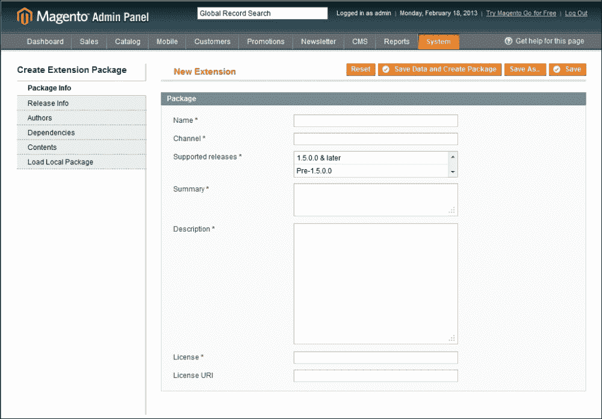
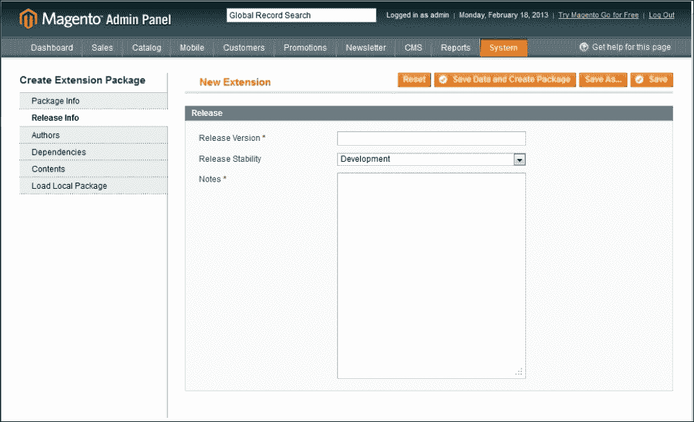
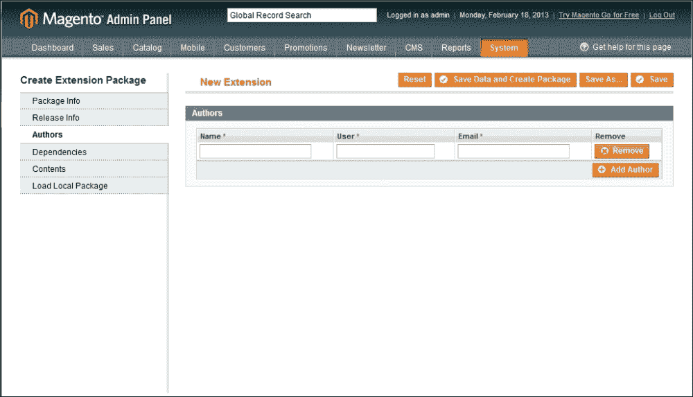
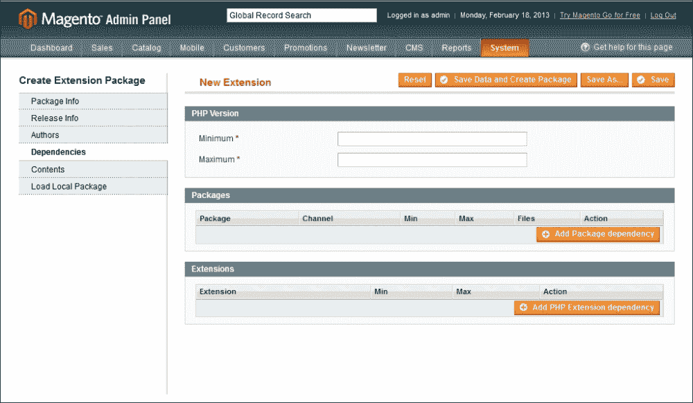
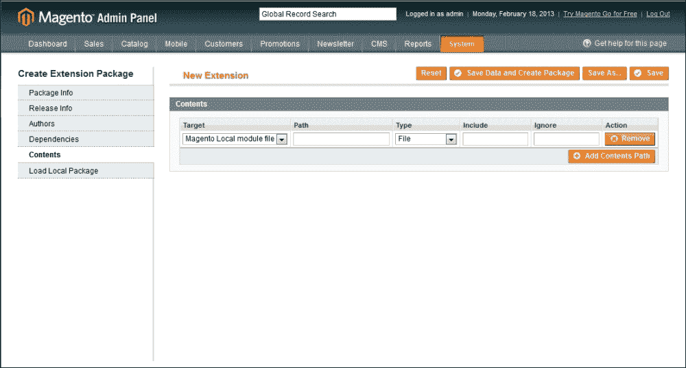
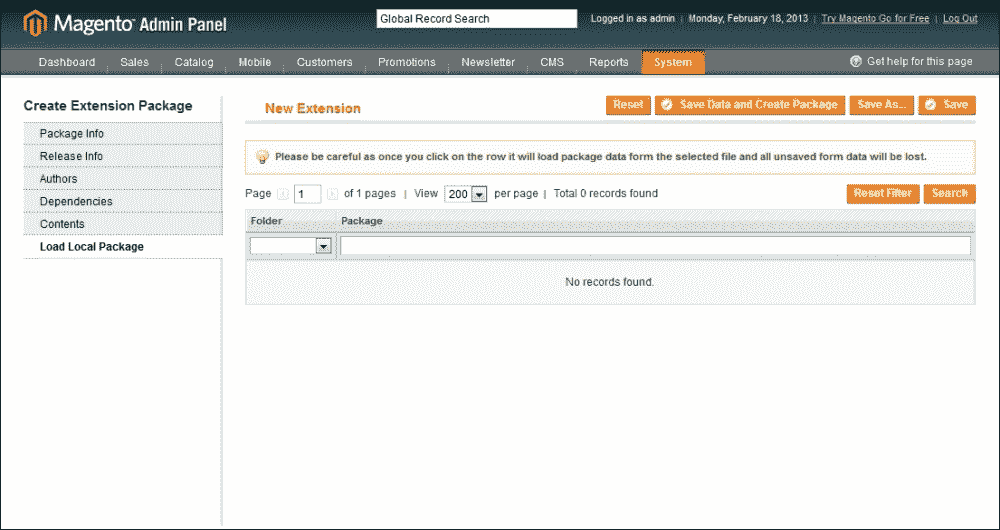
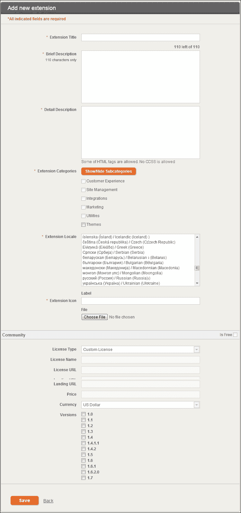

# 第七章：部署和分发

欢迎来到本书的最后一章；我们在旅途中已经走得很远，学到了很多。到现在，您应该对与 Magento 一起工作和开发自定义扩展所涉及的所有内容都有一个清晰的认识——嗯，几乎是这样。

对于任何其他 Magento 开发者来说，您的代码最终都需要被提升到生产环境，或者可能需要打包以供分发。在本章中，我们将看到我们可用的不同技术、工具和策略。

本章的最终目标是为您提供工具和技能，以便您能够自信地进行部署，并且停机时间尽可能短或没有停机。

# 零停机时间部署的道路

将应用部署到生产环境可能是开发者最害怕的任务之一，而且往往会被错误地执行。

但什么是零停机时间部署？在代码经过适当测试并准备就绪的情况下将其提升到生产环境，这是所有 Magento 开发者都应该努力实现的目标。

这不是通过单一的过程或工具实现的，而是通过一系列技术、标准和工具的组合。在本章中，我们将学习以下内容：

+   通过 Magento Connect 分发我们的扩展

+   版本控制系统在部署中的作用

+   正确的分支和合并更改的实践

## 从头开始做对

在上一章中，我们学习了测试如何不仅能够增强我们的工作流程，还能帮助我们避免未来的麻烦，单元测试和集成测试；自动化工具就在我们身边，以确保我们的代码得到适当的测试。

编写测试不仅仅是编写几个测试并称之为完成；我们负责考虑所有可能影响我们代码的边缘情况，并为每个情况编写测试。

## 确保您看到的就是您得到的

在本书的第一章中，我们直接进入了设置我们的开发环境，这是一个非常重要的任务。为了确保我们交付高质量的测试代码，我们必须能够在尽可能接近生产环境的环境中开发和测试我们的代码。

为了说明这个环境的重要性，我将举一个例子。在 Magento 的早期阶段，我经常听到开发者会在他们的本地环境中工作，从头开始创建新的扩展。他们在本地预发布环境中完成开发和测试，一切似乎都运行正常。

一种常见的流程是：

+   在尽可能类似于生产环境的虚拟机上开始开发，该虚拟机运行在开发者的本地机器上

+   在尽可能接近生产环境的预发布环境中测试和批准更改

+   最后，更改被部署到生产环境中

因此，现在是开发者将他们的代码提升到生产环境的时候了，他们自信地那样做了。当然，它在本地系统上是工作的，所以它必须在生产环境中工作，对吧？在这些特定情况下，情况并非如此；相反发生的是，一旦新的代码被加载到生产环境中，商店就会崩溃，说自动加载器找不到类。

发生了什么？嗯，在这里，问题在于开发者的本地环境是 Windows，扩展文件夹的名称是**驼峰式命名**，例如`MyExtension`，但他们内部在类名称中使用的是**大写**文本（`Myextension`）。

现在，这将在 Windows 上工作得很好，因为文件不区分大写、小写或混合大小写的文件夹名称，而基于 Unix 的系统，如大多数的 Web 服务器，确实会在文件夹和文件命名上做出区分。

虽然这个例子可能看起来很愚蠢，但它很好地说明了标准化开发环境的需求。在 Magento 安装中有很多部分和"移动部件"；PHP 的不同版本或一个在生产环境中启用但在测试环境中未启用的 Apache 模块，可能会产生巨大的差异。

## Magento 命名约定

Magento 使用基于文件系统中类位置的标准化类命名约定。这种标准化使得自动类加载成为可能，而不是使用更传统的`require_once`和`include_once`函数。

例如，`Mage_Catalog_Model_Product`类位于`app/code/core/Mage/Catalog/Model/Product.php`位置；Magento 自动加载器足够智能，可以将下划线（`_`）字符替换为目录分隔符。

## 准备就是准备

我们何时决定我们的代码实际上已经准备好进入生产环境，"准备好"到底意味着什么？每个开发者可能对"准备好"和"完成"有不同的定义。当我们开发一个新模块或扩展 Magento 时，我们应该始终定义这个特定功能/代码的"准备好"的含义。

因此，我们现在正在取得进展，并且我们知道为了转移到生产环境，我们必须：

+   测试我们的代码并确保我们已经覆盖了所有边缘情况

+   确保代码遵循标准和指南

+   确保它已经在尽可能接近生产环境的环境中进行了测试和开发

# 版本控制系统

**版本控制系统**（**VCS**）是任何开发者的生命线，尽管在 Git 和 SVN 爱好者之间这个领域可能有些分歧（不会提到你们，Mercurial 的朋友们），但基本功能仍然是相同的。

让我们快速了解一下每个 VCS 之间的差异以及每个 VCS 的优点和缺点。

## Subversion

**Subversion**（**SVN**）是一个强大的系统，已经存在了相当长的时间，非常知名，并且被广泛使用。

SVN 是一个集中式 VCS；我们这样说的意思是，有一个单一的主源被认可为“良好”，所有开发者从这里检出和推送更改。

虽然这使得更改更容易跟踪和维护，但它有一个严重的缺点。由于它是集中的，这意味着我们必须始终与中央仓库保持联系，无论是远程工作还是没有互联网连接，这是不可能的。这在下图中得到了说明：

## Git

Git 是一个较新的 VCS，近年来由于开源社区的广泛采用和 GitHub（[www.github.com](http://www.github.com)）的流行而越来越受欢迎。

SVN 和 Git 之间的一个关键区别是 Git 是一个去中心化的版本控制系统。我们这样说的意思是，没有中央权威或主仓库；每个开发者都有本地仓库的完整副本。

去中心化使得 Git 更快，除了拥有比 VCS 更好的和更强大的**分支**系统之外。此外，远程工作或在没有互联网连接的情况下工作也是可能的：

无论我们选择哪种版本控制系统（VCS），任何 VCS 最强大且有时被忽视的功能仍然可用：创建分支或分支的能力。

分支允许我们在不影响主分支或 master 中的稳定代码的情况下，进行实验和工作在新功能上。创建分支是对当前主分支/master 代码的快照，我们可以在这里进行任何更改和测试。

现在，分支只是方程的一部分。一旦我们对代码更改感到满意，并且我们已经正确测试了每个边缘情况，我们需要一种方法将这些更改重新集成到我们的主代码库中。

**合并**通过运行几个命令，给我们重新集成所有分支修改的能力。

通过将分支和合并更改集成到我们的工作流程中，我们获得了灵活性和自由，可以在不干扰实验或进行中的代码的情况下，对不同的更改集、功能和错误修复进行工作。

此外，正如我们将要学习的，版本控制还可以帮助我们执行无缝升级，并轻松地将代码更新到多个 Magento 安装中。

# 分发

你可能想要自由分发你的扩展，或者可能想要将其作为商业产品提供，但你怎么能保证每次安装代码都是正确安装的，而无需亲自检查？还有更新或升级怎么办？并非所有店主都精通技术或能够自己更改文件。

幸运的是，Magento 自带其包管理器和扩展市场，称为 Magento Connect。

Magento Connect 允许开发者和解决方案合作伙伴与社区分享他们的开源和商业贡献，并且不仅限于自定义模块；我们可以在 Magento Connect 市场中找到以下类型的资源：

+   模块

+   语言包

+   自定义主题

## 打包我们的扩展

Magento Connect 的核心功能之一是它允许我们从 Magento 后端直接打包我们的扩展。

要打包我们的扩展，请执行以下步骤：

1.  登录到 Magento 后端。

1.  从后端导航到**系统** | **Magento Connect** | **包扩展**。

如我们所见，**创建扩展包**部分由六个不同的部分组成。

### 包信息

**包信息**用于指定一般扩展信息，例如名称、描述以及支持的 Magento 版本。子部分包括：

+   **名称**: 标准做法是保持名称简单并使用单词

+   **通道**: 这指的是扩展的代码库；正如我们在前面的章节中提到的，为分发而设计的扩展应使用**社区**通道

+   **支持版本**: 选择应支持我们扩展的 Magento 版本

+   **摘要**: 这是用于扩展审查过程的简要描述

+   **描述**: 这是扩展及其功能的详细描述

+   **许可证**: 这用于扩展，其中一些可用的选项包括：

    +   **开源软件许可证** (**OSL**)

    +   **Mozilla 公共许可证** (**MPL**)

    +   **麻省理工学院许可证** (**MITL**)

    +   GNU **通用公共许可证** (**GPL**)

    +   如果您的扩展要商业分发，则任何其他许可证

+   **许可证 URL**: 这是许可证文本的链接

### 注意

关于不同许可证类型的更多信息可以在[`www.magedevguide.com/license-types`](http://www.magedevguide.com/license-types)找到。

### 发布信息

以下截图显示了**发布信息**的屏幕：

**发布信息**部分包含有关当前包发布的的重要数据：

+   **发布版本**: 在初始发布中，这可以是任何任意数字；然而，每次发布时版本都需要递增。Magento Connect 不允许您更新相同的版本两次。

+   **发布稳定性**: 有三个选项可用（**稳定**、**Beta**和**Alpha**）。

+   **备注**: 通过这种方式，我们可以发布所有具体的备注，如果有的话。

### 作者

以下截图显示了**作者**的屏幕：

在本节中，指定了作者（们）的信息；每个作者信息包含以下字段：

+   **名称**: 这指定了作者的完整姓名

+   **用户**: 这指定了 Magento 的用户名

+   **电子邮件**: 这指定了联系电子邮件地址

### 依赖项

以下截图显示了**依赖项**的屏幕：

在打包 Magento 扩展时，使用了三种类型的依赖项：

+   **PHP 版本**: 这是支持此扩展的 PHP 的**最小**和**最大**版本

+   **包**：这用于指定此扩展所需的任何其他包

+   **扩展**：通过这个，我们可以指定是否需要特定的 PHP 扩展才能使我们的扩展工作

如果未满足包依赖关系，Magento Connect 将提供安装所需扩展，因为 PHP 扩展的 Magento Connect 将抛出错误并停止安装。

### 内容

以下截图显示了**内容**屏幕：

**内容**部分允许我们指定构成扩展包一部分的每个文件和文件夹。

### 注意

这是扩展打包过程中的最重要部分，也是最容易被搞错的部分。

每个内容条目都有以下字段：

+   **目标**：这是目标基本目录；它用于指定搜索文件的基路径。以下选项可用：

    +   **Magento 核心团队模块文件 - ./app/code/core**

    +   **Magento 本地模块文件 - ./app/code/local**

    +   **Magento 社区模块文件 - ./app/code/community**

    +   **Magento 全局配置 - ./app/etc**

    +   **Magento 区域语言文件 - ./app/locale**

    +   **Magento 用户界面（布局、模板）- ./app/design**

    +   **Magento 库文件 - ./lib**

    +   **Magento 媒体库 - ./media**

    +   **Magento 主题皮肤（图像、CSS、JS）- ./skin**

    +   **Magento 其他可访问的 Web 文件 - ./**

    +   **Magento PHPUnit 测试 - ./tests**

    +   **Magento 其他 - ./**

+   **路径**：这是相对于指定目标的文件名和/或路径

+   **类型**：我们有两个选项，**文件**或**递归目录**

+   **包含**：此字段接受一个正则表达式，允许我们指定要包含的文件

+   **忽略**：此字段接受一个正则表达式，允许我们指定要排除的文件

### 加载本地包

以下截图显示了**加载本地包**屏幕：

此部分允许我们加载打包的扩展；由于我们没有打包任何扩展，列表目前为空。

让我们继续打包我们的礼品注册扩展；确保您填写了所有字段，然后点击**保存数据和创建包**。这将打包并保存扩展到`magento_root/var/connect/`文件夹中。

扩展包文件包含所有所需源文件和源代码；此外，每个包都会创建一个新文件，称为`package.xml`。此文件包含有关扩展以及文件和文件夹详细结构的所有信息。

# 发布我们的扩展

最后，为了使我们的扩展可用，我们必须在 Magento Connect 中创建一个扩展配置文件。

要创建一个扩展配置文件，请执行以下步骤：

1.  登录到[magentocommerce.com](http://magentocommerce.com)。

1.  点击**我的账户**链接。

1.  点击左侧导航中的**开发者**链接。

1.  点击**添加新扩展**。

**添加新扩展**的屏幕看起来大致如下：

重要的是要注意，扩展密钥字段必须与生成包时使用的确切名称相同。

一旦创建了扩展配置文件，我们就可以上传我们的扩展包；所有字段都应该与扩展打包过程中指定的字段相匹配。

最后，一旦我们完成，我们可以点击**提交审核**按钮。扩展可以有以下状态：

+   **已提交**: 这意味着扩展已提交进行审核。

+   **未批准**: 这意味着扩展存在问题；您还将收到一封电子邮件解释扩展未批准的原因。

+   **在线**: 这意味着扩展已被批准，并通过 Magento Connect 提供。

+   **离线**: 您可以从账户扩展管理器随时将您的扩展离线。

# 摘要

在本章中，我们学习了如何部署和共享我们的自定义扩展。我们可以使用许多不同的方法来共享和部署我们的代码到生产环境。

这是本书的最后一章。我们学到了很多关于 Magento 开发的知识，虽然我们覆盖了很多内容，但本书仅旨在作为漫长旅程的垫脚石。

Magento 不是一个容易学习的框架，虽然它可能是一个令人畏惧的经历，但我鼓励您继续尝试和学习。
