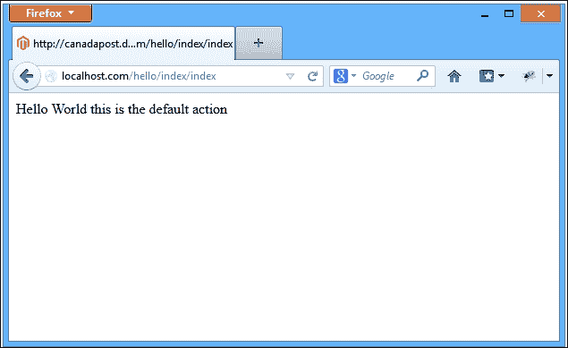
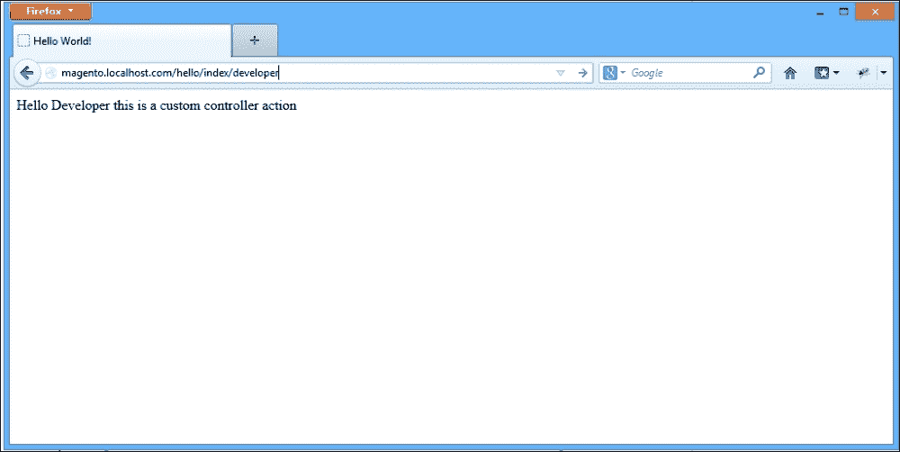

# 附录 A. 欢迎使用 Magento

以下示例将快速简单地介绍创建 Magento 扩展的世界。我们将创建一个简单的“Hello World”模块，它将允许我们在访问商店中的特定 URL 时显示“Hello World！”消息。

# 配置

在 Magento 中创建一个基本的扩展至少需要两个文件：`config.xml`和模块声明文件。让我们继续创建我们的每个文件。

第一个文件用于向 Magento 声明模块。没有这个文件，Magento 将不知道任何扩展文件。

文件位置是`app/etc/modules/Mdg_Hello.xml`。

```php
<?xml version="1.0"?>	
<config>
    <modules>
        <Mdg_Hello>
            <active>true</active>
            <codePool>local</codePool>
        </Mdg_Hello>
    </modules>
</config>
```

第二个 XML 文件称为`config.xml`，用于指定所有扩展配置，例如路由、块、模型和辅助类名。在我们的示例中，我们只将与控制器和路由相关的工作。

让我们使用以下代码创建配置文件：

文件位置是`app/code/local/Mdg/Hello/etc/config.xml`。

```php
<?xml version="1.0"?>
<config>

    <modules>
        <Mdg_Hello>
            <version>0.1.0</version>
        </Mdg_Hello>
    </modules>
    <frontend>
        <routers>
            <mdg_hello>
                <use>standard</use>
                <args>
                    <module>Mdg_Hello</module>
                    <frontName>hello</frontName>
                </args>
            </mdg_hello>
        </routers>
    </frontend>
</config>
```

我们现在可以通过 Magento 加载我们的扩展，并且可以通过导航到**系统** | **配置** | **高级**来启用或禁用我们的扩展。

# 控制器

在其核心，Magento 是一个**模型-视图-控制器**（**MVC**）框架，因此为了使我们的新路由生效，我们必须创建一个新的控制器来响应这个特定的路由。为此，执行以下步骤：

1.  导航到扩展根目录。

1.  创建一个名为`controllers`的新文件夹。

1.  在`controllers`文件夹内创建一个名为`IndexController.php`的文件。

1.  复制以下代码：

    文件位置是`app/code/local/Mdg/Hello/controllers/IndexController.php`。

    ```php
    <?php 
    class Mdg_Hello_IndexController extends Mage_Core_Controller_Front_Action
    {
         public function indexAction()
      {
         echo 'Hello World this is the default action';
         }
    }
    ```

# 测试路由

现在我们已经创建了我们的路由和控制器，我们可以通过打开`http://magento.localhost.com/hello/index/index`来测试它，我们应该看到以下屏幕：



默认情况下，Magento 将使用索引控制器和索引操作作为每个扩展的默认值。因此，如果我们访问`http://magento.localhost.com/hello/index/index`，我们应该看到与之前截图相同的屏幕。

为了结束我们对创建 Magento 模块的介绍，让我们在我们的控制器中添加一个新的路由：

1.  导航到扩展根目录。

1.  打开`IndexController.php`。

1.  复制以下代码：

    文件位置是`app/code/local/Mdg/Hello/controllers/IndexController.php`。

    ```php
    <?php 
    class Mdg_Hello_IndexController extends Mage_Core_Controller_Front_Action
    {
         public function indexAction()
      {
         echo 'Hello World this is the default action';
         }

         public function developerAction()
         {
             echo 'Hello Developer this is a custom controller action';
         }
    }
    ```

    最后，让我们测试一下，通过访问`http://magento.localhost.com/hello/index/developer`来加载新的动作路由。

    
