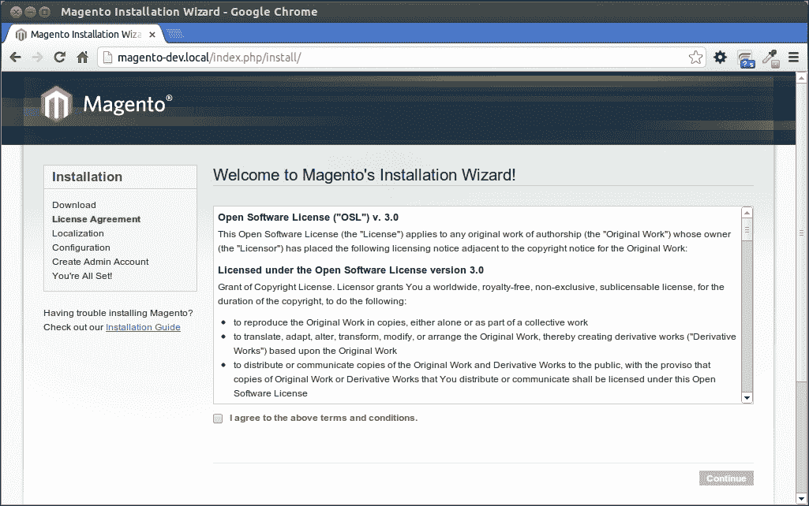
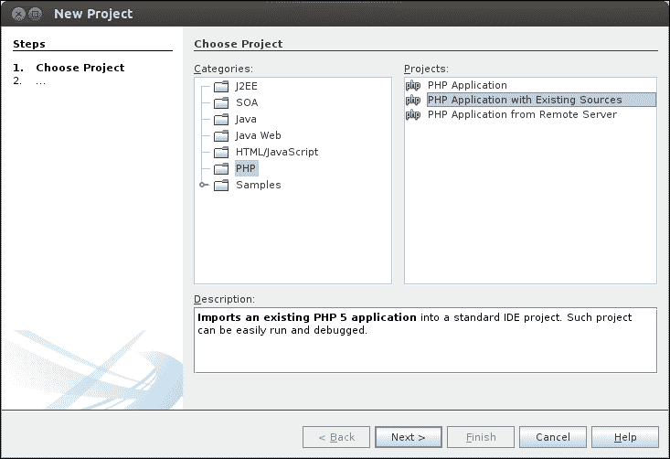
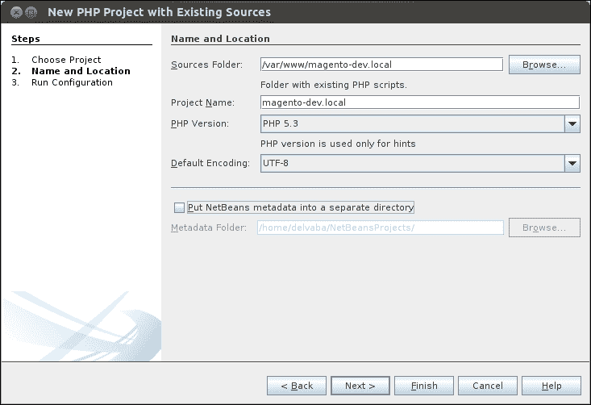
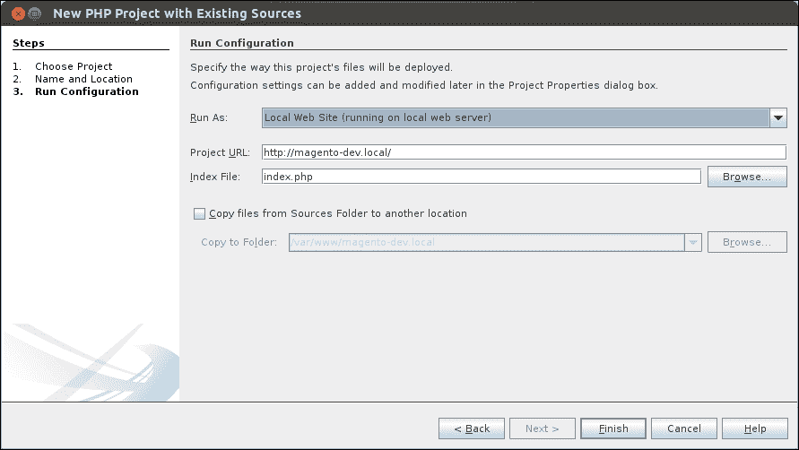

# 第一章. Magento 入门

在本章中，我们将涵盖以下主题：

+   准备开发环境

+   使用示例数据安装 Magento

+   将版本控制添加到源代码

+   配置开发工具

# 简介

你可能听说过 Magento。它是一个开箱即用的电子商务平台，具有许多功能，例如目录导航、促销规则、RSS 源、产品搜索、产品标签、产品评论、税务规则、报告和订单管理。

Magento 背后的公司是 Varien。2007 年，他们开始考虑一个开源的电子商务平台，该平台将针对大量用途进行设计。经过一年的开发，2008 年推出了第一个稳定版本 Magento 1.0。当 Magento 在后来的几年中变得更加流行时，eBay 对其产生了兴趣，现在拥有 100% 的 Magento。

如果您安装并配置了 Magento，那么您就可以开始在线销售产品。但是，当您需要自定义主题、额外的运输方式和其他功能时，您必须根据 Magento 的规则扩展软件。如果您对 PHP 编程有所了解，请按照食谱中描述的步骤操作，您就可以开始编辑您的 Magento 商店。

我们将创建一个开发环境，您可以从中开始工作。我们将安装示例数据，以便商店不会空空如也，并准备好使用。如果您是新手，您可以从这里开始。如果您是专业人士，您仍然可以从这里开始，因为我们遵循 Magento 开发的最佳实践。让我们开始吧。祝你好运！

# 准备开发环境

我们将设置一个包含 Magento 的开发环境。为此，我们需要设置一个 **LAMP** （**Linux, Apache, MySQL, PHP**） 环境。在那个 LAMP 环境中，我们将创建一个 **完全限定域名** （**FQDN**） 和一个虚拟主机。

## 准备就绪

我们需要设置一个开发服务器，我们将使用它来运行 Magento。当我们有一个 Ubuntu 桌面环境时，我们必须安装以下软件的最新版本：

+   Apache2

+   PHP

+   MySQL 服务器

+   额外的 PHP 库

我们可以通过在 CLI 界面上运行以下命令来安装这些软件。这些命令基于基于 Ubuntu 的 Linux 发行版。要在带有 Ubuntu 操作系统的桌面电脑上运行这些命令，请启动 **终端** 程序：

+   要安装 Web 服务器 Apache2，请运行以下命令：

    ```php
    sudo apt-get install apache2

    ```

+   安装 PHP，请运行以下命令：

    ```php
    sudo apt-get install php5

    ```

+   要安装 MySQL 服务器，请运行以下命令：

    ```php
    sudo apt-get install mysql-server

    ```

+   要安装 Magento 所需的 PHP 扩展，例如 MySQL 桥接，请运行以下命令：

    ```php
    sudo apt-get install php5-mysql php5-curl php5-gd php-pear

    ```

## 如何操作...

当一切安装完毕后，我们将创建一个带有 FQDN 的虚拟主机。我们希望我们的开发环境可以通过 `http://magento-dev.local/` 访问。为此，我们必须创建一个带有此域名的虚拟主机。此域名指向我们之前创建的 Web 服务器的 IP 地址。

以下步骤描述了如何创建一个带有 FQDN 的虚拟主机：

1.  在 `/etc/apache2/sites-available/` 目录中创建一个 `magento-dev.local` 文件。

1.  要创建和编辑文件，请运行以下命令：

    ```php
    sudo nano /etc/apache2/sites-available/magento-dev.local

    ```

1.  将以下内容粘贴到该文件中：

    ```php
    <VirtualHost *:80>
     # ServerName (domain) and admin email
     ServerAdmin webmaster@magento-dev.local
     ServerName magento-dev.local

     DocumentRoot /var/www/magento-dev.local/public # Folder of the site. We have to create this

     # Log file locations
     LogLevel warn
     ErrorLog /var/log/apache2/magento-dev.error.log
     CustomLog /var/log/apache2/magento-dev.access.log combined
    </VirtualHost>
    ```

1.  在终端中运行以下命令以创建 `www` 根目录：

    1.  要创建站点文件夹（文档根目录），请运行以下命令：

        ```php
        sudo mkdir /var/www/magento-dev.local/public
        sudo chown -R www-data:www-data /var/www/magento-dev.local/

        ```

    1.  要启用站点，请运行以下命令：

        ```php
        sudo a2ensite magento-dev.local

        ```

    1.  要重新加载 Apache 服务器，请运行以下命令：

        ```php
        sudo service apache2 reload

        ```

    1.  要测试站点，我们必须在我们的主机文件（`/etc/hosts`）中添加以下行：

        ```php
        127.0.0.1 magento-dev.local

        ```

        这将使域名 `magento-dev.local` 指向 IP 地址 127.0.0.1。这是本地 web 服务器的 IP 地址（localhost），因此向此 URL 发出的请求不会进入互联网，而是进入本地 web 服务器。

## 它是如何工作的...

本食谱描述了如何从 CLI 界面安装 web 服务器。如果您已经有一个具有特定域名的 web 服务器，您可以跳过这一章。

Magento 文件将安装在公共目录中。当对域名发出请求时，`www-data` 用户将执行请求。因此，最好所有文件和文件夹都由 `www-data` 用户和组拥有，以避免权限问题。

在 Linux 服务器上，每个文件和文件夹都有三种类型的权限。这些权限是 **读取**、**写入**和**执行**（**rwx**）。您可以在三个范围内设置这些权限：所有者、组和其他人。在每次文件请求时，Linux 根据权限决定用户是否可以读取、写入或执行某个文件。

对于 HTTP 请求，将使用 `www-data` 用户来执行请求。因此，确保 `www-data` 用户有足够的文件权限来运行应用程序非常重要。要更改文件权限，可以使用 `chmod` 命令。要更改所有者和组，可以使用 `chown` 命令。

## 还有更多...

也可能在其他操作系统上运行 Magento 和 web 服务器。要运行 web 服务器，我们需要 Apache、MySQL 和 PHP。这些软件可以在 Windows 或 Mac 设备上安装。

Windows 操作系统的变体是 **WAMP**（**Windows, Apache, MySQL, and PHP**）。您可以在 WAMP 网站上找到有关此变体的更多信息，网址为 [`www.wampserver.com`](http://www.wampserver.com)。

对于 Mac OS，另一种选择是 MAMP。有关 MAMP 的更多信息，请访问 [`www.mamp.info`](http://www.mamp.info)。

跨平台 web 服务器是 XAMP。您可以从他们的网站下载 Linux、Windows 或 Mac 的安装程序，网址为 [`www.apachefriends.org/en/xampp.html`](http://www.apachefriends.org/en/xampp.html)。

# 使用示例数据安装 Magento

当您安装 Magento 时，您可以从一个空数据库或包含一些示例产品和配置的数据库开始。对于我们的开发环境，最佳做法是从示例数据开始，因为我们可以在安装后立即开始使用 Magento。

对于一个新的网店，建议从空数据库开始，自行进行配置。要安装 Magento，我们需要以下数据：

+   Magento 代码

+   示例数据

## 准备工作

您可以从 Magento 的网站下载 Magento 和示例数据（[`www.magentocommerce.com/download`](http://www.magentocommerce.com/download)）。下载最新的**完整版本**和**示例数据**。本书的食谱基于 Magento 版本 1.8.1.0。对于示例数据，您可以使用 1.6.1.0 版本。

## 如何操作...

以下步骤显示了如何安装带有示例数据的干净 Magento 网店：

1.  将代码提取到我们 Web 服务器适当的文件夹中。在我们的例子中，这是 `/var/www/magento-dev.local/public`。通过在网站的根文件夹中运行 `ls -la` 命令查看文件夹结构。我们必须注意隐藏文件是否包含在文件夹中：

    ```php
    ls -la
    drwxrwxr-x .
    drwxrwxr-x ..
    -rwxrw-r-- .htaccess
    -rw-rw-r-- .htaccess.sample
    -rw-rw-r-- api.php
    drwxrwxr-x app
    -rw-rw-r-- cron.php
    -rw-rw-r-- cron.sh
    drwxrwxr-x downloader
    drwxrwxr-x errors
    -rw-rw-r-- favicon.ico
    -rw-rw-r-- get.php
    -rw-rw-r-- .htaccess
    -rw-rw-r-- .htaccess.sample
    drwxrwxr-x includes
    -rw-rw-r-- index.php
    -rw-rw-r-- index.php.sample
    -rw-rw-r-- install.php
    drwxrwxr-x js
    drwxrwxr-x lib
    -rw-rw-r-- LICENSE_AFL.txt
    -rw-rw-r-- LICENSE.html
    -rw-rw-r-- LICENSE.txt
    -rw-rw-r-- mage
    drwxrwxr-x media
    -rw-rw-r-- php.ini.sample
    drwxrwxr-x pkginfo
    -rw-rw-r-- RELEASE_NOTES.txt
    drwxrwxr-x shell
    drwxrwxr-x skin
    drwxrwxr-x var
    ```

    ### 提示

    在 Linux 中，隐藏文件或文件夹以点（.）开头，例如 `.htaccess` 文件。我们使用的 `ls` 命令的 `-a` 选项显示了所有文件和文件夹，包括隐藏的。重要的是要看到 `.htaccess` 文件在目录中，因为这个文件包含 URL 重写和其他服务器配置的配置。

1.  当您解压示例数据存档时，您会看到一个媒体文件夹和一个 SQL 文件。SQL 文件包含数据库、媒体文件夹和图像。要安装媒体文件夹，请将此文件夹与网站的根媒体文件夹合并。

    ### 提示

    在运行 Magento 安装向导之前安装示例数据非常重要。如果 Magento 在数据库中找不到示例数据，向导将继续使用不带示例数据的空数据库。

1.  要安装数据库，您必须运行以下命令：

    1.  要创建数据库，请运行以下命令：

        ```php
        mysql -u root -p
        create database magento_dev;
        exit;

        ```

    1.  要导入 SQL 文件，请运行以下命令：

        ```php
        mysql -u <<username>> -p magento_dev < "path_to_sample_data.sql"

        ```

    ### 提示

    为了避免权限问题，请确保所有文件和文件夹都有正确的权限。出于安全考虑，建议所有文件只拥有足够的权限，以便只有正确的用户可以访问正确的文件。当您赋予所有权限（777）时，您不会有权限问题；但是，服务器上的每个用户都可以读取、写入和执行您的应用程序中的每个文件。

1.  下一步是运行 Magento 安装向导。转到网站的 URL，安装程序将如以下截图所示显示：

1.  通过接受条款和条件继续安装过程。

1.  在下一屏，选择您商店的正确语言、区域设置和货币。

1.  在**配置**页面，用正确的数据填写表单：

    +   **数据库类型**：在此字段中输入 `MySQL`。

    +   **主机**：在此字段中输入 `localhost`。

    +   **数据库名称**：在此字段中输入 `magento_dev`（您的 Magento 数据库名称）。

    +   **用户名**：在此字段中输入 `root`（您的 Magento 数据库用户名）。

    +   **用户密码**：在此字段中输入`root`（你的数据库用户密码）。留空是可能的。

    +   **表前缀**：留此字段为空（如果填写，所有表都将具有在此处输入的前缀）。

    +   **基础 URL**：在此字段中输入`http://magento-dev.local/`（你的网店 URL）。

    +   **管理路径**：在此字段中输入`admin`（后端路径）。

    +   **启用图表**：此复选框必须勾选。

    +   **在下一步之前跳过基础 URL 验证**：此复选框必须取消勾选（如果勾选，向导将在处理此表单时检查有效的 URL）。

    +   **使用 Web 服务器（Apache）重写**：此复选框必须取消勾选。

    +   **使用安全 URL（SSL）**：此复选框必须取消勾选。

1.  提交表单并继续到下一步。在这一步中，你可以配置管理员账户。填写正确的数据，并记住登录名和密码，因为这是管理商店所必需的。留加密密钥为空。

1.  提交此表单后，安装向导终止。设置完成。你现在可以访问你的商店，并使用在安装向导中创建的用户名进入后端。

## 工作原理...

我们刚刚创建了一个完全功能的 Magento 商店。技术上，你可以开始销售产品。

我们从示例数据开始。我们插入数据库的 SQL 文件包含示例网店的所有数据。当你想创建一个空网店时，你可以从一个空数据库开始。

当安装一个新的商店时，始终遵循安装向导。安装向导创建`app/etc/local.xml`文件，并安装你在安装向导中设置的值。这些值包括货币、时区、后端用户等。当`app/etc/`文件夹中没有`local.xml`文件时，安装向导会出现。在其他所有情况下，网店会出现。

在`app/etc`文件夹中有一个完整的`local.xml`文件，你可以安装 Magento。然而，这并不推荐，因为你没有后端用户和其他配置。

# 将版本控制添加到源代码

使用版本控制，你可以管理对计算机文件所做的更改。当你将其添加到编程代码中时，你可以跟踪从初始化以来对代码所做的所有更改。市场上有一些非常流行的版本控制系统，例如 Subversion (SVN)、Mercurial SCM、CVS 和 Git SCM。

在这个菜谱中，我们将使用 Git SCM 为之前创建的 Magento 代码添加版本控制。我们将初始化一个空仓库。之后，我们将进行几次提交，将所有 Magento 代码添加到仓库中。

## 准备工作

前往你的命令行，通过在终端运行以下命令在你的本地服务器上安装 Git：

```php
sudo apt-get install git

```

## 如何操作...

以下步骤展示了你如何将 Magento 代码添加到版本控制系统 Git 中：

1.  我们必须初始化 Git 仓库。为此，导航到源文件夹并输入以下命令：

    ```php
    git init

    ```

1.  运行以下命令，你会看到所有文件都被标记为未跟踪：

    ```php
    git status

    ```

    在接下来的步骤中，我们将把其他文件夹添加到仓库中。

1.  通过运行以下命令将 `app/` 文件夹添加到仓库中：

    ```php
    git add app/ 

    ```

    这将添加 `app/` 目录中的所有文件。当你运行 `git status` 命令时，你会看到所有文件的列表。

1.  运行以下命令从仓库中删除 `local.xml` 文件，但不从驱动器中删除：

    ```php
    git rm --cached app/etc/local.xml

    ```

1.  运行以下命令以创建第一个提交：

    ```php
    git commit –m "add app folder"

    ```

1.  运行以下命令以跟踪文件的状态：

    ```php
    git status

    ```

1.  在根目录中创建一个 `.gitignore` 文件，并在其中添加以下内容：

    ```php
    app/etc/local.xml

    ```

1.  再次运行 `git status` 命令，你会看到 `local.xml` 被忽略。

1.  通过运行以下命令提交 `.gitignore` 文件：

    ```php
    git commit .gitignore –m "add gitignore file"

    ```

1.  通过运行命令 `git add` <`文件夹或文件名`> 将其他应用程序文件和文件夹添加到仓库中。为以下文件夹运行此命令：

    +   `downloader`（用于安装插件）

    +   `errors`（关于错误处理的配置）

    +   `js`（JS 库文件夹）

    +   `lib`（包含 PHP 库）

    +   `pkginfo`（关于升级的信息）

    +   `shell/`（包含 PHP CLI 脚本）

    +   `skin/`（CSS 和图像文件夹）

    +   `api.php`

    +   `cron.php`

    +   `cron.sh`

    +   `favicon.ico`

    +   `get.php`

    +   `index.php`

    +   `index.php.sample`

    +   `install.php`

    +   `LICENCE_AFL.txt`

    +   `LICENCE.html`

    +   `LICENCE.txt`

    +   `mage`

    +   `php.ini.sample`

    +   `RELEASE_NOTES.txt`

1.  运行新的 `git commit` 命令：

    ```php
    git commit –m "add additional files"

    ```

1.  忽略其他非静态的 Magento 文件和文件夹。在 `.gitignore` 文件中添加以下内容：

    ```php
    /app/etc/local.xml

    /errors/local.xml

    /media/css/
    /media/dhl
    /media/downloadable
    /media/import/
    /media/js/
    /media/catalog/
    /media/customer
    /media/upload/
    /media/wysiwyg/
    /media/captcha/
    /media/tmp/
    /media/xmlconnect

    /var/import/
    /var/export/
    /var/cache/
    /var/log/
    /var/session/
    /var/locks/
    /var/package
    /var/report/
    /var/resource_config.json

    sitemap.xml
    ```

1.  通过以下命令将 `media/` 和 `var/` 文件夹添加到仓库中：

    ```php
    git add media/.htaccess
    git add var/.htaccess

    ```

    我们只需要 `.htaccess` 文件，其他文件被忽略，因为它们是动态的。

## 它是如何工作的...

当使用版本控制系统时，你必须记住，克隆项目的另一个人可以设置一个包含数据库和 Git 中的代码的环境。这个环境必须与你提交的环境相同。

非常重要的是，每个 Magento 核心文件和你的定制文件都必须在 Git 仓库中。你不需要将配置文件，如 `app/etc/local.xml` 和 `errors/local.xml`，添加到版本控制中。当你在另一台服务器上运行你的代码时，配置文件中的设置通常与服务器上的设置不同。

动态生成的文件，如缓存文件和用户图像，存储在 `media` 和 `var` 文件夹中，所以我们不需要这些文件夹的内容。

这些文件夹中唯一重要的文件是 `.htaccess` 文件，它包含限制 `var` 文件夹和 `media` 文件夹的配置。

# 配置开发工具

当你开始定制你的 Magento 店铺时，一个包含以下组件的良好开发环境可以节省时间：

+   代码编辑器（IDE）

+   MySQL 客户端（phpMyAdmin 或 MySQL Workbench）

+   命令行工具

## 准备工作

NetBeans 是一个开源 IDE，可用于许多编程语言。PHP 支持维护良好，并且与其他系统（Git、SVN 和 MySQL）有很多集成。

要安装 NetBeans，您必须从他们的网站 [`netbeans.org`](http://netbeans.org) 下载并运行安装程序。确保在下载时，您选择 PHP 版本或完整版本。

## 如何操作...

以下步骤展示了如何使用 Magento 文件作为文档根创建 NetBeans 项目：

1.  要创建项目，打开 NetBeans 并导航到 **文件** | **新建项目**。

1.  在对话框窗口中，点击 **PHP 应用程序（使用现有源）**，如图所示：

1.  点击 **下一步** 并配置以下设置：

    +   **源文件夹**: 此字段设置为您的 Magento 代码位置

    +   **项目名称**：NetBeans 项目的名称在此字段中输入

    +   **PHP 版本**: 此字段设置为 **PHP 5.3** 或更高版本

    +   **默认编码**：此字段设置为 **UTF-8**

    以下截图给出了这些设置的示例值：

    

    ### 小贴士

    当您使用版本控制系统（SVN、Git 或其他）时，建议勾选选项 **将 NetBeans 元数据放入单独的目录**。如果没有勾选，将在您的 Magento 根目录中创建一个 `.nbproject` 文件夹，您将不会在版本控制系统中拥有它。另一种可能性是在 `.gitignore` 文件中添加 `.nbproject` 文件夹。

1.  点击 **下一步**。

1.  配置以下设置：

    +   **运行方式**：在我们的案例中，此字段设置为本地网络服务器

    +   **项目 URL**: 在此字段中输入 `http://magento-dev.local`，这是我们为 Magento 配置的 URL

    +   **索引文件**: 此字段设置为 `index.php`

    以下截图给出了这些设置的示例值：

    

1.  点击 **完成**，您的 NetBeans 项目就准备好了。

## 它是如何工作的...

当项目启动时，您会在窗口的左侧列中看到文档根。当您双击一个文件时，该文件将在主窗口中打开。在此窗口中，您可以查看文件的历史记录、格式化代码、重构变量名以及更多操作。

## 更多内容...

在 IDE 的开发环境背后，数据库客户端和命令行工具在开发 Magento 时非常有用。

### MySQL 客户端 phpMyAdmin

phpMyAdmin 是一个作为网络应用程序运行的 MySQL 客户端。它是一个易于使用的工具，可以直接在数据库中输入 SQL 语句。

1.  要安装 phpMyAdmin，打开您的终端并运行以下命令：

    ```php
    sudo apt-get install phpmyadmin

    ```

1.  按照安装程序的说明操作。

1.  编辑 `/etc/apache2/apache.conf` 文件，并在文件末尾添加以下代码：

    ```php
    Include /etc/phpmyadmin/apache.conf

    ```

1.  使用以下命令重新加载 Apache 服务器：

    ```php
    sudo service apache2 reload

    ```

1.  前往 `http://magento-dev.local/phpmyadmin`，你将看到登录屏幕。你可以使用你的 Magento 数据库的数据库用户凭据登录。

### 命令行工具 Wiz

Magento 在开发过程中有许多系统任务需要执行。所有这些操作都可以在后台触发。然而，由于这是一项耗时的工作，shell 接口可以为你节省大量时间。

Wiz 是一个可以从 [`github.com/classyllama/Wiz`](https://github.com/classyllama/Wiz) 下载的命令行工具。

按照他们网站上的安装说明进行操作。安装后，你必须将你的 shell 目录更改为 Magento 根目录。如果你在 Magento 根目录中，你运行的所有命令都将针对该 Magento 安装执行。

以下是一些有用的命令：

+   `wiz admin-resetpass`：当你忘记管理员密码时，可以使用此命令

+   `wiz admin-createadmin`：此命令从头创建一个新的管理员用户

+   `wiz cache-clear`：此命令清除所有缓存或特定缓存

+   `wiz devel-showhints`：此命令启用或禁用前端提示

+   `wiz module-list`：此命令列出所有已安装的模块

+   `wiz sql-cli`：此命令打开 MySQL 命令行
