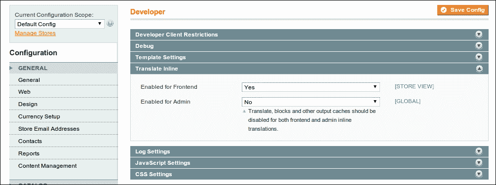

# 第二章 主题化

在本章中，我们将涵盖以下主题：

+   配置 Magento 主题和包

+   创建您的第一个主题

+   向您的主题添加额外文件

+   添加 jQuery 支持

+   更改页面标题

+   与翻译一起工作

+   理解主题块系统

+   将小部件添加到布局中

# 简介

当您想使您的示例 Magento 网站准备就绪时，大多数人首先想要改变的是商店的外观和感觉。访客对您的网站的第一印象就是外观和感觉。

在本章中，我们将介绍您可以使用 Magento 主题做的最重要的事情。自定义标准主题并不难，但从头开始构建一个主题则需要大量工作。

# 配置 Magento 主题和包

Magento 与多个主题一起工作。您可以在同一商店中配置更多主题。一个常见的情况是您有一个商店主题，以及基于商店主题的一些继承主题。

## 准备工作

登录到后端，前往您可以在 **系统** | **配置** | **设计** 下找到的主题配置部分。

## 如何操作...

以下说明描述了如何管理网店的不同 Magento 主题：

1.  将主题字段更改为 `modern` 并清除缓存。前往您的前端，您的商店将如下所示：

    您现在已配置了 `default` 包中的 `modern` 主题。此主题将扩展 `default` 主题中的内容，在最后的情况下，从 `base/default` 主题扩展。这个过程被称为 **主题回退系统**。

1.  将主题字段留空，并添加以下配置：

1.  重新加载前端：

    您的商店将看起来像 `default` 主题，但有一些不同的 CSS 样式。我们已经配置了 `default` 主题，但使用了包含 CSS 文件的另一个 `skin` 文件夹。

## 工作原理...

Magento 中有三种主题级别：基础主题、包的默认主题和包中的其他主题。

以下图表显示了配置主题时主题回退系统的工作原理：


当配置 `winter` 主题时，Magento 将按以下顺序查看文件：

+   主题 (`packt/winter`)

+   包含的默认主题 (`packt/default`)

+   基础主题 (`base/default`)

您可以在配置页面配置默认主题，通过导航到 **系统** | **配置** | **设计**。如果已设置（例如，`packt/summer`），回退系统将按以下顺序遍历主题：

+   主题 (`packt/winter`)

+   配置的默认主题 (`packt/summer`)

+   包含的默认主题 (`packt/default`)

+   基础主题 (`base/default`)

存储主题的目录是 `app/design/frontend`（模板文件，渲染 HTML）和 `skin/frontend`（静态文件，CSS、图像、字体等）。

实际上，包的默认主题将包含网店的主题。该包中的子主题大多具有相同的布局，但在一些小细节上有所不同。例如，冬季主题有雪的背景，而夏季主题有海滩的背景。其余的主题完全相同，因为这是使用默认主题的相同文件。

### 注意

当你的主题不在默认包中时，安装 Magento 扩展后前端不会发生任何变化。

原因可能是模块的主题文件位于默认包中。Magento 只查看配置和基本包。默认包就像其他任何包一样，例如 `packt` 或 `music`。当模块有自定义主题文件时，最佳实践是将这些文件存储在基本主题中，以避免这个问题。

你可以在不同的级别配置 Magento 主题，以便在前端显示。在大多数情况下，主题设置是在配置页面上配置的，通过导航到 **系统** | **配置** | **设计**。

你可以通过导航到 **系统** | **设计** 在页面上添加例外。在此页面上，你可以为具有开始日期和结束日期的商店配置主题。

也可以为产品、类别或 CMS 页面配置特定的主题。你可以在产品、类别或 CMS 页面的编辑页面上更改设置。

# 创建你的第一个主题

我们将创建一个包含默认主题的包。在后续阶段，我们可以在该包中添加更多主题，这些主题将扩展我们在本章中创建的默认主题。

## 准备工作

打开你的 IDE 并导航到主题文件夹 (`app/design/frontend and skin/frontend/default`)。

## 如何操作...

以下步骤展示了创建自定义主题所需的操作：

1.  创建以下文件夹：

    +   `app/design/frontend/packt/default`

    +   `app/design/frontend/packt/default/layout`

    +   `app/design/frontend/packt/default/template`

    +   `skin/frontend/packt/default`

1.  将 `skin/frontend/default/blank/` 文件夹的内容复制到 `skin/frontend/packt/default`。文件夹看起来如下：

1.  在后端配置新主题和包。导航到 **系统** | **配置** | **设计** 并按以下方式配置：

    ### 小贴士

    **下载示例代码**

    你可以从你购买的所有 Packt 书籍的账户中下载示例代码文件。[`www.packtpub.com`](http://www.packtpub.com)。如果你在其他地方购买了这本书，你可以访问[`www.packtpub.com/support`](http://www.packtpub.com/suppor)并注册，以便直接将文件通过电子邮件发送给你。

1.  保存配置后，你的网站将看起来如下：

    主题现在已安装并准备好进一步开发。

## 工作原理...

我们刚刚创建了一个空白主题；一个只有结构化 CSS 的主题。当我们想用 CSS 自定义外观和感觉时，我们必须在以下文件夹和文件中工作：

+   `skin/frontend/packt/default/css`

+   `skin/frontend/packt/default/css/styles.css (主要 CSS 文件)`

+   `skin/frontend/packt/default/images (CSS 图像文件夹)`

使用这些文件，您可以更改商店的 CSS 外观和感觉。如果您想更改一些 HTML 代码，您必须在`app/design/frontend/packt/default`文件夹中工作。

此文件夹是从存储标准文件的`app/design/frontend/base/default`文件夹继承而来的。如果您想更改`base`文件夹中的文件，您需要从`base`文件夹复制具有相同文件夹结构的文件到您的主题。

### 小贴士

修改基础包文件的代码也会起作用，但这样做不推荐，因为这些文件是 Magento 核心的一部分。当这些文件被更改时，您的更改将在 Magento 升级后丢失，并且您的代码可维护性会降低。

如果您想更改位于`app/design/frontend/base/default/template/page/html/header.phtml`的`header.phtml`文件，您必须将其复制到`app/design/frontend/packt/default/template/page/html/header.phtml`。

当它位于那里时，清除您的缓存。现在，您的主题文件已加载，而不是基本文件夹中的文件。

### 小贴士

在 Magento 开发过程中，您必须清除缓存以查看您的更改。您还可以禁用缓存。如果这样做，在开发过程中不需要多次清除缓存，但页面加载时间会更长。

## 还有更多…

要查看每个文件是从哪里加载的，您可以开启**模板路径提示**。为此，请转到后端并导航到**系统** | **配置** | **开发者**。

在左上角导航到您的商店视图，并设置以下配置：


当此设置生效时，导航到前端，您将看到每个块周围都有红色列。

# 将额外文件添加到您的主题中

在前面的菜谱中，我们使用一个 CSS 文件设置了我们的主题。通常，您可能还想添加一些其他文件（当您使用 JavaScript 插件或其他东西时）。

## 准备工作

我们将向我们的主题添加额外的 CSS 和 JavaScript 文件。为此，我们必须在以下两个目录中工作：

+   `app/design/frontend/packt/default/layout`

+   `skin/frontend/packt/default`

## 如何操作...

在以下步骤中，我们将看到如何向主题添加额外文件：

1.  复制`page.xml`文件。所有需要包含的 CSS 和 JavaScript 文件的声明都存储在`app/design/frontend/base/default/layout/page.xml`文件中。

    ### 小贴士

    可能还有其他 CSS 和 JavaScript 声明在其他布局 XML 文件中。`page.xml`文件用于设置默认布局结构。

1.  我们需要添加一些内容。因此，我们需要将这个文件及其相同的文件夹结构复制到我们的主题文件夹中。将文件复制到`app/design/frontend/packt/default/layout/page.xml`。

1.  添加 CSS 声明。

1.  如果你打开`page.xml`文件并查看`<default>`标签，你将看到很多带有`"addCss"`的行。我们需要在该部分添加以下行：

    ```php
    <action method="addCss"><stylesheet>css/packt.css</stylesheet></action>
    ```

    ### 注意

    我们在这里指定的路径是从我们的主题根文件夹开始的路径，因此它是`css/packt.css`。Magento 将使用主题回退来在`theme`、`package`或`base`文件夹中查找文件。

1.  不要忘记创建 CSS 文件。在`skin/frontend/packt/default/css/`文件夹中创建`packt.css`文件。

1.  清除 Magento 缓存。

    ### 小贴士

    当你在 XML 文件中更改某些内容时，你将始终需要清除缓存以查看更改的效果。也可以禁用缓存。目的是你不需要在页面加载较慢时多次清除缓存。

1.  重新加载前端并查看 HTML 源代码。你的文件应该被添加。

## 它是如何工作的...

`addCss`函数是 Magento 头部块中的一个函数。此块将生成页面的 HTML 头部部分。

当处理额外的 CSS 和 JS 文件时，以下函数很有用：

+   `addJs`：这个函数将`js`文件夹（根目录中的文件夹）中的 JS 文件添加到页面头部。

+   `addItem`：这是一个将 JS 或 CSS 文件添加到页面头部的函数。该函数有两个必需的参数：类型和文件名。

类型可以有以下值：

+   `skin_js`：这是一个位于`skin`文件夹中的 JavaScript 文件

+   `js_css`：这是一个位于`js`文件夹中的 CSS 文件

+   `js`：这是一个位于`js`文件夹中的 JavaScript 文件

+   `css`：这是一个位于`skin`文件夹中的 CSS 文件

+   `rss`：这创建了一个带有`type="application/rss+xml"`属性的`<link>` HTML 标签

`addItem`函数有三个其他可选参数，用于自定义`head`标签中标签的输出。

## 更多内容...

当你使用正确的函数来包含图片、JavaScript 和 CSS 时，与在`.phtml`文件中添加 HTML 代码相比，你将获得以下优势：

+   当你配置时，你可以将 CSS 和 JavaScript 文件合并到一个文件中

+   它始终包含到文件的正确绝对 URL（它包含正确的域名和协议）

+   它使用主题回退系统

# 添加 jQuery 支持

Magento 1.8 及更早版本在前端和后端都没有使用 jQuery。Magento 用于 JavaScript 功能的库是 Prototype。当你想要使用一些 jQuery 代码时，你需要将 jQuery 库添加到你的主题中。

## 准备工作

前往 jQuery 网站并获取最新版本。

## 如何操作...

默认情况下，Magento 加载 Prototype 库。排除它将在每个页面上引起 JavaScript 错误，因此我们需要使用这两个库。jQuery 和 Prototype 的问题是它们都使用美元符号（`$`）作为它们函数的命名空间。

为了避免冲突，我们必须在 noconflict 模式下使用 jQuery：

1.  将 jQuery 库放在`js/jquery`文件夹中。

1.  我们将在主题文件夹中创建一个`local.xml`文件来添加额外的布局指令。创建`app/design/frontend/packt/default/local.xml`文件。

1.  在该文件中添加以下内容：

    ```php
    <?xml version="1.0" encoding="UTF-8"?>
    <layout>
      <default>
        <reference name="head">
          <action method="addJs">
            <js>jquery/jquery.js</js>
          </action>
        </reference>
      </default>
    </layout>
    ```

1.  在`js/jquery`文件夹中创建一个`jquery.noconflict.js`文件，内容如下：

    ```php
    $.noConflict();
    ```

1.  在添加 jQuery 文件后，将此文件添加到您的`local.xml`文件中。该文件包含以下代码片段：

    ```php
    <?xml version="1.0" encoding="UTF-8"?>
    <layout>
      <default>
        <reference name="head">
          <action method="addJs">
            <js>jquery/jquery.js</js>
          </action>
          <action method="addJs">
            <js>jquery/jquery.noconflict.js</js>
          </action>
        </reference>
      </default>
    </layout>
    ```

1.  清除您的缓存并查看您的前端源代码。

1.  jQuery 文件和`noconflict`文件应添加到头部部分。

1.  您现在可以在您的网店中使用 jQuery 了。

    ### 小贴士

    请记住，您必须使用`jQuery`命名空间而不是`$`命名空间来调用 jQuery。

    还要注意，Magento 的第三方扩展可能包含前端中的 jQuery。请确保版本与您的代码兼容。

1.  我们通常使用以下代码片段：

    ```php
    $(document).ready(function() {});
    ```

    但是，我们将使用以下带有 jQuery 命名空间的行：

    ```php
    jQuery(document).ready(function () {});
    ```

## 它是如何工作的...

我们向主题添加了包含 jQuery 库的两个文件。我们必须使用 noconflict 模式来避免与 prototype 库的冲突。

要将文件添加到布局中，我们创建了一个`local.xml`文件。在该文件中，我们添加了将 JavaScript 文件添加到 HTML 代码头部的指令。

使用`local.xml`文件进行此操作的主要优势是您不必从基础文件夹覆盖整个 XML 文件，只需添加两行代码。

# 更改页面标题

在上一章中，我们向 HTML 的`<head>`标签添加了一些 CSS 和 JavaScript 文件。要更改页面标题，我们必须以类似的方式进行操作。

我们将更改位于`http://magento-dev.local/contacts`的联系人页面的页面标题。

## 如何操作...

要更改联系页面标题，请查看以下步骤：

1.  前往前端中的联系人页面。这是在`http://magento-dev.local/contacts`可用的。

1.  您可以看到页面标题为**联系我们**。我们将将其更改为**给我们留言**。

1.  将`layout/contacts.xml`文件从基础主题复制到我们的主题，并打开该文件。在该文件中，有一个 xml 标签`<contacts_index_index>`：

    ```php
    <contacts_index_index translate="label">
      <label>Contact Us Form</label>
      <reference name="head">
        <action method="setTitle" translate="title" module="contacts"><title>Contacts Us</title></action>
      </reference>
      <reference name="root">
        <action method="setTemplate"><template>page/2columns-right.phtml</template></action>
        <action method="setHeaderTitle" translate="title" module="contacts"><title>Contact Us</title></action>
      </reference>
      <reference name="content">
        <block type="core/template" name="contactForm" template="contacts/form.phtml"/>
      </reference>
    </contacts_index_index>
    ```

1.  在`<reference name="head">`标签中，您将看到一个`setTitle`方法。将此行设置为以下内容：

    ```php
    <action method="setTitle" translate="title" module="contacts"><title>Give us a message</title></action>
    ```

1.  清除您的缓存并重新加载页面。现在您的浏览器中的标题已更改为**给我们留言**。

## 它是如何工作的...

HTML 页面中的`<title>`标签位于头部部分。此头部部分由 Magento 头部块生成。

在模板文件中，代码如下所示：

```php
<title><?php echo $this->getTitle() ?></title>

```

这意味着 Magento 将在标签中打印该对象的标题。要设置该对象的标题，我们使用`setTitle`函数。

# 翻译工作

Magento 具有在多种语言中运行多个商店的能力。在示例商店中，您可以查看英语、法语和德语商店视图。

## 准备工作

打开后台并转到常规配置部分（**系统** | **配置** | **常规**）。我们将配置商店视图的语言并进行一些内联翻译。

## 如何操作...

以下步骤展示了如何在 Magento 商店中翻译字符串：

1.  为每个商店视图配置语言。

1.  在左上角，你会看到一个商店切换器，你可以切换商店的配置。为法语商店视图设置法语语言，为德语商店视图设置德语语言。

1.  清除缓存并重新加载你的前端。

    ### 小贴士

    你不会看到任何变化，因为没有为法语和德语安装默认的语言包。语言包可在 Magento Connect 中找到。

1.  启用内联翻译。我们将使用可以从 **系统** | **配置** | **开发者**（最后一个选项卡）配置的内联翻译工具来翻译我们的商店。在默认配置范围内，配置以下内容：

1.  重新加载你的前端。你会在前端看到很多字符串周围有红色边框。当你悬停并点击图标时，会弹出一个窗口显示翻译表单：

    使用这个翻译表单，你可以为当前商店的语言创建自己的翻译。

1.  点击**提交**，清除缓存，并重新加载页面。

如果一切顺利，你会看到文本已翻译成你刚刚输入的字符串。确保在编辑翻译时始终清除缓存。

## 它是如何工作的...

Magento 有一个非常强大的翻译功能。要在翻译函数中创建字符串，你必须使用以下语法：

```php
Mage::helper('core')->__('Text to translate');

```

这种语法总是有效的，但在处理模板文件时，你也可以使用更短的语法：

```php
$this->__('Text to translate');

```

翻译函数将按以下方式搜索字符串：

+   首先，Magento 将查看数据库中的 `core_translate` 表。在这个表中，只有那些你已内联翻译的翻译被添加（就像我们在本食谱中所做的那样）。

+   如果在 `core_translate` 表中没有找到匹配的字符串，Magento 将查看主题中的 `translate.csv` 文件。此文件位于 `app/design/frontend/<<my_package>>/<<my_theme>>/locale/<<language>>/translate.csv`。

+   如果字符串在主题翻译文件中未找到，Magento 将在 `app/locale/<<language>>` 文件夹中搜索该字符串。在这个文件夹中，你可以找到所有的翻译文件。一个翻译包将包含一些模块的翻译文件（`.csv`）。

+   如果在模块的翻译文件中没有找到字符串，Magento 将打印传递给翻译函数的原始字符串。

# 理解主题块系统

Magento 前端不是一个单独的文件。它是嵌套在一起的块的组合。每个块都是一个你可以与之交互的对象。

## 准备工作

在你的商店中打开一个分类页面，你会看到很多框架，它们都代表一个块。一些块是结构性的（左侧列、右侧列、内容、页脚等），而其他块包含内容（产品列表、购物车、导航等）。

## 如何做...

在接下来的两个步骤中，我们将启用前端提示，以了解页面上的使用块。

1.  启用你的前端 **模板路径提示**。转到 **系统** | **配置** | **开发者** 并启用模板和块名称。

1.  重新加载前端。当前端提示启用时，前端页面将围绕每个块有红色框架。

每个带有模板的块都在一个红色框架中。白色标题是模板文件，蓝色标题是块对象的类名。

当你想编辑块的內容时，你将不得不查看显示在红色框架中的文件。确保当模板文件位于基本主题中时，你将其复制到你的主题中。

## 它是如何工作的...

所有块都在布局 XML 文件中声明。这些布局文件存储在主题的布局文件夹中。

当你打开布局文件时，所有内容都存储在布局 XML 标签中。此标签的子标签是布局处理器。

布局处理器是一组可以加载到页面上的布局指令。当你查看 `contacts.xml` 文件时，你会看到两个处理器。布局处理器始终位于 `<layout>` XML 树的第二级：

+   `default`

+   `contacts_index_index`

默认处理器将加载到每个页面上。`contacts_index_index` 处理器将加载到联系人页面上。

当你想在页面上加载布局指令时，你必须按照以下方式命名你的处理器：

```php
<modulename>_<controllername>_<actionname>
```

对于联系人页面，你必须输入以下值：

+   模块：`contacts`

+   控制器：`IndexController`

+   动作：`indexAction`

对于登录页面，如下所示：

+   模块：`customer`

+   控制器：`AccountController`

+   动作：`loginAction`

因此，处理器的名称是 `customer_account_login`。

你可以在第四章 *添加新页面* 的配方中找到有关控制器及其操作的信息，*创建模块*。

当你查看主题中的 `customer.xml` 文件时，你会看到这个处理器以及登录页面的指令。当你查看处理器内部时，你会看到 `<reference>` 标签。在这些标签内部，你会看到 `<block>` 标签。

引用是一个块。当你有 `<reference name="left">` 时，你正在对名为 `left` 的块执行操作。这个名为 `left` 的块在主题的 `page.xml` 文件中声明。

你可以执行的操作如下：

+   使用 `<action method="methodName">` 在块对象上调用方法

+   添加子块

+   移除子块

+   设置模板

Magento 前端是用块构建的。一切开始的主要块被称为根。如果你查看我们主题中的 `page.xml` 文件，在默认处理器中，你会看到结构块是如何初始化的。

# 将小部件添加到布局中

在上一个菜谱中，我们描述了 Magento 布局块。编写布局 XML 文件并不像添加块到布局中的图形界面那样简单。这个界面被称为**小部件**。

## 准备工作

我们将在分类页面的左侧列添加一个产品链接。转到后端，导航到 **CMS** | **小部件**。

## 如何操作...

在以下步骤中，我们将为分类页面配置一个小部件。

1.  选择**添加新小部件实例**。

1.  在下一个表格中，选择以下截图所示的配置：

1.  点击**继续**，随后屏幕显示如下：

1.  使用以下值填写表格：

    +   **小部件实例标题**：`Widget-category-left-product`

        这是后端中该小部件的标题。当与许多小部件一起工作时，结构名称很容易确定。

    +   **分配到商店视图**：**所有商店视图**

        在**小部件选项**选项卡中，您必须选择产品。

1.  保存小部件。点击**保存并继续编辑**。小部件实例现在已保存，但在前端不会显示任何内容，因为没有设置布局更新。

1.  要在前端显示小部件，我们必须通过点击**添加布局更新**按钮来创建一个布局更新。

1.  按照以下方式填写表格：

1.  清除缓存并转到分类页面。左侧列将显示一个产品链接。

## 工作原理...

在左侧列中，向前端添加了一个新块。就像前端上的每个块一样，这个小部件也有一个块类和一个与其他块类似的模板。

唯一的区别是，这个块不是由 XML 文件生成的，而是由数据库中的 XML 布局指令生成的。

小部件界面将生成一个存储在数据库中的布局 XML。块类和模板与 XML 文件中的其他块类似。
