# 第三章. 与产品协作

在本章中，我们将涵盖：

+   设置目录默认值

+   与属性集协作

+   与产品类型协作

+   添加 Facebook“喜欢”按钮

+   通过查询字符串添加产品到购物车

+   嵌入 YouTube 视频

+   更改产品页面 URL

# 简介

产品选择以及它们在前端如何显示对于创建一个用户体验良好的网店非常重要。让访客购买东西是每位店主的主要目标。

我们必须以这种方式设置产品，以便访客可以快速找到他们想要的东西。如果这样做，并且商店看起来很可靠，访客更有可能购买东西。

本章将解释你可以使用一组产品做什么，以及如何添加额外的东西，如视频或“喜欢”按钮。

本章的目标是在不进行大量开发的情况下使你的商店更加用户友好。

# 设置目录默认值

第一步是配置目录设置到首选值。我们将涵盖标准安装中所有可能的配置值。

## 准备工作

在浏览器的一个标签页中打开前端。在第二个标签页中，打开后端并登录。

## 如何操作...

在接下来的步骤中，我们将配置目录（分类和产品）页面的设置：

1.  前往**系统**中的**配置**部分，然后点击**目录**标签。你将看到以下屏幕：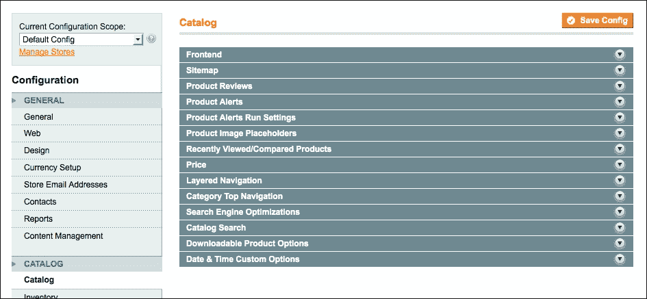

1.  打开前端部分并设置以下值：

    +   **列表模式**：**网格（默认以网格或列表显示产品）**

    +   **网格页面上每页产品允许的值**：**12,24,36**

    +   **网格页面上每页产品默认值**：**24**

        ### 注意

        在更改网格页面的允许和默认值时，确保数字可以被每行的产品数量整除。否则，页面上的产品数量将无法适应网格。

    +   **列表页面上每页产品允许的值**：**10,20,30,40**

    +   **列表页面上每页产品默认值**：**10**

    +   **每页允许所有产品**：**否**

        ### 注意

        当你有大量产品时，不建议将**允许每页所有产品**选项设置为**是**。当你有 2,000 个产品，并且你想要在单页上显示所有产品时，你会生成大量的 HTML 输出，这可能导致内存问题。

    +   **产品列表排序方式**：**价格**

    +   **使用扁平目录分类**：**否**

    +   **使用扁平目录产品**：**否**

        ### 注意

        前面两个设置（**使用扁平目录分类**和**使用扁平目录产品**）的目的是在第五章中解释的*使用 EAV 表*配方中，*数据库概念*。

    +   **在产品和分类中允许动态媒体 URL**：**是**

1.  在**网站地图**部分设置以下值：

    +   **使用类似树状结构的分类网站地图**：**是**

    +   **每页最小行数**：**30**

    此设置将更改网站地图页面的外观。您可以在`catalog/seo_sitemap/category`中找到它。

1.  启用访客的产品评论。这允许每个人都可以对产品进行评论。当启用时，评论表单将出现在产品评论页面上。

1.  打开**产品警报设置**部分以配置当价格或库存变化时发送的产品警报电子邮件。

    我们将配置以下设置的库存警报：

    +   **允许当产品价格变化时发出警报**：**否**

    +   **允许当产品库存变化时发出警报**：**是**

    ### 注意

    之前的配置将发送库存警报电子邮件（当产品有库存时触发库存警报）到订阅的电子邮件地址。

1.  我们可以在下一节中设置**产品警报运行设置**的值。我们将配置一个每天凌晨 4 点发送警报电子邮件的日常任务：

    +   **频率**：**每日**

    +   **开始时间**：**04:00:00**

1.  保持产品图像占位符不变。在这里，我们可以设置一个默认图像，当产品没有图像或图像未找到时将显示该图像。最佳方式是在主题中设置占位符图像。

1.  在**最近查看/比较的产品**选项卡中，设置以下值：

    +   **显示当前**：**网站**

        ### 注意

        这将显示您在网站的所有商店和商店视图中最近查看的产品。

    +   **默认最近查看计数**：**5**

    +   **默认最近比较计数**：**5**

1.  在**价格**选项卡中，将**目录价格范围**设置为**全局**。对于本教程，我们不需要为每个商店视图设置不同的价格。当**价格范围**设置为**全局**时，我们只能为不同商店视图中的产品配置一个价格。

1.  在**分层导航**部分，我们将修改一些设置以自定义类别页面的左侧导航。

    +   **显示产品计数**：**是**

    +   **价格范围**：**均衡价格范围**

    通过设置此选项，价格阶梯将始终具有相同的增量。

1.  将顶级导航**类别**设置为**3**。这意味着导航的最大深度为三个级别。

1.  跳过**搜索引擎优化**选项。我们将在*更改产品页面 URL*菜谱中查看它

1.  按以下方式配置**目录/搜索**部分：

    +   **最小查询长度**：**3**

    +   **最大查询长度**：**128**

    +   **最大查询词数**：**10**

    +   **搜索类型**：**类似**

    您可以将此设置为全文，以获得更好的结果，但性能可能不是很好。之前的设置配置了 Magento 的搜索行为。

1.  不要忘记保存配置。

## 它是如何工作的...

所有这些设置都保存在 Magento 的配置表中。目录页面的前端文件将获取这些设置并根据这些设置渲染输出。

当你在类别页面添加额外功能时，你可以通过额外参数轻松扩展配置。有关扩展配置的更多信息，请参阅第七章中的*扩展系统配置*配方，*Magento 后端*。

# 与属性集一起工作

Magento 有一个灵活的系统来处理产品。例如，当你出售一个桌面游戏和一台电脑时，每个产品的规格都不同。假设我想为桌面游戏配置一个年龄，为电脑配置一个屏幕分辨率。在这种情况下，这些事情由**属性**和**属性集**来处理。

当你创建产品时，你必须首先选择一个属性集（具有特定属性），然后才能输入其他数据。

## 准备工作

前往后端，并导航到**目录** | **属性** | **管理属性**和**目录** | **属性** | **管理属性集**。

我们将在这些页面上创建一些额外的属性和一个属性集。

## 如何操作...

在接下来的步骤中，我们将创建额外的产品属性，我们可以使用属性集来使用这些属性：

1.  在**管理属性**页面上创建一个新的属性。

1.  在点击**新建属性**后，按照以下方式填写表单：

    +   **属性代码**：**available_from**（在数据库和函数中使用的属性代码）

    +   **范围**：**商店视图**（此设置添加了为每个商店视图指定单独值的能力）

    +   **商店所有者目录输入类型**：**日期**（这是属性的类型）

    +   **默认值**：空

    +   **唯一值**：**否**

    +   **值必需**：**否**

    +   **应用至**：**所有产品类型**

    +   **在快速搜索中使用**：**否**（此选项在执行快速搜索时搜索属性值）

    +   **在高级搜索中使用**：**否**（此选项使属性在**高级搜索**选项中可供搜索）

    +   **前端可比较**：**否**（此选项在产品比较工具中显示属性）

    +   **用于促销规则条件**：**否**

    +   **位置**：空

    +   **前端产品视图页面可见**：**是**（此选项在产品页面上显示属性值）

    +   **用于产品列表**：**否**（此选项使属性值在类别页面上可用）

    +   **用于产品列表排序**：**否**（此选项使属性在类别页面上可用于排序）

1.  在**管理标签/选项**字段中，填写前端标签。

1.  点击**保存属性**，属性将被保存。

1.  通过导航到**目录** | **属性** | **管理属性集**来创建一个新的属性集。

1.  按照以下方式填写表单并点击**保存属性集**：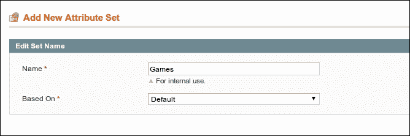

1.  属性集概述打开。在此页面上，你可以将属性拖放到适当的组中。

1.  创建一个名为`Game specific data`的组，并将**available_from**、**memory**和**processor**属性拖放到其中。

    概览将如下所示：

    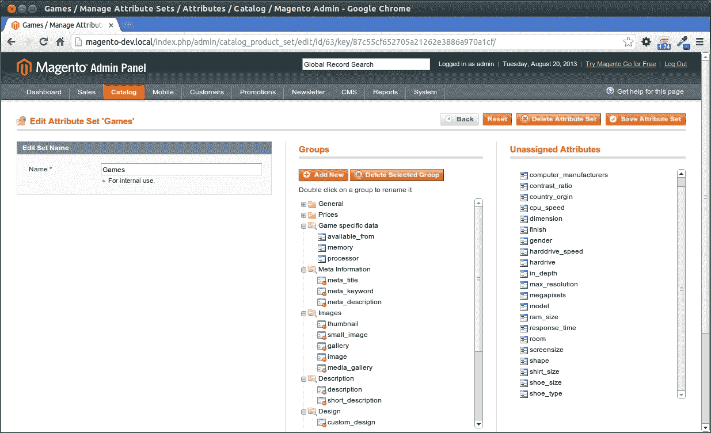

1.  保存属性集。

1.  在**目录**下的**管理产品**中创建一个新的产品，并输入以下配置：

    +   **属性集**：**游戏**

    +   **产品类型**：**简单产品**

1.  点击**继续**。

    你将看到特殊游戏属性现在在**游戏特定数据**选项卡中可用：

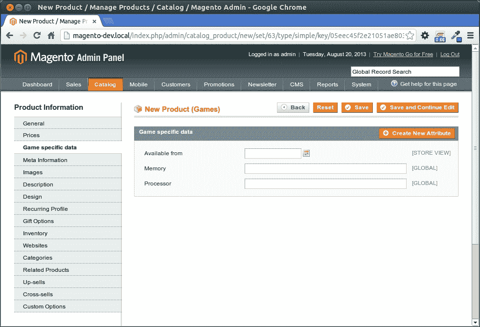

## 工作原理...

当你处理多个产品系列时，会使用属性和属性集。在我们的商店样本数据中，有更多属性集可供相机、电脑、衬衫、鞋子等使用。

通过属性集，你可以将一个系列的属性分组在一起。

在创建新属性时，你必须指定属性的类型。以下类型具有不同的输入和输出：

+   **文本字段**

+   **文本区域**（多行文本字段）

+   **日期**

+   **是** / **否**

+   **多选**

+   **下拉菜单**

+   **价格**

+   **媒体图片**

+   **固定产品税**（这用于额外的税，如作者税）

    ### 小贴士

    当你在分类页面的左侧导航中使用属性作为过滤器时，此属性必须具有**下拉菜单**、**多选**或**价格**类型。

# 处理产品类型

在 Magento 中，你可以创建不同类型的产品。标准产品是简单产品。此类产品用于销售基本产品。然而，还有其他产品类型，你可以选择选项或尺码。

## 准备工作

我们将创建一个可配置的产品。例如，你想购买一双鞋，可以选择它们的尺码和颜色。打开你的后端，导航到**目录** | **管理产品**。

## 如何操作...

在以下步骤中，我们将创建一个产品（鞋子），我们可以在产品详情页上指定它们的尺码：

1.  当你点击**添加产品**按钮时，选择以下配置：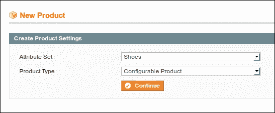

1.  当我们点击**下一步**时，我们必须选择要配置的属性。此产品必须在**鞋码**属性上可配置。选择复选框并点击**继续**。

1.  填写所需的属性，并通过点击**保存并继续编辑**来保存产品。

    ### 小贴士

    要使产品在商店中可见，请检查**网站**、**状态**、**可见性**、**分类**和**库存**属性。

1.  导航到**关联产品**选项卡，我们将创建子产品。

1.  通过在**快速简单产品创建**部分添加以下配置，我们将添加五个子产品：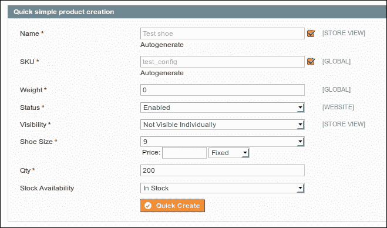

1.  点击**快速创建**按钮，并重复四次，每次使用不同的鞋码。

1.  当一切顺利时，**超级产品属性配置**部分将如下所示：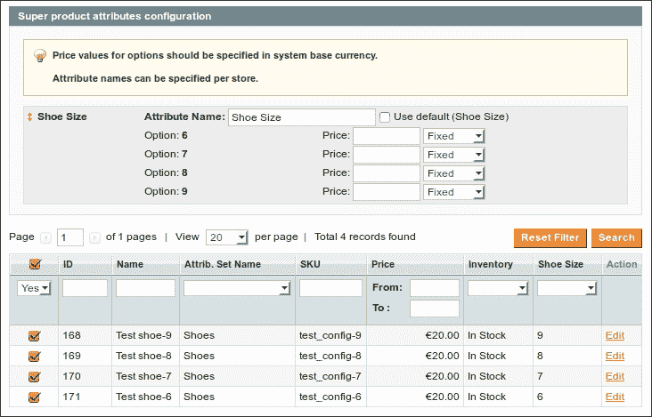

1.  点击**保存并继续**按钮，产品将被保存。

1.  导航到前端并搜索我们刚刚创建的产品。当我们处于产品详情页面时，您将看到一个下拉菜单，您可以在其中选择我们刚刚创建的选项。

## 它是如何工作的...

可配置产品是一种在添加到购物车之前必须配置选项的产品。客户将在购物车中看到可配置产品，但在后台也会添加一个简单产品到购物车中。

正是因为这个原因，我们必须创建简单产品来作为可配置产品的选项。可配置产品是父产品，用于在前端显示子产品。当产品售出时，所选子产品的 SKU 将被用于处理订单。这就是为什么库存是在子产品上配置的原因。

## 更多内容...

在 Magento 中，您可以创建六种类型的产品。以下部分简要介绍了不同产品类型可以实现的功能。

### 简单产品

简单产品就是您可以在您的网店中销售的产品。在 Magento 中，每个产品都有一个唯一的 ID（**SKU**），它通常与供应商的商品代码具有相同的值。

### 可配置产品

在这个菜谱中，我们创建了一个可配置产品。该产品有子产品，您可以在产品详情页面上进行配置（例如，配置大小）。子产品是简单产品。

### 捆绑产品

捆绑产品类似于可配置产品，但您可以使用更多的（可选）选项。要找到一个捆绑产品的良好例子，您可以访问**电子产品** | **电脑** | **自行组装**。这个分类中的产品是捆绑产品。

### 组合产品

组合产品是一种表示一组产品的产品，您可以指定子产品的数量。一个很好的例子可以在**家具** | **Magento 红家具套装**中找到。

### 虚拟产品

虚拟产品就像一个简单的产品，但它不是实物。它没有库存，也不能发货。在样本数据中，样本商店捆绑产品的保修就是虚拟产品的良好例子。

### 可下载产品

可下载的产品是一种非实物产品。当客户购买此类产品时，他们将收到一个下载链接，可以下载他们的产品，如 PDF、ZIP、MP3 或其他类型的文件。

# 添加 Facebook 点赞按钮

这些天，在您的网站上显示 Facebook `like`按钮已成为一种时尚，这样访客就可以与他们的朋友分享页面。

在这个菜谱中，我们将把`like`按钮添加到每个产品页面。

## 准备工作

打开您的浏览器并转到产品页面。在您的 IDE 中打开您的配置主题文件夹。

## 如何操作...

在接下来的步骤中，我们将生成并添加 Facebook `like`按钮的代码到产品详情页面：

1.  从您的主题中打开`catalog/product/view.phtml`模板。如果它不在主题中，请从`app/design/frontend/base/default`文件夹中复制它。

1.  从[`developers.facebook.com/docs/reference/plugins/like`](http://developers.facebook.com/docs/reference/plugins/like)进入，您可以使用**配置器**页面来定制您页面的“赞”按钮，如图所示：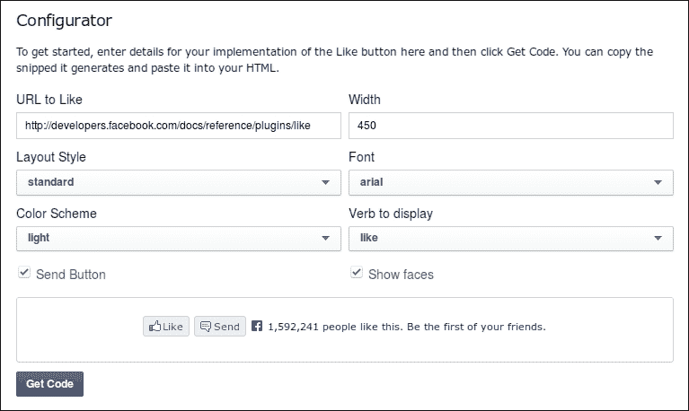

1.  将代码粘贴到您的`view.phtml`文件中，使其更易于阅读；例如，在文件的末尾作为`div`标签的子标签，该标签具有`product-collateral`类。

1.  重新加载产品页面，将显示“赞”按钮。

1.  要更改“赞”按钮的 URL，请更改 HTML5 代码中的`data-href`属性。以下代码显示了如何使用产品页面 URL 进行此操作：

    ```php
    <div class="fb-like" 
         data-href="<?php echo Mage::helper('core/url')->getCurrentUrl() ?>" 
         data-layout="standard" 
         data-action="like" 
         data-show-faces="true" 
         data-share="true">
    </div>
    ```

1.  在使用 HTML5 代码时，不要忘记包含 JavaScript SDK。

## 它是如何工作的...

Facebook 的“赞”按钮是您可以嵌入您网站中的社交插件之一。在 Facebook 上，每个 URL 都是一个您可以点赞或评论的对象。您可以从以下 URL 找到有关可用社交插件的更多信息：

[`developers.facebook.com/docs/plugins/`](https://developers.facebook.com/docs/plugins/)

在本教程中，我们介绍了 Facebook“赞”按钮的添加，但当你想要添加其他社交媒体网站（如 Twitter 或 Google Plus）的按钮时，您可以访问以下 URL：

+   [`developers.google.com/+/web/+1button/`](https://developers.google.com/+/web/+1button/)

+   [`about.twitter.com/resources/buttons`](https://about.twitter.com/resources/buttons)

## 还有更多...

当您喜欢您网站的页面时，Facebook 将根据页面的 HTML 标记生成一个墙贴。当您喜欢一个页面时，Facebook 将在您的墙上发布该项目的图片、标题和描述。

使用**Open Graph**（**og**）`meta`标签，您可以自定义这些内容。有关可用 og 标签及其使用方法的概述，请参阅[`developers.facebook.com/docs/opengraph/using-objects/`](https://developers.facebook.com/docs/opengraph/using-objects/)。

# 通过查询字符串添加产品到购物车

在某些用例中，当访客直接将产品添加到购物车时，您将链接访客到您的网站；例如，当您在外部网站上有一个带有**立即购买**按钮的活动时。

## 准备工作

使用您的商店打开浏览器，并在后端导航到**目录** | **管理产品**。

## 如何操作...

在接下来的步骤中，我们将创建一个 URL，在该 URL 中，产品将被添加到购物车：

1.  在您的前端找到您想要添加到购物车的产品。例如，导航到**家具** | **客厅** | **脚凳**。

1.  在后端找到此产品并记住其 ID。

1.  要添加产品，我们必须使用产品 ID 作为`GET`参数调用`checkout/cart/add` URL。因此，最终的 URL 将是`http://magento-dev.local/checkout/cart/add?product=51`。

1.  在调用此 URL 时，您将被重定向到包含此产品一个项目的购物车页面。

1.  当你在查询中添加`qty`参数时，你可以将同一产品的多个项目添加到购物车中。调用`http://magento-dev.local/checkout/cart/add?product=51&qty=3` URL，你将看到有三个产品被添加到购物车中。

### 小贴士

无法将两个或更多不同产品添加到购物车中，并使用相同的查询。如果你想这样做，你可以创建一个分组产品。

## 它是如何工作的...

如果我们监控我们商店中的`添加到购物车`动作，我们将看到前端对`checkout/cart/add`动作的`GET`或`POST`请求。如果请求有效，这个动作将转发到购物车页面。

## 更多内容...

添加一个简单产品很容易，但如果我们想添加一个分组、可配置或捆绑产品，查询字符串就会稍微复杂一些。

要知道必须发送到`add`动作的参数，我们必须使用 Firebug 进行调试。在**网络面板**中，如图所示，你可以调试请求：

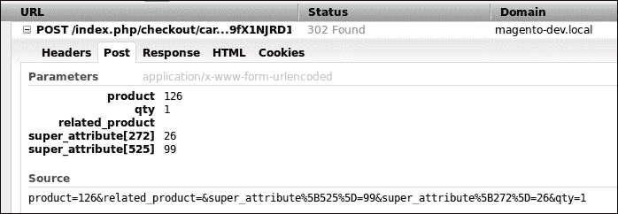

上一张截图显示了可配置产品的`POST`参数。

# 嵌入 YouTube 视频

在产品描述中，我们可以添加 HTML 标签，这样我们就可以使用`<object>`标签将 YouTube 视频嵌入到产品的描述中。

## 准备工作

前往[`www.youtube.com`](http://www.youtube.com)，选择你想要添加到产品描述中的视频。

## 如何操作...

下一个步骤将展示如何在产品详情页面上嵌入 YouTube 视频：

1.  在 YouTube 视频页面上，点击**嵌入**按钮。当你点击这个按钮时，以下屏幕会出现：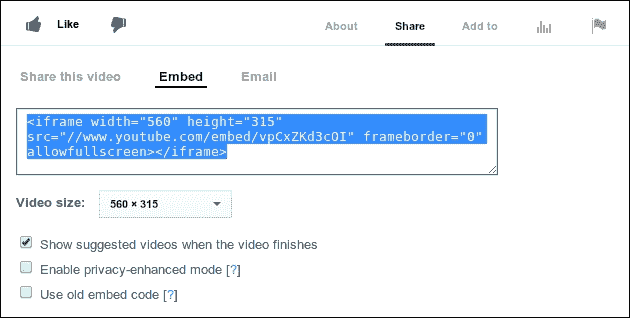

1.  复制 HTML 代码并将其粘贴到产品的描述中。

1.  保存产品。

1.  前往前端的产品页面。你将在产品页面上看到视频。

## 它是如何工作的...

在产品描述中使用 HTML 标签的能力为这个字段提供了很多灵活性。可以使用**所见即所得**编辑器来编辑内容，因为这允许我们使用如 YouTube 视频或其他第三方小部件等小部件。

# 更改产品页面的 URL

当你在产品页面上时，每个产品的 URL 总是看起来很干净。URL 中的名称使其非常 SEO 友好。

在这个食谱中，我们将探讨 Magento 中**URL 重写**的可能性以及它是如何工作的。

## 准备工作

从后端的**产品管理**页面进入**目录**。打开一个产品并查看**URL 键**属性。这个食谱基于**HTC Touch Diamond**产品。

## 如何操作...

在接下来的步骤中，展示了你如何更改产品页面的 URL：

1.  在前端找到合适的产品并查找 URL。在这种情况下，这将是一个`/htc-touch-diamond.html`。

1.  在后端，将**URL 键**属性更改为**buy-now-htc-touch-diamond**。

1.  在前端重新加载产品。URL 将更改为我们在后端输入的新 URL。

    ### 小贴士

    当你选择**为旧 URL 创建永久重定向**复选框时，Magento 将为产品的旧 URL 创建一个永久 301 重定向响应。该复选框位于产品**编辑**页面下的**URL 键**属性中。

1.  在后端清空**URL 键**属性并再次保存产品。你会发现 Magento 会根据产品的名称自动生成**URL 键**值。

1.  在后端，转到**系统** | **配置** | **目录** | **搜索引擎优化**。清空**产品 URL 后缀**字段并保存配置。

1.  通过导航到**系统** | **缓存管理**来清除缓存。

1.  通过导航到**系统** | **索引管理**来重新索引**产品 URL 重写**索引。在重新索引过程中，URL 将在`core_url_rewrite`数据库表中生成。

1.  在前端重新加载产品，你会看到`.html`后缀已经消失。

## 它是如何工作的...

在 Magento 中，有一个 URL 重写系统，它将 SEO 友好的 URL 映射到该请求的系统 URL。你可以在后端看到所有的 URL 重写。导航到**目录** | **URL 重写管理**，你将看到 Magento 将为控制器操作映射的完整 URL 列表。例如，当我们搜索`htc-touch-diamond`时，我们将看到一个包含所有这些键的 URL 列表。

我们看到的是以下内容：

+   永久 301 重定向响应（**选项**列中的值为**RP**的行。RP 代表永久重定向。）

+   产品 URL。

+   类别产品 URL。

每个商店视图都会重新生成所有 URL。当一个产品在多个商店中启用时，一个产品有多个 URL 是正常的。

## 还有更多...

在 URL 重写页面上，也可以添加自定义 URL 重写；例如，为联系页面添加 URL 重写。

在添加如下截图所示的配置时，你将为英文商店视图创建`/sitemap.html`的重写：

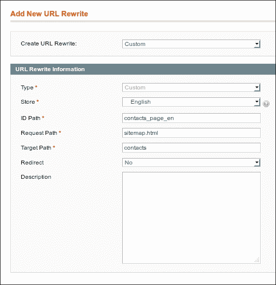

+   在**商店**下拉菜单中，你可以配置 URL 重写的商店。

+   在**ID 路径**字段中，设置了 URL 重写的 ID。你必须为这个输入一个唯一的名称。

+   **请求路径**字段中的值是你想要重写的路径。在这种情况下，我们想要在`/sitemap.html`路径上重写某些内容。

+   **目标路径**字段中的值是请求将结束的路径。在这种情况下，它是**联系**页面。

+   如果**重定向**下拉菜单中的值设置为**是**，你可以选择将 301 重定向到目标。当它设置为**否**时，目标页面将在请求路径上渲染（因此页面的 URL 不会改变）。
