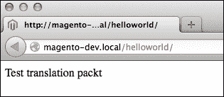
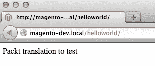

# 第四章. 创建模块

在本章中，我们将涵盖以下主题：

+   创建文件

+   注册块、助手和模型

+   添加新页面

+   添加布局文件

+   添加翻译文件

+   添加新产品的块

+   重写核心类

# 简介

当你查看 Magento 的核心代码时，你会看到模块化架构。每个概念都存储在一个模块中。Magento 是所有核心模块的组合。模块化架构的优势在于其可扩展性。添加扩展或重写核心的模块很容易。

在本章中，我们将创建一个模块，使用你扩展 Magento 所需了解的最重要的事项。

# 创建文件

当你想创建一个模块时，第一步是创建注册模块所需的文件和文件夹。在本食谱的末尾，我们将有一个已注册但没有任何功能的模块。

## 准备工作

打开你的 IDE 并导航到 `app/code/local` 文件夹。如果本地文件夹不存在，创建 `app/code/local` 文件夹。

## 如何操作...

在以下步骤中，我们将创建注册 Magento 模块所需的文件。

1.  在 `app/code/local` 中创建模块，通过创建以下文件夹：

    +   `app/code/local/Packt`

    +   `app/code/local/Packt/Helloworld`

    +   `app/code/local/Packt/Helloworld/etc`

    `Packt` 是模块的命名空间，`Helloworld` 是模块的名称。

1.  通过在 `app/etc/modules` 文件夹中创建 `Packt_Helloworld.xml` 文件来注册模块。在此文件中添加以下内容：

    ```php
    <?xml version="1.0"?>
    <config>
      <modules>
        <Packt_Helloworld>
          <active>true</active>
          <codePool>local</codePool>
        </Packt_Helloworld>
      </modules>
    </config>
    ```

1.  在模块的 `etc` 文件夹中创建主配置文件 `config.xml`。在文件中添加以下内容：

    ```php
    <?xml version="1.0" encoding="UTF-8"?>
    <config>
      <modules>
        <Packt_Helloworld>
          <version>0.0.1</version>
        </Packt_Helloworld>
      </modules>
    </config>
    ```

1.  通过访问后端检查模块的注册情况。转到 **系统** | **配置** | **高级** 并检查模块是否在列表中。确保你已经清除了 Magento 缓存。

### 小贴士

当你在命令行中运行 `wiz module-list` 命令时，你会看到所有模块的列表，包括版本、代码池等。你可以在 第一章 的 *配置开发工具* 食谱中找到有关 Wiz 命令行工具的更多信息。

## 工作原理...

Magento 有三个代码池。它们如下所示：

+   **核心**：核心池包含 Magento 代码的模块和类。不建议更改此目录中的文件，因为当 Magento 升级时，这些文件将被覆盖。

+   **社区**：社区池是为社区提供的 Magento 模块。它们大多是你可以从 Magento Connect 下载的免费模块。

+   **本地**：本地池是为自定义模块准备的，例如我们在这个食谱中创建的模块。

Magento 将首先在本地代码池中搜索代码。接下来，它将在社区代码池中查找，最后它将在核心代码池中查找。

# 注册块、辅助和模型

当我们想要在我们的模块上执行操作时，我们必须使用块、模型和辅助。在这个菜谱中，我们将使用正确的类前缀注册这些对象类型。

## 准备工作

打开`Packt_Helloworld`模块的`config.xml`文件。此文件位于`app/code/local/Packt/Helloworld/etc/config.xml`。

## 如何操作...

在以下步骤中，我们将向模块添加配置以注册块、辅助和模型：

1.  通过在`config.xml`文件中添加以下配置来注册块。将以下 XML 代码作为`<config>`标签的子标签添加：

    ```php
    <global>
      <blocks>
        <helloworld>
          <class>Packt_Helloworld_Block</class>
        </helloworld>
      </blocks>
    </global>
    ```

1.  创建`app/code/local/Packt/Helloworld/Block`文件夹。

1.  重复步骤 1 和步骤 2 以注册辅助和模型。你的全局标签将类似于以下代码所示：

    ```php
    <global>
      <blocks>
        <helloworld>
          <class>Packt_Helloworld_Block</class>
        </helloworld>
      </blocks>
      <helpers>
        <helloworld>
          <class>Packt_Helloworld_Helper</class>
        </helloworld>
      </helpers>
      <models>
        <helloworld>
          <class>Packt_Helloworld_Model</class>
        </helloworld>
      </models>
    </global>
    ```

1.  创建`app/code/local/Packt/Helloworld/Helper`和`app/code/local/Packt/Helloworld/Model`文件夹。

1.  通过将以下内容添加到`app/code/local/Packt/Helloworld/Helper/Data.php`文件中，创建模块的辅助类：

    ```php
    <?php
    class Packt_Helloworld_Helper_Data extends Mage_Core_Helper_Abstract
    {

    }
    ```

    辅助类总是从核心辅助类扩展，以使用该类中声明的函数。

1.  使用以下命令通过 Wiz 命令行工具测试您的配置：

    ```php
    wiz devel-models
    ```

    你将看到你的注册模型在 Magento 安装中可用。

### 小贴士

当你在配置 XML 文件中更改某些内容时，确保在测试配置之前清除 Magento 缓存。否则，更改将没有效果，因为旧配置被缓存了。

## 它是如何工作的...

当这些对象被注册后，我们可以在`Block`、`Helper`和`Model`文件夹中创建类。这些对象中的类名需要遵循以下命名约定；否则，它们将无法找到：

`<Vendor Namespace>_<Modulename>_<Objectype>_<Classname>`

以`app/code/<codepool>`开头的每个文件夹名都用于类名中，由下划线分隔。最后一部分是文件名。`Model`、`Block`和`Helper`文件夹中的每个文件夹或文件都以大写字母开头。

我们的帮助类位于`app/code/local/Packt/Helloworld/Helper`，因此类名为`Packt_Helloworld_Helper_Data`。

要加载一个模型，我们必须使用`Mage::getModel()`函数。在第一个参数中，我们必须指定类名，这与实际类名不同。要指定`Packt_Helloworld_Model_Sample`类，我们必须使用`Mage::getModel('helloworld/sample')`来获取该模型的实例。

我们已将我们的模型注册为`helloworld`。`Model`文件夹中模型的名称是`sample`。当你查看之前讨论的`getModel()`函数时，你会看到`helloworld`和`sample`这两个词在该函数的参数中。

获取辅助和块使用相同的语法。对于辅助，我们必须使用`Mage::helper()`函数。对于块，这种语法用于布局 XML 文件或当我们使用核心函数处理块时。

# 添加新页面

现在，我们将对我们的模块做一些可见的操作。我们将向我们的 Magento 商店添加一个页面，我们可以用它来执行多个目的。

## 准备工作

我们必须在`config.xml`文件中添加一些配置，我们还将创建一个控制器文件。

## 如何操作...

在以下步骤中，我们将通过在`Packt_Helloworld`模块中添加额外的配置来向 Magento 安装中添加一个额外的页面：

1.  打开你的 IDE 并导航到`module`文件夹。

1.  在模块的`config.xml`文件的`config`标签下添加以下配置：

    ```php
    <frontend>
      <routers>
        <helloworld>
          <use>standard</use>
          <args>
            <module>Packt_Helloworld</module>
            <frontName>helloworld</frontName>
          </args>
        </helloworld>
      </routers>
    </frontend>
    ```

1.  要创建控制器文件，我们将在`folder app/code/local/Packt/Helloworld/controllers/`中创建一个`IndexController.php`文件。

1.  在这个控制器文件中添加以下内容。这将创建`IndexController`类中的两个操作：

    ```php
    <?php
    class Packt_Helloworld_IndexController extends Mage_Core_Controller_Front_Action
    {
      public function indexAction() 
      {

      }
      public function helloAction()
      {
        echo 'Action hello in Helloworld IndexController';
      }
    }
    ```

1.  清除缓存并测试以下位置的控制器：

    +   `http://magento-dev.local/helloworld/index/hello`，对于`helloAction`函数

    +   `http://magento-dev.local/helloworld`，对于`indexAction`函数

    `helloAction()`函数将显示我们在`echo`语句中设置的字符串。`indexAction()`函数是一个空白页面，因为我们在这个操作中没有添加更多的代码。

## 它是如何工作的...

Magento 控制器的语法如下所示：

`<modulename or frontname>/<controllerName>/<actionName>`

在我们的例子中，模块名称和前端名称是`helloworld`，控制器名称是`index`，操作名称是`hello`，因此我们得到`/helloworld/index/hello`。

当类名以单词`Controller`结尾时，Magento 会识别控制器文件。这就是为什么类名是`IndexController`的原因。

同样的规则适用于控制器操作。函数的名称需要以单词`Action`结尾。`Action`之前的部分是操作的名称。名为`helloAction()`的函数会导致 URL 中的`hello`部分。

### 小贴士

在编写控制器和操作的名称时，确保你跟踪类和函数名称的首字母大写。如果你遗漏了一些大写字母，你的代码将无法工作。

## 更多内容...

当我们测试控制器操作时，我们会看到一个空白页面。这并不错误，因为控制器操作中没有添加任何逻辑。

如果我们想看到商店的前端，我们必须使用以下代码：

```php
$this->loadLayout();
$this->renderLayout();
```

这将启动布局系统，该系统将加载布局指令。通常不推荐在 POST 操作中加载前端，因为我们想要处理 POST 并继续到下一页。

# 添加布局文件

在这个菜谱中，我们将使用自定义布局 XML 文件来定制我们之前创建的页面的前端。

## 准备工作

为了添加布局文件，我们必须在模块的`config.xml`文件中添加一些配置，以及一个布局 XML 文件。

## 如何操作...

在以下步骤中，我们将学习如何向 Magento 模块添加布局文件。

1.  将以下配置添加到您的 `config.xml` 文件中，以初始化布局 XML 文件。将其添加为 `<frontend>` 标签的子标签：

    ```php
    <layout>
      <updates>
        <helloworld>
          <file>helloworld.xml</file>
        </helloworld>
      </updates>
    </layout>
    ```

1.  在您的主题布局文件夹中的 `app/design/frontend/<package>/<theme>/layout/helloworld.xml` 目录中创建 `helloworld.xml` 文件。

1.  在 `helloworld.xml` 文件中，添加以下内容以测试文件是否已加载：

    ```php
    <?xml version="1.0" encoding="UTF-8"?>
    <layout>
      <default>
        <remove name="header" />
      </default>
    </layout>
    ```

1.  在前端重新加载页面。之前的配置将从每个前端页面中删除标题。

1.  从 `<default>` 标签中删除内容并在布局 XML 文件中创建 `helloworld_index_hello` 处理。您可以通过将以下 XML 代码作为 `<layout>` 标签的子标签添加来实现这一点：

    ```php
    <helloworld_index_hello>

    </helloworld_index_hello>
    ```

1.  对于这个页面，我们将配置 `2columns-right` 布局。为此，在布局 XML 文件中将以下配置作为 `helloworld_index_hello` 处理的子标签添加：

    ```php
    <helloworld_index_hello>
      <reference name="root">
        <action method="setTemplate">
          <template>page/2columns-right.phtml</template>
        </action>
      </reference>
    </helloworld_index_hello>
    ```

1.  在控制器的 `helloAction()` 函数中添加以下代码以启动布局系统：

    ```php
    $this->loadLayout();
    $this->renderLayout();
    ```

1.  清除 Magento 缓存并导航到 `http://magento-dev.local/helloworld/index/hello` 页面。您将看到一个向右的列。

## 它是如何工作的...

如果您只在 `app/design/frontend/<package>/<theme>/layout` 文件夹中放置一个 `layout.xml` 文件，它将不会被 Magento 加载。为此，我们必须在我们的模块的 `config.xml` 文件中进行配置，就像在这个教程中所做的那样。

布局 XML 文件（`helloworld.xml`）与其他所有布局文件一样工作，如第二章所述，*主题化*。

## 更多...

添加自定义布局 XML 文件为扩展您的安装提供了很多可能性。将 XML 文件复制到您的主题并更改所需的设置是最简单的方法。然而，如果您愿意，可以添加一个自定义布局文件并操作该文件中的块。

这种方法的目的是避免双重编码。关于模块化主题化这种方式的良好参考可以在 [`www.classyllama.com/development/magento-development/the-better-way-to-modify-magento-layout`](http://www.classyllama.com/development/magento-development/the-better-way-to-modify-magento-layout) 找到。

# 添加翻译文件

在 Magento 中，您可以在多种语言中运行商店，这样您的模块就可以翻译成配置的语言。在本教程中，我们将向我们的模块添加一个自定义的翻译 CSV 文件，以便在需要时放置自定义字符串。

## 准备工作

对于这个教程，我们必须在我们的模块的 `config.xml` 文件中添加一些配置。此外，我们还需要在 `locale` 文件夹中创建一个翻译 CSV 文件。

## 如何做...

在以下步骤中，我们将向模块添加配置，以便我们可以将界面翻译成多种语言：

1.  将以下配置作为 `helloworld` 模块的 `config.xml` 文件中 `<frontend>` 标签的子标签添加。这将初始化一个额外的 `translate` 文件到安装中：

    ```php
    <translate>
      <modules>
        <Packt_Helloworld>
          <files>
            <default>Packt_Helloworld.csv</default>
          </files>
        </Packt_Helloworld>
      </modules>
    </translate>
    ```

1.  我们刚刚配置了我们的模块以使用`Packt_Helloworld.csv`文件。在`app/locale/en_US`文件夹中创建此文件。

1.  在控制器中创建一个测试翻译。在`IndexController`的`indexAction()`函数中添加以下行：

    ```php
    echo $this->__('Test translation packt');
    ```

1.  前往适当的页面（`http://magento-dev.local/helloworld`）。你会看到**Test translation packt**被打印出来，如下截图所示：

1.  在`Packt_Helloworld.csv`文件中添加以下内容：

    ```php
    "Test translation packt","Packt translation to test"
    ```

1.  清除缓存并重新加载页面。你会看到输出已更改为**Packt 翻译测试**，如下截图所示：



## 它是如何工作的...

现在，我们将讨论 Magento 中翻译函数的行为。

当调用`__('translate string')`函数时，Magento 将在以下资源中搜索翻译字符串：

+   数据库表中的`core_translate translate.csv`文件，位于`app/design/frontend/<package>/<theme>/locale`文件夹中

+   翻译位于`app/locale/<language>`的文件

如果当前语言没有找到匹配的字符串，Magento 将返回`translate`函数的第一个参数中存在的字符串。

如果在资源中找到一个字符串，Magento 不会进一步搜索该字符串。这意味着在`core_translate`表和`translate.csv`文件中的字符串将从数据库中加载。

`translate`函数通常通过使用`$this->__()`在当前对象上调用，但这始终指向该对象的`helper`函数。如果`$this->__()`不起作用（通常当你在一个不扩展抽象块、helper 或模型的类中时），你必须直接从模块的`helper`类中调用`translate`函数，如下面的代码所示：

```php
Mage::helper('<module name>')->__('…')
```

# 添加新产品块

模块现在已准备好进行实际工作。在先前的菜谱中，我们用最常见的特点配置了模块。在这个菜谱中，我们将向之前创建的页面添加一个新产品块。

## 准备工作

要创建一个自定义块，我们必须在`Packt_Helloworld`模块的`Block`文件夹中创建一个`Block`类，一个布局指令以将块添加到我们的页面，以及一个在主题中的`phtml`模板来样式化块的 HTML 输出。

## 如何操作...

以下步骤描述了如何将带有新产品块的块添加到前端：

1.  在`app/code/local/Packt/Helloworld/Block`中创建`block`类。类的名称是`Newproducts`，因此我们必须在此文件夹中创建一个`Newproducts.php`文件。

1.  在文件中添加以下内容。这将创建一个扩展`Mage_Core_Block_Template`类的类。如果指定，此类将输出一个模板：

    ```php
    <?php
    class Packt_Helloworld_Block_Newproducts extends Mage_Core_Block_Template
    {

    }
    ```

1.  将模板添加到您的主题`template`文件夹中。这位于`app/design/frontend/<package>/<theme>/template/helloworld`文件夹中。在此文件夹中创建`newproducts.phtml`文件。

1.  在这个文件中添加一些 HTML 内容，例如`<h2>New Products</h2>`。

1.  通过在`helloworld_index_hello`处理程序中添加以下 XML 代码来在`helloworld.xml`布局文件中创建一个块：

    ```php
    <reference name="content">
      <block type="helloworld/newproducts" name="block_newproducts" template="helloworld/newproducts.phtml" />
    </reference>
    ```

1.  清除缓存并转到`http://magento-dev.local/helloworld/index/hello`页面。你将在网站的内容中看到**新产品**标题。

1.  在`block`类中创建`getProducts()`函数。这个函数将返回商店中的五个最新产品。`getProducts()`函数的代码如下：

    ```php
    public function getProducts() 
    {
      $products = Mage::getModel('catalog/product')->getCollection()
        ->addAttributeToSelect('*')
        ->setOrder('created_at')
        ->setPageSize(5);

      return $products;
    }
    ```

    在这个函数中，我们将对产品集合执行查询。我们按日期排序并限制结果为`5`，以便我们得到最新的五个产品。

1.  在模板中调用`getProducts()`函数，并通过循环产品来打印它们。模板代码如下：

    ```php
    <h2>New Products</h2>
    <ul>
    <?php foreach ($this->getProducts() as $_product): ?>
      <li><?php echo $_product->getName() ?></li>
    <?php endforeach; ?>
    </ul>
    ```

## 它是如何工作的...

在这个菜谱中，我们所做的是对标准 Magento 的基本扩展。我们创建了一个自定义块。这个块被放置在模块创建的自定义页面上。

在这个块中，有一个返回五个最新产品的函数，并且会执行查询来获取这些产品。这不是通过 SQL 完成的，而是通过使用 Magento 集合。

使用这个的目的在于获得一个简单的接口来返回正确的实体。由于产品不是存储在一个数据库表中，这可以节省你编写一个非常复杂的 SQL 查询。

# 重写核心类

在某些情况下，你可能想要更改关于 Magento 标准行为的某些内容。当你看到一些你想要更改的核心类中的代码时，你必须遵循这个菜谱。

由于不建议在核心文件中进行更改，我们可以将类的路径重写为自定义的一个，它是原始类的一个父类。

## 准备工作

在这个菜谱中，我们将把核心产品模型重写为模块中的一个自定义类。

## 如何做...

在以下步骤中，我们将更改产品`getName()`函数的输出：

1.  `getName()`函数在产品详情页上被调用。导航到这个页面并打开`catalog/product/view.phtml`模板。

1.  当你在模板中搜索`getName()`时，你会看到这是在`$_product`变量上完成的。为了知道这个变量的类，你可以通过`echo get_class($_product)`来调试它。

1.  这个函数的输出返回`Mage_Catalog_Model_Product`类。为了重写它，我们必须在我们的`module`文件夹中创建一个扩展原始类的空类。在`app/code/local/Packt/Helloworld/Model/Catalog/`文件夹中创建一个`Product.php`文件。

1.  在那个文件中粘贴以下代码：

    ```php
    <?php

    class Packt_Helloworld_Model_Catalog_Product extends Mage_Catalog_Model_Product {

    }
    ```

    ### 小贴士

    当重写一个类时，最佳实践是遵循你模块中原有类的文件夹结构。在`Packt_Helloworld`模块的`model`文件夹中，我们从`Catalog`文件夹开始（指的是`Catalog`模块）。在这个文件夹中，你可以看到与原始模块相同的文件结构。

1.  当你清除缓存并重新加载前端时，你会看到 `get_class` 函数的输出没有改变。这是因为我们没有在 `config.xml` 文件中添加重写配置。打开 `config.xml` 文件，并将以下代码作为 `<models>` 标签的子标签粘贴：

    ```php
    <catalog>
      <rewrite>
        <product>Packt_Helloworld_Model_Catalog_Product</product>
      </rewrite>
    </catalog>
    ```

    ### 小贴士

    当你想重写一个 `block` 类时，你必须将类似的配置作为 `<blocks>` 标签的子标签粘贴。同样，对于 `helper`，将配置粘贴到 `<helpers>` 标签下。

1.  清除缓存并重新加载产品页面。你会看到 `get_class` 函数的输出已更改为我们刚刚创建的类。

1.  当新类被加载时，只需覆盖此文件中要更改的函数即可。当我们想要更改 `getName()` 函数时，我们必须在此类中添加旧函数并更改一些行为。当你将以下代码粘贴到类中时，产品的名称将会改变：

    ```php
    public function getName()
    {
      return 'Packt ' . $this->_getData('name');
    }
    ```

1.  重新加载产品页面，你会看到产品的名称以 **Packt** 开头。

## 它是如何工作的...

最佳实践是不要重写核心类，因为更改 Magento 的标准行为在某些情况下可能会破坏应用程序。一个更稳定的方法是与描述在 第八章 的 *事件处理器和计划任务* 中的事件处理器一起工作。

不幸的是，在某些情况下，无法使用事件进行操作。因此，你需要重写一个核心类。在这种情况下，你必须按照本食谱中描述的方式进行操作：

+   创建一个扩展原始类的空类

+   将函数粘贴到你想要更改的类中

+   在你的模块的 `config.xml` 文件中添加配置以重写核心类

当重写在 `config.xml` 类中添加时，当使用 Magento 函数调用类时，Magento 将会识别重写。对于一个模型，这是 `Mage::getModel()` 函数，其中第一个参数是模型的路径。

当直接在代码中调用类时，如 `$product = new Mage_Catalog_Model_Product()`，重写将不会生效，因为 `Mage_Catalog_Model_Product` 类返回了一个实例。
